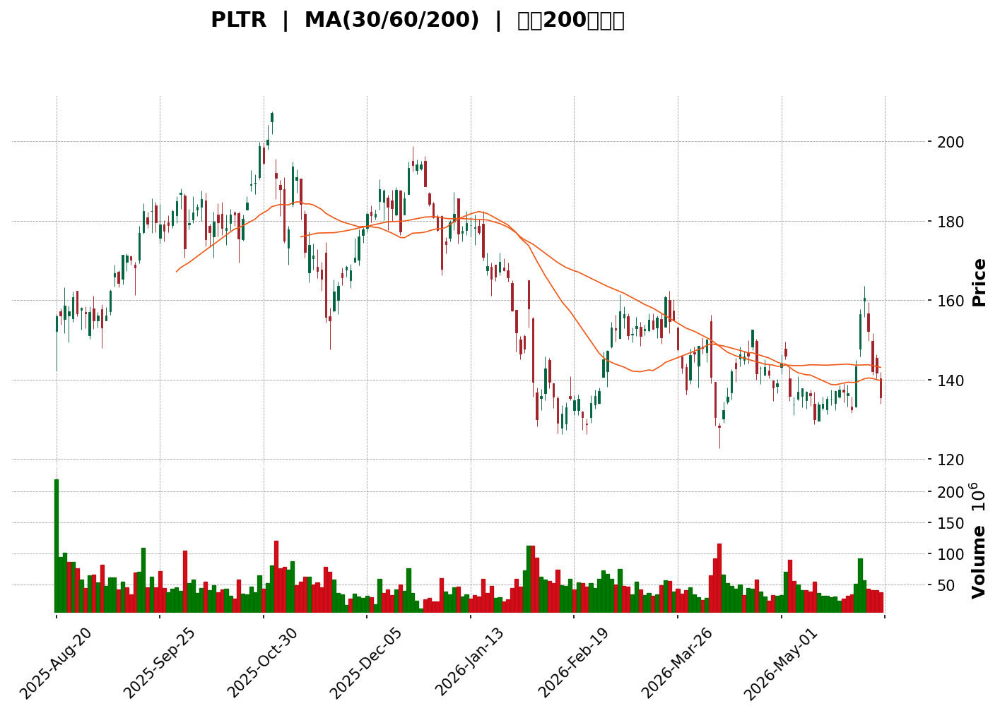
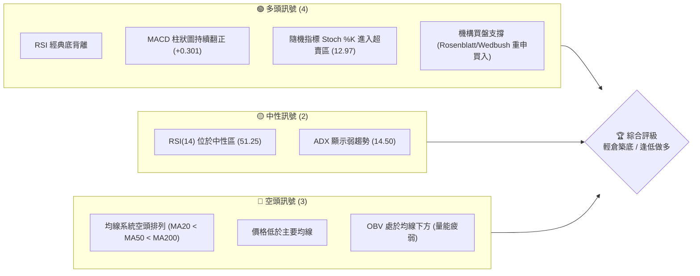
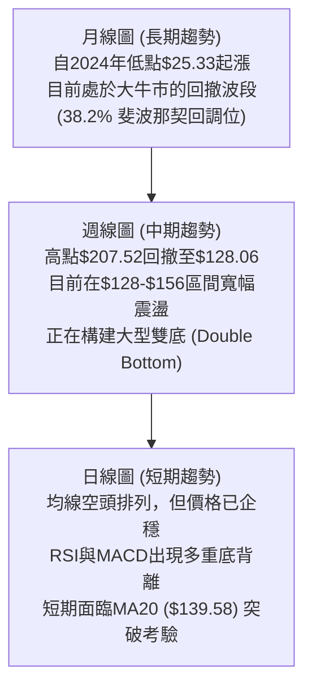
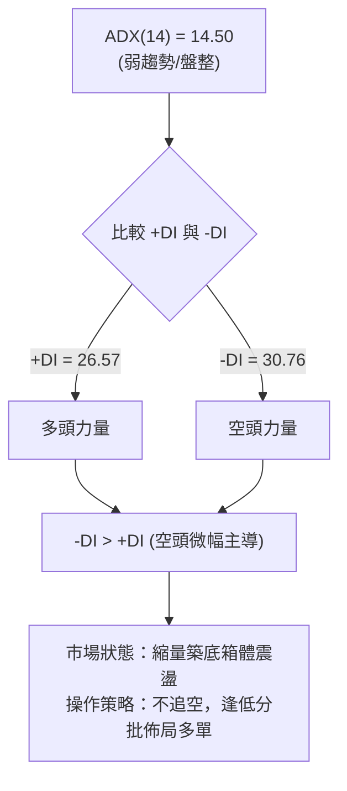
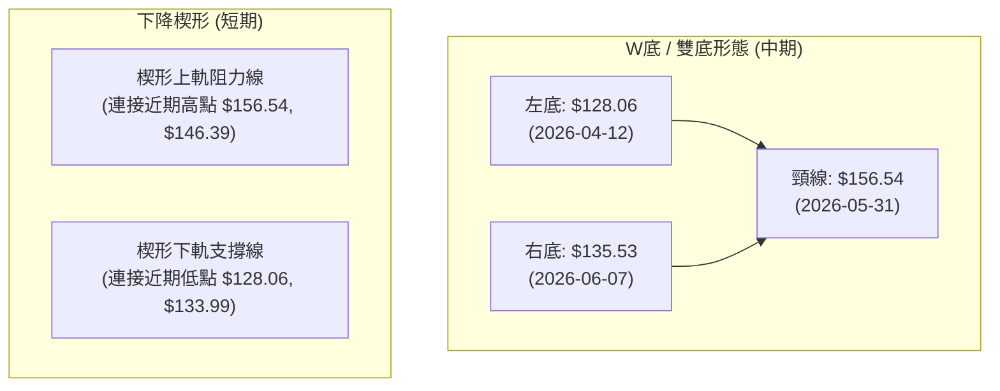

<details>
<summary>📊 靜態圖表 (點擊展開)</summary>

</details>

<html>
<head><meta charset="utf-8" /></head>
<body>
    <div style="height:500px; width:100%;">                        <script>window.PlotlyConfig = {MathJaxConfig: 'local'};</script>
        <script charset="utf-8" src="https://cdn.plot.ly/plotly-3.6.0.min.js" integrity="sha256-QaOVwtVY0T02VaHrr6pnoHLCwayMJp4O5n4YyaE3rJk=" crossorigin="anonymous"></script>                <div id="candlestick-chart" class="plotly-graph-div" style="height:100%; width:100%;"></div>            <script>                window.PLOTLYENV=window.PLOTLYENV || {};                                if (document.getElementById("candlestick-chart")) {                    Plotly.newPlot(                        "candlestick-chart",                        [{"close":{"dtype":"f8","bdata":"AAAA4FGAY0AAAACAwoVjQAAAACCu12NAAAAAoHClY0AAAAAA1xtkQAAAAEAKl2NAAAAAANfDY0AAAABguJZjQAAAAEDhomNAAAAAwMxcY0AAAADgeoRjQAAAACCFI2NAAAAAQDODY0AAAAAghUtkQAAAACCu12RAAAAAIIWLZEAAAACAwm1lQAAAAGC4ZmVAAAAA4FFIZUAAAABgjwplQAAAAEAKH2ZAAAAA4HrMZkAAAABgj2pmQAAAAKCZ0WZAAAAAgOtxZkAAAAAA12NmQAAAAIA9MmZAAAAAIIVbZkAAAACgcM1mQAAAAGBmHmdAAAAAoJlhZ0AAAACAPaJlQAAAAMD1cGZAAAAAoHDFZkAAAACA6\u002fFmQAAAAEAKL2dAAAAAgBTuZUAAAABguCZmQAAAACCud2ZAAAAAANdzZkAAAAAA10NmQAAAAMDMRGZAAAAAQOGyZkAAAADgUbBmQAAAACCu72VAAAAAIFyPZkAAAAAAKRRnQAAAAIDCpWdAAAAAQDOzZ0AAAACA69loQAAAAKCZUWhAAAAAQAoPaUAAAACAwuVpQAAAACCu12dAAAAAwMx8Z0AAAACgmeFlQAAAAIDCPWZAAAAAIIUzaEAAAABguN5nQAAAAKBwBWdAAAAA4HqEZUAAAADgUcBlQAAAAAAAaGVAAAAAYI\u002fqZEAAAACgcK1kQAAAAADXd2NAAAAAQDNbY0AAAAAAAEhkQAAAAKCZcWRAAAAA4KO4ZEAAAABgZg5lQAAAACCu72RAAAAAgBRWZUAAAABgjwJmQAAAAKBwPWZAAAAA4FG4ZkAAAAAgrq9mQAAAAEDhumZAAAAAwB59Z0AAAACgR3FnQAAAAIA98mZAAAAAAADoZkAAAAAAAHhnQAAAAKBHKWZAAAAAgBQ2Z0AAAAAAKSxoQAAAACBcP2hAAAAAAClEaEAAAACgcEVoQAAAAGC4lmdAAAAAgMIFZ0AAAABA4ZpmQAAAAAAAOGZAAAAAIIX7ZEAAAACgR8FlQAAAAGC4dmZAAAAAgMK1ZkAAAAAghRtmQAAAACCuL2ZAAAAAwB5tZkAAAABguF5mQAAAAMDMTGZAAAAAgD0iZkAAAABguF5lQAAAAMD1EGVAAAAAYI+qZEAAAADAzLxkQAAAAEAzM2VAAAAAQArvZEAAAABgZrZkQAAAAEAzq2NAAAAAIIX7YkAAAABA4VJiQAAAAOBReGJAAAAAACm8Y0AAAACgR3FhQAAAAOBRQGBAAAAAwMz8YEAAAADAHt1hQAAAAOBRcGFAAAAAgML1YEAAAAAAKSRgQAAAAMAebWBAAAAA4KOgYEAAAAAAKexgQAAAAOB63GBAAAAAIK7nYEAAAABAM1NgQAAAAEDhGmBAAAAAgBTGYEAAAACAFP5gQAAAAIAUJmFAAAAAoHAlYkAAAABACmdiQAAAAIAUJmNAAAAAoHAVY0AAAADAHqVjQAAAAIDCjWNAAAAA4HrkYkAAAABAM\u002fNiQAAAAAAAMGNAAAAAYGbeYkAAAABAChdjQAAAAGCPYmNAAAAA4KMYY0AAAACAwnVjQAAAAIDC1WJAAAAAQOEaZEAAAADA9VhjQAAAAGC4XmNAAAAAgOtxYkAAAACA6+FhQAAAAKCZMWFAAAAAwPVIYkAAAAAgrk9iQAAAAGC4jmJAAAAAgMJ9YkAAAACAPcJiQAAAAOBRmGFAAAAAIK5PYEAAAACA6wFgQAAAAADXi2BAAAAAYGb2YEAAAADAzMRhQAAAAOBR2GFAAAAA4HpMYkAAAADgejxiQAAAAEAKP2JAAAAAANcTY0AAAACAPbJhQAAAAEDh4mFAAAAAQDPjYUAAAACAwqVhQAAAAEAKP2FAAAAAIIVjYUAAAACAPQJiQAAAAMD1QGJAAAAAwB79YEAAAACgR7lgQAAAAKCZIWFAAAAAoJk5YUAAAADgehxhQAAAAAAAAGFAAAAAoJlBYEAAAAAgXLdgQAAAACCuv2BAAAAA4HrkYEAAAADgUehgQAAAAMDMJGFAAAAAoEctYUAAAAAAKRxhQAAAAEAzE2FAAAAA4FGQYEAAAABA4ephQAAAAKBHkWNAAAAAwMwUZEAAAACgcAVjQAAAAGBmxmFAAAAAYGa2YUAAAADA9fBgQA=="},"high":{"dtype":"f8","bdata":"AAAAYLiOY0AAAABACr9jQAAAAGBmZmRAAAAAQOHSY0AAAAAAKURkQAAAAMDMTGRAAAAAIFzHY0AAAACgcM1jQAAAAOB6zGNAAAAAwMwkZEAAAACgR6FjQAAAAEAK32NAAAAAoJnJY0AAAAAAAFhkQAAAAAAAIGVAAAAA4KfuZEAAAADA9XBlQAAAAKCZeWVAAAAAgOtpZUAAAACAwjVlQAAAAKCZWWZAAAAAoHANZ0AAAAAAAMhmQAAAAAAAOGdAAAAAQDMbZ0AAAACAPQpnQAAAAADXg2ZAAAAAIFyvZkAAAADgo9hmQAAAAMD1SGdAAAAAYGaGZ0AAAABA4VpnQAAAAGBm3mZAAAAAgMJFZ0AAAADgUQhnQAAAAADXc2dAAAAAQDNjZ0AAAABACmdmQAAAAEDhymZAAAAAQDMLZ0AAAACAPRpnQAAAAEDhsmZAAAAAQOHiZkAAAADAcsxmQAAAAGC4xmZAAAAAgOuxZkAAAACgcEVnQAAAAGCPGmhAAAAAwPX4Z0AAAABAM\u002ftoQAAAAKBw9WhAAAAAgMKFaUAAAADgo\u002fBpQAAAAGBmdmhAAAAAgD3KZ0AAAABA4eJnQAAAAGBmVmZAAAAAgMJdaEAAAACgmR1oQAAAAGCP0mdAAAAAYGbWZkAAAACgRylmQAAAACCux2VAAAAAYI+aZUAAAABAMzNlQAAAAIA90mVAAAAAIIXDY0AAAACgcKVkQAAAAMDMlGRAAAAAINkKZUAAAACgmRllQAAAAEAzI2VAAAAAAAD4ZUAAAADAHj1mQAAAAIAUTmZAAAAAYOXEZkAAAAAAKfxmQAAAAEAz22ZAAAAA4HrMZ0AAAACgmYFnQAAAAMDMUGdAAAAAwPV4Z0AAAAAAAJBnQAAAAAAAeGdAAAAAYI9qZ0AAAAAAAGBoQAAAAAAp3GhAAAAAANdraEAAAACgcGVoQAAAAEAzi2hAAAAAYGZmZ0AAAAAAVBdnQAAAAMD1sGZAAAAAQDOrZkAAAACAPfplQAAAAIAUhmZAAAAAwPVoZ0AAAADAHjVnQAAAAEAKV2ZAAAAAAADQZkAAAABAM6NmQAAAAOAis2ZAAAAAQDOTZkAAAACAws1mQAAAAEAKf2VAAAAAIK4vZUAAAAAAACBlQAAAAAAAgGVAAAAAQOFSZUAAAACAFC5lQAAAAKBwoWRAAAAAACm0Y0AAAAAAAOBiQAAAAMDM7GJAAAAAAH+iZEAAAABAM3tjQAAAACBcP2FAAAAA4Ps1YUAAAAAA1ztiQAAAAIDrMWJAAAAAAABoYUAAAADgevxgQAAAAIDrsWBAAAAAgD3KYEAAAADg0J5hQAAAAMAeBWFAAAAAYLgGYUAAAACgR4FgQAAAACCuR2BAAAAAQOECYUAAAADgUTBhQAAAAEAzQ2FAAAAA4HpkYkAAAAAAAHBiQAAAAOCjUGNAAAAAACmMY0AAAABgZi5kQAAAAIAUzmNAAAAAIAaVY0AAAACAaCVjQAAAAAApfGNAAAAAgOtRY0AAAAAghTtjQAAAAAAAmGNAAAAAgBSWY0AAAADAzIRjQAAAAMDMlGNAAAAAYI8iZEAAAADAzExkQAAAAOCjCGRAAAAAANcjY0AAAABguD5iQAAAAADXA2JAAAAAIIV7YkAAAACgmYliQAAAAOBRkGJAAAAAIIXTYkAAAADgo8hiQAAAAMD1iGNAAAAAoEdxYUAAAABgZiZgQAAAAKBwzWBAAAAAgD1CYUAAAABgj9JhQAAAAKCZMWJAAAAAwPWIYkAAAABgZmZiQAAAAADXu2JAAAAAgMIVY0AAAACgR8liQAAAAGCP6mFAAAAAgD0iYkAAAABAM\u002fthQAAAAOBReGFAAAAAYGaGYUAAAACAFE5iQAAAAOB6tGJAAAAAIFzfYUAAAABgZvZgQAAAAGBmnmFAAAAAACk8YUAAAADgeiRhQAAAAIDCLWFAAAAAIK4fYUAAAAAgXM9gQAAAAOB69GBAAAAAgOv9YEAAAABACi9hQAAAACCuJ2FAAAAAoJlRYUAAAADgo2BhQAAAAIDCVWFAAAAAIFz3YEAAAAAAACBiQAAAAKDtuGNAAAAAYGZ2ZEAAAACgmfFjQAAAAIDC9WJAAAAAANdLYkAAAABACr9hQA=="},"hovertemplate":"\u003cb\u003e%{x|%Y-%m-%d}\u003c\u002fb\u003e\u003cbr\u003e\u958b: $%{open:.2f}\u003cbr\u003e\u9ad8: $%{high:.2f}\u003cbr\u003e\u4f4e: $%{low:.2f}\u003cbr\u003e\u6536: $%{close:.2f}\u003cextra\u003e\u003c\u002fextra\u003e","low":{"dtype":"f8","bdata":"AAAAQOHKYUAAAACA6zljQAAAAOCj+GJAAAAAANerYkAAAACAPVJjQAAAACBcf2NAAAAAoJkRY0AAAAAAACBjQAAAAMD1yGJAAAAAYLgWY0AAAADAHiVjQAAAAKBHgWJAAAAAQOFaY0AAAAAA14tjQAAAAIAUbmRAAAAAQApnZEAAAADgUYBkQAAAAMAe7WRAAAAAYLgeZUAAAADgoyhkQAAAAOB6LGVAAAAAYLgWZkAAAACgR0lmQAAAAOBRIGZAAAAAANcjZkAAAACgR8llQAAAAMAe3WVAAAAAwB4lZkAAAABACkdmQAAAAAAAcGZAAAAAYGbeZkAAAADgo1hlQAAAAGCPOmZAAAAAoHBtZkAAAABgZqZmQAAAAGBmfmZAAAAAwPWwZUAAAABgZq5lQAAAAIA9WmVAAAAA4KMAZkAAAABgZg5mQAAAAGBmvmVAAAAAgBQuZkAAAADAzFRmQAAAAKBwLWVAAAAA4FHgZUAAAABAM9tmQAAAAOCjcGdAAAAAwPVYZ0AAAAAgrs9nQAAAAADXQ2hAAAAAoHC9aEAAAACAPTppQAAAAIDrMWdAAAAAYLimZkAAAADA9dBlQAAAAMAeHWVAAAAA4KPwZkAAAAAAKWRnQAAAAMDMjGZAAAAAYGRXZUAAAAAAAJBkQAAAAIDC9WRAAAAAAACwZEAAAACgcE1kQAAAAOCjTGNAAAAAgOtxYkAAAAAAAKBjQAAAAIDCkWNAAAAAACl8ZEAAAAAAALxkQAAAAADXY2RAAAAAQOEyZUAAAABgjxplQAAAAIDCzWVAAAAAwB4lZkAAAACgR3FmQAAAAAApjGZAAAAAAADYZkAAAABguIZmQAAAACBYNWZAAAAAwPWAZkAAAABAi6RmQAAAAAAAEGZAAAAA4FGwZkAAAAAgXFdnQAAAAIDCDWhAAAAAIIX3Z0AAAABgjxpoQAAAAADXk2dAAAAA4Hr0ZkAAAABgZpZmQAAAAAAAKGZAAAAAQDPLZEAAAACgR3llQAAAAOCj2GVAAAAAwB41ZkAAAAAA18tlQAAAAAAA2GVAAAAAQOEKZkAAAADgegRmQAAAAGBmvmVAAAAAwPUQZkAAAADgUUBlQAAAACCux2RAAAAAIIUjZEAAAABgZp5kQAAAAKCZyWRAAAAAYGbqZEAAAACAFJZkQAAAACCup2NAAAAAANdjYkAAAADAciRiQAAAAKDtVGJAAAAAANcjY0AAAACAwvVgQAAAAIA9CmBAAAAAQDOLYEAAAAAA1dhgQAAAAOCjOGFAAAAAYGaeYEAAAAAA16NfQAAAAIDpjl9AAAAAYI\u002fSX0AAAAAA19tgQAAAAOBRYGBAAAAAoHBlYEAAAADA9dhfQAAAACCul19AAAAAgMIlYEAAAAAAKZRgQAAAACBcv2BAAAAA4KOQYUAAAABgZkZhQAAAAIDrgWJAAAAAIIWzYkAAAACgR8liQAAAAEAKH2NAAAAA4HrEYkAAAABgj6piQAAAACBc32JAAAAAYI+SYkAAAACgcOViQAAAAADXA2NAAAAAIIUTY0AAAAAAANBiQAAAAEDhomJAAAAAIK4nY0AAAADgevRiQAAAACBcW2NAAAAAAABoYkAAAACA67FhQAAAAKCZCWFAAAAAQApfYUAAAABACg9iQAAAACCuP2FAAAAAIDFUYkAAAABgZg5iQAAAAKBwZWFAAAAAQAoPYEAAAAAghateQAAAAMDMJGBAAAAAAADAYEAAAACAwt1gQAAAAMD1cGFAAAAAoJnpYUAAAABgj\u002fphQAAAAMD3\u002f2FAAAAAwB5tYkAAAACgcH1hQAAAAIDCXWFAAAAA4FGgYUAAAACgcI1hQAAAAIDC1WBAAAAAwMwUYUAAAADgeqxhQAAAAEAzJ2JAAAAAQArXYEAAAADAzGRgQAAAAMD12GBAAAAA4KOgYEAAAAAArJhgQAAAAGC4rmBAAAAAAAAYYEAAAABgZi5gQAAAAKBHiWBAAAAAYI9qYEAAAABAM7NgQAAAAKBwjWBAAAAAoHDtYEAAAACgmclgQAAAAKCZqWBAAAAAACl0YEAAAAAAAKBgQAAAAKBHOWJAAAAAACl8Y0AAAACgmbliQAAAAAAAqGFAAAAAQLSIYUAAAADAzMBgQA=="},"name":"\u50f9\u683c","open":{"dtype":"f8","bdata":"AAAAoJkJY0AAAACgcKVjQAAAAIAUamNAAAAAQDODY0AAAADgemxjQAAAAIA9SmRAAAAAACm0Y0AAAAAgXJ9jQAAAAGBm5mJAAAAAAADAY0AAAAAgrltjQAAAAIA9umNAAAAAwB5dY0AAAAAAAKhjQAAAAAAAwGRAAAAAIK7nZEAAAABAM6tkQAAAAEAzM2VAAAAAoEdhZUAAAADgoyBlQAAAAOCjSGVAAAAAgD0iZkAAAAAAKZxmQAAAAOBR0GZAAAAAwB79ZkAAAACgmfllQAAAAKCZYWZAAAAA4Hp0ZkAAAAAgXF9mQAAAAIA9qmZAAAAAYGZWZ0AAAADAzExnQAAAAIDCZWZAAAAAgOuJZkAAAACgmdlmQAAAAGCP8mZAAAAAoHAlZ0AAAACAwlVmQAAAAAAAAGZAAAAAwPW0ZkAAAADA9bhmQAAAAAAAOGZAAAAAIK5vZkAAAACA68FmQAAAAIDCvWZAAAAAgD3uZUAAAAAAKdxmQAAAAEAKn2dAAAAAIFyvZ0AAAABgj+JnQAAAAKCZzWhAAAAAYGbmaEAAAACgcKFpQAAAAIA9AmhAAAAAAACgZ0AAAAAgrn9nQAAAAMDMpGVAAAAAgOsJZ0AAAABguMpnQAAAAGCP0mdAAAAAQOG2ZkAAAABAM99kQAAAAMD1UGVAAAAAANcLZUAAAACgmflkQAAAAIA9gmVAAAAA4FGAY0AAAABACq9jQAAAAIA9AmRAAAAAQDPbZEAAAADgUfhkQAAAAAAAoGRAAAAAQOEyZUAAAADgekRlQAAAACCuC2ZAAAAAIFxHZkAAAABguMZmQAAAAEAKn2ZAAAAAYGYeZ0AAAACgmRlnQAAAAIDrOWdAAAAAYI8iZ0AAAADA9bRmQAAAAEDhdmdAAAAA4FGwZkAAAAAgrldnQAAAAKBHYWhAAAAAYGYaaEAAAADAHiVoQAAAAOB6YGhAAAAAQDNbZ0AAAABAMwtnQAAAAAAppGZAAAAAoJmpZkAAAAAAKdxlQAAAAOBR+GVAAAAAoJl5ZkAAAAAgrjNnQAAAAOCjIGZAAAAAgOs1ZkAAAAAAAFxmQAAAAAAARGZAAAAAYLhWZkAAAAAghWtmQAAAAAAA9GRAAAAAIN0MZUAAAACgmR1lQAAAAOCj6GRAAAAAYLgGZUAAAAAgXO9kQAAAAMDMjGRAAAAAACm0Y0AAAACgmcFiQAAAAIAU3mJAAAAAoJmhZEAAAADAHm1jQAAAAIA9GmFAAAAAYI\u002fqYEAAAABgjxJhQAAAAEDhHmJAAAAAwMxgYUAAAAAghetgQAAAAKCZ+V9AAAAA4KMcYEAAAADgevxgQAAAAIDriWBAAAAAIK6LYEAAAACgR4FgQAAAAAApIGBAAAAAIIVTYEAAAABACrtgQAAAAIA9wmBAAAAAwMyYYUAAAABAM8NhQAAAAIDCjWJAAAAAgBQeY0AAAACAFM5iQAAAAIAUdmNAAAAAIK5\u002fY0AAAAAAKexiQAAAAOBRIGNAAAAAoJkpY0AAAABgZg5jQAAAAMD1DGNAAAAAgD1eY0AAAABAMyNjQAAAAGBmZmNAAAAAIK4nY0AAAACAPQJkQAAAAKBwrWNAAAAAgMIhY0AAAAAAKTxiQAAAAOCj6GFAAAAA4KOAYUAAAAAAAGBiQAAAACCF72FAAAAAIIWLYkAAAABgOVxiQAAAAOB6WGNAAAAA4KNsYUAAAAAgXA9gQAAAACBcR2BAAAAAAKrNYEAAAACgRxlhQAAAAKBHCWJAAAAAgBQqYkAAAAAAACBiQAAAAIDrWWJAAAAAIIWLYkAAAABgZrZiQAAAAGC43mFAAAAAAACoYUAAAACgmclhQAAAAOBReGFAAAAAQDNPYUAAAAAAAOhhQAAAAAAAeGJAAAAAoHCJYUAAAABguLZgQAAAAEAz42BAAAAAIK77YEAAAADAHt1gQAAAAEAzE2FAAAAAIDHAYEAAAADAzDRgQAAAAKCZmWBAAAAAAACQYEAAAACgcOVgQAAAAOCjxGBAAAAAoJn5YEAAAACgmS1hQAAAAMAeBWFAAAAAoJmpYEAAAADAHqVgQAAAAGBmemJAAAAAIFz\u002fY0AAAACAFJZjQAAAAGBmtmJAAAAAYLguYkAAAABgZophQA=="},"x":["2025-08-20T00:00:00-04:00","2025-08-21T00:00:00-04:00","2025-08-22T00:00:00-04:00","2025-08-25T00:00:00-04:00","2025-08-26T00:00:00-04:00","2025-08-27T00:00:00-04:00","2025-08-28T00:00:00-04:00","2025-08-29T00:00:00-04:00","2025-09-02T00:00:00-04:00","2025-09-03T00:00:00-04:00","2025-09-04T00:00:00-04:00","2025-09-05T00:00:00-04:00","2025-09-08T00:00:00-04:00","2025-09-09T00:00:00-04:00","2025-09-10T00:00:00-04:00","2025-09-11T00:00:00-04:00","2025-09-12T00:00:00-04:00","2025-09-15T00:00:00-04:00","2025-09-16T00:00:00-04:00","2025-09-17T00:00:00-04:00","2025-09-18T00:00:00-04:00","2025-09-19T00:00:00-04:00","2025-09-22T00:00:00-04:00","2025-09-23T00:00:00-04:00","2025-09-24T00:00:00-04:00","2025-09-25T00:00:00-04:00","2025-09-26T00:00:00-04:00","2025-09-29T00:00:00-04:00","2025-09-30T00:00:00-04:00","2025-10-01T00:00:00-04:00","2025-10-02T00:00:00-04:00","2025-10-03T00:00:00-04:00","2025-10-06T00:00:00-04:00","2025-10-07T00:00:00-04:00","2025-10-08T00:00:00-04:00","2025-10-09T00:00:00-04:00","2025-10-10T00:00:00-04:00","2025-10-13T00:00:00-04:00","2025-10-14T00:00:00-04:00","2025-10-15T00:00:00-04:00","2025-10-16T00:00:00-04:00","2025-10-17T00:00:00-04:00","2025-10-20T00:00:00-04:00","2025-10-21T00:00:00-04:00","2025-10-22T00:00:00-04:00","2025-10-23T00:00:00-04:00","2025-10-24T00:00:00-04:00","2025-10-27T00:00:00-04:00","2025-10-28T00:00:00-04:00","2025-10-29T00:00:00-04:00","2025-10-30T00:00:00-04:00","2025-10-31T00:00:00-04:00","2025-11-03T00:00:00-05:00","2025-11-04T00:00:00-05:00","2025-11-05T00:00:00-05:00","2025-11-06T00:00:00-05:00","2025-11-07T00:00:00-05:00","2025-11-10T00:00:00-05:00","2025-11-11T00:00:00-05:00","2025-11-12T00:00:00-05:00","2025-11-13T00:00:00-05:00","2025-11-14T00:00:00-05:00","2025-11-17T00:00:00-05:00","2025-11-18T00:00:00-05:00","2025-11-19T00:00:00-05:00","2025-11-20T00:00:00-05:00","2025-11-21T00:00:00-05:00","2025-11-24T00:00:00-05:00","2025-11-25T00:00:00-05:00","2025-11-26T00:00:00-05:00","2025-11-28T00:00:00-05:00","2025-12-01T00:00:00-05:00","2025-12-02T00:00:00-05:00","2025-12-03T00:00:00-05:00","2025-12-04T00:00:00-05:00","2025-12-05T00:00:00-05:00","2025-12-08T00:00:00-05:00","2025-12-09T00:00:00-05:00","2025-12-10T00:00:00-05:00","2025-12-11T00:00:00-05:00","2025-12-12T00:00:00-05:00","2025-12-15T00:00:00-05:00","2025-12-16T00:00:00-05:00","2025-12-17T00:00:00-05:00","2025-12-18T00:00:00-05:00","2025-12-19T00:00:00-05:00","2025-12-22T00:00:00-05:00","2025-12-23T00:00:00-05:00","2025-12-24T00:00:00-05:00","2025-12-26T00:00:00-05:00","2025-12-29T00:00:00-05:00","2025-12-30T00:00:00-05:00","2025-12-31T00:00:00-05:00","2026-01-02T00:00:00-05:00","2026-01-05T00:00:00-05:00","2026-01-06T00:00:00-05:00","2026-01-07T00:00:00-05:00","2026-01-08T00:00:00-05:00","2026-01-09T00:00:00-05:00","2026-01-12T00:00:00-05:00","2026-01-13T00:00:00-05:00","2026-01-14T00:00:00-05:00","2026-01-15T00:00:00-05:00","2026-01-16T00:00:00-05:00","2026-01-20T00:00:00-05:00","2026-01-21T00:00:00-05:00","2026-01-22T00:00:00-05:00","2026-01-23T00:00:00-05:00","2026-01-26T00:00:00-05:00","2026-01-27T00:00:00-05:00","2026-01-28T00:00:00-05:00","2026-01-29T00:00:00-05:00","2026-01-30T00:00:00-05:00","2026-02-02T00:00:00-05:00","2026-02-03T00:00:00-05:00","2026-02-04T00:00:00-05:00","2026-02-05T00:00:00-05:00","2026-02-06T00:00:00-05:00","2026-02-09T00:00:00-05:00","2026-02-10T00:00:00-05:00","2026-02-11T00:00:00-05:00","2026-02-12T00:00:00-05:00","2026-02-13T00:00:00-05:00","2026-02-17T00:00:00-05:00","2026-02-18T00:00:00-05:00","2026-02-19T00:00:00-05:00","2026-02-20T00:00:00-05:00","2026-02-23T00:00:00-05:00","2026-02-24T00:00:00-05:00","2026-02-25T00:00:00-05:00","2026-02-26T00:00:00-05:00","2026-02-27T00:00:00-05:00","2026-03-02T00:00:00-05:00","2026-03-03T00:00:00-05:00","2026-03-04T00:00:00-05:00","2026-03-05T00:00:00-05:00","2026-03-06T00:00:00-05:00","2026-03-09T00:00:00-04:00","2026-03-10T00:00:00-04:00","2026-03-11T00:00:00-04:00","2026-03-12T00:00:00-04:00","2026-03-13T00:00:00-04:00","2026-03-16T00:00:00-04:00","2026-03-17T00:00:00-04:00","2026-03-18T00:00:00-04:00","2026-03-19T00:00:00-04:00","2026-03-20T00:00:00-04:00","2026-03-23T00:00:00-04:00","2026-03-24T00:00:00-04:00","2026-03-25T00:00:00-04:00","2026-03-26T00:00:00-04:00","2026-03-27T00:00:00-04:00","2026-03-30T00:00:00-04:00","2026-03-31T00:00:00-04:00","2026-04-01T00:00:00-04:00","2026-04-02T00:00:00-04:00","2026-04-06T00:00:00-04:00","2026-04-07T00:00:00-04:00","2026-04-08T00:00:00-04:00","2026-04-09T00:00:00-04:00","2026-04-10T00:00:00-04:00","2026-04-13T00:00:00-04:00","2026-04-14T00:00:00-04:00","2026-04-15T00:00:00-04:00","2026-04-16T00:00:00-04:00","2026-04-17T00:00:00-04:00","2026-04-20T00:00:00-04:00","2026-04-21T00:00:00-04:00","2026-04-22T00:00:00-04:00","2026-04-23T00:00:00-04:00","2026-04-24T00:00:00-04:00","2026-04-27T00:00:00-04:00","2026-04-28T00:00:00-04:00","2026-04-29T00:00:00-04:00","2026-04-30T00:00:00-04:00","2026-05-01T00:00:00-04:00","2026-05-04T00:00:00-04:00","2026-05-05T00:00:00-04:00","2026-05-06T00:00:00-04:00","2026-05-07T00:00:00-04:00","2026-05-08T00:00:00-04:00","2026-05-11T00:00:00-04:00","2026-05-12T00:00:00-04:00","2026-05-13T00:00:00-04:00","2026-05-14T00:00:00-04:00","2026-05-15T00:00:00-04:00","2026-05-18T00:00:00-04:00","2026-05-19T00:00:00-04:00","2026-05-20T00:00:00-04:00","2026-05-21T00:00:00-04:00","2026-05-22T00:00:00-04:00","2026-05-26T00:00:00-04:00","2026-05-27T00:00:00-04:00","2026-05-28T00:00:00-04:00","2026-05-29T00:00:00-04:00","2026-06-01T00:00:00-04:00","2026-06-02T00:00:00-04:00","2026-06-03T00:00:00-04:00","2026-06-04T00:00:00-04:00","2026-06-05T00:00:00-04:00"],"type":"candlestick"},{"hovertemplate":"MA30: $%{y:.2f}\u003cextra\u003e\u003c\u002fextra\u003e","line":{"color":"#2196F3","dash":"dash","width":2},"mode":"lines","name":"MA30","x":["2025-08-20T00:00:00-04:00","2025-08-21T00:00:00-04:00","2025-08-22T00:00:00-04:00","2025-08-25T00:00:00-04:00","2025-08-26T00:00:00-04:00","2025-08-27T00:00:00-04:00","2025-08-28T00:00:00-04:00","2025-08-29T00:00:00-04:00","2025-09-02T00:00:00-04:00","2025-09-03T00:00:00-04:00","2025-09-04T00:00:00-04:00","2025-09-05T00:00:00-04:00","2025-09-08T00:00:00-04:00","2025-09-09T00:00:00-04:00","2025-09-10T00:00:00-04:00","2025-09-11T00:00:00-04:00","2025-09-12T00:00:00-04:00","2025-09-15T00:00:00-04:00","2025-09-16T00:00:00-04:00","2025-09-17T00:00:00-04:00","2025-09-18T00:00:00-04:00","2025-09-19T00:00:00-04:00","2025-09-22T00:00:00-04:00","2025-09-23T00:00:00-04:00","2025-09-24T00:00:00-04:00","2025-09-25T00:00:00-04:00","2025-09-26T00:00:00-04:00","2025-09-29T00:00:00-04:00","2025-09-30T00:00:00-04:00","2025-10-01T00:00:00-04:00","2025-10-02T00:00:00-04:00","2025-10-03T00:00:00-04:00","2025-10-06T00:00:00-04:00","2025-10-07T00:00:00-04:00","2025-10-08T00:00:00-04:00","2025-10-09T00:00:00-04:00","2025-10-10T00:00:00-04:00","2025-10-13T00:00:00-04:00","2025-10-14T00:00:00-04:00","2025-10-15T00:00:00-04:00","2025-10-16T00:00:00-04:00","2025-10-17T00:00:00-04:00","2025-10-20T00:00:00-04:00","2025-10-21T00:00:00-04:00","2025-10-22T00:00:00-04:00","2025-10-23T00:00:00-04:00","2025-10-24T00:00:00-04:00","2025-10-27T00:00:00-04:00","2025-10-28T00:00:00-04:00","2025-10-29T00:00:00-04:00","2025-10-30T00:00:00-04:00","2025-10-31T00:00:00-04:00","2025-11-03T00:00:00-05:00","2025-11-04T00:00:00-05:00","2025-11-05T00:00:00-05:00","2025-11-06T00:00:00-05:00","2025-11-07T00:00:00-05:00","2025-11-10T00:00:00-05:00","2025-11-11T00:00:00-05:00","2025-11-12T00:00:00-05:00","2025-11-13T00:00:00-05:00","2025-11-14T00:00:00-05:00","2025-11-17T00:00:00-05:00","2025-11-18T00:00:00-05:00","2025-11-19T00:00:00-05:00","2025-11-20T00:00:00-05:00","2025-11-21T00:00:00-05:00","2025-11-24T00:00:00-05:00","2025-11-25T00:00:00-05:00","2025-11-26T00:00:00-05:00","2025-11-28T00:00:00-05:00","2025-12-01T00:00:00-05:00","2025-12-02T00:00:00-05:00","2025-12-03T00:00:00-05:00","2025-12-04T00:00:00-05:00","2025-12-05T00:00:00-05:00","2025-12-08T00:00:00-05:00","2025-12-09T00:00:00-05:00","2025-12-10T00:00:00-05:00","2025-12-11T00:00:00-05:00","2025-12-12T00:00:00-05:00","2025-12-15T00:00:00-05:00","2025-12-16T00:00:00-05:00","2025-12-17T00:00:00-05:00","2025-12-18T00:00:00-05:00","2025-12-19T00:00:00-05:00","2025-12-22T00:00:00-05:00","2025-12-23T00:00:00-05:00","2025-12-24T00:00:00-05:00","2025-12-26T00:00:00-05:00","2025-12-29T00:00:00-05:00","2025-12-30T00:00:00-05:00","2025-12-31T00:00:00-05:00","2026-01-02T00:00:00-05:00","2026-01-05T00:00:00-05:00","2026-01-06T00:00:00-05:00","2026-01-07T00:00:00-05:00","2026-01-08T00:00:00-05:00","2026-01-09T00:00:00-05:00","2026-01-12T00:00:00-05:00","2026-01-13T00:00:00-05:00","2026-01-14T00:00:00-05:00","2026-01-15T00:00:00-05:00","2026-01-16T00:00:00-05:00","2026-01-20T00:00:00-05:00","2026-01-21T00:00:00-05:00","2026-01-22T00:00:00-05:00","2026-01-23T00:00:00-05:00","2026-01-26T00:00:00-05:00","2026-01-27T00:00:00-05:00","2026-01-28T00:00:00-05:00","2026-01-29T00:00:00-05:00","2026-01-30T00:00:00-05:00","2026-02-02T00:00:00-05:00","2026-02-03T00:00:00-05:00","2026-02-04T00:00:00-05:00","2026-02-05T00:00:00-05:00","2026-02-06T00:00:00-05:00","2026-02-09T00:00:00-05:00","2026-02-10T00:00:00-05:00","2026-02-11T00:00:00-05:00","2026-02-12T00:00:00-05:00","2026-02-13T00:00:00-05:00","2026-02-17T00:00:00-05:00","2026-02-18T00:00:00-05:00","2026-02-19T00:00:00-05:00","2026-02-20T00:00:00-05:00","2026-02-23T00:00:00-05:00","2026-02-24T00:00:00-05:00","2026-02-25T00:00:00-05:00","2026-02-26T00:00:00-05:00","2026-02-27T00:00:00-05:00","2026-03-02T00:00:00-05:00","2026-03-03T00:00:00-05:00","2026-03-04T00:00:00-05:00","2026-03-05T00:00:00-05:00","2026-03-06T00:00:00-05:00","2026-03-09T00:00:00-04:00","2026-03-10T00:00:00-04:00","2026-03-11T00:00:00-04:00","2026-03-12T00:00:00-04:00","2026-03-13T00:00:00-04:00","2026-03-16T00:00:00-04:00","2026-03-17T00:00:00-04:00","2026-03-18T00:00:00-04:00","2026-03-19T00:00:00-04:00","2026-03-20T00:00:00-04:00","2026-03-23T00:00:00-04:00","2026-03-24T00:00:00-04:00","2026-03-25T00:00:00-04:00","2026-03-26T00:00:00-04:00","2026-03-27T00:00:00-04:00","2026-03-30T00:00:00-04:00","2026-03-31T00:00:00-04:00","2026-04-01T00:00:00-04:00","2026-04-02T00:00:00-04:00","2026-04-06T00:00:00-04:00","2026-04-07T00:00:00-04:00","2026-04-08T00:00:00-04:00","2026-04-09T00:00:00-04:00","2026-04-10T00:00:00-04:00","2026-04-13T00:00:00-04:00","2026-04-14T00:00:00-04:00","2026-04-15T00:00:00-04:00","2026-04-16T00:00:00-04:00","2026-04-17T00:00:00-04:00","2026-04-20T00:00:00-04:00","2026-04-21T00:00:00-04:00","2026-04-22T00:00:00-04:00","2026-04-23T00:00:00-04:00","2026-04-24T00:00:00-04:00","2026-04-27T00:00:00-04:00","2026-04-28T00:00:00-04:00","2026-04-29T00:00:00-04:00","2026-04-30T00:00:00-04:00","2026-05-01T00:00:00-04:00","2026-05-04T00:00:00-04:00","2026-05-05T00:00:00-04:00","2026-05-06T00:00:00-04:00","2026-05-07T00:00:00-04:00","2026-05-08T00:00:00-04:00","2026-05-11T00:00:00-04:00","2026-05-12T00:00:00-04:00","2026-05-13T00:00:00-04:00","2026-05-14T00:00:00-04:00","2026-05-15T00:00:00-04:00","2026-05-18T00:00:00-04:00","2026-05-19T00:00:00-04:00","2026-05-20T00:00:00-04:00","2026-05-21T00:00:00-04:00","2026-05-22T00:00:00-04:00","2026-05-26T00:00:00-04:00","2026-05-27T00:00:00-04:00","2026-05-28T00:00:00-04:00","2026-05-29T00:00:00-04:00","2026-06-01T00:00:00-04:00","2026-06-02T00:00:00-04:00","2026-06-03T00:00:00-04:00","2026-06-04T00:00:00-04:00","2026-06-05T00:00:00-04:00"],"y":{"dtype":"f8","bdata":"AAAAAAAA+H8AAAAAAAD4fwAAAAAAAPh\u002fAAAAAAAA+H8AAAAAAAD4fwAAAAAAAPh\u002fAAAAAAAA+H8AAAAAAAD4fwAAAAAAAPh\u002fAAAAAAAA+H8AAAAAAAD4fwAAAAAAAPh\u002fAAAAAAAA+H8AAAAAAAD4fwAAAAAAAPh\u002fAAAAAAAA+H8AAAAAAAD4fwAAAAAAAPh\u002fAAAAAAAA+H8AAAAAAAD4fwAAAAAAAPh\u002fAAAAAAAA+H8AAAAAAAD4fwAAAAAAAPh\u002fAAAAAAAA+H8AAAAAAAD4fwAAAAAAAPh\u002fAAAAAAAA+H8AAAAAAAD4fwAAACCw5mRA3t3dHcwHZUB3d3c30BllQFVVVUX9L2VAAAAA8KdKZUAiIiLS22JlQM3MzHyGgWVAERERAQCUZUDv7u7e3allQFVVVdUGwmVAq6qqCmXcZUC8u7sL1\u002fNlQCIiIqKMDmZAmpmZGb0pZkAzMzNTKj5mQImIiKh\u002fR2ZA3t3dfbFYZkCamZn5xWZmQKuqqvrweWZAd3d3F5KOZkCamZkpFa9mQM3MzKzVwWZAiYiIuB7VZkAAAACg0\u002fJmQKuqqgqQ+2ZAq6qqanUEZ0CamZkJHgBnQGZmZlaAAGdAIiIiEjwQZ0AAAAAQWBlnQCIiIhKDGGdAVVVVpZsIZ0AzMzNTnAlnQFVVVVXHAGdAZmZmBvPwZkCJiIiYmd1mQAAAALDkvWZA7+7uPu6nZkCrqqoq+ZdmQHd3dze0hmZA7+7uPu53ZkARERGxnW1mQN7d3c0+YmZAERERYZ5WZkARERGh01BmQN7d3S1rU2ZAREREtMhUZkBmZmZGb1FmQHd3d\u002feaSWZAvLu7e81HZkBVVVUFyDtmQAAAAMARMGZAq6qqirMdZkC8u7vb+QhmQLy7uxuh+mVAIiIiokX4ZUAiIiLy0gtmQKuqqqrxHGZAmpmZqX8dZkBEREQ07CBmQN7d3e3DJWZAZmZmppsyZkAiIiKy5DlmQBEREaHTQGZAq6qqWmRBZkAAAAAwlkpmQLy7uzsmZGZAvLu7m8SAZkDNzMwcWpBmQJqZmak4n2ZAq6qqSsWtZkCamZk5+7hmQBEREWGexGZAvLu7i2zLZkAiIiJy9sVmQJqZmVnyu2ZA3t3d3WuqZkARERHByplmQLy7u2u8jGZAAAAA8O52ZkCamZkpo19mQKuqqlqrQ2ZAq6qqyi8iZkDe3d1dSPZlQFVVVbXI1mVAmpmZuR65ZUAAAADQsH9lQM3MzLx0O2VAAAAAEFj9ZECrqqqqqsZkQImIiMgvkmRAzczMDHReZEBmZmbGSydkQN7d3d3d9WNAmpmZObTQY0CJiIh4d6djQO\u002fu7p6od2NAiYiIaB9GY0CJiIhYxxRjQGZmZqbi4GJAMzMzk6awYkDv7u4+w4JiQLy7uyvOVmJAd3d3V8c0YkDNzMy8dBtiQFVVVeUXC2JA7+7u3pb9YUBVVVVFRPRhQKuqqvo35mFAzczMzMzUYUAAAACQwsVhQBEREUGnwWFAMzMzw67AYUCamZmpOMdhQDMzM4MHz2FAREREJJTJYUAAAABwy9phQJqZmbnX8GFAIiIiAnILYkDv7u5OGxhiQBERETGWKGJAmpmZOUI1YkCrqqoKHkRiQLy7u6uqSmJAiYiIiM9YYkDe3d1NqWRiQCIiItIic2JAiYiICKyAYkBERESkcJViQImIiJgnomJAAAAAQDWeYkC8u7t7zZViQM3MzEypkGJAvLu7W4+GYkCJiIjoJoFiQCIiItIGdmJAZmZm9lNvYkAAAACATmNiQJqZmTkmWGJAzczMXLpZYkARERGBB09iQBEREeHsQ2JA7+7uTo07YkDe3d0dPi9iQCIiIvL9HGJAq6qq2msOYkDe3d2NCQJiQLy7u8sT\u002fWFA7+7uPnziYUAzMzOTGMxhQDMzM\u002fP9uGFAIiIi0pSuYUAAAAAAAKhhQO\u002fu7r5YpmFAAAAA4AiVYUCrqqqKbIdhQERERET9d2FA7+7uvlhqYUAAAACgjFphQKuqqtqyVmFAZmZm1hVeYUCamZlJfmdhQM3MzFwBbGFAd3d3R5poYUCrqqo632lhQGZmZhaSeGFAREREBMiHYUAAAADgeo5hQJqZmWl1imFAZmZmhs9+YUAzMzMzXnhhQA=="},"type":"scatter"},{"hovertemplate":"MA60: $%{y:.2f}\u003cextra\u003e\u003c\u002fextra\u003e","line":{"color":"#9C27B0","dash":"dash","width":2},"mode":"lines","name":"MA60","x":["2025-08-20T00:00:00-04:00","2025-08-21T00:00:00-04:00","2025-08-22T00:00:00-04:00","2025-08-25T00:00:00-04:00","2025-08-26T00:00:00-04:00","2025-08-27T00:00:00-04:00","2025-08-28T00:00:00-04:00","2025-08-29T00:00:00-04:00","2025-09-02T00:00:00-04:00","2025-09-03T00:00:00-04:00","2025-09-04T00:00:00-04:00","2025-09-05T00:00:00-04:00","2025-09-08T00:00:00-04:00","2025-09-09T00:00:00-04:00","2025-09-10T00:00:00-04:00","2025-09-11T00:00:00-04:00","2025-09-12T00:00:00-04:00","2025-09-15T00:00:00-04:00","2025-09-16T00:00:00-04:00","2025-09-17T00:00:00-04:00","2025-09-18T00:00:00-04:00","2025-09-19T00:00:00-04:00","2025-09-22T00:00:00-04:00","2025-09-23T00:00:00-04:00","2025-09-24T00:00:00-04:00","2025-09-25T00:00:00-04:00","2025-09-26T00:00:00-04:00","2025-09-29T00:00:00-04:00","2025-09-30T00:00:00-04:00","2025-10-01T00:00:00-04:00","2025-10-02T00:00:00-04:00","2025-10-03T00:00:00-04:00","2025-10-06T00:00:00-04:00","2025-10-07T00:00:00-04:00","2025-10-08T00:00:00-04:00","2025-10-09T00:00:00-04:00","2025-10-10T00:00:00-04:00","2025-10-13T00:00:00-04:00","2025-10-14T00:00:00-04:00","2025-10-15T00:00:00-04:00","2025-10-16T00:00:00-04:00","2025-10-17T00:00:00-04:00","2025-10-20T00:00:00-04:00","2025-10-21T00:00:00-04:00","2025-10-22T00:00:00-04:00","2025-10-23T00:00:00-04:00","2025-10-24T00:00:00-04:00","2025-10-27T00:00:00-04:00","2025-10-28T00:00:00-04:00","2025-10-29T00:00:00-04:00","2025-10-30T00:00:00-04:00","2025-10-31T00:00:00-04:00","2025-11-03T00:00:00-05:00","2025-11-04T00:00:00-05:00","2025-11-05T00:00:00-05:00","2025-11-06T00:00:00-05:00","2025-11-07T00:00:00-05:00","2025-11-10T00:00:00-05:00","2025-11-11T00:00:00-05:00","2025-11-12T00:00:00-05:00","2025-11-13T00:00:00-05:00","2025-11-14T00:00:00-05:00","2025-11-17T00:00:00-05:00","2025-11-18T00:00:00-05:00","2025-11-19T00:00:00-05:00","2025-11-20T00:00:00-05:00","2025-11-21T00:00:00-05:00","2025-11-24T00:00:00-05:00","2025-11-25T00:00:00-05:00","2025-11-26T00:00:00-05:00","2025-11-28T00:00:00-05:00","2025-12-01T00:00:00-05:00","2025-12-02T00:00:00-05:00","2025-12-03T00:00:00-05:00","2025-12-04T00:00:00-05:00","2025-12-05T00:00:00-05:00","2025-12-08T00:00:00-05:00","2025-12-09T00:00:00-05:00","2025-12-10T00:00:00-05:00","2025-12-11T00:00:00-05:00","2025-12-12T00:00:00-05:00","2025-12-15T00:00:00-05:00","2025-12-16T00:00:00-05:00","2025-12-17T00:00:00-05:00","2025-12-18T00:00:00-05:00","2025-12-19T00:00:00-05:00","2025-12-22T00:00:00-05:00","2025-12-23T00:00:00-05:00","2025-12-24T00:00:00-05:00","2025-12-26T00:00:00-05:00","2025-12-29T00:00:00-05:00","2025-12-30T00:00:00-05:00","2025-12-31T00:00:00-05:00","2026-01-02T00:00:00-05:00","2026-01-05T00:00:00-05:00","2026-01-06T00:00:00-05:00","2026-01-07T00:00:00-05:00","2026-01-08T00:00:00-05:00","2026-01-09T00:00:00-05:00","2026-01-12T00:00:00-05:00","2026-01-13T00:00:00-05:00","2026-01-14T00:00:00-05:00","2026-01-15T00:00:00-05:00","2026-01-16T00:00:00-05:00","2026-01-20T00:00:00-05:00","2026-01-21T00:00:00-05:00","2026-01-22T00:00:00-05:00","2026-01-23T00:00:00-05:00","2026-01-26T00:00:00-05:00","2026-01-27T00:00:00-05:00","2026-01-28T00:00:00-05:00","2026-01-29T00:00:00-05:00","2026-01-30T00:00:00-05:00","2026-02-02T00:00:00-05:00","2026-02-03T00:00:00-05:00","2026-02-04T00:00:00-05:00","2026-02-05T00:00:00-05:00","2026-02-06T00:00:00-05:00","2026-02-09T00:00:00-05:00","2026-02-10T00:00:00-05:00","2026-02-11T00:00:00-05:00","2026-02-12T00:00:00-05:00","2026-02-13T00:00:00-05:00","2026-02-17T00:00:00-05:00","2026-02-18T00:00:00-05:00","2026-02-19T00:00:00-05:00","2026-02-20T00:00:00-05:00","2026-02-23T00:00:00-05:00","2026-02-24T00:00:00-05:00","2026-02-25T00:00:00-05:00","2026-02-26T00:00:00-05:00","2026-02-27T00:00:00-05:00","2026-03-02T00:00:00-05:00","2026-03-03T00:00:00-05:00","2026-03-04T00:00:00-05:00","2026-03-05T00:00:00-05:00","2026-03-06T00:00:00-05:00","2026-03-09T00:00:00-04:00","2026-03-10T00:00:00-04:00","2026-03-11T00:00:00-04:00","2026-03-12T00:00:00-04:00","2026-03-13T00:00:00-04:00","2026-03-16T00:00:00-04:00","2026-03-17T00:00:00-04:00","2026-03-18T00:00:00-04:00","2026-03-19T00:00:00-04:00","2026-03-20T00:00:00-04:00","2026-03-23T00:00:00-04:00","2026-03-24T00:00:00-04:00","2026-03-25T00:00:00-04:00","2026-03-26T00:00:00-04:00","2026-03-27T00:00:00-04:00","2026-03-30T00:00:00-04:00","2026-03-31T00:00:00-04:00","2026-04-01T00:00:00-04:00","2026-04-02T00:00:00-04:00","2026-04-06T00:00:00-04:00","2026-04-07T00:00:00-04:00","2026-04-08T00:00:00-04:00","2026-04-09T00:00:00-04:00","2026-04-10T00:00:00-04:00","2026-04-13T00:00:00-04:00","2026-04-14T00:00:00-04:00","2026-04-15T00:00:00-04:00","2026-04-16T00:00:00-04:00","2026-04-17T00:00:00-04:00","2026-04-20T00:00:00-04:00","2026-04-21T00:00:00-04:00","2026-04-22T00:00:00-04:00","2026-04-23T00:00:00-04:00","2026-04-24T00:00:00-04:00","2026-04-27T00:00:00-04:00","2026-04-28T00:00:00-04:00","2026-04-29T00:00:00-04:00","2026-04-30T00:00:00-04:00","2026-05-01T00:00:00-04:00","2026-05-04T00:00:00-04:00","2026-05-05T00:00:00-04:00","2026-05-06T00:00:00-04:00","2026-05-07T00:00:00-04:00","2026-05-08T00:00:00-04:00","2026-05-11T00:00:00-04:00","2026-05-12T00:00:00-04:00","2026-05-13T00:00:00-04:00","2026-05-14T00:00:00-04:00","2026-05-15T00:00:00-04:00","2026-05-18T00:00:00-04:00","2026-05-19T00:00:00-04:00","2026-05-20T00:00:00-04:00","2026-05-21T00:00:00-04:00","2026-05-22T00:00:00-04:00","2026-05-26T00:00:00-04:00","2026-05-27T00:00:00-04:00","2026-05-28T00:00:00-04:00","2026-05-29T00:00:00-04:00","2026-06-01T00:00:00-04:00","2026-06-02T00:00:00-04:00","2026-06-03T00:00:00-04:00","2026-06-04T00:00:00-04:00","2026-06-05T00:00:00-04:00"],"y":{"dtype":"f8","bdata":"AAAAAAAA+H8AAAAAAAD4fwAAAAAAAPh\u002fAAAAAAAA+H8AAAAAAAD4fwAAAAAAAPh\u002fAAAAAAAA+H8AAAAAAAD4fwAAAAAAAPh\u002fAAAAAAAA+H8AAAAAAAD4fwAAAAAAAPh\u002fAAAAAAAA+H8AAAAAAAD4fwAAAAAAAPh\u002fAAAAAAAA+H8AAAAAAAD4fwAAAAAAAPh\u002fAAAAAAAA+H8AAAAAAAD4fwAAAAAAAPh\u002fAAAAAAAA+H8AAAAAAAD4fwAAAAAAAPh\u002fAAAAAAAA+H8AAAAAAAD4fwAAAAAAAPh\u002fAAAAAAAA+H8AAAAAAAD4fwAAAAAAAPh\u002fAAAAAAAA+H8AAAAAAAD4fwAAAAAAAPh\u002fAAAAAAAA+H8AAAAAAAD4fwAAAAAAAPh\u002fAAAAAAAA+H8AAAAAAAD4fwAAAAAAAPh\u002fAAAAAAAA+H8AAAAAAAD4fwAAAAAAAPh\u002fAAAAAAAA+H8AAAAAAAD4fwAAAAAAAPh\u002fAAAAAAAA+H8AAAAAAAD4fwAAAAAAAPh\u002fAAAAAAAA+H8AAAAAAAD4fwAAAAAAAPh\u002fAAAAAAAA+H8AAAAAAAD4fwAAAAAAAPh\u002fAAAAAAAA+H8AAAAAAAD4fwAAAAAAAPh\u002fAAAAAAAA+H8AAAAAAAD4fxEREZmZ\u002f2VAmpmZ4TMIZkBVVVVFthFmQFVVVU1iGGZAMzMze80dZkBVVVW1OiBmQGZmZpa1H2ZAAAAAIPcdZkDNzMyE6yBmQGZmZoZdJGZAzczMpCkqZkBmZmZeujBmQAAAALhlOGZAVVVVvS1AZkAiIiL6fkdmQDMzM2t1TWZAERERGb1WZkAAAACgGlxmQBEREfnFYWZAmpmZyS9rZkB3d3eXbnVmQGZmZrbzeGZAmpmZIWl5ZkDe3d295n1mQDMzM5MYe2ZAZmZmhl1+ZkDe3d19+IVmQImIiAC5jmZA3t3d3d2WZkAiIiIiIp1mQAAAAIAjn2ZA3t3dpZudZkCrqqqCwKFmQDMzM3vNoGZAiYiIsCuZZkBERETkF5RmQN7d3XUFkWZAVVVVbVmUZkC8u7ujKZRmQImIiHD2kmZAzczMxNmSZkBVVVV1TJNmQHd3d5duk2ZAZmZmdgWRZkCamZkJZYtmQLy7u8Ouh2ZAERERSZp\u002fZkC8u7sDnXVmQJqZmbEra2ZA3t3dNV5fZkB3d3eXtU1mQFVVVY3eOWZAq6qqqvEfZkDNzMwcof9lQImIiOi06GVA3t3dLbLYZUARERHhwcVlQLy7uzMzrGVAzczM3GuNZUB3d3dvy3NlQDMzM9v5W2VAmpmZ2YdIZUBEREQ8mDBlQHd3d79YG2VAIiIiSgwJZUBERETUBvlkQFVVVW3n7WRAIiIiAnLjZECrqqq6kNJkQAAAAKgNwGRA7+7u7jWvZEBEREQ8351kQGZmZka2jWRAmpmZ8RmAZEB3d3eXtXBkQHd3dx+FY2RAZmZmXgFUZEAzMzODB0dkQDMzMzN6OWRAZmZm3t0lZEDNzMzcshJkQN7d3U2pAmRA7+7uRm\u002fxY0C8u7uDwN5jQERERBzo0mNA7+7ublnBY0AAAAAgPq1jQDMzMzsmlmNAERERCWWEY0DNzMz8Ym9jQM3MzPxiXWNAMzMzI9tJY0CJiIjotDVjQM3MzEREIGNAERER4cEUY0AzMzNjEAZjQImIiLhl9WJAiYiIuGXjYkBmZmb+G9ViQHd3dx+FwWJAmpmZ6W2nYkBVVVVdSIxiQERERLy7c2JAmpmZWatdYkCrqqrSTU5iQLy7u1uPQGJAq6qqanU2YkCrqqpiyStiQCIiIhovH2JAzczMlEMXYkCJiIgIZQpiQBERERHKAmJAERERCR7+YUC8u7tjO\u002fthQKuqqroC9mFAd3d3\u002f\u002f\u002frYUDv7u5+au5hQKuqqsL19mFAiYiIIPf2YUARERHxGfJhQCIiIhLK8GFA3t3dhevxYUBVVVUFD\u002fZhQFVVVbWB+GFARERENOz2YUBERETsCvZhQDMzMwuQ9WFAvLu7Y4L1YUAiIiKi\u002fvdhQJqZmTlt\u002fGFAMzMziyX+YUCrqqripf5hQM3MzFRV\u002fmFAmpmZ0ZT3YUCamZkRg\u002fVhQERERHRM92FAVVVV\u002fY37YUAAAACw5PhhQJqZmdFN8WFAmpmZ8UTsYUAiIiLasuNhQA=="},"type":"scatter"},{"hovertemplate":"MA200: $%{y:.2f}\u003cextra\u003e\u003c\u002fextra\u003e","line":{"color":"#FF6F00","dash":"solid","width":2},"mode":"lines","name":"MA200","x":["2025-08-20T00:00:00-04:00","2025-08-21T00:00:00-04:00","2025-08-22T00:00:00-04:00","2025-08-25T00:00:00-04:00","2025-08-26T00:00:00-04:00","2025-08-27T00:00:00-04:00","2025-08-28T00:00:00-04:00","2025-08-29T00:00:00-04:00","2025-09-02T00:00:00-04:00","2025-09-03T00:00:00-04:00","2025-09-04T00:00:00-04:00","2025-09-05T00:00:00-04:00","2025-09-08T00:00:00-04:00","2025-09-09T00:00:00-04:00","2025-09-10T00:00:00-04:00","2025-09-11T00:00:00-04:00","2025-09-12T00:00:00-04:00","2025-09-15T00:00:00-04:00","2025-09-16T00:00:00-04:00","2025-09-17T00:00:00-04:00","2025-09-18T00:00:00-04:00","2025-09-19T00:00:00-04:00","2025-09-22T00:00:00-04:00","2025-09-23T00:00:00-04:00","2025-09-24T00:00:00-04:00","2025-09-25T00:00:00-04:00","2025-09-26T00:00:00-04:00","2025-09-29T00:00:00-04:00","2025-09-30T00:00:00-04:00","2025-10-01T00:00:00-04:00","2025-10-02T00:00:00-04:00","2025-10-03T00:00:00-04:00","2025-10-06T00:00:00-04:00","2025-10-07T00:00:00-04:00","2025-10-08T00:00:00-04:00","2025-10-09T00:00:00-04:00","2025-10-10T00:00:00-04:00","2025-10-13T00:00:00-04:00","2025-10-14T00:00:00-04:00","2025-10-15T00:00:00-04:00","2025-10-16T00:00:00-04:00","2025-10-17T00:00:00-04:00","2025-10-20T00:00:00-04:00","2025-10-21T00:00:00-04:00","2025-10-22T00:00:00-04:00","2025-10-23T00:00:00-04:00","2025-10-24T00:00:00-04:00","2025-10-27T00:00:00-04:00","2025-10-28T00:00:00-04:00","2025-10-29T00:00:00-04:00","2025-10-30T00:00:00-04:00","2025-10-31T00:00:00-04:00","2025-11-03T00:00:00-05:00","2025-11-04T00:00:00-05:00","2025-11-05T00:00:00-05:00","2025-11-06T00:00:00-05:00","2025-11-07T00:00:00-05:00","2025-11-10T00:00:00-05:00","2025-11-11T00:00:00-05:00","2025-11-12T00:00:00-05:00","2025-11-13T00:00:00-05:00","2025-11-14T00:00:00-05:00","2025-11-17T00:00:00-05:00","2025-11-18T00:00:00-05:00","2025-11-19T00:00:00-05:00","2025-11-20T00:00:00-05:00","2025-11-21T00:00:00-05:00","2025-11-24T00:00:00-05:00","2025-11-25T00:00:00-05:00","2025-11-26T00:00:00-05:00","2025-11-28T00:00:00-05:00","2025-12-01T00:00:00-05:00","2025-12-02T00:00:00-05:00","2025-12-03T00:00:00-05:00","2025-12-04T00:00:00-05:00","2025-12-05T00:00:00-05:00","2025-12-08T00:00:00-05:00","2025-12-09T00:00:00-05:00","2025-12-10T00:00:00-05:00","2025-12-11T00:00:00-05:00","2025-12-12T00:00:00-05:00","2025-12-15T00:00:00-05:00","2025-12-16T00:00:00-05:00","2025-12-17T00:00:00-05:00","2025-12-18T00:00:00-05:00","2025-12-19T00:00:00-05:00","2025-12-22T00:00:00-05:00","2025-12-23T00:00:00-05:00","2025-12-24T00:00:00-05:00","2025-12-26T00:00:00-05:00","2025-12-29T00:00:00-05:00","2025-12-30T00:00:00-05:00","2025-12-31T00:00:00-05:00","2026-01-02T00:00:00-05:00","2026-01-05T00:00:00-05:00","2026-01-06T00:00:00-05:00","2026-01-07T00:00:00-05:00","2026-01-08T00:00:00-05:00","2026-01-09T00:00:00-05:00","2026-01-12T00:00:00-05:00","2026-01-13T00:00:00-05:00","2026-01-14T00:00:00-05:00","2026-01-15T00:00:00-05:00","2026-01-16T00:00:00-05:00","2026-01-20T00:00:00-05:00","2026-01-21T00:00:00-05:00","2026-01-22T00:00:00-05:00","2026-01-23T00:00:00-05:00","2026-01-26T00:00:00-05:00","2026-01-27T00:00:00-05:00","2026-01-28T00:00:00-05:00","2026-01-29T00:00:00-05:00","2026-01-30T00:00:00-05:00","2026-02-02T00:00:00-05:00","2026-02-03T00:00:00-05:00","2026-02-04T00:00:00-05:00","2026-02-05T00:00:00-05:00","2026-02-06T00:00:00-05:00","2026-02-09T00:00:00-05:00","2026-02-10T00:00:00-05:00","2026-02-11T00:00:00-05:00","2026-02-12T00:00:00-05:00","2026-02-13T00:00:00-05:00","2026-02-17T00:00:00-05:00","2026-02-18T00:00:00-05:00","2026-02-19T00:00:00-05:00","2026-02-20T00:00:00-05:00","2026-02-23T00:00:00-05:00","2026-02-24T00:00:00-05:00","2026-02-25T00:00:00-05:00","2026-02-26T00:00:00-05:00","2026-02-27T00:00:00-05:00","2026-03-02T00:00:00-05:00","2026-03-03T00:00:00-05:00","2026-03-04T00:00:00-05:00","2026-03-05T00:00:00-05:00","2026-03-06T00:00:00-05:00","2026-03-09T00:00:00-04:00","2026-03-10T00:00:00-04:00","2026-03-11T00:00:00-04:00","2026-03-12T00:00:00-04:00","2026-03-13T00:00:00-04:00","2026-03-16T00:00:00-04:00","2026-03-17T00:00:00-04:00","2026-03-18T00:00:00-04:00","2026-03-19T00:00:00-04:00","2026-03-20T00:00:00-04:00","2026-03-23T00:00:00-04:00","2026-03-24T00:00:00-04:00","2026-03-25T00:00:00-04:00","2026-03-26T00:00:00-04:00","2026-03-27T00:00:00-04:00","2026-03-30T00:00:00-04:00","2026-03-31T00:00:00-04:00","2026-04-01T00:00:00-04:00","2026-04-02T00:00:00-04:00","2026-04-06T00:00:00-04:00","2026-04-07T00:00:00-04:00","2026-04-08T00:00:00-04:00","2026-04-09T00:00:00-04:00","2026-04-10T00:00:00-04:00","2026-04-13T00:00:00-04:00","2026-04-14T00:00:00-04:00","2026-04-15T00:00:00-04:00","2026-04-16T00:00:00-04:00","2026-04-17T00:00:00-04:00","2026-04-20T00:00:00-04:00","2026-04-21T00:00:00-04:00","2026-04-22T00:00:00-04:00","2026-04-23T00:00:00-04:00","2026-04-24T00:00:00-04:00","2026-04-27T00:00:00-04:00","2026-04-28T00:00:00-04:00","2026-04-29T00:00:00-04:00","2026-04-30T00:00:00-04:00","2026-05-01T00:00:00-04:00","2026-05-04T00:00:00-04:00","2026-05-05T00:00:00-04:00","2026-05-06T00:00:00-04:00","2026-05-07T00:00:00-04:00","2026-05-08T00:00:00-04:00","2026-05-11T00:00:00-04:00","2026-05-12T00:00:00-04:00","2026-05-13T00:00:00-04:00","2026-05-14T00:00:00-04:00","2026-05-15T00:00:00-04:00","2026-05-18T00:00:00-04:00","2026-05-19T00:00:00-04:00","2026-05-20T00:00:00-04:00","2026-05-21T00:00:00-04:00","2026-05-22T00:00:00-04:00","2026-05-26T00:00:00-04:00","2026-05-27T00:00:00-04:00","2026-05-28T00:00:00-04:00","2026-05-29T00:00:00-04:00","2026-06-01T00:00:00-04:00","2026-06-02T00:00:00-04:00","2026-06-03T00:00:00-04:00","2026-06-04T00:00:00-04:00","2026-06-05T00:00:00-04:00"],"y":{"dtype":"f8","bdata":"AAAAAAAA+H8AAAAAAAD4fwAAAAAAAPh\u002fAAAAAAAA+H8AAAAAAAD4fwAAAAAAAPh\u002fAAAAAAAA+H8AAAAAAAD4fwAAAAAAAPh\u002fAAAAAAAA+H8AAAAAAAD4fwAAAAAAAPh\u002fAAAAAAAA+H8AAAAAAAD4fwAAAAAAAPh\u002fAAAAAAAA+H8AAAAAAAD4fwAAAAAAAPh\u002fAAAAAAAA+H8AAAAAAAD4fwAAAAAAAPh\u002fAAAAAAAA+H8AAAAAAAD4fwAAAAAAAPh\u002fAAAAAAAA+H8AAAAAAAD4fwAAAAAAAPh\u002fAAAAAAAA+H8AAAAAAAD4fwAAAAAAAPh\u002fAAAAAAAA+H8AAAAAAAD4fwAAAAAAAPh\u002fAAAAAAAA+H8AAAAAAAD4fwAAAAAAAPh\u002fAAAAAAAA+H8AAAAAAAD4fwAAAAAAAPh\u002fAAAAAAAA+H8AAAAAAAD4fwAAAAAAAPh\u002fAAAAAAAA+H8AAAAAAAD4fwAAAAAAAPh\u002fAAAAAAAA+H8AAAAAAAD4fwAAAAAAAPh\u002fAAAAAAAA+H8AAAAAAAD4fwAAAAAAAPh\u002fAAAAAAAA+H8AAAAAAAD4fwAAAAAAAPh\u002fAAAAAAAA+H8AAAAAAAD4fwAAAAAAAPh\u002fAAAAAAAA+H8AAAAAAAD4fwAAAAAAAPh\u002fAAAAAAAA+H8AAAAAAAD4fwAAAAAAAPh\u002fAAAAAAAA+H8AAAAAAAD4fwAAAAAAAPh\u002fAAAAAAAA+H8AAAAAAAD4fwAAAAAAAPh\u002fAAAAAAAA+H8AAAAAAAD4fwAAAAAAAPh\u002fAAAAAAAA+H8AAAAAAAD4fwAAAAAAAPh\u002fAAAAAAAA+H8AAAAAAAD4fwAAAAAAAPh\u002fAAAAAAAA+H8AAAAAAAD4fwAAAAAAAPh\u002fAAAAAAAA+H8AAAAAAAD4fwAAAAAAAPh\u002fAAAAAAAA+H8AAAAAAAD4fwAAAAAAAPh\u002fAAAAAAAA+H8AAAAAAAD4fwAAAAAAAPh\u002fAAAAAAAA+H8AAAAAAAD4fwAAAAAAAPh\u002fAAAAAAAA+H8AAAAAAAD4fwAAAAAAAPh\u002fAAAAAAAA+H8AAAAAAAD4fwAAAAAAAPh\u002fAAAAAAAA+H8AAAAAAAD4fwAAAAAAAPh\u002fAAAAAAAA+H8AAAAAAAD4fwAAAAAAAPh\u002fAAAAAAAA+H8AAAAAAAD4fwAAAAAAAPh\u002fAAAAAAAA+H8AAAAAAAD4fwAAAAAAAPh\u002fAAAAAAAA+H8AAAAAAAD4fwAAAAAAAPh\u002fAAAAAAAA+H8AAAAAAAD4fwAAAAAAAPh\u002fAAAAAAAA+H8AAAAAAAD4fwAAAAAAAPh\u002fAAAAAAAA+H8AAAAAAAD4fwAAAAAAAPh\u002fAAAAAAAA+H8AAAAAAAD4fwAAAAAAAPh\u002fAAAAAAAA+H8AAAAAAAD4fwAAAAAAAPh\u002fAAAAAAAA+H8AAAAAAAD4fwAAAAAAAPh\u002fAAAAAAAA+H8AAAAAAAD4fwAAAAAAAPh\u002fAAAAAAAA+H8AAAAAAAD4fwAAAAAAAPh\u002fAAAAAAAA+H8AAAAAAAD4fwAAAAAAAPh\u002fAAAAAAAA+H8AAAAAAAD4fwAAAAAAAPh\u002fAAAAAAAA+H8AAAAAAAD4fwAAAAAAAPh\u002fAAAAAAAA+H8AAAAAAAD4fwAAAAAAAPh\u002fAAAAAAAA+H8AAAAAAAD4fwAAAAAAAPh\u002fAAAAAAAA+H8AAAAAAAD4fwAAAAAAAPh\u002fAAAAAAAA+H8AAAAAAAD4fwAAAAAAAPh\u002fAAAAAAAA+H8AAAAAAAD4fwAAAAAAAPh\u002fAAAAAAAA+H8AAAAAAAD4fwAAAAAAAPh\u002fAAAAAAAA+H8AAAAAAAD4fwAAAAAAAPh\u002fAAAAAAAA+H8AAAAAAAD4fwAAAAAAAPh\u002fAAAAAAAA+H8AAAAAAAD4fwAAAAAAAPh\u002fAAAAAAAA+H8AAAAAAAD4fwAAAAAAAPh\u002fAAAAAAAA+H8AAAAAAAD4fwAAAAAAAPh\u002fAAAAAAAA+H8AAAAAAAD4fwAAAAAAAPh\u002fAAAAAAAA+H8AAAAAAAD4fwAAAAAAAPh\u002fAAAAAAAA+H8AAAAAAAD4fwAAAAAAAPh\u002fAAAAAAAA+H8AAAAAAAD4fwAAAAAAAPh\u002fAAAAAAAA+H8AAAAAAAD4fwAAAAAAAPh\u002fAAAAAAAA+H8AAAAAAAD4fwAAAAAAAPh\u002fAAAAAAAA+H+uR+FWWyJkQA=="},"type":"scatter"}],                        {"template":{"data":{"barpolar":[{"marker":{"line":{"color":"rgb(17,17,17)","width":0.5},"pattern":{"fillmode":"overlay","size":10,"solidity":0.2}},"type":"barpolar"}],"bar":[{"error_x":{"color":"#f2f5fa"},"error_y":{"color":"#f2f5fa"},"marker":{"line":{"color":"rgb(17,17,17)","width":0.5},"pattern":{"fillmode":"overlay","size":10,"solidity":0.2}},"type":"bar"}],"carpet":[{"aaxis":{"endlinecolor":"#A2B1C6","gridcolor":"#506784","linecolor":"#506784","minorgridcolor":"#506784","startlinecolor":"#A2B1C6"},"baxis":{"endlinecolor":"#A2B1C6","gridcolor":"#506784","linecolor":"#506784","minorgridcolor":"#506784","startlinecolor":"#A2B1C6"},"type":"carpet"}],"choropleth":[{"colorbar":{"outlinewidth":0,"ticks":""},"type":"choropleth"}],"contourcarpet":[{"colorbar":{"outlinewidth":0,"ticks":""},"type":"contourcarpet"}],"contour":[{"colorbar":{"outlinewidth":0,"ticks":""},"colorscale":[[0.0,"#0d0887"],[0.1111111111111111,"#46039f"],[0.2222222222222222,"#7201a8"],[0.3333333333333333,"#9c179e"],[0.4444444444444444,"#bd3786"],[0.5555555555555556,"#d8576b"],[0.6666666666666666,"#ed7953"],[0.7777777777777778,"#fb9f3a"],[0.8888888888888888,"#fdca26"],[1.0,"#f0f921"]],"type":"contour"}],"heatmap":[{"colorbar":{"outlinewidth":0,"ticks":""},"colorscale":[[0.0,"#0d0887"],[0.1111111111111111,"#46039f"],[0.2222222222222222,"#7201a8"],[0.3333333333333333,"#9c179e"],[0.4444444444444444,"#bd3786"],[0.5555555555555556,"#d8576b"],[0.6666666666666666,"#ed7953"],[0.7777777777777778,"#fb9f3a"],[0.8888888888888888,"#fdca26"],[1.0,"#f0f921"]],"type":"heatmap"}],"histogram2dcontour":[{"colorbar":{"outlinewidth":0,"ticks":""},"colorscale":[[0.0,"#0d0887"],[0.1111111111111111,"#46039f"],[0.2222222222222222,"#7201a8"],[0.3333333333333333,"#9c179e"],[0.4444444444444444,"#bd3786"],[0.5555555555555556,"#d8576b"],[0.6666666666666666,"#ed7953"],[0.7777777777777778,"#fb9f3a"],[0.8888888888888888,"#fdca26"],[1.0,"#f0f921"]],"type":"histogram2dcontour"}],"histogram2d":[{"colorbar":{"outlinewidth":0,"ticks":""},"colorscale":[[0.0,"#0d0887"],[0.1111111111111111,"#46039f"],[0.2222222222222222,"#7201a8"],[0.3333333333333333,"#9c179e"],[0.4444444444444444,"#bd3786"],[0.5555555555555556,"#d8576b"],[0.6666666666666666,"#ed7953"],[0.7777777777777778,"#fb9f3a"],[0.8888888888888888,"#fdca26"],[1.0,"#f0f921"]],"type":"histogram2d"}],"histogram":[{"marker":{"pattern":{"fillmode":"overlay","size":10,"solidity":0.2}},"type":"histogram"}],"mesh3d":[{"colorbar":{"outlinewidth":0,"ticks":""},"type":"mesh3d"}],"parcoords":[{"line":{"colorbar":{"outlinewidth":0,"ticks":""}},"type":"parcoords"}],"pie":[{"automargin":true,"type":"pie"}],"scatter3d":[{"line":{"colorbar":{"outlinewidth":0,"ticks":""}},"marker":{"colorbar":{"outlinewidth":0,"ticks":""}},"type":"scatter3d"}],"scattercarpet":[{"marker":{"colorbar":{"outlinewidth":0,"ticks":""}},"type":"scattercarpet"}],"scattergeo":[{"marker":{"colorbar":{"outlinewidth":0,"ticks":""}},"type":"scattergeo"}],"scattergl":[{"marker":{"line":{"color":"#283442"}},"type":"scattergl"}],"scattermapbox":[{"marker":{"colorbar":{"outlinewidth":0,"ticks":""}},"type":"scattermapbox"}],"scattermap":[{"marker":{"colorbar":{"outlinewidth":0,"ticks":""}},"type":"scattermap"}],"scatterpolargl":[{"marker":{"colorbar":{"outlinewidth":0,"ticks":""}},"type":"scatterpolargl"}],"scatterpolar":[{"marker":{"colorbar":{"outlinewidth":0,"ticks":""}},"type":"scatterpolar"}],"scatter":[{"marker":{"line":{"color":"#283442"}},"type":"scatter"}],"scatterternary":[{"marker":{"colorbar":{"outlinewidth":0,"ticks":""}},"type":"scatterternary"}],"surface":[{"colorbar":{"outlinewidth":0,"ticks":""},"colorscale":[[0.0,"#0d0887"],[0.1111111111111111,"#46039f"],[0.2222222222222222,"#7201a8"],[0.3333333333333333,"#9c179e"],[0.4444444444444444,"#bd3786"],[0.5555555555555556,"#d8576b"],[0.6666666666666666,"#ed7953"],[0.7777777777777778,"#fb9f3a"],[0.8888888888888888,"#fdca26"],[1.0,"#f0f921"]],"type":"surface"}],"table":[{"cells":{"fill":{"color":"#506784"},"line":{"color":"rgb(17,17,17)"}},"header":{"fill":{"color":"#2a3f5f"},"line":{"color":"rgb(17,17,17)"}},"type":"table"}]},"layout":{"annotationdefaults":{"arrowcolor":"#f2f5fa","arrowhead":0,"arrowwidth":1},"autotypenumbers":"strict","coloraxis":{"colorbar":{"outlinewidth":0,"ticks":""}},"colorscale":{"diverging":[[0,"#8e0152"],[0.1,"#c51b7d"],[0.2,"#de77ae"],[0.3,"#f1b6da"],[0.4,"#fde0ef"],[0.5,"#f7f7f7"],[0.6,"#e6f5d0"],[0.7,"#b8e186"],[0.8,"#7fbc41"],[0.9,"#4d9221"],[1,"#276419"]],"sequential":[[0.0,"#0d0887"],[0.1111111111111111,"#46039f"],[0.2222222222222222,"#7201a8"],[0.3333333333333333,"#9c179e"],[0.4444444444444444,"#bd3786"],[0.5555555555555556,"#d8576b"],[0.6666666666666666,"#ed7953"],[0.7777777777777778,"#fb9f3a"],[0.8888888888888888,"#fdca26"],[1.0,"#f0f921"]],"sequentialminus":[[0.0,"#0d0887"],[0.1111111111111111,"#46039f"],[0.2222222222222222,"#7201a8"],[0.3333333333333333,"#9c179e"],[0.4444444444444444,"#bd3786"],[0.5555555555555556,"#d8576b"],[0.6666666666666666,"#ed7953"],[0.7777777777777778,"#fb9f3a"],[0.8888888888888888,"#fdca26"],[1.0,"#f0f921"]]},"colorway":["#636efa","#EF553B","#00cc96","#ab63fa","#FFA15A","#19d3f3","#FF6692","#B6E880","#FF97FF","#FECB52"],"font":{"color":"#f2f5fa"},"geo":{"bgcolor":"rgb(17,17,17)","lakecolor":"rgb(17,17,17)","landcolor":"rgb(17,17,17)","showlakes":true,"showland":true,"subunitcolor":"#506784"},"hoverlabel":{"align":"left"},"hovermode":"closest","mapbox":{"style":"dark"},"paper_bgcolor":"rgb(17,17,17)","plot_bgcolor":"rgb(17,17,17)","polar":{"angularaxis":{"gridcolor":"#506784","linecolor":"#506784","ticks":""},"bgcolor":"rgb(17,17,17)","radialaxis":{"gridcolor":"#506784","linecolor":"#506784","ticks":""}},"scene":{"xaxis":{"backgroundcolor":"rgb(17,17,17)","gridcolor":"#506784","gridwidth":2,"linecolor":"#506784","showbackground":true,"ticks":"","zerolinecolor":"#C8D4E3"},"yaxis":{"backgroundcolor":"rgb(17,17,17)","gridcolor":"#506784","gridwidth":2,"linecolor":"#506784","showbackground":true,"ticks":"","zerolinecolor":"#C8D4E3"},"zaxis":{"backgroundcolor":"rgb(17,17,17)","gridcolor":"#506784","gridwidth":2,"linecolor":"#506784","showbackground":true,"ticks":"","zerolinecolor":"#C8D4E3"}},"shapedefaults":{"line":{"color":"#f2f5fa"}},"sliderdefaults":{"bgcolor":"#C8D4E3","bordercolor":"rgb(17,17,17)","borderwidth":1,"tickwidth":0},"ternary":{"aaxis":{"gridcolor":"#506784","linecolor":"#506784","ticks":""},"baxis":{"gridcolor":"#506784","linecolor":"#506784","ticks":""},"bgcolor":"rgb(17,17,17)","caxis":{"gridcolor":"#506784","linecolor":"#506784","ticks":""}},"title":{"x":0.05},"updatemenudefaults":{"bgcolor":"#506784","borderwidth":0},"xaxis":{"automargin":true,"gridcolor":"#283442","linecolor":"#506784","ticks":"","title":{"standoff":15},"zerolinecolor":"#283442","zerolinewidth":2},"yaxis":{"automargin":true,"gridcolor":"#283442","linecolor":"#506784","ticks":"","title":{"standoff":15},"zerolinecolor":"#283442","zerolinewidth":2}}},"xaxis":{"rangeslider":{"visible":false},"title":{"text":"\u65e5\u671f"}},"font":{"size":11},"title":{"text":"PLTR  |  MA(30\u002f60\u002f200)  |  \u6700\u8fd1200\u4ea4\u6613\u65e5"},"yaxis":{"title":{"text":"\u80a1\u50f9 (USD)"}},"hovermode":"x unified","height":500},                        {"responsive": true}                    )                };            </script>        </div>
</body>
</html>

# PLTR 技術分析報告

> **報告日期**：2026-06-07 ｜ **語言**：繁體中文 ｜ **數據來源**：Yahoo Finance ｜ **當前價格**：$135.53

---

## 目錄

| 章節 | 內容 |
|------|------|
| [1. 技術面概覽](#1-技術面概覽) | 訊號儀表板、核心指標、評分卡 |
| [2. 趨勢分析](#2-趨勢分析) | 多時框趨勢、長中短期走勢、ADX強度 |
| [3. 圖表形態分析](#3-圖表形態分析) | 雙底結構、K線組合、目標價計算 |
| [4. 支撐與阻力](#4-支撐與阻力) | 關鍵價位、斐波那契回調位分析 |
| [5. 技術指標深度解讀](#5-技術指標深度解讀) | MA/RSI底背離/MACD/布林通道/OBV |
| [6. 動能與波動率](#6-動能與波動率) | 動能四象限、ATR波幅、Beta相關性 |
| [7. 多時框架總結](#7-多時框架總結) | 日/週/月時框架評分與一致性矩陣 |
| [8. 交易策略建議](#8-交易策略建議) | 多空雙向策略、精確點位、風險報酬比 |
| [9. 風險提示與監控](#9-風險提示與監控) | 關鍵指標監控、三種情境模擬 |
| [10. 報告總結](#📋-報告總結) | 核心結論與最優策略組合 |

---

## 1. 技術面概覽

### 🎯 技術訊號儀表板

目前 PLTR 處於長期多頭趨勢中的**中期調整尾聲**。雖然均線呈現空頭排列，但底部的動能指標已顯現出強烈的反彈訊號。以下為多、空、中性訊號的分佈：



### 📊 核心指標速覽表

| 指標類別 | 指標名稱 | 當前數值 | 訊號 | 解讀 |
|----------|----------|----------|------|------|
| **價格** | 當前價格 | $135.53 | 🟡 中性 | 位於52週區間 ($118.93 - $207.52) 的 18.7% 低位，具備估值安全邊際 |
| **均線** | MA20 | $139.58 | 🔴 空頭 | 短期阻力位，價格在其下方運行，斜率向下 |
| **均線** | MA50 | $140.90 | 🔴 空頭 | 中期生命線，與 MA20 形成死叉，壓制股價 |
| **均線** | MA200 | $161.07 | 🔴 空頭 | 長期牛熊分界線，價格遠低於此線，長期趨勢偏弱 |
| **動能** | RSI(14) | 51.25 | 🟢 看多 | 數值中性，但日線與週線均出現顯著的**底背離**訊號 |
| **動能** | MACD | 1.094 | 🟢 看多 | 雙線在零軸下方金叉，柱狀圖 +0.301 持續放大，多頭動能匯聚 |
| **波動** | ATR(14) | $7.29 | 🟡 中性 | 佔股價 5.38%，每日波動大，適合網格或分批佈局 |
| **量能** | OBV | 弱於均線 | 🔴 空頭 | 量能未明顯放大，顯示主流資金仍處於觀望或暗中吸籌階段 |

### 🏆 技術評分卡

╔══════════════════════════════════════════════════════════════╗
║                    技術評分卡 — PLTR (2026-06-07)            ║
╠══════════════════════════════════════════════════════════════╣
║  趨勢強度      ██████░░░░░░░░░░░░░░░░  30/100  🔴 弱趨勢/盤整   ║
║  動能指標      ████████████████░░░░░░  80/100  🟢 強烈底背離     ║
║  支撐穩定度    ██████████████░░░░░░░░  70/100  🟢 雙底支撐強固   ║
║  成交量配合    ████████░░░░░░░░░░░░░░  40/100  🟡 縮量築底中     ║
║  形態完整度    ████████████████░░░░░░  80/100  🟢 雙底/楔形待突破 ║
║  均線排列      ████░░░░░░░░░░░░░░░░░░  20/100  🔴 空頭排列壓制   ║
╠══════════════════════════════════════════════════════════════╣
║  綜合評分      ████████████░░░░░░░░░░  60/100  🟡 築底反彈階段   ║
╚══════════════════════════════════════════════════════════════╝

---

## 2. 趨勢分析

### 🌐 多時框趨勢分析

為了全面評估 PLTR 的趨勢，我們採用多時框架 (Multi-timeframe) 進行解構：



### 📈 長期趨勢 — 12個月走勢圖（Unicode）

以下為 PLTR 自 2025 年 6 月至 2026 年 6 月的月線走勢與關鍵高低點標注：

```
PLTR 月線走勢圖（過去12個月）
價格軸 ($)
$210 ┤                                  ● $200.47 (2025-10 歷史高點)
$195 ┤                             ●    █
$180 ┤                         ●   ██   █   ● $177.75
$165 ┤                     ●   ██  ██   █   ██  ● $168.45
$150 ┤                 ●   ██  ██  ██   █   ██  ██  ● $146.59    ● $156.54
$135 ┤● $136.32   ●    ██  ██  ██  ██   █   ██  ██  ██  ██  ●    ██  ● $135.53 (現在)
$120 ┤    █   ● $118.93██  ██  ██  ██   █   ██  ██  ██  ██  ██  ██  ██
     └────┬───┬────┬───┬───┬───┬───┬────┬───┬───┬───┬───┬───┬────┬───┬───
         M06 M07  M08 M09 M10 M11 M12  M01 M02 M03 M04 M05 M06 (月份)
```

#### 走勢特徵分析表

| 階段 | 區間月份 | 價格變化 | 走勢特徵描述 |
|------|----------|----------|--------------|
| **1. 瘋狂主升浪** | 2025-06 至 2025-10 | $136.32 → $200.47 | 機構資金瘋狂湧入，伴隨 AI 基礎建設需求爆發，股價創下歷史新高。 |
| **2. 獲利了結潮** | 2025-11 至 2026-02 | $200.47 → $137.19 | 高估值修正，大宗交易賣壓沉重，股價跌破 MA50 與 MA120，進入中期調整。 |
| **3. 寬幅箱體震盪**| 2026-03 至 2026-05 | $137.19 → $156.54 | 多空拉鋸，在 $128.06 形成中期支撐，反彈在 $157 附近遭遇強大阻力。 |
| **4. 縮量二次探底**| 2026-06 (當前) | $135.53 | 價格再次回撤至前期低點附近，成交量顯著萎縮，呈現典型的「無量下跌」築底特徵。 |

### 📊 中期趨勢（週線分析）

從近20週的收盤數據來看，PLTR 在 $130.00 附近表現出極強的買盤介入：
- **2026-02-08**：下探至 $135.90（週成交量放大至 4.55 億股，顯示恐慌盤湧出，主力資金承接）。
- **2026-04-12**：最低跌至 $128.06 後迅速拉回，週線收針。
- **當前（2026-06-07）**：收盤 $135.53，再次逼近該支撐帶。

```
【中期週線壓力與支撐示意圖】
$160 ═════════════════════════════════════════ (中期強阻力位：$156.54 - $157.16)
       ▲          ▲                      ▲
       │          │                      │  (反彈受阻回落)
$145 ──┼──────────┼──────────────────────┼── (多空分水嶺：$143.00 - $146.00)
       │          │                      │
       ▼          ▼                      ▼
$130 ═════════════════════════════════════════ (中期核心支撐帶：$128.06 - $131.41)
```

### ⚡ 趨勢強度評估（ADX 解讀）

目前 PLTR 的 ADX(14) 數值為 **14.50**，遠低於趨勢確立的臨界值 25。這意味著：
1. **無趨勢狀態**：當前不屬於強勁的單邊下跌或單邊上漲行情，而是典型的**區間震盪/橫盤整理**。
2. **指標失效警告**：在 ADX < 20 的環境下，均線交叉訊號（如金叉/死叉）容易出現頻繁的「騙線」，此時應減少均線突破操作，轉而使用**震盪指標（RSI、Stochastic）進行高拋低吸**。
3. **方向選擇在即**：ADX 長期低迷意味著波動率被極度壓縮，後續往往伴隨著爆發性的單邊突破行情。



---

## 3. 圖表形態分析

### 🔍 形態識別系統

在日線與週線圖表上，PLTR 正在構建一個非常標準的**雙底（Double Bottom）**，同時短期處於**下降楔形（Falling Wedge）**的末端：



### 🕯️ 重要K線形態分析

觀察近期的日線與週線K線組合，可以發現明顯的止跌與反轉訊號：

| 日期/月份 | 收盤價 | K線形態 | 形態描述與技術解讀 | 訊號強度 |
|------|--------|---------|------------------|------|
| **2026-02-08** | $135.90 | **長下影錘頭線 (Hammer)** | 週線級別在 $131.41 處探底回升，下影線極長，顯示下方買盤堅實。 | 🟢🟢🟢 強多 |
| **2026-04-12** | $128.06 | **看漲吞沒 (Bullish Engulfing)** | 在創下52週新低 $118.93 後，週線以大陽線吞沒前週陰線，確立底部。 | 🟢🟢🟢 強多 |
| **2026-05-31** | $156.54 | **流星線 (Shooting Star)** | 股價上衝至 $157 附近受阻，留有長上影線，暗示中期頸線阻力強大。 | 🔴🔴 空頭 |
| **2026-06-07** | $135.53 | **縮量十字星 (Doji)** | 本週股價大跌後在 $135 附近收窄波幅，成交量萎縮，代表賣壓竭盡。 | 🟢🟡 中性偏多 |

### 📉 ASCII 走勢形態示意圖

```
PLTR 日線雙底與下降楔形形態示意圖
價格 ($)
$160 ┤               [頸線阻力位: $156.54]
     │                 / \
$150 ┤                /   \     \ 楔形上軌 (阻力)
     │               /     \     \
$140 ┤              /       \     ▼  ● [現價: $135.53]
     │             /         \      / \
$130 ┤  ●─────────/           \────/───● [右底支撐]
     │ [左底: $128.06]             \ 楔形下軌 (支撐)
$120 ┤                              ● [52W低點: $118.93]
     └───────────────────────────────────────────────────
       2026-04                     2026-05      2026-06 (時間)
```

### 🎯 形態目標價計算

根據**雙底形態**的經典量測目標：
- **形態高度 (H)** = 頸線 ($156.54) - 左底 ($128.06) = **$28.48**
- **第一目標價 (T1)** = 頸線 ($156.54) + H ($28.48) = **$185.02**
- **第二目標價 (T2)** = 歷史高點阻力位 = **$200.47**

*備註：此目標價觸發的前提是日線收盤價必須**有效突破並站穩頸線 $156.54**。*

---

## 4. 支撐與阻力

### 🗺️ 關鍵價位分布圖（Unicode）

透過成交量密集區（VPVR）與歷史波段高低點，我們繪製出以下完整的價位結構圖：

```
PLTR 價位結構分布圖
═══════════════════════════════════════════════════════════════════════
$207.52 ║████████████████████████████████████║ 極強阻力 R3 (52W 高點)
$183.73 ║████████████████████████            ║ 分析師平均目標價
$161.07 ║████████████████████████████        ║ 重大趨勢阻力 R2 (MA200)
$143.81 ║██████████████                      ║ 短期多空分水嶺