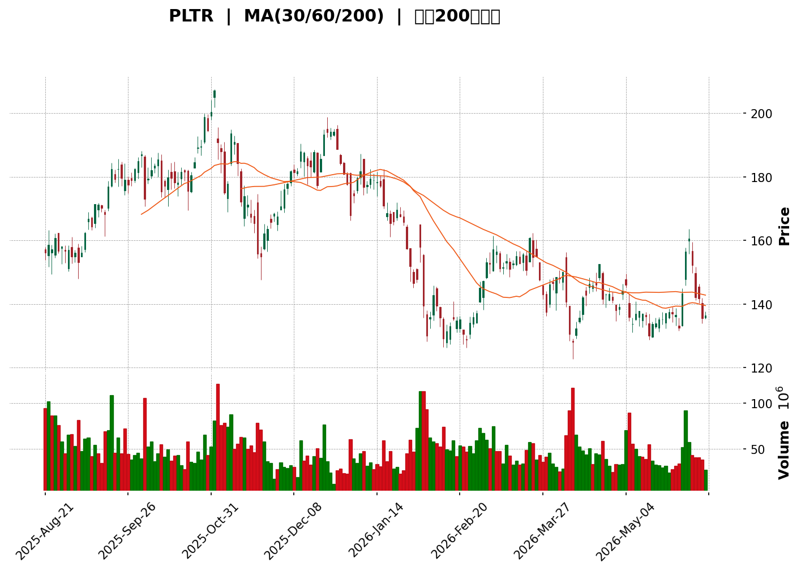
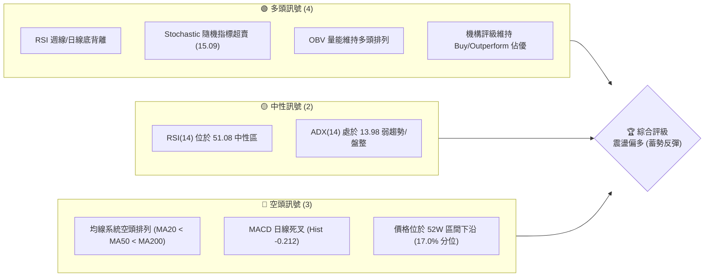
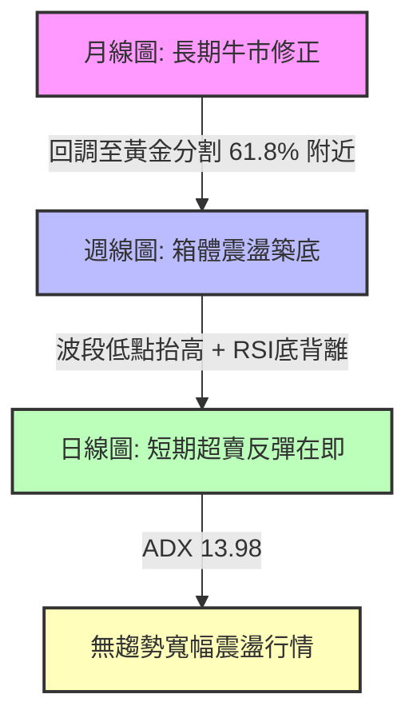
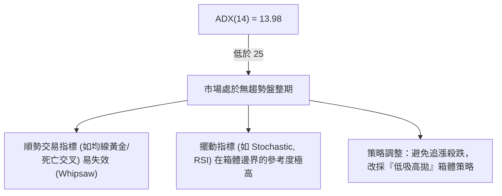
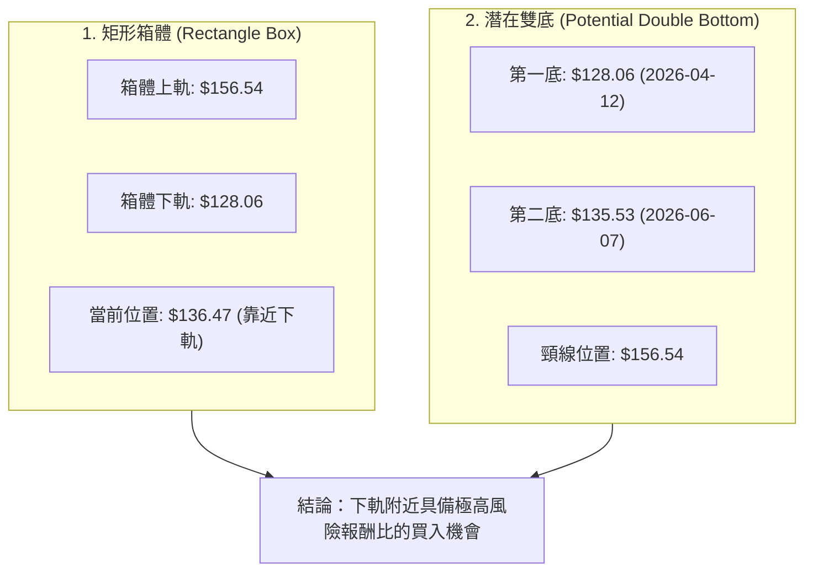

<details>
<summary>📊 靜態圖表 (點擊展開)</summary>

</details>

<html>
<head><meta charset="utf-8" /></head>
<body>
    <div style="height:500px; width:100%;">                        <script>window.PlotlyConfig = {MathJaxConfig: 'local'};</script>
        <script charset="utf-8" src="https://cdn.plot.ly/plotly-3.6.0.min.js" integrity="sha256-QaOVwtVY0T02VaHrr6pnoHLCwayMJp4O5n4YyaE3rJk=" crossorigin="anonymous"></script>                <div id="candlestick-chart" class="plotly-graph-div" style="height:100%; width:100%;"></div>            <script>                window.PLOTLYENV=window.PLOTLYENV || {};                                if (document.getElementById("candlestick-chart")) {                    Plotly.newPlot(                        "candlestick-chart",                        [{"close":{"dtype":"f8","bdata":"AAAAgMKFY0AAAAAgrtdjQAAAAKBwpWNAAAAAANcbZEAAAABACpdjQAAAAADXw2NAAAAAYLiWY0AAAABA4aJjQAAAAMDMXGNAAAAA4HqEY0AAAAAghSNjQAAAAEAzg2NAAAAAIIVLZEAAAAAgrtdkQAAAACCFi2RAAAAAgMJtZUAAAABguGZlQAAAAOBRSGVAAAAAYI8KZUAAAABACh9mQAAAAOB6zGZAAAAAYI9qZkAAAACgmdFmQAAAAIDrcWZAAAAAANdjZkAAAACAPTJmQAAAACCFW2ZAAAAAoHDNZkAAAABgZh5nQAAAAKCZYWdAAAAAgD2iZUAAAADA9XBmQAAAAKBwxWZAAAAAgOvxZkAAAABACi9nQAAAAIAU7mVAAAAAYLgmZkAAAAAgrndmQAAAAADXc2ZAAAAAANdDZkAAAADAzERmQAAAAEDhsmZAAAAA4FGwZkAAAAAgru9lQAAAACBcj2ZAAAAAACkUZ0AAAACAwqVnQAAAAEAzs2dAAAAAgOvZaEAAAACgmVFoQAAAAEAKD2lAAAAAgMLlaUAAAAAgrtdnQAAAAMDMfGdAAAAAoJnhZUAAAACAwj1mQAAAACCFM2hAAAAAYLjeZ0AAAACgcAVnQAAAAOB6hGVAAAAA4FHAZUAAAAAAAGhlQAAAAGCP6mRAAAAAoHCtZEAAAAAA13djQAAAAEAzW2NAAAAAAABIZEAAAACgmXFkQAAAAOCjuGRAAAAAYGYOZUAAAAAgru9kQAAAAIAUVmVAAAAAYI8CZkAAAACgcD1mQAAAAOBRuGZAAAAAIK6vZkAAAABA4bpmQAAAAMAefWdAAAAAoEdxZ0AAAACAPfJmQAAAAAAA6GZAAAAAAAB4Z0AAAACgRylmQAAAAIAUNmdAAAAAACksaEAAAAAgXD9oQAAAAAApRGhAAAAAoHBFaEAAAABguJZnQAAAAIDCBWdAAAAAQOGaZkAAAAAAADhmQAAAACCF+2RAAAAAoEfBZUAAAABguHZmQAAAAIDCtWZAAAAAIIUbZkAAAAAgri9mQAAAAMAebWZAAAAAYLheZkAAAADAzExmQAAAAIA9ImZAAAAAYLheZUAAAADA9RBlQAAAAGCPqmRAAAAAwMy8ZEAAAABAMzNlQAAAAEAK72RAAAAAYGa2ZEAAAABAM6tjQAAAACCF+2JAAAAAQOFSYkAAAADgUXhiQAAAAAApvGNAAAAAoEdxYUAAAADgUUBgQAAAAMDM\u002fGBAAAAAwB7dYUAAAADgUXBhQAAAAIDC9WBAAAAAACkkYEAAAADAHm1gQAAAAOCjoGBAAAAAACnsYEAAAADgetxgQAAAACCu52BAAAAAQDNTYEAAAABA4RpgQAAAAIAUxmBAAAAAgBT+YEAAAACAFCZhQAAAAKBwJWJAAAAAQApnYkAAAACAFCZjQAAAAKBwFWNAAAAAwB6lY0AAAACAwo1jQAAAAOB65GJAAAAAQDPzYkAAAAAAADBjQAAAAGBm3mJAAAAAQAoXY0AAAABgj2JjQAAAAOCjGGNAAAAAgMJ1Y0AAAACAwtViQAAAAEDhGmRAAAAAwPVYY0AAAABguF5jQAAAAIDrcWJAAAAAgOvhYUAAAACgmTFhQAAAAMD1SGJAAAAAIK5PYkAAAABguI5iQAAAAIDCfWJAAAAAgD3CYkAAAADgUZhhQAAAACCuT2BAAAAAgOsBYEAAAAAA14tgQAAAAGBm9mBAAAAAwMzEYUAAAADgUdhhQAAAAOB6TGJAAAAA4Ho8YkAAAABACj9iQAAAAADXE2NAAAAAgD2yYUAAAABA4eJhQAAAAEAz42FAAAAAgMKlYUAAAABACj9hQAAAACCFY2FAAAAAgD0CYkAAAADA9UBiQAAAAMAe\u002fWBAAAAAoEe5YEAAAACgmSFhQAAAAKCZOWFAAAAA4HocYUAAAAAAAABhQAAAAKCZQWBAAAAAIFy3YEAAAAAgrr9gQAAAAOB65GBAAAAA4FHoYEAAAADAzCRhQAAAAKBHLWFAAAAAACkcYUAAAABAMxNhQAAAAOBRkGBAAAAAQOHqYUAAAACgR5FjQAAAAMDMFGRAAAAAoHAFY0AAAABgZsZhQAAAAGBmtmFAAAAAwPXwYEAAAABACg9hQA=="},"high":{"dtype":"f8","bdata":"AAAAQAq\u002fY0AAAABgZmZkQAAAAEDh0mNAAAAAAClEZEAAAADAzExkQAAAACBcx2NAAAAAoHDNY0AAAADgesxjQAAAAMDMJGRAAAAAoEehY0AAAABACt9jQAAAAKCZyWNAAAAAAABYZEAAAAAAACBlQAAAAOCn7mRAAAAAwPVwZUAAAACgmXllQAAAAIDraWVAAAAAgMI1ZUAAAACgmVlmQAAAAKBwDWdAAAAAAADIZkAAAAAAADhnQAAAAEAzG2dAAAAAgD0KZ0AAAAAA14NmQAAAACBcr2ZAAAAA4KPYZkAAAADA9UhnQAAAAGBmhmdAAAAAQOFaZ0AAAABgZt5mQAAAAIDCRWdAAAAA4FEIZ0AAAAAA13NnQAAAAEAzY2dAAAAAQApnZkAAAABA4cpmQAAAAEAzC2dAAAAAgD0aZ0AAAABA4bJmQAAAAEDh4mZAAAAAwHLMZkAAAABguMZmQAAAAIDrsWZAAAAAoHBFZ0AAAABgjxpoQAAAAMD1+GdAAAAAQDP7aEAAAACgcPVoQAAAAIDChWlAAAAA4KPwaUAAAABgZnZoQAAAAIA9ymdAAAAAQOHiZ0AAAABgZlZmQAAAAIDCXWhAAAAAoJkdaEAAAABgj9JnQAAAAGBm1mZAAAAAoEcpZkAAAAAgrsdlQAAAAGCPmmVAAAAAQDMzZUAAAACAPdJlQAAAACCFw2NAAAAAoHClZEAAAADAzJRkQAAAACDZCmVAAAAAoJkZZUAAAABAMyNlQAAAAAAA+GVAAAAAwB49ZkAAAACAFE5mQAAAAGDlxGZAAAAAACn8ZkAAAABAM9tmQAAAAOB6zGdAAAAAoJmBZ0AAAADAzFBnQAAAAMD1eGdAAAAAAACQZ0AAAAAAAHhnQAAAAGCPamdAAAAAAABgaEAAAAAAKdxoQAAAAADXa2hAAAAAoHBlaEAAAABAM4toQAAAAGBmZmdAAAAAAFQXZ0AAAADA9bBmQAAAAEAzq2ZAAAAAgD36ZUAAAACAFIZmQAAAAMD1aGdAAAAAwB41Z0AAAABACldmQAAAAAAA0GZAAAAAQDOjZkAAAADgIrNmQAAAAEAzk2ZAAAAAgMLNZkAAAABACn9lQAAAACCuL2VAAAAAAAAgZUAAAAAAAIBlQAAAAEDhUmVAAAAAgBQuZUAAAACgcKFkQAAAAAAptGNAAAAAAADgYkAAAADAzOxiQAAAAAB\u002fomRAAAAAQDN7Y0AAAAAgXD9hQAAAAOD7NWFAAAAAANc7YkAAAACA6zFiQAAAAAAAaGFAAAAA4Hr8YEAAAACA67FgQAAAAIA9ymBAAAAA4NCeYUAAAADAHgVhQAAAAGC4BmFAAAAAoEeBYEAAAAAgrkdgQAAAAEDhAmFAAAAA4FEwYUAAAABAM0NhQAAAAOB6ZGJAAAAAAABwYkAAAADgo1BjQAAAAAApjGNAAAAAYGYuZEAAAACAFM5jQAAAACAGlWNAAAAAgGglY0AAAAAAKXxjQAAAAIDrUWNAAAAAIIU7Y0AAAAAAAJhjQAAAAIAUlmNAAAAAwMyEY0AAAADAzJRjQAAAAGCPImRAAAAAwMxMZEAAAADgowhkQAAAAADXI2NAAAAAYLg+YkAAAAAA1wNiQAAAACCFe2JAAAAAoJmJYkAAAADgUZBiQAAAACCF02JAAAAA4KPIYkAAAADA9YhjQAAAAKBHcWFAAAAAYGYmYEAAAACgcM1gQAAAAIA9QmFAAAAAYI\u002fSYUAAAACgmTFiQAAAAMD1iGJAAAAAYGZmYkAAAAAA17tiQAAAAIDCFWNAAAAAoEfJYkAAAABgj+phQAAAAIA9ImJAAAAAQDP7YUAAAADgUXhhQAAAAGBmhmFAAAAAgBROYkAAAADgerRiQAAAACBc32FAAAAAYGb2YEAAAABgZp5hQAAAAAApPGFAAAAA4HokYUAAAACAwi1hQAAAACCuH2FAAAAAIFzPYEAAAADgevRgQAAAAIDr\u002fWBAAAAAQAovYUAAAAAgridhQAAAAKCZUWFAAAAA4KNgYUAAAACAwlVhQAAAACBc92BAAAAAAAAgYkAAAACg7bhjQAAAAGBmdmRAAAAAoJnxY0AAAACAwvViQAAAAADXS2JAAAAAQAq\u002fYUAAAADgUThhQA=="},"hovertemplate":"\u003cb\u003e%{x|%Y-%m-%d}\u003c\u002fb\u003e\u003cbr\u003e\u958b: $%{open:.2f}\u003cbr\u003e\u9ad8: $%{high:.2f}\u003cbr\u003e\u4f4e: $%{low:.2f}\u003cbr\u003e\u6536: $%{close:.2f}\u003cextra\u003e\u003c\u002fextra\u003e","low":{"dtype":"f8","bdata":"AAAAgOs5Y0AAAADgo\u002fhiQAAAAADXq2JAAAAAgD1SY0AAAAAgXH9jQAAAAKCZEWNAAAAAAAAgY0AAAADA9chiQAAAAGC4FmNAAAAAwB4lY0AAAACgR4FiQAAAAEDhWmNAAAAAANeLY0AAAACAFG5kQAAAAEAKZ2RAAAAA4FGAZEAAAADAHu1kQAAAAGC4HmVAAAAA4KMoZEAAAADgeixlQAAAAGC4FmZAAAAAoEdJZkAAAADgUSBmQAAAAADXI2ZAAAAAoEfJZUAAAADAHt1lQAAAAMAeJWZAAAAAQApHZkAAAAAAAHBmQAAAAGBm3mZAAAAA4KNYZUAAAABgjzpmQAAAAKBwbWZAAAAAYGamZkAAAABgZn5mQAAAAMD1sGVAAAAAYGauZUAAAACAPVplQAAAAOCjAGZAAAAAYGYOZkAAAABgZr5lQAAAAIAULmZAAAAAwMxUZkAAAACgcC1lQAAAAOBR4GVAAAAAQDPbZkAAAADgo3BnQAAAAMD1WGdAAAAAIK7PZ0AAAAAA10NoQAAAAKBwvWhAAAAAgD06aUAAAACA6zFnQAAAAGC4pmZAAAAAwPXQZUAAAADAHh1lQAAAAOCj8GZAAAAAAClkZ0AAAADAzIxmQAAAAGBkV2VAAAAAAACQZEAAAACAwvVkQAAAAAAAsGRAAAAAoHBNZEAAAADgo0xjQAAAAIDrcWJAAAAAAACgY0AAAACAwpFjQAAAAAApfGRAAAAAAAC8ZEAAAAAA12NkQAAAAEDhMmVAAAAAYI8aZUAAAACAws1lQAAAAMAeJWZAAAAAoEdxZkAAAAAAKYxmQAAAAAAA2GZAAAAAYLiGZkAAAAAgWDVmQAAAAMD1gGZAAAAAQIukZkAAAAAAABBmQAAAAOBRsGZAAAAAIFxXZ0AAAACAwg1oQAAAACCF92dAAAAAYI8aaEAAAAAA15NnQAAAAOB69GZAAAAAYGaWZkAAAAAAAChmQAAAAEAzy2RAAAAAoEd5ZUAAAADgo9hlQAAAAMAeNWZAAAAAANfLZUAAAAAAANhlQAAAAEDhCmZAAAAA4HoEZkAAAABgZr5lQAAAAMD1EGZAAAAA4FFAZUAAAAAgrsdkQAAAACCFI2RAAAAAYGaeZEAAAACgmclkQAAAAGBm6mRAAAAAgBSWZEAAAAAgrqdjQAAAAADXY2JAAAAAwHIkYkAAAACg7VRiQAAAAADXI2NAAAAAgML1YEAAAACAPQpgQAAAAEAzi2BAAAAAANXYYEAAAADgozhhQAAAAGBmnmBAAAAAANejX0AAAACA6Y5fQAAAAGCP0l9AAAAAANfbYEAAAADgUWBgQAAAAKBwZWBAAAAAwPXYX0AAAAAgrpdfQAAAAIDCJWBAAAAAACmUYEAAAAAgXL9gQAAAAOCjkGFAAAAAYGZGYUAAAACA64FiQAAAACCFs2JAAAAAoEfJYkAAAABACh9jQAAAAOB6xGJAAAAAYI+qYkAAAAAgXN9iQAAAAGCPkmJAAAAAoHDlYkAAAAAA1wNjQAAAACCFE2NAAAAAAADQYkAAAABA4aJiQAAAACCuJ2NAAAAA4Hr0YkAAAAAgXFtjQAAAAAAAaGJAAAAAgOuxYUAAAACgmQlhQAAAAEAKX2FAAAAAQAoPYkAAAAAgrj9hQAAAACAxVGJAAAAAYGYOYkAAAACgcGVhQAAAAEAKD2BAAAAAIIWrXkAAAADAzCRgQAAAAAAAwGBAAAAAgMLdYEAAAADA9XBhQAAAAKCZ6WFAAAAAYI\u002f6YUAAAADA9\u002f9hQAAAAMAebWJAAAAAoHB9YUAAAACAwl1hQAAAAOBRoGFAAAAAoHCNYUAAAACAwtVgQAAAAMDMFGFAAAAA4HqsYUAAAABAMydiQAAAAEAK12BAAAAAwMxkYEAAAADA9dhgQAAAAOCjoGBAAAAAAKyYYEAAAABguK5gQAAAAAAAGGBAAAAAYGYuYEAAAACgR4lgQAAAAGCPamBAAAAAQDOzYEAAAACgcI1gQAAAAKBw7WBAAAAAoJnJYEAAAACgmalgQAAAAAApdGBAAAAAAACgYEAAAACgRzliQAAAAAApfGNAAAAAoJm5YkAAAAAAAKhhQAAAAEC0iGFAAAAAwMzAYEAAAACgR+lgQA=="},"name":"\u50f9\u683c","open":{"dtype":"f8","bdata":"AAAAoHClY0AAAACAFGpjQAAAAEAzg2NAAAAA4HpsY0AAAACAPUpkQAAAAAAptGNAAAAAIFyfY0AAAABgZuZiQAAAAAAAwGNAAAAAIK5bY0AAAACAPbpjQAAAAMAeXWNAAAAAAACoY0AAAAAAAMBkQAAAACCu52RAAAAAQDOrZEAAAABAMzNlQAAAAKBHYWVAAAAA4KMgZUAAAADgo0hlQAAAAIA9ImZAAAAAACmcZkAAAADgUdBmQAAAAMAe\u002fWZAAAAAoJn5ZUAAAACgmWFmQAAAAOB6dGZAAAAAIFxfZkAAAACAPapmQAAAAGBmVmdAAAAAwMxMZ0AAAACAwmVmQAAAAIDriWZAAAAAoJnZZkAAAABgj\u002fJmQAAAAKBwJWdAAAAAgMJVZkAAAAAAAABmQAAAAMD1tGZAAAAAwPW4ZkAAAAAAADhmQAAAACCub2ZAAAAAgOvBZkAAAACAwr1mQAAAAIA97mVAAAAAACncZkAAAABACp9nQAAAACBcr2dAAAAAYI\u002fiZ0AAAACgmc1oQAAAAGBm5mhAAAAAoHChaUAAAACAPQJoQAAAAAAAoGdAAAAAIK5\u002fZ0AAAADAzKRlQAAAAIDrCWdAAAAAYLjKZ0AAAABgj9JnQAAAAEDhtmZAAAAAQDPfZEAAAADA9VBlQAAAAADXC2VAAAAAoJn5ZEAAAACAPYJlQAAAAOBRgGNAAAAAQAqvY0AAAACAPQJkQAAAAEAz22RAAAAA4FH4ZEAAAAAAAKBkQAAAAEDhMmVAAAAA4HpEZUAAAAAgrgtmQAAAACBcR2ZAAAAAYLjGZkAAAABACp9mQAAAAGBmHmdAAAAAoJkZZ0AAAACA6zlnQAAAAGCPImdAAAAAwPW0ZkAAAABA4XZnQAAAAOBRsGZAAAAAIK5XZ0AAAACgR2FoQAAAAGBmGmhAAAAAwB4laEAAAADgemBoQAAAAEAzW2dAAAAAQDMLZ0AAAAAAKaRmQAAAAKCZqWZAAAAAACncZUAAAADgUfhlQAAAAKCZeWZAAAAAIK4zZ0AAAADgoyBmQAAAAIDrNWZAAAAAAABcZkAAAAAAAERmQAAAAGC4VmZAAAAAIIVrZkAAAAAAAPRkQAAAACDdDGVAAAAAoJkdZUAAAADgo+hkQAAAAGC4BmVAAAAAIFzvZEAAAADAzIxkQAAAAAAptGNAAAAAoJnBYkAAAACAFN5iQAAAAKCZoWRAAAAAwB5tY0AAAACAPRphQAAAAGCP6mBAAAAAYI8SYUAAAABA4R5iQAAAAMDMYGFAAAAAIIXrYEAAAACgmflfQAAAAOCjHGBAAAAA4Hr8YEAAAACA64lgQAAAACCui2BAAAAAoEeBYEAAAAAAKSBgQAAAACCFU2BAAAAAQAq7YEAAAACAPcJgQAAAAMDMmGFAAAAAQDPDYUAAAACAwo1iQAAAAIAUHmNAAAAAgBTOYkAAAACAFHZjQAAAACCuf2NAAAAAACnsYkAAAADgUSBjQAAAAKCZKWNAAAAAYGYOY0AAAADA9QxjQAAAAIA9XmNAAAAAQDMjY0AAAABgZmZjQAAAACCuJ2NAAAAAgD0CZEAAAACgcK1jQAAAAIDCIWNAAAAAACk8YkAAAADgo+hhQAAAAOCjgGFAAAAAAABgYkAAAAAghe9hQAAAACCFi2JAAAAAYDlcYkAAAADgelhjQAAAAOCjbGFAAAAAIFwPYEAAAAAgXEdgQAAAAACqzWBAAAAAoEcZYUAAAACgRwliQAAAAIAUKmJAAAAAAAAgYkAAAACA61liQAAAACCFi2JAAAAAYGa2YkAAAABguN5hQAAAAAAAqGFAAAAAoJnJYUAAAADgUXhhQAAAAEAzT2FAAAAAAADoYUAAAAAAAHhiQAAAAKBwiWFAAAAAYLi2YEAAAABAM+NgQAAAACCu+2BAAAAAwB7dYEAAAABAMxNhQAAAACAxwGBAAAAAwMw0YEAAAACgmZlgQAAAAAAAkGBAAAAAoHDlYEAAAADgo8RgQAAAAKCZ+WBAAAAAoJktYUAAAADAHgVhQAAAAKCZqWBAAAAAwB6lYEAAAABgZnpiQAAAACBc\u002f2NAAAAAgBSWY0AAAABgZrZiQAAAAGC4LmJAAAAAYGaKYUAAAADAzPRgQA=="},"x":["2025-08-21T00:00:00-04:00","2025-08-22T00:00:00-04:00","2025-08-25T00:00:00-04:00","2025-08-26T00:00:00-04:00","2025-08-27T00:00:00-04:00","2025-08-28T00:00:00-04:00","2025-08-29T00:00:00-04:00","2025-09-02T00:00:00-04:00","2025-09-03T00:00:00-04:00","2025-09-04T00:00:00-04:00","2025-09-05T00:00:00-04:00","2025-09-08T00:00:00-04:00","2025-09-09T00:00:00-04:00","2025-09-10T00:00:00-04:00","2025-09-11T00:00:00-04:00","2025-09-12T00:00:00-04:00","2025-09-15T00:00:00-04:00","2025-09-16T00:00:00-04:00","2025-09-17T00:00:00-04:00","2025-09-18T00:00:00-04:00","2025-09-19T00:00:00-04:00","2025-09-22T00:00:00-04:00","2025-09-23T00:00:00-04:00","2025-09-24T00:00:00-04:00","2025-09-25T00:00:00-04:00","2025-09-26T00:00:00-04:00","2025-09-29T00:00:00-04:00","2025-09-30T00:00:00-04:00","2025-10-01T00:00:00-04:00","2025-10-02T00:00:00-04:00","2025-10-03T00:00:00-04:00","2025-10-06T00:00:00-04:00","2025-10-07T00:00:00-04:00","2025-10-08T00:00:00-04:00","2025-10-09T00:00:00-04:00","2025-10-10T00:00:00-04:00","2025-10-13T00:00:00-04:00","2025-10-14T00:00:00-04:00","2025-10-15T00:00:00-04:00","2025-10-16T00:00:00-04:00","2025-10-17T00:00:00-04:00","2025-10-20T00:00:00-04:00","2025-10-21T00:00:00-04:00","2025-10-22T00:00:00-04:00","2025-10-23T00:00:00-04:00","2025-10-24T00:00:00-04:00","2025-10-27T00:00:00-04:00","2025-10-28T00:00:00-04:00","2025-10-29T00:00:00-04:00","2025-10-30T00:00:00-04:00","2025-10-31T00:00:00-04:00","2025-11-03T00:00:00-05:00","2025-11-04T00:00:00-05:00","2025-11-05T00:00:00-05:00","2025-11-06T00:00:00-05:00","2025-11-07T00:00:00-05:00","2025-11-10T00:00:00-05:00","2025-11-11T00:00:00-05:00","2025-11-12T00:00:00-05:00","2025-11-13T00:00:00-05:00","2025-11-14T00:00:00-05:00","2025-11-17T00:00:00-05:00","2025-11-18T00:00:00-05:00","2025-11-19T00:00:00-05:00","2025-11-20T00:00:00-05:00","2025-11-21T00:00:00-05:00","2025-11-24T00:00:00-05:00","2025-11-25T00:00:00-05:00","2025-11-26T00:00:00-05:00","2025-11-28T00:00:00-05:00","2025-12-01T00:00:00-05:00","2025-12-02T00:00:00-05:00","2025-12-03T00:00:00-05:00","2025-12-04T00:00:00-05:00","2025-12-05T00:00:00-05:00","2025-12-08T00:00:00-05:00","2025-12-09T00:00:00-05:00","2025-12-10T00:00:00-05:00","2025-12-11T00:00:00-05:00","2025-12-12T00:00:00-05:00","2025-12-15T00:00:00-05:00","2025-12-16T00:00:00-05:00","2025-12-17T00:00:00-05:00","2025-12-18T00:00:00-05:00","2025-12-19T00:00:00-05:00","2025-12-22T00:00:00-05:00","2025-12-23T00:00:00-05:00","2025-12-24T00:00:00-05:00","2025-12-26T00:00:00-05:00","2025-12-29T00:00:00-05:00","2025-12-30T00:00:00-05:00","2025-12-31T00:00:00-05:00","2026-01-02T00:00:00-05:00","2026-01-05T00:00:00-05:00","2026-01-06T00:00:00-05:00","2026-01-07T00:00:00-05:00","2026-01-08T00:00:00-05:00","2026-01-09T00:00:00-05:00","2026-01-12T00:00:00-05:00","2026-01-13T00:00:00-05:00","2026-01-14T00:00:00-05:00","2026-01-15T00:00:00-05:00","2026-01-16T00:00:00-05:00","2026-01-20T00:00:00-05:00","2026-01-21T00:00:00-05:00","2026-01-22T00:00:00-05:00","2026-01-23T00:00:00-05:00","2026-01-26T00:00:00-05:00","2026-01-27T00:00:00-05:00","2026-01-28T00:00:00-05:00","2026-01-29T00:00:00-05:00","2026-01-30T00:00:00-05:00","2026-02-02T00:00:00-05:00","2026-02-03T00:00:00-05:00","2026-02-04T00:00:00-05:00","2026-02-05T00:00:00-05:00","2026-02-06T00:00:00-05:00","2026-02-09T00:00:00-05:00","2026-02-10T00:00:00-05:00","2026-02-11T00:00:00-05:00","2026-02-12T00:00:00-05:00","2026-02-13T00:00:00-05:00","2026-02-17T00:00:00-05:00","2026-02-18T00:00:00-05:00","2026-02-19T00:00:00-05:00","2026-02-20T00:00:00-05:00","2026-02-23T00:00:00-05:00","2026-02-24T00:00:00-05:00","2026-02-25T00:00:00-05:00","2026-02-26T00:00:00-05:00","2026-02-27T00:00:00-05:00","2026-03-02T00:00:00-05:00","2026-03-03T00:00:00-05:00","2026-03-04T00:00:00-05:00","2026-03-05T00:00:00-05:00","2026-03-06T00:00:00-05:00","2026-03-09T00:00:00-04:00","2026-03-10T00:00:00-04:00","2026-03-11T00:00:00-04:00","2026-03-12T00:00:00-04:00","2026-03-13T00:00:00-04:00","2026-03-16T00:00:00-04:00","2026-03-17T00:00:00-04:00","2026-03-18T00:00:00-04:00","2026-03-19T00:00:00-04:00","2026-03-20T00:00:00-04:00","2026-03-23T00:00:00-04:00","2026-03-24T00:00:00-04:00","2026-03-25T00:00:00-04:00","2026-03-26T00:00:00-04:00","2026-03-27T00:00:00-04:00","2026-03-30T00:00:00-04:00","2026-03-31T00:00:00-04:00","2026-04-01T00:00:00-04:00","2026-04-02T00:00:00-04:00","2026-04-06T00:00:00-04:00","2026-04-07T00:00:00-04:00","2026-04-08T00:00:00-04:00","2026-04-09T00:00:00-04:00","2026-04-10T00:00:00-04:00","2026-04-13T00:00:00-04:00","2026-04-14T00:00:00-04:00","2026-04-15T00:00:00-04:00","2026-04-16T00:00:00-04:00","2026-04-17T00:00:00-04:00","2026-04-20T00:00:00-04:00","2026-04-21T00:00:00-04:00","2026-04-22T00:00:00-04:00","2026-04-23T00:00:00-04:00","2026-04-24T00:00:00-04:00","2026-04-27T00:00:00-04:00","2026-04-28T00:00:00-04:00","2026-04-29T00:00:00-04:00","2026-04-30T00:00:00-04:00","2026-05-01T00:00:00-04:00","2026-05-04T00:00:00-04:00","2026-05-05T00:00:00-04:00","2026-05-06T00:00:00-04:00","2026-05-07T00:00:00-04:00","2026-05-08T00:00:00-04:00","2026-05-11T00:00:00-04:00","2026-05-12T00:00:00-04:00","2026-05-13T00:00:00-04:00","2026-05-14T00:00:00-04:00","2026-05-15T00:00:00-04:00","2026-05-18T00:00:00-04:00","2026-05-19T00:00:00-04:00","2026-05-20T00:00:00-04:00","2026-05-21T00:00:00-04:00","2026-05-22T00:00:00-04:00","2026-05-26T00:00:00-04:00","2026-05-27T00:00:00-04:00","2026-05-28T00:00:00-04:00","2026-05-29T00:00:00-04:00","2026-06-01T00:00:00-04:00","2026-06-02T00:00:00-04:00","2026-06-03T00:00:00-04:00","2026-06-04T00:00:00-04:00","2026-06-05T00:00:00-04:00","2026-06-08T00:00:00-04:00"],"type":"candlestick"},{"hovertemplate":"MA30: $%{y:.2f}\u003cextra\u003e\u003c\u002fextra\u003e","line":{"color":"#2196F3","dash":"dash","width":2},"mode":"lines","name":"MA30","x":["2025-08-21T00:00:00-04:00","2025-08-22T00:00:00-04:00","2025-08-25T00:00:00-04:00","2025-08-26T00:00:00-04:00","2025-08-27T00:00:00-04:00","2025-08-28T00:00:00-04:00","2025-08-29T00:00:00-04:00","2025-09-02T00:00:00-04:00","2025-09-03T00:00:00-04:00","2025-09-04T00:00:00-04:00","2025-09-05T00:00:00-04:00","2025-09-08T00:00:00-04:00","2025-09-09T00:00:00-04:00","2025-09-10T00:00:00-04:00","2025-09-11T00:00:00-04:00","2025-09-12T00:00:00-04:00","2025-09-15T00:00:00-04:00","2025-09-16T00:00:00-04:00","2025-09-17T00:00:00-04:00","2025-09-18T00:00:00-04:00","2025-09-19T00:00:00-04:00","2025-09-22T00:00:00-04:00","2025-09-23T00:00:00-04:00","2025-09-24T00:00:00-04:00","2025-09-25T00:00:00-04:00","2025-09-26T00:00:00-04:00","2025-09-29T00:00:00-04:00","2025-09-30T00:00:00-04:00","2025-10-01T00:00:00-04:00","2025-10-02T00:00:00-04:00","2025-10-03T00:00:00-04:00","2025-10-06T00:00:00-04:00","2025-10-07T00:00:00-04:00","2025-10-08T00:00:00-04:00","2025-10-09T00:00:00-04:00","2025-10-10T00:00:00-04:00","2025-10-13T00:00:00-04:00","2025-10-14T00:00:00-04:00","2025-10-15T00:00:00-04:00","2025-10-16T00:00:00-04:00","2025-10-17T00:00:00-04:00","2025-10-20T00:00:00-04:00","2025-10-21T00:00:00-04:00","2025-10-22T00:00:00-04:00","2025-10-23T00:00:00-04:00","2025-10-24T00:00:00-04:00","2025-10-27T00:00:00-04:00","2025-10-28T00:00:00-04:00","2025-10-29T00:00:00-04:00","2025-10-30T00:00:00-04:00","2025-10-31T00:00:00-04:00","2025-11-03T00:00:00-05:00","2025-11-04T00:00:00-05:00","2025-11-05T00:00:00-05:00","2025-11-06T00:00:00-05:00","2025-11-07T00:00:00-05:00","2025-11-10T00:00:00-05:00","2025-11-11T00:00:00-05:00","2025-11-12T00:00:00-05:00","2025-11-13T00:00:00-05:00","2025-11-14T00:00:00-05:00","2025-11-17T00:00:00-05:00","2025-11-18T00:00:00-05:00","2025-11-19T00:00:00-05:00","2025-11-20T00:00:00-05:00","2025-11-21T00:00:00-05:00","2025-11-24T00:00:00-05:00","2025-11-25T00:00:00-05:00","2025-11-26T00:00:00-05:00","2025-11-28T00:00:00-05:00","2025-12-01T00:00:00-05:00","2025-12-02T00:00:00-05:00","2025-12-03T00:00:00-05:00","2025-12-04T00:00:00-05:00","2025-12-05T00:00:00-05:00","2025-12-08T00:00:00-05:00","2025-12-09T00:00:00-05:00","2025-12-10T00:00:00-05:00","2025-12-11T00:00:00-05:00","2025-12-12T00:00:00-05:00","2025-12-15T00:00:00-05:00","2025-12-16T00:00:00-05:00","2025-12-17T00:00:00-05:00","2025-12-18T00:00:00-05:00","2025-12-19T00:00:00-05:00","2025-12-22T00:00:00-05:00","2025-12-23T00:00:00-05:00","2025-12-24T00:00:00-05:00","2025-12-26T00:00:00-05:00","2025-12-29T00:00:00-05:00","2025-12-30T00:00:00-05:00","2025-12-31T00:00:00-05:00","2026-01-02T00:00:00-05:00","2026-01-05T00:00:00-05:00","2026-01-06T00:00:00-05:00","2026-01-07T00:00:00-05:00","2026-01-08T00:00:00-05:00","2026-01-09T00:00:00-05:00","2026-01-12T00:00:00-05:00","2026-01-13T00:00:00-05:00","2026-01-14T00:00:00-05:00","2026-01-15T00:00:00-05:00","2026-01-16T00:00:00-05:00","2026-01-20T00:00:00-05:00","2026-01-21T00:00:00-05:00","2026-01-22T00:00:00-05:00","2026-01-23T00:00:00-05:00","2026-01-26T00:00:00-05:00","2026-01-27T00:00:00-05:00","2026-01-28T00:00:00-05:00","2026-01-29T00:00:00-05:00","2026-01-30T00:00:00-05:00","2026-02-02T00:00:00-05:00","2026-02-03T00:00:00-05:00","2026-02-04T00:00:00-05:00","2026-02-05T00:00:00-05:00","2026-02-06T00:00:00-05:00","2026-02-09T00:00:00-05:00","2026-02-10T00:00:00-05:00","2026-02-11T00:00:00-05:00","2026-02-12T00:00:00-05:00","2026-02-13T00:00:00-05:00","2026-02-17T00:00:00-05:00","2026-02-18T00:00:00-05:00","2026-02-19T00:00:00-05:00","2026-02-20T00:00:00-05:00","2026-02-23T00:00:00-05:00","2026-02-24T00:00:00-05:00","2026-02-25T00:00:00-05:00","2026-02-26T00:00:00-05:00","2026-02-27T00:00:00-05:00","2026-03-02T00:00:00-05:00","2026-03-03T00:00:00-05:00","2026-03-04T00:00:00-05:00","2026-03-05T00:00:00-05:00","2026-03-06T00:00:00-05:00","2026-03-09T00:00:00-04:00","2026-03-10T00:00:00-04:00","2026-03-11T00:00:00-04:00","2026-03-12T00:00:00-04:00","2026-03-13T00:00:00-04:00","2026-03-16T00:00:00-04:00","2026-03-17T00:00:00-04:00","2026-03-18T00:00:00-04:00","2026-03-19T00:00:00-04:00","2026-03-20T00:00:00-04:00","2026-03-23T00:00:00-04:00","2026-03-24T00:00:00-04:00","2026-03-25T00:00:00-04:00","2026-03-26T00:00:00-04:00","2026-03-27T00:00:00-04:00","2026-03-30T00:00:00-04:00","2026-03-31T00:00:00-04:00","2026-04-01T00:00:00-04:00","2026-04-02T00:00:00-04:00","2026-04-06T00:00:00-04:00","2026-04-07T00:00:00-04:00","2026-04-08T00:00:00-04:00","2026-04-09T00:00:00-04:00","2026-04-10T00:00:00-04:00","2026-04-13T00:00:00-04:00","2026-04-14T00:00:00-04:00","2026-04-15T00:00:00-04:00","2026-04-16T00:00:00-04:00","2026-04-17T00:00:00-04:00","2026-04-20T00:00:00-04:00","2026-04-21T00:00:00-04:00","2026-04-22T00:00:00-04:00","2026-04-23T00:00:00-04:00","2026-04-24T00:00:00-04:00","2026-04-27T00:00:00-04:00","2026-04-28T00:00:00-04:00","2026-04-29T00:00:00-04:00","2026-04-30T00:00:00-04:00","2026-05-01T00:00:00-04:00","2026-05-04T00:00:00-04:00","2026-05-05T00:00:00-04:00","2026-05-06T00:00:00-04:00","2026-05-07T00:00:00-04:00","2026-05-08T00:00:00-04:00","2026-05-11T00:00:00-04:00","2026-05-12T00:00:00-04:00","2026-05-13T00:00:00-04:00","2026-05-14T00:00:00-04:00","2026-05-15T00:00:00-04:00","2026-05-18T00:00:00-04:00","2026-05-19T00:00:00-04:00","2026-05-20T00:00:00-04:00","2026-05-21T00:00:00-04:00","2026-05-22T00:00:00-04:00","2026-05-26T00:00:00-04:00","2026-05-27T00:00:00-04:00","2026-05-28T00:00:00-04:00","2026-05-29T00:00:00-04:00","2026-06-01T00:00:00-04:00","2026-06-02T00:00:00-04:00","2026-06-03T00:00:00-04:00","2026-06-04T00:00:00-04:00","2026-06-05T00:00:00-04:00","2026-06-08T00:00:00-04:00"],"y":{"dtype":"f8","bdata":"AAAAAAAA+H8AAAAAAAD4fwAAAAAAAPh\u002fAAAAAAAA+H8AAAAAAAD4fwAAAAAAAPh\u002fAAAAAAAA+H8AAAAAAAD4fwAAAAAAAPh\u002fAAAAAAAA+H8AAAAAAAD4fwAAAAAAAPh\u002fAAAAAAAA+H8AAAAAAAD4fwAAAAAAAPh\u002fAAAAAAAA+H8AAAAAAAD4fwAAAAAAAPh\u002fAAAAAAAA+H8AAAAAAAD4fwAAAAAAAPh\u002fAAAAAAAA+H8AAAAAAAD4fwAAAAAAAPh\u002fAAAAAAAA+H8AAAAAAAD4fwAAAAAAAPh\u002fAAAAAAAA+H8AAAAAAAD4f97d3R3MB2VAd3d3N9AZZUBVVVVF\u002fS9lQAAAAPCnSmVAIiIi0ttiZUDNzMx8hoFlQBEREQEAlGVA7+7u3t2pZUBVVVXVBsJlQKuqqgpl3GVAvLu7C9fzZUAiIiKijA5mQJqZmRm9KWZAMzMzUyo+ZkCJiIiof0dmQN7d3X2xWGZAmpmZ+cVmZkCrqqr68HlmQHd3dxeSjmZAmpmZKRWvZkDNzMys1cFmQImIiLge1WZAAAAAoNPyZkCrqqoKkPtmQKuqqmp1BGdAmpmZCR4AZ0BmZmZWgABnQCIiIhI8EGdAAAAAEFgZZ0AiIiISgxhnQFVVVaWbCGdAMzMzU5wJZ0BVVVVVxwBnQGZmZgbz8GZAiYiImJndZkAAAACw5L1mQO\u002fu7j7up2ZAq6qqKvmXZkB3d3c3tIZmQO\u002fu7j7ud2ZAERERsZ1tZkDe3d3NPmJmQBEREWGeVmZAERERodNQZkDe3d0ta1NmQERERLTIVGZAZmZmRm9RZkB3d3f3mklmQLy7u3vNR2ZAVVVVBcg7ZkAAAADAETBmQKuqqoqzHWZAvLu72\u002fkIZkC8u7sbofplQCIiIqJF+GVAIiIi8tILZkCrqqqq8RxmQJqZmal\u002fHWZARERENOwgZkDe3d3twyVmQGZmZqabMmZAIiIisuQ5ZkARERGh00BmQKuqqlpkQWZAAAAAMJZKZkC8u7s7JmRmQLy7u5vEgGZAzczMHFqQZkCamZmpOJ9mQKuqqkrFrWZAmpmZOfu4ZkARERFhnsRmQLy7u4tsy2ZAIiIicvbFZkCamZlZ8rtmQN7d3d1rqmZAERERwcqZZkC8u7trvIxmQAAAAPDudmZAmpmZKaNfZkCrqqpaq0NmQKuqqsovImZA3t3dXUj2ZUBVVVW1yNZlQJqZmbkeuWVAAAAA0LB\u002fZUDNzMy8dDtlQAAAABBY\u002fWRAq6qqqqrGZECJiIjIL5JkQM3MzAx0XmRAZmZmxksnZEDe3d3d3fVjQJqZmTm00GNAiYiIeHenY0Dv7u6eqHdjQImIiGgfRmNAiYiIWMcUY0BmZmam4uBiQDMzM5OmsGJA7+7uPsOCYkC8u7srzlZiQHd3d1fHNGJAzczMvHQbYkBVVVXlFwtiQO\u002fu7t6W\u002fWFAVVVVRUT0YUCrqqr6N+ZhQM3MzMzM1GFAAAAAkMLFYUARERFBp8FhQDMzM8OuwGFAmpmZqTjHYUAzMzODB89hQERERCSUyWFAAAAAcMvaYUCamZm51\u002fBhQCIiIgJyC2JA7+7uThsYYkARERExlihiQJqZmTlCNWJAq6qqCh5EYkC8u7urqkpiQImIiIjPWGJA3t3dTalkYkAiIiLSInNiQImIiAisgGJAREREpHCVYkCJiIiYJ6JiQAAAAEA1nmJAvLu7e82VYkDNzMxMqZBiQLy7u1uPhmJAiYiI6CaBYkAiIiLSBnZiQGZmZvZTb2JAAAAAgE5jYkCamZk5JlhiQM3MzFy6WWJAERERgQdPYkARERHh7ENiQO\u002fu7k6NO2JA3t3dHT4vYkAiIiLy\u002fRxiQKuqqtprDmJA3t3djQkCYkC8u7vLE\u002f1hQO\u002fu7j584mFAMzMzkxjMYUAzMzPz\u002fbhhQCIiItKUrmFAAAAAAACoYUDv7u6+WKZhQAAAAOAIlWFAq6qqimyHYUBERERE\u002fXdhQO\u002fu7r5YamFAAAAAoIxaYUCrqqraslZhQGZmZtYVXmFAmpmZSX5nYUDNzMxcAWxhQHd3d0eaaGFAq6qqOt9pYUBmZmYWknhhQERERATIh2FAAAAA4HqOYUCamZlpdYphQGZmZobPfmFAMzMzM154YUAAAACATnFhQA=="},"type":"scatter"},{"hovertemplate":"MA60: $%{y:.2f}\u003cextra\u003e\u003c\u002fextra\u003e","line":{"color":"#9C27B0","dash":"dash","width":2},"mode":"lines","name":"MA60","x":["2025-08-21T00:00:00-04:00","2025-08-22T00:00:00-04:00","2025-08-25T00:00:00-04:00","2025-08-26T00:00:00-04:00","2025-08-27T00:00:00-04:00","2025-08-28T00:00:00-04:00","2025-08-29T00:00:00-04:00","2025-09-02T00:00:00-04:00","2025-09-03T00:00:00-04:00","2025-09-04T00:00:00-04:00","2025-09-05T00:00:00-04:00","2025-09-08T00:00:00-04:00","2025-09-09T00:00:00-04:00","2025-09-10T00:00:00-04:00","2025-09-11T00:00:00-04:00","2025-09-12T00:00:00-04:00","2025-09-15T00:00:00-04:00","2025-09-16T00:00:00-04:00","2025-09-17T00:00:00-04:00","2025-09-18T00:00:00-04:00","2025-09-19T00:00:00-04:00","2025-09-22T00:00:00-04:00","2025-09-23T00:00:00-04:00","2025-09-24T00:00:00-04:00","2025-09-25T00:00:00-04:00","2025-09-26T00:00:00-04:00","2025-09-29T00:00:00-04:00","2025-09-30T00:00:00-04:00","2025-10-01T00:00:00-04:00","2025-10-02T00:00:00-04:00","2025-10-03T00:00:00-04:00","2025-10-06T00:00:00-04:00","2025-10-07T00:00:00-04:00","2025-10-08T00:00:00-04:00","2025-10-09T00:00:00-04:00","2025-10-10T00:00:00-04:00","2025-10-13T00:00:00-04:00","2025-10-14T00:00:00-04:00","2025-10-15T00:00:00-04:00","2025-10-16T00:00:00-04:00","2025-10-17T00:00:00-04:00","2025-10-20T00:00:00-04:00","2025-10-21T00:00:00-04:00","2025-10-22T00:00:00-04:00","2025-10-23T00:00:00-04:00","2025-10-24T00:00:00-04:00","2025-10-27T00:00:00-04:00","2025-10-28T00:00:00-04:00","2025-10-29T00:00:00-04:00","2025-10-30T00:00:00-04:00","2025-10-31T00:00:00-04:00","2025-11-03T00:00:00-05:00","2025-11-04T00:00:00-05:00","2025-11-05T00:00:00-05:00","2025-11-06T00:00:00-05:00","2025-11-07T00:00:00-05:00","2025-11-10T00:00:00-05:00","2025-11-11T00:00:00-05:00","2025-11-12T00:00:00-05:00","2025-11-13T00:00:00-05:00","2025-11-14T00:00:00-05:00","2025-11-17T00:00:00-05:00","2025-11-18T00:00:00-05:00","2025-11-19T00:00:00-05:00","2025-11-20T00:00:00-05:00","2025-11-21T00:00:00-05:00","2025-11-24T00:00:00-05:00","2025-11-25T00:00:00-05:00","2025-11-26T00:00:00-05:00","2025-11-28T00:00:00-05:00","2025-12-01T00:00:00-05:00","2025-12-02T00:00:00-05:00","2025-12-03T00:00:00-05:00","2025-12-04T00:00:00-05:00","2025-12-05T00:00:00-05:00","2025-12-08T00:00:00-05:00","2025-12-09T00:00:00-05:00","2025-12-10T00:00:00-05:00","2025-12-11T00:00:00-05:00","2025-12-12T00:00:00-05:00","2025-12-15T00:00:00-05:00","2025-12-16T00:00:00-05:00","2025-12-17T00:00:00-05:00","2025-12-18T00:00:00-05:00","2025-12-19T00:00:00-05:00","2025-12-22T00:00:00-05:00","2025-12-23T00:00:00-05:00","2025-12-24T00:00:00-05:00","2025-12-26T00:00:00-05:00","2025-12-29T00:00:00-05:00","2025-12-30T00:00:00-05:00","2025-12-31T00:00:00-05:00","2026-01-02T00:00:00-05:00","2026-01-05T00:00:00-05:00","2026-01-06T00:00:00-05:00","2026-01-07T00:00:00-05:00","2026-01-08T00:00:00-05:00","2026-01-09T00:00:00-05:00","2026-01-12T00:00:00-05:00","2026-01-13T00:00:00-05:00","2026-01-14T00:00:00-05:00","2026-01-15T00:00:00-05:00","2026-01-16T00:00:00-05:00","2026-01-20T00:00:00-05:00","2026-01-21T00:00:00-05:00","2026-01-22T00:00:00-05:00","2026-01-23T00:00:00-05:00","2026-01-26T00:00:00-05:00","2026-01-27T00:00:00-05:00","2026-01-28T00:00:00-05:00","2026-01-29T00:00:00-05:00","2026-01-30T00:00:00-05:00","2026-02-02T00:00:00-05:00","2026-02-03T00:00:00-05:00","2026-02-04T00:00:00-05:00","2026-02-05T00:00:00-05:00","2026-02-06T00:00:00-05:00","2026-02-09T00:00:00-05:00","2026-02-10T00:00:00-05:00","2026-02-11T00:00:00-05:00","2026-02-12T00:00:00-05:00","2026-02-13T00:00:00-05:00","2026-02-17T00:00:00-05:00","2026-02-18T00:00:00-05:00","2026-02-19T00:00:00-05:00","2026-02-20T00:00:00-05:00","2026-02-23T00:00:00-05:00","2026-02-24T00:00:00-05:00","2026-02-25T00:00:00-05:00","2026-02-26T00:00:00-05:00","2026-02-27T00:00:00-05:00","2026-03-02T00:00:00-05:00","2026-03-03T00:00:00-05:00","2026-03-04T00:00:00-05:00","2026-03-05T00:00:00-05:00","2026-03-06T00:00:00-05:00","2026-03-09T00:00:00-04:00","2026-03-10T00:00:00-04:00","2026-03-11T00:00:00-04:00","2026-03-12T00:00:00-04:00","2026-03-13T00:00:00-04:00","2026-03-16T00:00:00-04:00","2026-03-17T00:00:00-04:00","2026-03-18T00:00:00-04:00","2026-03-19T00:00:00-04:00","2026-03-20T00:00:00-04:00","2026-03-23T00:00:00-04:00","2026-03-24T00:00:00-04:00","2026-03-25T00:00:00-04:00","2026-03-26T00:00:00-04:00","2026-03-27T00:00:00-04:00","2026-03-30T00:00:00-04:00","2026-03-31T00:00:00-04:00","2026-04-01T00:00:00-04:00","2026-04-02T00:00:00-04:00","2026-04-06T00:00:00-04:00","2026-04-07T00:00:00-04:00","2026-04-08T00:00:00-04:00","2026-04-09T00:00:00-04:00","2026-04-10T00:00:00-04:00","2026-04-13T00:00:00-04:00","2026-04-14T00:00:00-04:00","2026-04-15T00:00:00-04:00","2026-04-16T00:00:00-04:00","2026-04-17T00:00:00-04:00","2026-04-20T00:00:00-04:00","2026-04-21T00:00:00-04:00","2026-04-22T00:00:00-04:00","2026-04-23T00:00:00-04:00","2026-04-24T00:00:00-04:00","2026-04-27T00:00:00-04:00","2026-04-28T00:00:00-04:00","2026-04-29T00:00:00-04:00","2026-04-30T00:00:00-04:00","2026-05-01T00:00:00-04:00","2026-05-04T00:00:00-04:00","2026-05-05T00:00:00-04:00","2026-05-06T00:00:00-04:00","2026-05-07T00:00:00-04:00","2026-05-08T00:00:00-04:00","2026-05-11T00:00:00-04:00","2026-05-12T00:00:00-04:00","2026-05-13T00:00:00-04:00","2026-05-14T00:00:00-04:00","2026-05-15T00:00:00-04:00","2026-05-18T00:00:00-04:00","2026-05-19T00:00:00-04:00","2026-05-20T00:00:00-04:00","2026-05-21T00:00:00-04:00","2026-05-22T00:00:00-04:00","2026-05-26T00:00:00-04:00","2026-05-27T00:00:00-04:00","2026-05-28T00:00:00-04:00","2026-05-29T00:00:00-04:00","2026-06-01T00:00:00-04:00","2026-06-02T00:00:00-04:00","2026-06-03T00:00:00-04:00","2026-06-04T00:00:00-04:00","2026-06-05T00:00:00-04:00","2026-06-08T00:00:00-04:00"],"y":{"dtype":"f8","bdata":"AAAAAAAA+H8AAAAAAAD4fwAAAAAAAPh\u002fAAAAAAAA+H8AAAAAAAD4fwAAAAAAAPh\u002fAAAAAAAA+H8AAAAAAAD4fwAAAAAAAPh\u002fAAAAAAAA+H8AAAAAAAD4fwAAAAAAAPh\u002fAAAAAAAA+H8AAAAAAAD4fwAAAAAAAPh\u002fAAAAAAAA+H8AAAAAAAD4fwAAAAAAAPh\u002fAAAAAAAA+H8AAAAAAAD4fwAAAAAAAPh\u002fAAAAAAAA+H8AAAAAAAD4fwAAAAAAAPh\u002fAAAAAAAA+H8AAAAAAAD4fwAAAAAAAPh\u002fAAAAAAAA+H8AAAAAAAD4fwAAAAAAAPh\u002fAAAAAAAA+H8AAAAAAAD4fwAAAAAAAPh\u002fAAAAAAAA+H8AAAAAAAD4fwAAAAAAAPh\u002fAAAAAAAA+H8AAAAAAAD4fwAAAAAAAPh\u002fAAAAAAAA+H8AAAAAAAD4fwAAAAAAAPh\u002fAAAAAAAA+H8AAAAAAAD4fwAAAAAAAPh\u002fAAAAAAAA+H8AAAAAAAD4fwAAAAAAAPh\u002fAAAAAAAA+H8AAAAAAAD4fwAAAAAAAPh\u002fAAAAAAAA+H8AAAAAAAD4fwAAAAAAAPh\u002fAAAAAAAA+H8AAAAAAAD4fwAAAAAAAPh\u002fAAAAAAAA+H8AAAAAAAD4f5qZmeEzCGZAVVVVRbYRZkBVVVVNYhhmQDMzM3vNHWZAVVVVtTogZkBmZmaWtR9mQAAAACD3HWZAzczMhOsgZkBmZmaGXSRmQM3MzKQpKmZAZmZmXrowZkAAAAC4ZThmQFVVVb0tQGZAIiIi+n5HZkAzMzNrdU1mQBERERm9VmZAAAAAoBpcZkARERH5xWFmQJqZmckva2ZAd3d3l251ZkBmZma283hmQJqZmSFpeWZA3t3dveZ9ZkAzMzOTGHtmQGZmZoZdfmZA3t3dffiFZkCJiIgAuY5mQN7d3d3dlmZAIiIiIiKdZkAAAACAI59mQN7d3aWbnWZAq6qqgsChZkAzMzN7zaBmQImIiLArmWZARERE5BeUZkDe3d11BZFmQFVVVW1ZlGZAvLu7oymUZkCJiIhw9pJmQM3MzMTZkmZAVVVVdUyTZkB3d3eXbpNmQGZmZnYFkWZAmpmZCWWLZkC8u7vDrodmQBEREUmaf2ZAvLu7A511ZkCamZmxK2tmQN7d3TVeX2ZAd3d3l7VNZkBVVVWN3jlmQKuqqqrxH2ZAzczMHKH\u002fZUCJiIjotOhlQN7d3S2y2GVAERER4cHFZUC8u7szM6xlQM3MzNxrjWVAd3d3b8tzZUAzMzPb+VtlQJqZmdmHSGVAREREPJgwZUB3d3e\u002fWBtlQCIiIkoMCWVARERE1Ab5ZEBVVVVt5+1kQCIiIgJy42RAq6qqupDSZEAAAACoDcBkQO\u002fu7u41r2RAREREPN+dZEBmZmZGto1kQJqZmfEZgGRAd3d3l7VwZEB3d3cfhWNkQGZmZl4BVGRAMzMzgwdHZEAzMzMzejlkQGZmZt7dJWRAzczM3LISZEDe3d1NqQJkQO\u002fu7kZv8WNAvLu7g8DeY0BEREQc6NJjQO\u002fu7m5ZwWNAAAAAID6tY0AzMzM7JpZjQBEREQllhGNAzczM\u002fGJvY0DNzMz8Yl1jQDMzMyPbSWNAiYiI6LQ1Y0DNzMxERCBjQBEREeHBFGNAMzMzYxAGY0CJiIi4ZfViQImIiLhl42JAZmZm\u002fhvVYkB3d3cfhcFiQJqZmeltp2JAVVVVXUiMYkBERES8u3NiQJqZmVmrXWJAq6qq0k1OYkC8u7tbj0BiQKuqqmp1NmJAq6qqYskrYkAiIiIaLx9iQM3MzJRDF2JAiYiICGUKYkARERERygJiQBEREQke\u002fmFAvLu7Yzv7YUCrqqq6AvZhQHd3d\u002f\u002f\u002f62FA7+7ufmruYUCrqqrC9fZhQImIiCD39mFAERER8RnyYUAiIiISyvBhQN7d3YXr8WFAVVVVBQ\u002f2YUBVVVW1gfhhQERERDTs9mFARERE7Ar2YUAzMzMLkPVhQLy7u2OC9WFAIiIiov73YUCamZk5bfxhQDMzM4sl\u002fmFAq6qq4qX+YUDNzMxUVf5hQJqZmdGU92FAmpmZEYP1YUBERER0TPdhQFVVVf2N+2FAAAAAsOT4YUCamZnRTfFhQJqZmfFE7GFAIiIi2rLjYUCJiIiwndphQA=="},"type":"scatter"},{"hovertemplate":"MA200: $%{y:.2f}\u003cextra\u003e\u003c\u002fextra\u003e","line":{"color":"#FF6F00","dash":"solid","width":2},"mode":"lines","name":"MA200","x":["2025-08-21T00:00:00-04:00","2025-08-22T00:00:00-04:00","2025-08-25T00:00:00-04:00","2025-08-26T00:00:00-04:00","2025-08-27T00:00:00-04:00","2025-08-28T00:00:00-04:00","2025-08-29T00:00:00-04:00","2025-09-02T00:00:00-04:00","2025-09-03T00:00:00-04:00","2025-09-04T00:00:00-04:00","2025-09-05T00:00:00-04:00","2025-09-08T00:00:00-04:00","2025-09-09T00:00:00-04:00","2025-09-10T00:00:00-04:00","2025-09-11T00:00:00-04:00","2025-09-12T00:00:00-04:00","2025-09-15T00:00:00-04:00","2025-09-16T00:00:00-04:00","2025-09-17T00:00:00-04:00","2025-09-18T00:00:00-04:00","2025-09-19T00:00:00-04:00","2025-09-22T00:00:00-04:00","2025-09-23T00:00:00-04:00","2025-09-24T00:00:00-04:00","2025-09-25T00:00:00-04:00","2025-09-26T00:00:00-04:00","2025-09-29T00:00:00-04:00","2025-09-30T00:00:00-04:00","2025-10-01T00:00:00-04:00","2025-10-02T00:00:00-04:00","2025-10-03T00:00:00-04:00","2025-10-06T00:00:00-04:00","2025-10-07T00:00:00-04:00","2025-10-08T00:00:00-04:00","2025-10-09T00:00:00-04:00","2025-10-10T00:00:00-04:00","2025-10-13T00:00:00-04:00","2025-10-14T00:00:00-04:00","2025-10-15T00:00:00-04:00","2025-10-16T00:00:00-04:00","2025-10-17T00:00:00-04:00","2025-10-20T00:00:00-04:00","2025-10-21T00:00:00-04:00","2025-10-22T00:00:00-04:00","2025-10-23T00:00:00-04:00","2025-10-24T00:00:00-04:00","2025-10-27T00:00:00-04:00","2025-10-28T00:00:00-04:00","2025-10-29T00:00:00-04:00","2025-10-30T00:00:00-04:00","2025-10-31T00:00:00-04:00","2025-11-03T00:00:00-05:00","2025-11-04T00:00:00-05:00","2025-11-05T00:00:00-05:00","2025-11-06T00:00:00-05:00","2025-11-07T00:00:00-05:00","2025-11-10T00:00:00-05:00","2025-11-11T00:00:00-05:00","2025-11-12T00:00:00-05:00","2025-11-13T00:00:00-05:00","2025-11-14T00:00:00-05:00","2025-11-17T00:00:00-05:00","2025-11-18T00:00:00-05:00","2025-11-19T00:00:00-05:00","2025-11-20T00:00:00-05:00","2025-11-21T00:00:00-05:00","2025-11-24T00:00:00-05:00","2025-11-25T00:00:00-05:00","2025-11-26T00:00:00-05:00","2025-11-28T00:00:00-05:00","2025-12-01T00:00:00-05:00","2025-12-02T00:00:00-05:00","2025-12-03T00:00:00-05:00","2025-12-04T00:00:00-05:00","2025-12-05T00:00:00-05:00","2025-12-08T00:00:00-05:00","2025-12-09T00:00:00-05:00","2025-12-10T00:00:00-05:00","2025-12-11T00:00:00-05:00","2025-12-12T00:00:00-05:00","2025-12-15T00:00:00-05:00","2025-12-16T00:00:00-05:00","2025-12-17T00:00:00-05:00","2025-12-18T00:00:00-05:00","2025-12-19T00:00:00-05:00","2025-12-22T00:00:00-05:00","2025-12-23T00:00:00-05:00","2025-12-24T00:00:00-05:00","2025-12-26T00:00:00-05:00","2025-12-29T00:00:00-05:00","2025-12-30T00:00:00-05:00","2025-12-31T00:00:00-05:00","2026-01-02T00:00:00-05:00","2026-01-05T00:00:00-05:00","2026-01-06T00:00:00-05:00","2026-01-07T00:00:00-05:00","2026-01-08T00:00:00-05:00","2026-01-09T00:00:00-05:00","2026-01-12T00:00:00-05:00","2026-01-13T00:00:00-05:00","2026-01-14T00:00:00-05:00","2026-01-15T00:00:00-05:00","2026-01-16T00:00:00-05:00","2026-01-20T00:00:00-05:00","2026-01-21T00:00:00-05:00","2026-01-22T00:00:00-05:00","2026-01-23T00:00:00-05:00","2026-01-26T00:00:00-05:00","2026-01-27T00:00:00-05:00","2026-01-28T00:00:00-05:00","2026-01-29T00:00:00-05:00","2026-01-30T00:00:00-05:00","2026-02-02T00:00:00-05:00","2026-02-03T00:00:00-05:00","2026-02-04T00:00:00-05:00","2026-02-05T00:00:00-05:00","2026-02-06T00:00:00-05:00","2026-02-09T00:00:00-05:00","2026-02-10T00:00:00-05:00","2026-02-11T00:00:00-05:00","2026-02-12T00:00:00-05:00","2026-02-13T00:00:00-05:00","2026-02-17T00:00:00-05:00","2026-02-18T00:00:00-05:00","2026-02-19T00:00:00-05:00","2026-02-20T00:00:00-05:00","2026-02-23T00:00:00-05:00","2026-02-24T00:00:00-05:00","2026-02-25T00:00:00-05:00","2026-02-26T00:00:00-05:00","2026-02-27T00:00:00-05:00","2026-03-02T00:00:00-05:00","2026-03-03T00:00:00-05:00","2026-03-04T00:00:00-05:00","2026-03-05T00:00:00-05:00","2026-03-06T00:00:00-05:00","2026-03-09T00:00:00-04:00","2026-03-10T00:00:00-04:00","2026-03-11T00:00:00-04:00","2026-03-12T00:00:00-04:00","2026-03-13T00:00:00-04:00","2026-03-16T00:00:00-04:00","2026-03-17T00:00:00-04:00","2026-03-18T00:00:00-04:00","2026-03-19T00:00:00-04:00","2026-03-20T00:00:00-04:00","2026-03-23T00:00:00-04:00","2026-03-24T00:00:00-04:00","2026-03-25T00:00:00-04:00","2026-03-26T00:00:00-04:00","2026-03-27T00:00:00-04:00","2026-03-30T00:00:00-04:00","2026-03-31T00:00:00-04:00","2026-04-01T00:00:00-04:00","2026-04-02T00:00:00-04:00","2026-04-06T00:00:00-04:00","2026-04-07T00:00:00-04:00","2026-04-08T00:00:00-04:00","2026-04-09T00:00:00-04:00","2026-04-10T00:00:00-04:00","2026-04-13T00:00:00-04:00","2026-04-14T00:00:00-04:00","2026-04-15T00:00:00-04:00","2026-04-16T00:00:00-04:00","2026-04-17T00:00:00-04:00","2026-04-20T00:00:00-04:00","2026-04-21T00:00:00-04:00","2026-04-22T00:00:00-04:00","2026-04-23T00:00:00-04:00","2026-04-24T00:00:00-04:00","2026-04-27T00:00:00-04:00","2026-04-28T00:00:00-04:00","2026-04-29T00:00:00-04:00","2026-04-30T00:00:00-04:00","2026-05-01T00:00:00-04:00","2026-05-04T00:00:00-04:00","2026-05-05T00:00:00-04:00","2026-05-06T00:00:00-04:00","2026-05-07T00:00:00-04:00","2026-05-08T00:00:00-04:00","2026-05-11T00:00:00-04:00","2026-05-12T00:00:00-04:00","2026-05-13T00:00:00-04:00","2026-05-14T00:00:00-04:00","2026-05-15T00:00:00-04:00","2026-05-18T00:00:00-04:00","2026-05-19T00:00:00-04:00","2026-05-20T00:00:00-04:00","2026-05-21T00:00:00-04:00","2026-05-22T00:00:00-04:00","2026-05-26T00:00:00-04:00","2026-05-27T00:00:00-04:00","2026-05-28T00:00:00-04:00","2026-05-29T00:00:00-04:00","2026-06-01T00:00:00-04:00","2026-06-02T00:00:00-04:00","2026-06-03T00:00:00-04:00","2026-06-04T00:00:00-04:00","2026-06-05T00:00:00-04:00","2026-06-08T00:00:00-04:00"],"y":{"dtype":"f8","bdata":"AAAAAAAA+H8AAAAAAAD4fwAAAAAAAPh\u002fAAAAAAAA+H8AAAAAAAD4fwAAAAAAAPh\u002fAAAAAAAA+H8AAAAAAAD4fwAAAAAAAPh\u002fAAAAAAAA+H8AAAAAAAD4fwAAAAAAAPh\u002fAAAAAAAA+H8AAAAAAAD4fwAAAAAAAPh\u002fAAAAAAAA+H8AAAAAAAD4fwAAAAAAAPh\u002fAAAAAAAA+H8AAAAAAAD4fwAAAAAAAPh\u002fAAAAAAAA+H8AAAAAAAD4fwAAAAAAAPh\u002fAAAAAAAA+H8AAAAAAAD4fwAAAAAAAPh\u002fAAAAAAAA+H8AAAAAAAD4fwAAAAAAAPh\u002fAAAAAAAA+H8AAAAAAAD4fwAAAAAAAPh\u002fAAAAAAAA+H8AAAAAAAD4fwAAAAAAAPh\u002fAAAAAAAA+H8AAAAAAAD4fwAAAAAAAPh\u002fAAAAAAAA+H8AAAAAAAD4fwAAAAAAAPh\u002fAAAAAAAA+H8AAAAAAAD4fwAAAAAAAPh\u002fAAAAAAAA+H8AAAAAAAD4fwAAAAAAAPh\u002fAAAAAAAA+H8AAAAAAAD4fwAAAAAAAPh\u002fAAAAAAAA+H8AAAAAAAD4fwAAAAAAAPh\u002fAAAAAAAA+H8AAAAAAAD4fwAAAAAAAPh\u002fAAAAAAAA+H8AAAAAAAD4fwAAAAAAAPh\u002fAAAAAAAA+H8AAAAAAAD4fwAAAAAAAPh\u002fAAAAAAAA+H8AAAAAAAD4fwAAAAAAAPh\u002fAAAAAAAA+H8AAAAAAAD4fwAAAAAAAPh\u002fAAAAAAAA+H8AAAAAAAD4fwAAAAAAAPh\u002fAAAAAAAA+H8AAAAAAAD4fwAAAAAAAPh\u002fAAAAAAAA+H8AAAAAAAD4fwAAAAAAAPh\u002fAAAAAAAA+H8AAAAAAAD4fwAAAAAAAPh\u002fAAAAAAAA+H8AAAAAAAD4fwAAAAAAAPh\u002fAAAAAAAA+H8AAAAAAAD4fwAAAAAAAPh\u002fAAAAAAAA+H8AAAAAAAD4fwAAAAAAAPh\u002fAAAAAAAA+H8AAAAAAAD4fwAAAAAAAPh\u002fAAAAAAAA+H8AAAAAAAD4fwAAAAAAAPh\u002fAAAAAAAA+H8AAAAAAAD4fwAAAAAAAPh\u002fAAAAAAAA+H8AAAAAAAD4fwAAAAAAAPh\u002fAAAAAAAA+H8AAAAAAAD4fwAAAAAAAPh\u002fAAAAAAAA+H8AAAAAAAD4fwAAAAAAAPh\u002fAAAAAAAA+H8AAAAAAAD4fwAAAAAAAPh\u002fAAAAAAAA+H8AAAAAAAD4fwAAAAAAAPh\u002fAAAAAAAA+H8AAAAAAAD4fwAAAAAAAPh\u002fAAAAAAAA+H8AAAAAAAD4fwAAAAAAAPh\u002fAAAAAAAA+H8AAAAAAAD4fwAAAAAAAPh\u002fAAAAAAAA+H8AAAAAAAD4fwAAAAAAAPh\u002fAAAAAAAA+H8AAAAAAAD4fwAAAAAAAPh\u002fAAAAAAAA+H8AAAAAAAD4fwAAAAAAAPh\u002fAAAAAAAA+H8AAAAAAAD4fwAAAAAAAPh\u002fAAAAAAAA+H8AAAAAAAD4fwAAAAAAAPh\u002fAAAAAAAA+H8AAAAAAAD4fwAAAAAAAPh\u002fAAAAAAAA+H8AAAAAAAD4fwAAAAAAAPh\u002fAAAAAAAA+H8AAAAAAAD4fwAAAAAAAPh\u002fAAAAAAAA+H8AAAAAAAD4fwAAAAAAAPh\u002fAAAAAAAA+H8AAAAAAAD4fwAAAAAAAPh\u002fAAAAAAAA+H8AAAAAAAD4fwAAAAAAAPh\u002fAAAAAAAA+H8AAAAAAAD4fwAAAAAAAPh\u002fAAAAAAAA+H8AAAAAAAD4fwAAAAAAAPh\u002fAAAAAAAA+H8AAAAAAAD4fwAAAAAAAPh\u002fAAAAAAAA+H8AAAAAAAD4fwAAAAAAAPh\u002fAAAAAAAA+H8AAAAAAAD4fwAAAAAAAPh\u002fAAAAAAAA+H8AAAAAAAD4fwAAAAAAAPh\u002fAAAAAAAA+H8AAAAAAAD4fwAAAAAAAPh\u002fAAAAAAAA+H8AAAAAAAD4fwAAAAAAAPh\u002fAAAAAAAA+H8AAAAAAAD4fwAAAAAAAPh\u002fAAAAAAAA+H8AAAAAAAD4fwAAAAAAAPh\u002fAAAAAAAA+H8AAAAAAAD4fwAAAAAAAPh\u002fAAAAAAAA+H8AAAAAAAD4fwAAAAAAAPh\u002fAAAAAAAA+H8AAAAAAAD4fwAAAAAAAPh\u002fAAAAAAAA+H8AAAAAAAD4fwAAAAAAAPh\u002fAAAAAAAA+H8zMzP7Oh9kQA=="},"type":"scatter"}],                        {"template":{"data":{"barpolar":[{"marker":{"line":{"color":"rgb(17,17,17)","width":0.5},"pattern":{"fillmode":"overlay","size":10,"solidity":0.2}},"type":"barpolar"}],"bar":[{"error_x":{"color":"#f2f5fa"},"error_y":{"color":"#f2f5fa"},"marker":{"line":{"color":"rgb(17,17,17)","width":0.5},"pattern":{"fillmode":"overlay","size":10,"solidity":0.2}},"type":"bar"}],"carpet":[{"aaxis":{"endlinecolor":"#A2B1C6","gridcolor":"#506784","linecolor":"#506784","minorgridcolor":"#506784","startlinecolor":"#A2B1C6"},"baxis":{"endlinecolor":"#A2B1C6","gridcolor":"#506784","linecolor":"#506784","minorgridcolor":"#506784","startlinecolor":"#A2B1C6"},"type":"carpet"}],"choropleth":[{"colorbar":{"outlinewidth":0,"ticks":""},"type":"choropleth"}],"contourcarpet":[{"colorbar":{"outlinewidth":0,"ticks":""},"type":"contourcarpet"}],"contour":[{"colorbar":{"outlinewidth":0,"ticks":""},"colorscale":[[0.0,"#0d0887"],[0.1111111111111111,"#46039f"],[0.2222222222222222,"#7201a8"],[0.3333333333333333,"#9c179e"],[0.4444444444444444,"#bd3786"],[0.5555555555555556,"#d8576b"],[0.6666666666666666,"#ed7953"],[0.7777777777777778,"#fb9f3a"],[0.8888888888888888,"#fdca26"],[1.0,"#f0f921"]],"type":"contour"}],"heatmap":[{"colorbar":{"outlinewidth":0,"ticks":""},"colorscale":[[0.0,"#0d0887"],[0.1111111111111111,"#46039f"],[0.2222222222222222,"#7201a8"],[0.3333333333333333,"#9c179e"],[0.4444444444444444,"#bd3786"],[0.5555555555555556,"#d8576b"],[0.6666666666666666,"#ed7953"],[0.7777777777777778,"#fb9f3a"],[0.8888888888888888,"#fdca26"],[1.0,"#f0f921"]],"type":"heatmap"}],"histogram2dcontour":[{"colorbar":{"outlinewidth":0,"ticks":""},"colorscale":[[0.0,"#0d0887"],[0.1111111111111111,"#46039f"],[0.2222222222222222,"#7201a8"],[0.3333333333333333,"#9c179e"],[0.4444444444444444,"#bd3786"],[0.5555555555555556,"#d8576b"],[0.6666666666666666,"#ed7953"],[0.7777777777777778,"#fb9f3a"],[0.8888888888888888,"#fdca26"],[1.0,"#f0f921"]],"type":"histogram2dcontour"}],"histogram2d":[{"colorbar":{"outlinewidth":0,"ticks":""},"colorscale":[[0.0,"#0d0887"],[0.1111111111111111,"#46039f"],[0.2222222222222222,"#7201a8"],[0.3333333333333333,"#9c179e"],[0.4444444444444444,"#bd3786"],[0.5555555555555556,"#d8576b"],[0.6666666666666666,"#ed7953"],[0.7777777777777778,"#fb9f3a"],[0.8888888888888888,"#fdca26"],[1.0,"#f0f921"]],"type":"histogram2d"}],"histogram":[{"marker":{"pattern":{"fillmode":"overlay","size":10,"solidity":0.2}},"type":"histogram"}],"mesh3d":[{"colorbar":{"outlinewidth":0,"ticks":""},"type":"mesh3d"}],"parcoords":[{"line":{"colorbar":{"outlinewidth":0,"ticks":""}},"type":"parcoords"}],"pie":[{"automargin":true,"type":"pie"}],"scatter3d":[{"line":{"colorbar":{"outlinewidth":0,"ticks":""}},"marker":{"colorbar":{"outlinewidth":0,"ticks":""}},"type":"scatter3d"}],"scattercarpet":[{"marker":{"colorbar":{"outlinewidth":0,"ticks":""}},"type":"scattercarpet"}],"scattergeo":[{"marker":{"colorbar":{"outlinewidth":0,"ticks":""}},"type":"scattergeo"}],"scattergl":[{"marker":{"line":{"color":"#283442"}},"type":"scattergl"}],"scattermapbox":[{"marker":{"colorbar":{"outlinewidth":0,"ticks":""}},"type":"scattermapbox"}],"scattermap":[{"marker":{"colorbar":{"outlinewidth":0,"ticks":""}},"type":"scattermap"}],"scatterpolargl":[{"marker":{"colorbar":{"outlinewidth":0,"ticks":""}},"type":"scatterpolargl"}],"scatterpolar":[{"marker":{"colorbar":{"outlinewidth":0,"ticks":""}},"type":"scatterpolar"}],"scatter":[{"marker":{"line":{"color":"#283442"}},"type":"scatter"}],"scatterternary":[{"marker":{"colorbar":{"outlinewidth":0,"ticks":""}},"type":"scatterternary"}],"surface":[{"colorbar":{"outlinewidth":0,"ticks":""},"colorscale":[[0.0,"#0d0887"],[0.1111111111111111,"#46039f"],[0.2222222222222222,"#7201a8"],[0.3333333333333333,"#9c179e"],[0.4444444444444444,"#bd3786"],[0.5555555555555556,"#d8576b"],[0.6666666666666666,"#ed7953"],[0.7777777777777778,"#fb9f3a"],[0.8888888888888888,"#fdca26"],[1.0,"#f0f921"]],"type":"surface"}],"table":[{"cells":{"fill":{"color":"#506784"},"line":{"color":"rgb(17,17,17)"}},"header":{"fill":{"color":"#2a3f5f"},"line":{"color":"rgb(17,17,17)"}},"type":"table"}]},"layout":{"annotationdefaults":{"arrowcolor":"#f2f5fa","arrowhead":0,"arrowwidth":1},"autotypenumbers":"strict","coloraxis":{"colorbar":{"outlinewidth":0,"ticks":""}},"colorscale":{"diverging":[[0,"#8e0152"],[0.1,"#c51b7d"],[0.2,"#de77ae"],[0.3,"#f1b6da"],[0.4,"#fde0ef"],[0.5,"#f7f7f7"],[0.6,"#e6f5d0"],[0.7,"#b8e186"],[0.8,"#7fbc41"],[0.9,"#4d9221"],[1,"#276419"]],"sequential":[[0.0,"#0d0887"],[0.1111111111111111,"#46039f"],[0.2222222222222222,"#7201a8"],[0.3333333333333333,"#9c179e"],[0.4444444444444444,"#bd3786"],[0.5555555555555556,"#d8576b"],[0.6666666666666666,"#ed7953"],[0.7777777777777778,"#fb9f3a"],[0.8888888888888888,"#fdca26"],[1.0,"#f0f921"]],"sequentialminus":[[0.0,"#0d0887"],[0.1111111111111111,"#46039f"],[0.2222222222222222,"#7201a8"],[0.3333333333333333,"#9c179e"],[0.4444444444444444,"#bd3786"],[0.5555555555555556,"#d8576b"],[0.6666666666666666,"#ed7953"],[0.7777777777777778,"#fb9f3a"],[0.8888888888888888,"#fdca26"],[1.0,"#f0f921"]]},"colorway":["#636efa","#EF553B","#00cc96","#ab63fa","#FFA15A","#19d3f3","#FF6692","#B6E880","#FF97FF","#FECB52"],"font":{"color":"#f2f5fa"},"geo":{"bgcolor":"rgb(17,17,17)","lakecolor":"rgb(17,17,17)","landcolor":"rgb(17,17,17)","showlakes":true,"showland":true,"subunitcolor":"#506784"},"hoverlabel":{"align":"left"},"hovermode":"closest","mapbox":{"style":"dark"},"paper_bgcolor":"rgb(17,17,17)","plot_bgcolor":"rgb(17,17,17)","polar":{"angularaxis":{"gridcolor":"#506784","linecolor":"#506784","ticks":""},"bgcolor":"rgb(17,17,17)","radialaxis":{"gridcolor":"#506784","linecolor":"#506784","ticks":""}},"scene":{"xaxis":{"backgroundcolor":"rgb(17,17,17)","gridcolor":"#506784","gridwidth":2,"linecolor":"#506784","showbackground":true,"ticks":"","zerolinecolor":"#C8D4E3"},"yaxis":{"backgroundcolor":"rgb(17,17,17)","gridcolor":"#506784","gridwidth":2,"linecolor":"#506784","showbackground":true,"ticks":"","zerolinecolor":"#C8D4E3"},"zaxis":{"backgroundcolor":"rgb(17,17,17)","gridcolor":"#506784","gridwidth":2,"linecolor":"#506784","showbackground":true,"ticks":"","zerolinecolor":"#C8D4E3"}},"shapedefaults":{"line":{"color":"#f2f5fa"}},"sliderdefaults":{"bgcolor":"#C8D4E3","bordercolor":"rgb(17,17,17)","borderwidth":1,"tickwidth":0},"ternary":{"aaxis":{"gridcolor":"#506784","linecolor":"#506784","ticks":""},"baxis":{"gridcolor":"#506784","linecolor":"#506784","ticks":""},"bgcolor":"rgb(17,17,17)","caxis":{"gridcolor":"#506784","linecolor":"#506784","ticks":""}},"title":{"x":0.05},"updatemenudefaults":{"bgcolor":"#506784","borderwidth":0},"xaxis":{"automargin":true,"gridcolor":"#283442","linecolor":"#506784","ticks":"","title":{"standoff":15},"zerolinecolor":"#283442","zerolinewidth":2},"yaxis":{"automargin":true,"gridcolor":"#283442","linecolor":"#506784","ticks":"","title":{"standoff":15},"zerolinecolor":"#283442","zerolinewidth":2}}},"xaxis":{"rangeslider":{"visible":false},"title":{"text":"\u65e5\u671f"}},"font":{"size":11},"title":{"text":"PLTR  |  MA(30\u002f60\u002f200)  |  \u6700\u8fd1200\u4ea4\u6613\u65e5"},"yaxis":{"title":{"text":"\u80a1\u50f9 (USD)"}},"hovermode":"x unified","height":500},                        {"responsive": true}                    )                };            </script>        </div>
</body>
</html>

# PLTR 技術分析報告

> **報告日期**：2026-06-08 ｜ **語言**：繁體中文 ｜ **數據來源**：Yahoo Finance ｜ **當前價格**：$136.47

---

## 目錄

| 章節 | 內容 |
|------|------|
| [1. 技術面概覽](#1-技術面概覽) | 訊號儀表板、核心指標、評分卡 |
| [2. 趨勢分析](#2-趨勢分析) | 多時框趨勢、長中短期走勢 |
| [3. 圖表形態分析](#3-圖表形態分析) | 形態識別、K線組合、目標價 |
| [4. 支撐與阻力](#4-支撐與阻力) | 關鍵價位、斐波那契回調 |
| [5. 技術指標深度解讀](#5-技術指標深度解讀) | MA/RSI/MACD/布林/成交量 |
| [6. 動能與波動率](#6-動能與波動率) | 動能評估、ATR、Beta |
| [7. 多時框架總結](#7-多時框架總結) | 時框架評分矩陣 |
| [8. 交易策略建議](#8-交易策略建議) | 多空策略、風險報酬比 |
| [9. 風險提示與監控](#9-風險提示與監控) | 監控指標、風險場景 |
| [10. 報告總結](#📋-報告總結) | 核心結論與最優策略組合 |

---

## 1. 技術面概覽

### 🎯 技術訊號儀表板

目前 PLTR 呈現典型的**高位寬幅震盪築底**格局。雖然均線系統呈現空頭排列，但底層指標已釋放強烈的反彈與多頭蓄勢訊號。以下為多空訊號分佈儀表板：



### 📊 核心指標速覽表

| 指標類別 | 指標名稱 | 當前數值 | 訊號 | 解讀 |
|----------|----------|----------|------|------|
| **價格** | 當前價格 | $136.47 | 🟡 中性 | 處於 52 週高低點之相對低位（17.0%），具備估值安全邊際 |
| **均線** | MA20 | $139.51 | 🔴 看空 | 股價位於 MA20 下方，短期面臨均線反壓 |
| **均線** | MA50 | $140.68 | 🔴 看空 | 中期生命線扣高，構成上方密集阻力區 |
| **均線** | MA200 | $160.98 | 🔴 看空 | 長期牛熊分界線，斜率向下，長期趨勢轉入修正 |
| **動能** | RSI(14) | 51.08 | 🟡 中性 | 數值中性，但日線與週線級別出現顯著「底背離」 |
| **動能** | MACD | 0.528 | 🔴 看空 | MACD 處於零軸上方，但訊號線死叉，柱狀圖 -0.212 顯示修正未完 |
| **動能** | Stochastic | %K: 15.09 / %D: 20.03 | 🟢 看多 | 隨機指標進入嚴重超賣區，隨時有黃金交叉反彈需求 |
| **波動** | ATR(14) | $7.14 (5.23%) | 🟡 中性 | 波動率適中，提供足夠的日內與波段交易空間 |
| **趨勢** | ADX(14) | 13.98 | 🟡 中性 | ADX < 25 指示當前為「無趨勢盤整行情」，均線指標易失效 |
| **量能** | OBV | 穩定上升 | 🟢 看多 | OBV > MA，量能並未隨價格回落而萎縮，資金呈暗中吸籌態勢 |

### 🏆 技術評分卡

╔══════════════════════════════════════════════════════════════╗
║              技術評分卡 — PLTR (2026-06-08)                  ║
╠══════════════════════════════════════════════════════════════╣
║  趨勢強度      ██████░░░░░░░░░░░░░░░░  30/100  🔴 弱趨勢/盤整 ║
║  動能指標      ██████████████░░░░░░░░  70/100  🟢 超賣反彈預期║
║  支撐穩定度    ████████████████░░░░░░  80/100  🟢 強支撐帶守住║
║  成交量配合    ██████████████░░░░░░░░  70/100  🟢 縮量回踩吸籌║
║  形態完整度    ████████████░░░░░░░░░░  60/100  🟡 矩形箱體築底║
║  均線排列      ████░░░░░░░░░░░░░░░░░░  20/100  🔴 空頭排列壓制║
╠══════════════════════════════════════════════════════════════╣
║  綜合評分      ███████████░░░░░░░░░░  55/100  ⚖️ 震盪築底      ║
╚══════════════════════════════════════════════════════════════╝

---

## 2. 趨勢分析

### 🌐 多時框趨勢分析

技術分析的核心在於多時框架的相互印證。當前 PLTR 的多時框結構表現出「長線修正、中線震盪、短線超賣」的特徵：



### 📈 長期趨勢 — 12個月走勢圖（Unicode）

以下為 PLTR 過去 12 個月（2025-06 至 2026-06）的月線收盤價走勢圖，清晰展示了股價從高位 $200.47 回調、震盪並試圖在 $130 - $140 區間建立底部的全過程：

```
PLTR 月線走勢圖（過去12個月）
價格軸 ($)
$210 ┤                                      ● (2025-10: $200.47 高點)
$200 ┤                                     ╱ ╲
$190 ┤                                    ╱   ╲
$180 ┤                        ●          ╱     ╲      ●
$170 ┤                       ╱ ╲        ╱       ╲    ╱ ╲
$160 ┤             ●        ╱   ╲      ●         ╲  ╱   ╲
$150 ┤            ╱ ╲      ╱     ╲                ●      ╲
$140 ┤  ●        ╱   ╲    ╱       ●                       ╲     ●
$130 ┤   ╲      ╱     ●  ●                                 ●   ╱ ╲   ● (2026-06: $136.47)
$120 ┤    ●━━━━●                                            ●━●   ━━━━
     └───────────────────────────────────────────────────────────────────
        M06  M07  M08  M09  M10  M11  M12  M01  M02  M03  M04  M05  M06
       (25) (25) (25) (25) (25) (25) (25) (26) (26) (26) (26) (26) (26)
```

#### 走勢特徵分析表

| 階段 | 時間區間 | 價格區間 | 走勢特徵 | 技術面解讀 |
|------|----------|----------|----------|------------|
| **1. 瘋狂主升浪** | 2025-06 至 2025-10 | $136.32 → $200.47 | 伴隨業績爆發與 AI 熱潮，股價呈 45 度角噴射，創下歷史新高 $207.52。 | 乖離率過大，買盤竭盡，形成中期頂部。 |
| **2. 獲利了結浪** | 2025-11 至 2026-02 | $200.47 → $137.19 | 獲利盤湧出，跌破 MA50 與 MA120，最低下探至 $131.41（週線收盤）。 | 中期趨勢轉弱，進入去泡沫與籌碼沉澱階段。 |
| **3. 寬幅震盪築底** | 2026-03 至 2026-06 | $137.19 → $136.47 | 股價在 $128 - $158 區間內進行大箱體震盪。多次探底不破，底部緩慢抬高。 | **ADX 降至 13.98**，趨勢動能衰竭，轉為典型的區間箱體策略（Range-Bound）。 |

### 📊 中期趨勢（週線分析）

從週線級別來看，PLTR 正在構築一個大型的**雙重底（Double Bottom）**或**箱體整理**結構。下方最強支撐帶位於 $121.92（52週最低點）至 $128.06 之間，此處為多頭死守的鋼鐵防線。

```
週線級別壓力與支撐示意圖：
$160 ═══════════════════════════════════════════════════ [強阻力區：MA200 / 箱體上軌]
         ▲               ▲               ▲
         │               │               │ (阻力壓制)
$145 ────┼───────────────┼───────────────┼───────────── [中軌反壓：MA20 & MA50 密集區]
         │               │               │
         ▼               ▼               ▼ (多頭支撐)
$128 ═══════════════════════════════════════════════════ [關鍵支撐帶：52W低點 / 箱體下軌]
```

### ⚡ 趨勢強度評估（ADX 解讀）

目前 PLTR 的 ADX(14) 數值為 **13.98**。在技術分析中，ADX 數值低於 25 即代表當前市場處於**極度弱趨勢或無趨勢的盤整狀態**。



#### ADX 強度對照與 PLTR 當前定位

| ADX 區間 | 趨勢強度 | 適用交易策略 | PLTR 當前狀態 |
|----------|----------|--------------|---------------|
| **0 - 25** | 🟢 **極弱 / 無趨勢 (盤整)** | **箱體交易、高拋低吸、擺動指標** | **★ 處於此區間 (13.98)** |
| **25 - 50** | 🟡 中等趨勢 | 趨勢跟蹤、突破交易 | 暫無 |
| **50 - 75** | 🔴 強勁趨勢 | 均線加倉、波段持有 | 暫無 |
| **75 - 100** | 💀 極端趨勢 (易反轉) | 緊跟止損、防範倒V反轉 | 暫無 |

---

## 3. 圖表形態分析

### 🔍 形態識別系統

通過對日線與週線圖表的精細解讀，PLTR 目前展現出兩個極具交易價值的圖表形態：**矩形箱體築底**與**潛在的雙重底（W底）**。



### 🕯️ 重要 K 線形態分析

觀察近期（2026年5月至6月）的日線與週線 K 線組合，可以發現多頭在低位抵抗極為頑強：

| 日期/月份 | 收盤價 | K 線形態 | 技術解讀 | 訊號強度 |
|-----------|--------|----------|----------|----------|
| **2026-04-12** | $128.06 | **長下影錘子線 (Hammer)** | 股價盤中跌破 $130，但隨即引發強力買盤拉回，留下長下影線，確認 $128 附近有強大買盤支撐。 | 🟢🟢🟢 強烈看多 |
| **2026-05-31** | $156.54 | **大陽線突破 (Bullish Marubozu)** | 週線級別大漲 14.3%，一舉突破多條短期均線，成交量顯著放大，顯示多頭具備瞬間爆發力。 | 🟢🟢🟢 看多 |
| **2026-06-07** | $135.53 | **縮量星線 (Doji / Spinning Top)** | 股價急跌後出現波動幅度收窄的星線，且成交量縮減至 2.2 億股（相較前一週），顯示殺跌動能衰竭。 | 🟡 中性偏多 |
| **2026-06-14** | $136.47 | **孕線組合 (Harami)** | 當前交易日（截至06-08數據）波動範圍完全包孕在上一週的 K 線實體內，代表市場正在蓄勢，等待方向選擇。 | 🟡 中性 |

### 📉 ASCII 走勢形態示意圖

```
PLTR 日線雙底與箱體構築示意圖：
$160 ┤               [頸線 / 箱體上軌]
     │               ┌───────● (5月高點: $156.54)
$150 ┤               │       │
     │               │       │             ● (當前價格: $136.47)
$140 ┤               │       │           ╱   ╲
     │               │       │         ╱       ╲
$130 ┤   ●━━━━━━━━━━━┘       └━━━━━━━●           ● (潛在第二底)
     │  (第一底: $128.06)            (135.53)
$120 ┤   ▲                           ▲
     └───┴───────────────────────────┴─────────────────────────────
        2026-04                     2026-06
```

### 🎯 形態目標價計算

若 PLTR 成功守住第二底（$135.53 或 $128.06），並向上突破箱體上軌/雙底頸線（$156.54），我們將採用**等幅測量原理（Measured Move）**來計算未來的理論目標價：

1. **箱體/雙底高度 (H)** = 頸線 ($156.54) - 第一底 ($128.06) = **$28.48**
2. **第一波段目標價 (T1)** = 頸線 ($156.54) + H ($28.48) = **$185.02**
   * *備註：此目標價與分析師平均目標價 $183.73 高度吻合，具備極高的統計學參考價值。*
3. **第二波段目標價 (T2)** = T1 ($185.02) + (H * 0.618) = **$202.62**（接近 52 週歷史高點 $207.52）。

---

## 4. 支撐與阻力

### 🗺️ 關鍵價位分布圖（Unicode）

基於成交量分佈圖（Volume Profile）與歷史價格行為，PLTR 的價位結構呈現明顯的階梯式分佈。現價 $136.47 正處於極為關鍵的黃金支撐帶上方：

```
PLTR 價位結構分布圖
══════════════════════════════════════════════════════════════════════════
$207.52 ║████████████████████████████████████║ 歷史最高點 / 極強阻力 R3
$183.73 ║████████████████████████            ║ 分析師平均目標價 / 阻力 R2
$156.54 ║██████████████████████████████      ║ 箱體上軌 / 關鍵阻力 R1
$140.68 ║██████████████                      ║ MA50 / 中期多空分水嶺
$136.