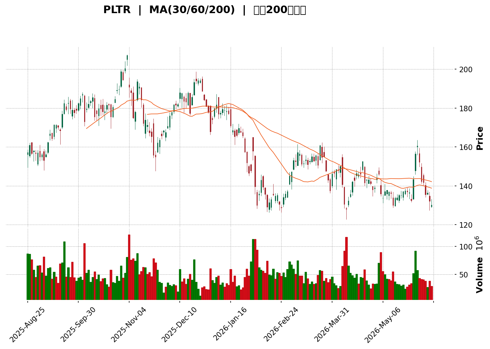
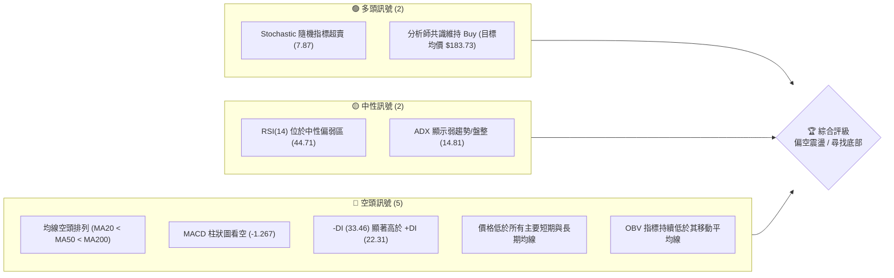
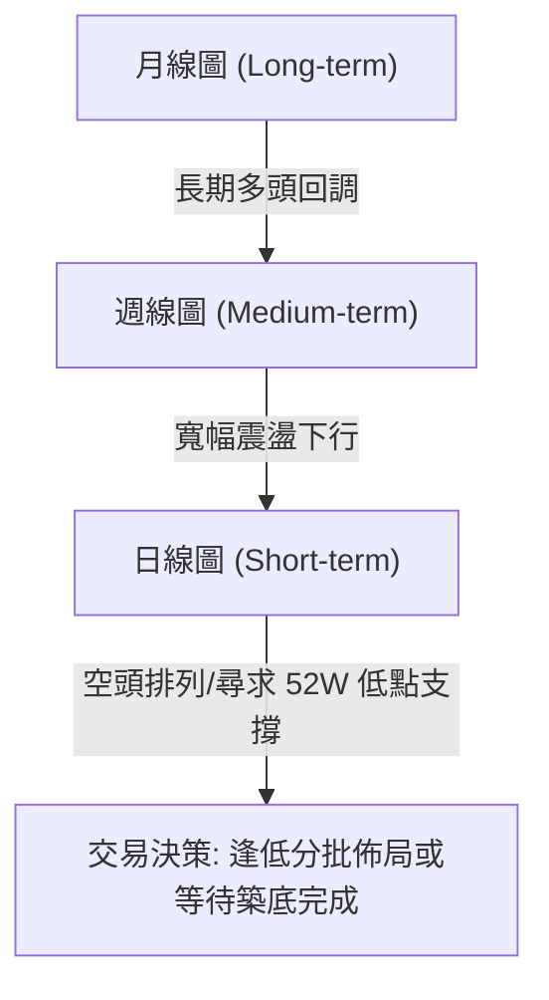
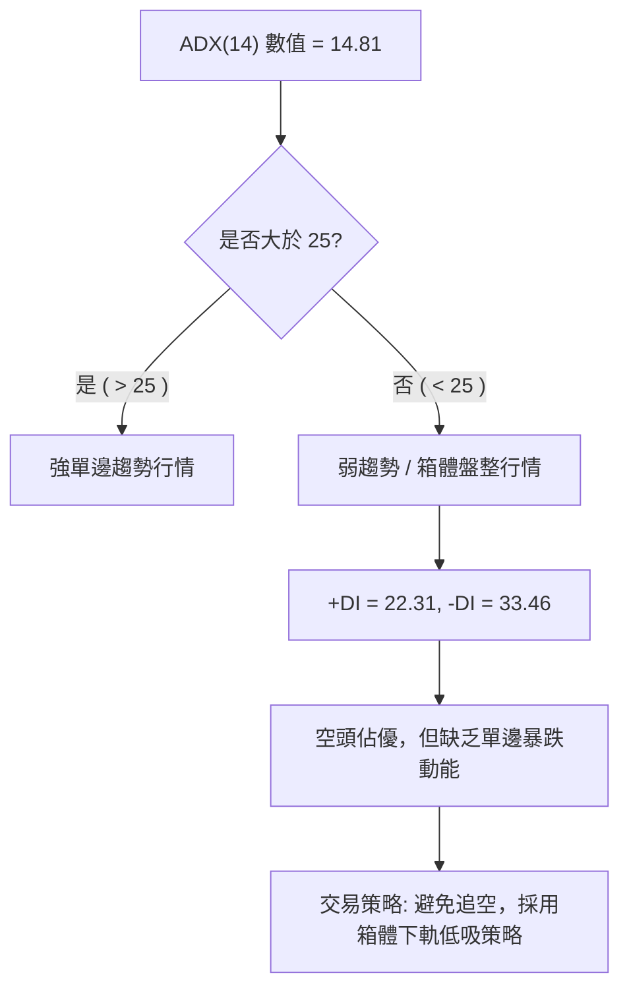
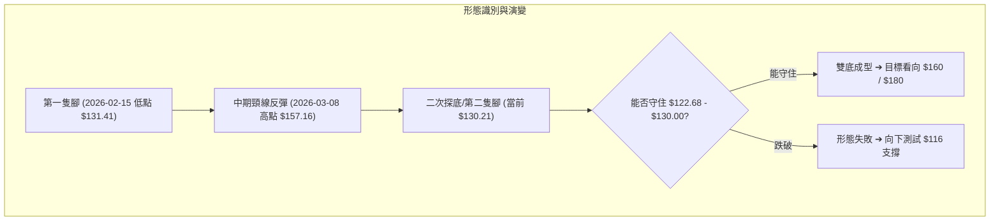

<details>
<summary>📊 靜態圖表 (點擊展開)</summary>

</details>

<html>
<head><meta charset="utf-8" /></head>
<body>
    <div style="height:500px; width:100%;">                        <script>window.PlotlyConfig = {MathJaxConfig: 'local'};</script>
        <script charset="utf-8" src="https://cdn.plot.ly/plotly-3.6.0.min.js" integrity="sha256-QaOVwtVY0T02VaHrr6pnoHLCwayMJp4O5n4YyaE3rJk=" crossorigin="anonymous"></script>                <div id="candlestick-chart" class="plotly-graph-div" style="height:100%; width:100%;"></div>            <script>                window.PLOTLYENV=window.PLOTLYENV || {};                                if (document.getElementById("candlestick-chart")) {                    Plotly.newPlot(                        "candlestick-chart",                        [{"close":{"dtype":"f8","bdata":"AAAAoHClY0AAAAAA1xtkQAAAAEAKl2NAAAAAANfDY0AAAABguJZjQAAAAEDhomNAAAAAwMxcY0AAAADgeoRjQAAAACCFI2NAAAAAQDODY0AAAAAghUtkQAAAACCu12RAAAAAIIWLZEAAAACAwm1lQAAAAGC4ZmVAAAAA4FFIZUAAAABgjwplQAAAAEAKH2ZAAAAA4HrMZkAAAABgj2pmQAAAAKCZ0WZAAAAAgOtxZkAAAAAA12NmQAAAAIA9MmZAAAAAIIVbZkAAAACgcM1mQAAAAGBmHmdAAAAAoJlhZ0AAAACAPaJlQAAAAMD1cGZAAAAAoHDFZkAAAACA6\u002fFmQAAAAEAKL2dAAAAAgBTuZUAAAABguCZmQAAAACCud2ZAAAAAANdzZkAAAAAA10NmQAAAAMDMRGZAAAAAQOGyZkAAAADgUbBmQAAAACCu72VAAAAAIFyPZkAAAAAAKRRnQAAAAIDCpWdAAAAAQDOzZ0AAAACA69loQAAAAKCZUWhAAAAAQAoPaUAAAACAwuVpQAAAACCu12dAAAAAwMx8Z0AAAACgmeFlQAAAAIDCPWZAAAAAIIUzaEAAAABguN5nQAAAAKBwBWdAAAAA4HqEZUAAAADgUcBlQAAAAAAAaGVAAAAAYI\u002fqZEAAAACgcK1kQAAAAADXd2NAAAAAQDNbY0AAAAAAAEhkQAAAAKCZcWRAAAAA4KO4ZEAAAABgZg5lQAAAACCu72RAAAAAgBRWZUAAAABgjwJmQAAAAKBwPWZAAAAA4FG4ZkAAAAAgrq9mQAAAAEDhumZAAAAAwB59Z0AAAACgR3FnQAAAAIA98mZAAAAAAADoZkAAAAAAAHhnQAAAAKBHKWZAAAAAgBQ2Z0AAAAAAKSxoQAAAACBcP2hAAAAAAClEaEAAAACgcEVoQAAAAGC4lmdAAAAAgMIFZ0AAAABA4ZpmQAAAAAAAOGZAAAAAIIX7ZEAAAACgR8FlQAAAAGC4dmZAAAAAgMK1ZkAAAAAghRtmQAAAACCuL2ZAAAAAwB5tZkAAAABguF5mQAAAAMDMTGZAAAAAgD0iZkAAAABguF5lQAAAAMD1EGVAAAAAYI+qZEAAAADAzLxkQAAAAEAzM2VAAAAAQArvZEAAAABgZrZkQAAAAEAzq2NAAAAAIIX7YkAAAABA4VJiQAAAAOBReGJAAAAAACm8Y0AAAACgR3FhQAAAAOBRQGBAAAAAwMz8YEAAAADAHt1hQAAAAOBRcGFAAAAAgML1YEAAAAAAKSRgQAAAAMAebWBAAAAA4KOgYEAAAAAAKexgQAAAAOB63GBAAAAAIK7nYEAAAABAM1NgQAAAAEDhGmBAAAAAgBTGYEAAAACAFP5gQAAAAIAUJmFAAAAAoHAlYkAAAABACmdiQAAAAIAUJmNAAAAAoHAVY0AAAADAHqVjQAAAAIDCjWNAAAAA4HrkYkAAAABAM\u002fNiQAAAAAAAMGNAAAAAYGbeYkAAAABAChdjQAAAAGCPYmNAAAAA4KMYY0AAAACAwnVjQAAAAIDC1WJAAAAAQOEaZEAAAADA9VhjQAAAAGC4XmNAAAAAgOtxYkAAAACA6+FhQAAAAKCZMWFAAAAAwPVIYkAAAAAgrk9iQAAAAGC4jmJAAAAAgMJ9YkAAAACAPcJiQAAAAOBRmGFAAAAAIK5PYEAAAACA6wFgQAAAAADXi2BAAAAAYGb2YEAAAADAzMRhQAAAAOBR2GFAAAAA4HpMYkAAAADgejxiQAAAAEAKP2JAAAAAANcTY0AAAACAPbJhQAAAAEDh4mFAAAAAQDPjYUAAAACAwqVhQAAAAEAKP2FAAAAAIIVjYUAAAACAPQJiQAAAAMD1QGJAAAAAwB79YEAAAACgR7lgQAAAAKCZIWFAAAAAoJk5YUAAAADgehxhQAAAAAAAAGFAAAAAoJlBYEAAAAAgXLdgQAAAACCuv2BAAAAA4HrkYEAAAADgUehgQAAAAMDMJGFAAAAAoEctYUAAAAAAKRxhQAAAAEAzE2FAAAAA4FGQYEAAAABA4ephQAAAAKBHkWNAAAAAwMwUZEAAAACgcAVjQAAAAGBmxmFAAAAAYGa2YUAAAADA9fBgQAAAAEAKD2FAAAAAgD2CYEAAAABguEZgQA=="},"high":{"dtype":"f8","bdata":"AAAAQOHSY0AAAAAAKURkQAAAAMDMTGRAAAAAIFzHY0AAAACgcM1jQAAAAOB6zGNAAAAAwMwkZEAAAACgR6FjQAAAAEAK32NAAAAAoJnJY0AAAAAAAFhkQAAAAAAAIGVAAAAA4KfuZEAAAADA9XBlQAAAAKCZeWVAAAAAgOtpZUAAAACAwjVlQAAAAKCZWWZAAAAAoHANZ0AAAAAAAMhmQAAAAAAAOGdAAAAAQDMbZ0AAAACAPQpnQAAAAADXg2ZAAAAAIFyvZkAAAADgo9hmQAAAAMD1SGdAAAAAYGaGZ0AAAABA4VpnQAAAAGBm3mZAAAAAgMJFZ0AAAADgUQhnQAAAAADXc2dAAAAAQDNjZ0AAAABACmdmQAAAAEDhymZAAAAAQDMLZ0AAAACAPRpnQAAAAEDhsmZAAAAAQOHiZkAAAADAcsxmQAAAAGC4xmZAAAAAgOuxZkAAAACgcEVnQAAAAGCPGmhAAAAAwPX4Z0AAAABAM\u002ftoQAAAAKBw9WhAAAAAgMKFaUAAAADgo\u002fBpQAAAAGBmdmhAAAAAgD3KZ0AAAABA4eJnQAAAAGBmVmZAAAAAgMJdaEAAAACgmR1oQAAAAGCP0mdAAAAAYGbWZkAAAACgRylmQAAAACCux2VAAAAAYI+aZUAAAABAMzNlQAAAAIA90mVAAAAAIIXDY0AAAACgcKVkQAAAAMDMlGRAAAAAINkKZUAAAACgmRllQAAAAEAzI2VAAAAAAAD4ZUAAAADAHj1mQAAAAIAUTmZAAAAAYOXEZkAAAAAAKfxmQAAAAEAz22ZAAAAA4HrMZ0AAAACgmYFnQAAAAMDMUGdAAAAAwPV4Z0AAAAAAAJBnQAAAAAAAeGdAAAAAYI9qZ0AAAAAAAGBoQAAAAAAp3GhAAAAAANdraEAAAACgcGVoQAAAAEAzi2hAAAAAYGZmZ0AAAAAAVBdnQAAAAMD1sGZAAAAAQDOrZkAAAACAPfplQAAAAIAUhmZAAAAAwPVoZ0AAAADAHjVnQAAAAEAKV2ZAAAAAAADQZkAAAABAM6NmQAAAAOAis2ZAAAAAQDOTZkAAAACAws1mQAAAAEAKf2VAAAAAIK4vZUAAAAAAACBlQAAAAAAAgGVAAAAAQOFSZUAAAACAFC5lQAAAAKBwoWRAAAAAACm0Y0AAAAAAAOBiQAAAAMDM7GJAAAAAAH+iZEAAAABAM3tjQAAAACBcP2FAAAAA4Ps1YUAAAAAA1ztiQAAAAIDrMWJAAAAAAABoYUAAAADgevxgQAAAAIDrsWBAAAAAgD3KYEAAAADg0J5hQAAAAMAeBWFAAAAAYLgGYUAAAACgR4FgQAAAACCuR2BAAAAAQOECYUAAAADgUTBhQAAAAEAzQ2FAAAAA4HpkYkAAAAAAAHBiQAAAAOCjUGNAAAAAACmMY0AAAABgZi5kQAAAAIAUzmNAAAAAIAaVY0AAAACAaCVjQAAAAAApfGNAAAAAgOtRY0AAAAAghTtjQAAAAAAAmGNAAAAAgBSWY0AAAADAzIRjQAAAAMDMlGNAAAAAYI8iZEAAAADAzExkQAAAAOCjCGRAAAAAANcjY0AAAABguD5iQAAAAADXA2JAAAAAIIV7YkAAAACgmYliQAAAAOBRkGJAAAAAIIXTYkAAAADgo8hiQAAAAMD1iGNAAAAAoEdxYUAAAABgZiZgQAAAAKBwzWBAAAAAgD1CYUAAAABgj9JhQAAAAKCZMWJAAAAAwPWIYkAAAABgZmZiQAAAAADXu2JAAAAAgMIVY0AAAACgR8liQAAAAGCP6mFAAAAAgD0iYkAAAABAM\u002fthQAAAAOBReGFAAAAAYGaGYUAAAACAFE5iQAAAAOB6tGJAAAAAIFzfYUAAAABgZvZgQAAAAGBmnmFAAAAAACk8YUAAAADgeiRhQAAAAIDCLWFAAAAAIK4fYUAAAAAgXM9gQAAAAOB69GBAAAAAgOv9YEAAAABACi9hQAAAACCuJ2FAAAAAoJlRYUAAAADgo2BhQAAAAIDCVWFAAAAAIFz3YEAAAAAAACBiQAAAAKDtuGNAAAAAYGZ2ZEAAAACgmfFjQAAAAIDC9WJAAAAAANdLYkAAAABACr9hQAAAAOBROGFAAAAAIK4fYUAAAACA66VgQA=="},"hovertemplate":"\u003cb\u003e%{x|%Y-%m-%d}\u003c\u002fb\u003e\u003cbr\u003e\u958b: $%{open:.2f}\u003cbr\u003e\u9ad8: $%{high:.2f}\u003cbr\u003e\u4f4e: $%{low:.2f}\u003cbr\u003e\u6536: $%{close:.2f}\u003cextra\u003e\u003c\u002fextra\u003e","low":{"dtype":"f8","bdata":"AAAAANerYkAAAACAPVJjQAAAACBcf2NAAAAAoJkRY0AAAAAAACBjQAAAAMD1yGJAAAAAYLgWY0AAAADAHiVjQAAAAKBHgWJAAAAAQOFaY0AAAAAA14tjQAAAAIAUbmRAAAAAQApnZEAAAADgUYBkQAAAAMAe7WRAAAAAYLgeZUAAAADgoyhkQAAAAOB6LGVAAAAAYLgWZkAAAACgR0lmQAAAAOBRIGZAAAAAANcjZkAAAACgR8llQAAAAMAe3WVAAAAAwB4lZkAAAABACkdmQAAAAAAAcGZAAAAAYGbeZkAAAADgo1hlQAAAAGCPOmZAAAAAoHBtZkAAAABgZqZmQAAAAGBmfmZAAAAAwPWwZUAAAABgZq5lQAAAAIA9WmVAAAAA4KMAZkAAAABgZg5mQAAAAGBmvmVAAAAAgBQuZkAAAADAzFRmQAAAAKBwLWVAAAAA4FHgZUAAAABAM9tmQAAAAOCjcGdAAAAAwPVYZ0AAAAAgrs9nQAAAAADXQ2hAAAAAoHC9aEAAAACAPTppQAAAAIDrMWdAAAAAYLimZkAAAADA9dBlQAAAAMAeHWVAAAAA4KPwZkAAAAAAKWRnQAAAAMDMjGZAAAAAYGRXZUAAAAAAAJBkQAAAAIDC9WRAAAAAAACwZEAAAACgcE1kQAAAAOCjTGNAAAAAgOtxYkAAAAAAAKBjQAAAAIDCkWNAAAAAACl8ZEAAAAAAALxkQAAAAADXY2RAAAAAQOEyZUAAAABgjxplQAAAAIDCzWVAAAAAwB4lZkAAAACgR3FmQAAAAAApjGZAAAAAAADYZkAAAABguIZmQAAAACBYNWZAAAAAwPWAZkAAAABAi6RmQAAAAAAAEGZAAAAA4FGwZkAAAAAgXFdnQAAAAIDCDWhAAAAAIIX3Z0AAAABgjxpoQAAAAADXk2dAAAAA4Hr0ZkAAAABgZpZmQAAAAAAAKGZAAAAAQDPLZEAAAACgR3llQAAAAOCj2GVAAAAAwB41ZkAAAAAA18tlQAAAAAAA2GVAAAAAQOEKZkAAAADgegRmQAAAAGBmvmVAAAAAwPUQZkAAAADgUUBlQAAAACCux2RAAAAAIIUjZEAAAABgZp5kQAAAAKCZyWRAAAAAYGbqZEAAAACAFJZkQAAAACCup2NAAAAAANdjYkAAAADAciRiQAAAAKDtVGJAAAAAANcjY0AAAACAwvVgQAAAAIA9CmBAAAAAQDOLYEAAAAAA1dhgQAAAAOCjOGFAAAAAYGaeYEAAAAAA16NfQAAAAIDpjl9AAAAAYI\u002fSX0AAAAAA19tgQAAAAOBRYGBAAAAAoHBlYEAAAADA9dhfQAAAACCul19AAAAAgMIlYEAAAAAAKZRgQAAAACBcv2BAAAAA4KOQYUAAAABgZkZhQAAAAIDrgWJAAAAAIIWzYkAAAACgR8liQAAAAEAKH2NAAAAA4HrEYkAAAABgj6piQAAAACBc32JAAAAAYI+SYkAAAACgcOViQAAAAADXA2NAAAAAIIUTY0AAAAAAANBiQAAAAEDhomJAAAAAIK4nY0AAAADgevRiQAAAACBcW2NAAAAAAABoYkAAAACA67FhQAAAAKCZCWFAAAAAQApfYUAAAABACg9iQAAAACCuP2FAAAAAIDFUYkAAAABgZg5iQAAAAKBwZWFAAAAAQAoPYEAAAAAghateQAAAAMDMJGBAAAAAAADAYEAAAACAwt1gQAAAAMD1cGFAAAAAoJnpYUAAAABgj\u002fphQAAAAMD3\u002f2FAAAAAwB5tYkAAAACgcH1hQAAAAIDCXWFAAAAA4FGgYUAAAACgcI1hQAAAAIDC1WBAAAAAwMwUYUAAAADgeqxhQAAAAEAzJ2JAAAAAQArXYEAAAADAzGRgQAAAAMD12GBAAAAA4KOgYEAAAAAArJhgQAAAAGC4rmBAAAAAAAAYYEAAAABgZi5gQAAAAKBHiWBAAAAAYI9qYEAAAABAM7NgQAAAAKBwjWBAAAAAoHDtYEAAAACgmclgQAAAAKCZqWBAAAAAACl0YEAAAAAAAKBgQAAAAKBHOWJAAAAAACl8Y0AAAACgmbliQAAAAAAAqGFAAAAAQLSIYUAAAADAzMBgQAAAAMD16GBAAAAAYGbWX0AAAACgmRlgQA=="},"name":"\u50f9\u683c","open":{"dtype":"f8","bdata":"AAAAQDODY0AAAADgemxjQAAAAIA9SmRAAAAAACm0Y0AAAAAgXJ9jQAAAAGBm5mJAAAAAAADAY0AAAAAgrltjQAAAAIA9umNAAAAAwB5dY0AAAAAAAKhjQAAAAAAAwGRAAAAAIK7nZEAAAABAM6tkQAAAAEAzM2VAAAAAoEdhZUAAAADgoyBlQAAAAOCjSGVAAAAAgD0iZkAAAAAAKZxmQAAAAOBR0GZAAAAAwB79ZkAAAACgmfllQAAAAKCZYWZAAAAA4Hp0ZkAAAAAgXF9mQAAAAIA9qmZAAAAAYGZWZ0AAAADAzExnQAAAAIDCZWZAAAAAgOuJZkAAAACgmdlmQAAAAGCP8mZAAAAAoHAlZ0AAAACAwlVmQAAAAAAAAGZAAAAAwPW0ZkAAAADA9bhmQAAAAAAAOGZAAAAAIK5vZkAAAACA68FmQAAAAIDCvWZAAAAAgD3uZUAAAAAAKdxmQAAAAEAKn2dAAAAAIFyvZ0AAAABgj+JnQAAAAKCZzWhAAAAAYGbmaEAAAACgcKFpQAAAAIA9AmhAAAAAAACgZ0AAAAAgrn9nQAAAAMDMpGVAAAAAgOsJZ0AAAABguMpnQAAAAGCP0mdAAAAAQOG2ZkAAAABAM99kQAAAAMD1UGVAAAAAANcLZUAAAACgmflkQAAAAIA9gmVAAAAA4FGAY0AAAABACq9jQAAAAIA9AmRAAAAAQDPbZEAAAADgUfhkQAAAAAAAoGRAAAAAQOEyZUAAAADgekRlQAAAACCuC2ZAAAAAIFxHZkAAAABguMZmQAAAAEAKn2ZAAAAAYGYeZ0AAAACgmRlnQAAAAIDrOWdAAAAAYI8iZ0AAAADA9bRmQAAAAEDhdmdAAAAA4FGwZkAAAAAgrldnQAAAAKBHYWhAAAAAYGYaaEAAAADAHiVoQAAAAOB6YGhAAAAAQDNbZ0AAAABAMwtnQAAAAAAppGZAAAAAoJmpZkAAAAAAKdxlQAAAAOBR+GVAAAAAoJl5ZkAAAAAgrjNnQAAAAOCjIGZAAAAAgOs1ZkAAAAAAAFxmQAAAAAAARGZAAAAAYLhWZkAAAAAghWtmQAAAAAAA9GRAAAAAIN0MZUAAAACgmR1lQAAAAOCj6GRAAAAAYLgGZUAAAAAgXO9kQAAAAMDMjGRAAAAAACm0Y0AAAACgmcFiQAAAAIAU3mJAAAAAoJmhZEAAAADAHm1jQAAAAIA9GmFAAAAAYI\u002fqYEAAAABgjxJhQAAAAEDhHmJAAAAAwMxgYUAAAAAghetgQAAAAKCZ+V9AAAAA4KMcYEAAAADgevxgQAAAAIDriWBAAAAAIK6LYEAAAACgR4FgQAAAAAApIGBAAAAAIIVTYEAAAABACrtgQAAAAIA9wmBAAAAAwMyYYUAAAABAM8NhQAAAAIDCjWJAAAAAgBQeY0AAAACAFM5iQAAAAIAUdmNAAAAAIK5\u002fY0AAAAAAKexiQAAAAOBRIGNAAAAAoJkpY0AAAABgZg5jQAAAAMD1DGNAAAAAgD1eY0AAAABAMyNjQAAAAGBmZmNAAAAAIK4nY0AAAACAPQJkQAAAAKBwrWNAAAAAgMIhY0AAAAAAKTxiQAAAAOCj6GFAAAAA4KOAYUAAAAAAAGBiQAAAACCF72FAAAAAIIWLYkAAAABgOVxiQAAAAOB6WGNAAAAA4KNsYUAAAAAgXA9gQAAAACBcR2BAAAAAAKrNYEAAAACgRxlhQAAAAKBHCWJAAAAAgBQqYkAAAAAAACBiQAAAAIDrWWJAAAAAIIWLYkAAAABgZrZiQAAAAGC43mFAAAAAAACoYUAAAACgmclhQAAAAOBReGFAAAAAQDNPYUAAAAAAAOhhQAAAAAAAeGJAAAAAoHCJYUAAAABguLZgQAAAAEAz42BAAAAAIK77YEAAAADAHt1gQAAAAEAzE2FAAAAAIDHAYEAAAADAzDRgQAAAAKCZmWBAAAAAAACQYEAAAACgcOVgQAAAAOCjxGBAAAAAoJn5YEAAAACgmS1hQAAAAMAeBWFAAAAAoJmpYEAAAADAHqVgQAAAAGBmemJAAAAAIFz\u002fY0AAAACAFJZjQAAAAGBmtmJAAAAAYLguYkAAAABgZophQAAAAIDC9WBAAAAAANfbYEAAAABgZipgQA=="},"x":["2025-08-25T00:00:00-04:00","2025-08-26T00:00:00-04:00","2025-08-27T00:00:00-04:00","2025-08-28T00:00:00-04:00","2025-08-29T00:00:00-04:00","2025-09-02T00:00:00-04:00","2025-09-03T00:00:00-04:00","2025-09-04T00:00:00-04:00","2025-09-05T00:00:00-04:00","2025-09-08T00:00:00-04:00","2025-09-09T00:00:00-04:00","2025-09-10T00:00:00-04:00","2025-09-11T00:00:00-04:00","2025-09-12T00:00:00-04:00","2025-09-15T00:00:00-04:00","2025-09-16T00:00:00-04:00","2025-09-17T00:00:00-04:00","2025-09-18T00:00:00-04:00","2025-09-19T00:00:00-04:00","2025-09-22T00:00:00-04:00","2025-09-23T00:00:00-04:00","2025-09-24T00:00:00-04:00","2025-09-25T00:00:00-04:00","2025-09-26T00:00:00-04:00","2025-09-29T00:00:00-04:00","2025-09-30T00:00:00-04:00","2025-10-01T00:00:00-04:00","2025-10-02T00:00:00-04:00","2025-10-03T00:00:00-04:00","2025-10-06T00:00:00-04:00","2025-10-07T00:00:00-04:00","2025-10-08T00:00:00-04:00","2025-10-09T00:00:00-04:00","2025-10-10T00:00:00-04:00","2025-10-13T00:00:00-04:00","2025-10-14T00:00:00-04:00","2025-10-15T00:00:00-04:00","2025-10-16T00:00:00-04:00","2025-10-17T00:00:00-04:00","2025-10-20T00:00:00-04:00","2025-10-21T00:00:00-04:00","2025-10-22T00:00:00-04:00","2025-10-23T00:00:00-04:00","2025-10-24T00:00:00-04:00","2025-10-27T00:00:00-04:00","2025-10-28T00:00:00-04:00","2025-10-29T00:00:00-04:00","2025-10-30T00:00:00-04:00","2025-10-31T00:00:00-04:00","2025-11-03T00:00:00-05:00","2025-11-04T00:00:00-05:00","2025-11-05T00:00:00-05:00","2025-11-06T00:00:00-05:00","2025-11-07T00:00:00-05:00","2025-11-10T00:00:00-05:00","2025-11-11T00:00:00-05:00","2025-11-12T00:00:00-05:00","2025-11-13T00:00:00-05:00","2025-11-14T00:00:00-05:00","2025-11-17T00:00:00-05:00","2025-11-18T00:00:00-05:00","2025-11-19T00:00:00-05:00","2025-11-20T00:00:00-05:00","2025-11-21T00:00:00-05:00","2025-11-24T00:00:00-05:00","2025-11-25T00:00:00-05:00","2025-11-26T00:00:00-05:00","2025-11-28T00:00:00-05:00","2025-12-01T00:00:00-05:00","2025-12-02T00:00:00-05:00","2025-12-03T00:00:00-05:00","2025-12-04T00:00:00-05:00","2025-12-05T00:00:00-05:00","2025-12-08T00:00:00-05:00","2025-12-09T00:00:00-05:00","2025-12-10T00:00:00-05:00","2025-12-11T00:00:00-05:00","2025-12-12T00:00:00-05:00","2025-12-15T00:00:00-05:00","2025-12-16T00:00:00-05:00","2025-12-17T00:00:00-05:00","2025-12-18T00:00:00-05:00","2025-12-19T00:00:00-05:00","2025-12-22T00:00:00-05:00","2025-12-23T00:00:00-05:00","2025-12-24T00:00:00-05:00","2025-12-26T00:00:00-05:00","2025-12-29T00:00:00-05:00","2025-12-30T00:00:00-05:00","2025-12-31T00:00:00-05:00","2026-01-02T00:00:00-05:00","2026-01-05T00:00:00-05:00","2026-01-06T00:00:00-05:00","2026-01-07T00:00:00-05:00","2026-01-08T00:00:00-05:00","2026-01-09T00:00:00-05:00","2026-01-12T00:00:00-05:00","2026-01-13T00:00:00-05:00","2026-01-14T00:00:00-05:00","2026-01-15T00:00:00-05:00","2026-01-16T00:00:00-05:00","2026-01-20T00:00:00-05:00","2026-01-21T00:00:00-05:00","2026-01-22T00:00:00-05:00","2026-01-23T00:00:00-05:00","2026-01-26T00:00:00-05:00","2026-01-27T00:00:00-05:00","2026-01-28T00:00:00-05:00","2026-01-29T00:00:00-05:00","2026-01-30T00:00:00-05:00","2026-02-02T00:00:00-05:00","2026-02-03T00:00:00-05:00","2026-02-04T00:00:00-05:00","2026-02-05T00:00:00-05:00","2026-02-06T00:00:00-05:00","2026-02-09T00:00:00-05:00","2026-02-10T00:00:00-05:00","2026-02-11T00:00:00-05:00","2026-02-12T00:00:00-05:00","2026-02-13T00:00:00-05:00","2026-02-17T00:00:00-05:00","2026-02-18T00:00:00-05:00","2026-02-19T00:00:00-05:00","2026-02-20T00:00:00-05:00","2026-02-23T00:00:00-05:00","2026-02-24T00:00:00-05:00","2026-02-25T00:00:00-05:00","2026-02-26T00:00:00-05:00","2026-02-27T00:00:00-05:00","2026-03-02T00:00:00-05:00","2026-03-03T00:00:00-05:00","2026-03-04T00:00:00-05:00","2026-03-05T00:00:00-05:00","2026-03-06T00:00:00-05:00","2026-03-09T00:00:00-04:00","2026-03-10T00:00:00-04:00","2026-03-11T00:00:00-04:00","2026-03-12T00:00:00-04:00","2026-03-13T00:00:00-04:00","2026-03-16T00:00:00-04:00","2026-03-17T00:00:00-04:00","2026-03-18T00:00:00-04:00","2026-03-19T00:00:00-04:00","2026-03-20T00:00:00-04:00","2026-03-23T00:00:00-04:00","2026-03-24T00:00:00-04:00","2026-03-25T00:00:00-04:00","2026-03-26T00:00:00-04:00","2026-03-27T00:00:00-04:00","2026-03-30T00:00:00-04:00","2026-03-31T00:00:00-04:00","2026-04-01T00:00:00-04:00","2026-04-02T00:00:00-04:00","2026-04-06T00:00:00-04:00","2026-04-07T00:00:00-04:00","2026-04-08T00:00:00-04:00","2026-04-09T00:00:00-04:00","2026-04-10T00:00:00-04:00","2026-04-13T00:00:00-04:00","2026-04-14T00:00:00-04:00","2026-04-15T00:00:00-04:00","2026-04-16T00:00:00-04:00","2026-04-17T00:00:00-04:00","2026-04-20T00:00:00-04:00","2026-04-21T00:00:00-04:00","2026-04-22T00:00:00-04:00","2026-04-23T00:00:00-04:00","2026-04-24T00:00:00-04:00","2026-04-27T00:00:00-04:00","2026-04-28T00:00:00-04:00","2026-04-29T00:00:00-04:00","2026-04-30T00:00:00-04:00","2026-05-01T00:00:00-04:00","2026-05-04T00:00:00-04:00","2026-05-05T00:00:00-04:00","2026-05-06T00:00:00-04:00","2026-05-07T00:00:00-04:00","2026-05-08T00:00:00-04:00","2026-05-11T00:00:00-04:00","2026-05-12T00:00:00-04:00","2026-05-13T00:00:00-04:00","2026-05-14T00:00:00-04:00","2026-05-15T00:00:00-04:00","2026-05-18T00:00:00-04:00","2026-05-19T00:00:00-04:00","2026-05-20T00:00:00-04:00","2026-05-21T00:00:00-04:00","2026-05-22T00:00:00-04:00","2026-05-26T00:00:00-04:00","2026-05-27T00:00:00-04:00","2026-05-28T00:00:00-04:00","2026-05-29T00:00:00-04:00","2026-06-01T00:00:00-04:00","2026-06-02T00:00:00-04:00","2026-06-03T00:00:00-04:00","2026-06-04T00:00:00-04:00","2026-06-05T00:00:00-04:00","2026-06-08T00:00:00-04:00","2026-06-09T00:00:00-04:00","2026-06-10T00:00:00-04:00"],"type":"candlestick"},{"hovertemplate":"MA30: $%{y:.2f}\u003cextra\u003e\u003c\u002fextra\u003e","line":{"color":"#2196F3","dash":"dash","width":2},"mode":"lines","name":"MA30","x":["2025-08-25T00:00:00-04:00","2025-08-26T00:00:00-04:00","2025-08-27T00:00:00-04:00","2025-08-28T00:00:00-04:00","2025-08-29T00:00:00-04:00","2025-09-02T00:00:00-04:00","2025-09-03T00:00:00-04:00","2025-09-04T00:00:00-04:00","2025-09-05T00:00:00-04:00","2025-09-08T00:00:00-04:00","2025-09-09T00:00:00-04:00","2025-09-10T00:00:00-04:00","2025-09-11T00:00:00-04:00","2025-09-12T00:00:00-04:00","2025-09-15T00:00:00-04:00","2025-09-16T00:00:00-04:00","2025-09-17T00:00:00-04:00","2025-09-18T00:00:00-04:00","2025-09-19T00:00:00-04:00","2025-09-22T00:00:00-04:00","2025-09-23T00:00:00-04:00","2025-09-24T00:00:00-04:00","2025-09-25T00:00:00-04:00","2025-09-26T00:00:00-04:00","2025-09-29T00:00:00-04:00","2025-09-30T00:00:00-04:00","2025-10-01T00:00:00-04:00","2025-10-02T00:00:00-04:00","2025-10-03T00:00:00-04:00","2025-10-06T00:00:00-04:00","2025-10-07T00:00:00-04:00","2025-10-08T00:00:00-04:00","2025-10-09T00:00:00-04:00","2025-10-10T00:00:00-04:00","2025-10-13T00:00:00-04:00","2025-10-14T00:00:00-04:00","2025-10-15T00:00:00-04:00","2025-10-16T00:00:00-04:00","2025-10-17T00:00:00-04:00","2025-10-20T00:00:00-04:00","2025-10-21T00:00:00-04:00","2025-10-22T00:00:00-04:00","2025-10-23T00:00:00-04:00","2025-10-24T00:00:00-04:00","2025-10-27T00:00:00-04:00","2025-10-28T00:00:00-04:00","2025-10-29T00:00:00-04:00","2025-10-30T00:00:00-04:00","2025-10-31T00:00:00-04:00","2025-11-03T00:00:00-05:00","2025-11-04T00:00:00-05:00","2025-11-05T00:00:00-05:00","2025-11-06T00:00:00-05:00","2025-11-07T00:00:00-05:00","2025-11-10T00:00:00-05:00","2025-11-11T00:00:00-05:00","2025-11-12T00:00:00-05:00","2025-11-13T00:00:00-05:00","2025-11-14T00:00:00-05:00","2025-11-17T00:00:00-05:00","2025-11-18T00:00:00-05:00","2025-11-19T00:00:00-05:00","2025-11-20T00:00:00-05:00","2025-11-21T00:00:00-05:00","2025-11-24T00:00:00-05:00","2025-11-25T00:00:00-05:00","2025-11-26T00:00:00-05:00","2025-11-28T00:00:00-05:00","2025-12-01T00:00:00-05:00","2025-12-02T00:00:00-05:00","2025-12-03T00:00:00-05:00","2025-12-04T00:00:00-05:00","2025-12-05T00:00:00-05:00","2025-12-08T00:00:00-05:00","2025-12-09T00:00:00-05:00","2025-12-10T00:00:00-05:00","2025-12-11T00:00:00-05:00","2025-12-12T00:00:00-05:00","2025-12-15T00:00:00-05:00","2025-12-16T00:00:00-05:00","2025-12-17T00:00:00-05:00","2025-12-18T00:00:00-05:00","2025-12-19T00:00:00-05:00","2025-12-22T00:00:00-05:00","2025-12-23T00:00:00-05:00","2025-12-24T00:00:00-05:00","2025-12-26T00:00:00-05:00","2025-12-29T00:00:00-05:00","2025-12-30T00:00:00-05:00","2025-12-31T00:00:00-05:00","2026-01-02T00:00:00-05:00","2026-01-05T00:00:00-05:00","2026-01-06T00:00:00-05:00","2026-01-07T00:00:00-05:00","2026-01-08T00:00:00-05:00","2026-01-09T00:00:00-05:00","2026-01-12T00:00:00-05:00","2026-01-13T00:00:00-05:00","2026-01-14T00:00:00-05:00","2026-01-15T00:00:00-05:00","2026-01-16T00:00:00-05:00","2026-01-20T00:00:00-05:00","2026-01-21T00:00:00-05:00","2026-01-22T00:00:00-05:00","2026-01-23T00:00:00-05:00","2026-01-26T00:00:00-05:00","2026-01-27T00:00:00-05:00","2026-01-28T00:00:00-05:00","2026-01-29T00:00:00-05:00","2026-01-30T00:00:00-05:00","2026-02-02T00:00:00-05:00","2026-02-03T00:00:00-05:00","2026-02-04T00:00:00-05:00","2026-02-05T00:00:00-05:00","2026-02-06T00:00:00-05:00","2026-02-09T00:00:00-05:00","2026-02-10T00:00:00-05:00","2026-02-11T00:00:00-05:00","2026-02-12T00:00:00-05:00","2026-02-13T00:00:00-05:00","2026-02-17T00:00:00-05:00","2026-02-18T00:00:00-05:00","2026-02-19T00:00:00-05:00","2026-02-20T00:00:00-05:00","2026-02-23T00:00:00-05:00","2026-02-24T00:00:00-05:00","2026-02-25T00:00:00-05:00","2026-02-26T00:00:00-05:00","2026-02-27T00:00:00-05:00","2026-03-02T00:00:00-05:00","2026-03-03T00:00:00-05:00","2026-03-04T00:00:00-05:00","2026-03-05T00:00:00-05:00","2026-03-06T00:00:00-05:00","2026-03-09T00:00:00-04:00","2026-03-10T00:00:00-04:00","2026-03-11T00:00:00-04:00","2026-03-12T00:00:00-04:00","2026-03-13T00:00:00-04:00","2026-03-16T00:00:00-04:00","2026-03-17T00:00:00-04:00","2026-03-18T00:00:00-04:00","2026-03-19T00:00:00-04:00","2026-03-20T00:00:00-04:00","2026-03-23T00:00:00-04:00","2026-03-24T00:00:00-04:00","2026-03-25T00:00:00-04:00","2026-03-26T00:00:00-04:00","2026-03-27T00:00:00-04:00","2026-03-30T00:00:00-04:00","2026-03-31T00:00:00-04:00","2026-04-01T00:00:00-04:00","2026-04-02T00:00:00-04:00","2026-04-06T00:00:00-04:00","2026-04-07T00:00:00-04:00","2026-04-08T00:00:00-04:00","2026-04-09T00:00:00-04:00","2026-04-10T00:00:00-04:00","2026-04-13T00:00:00-04:00","2026-04-14T00:00:00-04:00","2026-04-15T00:00:00-04:00","2026-04-16T00:00:00-04:00","2026-04-17T00:00:00-04:00","2026-04-20T00:00:00-04:00","2026-04-21T00:00:00-04:00","2026-04-22T00:00:00-04:00","2026-04-23T00:00:00-04:00","2026-04-24T00:00:00-04:00","2026-04-27T00:00:00-04:00","2026-04-28T00:00:00-04:00","2026-04-29T00:00:00-04:00","2026-04-30T00:00:00-04:00","2026-05-01T00:00:00-04:00","2026-05-04T00:00:00-04:00","2026-05-05T00:00:00-04:00","2026-05-06T00:00:00-04:00","2026-05-07T00:00:00-04:00","2026-05-08T00:00:00-04:00","2026-05-11T00:00:00-04:00","2026-05-12T00:00:00-04:00","2026-05-13T00:00:00-04:00","2026-05-14T00:00:00-04:00","2026-05-15T00:00:00-04:00","2026-05-18T00:00:00-04:00","2026-05-19T00:00:00-04:00","2026-05-20T00:00:00-04:00","2026-05-21T00:00:00-04:00","2026-05-22T00:00:00-04:00","2026-05-26T00:00:00-04:00","2026-05-27T00:00:00-04:00","2026-05-28T00:00:00-04:00","2026-05-29T00:00:00-04:00","2026-06-01T00:00:00-04:00","2026-06-02T00:00:00-04:00","2026-06-03T00:00:00-04:00","2026-06-04T00:00:00-04:00","2026-06-05T00:00:00-04:00","2026-06-08T00:00:00-04:00","2026-06-09T00:00:00-04:00","2026-06-10T00:00:00-04:00"],"y":{"dtype":"f8","bdata":"AAAAAAAA+H8AAAAAAAD4fwAAAAAAAPh\u002fAAAAAAAA+H8AAAAAAAD4fwAAAAAAAPh\u002fAAAAAAAA+H8AAAAAAAD4fwAAAAAAAPh\u002fAAAAAAAA+H8AAAAAAAD4fwAAAAAAAPh\u002fAAAAAAAA+H8AAAAAAAD4fwAAAAAAAPh\u002fAAAAAAAA+H8AAAAAAAD4fwAAAAAAAPh\u002fAAAAAAAA+H8AAAAAAAD4fwAAAAAAAPh\u002fAAAAAAAA+H8AAAAAAAD4fwAAAAAAAPh\u002fAAAAAAAA+H8AAAAAAAD4fwAAAAAAAPh\u002fAAAAAAAA+H8AAAAAAAD4f1VVVUX9L2VAAAAA8KdKZUAiIiLS22JlQM3MzHyGgWVAERERAQCUZUDv7u7e3allQFVVVdUGwmVAq6qqCmXcZUC8u7sL1\u002fNlQCIiIqKMDmZAmpmZGb0pZkAzMzNTKj5mQImIiKh\u002fR2ZA3t3dfbFYZkCamZn5xWZmQKuqqvrweWZAd3d3F5KOZkCamZkpFa9mQM3MzKzVwWZAiYiIuB7VZkAAAACg0\u002fJmQKuqqgqQ+2ZAq6qqanUEZ0CamZkJHgBnQGZmZlaAAGdAIiIiEjwQZ0AAAAAQWBlnQCIiIhKDGGdAVVVVpZsIZ0AzMzNTnAlnQFVVVVXHAGdAZmZmBvPwZkCJiIiYmd1mQAAAALDkvWZA7+7uPu6nZkCrqqoq+ZdmQHd3dze0hmZA7+7uPu53ZkARERGxnW1mQN7d3c0+YmZAERERYZ5WZkARERGh01BmQN7d3S1rU2ZAREREtMhUZkBmZmZGb1FmQHd3d\u002feaSWZAvLu7e81HZkBVVVUFyDtmQAAAAMARMGZAq6qqirMdZkC8u7vb+QhmQLy7uxuh+mVAIiIiokX4ZUAiIiLy0gtmQKuqqqrxHGZAmpmZqX8dZkBEREQ07CBmQN7d3e3DJWZAZmZmppsyZkAiIiKy5DlmQBEREaHTQGZAq6qqWmRBZkAAAAAwlkpmQLy7uzsmZGZAvLu7m8SAZkDNzMwcWpBmQJqZmak4n2ZAq6qqSsWtZkCamZk5+7hmQBEREWGexGZAvLu7i2zLZkAiIiJy9sVmQJqZmVnyu2ZA3t3d3WuqZkARERHByplmQLy7u2u8jGZAAAAA8O52ZkCamZkpo19mQKuqqlqrQ2ZAq6qqyi8iZkDe3d1dSPZlQFVVVbXI1mVAmpmZuR65ZUAAAADQsH9lQM3MzLx0O2VAAAAAEFj9ZECrqqqqqsZkQImIiMgvkmRAzczMDHReZEBmZmbGSydkQN7d3d3d9WNAmpmZObTQY0CJiIh4d6djQO\u002fu7p6od2NAiYiIaB9GY0CJiIhYxxRjQGZmZqbi4GJAMzMzk6awYkDv7u4+w4JiQLy7uyvOVmJAd3d3V8c0YkDNzMy8dBtiQFVVVeUXC2JA7+7u3pb9YUBVVVVFRPRhQKuqqvo35mFAzczMzMzUYUAAAACQwsVhQBEREUGnwWFAMzMzw67AYUCamZmpOMdhQDMzM4MHz2FAREREJJTJYUAAAABwy9phQJqZmbnX8GFAIiIiAnILYkDv7u5OGxhiQBERETGWKGJAmpmZOUI1YkCrqqoKHkRiQLy7u6uqSmJAiYiIiM9YYkDe3d1NqWRiQCIiItIic2JAiYiICKyAYkBERESkcJViQImIiJgnomJAAAAAQDWeYkC8u7t7zZViQM3MzEypkGJAvLu7W4+GYkCJiIjoJoFiQCIiItIGdmJAZmZm9lNvYkAAAACATmNiQJqZmTkmWGJAzczMXLpZYkARERGBB09iQBEREeHsQ2JA7+7uTo07YkDe3d0dPi9iQCIiIvL9HGJAq6qq2msOYkDe3d2NCQJiQLy7u8sT\u002fWFA7+7uPnziYUAzMzOTGMxhQDMzM\u002fP9uGFAIiIi0pSuYUAAAAAAAKhhQO\u002fu7r5YpmFAAAAA4AiVYUCrqqqKbIdhQERERET9d2FA7+7uvlhqYUAAAACgjFphQKuqqtqyVmFAZmZm1hVeYUCamZlJfmdhQM3MzFwBbGFAd3d3R5poYUCrqqo632lhQGZmZhaSeGFAREREBMiHYUAAAADgeo5hQJqZmWl1imFAZmZmhs9+YUAzMzMzXnhhQAAAAIBOcWFAMzMzk4plYUCamZkJ11lhQA=="},"type":"scatter"},{"hovertemplate":"MA60: $%{y:.2f}\u003cextra\u003e\u003c\u002fextra\u003e","line":{"color":"#9C27B0","dash":"dash","width":2},"mode":"lines","name":"MA60","x":["2025-08-25T00:00:00-04:00","2025-08-26T00:00:00-04:00","2025-08-27T00:00:00-04:00","2025-08-28T00:00:00-04:00","2025-08-29T00:00:00-04:00","2025-09-02T00:00:00-04:00","2025-09-03T00:00:00-04:00","2025-09-04T00:00:00-04:00","2025-09-05T00:00:00-04:00","2025-09-08T00:00:00-04:00","2025-09-09T00:00:00-04:00","2025-09-10T00:00:00-04:00","2025-09-11T00:00:00-04:00","2025-09-12T00:00:00-04:00","2025-09-15T00:00:00-04:00","2025-09-16T00:00:00-04:00","2025-09-17T00:00:00-04:00","2025-09-18T00:00:00-04:00","2025-09-19T00:00:00-04:00","2025-09-22T00:00:00-04:00","2025-09-23T00:00:00-04:00","2025-09-24T00:00:00-04:00","2025-09-25T00:00:00-04:00","2025-09-26T00:00:00-04:00","2025-09-29T00:00:00-04:00","2025-09-30T00:00:00-04:00","2025-10-01T00:00:00-04:00","2025-10-02T00:00:00-04:00","2025-10-03T00:00:00-04:00","2025-10-06T00:00:00-04:00","2025-10-07T00:00:00-04:00","2025-10-08T00:00:00-04:00","2025-10-09T00:00:00-04:00","2025-10-10T00:00:00-04:00","2025-10-13T00:00:00-04:00","2025-10-14T00:00:00-04:00","2025-10-15T00:00:00-04:00","2025-10-16T00:00:00-04:00","2025-10-17T00:00:00-04:00","2025-10-20T00:00:00-04:00","2025-10-21T00:00:00-04:00","2025-10-22T00:00:00-04:00","2025-10-23T00:00:00-04:00","2025-10-24T00:00:00-04:00","2025-10-27T00:00:00-04:00","2025-10-28T00:00:00-04:00","2025-10-29T00:00:00-04:00","2025-10-30T00:00:00-04:00","2025-10-31T00:00:00-04:00","2025-11-03T00:00:00-05:00","2025-11-04T00:00:00-05:00","2025-11-05T00:00:00-05:00","2025-11-06T00:00:00-05:00","2025-11-07T00:00:00-05:00","2025-11-10T00:00:00-05:00","2025-11-11T00:00:00-05:00","2025-11-12T00:00:00-05:00","2025-11-13T00:00:00-05:00","2025-11-14T00:00:00-05:00","2025-11-17T00:00:00-05:00","2025-11-18T00:00:00-05:00","2025-11-19T00:00:00-05:00","2025-11-20T00:00:00-05:00","2025-11-21T00:00:00-05:00","2025-11-24T00:00:00-05:00","2025-11-25T00:00:00-05:00","2025-11-26T00:00:00-05:00","2025-11-28T00:00:00-05:00","2025-12-01T00:00:00-05:00","2025-12-02T00:00:00-05:00","2025-12-03T00:00:00-05:00","2025-12-04T00:00:00-05:00","2025-12-05T00:00:00-05:00","2025-12-08T00:00:00-05:00","2025-12-09T00:00:00-05:00","2025-12-10T00:00:00-05:00","2025-12-11T00:00:00-05:00","2025-12-12T00:00:00-05:00","2025-12-15T00:00:00-05:00","2025-12-16T00:00:00-05:00","2025-12-17T00:00:00-05:00","2025-12-18T00:00:00-05:00","2025-12-19T00:00:00-05:00","2025-12-22T00:00:00-05:00","2025-12-23T00:00:00-05:00","2025-12-24T00:00:00-05:00","2025-12-26T00:00:00-05:00","2025-12-29T00:00:00-05:00","2025-12-30T00:00:00-05:00","2025-12-31T00:00:00-05:00","2026-01-02T00:00:00-05:00","2026-01-05T00:00:00-05:00","2026-01-06T00:00:00-05:00","2026-01-07T00:00:00-05:00","2026-01-08T00:00:00-05:00","2026-01-09T00:00:00-05:00","2026-01-12T00:00:00-05:00","2026-01-13T00:00:00-05:00","2026-01-14T00:00:00-05:00","2026-01-15T00:00:00-05:00","2026-01-16T00:00:00-05:00","2026-01-20T00:00:00-05:00","2026-01-21T00:00:00-05:00","2026-01-22T00:00:00-05:00","2026-01-23T00:00:00-05:00","2026-01-26T00:00:00-05:00","2026-01-27T00:00:00-05:00","2026-01-28T00:00:00-05:00","2026-01-29T00:00:00-05:00","2026-01-30T00:00:00-05:00","2026-02-02T00:00:00-05:00","2026-02-03T00:00:00-05:00","2026-02-04T00:00:00-05:00","2026-02-05T00:00:00-05:00","2026-02-06T00:00:00-05:00","2026-02-09T00:00:00-05:00","2026-02-10T00:00:00-05:00","2026-02-11T00:00:00-05:00","2026-02-12T00:00:00-05:00","2026-02-13T00:00:00-05:00","2026-02-17T00:00:00-05:00","2026-02-18T00:00:00-05:00","2026-02-19T00:00:00-05:00","2026-02-20T00:00:00-05:00","2026-02-23T00:00:00-05:00","2026-02-24T00:00:00-05:00","2026-02-25T00:00:00-05:00","2026-02-26T00:00:00-05:00","2026-02-27T00:00:00-05:00","2026-03-02T00:00:00-05:00","2026-03-03T00:00:00-05:00","2026-03-04T00:00:00-05:00","2026-03-05T00:00:00-05:00","2026-03-06T00:00:00-05:00","2026-03-09T00:00:00-04:00","2026-03-10T00:00:00-04:00","2026-03-11T00:00:00-04:00","2026-03-12T00:00:00-04:00","2026-03-13T00:00:00-04:00","2026-03-16T00:00:00-04:00","2026-03-17T00:00:00-04:00","2026-03-18T00:00:00-04:00","2026-03-19T00:00:00-04:00","2026-03-20T00:00:00-04:00","2026-03-23T00:00:00-04:00","2026-03-24T00:00:00-04:00","2026-03-25T00:00:00-04:00","2026-03-26T00:00:00-04:00","2026-03-27T00:00:00-04:00","2026-03-30T00:00:00-04:00","2026-03-31T00:00:00-04:00","2026-04-01T00:00:00-04:00","2026-04-02T00:00:00-04:00","2026-04-06T00:00:00-04:00","2026-04-07T00:00:00-04:00","2026-04-08T00:00:00-04:00","2026-04-09T00:00:00-04:00","2026-04-10T00:00:00-04:00","2026-04-13T00:00:00-04:00","2026-04-14T00:00:00-04:00","2026-04-15T00:00:00-04:00","2026-04-16T00:00:00-04:00","2026-04-17T00:00:00-04:00","2026-04-20T00:00:00-04:00","2026-04-21T00:00:00-04:00","2026-04-22T00:00:00-04:00","2026-04-23T00:00:00-04:00","2026-04-24T00:00:00-04:00","2026-04-27T00:00:00-04:00","2026-04-28T00:00:00-04:00","2026-04-29T00:00:00-04:00","2026-04-30T00:00:00-04:00","2026-05-01T00:00:00-04:00","2026-05-04T00:00:00-04:00","2026-05-05T00:00:00-04:00","2026-05-06T00:00:00-04:00","2026-05-07T00:00:00-04:00","2026-05-08T00:00:00-04:00","2026-05-11T00:00:00-04:00","2026-05-12T00:00:00-04:00","2026-05-13T00:00:00-04:00","2026-05-14T00:00:00-04:00","2026-05-15T00:00:00-04:00","2026-05-18T00:00:00-04:00","2026-05-19T00:00:00-04:00","2026-05-20T00:00:00-04:00","2026-05-21T00:00:00-04:00","2026-05-22T00:00:00-04:00","2026-05-26T00:00:00-04:00","2026-05-27T00:00:00-04:00","2026-05-28T00:00:00-04:00","2026-05-29T00:00:00-04:00","2026-06-01T00:00:00-04:00","2026-06-02T00:00:00-04:00","2026-06-03T00:00:00-04:00","2026-06-04T00:00:00-04:00","2026-06-05T00:00:00-04:00","2026-06-08T00:00:00-04:00","2026-06-09T00:00:00-04:00","2026-06-10T00:00:00-04:00"],"y":{"dtype":"f8","bdata":"AAAAAAAA+H8AAAAAAAD4fwAAAAAAAPh\u002fAAAAAAAA+H8AAAAAAAD4fwAAAAAAAPh\u002fAAAAAAAA+H8AAAAAAAD4fwAAAAAAAPh\u002fAAAAAAAA+H8AAAAAAAD4fwAAAAAAAPh\u002fAAAAAAAA+H8AAAAAAAD4fwAAAAAAAPh\u002fAAAAAAAA+H8AAAAAAAD4fwAAAAAAAPh\u002fAAAAAAAA+H8AAAAAAAD4fwAAAAAAAPh\u002fAAAAAAAA+H8AAAAAAAD4fwAAAAAAAPh\u002fAAAAAAAA+H8AAAAAAAD4fwAAAAAAAPh\u002fAAAAAAAA+H8AAAAAAAD4fwAAAAAAAPh\u002fAAAAAAAA+H8AAAAAAAD4fwAAAAAAAPh\u002fAAAAAAAA+H8AAAAAAAD4fwAAAAAAAPh\u002fAAAAAAAA+H8AAAAAAAD4fwAAAAAAAPh\u002fAAAAAAAA+H8AAAAAAAD4fwAAAAAAAPh\u002fAAAAAAAA+H8AAAAAAAD4fwAAAAAAAPh\u002fAAAAAAAA+H8AAAAAAAD4fwAAAAAAAPh\u002fAAAAAAAA+H8AAAAAAAD4fwAAAAAAAPh\u002fAAAAAAAA+H8AAAAAAAD4fwAAAAAAAPh\u002fAAAAAAAA+H8AAAAAAAD4fwAAAAAAAPh\u002fAAAAAAAA+H8AAAAAAAD4f1VVVU1iGGZAMzMze80dZkBVVVW1OiBmQGZmZpa1H2ZAAAAAIPcdZkDNzMyE6yBmQGZmZoZdJGZAzczMpCkqZkBmZmZeujBmQAAAALhlOGZAVVVVvS1AZkAiIiL6fkdmQDMzM2t1TWZAERERGb1WZkAAAACgGlxmQBEREfnFYWZAmpmZyS9rZkB3d3eXbnVmQGZmZrbzeGZAmpmZIWl5ZkDe3d295n1mQDMzM5MYe2ZAZmZmhl1+ZkDe3d19+IVmQImIiAC5jmZA3t3d3d2WZkAiIiIiIp1mQAAAAIAjn2ZA3t3dpZudZkCrqqqCwKFmQDMzM3vNoGZAiYiIsCuZZkBERETkF5RmQN7d3XUFkWZAVVVVbVmUZkC8u7ujKZRmQImIiHD2kmZAzczMxNmSZkBVVVV1TJNmQHd3d5duk2ZAZmZmdgWRZkCamZkJZYtmQLy7u8Ouh2ZAERERSZp\u002fZkC8u7sDnXVmQJqZmbEra2ZA3t3dNV5fZkB3d3eXtU1mQFVVVY3eOWZAq6qqqvEfZkDNzMwcof9lQImIiOi06GVA3t3dLbLYZUARERHhwcVlQLy7uzMzrGVAzczM3GuNZUB3d3dvy3NlQDMzM9v5W2VAmpmZ2YdIZUBEREQ8mDBlQHd3d79YG2VAIiIiSgwJZUBERETUBvlkQFVVVW3n7WRAIiIiAnLjZECrqqq6kNJkQAAAAKgNwGRA7+7u7jWvZEBEREQ8351kQGZmZka2jWRAmpmZ8RmAZEB3d3eXtXBkQHd3dx+FY2RAZmZmXgFUZEAzMzODB0dkQDMzMzN6OWRAZmZm3t0lZEDNzMzcshJkQN7d3U2pAmRA7+7uRm\u002fxY0C8u7uDwN5jQERERBzo0mNA7+7ublnBY0AAAAAgPq1jQDMzMzsmlmNAERERCWWEY0DNzMz8Ym9jQM3MzPxiXWNAMzMzI9tJY0CJiIjotDVjQM3MzEREIGNAERER4cEUY0AzMzNjEAZjQImIiLhl9WJAiYiIuGXjYkBmZmb+G9ViQHd3dx+FwWJAmpmZ6W2nYkBVVVVdSIxiQERERLy7c2JAmpmZWatdYkCrqqrSTU5iQLy7u1uPQGJAq6qqanU2YkCrqqpiyStiQCIiIhovH2JAzczMlEMXYkCJiIgIZQpiQBERERHKAmJAERERCR7+YUC8u7tjO\u002fthQKuqqroC9mFAd3d3\u002f\u002f\u002frYUDv7u5+au5hQKuqqsL19mFAiYiIIPf2YUARERHxGfJhQCIiIhLK8GFA3t3dhevxYUBVVVUFD\u002fZhQFVVVbWB+GFARERENOz2YUBERETsCvZhQDMzMwuQ9WFAvLu7Y4L1YUAiIiKi\u002fvdhQJqZmTlt\u002fGFAMzMziyX+YUCrqqripf5hQM3MzFRV\u002fmFAmpmZ0ZT3YUCamZkRg\u002fVhQERERHRM92FAVVVV\u002fY37YUAAAACw5PhhQJqZmdFN8WFAmpmZ8UTsYUAiIiLasuNhQImIiLCd2mFAERER8YvQYUC8u7uTisRhQA=="},"type":"scatter"},{"hovertemplate":"MA200: $%{y:.2f}\u003cextra\u003e\u003c\u002fextra\u003e","line":{"color":"#FF6F00","dash":"solid","width":2},"mode":"lines","name":"MA200","x":["2025-08-25T00:00:00-04:00","2025-08-26T00:00:00-04:00","2025-08-27T00:00:00-04:00","2025-08-28T00:00:00-04:00","2025-08-29T00:00:00-04:00","2025-09-02T00:00:00-04:00","2025-09-03T00:00:00-04:00","2025-09-04T00:00:00-04:00","2025-09-05T00:00:00-04:00","2025-09-08T00:00:00-04:00","2025-09-09T00:00:00-04:00","2025-09-10T00:00:00-04:00","2025-09-11T00:00:00-04:00","2025-09-12T00:00:00-04:00","2025-09-15T00:00:00-04:00","2025-09-16T00:00:00-04:00","2025-09-17T00:00:00-04:00","2025-09-18T00:00:00-04:00","2025-09-19T00:00:00-04:00","2025-09-22T00:00:00-04:00","2025-09-23T00:00:00-04:00","2025-09-24T00:00:00-04:00","2025-09-25T00:00:00-04:00","2025-09-26T00:00:00-04:00","2025-09-29T00:00:00-04:00","2025-09-30T00:00:00-04:00","2025-10-01T00:00:00-04:00","2025-10-02T00:00:00-04:00","2025-10-03T00:00:00-04:00","2025-10-06T00:00:00-04:00","2025-10-07T00:00:00-04:00","2025-10-08T00:00:00-04:00","2025-10-09T00:00:00-04:00","2025-10-10T00:00:00-04:00","2025-10-13T00:00:00-04:00","2025-10-14T00:00:00-04:00","2025-10-15T00:00:00-04:00","2025-10-16T00:00:00-04:00","2025-10-17T00:00:00-04:00","2025-10-20T00:00:00-04:00","2025-10-21T00:00:00-04:00","2025-10-22T00:00:00-04:00","2025-10-23T00:00:00-04:00","2025-10-24T00:00:00-04:00","2025-10-27T00:00:00-04:00","2025-10-28T00:00:00-04:00","2025-10-29T00:00:00-04:00","2025-10-30T00:00:00-04:00","2025-10-31T00:00:00-04:00","2025-11-03T00:00:00-05:00","2025-11-04T00:00:00-05:00","2025-11-05T00:00:00-05:00","2025-11-06T00:00:00-05:00","2025-11-07T00:00:00-05:00","2025-11-10T00:00:00-05:00","2025-11-11T00:00:00-05:00","2025-11-12T00:00:00-05:00","2025-11-13T00:00:00-05:00","2025-11-14T00:00:00-05:00","2025-11-17T00:00:00-05:00","2025-11-18T00:00:00-05:00","2025-11-19T00:00:00-05:00","2025-11-20T00:00:00-05:00","2025-11-21T00:00:00-05:00","2025-11-24T00:00:00-05:00","2025-11-25T00:00:00-05:00","2025-11-26T00:00:00-05:00","2025-11-28T00:00:00-05:00","2025-12-01T00:00:00-05:00","2025-12-02T00:00:00-05:00","2025-12-03T00:00:00-05:00","2025-12-04T00:00:00-05:00","2025-12-05T00:00:00-05:00","2025-12-08T00:00:00-05:00","2025-12-09T00:00:00-05:00","2025-12-10T00:00:00-05:00","2025-12-11T00:00:00-05:00","2025-12-12T00:00:00-05:00","2025-12-15T00:00:00-05:00","2025-12-16T00:00:00-05:00","2025-12-17T00:00:00-05:00","2025-12-18T00:00:00-05:00","2025-12-19T00:00:00-05:00","2025-12-22T00:00:00-05:00","2025-12-23T00:00:00-05:00","2025-12-24T00:00:00-05:00","2025-12-26T00:00:00-05:00","2025-12-29T00:00:00-05:00","2025-12-30T00:00:00-05:00","2025-12-31T00:00:00-05:00","2026-01-02T00:00:00-05:00","2026-01-05T00:00:00-05:00","2026-01-06T00:00:00-05:00","2026-01-07T00:00:00-05:00","2026-01-08T00:00:00-05:00","2026-01-09T00:00:00-05:00","2026-01-12T00:00:00-05:00","2026-01-13T00:00:00-05:00","2026-01-14T00:00:00-05:00","2026-01-15T00:00:00-05:00","2026-01-16T00:00:00-05:00","2026-01-20T00:00:00-05:00","2026-01-21T00:00:00-05:00","2026-01-22T00:00:00-05:00","2026-01-23T00:00:00-05:00","2026-01-26T00:00:00-05:00","2026-01-27T00:00:00-05:00","2026-01-28T00:00:00-05:00","2026-01-29T00:00:00-05:00","2026-01-30T00:00:00-05:00","2026-02-02T00:00:00-05:00","2026-02-03T00:00:00-05:00","2026-02-04T00:00:00-05:00","2026-02-05T00:00:00-05:00","2026-02-06T00:00:00-05:00","2026-02-09T00:00:00-05:00","2026-02-10T00:00:00-05:00","2026-02-11T00:00:00-05:00","2026-02-12T00:00:00-05:00","2026-02-13T00:00:00-05:00","2026-02-17T00:00:00-05:00","2026-02-18T00:00:00-05:00","2026-02-19T00:00:00-05:00","2026-02-20T00:00:00-05:00","2026-02-23T00:00:00-05:00","2026-02-24T00:00:00-05:00","2026-02-25T00:00:00-05:00","2026-02-26T00:00:00-05:00","2026-02-27T00:00:00-05:00","2026-03-02T00:00:00-05:00","2026-03-03T00:00:00-05:00","2026-03-04T00:00:00-05:00","2026-03-05T00:00:00-05:00","2026-03-06T00:00:00-05:00","2026-03-09T00:00:00-04:00","2026-03-10T00:00:00-04:00","2026-03-11T00:00:00-04:00","2026-03-12T00:00:00-04:00","2026-03-13T00:00:00-04:00","2026-03-16T00:00:00-04:00","2026-03-17T00:00:00-04:00","2026-03-18T00:00:00-04:00","2026-03-19T00:00:00-04:00","2026-03-20T00:00:00-04:00","2026-03-23T00:00:00-04:00","2026-03-24T00:00:00-04:00","2026-03-25T00:00:00-04:00","2026-03-26T00:00:00-04:00","2026-03-27T00:00:00-04:00","2026-03-30T00:00:00-04:00","2026-03-31T00:00:00-04:00","2026-04-01T00:00:00-04:00","2026-04-02T00:00:00-04:00","2026-04-06T00:00:00-04:00","2026-04-07T00:00:00-04:00","2026-04-08T00:00:00-04:00","2026-04-09T00:00:00-04:00","2026-04-10T00:00:00-04:00","2026-04-13T00:00:00-04:00","2026-04-14T00:00:00-04:00","2026-04-15T00:00:00-04:00","2026-04-16T00:00:00-04:00","2026-04-17T00:00:00-04:00","2026-04-20T00:00:00-04:00","2026-04-21T00:00:00-04:00","2026-04-22T00:00:00-04:00","2026-04-23T00:00:00-04:00","2026-04-24T00:00:00-04:00","2026-04-27T00:00:00-04:00","2026-04-28T00:00:00-04:00","2026-04-29T00:00:00-04:00","2026-04-30T00:00:00-04:00","2026-05-01T00:00:00-04:00","2026-05-04T00:00:00-04:00","2026-05-05T00:00:00-04:00","2026-05-06T00:00:00-04:00","2026-05-07T00:00:00-04:00","2026-05-08T00:00:00-04:00","2026-05-11T00:00:00-04:00","2026-05-12T00:00:00-04:00","2026-05-13T00:00:00-04:00","2026-05-14T00:00:00-04:00","2026-05-15T00:00:00-04:00","2026-05-18T00:00:00-04:00","2026-05-19T00:00:00-04:00","2026-05-20T00:00:00-04:00","2026-05-21T00:00:00-04:00","2026-05-22T00:00:00-04:00","2026-05-26T00:00:00-04:00","2026-05-27T00:00:00-04:00","2026-05-28T00:00:00-04:00","2026-05-29T00:00:00-04:00","2026-06-01T00:00:00-04:00","2026-06-02T00:00:00-04:00","2026-06-03T00:00:00-04:00","2026-06-04T00:00:00-04:00","2026-06-05T00:00:00-04:00","2026-06-08T00:00:00-04:00","2026-06-09T00:00:00-04:00","2026-06-10T00:00:00-04:00"],"y":{"dtype":"f8","bdata":"AAAAAAAA+H8AAAAAAAD4fwAAAAAAAPh\u002fAAAAAAAA+H8AAAAAAAD4fwAAAAAAAPh\u002fAAAAAAAA+H8AAAAAAAD4fwAAAAAAAPh\u002fAAAAAAAA+H8AAAAAAAD4fwAAAAAAAPh\u002fAAAAAAAA+H8AAAAAAAD4fwAAAAAAAPh\u002fAAAAAAAA+H8AAAAAAAD4fwAAAAAAAPh\u002fAAAAAAAA+H8AAAAAAAD4fwAAAAAAAPh\u002fAAAAAAAA+H8AAAAAAAD4fwAAAAAAAPh\u002fAAAAAAAA+H8AAAAAAAD4fwAAAAAAAPh\u002fAAAAAAAA+H8AAAAAAAD4fwAAAAAAAPh\u002fAAAAAAAA+H8AAAAAAAD4fwAAAAAAAPh\u002fAAAAAAAA+H8AAAAAAAD4fwAAAAAAAPh\u002fAAAAAAAA+H8AAAAAAAD4fwAAAAAAAPh\u002fAAAAAAAA+H8AAAAAAAD4fwAAAAAAAPh\u002fAAAAAAAA+H8AAAAAAAD4fwAAAAAAAPh\u002fAAAAAAAA+H8AAAAAAAD4fwAAAAAAAPh\u002fAAAAAAAA+H8AAAAAAAD4fwAAAAAAAPh\u002fAAAAAAAA+H8AAAAAAAD4fwAAAAAAAPh\u002fAAAAAAAA+H8AAAAAAAD4fwAAAAAAAPh\u002fAAAAAAAA+H8AAAAAAAD4fwAAAAAAAPh\u002fAAAAAAAA+H8AAAAAAAD4fwAAAAAAAPh\u002fAAAAAAAA+H8AAAAAAAD4fwAAAAAAAPh\u002fAAAAAAAA+H8AAAAAAAD4fwAAAAAAAPh\u002fAAAAAAAA+H8AAAAAAAD4fwAAAAAAAPh\u002fAAAAAAAA+H8AAAAAAAD4fwAAAAAAAPh\u002fAAAAAAAA+H8AAAAAAAD4fwAAAAAAAPh\u002fAAAAAAAA+H8AAAAAAAD4fwAAAAAAAPh\u002fAAAAAAAA+H8AAAAAAAD4fwAAAAAAAPh\u002fAAAAAAAA+H8AAAAAAAD4fwAAAAAAAPh\u002fAAAAAAAA+H8AAAAAAAD4fwAAAAAAAPh\u002fAAAAAAAA+H8AAAAAAAD4fwAAAAAAAPh\u002fAAAAAAAA+H8AAAAAAAD4fwAAAAAAAPh\u002fAAAAAAAA+H8AAAAAAAD4fwAAAAAAAPh\u002fAAAAAAAA+H8AAAAAAAD4fwAAAAAAAPh\u002fAAAAAAAA+H8AAAAAAAD4fwAAAAAAAPh\u002fAAAAAAAA+H8AAAAAAAD4fwAAAAAAAPh\u002fAAAAAAAA+H8AAAAAAAD4fwAAAAAAAPh\u002fAAAAAAAA+H8AAAAAAAD4fwAAAAAAAPh\u002fAAAAAAAA+H8AAAAAAAD4fwAAAAAAAPh\u002fAAAAAAAA+H8AAAAAAAD4fwAAAAAAAPh\u002fAAAAAAAA+H8AAAAAAAD4fwAAAAAAAPh\u002fAAAAAAAA+H8AAAAAAAD4fwAAAAAAAPh\u002fAAAAAAAA+H8AAAAAAAD4fwAAAAAAAPh\u002fAAAAAAAA+H8AAAAAAAD4fwAAAAAAAPh\u002fAAAAAAAA+H8AAAAAAAD4fwAAAAAAAPh\u002fAAAAAAAA+H8AAAAAAAD4fwAAAAAAAPh\u002fAAAAAAAA+H8AAAAAAAD4fwAAAAAAAPh\u002fAAAAAAAA+H8AAAAAAAD4fwAAAAAAAPh\u002fAAAAAAAA+H8AAAAAAAD4fwAAAAAAAPh\u002fAAAAAAAA+H8AAAAAAAD4fwAAAAAAAPh\u002fAAAAAAAA+H8AAAAAAAD4fwAAAAAAAPh\u002fAAAAAAAA+H8AAAAAAAD4fwAAAAAAAPh\u002fAAAAAAAA+H8AAAAAAAD4fwAAAAAAAPh\u002fAAAAAAAA+H8AAAAAAAD4fwAAAAAAAPh\u002fAAAAAAAA+H8AAAAAAAD4fwAAAAAAAPh\u002fAAAAAAAA+H8AAAAAAAD4fwAAAAAAAPh\u002fAAAAAAAA+H8AAAAAAAD4fwAAAAAAAPh\u002fAAAAAAAA+H8AAAAAAAD4fwAAAAAAAPh\u002fAAAAAAAA+H8AAAAAAAD4fwAAAAAAAPh\u002fAAAAAAAA+H8AAAAAAAD4fwAAAAAAAPh\u002fAAAAAAAA+H8AAAAAAAD4fwAAAAAAAPh\u002fAAAAAAAA+H8AAAAAAAD4fwAAAAAAAPh\u002fAAAAAAAA+H8AAAAAAAD4fwAAAAAAAPh\u002fAAAAAAAA+H8AAAAAAAD4fwAAAAAAAPh\u002fAAAAAAAA+H8AAAAAAAD4fwAAAAAAAPh\u002fAAAAAAAA+H8AAAAAAAD4fwAAAAAAAPh\u002fAAAAAAAA+H+PwvXYzhZkQA=="},"type":"scatter"}],                        {"template":{"data":{"barpolar":[{"marker":{"line":{"color":"rgb(17,17,17)","width":0.5},"pattern":{"fillmode":"overlay","size":10,"solidity":0.2}},"type":"barpolar"}],"bar":[{"error_x":{"color":"#f2f5fa"},"error_y":{"color":"#f2f5fa"},"marker":{"line":{"color":"rgb(17,17,17)","width":0.5},"pattern":{"fillmode":"overlay","size":10,"solidity":0.2}},"type":"bar"}],"carpet":[{"aaxis":{"endlinecolor":"#A2B1C6","gridcolor":"#506784","linecolor":"#506784","minorgridcolor":"#506784","startlinecolor":"#A2B1C6"},"baxis":{"endlinecolor":"#A2B1C6","gridcolor":"#506784","linecolor":"#506784","minorgridcolor":"#506784","startlinecolor":"#A2B1C6"},"type":"carpet"}],"choropleth":[{"colorbar":{"outlinewidth":0,"ticks":""},"type":"choropleth"}],"contourcarpet":[{"colorbar":{"outlinewidth":0,"ticks":""},"type":"contourcarpet"}],"contour":[{"colorbar":{"outlinewidth":0,"ticks":""},"colorscale":[[0.0,"#0d0887"],[0.1111111111111111,"#46039f"],[0.2222222222222222,"#7201a8"],[0.3333333333333333,"#9c179e"],[0.4444444444444444,"#bd3786"],[0.5555555555555556,"#d8576b"],[0.6666666666666666,"#ed7953"],[0.7777777777777778,"#fb9f3a"],[0.8888888888888888,"#fdca26"],[1.0,"#f0f921"]],"type":"contour"}],"heatmap":[{"colorbar":{"outlinewidth":0,"ticks":""},"colorscale":[[0.0,"#0d0887"],[0.1111111111111111,"#46039f"],[0.2222222222222222,"#7201a8"],[0.3333333333333333,"#9c179e"],[0.4444444444444444,"#bd3786"],[0.5555555555555556,"#d8576b"],[0.6666666666666666,"#ed7953"],[0.7777777777777778,"#fb9f3a"],[0.8888888888888888,"#fdca26"],[1.0,"#f0f921"]],"type":"heatmap"}],"histogram2dcontour":[{"colorbar":{"outlinewidth":0,"ticks":""},"colorscale":[[0.0,"#0d0887"],[0.1111111111111111,"#46039f"],[0.2222222222222222,"#7201a8"],[0.3333333333333333,"#9c179e"],[0.4444444444444444,"#bd3786"],[0.5555555555555556,"#d8576b"],[0.6666666666666666,"#ed7953"],[0.7777777777777778,"#fb9f3a"],[0.8888888888888888,"#fdca26"],[1.0,"#f0f921"]],"type":"histogram2dcontour"}],"histogram2d":[{"colorbar":{"outlinewidth":0,"ticks":""},"colorscale":[[0.0,"#0d0887"],[0.1111111111111111,"#46039f"],[0.2222222222222222,"#7201a8"],[0.3333333333333333,"#9c179e"],[0.4444444444444444,"#bd3786"],[0.5555555555555556,"#d8576b"],[0.6666666666666666,"#ed7953"],[0.7777777777777778,"#fb9f3a"],[0.8888888888888888,"#fdca26"],[1.0,"#f0f921"]],"type":"histogram2d"}],"histogram":[{"marker":{"pattern":{"fillmode":"overlay","size":10,"solidity":0.2}},"type":"histogram"}],"mesh3d":[{"colorbar":{"outlinewidth":0,"ticks":""},"type":"mesh3d"}],"parcoords":[{"line":{"colorbar":{"outlinewidth":0,"ticks":""}},"type":"parcoords"}],"pie":[{"automargin":true,"type":"pie"}],"scatter3d":[{"line":{"colorbar":{"outlinewidth":0,"ticks":""}},"marker":{"colorbar":{"outlinewidth":0,"ticks":""}},"type":"scatter3d"}],"scattercarpet":[{"marker":{"colorbar":{"outlinewidth":0,"ticks":""}},"type":"scattercarpet"}],"scattergeo":[{"marker":{"colorbar":{"outlinewidth":0,"ticks":""}},"type":"scattergeo"}],"scattergl":[{"marker":{"line":{"color":"#283442"}},"type":"scattergl"}],"scattermapbox":[{"marker":{"colorbar":{"outlinewidth":0,"ticks":""}},"type":"scattermapbox"}],"scattermap":[{"marker":{"colorbar":{"outlinewidth":0,"ticks":""}},"type":"scattermap"}],"scatterpolargl":[{"marker":{"colorbar":{"outlinewidth":0,"ticks":""}},"type":"scatterpolargl"}],"scatterpolar":[{"marker":{"colorbar":{"outlinewidth":0,"ticks":""}},"type":"scatterpolar"}],"scatter":[{"marker":{"line":{"color":"#283442"}},"type":"scatter"}],"scatterternary":[{"marker":{"colorbar":{"outlinewidth":0,"ticks":""}},"type":"scatterternary"}],"surface":[{"colorbar":{"outlinewidth":0,"ticks":""},"colorscale":[[0.0,"#0d0887"],[0.1111111111111111,"#46039f"],[0.2222222222222222,"#7201a8"],[0.3333333333333333,"#9c179e"],[0.4444444444444444,"#bd3786"],[0.5555555555555556,"#d8576b"],[0.6666666666666666,"#ed7953"],[0.7777777777777778,"#fb9f3a"],[0.8888888888888888,"#fdca26"],[1.0,"#f0f921"]],"type":"surface"}],"table":[{"cells":{"fill":{"color":"#506784"},"line":{"color":"rgb(17,17,17)"}},"header":{"fill":{"color":"#2a3f5f"},"line":{"color":"rgb(17,17,17)"}},"type":"table"}]},"layout":{"annotationdefaults":{"arrowcolor":"#f2f5fa","arrowhead":0,"arrowwidth":1},"autotypenumbers":"strict","coloraxis":{"colorbar":{"outlinewidth":0,"ticks":""}},"colorscale":{"diverging":[[0,"#8e0152"],[0.1,"#c51b7d"],[0.2,"#de77ae"],[0.3,"#f1b6da"],[0.4,"#fde0ef"],[0.5,"#f7f7f7"],[0.6,"#e6f5d0"],[0.7,"#b8e186"],[0.8,"#7fbc41"],[0.9,"#4d9221"],[1,"#276419"]],"sequential":[[0.0,"#0d0887"],[0.1111111111111111,"#46039f"],[0.2222222222222222,"#7201a8"],[0.3333333333333333,"#9c179e"],[0.4444444444444444,"#bd3786"],[0.5555555555555556,"#d8576b"],[0.6666666666666666,"#ed7953"],[0.7777777777777778,"#fb9f3a"],[0.8888888888888888,"#fdca26"],[1.0,"#f0f921"]],"sequentialminus":[[0.0,"#0d0887"],[0.1111111111111111,"#46039f"],[0.2222222222222222,"#7201a8"],[0.3333333333333333,"#9c179e"],[0.4444444444444444,"#bd3786"],[0.5555555555555556,"#d8576b"],[0.6666666666666666,"#ed7953"],[0.7777777777777778,"#fb9f3a"],[0.8888888888888888,"#fdca26"],[1.0,"#f0f921"]]},"colorway":["#636efa","#EF553B","#00cc96","#ab63fa","#FFA15A","#19d3f3","#FF6692","#B6E880","#FF97FF","#FECB52"],"font":{"color":"#f2f5fa"},"geo":{"bgcolor":"rgb(17,17,17)","lakecolor":"rgb(17,17,17)","landcolor":"rgb(17,17,17)","showlakes":true,"showland":true,"subunitcolor":"#506784"},"hoverlabel":{"align":"left"},"hovermode":"closest","mapbox":{"style":"dark"},"paper_bgcolor":"rgb(17,17,17)","plot_bgcolor":"rgb(17,17,17)","polar":{"angularaxis":{"gridcolor":"#506784","linecolor":"#506784","ticks":""},"bgcolor":"rgb(17,17,17)","radialaxis":{"gridcolor":"#506784","linecolor":"#506784","ticks":""}},"scene":{"xaxis":{"backgroundcolor":"rgb(17,17,17)","gridcolor":"#506784","gridwidth":2,"linecolor":"#506784","showbackground":true,"ticks":"","zerolinecolor":"#C8D4E3"},"yaxis":{"backgroundcolor":"rgb(17,17,17)","gridcolor":"#506784","gridwidth":2,"linecolor":"#506784","showbackground":true,"ticks":"","zerolinecolor":"#C8D4E3"},"zaxis":{"backgroundcolor":"rgb(17,17,17)","gridcolor":"#506784","gridwidth":2,"linecolor":"#506784","showbackground":true,"ticks":"","zerolinecolor":"#C8D4E3"}},"shapedefaults":{"line":{"color":"#f2f5fa"}},"sliderdefaults":{"bgcolor":"#C8D4E3","bordercolor":"rgb(17,17,17)","borderwidth":1,"tickwidth":0},"ternary":{"aaxis":{"gridcolor":"#506784","linecolor":"#506784","ticks":""},"baxis":{"gridcolor":"#506784","linecolor":"#506784","ticks":""},"bgcolor":"rgb(17,17,17)","caxis":{"gridcolor":"#506784","linecolor":"#506784","ticks":""}},"title":{"x":0.05},"updatemenudefaults":{"bgcolor":"#506784","borderwidth":0},"xaxis":{"automargin":true,"gridcolor":"#283442","linecolor":"#506784","ticks":"","title":{"standoff":15},"zerolinecolor":"#283442","zerolinewidth":2},"yaxis":{"automargin":true,"gridcolor":"#283442","linecolor":"#506784","ticks":"","title":{"standoff":15},"zerolinecolor":"#283442","zerolinewidth":2}}},"xaxis":{"rangeslider":{"visible":false},"title":{"text":"\u65e5\u671f"}},"font":{"size":11},"title":{"text":"PLTR  |  MA(30\u002f60\u002f200)  |  \u6700\u8fd1200\u4ea4\u6613\u65e5"},"yaxis":{"title":{"text":"\u80a1\u50f9 (USD)"}},"hovermode":"x unified","height":500},                        {"responsive": true}                    )                };            </script>        </div>
</body>
</html>

# PLTR 技術分析報告

> **報告日期**：2026-06-11 ｜ **語言**：繁體中文 ｜ **數據來源**：Yahoo Finance ｜ **當前價格**：$130.21

---

## 目錄

| 章節 | 內容 |
|------|------|
| [1. 技術面概覽](#1-技術面概覽) | 訊號儀表板、核心指標、評分卡 |
| [2. 趨勢分析](#2-趨勢分析) | 多時框趨勢、長中短期走勢 |
| [3. 圖表形態分析](#3-圖表形態分析) | 形態識別、K線組合、目標價 |
| [4. 支撐與阻力](#4-支撐與阻力) | 關鍵價位、斐波那契回調 |
| [5. 技術指標深度解讀](#5-技術指標深度解讀) | MA/RSI/MACD/布林/成交量 |
| [6. 動能與波動率](#6-動能與波動率) | 動能評估、ATR、Beta |
| [7. 多時框架總結](#7-多時框架總結) | 時框架評分矩陣 |
| [8. 交易策略建議](#8-交易策略建議) | 多空策略、風險報酬比 |
| [9. 風險提示與監控](#9-風險提示與監控) | 監控指標、風險場景 |

---

## 1. 技術面概覽

### 🎯 技術訊號儀表板

目前 Palantir (PLTR) 的技術面呈現顯著的**中短期空頭修正格局**，但已逼近長期關鍵支撐區間。以下為當前多空訊號的分布圖：



### 📊 核心指標速覽表

| 指標類別 | 指標名稱 | 當前數值 | 訊號 | 解讀 |
|----------|----------|----------|------|------|
| **價格** | 當前價格 | $130.21 | 🔴 | 位於 52 週區間極低位 (8.9%)，短期空頭完全主導 |
| **均線** | MA20 | $138.98 | 🔴 | 價格低於 MA20，短期趨勢偏空，MA20 轉為首要阻力 |
| **均線** | MA50 | $140.31 | 🔴 | 價格低於 MA50，中期生命線失守，空頭控盤 |
| **均線** | MA200 | $160.71 | 🔴 | 跌破牛熊分界線，長期趨勢由多轉空 |
| **動能** | RSI(14) | 44.71 | 🟡 | 處於 30-50 的偏弱區間，未達超賣，仍有陰跌空間 |
| **動能** | MACD | -1.046 | 🔴 | MACD 柱狀圖為 -1.267，雙線零軸下方死叉，動能偏空 |
| **波動** | ATR(14) | $7.52 | 🟡 | 佔股價 5.77%，波動率中等，每日波幅提供足夠交易空間 |
| **資金** | OBV | 弱勢 | 🔴 | OBV < MA，資金呈現淨流出，量能無法支撐反彈 |
| **趨勢** | ADX(14) | 14.81 | 🟡 | ADX < 25 且極低，顯示目前為「弱趨勢/寬幅盤整」而非單邊暴跌 |

### 🏆 技術評分卡

╔══════════════════════════════════════════════════════════════╗
║             技術評分卡 — PLTR (2026-06-11)                   ║
╠══════════════════════════════════════════════════════════════╣
║ 趨勢強度    ██████░░░░░░░░░░░░░░░░  30/100  🔴 空頭主導      ║
║ 動能指標    ████████░░░░░░░░░░░░░░  40/100  🟡 中性偏弱      ║
║ 支撐穩定度  ██████████████░░░░░░░░  70/100  🟢 強支撐臨近    ║
║ 成交量配合  ████████░░░░░░░░░░░░░░  40/100  🔴 動能不足      ║
║ 形態完整度  ██════════════════════  50/100  🟡 構築築底形態  ║
║ 均線排列    ████░░░░░░░░░░░░░░░░░░  20/100  🔴 完全空頭排列  ║
╠══════════════════════════════════════════════════════════════╣
║ 綜合評分    ████████░░░░░░░░░░░░░░  41/100  ⚖️ 偏空震盪      ║
╚══════════════════════════════════════════════════════════════╝

---

## 2. 趨勢分析

### 🌐 多時框趨勢分析

技術分析必須由大至小進行多時框架檢視，以避免陷入「見樹不見林」的盲區：



1. **長期（月線）**：自 2024 年 6 月的 $25.33 一路飆升至 2025 年 10 月的歷史高點 $200.47，隨後進入健康且深度的波段回檔。目前雖然跌破多條短期均線，但整體仍屬於兩年大牛市後的「中期大型健康回撤」。
2. **中期（週線）**：在 $130 - $160 區間進行寬幅震盪。週線級別的高點一波比一波低（Lower Highs），顯示中期買盤意願隨着估值修正而降溫。
3. **短期（日線）**：呈現標準的空頭排列（MA20 < MA50 < MA200），價格受到日線 MA20 ($138.98) 的強力壓制，短期必須守住 52 週低點 $122.68，否則將引發新一輪止損盤。

### 📈 長期趨勢 — 12個月走勢圖（Unicode）

以下為 PLTR 過去 12 個月的月線收盤走勢與關鍵轉折點：

```
PLTR 月線走勢圖（過去12個月）
價格軸 ($)
$210 ┤                                  ● Oct ($200.47)
$195 ┤                              ● Sep ($182.42)
$180 ┤                                              ● Dec ($177.75)
$165 ┤                      ● Jul ($158.35)     ● Nov ($168.45)
$150 ┤                  ● Jun ($136.32)                 ● Jan ($146.59)     ● May ($156.54)
$135 ┤              ● May ($131.78)                                 ● Mar ($146.28) 
$120 ┤          ● Apr ($118.44)                                             ● Apr ($139.11) 📊 當前 ($130.21)
$105 ┤                                                                                  ● Jun (Est. $130.21)
$90  ┤    ● Feb ($84.92)
$75  ┤● Jan ($82.49)
     └───────────────────────────────────────────────────────────────────────────────────
      25-01 25-03   25-05   25-07   25-09   25-11   26-01   26-03   26-05   26-06 (當前)
```

**走勢特徵分析表格**：

| 階段 | 時間區間 | 起始價 ➔ 終點價 | 漲跌幅 | 走勢特徵與量能配合 |
|------|----------|-----------------|--------|--------------------|
| **主升段** | 2025-01 ➔ 2025-10 | $82.49 ➔ $200.47 | +143.0% | 伴隨機構資金瘋狂湧入，成交量逐月放大，呈現完美的「價漲量增」牛市格局。 |
| **首波回撤** | 2025-10 ➔ 2026-02 | $200.47 ➔ $137.19 | -31.6% | 獲利了結盤湧現，跌破日線 MA50，在 $130 附近止跌，成交量開始萎縮。 |
| **寬幅震盪** | 2026-02 ➔ 2026-05 | $137.19 ➔ $156.54 | +14.1% | 多空拉鋸，形成以 $130 為箱體下軌、$160 為上軌的寬幅整理區間。 |
| **二次探底** | 2026-05 ➔ 2026-06 | $156.54 ➔ $130.21 | -16.8% | 短期多頭再度棄守，股價重回箱體下軌，成交量低迷，顯示市場觀望情緒濃厚。 |

### 📊 中期趨勢（週線分析）

從週線級別來看，PLTR 正在進行關鍵的「箱體築底測試」。

```
【週線級別壓力與支撐示意圖】
 
 $160.00 ══════════════════════════════════════════════════════ [箱體上軌 / 強阻力區]
         ▲             ▲             ▲
         │             │             │  (多次反彈受阻於此)
         
 $145.00 ------------------------------------------------------ [中期強弱分界線 / MA50]
 
         │             │             │  (目前股價在此下方運行)
         ▼             ▼             ▼
 $130.21 ═══════════════════════●══════════════════════════════ [當前價格位置]
 
 $122.68 ══════════════════════════════════════════════════════ [52W 低點 / 箱體下軌強支撐]
```

### ⚡ 趨勢強度評估（ADX 解讀）

為了判斷當前是「單邊暴跌趨勢」還是「無方向的盤整陰跌」，我們引入 ADX (平均趨向指標) 進行過濾：



**ADX 趨勢強度對照表**：

| ADX 數值區間 | 趨勢強度 | PLTR 當前狀態 (14.81) | 適用交易系統 |
|--------------|----------|-----------------------|--------------|
| **< 20** | **極弱趨勢 / 盤整** | 🟢 處於此區間 | **震盪指標系統 (Stochastic, RSI 逆勢交易)** |
| **20 - 25** | **溫和趨勢** | ❌ 否 | 觀望，等待突破 |
| **25 - 50** | **強趨勢** | ❌ 否 | 均線突破 / 趨勢跟蹤系統 |
| **> 50** | **極強趨勢** | ❌ 否 | 極度超買/超賣，防範反轉 |

---

## 3. 圖表形態分析

### 🔍 形態識別系統

通過對日線與週線圖表的仔細梳理，PLTR 目前正在構築一個大型的**「雙底 (Double Bottom)」**或**「箱體整理 (Rectangle Range)」**形態。



### 🕯️ 重要K線形態分析

觀察最近幾週的 K 線組合，市場在關鍵支撐位出現了明顯的抵抗信號：

| 日期/週 | 收盤價 | K線形態 | 解讀 | 訊號強度 |
|------|--------|---------|------|------|
| **2026-05-24** | $136.88 | **錘頭線 (Hammer)** | 下影線極長，顯示下方 $130 附近有強烈的機構護盤資金介入。 | 🟡 弱轉強 |
| **2026-05-31** | $156.54 | **大陽線 (Marubozu)** | 幾乎以最高點收盤，成交量放大，確認下方雙底支撐有效，展開快速反彈。 | 🟢 強多頭 |
| **2026-06-07** | $135.53 | **陰孕線 (Harami)** | 股價跳空下行並吞噬前週部分漲幅，顯示上方 $160 阻力極強，多頭無力連續突破。 | 🔴 強空頭 |
| **2026-06-14** | $130.21 | **縮量十字星 (Doji)** | 目前運行至