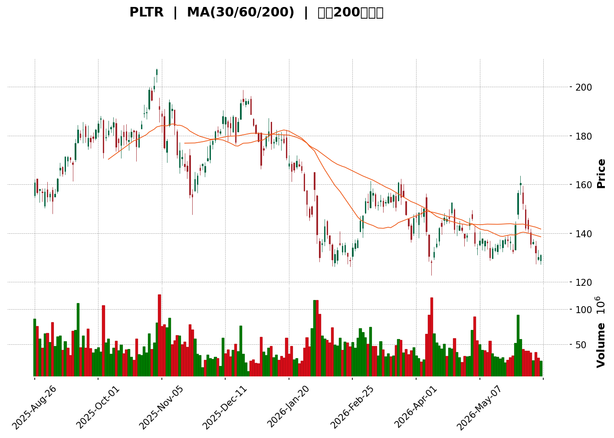
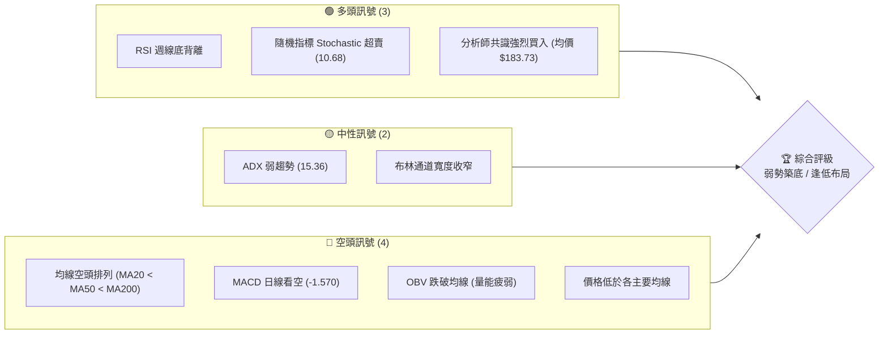
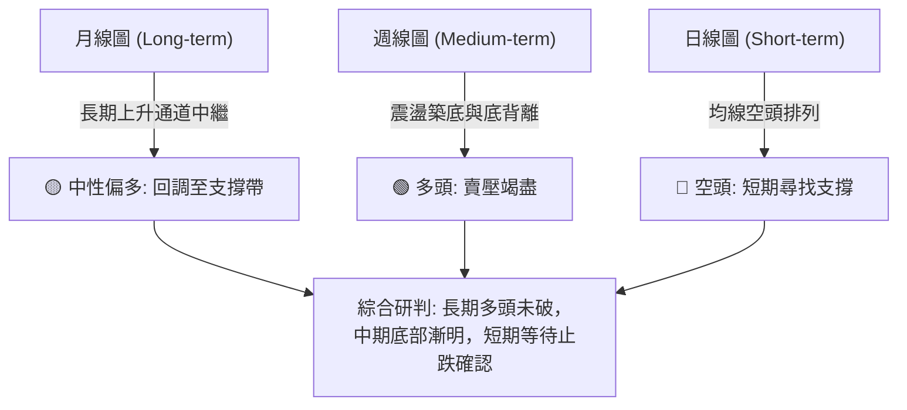
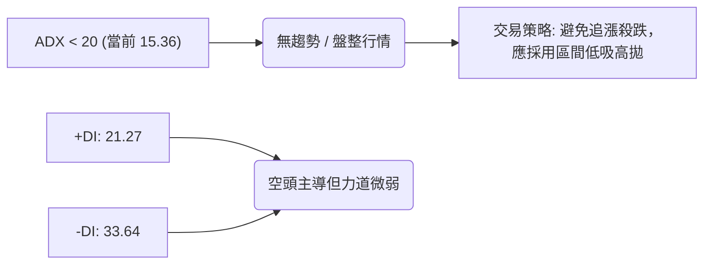
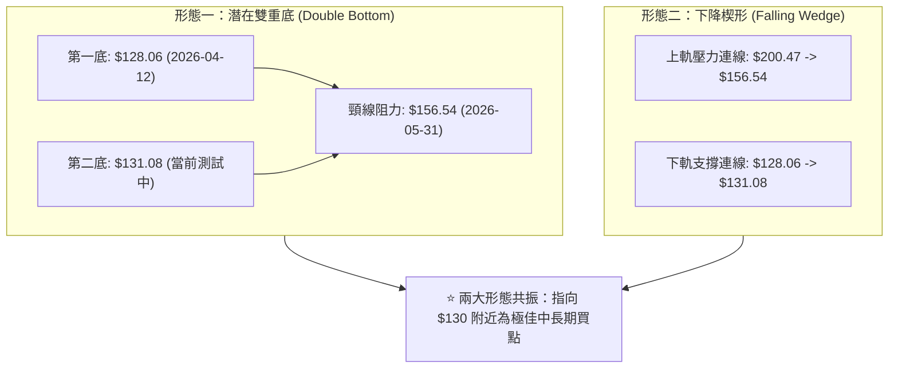

<details>
<summary>📊 靜態圖表 (點擊展開)</summary>

</details>

<html>
<head><meta charset="utf-8" /></head>
<body>
    <div style="height:500px; width:100%;">                        <script>window.PlotlyConfig = {MathJaxConfig: 'local'};</script>
        <script charset="utf-8" src="https://cdn.plot.ly/plotly-3.6.0.min.js" integrity="sha256-QaOVwtVY0T02VaHrr6pnoHLCwayMJp4O5n4YyaE3rJk=" crossorigin="anonymous"></script>                <div id="candlestick-chart" class="plotly-graph-div" style="height:100%; width:100%;"></div>            <script>                window.PLOTLYENV=window.PLOTLYENV || {};                                if (document.getElementById("candlestick-chart")) {                    Plotly.newPlot(                        "candlestick-chart",                        [{"close":{"dtype":"f8","bdata":"AAAAANcbZEAAAABACpdjQAAAAADXw2NAAAAAYLiWY0AAAABA4aJjQAAAAMDMXGNAAAAA4HqEY0AAAAAghSNjQAAAAEAzg2NAAAAAIIVLZEAAAAAgrtdkQAAAACCFi2RAAAAAgMJtZUAAAABguGZlQAAAAOBRSGVAAAAAYI8KZUAAAABACh9mQAAAAOB6zGZAAAAAYI9qZkAAAACgmdFmQAAAAIDrcWZAAAAAANdjZkAAAACAPTJmQAAAACCFW2ZAAAAAoHDNZkAAAABgZh5nQAAAAKCZYWdAAAAAgD2iZUAAAADA9XBmQAAAAKBwxWZAAAAAgOvxZkAAAABACi9nQAAAAIAU7mVAAAAAYLgmZkAAAAAgrndmQAAAAADXc2ZAAAAAANdDZkAAAADAzERmQAAAAEDhsmZAAAAA4FGwZkAAAAAgru9lQAAAACBcj2ZAAAAAACkUZ0AAAACAwqVnQAAAAEAzs2dAAAAAgOvZaEAAAACgmVFoQAAAAEAKD2lAAAAAgMLlaUAAAAAgrtdnQAAAAMDMfGdAAAAAoJnhZUAAAACAwj1mQAAAACCFM2hAAAAAYLjeZ0AAAACgcAVnQAAAAOB6hGVAAAAA4FHAZUAAAAAAAGhlQAAAAGCP6mRAAAAAoHCtZEAAAAAA13djQAAAAEAzW2NAAAAAAABIZEAAAACgmXFkQAAAAOCjuGRAAAAAYGYOZUAAAAAgru9kQAAAAIAUVmVAAAAAYI8CZkAAAACgcD1mQAAAAOBRuGZAAAAAIK6vZkAAAABA4bpmQAAAAMAefWdAAAAAoEdxZ0AAAACAPfJmQAAAAAAA6GZAAAAAAAB4Z0AAAACgRylmQAAAAIAUNmdAAAAAACksaEAAAAAgXD9oQAAAAAApRGhAAAAAoHBFaEAAAABguJZnQAAAAIDCBWdAAAAAQOGaZkAAAAAAADhmQAAAACCF+2RAAAAAoEfBZUAAAABguHZmQAAAAIDCtWZAAAAAIIUbZkAAAAAgri9mQAAAAMAebWZAAAAAYLheZkAAAADAzExmQAAAAIA9ImZAAAAAYLheZUAAAADA9RBlQAAAAGCPqmRAAAAAwMy8ZEAAAABAMzNlQAAAAEAK72RAAAAAYGa2ZEAAAABAM6tjQAAAACCF+2JAAAAAQOFSYkAAAADgUXhiQAAAAAApvGNAAAAAoEdxYUAAAADgUUBgQAAAAMDM\u002fGBAAAAAwB7dYUAAAADgUXBhQAAAAIDC9WBAAAAAACkkYEAAAADAHm1gQAAAAOCjoGBAAAAAACnsYEAAAADgetxgQAAAACCu52BAAAAAQDNTYEAAAABA4RpgQAAAAIAUxmBAAAAAgBT+YEAAAACAFCZhQAAAAKBwJWJAAAAAQApnYkAAAACAFCZjQAAAAKBwFWNAAAAAwB6lY0AAAACAwo1jQAAAAOB65GJAAAAAQDPzYkAAAAAAADBjQAAAAGBm3mJAAAAAQAoXY0AAAABgj2JjQAAAAOCjGGNAAAAAgMJ1Y0AAAACAwtViQAAAAEDhGmRAAAAAwPVYY0AAAABguF5jQAAAAIDrcWJAAAAAgOvhYUAAAACgmTFhQAAAAMD1SGJAAAAAIK5PYkAAAABguI5iQAAAAIDCfWJAAAAAgD3CYkAAAADgUZhhQAAAACCuT2BAAAAAgOsBYEAAAAAA14tgQAAAAGBm9mBAAAAAwMzEYUAAAADgUdhhQAAAAOB6TGJAAAAA4Ho8YkAAAABACj9iQAAAAADXE2NAAAAAgD2yYUAAAABA4eJhQAAAAEAz42FAAAAAgMKlYUAAAABACj9hQAAAACCFY2FAAAAAgD0CYkAAAADA9UBiQAAAAMAe\u002fWBAAAAAoEe5YEAAAACgmSFhQAAAAKCZOWFAAAAA4HocYUAAAAAAAABhQAAAAKCZQWBAAAAAIFy3YEAAAAAgrr9gQAAAAOB65GBAAAAA4FHoYEAAAADAzCRhQAAAAKBHLWFAAAAAACkcYUAAAABAMxNhQAAAAOBRkGBAAAAAQOHqYUAAAACgR5FjQAAAAMDMFGRAAAAAoHAFY0AAAABgZsZhQAAAAGBmtmFAAAAAwPXwYEAAAABACg9hQAAAAIA9gmBAAAAAYLhGYEAAAABgj2JgQA=="},"high":{"dtype":"f8","bdata":"AAAAAClEZEAAAADAzExkQAAAACBcx2NAAAAAoHDNY0AAAADgesxjQAAAAMDMJGRAAAAAoEehY0AAAABACt9jQAAAAKCZyWNAAAAAAABYZEAAAAAAACBlQAAAAOCn7mRAAAAAwPVwZUAAAACgmXllQAAAAIDraWVAAAAAgMI1ZUAAAACgmVlmQAAAAKBwDWdAAAAAAADIZkAAAAAAADhnQAAAAEAzG2dAAAAAgD0KZ0AAAAAA14NmQAAAACBcr2ZAAAAA4KPYZkAAAADA9UhnQAAAAGBmhmdAAAAAQOFaZ0AAAABgZt5mQAAAAIDCRWdAAAAA4FEIZ0AAAAAA13NnQAAAAEAzY2dAAAAAQApnZkAAAABA4cpmQAAAAEAzC2dAAAAAgD0aZ0AAAABA4bJmQAAAAEDh4mZAAAAAwHLMZkAAAABguMZmQAAAAIDrsWZAAAAAoHBFZ0AAAABgjxpoQAAAAMD1+GdAAAAAQDP7aEAAAACgcPVoQAAAAIDChWlAAAAA4KPwaUAAAABgZnZoQAAAAIA9ymdAAAAAQOHiZ0AAAABgZlZmQAAAAIDCXWhAAAAAoJkdaEAAAABgj9JnQAAAAGBm1mZAAAAAoEcpZkAAAAAgrsdlQAAAAGCPmmVAAAAAQDMzZUAAAACAPdJlQAAAACCFw2NAAAAAoHClZEAAAADAzJRkQAAAACDZCmVAAAAAoJkZZUAAAABAMyNlQAAAAAAA+GVAAAAAwB49ZkAAAACAFE5mQAAAAGDlxGZAAAAAACn8ZkAAAABAM9tmQAAAAOB6zGdAAAAAoJmBZ0AAAADAzFBnQAAAAMD1eGdAAAAAAACQZ0AAAAAAAHhnQAAAAGCPamdAAAAAAABgaEAAAAAAKdxoQAAAAADXa2hAAAAAoHBlaEAAAABAM4toQAAAAGBmZmdAAAAAAFQXZ0AAAADA9bBmQAAAAEAzq2ZAAAAAgD36ZUAAAACAFIZmQAAAAMD1aGdAAAAAwB41Z0AAAABACldmQAAAAAAA0GZAAAAAQDOjZkAAAADgIrNmQAAAAEAzk2ZAAAAAgMLNZkAAAABACn9lQAAAACCuL2VAAAAAAAAgZUAAAAAAAIBlQAAAAEDhUmVAAAAAgBQuZUAAAACgcKFkQAAAAAAptGNAAAAAAADgYkAAAADAzOxiQAAAAAB\u002fomRAAAAAQDN7Y0AAAAAgXD9hQAAAAOD7NWFAAAAAANc7YkAAAACA6zFiQAAAAAAAaGFAAAAA4Hr8YEAAAACA67FgQAAAAIA9ymBAAAAA4NCeYUAAAADAHgVhQAAAAGC4BmFAAAAAoEeBYEAAAAAgrkdgQAAAAEDhAmFAAAAA4FEwYUAAAABAM0NhQAAAAOB6ZGJAAAAAAABwYkAAAADgo1BjQAAAAAApjGNAAAAAYGYuZEAAAACAFM5jQAAAACAGlWNAAAAAgGglY0AAAAAAKXxjQAAAAIDrUWNAAAAAIIU7Y0AAAAAAAJhjQAAAAIAUlmNAAAAAwMyEY0AAAADAzJRjQAAAAGCPImRAAAAAwMxMZEAAAADgowhkQAAAAADXI2NAAAAAYLg+YkAAAAAA1wNiQAAAACCFe2JAAAAAoJmJYkAAAADgUZBiQAAAACCF02JAAAAA4KPIYkAAAADA9YhjQAAAAKBHcWFAAAAAYGYmYEAAAACgcM1gQAAAAIA9QmFAAAAAYI\u002fSYUAAAACgmTFiQAAAAMD1iGJAAAAAYGZmYkAAAAAA17tiQAAAAIDCFWNAAAAAoEfJYkAAAABgj+phQAAAAIA9ImJAAAAAQDP7YUAAAADgUXhhQAAAAGBmhmFAAAAAgBROYkAAAADgerRiQAAAACBc32FAAAAAYGb2YEAAAABgZp5hQAAAAAApPGFAAAAA4HokYUAAAACAwi1hQAAAACCuH2FAAAAAIFzPYEAAAADgevRgQAAAAIDr\u002fWBAAAAAQAovYUAAAAAgridhQAAAAKCZUWFAAAAA4KNgYUAAAACAwlVhQAAAACBc92BAAAAAAAAgYkAAAACg7bhjQAAAAGBmdmRAAAAAoJnxY0AAAACAwvViQAAAAADXS2JAAAAAQAq\u002fYUAAAADgUThhQAAAACCuH2FAAAAAgOulYEAAAABgoXBgQA=="},"hovertemplate":"\u003cb\u003e%{x|%Y-%m-%d}\u003c\u002fb\u003e\u003cbr\u003e\u958b: $%{open:.2f}\u003cbr\u003e\u9ad8: $%{high:.2f}\u003cbr\u003e\u4f4e: $%{low:.2f}\u003cbr\u003e\u6536: $%{close:.2f}\u003cextra\u003e\u003c\u002fextra\u003e","low":{"dtype":"f8","bdata":"AAAAgD1SY0AAAAAgXH9jQAAAAKCZEWNAAAAAAAAgY0AAAADA9chiQAAAAGC4FmNAAAAAwB4lY0AAAACgR4FiQAAAAEDhWmNAAAAAANeLY0AAAACAFG5kQAAAAEAKZ2RAAAAA4FGAZEAAAADAHu1kQAAAAGC4HmVAAAAA4KMoZEAAAADgeixlQAAAAGC4FmZAAAAAoEdJZkAAAADgUSBmQAAAAADXI2ZAAAAAoEfJZUAAAADAHt1lQAAAAMAeJWZAAAAAQApHZkAAAAAAAHBmQAAAAGBm3mZAAAAA4KNYZUAAAABgjzpmQAAAAKBwbWZAAAAAYGamZkAAAABgZn5mQAAAAMD1sGVAAAAAYGauZUAAAACAPVplQAAAAOCjAGZAAAAAYGYOZkAAAABgZr5lQAAAAIAULmZAAAAAwMxUZkAAAACgcC1lQAAAAOBR4GVAAAAAQDPbZkAAAADgo3BnQAAAAMD1WGdAAAAAIK7PZ0AAAAAA10NoQAAAAKBwvWhAAAAAgD06aUAAAACA6zFnQAAAAGC4pmZAAAAAwPXQZUAAAADAHh1lQAAAAOCj8GZAAAAAAClkZ0AAAADAzIxmQAAAAGBkV2VAAAAAAACQZEAAAACAwvVkQAAAAAAAsGRAAAAAoHBNZEAAAADgo0xjQAAAAIDrcWJAAAAAAACgY0AAAACAwpFjQAAAAAApfGRAAAAAAAC8ZEAAAAAA12NkQAAAAEDhMmVAAAAAYI8aZUAAAACAws1lQAAAAMAeJWZAAAAAoEdxZkAAAAAAKYxmQAAAAAAA2GZAAAAAYLiGZkAAAAAgWDVmQAAAAMD1gGZAAAAAQIukZkAAAAAAABBmQAAAAOBRsGZAAAAAIFxXZ0AAAACAwg1oQAAAACCF92dAAAAAYI8aaEAAAAAA15NnQAAAAOB69GZAAAAAYGaWZkAAAAAAAChmQAAAAEAzy2RAAAAAoEd5ZUAAAADgo9hlQAAAAMAeNWZAAAAAANfLZUAAAAAAANhlQAAAAEDhCmZAAAAA4HoEZkAAAABgZr5lQAAAAMD1EGZAAAAA4FFAZUAAAAAgrsdkQAAAACCFI2RAAAAAYGaeZEAAAACgmclkQAAAAGBm6mRAAAAAgBSWZEAAAAAgrqdjQAAAAADXY2JAAAAAwHIkYkAAAACg7VRiQAAAAADXI2NAAAAAgML1YEAAAACAPQpgQAAAAEAzi2BAAAAAANXYYEAAAADgozhhQAAAAGBmnmBAAAAAANejX0AAAACA6Y5fQAAAAGCP0l9AAAAAANfbYEAAAADgUWBgQAAAAKBwZWBAAAAAwPXYX0AAAAAgrpdfQAAAAIDCJWBAAAAAACmUYEAAAAAgXL9gQAAAAOCjkGFAAAAAYGZGYUAAAACA64FiQAAAACCFs2JAAAAAoEfJYkAAAABACh9jQAAAAOB6xGJAAAAAYI+qYkAAAAAgXN9iQAAAAGCPkmJAAAAAoHDlYkAAAAAA1wNjQAAAACCFE2NAAAAAAADQYkAAAABA4aJiQAAAACCuJ2NAAAAA4Hr0YkAAAAAgXFtjQAAAAAAAaGJAAAAAgOuxYUAAAACgmQlhQAAAAEAKX2FAAAAAQAoPYkAAAAAgrj9hQAAAACAxVGJAAAAAYGYOYkAAAACgcGVhQAAAAEAKD2BAAAAAIIWrXkAAAADAzCRgQAAAAAAAwGBAAAAAgMLdYEAAAADA9XBhQAAAAKCZ6WFAAAAAYI\u002f6YUAAAADA9\u002f9hQAAAAMAebWJAAAAAoHB9YUAAAACAwl1hQAAAAOBRoGFAAAAAoHCNYUAAAACAwtVgQAAAAMDMFGFAAAAA4HqsYUAAAABAMydiQAAAAEAK12BAAAAAwMxkYEAAAADA9dhgQAAAAOCjoGBAAAAAAKyYYEAAAABguK5gQAAAAAAAGGBAAAAAYGYuYEAAAACgR4lgQAAAAGCPamBAAAAAQDOzYEAAAACgcI1gQAAAAKBw7WBAAAAAoJnJYEAAAACgmalgQAAAAAApdGBAAAAAAACgYEAAAACgRzliQAAAAAApfGNAAAAAoJm5YkAAAAAAAKhhQAAAAEC0iGFAAAAAwMzAYEAAAADA9ehgQAAAAGBm1l9AAAAAoJkZYEAAAAAghctfQA=="},"name":"\u50f9\u683c","open":{"dtype":"f8","bdata":"AAAA4HpsY0AAAACAPUpkQAAAAAAptGNAAAAAIFyfY0AAAABgZuZiQAAAAAAAwGNAAAAAIK5bY0AAAACAPbpjQAAAAMAeXWNAAAAAAACoY0AAAAAAAMBkQAAAACCu52RAAAAAQDOrZEAAAABAMzNlQAAAAKBHYWVAAAAA4KMgZUAAAADgo0hlQAAAAIA9ImZAAAAAACmcZkAAAADgUdBmQAAAAMAe\u002fWZAAAAAoJn5ZUAAAACgmWFmQAAAAOB6dGZAAAAAIFxfZkAAAACAPapmQAAAAGBmVmdAAAAAwMxMZ0AAAACAwmVmQAAAAIDriWZAAAAAoJnZZkAAAABgj\u002fJmQAAAAKBwJWdAAAAAgMJVZkAAAAAAAABmQAAAAMD1tGZAAAAAwPW4ZkAAAAAAADhmQAAAACCub2ZAAAAAgOvBZkAAAACAwr1mQAAAAIA97mVAAAAAACncZkAAAABACp9nQAAAACBcr2dAAAAAYI\u002fiZ0AAAACgmc1oQAAAAGBm5mhAAAAAoHChaUAAAACAPQJoQAAAAAAAoGdAAAAAIK5\u002fZ0AAAADAzKRlQAAAAIDrCWdAAAAAYLjKZ0AAAABgj9JnQAAAAEDhtmZAAAAAQDPfZEAAAADA9VBlQAAAAADXC2VAAAAAoJn5ZEAAAACAPYJlQAAAAOBRgGNAAAAAQAqvY0AAAACAPQJkQAAAAEAz22RAAAAA4FH4ZEAAAAAAAKBkQAAAAEDhMmVAAAAA4HpEZUAAAAAgrgtmQAAAACBcR2ZAAAAAYLjGZkAAAABACp9mQAAAAGBmHmdAAAAAoJkZZ0AAAACA6zlnQAAAAGCPImdAAAAAwPW0ZkAAAABA4XZnQAAAAOBRsGZAAAAAIK5XZ0AAAACgR2FoQAAAAGBmGmhAAAAAwB4laEAAAADgemBoQAAAAEAzW2dAAAAAQDMLZ0AAAAAAKaRmQAAAAKCZqWZAAAAAACncZUAAAADgUfhlQAAAAKCZeWZAAAAAIK4zZ0AAAADgoyBmQAAAAIDrNWZAAAAAAABcZkAAAAAAAERmQAAAAGC4VmZAAAAAIIVrZkAAAAAAAPRkQAAAACDdDGVAAAAAoJkdZUAAAADgo+hkQAAAAGC4BmVAAAAAIFzvZEAAAADAzIxkQAAAAAAptGNAAAAAoJnBYkAAAACAFN5iQAAAAKCZoWRAAAAAwB5tY0AAAACAPRphQAAAAGCP6mBAAAAAYI8SYUAAAABA4R5iQAAAAMDMYGFAAAAAIIXrYEAAAACgmflfQAAAAOCjHGBAAAAA4Hr8YEAAAACA64lgQAAAACCui2BAAAAAoEeBYEAAAAAAKSBgQAAAACCFU2BAAAAAQAq7YEAAAACAPcJgQAAAAMDMmGFAAAAAQDPDYUAAAACAwo1iQAAAAIAUHmNAAAAAgBTOYkAAAACAFHZjQAAAACCuf2NAAAAAACnsYkAAAADgUSBjQAAAAKCZKWNAAAAAYGYOY0AAAADA9QxjQAAAAIA9XmNAAAAAQDMjY0AAAABgZmZjQAAAACCuJ2NAAAAAgD0CZEAAAACgcK1jQAAAAIDCIWNAAAAAACk8YkAAAADgo+hhQAAAAOCjgGFAAAAAAABgYkAAAAAghe9hQAAAACCFi2JAAAAAYDlcYkAAAADgelhjQAAAAOCjbGFAAAAAIFwPYEAAAAAgXEdgQAAAAACqzWBAAAAAoEcZYUAAAACgRwliQAAAAIAUKmJAAAAAAAAgYkAAAACA61liQAAAACCFi2JAAAAAYGa2YkAAAABguN5hQAAAAAAAqGFAAAAAoJnJYUAAAADgUXhhQAAAAEAzT2FAAAAAAADoYUAAAAAAAHhiQAAAAKBwiWFAAAAAYLi2YEAAAABAM+NgQAAAACCu+2BAAAAAwB7dYEAAAABAMxNhQAAAACAxwGBAAAAAwMw0YEAAAACgmZlgQAAAAAAAkGBAAAAAoHDlYEAAAADgo8RgQAAAAKCZ+WBAAAAAoJktYUAAAADAHgVhQAAAAKCZqWBAAAAAwB6lYEAAAABgZnpiQAAAACBc\u002f2NAAAAAgBSWY0AAAABgZrZiQAAAAGC4LmJAAAAAYGaKYUAAAACAwvVgQAAAAADX22BAAAAAYGYqYEAAAACgRxlgQA=="},"x":["2025-08-26T00:00:00-04:00","2025-08-27T00:00:00-04:00","2025-08-28T00:00:00-04:00","2025-08-29T00:00:00-04:00","2025-09-02T00:00:00-04:00","2025-09-03T00:00:00-04:00","2025-09-04T00:00:00-04:00","2025-09-05T00:00:00-04:00","2025-09-08T00:00:00-04:00","2025-09-09T00:00:00-04:00","2025-09-10T00:00:00-04:00","2025-09-11T00:00:00-04:00","2025-09-12T00:00:00-04:00","2025-09-15T00:00:00-04:00","2025-09-16T00:00:00-04:00","2025-09-17T00:00:00-04:00","2025-09-18T00:00:00-04:00","2025-09-19T00:00:00-04:00","2025-09-22T00:00:00-04:00","2025-09-23T00:00:00-04:00","2025-09-24T00:00:00-04:00","2025-09-25T00:00:00-04:00","2025-09-26T00:00:00-04:00","2025-09-29T00:00:00-04:00","2025-09-30T00:00:00-04:00","2025-10-01T00:00:00-04:00","2025-10-02T00:00:00-04:00","2025-10-03T00:00:00-04:00","2025-10-06T00:00:00-04:00","2025-10-07T00:00:00-04:00","2025-10-08T00:00:00-04:00","2025-10-09T00:00:00-04:00","2025-10-10T00:00:00-04:00","2025-10-13T00:00:00-04:00","2025-10-14T00:00:00-04:00","2025-10-15T00:00:00-04:00","2025-10-16T00:00:00-04:00","2025-10-17T00:00:00-04:00","2025-10-20T00:00:00-04:00","2025-10-21T00:00:00-04:00","2025-10-22T00:00:00-04:00","2025-10-23T00:00:00-04:00","2025-10-24T00:00:00-04:00","2025-10-27T00:00:00-04:00","2025-10-28T00:00:00-04:00","2025-10-29T00:00:00-04:00","2025-10-30T00:00:00-04:00","2025-10-31T00:00:00-04:00","2025-11-03T00:00:00-05:00","2025-11-04T00:00:00-05:00","2025-11-05T00:00:00-05:00","2025-11-06T00:00:00-05:00","2025-11-07T00:00:00-05:00","2025-11-10T00:00:00-05:00","2025-11-11T00:00:00-05:00","2025-11-12T00:00:00-05:00","2025-11-13T00:00:00-05:00","2025-11-14T00:00:00-05:00","2025-11-17T00:00:00-05:00","2025-11-18T00:00:00-05:00","2025-11-19T00:00:00-05:00","2025-11-20T00:00:00-05:00","2025-11-21T00:00:00-05:00","2025-11-24T00:00:00-05:00","2025-11-25T00:00:00-05:00","2025-11-26T00:00:00-05:00","2025-11-28T00:00:00-05:00","2025-12-01T00:00:00-05:00","2025-12-02T00:00:00-05:00","2025-12-03T00:00:00-05:00","2025-12-04T00:00:00-05:00","2025-12-05T00:00:00-05:00","2025-12-08T00:00:00-05:00","2025-12-09T00:00:00-05:00","2025-12-10T00:00:00-05:00","2025-12-11T00:00:00-05:00","2025-12-12T00:00:00-05:00","2025-12-15T00:00:00-05:00","2025-12-16T00:00:00-05:00","2025-12-17T00:00:00-05:00","2025-12-18T00:00:00-05:00","2025-12-19T00:00:00-05:00","2025-12-22T00:00:00-05:00","2025-12-23T00:00:00-05:00","2025-12-24T00:00:00-05:00","2025-12-26T00:00:00-05:00","2025-12-29T00:00:00-05:00","2025-12-30T00:00:00-05:00","2025-12-31T00:00:00-05:00","2026-01-02T00:00:00-05:00","2026-01-05T00:00:00-05:00","2026-01-06T00:00:00-05:00","2026-01-07T00:00:00-05:00","2026-01-08T00:00:00-05:00","2026-01-09T00:00:00-05:00","2026-01-12T00:00:00-05:00","2026-01-13T00:00:00-05:00","2026-01-14T00:00:00-05:00","2026-01-15T00:00:00-05:00","2026-01-16T00:00:00-05:00","2026-01-20T00:00:00-05:00","2026-01-21T00:00:00-05:00","2026-01-22T00:00:00-05:00","2026-01-23T00:00:00-05:00","2026-01-26T00:00:00-05:00","2026-01-27T00:00:00-05:00","2026-01-28T00:00:00-05:00","2026-01-29T00:00:00-05:00","2026-01-30T00:00:00-05:00","2026-02-02T00:00:00-05:00","2026-02-03T00:00:00-05:00","2026-02-04T00:00:00-05:00","2026-02-05T00:00:00-05:00","2026-02-06T00:00:00-05:00","2026-02-09T00:00:00-05:00","2026-02-10T00:00:00-05:00","2026-02-11T00:00:00-05:00","2026-02-12T00:00:00-05:00","2026-02-13T00:00:00-05:00","2026-02-17T00:00:00-05:00","2026-02-18T00:00:00-05:00","2026-02-19T00:00:00-05:00","2026-02-20T00:00:00-05:00","2026-02-23T00:00:00-05:00","2026-02-24T00:00:00-05:00","2026-02-25T00:00:00-05:00","2026-02-26T00:00:00-05:00","2026-02-27T00:00:00-05:00","2026-03-02T00:00:00-05:00","2026-03-03T00:00:00-05:00","2026-03-04T00:00:00-05:00","2026-03-05T00:00:00-05:00","2026-03-06T00:00:00-05:00","2026-03-09T00:00:00-04:00","2026-03-10T00:00:00-04:00","2026-03-11T00:00:00-04:00","2026-03-12T00:00:00-04:00","2026-03-13T00:00:00-04:00","2026-03-16T00:00:00-04:00","2026-03-17T00:00:00-04:00","2026-03-18T00:00:00-04:00","2026-03-19T00:00:00-04:00","2026-03-20T00:00:00-04:00","2026-03-23T00:00:00-04:00","2026-03-24T00:00:00-04:00","2026-03-25T00:00:00-04:00","2026-03-26T00:00:00-04:00","2026-03-27T00:00:00-04:00","2026-03-30T00:00:00-04:00","2026-03-31T00:00:00-04:00","2026-04-01T00:00:00-04:00","2026-04-02T00:00:00-04:00","2026-04-06T00:00:00-04:00","2026-04-07T00:00:00-04:00","2026-04-08T00:00:00-04:00","2026-04-09T00:00:00-04:00","2026-04-10T00:00:00-04:00","2026-04-13T00:00:00-04:00","2026-04-14T00:00:00-04:00","2026-04-15T00:00:00-04:00","2026-04-16T00:00:00-04:00","2026-04-17T00:00:00-04:00","2026-04-20T00:00:00-04:00","2026-04-21T00:00:00-04:00","2026-04-22T00:00:00-04:00","2026-04-23T00:00:00-04:00","2026-04-24T00:00:00-04:00","2026-04-27T00:00:00-04:00","2026-04-28T00:00:00-04:00","2026-04-29T00:00:00-04:00","2026-04-30T00:00:00-04:00","2026-05-01T00:00:00-04:00","2026-05-04T00:00:00-04:00","2026-05-05T00:00:00-04:00","2026-05-06T00:00:00-04:00","2026-05-07T00:00:00-04:00","2026-05-08T00:00:00-04:00","2026-05-11T00:00:00-04:00","2026-05-12T00:00:00-04:00","2026-05-13T00:00:00-04:00","2026-05-14T00:00:00-04:00","2026-05-15T00:00:00-04:00","2026-05-18T00:00:00-04:00","2026-05-19T00:00:00-04:00","2026-05-20T00:00:00-04:00","2026-05-21T00:00:00-04:00","2026-05-22T00:00:00-04:00","2026-05-26T00:00:00-04:00","2026-05-27T00:00:00-04:00","2026-05-28T00:00:00-04:00","2026-05-29T00:00:00-04:00","2026-06-01T00:00:00-04:00","2026-06-02T00:00:00-04:00","2026-06-03T00:00:00-04:00","2026-06-04T00:00:00-04:00","2026-06-05T00:00:00-04:00","2026-06-08T00:00:00-04:00","2026-06-09T00:00:00-04:00","2026-06-10T00:00:00-04:00","2026-06-11T00:00:00-04:00"],"type":"candlestick"},{"hovertemplate":"MA30: $%{y:.2f}\u003cextra\u003e\u003c\u002fextra\u003e","line":{"color":"#2196F3","dash":"dash","width":2},"mode":"lines","name":"MA30","x":["2025-08-26T00:00:00-04:00","2025-08-27T00:00:00-04:00","2025-08-28T00:00:00-04:00","2025-08-29T00:00:00-04:00","2025-09-02T00:00:00-04:00","2025-09-03T00:00:00-04:00","2025-09-04T00:00:00-04:00","2025-09-05T00:00:00-04:00","2025-09-08T00:00:00-04:00","2025-09-09T00:00:00-04:00","2025-09-10T00:00:00-04:00","2025-09-11T00:00:00-04:00","2025-09-12T00:00:00-04:00","2025-09-15T00:00:00-04:00","2025-09-16T00:00:00-04:00","2025-09-17T00:00:00-04:00","2025-09-18T00:00:00-04:00","2025-09-19T00:00:00-04:00","2025-09-22T00:00:00-04:00","2025-09-23T00:00:00-04:00","2025-09-24T00:00:00-04:00","2025-09-25T00:00:00-04:00","2025-09-26T00:00:00-04:00","2025-09-29T00:00:00-04:00","2025-09-30T00:00:00-04:00","2025-10-01T00:00:00-04:00","2025-10-02T00:00:00-04:00","2025-10-03T00:00:00-04:00","2025-10-06T00:00:00-04:00","2025-10-07T00:00:00-04:00","2025-10-08T00:00:00-04:00","2025-10-09T00:00:00-04:00","2025-10-10T00:00:00-04:00","2025-10-13T00:00:00-04:00","2025-10-14T00:00:00-04:00","2025-10-15T00:00:00-04:00","2025-10-16T00:00:00-04:00","2025-10-17T00:00:00-04:00","2025-10-20T00:00:00-04:00","2025-10-21T00:00:00-04:00","2025-10-22T00:00:00-04:00","2025-10-23T00:00:00-04:00","2025-10-24T00:00:00-04:00","2025-10-27T00:00:00-04:00","2025-10-28T00:00:00-04:00","2025-10-29T00:00:00-04:00","2025-10-30T00:00:00-04:00","2025-10-31T00:00:00-04:00","2025-11-03T00:00:00-05:00","2025-11-04T00:00:00-05:00","2025-11-05T00:00:00-05:00","2025-11-06T00:00:00-05:00","2025-11-07T00:00:00-05:00","2025-11-10T00:00:00-05:00","2025-11-11T00:00:00-05:00","2025-11-12T00:00:00-05:00","2025-11-13T00:00:00-05:00","2025-11-14T00:00:00-05:00","2025-11-17T00:00:00-05:00","2025-11-18T00:00:00-05:00","2025-11-19T00:00:00-05:00","2025-11-20T00:00:00-05:00","2025-11-21T00:00:00-05:00","2025-11-24T00:00:00-05:00","2025-11-25T00:00:00-05:00","2025-11-26T00:00:00-05:00","2025-11-28T00:00:00-05:00","2025-12-01T00:00:00-05:00","2025-12-02T00:00:00-05:00","2025-12-03T00:00:00-05:00","2025-12-04T00:00:00-05:00","2025-12-05T00:00:00-05:00","2025-12-08T00:00:00-05:00","2025-12-09T00:00:00-05:00","2025-12-10T00:00:00-05:00","2025-12-11T00:00:00-05:00","2025-12-12T00:00:00-05:00","2025-12-15T00:00:00-05:00","2025-12-16T00:00:00-05:00","2025-12-17T00:00:00-05:00","2025-12-18T00:00:00-05:00","2025-12-19T00:00:00-05:00","2025-12-22T00:00:00-05:00","2025-12-23T00:00:00-05:00","2025-12-24T00:00:00-05:00","2025-12-26T00:00:00-05:00","2025-12-29T00:00:00-05:00","2025-12-30T00:00:00-05:00","2025-12-31T00:00:00-05:00","2026-01-02T00:00:00-05:00","2026-01-05T00:00:00-05:00","2026-01-06T00:00:00-05:00","2026-01-07T00:00:00-05:00","2026-01-08T00:00:00-05:00","2026-01-09T00:00:00-05:00","2026-01-12T00:00:00-05:00","2026-01-13T00:00:00-05:00","2026-01-14T00:00:00-05:00","2026-01-15T00:00:00-05:00","2026-01-16T00:00:00-05:00","2026-01-20T00:00:00-05:00","2026-01-21T00:00:00-05:00","2026-01-22T00:00:00-05:00","2026-01-23T00:00:00-05:00","2026-01-26T00:00:00-05:00","2026-01-27T00:00:00-05:00","2026-01-28T00:00:00-05:00","2026-01-29T00:00:00-05:00","2026-01-30T00:00:00-05:00","2026-02-02T00:00:00-05:00","2026-02-03T00:00:00-05:00","2026-02-04T00:00:00-05:00","2026-02-05T00:00:00-05:00","2026-02-06T00:00:00-05:00","2026-02-09T00:00:00-05:00","2026-02-10T00:00:00-05:00","2026-02-11T00:00:00-05:00","2026-02-12T00:00:00-05:00","2026-02-13T00:00:00-05:00","2026-02-17T00:00:00-05:00","2026-02-18T00:00:00-05:00","2026-02-19T00:00:00-05:00","2026-02-20T00:00:00-05:00","2026-02-23T00:00:00-05:00","2026-02-24T00:00:00-05:00","2026-02-25T00:00:00-05:00","2026-02-26T00:00:00-05:00","2026-02-27T00:00:00-05:00","2026-03-02T00:00:00-05:00","2026-03-03T00:00:00-05:00","2026-03-04T00:00:00-05:00","2026-03-05T00:00:00-05:00","2026-03-06T00:00:00-05:00","2026-03-09T00:00:00-04:00","2026-03-10T00:00:00-04:00","2026-03-11T00:00:00-04:00","2026-03-12T00:00:00-04:00","2026-03-13T00:00:00-04:00","2026-03-16T00:00:00-04:00","2026-03-17T00:00:00-04:00","2026-03-18T00:00:00-04:00","2026-03-19T00:00:00-04:00","2026-03-20T00:00:00-04:00","2026-03-23T00:00:00-04:00","2026-03-24T00:00:00-04:00","2026-03-25T00:00:00-04:00","2026-03-26T00:00:00-04:00","2026-03-27T00:00:00-04:00","2026-03-30T00:00:00-04:00","2026-03-31T00:00:00-04:00","2026-04-01T00:00:00-04:00","2026-04-02T00:00:00-04:00","2026-04-06T00:00:00-04:00","2026-04-07T00:00:00-04:00","2026-04-08T00:00:00-04:00","2026-04-09T00:00:00-04:00","2026-04-10T00:00:00-04:00","2026-04-13T00:00:00-04:00","2026-04-14T00:00:00-04:00","2026-04-15T00:00:00-04:00","2026-04-16T00:00:00-04:00","2026-04-17T00:00:00-04:00","2026-04-20T00:00:00-04:00","2026-04-21T00:00:00-04:00","2026-04-22T00:00:00-04:00","2026-04-23T00:00:00-04:00","2026-04-24T00:00:00-04:00","2026-04-27T00:00:00-04:00","2026-04-28T00:00:00-04:00","2026-04-29T00:00:00-04:00","2026-04-30T00:00:00-04:00","2026-05-01T00:00:00-04:00","2026-05-04T00:00:00-04:00","2026-05-05T00:00:00-04:00","2026-05-06T00:00:00-04:00","2026-05-07T00:00:00-04:00","2026-05-08T00:00:00-04:00","2026-05-11T00:00:00-04:00","2026-05-12T00:00:00-04:00","2026-05-13T00:00:00-04:00","2026-05-14T00:00:00-04:00","2026-05-15T00:00:00-04:00","2026-05-18T00:00:00-04:00","2026-05-19T00:00:00-04:00","2026-05-20T00:00:00-04:00","2026-05-21T00:00:00-04:00","2026-05-22T00:00:00-04:00","2026-05-26T00:00:00-04:00","2026-05-27T00:00:00-04:00","2026-05-28T00:00:00-04:00","2026-05-29T00:00:00-04:00","2026-06-01T00:00:00-04:00","2026-06-02T00:00:00-04:00","2026-06-03T00:00:00-04:00","2026-06-04T00:00:00-04:00","2026-06-05T00:00:00-04:00","2026-06-08T00:00:00-04:00","2026-06-09T00:00:00-04:00","2026-06-10T00:00:00-04:00","2026-06-11T00:00:00-04:00"],"y":{"dtype":"f8","bdata":"AAAAAAAA+H8AAAAAAAD4fwAAAAAAAPh\u002fAAAAAAAA+H8AAAAAAAD4fwAAAAAAAPh\u002fAAAAAAAA+H8AAAAAAAD4fwAAAAAAAPh\u002fAAAAAAAA+H8AAAAAAAD4fwAAAAAAAPh\u002fAAAAAAAA+H8AAAAAAAD4fwAAAAAAAPh\u002fAAAAAAAA+H8AAAAAAAD4fwAAAAAAAPh\u002fAAAAAAAA+H8AAAAAAAD4fwAAAAAAAPh\u002fAAAAAAAA+H8AAAAAAAD4fwAAAAAAAPh\u002fAAAAAAAA+H8AAAAAAAD4fwAAAAAAAPh\u002fAAAAAAAA+H8AAAAAAAD4fwAAAPCnSmVAIiIi0ttiZUDNzMx8hoFlQBEREQEAlGVA7+7u3t2pZUBVVVXVBsJlQKuqqgpl3GVAvLu7C9fzZUAiIiKijA5mQJqZmRm9KWZAMzMzUyo+ZkCJiIiof0dmQN7d3X2xWGZAmpmZ+cVmZkCrqqr68HlmQHd3dxeSjmZAmpmZKRWvZkDNzMys1cFmQImIiLge1WZAAAAAoNPyZkCrqqoKkPtmQKuqqmp1BGdAmpmZCR4AZ0BmZmZWgABnQCIiIhI8EGdAAAAAEFgZZ0AiIiISgxhnQFVVVaWbCGdAMzMzU5wJZ0BVVVVVxwBnQGZmZgbz8GZAiYiImJndZkAAAACw5L1mQO\u002fu7j7up2ZAq6qqKvmXZkB3d3c3tIZmQO\u002fu7j7ud2ZAERERsZ1tZkDe3d3NPmJmQBEREWGeVmZAERERodNQZkDe3d0ta1NmQERERLTIVGZAZmZmRm9RZkB3d3f3mklmQLy7u3vNR2ZAVVVVBcg7ZkAAAADAETBmQKuqqoqzHWZAvLu72\u002fkIZkC8u7sbofplQCIiIqJF+GVAIiIi8tILZkCrqqqq8RxmQJqZmal\u002fHWZARERENOwgZkDe3d3twyVmQGZmZqabMmZAIiIisuQ5ZkARERGh00BmQKuqqlpkQWZAAAAAMJZKZkC8u7s7JmRmQLy7u5vEgGZAzczMHFqQZkCamZmpOJ9mQKuqqkrFrWZAmpmZOfu4ZkARERFhnsRmQLy7u4tsy2ZAIiIicvbFZkCamZlZ8rtmQN7d3d1rqmZAERERwcqZZkC8u7trvIxmQAAAAPDudmZAmpmZKaNfZkCrqqpaq0NmQKuqqsovImZA3t3dXUj2ZUBVVVW1yNZlQJqZmbkeuWVAAAAA0LB\u002fZUDNzMy8dDtlQAAAABBY\u002fWRAq6qqqqrGZECJiIjIL5JkQM3MzAx0XmRAZmZmxksnZEDe3d3d3fVjQJqZmTm00GNAiYiIeHenY0Dv7u6eqHdjQImIiGgfRmNAiYiIWMcUY0BmZmam4uBiQDMzM5OmsGJA7+7uPsOCYkC8u7srzlZiQHd3d1fHNGJAzczMvHQbYkBVVVXlFwtiQO\u002fu7t6W\u002fWFAVVVVRUT0YUCrqqr6N+ZhQM3MzMzM1GFAAAAAkMLFYUARERFBp8FhQDMzM8OuwGFAmpmZqTjHYUAzMzODB89hQERERCSUyWFAAAAAcMvaYUCamZm51\u002fBhQCIiIgJyC2JA7+7uThsYYkARERExlihiQJqZmTlCNWJAq6qqCh5EYkC8u7urqkpiQImIiIjPWGJA3t3dTalkYkAiIiLSInNiQImIiAisgGJAREREpHCVYkCJiIiYJ6JiQAAAAEA1nmJAvLu7e82VYkDNzMxMqZBiQLy7u1uPhmJAiYiI6CaBYkAiIiLSBnZiQGZmZvZTb2JAAAAAgE5jYkCamZk5JlhiQM3MzFy6WWJAERERgQdPYkARERHh7ENiQO\u002fu7k6NO2JA3t3dHT4vYkAiIiLy\u002fRxiQKuqqtprDmJA3t3djQkCYkC8u7vLE\u002f1hQO\u002fu7j584mFAMzMzkxjMYUAzMzPz\u002fbhhQCIiItKUrmFAAAAAAACoYUDv7u6+WKZhQAAAAOAIlWFAq6qqimyHYUBERERE\u002fXdhQO\u002fu7r5YamFAAAAAoIxaYUCrqqraslZhQGZmZtYVXmFAmpmZSX5nYUDNzMxcAWxhQHd3d0eaaGFAq6qqOt9pYUBmZmYWknhhQERERATIh2FAAAAA4HqOYUCamZlpdYphQGZmZobPfmFAMzMzM154YUAAAACATnFhQDMzM5OKZWFAmpmZCddZYUC8u7ubfVJhQA=="},"type":"scatter"},{"hovertemplate":"MA60: $%{y:.2f}\u003cextra\u003e\u003c\u002fextra\u003e","line":{"color":"#9C27B0","dash":"dash","width":2},"mode":"lines","name":"MA60","x":["2025-08-26T00:00:00-04:00","2025-08-27T00:00:00-04:00","2025-08-28T00:00:00-04:00","2025-08-29T00:00:00-04:00","2025-09-02T00:00:00-04:00","2025-09-03T00:00:00-04:00","2025-09-04T00:00:00-04:00","2025-09-05T00:00:00-04:00","2025-09-08T00:00:00-04:00","2025-09-09T00:00:00-04:00","2025-09-10T00:00:00-04:00","2025-09-11T00:00:00-04:00","2025-09-12T00:00:00-04:00","2025-09-15T00:00:00-04:00","2025-09-16T00:00:00-04:00","2025-09-17T00:00:00-04:00","2025-09-18T00:00:00-04:00","2025-09-19T00:00:00-04:00","2025-09-22T00:00:00-04:00","2025-09-23T00:00:00-04:00","2025-09-24T00:00:00-04:00","2025-09-25T00:00:00-04:00","2025-09-26T00:00:00-04:00","2025-09-29T00:00:00-04:00","2025-09-30T00:00:00-04:00","2025-10-01T00:00:00-04:00","2025-10-02T00:00:00-04:00","2025-10-03T00:00:00-04:00","2025-10-06T00:00:00-04:00","2025-10-07T00:00:00-04:00","2025-10-08T00:00:00-04:00","2025-10-09T00:00:00-04:00","2025-10-10T00:00:00-04:00","2025-10-13T00:00:00-04:00","2025-10-14T00:00:00-04:00","2025-10-15T00:00:00-04:00","2025-10-16T00:00:00-04:00","2025-10-17T00:00:00-04:00","2025-10-20T00:00:00-04:00","2025-10-21T00:00:00-04:00","2025-10-22T00:00:00-04:00","2025-10-23T00:00:00-04:00","2025-10-24T00:00:00-04:00","2025-10-27T00:00:00-04:00","2025-10-28T00:00:00-04:00","2025-10-29T00:00:00-04:00","2025-10-30T00:00:00-04:00","2025-10-31T00:00:00-04:00","2025-11-03T00:00:00-05:00","2025-11-04T00:00:00-05:00","2025-11-05T00:00:00-05:00","2025-11-06T00:00:00-05:00","2025-11-07T00:00:00-05:00","2025-11-10T00:00:00-05:00","2025-11-11T00:00:00-05:00","2025-11-12T00:00:00-05:00","2025-11-13T00:00:00-05:00","2025-11-14T00:00:00-05:00","2025-11-17T00:00:00-05:00","2025-11-18T00:00:00-05:00","2025-11-19T00:00:00-05:00","2025-11-20T00:00:00-05:00","2025-11-21T00:00:00-05:00","2025-11-24T00:00:00-05:00","2025-11-25T00:00:00-05:00","2025-11-26T00:00:00-05:00","2025-11-28T00:00:00-05:00","2025-12-01T00:00:00-05:00","2025-12-02T00:00:00-05:00","2025-12-03T00:00:00-05:00","2025-12-04T00:00:00-05:00","2025-12-05T00:00:00-05:00","2025-12-08T00:00:00-05:00","2025-12-09T00:00:00-05:00","2025-12-10T00:00:00-05:00","2025-12-11T00:00:00-05:00","2025-12-12T00:00:00-05:00","2025-12-15T00:00:00-05:00","2025-12-16T00:00:00-05:00","2025-12-17T00:00:00-05:00","2025-12-18T00:00:00-05:00","2025-12-19T00:00:00-05:00","2025-12-22T00:00:00-05:00","2025-12-23T00:00:00-05:00","2025-12-24T00:00:00-05:00","2025-12-26T00:00:00-05:00","2025-12-29T00:00:00-05:00","2025-12-30T00:00:00-05:00","2025-12-31T00:00:00-05:00","2026-01-02T00:00:00-05:00","2026-01-05T00:00:00-05:00","2026-01-06T00:00:00-05:00","2026-01-07T00:00:00-05:00","2026-01-08T00:00:00-05:00","2026-01-09T00:00:00-05:00","2026-01-12T00:00:00-05:00","2026-01-13T00:00:00-05:00","2026-01-14T00:00:00-05:00","2026-01-15T00:00:00-05:00","2026-01-16T00:00:00-05:00","2026-01-20T00:00:00-05:00","2026-01-21T00:00:00-05:00","2026-01-22T00:00:00-05:00","2026-01-23T00:00:00-05:00","2026-01-26T00:00:00-05:00","2026-01-27T00:00:00-05:00","2026-01-28T00:00:00-05:00","2026-01-29T00:00:00-05:00","2026-01-30T00:00:00-05:00","2026-02-02T00:00:00-05:00","2026-02-03T00:00:00-05:00","2026-02-04T00:00:00-05:00","2026-02-05T00:00:00-05:00","2026-02-06T00:00:00-05:00","2026-02-09T00:00:00-05:00","2026-02-10T00:00:00-05:00","2026-02-11T00:00:00-05:00","2026-02-12T00:00:00-05:00","2026-02-13T00:00:00-05:00","2026-02-17T00:00:00-05:00","2026-02-18T00:00:00-05:00","2026-02-19T00:00:00-05:00","2026-02-20T00:00:00-05:00","2026-02-23T00:00:00-05:00","2026-02-24T00:00:00-05:00","2026-02-25T00:00:00-05:00","2026-02-26T00:00:00-05:00","2026-02-27T00:00:00-05:00","2026-03-02T00:00:00-05:00","2026-03-03T00:00:00-05:00","2026-03-04T00:00:00-05:00","2026-03-05T00:00:00-05:00","2026-03-06T00:00:00-05:00","2026-03-09T00:00:00-04:00","2026-03-10T00:00:00-04:00","2026-03-11T00:00:00-04:00","2026-03-12T00:00:00-04:00","2026-03-13T00:00:00-04:00","2026-03-16T00:00:00-04:00","2026-03-17T00:00:00-04:00","2026-03-18T00:00:00-04:00","2026-03-19T00:00:00-04:00","2026-03-20T00:00:00-04:00","2026-03-23T00:00:00-04:00","2026-03-24T00:00:00-04:00","2026-03-25T00:00:00-04:00","2026-03-26T00:00:00-04:00","2026-03-27T00:00:00-04:00","2026-03-30T00:00:00-04:00","2026-03-31T00:00:00-04:00","2026-04-01T00:00:00-04:00","2026-04-02T00:00:00-04:00","2026-04-06T00:00:00-04:00","2026-04-07T00:00:00-04:00","2026-04-08T00:00:00-04:00","2026-04-09T00:00:00-04:00","2026-04-10T00:00:00-04:00","2026-04-13T00:00:00-04:00","2026-04-14T00:00:00-04:00","2026-04-15T00:00:00-04:00","2026-04-16T00:00:00-04:00","2026-04-17T00:00:00-04:00","2026-04-20T00:00:00-04:00","2026-04-21T00:00:00-04:00","2026-04-22T00:00:00-04:00","2026-04-23T00:00:00-04:00","2026-04-24T00:00:00-04:00","2026-04-27T00:00:00-04:00","2026-04-28T00:00:00-04:00","2026-04-29T00:00:00-04:00","2026-04-30T00:00:00-04:00","2026-05-01T00:00:00-04:00","2026-05-04T00:00:00-04:00","2026-05-05T00:00:00-04:00","2026-05-06T00:00:00-04:00","2026-05-07T00:00:00-04:00","2026-05-08T00:00:00-04:00","2026-05-11T00:00:00-04:00","2026-05-12T00:00:00-04:00","2026-05-13T00:00:00-04:00","2026-05-14T00:00:00-04:00","2026-05-15T00:00:00-04:00","2026-05-18T00:00:00-04:00","2026-05-19T00:00:00-04:00","2026-05-20T00:00:00-04:00","2026-05-21T00:00:00-04:00","2026-05-22T00:00:00-04:00","2026-05-26T00:00:00-04:00","2026-05-27T00:00:00-04:00","2026-05-28T00:00:00-04:00","2026-05-29T00:00:00-04:00","2026-06-01T00:00:00-04:00","2026-06-02T00:00:00-04:00","2026-06-03T00:00:00-04:00","2026-06-04T00:00:00-04:00","2026-06-05T00:00:00-04:00","2026-06-08T00:00:00-04:00","2026-06-09T00:00:00-04:00","2026-06-10T00:00:00-04:00","2026-06-11T00:00:00-04:00"],"y":{"dtype":"f8","bdata":"AAAAAAAA+H8AAAAAAAD4fwAAAAAAAPh\u002fAAAAAAAA+H8AAAAAAAD4fwAAAAAAAPh\u002fAAAAAAAA+H8AAAAAAAD4fwAAAAAAAPh\u002fAAAAAAAA+H8AAAAAAAD4fwAAAAAAAPh\u002fAAAAAAAA+H8AAAAAAAD4fwAAAAAAAPh\u002fAAAAAAAA+H8AAAAAAAD4fwAAAAAAAPh\u002fAAAAAAAA+H8AAAAAAAD4fwAAAAAAAPh\u002fAAAAAAAA+H8AAAAAAAD4fwAAAAAAAPh\u002fAAAAAAAA+H8AAAAAAAD4fwAAAAAAAPh\u002fAAAAAAAA+H8AAAAAAAD4fwAAAAAAAPh\u002fAAAAAAAA+H8AAAAAAAD4fwAAAAAAAPh\u002fAAAAAAAA+H8AAAAAAAD4fwAAAAAAAPh\u002fAAAAAAAA+H8AAAAAAAD4fwAAAAAAAPh\u002fAAAAAAAA+H8AAAAAAAD4fwAAAAAAAPh\u002fAAAAAAAA+H8AAAAAAAD4fwAAAAAAAPh\u002fAAAAAAAA+H8AAAAAAAD4fwAAAAAAAPh\u002fAAAAAAAA+H8AAAAAAAD4fwAAAAAAAPh\u002fAAAAAAAA+H8AAAAAAAD4fwAAAAAAAPh\u002fAAAAAAAA+H8AAAAAAAD4fwAAAAAAAPh\u002fAAAAAAAA+H8AAAAAAAD4fzMzM3vNHWZAVVVVtTogZkBmZmaWtR9mQAAAACD3HWZAzczMhOsgZkBmZmaGXSRmQM3MzKQpKmZAZmZmXrowZkAAAAC4ZThmQFVVVb0tQGZAIiIi+n5HZkAzMzNrdU1mQBERERm9VmZAAAAAoBpcZkARERH5xWFmQJqZmckva2ZAd3d3l251ZkBmZma283hmQJqZmSFpeWZA3t3dveZ9ZkAzMzOTGHtmQGZmZoZdfmZA3t3dffiFZkCJiIgAuY5mQN7d3d3dlmZAIiIiIiKdZkAAAACAI59mQN7d3aWbnWZAq6qqgsChZkAzMzN7zaBmQImIiLArmWZARERE5BeUZkDe3d11BZFmQFVVVW1ZlGZAvLu7oymUZkCJiIhw9pJmQM3MzMTZkmZAVVVVdUyTZkB3d3eXbpNmQGZmZnYFkWZAmpmZCWWLZkC8u7vDrodmQBEREUmaf2ZAvLu7A511ZkCamZmxK2tmQN7d3TVeX2ZAd3d3l7VNZkBVVVWN3jlmQKuqqqrxH2ZAzczMHKH\u002fZUCJiIjotOhlQN7d3S2y2GVAERER4cHFZUC8u7szM6xlQM3MzNxrjWVAd3d3b8tzZUAzMzPb+VtlQJqZmdmHSGVAREREPJgwZUB3d3e\u002fWBtlQCIiIkoMCWVARERE1Ab5ZEBVVVVt5+1kQCIiIgJy42RAq6qqupDSZEAAAACoDcBkQO\u002fu7u41r2RAREREPN+dZEBmZmZGto1kQJqZmfEZgGRAd3d3l7VwZEB3d3cfhWNkQGZmZl4BVGRAMzMzgwdHZEAzMzMzejlkQGZmZt7dJWRAzczM3LISZEDe3d1NqQJkQO\u002fu7kZv8WNAvLu7g8DeY0BEREQc6NJjQO\u002fu7m5ZwWNAAAAAID6tY0AzMzM7JpZjQBEREQllhGNAzczM\u002fGJvY0DNzMz8Yl1jQDMzMyPbSWNAiYiI6LQ1Y0DNzMxERCBjQBEREeHBFGNAMzMzYxAGY0CJiIi4ZfViQImIiLhl42JAZmZm\u002fhvVYkB3d3cfhcFiQJqZmeltp2JAVVVVXUiMYkBERES8u3NiQJqZmVmrXWJAq6qq0k1OYkC8u7tbj0BiQKuqqmp1NmJAq6qqYskrYkAiIiIaLx9iQM3MzJRDF2JAiYiICGUKYkARERERygJiQBEREQke\u002fmFAvLu7Yzv7YUCrqqq6AvZhQHd3d\u002f\u002f\u002f62FA7+7ufmruYUCrqqrC9fZhQImIiCD39mFAERER8RnyYUAiIiISyvBhQN7d3YXr8WFAVVVVBQ\u002f2YUBVVVW1gfhhQERERDTs9mFARERE7Ar2YUAzMzMLkPVhQLy7u2OC9WFAIiIiov73YUCamZk5bfxhQDMzM4sl\u002fmFAq6qq4qX+YUDNzMxUVf5hQJqZmdGU92FAmpmZEYP1YUBERER0TPdhQFVVVf2N+2FAAAAAsOT4YUCamZnRTfFhQJqZmfFE7GFAIiIi2rLjYUCJiIiwndphQBEREfGL0GFAvLu7k4rEYUDv7u7GvbdhQA=="},"type":"scatter"},{"hovertemplate":"MA200: $%{y:.2f}\u003cextra\u003e\u003c\u002fextra\u003e","line":{"color":"#FF6F00","dash":"solid","width":2},"mode":"lines","name":"MA200","x":["2025-08-26T00:00:00-04:00","2025-08-27T00:00:00-04:00","2025-08-28T00:00:00-04:00","2025-08-29T00:00:00-04:00","2025-09-02T00:00:00-04:00","2025-09-03T00:00:00-04:00","2025-09-04T00:00:00-04:00","2025-09-05T00:00:00-04:00","2025-09-08T00:00:00-04:00","2025-09-09T00:00:00-04:00","2025-09-10T00:00:00-04:00","2025-09-11T00:00:00-04:00","2025-09-12T00:00:00-04:00","2025-09-15T00:00:00-04:00","2025-09-16T00:00:00-04:00","2025-09-17T00:00:00-04:00","2025-09-18T00:00:00-04:00","2025-09-19T00:00:00-04:00","2025-09-22T00:00:00-04:00","2025-09-23T00:00:00-04:00","2025-09-24T00:00:00-04:00","2025-09-25T00:00:00-04:00","2025-09-26T00:00:00-04:00","2025-09-29T00:00:00-04:00","2025-09-30T00:00:00-04:00","2025-10-01T00:00:00-04:00","2025-10-02T00:00:00-04:00","2025-10-03T00:00:00-04:00","2025-10-06T00:00:00-04:00","2025-10-07T00:00:00-04:00","2025-10-08T00:00:00-04:00","2025-10-09T00:00:00-04:00","2025-10-10T00:00:00-04:00","2025-10-13T00:00:00-04:00","2025-10-14T00:00:00-04:00","2025-10-15T00:00:00-04:00","2025-10-16T00:00:00-04:00","2025-10-17T00:00:00-04:00","2025-10-20T00:00:00-04:00","2025-10-21T00:00:00-04:00","2025-10-22T00:00:00-04:00","2025-10-23T00:00:00-04:00","2025-10-24T00:00:00-04:00","2025-10-27T00:00:00-04:00","2025-10-28T00:00:00-04:00","2025-10-29T00:00:00-04:00","2025-10-30T00:00:00-04:00","2025-10-31T00:00:00-04:00","2025-11-03T00:00:00-05:00","2025-11-04T00:00:00-05:00","2025-11-05T00:00:00-05:00","2025-11-06T00:00:00-05:00","2025-11-07T00:00:00-05:00","2025-11-10T00:00:00-05:00","2025-11-11T00:00:00-05:00","2025-11-12T00:00:00-05:00","2025-11-13T00:00:00-05:00","2025-11-14T00:00:00-05:00","2025-11-17T00:00:00-05:00","2025-11-18T00:00:00-05:00","2025-11-19T00:00:00-05:00","2025-11-20T00:00:00-05:00","2025-11-21T00:00:00-05:00","2025-11-24T00:00:00-05:00","2025-11-25T00:00:00-05:00","2025-11-26T00:00:00-05:00","2025-11-28T00:00:00-05:00","2025-12-01T00:00:00-05:00","2025-12-02T00:00:00-05:00","2025-12-03T00:00:00-05:00","2025-12-04T00:00:00-05:00","2025-12-05T00:00:00-05:00","2025-12-08T00:00:00-05:00","2025-12-09T00:00:00-05:00","2025-12-10T00:00:00-05:00","2025-12-11T00:00:00-05:00","2025-12-12T00:00:00-05:00","2025-12-15T00:00:00-05:00","2025-12-16T00:00:00-05:00","2025-12-17T00:00:00-05:00","2025-12-18T00:00:00-05:00","2025-12-19T00:00:00-05:00","2025-12-22T00:00:00-05:00","2025-12-23T00:00:00-05:00","2025-12-24T00:00:00-05:00","2025-12-26T00:00:00-05:00","2025-12-29T00:00:00-05:00","2025-12-30T00:00:00-05:00","2025-12-31T00:00:00-05:00","2026-01-02T00:00:00-05:00","2026-01-05T00:00:00-05:00","2026-01-06T00:00:00-05:00","2026-01-07T00:00:00-05:00","2026-01-08T00:00:00-05:00","2026-01-09T00:00:00-05:00","2026-01-12T00:00:00-05:00","2026-01-13T00:00:00-05:00","2026-01-14T00:00:00-05:00","2026-01-15T00:00:00-05:00","2026-01-16T00:00:00-05:00","2026-01-20T00:00:00-05:00","2026-01-21T00:00:00-05:00","2026-01-22T00:00:00-05:00","2026-01-23T00:00:00-05:00","2026-01-26T00:00:00-05:00","2026-01-27T00:00:00-05:00","2026-01-28T00:00:00-05:00","2026-01-29T00:00:00-05:00","2026-01-30T00:00:00-05:00","2026-02-02T00:00:00-05:00","2026-02-03T00:00:00-05:00","2026-02-04T00:00:00-05:00","2026-02-05T00:00:00-05:00","2026-02-06T00:00:00-05:00","2026-02-09T00:00:00-05:00","2026-02-10T00:00:00-05:00","2026-02-11T00:00:00-05:00","2026-02-12T00:00:00-05:00","2026-02-13T00:00:00-05:00","2026-02-17T00:00:00-05:00","2026-02-18T00:00:00-05:00","2026-02-19T00:00:00-05:00","2026-02-20T00:00:00-05:00","2026-02-23T00:00:00-05:00","2026-02-24T00:00:00-05:00","2026-02-25T00:00:00-05:00","2026-02-26T00:00:00-05:00","2026-02-27T00:00:00-05:00","2026-03-02T00:00:00-05:00","2026-03-03T00:00:00-05:00","2026-03-04T00:00:00-05:00","2026-03-05T00:00:00-05:00","2026-03-06T00:00:00-05:00","2026-03-09T00:00:00-04:00","2026-03-10T00:00:00-04:00","2026-03-11T00:00:00-04:00","2026-03-12T00:00:00-04:00","2026-03-13T00:00:00-04:00","2026-03-16T00:00:00-04:00","2026-03-17T00:00:00-04:00","2026-03-18T00:00:00-04:00","2026-03-19T00:00:00-04:00","2026-03-20T00:00:00-04:00","2026-03-23T00:00:00-04:00","2026-03-24T00:00:00-04:00","2026-03-25T00:00:00-04:00","2026-03-26T00:00:00-04:00","2026-03-27T00:00:00-04:00","2026-03-30T00:00:00-04:00","2026-03-31T00:00:00-04:00","2026-04-01T00:00:00-04:00","2026-04-02T00:00:00-04:00","2026-04-06T00:00:00-04:00","2026-04-07T00:00:00-04:00","2026-04-08T00:00:00-04:00","2026-04-09T00:00:00-04:00","2026-04-10T00:00:00-04:00","2026-04-13T00:00:00-04:00","2026-04-14T00:00:00-04:00","2026-04-15T00:00:00-04:00","2026-04-16T00:00:00-04:00","2026-04-17T00:00:00-04:00","2026-04-20T00:00:00-04:00","2026-04-21T00:00:00-04:00","2026-04-22T00:00:00-04:00","2026-04-23T00:00:00-04:00","2026-04-24T00:00:00-04:00","2026-04-27T00:00:00-04:00","2026-04-28T00:00:00-04:00","2026-04-29T00:00:00-04:00","2026-04-30T00:00:00-04:00","2026-05-01T00:00:00-04:00","2026-05-04T00:00:00-04:00","2026-05-05T00:00:00-04:00","2026-05-06T00:00:00-04:00","2026-05-07T00:00:00-04:00","2026-05-08T00:00:00-04:00","2026-05-11T00:00:00-04:00","2026-05-12T00:00:00-04:00","2026-05-13T00:00:00-04:00","2026-05-14T00:00:00-04:00","2026-05-15T00:00:00-04:00","2026-05-18T00:00:00-04:00","2026-05-19T00:00:00-04:00","2026-05-20T00:00:00-04:00","2026-05-21T00:00:00-04:00","2026-05-22T00:00:00-04:00","2026-05-26T00:00:00-04:00","2026-05-27T00:00:00-04:00","2026-05-28T00:00:00-04:00","2026-05-29T00:00:00-04:00","2026-06-01T00:00:00-04:00","2026-06-02T00:00:00-04:00","2026-06-03T00:00:00-04:00","2026-06-04T00:00:00-04:00","2026-06-05T00:00:00-04:00","2026-06-08T00:00:00-04:00","2026-06-09T00:00:00-04:00","2026-06-10T00:00:00-04:00","2026-06-11T00:00:00-04:00"],"y":{"dtype":"f8","bdata":"AAAAAAAA+H8AAAAAAAD4fwAAAAAAAPh\u002fAAAAAAAA+H8AAAAAAAD4fwAAAAAAAPh\u002fAAAAAAAA+H8AAAAAAAD4fwAAAAAAAPh\u002fAAAAAAAA+H8AAAAAAAD4fwAAAAAAAPh\u002fAAAAAAAA+H8AAAAAAAD4fwAAAAAAAPh\u002fAAAAAAAA+H8AAAAAAAD4fwAAAAAAAPh\u002fAAAAAAAA+H8AAAAAAAD4fwAAAAAAAPh\u002fAAAAAAAA+H8AAAAAAAD4fwAAAAAAAPh\u002fAAAAAAAA+H8AAAAAAAD4fwAAAAAAAPh\u002fAAAAAAAA+H8AAAAAAAD4fwAAAAAAAPh\u002fAAAAAAAA+H8AAAAAAAD4fwAAAAAAAPh\u002fAAAAAAAA+H8AAAAAAAD4fwAAAAAAAPh\u002fAAAAAAAA+H8AAAAAAAD4fwAAAAAAAPh\u002fAAAAAAAA+H8AAAAAAAD4fwAAAAAAAPh\u002fAAAAAAAA+H8AAAAAAAD4fwAAAAAAAPh\u002fAAAAAAAA+H8AAAAAAAD4fwAAAAAAAPh\u002fAAAAAAAA+H8AAAAAAAD4fwAAAAAAAPh\u002fAAAAAAAA+H8AAAAAAAD4fwAAAAAAAPh\u002fAAAAAAAA+H8AAAAAAAD4fwAAAAAAAPh\u002fAAAAAAAA+H8AAAAAAAD4fwAAAAAAAPh\u002fAAAAAAAA+H8AAAAAAAD4fwAAAAAAAPh\u002fAAAAAAAA+H8AAAAAAAD4fwAAAAAAAPh\u002fAAAAAAAA+H8AAAAAAAD4fwAAAAAAAPh\u002fAAAAAAAA+H8AAAAAAAD4fwAAAAAAAPh\u002fAAAAAAAA+H8AAAAAAAD4fwAAAAAAAPh\u002fAAAAAAAA+H8AAAAAAAD4fwAAAAAAAPh\u002fAAAAAAAA+H8AAAAAAAD4fwAAAAAAAPh\u002fAAAAAAAA+H8AAAAAAAD4fwAAAAAAAPh\u002fAAAAAAAA+H8AAAAAAAD4fwAAAAAAAPh\u002fAAAAAAAA+H8AAAAAAAD4fwAAAAAAAPh\u002fAAAAAAAA+H8AAAAAAAD4fwAAAAAAAPh\u002fAAAAAAAA+H8AAAAAAAD4fwAAAAAAAPh\u002fAAAAAAAA+H8AAAAAAAD4fwAAAAAAAPh\u002fAAAAAAAA+H8AAAAAAAD4fwAAAAAAAPh\u002fAAAAAAAA+H8AAAAAAAD4fwAAAAAAAPh\u002fAAAAAAAA+H8AAAAAAAD4fwAAAAAAAPh\u002fAAAAAAAA+H8AAAAAAAD4fwAAAAAAAPh\u002fAAAAAAAA+H8AAAAAAAD4fwAAAAAAAPh\u002fAAAAAAAA+H8AAAAAAAD4fwAAAAAAAPh\u002fAAAAAAAA+H8AAAAAAAD4fwAAAAAAAPh\u002fAAAAAAAA+H8AAAAAAAD4fwAAAAAAAPh\u002fAAAAAAAA+H8AAAAAAAD4fwAAAAAAAPh\u002fAAAAAAAA+H8AAAAAAAD4fwAAAAAAAPh\u002fAAAAAAAA+H8AAAAAAAD4fwAAAAAAAPh\u002fAAAAAAAA+H8AAAAAAAD4fwAAAAAAAPh\u002fAAAAAAAA+H8AAAAAAAD4fwAAAAAAAPh\u002fAAAAAAAA+H8AAAAAAAD4fwAAAAAAAPh\u002fAAAAAAAA+H8AAAAAAAD4fwAAAAAAAPh\u002fAAAAAAAA+H8AAAAAAAD4fwAAAAAAAPh\u002fAAAAAAAA+H8AAAAAAAD4fwAAAAAAAPh\u002fAAAAAAAA+H8AAAAAAAD4fwAAAAAAAPh\u002fAAAAAAAA+H8AAAAAAAD4fwAAAAAAAPh\u002fAAAAAAAA+H8AAAAAAAD4fwAAAAAAAPh\u002fAAAAAAAA+H8AAAAAAAD4fwAAAAAAAPh\u002fAAAAAAAA+H8AAAAAAAD4fwAAAAAAAPh\u002fAAAAAAAA+H8AAAAAAAD4fwAAAAAAAPh\u002fAAAAAAAA+H8AAAAAAAD4fwAAAAAAAPh\u002fAAAAAAAA+H8AAAAAAAD4fwAAAAAAAPh\u002fAAAAAAAA+H8AAAAAAAD4fwAAAAAAAPh\u002fAAAAAAAA+H8AAAAAAAD4fwAAAAAAAPh\u002fAAAAAAAA+H8AAAAAAAD4fwAAAAAAAPh\u002fAAAAAAAA+H8AAAAAAAD4fwAAAAAAAPh\u002fAAAAAAAA+H8AAAAAAAD4fwAAAAAAAPh\u002fAAAAAAAA+H8AAAAAAAD4fwAAAAAAAPh\u002fAAAAAAAA+H8AAAAAAAD4fwAAAAAAAPh\u002fAAAAAAAA+H8AAAAAAAD4fwAAAAAAAPh\u002fAAAAAAAA+H+4HoUzohJkQA=="},"type":"scatter"}],                        {"template":{"data":{"barpolar":[{"marker":{"line":{"color":"rgb(17,17,17)","width":0.5},"pattern":{"fillmode":"overlay","size":10,"solidity":0.2}},"type":"barpolar"}],"bar":[{"error_x":{"color":"#f2f5fa"},"error_y":{"color":"#f2f5fa"},"marker":{"line":{"color":"rgb(17,17,17)","width":0.5},"pattern":{"fillmode":"overlay","size":10,"solidity":0.2}},"type":"bar"}],"carpet":[{"aaxis":{"endlinecolor":"#A2B1C6","gridcolor":"#506784","linecolor":"#506784","minorgridcolor":"#506784","startlinecolor":"#A2B1C6"},"baxis":{"endlinecolor":"#A2B1C6","gridcolor":"#506784","linecolor":"#506784","minorgridcolor":"#506784","startlinecolor":"#A2B1C6"},"type":"carpet"}],"choropleth":[{"colorbar":{"outlinewidth":0,"ticks":""},"type":"choropleth"}],"contourcarpet":[{"colorbar":{"outlinewidth":0,"ticks":""},"type":"contourcarpet"}],"contour":[{"colorbar":{"outlinewidth":0,"ticks":""},"colorscale":[[0.0,"#0d0887"],[0.1111111111111111,"#46039f"],[0.2222222222222222,"#7201a8"],[0.3333333333333333,"#9c179e"],[0.4444444444444444,"#bd3786"],[0.5555555555555556,"#d8576b"],[0.6666666666666666,"#ed7953"],[0.7777777777777778,"#fb9f3a"],[0.8888888888888888,"#fdca26"],[1.0,"#f0f921"]],"type":"contour"}],"heatmap":[{"colorbar":{"outlinewidth":0,"ticks":""},"colorscale":[[0.0,"#0d0887"],[0.1111111111111111,"#46039f"],[0.2222222222222222,"#7201a8"],[0.3333333333333333,"#9c179e"],[0.4444444444444444,"#bd3786"],[0.5555555555555556,"#d8576b"],[0.6666666666666666,"#ed7953"],[0.7777777777777778,"#fb9f3a"],[0.8888888888888888,"#fdca26"],[1.0,"#f0f921"]],"type":"heatmap"}],"histogram2dcontour":[{"colorbar":{"outlinewidth":0,"ticks":""},"colorscale":[[0.0,"#0d0887"],[0.1111111111111111,"#46039f"],[0.2222222222222222,"#7201a8"],[0.3333333333333333,"#9c179e"],[0.4444444444444444,"#bd3786"],[0.5555555555555556,"#d8576b"],[0.6666666666666666,"#ed7953"],[0.7777777777777778,"#fb9f3a"],[0.8888888888888888,"#fdca26"],[1.0,"#f0f921"]],"type":"histogram2dcontour"}],"histogram2d":[{"colorbar":{"outlinewidth":0,"ticks":""},"colorscale":[[0.0,"#0d0887"],[0.1111111111111111,"#46039f"],[0.2222222222222222,"#7201a8"],[0.3333333333333333,"#9c179e"],[0.4444444444444444,"#bd3786"],[0.5555555555555556,"#d8576b"],[0.6666666666666666,"#ed7953"],[0.7777777777777778,"#fb9f3a"],[0.8888888888888888,"#fdca26"],[1.0,"#f0f921"]],"type":"histogram2d"}],"histogram":[{"marker":{"pattern":{"fillmode":"overlay","size":10,"solidity":0.2}},"type":"histogram"}],"mesh3d":[{"colorbar":{"outlinewidth":0,"ticks":""},"type":"mesh3d"}],"parcoords":[{"line":{"colorbar":{"outlinewidth":0,"ticks":""}},"type":"parcoords"}],"pie":[{"automargin":true,"type":"pie"}],"scatter3d":[{"line":{"colorbar":{"outlinewidth":0,"ticks":""}},"marker":{"colorbar":{"outlinewidth":0,"ticks":""}},"type":"scatter3d"}],"scattercarpet":[{"marker":{"colorbar":{"outlinewidth":0,"ticks":""}},"type":"scattercarpet"}],"scattergeo":[{"marker":{"colorbar":{"outlinewidth":0,"ticks":""}},"type":"scattergeo"}],"scattergl":[{"marker":{"line":{"color":"#283442"}},"type":"scattergl"}],"scattermapbox":[{"marker":{"colorbar":{"outlinewidth":0,"ticks":""}},"type":"scattermapbox"}],"scattermap":[{"marker":{"colorbar":{"outlinewidth":0,"ticks":""}},"type":"scattermap"}],"scatterpolargl":[{"marker":{"colorbar":{"outlinewidth":0,"ticks":""}},"type":"scatterpolargl"}],"scatterpolar":[{"marker":{"colorbar":{"outlinewidth":0,"ticks":""}},"type":"scatterpolar"}],"scatter":[{"marker":{"line":{"color":"#283442"}},"type":"scatter"}],"scatterternary":[{"marker":{"colorbar":{"outlinewidth":0,"ticks":""}},"type":"scatterternary"}],"surface":[{"colorbar":{"outlinewidth":0,"ticks":""},"colorscale":[[0.0,"#0d0887"],[0.1111111111111111,"#46039f"],[0.2222222222222222,"#7201a8"],[0.3333333333333333,"#9c179e"],[0.4444444444444444,"#bd3786"],[0.5555555555555556,"#d8576b"],[0.6666666666666666,"#ed7953"],[0.7777777777777778,"#fb9f3a"],[0.8888888888888888,"#fdca26"],[1.0,"#f0f921"]],"type":"surface"}],"table":[{"cells":{"fill":{"color":"#506784"},"line":{"color":"rgb(17,17,17)"}},"header":{"fill":{"color":"#2a3f5f"},"line":{"color":"rgb(17,17,17)"}},"type":"table"}]},"layout":{"annotationdefaults":{"arrowcolor":"#f2f5fa","arrowhead":0,"arrowwidth":1},"autotypenumbers":"strict","coloraxis":{"colorbar":{"outlinewidth":0,"ticks":""}},"colorscale":{"diverging":[[0,"#8e0152"],[0.1,"#c51b7d"],[0.2,"#de77ae"],[0.3,"#f1b6da"],[0.4,"#fde0ef"],[0.5,"#f7f7f7"],[0.6,"#e6f5d0"],[0.7,"#b8e186"],[0.8,"#7fbc41"],[0.9,"#4d9221"],[1,"#276419"]],"sequential":[[0.0,"#0d0887"],[0.1111111111111111,"#46039f"],[0.2222222222222222,"#7201a8"],[0.3333333333333333,"#9c179e"],[0.4444444444444444,"#bd3786"],[0.5555555555555556,"#d8576b"],[0.6666666666666666,"#ed7953"],[0.7777777777777778,"#fb9f3a"],[0.8888888888888888,"#fdca26"],[1.0,"#f0f921"]],"sequentialminus":[[0.0,"#0d0887"],[0.1111111111111111,"#46039f"],[0.2222222222222222,"#7201a8"],[0.3333333333333333,"#9c179e"],[0.4444444444444444,"#bd3786"],[0.5555555555555556,"#d8576b"],[0.6666666666666666,"#ed7953"],[0.7777777777777778,"#fb9f3a"],[0.8888888888888888,"#fdca26"],[1.0,"#f0f921"]]},"colorway":["#636efa","#EF553B","#00cc96","#ab63fa","#FFA15A","#19d3f3","#FF6692","#B6E880","#FF97FF","#FECB52"],"font":{"color":"#f2f5fa"},"geo":{"bgcolor":"rgb(17,17,17)","lakecolor":"rgb(17,17,17)","landcolor":"rgb(17,17,17)","showlakes":true,"showland":true,"subunitcolor":"#506784"},"hoverlabel":{"align":"left"},"hovermode":"closest","mapbox":{"style":"dark"},"paper_bgcolor":"rgb(17,17,17)","plot_bgcolor":"rgb(17,17,17)","polar":{"angularaxis":{"gridcolor":"#506784","linecolor":"#506784","ticks":""},"bgcolor":"rgb(17,17,17)","radialaxis":{"gridcolor":"#506784","linecolor":"#506784","ticks":""}},"scene":{"xaxis":{"backgroundcolor":"rgb(17,17,17)","gridcolor":"#506784","gridwidth":2,"linecolor":"#506784","showbackground":true,"ticks":"","zerolinecolor":"#C8D4E3"},"yaxis":{"backgroundcolor":"rgb(17,17,17)","gridcolor":"#506784","gridwidth":2,"linecolor":"#506784","showbackground":true,"ticks":"","zerolinecolor":"#C8D4E3"},"zaxis":{"backgroundcolor":"rgb(17,17,17)","gridcolor":"#506784","gridwidth":2,"linecolor":"#506784","showbackground":true,"ticks":"","zerolinecolor":"#C8D4E3"}},"shapedefaults":{"line":{"color":"#f2f5fa"}},"sliderdefaults":{"bgcolor":"#C8D4E3","bordercolor":"rgb(17,17,17)","borderwidth":1,"tickwidth":0},"ternary":{"aaxis":{"gridcolor":"#506784","linecolor":"#506784","ticks":""},"baxis":{"gridcolor":"#506784","linecolor":"#506784","ticks":""},"bgcolor":"rgb(17,17,17)","caxis":{"gridcolor":"#506784","linecolor":"#506784","ticks":""}},"title":{"x":0.05},"updatemenudefaults":{"bgcolor":"#506784","borderwidth":0},"xaxis":{"automargin":true,"gridcolor":"#283442","linecolor":"#506784","ticks":"","title":{"standoff":15},"zerolinecolor":"#283442","zerolinewidth":2},"yaxis":{"automargin":true,"gridcolor":"#283442","linecolor":"#506784","ticks":"","title":{"standoff":15},"zerolinecolor":"#283442","zerolinewidth":2}}},"xaxis":{"rangeslider":{"visible":false},"title":{"text":"\u65e5\u671f"}},"font":{"size":11},"title":{"text":"PLTR  |  MA(30\u002f60\u002f200)  |  \u6700\u8fd1200\u4ea4\u6613\u65e5"},"yaxis":{"title":{"text":"\u80a1\u50f9 (USD)"}},"hovermode":"x unified","height":500},                        {"responsive": true}                    )                };            </script>        </div>
</body>
</html>

# PLTR 技術分析報告

> **報告日期**：2026-06-12 ｜ **語言**：繁體中文 ｜ **數據來源**：Yahoo Finance ｜ **當前價格**：$131.08

---

## 目錄

| 章節 | 內容 |
|------|------|
| [1. 技術面概覽](#1-技術面概覽) | 訊號儀表板、核心指標、評分卡 |
| [2. 趨勢分析](#2-趨勢分析) | 多時框趨勢、長中短期走勢 |
| [3. 圖表形態分析](#3-圖表形態分析) | 形態識別、K線組合、目標價 |
| [4. 支撐與阻力](#4-支撐與阻力) | 關鍵價位、斐波那契回調 |
| [5. 技術指標深度解讀](#5-技術指標深度解讀) | MA/RSI/MACD/布林/成交量 |
| [6. 動能與波動率](#6-動能與波動率) | 動能評估、ATR、Beta |
| [7. 多時框架總結](#7-多時框架總結) | 時框架評分矩陣 |
| [8. 交易策略建議](#8-交易策略建議) | 多空策略、風險報酬比 |
| [9. 風險提示與監控](#9-風險提示與監控) | 監控指標、風險場景 |
| [10. 報告總結](#10-報告總結) | 核心結論與最優策略組合 |

---

## 1. 技術面概覽

### 🎯 技術訊號儀表板

目前 Palantir (PLTR) 的技術面呈現「**短期超賣築底、中期弱勢盤整、長期多頭防守**」的格局。以下為多空訊號的分佈圖：



### 📊 核心指標速覽表

| 指標類別 | 指標名稱 | 當前數值 | 訊號 | 解讀 |
|----------|----------|----------|------|------|
| **價格** | 當前收盤價 | $131.08 | 🟡 | 位於52週區間的 9.9% 極低位置，防守區間 |
| **均線** | MA20 | $139.03 | 🔴 | 價格在 MA20 下方，短期趨勢偏弱 |
| **均線** | MA50 | $140.01 | 🔴 | 價格在 MA50 下方，中期承壓 |
| **均線** | MA200 | $160.58 | 🔴 | 價格遠低於年線，長期趨勢轉空 |
| **動能** | RSI(14) | 45.22 | 🟡 | 中性偏弱，但週線出現顯著「底背離」 |
| **動能** | MACD | -1.570 | 🔴 | 雙線在零軸下方，柱狀圖 -1.432 顯示空頭佔優 |
| **動能** | Stochastic | 10.68 / 10.51 | 🟢 | %K 與 %D 均低於 20，處於極度超賣區，醞釀反彈 |
| **趨勢** | ADX(14) | 15.36 | 🟡 | 數值 < 25，顯示當前下行趨勢動能衰竭，進入盤整築底期 |
| **波動** | ATR(14) | $7.61 | 🟡 | 佔股價 5.80%，波動度適中，提供足夠的日內交易空間 |
| **量能** | 20日均量 | 38,429,300 | 🔴 | 最新量比 0.69x，量能萎縮，顯示殺跌動能減弱但買盤觀望 |

### 🏆 技術評分卡

╔══════════════════════════════════════════════════════════════╗
║              技術評分卡 — PLTR (2026-06-12)                  ║
╠══════════════════════════════════════════════════════════════╣
║ 趨勢強度    ██████░░░░░░░░░░░░░░░░  30/100  🔴 弱趨勢          ║
║ 動能指標    ████████████░░░░░░░░░░  60/100  🟡 超賣醞釀反彈    ║
║ 支撐穩定度  ████████████████░░░░░░  80/100  🟢 52W低點強支撐   ║
║ 成交量配合  ████████░░░░░░░░░░░░░░  40/100  🔴 買盤追價意願低   ║
║ 形態完整度  ██████████████░░░░░░░░  70/100  🟡 雙底/楔形構築中   ║
║ 均線排列    ████░░░░░░░░░░░░░░░░░░  20/100  🔴 空頭排列承壓    ║
╠══════════════════════════════════════════════════════════════╣
║ 綜合評分    ██████████░░░░░░░░░░░░  50/100  ⚖️ 中性偏多(左側)  ║
╚══════════════════════════════════════════════════════════════╝

---

## 2. 趨勢分析

### 🌐 多時框趨勢分析

技術分析必須從高時框往低時框透視。PLTR 目前的多時框走勢存在明顯的「時框矛盾」，這通常是趨勢即將發生轉折的訊號：



### 📈 長期趨勢 — 24個月走勢圖（Unicode）

以下為 PLTR 過去 24 個月的收盤價歷史走勢圖。我們可以看到股價在 2025 年 10 月達到 $200.47 的歷史高點後，經歷了深度的 ABC 三浪回撤，目前正處於 C 浪尾聲，測試重要支撐區。

```
PLTR 月線走勢圖（過去24個月）
價格軸 ($)
$200 ┤                                      ● (2025-10: $200.47)
$180 ┤                                █  █  █  █
$160 ┤                             █  █  █  █  █     █  █
$140 ┤                       █  █  █  █  █  █  █  █  █  █  █  █  ● (現在: $131.08)
$120 ┤                 █  █  █  █  █  █  █  █  █  █  █  █  █  █  █
$100 ┤              █  █  █  █  █  █  █  █  █  █  █  █  █  █  █  █
$80  ┤           █  █  █  █  █  █  █  █  █  █  █  █  █  █  █  █  █
$60  ┤        █  █  █  █  █  █  █  █  █  █  █  █  █  █  █  █  █  █
$40  ┤  █  █  █  █  █  █  █  █  █  █  █  █  █  █  █  █  █  █  █  █
$20  ┤  █  █  █  █  █  █  █  █  █  █  █  █  █  █  █  █  █  █  █  █
     └─┬──┬──┬──┬──┬──┬──┬──┬──┬──┬──┬──┬──┬──┬──┬──┬──┬──┬──┬──┬──┬──┬──┬──┬──
       06 08 10 12 02 04 06 08 10 12 02 04 06 08 10 12 02 04 06  (月份: 24-06 至 26-06)
```

**走勢特徵分析表格**：

| 階段 | 時間區間 | 價格區間 | 走勢特徵 | 技術解讀 |
|------|----------|----------|----------|----------|
| **第一階段** | 2024-06 至 2025-03 | $25.33 → $84.92 | 穩步上升通道 | 機構持續建倉，奠定長期牛市基礎 |
| **第二階段** | 2025-04 至 2025-10 | $118.44 → $200.47 | 噴射式主升浪 | AI 熱潮引爆，估值大幅擴張，極度超買 |
| **第三階段** | 2025-11 至 2026-02 | $200.47 → $137.19 | A浪快速修正 | 高檔獲利了結賣壓，跌破中期均線 |
| **第四階段** | 2026-03 至 2026-05 | $137.19 → $156.54 | B浪反彈整理 | 測試上方壓力，形成較低的高點 (LH) |
| **第五階段** | 2026-05 至 2026-06 | $156.54 → $131.08 | C浪末端築底 | 縮量陰跌，測試 52 週低點支撐 ($122.68-$128.06) |

### 📊 中期趨勢（週線分析）

從近 20 週的收盤數據來看，PLTR 呈現一個寬幅震盪築底的格局。
- **高點逐步降低 (Lower Highs)**：$157.16 (3月) → $148.46 (4月) → $156.54 (5月)
- **低點未破前低 (Higher Lows / Double Bottom)**：$128.06 (4月12日) 之後，近期低點在 6 月 14 日當週收在 $131.08，並未跌破 4 月低點。這在週線上形成了一個潛在的「**大型雙底形態**」或「**收斂三角形**」。

```
中期壓力與支撐示意圖 (週線)
$160 ───────────────────────────▲ (3月高點 $157.16) 
                                 \     ▲ (5月高點 $156.54)
$145 ─────────────────────────────\───/───
                                   \ /
$130 ─────────▼ (2月低點 $131.41) ──▼ (4月低點 $128.06) ──● (現價 $131.08 - 雙底測試)
```

### ⚡ 趨勢強度評估（ADX 解讀）

當前 PLTR 的 **ADX(14) 數值為 15.36**。在技術分析中，ADX 是判斷趨勢強度的核心指標：



| ADX 區間 | 趨勢強度 | PLTR 當前狀態 | 交易指導意義 |
|----------|----------|---------------|--------------|
| **< 20** | **極弱 / 盤整** | **✓ 15.36** | **趨勢指標 (如均線) 失效，震盪指標 (RSI, Stochastic) 敏感度上升。** |
| 20 - 25 | 溫和趨勢 | | 趨勢正在醞釀 |
| 25 - 50 | 強烈趨勢 | | 適合順勢交易、突破策略 |
| > 50 | 極強趨勢 | | 處於極端單邊行情 |

---

## 3. 圖表形態分析

### 🔍 形態識別系統

在日線與週線圖表上，PLTR 正在構築兩個非常經典的看漲反轉形態：



### 🕯️ 重要K線形態分析

觀察近期日線與週線的 K 線組合，可以發現多頭在低檔防守的跡象：

| 日期/週期 | 收盤價 | K線形態 | 解讀 | 訊號強度 |
|------|--------|---------|------|------|
| **2026-04-12** | $128.06 | **長下影線 Hammer (錘頭線)** | 測試 52 週低點後強力拉回，顯示買盤在 $125-$128 區間極其強勁。 | 🟢🟢🟢 |
| **2026-05-31** | $156.54 | **長上影線 Gravestone Doji (墓碑十字星)** | 股價反彈至 MA120/MA240 密集壓力區，遭遇解套盤與空頭狙擊。 | 🔴🔴 |
| **2026-06-14** | $131.08 | **縮量小陰線 (Spinning Top)** | 股價連續兩週下跌，但成交量急劇萎縮（僅 1.22 億股，對比前一週 2.21 億股），顯示賣壓衰竭。 | 🟢 |

### 📉 ASCII 走勢形態示意圖（下降楔形與雙底）

```
$160 ├───────\─────────────────────────── (楔形上軌壓力線)
     │        \            / \
$