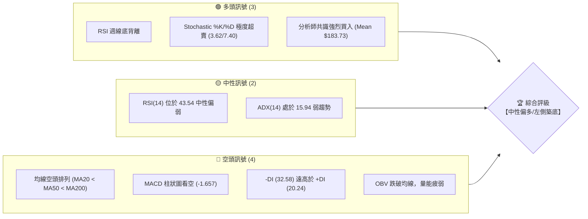
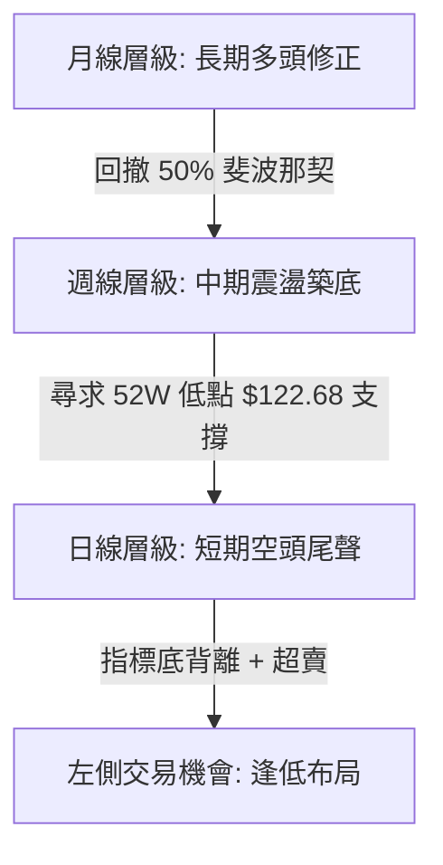

<details>
<summary>📊 靜態圖表 (點擊展開)</summary>

</details>

<html>
<head><meta charset="utf-8" /></head>
<body>
    <div style="height:500px; width:100%;">                        <script>window.PlotlyConfig = {MathJaxConfig: 'local'};</script>
        <script charset="utf-8" src="https://cdn.plot.ly/plotly-3.6.0.min.js" integrity="sha256-QaOVwtVY0T02VaHrr6pnoHLCwayMJp4O5n4YyaE3rJk=" crossorigin="anonymous"></script>                <div id="candlestick-chart" class="plotly-graph-div" style="height:100%; width:100%;"></div>            <script>                window.PLOTLYENV=window.PLOTLYENV || {};                                if (document.getElementById("candlestick-chart")) {                    Plotly.newPlot(                        "candlestick-chart",                        [{"close":{"dtype":"f8","bdata":"AAAAQAqXY0AAAAAA18NjQAAAAGC4lmNAAAAAQOGiY0AAAADAzFxjQAAAAOB6hGNAAAAAIIUjY0AAAABAM4NjQAAAACCFS2RAAAAAIK7XZEAAAAAghYtkQAAAAIDCbWVAAAAAYLhmZUAAAADgUUhlQAAAAGCPCmVAAAAAQAofZkAAAADgesxmQAAAAGCPamZAAAAAoJnRZkAAAACA63FmQAAAAADXY2ZAAAAAgD0yZkAAAAAghVtmQAAAAKBwzWZAAAAAYGYeZ0AAAACgmWFnQAAAAIA9omVAAAAAwPVwZkAAAACgcMVmQAAAAIDr8WZAAAAAQAovZ0AAAACAFO5lQAAAAGC4JmZAAAAAIK53ZkAAAAAA13NmQAAAAADXQ2ZAAAAAwMxEZkAAAABA4bJmQAAAAOBRsGZAAAAAIK7vZUAAAAAgXI9mQAAAAAApFGdAAAAAgMKlZ0AAAABAM7NnQAAAAIDr2WhAAAAAoJlRaEAAAABACg9pQAAAAIDC5WlAAAAAIK7XZ0AAAADAzHxnQAAAAKCZ4WVAAAAAgMI9ZkAAAAAghTNoQAAAAGC43mdAAAAAoHAFZ0AAAADgeoRlQAAAAOBRwGVAAAAAAABoZUAAAABgj+pkQAAAAKBwrWRAAAAAANd3Y0AAAABAM1tjQAAAAAAASGRAAAAAoJlxZEAAAADgo7hkQAAAAGBmDmVAAAAAIK7vZEAAAACAFFZlQAAAAGCPAmZAAAAAoHA9ZkAAAADgUbhmQAAAACCur2ZAAAAAQOG6ZkAAAADAHn1nQAAAAKBHcWdAAAAAgD3yZkAAAAAAAOhmQAAAAAAAeGdAAAAAoEcpZkAAAACAFDZnQAAAAAApLGhAAAAAIFw\u002faEAAAAAAKURoQAAAAKBwRWhAAAAAYLiWZ0AAAACAwgVnQAAAAEDhmmZAAAAAAAA4ZkAAAAAghftkQAAAAKBHwWVAAAAAYLh2ZkAAAACAwrVmQAAAACCFG2ZAAAAAIK4vZkAAAADAHm1mQAAAAGC4XmZAAAAAwMxMZkAAAACAPSJmQAAAAGC4XmVAAAAAwPUQZUAAAABgj6pkQAAAAMDMvGRAAAAAQDMzZUAAAABACu9kQAAAAGBmtmRAAAAAQDOrY0AAAAAghftiQAAAAEDhUmJAAAAA4FF4YkAAAAAAKbxjQAAAAKBHcWFAAAAA4FFAYEAAAADAzPxgQAAAAMAe3WFAAAAA4FFwYUAAAACAwvVgQAAAAAApJGBAAAAAwB5tYEAAAADgo6BgQAAAAAAp7GBAAAAA4HrcYEAAAAAgrudgQAAAAEAzU2BAAAAAQOEaYEAAAACAFMZgQAAAAIAU\u002fmBAAAAAgBQmYUAAAACgcCViQAAAAEAKZ2JAAAAAgBQmY0AAAACgcBVjQAAAAMAepWNAAAAAgMKNY0AAAADgeuRiQAAAAEAz82JAAAAAAAAwY0AAAABgZt5iQAAAAEAKF2NAAAAAYI9iY0AAAADgoxhjQAAAAIDCdWNAAAAAgMLVYkAAAABA4RpkQAAAAMD1WGNAAAAAYLheY0AAAACA63FiQAAAAIDr4WFAAAAAoJkxYUAAAADA9UhiQAAAACCuT2JAAAAAYLiOYkAAAACAwn1iQAAAAIA9wmJAAAAA4FGYYUAAAAAgrk9gQAAAAIDrAWBAAAAAANeLYEAAAABgZvZgQAAAAMDMxGFAAAAA4FHYYUAAAADgekxiQAAAAOB6PGJAAAAAQAo\u002fYkAAAAAA1xNjQAAAAIA9smFAAAAAQOHiYUAAAABAM+NhQAAAAIDCpWFAAAAAQAo\u002fYUAAAAAghWNhQAAAAIA9AmJAAAAAwPVAYkAAAADAHv1gQAAAAKBHuWBAAAAAoJkhYUAAAACgmTlhQAAAAOB6HGFAAAAAAAAAYUAAAACgmUFgQAAAACBct2BAAAAAIK6\u002fYEAAAADgeuRgQAAAAOBR6GBAAAAAwMwkYUAAAACgRy1hQAAAAAApHGFAAAAAQDMTYUAAAADgUZBgQAAAAEDh6mFAAAAAoEeRY0AAAADAzBRkQAAAAKBwBWNAAAAAYGbGYUAAAABgZrZhQAAAAMD18GBAAAAAQAoPYUAAAACAPYJgQAAAAGC4RmBAAAAAYI9iYEAAAAAgXP9fQA=="},"high":{"dtype":"f8","bdata":"AAAAwMxMZEAAAAAgXMdjQAAAAKBwzWNAAAAA4HrMY0AAAADAzCRkQAAAAKBHoWNAAAAAQArfY0AAAACgmcljQAAAAAAAWGRAAAAAAAAgZUAAAADgp+5kQAAAAMD1cGVAAAAAoJl5ZUAAAACA62llQAAAAIDCNWVAAAAAoJlZZkAAAACgcA1nQAAAAAAAyGZAAAAAAAA4Z0AAAABAMxtnQAAAAIA9CmdAAAAAANeDZkAAAAAgXK9mQAAAAOCj2GZAAAAAwPVIZ0AAAABgZoZnQAAAAEDhWmdAAAAAYGbeZkAAAACAwkVnQAAAAOBRCGdAAAAAANdzZ0AAAABAM2NnQAAAAEAKZ2ZAAAAAQOHKZkAAAABAMwtnQAAAAIA9GmdAAAAAQOGyZkAAAABA4eJmQAAAAMByzGZAAAAAYLjGZkAAAACA67FmQAAAAKBwRWdAAAAAYI8aaEAAAADA9fhnQAAAAEAz+2hAAAAAoHD1aEAAAACAwoVpQAAAAOCj8GlAAAAAYGZ2aEAAAACAPcpnQAAAAEDh4mdAAAAAYGZWZkAAAACAwl1oQAAAAKCZHWhAAAAAYI\u002fSZ0AAAABgZtZmQAAAAKBHKWZAAAAAIK7HZUAAAABgj5plQAAAAEAzM2VAAAAAgD3SZUAAAAAghcNjQAAAAKBwpWRAAAAAwMyUZEAAAAAg2QplQAAAAKCZGWVAAAAAQDMjZUAAAAAAAPhlQAAAAMAePWZAAAAAgBROZkAAAABg5cRmQAAAAAAp\u002fGZAAAAAQDPbZkAAAADgesxnQAAAAKCZgWdAAAAAwMxQZ0AAAADA9XhnQAAAAAAAkGdAAAAAAAB4Z0AAAABgj2pnQAAAAAAAYGhAAAAAACncaEAAAAAA12toQAAAAKBwZWhAAAAAQDOLaEAAAABgZmZnQAAAAABUF2dAAAAAwPWwZkAAAABAM6tmQAAAAIA9+mVAAAAAgBSGZkAAAADA9WhnQAAAAMAeNWdAAAAAQApXZkAAAAAAANBmQAAAAEAzo2ZAAAAA4CKzZkAAAABAM5NmQAAAAIDCzWZAAAAAQAp\u002fZUAAAAAgri9lQAAAAAAAIGVAAAAAAACAZUAAAABA4VJlQAAAAIAULmVAAAAAoHChZEAAAAAAKbRjQAAAAAAA4GJAAAAAwMzsYkAAAAAAf6JkQAAAAEAze2NAAAAAIFw\u002fYUAAAADg+zVhQAAAAADXO2JAAAAAgOsxYkAAAAAAAGhhQAAAAOB6\u002fGBAAAAAgOuxYEAAAACAPcpgQAAAAODQnmFAAAAAwB4FYUAAAABguAZhQAAAAKBHgWBAAAAAIK5HYEAAAABA4QJhQAAAAOBRMGFAAAAAQDNDYUAAAADgemRiQAAAAAAAcGJAAAAA4KNQY0AAAAAAKYxjQAAAAGBmLmRAAAAAgBTOY0AAAAAgBpVjQAAAAIBoJWNAAAAAACl8Y0AAAACA61FjQAAAACCFO2NAAAAAAACYY0AAAACAFJZjQAAAAMDMhGNAAAAAwMyUY0AAAABgjyJkQAAAAMDMTGRAAAAA4KMIZEAAAAAA1yNjQAAAAGC4PmJAAAAAANcDYkAAAAAghXtiQAAAAKCZiWJAAAAA4FGQYkAAAAAghdNiQAAAAOCjyGJAAAAAwPWIY0AAAACgR3FhQAAAAGBmJmBAAAAAoHDNYEAAAACAPUJhQAAAAGCP0mFAAAAAoJkxYkAAAADA9YhiQAAAAGBmZmJAAAAAANe7YkAAAACAwhVjQAAAAKBHyWJAAAAAYI\u002fqYUAAAACAPSJiQAAAAEAz+2FAAAAA4FF4YUAAAABgZoZhQAAAAIAUTmJAAAAA4Hq0YkAAAAAgXN9hQAAAAGBm9mBAAAAAYGaeYUAAAAAAKTxhQAAAAOB6JGFAAAAAgMItYUAAAAAgrh9hQAAAACBcz2BAAAAA4Hr0YEAAAACA6\u002f1gQAAAAEAKL2FAAAAAIK4nYUAAAACgmVFhQAAAAOCjYGFAAAAAgMJVYUAAAAAgXPdgQAAAAAAAIGJAAAAAoO24Y0AAAABgZnZkQAAAAKCZ8WNAAAAAgML1YkAAAAAA10tiQAAAAEAKv2FAAAAA4FE4YUAAAAAgrh9hQAAAAIDrpWBAAAAA4KNwYEAAAABA4WJgQA=="},"hovertemplate":"\u003cb\u003e%{x|%Y-%m-%d}\u003c\u002fb\u003e\u003cbr\u003e\u958b: $%{open:.2f}\u003cbr\u003e\u9ad8: $%{high:.2f}\u003cbr\u003e\u4f4e: $%{low:.2f}\u003cbr\u003e\u6536: $%{close:.2f}\u003cextra\u003e\u003c\u002fextra\u003e","low":{"dtype":"f8","bdata":"AAAAIFx\u002fY0AAAACgmRFjQAAAAAAAIGNAAAAAwPXIYkAAAABguBZjQAAAAMAeJWNAAAAAoEeBYkAAAABA4VpjQAAAAADXi2NAAAAAgBRuZEAAAABACmdkQAAAAOBRgGRAAAAAwB7tZEAAAABguB5lQAAAAOCjKGRAAAAA4HosZUAAAABguBZmQAAAAKBHSWZAAAAA4FEgZkAAAAAA1yNmQAAAAKBHyWVAAAAAwB7dZUAAAADAHiVmQAAAAEAKR2ZAAAAAAABwZkAAAABgZt5mQAAAAOCjWGVAAAAAYI86ZkAAAACgcG1mQAAAAGBmpmZAAAAAYGZ+ZkAAAADA9bBlQAAAAGBmrmVAAAAAgD1aZUAAAADgowBmQAAAAGBmDmZAAAAAYGa+ZUAAAACAFC5mQAAAAMDMVGZAAAAAoHAtZUAAAADgUeBlQAAAAEAz22ZAAAAA4KNwZ0AAAADA9VhnQAAAACCuz2dAAAAAANdDaEAAAACgcL1oQAAAAIA9OmlAAAAAgOsxZ0AAAABguKZmQAAAAMD10GVAAAAAwB4dZUAAAADgo\u002fBmQAAAAAApZGdAAAAAwMyMZkAAAABgZFdlQAAAAAAAkGRAAAAAgML1ZEAAAAAAALBkQAAAAKBwTWRAAAAA4KNMY0AAAACA63FiQAAAAAAAoGNAAAAAgMKRY0AAAAAAKXxkQAAAAAAAvGRAAAAAANdjZEAAAABA4TJlQAAAAGCPGmVAAAAAgMLNZUAAAADAHiVmQAAAAKBHcWZAAAAAACmMZkAAAAAAANhmQAAAAGC4hmZAAAAAIFg1ZkAAAADA9YBmQAAAAECLpGZAAAAAAAAQZkAAAADgUbBmQAAAACBcV2dAAAAAgMINaEAAAAAghfdnQAAAAGCPGmhAAAAAANeTZ0AAAADgevRmQAAAAGBmlmZAAAAAAAAoZkAAAABAM8tkQAAAAKBHeWVAAAAA4KPYZUAAAADAHjVmQAAAAADXy2VAAAAAAADYZUAAAABA4QpmQAAAAOB6BGZAAAAAYGa+ZUAAAADA9RBmQAAAAOBRQGVAAAAAIK7HZEAAAAAghSNkQAAAAGBmnmRAAAAAoJnJZEAAAABgZupkQAAAAIAUlmRAAAAAIK6nY0AAAAAA12NiQAAAAMByJGJAAAAAoO1UYkAAAAAA1yNjQAAAAIDC9WBAAAAAgD0KYEAAAABAM4tgQAAAAADV2GBAAAAA4KM4YUAAAABgZp5gQAAAAADXo19AAAAAgOmOX0AAAABgj9JfQAAAAADX22BAAAAA4FFgYEAAAACgcGVgQAAAAMD12F9AAAAAIK6XX0AAAACAwiVgQAAAAAAplGBAAAAAIFy\u002fYEAAAADgo5BhQAAAAGBmRmFAAAAAgOuBYkAAAAAghbNiQAAAAKBHyWJAAAAAQAofY0AAAADgesRiQAAAAGCPqmJAAAAAIFzfYkAAAABgj5JiQAAAAKBw5WJAAAAAANcDY0AAAAAghRNjQAAAAAAA0GJAAAAAQOGiYkAAAAAgridjQAAAAOB69GJAAAAAIFxbY0AAAAAAAGhiQAAAAIDrsWFAAAAAoJkJYUAAAABACl9hQAAAAEAKD2JAAAAAIK4\u002fYUAAAAAgMVRiQAAAAGBmDmJAAAAAoHBlYUAAAABACg9gQAAAACCFq15AAAAAwMwkYEAAAAAAAMBgQAAAAIDC3WBAAAAAwPVwYUAAAACgmelhQAAAAGCP+mFAAAAAwPf\u002fYUAAAADAHm1iQAAAAKBwfWFAAAAAgMJdYUAAAADgUaBhQAAAAKBwjWFAAAAAgMLVYEAAAADAzBRhQAAAAOB6rGFAAAAAQDMnYkAAAABACtdgQAAAAMDMZGBAAAAAwPXYYEAAAADgo6BgQAAAAACsmGBAAAAAYLiuYEAAAAAAABhgQAAAAGBmLmBAAAAAoEeJYEAAAABgj2pgQAAAAEAzs2BAAAAAoHCNYEAAAACgcO1gQAAAAKCZyWBAAAAAoJmpYEAAAAAAKXRgQAAAAAAAoGBAAAAAoEc5YkAAAAAAKXxjQAAAAKCZuWJAAAAAAACoYUAAAABAtIhhQAAAAMDMwGBAAAAAwPXoYEAAAABgZtZfQAAAAKCZGWBAAAAAQOHKX0AAAACgmalfQA=="},"name":"\u50f9\u683c","open":{"dtype":"f8","bdata":"AAAAgD1KZEAAAAAAKbRjQAAAACBcn2NAAAAAYGbmYkAAAAAAAMBjQAAAACCuW2NAAAAAgD26Y0AAAADAHl1jQAAAAAAAqGNAAAAAAADAZEAAAAAgrudkQAAAAEAzq2RAAAAAQDMzZUAAAACgR2FlQAAAAOCjIGVAAAAA4KNIZUAAAACAPSJmQAAAAAApnGZAAAAA4FHQZkAAAADAHv1mQAAAAKCZ+WVAAAAAoJlhZkAAAADgenRmQAAAACBcX2ZAAAAAgD2qZkAAAABgZlZnQAAAAMDMTGdAAAAAgMJlZkAAAACA64lmQAAAAKCZ2WZAAAAAYI\u002fyZkAAAACgcCVnQAAAAIDCVWZAAAAAAAAAZkAAAADA9bRmQAAAAMD1uGZAAAAAAAA4ZkAAAAAgrm9mQAAAAIDrwWZAAAAAgMK9ZkAAAACAPe5lQAAAAAAp3GZAAAAAQAqfZ0AAAAAgXK9nQAAAAGCP4mdAAAAAoJnNaEAAAABgZuZoQAAAAKBwoWlAAAAAgD0CaEAAAAAAAKBnQAAAACCuf2dAAAAAwMykZUAAAACA6wlnQAAAAGC4ymdAAAAAYI\u002fSZ0AAAABA4bZmQAAAAEAz32RAAAAAwPVQZUAAAAAA1wtlQAAAAKCZ+WRAAAAAgD2CZUAAAADgUYBjQAAAAEAKr2NAAAAAgD0CZEAAAABAM9tkQAAAAOBR+GRAAAAAAACgZEAAAABA4TJlQAAAAOB6RGVAAAAAIK4LZkAAAAAgXEdmQAAAAGC4xmZAAAAAQAqfZkAAAABgZh5nQAAAAKCZGWdAAAAAgOs5Z0AAAABgjyJnQAAAAMD1tGZAAAAAQOF2Z0AAAADgUbBmQAAAACCuV2dAAAAAoEdhaEAAAABgZhpoQAAAAMAeJWhAAAAA4HpgaEAAAABAM1tnQAAAAEAzC2dAAAAAACmkZkAAAACgmalmQAAAAAAp3GVAAAAA4FH4ZUAAAACgmXlmQAAAACCuM2dAAAAA4KMgZkAAAACA6zVmQAAAAAAAXGZAAAAAAABEZkAAAABguFZmQAAAACCFa2ZAAAAAAAD0ZEAAAAAg3QxlQAAAAKCZHWVAAAAA4KPoZEAAAABguAZlQAAAACBc72RAAAAAwMyMZEAAAAAAKbRjQAAAAKCZwWJAAAAAgBTeYkAAAACgmaFkQAAAAMAebWNAAAAAgD0aYUAAAABgj+pgQAAAAGCPEmFAAAAAQOEeYkAAAADAzGBhQAAAACCF62BAAAAAoJn5X0AAAADgoxxgQAAAAOB6\u002fGBAAAAAgOuJYEAAAAAgrotgQAAAAKBHgWBAAAAAACkgYEAAAAAghVNgQAAAAEAKu2BAAAAAgD3CYEAAAADAzJhhQAAAAEAzw2FAAAAAgMKNYkAAAACAFB5jQAAAAIAUzmJAAAAAgBR2Y0AAAAAgrn9jQAAAAAAp7GJAAAAA4FEgY0AAAACgmSljQAAAAGBmDmNAAAAAwPUMY0AAAACAPV5jQAAAAEAzI2NAAAAAYGZmY0AAAAAgridjQAAAAIA9AmRAAAAAoHCtY0AAAACAwiFjQAAAAAApPGJAAAAA4KPoYUAAAADgo4BhQAAAAAAAYGJAAAAAIIXvYUAAAAAghYtiQAAAAGA5XGJAAAAA4HpYY0AAAADgo2xhQAAAACBcD2BAAAAAIFxHYEAAAAAAqs1gQAAAAKBHGWFAAAAAoEcJYkAAAACAFCpiQAAAAAAAIGJAAAAAgOtZYkAAAAAghYtiQAAAAGBmtmJAAAAAYLjeYUAAAAAAAKhhQAAAAKCZyWFAAAAA4FF4YUAAAABAM09hQAAAAAAA6GFAAAAAAAB4YkAAAACgcIlhQAAAAGC4tmBAAAAAQDPjYEAAAAAgrvtgQAAAAMAe3WBAAAAAQDMTYUAAAAAgMcBgQAAAAMDMNGBAAAAAoJmZYEAAAAAAAJBgQAAAAKBw5WBAAAAA4KPEYEAAAACgmflgQAAAAKCZLWFAAAAAwB4FYUAAAACgmalgQAAAAMAepWBAAAAAYGZ6YkAAAAAgXP9jQAAAAIAUlmNAAAAAYGa2YkAAAABguC5iQAAAAGBmimFAAAAAgML1YEAAAAAA19tgQAAAAGBmKmBAAAAAwPUYYEAAAACgR11gQA=="},"x":["2025-08-27T00:00:00-04:00","2025-08-28T00:00:00-04:00","2025-08-29T00:00:00-04:00","2025-09-02T00:00:00-04:00","2025-09-03T00:00:00-04:00","2025-09-04T00:00:00-04:00","2025-09-05T00:00:00-04:00","2025-09-08T00:00:00-04:00","2025-09-09T00:00:00-04:00","2025-09-10T00:00:00-04:00","2025-09-11T00:00:00-04:00","2025-09-12T00:00:00-04:00","2025-09-15T00:00:00-04:00","2025-09-16T00:00:00-04:00","2025-09-17T00:00:00-04:00","2025-09-18T00:00:00-04:00","2025-09-19T00:00:00-04:00","2025-09-22T00:00:00-04:00","2025-09-23T00:00:00-04:00","2025-09-24T00:00:00-04:00","2025-09-25T00:00:00-04:00","2025-09-26T00:00:00-04:00","2025-09-29T00:00:00-04:00","2025-09-30T00:00:00-04:00","2025-10-01T00:00:00-04:00","2025-10-02T00:00:00-04:00","2025-10-03T00:00:00-04:00","2025-10-06T00:00:00-04:00","2025-10-07T00:00:00-04:00","2025-10-08T00:00:00-04:00","2025-10-09T00:00:00-04:00","2025-10-10T00:00:00-04:00","2025-10-13T00:00:00-04:00","2025-10-14T00:00:00-04:00","2025-10-15T00:00:00-04:00","2025-10-16T00:00:00-04:00","2025-10-17T00:00:00-04:00","2025-10-20T00:00:00-04:00","2025-10-21T00:00:00-04:00","2025-10-22T00:00:00-04:00","2025-10-23T00:00:00-04:00","2025-10-24T00:00:00-04:00","2025-10-27T00:00:00-04:00","2025-10-28T00:00:00-04:00","2025-10-29T00:00:00-04:00","2025-10-30T00:00:00-04:00","2025-10-31T00:00:00-04:00","2025-11-03T00:00:00-05:00","2025-11-04T00:00:00-05:00","2025-11-05T00:00:00-05:00","2025-11-06T00:00:00-05:00","2025-11-07T00:00:00-05:00","2025-11-10T00:00:00-05:00","2025-11-11T00:00:00-05:00","2025-11-12T00:00:00-05:00","2025-11-13T00:00:00-05:00","2025-11-14T00:00:00-05:00","2025-11-17T00:00:00-05:00","2025-11-18T00:00:00-05:00","2025-11-19T00:00:00-05:00","2025-11-20T00:00:00-05:00","2025-11-21T00:00:00-05:00","2025-11-24T00:00:00-05:00","2025-11-25T00:00:00-05:00","2025-11-26T00:00:00-05:00","2025-11-28T00:00:00-05:00","2025-12-01T00:00:00-05:00","2025-12-02T00:00:00-05:00","2025-12-03T00:00:00-05:00","2025-12-04T00:00:00-05:00","2025-12-05T00:00:00-05:00","2025-12-08T00:00:00-05:00","2025-12-09T00:00:00-05:00","2025-12-10T00:00:00-05:00","2025-12-11T00:00:00-05:00","2025-12-12T00:00:00-05:00","2025-12-15T00:00:00-05:00","2025-12-16T00:00:00-05:00","2025-12-17T00:00:00-05:00","2025-12-18T00:00:00-05:00","2025-12-19T00:00:00-05:00","2025-12-22T00:00:00-05:00","2025-12-23T00:00:00-05:00","2025-12-24T00:00:00-05:00","2025-12-26T00:00:00-05:00","2025-12-29T00:00:00-05:00","2025-12-30T00:00:00-05:00","2025-12-31T00:00:00-05:00","2026-01-02T00:00:00-05:00","2026-01-05T00:00:00-05:00","2026-01-06T00:00:00-05:00","2026-01-07T00:00:00-05:00","2026-01-08T00:00:00-05:00","2026-01-09T00:00:00-05:00","2026-01-12T00:00:00-05:00","2026-01-13T00:00:00-05:00","2026-01-14T00:00:00-05:00","2026-01-15T00:00:00-05:00","2026-01-16T00:00:00-05:00","2026-01-20T00:00:00-05:00","2026-01-21T00:00:00-05:00","2026-01-22T00:00:00-05:00","2026-01-23T00:00:00-05:00","2026-01-26T00:00:00-05:00","2026-01-27T00:00:00-05:00","2026-01-28T00:00:00-05:00","2026-01-29T00:00:00-05:00","2026-01-30T00:00:00-05:00","2026-02-02T00:00:00-05:00","2026-02-03T00:00:00-05:00","2026-02-04T00:00:00-05:00","2026-02-05T00:00:00-05:00","2026-02-06T00:00:00-05:00","2026-02-09T00:00:00-05:00","2026-02-10T00:00:00-05:00","2026-02-11T00:00:00-05:00","2026-02-12T00:00:00-05:00","2026-02-13T00:00:00-05:00","2026-02-17T00:00:00-05:00","2026-02-18T00:00:00-05:00","2026-02-19T00:00:00-05:00","2026-02-20T00:00:00-05:00","2026-02-23T00:00:00-05:00","2026-02-24T00:00:00-05:00","2026-02-25T00:00:00-05:00","2026-02-26T00:00:00-05:00","2026-02-27T00:00:00-05:00","2026-03-02T00:00:00-05:00","2026-03-03T00:00:00-05:00","2026-03-04T00:00:00-05:00","2026-03-05T00:00:00-05:00","2026-03-06T00:00:00-05:00","2026-03-09T00:00:00-04:00","2026-03-10T00:00:00-04:00","2026-03-11T00:00:00-04:00","2026-03-12T00:00:00-04:00","2026-03-13T00:00:00-04:00","2026-03-16T00:00:00-04:00","2026-03-17T00:00:00-04:00","2026-03-18T00:00:00-04:00","2026-03-19T00:00:00-04:00","2026-03-20T00:00:00-04:00","2026-03-23T00:00:00-04:00","2026-03-24T00:00:00-04:00","2026-03-25T00:00:00-04:00","2026-03-26T00:00:00-04:00","2026-03-27T00:00:00-04:00","2026-03-30T00:00:00-04:00","2026-03-31T00:00:00-04:00","2026-04-01T00:00:00-04:00","2026-04-02T00:00:00-04:00","2026-04-06T00:00:00-04:00","2026-04-07T00:00:00-04:00","2026-04-08T00:00:00-04:00","2026-04-09T00:00:00-04:00","2026-04-10T00:00:00-04:00","2026-04-13T00:00:00-04:00","2026-04-14T00:00:00-04:00","2026-04-15T00:00:00-04:00","2026-04-16T00:00:00-04:00","2026-04-17T00:00:00-04:00","2026-04-20T00:00:00-04:00","2026-04-21T00:00:00-04:00","2026-04-22T00:00:00-04:00","2026-04-23T00:00:00-04:00","2026-04-24T00:00:00-04:00","2026-04-27T00:00:00-04:00","2026-04-28T00:00:00-04:00","2026-04-29T00:00:00-04:00","2026-04-30T00:00:00-04:00","2026-05-01T00:00:00-04:00","2026-05-04T00:00:00-04:00","2026-05-05T00:00:00-04:00","2026-05-06T00:00:00-04:00","2026-05-07T00:00:00-04:00","2026-05-08T00:00:00-04:00","2026-05-11T00:00:00-04:00","2026-05-12T00:00:00-04:00","2026-05-13T00:00:00-04:00","2026-05-14T00:00:00-04:00","2026-05-15T00:00:00-04:00","2026-05-18T00:00:00-04:00","2026-05-19T00:00:00-04:00","2026-05-20T00:00:00-04:00","2026-05-21T00:00:00-04:00","2026-05-22T00:00:00-04:00","2026-05-26T00:00:00-04:00","2026-05-27T00:00:00-04:00","2026-05-28T00:00:00-04:00","2026-05-29T00:00:00-04:00","2026-06-01T00:00:00-04:00","2026-06-02T00:00:00-04:00","2026-06-03T00:00:00-04:00","2026-06-04T00:00:00-04:00","2026-06-05T00:00:00-04:00","2026-06-08T00:00:00-04:00","2026-06-09T00:00:00-04:00","2026-06-10T00:00:00-04:00","2026-06-11T00:00:00-04:00","2026-06-12T00:00:00-04:00"],"type":"candlestick"},{"hovertemplate":"MA30: $%{y:.2f}\u003cextra\u003e\u003c\u002fextra\u003e","line":{"color":"#2196F3","dash":"dash","width":2},"mode":"lines","name":"MA30","x":["2025-08-27T00:00:00-04:00","2025-08-28T00:00:00-04:00","2025-08-29T00:00:00-04:00","2025-09-02T00:00:00-04:00","2025-09-03T00:00:00-04:00","2025-09-04T00:00:00-04:00","2025-09-05T00:00:00-04:00","2025-09-08T00:00:00-04:00","2025-09-09T00:00:00-04:00","2025-09-10T00:00:00-04:00","2025-09-11T00:00:00-04:00","2025-09-12T00:00:00-04:00","2025-09-15T00:00:00-04:00","2025-09-16T00:00:00-04:00","2025-09-17T00:00:00-04:00","2025-09-18T00:00:00-04:00","2025-09-19T00:00:00-04:00","2025-09-22T00:00:00-04:00","2025-09-23T00:00:00-04:00","2025-09-24T00:00:00-04:00","2025-09-25T00:00:00-04:00","2025-09-26T00:00:00-04:00","2025-09-29T00:00:00-04:00","2025-09-30T00:00:00-04:00","2025-10-01T00:00:00-04:00","2025-10-02T00:00:00-04:00","2025-10-03T00:00:00-04:00","2025-10-06T00:00:00-04:00","2025-10-07T00:00:00-04:00","2025-10-08T00:00:00-04:00","2025-10-09T00:00:00-04:00","2025-10-10T00:00:00-04:00","2025-10-13T00:00:00-04:00","2025-10-14T00:00:00-04:00","2025-10-15T00:00:00-04:00","2025-10-16T00:00:00-04:00","2025-10-17T00:00:00-04:00","2025-10-20T00:00:00-04:00","2025-10-21T00:00:00-04:00","2025-10-22T00:00:00-04:00","2025-10-23T00:00:00-04:00","2025-10-24T00:00:00-04:00","2025-10-27T00:00:00-04:00","2025-10-28T00:00:00-04:00","2025-10-29T00:00:00-04:00","2025-10-30T00:00:00-04:00","2025-10-31T00:00:00-04:00","2025-11-03T00:00:00-05:00","2025-11-04T00:00:00-05:00","2025-11-05T00:00:00-05:00","2025-11-06T00:00:00-05:00","2025-11-07T00:00:00-05:00","2025-11-10T00:00:00-05:00","2025-11-11T00:00:00-05:00","2025-11-12T00:00:00-05:00","2025-11-13T00:00:00-05:00","2025-11-14T00:00:00-05:00","2025-11-17T00:00:00-05:00","2025-11-18T00:00:00-05:00","2025-11-19T00:00:00-05:00","2025-11-20T00:00:00-05:00","2025-11-21T00:00:00-05:00","2025-11-24T00:00:00-05:00","2025-11-25T00:00:00-05:00","2025-11-26T00:00:00-05:00","2025-11-28T00:00:00-05:00","2025-12-01T00:00:00-05:00","2025-12-02T00:00:00-05:00","2025-12-03T00:00:00-05:00","2025-12-04T00:00:00-05:00","2025-12-05T00:00:00-05:00","2025-12-08T00:00:00-05:00","2025-12-09T00:00:00-05:00","2025-12-10T00:00:00-05:00","2025-12-11T00:00:00-05:00","2025-12-12T00:00:00-05:00","2025-12-15T00:00:00-05:00","2025-12-16T00:00:00-05:00","2025-12-17T00:00:00-05:00","2025-12-18T00:00:00-05:00","2025-12-19T00:00:00-05:00","2025-12-22T00:00:00-05:00","2025-12-23T00:00:00-05:00","2025-12-24T00:00:00-05:00","2025-12-26T00:00:00-05:00","2025-12-29T00:00:00-05:00","2025-12-30T00:00:00-05:00","2025-12-31T00:00:00-05:00","2026-01-02T00:00:00-05:00","2026-01-05T00:00:00-05:00","2026-01-06T00:00:00-05:00","2026-01-07T00:00:00-05:00","2026-01-08T00:00:00-05:00","2026-01-09T00:00:00-05:00","2026-01-12T00:00:00-05:00","2026-01-13T00:00:00-05:00","2026-01-14T00:00:00-05:00","2026-01-15T00:00:00-05:00","2026-01-16T00:00:00-05:00","2026-01-20T00:00:00-05:00","2026-01-21T00:00:00-05:00","2026-01-22T00:00:00-05:00","2026-01-23T00:00:00-05:00","2026-01-26T00:00:00-05:00","2026-01-27T00:00:00-05:00","2026-01-28T00:00:00-05:00","2026-01-29T00:00:00-05:00","2026-01-30T00:00:00-05:00","2026-02-02T00:00:00-05:00","2026-02-03T00:00:00-05:00","2026-02-04T00:00:00-05:00","2026-02-05T00:00:00-05:00","2026-02-06T00:00:00-05:00","2026-02-09T00:00:00-05:00","2026-02-10T00:00:00-05:00","2026-02-11T00:00:00-05:00","2026-02-12T00:00:00-05:00","2026-02-13T00:00:00-05:00","2026-02-17T00:00:00-05:00","2026-02-18T00:00:00-05:00","2026-02-19T00:00:00-05:00","2026-02-20T00:00:00-05:00","2026-02-23T00:00:00-05:00","2026-02-24T00:00:00-05:00","2026-02-25T00:00:00-05:00","2026-02-26T00:00:00-05:00","2026-02-27T00:00:00-05:00","2026-03-02T00:00:00-05:00","2026-03-03T00:00:00-05:00","2026-03-04T00:00:00-05:00","2026-03-05T00:00:00-05:00","2026-03-06T00:00:00-05:00","2026-03-09T00:00:00-04:00","2026-03-10T00:00:00-04:00","2026-03-11T00:00:00-04:00","2026-03-12T00:00:00-04:00","2026-03-13T00:00:00-04:00","2026-03-16T00:00:00-04:00","2026-03-17T00:00:00-04:00","2026-03-18T00:00:00-04:00","2026-03-19T00:00:00-04:00","2026-03-20T00:00:00-04:00","2026-03-23T00:00:00-04:00","2026-03-24T00:00:00-04:00","2026-03-25T00:00:00-04:00","2026-03-26T00:00:00-04:00","2026-03-27T00:00:00-04:00","2026-03-30T00:00:00-04:00","2026-03-31T00:00:00-04:00","2026-04-01T00:00:00-04:00","2026-04-02T00:00:00-04:00","2026-04-06T00:00:00-04:00","2026-04-07T00:00:00-04:00","2026-04-08T00:00:00-04:00","2026-04-09T00:00:00-04:00","2026-04-10T00:00:00-04:00","2026-04-13T00:00:00-04:00","2026-04-14T00:00:00-04:00","2026-04-15T00:00:00-04:00","2026-04-16T00:00:00-04:00","2026-04-17T00:00:00-04:00","2026-04-20T00:00:00-04:00","2026-04-21T00:00:00-04:00","2026-04-22T00:00:00-04:00","2026-04-23T00:00:00-04:00","2026-04-24T00:00:00-04:00","2026-04-27T00:00:00-04:00","2026-04-28T00:00:00-04:00","2026-04-29T00:00:00-04:00","2026-04-30T00:00:00-04:00","2026-05-01T00:00:00-04:00","2026-05-04T00:00:00-04:00","2026-05-05T00:00:00-04:00","2026-05-06T00:00:00-04:00","2026-05-07T00:00:00-04:00","2026-05-08T00:00:00-04:00","2026-05-11T00:00:00-04:00","2026-05-12T00:00:00-04:00","2026-05-13T00:00:00-04:00","2026-05-14T00:00:00-04:00","2026-05-15T00:00:00-04:00","2026-05-18T00:00:00-04:00","2026-05-19T00:00:00-04:00","2026-05-20T00:00:00-04:00","2026-05-21T00:00:00-04:00","2026-05-22T00:00:00-04:00","2026-05-26T00:00:00-04:00","2026-05-27T00:00:00-04:00","2026-05-28T00:00:00-04:00","2026-05-29T00:00:00-04:00","2026-06-01T00:00:00-04:00","2026-06-02T00:00:00-04:00","2026-06-03T00:00:00-04:00","2026-06-04T00:00:00-04:00","2026-06-05T00:00:00-04:00","2026-06-08T00:00:00-04:00","2026-06-09T00:00:00-04:00","2026-06-10T00:00:00-04:00","2026-06-11T00:00:00-04:00","2026-06-12T00:00:00-04:00"],"y":{"dtype":"f8","bdata":"AAAAAAAA+H8AAAAAAAD4fwAAAAAAAPh\u002fAAAAAAAA+H8AAAAAAAD4fwAAAAAAAPh\u002fAAAAAAAA+H8AAAAAAAD4fwAAAAAAAPh\u002fAAAAAAAA+H8AAAAAAAD4fwAAAAAAAPh\u002fAAAAAAAA+H8AAAAAAAD4fwAAAAAAAPh\u002fAAAAAAAA+H8AAAAAAAD4fwAAAAAAAPh\u002fAAAAAAAA+H8AAAAAAAD4fwAAAAAAAPh\u002fAAAAAAAA+H8AAAAAAAD4fwAAAAAAAPh\u002fAAAAAAAA+H8AAAAAAAD4fwAAAAAAAPh\u002fAAAAAAAA+H8AAAAAAAD4fyIiItLbYmVAzczMfIaBZUAREREBAJRlQO\u002fu7t7dqWVAVVVV1QbCZUCrqqoKZdxlQLy7uwvX82VAIiIioowOZkCamZkZvSlmQDMzM1MqPmZAiYiIqH9HZkDe3d19sVhmQJqZmfnFZmZAq6qq+vB5ZkB3d3cXko5mQJqZmSkVr2ZAzczMrNXBZkCJiIi4HtVmQAAAAKDT8mZAq6qqCpD7ZkCrqqpqdQRnQJqZmQkeAGdAZmZmVoAAZ0AiIiISPBBnQAAAABBYGWdAIiIiEoMYZ0BVVVWlmwhnQDMzM1OcCWdAVVVVVccAZ0BmZmYG8\u002fBmQImIiJiZ3WZAAAAAsOS9ZkDv7u4+7qdmQKuqqir5l2ZAd3d3N7SGZkDv7u4+7ndmQBEREbGdbWZA3t3dzT5iZkARERFhnlZmQBEREaHTUGZA3t3dLWtTZkBERES0yFRmQGZmZkZvUWZAd3d395pJZkC8u7t7zUdmQFVVVQXIO2ZAAAAAwBEwZkCrqqqKsx1mQLy7u9v5CGZAvLu7G6H6ZUAiIiKiRfhlQCIiIvLSC2ZAq6qqqvEcZkCamZmpfx1mQERERDTsIGZA3t3d7cMlZkBmZmammzJmQCIiIrLkOWZAERERodNAZkCrqqpaZEFmQAAAADCWSmZAvLu7OyZkZkC8u7ubxIBmQM3MzBxakGZAmpmZqTifZkCrqqpKxa1mQJqZmTn7uGZAERERYZ7EZkC8u7uLbMtmQCIiInL2xWZAmpmZWfK7ZkDe3d3da6pmQBEREcHKmWZAvLu7a7yMZkAAAADw7nZmQJqZmSmjX2ZAq6qqWqtDZkCrqqrKLyJmQN7d3V1I9mVAVVVVtcjWZUCamZm5HrllQAAAANCwf2VAzczMvHQ7ZUAAAAAQWP1kQKuqqqqqxmRAiYiIyC+SZEDNzMwMdF5kQGZmZsZLJ2RA3t3d3d31Y0CamZk5tNBjQImIiHh3p2NA7+7unqh3Y0CJiIhoH0ZjQImIiFjHFGNAZmZmpuLgYkAzMzOTprBiQO\u002fu7j7DgmJAvLu7K85WYkB3d3dXxzRiQM3MzLx0G2JAVVVV5RcLYkDv7u7elv1hQFVVVUVE9GFAq6qq+jfmYUDNzMzMzNRhQAAAAJDCxWFAERERQafBYUAzMzPDrsBhQJqZmak4x2FAMzMzgwfPYUBEREQklMlhQAAAAHDL2mFAmpmZudfwYUAiIiICcgtiQO\u002fu7k4bGGJAERERMZYoYkCamZk5QjViQKuqqgoeRGJAvLu7q6pKYkCJiIiIz1hiQN7d3U2pZGJAIiIi0iJzYkCJiIgIrIBiQERERKRwlWJAiYiImCeiYkAAAABANZ5iQLy7u3vNlWJAzczMTKmQYkC8u7tbj4ZiQImIiOgmgWJAIiIi0gZ2YkBmZmb2U29iQAAAAIBOY2JAmpmZOSZYYkDNzMxculliQBEREYEHT2JAERER4exDYkDv7u5OjTtiQN7d3R0+L2JAIiIi8v0cYkCrqqraaw5iQN7d3Y0JAmJAvLu7yxP9YUDv7u4+fOJhQDMzM5MYzGFAMzMz8\u002f24YUAiIiLSlK5hQAAAAAAAqGFA7+7uvlimYUAAAADgCJVhQKuqqopsh2FARERERP13YUDv7u6+WGphQAAAAKCMWmFAq6qq2rJWYUBmZmbWFV5hQJqZmUl+Z2FAzczMXAFsYUB3d3dHmmhhQKuqqjrfaWFAZmZmFpJ4YUBEREQEyIdhQAAAAOB6jmFAmpmZaXWKYUBmZmaGz35hQDMzMzNeeGFAAAAAgE5xYUAzMzOTimVhQJqZmQnXWWFAvLu7m31SYUAzMzMboUZhQA=="},"type":"scatter"},{"hovertemplate":"MA60: $%{y:.2f}\u003cextra\u003e\u003c\u002fextra\u003e","line":{"color":"#9C27B0","dash":"dash","width":2},"mode":"lines","name":"MA60","x":["2025-08-27T00:00:00-04:00","2025-08-28T00:00:00-04:00","2025-08-29T00:00:00-04:00","2025-09-02T00:00:00-04:00","2025-09-03T00:00:00-04:00","2025-09-04T00:00:00-04:00","2025-09-05T00:00:00-04:00","2025-09-08T00:00:00-04:00","2025-09-09T00:00:00-04:00","2025-09-10T00:00:00-04:00","2025-09-11T00:00:00-04:00","2025-09-12T00:00:00-04:00","2025-09-15T00:00:00-04:00","2025-09-16T00:00:00-04:00","2025-09-17T00:00:00-04:00","2025-09-18T00:00:00-04:00","2025-09-19T00:00:00-04:00","2025-09-22T00:00:00-04:00","2025-09-23T00:00:00-04:00","2025-09-24T00:00:00-04:00","2025-09-25T00:00:00-04:00","2025-09-26T00:00:00-04:00","2025-09-29T00:00:00-04:00","2025-09-30T00:00:00-04:00","2025-10-01T00:00:00-04:00","2025-10-02T00:00:00-04:00","2025-10-03T00:00:00-04:00","2025-10-06T00:00:00-04:00","2025-10-07T00:00:00-04:00","2025-10-08T00:00:00-04:00","2025-10-09T00:00:00-04:00","2025-10-10T00:00:00-04:00","2025-10-13T00:00:00-04:00","2025-10-14T00:00:00-04:00","2025-10-15T00:00:00-04:00","2025-10-16T00:00:00-04:00","2025-10-17T00:00:00-04:00","2025-10-20T00:00:00-04:00","2025-10-21T00:00:00-04:00","2025-10-22T00:00:00-04:00","2025-10-23T00:00:00-04:00","2025-10-24T00:00:00-04:00","2025-10-27T00:00:00-04:00","2025-10-28T00:00:00-04:00","2025-10-29T00:00:00-04:00","2025-10-30T00:00:00-04:00","2025-10-31T00:00:00-04:00","2025-11-03T00:00:00-05:00","2025-11-04T00:00:00-05:00","2025-11-05T00:00:00-05:00","2025-11-06T00:00:00-05:00","2025-11-07T00:00:00-05:00","2025-11-10T00:00:00-05:00","2025-11-11T00:00:00-05:00","2025-11-12T00:00:00-05:00","2025-11-13T00:00:00-05:00","2025-11-14T00:00:00-05:00","2025-11-17T00:00:00-05:00","2025-11-18T00:00:00-05:00","2025-11-19T00:00:00-05:00","2025-11-20T00:00:00-05:00","2025-11-21T00:00:00-05:00","2025-11-24T00:00:00-05:00","2025-11-25T00:00:00-05:00","2025-11-26T00:00:00-05:00","2025-11-28T00:00:00-05:00","2025-12-01T00:00:00-05:00","2025-12-02T00:00:00-05:00","2025-12-03T00:00:00-05:00","2025-12-04T00:00:00-05:00","2025-12-05T00:00:00-05:00","2025-12-08T00:00:00-05:00","2025-12-09T00:00:00-05:00","2025-12-10T00:00:00-05:00","2025-12-11T00:00:00-05:00","2025-12-12T00:00:00-05:00","2025-12-15T00:00:00-05:00","2025-12-16T00:00:00-05:00","2025-12-17T00:00:00-05:00","2025-12-18T00:00:00-05:00","2025-12-19T00:00:00-05:00","2025-12-22T00:00:00-05:00","2025-12-23T00:00:00-05:00","2025-12-24T00:00:00-05:00","2025-12-26T00:00:00-05:00","2025-12-29T00:00:00-05:00","2025-12-30T00:00:00-05:00","2025-12-31T00:00:00-05:00","2026-01-02T00:00:00-05:00","2026-01-05T00:00:00-05:00","2026-01-06T00:00:00-05:00","2026-01-07T00:00:00-05:00","2026-01-08T00:00:00-05:00","2026-01-09T00:00:00-05:00","2026-01-12T00:00:00-05:00","2026-01-13T00:00:00-05:00","2026-01-14T00:00:00-05:00","2026-01-15T00:00:00-05:00","2026-01-16T00:00:00-05:00","2026-01-20T00:00:00-05:00","2026-01-21T00:00:00-05:00","2026-01-22T00:00:00-05:00","2026-01-23T00:00:00-05:00","2026-01-26T00:00:00-05:00","2026-01-27T00:00:00-05:00","2026-01-28T00:00:00-05:00","2026-01-29T00:00:00-05:00","2026-01-30T00:00:00-05:00","2026-02-02T00:00:00-05:00","2026-02-03T00:00:00-05:00","2026-02-04T00:00:00-05:00","2026-02-05T00:00:00-05:00","2026-02-06T00:00:00-05:00","2026-02-09T00:00:00-05:00","2026-02-10T00:00:00-05:00","2026-02-11T00:00:00-05:00","2026-02-12T00:00:00-05:00","2026-02-13T00:00:00-05:00","2026-02-17T00:00:00-05:00","2026-02-18T00:00:00-05:00","2026-02-19T00:00:00-05:00","2026-02-20T00:00:00-05:00","2026-02-23T00:00:00-05:00","2026-02-24T00:00:00-05:00","2026-02-25T00:00:00-05:00","2026-02-26T00:00:00-05:00","2026-02-27T00:00:00-05:00","2026-03-02T00:00:00-05:00","2026-03-03T00:00:00-05:00","2026-03-04T00:00:00-05:00","2026-03-05T00:00:00-05:00","2026-03-06T00:00:00-05:00","2026-03-09T00:00:00-04:00","2026-03-10T00:00:00-04:00","2026-03-11T00:00:00-04:00","2026-03-12T00:00:00-04:00","2026-03-13T00:00:00-04:00","2026-03-16T00:00:00-04:00","2026-03-17T00:00:00-04:00","2026-03-18T00:00:00-04:00","2026-03-19T00:00:00-04:00","2026-03-20T00:00:00-04:00","2026-03-23T00:00:00-04:00","2026-03-24T00:00:00-04:00","2026-03-25T00:00:00-04:00","2026-03-26T00:00:00-04:00","2026-03-27T00:00:00-04:00","2026-03-30T00:00:00-04:00","2026-03-31T00:00:00-04:00","2026-04-01T00:00:00-04:00","2026-04-02T00:00:00-04:00","2026-04-06T00:00:00-04:00","2026-04-07T00:00:00-04:00","2026-04-08T00:00:00-04:00","2026-04-09T00:00:00-04:00","2026-04-10T00:00:00-04:00","2026-04-13T00:00:00-04:00","2026-04-14T00:00:00-04:00","2026-04-15T00:00:00-04:00","2026-04-16T00:00:00-04:00","2026-04-17T00:00:00-04:00","2026-04-20T00:00:00-04:00","2026-04-21T00:00:00-04:00","2026-04-22T00:00:00-04:00","2026-04-23T00:00:00-04:00","2026-04-24T00:00:00-04:00","2026-04-27T00:00:00-04:00","2026-04-28T00:00:00-04:00","2026-04-29T00:00:00-04:00","2026-04-30T00:00:00-04:00","2026-05-01T00:00:00-04:00","2026-05-04T00:00:00-04:00","2026-05-05T00:00:00-04:00","2026-05-06T00:00:00-04:00","2026-05-07T00:00:00-04:00","2026-05-08T00:00:00-04:00","2026-05-11T00:00:00-04:00","2026-05-12T00:00:00-04:00","2026-05-13T00:00:00-04:00","2026-05-14T00:00:00-04:00","2026-05-15T00:00:00-04:00","2026-05-18T00:00:00-04:00","2026-05-19T00:00:00-04:00","2026-05-20T00:00:00-04:00","2026-05-21T00:00:00-04:00","2026-05-22T00:00:00-04:00","2026-05-26T00:00:00-04:00","2026-05-27T00:00:00-04:00","2026-05-28T00:00:00-04:00","2026-05-29T00:00:00-04:00","2026-06-01T00:00:00-04:00","2026-06-02T00:00:00-04:00","2026-06-03T00:00:00-04:00","2026-06-04T00:00:00-04:00","2026-06-05T00:00:00-04:00","2026-06-08T00:00:00-04:00","2026-06-09T00:00:00-04:00","2026-06-10T00:00:00-04:00","2026-06-11T00:00:00-04:00","2026-06-12T00:00:00-04:00"],"y":{"dtype":"f8","bdata":"AAAAAAAA+H8AAAAAAAD4fwAAAAAAAPh\u002fAAAAAAAA+H8AAAAAAAD4fwAAAAAAAPh\u002fAAAAAAAA+H8AAAAAAAD4fwAAAAAAAPh\u002fAAAAAAAA+H8AAAAAAAD4fwAAAAAAAPh\u002fAAAAAAAA+H8AAAAAAAD4fwAAAAAAAPh\u002fAAAAAAAA+H8AAAAAAAD4fwAAAAAAAPh\u002fAAAAAAAA+H8AAAAAAAD4fwAAAAAAAPh\u002fAAAAAAAA+H8AAAAAAAD4fwAAAAAAAPh\u002fAAAAAAAA+H8AAAAAAAD4fwAAAAAAAPh\u002fAAAAAAAA+H8AAAAAAAD4fwAAAAAAAPh\u002fAAAAAAAA+H8AAAAAAAD4fwAAAAAAAPh\u002fAAAAAAAA+H8AAAAAAAD4fwAAAAAAAPh\u002fAAAAAAAA+H8AAAAAAAD4fwAAAAAAAPh\u002fAAAAAAAA+H8AAAAAAAD4fwAAAAAAAPh\u002fAAAAAAAA+H8AAAAAAAD4fwAAAAAAAPh\u002fAAAAAAAA+H8AAAAAAAD4fwAAAAAAAPh\u002fAAAAAAAA+H8AAAAAAAD4fwAAAAAAAPh\u002fAAAAAAAA+H8AAAAAAAD4fwAAAAAAAPh\u002fAAAAAAAA+H8AAAAAAAD4fwAAAAAAAPh\u002fAAAAAAAA+H8AAAAAAAD4f1VVVbU6IGZAZmZmlrUfZkAAAAAg9x1mQM3MzITrIGZAZmZmhl0kZkDNzMykKSpmQGZmZl66MGZAAAAAuGU4ZkBVVVW9LUBmQCIiIvp+R2ZAMzMza3VNZkAREREZvVZmQAAAAKAaXGZAERER+cVhZkCamZnJL2tmQHd3d5dudWZAZmZmtvN4ZkCamZkhaXlmQN7d3b3mfWZAMzMzkxh7ZkBmZmaGXX5mQN7d3X34hWZAiYiIALmOZkDe3d3d3ZZmQCIiIiIinWZAAAAAgCOfZkDe3d2lm51mQKuqqoLAoWZAMzMze82gZkCJiIiwK5lmQEREROQXlGZA3t3ddQWRZkBVVVVtWZRmQLy7u6MplGZAiYiIcPaSZkDNzMzE2ZJmQFVVVXVMk2ZAd3d3l26TZkBmZmZ2BZFmQJqZmQlli2ZAvLu7w66HZkARERFJmn9mQLy7uwOddWZAmpmZsStrZkDe3d01Xl9mQHd3d5e1TWZAVVVVjd45ZkCrqqqq8R9mQM3MzByh\u002f2VAiYiI6LToZUDe3d0tsthlQBEREeHBxWVAvLu7MzOsZUDNzMzca41lQHd3d2\u002fLc2VAMzMz2\u002flbZUCamZnZh0hlQERERDyYMGVAd3d3v1gbZUAiIiJKDAllQERERNQG+WRAVVVVbeftZEAiIiICcuNkQKuqqrqQ0mRAAAAAqA3AZEDv7u7uNa9kQERERDzfnWRAZmZmRraNZECamZnxGYBkQHd3d5e1cGRAd3d3H4VjZEBmZmZeAVRkQDMzM4MHR2RAMzMzM3o5ZEBmZmbe3SVkQM3MzNyyEmRA3t3dTakCZEDv7u5Gb\u002fFjQLy7u4PA3mNAREREHOjSY0Dv7u5uWcFjQAAAACA+rWNAMzMzOyaWY0AREREJZYRjQM3MzPxib2NAzczM\u002fGJdY0AzMzMj20ljQImIiOi0NWNAzczMREQgY0ARERHhwRRjQDMzM2MQBmNAiYiIuGX1YkCJiIi4ZeNiQGZmZv4b1WJAd3d3H4XBYkCamZnpbadiQFVVVV1IjGJAREREvLtzYkCamZlZq11iQKuqqtJNTmJAvLu7W49AYkCrqqpqdTZiQKuqqmLJK2JAIiIiGi8fYkDNzMyUQxdiQImIiAhlCmJAEREREcoCYkAREREJHv5hQLy7u2M7+2FAq6qqugL2YUB3d3f\u002f\u002f+thQO\u002fu7n5q7mFAq6qqwvX2YUCJiIgg9\u002fZhQBEREfEZ8mFAIiIiEsrwYUDe3d2F6\u002fFhQFVVVQUP9mFAVVVVtYH4YUBEREQ07PZhQEREROwK9mFAMzMzC5D1YUC8u7tjgvVhQCIiIqL+92FAmpmZOW38YUAzMzOLJf5hQKuqquKl\u002fmFAzczMVFX+YUCamZnRlPdhQJqZmRGD9WFAREREdEz3YUBVVVX9jfthQAAAALDk+GFAmpmZ0U3xYUCamZnxROxhQCIiItqy42FAiYiIsJ3aYUARERHxi9BhQLy7u5OKxGFA7+7uxr23YUDv7u56hqphQA=="},"type":"scatter"},{"hovertemplate":"MA200: $%{y:.2f}\u003cextra\u003e\u003c\u002fextra\u003e","line":{"color":"#FF6F00","dash":"solid","width":2},"mode":"lines","name":"MA200","x":["2025-08-27T00:00:00-04:00","2025-08-28T00:00:00-04:00","2025-08-29T00:00:00-04:00","2025-09-02T00:00:00-04:00","2025-09-03T00:00:00-04:00","2025-09-04T00:00:00-04:00","2025-09-05T00:00:00-04:00","2025-09-08T00:00:00-04:00","2025-09-09T00:00:00-04:00","2025-09-10T00:00:00-04:00","2025-09-11T00:00:00-04:00","2025-09-12T00:00:00-04:00","2025-09-15T00:00:00-04:00","2025-09-16T00:00:00-04:00","2025-09-17T00:00:00-04:00","2025-09-18T00:00:00-04:00","2025-09-19T00:00:00-04:00","2025-09-22T00:00:00-04:00","2025-09-23T00:00:00-04:00","2025-09-24T00:00:00-04:00","2025-09-25T00:00:00-04:00","2025-09-26T00:00:00-04:00","2025-09-29T00:00:00-04:00","2025-09-30T00:00:00-04:00","2025-10-01T00:00:00-04:00","2025-10-02T00:00:00-04:00","2025-10-03T00:00:00-04:00","2025-10-06T00:00:00-04:00","2025-10-07T00:00:00-04:00","2025-10-08T00:00:00-04:00","2025-10-09T00:00:00-04:00","2025-10-10T00:00:00-04:00","2025-10-13T00:00:00-04:00","2025-10-14T00:00:00-04:00","2025-10-15T00:00:00-04:00","2025-10-16T00:00:00-04:00","2025-10-17T00:00:00-04:00","2025-10-20T00:00:00-04:00","2025-10-21T00:00:00-04:00","2025-10-22T00:00:00-04:00","2025-10-23T00:00:00-04:00","2025-10-24T00:00:00-04:00","2025-10-27T00:00:00-04:00","2025-10-28T00:00:00-04:00","2025-10-29T00:00:00-04:00","2025-10-30T00:00:00-04:00","2025-10-31T00:00:00-04:00","2025-11-03T00:00:00-05:00","2025-11-04T00:00:00-05:00","2025-11-05T00:00:00-05:00","2025-11-06T00:00:00-05:00","2025-11-07T00:00:00-05:00","2025-11-10T00:00:00-05:00","2025-11-11T00:00:00-05:00","2025-11-12T00:00:00-05:00","2025-11-13T00:00:00-05:00","2025-11-14T00:00:00-05:00","2025-11-17T00:00:00-05:00","2025-11-18T00:00:00-05:00","2025-11-19T00:00:00-05:00","2025-11-20T00:00:00-05:00","2025-11-21T00:00:00-05:00","2025-11-24T00:00:00-05:00","2025-11-25T00:00:00-05:00","2025-11-26T00:00:00-05:00","2025-11-28T00:00:00-05:00","2025-12-01T00:00:00-05:00","2025-12-02T00:00:00-05:00","2025-12-03T00:00:00-05:00","2025-12-04T00:00:00-05:00","2025-12-05T00:00:00-05:00","2025-12-08T00:00:00-05:00","2025-12-09T00:00:00-05:00","2025-12-10T00:00:00-05:00","2025-12-11T00:00:00-05:00","2025-12-12T00:00:00-05:00","2025-12-15T00:00:00-05:00","2025-12-16T00:00:00-05:00","2025-12-17T00:00:00-05:00","2025-12-18T00:00:00-05:00","2025-12-19T00:00:00-05:00","2025-12-22T00:00:00-05:00","2025-12-23T00:00:00-05:00","2025-12-24T00:00:00-05:00","2025-12-26T00:00:00-05:00","2025-12-29T00:00:00-05:00","2025-12-30T00:00:00-05:00","2025-12-31T00:00:00-05:00","2026-01-02T00:00:00-05:00","2026-01-05T00:00:00-05:00","2026-01-06T00:00:00-05:00","2026-01-07T00:00:00-05:00","2026-01-08T00:00:00-05:00","2026-01-09T00:00:00-05:00","2026-01-12T00:00:00-05:00","2026-01-13T00:00:00-05:00","2026-01-14T00:00:00-05:00","2026-01-15T00:00:00-05:00","2026-01-16T00:00:00-05:00","2026-01-20T00:00:00-05:00","2026-01-21T00:00:00-05:00","2026-01-22T00:00:00-05:00","2026-01-23T00:00:00-05:00","2026-01-26T00:00:00-05:00","2026-01-27T00:00:00-05:00","2026-01-28T00:00:00-05:00","2026-01-29T00:00:00-05:00","2026-01-30T00:00:00-05:00","2026-02-02T00:00:00-05:00","2026-02-03T00:00:00-05:00","2026-02-04T00:00:00-05:00","2026-02-05T00:00:00-05:00","2026-02-06T00:00:00-05:00","2026-02-09T00:00:00-05:00","2026-02-10T00:00:00-05:00","2026-02-11T00:00:00-05:00","2026-02-12T00:00:00-05:00","2026-02-13T00:00:00-05:00","2026-02-17T00:00:00-05:00","2026-02-18T00:00:00-05:00","2026-02-19T00:00:00-05:00","2026-02-20T00:00:00-05:00","2026-02-23T00:00:00-05:00","2026-02-24T00:00:00-05:00","2026-02-25T00:00:00-05:00","2026-02-26T00:00:00-05:00","2026-02-27T00:00:00-05:00","2026-03-02T00:00:00-05:00","2026-03-03T00:00:00-05:00","2026-03-04T00:00:00-05:00","2026-03-05T00:00:00-05:00","2026-03-06T00:00:00-05:00","2026-03-09T00:00:00-04:00","2026-03-10T00:00:00-04:00","2026-03-11T00:00:00-04:00","2026-03-12T00:00:00-04:00","2026-03-13T00:00:00-04:00","2026-03-16T00:00:00-04:00","2026-03-17T00:00:00-04:00","2026-03-18T00:00:00-04:00","2026-03-19T00:00:00-04:00","2026-03-20T00:00:00-04:00","2026-03-23T00:00:00-04:00","2026-03-24T00:00:00-04:00","2026-03-25T00:00:00-04:00","2026-03-26T00:00:00-04:00","2026-03-27T00:00:00-04:00","2026-03-30T00:00:00-04:00","2026-03-31T00:00:00-04:00","2026-04-01T00:00:00-04:00","2026-04-02T00:00:00-04:00","2026-04-06T00:00:00-04:00","2026-04-07T00:00:00-04:00","2026-04-08T00:00:00-04:00","2026-04-09T00:00:00-04:00","2026-04-10T00:00:00-04:00","2026-04-13T00:00:00-04:00","2026-04-14T00:00:00-04:00","2026-04-15T00:00:00-04:00","2026-04-16T00:00:00-04:00","2026-04-17T00:00:00-04:00","2026-04-20T00:00:00-04:00","2026-04-21T00:00:00-04:00","2026-04-22T00:00:00-04:00","2026-04-23T00:00:00-04:00","2026-04-24T00:00:00-04:00","2026-04-27T00:00:00-04:00","2026-04-28T00:00:00-04:00","2026-04-29T00:00:00-04:00","2026-04-30T00:00:00-04:00","2026-05-01T00:00:00-04:00","2026-05-04T00:00:00-04:00","2026-05-05T00:00:00-04:00","2026-05-06T00:00:00-04:00","2026-05-07T00:00:00-04:00","2026-05-08T00:00:00-04:00","2026-05-11T00:00:00-04:00","2026-05-12T00:00:00-04:00","2026-05-13T00:00:00-04:00","2026-05-14T00:00:00-04:00","2026-05-15T00:00:00-04:00","2026-05-18T00:00:00-04:00","2026-05-19T00:00:00-04:00","2026-05-20T00:00:00-04:00","2026-05-21T00:00:00-04:00","2026-05-22T00:00:00-04:00","2026-05-26T00:00:00-04:00","2026-05-27T00:00:00-04:00","2026-05-28T00:00:00-04:00","2026-05-29T00:00:00-04:00","2026-06-01T00:00:00-04:00","2026-06-02T00:00:00-04:00","2026-06-03T00:00:00-04:00","2026-06-04T00:00:00-04:00","2026-06-05T00:00:00-04:00","2026-06-08T00:00:00-04:00","2026-06-09T00:00:00-04:00","2026-06-10T00:00:00-04:00","2026-06-11T00:00:00-04:00","2026-06-12T00:00:00-04:00"],"y":{"dtype":"f8","bdata":"AAAAAAAA+H8AAAAAAAD4fwAAAAAAAPh\u002fAAAAAAAA+H8AAAAAAAD4fwAAAAAAAPh\u002fAAAAAAAA+H8AAAAAAAD4fwAAAAAAAPh\u002fAAAAAAAA+H8AAAAAAAD4fwAAAAAAAPh\u002fAAAAAAAA+H8AAAAAAAD4fwAAAAAAAPh\u002fAAAAAAAA+H8AAAAAAAD4fwAAAAAAAPh\u002fAAAAAAAA+H8AAAAAAAD4fwAAAAAAAPh\u002fAAAAAAAA+H8AAAAAAAD4fwAAAAAAAPh\u002fAAAAAAAA+H8AAAAAAAD4fwAAAAAAAPh\u002fAAAAAAAA+H8AAAAAAAD4fwAAAAAAAPh\u002fAAAAAAAA+H8AAAAAAAD4fwAAAAAAAPh\u002fAAAAAAAA+H8AAAAAAAD4fwAAAAAAAPh\u002fAAAAAAAA+H8AAAAAAAD4fwAAAAAAAPh\u002fAAAAAAAA+H8AAAAAAAD4fwAAAAAAAPh\u002fAAAAAAAA+H8AAAAAAAD4fwAAAAAAAPh\u002fAAAAAAAA+H8AAAAAAAD4fwAAAAAAAPh\u002fAAAAAAAA+H8AAAAAAAD4fwAAAAAAAPh\u002fAAAAAAAA+H8AAAAAAAD4fwAAAAAAAPh\u002fAAAAAAAA+H8AAAAAAAD4fwAAAAAAAPh\u002fAAAAAAAA+H8AAAAAAAD4fwAAAAAAAPh\u002fAAAAAAAA+H8AAAAAAAD4fwAAAAAAAPh\u002fAAAAAAAA+H8AAAAAAAD4fwAAAAAAAPh\u002fAAAAAAAA+H8AAAAAAAD4fwAAAAAAAPh\u002fAAAAAAAA+H8AAAAAAAD4fwAAAAAAAPh\u002fAAAAAAAA+H8AAAAAAAD4fwAAAAAAAPh\u002fAAAAAAAA+H8AAAAAAAD4fwAAAAAAAPh\u002fAAAAAAAA+H8AAAAAAAD4fwAAAAAAAPh\u002fAAAAAAAA+H8AAAAAAAD4fwAAAAAAAPh\u002fAAAAAAAA+H8AAAAAAAD4fwAAAAAAAPh\u002fAAAAAAAA+H8AAAAAAAD4fwAAAAAAAPh\u002fAAAAAAAA+H8AAAAAAAD4fwAAAAAAAPh\u002fAAAAAAAA+H8AAAAAAAD4fwAAAAAAAPh\u002fAAAAAAAA+H8AAAAAAAD4fwAAAAAAAPh\u002fAAAAAAAA+H8AAAAAAAD4fwAAAAAAAPh\u002fAAAAAAAA+H8AAAAAAAD4fwAAAAAAAPh\u002fAAAAAAAA+H8AAAAAAAD4fwAAAAAAAPh\u002fAAAAAAAA+H8AAAAAAAD4fwAAAAAAAPh\u002fAAAAAAAA+H8AAAAAAAD4fwAAAAAAAPh\u002fAAAAAAAA+H8AAAAAAAD4fwAAAAAAAPh\u002fAAAAAAAA+H8AAAAAAAD4fwAAAAAAAPh\u002fAAAAAAAA+H8AAAAAAAD4fwAAAAAAAPh\u002fAAAAAAAA+H8AAAAAAAD4fwAAAAAAAPh\u002fAAAAAAAA+H8AAAAAAAD4fwAAAAAAAPh\u002fAAAAAAAA+H8AAAAAAAD4fwAAAAAAAPh\u002fAAAAAAAA+H8AAAAAAAD4fwAAAAAAAPh\u002fAAAAAAAA+H8AAAAAAAD4fwAAAAAAAPh\u002fAAAAAAAA+H8AAAAAAAD4fwAAAAAAAPh\u002fAAAAAAAA+H8AAAAAAAD4fwAAAAAAAPh\u002fAAAAAAAA+H8AAAAAAAD4fwAAAAAAAPh\u002fAAAAAAAA+H8AAAAAAAD4fwAAAAAAAPh\u002fAAAAAAAA+H8AAAAAAAD4fwAAAAAAAPh\u002fAAAAAAAA+H8AAAAAAAD4fwAAAAAAAPh\u002fAAAAAAAA+H8AAAAAAAD4fwAAAAAAAPh\u002fAAAAAAAA+H8AAAAAAAD4fwAAAAAAAPh\u002fAAAAAAAA+H8AAAAAAAD4fwAAAAAAAPh\u002fAAAAAAAA+H8AAAAAAAD4fwAAAAAAAPh\u002fAAAAAAAA+H8AAAAAAAD4fwAAAAAAAPh\u002fAAAAAAAA+H8AAAAAAAD4fwAAAAAAAPh\u002fAAAAAAAA+H8AAAAAAAD4fwAAAAAAAPh\u002fAAAAAAAA+H8AAAAAAAD4fwAAAAAAAPh\u002fAAAAAAAA+H8AAAAAAAD4fwAAAAAAAPh\u002fAAAAAAAA+H8AAAAAAAD4fwAAAAAAAPh\u002fAAAAAAAA+H8AAAAAAAD4fwAAAAAAAPh\u002fAAAAAAAA+H8AAAAAAAD4fwAAAAAAAPh\u002fAAAAAAAA+H8AAAAAAAD4fwAAAAAAAPh\u002fAAAAAAAA+H8AAAAAAAD4fwAAAAAAAPh\u002fAAAAAAAA+H9cj8JvXw1kQA=="},"type":"scatter"}],                        {"template":{"data":{"barpolar":[{"marker":{"line":{"color":"rgb(17,17,17)","width":0.5},"pattern":{"fillmode":"overlay","size":10,"solidity":0.2}},"type":"barpolar"}],"bar":[{"error_x":{"color":"#f2f5fa"},"error_y":{"color":"#f2f5fa"},"marker":{"line":{"color":"rgb(17,17,17)","width":0.5},"pattern":{"fillmode":"overlay","size":10,"solidity":0.2}},"type":"bar"}],"carpet":[{"aaxis":{"endlinecolor":"#A2B1C6","gridcolor":"#506784","linecolor":"#506784","minorgridcolor":"#506784","startlinecolor":"#A2B1C6"},"baxis":{"endlinecolor":"#A2B1C6","gridcolor":"#506784","linecolor":"#506784","minorgridcolor":"#506784","startlinecolor":"#A2B1C6"},"type":"carpet"}],"choropleth":[{"colorbar":{"outlinewidth":0,"ticks":""},"type":"choropleth"}],"contourcarpet":[{"colorbar":{"outlinewidth":0,"ticks":""},"type":"contourcarpet"}],"contour":[{"colorbar":{"outlinewidth":0,"ticks":""},"colorscale":[[0.0,"#0d0887"],[0.1111111111111111,"#46039f"],[0.2222222222222222,"#7201a8"],[0.3333333333333333,"#9c179e"],[0.4444444444444444,"#bd3786"],[0.5555555555555556,"#d8576b"],[0.6666666666666666,"#ed7953"],[0.7777777777777778,"#fb9f3a"],[0.8888888888888888,"#fdca26"],[1.0,"#f0f921"]],"type":"contour"}],"heatmap":[{"colorbar":{"outlinewidth":0,"ticks":""},"colorscale":[[0.0,"#0d0887"],[0.1111111111111111,"#46039f"],[0.2222222222222222,"#7201a8"],[0.3333333333333333,"#9c179e"],[0.4444444444444444,"#bd3786"],[0.5555555555555556,"#d8576b"],[0.6666666666666666,"#ed7953"],[0.7777777777777778,"#fb9f3a"],[0.8888888888888888,"#fdca26"],[1.0,"#f0f921"]],"type":"heatmap"}],"histogram2dcontour":[{"colorbar":{"outlinewidth":0,"ticks":""},"colorscale":[[0.0,"#0d0887"],[0.1111111111111111,"#46039f"],[0.2222222222222222,"#7201a8"],[0.3333333333333333,"#9c179e"],[0.4444444444444444,"#bd3786"],[0.5555555555555556,"#d8576b"],[0.6666666666666666,"#ed7953"],[0.7777777777777778,"#fb9f3a"],[0.8888888888888888,"#fdca26"],[1.0,"#f0f921"]],"type":"histogram2dcontour"}],"histogram2d":[{"colorbar":{"outlinewidth":0,"ticks":""},"colorscale":[[0.0,"#0d0887"],[0.1111111111111111,"#46039f"],[0.2222222222222222,"#7201a8"],[0.3333333333333333,"#9c179e"],[0.4444444444444444,"#bd3786"],[0.5555555555555556,"#d8576b"],[0.6666666666666666,"#ed7953"],[0.7777777777777778,"#fb9f3a"],[0.8888888888888888,"#fdca26"],[1.0,"#f0f921"]],"type":"histogram2d"}],"histogram":[{"marker":{"pattern":{"fillmode":"overlay","size":10,"solidity":0.2}},"type":"histogram"}],"mesh3d":[{"colorbar":{"outlinewidth":0,"ticks":""},"type":"mesh3d"}],"parcoords":[{"line":{"colorbar":{"outlinewidth":0,"ticks":""}},"type":"parcoords"}],"pie":[{"automargin":true,"type":"pie"}],"scatter3d":[{"line":{"colorbar":{"outlinewidth":0,"ticks":""}},"marker":{"colorbar":{"outlinewidth":0,"ticks":""}},"type":"scatter3d"}],"scattercarpet":[{"marker":{"colorbar":{"outlinewidth":0,"ticks":""}},"type":"scattercarpet"}],"scattergeo":[{"marker":{"colorbar":{"outlinewidth":0,"ticks":""}},"type":"scattergeo"}],"scattergl":[{"marker":{"line":{"color":"#283442"}},"type":"scattergl"}],"scattermapbox":[{"marker":{"colorbar":{"outlinewidth":0,"ticks":""}},"type":"scattermapbox"}],"scattermap":[{"marker":{"colorbar":{"outlinewidth":0,"ticks":""}},"type":"scattermap"}],"scatterpolargl":[{"marker":{"colorbar":{"outlinewidth":0,"ticks":""}},"type":"scatterpolargl"}],"scatterpolar":[{"marker":{"colorbar":{"outlinewidth":0,"ticks":""}},"type":"scatterpolar"}],"scatter":[{"marker":{"line":{"color":"#283442"}},"type":"scatter"}],"scatterternary":[{"marker":{"colorbar":{"outlinewidth":0,"ticks":""}},"type":"scatterternary"}],"surface":[{"colorbar":{"outlinewidth":0,"ticks":""},"colorscale":[[0.0,"#0d0887"],[0.1111111111111111,"#46039f"],[0.2222222222222222,"#7201a8"],[0.3333333333333333,"#9c179e"],[0.4444444444444444,"#bd3786"],[0.5555555555555556,"#d8576b"],[0.6666666666666666,"#ed7953"],[0.7777777777777778,"#fb9f3a"],[0.8888888888888888,"#fdca26"],[1.0,"#f0f921"]],"type":"surface"}],"table":[{"cells":{"fill":{"color":"#506784"},"line":{"color":"rgb(17,17,17)"}},"header":{"fill":{"color":"#2a3f5f"},"line":{"color":"rgb(17,17,17)"}},"type":"table"}]},"layout":{"annotationdefaults":{"arrowcolor":"#f2f5fa","arrowhead":0,"arrowwidth":1},"autotypenumbers":"strict","coloraxis":{"colorbar":{"outlinewidth":0,"ticks":""}},"colorscale":{"diverging":[[0,"#8e0152"],[0.1,"#c51b7d"],[0.2,"#de77ae"],[0.3,"#f1b6da"],[0.4,"#fde0ef"],[0.5,"#f7f7f7"],[0.6,"#e6f5d0"],[0.7,"#b8e186"],[0.8,"#7fbc41"],[0.9,"#4d9221"],[1,"#276419"]],"sequential":[[0.0,"#0d0887"],[0.1111111111111111,"#46039f"],[0.2222222222222222,"#7201a8"],[0.3333333333333333,"#9c179e"],[0.4444444444444444,"#bd3786"],[0.5555555555555556,"#d8576b"],[0.6666666666666666,"#ed7953"],[0.7777777777777778,"#fb9f3a"],[0.8888888888888888,"#fdca26"],[1.0,"#f0f921"]],"sequentialminus":[[0.0,"#0d0887"],[0.1111111111111111,"#46039f"],[0.2222222222222222,"#7201a8"],[0.3333333333333333,"#9c179e"],[0.4444444444444444,"#bd3786"],[0.5555555555555556,"#d8576b"],[0.6666666666666666,"#ed7953"],[0.7777777777777778,"#fb9f3a"],[0.8888888888888888,"#fdca26"],[1.0,"#f0f921"]]},"colorway":["#636efa","#EF553B","#00cc96","#ab63fa","#FFA15A","#19d3f3","#FF6692","#B6E880","#FF97FF","#FECB52"],"font":{"color":"#f2f5fa"},"geo":{"bgcolor":"rgb(17,17,17)","lakecolor":"rgb(17,17,17)","landcolor":"rgb(17,17,17)","showlakes":true,"showland":true,"subunitcolor":"#506784"},"hoverlabel":{"align":"left"},"hovermode":"closest","mapbox":{"style":"dark"},"paper_bgcolor":"rgb(17,17,17)","plot_bgcolor":"rgb(17,17,17)","polar":{"angularaxis":{"gridcolor":"#506784","linecolor":"#506784","ticks":""},"bgcolor":"rgb(17,17,17)","radialaxis":{"gridcolor":"#506784","linecolor":"#506784","ticks":""}},"scene":{"xaxis":{"backgroundcolor":"rgb(17,17,17)","gridcolor":"#506784","gridwidth":2,"linecolor":"#506784","showbackground":true,"ticks":"","zerolinecolor":"#C8D4E3"},"yaxis":{"backgroundcolor":"rgb(17,17,17)","gridcolor":"#506784","gridwidth":2,"linecolor":"#506784","showbackground":true,"ticks":"","zerolinecolor":"#C8D4E3"},"zaxis":{"backgroundcolor":"rgb(17,17,17)","gridcolor":"#506784","gridwidth":2,"linecolor":"#506784","showbackground":true,"ticks":"","zerolinecolor":"#C8D4E3"}},"shapedefaults":{"line":{"color":"#f2f5fa"}},"sliderdefaults":{"bgcolor":"#C8D4E3","bordercolor":"rgb(17,17,17)","borderwidth":1,"tickwidth":0},"ternary":{"aaxis":{"gridcolor":"#506784","linecolor":"#506784","ticks":""},"baxis":{"gridcolor":"#506784","linecolor":"#506784","ticks":""},"bgcolor":"rgb(17,17,17)","caxis":{"gridcolor":"#506784","linecolor":"#506784","ticks":""}},"title":{"x":0.05},"updatemenudefaults":{"bgcolor":"#506784","borderwidth":0},"xaxis":{"automargin":true,"gridcolor":"#283442","linecolor":"#506784","ticks":"","title":{"standoff":15},"zerolinecolor":"#283442","zerolinewidth":2},"yaxis":{"automargin":true,"gridcolor":"#283442","linecolor":"#506784","ticks":"","title":{"standoff":15},"zerolinecolor":"#283442","zerolinewidth":2}}},"xaxis":{"rangeslider":{"visible":false},"title":{"text":"\u65e5\u671f"}},"font":{"size":11},"title":{"text":"PLTR  |  MA(30\u002f60\u002f200)  |  \u6700\u8fd1200\u4ea4\u6613\u65e5"},"yaxis":{"title":{"text":"\u80a1\u50f9 (USD)"}},"hovermode":"x unified","height":500},                        {"responsive": true}                    )                };            </script>        </div>
</body>
</html>

# PLTR 技術分析報告

> **報告日期**：2026-06-13 ｜ **語言**：繁體中文 ｜ **數據來源**：Yahoo Finance ｜ **當前價格**：$127.99

---

## 目錄

| 章節 | 內容 |
|------|------|
| [1. 技術面概覽](#1-技術面概覽) | 訊號儀表板、核心指標、評分卡 |
| [2. 趨勢分析](#2-趨勢分析) | 多時框趨勢、長中短期走勢 |
| [3. 圖表形態分析](#3-圖表形態分析) | 形態識別、K線組合、目標價 |
| [4. 支撐與阻力](#4-支撐與阻力) | 關鍵價位、斐波那契回調 |
| [5. 技術指標深度解讀](#5-技術指標深度解讀) | MA/RSI/MACD/布林/成交量 |
| [6. 動能與波動率](#6-動能與波動率) | 動能評估、ATR、Beta |
| [7. 多時框架總結](#7-多時框架總結) | 時框架評分矩陣 |
| [8. 交易策略建議](#8-交易策略建議) | 多空策略、風險報酬比 |
| [9. 風險提示與監控](#9-風險提示與監控) | 監控指標、風險場景 |
| [10. 報告總結](#-報告總結) | 核心結論與最優策略組合 |

---

## 1. 技術面概覽

### 🎯 技術訊號儀表板

目前 PLTR 呈現「短期超賣築底、中期弱勢修正、長期高檔震盪」的格局。以下為多空技術訊號的分佈圖解：



### 📊 核心指標速覽表

| 指標類別 | 指標名稱 | 當前數值 | 訊號 | 解讀 |
|----------|----------|----------|------|------|
| **價格** | 當前價格 | $127.99 | 🟡 中性 | 位於 52 週區間下沿 (6.3% 位置)，極度接近下限 |
| **均線** | MA20 | $138.74 | 🔴 空頭 | 價格在 MA20 下方，且 MA20 扣高向下，構成短期阻力 |
| **均線** | MA50 | $139.64 | 🔴 空頭 | 中期生命線失守，與 MA20 形成「死叉」 |
| **均線** | MA200 | $160.42 | 🔴 空頭 | 長期牛熊分界線失守，長期趨勢轉入修正波 |
| **動能** | RSI(14) | 43.54 | 🟡 中性 | 雖屬偏弱區間，但日線/週線出現顯著「底背離」 |
| **動能** | MACD | -2.209 | 🔴 空頭 | 雙線在零軸下方運行，但柱狀圖負值有收斂跡象 |
| **波動** | ATR(14) | $7.59 | 🟡 中性 | 波動率佔股價 5.93%，每日波動幅度大，適合波段操作 |
| **籌碼** | OBV | 疲弱 | 🔴 空頭 | OBV 跌破其移動平均線，顯示資金短期呈流出狀態 |

### 🏆 技術評分卡

╔══════════════════════════════════════════════════════════════╗
║             PLTR 技術指標綜合評分卡 (2026-06-13)             ║
╠══════════════════════════════════════════════════════════════╣
║ 趨勢強度      ██████░░░░░░░░░░░░░░░░░░  30/100  🔴 空頭主導  ║
║ 動能指標      ██████████░░░░░░░░░░░░░░  50/100  🟡 指標背離  ║
║ 支撐穩定度    ████████████████░░░░░░░░  80/100  🟢 強力支撐  ║
║ 成交量配合    ████████░░░░░░░░░░░░░░░░  40/100  🔴 量能退潮  ║
║ 形態完整度    ██████████████░░░░░░░░░░  70/100  🟢 築底形態  ║
║ 均線排列      ████░░░░░░░░░░░░░░░░░░░░  20/100  🔴 空頭排列  ║
╠══════════════════════════════════════════════════════════════╣
║ 綜合評分      ██████████░░░░░░░░░░░░░░  50/100  ⚖️ 觀望築底  ║
╚══════════════════════════════════════════════════════════════╝

---

## 2. 趨勢分析

### 🌐 多時框趨勢分析

技術分析必須從大週期往小週期層層剖析，以避免「見樹不見林」的盲區。



1. **長期趨勢（月線）**：
   PLTR 自 2024 年 6 月的 $25.33 起漲，歷經兩波大牛市主升段，於 2025 年 10 月達到歷史巔峰 $200.47。隨後進入長達 8 個月的「健康修正波」（Healthy Correction）。目前價格 $127.99 已經回吐了此波牛市的部分漲幅，但仍遠高於 2024 年的起漲點，屬於大週期多頭趨勢中的「中期回撤」。
2. **中期趨勢（週線）**：
   自 2026 年初以來，股價呈現一浪低於一浪（Lower Highs & Lower Lows）的下行通道。然而，近期在 $122.68 - $128.00 區間展現出強大的買盤支撐，週線級別並未出現恐慌性拋售，成交量在下跌過程中逐步萎縮，符合「無量築底」的特徵。
3. **短期趨勢（日線）**：
   目前日線均線系統呈現標準的空頭排列（MA5 < MA10 < MA20 < MA50 < MA200），暗示空頭仍掌握短期的盤面主導權。但由於股價已極度逼近 52 週新低 $122.68，且偏離 MA200 達 20% 以上，隨時有向均線「乖離修正」的報復性反彈需求。

### 📈 長期趨勢 — 12個月走勢圖（Unicode）

以下為 PLTR 過去 12 個月的月線收盤價走勢圖，清晰展示了股價從高檔回撤至當前支撐區的軌跡：

```
PLTR 月線收盤價走勢圖（過去12個月：2025-07 至 2026-06）
價格軸 ($)
$210 ┤                                  ● (2025-10 頂部: $200.47)
$195 ┤                              ●
$180 ┤                          ●       ●
$165 ┤                  ●   ●               ●
$150 ┤          ●   ●                           ●       ●
$135 ┤                                              ●       ●
$120 ┤                                                          ● (當前現價: $127.99)
     └─────────────────────────────────────────────────────────────
            07  08  09  10  11  12  01  02  03  04  05  06 (月份)
```

**走勢特徵分析表**：

| 階段 | 時間區間 | 收盤價變動 | 走勢特徵 | 成交量變化 |
|------|----------|------------|----------|------------|
| **高檔衝刺** | 2025-07 ~ 2025-10 | $158.35 → $200.47 | 主升段末期，買盤極度亢奮，創歷史新高 | 持續放大 |
| **首波回撤** | 2025-11 ~ 2026-02 | $168.45 → $137.19 | 獲利回吐賣壓湧現，跌破短期均線，尋求支撐 | 溫和萎縮 |
| **中期反彈** | 2026-03 ~ 2026-05 | $146.28 → $156.54 | 雙底反彈，挑戰 MA50 阻力失敗，形成次級高點 | 反彈無量 |
| **二次探底** | 2026-06 (至今) | $156.54 → $127.99 | 再次下探測試 52 週低點支撐，指標出現底背離 | 極度萎縮 |

### 📊 中期趨勢（週線分析）

從週線結構