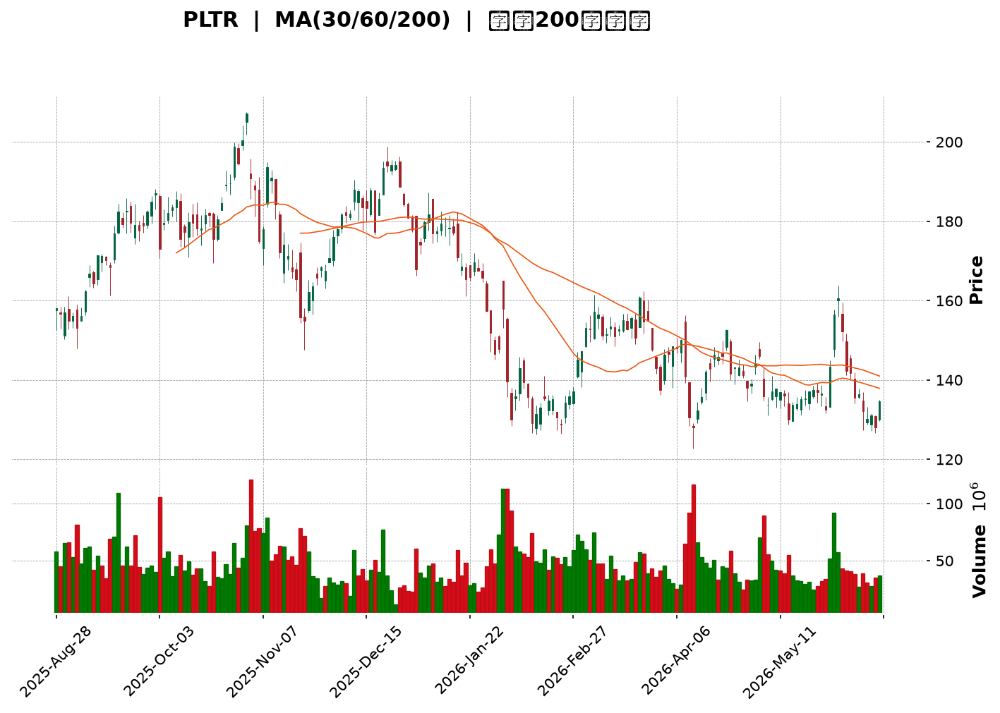
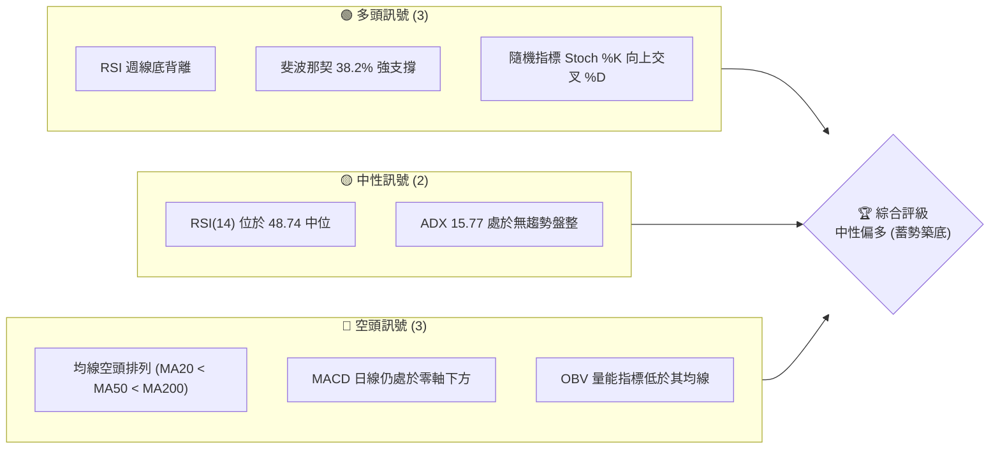
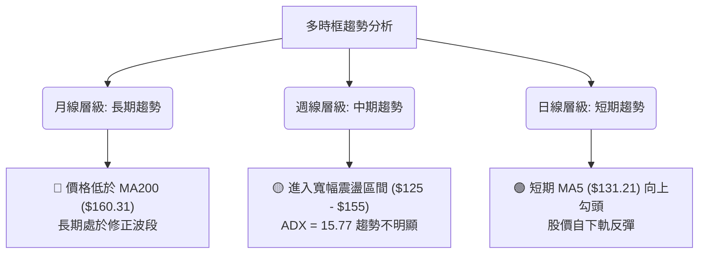
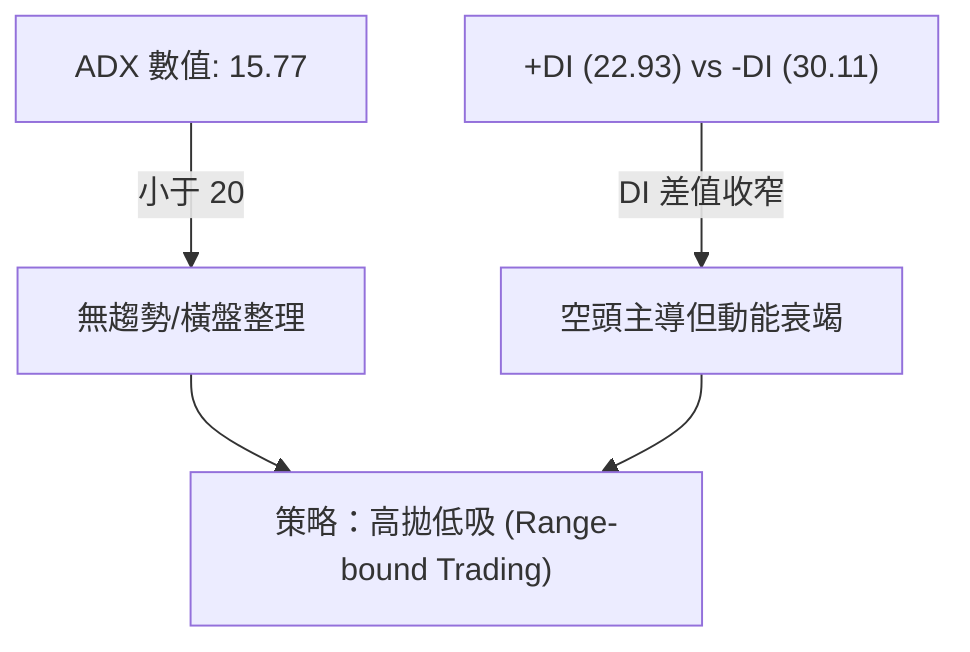
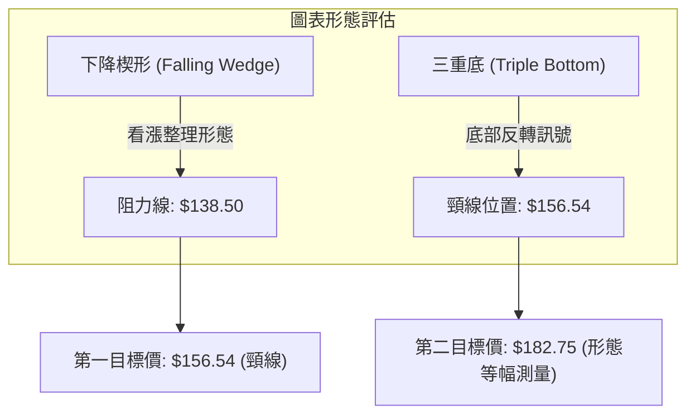
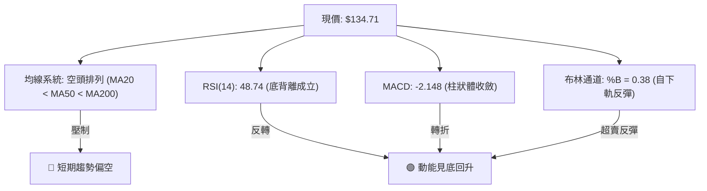
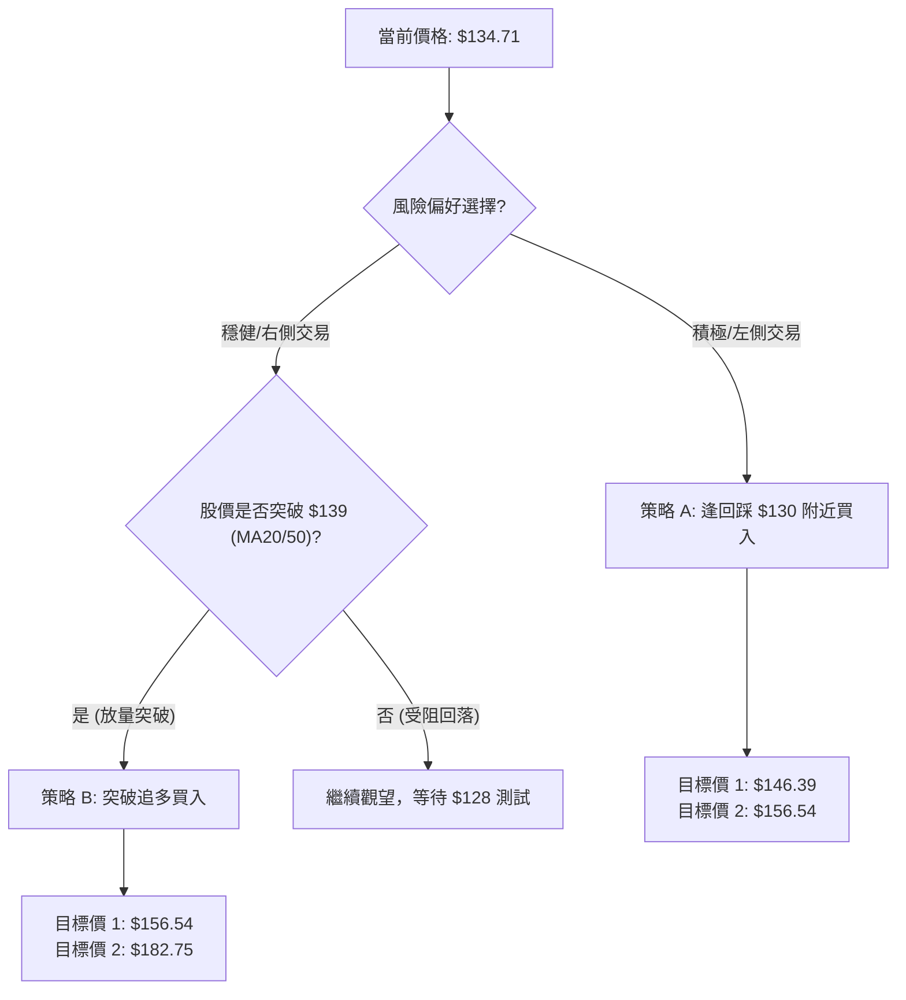
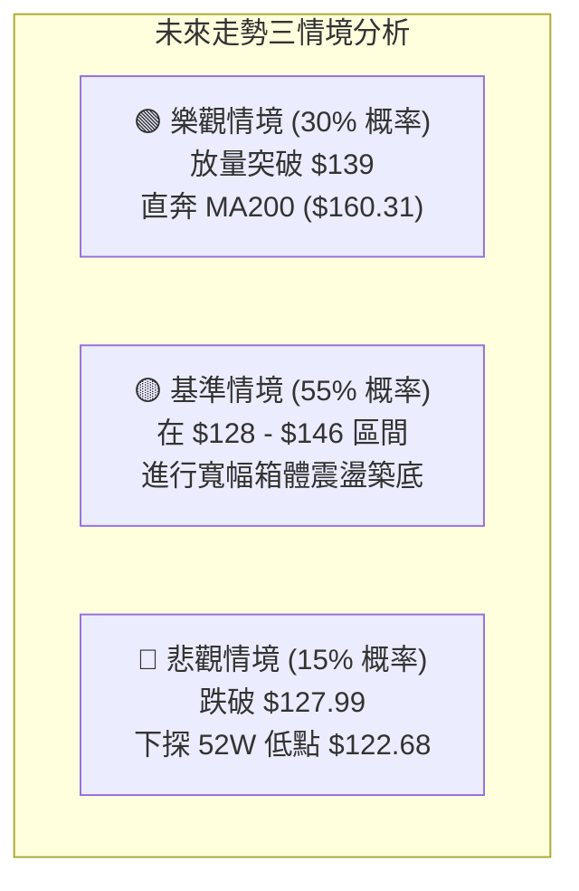

<details>
<summary>📊 靜態圖表 (點擊展開)</summary>

</details>

<html>
<head><meta charset="utf-8" /></head>
<body>
    <div style="height:500px; width:100%;">                        <script>window.PlotlyConfig = {MathJaxConfig: 'local'};</script>
        <script charset="utf-8" src="https://cdn.plot.ly/plotly-3.6.0.min.js" integrity="sha256-QaOVwtVY0T02VaHrr6pnoHLCwayMJp4O5n4YyaE3rJk=" crossorigin="anonymous"></script>                <div id="candlestick-chart" class="plotly-graph-div" style="height:100%; width:100%;"></div>            <script>                window.PLOTLYENV=window.PLOTLYENV || {};                                if (document.getElementById("candlestick-chart")) {                    Plotly.newPlot(                        "candlestick-chart",                        [{"close":{"dtype":"f8","bdata":"AAAAANfDY0AAAABguJZjQAAAAEDhomNAAAAAwMxcY0AAAADgeoRjQAAAACCFI2NAAAAAQDODY0AAAAAghUtkQAAAACCu12RAAAAAIIWLZEAAAACAwm1lQAAAAGC4ZmVAAAAA4FFIZUAAAABgjwplQAAAAEAKH2ZAAAAA4HrMZkAAAABgj2pmQAAAAKCZ0WZAAAAAgOtxZkAAAAAA12NmQAAAAIA9MmZAAAAAIIVbZkAAAACgcM1mQAAAAGBmHmdAAAAAoJlhZ0AAAACAPaJlQAAAAMD1cGZAAAAAoHDFZkAAAACA6\u002fFmQAAAAEAKL2dAAAAAgBTuZUAAAABguCZmQAAAACCud2ZAAAAAANdzZkAAAAAA10NmQAAAAMDMRGZAAAAAQOGyZkAAAADgUbBmQAAAACCu72VAAAAAIFyPZkAAAAAAKRRnQAAAAIDCpWdAAAAAQDOzZ0AAAACA69loQAAAAKCZUWhAAAAAQAoPaUAAAACAwuVpQAAAACCu12dAAAAAwMx8Z0AAAACgmeFlQAAAAIDCPWZAAAAAIIUzaEAAAABguN5nQAAAAKBwBWdAAAAA4HqEZUAAAADgUcBlQAAAAAAAaGVAAAAAYI\u002fqZEAAAACgcK1kQAAAAADXd2NAAAAAQDNbY0AAAAAAAEhkQAAAAKCZcWRAAAAA4KO4ZEAAAABgZg5lQAAAACCu72RAAAAAgBRWZUAAAABgjwJmQAAAAKBwPWZAAAAA4FG4ZkAAAAAgrq9mQAAAAEDhumZAAAAAwB59Z0AAAACgR3FnQAAAAIA98mZAAAAAAADoZkAAAAAAAHhnQAAAAKBHKWZAAAAAgBQ2Z0AAAAAAKSxoQAAAACBcP2hAAAAAAClEaEAAAACgcEVoQAAAAGC4lmdAAAAAgMIFZ0AAAABA4ZpmQAAAAAAAOGZAAAAAIIX7ZEAAAACgR8FlQAAAAGC4dmZAAAAAgMK1ZkAAAAAghRtmQAAAACCuL2ZAAAAAwB5tZkAAAABguF5mQAAAAMDMTGZAAAAAgD0iZkAAAABguF5lQAAAAMD1EGVAAAAAYI+qZEAAAADAzLxkQAAAAEAzM2VAAAAAQArvZEAAAABgZrZkQAAAAEAzq2NAAAAAIIX7YkAAAABA4VJiQAAAAOBReGJAAAAAACm8Y0AAAACgR3FhQAAAAOBRQGBAAAAAwMz8YEAAAADAHt1hQAAAAOBRcGFAAAAAgML1YEAAAAAAKSRgQAAAAMAebWBAAAAA4KOgYEAAAAAAKexgQAAAAOB63GBAAAAAIK7nYEAAAABAM1NgQAAAAEDhGmBAAAAAgBTGYEAAAACAFP5gQAAAAIAUJmFAAAAAoHAlYkAAAABACmdiQAAAAIAUJmNAAAAAoHAVY0AAAADAHqVjQAAAAIDCjWNAAAAA4HrkYkAAAABAM\u002fNiQAAAAAAAMGNAAAAAYGbeYkAAAABAChdjQAAAAGCPYmNAAAAA4KMYY0AAAACAwnVjQAAAAIDC1WJAAAAAQOEaZEAAAADA9VhjQAAAAGC4XmNAAAAAgOtxYkAAAACA6+FhQAAAAKCZMWFAAAAAwPVIYkAAAAAgrk9iQAAAAGC4jmJAAAAAgMJ9YkAAAACAPcJiQAAAAOBRmGFAAAAAIK5PYEAAAACA6wFgQAAAAADXi2BAAAAAYGb2YEAAAADAzMRhQAAAAOBR2GFAAAAA4HpMYkAAAADgejxiQAAAAEAKP2JAAAAAANcTY0AAAACAPbJhQAAAAEDh4mFAAAAAQDPjYUAAAACAwqVhQAAAAEAKP2FAAAAAIIVjYUAAAACAPQJiQAAAAMD1QGJAAAAAwB79YEAAAACgR7lgQAAAAKCZIWFAAAAAoJk5YUAAAADgehxhQAAAAAAAAGFAAAAAoJlBYEAAAAAgXLdgQAAAACCuv2BAAAAA4HrkYEAAAADgUehgQAAAAMDMJGFAAAAAoEctYUAAAAAAKRxhQAAAAEAzE2FAAAAA4FGQYEAAAABA4ephQAAAAKBHkWNAAAAAwMwUZEAAAACgcAVjQAAAAGBmxmFAAAAAYGa2YUAAAADA9fBgQAAAAEAKD2FAAAAAgD2CYEAAAABguEZgQAAAAGCPYmBAAAAAIFz\u002fX0AAAABguNZgQA=="},"high":{"dtype":"f8","bdata":"AAAAIFzHY0AAAACgcM1jQAAAAOB6zGNAAAAAwMwkZEAAAACgR6FjQAAAAEAK32NAAAAAoJnJY0AAAAAAAFhkQAAAAAAAIGVAAAAA4KfuZEAAAADA9XBlQAAAAKCZeWVAAAAAgOtpZUAAAACAwjVlQAAAAKCZWWZAAAAAoHANZ0AAAAAAAMhmQAAAAAAAOGdAAAAAQDMbZ0AAAACAPQpnQAAAAADXg2ZAAAAAIFyvZkAAAADgo9hmQAAAAMD1SGdAAAAAYGaGZ0AAAABA4VpnQAAAAGBm3mZAAAAAgMJFZ0AAAADgUQhnQAAAAADXc2dAAAAAQDNjZ0AAAABACmdmQAAAAEDhymZAAAAAQDMLZ0AAAACAPRpnQAAAAEDhsmZAAAAAQOHiZkAAAADAcsxmQAAAAGC4xmZAAAAAgOuxZkAAAACgcEVnQAAAAGCPGmhAAAAAwPX4Z0AAAABAM\u002ftoQAAAAKBw9WhAAAAAgMKFaUAAAADgo\u002fBpQAAAAGBmdmhAAAAAgD3KZ0AAAABA4eJnQAAAAGBmVmZAAAAAgMJdaEAAAACgmR1oQAAAAGCP0mdAAAAAYGbWZkAAAACgRylmQAAAACCux2VAAAAAYI+aZUAAAABAMzNlQAAAAIA90mVAAAAAIIXDY0AAAACgcKVkQAAAAMDMlGRAAAAAINkKZUAAAACgmRllQAAAAEAzI2VAAAAAAAD4ZUAAAADAHj1mQAAAAIAUTmZAAAAAYOXEZkAAAAAAKfxmQAAAAEAz22ZAAAAA4HrMZ0AAAACgmYFnQAAAAMDMUGdAAAAAwPV4Z0AAAAAAAJBnQAAAAAAAeGdAAAAAYI9qZ0AAAAAAAGBoQAAAAAAp3GhAAAAAANdraEAAAACgcGVoQAAAAEAzi2hAAAAAYGZmZ0AAAAAAVBdnQAAAAMD1sGZAAAAAQDOrZkAAAACAPfplQAAAAIAUhmZAAAAAwPVoZ0AAAADAHjVnQAAAAEAKV2ZAAAAAAADQZkAAAABAM6NmQAAAAOAis2ZAAAAAQDOTZkAAAACAws1mQAAAAEAKf2VAAAAAIK4vZUAAAAAAACBlQAAAAAAAgGVAAAAAQOFSZUAAAACAFC5lQAAAAKBwoWRAAAAAACm0Y0AAAAAAAOBiQAAAAMDM7GJAAAAAAH+iZEAAAABAM3tjQAAAACBcP2FAAAAA4Ps1YUAAAAAA1ztiQAAAAIDrMWJAAAAAAABoYUAAAADgevxgQAAAAIDrsWBAAAAAgD3KYEAAAADg0J5hQAAAAMAeBWFAAAAAYLgGYUAAAACgR4FgQAAAACCuR2BAAAAAQOECYUAAAADgUTBhQAAAAEAzQ2FAAAAA4HpkYkAAAAAAAHBiQAAAAOCjUGNAAAAAACmMY0AAAABgZi5kQAAAAIAUzmNAAAAAIAaVY0AAAACAaCVjQAAAAAApfGNAAAAAgOtRY0AAAAAghTtjQAAAAAAAmGNAAAAAgBSWY0AAAADAzIRjQAAAAMDMlGNAAAAAYI8iZEAAAADAzExkQAAAAOCjCGRAAAAAANcjY0AAAABguD5iQAAAAADXA2JAAAAAIIV7YkAAAACgmYliQAAAAOBRkGJAAAAAIIXTYkAAAADgo8hiQAAAAMD1iGNAAAAAoEdxYUAAAABgZiZgQAAAAKBwzWBAAAAAgD1CYUAAAABgj9JhQAAAAKCZMWJAAAAAwPWIYkAAAABgZmZiQAAAAADXu2JAAAAAgMIVY0AAAACgR8liQAAAAGCP6mFAAAAAgD0iYkAAAABAM\u002fthQAAAAOBReGFAAAAAYGaGYUAAAACAFE5iQAAAAOB6tGJAAAAAIFzfYUAAAABgZvZgQAAAAGBmnmFAAAAAACk8YUAAAADgeiRhQAAAAIDCLWFAAAAAIK4fYUAAAAAgXM9gQAAAAOB69GBAAAAAgOv9YEAAAABACi9hQAAAACCuJ2FAAAAAoJlRYUAAAADgo2BhQAAAAIDCVWFAAAAAIFz3YEAAAAAAACBiQAAAAKDtuGNAAAAAYGZ2ZEAAAACgmfFjQAAAAIDC9WJAAAAAANdLYkAAAABACr9hQAAAAOBROGFAAAAAIK4fYUAAAACA66VgQAAAAOCjcGBAAAAAQOFiYEAAAAAgXN9gQA=="},"hovertemplate":"\u003cb\u003e%{x|%Y-%m-%d}\u003c\u002fb\u003e\u003cbr\u003e\u958b: $%{open:.2f}\u003cbr\u003e\u9ad8: $%{high:.2f}\u003cbr\u003e\u4f4e: $%{low:.2f}\u003cbr\u003e\u6536: $%{close:.2f}\u003cextra\u003e\u003c\u002fextra\u003e","low":{"dtype":"f8","bdata":"AAAAoJkRY0AAAAAAACBjQAAAAMD1yGJAAAAAYLgWY0AAAADAHiVjQAAAAKBHgWJAAAAAQOFaY0AAAAAA14tjQAAAAIAUbmRAAAAAQApnZEAAAADgUYBkQAAAAMAe7WRAAAAAYLgeZUAAAADgoyhkQAAAAOB6LGVAAAAAYLgWZkAAAACgR0lmQAAAAOBRIGZAAAAAANcjZkAAAACgR8llQAAAAMAe3WVAAAAAwB4lZkAAAABACkdmQAAAAAAAcGZAAAAAYGbeZkAAAADgo1hlQAAAAGCPOmZAAAAAoHBtZkAAAABgZqZmQAAAAGBmfmZAAAAAwPWwZUAAAABgZq5lQAAAAIA9WmVAAAAA4KMAZkAAAABgZg5mQAAAAGBmvmVAAAAAgBQuZkAAAADAzFRmQAAAAKBwLWVAAAAA4FHgZUAAAABAM9tmQAAAAOCjcGdAAAAAwPVYZ0AAAAAgrs9nQAAAAADXQ2hAAAAAoHC9aEAAAACAPTppQAAAAIDrMWdAAAAAYLimZkAAAADA9dBlQAAAAMAeHWVAAAAA4KPwZkAAAAAAKWRnQAAAAMDMjGZAAAAAYGRXZUAAAAAAAJBkQAAAAIDC9WRAAAAAAACwZEAAAACgcE1kQAAAAOCjTGNAAAAAgOtxYkAAAAAAAKBjQAAAAIDCkWNAAAAAACl8ZEAAAAAAALxkQAAAAADXY2RAAAAAQOEyZUAAAABgjxplQAAAAIDCzWVAAAAAwB4lZkAAAACgR3FmQAAAAAApjGZAAAAAAADYZkAAAABguIZmQAAAACBYNWZAAAAAwPWAZkAAAABAi6RmQAAAAAAAEGZAAAAA4FGwZkAAAAAgXFdnQAAAAIDCDWhAAAAAIIX3Z0AAAABgjxpoQAAAAADXk2dAAAAA4Hr0ZkAAAABgZpZmQAAAAAAAKGZAAAAAQDPLZEAAAACgR3llQAAAAOCj2GVAAAAAwB41ZkAAAAAA18tlQAAAAAAA2GVAAAAAQOEKZkAAAADgegRmQAAAAGBmvmVAAAAAwPUQZkAAAADgUUBlQAAAACCux2RAAAAAIIUjZEAAAABgZp5kQAAAAKCZyWRAAAAAYGbqZEAAAACAFJZkQAAAACCup2NAAAAAANdjYkAAAADAciRiQAAAAKDtVGJAAAAAANcjY0AAAACAwvVgQAAAAIA9CmBAAAAAQDOLYEAAAAAA1dhgQAAAAOCjOGFAAAAAYGaeYEAAAAAA16NfQAAAAIDpjl9AAAAAYI\u002fSX0AAAAAA19tgQAAAAOBRYGBAAAAAoHBlYEAAAADA9dhfQAAAACCul19AAAAAgMIlYEAAAAAAKZRgQAAAACBcv2BAAAAA4KOQYUAAAABgZkZhQAAAAIDrgWJAAAAAIIWzYkAAAACgR8liQAAAAEAKH2NAAAAA4HrEYkAAAABgj6piQAAAACBc32JAAAAAYI+SYkAAAACgcOViQAAAAADXA2NAAAAAIIUTY0AAAAAAANBiQAAAAEDhomJAAAAAIK4nY0AAAADgevRiQAAAACBcW2NAAAAAAABoYkAAAACA67FhQAAAAKCZCWFAAAAAQApfYUAAAABACg9iQAAAACCuP2FAAAAAIDFUYkAAAABgZg5iQAAAAKBwZWFAAAAAQAoPYEAAAAAghateQAAAAMDMJGBAAAAAAADAYEAAAACAwt1gQAAAAMD1cGFAAAAAoJnpYUAAAABgj\u002fphQAAAAMD3\u002f2FAAAAAwB5tYkAAAACgcH1hQAAAAIDCXWFAAAAA4FGgYUAAAACgcI1hQAAAAIDC1WBAAAAAwMwUYUAAAADgeqxhQAAAAEAzJ2JAAAAAQArXYEAAAADAzGRgQAAAAMD12GBAAAAA4KOgYEAAAAAArJhgQAAAAGC4rmBAAAAAAAAYYEAAAABgZi5gQAAAAKBHiWBAAAAAYI9qYEAAAABAM7NgQAAAAKBwjWBAAAAAoHDtYEAAAACgmclgQAAAAKCZqWBAAAAAACl0YEAAAAAAAKBgQAAAAKBHOWJAAAAAACl8Y0AAAACgmbliQAAAAAAAqGFAAAAAQLSIYUAAAADAzMBgQAAAAMD16GBAAAAAYGbWX0AAAACgmRlgQAAAAEDhyl9AAAAAoJmpX0AAAABgZjZgQA=="},"name":"\u50f9\u683c","open":{"dtype":"f8","bdata":"AAAAACm0Y0AAAAAgXJ9jQAAAAGBm5mJAAAAAAADAY0AAAAAgrltjQAAAAIA9umNAAAAAwB5dY0AAAAAAAKhjQAAAAAAAwGRAAAAAIK7nZEAAAABAM6tkQAAAAEAzM2VAAAAAoEdhZUAAAADgoyBlQAAAAOCjSGVAAAAAgD0iZkAAAAAAKZxmQAAAAOBR0GZAAAAAwB79ZkAAAACgmfllQAAAAKCZYWZAAAAA4Hp0ZkAAAAAgXF9mQAAAAIA9qmZAAAAAYGZWZ0AAAADAzExnQAAAAIDCZWZAAAAAgOuJZkAAAACgmdlmQAAAAGCP8mZAAAAAoHAlZ0AAAACAwlVmQAAAAAAAAGZAAAAAwPW0ZkAAAADA9bhmQAAAAAAAOGZAAAAAIK5vZkAAAACA68FmQAAAAIDCvWZAAAAAgD3uZUAAAAAAKdxmQAAAAEAKn2dAAAAAIFyvZ0AAAABgj+JnQAAAAKCZzWhAAAAAYGbmaEAAAACgcKFpQAAAAIA9AmhAAAAAAACgZ0AAAAAgrn9nQAAAAMDMpGVAAAAAgOsJZ0AAAABguMpnQAAAAGCP0mdAAAAAQOG2ZkAAAABAM99kQAAAAMD1UGVAAAAAANcLZUAAAACgmflkQAAAAIA9gmVAAAAA4FGAY0AAAABACq9jQAAAAIA9AmRAAAAAQDPbZEAAAADgUfhkQAAAAAAAoGRAAAAAQOEyZUAAAADgekRlQAAAACCuC2ZAAAAAIFxHZkAAAABguMZmQAAAAEAKn2ZAAAAAYGYeZ0AAAACgmRlnQAAAAIDrOWdAAAAAYI8iZ0AAAADA9bRmQAAAAEDhdmdAAAAA4FGwZkAAAAAgrldnQAAAAKBHYWhAAAAAYGYaaEAAAADAHiVoQAAAAOB6YGhAAAAAQDNbZ0AAAABAMwtnQAAAAAAppGZAAAAAoJmpZkAAAAAAKdxlQAAAAOBR+GVAAAAAoJl5ZkAAAAAgrjNnQAAAAOCjIGZAAAAAgOs1ZkAAAAAAAFxmQAAAAAAARGZAAAAAYLhWZkAAAAAghWtmQAAAAAAA9GRAAAAAIN0MZUAAAACgmR1lQAAAAOCj6GRAAAAAYLgGZUAAAAAgXO9kQAAAAMDMjGRAAAAAACm0Y0AAAACgmcFiQAAAAIAU3mJAAAAAoJmhZEAAAADAHm1jQAAAAIA9GmFAAAAAYI\u002fqYEAAAABgjxJhQAAAAEDhHmJAAAAAwMxgYUAAAAAghetgQAAAAKCZ+V9AAAAA4KMcYEAAAADgevxgQAAAAIDriWBAAAAAIK6LYEAAAACgR4FgQAAAAAApIGBAAAAAIIVTYEAAAABACrtgQAAAAIA9wmBAAAAAwMyYYUAAAABAM8NhQAAAAIDCjWJAAAAAgBQeY0AAAACAFM5iQAAAAIAUdmNAAAAAIK5\u002fY0AAAAAAKexiQAAAAOBRIGNAAAAAoJkpY0AAAABgZg5jQAAAAMD1DGNAAAAAgD1eY0AAAABAMyNjQAAAAGBmZmNAAAAAIK4nY0AAAACAPQJkQAAAAKBwrWNAAAAAgMIhY0AAAAAAKTxiQAAAAOCj6GFAAAAA4KOAYUAAAAAAAGBiQAAAACCF72FAAAAAIIWLYkAAAABgOVxiQAAAAOB6WGNAAAAA4KNsYUAAAAAgXA9gQAAAACBcR2BAAAAAAKrNYEAAAACgRxlhQAAAAKBHCWJAAAAAgBQqYkAAAAAAACBiQAAAAIDrWWJAAAAAIIWLYkAAAABgZrZiQAAAAGC43mFAAAAAAACoYUAAAACgmclhQAAAAOBReGFAAAAAQDNPYUAAAAAAAOhhQAAAAAAAeGJAAAAAoHCJYUAAAABguLZgQAAAAEAz42BAAAAAIK77YEAAAADAHt1gQAAAAEAzE2FAAAAAIDHAYEAAAADAzDRgQAAAAKCZmWBAAAAAAACQYEAAAACgcOVgQAAAAOCjxGBAAAAAoJn5YEAAAACgmS1hQAAAAMAeBWFAAAAAoJmpYEAAAADAHqVgQAAAAGBmemJAAAAAIFz\u002fY0AAAACAFJZjQAAAAGBmtmJAAAAAYLguYkAAAABgZophQAAAAIDC9WBAAAAAANfbYEAAAABgZipgQAAAAMD1GGBAAAAAoEddYEAAAAAghT9gQA=="},"x":["2025-08-28T00:00:00-04:00","2025-08-29T00:00:00-04:00","2025-09-02T00:00:00-04:00","2025-09-03T00:00:00-04:00","2025-09-04T00:00:00-04:00","2025-09-05T00:00:00-04:00","2025-09-08T00:00:00-04:00","2025-09-09T00:00:00-04:00","2025-09-10T00:00:00-04:00","2025-09-11T00:00:00-04:00","2025-09-12T00:00:00-04:00","2025-09-15T00:00:00-04:00","2025-09-16T00:00:00-04:00","2025-09-17T00:00:00-04:00","2025-09-18T00:00:00-04:00","2025-09-19T00:00:00-04:00","2025-09-22T00:00:00-04:00","2025-09-23T00:00:00-04:00","2025-09-24T00:00:00-04:00","2025-09-25T00:00:00-04:00","2025-09-26T00:00:00-04:00","2025-09-29T00:00:00-04:00","2025-09-30T00:00:00-04:00","2025-10-01T00:00:00-04:00","2025-10-02T00:00:00-04:00","2025-10-03T00:00:00-04:00","2025-10-06T00:00:00-04:00","2025-10-07T00:00:00-04:00","2025-10-08T00:00:00-04:00","2025-10-09T00:00:00-04:00","2025-10-10T00:00:00-04:00","2025-10-13T00:00:00-04:00","2025-10-14T00:00:00-04:00","2025-10-15T00:00:00-04:00","2025-10-16T00:00:00-04:00","2025-10-17T00:00:00-04:00","2025-10-20T00:00:00-04:00","2025-10-21T00:00:00-04:00","2025-10-22T00:00:00-04:00","2025-10-23T00:00:00-04:00","2025-10-24T00:00:00-04:00","2025-10-27T00:00:00-04:00","2025-10-28T00:00:00-04:00","2025-10-29T00:00:00-04:00","2025-10-30T00:00:00-04:00","2025-10-31T00:00:00-04:00","2025-11-03T00:00:00-05:00","2025-11-04T00:00:00-05:00","2025-11-05T00:00:00-05:00","2025-11-06T00:00:00-05:00","2025-11-07T00:00:00-05:00","2025-11-10T00:00:00-05:00","2025-11-11T00:00:00-05:00","2025-11-12T00:00:00-05:00","2025-11-13T00:00:00-05:00","2025-11-14T00:00:00-05:00","2025-11-17T00:00:00-05:00","2025-11-18T00:00:00-05:00","2025-11-19T00:00:00-05:00","2025-11-20T00:00:00-05:00","2025-11-21T00:00:00-05:00","2025-11-24T00:00:00-05:00","2025-11-25T00:00:00-05:00","2025-11-26T00:00:00-05:00","2025-11-28T00:00:00-05:00","2025-12-01T00:00:00-05:00","2025-12-02T00:00:00-05:00","2025-12-03T00:00:00-05:00","2025-12-04T00:00:00-05:00","2025-12-05T00:00:00-05:00","2025-12-08T00:00:00-05:00","2025-12-09T00:00:00-05:00","2025-12-10T00:00:00-05:00","2025-12-11T00:00:00-05:00","2025-12-12T00:00:00-05:00","2025-12-15T00:00:00-05:00","2025-12-16T00:00:00-05:00","2025-12-17T00:00:00-05:00","2025-12-18T00:00:00-05:00","2025-12-19T00:00:00-05:00","2025-12-22T00:00:00-05:00","2025-12-23T00:00:00-05:00","2025-12-24T00:00:00-05:00","2025-12-26T00:00:00-05:00","2025-12-29T00:00:00-05:00","2025-12-30T00:00:00-05:00","2025-12-31T00:00:00-05:00","2026-01-02T00:00:00-05:00","2026-01-05T00:00:00-05:00","2026-01-06T00:00:00-05:00","2026-01-07T00:00:00-05:00","2026-01-08T00:00:00-05:00","2026-01-09T00:00:00-05:00","2026-01-12T00:00:00-05:00","2026-01-13T00:00:00-05:00","2026-01-14T00:00:00-05:00","2026-01-15T00:00:00-05:00","2026-01-16T00:00:00-05:00","2026-01-20T00:00:00-05:00","2026-01-21T00:00:00-05:00","2026-01-22T00:00:00-05:00","2026-01-23T00:00:00-05:00","2026-01-26T00:00:00-05:00","2026-01-27T00:00:00-05:00","2026-01-28T00:00:00-05:00","2026-01-29T00:00:00-05:00","2026-01-30T00:00:00-05:00","2026-02-02T00:00:00-05:00","2026-02-03T00:00:00-05:00","2026-02-04T00:00:00-05:00","2026-02-05T00:00:00-05:00","2026-02-06T00:00:00-05:00","2026-02-09T00:00:00-05:00","2026-02-10T00:00:00-05:00","2026-02-11T00:00:00-05:00","2026-02-12T00:00:00-05:00","2026-02-13T00:00:00-05:00","2026-02-17T00:00:00-05:00","2026-02-18T00:00:00-05:00","2026-02-19T00:00:00-05:00","2026-02-20T00:00:00-05:00","2026-02-23T00:00:00-05:00","2026-02-24T00:00:00-05:00","2026-02-25T00:00:00-05:00","2026-02-26T00:00:00-05:00","2026-02-27T00:00:00-05:00","2026-03-02T00:00:00-05:00","2026-03-03T00:00:00-05:00","2026-03-04T00:00:00-05:00","2026-03-05T00:00:00-05:00","2026-03-06T00:00:00-05:00","2026-03-09T00:00:00-04:00","2026-03-10T00:00:00-04:00","2026-03-11T00:00:00-04:00","2026-03-12T00:00:00-04:00","2026-03-13T00:00:00-04:00","2026-03-16T00:00:00-04:00","2026-03-17T00:00:00-04:00","2026-03-18T00:00:00-04:00","2026-03-19T00:00:00-04:00","2026-03-20T00:00:00-04:00","2026-03-23T00:00:00-04:00","2026-03-24T00:00:00-04:00","2026-03-25T00:00:00-04:00","2026-03-26T00:00:00-04:00","2026-03-27T00:00:00-04:00","2026-03-30T00:00:00-04:00","2026-03-31T00:00:00-04:00","2026-04-01T00:00:00-04:00","2026-04-02T00:00:00-04:00","2026-04-06T00:00:00-04:00","2026-04-07T00:00:00-04:00","2026-04-08T00:00:00-04:00","2026-04-09T00:00:00-04:00","2026-04-10T00:00:00-04:00","2026-04-13T00:00:00-04:00","2026-04-14T00:00:00-04:00","2026-04-15T00:00:00-04:00","2026-04-16T00:00:00-04:00","2026-04-17T00:00:00-04:00","2026-04-20T00:00:00-04:00","2026-04-21T00:00:00-04:00","2026-04-22T00:00:00-04:00","2026-04-23T00:00:00-04:00","2026-04-24T00:00:00-04:00","2026-04-27T00:00:00-04:00","2026-04-28T00:00:00-04:00","2026-04-29T00:00:00-04:00","2026-04-30T00:00:00-04:00","2026-05-01T00:00:00-04:00","2026-05-04T00:00:00-04:00","2026-05-05T00:00:00-04:00","2026-05-06T00:00:00-04:00","2026-05-07T00:00:00-04:00","2026-05-08T00:00:00-04:00","2026-05-11T00:00:00-04:00","2026-05-12T00:00:00-04:00","2026-05-13T00:00:00-04:00","2026-05-14T00:00:00-04:00","2026-05-15T00:00:00-04:00","2026-05-18T00:00:00-04:00","2026-05-19T00:00:00-04:00","2026-05-20T00:00:00-04:00","2026-05-21T00:00:00-04:00","2026-05-22T00:00:00-04:00","2026-05-26T00:00:00-04:00","2026-05-27T00:00:00-04:00","2026-05-28T00:00:00-04:00","2026-05-29T00:00:00-04:00","2026-06-01T00:00:00-04:00","2026-06-02T00:00:00-04:00","2026-06-03T00:00:00-04:00","2026-06-04T00:00:00-04:00","2026-06-05T00:00:00-04:00","2026-06-08T00:00:00-04:00","2026-06-09T00:00:00-04:00","2026-06-10T00:00:00-04:00","2026-06-11T00:00:00-04:00","2026-06-12T00:00:00-04:00","2026-06-15T00:00:00-04:00"],"type":"candlestick"},{"hovertemplate":"MA30: $%{y:.2f}\u003cextra\u003e\u003c\u002fextra\u003e","line":{"color":"#2196F3","dash":"dash","width":2},"mode":"lines","name":"MA30","x":["2025-08-28T00:00:00-04:00","2025-08-29T00:00:00-04:00","2025-09-02T00:00:00-04:00","2025-09-03T00:00:00-04:00","2025-09-04T00:00:00-04:00","2025-09-05T00:00:00-04:00","2025-09-08T00:00:00-04:00","2025-09-09T00:00:00-04:00","2025-09-10T00:00:00-04:00","2025-09-11T00:00:00-04:00","2025-09-12T00:00:00-04:00","2025-09-15T00:00:00-04:00","2025-09-16T00:00:00-04:00","2025-09-17T00:00:00-04:00","2025-09-18T00:00:00-04:00","2025-09-19T00:00:00-04:00","2025-09-22T00:00:00-04:00","2025-09-23T00:00:00-04:00","2025-09-24T00:00:00-04:00","2025-09-25T00:00:00-04:00","2025-09-26T00:00:00-04:00","2025-09-29T00:00:00-04:00","2025-09-30T00:00:00-04:00","2025-10-01T00:00:00-04:00","2025-10-02T00:00:00-04:00","2025-10-03T00:00:00-04:00","2025-10-06T00:00:00-04:00","2025-10-07T00:00:00-04:00","2025-10-08T00:00:00-04:00","2025-10-09T00:00:00-04:00","2025-10-10T00:00:00-04:00","2025-10-13T00:00:00-04:00","2025-10-14T00:00:00-04:00","2025-10-15T00:00:00-04:00","2025-10-16T00:00:00-04:00","2025-10-17T00:00:00-04:00","2025-10-20T00:00:00-04:00","2025-10-21T00:00:00-04:00","2025-10-22T00:00:00-04:00","2025-10-23T00:00:00-04:00","2025-10-24T00:00:00-04:00","2025-10-27T00:00:00-04:00","2025-10-28T00:00:00-04:00","2025-10-29T00:00:00-04:00","2025-10-30T00:00:00-04:00","2025-10-31T00:00:00-04:00","2025-11-03T00:00:00-05:00","2025-11-04T00:00:00-05:00","2025-11-05T00:00:00-05:00","2025-11-06T00:00:00-05:00","2025-11-07T00:00:00-05:00","2025-11-10T00:00:00-05:00","2025-11-11T00:00:00-05:00","2025-11-12T00:00:00-05:00","2025-11-13T00:00:00-05:00","2025-11-14T00:00:00-05:00","2025-11-17T00:00:00-05:00","2025-11-18T00:00:00-05:00","2025-11-19T00:00:00-05:00","2025-11-20T00:00:00-05:00","2025-11-21T00:00:00-05:00","2025-11-24T00:00:00-05:00","2025-11-25T00:00:00-05:00","2025-11-26T00:00:00-05:00","2025-11-28T00:00:00-05:00","2025-12-01T00:00:00-05:00","2025-12-02T00:00:00-05:00","2025-12-03T00:00:00-05:00","2025-12-04T00:00:00-05:00","2025-12-05T00:00:00-05:00","2025-12-08T00:00:00-05:00","2025-12-09T00:00:00-05:00","2025-12-10T00:00:00-05:00","2025-12-11T00:00:00-05:00","2025-12-12T00:00:00-05:00","2025-12-15T00:00:00-05:00","2025-12-16T00:00:00-05:00","2025-12-17T00:00:00-05:00","2025-12-18T00:00:00-05:00","2025-12-19T00:00:00-05:00","2025-12-22T00:00:00-05:00","2025-12-23T00:00:00-05:00","2025-12-24T00:00:00-05:00","2025-12-26T00:00:00-05:00","2025-12-29T00:00:00-05:00","2025-12-30T00:00:00-05:00","2025-12-31T00:00:00-05:00","2026-01-02T00:00:00-05:00","2026-01-05T00:00:00-05:00","2026-01-06T00:00:00-05:00","2026-01-07T00:00:00-05:00","2026-01-08T00:00:00-05:00","2026-01-09T00:00:00-05:00","2026-01-12T00:00:00-05:00","2026-01-13T00:00:00-05:00","2026-01-14T00:00:00-05:00","2026-01-15T00:00:00-05:00","2026-01-16T00:00:00-05:00","2026-01-20T00:00:00-05:00","2026-01-21T00:00:00-05:00","2026-01-22T00:00:00-05:00","2026-01-23T00:00:00-05:00","2026-01-26T00:00:00-05:00","2026-01-27T00:00:00-05:00","2026-01-28T00:00:00-05:00","2026-01-29T00:00:00-05:00","2026-01-30T00:00:00-05:00","2026-02-02T00:00:00-05:00","2026-02-03T00:00:00-05:00","2026-02-04T00:00:00-05:00","2026-02-05T00:00:00-05:00","2026-02-06T00:00:00-05:00","2026-02-09T00:00:00-05:00","2026-02-10T00:00:00-05:00","2026-02-11T00:00:00-05:00","2026-02-12T00:00:00-05:00","2026-02-13T00:00:00-05:00","2026-02-17T00:00:00-05:00","2026-02-18T00:00:00-05:00","2026-02-19T00:00:00-05:00","2026-02-20T00:00:00-05:00","2026-02-23T00:00:00-05:00","2026-02-24T00:00:00-05:00","2026-02-25T00:00:00-05:00","2026-02-26T00:00:00-05:00","2026-02-27T00:00:00-05:00","2026-03-02T00:00:00-05:00","2026-03-03T00:00:00-05:00","2026-03-04T00:00:00-05:00","2026-03-05T00:00:00-05:00","2026-03-06T00:00:00-05:00","2026-03-09T00:00:00-04:00","2026-03-10T00:00:00-04:00","2026-03-11T00:00:00-04:00","2026-03-12T00:00:00-04:00","2026-03-13T00:00:00-04:00","2026-03-16T00:00:00-04:00","2026-03-17T00:00:00-04:00","2026-03-18T00:00:00-04:00","2026-03-19T00:00:00-04:00","2026-03-20T00:00:00-04:00","2026-03-23T00:00:00-04:00","2026-03-24T00:00:00-04:00","2026-03-25T00:00:00-04:00","2026-03-26T00:00:00-04:00","2026-03-27T00:00:00-04:00","2026-03-30T00:00:00-04:00","2026-03-31T00:00:00-04:00","2026-04-01T00:00:00-04:00","2026-04-02T00:00:00-04:00","2026-04-06T00:00:00-04:00","2026-04-07T00:00:00-04:00","2026-04-08T00:00:00-04:00","2026-04-09T00:00:00-04:00","2026-04-10T00:00:00-04:00","2026-04-13T00:00:00-04:00","2026-04-14T00:00:00-04:00","2026-04-15T00:00:00-04:00","2026-04-16T00:00:00-04:00","2026-04-17T00:00:00-04:00","2026-04-20T00:00:00-04:00","2026-04-21T00:00:00-04:00","2026-04-22T00:00:00-04:00","2026-04-23T00:00:00-04:00","2026-04-24T00:00:00-04:00","2026-04-27T00:00:00-04:00","2026-04-28T00:00:00-04:00","2026-04-29T00:00:00-04:00","2026-04-30T00:00:00-04:00","2026-05-01T00:00:00-04:00","2026-05-04T00:00:00-04:00","2026-05-05T00:00:00-04:00","2026-05-06T00:00:00-04:00","2026-05-07T00:00:00-04:00","2026-05-08T00:00:00-04:00","2026-05-11T00:00:00-04:00","2026-05-12T00:00:00-04:00","2026-05-13T00:00:00-04:00","2026-05-14T00:00:00-04:00","2026-05-15T00:00:00-04:00","2026-05-18T00:00:00-04:00","2026-05-19T00:00:00-04:00","2026-05-20T00:00:00-04:00","2026-05-21T00:00:00-04:00","2026-05-22T00:00:00-04:00","2026-05-26T00:00:00-04:00","2026-05-27T00:00:00-04:00","2026-05-28T00:00:00-04:00","2026-05-29T00:00:00-04:00","2026-06-01T00:00:00-04:00","2026-06-02T00:00:00-04:00","2026-06-03T00:00:00-04:00","2026-06-04T00:00:00-04:00","2026-06-05T00:00:00-04:00","2026-06-08T00:00:00-04:00","2026-06-09T00:00:00-04:00","2026-06-10T00:00:00-04:00","2026-06-11T00:00:00-04:00","2026-06-12T00:00:00-04:00","2026-06-15T00:00:00-04:00"],"y":{"dtype":"f8","bdata":"AAAAAAAA+H8AAAAAAAD4fwAAAAAAAPh\u002fAAAAAAAA+H8AAAAAAAD4fwAAAAAAAPh\u002fAAAAAAAA+H8AAAAAAAD4fwAAAAAAAPh\u002fAAAAAAAA+H8AAAAAAAD4fwAAAAAAAPh\u002fAAAAAAAA+H8AAAAAAAD4fwAAAAAAAPh\u002fAAAAAAAA+H8AAAAAAAD4fwAAAAAAAPh\u002fAAAAAAAA+H8AAAAAAAD4fwAAAAAAAPh\u002fAAAAAAAA+H8AAAAAAAD4fwAAAAAAAPh\u002fAAAAAAAA+H8AAAAAAAD4fwAAAAAAAPh\u002fAAAAAAAA+H8AAAAAAAD4f83MzHyGgWVAERERAQCUZUDv7u7e3allQFVVVdUGwmVAq6qqCmXcZUC8u7sL1\u002fNlQCIiIqKMDmZAmpmZGb0pZkAzMzNTKj5mQImIiKh\u002fR2ZA3t3dfbFYZkCamZn5xWZmQKuqqvrweWZAd3d3F5KOZkCamZkpFa9mQM3MzKzVwWZAiYiIuB7VZkAAAACg0\u002fJmQKuqqgqQ+2ZAq6qqanUEZ0CamZkJHgBnQGZmZlaAAGdAIiIiEjwQZ0AAAAAQWBlnQCIiIhKDGGdAVVVVpZsIZ0AzMzNTnAlnQFVVVVXHAGdAZmZmBvPwZkCJiIiYmd1mQAAAALDkvWZA7+7uPu6nZkCrqqoq+ZdmQHd3dze0hmZA7+7uPu53ZkARERGxnW1mQN7d3c0+YmZAERERYZ5WZkARERGh01BmQN7d3S1rU2ZAREREtMhUZkBmZmZGb1FmQHd3d\u002feaSWZAvLu7e81HZkBVVVUFyDtmQAAAAMARMGZAq6qqirMdZkC8u7vb+QhmQLy7uxuh+mVAIiIiokX4ZUAiIiLy0gtmQKuqqqrxHGZAmpmZqX8dZkBEREQ07CBmQN7d3e3DJWZAZmZmppsyZkAiIiKy5DlmQBEREaHTQGZAq6qqWmRBZkAAAAAwlkpmQLy7uzsmZGZAvLu7m8SAZkDNzMwcWpBmQJqZmak4n2ZAq6qqSsWtZkCamZk5+7hmQBEREWGexGZAvLu7i2zLZkAiIiJy9sVmQJqZmVnyu2ZA3t3d3WuqZkARERHByplmQLy7u2u8jGZAAAAA8O52ZkCamZkpo19mQKuqqlqrQ2ZAq6qqyi8iZkDe3d1dSPZlQFVVVbXI1mVAmpmZuR65ZUAAAADQsH9lQM3MzLx0O2VAAAAAEFj9ZECrqqqqqsZkQImIiMgvkmRAzczMDHReZEBmZmbGSydkQN7d3d3d9WNAmpmZObTQY0CJiIh4d6djQO\u002fu7p6od2NAiYiIaB9GY0CJiIhYxxRjQGZmZqbi4GJAMzMzk6awYkDv7u4+w4JiQLy7uyvOVmJAd3d3V8c0YkDNzMy8dBtiQFVVVeUXC2JA7+7u3pb9YUBVVVVFRPRhQKuqqvo35mFAzczMzMzUYUAAAACQwsVhQBEREUGnwWFAMzMzw67AYUCamZmpOMdhQDMzM4MHz2FAREREJJTJYUAAAABwy9phQJqZmbnX8GFAIiIiAnILYkDv7u5OGxhiQBERETGWKGJAmpmZOUI1YkCrqqoKHkRiQLy7u6uqSmJAiYiIiM9YYkDe3d1NqWRiQCIiItIic2JAiYiICKyAYkBERESkcJViQImIiJgnomJAAAAAQDWeYkC8u7t7zZViQM3MzEypkGJAvLu7W4+GYkCJiIjoJoFiQCIiItIGdmJAZmZm9lNvYkAAAACATmNiQJqZmTkmWGJAzczMXLpZYkARERGBB09iQBEREeHsQ2JA7+7uTo07YkDe3d0dPi9iQCIiIvL9HGJAq6qq2msOYkDe3d2NCQJiQLy7u8sT\u002fWFA7+7uPnziYUAzMzOTGMxhQDMzM\u002fP9uGFAIiIi0pSuYUAAAAAAAKhhQO\u002fu7r5YpmFAAAAA4AiVYUCrqqqKbIdhQERERET9d2FA7+7uvlhqYUAAAACgjFphQKuqqtqyVmFAZmZm1hVeYUCamZlJfmdhQM3MzFwBbGFAd3d3R5poYUCrqqo632lhQGZmZhaSeGFAREREBMiHYUAAAADgeo5hQJqZmWl1imFAZmZmhs9+YUAzMzMzXnhhQAAAAIBOcWFAMzMzk4plYUCamZkJ11lhQLy7u5t9UmFAMzMzG6FGYUC8u7szpTxhQA=="},"type":"scatter"},{"hovertemplate":"MA60: $%{y:.2f}\u003cextra\u003e\u003c\u002fextra\u003e","line":{"color":"#9C27B0","dash":"dash","width":2},"mode":"lines","name":"MA60","x":["2025-08-28T00:00:00-04:00","2025-08-29T00:00:00-04:00","2025-09-02T00:00:00-04:00","2025-09-03T00:00:00-04:00","2025-09-04T00:00:00-04:00","2025-09-05T00:00:00-04:00","2025-09-08T00:00:00-04:00","2025-09-09T00:00:00-04:00","2025-09-10T00:00:00-04:00","2025-09-11T00:00:00-04:00","2025-09-12T00:00:00-04:00","2025-09-15T00:00:00-04:00","2025-09-16T00:00:00-04:00","2025-09-17T00:00:00-04:00","2025-09-18T00:00:00-04:00","2025-09-19T00:00:00-04:00","2025-09-22T00:00:00-04:00","2025-09-23T00:00:00-04:00","2025-09-24T00:00:00-04:00","2025-09-25T00:00:00-04:00","2025-09-26T00:00:00-04:00","2025-09-29T00:00:00-04:00","2025-09-30T00:00:00-04:00","2025-10-01T00:00:00-04:00","2025-10-02T00:00:00-04:00","2025-10-03T00:00:00-04:00","2025-10-06T00:00:00-04:00","2025-10-07T00:00:00-04:00","2025-10-08T00:00:00-04:00","2025-10-09T00:00:00-04:00","2025-10-10T00:00:00-04:00","2025-10-13T00:00:00-04:00","2025-10-14T00:00:00-04:00","2025-10-15T00:00:00-04:00","2025-10-16T00:00:00-04:00","2025-10-17T00:00:00-04:00","2025-10-20T00:00:00-04:00","2025-10-21T00:00:00-04:00","2025-10-22T00:00:00-04:00","2025-10-23T00:00:00-04:00","2025-10-24T00:00:00-04:00","2025-10-27T00:00:00-04:00","2025-10-28T00:00:00-04:00","2025-10-29T00:00:00-04:00","2025-10-30T00:00:00-04:00","2025-10-31T00:00:00-04:00","2025-11-03T00:00:00-05:00","2025-11-04T00:00:00-05:00","2025-11-05T00:00:00-05:00","2025-11-06T00:00:00-05:00","2025-11-07T00:00:00-05:00","2025-11-10T00:00:00-05:00","2025-11-11T00:00:00-05:00","2025-11-12T00:00:00-05:00","2025-11-13T00:00:00-05:00","2025-11-14T00:00:00-05:00","2025-11-17T00:00:00-05:00","2025-11-18T00:00:00-05:00","2025-11-19T00:00:00-05:00","2025-11-20T00:00:00-05:00","2025-11-21T00:00:00-05:00","2025-11-24T00:00:00-05:00","2025-11-25T00:00:00-05:00","2025-11-26T00:00:00-05:00","2025-11-28T00:00:00-05:00","2025-12-01T00:00:00-05:00","2025-12-02T00:00:00-05:00","2025-12-03T00:00:00-05:00","2025-12-04T00:00:00-05:00","2025-12-05T00:00:00-05:00","2025-12-08T00:00:00-05:00","2025-12-09T00:00:00-05:00","2025-12-10T00:00:00-05:00","2025-12-11T00:00:00-05:00","2025-12-12T00:00:00-05:00","2025-12-15T00:00:00-05:00","2025-12-16T00:00:00-05:00","2025-12-17T00:00:00-05:00","2025-12-18T00:00:00-05:00","2025-12-19T00:00:00-05:00","2025-12-22T00:00:00-05:00","2025-12-23T00:00:00-05:00","2025-12-24T00:00:00-05:00","2025-12-26T00:00:00-05:00","2025-12-29T00:00:00-05:00","2025-12-30T00:00:00-05:00","2025-12-31T00:00:00-05:00","2026-01-02T00:00:00-05:00","2026-01-05T00:00:00-05:00","2026-01-06T00:00:00-05:00","2026-01-07T00:00:00-05:00","2026-01-08T00:00:00-05:00","2026-01-09T00:00:00-05:00","2026-01-12T00:00:00-05:00","2026-01-13T00:00:00-05:00","2026-01-14T00:00:00-05:00","2026-01-15T00:00:00-05:00","2026-01-16T00:00:00-05:00","2026-01-20T00:00:00-05:00","2026-01-21T00:00:00-05:00","2026-01-22T00:00:00-05:00","2026-01-23T00:00:00-05:00","2026-01-26T00:00:00-05:00","2026-01-27T00:00:00-05:00","2026-01-28T00:00:00-05:00","2026-01-29T00:00:00-05:00","2026-01-30T00:00:00-05:00","2026-02-02T00:00:00-05:00","2026-02-03T00:00:00-05:00","2026-02-04T00:00:00-05:00","2026-02-05T00:00:00-05:00","2026-02-06T00:00:00-05:00","2026-02-09T00:00:00-05:00","2026-02-10T00:00:00-05:00","2026-02-11T00:00:00-05:00","2026-02-12T00:00:00-05:00","2026-02-13T00:00:00-05:00","2026-02-17T00:00:00-05:00","2026-02-18T00:00:00-05:00","2026-02-19T00:00:00-05:00","2026-02-20T00:00:00-05:00","2026-02-23T00:00:00-05:00","2026-02-24T00:00:00-05:00","2026-02-25T00:00:00-05:00","2026-02-26T00:00:00-05:00","2026-02-27T00:00:00-05:00","2026-03-02T00:00:00-05:00","2026-03-03T00:00:00-05:00","2026-03-04T00:00:00-05:00","2026-03-05T00:00:00-05:00","2026-03-06T00:00:00-05:00","2026-03-09T00:00:00-04:00","2026-03-10T00:00:00-04:00","2026-03-11T00:00:00-04:00","2026-03-12T00:00:00-04:00","2026-03-13T00:00:00-04:00","2026-03-16T00:00:00-04:00","2026-03-17T00:00:00-04:00","2026-03-18T00:00:00-04:00","2026-03-19T00:00:00-04:00","2026-03-20T00:00:00-04:00","2026-03-23T00:00:00-04:00","2026-03-24T00:00:00-04:00","2026-03-25T00:00:00-04:00","2026-03-26T00:00:00-04:00","2026-03-27T00:00:00-04:00","2026-03-30T00:00:00-04:00","2026-03-31T00:00:00-04:00","2026-04-01T00:00:00-04:00","2026-04-02T00:00:00-04:00","2026-04-06T00:00:00-04:00","2026-04-07T00:00:00-04:00","2026-04-08T00:00:00-04:00","2026-04-09T00:00:00-04:00","2026-04-10T00:00:00-04:00","2026-04-13T00:00:00-04:00","2026-04-14T00:00:00-04:00","2026-04-15T00:00:00-04:00","2026-04-16T00:00:00-04:00","2026-04-17T00:00:00-04:00","2026-04-20T00:00:00-04:00","2026-04-21T00:00:00-04:00","2026-04-22T00:00:00-04:00","2026-04-23T00:00:00-04:00","2026-04-24T00:00:00-04:00","2026-04-27T00:00:00-04:00","2026-04-28T00:00:00-04:00","2026-04-29T00:00:00-04:00","2026-04-30T00:00:00-04:00","2026-05-01T00:00:00-04:00","2026-05-04T00:00:00-04:00","2026-05-05T00:00:00-04:00","2026-05-06T00:00:00-04:00","2026-05-07T00:00:00-04:00","2026-05-08T00:00:00-04:00","2026-05-11T00:00:00-04:00","2026-05-12T00:00:00-04:00","2026-05-13T00:00:00-04:00","2026-05-14T00:00:00-04:00","2026-05-15T00:00:00-04:00","2026-05-18T00:00:00-04:00","2026-05-19T00:00:00-04:00","2026-05-20T00:00:00-04:00","2026-05-21T00:00:00-04:00","2026-05-22T00:00:00-04:00","2026-05-26T00:00:00-04:00","2026-05-27T00:00:00-04:00","2026-05-28T00:00:00-04:00","2026-05-29T00:00:00-04:00","2026-06-01T00:00:00-04:00","2026-06-02T00:00:00-04:00","2026-06-03T00:00:00-04:00","2026-06-04T00:00:00-04:00","2026-06-05T00:00:00-04:00","2026-06-08T00:00:00-04:00","2026-06-09T00:00:00-04:00","2026-06-10T00:00:00-04:00","2026-06-11T00:00:00-04:00","2026-06-12T00:00:00-04:00","2026-06-15T00:00:00-04:00"],"y":{"dtype":"f8","bdata":"AAAAAAAA+H8AAAAAAAD4fwAAAAAAAPh\u002fAAAAAAAA+H8AAAAAAAD4fwAAAAAAAPh\u002fAAAAAAAA+H8AAAAAAAD4fwAAAAAAAPh\u002fAAAAAAAA+H8AAAAAAAD4fwAAAAAAAPh\u002fAAAAAAAA+H8AAAAAAAD4fwAAAAAAAPh\u002fAAAAAAAA+H8AAAAAAAD4fwAAAAAAAPh\u002fAAAAAAAA+H8AAAAAAAD4fwAAAAAAAPh\u002fAAAAAAAA+H8AAAAAAAD4fwAAAAAAAPh\u002fAAAAAAAA+H8AAAAAAAD4fwAAAAAAAPh\u002fAAAAAAAA+H8AAAAAAAD4fwAAAAAAAPh\u002fAAAAAAAA+H8AAAAAAAD4fwAAAAAAAPh\u002fAAAAAAAA+H8AAAAAAAD4fwAAAAAAAPh\u002fAAAAAAAA+H8AAAAAAAD4fwAAAAAAAPh\u002fAAAAAAAA+H8AAAAAAAD4fwAAAAAAAPh\u002fAAAAAAAA+H8AAAAAAAD4fwAAAAAAAPh\u002fAAAAAAAA+H8AAAAAAAD4fwAAAAAAAPh\u002fAAAAAAAA+H8AAAAAAAD4fwAAAAAAAPh\u002fAAAAAAAA+H8AAAAAAAD4fwAAAAAAAPh\u002fAAAAAAAA+H8AAAAAAAD4fwAAAAAAAPh\u002fAAAAAAAA+H8AAAAAAAD4f2ZmZpa1H2ZAAAAAIPcdZkDNzMyE6yBmQGZmZoZdJGZAzczMpCkqZkBmZmZeujBmQAAAALhlOGZAVVVVvS1AZkAiIiL6fkdmQDMzM2t1TWZAERERGb1WZkAAAACgGlxmQBEREfnFYWZAmpmZyS9rZkB3d3eXbnVmQGZmZrbzeGZAmpmZIWl5ZkDe3d295n1mQDMzM5MYe2ZAZmZmhl1+ZkDe3d19+IVmQImIiAC5jmZA3t3d3d2WZkAiIiIiIp1mQAAAAIAjn2ZA3t3dpZudZkCrqqqCwKFmQDMzM3vNoGZAiYiIsCuZZkBERETkF5RmQN7d3XUFkWZAVVVVbVmUZkC8u7ujKZRmQImIiHD2kmZAzczMxNmSZkBVVVV1TJNmQHd3d5duk2ZAZmZmdgWRZkCamZkJZYtmQLy7u8Ouh2ZAERERSZp\u002fZkC8u7sDnXVmQJqZmbEra2ZA3t3dNV5fZkB3d3eXtU1mQFVVVY3eOWZAq6qqqvEfZkDNzMwcof9lQImIiOi06GVA3t3dLbLYZUARERHhwcVlQLy7uzMzrGVAzczM3GuNZUB3d3dvy3NlQDMzM9v5W2VAmpmZ2YdIZUBEREQ8mDBlQHd3d79YG2VAIiIiSgwJZUBERETUBvlkQFVVVW3n7WRAIiIiAnLjZECrqqq6kNJkQAAAAKgNwGRA7+7u7jWvZEBEREQ8351kQGZmZka2jWRAmpmZ8RmAZEB3d3eXtXBkQHd3dx+FY2RAZmZmXgFUZEAzMzODB0dkQDMzMzN6OWRAZmZm3t0lZEDNzMzcshJkQN7d3U2pAmRA7+7uRm\u002fxY0C8u7uDwN5jQERERBzo0mNA7+7ublnBY0AAAAAgPq1jQDMzMzsmlmNAERERCWWEY0DNzMz8Ym9jQM3MzPxiXWNAMzMzI9tJY0CJiIjotDVjQM3MzEREIGNAERER4cEUY0AzMzNjEAZjQImIiLhl9WJAiYiIuGXjYkBmZmb+G9ViQHd3dx+FwWJAmpmZ6W2nYkBVVVVdSIxiQERERLy7c2JAmpmZWatdYkCrqqrSTU5iQLy7u1uPQGJAq6qqanU2YkCrqqpiyStiQCIiIhovH2JAzczMlEMXYkCJiIgIZQpiQBERERHKAmJAERERCR7+YUC8u7tjO\u002fthQKuqqroC9mFAd3d3\u002f\u002f\u002frYUDv7u5+au5hQKuqqsL19mFAiYiIIPf2YUARERHxGfJhQCIiIhLK8GFA3t3dhevxYUBVVVUFD\u002fZhQFVVVbWB+GFARERENOz2YUBERETsCvZhQDMzMwuQ9WFAvLu7Y4L1YUAiIiKi\u002fvdhQJqZmTlt\u002fGFAMzMziyX+YUCrqqripf5hQM3MzFRV\u002fmFAmpmZ0ZT3YUCamZkRg\u002fVhQERERHRM92FAVVVV\u002fY37YUAAAACw5PhhQJqZmdFN8WFAmpmZ8UTsYUAiIiLasuNhQImIiLCd2mFAERER8YvQYUC8u7uTisRhQO\u002fu7sa9t2FA7+7ueoaqYUDNzMxgV59hQA=="},"type":"scatter"},{"hovertemplate":"MA200: $%{y:.2f}\u003cextra\u003e\u003c\u002fextra\u003e","line":{"color":"#FF6F00","dash":"solid","width":2},"mode":"lines","name":"MA200","x":["2025-08-28T00:00:00-04:00","2025-08-29T00:00:00-04:00","2025-09-02T00:00:00-04:00","2025-09-03T00:00:00-04:00","2025-09-04T00:00:00-04:00","2025-09-05T00:00:00-04:00","2025-09-08T00:00:00-04:00","2025-09-09T00:00:00-04:00","2025-09-10T00:00:00-04:00","2025-09-11T00:00:00-04:00","2025-09-12T00:00:00-04:00","2025-09-15T00:00:00-04:00","2025-09-16T00:00:00-04:00","2025-09-17T00:00:00-04:00","2025-09-18T00:00:00-04:00","2025-09-19T00:00:00-04:00","2025-09-22T00:00:00-04:00","2025-09-23T00:00:00-04:00","2025-09-24T00:00:00-04:00","2025-09-25T00:00:00-04:00","2025-09-26T00:00:00-04:00","2025-09-29T00:00:00-04:00","2025-09-30T00:00:00-04:00","2025-10-01T00:00:00-04:00","2025-10-02T00:00:00-04:00","2025-10-03T00:00:00-04:00","2025-10-06T00:00:00-04:00","2025-10-07T00:00:00-04:00","2025-10-08T00:00:00-04:00","2025-10-09T00:00:00-04:00","2025-10-10T00:00:00-04:00","2025-10-13T00:00:00-04:00","2025-10-14T00:00:00-04:00","2025-10-15T00:00:00-04:00","2025-10-16T00:00:00-04:00","2025-10-17T00:00:00-04:00","2025-10-20T00:00:00-04:00","2025-10-21T00:00:00-04:00","2025-10-22T00:00:00-04:00","2025-10-23T00:00:00-04:00","2025-10-24T00:00:00-04:00","2025-10-27T00:00:00-04:00","2025-10-28T00:00:00-04:00","2025-10-29T00:00:00-04:00","2025-10-30T00:00:00-04:00","2025-10-31T00:00:00-04:00","2025-11-03T00:00:00-05:00","2025-11-04T00:00:00-05:00","2025-11-05T00:00:00-05:00","2025-11-06T00:00:00-05:00","2025-11-07T00:00:00-05:00","2025-11-10T00:00:00-05:00","2025-11-11T00:00:00-05:00","2025-11-12T00:00:00-05:00","2025-11-13T00:00:00-05:00","2025-11-14T00:00:00-05:00","2025-11-17T00:00:00-05:00","2025-11-18T00:00:00-05:00","2025-11-19T00:00:00-05:00","2025-11-20T00:00:00-05:00","2025-11-21T00:00:00-05:00","2025-11-24T00:00:00-05:00","2025-11-25T00:00:00-05:00","2025-11-26T00:00:00-05:00","2025-11-28T00:00:00-05:00","2025-12-01T00:00:00-05:00","2025-12-02T00:00:00-05:00","2025-12-03T00:00:00-05:00","2025-12-04T00:00:00-05:00","2025-12-05T00:00:00-05:00","2025-12-08T00:00:00-05:00","2025-12-09T00:00:00-05:00","2025-12-10T00:00:00-05:00","2025-12-11T00:00:00-05:00","2025-12-12T00:00:00-05:00","2025-12-15T00:00:00-05:00","2025-12-16T00:00:00-05:00","2025-12-17T00:00:00-05:00","2025-12-18T00:00:00-05:00","2025-12-19T00:00:00-05:00","2025-12-22T00:00:00-05:00","2025-12-23T00:00:00-05:00","2025-12-24T00:00:00-05:00","2025-12-26T00:00:00-05:00","2025-12-29T00:00:00-05:00","2025-12-30T00:00:00-05:00","2025-12-31T00:00:00-05:00","2026-01-02T00:00:00-05:00","2026-01-05T00:00:00-05:00","2026-01-06T00:00:00-05:00","2026-01-07T00:00:00-05:00","2026-01-08T00:00:00-05:00","2026-01-09T00:00:00-05:00","2026-01-12T00:00:00-05:00","2026-01-13T00:00:00-05:00","2026-01-14T00:00:00-05:00","2026-01-15T00:00:00-05:00","2026-01-16T00:00:00-05:00","2026-01-20T00:00:00-05:00","2026-01-21T00:00:00-05:00","2026-01-22T00:00:00-05:00","2026-01-23T00:00:00-05:00","2026-01-26T00:00:00-05:00","2026-01-27T00:00:00-05:00","2026-01-28T00:00:00-05:00","2026-01-29T00:00:00-05:00","2026-01-30T00:00:00-05:00","2026-02-02T00:00:00-05:00","2026-02-03T00:00:00-05:00","2026-02-04T00:00:00-05:00","2026-02-05T00:00:00-05:00","2026-02-06T00:00:00-05:00","2026-02-09T00:00:00-05:00","2026-02-10T00:00:00-05:00","2026-02-11T00:00:00-05:00","2026-02-12T00:00:00-05:00","2026-02-13T00:00:00-05:00","2026-02-17T00:00:00-05:00","2026-02-18T00:00:00-05:00","2026-02-19T00:00:00-05:00","2026-02-20T00:00:00-05:00","2026-02-23T00:00:00-05:00","2026-02-24T00:00:00-05:00","2026-02-25T00:00:00-05:00","2026-02-26T00:00:00-05:00","2026-02-27T00:00:00-05:00","2026-03-02T00:00:00-05:00","2026-03-03T00:00:00-05:00","2026-03-04T00:00:00-05:00","2026-03-05T00:00:00-05:00","2026-03-06T00:00:00-05:00","2026-03-09T00:00:00-04:00","2026-03-10T00:00:00-04:00","2026-03-11T00:00:00-04:00","2026-03-12T00:00:00-04:00","2026-03-13T00:00:00-04:00","2026-03-16T00:00:00-04:00","2026-03-17T00:00:00-04:00","2026-03-18T00:00:00-04:00","2026-03-19T00:00:00-04:00","2026-03-20T00:00:00-04:00","2026-03-23T00:00:00-04:00","2026-03-24T00:00:00-04:00","2026-03-25T00:00:00-04:00","2026-03-26T00:00:00-04:00","2026-03-27T00:00:00-04:00","2026-03-30T00:00:00-04:00","2026-03-31T00:00:00-04:00","2026-04-01T00:00:00-04:00","2026-04-02T00:00:00-04:00","2026-04-06T00:00:00-04:00","2026-04-07T00:00:00-04:00","2026-04-08T00:00:00-04:00","2026-04-09T00:00:00-04:00","2026-04-10T00:00:00-04:00","2026-04-13T00:00:00-04:00","2026-04-14T00:00:00-04:00","2026-04-15T00:00:00-04:00","2026-04-16T00:00:00-04:00","2026-04-17T00:00:00-04:00","2026-04-20T00:00:00-04:00","2026-04-21T00:00:00-04:00","2026-04-22T00:00:00-04:00","2026-04-23T00:00:00-04:00","2026-04-24T00:00:00-04:00","2026-04-27T00:00:00-04:00","2026-04-28T00:00:00-04:00","2026-04-29T00:00:00-04:00","2026-04-30T00:00:00-04:00","2026-05-01T00:00:00-04:00","2026-05-04T00:00:00-04:00","2026-05-05T00:00:00-04:00","2026-05-06T00:00:00-04:00","2026-05-07T00:00:00-04:00","2026-05-08T00:00:00-04:00","2026-05-11T00:00:00-04:00","2026-05-12T00:00:00-04:00","2026-05-13T00:00:00-04:00","2026-05-14T00:00:00-04:00","2026-05-15T00:00:00-04:00","2026-05-18T00:00:00-04:00","2026-05-19T00:00:00-04:00","2026-05-20T00:00:00-04:00","2026-05-21T00:00:00-04:00","2026-05-22T00:00:00-04:00","2026-05-26T00:00:00-04:00","2026-05-27T00:00:00-04:00","2026-05-28T00:00:00-04:00","2026-05-29T00:00:00-04:00","2026-06-01T00:00:00-04:00","2026-06-02T00:00:00-04:00","2026-06-03T00:00:00-04:00","2026-06-04T00:00:00-04:00","2026-06-05T00:00:00-04:00","2026-06-08T00:00:00-04:00","2026-06-09T00:00:00-04:00","2026-06-10T00:00:00-04:00","2026-06-11T00:00:00-04:00","2026-06-12T00:00:00-04:00","2026-06-15T00:00:00-04:00"],"y":{"dtype":"f8","bdata":"AAAAAAAA+H8AAAAAAAD4fwAAAAAAAPh\u002fAAAAAAAA+H8AAAAAAAD4fwAAAAAAAPh\u002fAAAAAAAA+H8AAAAAAAD4fwAAAAAAAPh\u002fAAAAAAAA+H8AAAAAAAD4fwAAAAAAAPh\u002fAAAAAAAA+H8AAAAAAAD4fwAAAAAAAPh\u002fAAAAAAAA+H8AAAAAAAD4fwAAAAAAAPh\u002fAAAAAAAA+H8AAAAAAAD4fwAAAAAAAPh\u002fAAAAAAAA+H8AAAAAAAD4fwAAAAAAAPh\u002fAAAAAAAA+H8AAAAAAAD4fwAAAAAAAPh\u002fAAAAAAAA+H8AAAAAAAD4fwAAAAAAAPh\u002fAAAAAAAA+H8AAAAAAAD4fwAAAAAAAPh\u002fAAAAAAAA+H8AAAAAAAD4fwAAAAAAAPh\u002fAAAAAAAA+H8AAAAAAAD4fwAAAAAAAPh\u002fAAAAAAAA+H8AAAAAAAD4fwAAAAAAAPh\u002fAAAAAAAA+H8AAAAAAAD4fwAAAAAAAPh\u002fAAAAAAAA+H8AAAAAAAD4fwAAAAAAAPh\u002fAAAAAAAA+H8AAAAAAAD4fwAAAAAAAPh\u002fAAAAAAAA+H8AAAAAAAD4fwAAAAAAAPh\u002fAAAAAAAA+H8AAAAAAAD4fwAAAAAAAPh\u002fAAAAAAAA+H8AAAAAAAD4fwAAAAAAAPh\u002fAAAAAAAA+H8AAAAAAAD4fwAAAAAAAPh\u002fAAAAAAAA+H8AAAAAAAD4fwAAAAAAAPh\u002fAAAAAAAA+H8AAAAAAAD4fwAAAAAAAPh\u002fAAAAAAAA+H8AAAAAAAD4fwAAAAAAAPh\u002fAAAAAAAA+H8AAAAAAAD4fwAAAAAAAPh\u002fAAAAAAAA+H8AAAAAAAD4fwAAAAAAAPh\u002fAAAAAAAA+H8AAAAAAAD4fwAAAAAAAPh\u002fAAAAAAAA+H8AAAAAAAD4fwAAAAAAAPh\u002fAAAAAAAA+H8AAAAAAAD4fwAAAAAAAPh\u002fAAAAAAAA+H8AAAAAAAD4fwAAAAAAAPh\u002fAAAAAAAA+H8AAAAAAAD4fwAAAAAAAPh\u002fAAAAAAAA+H8AAAAAAAD4fwAAAAAAAPh\u002fAAAAAAAA+H8AAAAAAAD4fwAAAAAAAPh\u002fAAAAAAAA+H8AAAAAAAD4fwAAAAAAAPh\u002fAAAAAAAA+H8AAAAAAAD4fwAAAAAAAPh\u002fAAAAAAAA+H8AAAAAAAD4fwAAAAAAAPh\u002fAAAAAAAA+H8AAAAAAAD4fwAAAAAAAPh\u002fAAAAAAAA+H8AAAAAAAD4fwAAAAAAAPh\u002fAAAAAAAA+H8AAAAAAAD4fwAAAAAAAPh\u002fAAAAAAAA+H8AAAAAAAD4fwAAAAAAAPh\u002fAAAAAAAA+H8AAAAAAAD4fwAAAAAAAPh\u002fAAAAAAAA+H8AAAAAAAD4fwAAAAAAAPh\u002fAAAAAAAA+H8AAAAAAAD4fwAAAAAAAPh\u002fAAAAAAAA+H8AAAAAAAD4fwAAAAAAAPh\u002fAAAAAAAA+H8AAAAAAAD4fwAAAAAAAPh\u002fAAAAAAAA+H8AAAAAAAD4fwAAAAAAAPh\u002fAAAAAAAA+H8AAAAAAAD4fwAAAAAAAPh\u002fAAAAAAAA+H8AAAAAAAD4fwAAAAAAAPh\u002fAAAAAAAA+H8AAAAAAAD4fwAAAAAAAPh\u002fAAAAAAAA+H8AAAAAAAD4fwAAAAAAAPh\u002fAAAAAAAA+H8AAAAAAAD4fwAAAAAAAPh\u002fAAAAAAAA+H8AAAAAAAD4fwAAAAAAAPh\u002fAAAAAAAA+H8AAAAAAAD4fwAAAAAAAPh\u002fAAAAAAAA+H8AAAAAAAD4fwAAAAAAAPh\u002fAAAAAAAA+H8AAAAAAAD4fwAAAAAAAPh\u002fAAAAAAAA+H8AAAAAAAD4fwAAAAAAAPh\u002fAAAAAAAA+H8AAAAAAAD4fwAAAAAAAPh\u002fAAAAAAAA+H8AAAAAAAD4fwAAAAAAAPh\u002fAAAAAAAA+H8AAAAAAAD4fwAAAAAAAPh\u002fAAAAAAAA+H8AAAAAAAD4fwAAAAAAAPh\u002fAAAAAAAA+H8AAAAAAAD4fwAAAAAAAPh\u002fAAAAAAAA+H8AAAAAAAD4fwAAAAAAAPh\u002fAAAAAAAA+H8AAAAAAAD4fwAAAAAAAPh\u002fAAAAAAAA+H8AAAAAAAD4fwAAAAAAAPh\u002fAAAAAAAA+H8AAAAAAAD4fwAAAAAAAPh\u002fAAAAAAAA+H8AAAAAAAD4fwAAAAAAAPh\u002fAAAAAAAA+H+kcD3o2QlkQA=="},"type":"scatter"}],                        {"template":{"data":{"barpolar":[{"marker":{"line":{"color":"rgb(17,17,17)","width":0.5},"pattern":{"fillmode":"overlay","size":10,"solidity":0.2}},"type":"barpolar"}],"bar":[{"error_x":{"color":"#f2f5fa"},"error_y":{"color":"#f2f5fa"},"marker":{"line":{"color":"rgb(17,17,17)","width":0.5},"pattern":{"fillmode":"overlay","size":10,"solidity":0.2}},"type":"bar"}],"carpet":[{"aaxis":{"endlinecolor":"#A2B1C6","gridcolor":"#506784","linecolor":"#506784","minorgridcolor":"#506784","startlinecolor":"#A2B1C6"},"baxis":{"endlinecolor":"#A2B1C6","gridcolor":"#506784","linecolor":"#506784","minorgridcolor":"#506784","startlinecolor":"#A2B1C6"},"type":"carpet"}],"choropleth":[{"colorbar":{"outlinewidth":0,"ticks":""},"type":"choropleth"}],"contourcarpet":[{"colorbar":{"outlinewidth":0,"ticks":""},"type":"contourcarpet"}],"contour":[{"colorbar":{"outlinewidth":0,"ticks":""},"colorscale":[[0.0,"#0d0887"],[0.1111111111111111,"#46039f"],[0.2222222222222222,"#7201a8"],[0.3333333333333333,"#9c179e"],[0.4444444444444444,"#bd3786"],[0.5555555555555556,"#d8576b"],[0.6666666666666666,"#ed7953"],[0.7777777777777778,"#fb9f3a"],[0.8888888888888888,"#fdca26"],[1.0,"#f0f921"]],"type":"contour"}],"heatmap":[{"colorbar":{"outlinewidth":0,"ticks":""},"colorscale":[[0.0,"#0d0887"],[0.1111111111111111,"#46039f"],[0.2222222222222222,"#7201a8"],[0.3333333333333333,"#9c179e"],[0.4444444444444444,"#bd3786"],[0.5555555555555556,"#d8576b"],[0.6666666666666666,"#ed7953"],[0.7777777777777778,"#fb9f3a"],[0.8888888888888888,"#fdca26"],[1.0,"#f0f921"]],"type":"heatmap"}],"histogram2dcontour":[{"colorbar":{"outlinewidth":0,"ticks":""},"colorscale":[[0.0,"#0d0887"],[0.1111111111111111,"#46039f"],[0.2222222222222222,"#7201a8"],[0.3333333333333333,"#9c179e"],[0.4444444444444444,"#bd3786"],[0.5555555555555556,"#d8576b"],[0.6666666666666666,"#ed7953"],[0.7777777777777778,"#fb9f3a"],[0.8888888888888888,"#fdca26"],[1.0,"#f0f921"]],"type":"histogram2dcontour"}],"histogram2d":[{"colorbar":{"outlinewidth":0,"ticks":""},"colorscale":[[0.0,"#0d0887"],[0.1111111111111111,"#46039f"],[0.2222222222222222,"#7201a8"],[0.3333333333333333,"#9c179e"],[0.4444444444444444,"#bd3786"],[0.5555555555555556,"#d8576b"],[0.6666666666666666,"#ed7953"],[0.7777777777777778,"#fb9f3a"],[0.8888888888888888,"#fdca26"],[1.0,"#f0f921"]],"type":"histogram2d"}],"histogram":[{"marker":{"pattern":{"fillmode":"overlay","size":10,"solidity":0.2}},"type":"histogram"}],"mesh3d":[{"colorbar":{"outlinewidth":0,"ticks":""},"type":"mesh3d"}],"parcoords":[{"line":{"colorbar":{"outlinewidth":0,"ticks":""}},"type":"parcoords"}],"pie":[{"automargin":true,"type":"pie"}],"scatter3d":[{"line":{"colorbar":{"outlinewidth":0,"ticks":""}},"marker":{"colorbar":{"outlinewidth":0,"ticks":""}},"type":"scatter3d"}],"scattercarpet":[{"marker":{"colorbar":{"outlinewidth":0,"ticks":""}},"type":"scattercarpet"}],"scattergeo":[{"marker":{"colorbar":{"outlinewidth":0,"ticks":""}},"type":"scattergeo"}],"scattergl":[{"marker":{"line":{"color":"#283442"}},"type":"scattergl"}],"scattermapbox":[{"marker":{"colorbar":{"outlinewidth":0,"ticks":""}},"type":"scattermapbox"}],"scattermap":[{"marker":{"colorbar":{"outlinewidth":0,"ticks":""}},"type":"scattermap"}],"scatterpolargl":[{"marker":{"colorbar":{"outlinewidth":0,"ticks":""}},"type":"scatterpolargl"}],"scatterpolar":[{"marker":{"colorbar":{"outlinewidth":0,"ticks":""}},"type":"scatterpolar"}],"scatter":[{"marker":{"line":{"color":"#283442"}},"type":"scatter"}],"scatterternary":[{"marker":{"colorbar":{"outlinewidth":0,"ticks":""}},"type":"scatterternary"}],"surface":[{"colorbar":{"outlinewidth":0,"ticks":""},"colorscale":[[0.0,"#0d0887"],[0.1111111111111111,"#46039f"],[0.2222222222222222,"#7201a8"],[0.3333333333333333,"#9c179e"],[0.4444444444444444,"#bd3786"],[0.5555555555555556,"#d8576b"],[0.6666666666666666,"#ed7953"],[0.7777777777777778,"#fb9f3a"],[0.8888888888888888,"#fdca26"],[1.0,"#f0f921"]],"type":"surface"}],"table":[{"cells":{"fill":{"color":"#506784"},"line":{"color":"rgb(17,17,17)"}},"header":{"fill":{"color":"#2a3f5f"},"line":{"color":"rgb(17,17,17)"}},"type":"table"}]},"layout":{"annotationdefaults":{"arrowcolor":"#f2f5fa","arrowhead":0,"arrowwidth":1},"autotypenumbers":"strict","coloraxis":{"colorbar":{"outlinewidth":0,"ticks":""}},"colorscale":{"diverging":[[0,"#8e0152"],[0.1,"#c51b7d"],[0.2,"#de77ae"],[0.3,"#f1b6da"],[0.4,"#fde0ef"],[0.5,"#f7f7f7"],[0.6,"#e6f5d0"],[0.7,"#b8e186"],[0.8,"#7fbc41"],[0.9,"#4d9221"],[1,"#276419"]],"sequential":[[0.0,"#0d0887"],[0.1111111111111111,"#46039f"],[0.2222222222222222,"#7201a8"],[0.3333333333333333,"#9c179e"],[0.4444444444444444,"#bd3786"],[0.5555555555555556,"#d8576b"],[0.6666666666666666,"#ed7953"],[0.7777777777777778,"#fb9f3a"],[0.8888888888888888,"#fdca26"],[1.0,"#f0f921"]],"sequentialminus":[[0.0,"#0d0887"],[0.1111111111111111,"#46039f"],[0.2222222222222222,"#7201a8"],[0.3333333333333333,"#9c179e"],[0.4444444444444444,"#bd3786"],[0.5555555555555556,"#d8576b"],[0.6666666666666666,"#ed7953"],[0.7777777777777778,"#fb9f3a"],[0.8888888888888888,"#fdca26"],[1.0,"#f0f921"]]},"colorway":["#636efa","#EF553B","#00cc96","#ab63fa","#FFA15A","#19d3f3","#FF6692","#B6E880","#FF97FF","#FECB52"],"font":{"color":"#f2f5fa"},"geo":{"bgcolor":"rgb(17,17,17)","lakecolor":"rgb(17,17,17)","landcolor":"rgb(17,17,17)","showlakes":true,"showland":true,"subunitcolor":"#506784"},"hoverlabel":{"align":"left"},"hovermode":"closest","mapbox":{"style":"dark"},"paper_bgcolor":"rgb(17,17,17)","plot_bgcolor":"rgb(17,17,17)","polar":{"angularaxis":{"gridcolor":"#506784","linecolor":"#506784","ticks":""},"bgcolor":"rgb(17,17,17)","radialaxis":{"gridcolor":"#506784","linecolor":"#506784","ticks":""}},"scene":{"xaxis":{"backgroundcolor":"rgb(17,17,17)","gridcolor":"#506784","gridwidth":2,"linecolor":"#506784","showbackground":true,"ticks":"","zerolinecolor":"#C8D4E3"},"yaxis":{"backgroundcolor":"rgb(17,17,17)","gridcolor":"#506784","gridwidth":2,"linecolor":"#506784","showbackground":true,"ticks":"","zerolinecolor":"#C8D4E3"},"zaxis":{"backgroundcolor":"rgb(17,17,17)","gridcolor":"#506784","gridwidth":2,"linecolor":"#506784","showbackground":true,"ticks":"","zerolinecolor":"#C8D4E3"}},"shapedefaults":{"line":{"color":"#f2f5fa"}},"sliderdefaults":{"bgcolor":"#C8D4E3","bordercolor":"rgb(17,17,17)","borderwidth":1,"tickwidth":0},"ternary":{"aaxis":{"gridcolor":"#506784","linecolor":"#506784","ticks":""},"baxis":{"gridcolor":"#506784","linecolor":"#506784","ticks":""},"bgcolor":"rgb(17,17,17)","caxis":{"gridcolor":"#506784","linecolor":"#506784","ticks":""}},"title":{"x":0.05},"updatemenudefaults":{"bgcolor":"#506784","borderwidth":0},"xaxis":{"automargin":true,"gridcolor":"#283442","linecolor":"#506784","ticks":"","title":{"standoff":15},"zerolinecolor":"#283442","zerolinewidth":2},"yaxis":{"automargin":true,"gridcolor":"#283442","linecolor":"#506784","ticks":"","title":{"standoff":15},"zerolinecolor":"#283442","zerolinewidth":2}}},"xaxis":{"rangeslider":{"visible":false},"title":{"text":"\u65e5\u671f"}},"font":{"size":11},"title":{"text":"PLTR  |  MA(30\u002f60\u002f200)  |  \u6700\u8fd1200\u4ea4\u6613\u65e5"},"yaxis":{"title":{"text":"\u80a1\u50f9 (USD)"}},"hovermode":"x unified","height":500},                        {"responsive": true}                    )                };            </script>        </div>
</body>
</html>

# PLTR 技術分析報告

> **報告日期**：2026-06-16 ｜ **語言**：繁體中文 ｜ **數據來源**：Yahoo Finance ｜ **當前價格**：$134.71

---

## 目錄

| 章節 | 內容 |
|------|------|
| [1. 技術面概覽](#1-技術面概覽) | 訊號儀表板、核心指標、評分卡 |
| [2. 趨勢分析](#2-趨勢分析) | 多時框趨勢、長中短期走勢 |
| [3. 圖表形態分析](#3-圖表形態分析) | 形態識別、K線組合、目標價 |
| [4. 支撐與阻力](#4-支撐與阻力) | 關鍵價位、斐波那契回調 |
| [5. 技術指標深度解讀](#5-技術指標深度解讀) | MA/RSI/MACD/布林/成交量 |
| [6. 動能與波動率](#6-動能與波動率) | 動能評估、ATR、Beta |
| [7. 多時框架總結](#7-多時框架總結) | 時框架評分矩陣 |
| [8. 交易策略建議](#8-交易策略建議) | 多空策略、風險報酬比 |
| [9. 風險提示與監控](#9-風險提示與監控) | 監控指標、風險場景 |
| [10. 報告總結](#-報告總結) | 核心結論與最優策略組合 |

---

## 1. 技術面概覽

### 🎯 技術訊號儀表板

目前 Palantir (PLTR) 的技術面呈現「**中期築底、短期反彈、長期趨勢承壓**」的格局。以下為多空訊號的分佈圖：



### 📊 核心指標速覽表

| 指標類別 | 指標名稱 | 當前數值 | 訊號 | 解讀 |
|----------|----------|----------|------|------|
| **價格** | 當前收盤價 | $134.71 | 🟡 中性 | 位處 52 週區間下緣 (14.2% 位置)，具備估值安全邊際 |
| **均線** | MA20 | $138.78 | 🔴 空頭 | 股價位於 MA20 下方，短期面臨動態阻力 |
| **均線** | MA50 | $139.36 | 🔴 空頭 | 中期生命線，與 MA20 形成死叉壓制 |
| **均線** | MA200 | $160.31 | 🔴 空頭 | 長期牛熊分界線，斜率向下，長期趨勢偏空 |
| **動能** | RSI(14) | 48.74 | 🟡 中性 | 脫離超賣區，指標處於中性偏強，蓄勢挑戰 50 分水嶺 |
| **動能** | MACD | -2.148 | 🔴 空頭 | MACD 處於負值區，但柱狀體出現收斂跡象 |
| **動能** | RSI 背離 | ⚠️ 底背離 | 🟢 多頭 | 價格創新低而 RSI 未創新低，強烈反轉訊號 |
| **波動** | ATR(14) | $7.70 | 🟡 中性 | 波動率佔股價 5.72%，市場觀望情緒濃厚，波幅收窄 |
| **資金** | OBV | 弱於均線 | 🔴 空頭 | 量能未見明顯放大，資金進場意願仍顯保守 |

### 🏆 技術評分卡

╔══════════════════════════════════════════════════════════════╗
║                 技術評分卡 — PLTR (2026-06-16)               ║
╠══════════════════════════════════════════════════════════════╣
║  趨勢強度      ██████░░░░░░░░░░░░░░  30/100  🔴 趨勢偏弱     ║
║  動能指標      ████████████░░░░░░░░  60/100  🟢 底背離顯著   ║
║  支撐穩定度    ████████████████░░░░  80/100  🟢 38.2%防線堅固║
║  成交量配合    ████████░░░░░░░░░░░░  40/100  🟡 量能溫和     ║
║  形態完整度    ██████████████░░░░░░  70/100  🟢 雙底結構初現 ║
║  均線排列      ████░░░░░░░░░░░░░░░░  20/100  🔴 空頭排列壓制 ║
╠══════════════════════════════════════════════════════════════╣
║  綜合評分      ██████████░░░░░░░░░░  50/100  ⚖️ 中性蓄勢     ║
╚══════════════════════════════════════════════════════════════╝

---

## 2. 趨勢分析

### 🌐 多時框趨勢分析

PLTR 的多時框分析顯示出明顯的「**長空、中盤、短多**」矛盾特徵。這種特徵通常出現在大型底部構建的初期。



### 📈 長期趨勢 — 12個月走勢圖（Unicode）

以下為 PLTR 過去 12 個月的月線收盤價走勢。我們可以看到股價在 2025 年 10 月達到 $200.47 的歷史高點後，經歷了顯著的「A字型」回撤，目前在 $125 - $135 區間尋求支撐。

```
PLTR 月線走勢圖（過去12個月）
價格軸 ($)
$210 ┤                                  ●(2025-10 高點 $200.47)
$200 ┤                                 ╱ ╲
$190 ┤                                ╱   ╲
$180 ┤                               ╱     ●───●
$170 ┤                              ╱           ╲
$160 ┤                  ●     ●────●             ╲
$150 ┤                 ╱ ╲   ╱                    ╲     ●
$140 ┤  ●             ╱   ●─●                      ╲   ╱ ╲
$130 ┤ ╱ ╲           ╱                              ●─●   ●← 現在 ($134.71)
$120 ┤●   ●───●     ╱
$110 ┤         ╲   ╱
$100 ┤          ●─●
     └─┬───┬───┬───┬───┬───┬───┬───┬───┬───┬───┬───┬───┬───► 時間 (月)
      06  07  08  09  10  11  12  01  02  03  04  05  06
      25  25  25  25  25  25  25  26  26  26  26  26  26
```

#### 走勢特徵分析表格

| 階段 | 時間區間 | 起點/終點價格 | 累計漲跌幅 | 走勢特徵描述 |
|------|----------|----------------|------------|--------------|
| **第一階段：強勢主升** | 2025-06 至 2025-10 | $136.32 → $200.47 | +47.06% | 伴隨大成交量的噴發行情，奠定歷史高點。 |
| **第二階段：高位派發** | 2025-10 至 2025-12 | $200.47 → $177.75 | -11.33% | 寬幅震盪，形成高位頭部特徵。 |
| **第三階段：加速回撤** | 2025-12 至 2026-02 | $177.75 → $137.19 | -22.82% | 跌破多條關鍵均線，多頭踩踏，尋找中期支撐。 |
| **第四階段：築底震盪** | 2026-02 至 2026-06 | $137.19 → $134.71 | -1.81% | 進入大箱體震盪，波動率收窄，反覆測試 $125 - $128 支撐帶。 |

### 📊 中期趨勢（週線分析）

從近 20 週的數據來看，PLTR 呈現出一個明顯的**下降通道**（Falling Channel）或**大型楔形**（Ending Diagonal）特徵。
每當股價跌至 $127 - $128 附近時，皆會引發強烈的買盤介入。

*   **2026-02-15**：週線收 $131.41，隨後反彈至 $157.16。
*   **2026-04-12**：週線收 $128.06，隨後反彈至 $146.39。
*   **2026-06-14**：週線收 $127.99，目前正展開新一輪反彈，最新收盤價為 $134.71。

這三次低點（$131.41 -> $128.06 -> $127.99）在價格上雖有微幅下移或持平，但與此對應的週線 RSI 卻呈現顯著的抬升（29.7 -> 33.7 -> 43.5），此為極其標準的**中期週線底背離**，暗示中期跌勢已近尾聲。

### ⚡ 趨勢強度評估（ADX 解讀）

目前 ADX(14) 數值為 **15.77**。在技術分析中，ADX 低於 20 意味著**市場處於極度弱趨勢或盤整格局**。



#### ADX 趨勢強度對照表

| ADX 區間 | 趨勢強度 | PLTR 當前狀態 | 交易策略建議 |
|----------|----------|---------------|--------------|
| **< 20** | **極弱/無趨勢** | **★ (15.77)** | **避免趨勢追隨，改用網格或箱體上下軌交易** |
| 20 - 25 | 溫和趨勢 | | 觀望，等待突破 |
| 25 - 50 | 強勢趨勢 | | 順勢交易，回踩均線買入 |
| > 50 | 極強趨勢 | | 持股待漲，嚴格執行移動止盈 |

---

## 3. 圖表形態分析

### 🔍 形態識別系統

在日線與週線圖表上，PLTR 目前展現出兩個極具參考價值的圖表形態：

1.  **雙重底（Double Bottom）/ 三重底（Triple Bottom）**：以 $128 附近為底部的複合打底結構。
2.  **下降楔形（Falling Wedge）**：自 2025 年 10 月高點延伸至今的整理形態，目前價格正逼近楔形上軌的突破邊緣。



### 🕯️ 重要K線形態分析

觀察近期（2026年5月至6月）的日K與週K線，可發現幾組關鍵的反轉訊號：

| 日期/月份 | 收盤價 | K線形態 | 解讀 | 訊號 |
|------|--------|---------|------|------|
| **2026-05-31** | $156.54 | **長陽突破/吞噬** | 一舉突破多條短期均線，多頭主力強勢表態。 | 🟢 強多 |
| **2026-06-07** | $135.53 | **烏雲罩頂** | 受阻於 200 日均線，呈現快速回吐，多頭無功而返。 | 🔴 看空 |
| **2026-06-14** | $127.99 | **下影槌子線 (Hammer)** | 探底 $127.99 後強力收針，顯示 $128 之下買盤極為強勁。 | 🟢 強多 |
| **2026-06-16 (今日)** | $134.71 | **實體陽線** | 連續兩日收陽，確認 $128 底部支撐的有效性。 | 🟢 看多 |

### 📉 ASCII 走勢形態示意圖

以下展示 PLTR 近期在日線級別上形成的「**三重底 + 下降楔形**」複合形態：

```
                    (52W 高點 $207.52)
                         \
                          \    楔形阻力線
                           \  \
                            \  \
       頸線 $156.54 ─────────*──\───────*──────────── (突破此處確立底部)
                              \  \     / \
                               \  \   /   \
                                \  \ /     \
                                 \  *       \  楔形支撐線
                                  \          \ \
                                   \          \ \
       關鍵支撐帶 $128 ─────────────●──────────●──●─── (三重底支撐確認)
                                  底1        底2 底3
                                (04-12)    (06-14)(今日反彈)
```

### 🎯 形態目標價計算

根據**三重底**與**下降楔形**的標準技術量測方法：

1.  **底部分佈寬度**：自 2026-04-12 第一個底（$128.06）至 2026-06-14 第三個底（$127.99），歷時約 2 個月，屬於中等規模的底部結構。
2.  **形態高度 (H)**：
    $$\text{頸線 ($156.54$)} - \text{最低點 ($127.99$)} = \$28.55$$
3.  **等幅測量目標價**：
    *   **第一目標價 (突破頸線)**：
        $$\text{頸線 ($156.54$)} + H (\$28.55) = \$185.09$$
        *此目標價與分析師平均目標價 $182.75$ 極為接近，具備高度技術面與基本面共振效應。*
    *   **第二目標價 (楔形起點回撤)**：
        $$\text{楔形起始高點} = \$200.47$$

---

## 4. 支撐與阻力

### 🗺️ 關鍵價位分布圖（Unicode）

透過成交量密集區（VPVR）與歷史高低點分析，PLTR 的最新價位結構分佈如下：

```
PLTR 價位結構分布圖
══════════════════════════════════════════════════════════════════
$200.47 ║████████████████████████████████████████║ 極強阻力 R4 (歷史高點)
$182.75 ║████████████████████████████            ║ 強阻力 R3 (分析師均價)
$160.31 ║████████████████████████████████        ║ 關鍵阻力 R2 (MA200 壓力)
$138.78 ║████████████████                        ║ 短期阻力 R1 (MA20 密集成交區)
$134.71 ╠════════════════════════════════════════╣ ◄ 當前現價
$127.99 ║▓▓▓▓▓▓▓▓▓▓▓▓▓▓▓▓▓▓▓▓▓▓▓▓▓▓▓▓▓▓▓▓        ║ 近期支撐 S1 (三重底防線)
$122.68 ║████████████████████████████████████████║ 強支撐 S2 (52週最低點)
$118.44 ║████████████████████████████            ║ 極強支撐 S3 (歷史大底)
══════════════════════════════════════════════════════════════════
```

### 🚧 阻力位分析表

| 阻力級別 | 精確價位 | 形成原因 | 突破難度 | 交易策略意義 |
|----------|----------|----------|----------|--------------|
| **R1 (弱阻力)** | **$138.78 - $139.36** | MA20 與 MA50 均線重合壓制區，密集套牢帶。 | 🟡 中等 | 短期反彈的第一目標，若能放量突破，則確立短期轉強。 |
| **R2 (強阻力)** | **$160.31** | MA200（牛熊分界線）與 240日均線重合處。 | 🔴 極高 | 中期趨勢反轉的關鍵分水嶺，此處預期將有強烈賣壓，適合做多者部分止盈。 |
| **R3 (強阻力)** | **$182.75** | 分析師共識平均目標價，亦為前波下跌的起跌點。 | 🔴 高 | 中期多頭目標，達到此處需基本面（如財報）強力配合。 |
| **R4 (極強阻力)**| **$200.47** | 歷史高點，高位籌碼派發套牢區。 | 🔴 極高 | 長線多頭終極目標。 |

### 🛡️ 支撐位分析表

| 支撐級別 | 精確價位 | 形成原因 | 守住機率 | 交易策略意義 |
|----------|----------|----------|----------|--------------|
| **S1 (強支撐)** | **$127.99 - $128.06** | 三重底的底線，近幾個月多頭誓死守護的防線。 | 🟢 高 (80%) | 最理想的左側建倉區，跌破此處代表打底失敗。 |
| **S2 (極強支撐)**| **$122.68** | 52 週最低點，具備極強的心理支撐效應。 | 🟢 極高 (90%) | 終極防線，若不幸跌破此處，須無條件止損。 |
| **S3 (歷史底)** | **$118.44** | 2025年4月的歷史起漲點。 | 🟢 極高 (95%) | 長線價值投資者的「黃金坑」買入點。 |

### 📐 斐波那契回調位分析

我們以 PLTR 這一輪歷史大牛市的起點（2024-06 低點 $25.33）至歷史高點（2025-10 高點 $200.47）進行斐波那契黃金分割測算：

*   **黃金波段總幅**：$200.47 - $25.33 = $175.14
*   **23.6% 回調位**：$159.14 *(與 MA200 的 $160.31 形成共振阻力)*
*   **38.2% 回調位**：**$133.57** *(與當前現價 $134.71 極度重合！)*
*   **50.0% 回調位**：$112.90
*   **61.8% 回調位**：$92.23

**技術結論**：當前股價 $134.71 正精確地踩在 **38.2% 斐波那契回調位 ($133.57)** 之上。在強勢股的修正中，38.2% 通常是極具代表性的「黃金支撐點」。只要此處不失守，PLTR 的長線多頭架構就沒有被破壞，目前的調整僅屬於大級別的健康回調。

---

## 5. 技術指標深度解讀

### 🎛️ 指標訊號總覽



### 📈 移動平均線排列分析

目前 PLTR 的均線系統呈現標準的**空頭排列**（MA20 < MA50 < MA60 < MA120 < MA240），這表明中期與長期的趨勢主控權仍掌握在空頭手中。

然而，短期均線已出現微幅轉機：
*   **MA5 ($131.21)** 已經向上穿過股價，並呈現向上勾頭的趨勢（`▅▄▄▄▃▃▃▂▂▂▂▁▂▂▃▃▂▃▅▆███▇`）。
*   股價目前距離 **MA20 ($138.78)** 僅有 2.93% 的空間，距離 **MA50 ($139.36)** 僅有 3.34% 的空間。
*   一旦股價放量收復 MA20，將會引發短期均線的「黃金交叉」，進而吸引動能追隨型買盤（Momentum Buyers）進場。

### 📉 RSI(14) 分析

*   **當前數值**：**48.74**（處於 30-70 的中性區間）。
*   **底背離判斷 (關鍵)**：
    *   **價格走勢**：4月低點 $128.06 -> 6月低點 $127.99（微幅創新低）。
    *   **RSI 走勢**：4月 RSI 33.7 -> 6月 RSI 43.5（顯著抬升）。
    *   **結論**：**標準的看漲底背離（Bullish Divergence）成立**。這通常意味著雖然價格仍在慣性下跌，但下行的動能已經嚴重衰竭，主力資金正在暗中吸籌。

```
[RSI 底背離示意圖]
價格 (Price):  $128.06 (4月) ──────────► $127.99 (6月)  【微幅創新低 ↘】
                               \
                                \
RSI (14):      33.70 (4月)   ──────────► 43.50 (6月)   【顯著抬升   ↗】
```

### 📊 MACD(12/26/9) 訊號解讀

*   **MACD 主線**：-2.148
*   **Signal 訊號線**：-0.871
*   **Histogram 柱狀圖**：-1.277
*   **分析**：雖然 MACD 雙線仍在零軸下方運行（代表空頭市場），但柱狀圖在近兩週已停止惡化，並在 $-1.657$ 附近見底回升至 $-1.277$。若未來幾日股價能維持在 $134$ 之上，MACD 柱狀圖將持續收縮，並有望在零軸下方形成「低位金叉」，此為極佳的左側買入訊號。

### 📦 布林通道分析

*   **上軌**：$156.06
*   **中軌 (MA20)**：$138.78
*   **下軌**：$121.50
*   **%B 數值**：**0.38**

```
[布林通道現狀示意圖]
$156.06 ─────────────────────────────────────── 上軌
             *   *
           *       *
$138.78 ──*─────────*────────────────────────── 中軌 (MA20)
         *           *         ★ 現價 $134.71 (%B = 0.38)
        *             *       /
$121.50 ───────────────●─────●───────────────── 下軌
                     底1    底2 (觸軌反彈)
```

**通道狀態**：布林通道目前呈現**收口（Squeeze）**狀態，上軌與下軌的寬度正在收窄。這意味著過去的單邊下跌動能已經釋放完畢，市場正在蓄積能量，準備迎來新一輪的突破行情。
股價在觸及下軌附近（$127.99）後迅速彈升至 %B 0.38，顯示下軌具備極強的支撐力道。

### 💹 成交量分析（量價配合度）

*   **今日成交量**：37,284,115
*   **20日均量**：38,633,511 (量比: 0.97x)
*   **50日均量**：44,978,948
*   **量價關係分析**：
    *   在 2026-06-14 探底 $127.99 的過程中，成交量並未出現恐慌性噴發（僅約 1.59 億股的週成交量，遠低於 4 月份下跌時的 3.27 億股）。這表明**市場底部的拋壓已經枯竭（Volume Drying Up）**。
    *   然而，目前的上漲也伴隨著量能的溫和萎縮（量比 0.97x），顯示買盤仍帶有觀望情緒。
    *   **OBV 指標**目前低於其移動平均線，這意味著**量能尚未確認價格的全面反轉**。後續反彈若要挑戰 MA200 ($160.31)，日成交量必須穩定放大至 5000 萬股以上。

---

## 6. 動能與波動率

### ⚡ 動能評估

我們透過「動能強度（RSI/MACD）」與「波動率（ATR）」兩個維度，對 PLTR 目前的市場定位進行評估：

| 象限 | 動能狀態 | 波動率狀態 | 當前狀態 | 交易策略指導 |
|------|----------|------------|----------|--------------|
| **Q1 (強勢爆發)** | 強 (RSI > 60) | 高 (ATR 上升) | | 順勢突破做多，持股待漲 |
| **Q2 (蓄勢築底)** | **弱轉強 (RSI 48.74)**| **低 (ATR $7.70, 收窄)**| **✓ (PLTR 當前定位)** | **分批佈局做多，設定窄止損** |
| **Q3 (高危震盪)** | 強 (RSI 波動大) | 極高 | | 輕倉短線波段，高拋低吸 |
| **Q4 (陰跌無底)** | 極弱 (RSI < 30) | 低 (無量陰跌) | | 嚴格觀望，不可盲目抄底 |

### 📊 ATR 波動率分析

*   **當前 ATR(14)**：**$7.70**（佔股價的 **5.72%**）。
*   **ATR 的交易應用**：
    *   **合理波動區間**：單日正常波動範圍為 $\pm \$7.70$。
    *   **技術止損設定**：為了避免被市場隨機波動（Noise）掃出場，止損距離應設定為至少 **1.5 倍 ATR**。
        $$\text{合理止損距離} = 1.5 \times \$7.70 = \$11.55$$
        若以現價 $134.71 進場，技術止損點應設在：
        $$\$134.71 - \$11.55 = \$123.16$$
        *該價位剛好保護在 52 週最低點 $122.68 之上，極具技術參考價值。*

### 📐 Beta 與市場相關性

*   **PLTR Beta (5Y)**：**1.65**。
*   **分析**：PLTR 屬於高 Beta 的成長型科技股，其波動幅度為標普500指數（SPY）的 1.65 倍。在大盤（SPY/QQQ）回穩或上漲時，PLTR 通常會展現出極強的彈性（Beta 溢價）。因此，此時佈局 PLTR 必須建立在美股大盤未出現系統性崩盤的前提下。

---

## 7. 多時框架總結

### 📋 時框架評分表

| 時框架 | 趨勢方向 | 動能 (RSI) | 均線排列 | 關鍵形態 | 綜合評分 | 核心交易建議 |
|--------|----------|------------|----------|----------|----------|--------------|
| **日線 (Short-term)** | 🟢 弱轉強 | 🟡 中性 (48.7) | 🔴 空頭排列 | 三重底反彈 | **5.5 / 10** | 逢回踩 $130 - $132 分批做多 |
| **週線 (Medium-term)**| 🟡 盤整築底 | 🟢 強烈底背離 | 🔴 空頭壓制 | 下降楔形收口 | **6.5 / 10** | 中線波段持有，目標看 $156 |
| **月線 (Long-term)**  | 🔴 修正波 | 🟡 中性 (51.2) | 🔴 跌破MA200 | A字型回撤 | **4.0 / 10** | 長線價值投資者分批左側建倉 |

### 🔲 綜合訊號矩陣

*   **短期與中期的一致性**：目前日線與週線在**底部支撐（$128）**上達成高度共識。週線級別的 RSI 底背離為日線級別的三重底提供了強大的動能背書。
*   **主要矛盾點**：當前最大的阻力來自於**均線系統的空頭壓制**。在股價未有效站穩 MA200 ($160.31) 之前，任何反彈都應先視為「築底過程中的波段反彈」，而非新一輪牛市主升段的開啟。

---

## 8. 交易策略建議

### 🗺️ 策略決策流程圖



### 🟢 多頭策略詳情

#### 🥇 策略 A：左側逢低佈局（適合中長線投資者）

*   **進場條件**：股價回踩短期支撐區 $130.00 - $132.00 且日線不破 $128.00。
*   **進場價格**：**$131.50** (預設掛單價)
*   **第一目標價 (T1)**：**$146.39** (前波反彈高點，預期獲利：+11.3%)
*   **第二目標價 (T2)**：**$156.54** (三重底頸線，預期獲利：+19.0%)
*   **止損價格**：**$125.80** (跌破三重底最低點 $127.99 且留有緩衝，最大虧損：-4.3%)
*   **風險報酬比 (R:R)**：**1 : 4.4** (極佳)
*   **成功機率估計**：**70%**
*   **建議倉位**：**15%** (中等)

#### 🥈 策略 B：右側突破確認（適合趨勢交易者）

*   **進場條件**：日K線放量（成交量 > 4500 萬股）突破並收在 MA50 阻力位（$139.36）之上。
*   **進場價格**：**$140.50**
*   **第一目標價 (T1)**：**$156.54** (布林上軌附近，預期獲利：+11.4%)
*   **第二目標價 (T2)**：**$182.75** (分析師平均目標價，預期獲利：+30.1%)
*   **止損價格**：**$133.50** (跌破斐波那契 38.2% 支撐線，最大虧損：-5.0%)
*   **風險報酬比 (R:R)**：**1 : 6.0** (極佳)
*   **成功機率估計**：**65%**
*   **建議倉位**：**20%** (較高)

---

### 🔴 空頭策略詳情

#### 🥉 策略 C：阻力位受阻放空（適合短線對沖交易者）

*   **進場條件**：股價反彈至 MA200 ($160.31) 附近，日K線出現長上影線（如射擊之星）或量能衰竭。
*   **進場價格**：**$159.00**
*   **第一目標價 (T1)**：**$146.39** (預期獲利：+7.9%)
*   **第二目標價 (T2)**：**$138.78** (預期獲利：+12.7%)
*   **止損價格**：**$164.50** (有效站穩 MA200 之上，最大虧損：-3.5%)
*   **風險報酬比 (R:R)**：**1 : 3.6**
*   **成功機率估計**：**55%**
*   **建議倉位**：**5%** (輕倉對沖)

---

### ⭐ 整體訊號強度評星

*   **做多訊號強度**：★★★★☆ (4/5星) — *主要基於週線級別強烈的 RSI 底背離與 38.2% 斐波那契共振支撐。*
*   **做空訊號強度**：★★☆☆☆ (2/5星) — *空頭雖佔均線優勢，但下行動能已顯著衰竭，此時放空盈虧比極差。*
*   **整體可信度**：  ★★★★☆ (4/5星) — *多個指標（RSI、Stoch、Fibonacci）互相確認，唯獨缺少成交量的爆發支持。*

---

## 9. Risk提示與監控

### ✅ 關鍵監控指標 Checklist

╔══════════════════════════════════════════════════════════════╗
║                    每日/每週監控清單 (Checklist)             ║
╠══════════════════════════════════════════════════════════════╣
║  [ ] 股價是否跌破週線收盤價 $127.99？ (若破，代表底部失效)   ║
║  [ ] 日成交量是否能有效突破 45,000,000 股？ (確認買盤介入)   ║
║  [ ] RSI(14) 能否成功站上 50 分水嶺？ (確認多頭重回主導)     ║
║  [ ] MACD 是否在零軸下方完成金叉 (Golden Cross)？             ║
║  [ ] 大盤 (SPY/QQQ) 是否維持在 50 日均線之上？                ║
╚══════════════════════════════════════════════════════════════╝

### ⚠️ 風險場景分析



*   **樂觀情境（30%）**：Palantir 宣佈新的政府大型合約，或財報超預期。股價放量突破 $139.36，迅速向 $156.54 與 $160.31（MA200）推進。
*   **基準情境（55%）**：大盤維持震盪。PLTR 在 $128 - $146 之間進行為期 4-8 週的箱體整理，以時間換取空間，消化上方均線壓力。
*   **悲觀情境（15%）**：地緣政治風險加劇或總體經濟數據惡化，引發市場系統性拋售。PLTR 跌破 $127.99，向 $122.68 甚至 $118.44 尋求支撐。

### 🛡️ 風險管理重要提醒

1.  **嚴格執行止損**：PLTR 屬於高彈性股票，一旦技術面破位（跌破 $127.99），切勿盲目進行無計畫的「攤平（補倉）」，必須嚴格執行止損，以保護本金安全。
2.  **分批建倉原則**：鑑於均線仍呈空頭排列，目前不宜一次性重倉梭哈。建議採用 **3-3-4 比例分批建倉**（即：現價建立 30% 倉位，回踩確認支撐再建 30% 倉位，突破阻力確認後建立剩餘 40% 倉位）。

---

## 📋 報告總結

╔══════════════════════════════════════════════════════════════╗
║                    PLTR 技術分析報告總結                     ║
╠══════════════════════════════════════════════════════════════╣
║  報告日期：2026-06-16                                        ║
║  當前價格：$134.71                                           ║
║  分析評級：⚖️ 中性偏多 (蓄勢築底，極具盈虧比的買入區間)      ║
║                                                              ║
║  關鍵結論：                                                  ║
║  ├─ 長期趨勢：🔴 空頭主導 (股價低於 MA200 $160.31)           ║
║  ├─ 中期趨勢：🟡 寬幅震盪 (ADX 15.77 顯示趨勢動能偏弱)       ║
║  ├─ 短期趨勢：🟢 築底反彈 (自 $127.99 三重底強勢彈升)        ║
║  ├─ 關鍵支撐：$127.99 (三重底防線) ｜ $133.57 (Fib 38.2%)    ║
║  ├─ 關鍵阻力：$138.78 (MA20) ｜ $160.31 (MA200 牛熊分界線)   ║
║  └─ 分析師目標均價：$182.75                                  ║
║                                                              ║
║  最優策略組合：                                              ║
║  1. 🥇 首選機會：於 $131.50 附近「分批左側買入」，止損設於    ║
║     $125.80，首波目標看 $146.39，終極目標 $156.54。          ║
║  2. 🥈 右側機會：靜待日K線放量突破 $139.36 後「順勢追多」，   ║
║     止損設於 $133.50，目標看 $156.54 至 $182.75。            ║
╚══════════════════════════════════════════════════════════════╝

---

> ⚠️ **免責聲明**：本報告為基於歷史數據之技術分析，所有數據及估算均基於提供的價格資訊。本報告**僅供研究與學術參考**，**不構成任何投資建議**。投資有風險，入市需謹慎。

---

*報告生成時間：2026-06-16 ｜ 數據來源：Yahoo Finance ｜ 分析框架：多時框技術分析*