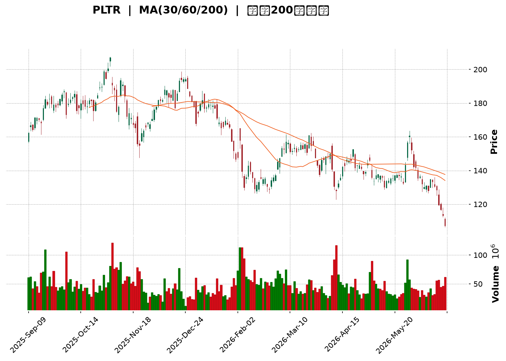
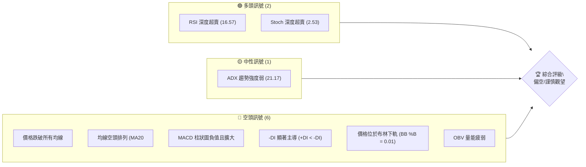
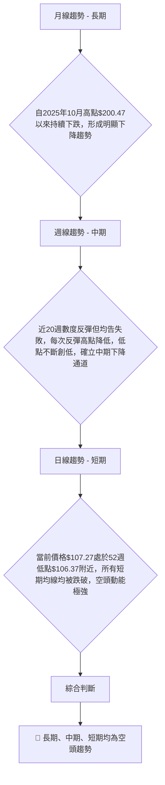
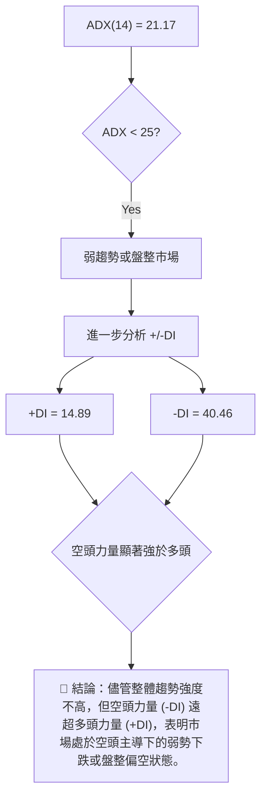
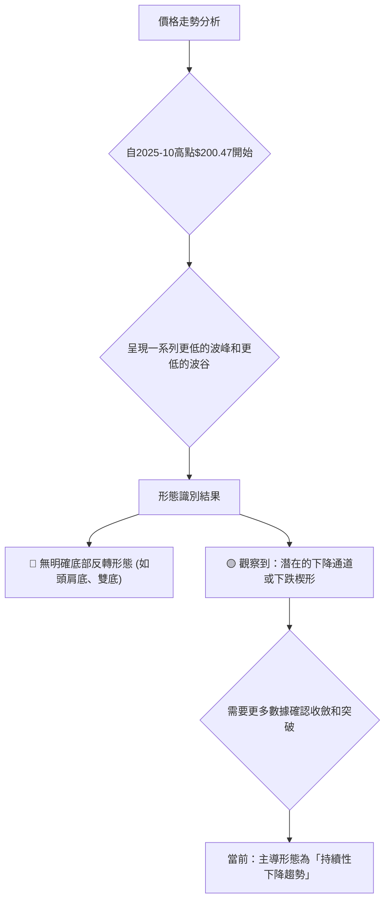
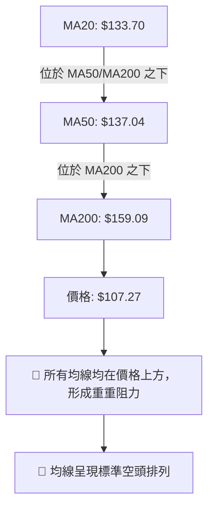
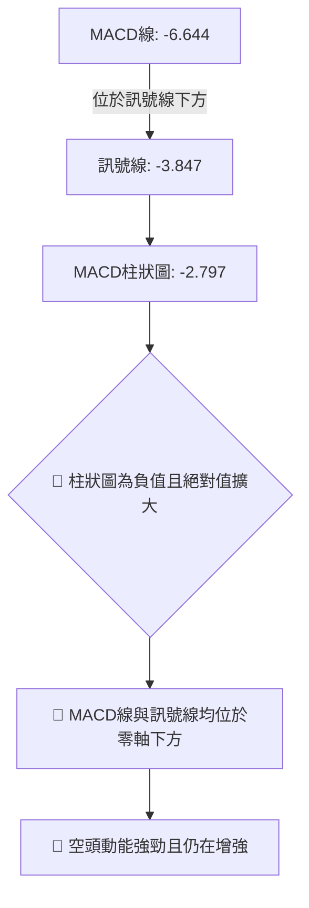
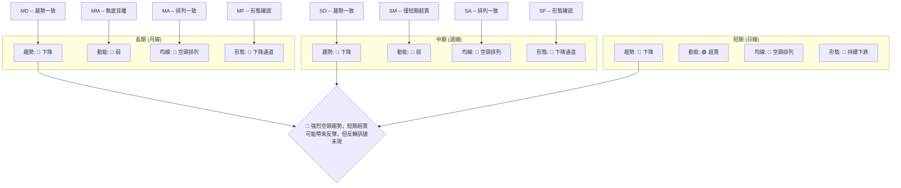

<details>
<summary>📊 靜態圖表 (點擊展開)</summary>

</details>

<html>
<head><meta charset="utf-8" /></head>
<body>
    <div style="height:500px; width:100%;">                        <script>window.PlotlyConfig = {MathJaxConfig: 'local'};</script>
        <script charset="utf-8" src="https://cdn.plot.ly/plotly-3.6.0.min.js" integrity="sha256-QaOVwtVY0T02VaHrr6pnoHLCwayMJp4O5n4YyaE3rJk=" crossorigin="anonymous"></script>                <div id="candlestick-chart" class="plotly-graph-div" style="height:100%; width:100%;"></div>            <script>                window.PLOTLYENV=window.PLOTLYENV || {};                                if (document.getElementById("candlestick-chart")) {                    Plotly.newPlot(                        "candlestick-chart",                        [{"close":{"dtype":"f8","bdata":"AAAAIIVLZEAAAAAgrtdkQAAAACCFi2RAAAAAgMJtZUAAAABguGZlQAAAAOBRSGVAAAAAYI8KZUAAAABACh9mQAAAAOB6zGZAAAAAYI9qZkAAAACgmdFmQAAAAIDrcWZAAAAAANdjZkAAAACAPTJmQAAAACCFW2ZAAAAAoHDNZkAAAABgZh5nQAAAAKCZYWdAAAAAgD2iZUAAAADA9XBmQAAAAKBwxWZAAAAAgOvxZkAAAABACi9nQAAAAIAU7mVAAAAAYLgmZkAAAAAgrndmQAAAAADXc2ZAAAAAANdDZkAAAADAzERmQAAAAEDhsmZAAAAA4FGwZkAAAAAgru9lQAAAACBcj2ZAAAAAACkUZ0AAAACAwqVnQAAAAEAzs2dAAAAAgOvZaEAAAACgmVFoQAAAAEAKD2lAAAAAgMLlaUAAAAAgrtdnQAAAAMDMfGdAAAAAoJnhZUAAAACAwj1mQAAAACCFM2hAAAAAYLjeZ0AAAACgcAVnQAAAAOB6hGVAAAAA4FHAZUAAAAAAAGhlQAAAAGCP6mRAAAAAoHCtZEAAAAAA13djQAAAAEAzW2NAAAAAAABIZEAAAACgmXFkQAAAAOCjuGRAAAAAYGYOZUAAAAAgru9kQAAAAIAUVmVAAAAAYI8CZkAAAACgcD1mQAAAAOBRuGZAAAAAIK6vZkAAAABA4bpmQAAAAMAefWdAAAAAoEdxZ0AAAACAPfJmQAAAAAAA6GZAAAAAAAB4Z0AAAACgRylmQAAAAIAUNmdAAAAAACksaEAAAAAgXD9oQAAAAAApRGhAAAAAoHBFaEAAAABguJZnQAAAAIDCBWdAAAAAQOGaZkAAAAAAADhmQAAAACCF+2RAAAAAoEfBZUAAAABguHZmQAAAAIDCtWZAAAAAIIUbZkAAAAAgri9mQAAAAMAebWZAAAAAYLheZkAAAADAzExmQAAAAIA9ImZAAAAAYLheZUAAAADA9RBlQAAAAGCPqmRAAAAAwMy8ZEAAAABAMzNlQAAAAEAK72RAAAAAYGa2ZEAAAABAM6tjQAAAACCF+2JAAAAAQOFSYkAAAADgUXhiQAAAAAApvGNAAAAAoEdxYUAAAADgUUBgQAAAAMDM\u002fGBAAAAAwB7dYUAAAADgUXBhQAAAAIDC9WBAAAAAACkkYEAAAADAHm1gQAAAAOCjoGBAAAAAACnsYEAAAADgetxgQAAAACCu52BAAAAAQDNTYEAAAABA4RpgQAAAAIAUxmBAAAAAgBT+YEAAAACAFCZhQAAAAKBwJWJAAAAAQApnYkAAAACAFCZjQAAAAKBwFWNAAAAAwB6lY0AAAACAwo1jQAAAAOB65GJAAAAAQDPzYkAAAAAAADBjQAAAAGBm3mJAAAAAQAoXY0AAAABgj2JjQAAAAOCjGGNAAAAAgMJ1Y0AAAACAwtViQAAAAEDhGmRAAAAAwPVYY0AAAABguF5jQAAAAIDrcWJAAAAAgOvhYUAAAACgmTFhQAAAAMD1SGJAAAAAIK5PYkAAAABguI5iQAAAAIDCfWJAAAAAgD3CYkAAAADgUZhhQAAAACCuT2BAAAAAgOsBYEAAAAAA14tgQAAAAGBm9mBAAAAAwMzEYUAAAADgUdhhQAAAAOB6TGJAAAAA4Ho8YkAAAABACj9iQAAAAADXE2NAAAAAgD2yYUAAAABA4eJhQAAAAEAz42FAAAAAgMKlYUAAAABACj9hQAAAACCFY2FAAAAAgD0CYkAAAADA9UBiQAAAAMAe\u002fWBAAAAAoEe5YEAAAACgmSFhQAAAAKCZOWFAAAAA4HocYUAAAAAAAABhQAAAAKCZQWBAAAAAIFy3YEAAAAAgrr9gQAAAAOB65GBAAAAA4FHoYEAAAADAzCRhQAAAAKBHLWFAAAAAACkcYUAAAABAMxNhQAAAAOBRkGBAAAAAQOHqYUAAAACgR5FjQAAAAMDMFGRAAAAAoHAFY0AAAABgZsZhQAAAAGBmtmFAAAAAwPXwYEAAAABACg9hQAAAAIA9gmBAAAAAYLhGYEAAAABgj2JgQAAAACBc\u002f19AAAAAYLjWYEAAAAAAAKhgQAAAAAApVGBAAAAAQAoPYEAAAAAAAOBdQAAAAMDMLF1AAAAAAABgXEAAAACgR9FaQA=="},"high":{"dtype":"f8","bdata":"AAAAAABYZEAAAAAAACBlQAAAAOCn7mRAAAAAwPVwZUAAAACgmXllQAAAAIDraWVAAAAAgMI1ZUAAAACgmVlmQAAAAKBwDWdAAAAAAADIZkAAAAAAADhnQAAAAEAzG2dAAAAAgD0KZ0AAAAAA14NmQAAAACBcr2ZAAAAA4KPYZkAAAADA9UhnQAAAAGBmhmdAAAAAQOFaZ0AAAABgZt5mQAAAAIDCRWdAAAAA4FEIZ0AAAAAA13NnQAAAAEAzY2dAAAAAQApnZkAAAABA4cpmQAAAAEAzC2dAAAAAgD0aZ0AAAABA4bJmQAAAAEDh4mZAAAAAwHLMZkAAAABguMZmQAAAAIDrsWZAAAAAoHBFZ0AAAABgjxpoQAAAAMD1+GdAAAAAQDP7aEAAAACgcPVoQAAAAIDChWlAAAAA4KPwaUAAAABgZnZoQAAAAIA9ymdAAAAAQOHiZ0AAAABgZlZmQAAAAIDCXWhAAAAAoJkdaEAAAABgj9JnQAAAAGBm1mZAAAAAoEcpZkAAAAAgrsdlQAAAAGCPmmVAAAAAQDMzZUAAAACAPdJlQAAAACCFw2NAAAAAoHClZEAAAADAzJRkQAAAACDZCmVAAAAAoJkZZUAAAABAMyNlQAAAAAAA+GVAAAAAwB49ZkAAAACAFE5mQAAAAGDlxGZAAAAAACn8ZkAAAABAM9tmQAAAAOB6zGdAAAAAoJmBZ0AAAADAzFBnQAAAAMD1eGdAAAAAAACQZ0AAAAAAAHhnQAAAAGCPamdAAAAAAABgaEAAAAAAKdxoQAAAAADXa2hAAAAAoHBlaEAAAABAM4toQAAAAGBmZmdAAAAAAFQXZ0AAAADA9bBmQAAAAEAzq2ZAAAAAgD36ZUAAAACAFIZmQAAAAMD1aGdAAAAAwB41Z0AAAABACldmQAAAAAAA0GZAAAAAQDOjZkAAAADgIrNmQAAAAEAzk2ZAAAAAgMLNZkAAAABACn9lQAAAACCuL2VAAAAAAAAgZUAAAAAAAIBlQAAAAEDhUmVAAAAAgBQuZUAAAACgcKFkQAAAAAAptGNAAAAAAADgYkAAAADAzOxiQAAAAAB\u002fomRAAAAAQDN7Y0AAAAAgXD9hQAAAAOD7NWFAAAAAANc7YkAAAACA6zFiQAAAAAAAaGFAAAAA4Hr8YEAAAACA67FgQAAAAIA9ymBAAAAA4NCeYUAAAADAHgVhQAAAAGC4BmFAAAAAoEeBYEAAAAAgrkdgQAAAAEDhAmFAAAAA4FEwYUAAAABAM0NhQAAAAOB6ZGJAAAAAAABwYkAAAADgo1BjQAAAAAApjGNAAAAAYGYuZEAAAACAFM5jQAAAACAGlWNAAAAAgGglY0AAAAAAKXxjQAAAAIDrUWNAAAAAIIU7Y0AAAAAAAJhjQAAAAIAUlmNAAAAAwMyEY0AAAADAzJRjQAAAAGCPImRAAAAAwMxMZEAAAADgowhkQAAAAADXI2NAAAAAYLg+YkAAAAAA1wNiQAAAACCFe2JAAAAAoJmJYkAAAADgUZBiQAAAACCF02JAAAAA4KPIYkAAAADA9YhjQAAAAKBHcWFAAAAAYGYmYEAAAACgcM1gQAAAAIA9QmFAAAAAYI\u002fSYUAAAACgmTFiQAAAAMD1iGJAAAAAYGZmYkAAAAAA17tiQAAAAIDCFWNAAAAAoEfJYkAAAABgj+phQAAAAIA9ImJAAAAAQDP7YUAAAADgUXhhQAAAAGBmhmFAAAAAgBROYkAAAADgerRiQAAAACBc32FAAAAAYGb2YEAAAABgZp5hQAAAAAApPGFAAAAA4HokYUAAAACAwi1hQAAAACCuH2FAAAAAIFzPYEAAAADgevRgQAAAAIDr\u002fWBAAAAAQAovYUAAAAAgridhQAAAAKCZUWFAAAAA4KNgYUAAAACAwlVhQAAAACBc92BAAAAAAAAgYkAAAACg7bhjQAAAAGBmdmRAAAAAoJnxY0AAAACAwvViQAAAAADXS2JAAAAAQAq\u002fYUAAAADgUThhQAAAACCuH2FAAAAAgOulYEAAAADgo3BgQAAAAEDhYmBAAAAAIFzfYEAAAABA4dJgQAAAAEAzA2FAAAAAgMJtYEAAAAAA1xtgQAAAAAApPF5AAAAAAACAXUAAAACgmQlcQA=="},"hovertemplate":"\u003cb\u003e%{x|%Y-%m-%d}\u003c\u002fb\u003e\u003cbr\u003e\u958b: $%{open:.2f}\u003cbr\u003e\u9ad8: $%{high:.2f}\u003cbr\u003e\u4f4e: $%{low:.2f}\u003cbr\u003e\u6536: $%{close:.2f}\u003cextra\u003e\u003c\u002fextra\u003e","low":{"dtype":"f8","bdata":"AAAAANeLY0AAAACAFG5kQAAAAEAKZ2RAAAAA4FGAZEAAAADAHu1kQAAAAGC4HmVAAAAA4KMoZEAAAADgeixlQAAAAGC4FmZAAAAAoEdJZkAAAADgUSBmQAAAAADXI2ZAAAAAoEfJZUAAAADAHt1lQAAAAMAeJWZAAAAAQApHZkAAAAAAAHBmQAAAAGBm3mZAAAAA4KNYZUAAAABgjzpmQAAAAKBwbWZAAAAAYGamZkAAAABgZn5mQAAAAMD1sGVAAAAAYGauZUAAAACAPVplQAAAAOCjAGZAAAAAYGYOZkAAAABgZr5lQAAAAIAULmZAAAAAwMxUZkAAAACgcC1lQAAAAOBR4GVAAAAAQDPbZkAAAADgo3BnQAAAAMD1WGdAAAAAIK7PZ0AAAAAA10NoQAAAAKBwvWhAAAAAgD06aUAAAACA6zFnQAAAAGC4pmZAAAAAwPXQZUAAAADAHh1lQAAAAOCj8GZAAAAAAClkZ0AAAADAzIxmQAAAAGBkV2VAAAAAAACQZEAAAACAwvVkQAAAAAAAsGRAAAAAoHBNZEAAAADgo0xjQAAAAIDrcWJAAAAAAACgY0AAAACAwpFjQAAAAAApfGRAAAAAAAC8ZEAAAAAA12NkQAAAAEDhMmVAAAAAYI8aZUAAAACAws1lQAAAAMAeJWZAAAAAoEdxZkAAAAAAKYxmQAAAAAAA2GZAAAAAYLiGZkAAAAAgWDVmQAAAAMD1gGZAAAAAQIukZkAAAAAAABBmQAAAAOBRsGZAAAAAIFxXZ0AAAACAwg1oQAAAACCF92dAAAAAYI8aaEAAAAAA15NnQAAAAOB69GZAAAAAYGaWZkAAAAAAAChmQAAAAEAzy2RAAAAAoEd5ZUAAAADgo9hlQAAAAMAeNWZAAAAAANfLZUAAAAAAANhlQAAAAEDhCmZAAAAA4HoEZkAAAABgZr5lQAAAAMD1EGZAAAAA4FFAZUAAAAAgrsdkQAAAACCFI2RAAAAAYGaeZEAAAACgmclkQAAAAGBm6mRAAAAAgBSWZEAAAAAgrqdjQAAAAADXY2JAAAAAwHIkYkAAAACg7VRiQAAAAADXI2NAAAAAgML1YEAAAACAPQpgQAAAAEAzi2BAAAAAANXYYEAAAADgozhhQAAAAGBmnmBAAAAAANejX0AAAACA6Y5fQAAAAGCP0l9AAAAAANfbYEAAAADgUWBgQAAAAKBwZWBAAAAAwPXYX0AAAAAgrpdfQAAAAIDCJWBAAAAAACmUYEAAAAAgXL9gQAAAAOCjkGFAAAAAYGZGYUAAAACA64FiQAAAACCFs2JAAAAAoEfJYkAAAABACh9jQAAAAOB6xGJAAAAAYI+qYkAAAAAgXN9iQAAAAGCPkmJAAAAAoHDlYkAAAAAA1wNjQAAAACCFE2NAAAAAAADQYkAAAABA4aJiQAAAACCuJ2NAAAAA4Hr0YkAAAAAgXFtjQAAAAAAAaGJAAAAAgOuxYUAAAACgmQlhQAAAAEAKX2FAAAAAQAoPYkAAAAAgrj9hQAAAACAxVGJAAAAAYGYOYkAAAACgcGVhQAAAAEAKD2BAAAAAIIWrXkAAAADAzCRgQAAAAAAAwGBAAAAAgMLdYEAAAADA9XBhQAAAAKCZ6WFAAAAAYI\u002f6YUAAAADA9\u002f9hQAAAAMAebWJAAAAAoHB9YUAAAACAwl1hQAAAAOBRoGFAAAAAoHCNYUAAAACAwtVgQAAAAMDMFGFAAAAA4HqsYUAAAABAMydiQAAAAEAK12BAAAAAwMxkYEAAAADA9dhgQAAAAOCjoGBAAAAAAKyYYEAAAABguK5gQAAAAAAAGGBAAAAAYGYuYEAAAACgR4lgQAAAAGCPamBAAAAAQDOzYEAAAACgcI1gQAAAAKBw7WBAAAAAoJnJYEAAAACgmalgQAAAAAApdGBAAAAAAACgYEAAAACgRzliQAAAAAApfGNAAAAAoJm5YkAAAAAAAKhhQAAAAEC0iGFAAAAAwMzAYEAAAADA9ehgQAAAAGBm1l9AAAAAoJkZYEAAAABA4cpfQAAAAKCZqV9AAAAAYGY2YEAAAAAA1zNgQAAAAKBwPWBAAAAA4KNAX0AAAADAzMxdQAAAACCFC11AAAAAAAAQXEAAAAAgrpdaQA=="},"name":"\u50f9\u683c","open":{"dtype":"f8","bdata":"AAAAAACoY0AAAAAAAMBkQAAAACCu52RAAAAAQDOrZEAAAABAMzNlQAAAAKBHYWVAAAAA4KMgZUAAAADgo0hlQAAAAIA9ImZAAAAAACmcZkAAAADgUdBmQAAAAMAe\u002fWZAAAAAoJn5ZUAAAACgmWFmQAAAAOB6dGZAAAAAIFxfZkAAAACAPapmQAAAAGBmVmdAAAAAwMxMZ0AAAACAwmVmQAAAAIDriWZAAAAAoJnZZkAAAABgj\u002fJmQAAAAKBwJWdAAAAAgMJVZkAAAAAAAABmQAAAAMD1tGZAAAAAwPW4ZkAAAAAAADhmQAAAACCub2ZAAAAAgOvBZkAAAACAwr1mQAAAAIA97mVAAAAAACncZkAAAABACp9nQAAAACBcr2dAAAAAYI\u002fiZ0AAAACgmc1oQAAAAGBm5mhAAAAAoHChaUAAAACAPQJoQAAAAAAAoGdAAAAAIK5\u002fZ0AAAADAzKRlQAAAAIDrCWdAAAAAYLjKZ0AAAABgj9JnQAAAAEDhtmZAAAAAQDPfZEAAAADA9VBlQAAAAADXC2VAAAAAoJn5ZEAAAACAPYJlQAAAAOBRgGNAAAAAQAqvY0AAAACAPQJkQAAAAEAz22RAAAAA4FH4ZEAAAAAAAKBkQAAAAEDhMmVAAAAA4HpEZUAAAAAgrgtmQAAAACBcR2ZAAAAAYLjGZkAAAABACp9mQAAAAGBmHmdAAAAAoJkZZ0AAAACA6zlnQAAAAGCPImdAAAAAwPW0ZkAAAABA4XZnQAAAAOBRsGZAAAAAIK5XZ0AAAACgR2FoQAAAAGBmGmhAAAAAwB4laEAAAADgemBoQAAAAEAzW2dAAAAAQDMLZ0AAAAAAKaRmQAAAAKCZqWZAAAAAACncZUAAAADgUfhlQAAAAKCZeWZAAAAAIK4zZ0AAAADgoyBmQAAAAIDrNWZAAAAAAABcZkAAAAAAAERmQAAAAGC4VmZAAAAAIIVrZkAAAAAAAPRkQAAAACDdDGVAAAAAoJkdZUAAAADgo+hkQAAAAGC4BmVAAAAAIFzvZEAAAADAzIxkQAAAAAAptGNAAAAAoJnBYkAAAACAFN5iQAAAAKCZoWRAAAAAwB5tY0AAAACAPRphQAAAAGCP6mBAAAAAYI8SYUAAAABA4R5iQAAAAMDMYGFAAAAAIIXrYEAAAACgmflfQAAAAOCjHGBAAAAA4Hr8YEAAAACA64lgQAAAACCui2BAAAAAoEeBYEAAAAAAKSBgQAAAACCFU2BAAAAAQAq7YEAAAACAPcJgQAAAAMDMmGFAAAAAQDPDYUAAAACAwo1iQAAAAIAUHmNAAAAAgBTOYkAAAACAFHZjQAAAACCuf2NAAAAAACnsYkAAAADgUSBjQAAAAKCZKWNAAAAAYGYOY0AAAADA9QxjQAAAAIA9XmNAAAAAQDMjY0AAAABgZmZjQAAAACCuJ2NAAAAAgD0CZEAAAACgcK1jQAAAAIDCIWNAAAAAACk8YkAAAADgo+hhQAAAAOCjgGFAAAAAAABgYkAAAAAghe9hQAAAACCFi2JAAAAAYDlcYkAAAADgelhjQAAAAOCjbGFAAAAAIFwPYEAAAAAgXEdgQAAAAACqzWBAAAAAoEcZYUAAAACgRwliQAAAAIAUKmJAAAAAAAAgYkAAAACA61liQAAAACCFi2JAAAAAYGa2YkAAAABguN5hQAAAAAAAqGFAAAAAoJnJYUAAAADgUXhhQAAAAEAzT2FAAAAAAADoYUAAAAAAAHhiQAAAAKBwiWFAAAAAYLi2YEAAAABAM+NgQAAAACCu+2BAAAAAwB7dYEAAAABAMxNhQAAAACAxwGBAAAAAwMw0YEAAAACgmZlgQAAAAAAAkGBAAAAAoHDlYEAAAADgo8RgQAAAAKCZ+WBAAAAAoJktYUAAAADAHgVhQAAAAKCZqWBAAAAAwB6lYEAAAABgZnpiQAAAACBc\u002f2NAAAAAgBSWY0AAAABgZrZiQAAAAGC4LmJAAAAAYGaKYUAAAACAwvVgQAAAAADX22BAAAAAYGYqYEAAAADA9RhgQAAAAKBHXWBAAAAA4KNAYEAAAABA4dJgQAAAAOBReGBAAAAAQOFaYEAAAAAgXG9fQAAAAKCZCV5AAAAAIK6HXEAAAADgUdhbQA=="},"x":["2025-09-09T00:00:00-04:00","2025-09-10T00:00:00-04:00","2025-09-11T00:00:00-04:00","2025-09-12T00:00:00-04:00","2025-09-15T00:00:00-04:00","2025-09-16T00:00:00-04:00","2025-09-17T00:00:00-04:00","2025-09-18T00:00:00-04:00","2025-09-19T00:00:00-04:00","2025-09-22T00:00:00-04:00","2025-09-23T00:00:00-04:00","2025-09-24T00:00:00-04:00","2025-09-25T00:00:00-04:00","2025-09-26T00:00:00-04:00","2025-09-29T00:00:00-04:00","2025-09-30T00:00:00-04:00","2025-10-01T00:00:00-04:00","2025-10-02T00:00:00-04:00","2025-10-03T00:00:00-04:00","2025-10-06T00:00:00-04:00","2025-10-07T00:00:00-04:00","2025-10-08T00:00:00-04:00","2025-10-09T00:00:00-04:00","2025-10-10T00:00:00-04:00","2025-10-13T00:00:00-04:00","2025-10-14T00:00:00-04:00","2025-10-15T00:00:00-04:00","2025-10-16T00:00:00-04:00","2025-10-17T00:00:00-04:00","2025-10-20T00:00:00-04:00","2025-10-21T00:00:00-04:00","2025-10-22T00:00:00-04:00","2025-10-23T00:00:00-04:00","2025-10-24T00:00:00-04:00","2025-10-27T00:00:00-04:00","2025-10-28T00:00:00-04:00","2025-10-29T00:00:00-04:00","2025-10-30T00:00:00-04:00","2025-10-31T00:00:00-04:00","2025-11-03T00:00:00-05:00","2025-11-04T00:00:00-05:00","2025-11-05T00:00:00-05:00","2025-11-06T00:00:00-05:00","2025-11-07T00:00:00-05:00","2025-11-10T00:00:00-05:00","2025-11-11T00:00:00-05:00","2025-11-12T00:00:00-05:00","2025-11-13T00:00:00-05:00","2025-11-14T00:00:00-05:00","2025-11-17T00:00:00-05:00","2025-11-18T00:00:00-05:00","2025-11-19T00:00:00-05:00","2025-11-20T00:00:00-05:00","2025-11-21T00:00:00-05:00","2025-11-24T00:00:00-05:00","2025-11-25T00:00:00-05:00","2025-11-26T00:00:00-05:00","2025-11-28T00:00:00-05:00","2025-12-01T00:00:00-05:00","2025-12-02T00:00:00-05:00","2025-12-03T00:00:00-05:00","2025-12-04T00:00:00-05:00","2025-12-05T00:00:00-05:00","2025-12-08T00:00:00-05:00","2025-12-09T00:00:00-05:00","2025-12-10T00:00:00-05:00","2025-12-11T00:00:00-05:00","2025-12-12T00:00:00-05:00","2025-12-15T00:00:00-05:00","2025-12-16T00:00:00-05:00","2025-12-17T00:00:00-05:00","2025-12-18T00:00:00-05:00","2025-12-19T00:00:00-05:00","2025-12-22T00:00:00-05:00","2025-12-23T00:00:00-05:00","2025-12-24T00:00:00-05:00","2025-12-26T00:00:00-05:00","2025-12-29T00:00:00-05:00","2025-12-30T00:00:00-05:00","2025-12-31T00:00:00-05:00","2026-01-02T00:00:00-05:00","2026-01-05T00:00:00-05:00","2026-01-06T00:00:00-05:00","2026-01-07T00:00:00-05:00","2026-01-08T00:00:00-05:00","2026-01-09T00:00:00-05:00","2026-01-12T00:00:00-05:00","2026-01-13T00:00:00-05:00","2026-01-14T00:00:00-05:00","2026-01-15T00:00:00-05:00","2026-01-16T00:00:00-05:00","2026-01-20T00:00:00-05:00","2026-01-21T00:00:00-05:00","2026-01-22T00:00:00-05:00","2026-01-23T00:00:00-05:00","2026-01-26T00:00:00-05:00","2026-01-27T00:00:00-05:00","2026-01-28T00:00:00-05:00","2026-01-29T00:00:00-05:00","2026-01-30T00:00:00-05:00","2026-02-02T00:00:00-05:00","2026-02-03T00:00:00-05:00","2026-02-04T00:00:00-05:00","2026-02-05T00:00:00-05:00","2026-02-06T00:00:00-05:00","2026-02-09T00:00:00-05:00","2026-02-10T00:00:00-05:00","2026-02-11T00:00:00-05:00","2026-02-12T00:00:00-05:00","2026-02-13T00:00:00-05:00","2026-02-17T00:00:00-05:00","2026-02-18T00:00:00-05:00","2026-02-19T00:00:00-05:00","2026-02-20T00:00:00-05:00","2026-02-23T00:00:00-05:00","2026-02-24T00:00:00-05:00","2026-02-25T00:00:00-05:00","2026-02-26T00:00:00-05:00","2026-02-27T00:00:00-05:00","2026-03-02T00:00:00-05:00","2026-03-03T00:00:00-05:00","2026-03-04T00:00:00-05:00","2026-03-05T00:00:00-05:00","2026-03-06T00:00:00-05:00","2026-03-09T00:00:00-04:00","2026-03-10T00:00:00-04:00","2026-03-11T00:00:00-04:00","2026-03-12T00:00:00-04:00","2026-03-13T00:00:00-04:00","2026-03-16T00:00:00-04:00","2026-03-17T00:00:00-04:00","2026-03-18T00:00:00-04:00","2026-03-19T00:00:00-04:00","2026-03-20T00:00:00-04:00","2026-03-23T00:00:00-04:00","2026-03-24T00:00:00-04:00","2026-03-25T00:00:00-04:00","2026-03-26T00:00:00-04:00","2026-03-27T00:00:00-04:00","2026-03-30T00:00:00-04:00","2026-03-31T00:00:00-04:00","2026-04-01T00:00:00-04:00","2026-04-02T00:00:00-04:00","2026-04-06T00:00:00-04:00","2026-04-07T00:00:00-04:00","2026-04-08T00:00:00-04:00","2026-04-09T00:00:00-04:00","2026-04-10T00:00:00-04:00","2026-04-13T00:00:00-04:00","2026-04-14T00:00:00-04:00","2026-04-15T00:00:00-04:00","2026-04-16T00:00:00-04:00","2026-04-17T00:00:00-04:00","2026-04-20T00:00:00-04:00","2026-04-21T00:00:00-04:00","2026-04-22T00:00:00-04:00","2026-04-23T00:00:00-04:00","2026-04-24T00:00:00-04:00","2026-04-27T00:00:00-04:00","2026-04-28T00:00:00-04:00","2026-04-29T00:00:00-04:00","2026-04-30T00:00:00-04:00","2026-05-01T00:00:00-04:00","2026-05-04T00:00:00-04:00","2026-05-05T00:00:00-04:00","2026-05-06T00:00:00-04:00","2026-05-07T00:00:00-04:00","2026-05-08T00:00:00-04:00","2026-05-11T00:00:00-04:00","2026-05-12T00:00:00-04:00","2026-05-13T00:00:00-04:00","2026-05-14T00:00:00-04:00","2026-05-15T00:00:00-04:00","2026-05-18T00:00:00-04:00","2026-05-19T00:00:00-04:00","2026-05-20T00:00:00-04:00","2026-05-21T00:00:00-04:00","2026-05-22T00:00:00-04:00","2026-05-26T00:00:00-04:00","2026-05-27T00:00:00-04:00","2026-05-28T00:00:00-04:00","2026-05-29T00:00:00-04:00","2026-06-01T00:00:00-04:00","2026-06-02T00:00:00-04:00","2026-06-03T00:00:00-04:00","2026-06-04T00:00:00-04:00","2026-06-05T00:00:00-04:00","2026-06-08T00:00:00-04:00","2026-06-09T00:00:00-04:00","2026-06-10T00:00:00-04:00","2026-06-11T00:00:00-04:00","2026-06-12T00:00:00-04:00","2026-06-15T00:00:00-04:00","2026-06-16T00:00:00-04:00","2026-06-17T00:00:00-04:00","2026-06-18T00:00:00-04:00","2026-06-22T00:00:00-04:00","2026-06-23T00:00:00-04:00","2026-06-24T00:00:00-04:00","2026-06-25T00:00:00-04:00"],"type":"candlestick"},{"hovertemplate":"MA30: $%{y:.2f}\u003cextra\u003e\u003c\u002fextra\u003e","line":{"color":"#2196F3","dash":"dash","width":2},"mode":"lines","name":"MA30","x":["2025-09-09T00:00:00-04:00","2025-09-10T00:00:00-04:00","2025-09-11T00:00:00-04:00","2025-09-12T00:00:00-04:00","2025-09-15T00:00:00-04:00","2025-09-16T00:00:00-04:00","2025-09-17T00:00:00-04:00","2025-09-18T00:00:00-04:00","2025-09-19T00:00:00-04:00","2025-09-22T00:00:00-04:00","2025-09-23T00:00:00-04:00","2025-09-24T00:00:00-04:00","2025-09-25T00:00:00-04:00","2025-09-26T00:00:00-04:00","2025-09-29T00:00:00-04:00","2025-09-30T00:00:00-04:00","2025-10-01T00:00:00-04:00","2025-10-02T00:00:00-04:00","2025-10-03T00:00:00-04:00","2025-10-06T00:00:00-04:00","2025-10-07T00:00:00-04:00","2025-10-08T00:00:00-04:00","2025-10-09T00:00:00-04:00","2025-10-10T00:00:00-04:00","2025-10-13T00:00:00-04:00","2025-10-14T00:00:00-04:00","2025-10-15T00:00:00-04:00","2025-10-16T00:00:00-04:00","2025-10-17T00:00:00-04:00","2025-10-20T00:00:00-04:00","2025-10-21T00:00:00-04:00","2025-10-22T00:00:00-04:00","2025-10-23T00:00:00-04:00","2025-10-24T00:00:00-04:00","2025-10-27T00:00:00-04:00","2025-10-28T00:00:00-04:00","2025-10-29T00:00:00-04:00","2025-10-30T00:00:00-04:00","2025-10-31T00:00:00-04:00","2025-11-03T00:00:00-05:00","2025-11-04T00:00:00-05:00","2025-11-05T00:00:00-05:00","2025-11-06T00:00:00-05:00","2025-11-07T00:00:00-05:00","2025-11-10T00:00:00-05:00","2025-11-11T00:00:00-05:00","2025-11-12T00:00:00-05:00","2025-11-13T00:00:00-05:00","2025-11-14T00:00:00-05:00","2025-11-17T00:00:00-05:00","2025-11-18T00:00:00-05:00","2025-11-19T00:00:00-05:00","2025-11-20T00:00:00-05:00","2025-11-21T00:00:00-05:00","2025-11-24T00:00:00-05:00","2025-11-25T00:00:00-05:00","2025-11-26T00:00:00-05:00","2025-11-28T00:00:00-05:00","2025-12-01T00:00:00-05:00","2025-12-02T00:00:00-05:00","2025-12-03T00:00:00-05:00","2025-12-04T00:00:00-05:00","2025-12-05T00:00:00-05:00","2025-12-08T00:00:00-05:00","2025-12-09T00:00:00-05:00","2025-12-10T00:00:00-05:00","2025-12-11T00:00:00-05:00","2025-12-12T00:00:00-05:00","2025-12-15T00:00:00-05:00","2025-12-16T00:00:00-05:00","2025-12-17T00:00:00-05:00","2025-12-18T00:00:00-05:00","2025-12-19T00:00:00-05:00","2025-12-22T00:00:00-05:00","2025-12-23T00:00:00-05:00","2025-12-24T00:00:00-05:00","2025-12-26T00:00:00-05:00","2025-12-29T00:00:00-05:00","2025-12-30T00:00:00-05:00","2025-12-31T00:00:00-05:00","2026-01-02T00:00:00-05:00","2026-01-05T00:00:00-05:00","2026-01-06T00:00:00-05:00","2026-01-07T00:00:00-05:00","2026-01-08T00:00:00-05:00","2026-01-09T00:00:00-05:00","2026-01-12T00:00:00-05:00","2026-01-13T00:00:00-05:00","2026-01-14T00:00:00-05:00","2026-01-15T00:00:00-05:00","2026-01-16T00:00:00-05:00","2026-01-20T00:00:00-05:00","2026-01-21T00:00:00-05:00","2026-01-22T00:00:00-05:00","2026-01-23T00:00:00-05:00","2026-01-26T00:00:00-05:00","2026-01-27T00:00:00-05:00","2026-01-28T00:00:00-05:00","2026-01-29T00:00:00-05:00","2026-01-30T00:00:00-05:00","2026-02-02T00:00:00-05:00","2026-02-03T00:00:00-05:00","2026-02-04T00:00:00-05:00","2026-02-05T00:00:00-05:00","2026-02-06T00:00:00-05:00","2026-02-09T00:00:00-05:00","2026-02-10T00:00:00-05:00","2026-02-11T00:00:00-05:00","2026-02-12T00:00:00-05:00","2026-02-13T00:00:00-05:00","2026-02-17T00:00:00-05:00","2026-02-18T00:00:00-05:00","2026-02-19T00:00:00-05:00","2026-02-20T00:00:00-05:00","2026-02-23T00:00:00-05:00","2026-02-24T00:00:00-05:00","2026-02-25T00:00:00-05:00","2026-02-26T00:00:00-05:00","2026-02-27T00:00:00-05:00","2026-03-02T00:00:00-05:00","2026-03-03T00:00:00-05:00","2026-03-04T00:00:00-05:00","2026-03-05T00:00:00-05:00","2026-03-06T00:00:00-05:00","2026-03-09T00:00:00-04:00","2026-03-10T00:00:00-04:00","2026-03-11T00:00:00-04:00","2026-03-12T00:00:00-04:00","2026-03-13T00:00:00-04:00","2026-03-16T00:00:00-04:00","2026-03-17T00:00:00-04:00","2026-03-18T00:00:00-04:00","2026-03-19T00:00:00-04:00","2026-03-20T00:00:00-04:00","2026-03-23T00:00:00-04:00","2026-03-24T00:00:00-04:00","2026-03-25T00:00:00-04:00","2026-03-26T00:00:00-04:00","2026-03-27T00:00:00-04:00","2026-03-30T00:00:00-04:00","2026-03-31T00:00:00-04:00","2026-04-01T00:00:00-04:00","2026-04-02T00:00:00-04:00","2026-04-06T00:00:00-04:00","2026-04-07T00:00:00-04:00","2026-04-08T00:00:00-04:00","2026-04-09T00:00:00-04:00","2026-04-10T00:00:00-04:00","2026-04-13T00:00:00-04:00","2026-04-14T00:00:00-04:00","2026-04-15T00:00:00-04:00","2026-04-16T00:00:00-04:00","2026-04-17T00:00:00-04:00","2026-04-20T00:00:00-04:00","2026-04-21T00:00:00-04:00","2026-04-22T00:00:00-04:00","2026-04-23T00:00:00-04:00","2026-04-24T00:00:00-04:00","2026-04-27T00:00:00-04:00","2026-04-28T00:00:00-04:00","2026-04-29T00:00:00-04:00","2026-04-30T00:00:00-04:00","2026-05-01T00:00:00-04:00","2026-05-04T00:00:00-04:00","2026-05-05T00:00:00-04:00","2026-05-06T00:00:00-04:00","2026-05-07T00:00:00-04:00","2026-05-08T00:00:00-04:00","2026-05-11T00:00:00-04:00","2026-05-12T00:00:00-04:00","2026-05-13T00:00:00-04:00","2026-05-14T00:00:00-04:00","2026-05-15T00:00:00-04:00","2026-05-18T00:00:00-04:00","2026-05-19T00:00:00-04:00","2026-05-20T00:00:00-04:00","2026-05-21T00:00:00-04:00","2026-05-22T00:00:00-04:00","2026-05-26T00:00:00-04:00","2026-05-27T00:00:00-04:00","2026-05-28T00:00:00-04:00","2026-05-29T00:00:00-04:00","2026-06-01T00:00:00-04:00","2026-06-02T00:00:00-04:00","2026-06-03T00:00:00-04:00","2026-06-04T00:00:00-04:00","2026-06-05T00:00:00-04:00","2026-06-08T00:00:00-04:00","2026-06-09T00:00:00-04:00","2026-06-10T00:00:00-04:00","2026-06-11T00:00:00-04:00","2026-06-12T00:00:00-04:00","2026-06-15T00:00:00-04:00","2026-06-16T00:00:00-04:00","2026-06-17T00:00:00-04:00","2026-06-18T00:00:00-04:00","2026-06-22T00:00:00-04:00","2026-06-23T00:00:00-04:00","2026-06-24T00:00:00-04:00","2026-06-25T00:00:00-04:00"],"y":{"dtype":"f8","bdata":"AAAAAAAA+H8AAAAAAAD4fwAAAAAAAPh\u002fAAAAAAAA+H8AAAAAAAD4fwAAAAAAAPh\u002fAAAAAAAA+H8AAAAAAAD4fwAAAAAAAPh\u002fAAAAAAAA+H8AAAAAAAD4fwAAAAAAAPh\u002fAAAAAAAA+H8AAAAAAAD4fwAAAAAAAPh\u002fAAAAAAAA+H8AAAAAAAD4fwAAAAAAAPh\u002fAAAAAAAA+H8AAAAAAAD4fwAAAAAAAPh\u002fAAAAAAAA+H8AAAAAAAD4fwAAAAAAAPh\u002fAAAAAAAA+H8AAAAAAAD4fwAAAAAAAPh\u002fAAAAAAAA+H8AAAAAAAD4f5qZmRm9KWZAMzMzUyo+ZkCJiIiof0dmQN7d3X2xWGZAmpmZ+cVmZkCrqqr68HlmQHd3dxeSjmZAmpmZKRWvZkDNzMys1cFmQImIiLge1WZAAAAAoNPyZkCrqqoKkPtmQKuqqmp1BGdAmpmZCR4AZ0BmZmZWgABnQCIiIhI8EGdAAAAAEFgZZ0AiIiISgxhnQFVVVaWbCGdAMzMzU5wJZ0BVVVVVxwBnQGZmZgbz8GZAiYiImJndZkAAAACw5L1mQO\u002fu7j7up2ZAq6qqKvmXZkB3d3c3tIZmQO\u002fu7j7ud2ZAERERsZ1tZkDe3d3NPmJmQBEREWGeVmZAERERodNQZkDe3d0ta1NmQERERLTIVGZAZmZmRm9RZkB3d3f3mklmQLy7u3vNR2ZAVVVVBcg7ZkAAAADAETBmQKuqqoqzHWZAvLu72\u002fkIZkC8u7sbofplQCIiIqJF+GVAIiIi8tILZkCrqqqq8RxmQJqZmal\u002fHWZARERENOwgZkDe3d3twyVmQGZmZqabMmZAIiIisuQ5ZkARERGh00BmQKuqqlpkQWZAAAAAMJZKZkC8u7s7JmRmQLy7u5vEgGZAzczMHFqQZkCamZmpOJ9mQKuqqkrFrWZAmpmZOfu4ZkARERFhnsRmQLy7u4tsy2ZAIiIicvbFZkCamZlZ8rtmQN7d3d1rqmZAERERwcqZZkC8u7trvIxmQAAAAPDudmZAmpmZKaNfZkCrqqpaq0NmQKuqqsovImZA3t3dXUj2ZUBVVVW1yNZlQJqZmbkeuWVAAAAA0LB\u002fZUDNzMy8dDtlQAAAABBY\u002fWRAq6qqqqrGZECJiIjIL5JkQM3MzAx0XmRAZmZmxksnZEDe3d3d3fVjQJqZmTm00GNAiYiIeHenY0Dv7u6eqHdjQImIiGgfRmNAiYiIWMcUY0BmZmam4uBiQDMzM5OmsGJA7+7uPsOCYkC8u7srzlZiQHd3d1fHNGJAzczMvHQbYkBVVVXlFwtiQO\u002fu7t6W\u002fWFAVVVVRUT0YUCrqqr6N+ZhQM3MzMzM1GFAAAAAkMLFYUARERFBp8FhQDMzM8OuwGFAmpmZqTjHYUAzMzODB89hQERERCSUyWFAAAAAcMvaYUCamZm51\u002fBhQCIiIgJyC2JA7+7uThsYYkARERExlihiQJqZmTlCNWJAq6qqCh5EYkC8u7urqkpiQImIiIjPWGJA3t3dTalkYkAiIiLSInNiQImIiAisgGJAREREpHCVYkCJiIiYJ6JiQAAAAEA1nmJAvLu7e82VYkDNzMxMqZBiQLy7u1uPhmJAiYiI6CaBYkAiIiLSBnZiQGZmZvZTb2JAAAAAgE5jYkCamZk5JlhiQM3MzFy6WWJAERERgQdPYkARERHh7ENiQO\u002fu7k6NO2JA3t3dHT4vYkAiIiLy\u002fRxiQKuqqtprDmJA3t3djQkCYkC8u7vLE\u002f1hQO\u002fu7j584mFAMzMzkxjMYUAzMzPz\u002fbhhQCIiItKUrmFAAAAAAACoYUDv7u6+WKZhQAAAAOAIlWFAq6qqimyHYUBERERE\u002fXdhQO\u002fu7r5YamFAAAAAoIxaYUCrqqraslZhQGZmZtYVXmFAmpmZSX5nYUDNzMxcAWxhQHd3d0eaaGFAq6qqOt9pYUBmZmYWknhhQERERATIh2FAAAAA4HqOYUCamZlpdYphQGZmZobPfmFAMzMzM154YUAAAACATnFhQDMzM5OKZWFAmpmZCddZYUC8u7ubfVJhQDMzMxuhRmFAvLu7M6U8YUARERFpAy9hQGZmZp5hKWFAAAAA6LQjYUDe3d2V\u002fBBhQImIiOB6+mBAERER2YfhYEBERESk4sJgQA=="},"type":"scatter"},{"hovertemplate":"MA60: $%{y:.2f}\u003cextra\u003e\u003c\u002fextra\u003e","line":{"color":"#9C27B0","dash":"dash","width":2},"mode":"lines","name":"MA60","x":["2025-09-09T00:00:00-04:00","2025-09-10T00:00:00-04:00","2025-09-11T00:00:00-04:00","2025-09-12T00:00:00-04:00","2025-09-15T00:00:00-04:00","2025-09-16T00:00:00-04:00","2025-09-17T00:00:00-04:00","2025-09-18T00:00:00-04:00","2025-09-19T00:00:00-04:00","2025-09-22T00:00:00-04:00","2025-09-23T00:00:00-04:00","2025-09-24T00:00:00-04:00","2025-09-25T00:00:00-04:00","2025-09-26T00:00:00-04:00","2025-09-29T00:00:00-04:00","2025-09-30T00:00:00-04:00","2025-10-01T00:00:00-04:00","2025-10-02T00:00:00-04:00","2025-10-03T00:00:00-04:00","2025-10-06T00:00:00-04:00","2025-10-07T00:00:00-04:00","2025-10-08T00:00:00-04:00","2025-10-09T00:00:00-04:00","2025-10-10T00:00:00-04:00","2025-10-13T00:00:00-04:00","2025-10-14T00:00:00-04:00","2025-10-15T00:00:00-04:00","2025-10-16T00:00:00-04:00","2025-10-17T00:00:00-04:00","2025-10-20T00:00:00-04:00","2025-10-21T00:00:00-04:00","2025-10-22T00:00:00-04:00","2025-10-23T00:00:00-04:00","2025-10-24T00:00:00-04:00","2025-10-27T00:00:00-04:00","2025-10-28T00:00:00-04:00","2025-10-29T00:00:00-04:00","2025-10-30T00:00:00-04:00","2025-10-31T00:00:00-04:00","2025-11-03T00:00:00-05:00","2025-11-04T00:00:00-05:00","2025-11-05T00:00:00-05:00","2025-11-06T00:00:00-05:00","2025-11-07T00:00:00-05:00","2025-11-10T00:00:00-05:00","2025-11-11T00:00:00-05:00","2025-11-12T00:00:00-05:00","2025-11-13T00:00:00-05:00","2025-11-14T00:00:00-05:00","2025-11-17T00:00:00-05:00","2025-11-18T00:00:00-05:00","2025-11-19T00:00:00-05:00","2025-11-20T00:00:00-05:00","2025-11-21T00:00:00-05:00","2025-11-24T00:00:00-05:00","2025-11-25T00:00:00-05:00","2025-11-26T00:00:00-05:00","2025-11-28T00:00:00-05:00","2025-12-01T00:00:00-05:00","2025-12-02T00:00:00-05:00","2025-12-03T00:00:00-05:00","2025-12-04T00:00:00-05:00","2025-12-05T00:00:00-05:00","2025-12-08T00:00:00-05:00","2025-12-09T00:00:00-05:00","2025-12-10T00:00:00-05:00","2025-12-11T00:00:00-05:00","2025-12-12T00:00:00-05:00","2025-12-15T00:00:00-05:00","2025-12-16T00:00:00-05:00","2025-12-17T00:00:00-05:00","2025-12-18T00:00:00-05:00","2025-12-19T00:00:00-05:00","2025-12-22T00:00:00-05:00","2025-12-23T00:00:00-05:00","2025-12-24T00:00:00-05:00","2025-12-26T00:00:00-05:00","2025-12-29T00:00:00-05:00","2025-12-30T00:00:00-05:00","2025-12-31T00:00:00-05:00","2026-01-02T00:00:00-05:00","2026-01-05T00:00:00-05:00","2026-01-06T00:00:00-05:00","2026-01-07T00:00:00-05:00","2026-01-08T00:00:00-05:00","2026-01-09T00:00:00-05:00","2026-01-12T00:00:00-05:00","2026-01-13T00:00:00-05:00","2026-01-14T00:00:00-05:00","2026-01-15T00:00:00-05:00","2026-01-16T00:00:00-05:00","2026-01-20T00:00:00-05:00","2026-01-21T00:00:00-05:00","2026-01-22T00:00:00-05:00","2026-01-23T00:00:00-05:00","2026-01-26T00:00:00-05:00","2026-01-27T00:00:00-05:00","2026-01-28T00:00:00-05:00","2026-01-29T00:00:00-05:00","2026-01-30T00:00:00-05:00","2026-02-02T00:00:00-05:00","2026-02-03T00:00:00-05:00","2026-02-04T00:00:00-05:00","2026-02-05T00:00:00-05:00","2026-02-06T00:00:00-05:00","2026-02-09T00:00:00-05:00","2026-02-10T00:00:00-05:00","2026-02-11T00:00:00-05:00","2026-02-12T00:00:00-05:00","2026-02-13T00:00:00-05:00","2026-02-17T00:00:00-05:00","2026-02-18T00:00:00-05:00","2026-02-19T00:00:00-05:00","2026-02-20T00:00:00-05:00","2026-02-23T00:00:00-05:00","2026-02-24T00:00:00-05:00","2026-02-25T00:00:00-05:00","2026-02-26T00:00:00-05:00","2026-02-27T00:00:00-05:00","2026-03-02T00:00:00-05:00","2026-03-03T00:00:00-05:00","2026-03-04T00:00:00-05:00","2026-03-05T00:00:00-05:00","2026-03-06T00:00:00-05:00","2026-03-09T00:00:00-04:00","2026-03-10T00:00:00-04:00","2026-03-11T00:00:00-04:00","2026-03-12T00:00:00-04:00","2026-03-13T00:00:00-04:00","2026-03-16T00:00:00-04:00","2026-03-17T00:00:00-04:00","2026-03-18T00:00:00-04:00","2026-03-19T00:00:00-04:00","2026-03-20T00:00:00-04:00","2026-03-23T00:00:00-04:00","2026-03-24T00:00:00-04:00","2026-03-25T00:00:00-04:00","2026-03-26T00:00:00-04:00","2026-03-27T00:00:00-04:00","2026-03-30T00:00:00-04:00","2026-03-31T00:00:00-04:00","2026-04-01T00:00:00-04:00","2026-04-02T00:00:00-04:00","2026-04-06T00:00:00-04:00","2026-04-07T00:00:00-04:00","2026-04-08T00:00:00-04:00","2026-04-09T00:00:00-04:00","2026-04-10T00:00:00-04:00","2026-04-13T00:00:00-04:00","2026-04-14T00:00:00-04:00","2026-04-15T00:00:00-04:00","2026-04-16T00:00:00-04:00","2026-04-17T00:00:00-04:00","2026-04-20T00:00:00-04:00","2026-04-21T00:00:00-04:00","2026-04-22T00:00:00-04:00","2026-04-23T00:00:00-04:00","2026-04-24T00:00:00-04:00","2026-04-27T00:00:00-04:00","2026-04-28T00:00:00-04:00","2026-04-29T00:00:00-04:00","2026-04-30T00:00:00-04:00","2026-05-01T00:00:00-04:00","2026-05-04T00:00:00-04:00","2026-05-05T00:00:00-04:00","2026-05-06T00:00:00-04:00","2026-05-07T00:00:00-04:00","2026-05-08T00:00:00-04:00","2026-05-11T00:00:00-04:00","2026-05-12T00:00:00-04:00","2026-05-13T00:00:00-04:00","2026-05-14T00:00:00-04:00","2026-05-15T00:00:00-04:00","2026-05-18T00:00:00-04:00","2026-05-19T00:00:00-04:00","2026-05-20T00:00:00-04:00","2026-05-21T00:00:00-04:00","2026-05-22T00:00:00-04:00","2026-05-26T00:00:00-04:00","2026-05-27T00:00:00-04:00","2026-05-28T00:00:00-04:00","2026-05-29T00:00:00-04:00","2026-06-01T00:00:00-04:00","2026-06-02T00:00:00-04:00","2026-06-03T00:00:00-04:00","2026-06-04T00:00:00-04:00","2026-06-05T00:00:00-04:00","2026-06-08T00:00:00-04:00","2026-06-09T00:00:00-04:00","2026-06-10T00:00:00-04:00","2026-06-11T00:00:00-04:00","2026-06-12T00:00:00-04:00","2026-06-15T00:00:00-04:00","2026-06-16T00:00:00-04:00","2026-06-17T00:00:00-04:00","2026-06-18T00:00:00-04:00","2026-06-22T00:00:00-04:00","2026-06-23T00:00:00-04:00","2026-06-24T00:00:00-04:00","2026-06-25T00:00:00-04:00"],"y":{"dtype":"f8","bdata":"AAAAAAAA+H8AAAAAAAD4fwAAAAAAAPh\u002fAAAAAAAA+H8AAAAAAAD4fwAAAAAAAPh\u002fAAAAAAAA+H8AAAAAAAD4fwAAAAAAAPh\u002fAAAAAAAA+H8AAAAAAAD4fwAAAAAAAPh\u002fAAAAAAAA+H8AAAAAAAD4fwAAAAAAAPh\u002fAAAAAAAA+H8AAAAAAAD4fwAAAAAAAPh\u002fAAAAAAAA+H8AAAAAAAD4fwAAAAAAAPh\u002fAAAAAAAA+H8AAAAAAAD4fwAAAAAAAPh\u002fAAAAAAAA+H8AAAAAAAD4fwAAAAAAAPh\u002fAAAAAAAA+H8AAAAAAAD4fwAAAAAAAPh\u002fAAAAAAAA+H8AAAAAAAD4fwAAAAAAAPh\u002fAAAAAAAA+H8AAAAAAAD4fwAAAAAAAPh\u002fAAAAAAAA+H8AAAAAAAD4fwAAAAAAAPh\u002fAAAAAAAA+H8AAAAAAAD4fwAAAAAAAPh\u002fAAAAAAAA+H8AAAAAAAD4fwAAAAAAAPh\u002fAAAAAAAA+H8AAAAAAAD4fwAAAAAAAPh\u002fAAAAAAAA+H8AAAAAAAD4fwAAAAAAAPh\u002fAAAAAAAA+H8AAAAAAAD4fwAAAAAAAPh\u002fAAAAAAAA+H8AAAAAAAD4fwAAAAAAAPh\u002fAAAAAAAA+H8AAAAAAAD4f1VVVb0tQGZAIiIi+n5HZkAzMzNrdU1mQBERERm9VmZAAAAAoBpcZkARERH5xWFmQJqZmckva2ZAd3d3l251ZkBmZma283hmQJqZmSFpeWZA3t3dveZ9ZkAzMzOTGHtmQGZmZoZdfmZA3t3dffiFZkCJiIgAuY5mQN7d3d3dlmZAIiIiIiKdZkAAAACAI59mQN7d3aWbnWZAq6qqgsChZkAzMzN7zaBmQImIiLArmWZARERE5BeUZkDe3d11BZFmQFVVVW1ZlGZAvLu7oymUZkCJiIhw9pJmQM3MzMTZkmZAVVVVdUyTZkB3d3eXbpNmQGZmZnYFkWZAmpmZCWWLZkC8u7vDrodmQBEREUmaf2ZAvLu7A511ZkCamZmxK2tmQN7d3TVeX2ZAd3d3l7VNZkBVVVWN3jlmQKuqqqrxH2ZAzczMHKH\u002fZUCJiIjotOhlQN7d3S2y2GVAERER4cHFZUC8u7szM6xlQM3MzNxrjWVAd3d3b8tzZUAzMzPb+VtlQJqZmdmHSGVAREREPJgwZUB3d3e\u002fWBtlQCIiIkoMCWVARERE1Ab5ZEBVVVVt5+1kQCIiIgJy42RAq6qqupDSZEAAAACoDcBkQO\u002fu7u41r2RAREREPN+dZEBmZmZGto1kQJqZmfEZgGRAd3d3l7VwZEB3d3cfhWNkQGZmZl4BVGRAMzMzgwdHZEAzMzMzejlkQGZmZt7dJWRAzczM3LISZEDe3d1NqQJkQO\u002fu7kZv8WNAvLu7g8DeY0BEREQc6NJjQO\u002fu7m5ZwWNAAAAAID6tY0AzMzM7JpZjQBEREQllhGNAzczM\u002fGJvY0DNzMz8Yl1jQDMzMyPbSWNAiYiI6LQ1Y0DNzMxERCBjQBEREeHBFGNAMzMzYxAGY0CJiIi4ZfViQImIiLhl42JAZmZm\u002fhvVYkB3d3cfhcFiQJqZmeltp2JAVVVVXUiMYkBERES8u3NiQJqZmVmrXWJAq6qq0k1OYkC8u7tbj0BiQKuqqmp1NmJAq6qqYskrYkAiIiIaLx9iQM3MzJRDF2JAiYiICGUKYkARERERygJiQBEREQke\u002fmFAvLu7Yzv7YUCrqqq6AvZhQHd3d\u002f\u002f\u002f62FA7+7ufmruYUCrqqrC9fZhQImIiCD39mFAERER8RnyYUAiIiISyvBhQN7d3YXr8WFAVVVVBQ\u002f2YUBVVVW1gfhhQERERDTs9mFARERE7Ar2YUAzMzMLkPVhQLy7u2OC9WFAIiIiov73YUCamZk5bfxhQDMzM4sl\u002fmFAq6qq4qX+YUDNzMxUVf5hQJqZmdGU92FAmpmZEYP1YUBERER0TPdhQFVVVf2N+2FAAAAAsOT4YUCamZnRTfFhQJqZmfFE7GFAIiIi2rLjYUCJiIiwndphQBEREfGL0GFAvLu7k4rEYUDv7u7GvbdhQO\u002fu7nqGqmFAzczMYFefYUBmZmaaC5ZhQKuqqu7uhWFAmpmZveZ3YUCJiIhE\u002fWRhQFVVVdmHVGFAiYiI7MNEYUCamZmxnTRhQA=="},"type":"scatter"},{"hovertemplate":"MA200: $%{y:.2f}\u003cextra\u003e\u003c\u002fextra\u003e","line":{"color":"#FF6F00","dash":"solid","width":2},"mode":"lines","name":"MA200","x":["2025-09-09T00:00:00-04:00","2025-09-10T00:00:00-04:00","2025-09-11T00:00:00-04:00","2025-09-12T00:00:00-04:00","2025-09-15T00:00:00-04:00","2025-09-16T00:00:00-04:00","2025-09-17T00:00:00-04:00","2025-09-18T00:00:00-04:00","2025-09-19T00:00:00-04:00","2025-09-22T00:00:00-04:00","2025-09-23T00:00:00-04:00","2025-09-24T00:00:00-04:00","2025-09-25T00:00:00-04:00","2025-09-26T00:00:00-04:00","2025-09-29T00:00:00-04:00","2025-09-30T00:00:00-04:00","2025-10-01T00:00:00-04:00","2025-10-02T00:00:00-04:00","2025-10-03T00:00:00-04:00","2025-10-06T00:00:00-04:00","2025-10-07T00:00:00-04:00","2025-10-08T00:00:00-04:00","2025-10-09T00:00:00-04:00","2025-10-10T00:00:00-04:00","2025-10-13T00:00:00-04:00","2025-10-14T00:00:00-04:00","2025-10-15T00:00:00-04:00","2025-10-16T00:00:00-04:00","2025-10-17T00:00:00-04:00","2025-10-20T00:00:00-04:00","2025-10-21T00:00:00-04:00","2025-10-22T00:00:00-04:00","2025-10-23T00:00:00-04:00","2025-10-24T00:00:00-04:00","2025-10-27T00:00:00-04:00","2025-10-28T00:00:00-04:00","2025-10-29T00:00:00-04:00","2025-10-30T00:00:00-04:00","2025-10-31T00:00:00-04:00","2025-11-03T00:00:00-05:00","2025-11-04T00:00:00-05:00","2025-11-05T00:00:00-05:00","2025-11-06T00:00:00-05:00","2025-11-07T00:00:00-05:00","2025-11-10T00:00:00-05:00","2025-11-11T00:00:00-05:00","2025-11-12T00:00:00-05:00","2025-11-13T00:00:00-05:00","2025-11-14T00:00:00-05:00","2025-11-17T00:00:00-05:00","2025-11-18T00:00:00-05:00","2025-11-19T00:00:00-05:00","2025-11-20T00:00:00-05:00","2025-11-21T00:00:00-05:00","2025-11-24T00:00:00-05:00","2025-11-25T00:00:00-05:00","2025-11-26T00:00:00-05:00","2025-11-28T00:00:00-05:00","2025-12-01T00:00:00-05:00","2025-12-02T00:00:00-05:00","2025-12-03T00:00:00-05:00","2025-12-04T00:00:00-05:00","2025-12-05T00:00:00-05:00","2025-12-08T00:00:00-05:00","2025-12-09T00:00:00-05:00","2025-12-10T00:00:00-05:00","2025-12-11T00:00:00-05:00","2025-12-12T00:00:00-05:00","2025-12-15T00:00:00-05:00","2025-12-16T00:00:00-05:00","2025-12-17T00:00:00-05:00","2025-12-18T00:00:00-05:00","2025-12-19T00:00:00-05:00","2025-12-22T00:00:00-05:00","2025-12-23T00:00:00-05:00","2025-12-24T00:00:00-05:00","2025-12-26T00:00:00-05:00","2025-12-29T00:00:00-05:00","2025-12-30T00:00:00-05:00","2025-12-31T00:00:00-05:00","2026-01-02T00:00:00-05:00","2026-01-05T00:00:00-05:00","2026-01-06T00:00:00-05:00","2026-01-07T00:00:00-05:00","2026-01-08T00:00:00-05:00","2026-01-09T00:00:00-05:00","2026-01-12T00:00:00-05:00","2026-01-13T00:00:00-05:00","2026-01-14T00:00:00-05:00","2026-01-15T00:00:00-05:00","2026-01-16T00:00:00-05:00","2026-01-20T00:00:00-05:00","2026-01-21T00:00:00-05:00","2026-01-22T00:00:00-05:00","2026-01-23T00:00:00-05:00","2026-01-26T00:00:00-05:00","2026-01-27T00:00:00-05:00","2026-01-28T00:00:00-05:00","2026-01-29T00:00:00-05:00","2026-01-30T00:00:00-05:00","2026-02-02T00:00:00-05:00","2026-02-03T00:00:00-05:00","2026-02-04T00:00:00-05:00","2026-02-05T00:00:00-05:00","2026-02-06T00:00:00-05:00","2026-02-09T00:00:00-05:00","2026-02-10T00:00:00-05:00","2026-02-11T00:00:00-05:00","2026-02-12T00:00:00-05:00","2026-02-13T00:00:00-05:00","2026-02-17T00:00:00-05:00","2026-02-18T00:00:00-05:00","2026-02-19T00:00:00-05:00","2026-02-20T00:00:00-05:00","2026-02-23T00:00:00-05:00","2026-02-24T00:00:00-05:00","2026-02-25T00:00:00-05:00","2026-02-26T00:00:00-05:00","2026-02-27T00:00:00-05:00","2026-03-02T00:00:00-05:00","2026-03-03T00:00:00-05:00","2026-03-04T00:00:00-05:00","2026-03-05T00:00:00-05:00","2026-03-06T00:00:00-05:00","2026-03-09T00:00:00-04:00","2026-03-10T00:00:00-04:00","2026-03-11T00:00:00-04:00","2026-03-12T00:00:00-04:00","2026-03-13T00:00:00-04:00","2026-03-16T00:00:00-04:00","2026-03-17T00:00:00-04:00","2026-03-18T00:00:00-04:00","2026-03-19T00:00:00-04:00","2026-03-20T00:00:00-04:00","2026-03-23T00:00:00-04:00","2026-03-24T00:00:00-04:00","2026-03-25T00:00:00-04:00","2026-03-26T00:00:00-04:00","2026-03-27T00:00:00-04:00","2026-03-30T00:00:00-04:00","2026-03-31T00:00:00-04:00","2026-04-01T00:00:00-04:00","2026-04-02T00:00:00-04:00","2026-04-06T00:00:00-04:00","2026-04-07T00:00:00-04:00","2026-04-08T00:00:00-04:00","2026-04-09T00:00:00-04:00","2026-04-10T00:00:00-04:00","2026-04-13T00:00:00-04:00","2026-04-14T00:00:00-04:00","2026-04-15T00:00:00-04:00","2026-04-16T00:00:00-04:00","2026-04-17T00:00:00-04:00","2026-04-20T00:00:00-04:00","2026-04-21T00:00:00-04:00","2026-04-22T00:00:00-04:00","2026-04-23T00:00:00-04:00","2026-04-24T00:00:00-04:00","2026-04-27T00:00:00-04:00","2026-04-28T00:00:00-04:00","2026-04-29T00:00:00-04:00","2026-04-30T00:00:00-04:00","2026-05-01T00:00:00-04:00","2026-05-04T00:00:00-04:00","2026-05-05T00:00:00-04:00","2026-05-06T00:00:00-04:00","2026-05-07T00:00:00-04:00","2026-05-08T00:00:00-04:00","2026-05-11T00:00:00-04:00","2026-05-12T00:00:00-04:00","2026-05-13T00:00:00-04:00","2026-05-14T00:00:00-04:00","2026-05-15T00:00:00-04:00","2026-05-18T00:00:00-04:00","2026-05-19T00:00:00-04:00","2026-05-20T00:00:00-04:00","2026-05-21T00:00:00-04:00","2026-05-22T00:00:00-04:00","2026-05-26T00:00:00-04:00","2026-05-27T00:00:00-04:00","2026-05-28T00:00:00-04:00","2026-05-29T00:00:00-04:00","2026-06-01T00:00:00-04:00","2026-06-02T00:00:00-04:00","2026-06-03T00:00:00-04:00","2026-06-04T00:00:00-04:00","2026-06-05T00:00:00-04:00","2026-06-08T00:00:00-04:00","2026-06-09T00:00:00-04:00","2026-06-10T00:00:00-04:00","2026-06-11T00:00:00-04:00","2026-06-12T00:00:00-04:00","2026-06-15T00:00:00-04:00","2026-06-16T00:00:00-04:00","2026-06-17T00:00:00-04:00","2026-06-18T00:00:00-04:00","2026-06-22T00:00:00-04:00","2026-06-23T00:00:00-04:00","2026-06-24T00:00:00-04:00","2026-06-25T00:00:00-04:00"],"y":{"dtype":"f8","bdata":"AAAAAAAA+H8AAAAAAAD4fwAAAAAAAPh\u002fAAAAAAAA+H8AAAAAAAD4fwAAAAAAAPh\u002fAAAAAAAA+H8AAAAAAAD4fwAAAAAAAPh\u002fAAAAAAAA+H8AAAAAAAD4fwAAAAAAAPh\u002fAAAAAAAA+H8AAAAAAAD4fwAAAAAAAPh\u002fAAAAAAAA+H8AAAAAAAD4fwAAAAAAAPh\u002fAAAAAAAA+H8AAAAAAAD4fwAAAAAAAPh\u002fAAAAAAAA+H8AAAAAAAD4fwAAAAAAAPh\u002fAAAAAAAA+H8AAAAAAAD4fwAAAAAAAPh\u002fAAAAAAAA+H8AAAAAAAD4fwAAAAAAAPh\u002fAAAAAAAA+H8AAAAAAAD4fwAAAAAAAPh\u002fAAAAAAAA+H8AAAAAAAD4fwAAAAAAAPh\u002fAAAAAAAA+H8AAAAAAAD4fwAAAAAAAPh\u002fAAAAAAAA+H8AAAAAAAD4fwAAAAAAAPh\u002fAAAAAAAA+H8AAAAAAAD4fwAAAAAAAPh\u002fAAAAAAAA+H8AAAAAAAD4fwAAAAAAAPh\u002fAAAAAAAA+H8AAAAAAAD4fwAAAAAAAPh\u002fAAAAAAAA+H8AAAAAAAD4fwAAAAAAAPh\u002fAAAAAAAA+H8AAAAAAAD4fwAAAAAAAPh\u002fAAAAAAAA+H8AAAAAAAD4fwAAAAAAAPh\u002fAAAAAAAA+H8AAAAAAAD4fwAAAAAAAPh\u002fAAAAAAAA+H8AAAAAAAD4fwAAAAAAAPh\u002fAAAAAAAA+H8AAAAAAAD4fwAAAAAAAPh\u002fAAAAAAAA+H8AAAAAAAD4fwAAAAAAAPh\u002fAAAAAAAA+H8AAAAAAAD4fwAAAAAAAPh\u002fAAAAAAAA+H8AAAAAAAD4fwAAAAAAAPh\u002fAAAAAAAA+H8AAAAAAAD4fwAAAAAAAPh\u002fAAAAAAAA+H8AAAAAAAD4fwAAAAAAAPh\u002fAAAAAAAA+H8AAAAAAAD4fwAAAAAAAPh\u002fAAAAAAAA+H8AAAAAAAD4fwAAAAAAAPh\u002fAAAAAAAA+H8AAAAAAAD4fwAAAAAAAPh\u002fAAAAAAAA+H8AAAAAAAD4fwAAAAAAAPh\u002fAAAAAAAA+H8AAAAAAAD4fwAAAAAAAPh\u002fAAAAAAAA+H8AAAAAAAD4fwAAAAAAAPh\u002fAAAAAAAA+H8AAAAAAAD4fwAAAAAAAPh\u002fAAAAAAAA+H8AAAAAAAD4fwAAAAAAAPh\u002fAAAAAAAA+H8AAAAAAAD4fwAAAAAAAPh\u002fAAAAAAAA+H8AAAAAAAD4fwAAAAAAAPh\u002fAAAAAAAA+H8AAAAAAAD4fwAAAAAAAPh\u002fAAAAAAAA+H8AAAAAAAD4fwAAAAAAAPh\u002fAAAAAAAA+H8AAAAAAAD4fwAAAAAAAPh\u002fAAAAAAAA+H8AAAAAAAD4fwAAAAAAAPh\u002fAAAAAAAA+H8AAAAAAAD4fwAAAAAAAPh\u002fAAAAAAAA+H8AAAAAAAD4fwAAAAAAAPh\u002fAAAAAAAA+H8AAAAAAAD4fwAAAAAAAPh\u002fAAAAAAAA+H8AAAAAAAD4fwAAAAAAAPh\u002fAAAAAAAA+H8AAAAAAAD4fwAAAAAAAPh\u002fAAAAAAAA+H8AAAAAAAD4fwAAAAAAAPh\u002fAAAAAAAA+H8AAAAAAAD4fwAAAAAAAPh\u002fAAAAAAAA+H8AAAAAAAD4fwAAAAAAAPh\u002fAAAAAAAA+H8AAAAAAAD4fwAAAAAAAPh\u002fAAAAAAAA+H8AAAAAAAD4fwAAAAAAAPh\u002fAAAAAAAA+H8AAAAAAAD4fwAAAAAAAPh\u002fAAAAAAAA+H8AAAAAAAD4fwAAAAAAAPh\u002fAAAAAAAA+H8AAAAAAAD4fwAAAAAAAPh\u002fAAAAAAAA+H8AAAAAAAD4fwAAAAAAAPh\u002fAAAAAAAA+H8AAAAAAAD4fwAAAAAAAPh\u002fAAAAAAAA+H8AAAAAAAD4fwAAAAAAAPh\u002fAAAAAAAA+H8AAAAAAAD4fwAAAAAAAPh\u002fAAAAAAAA+H8AAAAAAAD4fwAAAAAAAPh\u002fAAAAAAAA+H8AAAAAAAD4fwAAAAAAAPh\u002fAAAAAAAA+H8AAAAAAAD4fwAAAAAAAPh\u002fAAAAAAAA+H8AAAAAAAD4fwAAAAAAAPh\u002fAAAAAAAA+H8AAAAAAAD4fwAAAAAAAPh\u002fAAAAAAAA+H8AAAAAAAD4fwAAAAAAAPh\u002fAAAAAAAA+H8AAAAAAAD4fwAAAAAAAPh\u002fAAAAAAAA+H\u002fXo3DF\u002fuJjQA=="},"type":"scatter"}],                        {"template":{"data":{"barpolar":[{"marker":{"line":{"color":"rgb(17,17,17)","width":0.5},"pattern":{"fillmode":"overlay","size":10,"solidity":0.2}},"type":"barpolar"}],"bar":[{"error_x":{"color":"#f2f5fa"},"error_y":{"color":"#f2f5fa"},"marker":{"line":{"color":"rgb(17,17,17)","width":0.5},"pattern":{"fillmode":"overlay","size":10,"solidity":0.2}},"type":"bar"}],"carpet":[{"aaxis":{"endlinecolor":"#A2B1C6","gridcolor":"#506784","linecolor":"#506784","minorgridcolor":"#506784","startlinecolor":"#A2B1C6"},"baxis":{"endlinecolor":"#A2B1C6","gridcolor":"#506784","linecolor":"#506784","minorgridcolor":"#506784","startlinecolor":"#A2B1C6"},"type":"carpet"}],"choropleth":[{"colorbar":{"outlinewidth":0,"ticks":""},"type":"choropleth"}],"contourcarpet":[{"colorbar":{"outlinewidth":0,"ticks":""},"type":"contourcarpet"}],"contour":[{"colorbar":{"outlinewidth":0,"ticks":""},"colorscale":[[0.0,"#0d0887"],[0.1111111111111111,"#46039f"],[0.2222222222222222,"#7201a8"],[0.3333333333333333,"#9c179e"],[0.4444444444444444,"#bd3786"],[0.5555555555555556,"#d8576b"],[0.6666666666666666,"#ed7953"],[0.7777777777777778,"#fb9f3a"],[0.8888888888888888,"#fdca26"],[1.0,"#f0f921"]],"type":"contour"}],"heatmap":[{"colorbar":{"outlinewidth":0,"ticks":""},"colorscale":[[0.0,"#0d0887"],[0.1111111111111111,"#46039f"],[0.2222222222222222,"#7201a8"],[0.3333333333333333,"#9c179e"],[0.4444444444444444,"#bd3786"],[0.5555555555555556,"#d8576b"],[0.6666666666666666,"#ed7953"],[0.7777777777777778,"#fb9f3a"],[0.8888888888888888,"#fdca26"],[1.0,"#f0f921"]],"type":"heatmap"}],"histogram2dcontour":[{"colorbar":{"outlinewidth":0,"ticks":""},"colorscale":[[0.0,"#0d0887"],[0.1111111111111111,"#46039f"],[0.2222222222222222,"#7201a8"],[0.3333333333333333,"#9c179e"],[0.4444444444444444,"#bd3786"],[0.5555555555555556,"#d8576b"],[0.6666666666666666,"#ed7953"],[0.7777777777777778,"#fb9f3a"],[0.8888888888888888,"#fdca26"],[1.0,"#f0f921"]],"type":"histogram2dcontour"}],"histogram2d":[{"colorbar":{"outlinewidth":0,"ticks":""},"colorscale":[[0.0,"#0d0887"],[0.1111111111111111,"#46039f"],[0.2222222222222222,"#7201a8"],[0.3333333333333333,"#9c179e"],[0.4444444444444444,"#bd3786"],[0.5555555555555556,"#d8576b"],[0.6666666666666666,"#ed7953"],[0.7777777777777778,"#fb9f3a"],[0.8888888888888888,"#fdca26"],[1.0,"#f0f921"]],"type":"histogram2d"}],"histogram":[{"marker":{"pattern":{"fillmode":"overlay","size":10,"solidity":0.2}},"type":"histogram"}],"mesh3d":[{"colorbar":{"outlinewidth":0,"ticks":""},"type":"mesh3d"}],"parcoords":[{"line":{"colorbar":{"outlinewidth":0,"ticks":""}},"type":"parcoords"}],"pie":[{"automargin":true,"type":"pie"}],"scatter3d":[{"line":{"colorbar":{"outlinewidth":0,"ticks":""}},"marker":{"colorbar":{"outlinewidth":0,"ticks":""}},"type":"scatter3d"}],"scattercarpet":[{"marker":{"colorbar":{"outlinewidth":0,"ticks":""}},"type":"scattercarpet"}],"scattergeo":[{"marker":{"colorbar":{"outlinewidth":0,"ticks":""}},"type":"scattergeo"}],"scattergl":[{"marker":{"line":{"color":"#283442"}},"type":"scattergl"}],"scattermapbox":[{"marker":{"colorbar":{"outlinewidth":0,"ticks":""}},"type":"scattermapbox"}],"scattermap":[{"marker":{"colorbar":{"outlinewidth":0,"ticks":""}},"type":"scattermap"}],"scatterpolargl":[{"marker":{"colorbar":{"outlinewidth":0,"ticks":""}},"type":"scatterpolargl"}],"scatterpolar":[{"marker":{"colorbar":{"outlinewidth":0,"ticks":""}},"type":"scatterpolar"}],"scatter":[{"marker":{"line":{"color":"#283442"}},"type":"scatter"}],"scatterternary":[{"marker":{"colorbar":{"outlinewidth":0,"ticks":""}},"type":"scatterternary"}],"surface":[{"colorbar":{"outlinewidth":0,"ticks":""},"colorscale":[[0.0,"#0d0887"],[0.1111111111111111,"#46039f"],[0.2222222222222222,"#7201a8"],[0.3333333333333333,"#9c179e"],[0.4444444444444444,"#bd3786"],[0.5555555555555556,"#d8576b"],[0.6666666666666666,"#ed7953"],[0.7777777777777778,"#fb9f3a"],[0.8888888888888888,"#fdca26"],[1.0,"#f0f921"]],"type":"surface"}],"table":[{"cells":{"fill":{"color":"#506784"},"line":{"color":"rgb(17,17,17)"}},"header":{"fill":{"color":"#2a3f5f"},"line":{"color":"rgb(17,17,17)"}},"type":"table"}]},"layout":{"annotationdefaults":{"arrowcolor":"#f2f5fa","arrowhead":0,"arrowwidth":1},"autotypenumbers":"strict","coloraxis":{"colorbar":{"outlinewidth":0,"ticks":""}},"colorscale":{"diverging":[[0,"#8e0152"],[0.1,"#c51b7d"],[0.2,"#de77ae"],[0.3,"#f1b6da"],[0.4,"#fde0ef"],[0.5,"#f7f7f7"],[0.6,"#e6f5d0"],[0.7,"#b8e186"],[0.8,"#7fbc41"],[0.9,"#4d9221"],[1,"#276419"]],"sequential":[[0.0,"#0d0887"],[0.1111111111111111,"#46039f"],[0.2222222222222222,"#7201a8"],[0.3333333333333333,"#9c179e"],[0.4444444444444444,"#bd3786"],[0.5555555555555556,"#d8576b"],[0.6666666666666666,"#ed7953"],[0.7777777777777778,"#fb9f3a"],[0.8888888888888888,"#fdca26"],[1.0,"#f0f921"]],"sequentialminus":[[0.0,"#0d0887"],[0.1111111111111111,"#46039f"],[0.2222222222222222,"#7201a8"],[0.3333333333333333,"#9c179e"],[0.4444444444444444,"#bd3786"],[0.5555555555555556,"#d8576b"],[0.6666666666666666,"#ed7953"],[0.7777777777777778,"#fb9f3a"],[0.8888888888888888,"#fdca26"],[1.0,"#f0f921"]]},"colorway":["#636efa","#EF553B","#00cc96","#ab63fa","#FFA15A","#19d3f3","#FF6692","#B6E880","#FF97FF","#FECB52"],"font":{"color":"#f2f5fa"},"geo":{"bgcolor":"rgb(17,17,17)","lakecolor":"rgb(17,17,17)","landcolor":"rgb(17,17,17)","showlakes":true,"showland":true,"subunitcolor":"#506784"},"hoverlabel":{"align":"left"},"hovermode":"closest","mapbox":{"style":"dark"},"paper_bgcolor":"rgb(17,17,17)","plot_bgcolor":"rgb(17,17,17)","polar":{"angularaxis":{"gridcolor":"#506784","linecolor":"#506784","ticks":""},"bgcolor":"rgb(17,17,17)","radialaxis":{"gridcolor":"#506784","linecolor":"#506784","ticks":""}},"scene":{"xaxis":{"backgroundcolor":"rgb(17,17,17)","gridcolor":"#506784","gridwidth":2,"linecolor":"#506784","showbackground":true,"ticks":"","zerolinecolor":"#C8D4E3"},"yaxis":{"backgroundcolor":"rgb(17,17,17)","gridcolor":"#506784","gridwidth":2,"linecolor":"#506784","showbackground":true,"ticks":"","zerolinecolor":"#C8D4E3"},"zaxis":{"backgroundcolor":"rgb(17,17,17)","gridcolor":"#506784","gridwidth":2,"linecolor":"#506784","showbackground":true,"ticks":"","zerolinecolor":"#C8D4E3"}},"shapedefaults":{"line":{"color":"#f2f5fa"}},"sliderdefaults":{"bgcolor":"#C8D4E3","bordercolor":"rgb(17,17,17)","borderwidth":1,"tickwidth":0},"ternary":{"aaxis":{"gridcolor":"#506784","linecolor":"#506784","ticks":""},"baxis":{"gridcolor":"#506784","linecolor":"#506784","ticks":""},"bgcolor":"rgb(17,17,17)","caxis":{"gridcolor":"#506784","linecolor":"#506784","ticks":""}},"title":{"x":0.05},"updatemenudefaults":{"bgcolor":"#506784","borderwidth":0},"xaxis":{"automargin":true,"gridcolor":"#283442","linecolor":"#506784","ticks":"","title":{"standoff":15},"zerolinecolor":"#283442","zerolinewidth":2},"yaxis":{"automargin":true,"gridcolor":"#283442","linecolor":"#506784","ticks":"","title":{"standoff":15},"zerolinecolor":"#283442","zerolinewidth":2}}},"xaxis":{"rangeslider":{"visible":false},"title":{"text":"\u65e5\u671f"}},"font":{"size":11},"title":{"text":"PLTR  |  MA(30\u002f60\u002f200)  |  \u6700\u8fd1200\u4ea4\u6613\u65e5"},"yaxis":{"title":{"text":"\u80a1\u50f9 (USD)"}},"hovermode":"x unified","height":500},                        {"responsive": true}                    )                };            </script>        </div>
</body>
</html>

# PLTR 技術分析報告

> **報告日期**：2026-06-26 ｜ **語言**：繁體中文 ｜ **數據來源**：提供數據 ｜ **當前價格**：$107.27

---

## 目錄

| 章節 | 內容 |
|------|------|
| [1. 技術面概覽](#1-技術面概覽) | 訊號儀表板、核心指標、評分卡 |
| [2. 趨勢分析](#2-趨勢分析) | 多時框趨勢、長中短期走勢 |
| [3. 圖表形態分析](#3-圖表形態分析) | 形態識別、K線組合、目標價 |
| [4. 支撐與阻力](#4-支撐與阻力) | 關鍵價位、斐波那契回調 |
| [5. 技術指標深度解讀](#5-技術指標深度解讀) | MA/RSI/MACD/布林/成交量 |
| [6. 動能與波動率](#6-動能與波動率) | 動能評估、ATR、Beta |
| [7. 多時框架總結](#7-多時框架總結) | 時框架評分矩陣 |
| [8. 交易策略建議](#8-交易策略建議) | 多空策略、風險報酬比 |
| [9. 風險提示與監控](#9-風險提示與監控) | 監控指標、風險場景 |
| [📋 報告總結](#-報告總結) | 綜合評級與關鍵結論 |

---

## 1. 技術面概覽

### 🎯 技術訊號儀表板

PLTR 當前技術面呈現顯著的空頭主導格局，儘管存在超賣回調的潛在機會，但整體趨勢仍偏向下行。



### 📊 核心指標速覽表

| 指標類別 | 指標名稱 | 當前數值 | 訊號 | 解讀 |
|----------|----------|----------|------|------|
| **價格** | 當前價格 | $107.27 | 🔴 | 位於 52 週低點附近，且跌破所有均線 |
| **均線** | MA20 | $133.70 | 🔴 | 價格遠低於短期均線，空頭壓力巨大 |
| **均線** | MA50 | $137.04 | 🔴 | 價格遠低於中期均線，中期趨勢下行 |
| **均線** | MA200 | $159.09 | 🔴 | 價格遠低於長期均線，長期趨勢轉弱 |
| **動能** | RSI(14) | 16.57 | 🟢 | 深度超賣區域，存在技術性反彈需求 |
| **動能** | MACD | -6.644 | 🔴 | MACD 線在訊號線下方，且柱狀圖為負值，空頭動能強勁 |
| **波動** | ATR | $6.09 | 🟡 | 相對較高波動 (5.68% of price)，市場情緒不穩定 |

### 🏆 技術評分卡

PLTR 在多個技術維度上表現疲弱，尤其在趨勢與均線排列方面。儘管動能指標顯示超賣，但這通常僅預示短期反彈，而非趨勢反轉。

```
╔════════════════════════════════════════════════════╗
║             技術評分卡 — PLTR (2026-06-26)           ║
╠════════════════════════════════════════════════════╣
║ 趨勢強度      ████░░░░░░░░░░░░░░░░  20/100  🔴       ║ (ADX弱趨勢，-DI主導)
║ 動能指標      ██████░░░░░░░░░░░░░░  30/100  🟡       ║ (RSI超賣但MACD強空頭)
║ 支撐穩定度    ██████████░░░░░░░░░░  50/100  🟡       ║ (位於52W低點強支撐，但破位風險高)
║ 成交量配合    ████░░░░░░░░░░░░░░░░  20/100  🔴       ║ (OBV疲弱，下跌放量)
║ 形態完整度    ████░░░░░░░░░░░░░░░░  20/100  🔴       ║ (無明顯底部形態，持續下跌)
║ 均線排列      ██░░░░░░░░░░░░░░░░░░  10/100  🔴       ║ (典型空頭排列，價格遠低於所有均線)
╠════════════════════════════════════════════════════╣
║ 綜合評分      ████░░░░░░░░░░░░░░░░  25/100  🔴 偏空   ║
╚════════════════════════════════════════════════════╝
```

---

## 2. 趨勢分析

### 🌐 多時框趨勢分析

PLTR 在所有觀察時框架內均呈現出顯著的下行壓力，長期、中期和短期趨勢均為空頭主導。



### 📈 長期趨勢 — 12個月走勢圖（Unicode）

過去 12 個月，PLTR 股價經歷了從快速上漲到急劇下跌的轉變。2025 年下半年達到高峰，隨後在 2026 年呈現持續的下行趨勢，目前已觸及 52 週新低附近。

```
PLTR 月線走勢圖（過去12個月）
價格軸 ($)
$200.47 ┤                  ● (2025-10 高點)
$190.00 ┤
$180.00 ┤            ● (2025-09)
$170.00 ┤        ●         ● (2025-11, 2025-12)
$160.00 ┤    ● ●             ● (2025-07, 2025-08, 2026-05)
$150.00 ┤            ● (2026-03)
$140.00 ┤●         ●   ● (2025-06, 2026-01, 2026-04)
$130.00 ┤  ● (2026-02)
$120.00 ┤
$110.00 ┤
$107.27 ┤━━━━━━━━━━━━━━━━━━━━━━━━━━━━━● (2026-06 低點/現在)
        └──────────────────────────────────────────
         25/06 25/07 25/08 25/09 25/10 25/11 25/12 26/01 26/02 26/03 26/04 26/05 26/06
```

**走勢特徵分析表格**：

| 階段 | 時間區間 | 價格範圍 | 漲跌幅 | 走勢特徵 |
|------|----------|----------|--------|----------|
| **上漲期** | 2025-06 至 2025-10 | $136.32 -> $200.47 | +47.06% | 強勁多頭趨勢，創歷史新高 |
| **盤整/回調** | 2025-11 至 2026-01 | $200.47 -> $146.59 | -26.9% | 高位震盪後開始回調，多頭動能減弱 |
| **下跌期** | 2026-02 至 2026-06 | $137.19 -> $107.27 | -21.8% | 確立下降趨勢，多次反彈失敗，持續創低 |
| **當前狀態** | 2026-06 | $107.27 | - | 處於 52 週低點附近，空頭勢頭強勁 |

### 📊 中期趨勢（週線分析）

從近 20 週的週線走勢來看，PLTR 呈現典型的下降趨勢通道。儘管偶有較強的反彈（例如 2026-03-08 和 2026-05-31 當週），但這些反彈均未能突破關鍵阻力位，且隨後都伴隨著更深的回調，低點不斷被刷新。

```
PLTR 近期壓力與支撐示意圖 (週線)
══════════════════════════════════════════════════════
$160.00 ║           R2 (2026-03高點 $157.16)
$150.00 ║     R1 (2026-05高點 $156.54)
$140.00 ║
$130.00 ║
$120.00 ║
$110.00 ║
$107.27 ╠═════════════════════════════════════════════╣ ◄ 現價
$106.37 ║ S1 (52週低點)
══════════════════════════════════════════════════════
```
- **中期阻力**：近期反彈的高點形成重要阻力。例如 2026-05-31 的高點 $156.54，以及 2026-03-08 的高點 $157.16。這些都是中期反彈的終結點，顯示賣方在此區域力量強大。
- **中期支撐**：當前價格已跌至 52 週低點附近 $106.37，此處為關鍵支撐。一旦跌破，將開啟新的下跌空間。

### ⚡ 趨勢強度評估（ADX 解讀）

ADX 指標用於衡量趨勢的強度，而非方向。當前 PLTR 的 ADX 數值為 21.17，通常被認為處於弱趨勢或盤整區間（低於 25）。然而，這並不意味著沒有趨勢，而是趨勢的動能相對較弱，或者市場在尋找方向。



**ADX 強度對照表：**

| ADX 數值範圍 | 趨勢強度 | 市場判斷 |
|--------------|----------|----------|
| 0-25         | 弱趨勢   | 盤整或趨勢不明顯，但需結合 +/-DI |
| 25-50        | 中等趨勢 | 趨勢明顯且持續 |
| 50-75        | 強趨勢   | 趨勢非常強勁 |
| 75-100       | 極強趨勢 | 極端趨勢，可能接近尾聲 |

**PLTR ADX 解讀**：
當前 ADX 為 21.17，表明市場正處於一個相對疲軟的趨勢階段。然而，更重要的是 +DI (14.89) 和 -DI (40.46) 的對比。-DI 遠高於 +DI，且其數值本身相對較高，這強烈指出儘管整體趨勢可能不夠“強勁”，但市場正被賣方力量主導。這是一種“弱勢中的強空頭”狀態，即雖然可能不是快速崩盤，但空頭壓力持續存在，任何反彈都可能遇到賣壓。

---

## 3. 圖表形態分析

### 🔍 形態識別系統

從提供的月線和週線數據來看，PLTR 自 2025 年 10 月的歷史高點 $200.47 以來，呈現出一個清晰的下降趨勢，目前尚未形成明確的底部反轉形態。主要的形態是一個持續的下降通道或下跌楔形，但後者需要更多數據確認收斂。當前更傾向於判斷為持續的空頭趨勢。



### 🕯️ 重要K線形態分析

分析近 20 週的週線收盤數據，尋找關鍵 K 線形態。

| 月份 | 收盤價 | K線形態 | 解讀 | 訊號 |
|------|--------|---------|------|------|
| 2026-03-01 | $137.19 | **小陽線** | 經歷上週反彈，動能持續，但力量減弱 | 🟡 |
| 2026-03-08 | $157.16 | **大陽線** | 突破性上漲，RSI高達81.7，短期超買 | 🟢 |
| 2026-03-15 | $150.95 | **陰線** | 上漲動能衰竭，高位回調，RSI從超買區回落 | 🔴 |
| 2026-03-29 | $143.06 | **陰線** | 延續回調，跌破近期支撐，MACD轉負 | 🔴 |
| 2026-04-12 | $128.06 | **大陰線** | 恐慌性拋售，跌破關鍵支撐，成交量放大 | 🔴 |
| 2026-05-31 | $156.54 | **大陽線** | 強勁反彈，但未能突破前高，RSI高達71.3，再次超買 | 🟢 |
| 2026-06-07 | $135.53 | **陰線** | 反彈結束，再次下跌，MACD柱狀圖轉負 | 🔴 |
| 2026-06-28 | $107.27 | **大陰線** | 跌破所有支撐，創 52 週新低，恐慌拋售，RSI深度超賣 | 🔴 |

**總結**：近期週線圖上，多次出現強勁反彈的陽線，但都被隨後的陰線所吞噬，未能形成有效的反轉。尤其是在 2026-06-28 當週，以一根大陰線跌破所有短期均線和 52 週低點附近，顯示市場情緒極度悲觀，賣方力量壓倒性強勢。

### 📉 ASCII 走勢形態示意圖

當前 PLTR 的走勢形態顯示為一個清晰的下降趨勢通道。價格在下降趨勢線和下降支撐線之間震盪下行，每次反彈都未能突破下降趨勢線，並且在觸及下降支撐線時進行了短暫反彈或加速下跌。目前價格已跌破近期所有有效支撐，並接近 52 週最低點。

```
PLTR 近期下降趨勢通道示意圖
═══════════════════════════════════════════════════
$160.00 ║           R (下降趨勢線)
$150.00 ║        ╲
$140.00 ║         ╲
$130.00 ║          ╲
$120.00 ║           ╲
$110.00 ║            ╲
$107.27 ╠═════════════════════════════════════════════╣ ◄ 現價
$106.37 ║             S (下降支撐線/52W低點)
═══════════════════════════════════════════════════
```
- **形態關鍵點位**：
    - **下降趨勢線**：由 2026-03-08 ($157.16) 和 2026-05-31 ($156.54) 等高點連接而成。
    - **下降支撐線**：由 2026-04-12 ($128.06) 和當前 2026-06-28 ($107.27) 等低點連接，暗示新的支撐位可能在 $106.37 附近。
- **形態解讀**：該形態確認了 PLTR 處於強勁的空頭趨勢中。每次反彈都是賣出機會，除非價格能放量突破下降趨勢線並站穩。

### 🎯 形態目標價計算

由於當前未識別出明確的底部反轉形態，因此無法計算傳統的形態目標價。相反，我們將基於當前的下降趨勢和關鍵支撐阻力來設定目標。

- **空頭形態目標**：
    - 如果 $106.37 (52週低點) 被有效跌破，理論上將開啟新的下跌空間。
    - 下一個支撐位可能需要回溯到更早的歷史數據，或基於斐波那契擴展位。
    - 考慮到當前已創 52 週新低，若跌破，則理論目標價難以精確預測，但可能看向 $90.00 - $95.00 區間（基於歷史成交密集區或心理關卡）。
- **多頭形態目標**：
    - 由於目前無底部形態，多頭目標主要基於技術性反彈。
    - 短期目標將是回補缺口或測試近期均線阻力。

---

## 4. 支撐與阻力

### 🗺️ 關鍵價位分布圖（Unicode）

PLTR 當前價格已跌至關鍵支撐區，下方空間有限但上方阻力重重。

```
PLTR 價位結構分布圖
═══════════════════════════════════════════════════
$200.47 ║████████████████████████║ 極強阻力 (2025-10歷史高點)
$182.42 ║████████████████████    ║ 強阻力 R3 (2025-09高點)
$159.09 ║████████████████████████║ 關鍵阻力 R2 (MA200 / BB上軌)
$137.04 ║▓▓▓▓▓▓▓▓▓▓▓▓▓▓▓▓        ║ 關鍵阻力 R1 (MA50 / MA20)
$107.27 ╠════════════════════════╣ ◄ 現價
$106.48 ║████████████████████████║ 強支撐 S1 (BB下軌 / 52W低點)
$75.63  ║▓▓▓▓▓▓▓▓▓▓▓▓▓▓▓▓        ║ 次要支撐 S2 (2024-12低點)
═══════════════════════════════════════════════════
```

### 🚧 阻力位分析表

| 阻力級別 | 價位 | 形成原因 | 突破難度 | 重要性 |
|----------|------|----------|----------|--------|
| **近期阻力 R1** | $133.70 - $137.04 | MA20, MA50, BB中軌集中區，近期多次反彈受阻 | 極高 | 🔴 極為關鍵，突破代表短期趨勢轉強 |
| **中期阻力 R2** | $159.09 - $160.92 | MA200, BB上軌，以及 2026-03 和 2026-05 反彈高點 | 極高 | 🔴 突破代表中期趨勢有望反轉 |
| **強阻力 R3** | $182.42 | 2025-09 的高點，也是長期下跌的起點之一 | 很高 | 🔴 突破代表長期趨勢逆轉 |
| **歷史阻力 R4** | $200.47 | 2025-10 的歷史高點 | 極高 | 🔴 突破意味著重回歷史高點區間 |

### 🛡️ 支撐位分析表

| 支撐級別 | 價位 | 形成原因 | 守住機率 | 重要性 |
|----------|------|----------|----------|--------|
| **極強支撐 S1** | $106.37 - $106.48 | 52週低點，布林通道下軌，也是當前價格附近 | 中等 | 🟢 極為關鍵，一旦跌破將開啟新的下跌空間 |
| **次要支撐 S2** | $75.63 | 2024-12 的收盤價，歷史成交密集區 | 較高 | 🟡 若 S1 失守，此處為重要心理及技術支撐 |
| **長期支撐 S3** | $67.08 | 2024-11 的收盤價，長期強勁支撐 | 較高 | 🟡 若 S2 失守，此處為下一重要觀察點 |

### 📐 斐波那契回調位分析

我們以 2025 年 10 月的高點 $200.47 作為 0%，以及當前 2026 年 6 月的低點 $107.27 作為 100% (或反之，取決於分析方向)。由於當前處於下跌趨勢，我們主要關注下跌過程中的反彈阻力。若以 2025 年 10 月高點 $200.47 和 2024 年 6 月低點 $25.33 為基準線，則回調位如下：

**斐波那契回調位 (從 2025-10 高點 $200.47 到 2024-06 低點 $25.33)**
這段漲幅是 $200.47 - $25.33 = $175.14
- **23.6% 回調**：$200.47 - ($175.14 * 0.236) = $200.47 - $41.33 = $159.14
- **38.2% 回調**：$200.47 - ($175.14 * 0.382) = $200.47 - $66.89 = $133.58
- **50.0% 回調**：$200.47 - ($175.14 * 0.500) = $200.47 - $87.57 = $112.90
- **61.8% 回調**：$200.47 - ($175.14 * 0.618) = $200.47 - $108.25 = $92.22

```
PLTR 斐波那契回調位 (基於 2025-10 高點至 2024-06 低點)
═══════════════════════════════════════════════════
$200.47 ║████████████████████████║ (高點 0%)
$159.14 ║▓▓▓▓▓▓▓▓▓▓▓▓▓▓▓▓▓▓▓▓▓▓▓▓║ 23.6% 回調位 (與 MA200 接近)
$133.58 ║▓▓▓▓▓▓▓▓▓▓▓▓▓▓▓▓▓▓▓▓▓▓▓▓║ 38.2% 回調位 (與 MA20/MA50 接近)
$112.90 ║▓▓▓▓▓▓▓▓▓▓▓▓▓▓▓▓▓▓▓▓▓▓▓▓║ 50.0% 回調位
$107.27 ╠════════════════════════╣ ◄ 現價
$92.22  ║▓▓▓▓▓▓▓▓▓▓▓▓▓▓▓▓▓▓▓▓▓▓▓▓║ 61.8% 回調位
$25.33  ║████████████████████████║ (低點 100%)
═══════════════════════════════════════════════════
```
**分析**：
- 當前價格 $107.27 已經跌破了 50% 的斐波那契回調位 ($112.90)，這是一個非常悲觀的訊號，表明多頭力量的衰竭和空頭趨勢的強勢。
- 斐波那契 38.2% 回調位 ($133.58) 與 MA20/MA50 及其布林中軌非常接近，強化了該區域作為強阻力的作用。
- 斐波那契 23.6% 回調位 ($159.14) 與 MA200 和布林上軌接近，形成更強大的阻力區。
- 如果當前 $106.37 的 52 週低點失守，下一個重要的支撐位將是 61.8% 的斐波那契回調位 $92.22，這將是空頭的下一個潛在目標。

---

## 5. 技術指標深度解讀

### 🎛️ 指標訊號總覽

當前 PLTR 的技術指標呈現出高度一致的空頭訊號，僅有超賣指標提供短期反彈的潛在提示。

```mermaid
graph TD
    P["當前價格: $107.27"] --> M["移動平均線系統"]
    P --> R["RSI(14): 16.57"]
    P --> C["MACD: -6.644 / -3.847 / -2.797"]
    P --> B["布林通道: BB %B = 0.01"]
    P --> V["成交量: 61.5M (量比1.38x) / OBV趨勢疲弱"]
    P --> A["ADX(14): 21.17 (+DI 14.89, -DI 40.46)"]

    M --> M1["MA20: $133.70 (🔴 價格下方)"]
    M --> M2["MA50: $137.04 (🔴 價格下方)"]
    M --> M3["MA200: $159.09 (🔴 價格下方)"]
    M --> MAA["🔴 均線空頭排列: MA20 < MA50 < MA200"]

    R --> RO["🟢 深度超賣區 (<30)"]
    R --> RD["🟠 無明顯背離 (確認下跌趨勢)"]

    C --> CL["🔴 MACD線在訊號線下方"]
    C --> CH["🔴 柱狀圖負值且擴大 (空頭動能增強)"]
    C --> CD["🟠 無明顯背離 (確認下跌趨勢)"]

    B --> BL["🔴 價格觸及布林下軌 (極端超賣)"]

    V --> VL["🔴 下跌放量 (可能為恐慌性拋售或加速下跌)"]
    V --> VO["🔴 OBV趨勢疲弱 (量能不配合上漲)"]

    A --> AT["🟡 趨勢強度弱 (<25)"]
    A --> AD["🔴 空頭主導 (-DI > +DI)"]

    style MAA fill:#FDD,stroke:#F00,stroke-width:2px
    style RO fill:#DFD,stroke:#0F0,stroke-width:2px
    style CL fill:#FDD,stroke:#F00,stroke-width:2px
    style CH fill:#FDD,stroke:#F00,stroke-width:2px
    style BL fill:#FDD,stroke:#F00,stroke-width:2px
    style VL fill:#FDD,stroke:#F00,stroke-width:2px
    style VO fill:#FDD,stroke:#F00,stroke-width:2px
    style AD fill:#FDD,stroke:#F00,stroke-width:2px
```



### 📈 移動平均線排列分析

PLTR 的移動平均線系統呈現出典型的空頭排列，這是強烈看跌的訊號。當前價格 $107.27 遠低於所有重要的短期、中期和長期移動平均線。

| 移動平均線 | 當前價格 | 乖離率 | 訊號 | 解讀 |
|------------|----------|--------|------|------|
| MA5 ($117.09) | $107.27 | -8.39% | 🔴 | 價格遠低於短期均線，空頭佔優 |
| MA10 ($124.31) | $107.27 | -13.71% | 🔴 | 價格遠低於短期均線，空頭佔優 |
| MA20 ($133.70) | $107.27 | -19.77% | 🔴 | 價格遠低於短期均線，空頭佔優 |
| MA50 ($137.04) | $107.27 | -22.07% | 🔴 | 價格遠低於中期均線，中期趨勢轉弱 |
| MA200 ($159.09) | $107.27 | -32.77% | 🔴 | 價格遠低於長期均線，長期趨勢轉弱 |

**均線排列狀態**：MA20 ($133.70) < MA50 ($137.04) < MA200 ($159.09)。這是一個教科書式的空頭排列，表明市場在各個時間框架內都處於強勁的下降趨勢中。均線作為動態阻力，將在任何反彈中構成巨大壓力。



### 📉 RSI(14) 分析

**RSI 數值進度條**：
RSI(14): 16.57 ▓▓▓▓▓▓▓▓▓▓▓▓▓▓▓▓░░░░░░░░░░░░░░░░░░░░░░░░ 16.57 (🟢 超賣區)

**超買超賣區間分析**：
- 當前 RSI 數值為 16.57，遠低於 30 的超賣門檻，表明 PLTR 股價處於極度超賣狀態。
- **解讀**：極度超賣通常預示著短期內存在技術性反彈的需求，因為賣方力量可能已達到階段性極致。然而，在強烈的下降趨勢中，RSI 可以在超賣區徘徊很長一段時間，直到有實質性利好或市場情緒轉變。這是一個多頭的潛在機會，但需謹慎確認反轉訊號。

**RSI 背離判斷（頂背離/底背離）**：
- **底背離**：當前價格創下新低 ($107.27)，而 RSI 也創下新低 (16.57)。
    - 對比 2026-06-21 的收盤價 $128.47 (RSI 23.7)。
    - 對比 2026-04-12 的收盤價 $128.06 (RSI 33.7)。
    - **結論**：目前沒有觀察到明顯的 RSI 底背離。價格和 RSI 都同步創下新低，這表明下降趨勢仍在確認中，空頭動能依然強勁。這是一個看空的訊號，沒有為反彈提供強烈的背離證據。

### 📊 MACD(12/26/9) 訊號解讀

MACD 指標明確發出空頭訊號，顯示下跌動能持續增強。


- **MACD 線 (-6.644) 與訊號線 (-3.847)**：MACD 線位於訊號線下方，且兩者均位於零軸以下，這是一個強烈的空頭排列。
- **MACD 柱狀圖 (-2.797)**：柱狀圖為負值，且其絕對值在擴大（從上週的 -1.070 擴大到本週的 -2.797），這表明空頭動能正在加速，賣壓進一步加劇。
- **背離判斷**：
    - **底背離**：當前價格創下新低 ($107.27)，MACD 柱狀圖也創下更低的負值 (-2.797)。
    - 對比 2026-06-21 的收盤價 $128.47 (MACD柱狀圖 -1.070)。
    - 對比 2026-04-12 的收盤價 $128.06 (MACD柱狀圖 -2.240)。
    - **結論**：目前沒有觀察到 MACD 底背離。MACD 柱狀圖與價格同步創下新低，進一步確認了下降趨勢的持續性和空頭動能的強勢。

### 📦 布林通道分析

當前價格 $107.27 幾乎觸及布林通道下軌 $106.48，BB %B 為 0.01，表明價格位於布林通道的極低端。

```
PLTR 布林通道示意圖
══════════════════════════════════════════════════════
$160.92 ║           上軌 (超買區)
$133.70 ║           中軌 (MA20)
$107.27 ╠═════════════════════════════════════════════╣ ◄ 現價
$106.48 ║████████████████████████ 下軌 (超賣區)
══════════════════════════════════════════════════════
```
- **解讀**：價格觸及布林下軌是極端超賣的訊號，與 RSI 的超賣讀數相互印證。這通常預示著短期內可能會有技術性反彈或至少是下跌速度的放緩。然而，在強勁的下降趨勢中，價格可能會沿著布林下軌運行，甚至突破下軌。
- **通道收斂/擴張**：數據未提供布林通道的寬度變化，但價格劇烈下跌通常會導致通道擴張，顯示波動性增加。

### 💹 成交量分析（量價配合度）

成交量是確認價格走勢的重要指標。

- **最新成交量**：61,559,800 股。
- **20 日均量**：44,697,335 股。
- **量比 (最新成交量 / 20 日均量)**：1.38x。
- **OBV 趨勢**：OBV < MA → 量能疲弱。

**分析**：
- **下跌放量**：當前成交量顯著高於 20 日均量 (1.38x)，而價格卻大幅下跌。這種「下跌放量」的現象通常被視為看跌訊號，表明市場存在大量賣出壓力，可能是恐慌性拋售或機構資金離場，進一步確認了下降趨勢的有效性。
- **OBV 疲弱**：OBV (On-Balance Volume) 趨勢顯示 OBV 線低於其移動平均線，這表明在價格下跌的過程中，累積的買進壓力不足以抵消賣出壓力，量能與價格的下跌保持一致，沒有出現止跌的跡象。
- **量價背離**：目前沒有觀察到明顯的量價底背離（即價格創低但成交量萎縮或 OBV 上升），這意味著市場尚未出現明顯的止跌訊號，賣壓依然強勁。

---

## 6. 動能與波動率

### ⚡ 動能評估四象限

PLTR 目前處於「弱動能、高波動」的第四象限，這是一個需要極度謹慎的市場狀態。

| 象限 | 動能 | 波動 | 當前狀態 | 評估 |
|------|------|------|----------|------|
| Q1 | 強 | 低 | - | 最佳機會 (趨勢明確，風險較低) |
| Q2 | 弱 | 低 | - | 謹慎觀望 (缺乏方向，波動低，無交易機會) |
| Q3 | 強 | 高 | - | 高風險高收益 (趨勢強勁，但波動大，需嚴格止損) |
| Q4 | 弱 | 高 | ✓ | 避免進場 / 謹慎反彈交易 (缺乏方向，波動大，風險極高) |

**當前 PLTR 評估**：
- **動能**：RSI 深度超賣 (16.57) 和 MACD 柱狀圖負值且擴大，顯示當前價格下跌動能極強，但由於已處於極端超賣，從反彈角度看，下跌動能可能在短期內達到極限。綜合來看，趨勢動能為弱（下跌趨勢中）。
- **波動**：ATR 佔價格的 5.68%，相對較高，布林通道也可能因價格下跌而擴張，表明市場波動性較大。
- **結論**：PLTR 處於 Q4 象限，這意味著市場缺乏明確的多頭方向，但波動性卻很高。在這種情況下，市場容易出現劇烈震盪，且方向性不明，交易風險極高。通常建議避免在此象限內進行追漲殺跌，僅適合經驗豐富的交易者進行極短線的反彈交易，並嚴格控制風險。

### 📊 ATR 波動率分析

**ATR(14)**：$6.09 (平均真實波幅)
- **佔當前價格比例**：$6.09 / $107.27 = 5.68%。

**分析**：
- ATR 數值 $6.09 意味著在過去 14 個交易日中，PLTR 的平均每日價格波動範圍為 $6.09。
- 5.68% 的佔比相對較高，表明 PLTR 是一隻波動性較大的股票。高波動性意味著潛在的利潤空間較大，但也伴隨著更高的風險。
- **止損距離建議**：根據 ATR，交易者可以將止損點設置在當前價格下方 1-2 倍 ATR 的距離。
    - **保守止損**：1 倍 ATR = $6.09。如果做多，止損設在 $107.27 - $6.09 = $101.18。
    - **激進止損**：0.5 倍 ATR = $3.05。如果做多，止損設在 $107.27 - $3.05 = $104.22。
    - 鑑於當前價格已接近 52 週低點，更精確的止損應考慮關鍵支撐位 $106.37。如果做多，止損設在 $106.37 之下，例如 $106.00 或 $105.50。

### 📐 Beta 與市場相關性

報告中未提供 PLTR 的 Beta 數值。
- **一般判斷**：作為一家科技股，尤其是在軟體基礎設施領域，PLTR 通常會具有較高的 Beta 值。這意味著其股價波動性傾向於大於整體市場 (如 S&P 500)。
- **影響**：
    - **牛市中**：高 Beta 股票在牛市中通常表現優於大盤。
    - **熊市中**：高 Beta 股票在熊市中跌幅也通常大於大盤。
- **當前情境**：鑑於當前 PLTR 股價的急劇下跌，如果市場整體環境不佳，其高 Beta 特性可能會導致其跌幅進一步擴大。反之，若市場企穩反彈，PLTR 也可能展現出較強的反彈動能，但這需要市場情緒的整體改善。因此，在當前極端疲軟的市場環境下，PLTR 的波動性將放大潛在風險。

---

## 7. 多時框架總結

PLTR 在所有時間框架內均顯示出強烈的空頭訊號，僅有短期指標因極度超賣而存在技術性反彈的可能。

### 📋 時框架評分表

| 時框架 | 趨勢方向 | 動能 | 均線排列 | 形態 | 綜合評分 (1-10) | 建議 |
|--------|----------|------|----------|------|-----------------|------|
| **長期 (月線)** | 🔴 下降 | 🔴 弱 | 🔴 空頭 | 🔴 下降通道 | 2 | 遠離觀望 |
| **中期 (週線)** | 🔴 下降 | 🔴 弱 | 🔴 空頭 | 🔴 下降通道 | 3 | 謹慎做空/觀望 |
| **短期 (日線)** | 🔴 下降 | 🟡 超賣 | 🔴 空頭 | 🔴 持續下跌 | 4 | 謹慎反彈交易/觀望 |

### 🔲 綜合訊號矩陣

所有時間框架的趨勢和均線排列都高度一致地指向空頭。動能指標在短期內發出超賣訊號，但尚未形成有效的反轉背離，因此其反彈的持續性存疑。



---

## 8. 交易策略建議

基於 PLTR 當前極度疲軟的技術面，主要的交易機會可能存在於短期超賣反彈和趨勢延續的做空策略。由於風險極高，建議嚴格控制倉位。

### 🗺️ 策略決策流程圖

```mermaid
graph TD
    A[當前價格: $107.27] --> B{RSI & Stoch