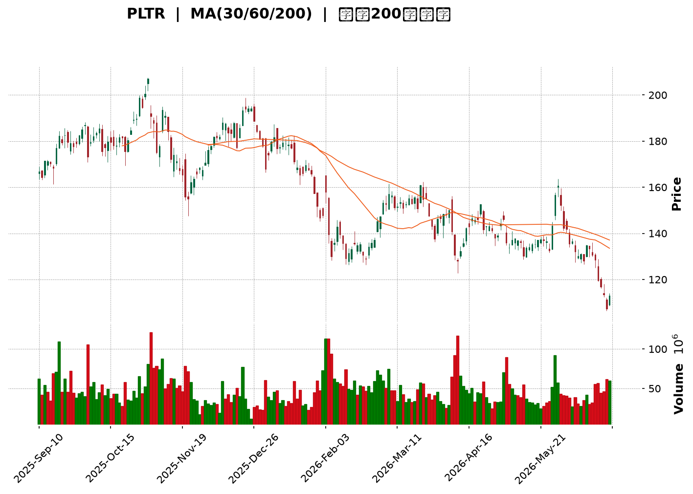
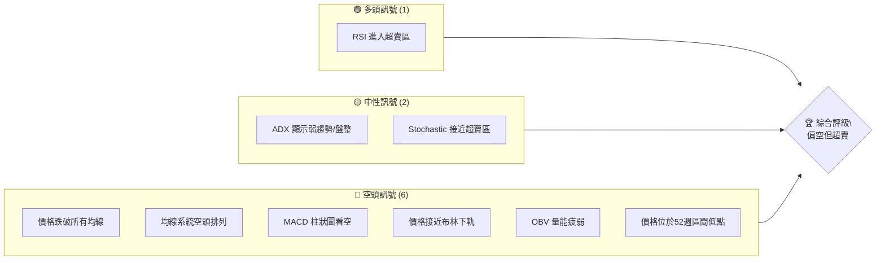
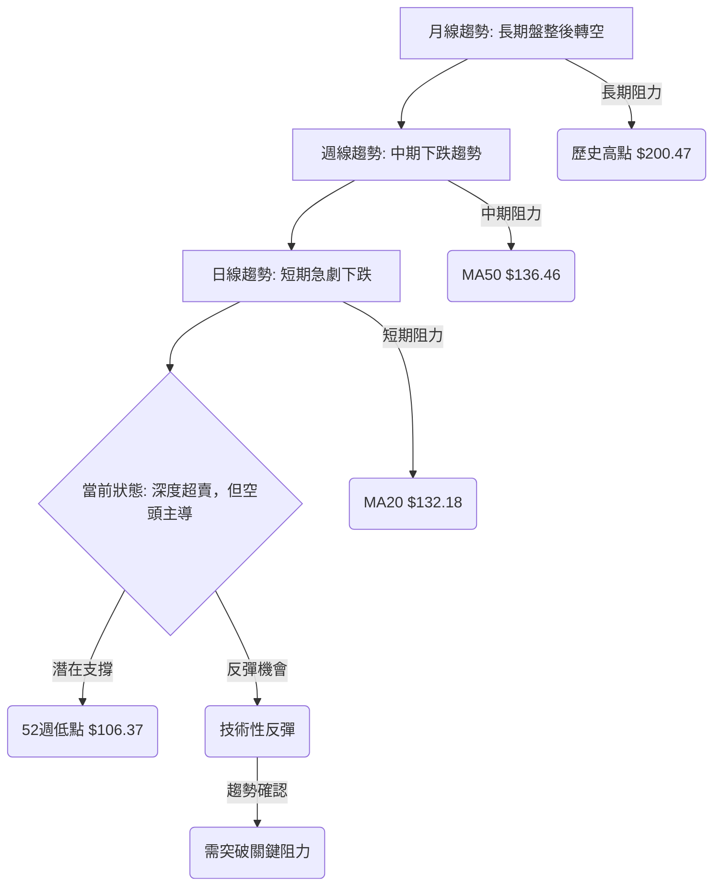
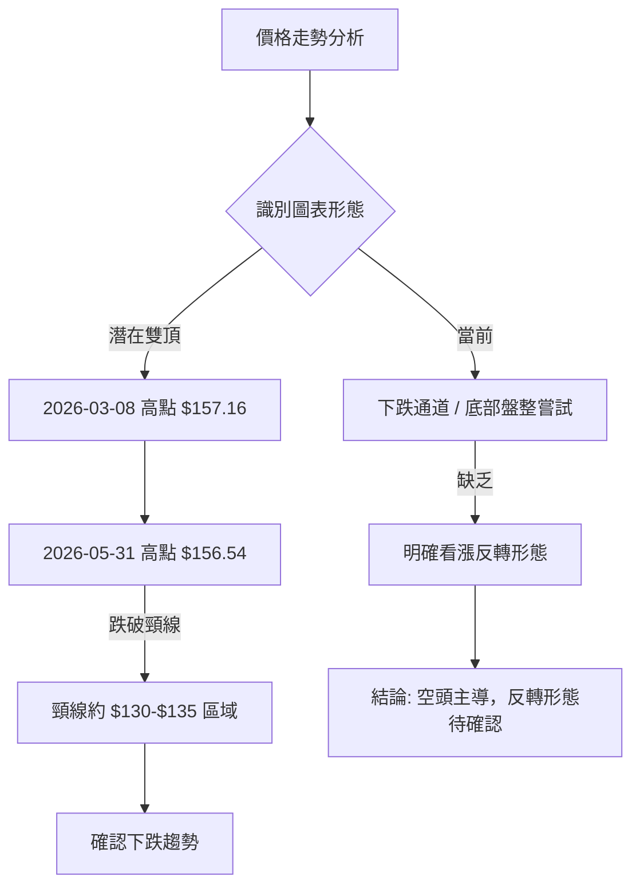
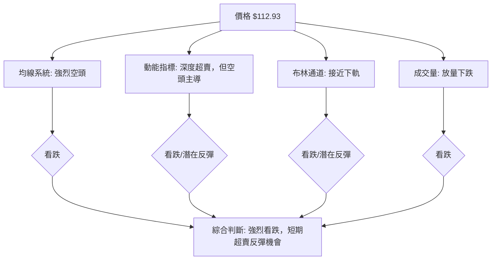
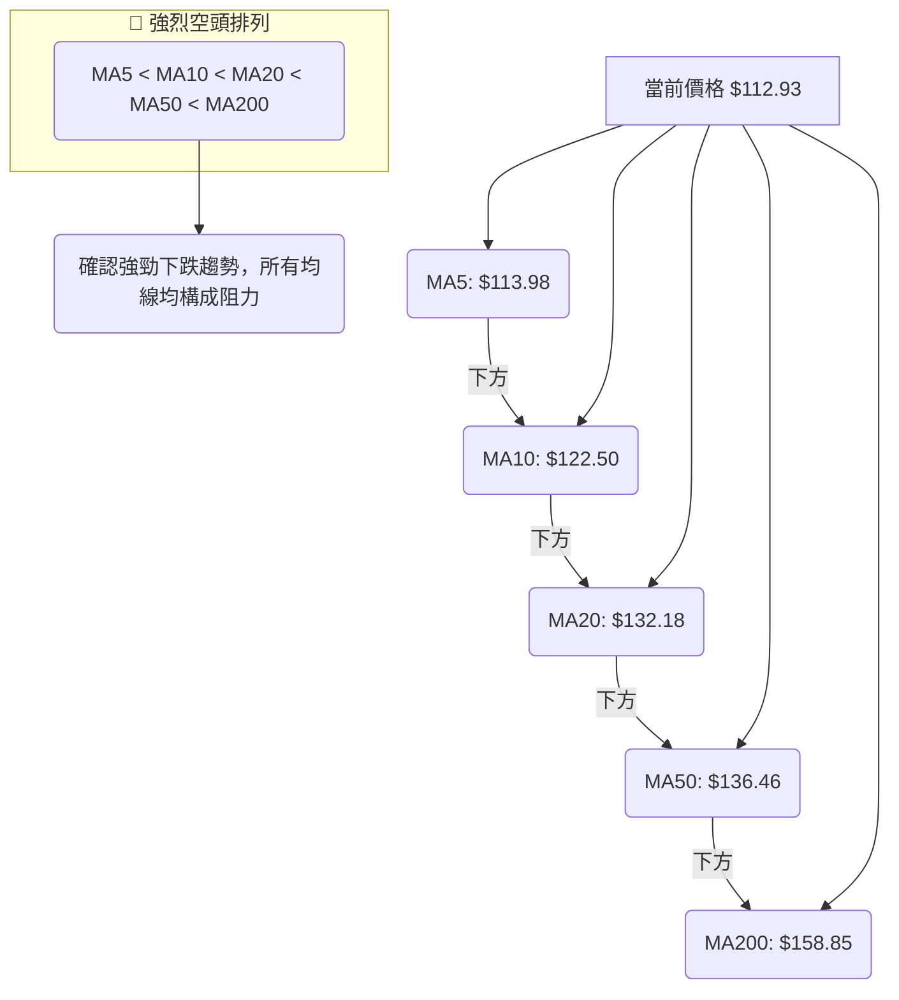
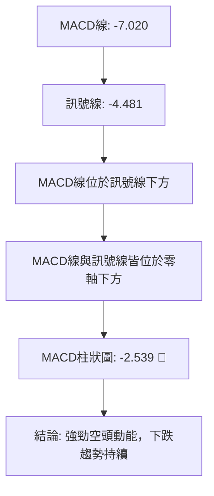

<details>
<summary>📊 靜態圖表 (點擊展開)</summary>

</details>

<html>
<head><meta charset="utf-8" /></head>
<body>
    <div style="height:500px; width:100%;">                        <script>window.PlotlyConfig = {MathJaxConfig: 'local'};</script>
        <script charset="utf-8" src="https://cdn.plot.ly/plotly-3.6.0.min.js" integrity="sha256-QaOVwtVY0T02VaHrr6pnoHLCwayMJp4O5n4YyaE3rJk=" crossorigin="anonymous"></script>                <div id="candlestick-chart" class="plotly-graph-div" style="height:100%; width:100%;"></div>            <script>                window.PLOTLYENV=window.PLOTLYENV || {};                                if (document.getElementById("candlestick-chart")) {                    Plotly.newPlot(                        "candlestick-chart",                        [{"close":{"dtype":"f8","bdata":"AAAAIK7XZEAAAAAghYtkQAAAAIDCbWVAAAAAYLhmZUAAAADgUUhlQAAAAGCPCmVAAAAAQAofZkAAAADgesxmQAAAAGCPamZAAAAAoJnRZkAAAACA63FmQAAAAADXY2ZAAAAAgD0yZkAAAAAghVtmQAAAAKBwzWZAAAAAYGYeZ0AAAACgmWFnQAAAAIA9omVAAAAAwPVwZkAAAACgcMVmQAAAAIDr8WZAAAAAQAovZ0AAAACAFO5lQAAAAGC4JmZAAAAAIK53ZkAAAAAA13NmQAAAAADXQ2ZAAAAAwMxEZkAAAABA4bJmQAAAAOBRsGZAAAAAIK7vZUAAAAAgXI9mQAAAAAApFGdAAAAAgMKlZ0AAAABAM7NnQAAAAIDr2WhAAAAAoJlRaEAAAABACg9pQAAAAIDC5WlAAAAAIK7XZ0AAAADAzHxnQAAAAKCZ4WVAAAAAgMI9ZkAAAAAghTNoQAAAAGC43mdAAAAAoHAFZ0AAAADgeoRlQAAAAOBRwGVAAAAAAABoZUAAAABgj+pkQAAAAKBwrWRAAAAAANd3Y0AAAABAM1tjQAAAAAAASGRAAAAAoJlxZEAAAADgo7hkQAAAAGBmDmVAAAAAIK7vZEAAAACAFFZlQAAAAGCPAmZAAAAAoHA9ZkAAAADgUbhmQAAAACCur2ZAAAAAQOG6ZkAAAADAHn1nQAAAAKBHcWdAAAAAgD3yZkAAAAAAAOhmQAAAAAAAeGdAAAAAoEcpZkAAAACAFDZnQAAAAAApLGhAAAAAIFw\u002faEAAAAAAKURoQAAAAKBwRWhAAAAAYLiWZ0AAAACAwgVnQAAAAEDhmmZAAAAAAAA4ZkAAAAAghftkQAAAAKBHwWVAAAAAYLh2ZkAAAACAwrVmQAAAACCFG2ZAAAAAIK4vZkAAAADAHm1mQAAAAGC4XmZAAAAAwMxMZkAAAACAPSJmQAAAAGC4XmVAAAAAwPUQZUAAAABgj6pkQAAAAMDMvGRAAAAAQDMzZUAAAABACu9kQAAAAGBmtmRAAAAAQDOrY0AAAAAghftiQAAAAEDhUmJAAAAA4FF4YkAAAAAAKbxjQAAAAKBHcWFAAAAA4FFAYEAAAADAzPxgQAAAAMAe3WFAAAAA4FFwYUAAAACAwvVgQAAAAAApJGBAAAAAwB5tYEAAAADgo6BgQAAAAAAp7GBAAAAA4HrcYEAAAAAgrudgQAAAAEAzU2BAAAAAQOEaYEAAAACAFMZgQAAAAIAU\u002fmBAAAAAgBQmYUAAAACgcCViQAAAAEAKZ2JAAAAAgBQmY0AAAACgcBVjQAAAAMAepWNAAAAAgMKNY0AAAADgeuRiQAAAAEAz82JAAAAAAAAwY0AAAABgZt5iQAAAAEAKF2NAAAAAYI9iY0AAAADgoxhjQAAAAIDCdWNAAAAAgMLVYkAAAABA4RpkQAAAAMD1WGNAAAAAYLheY0AAAACA63FiQAAAAIDr4WFAAAAAoJkxYUAAAADA9UhiQAAAACCuT2JAAAAAYLiOYkAAAACAwn1iQAAAAIA9wmJAAAAA4FGYYUAAAAAgrk9gQAAAAIDrAWBAAAAAANeLYEAAAABgZvZgQAAAAMDMxGFAAAAA4FHYYUAAAADgekxiQAAAAOB6PGJAAAAAQAo\u002fYkAAAAAA1xNjQAAAAIA9smFAAAAAQOHiYUAAAABAM+NhQAAAAIDCpWFAAAAAQAo\u002fYUAAAAAghWNhQAAAAIA9AmJAAAAAwPVAYkAAAADAHv1gQAAAAKBHuWBAAAAAoJkhYUAAAACgmTlhQAAAAOB6HGFAAAAAAAAAYUAAAACgmUFgQAAAACBct2BAAAAAIK6\u002fYEAAAADgeuRgQAAAAOBR6GBAAAAAwMwkYUAAAACgRy1hQAAAAAApHGFAAAAAQDMTYUAAAADgUZBgQAAAAEDh6mFAAAAAoEeRY0AAAADAzBRkQAAAAKBwBWNAAAAAYGbGYUAAAABgZrZhQAAAAMD18GBAAAAAQAoPYUAAAACAPYJgQAAAAGC4RmBAAAAAYI9iYEAAAAAgXP9fQAAAAGC41mBAAAAAAACoYEAAAAAAKVRgQAAAAEAKD2BAAAAAAADgXUAAAADAzCxdQAAAAAAAYFxAAAAAoEfRWkAAAAAghTtcQA=="},"high":{"dtype":"f8","bdata":"AAAAAAAgZUAAAADgp+5kQAAAAMD1cGVAAAAAoJl5ZUAAAACA62llQAAAAIDCNWVAAAAAoJlZZkAAAACgcA1nQAAAAAAAyGZAAAAAAAA4Z0AAAABAMxtnQAAAAIA9CmdAAAAAANeDZkAAAAAgXK9mQAAAAOCj2GZAAAAAwPVIZ0AAAABgZoZnQAAAAEDhWmdAAAAAYGbeZkAAAACAwkVnQAAAAOBRCGdAAAAAANdzZ0AAAABAM2NnQAAAAEAKZ2ZAAAAAQOHKZkAAAABAMwtnQAAAAIA9GmdAAAAAQOGyZkAAAABA4eJmQAAAAMByzGZAAAAAYLjGZkAAAACA67FmQAAAAKBwRWdAAAAAYI8aaEAAAADA9fhnQAAAAEAz+2hAAAAAoHD1aEAAAACAwoVpQAAAAOCj8GlAAAAAYGZ2aEAAAACAPcpnQAAAAEDh4mdAAAAAYGZWZkAAAACAwl1oQAAAAKCZHWhAAAAAYI\u002fSZ0AAAABgZtZmQAAAAKBHKWZAAAAAIK7HZUAAAABgj5plQAAAAEAzM2VAAAAAgD3SZUAAAAAghcNjQAAAAKBwpWRAAAAAwMyUZEAAAAAg2QplQAAAAKCZGWVAAAAAQDMjZUAAAAAAAPhlQAAAAMAePWZAAAAAgBROZkAAAABg5cRmQAAAAAAp\u002fGZAAAAAQDPbZkAAAADgesxnQAAAAKCZgWdAAAAAwMxQZ0AAAADA9XhnQAAAAAAAkGdAAAAAAAB4Z0AAAABgj2pnQAAAAAAAYGhAAAAAACncaEAAAAAA12toQAAAAKBwZWhAAAAAQDOLaEAAAABgZmZnQAAAAABUF2dAAAAAwPWwZkAAAABAM6tmQAAAAIA9+mVAAAAAgBSGZkAAAADA9WhnQAAAAMAeNWdAAAAAQApXZkAAAAAAANBmQAAAAEAzo2ZAAAAA4CKzZkAAAABAM5NmQAAAAIDCzWZAAAAAQAp\u002fZUAAAAAgri9lQAAAAAAAIGVAAAAAAACAZUAAAABA4VJlQAAAAIAULmVAAAAAoHChZEAAAAAAKbRjQAAAAAAA4GJAAAAAwMzsYkAAAAAAf6JkQAAAAEAze2NAAAAAIFw\u002fYUAAAADg+zVhQAAAAADXO2JAAAAAgOsxYkAAAAAAAGhhQAAAAOB6\u002fGBAAAAAgOuxYEAAAACAPcpgQAAAAODQnmFAAAAAwB4FYUAAAABguAZhQAAAAKBHgWBAAAAAIK5HYEAAAABA4QJhQAAAAOBRMGFAAAAAQDNDYUAAAADgemRiQAAAAAAAcGJAAAAA4KNQY0AAAAAAKYxjQAAAAGBmLmRAAAAAgBTOY0AAAAAgBpVjQAAAAIBoJWNAAAAAACl8Y0AAAACA61FjQAAAACCFO2NAAAAAAACYY0AAAACAFJZjQAAAAMDMhGNAAAAAwMyUY0AAAABgjyJkQAAAAMDMTGRAAAAA4KMIZEAAAAAA1yNjQAAAAGC4PmJAAAAAANcDYkAAAAAghXtiQAAAAKCZiWJAAAAA4FGQYkAAAAAghdNiQAAAAOCjyGJAAAAAwPWIY0AAAACgR3FhQAAAAGBmJmBAAAAAoHDNYEAAAACAPUJhQAAAAGCP0mFAAAAAoJkxYkAAAADA9YhiQAAAAGBmZmJAAAAAANe7YkAAAACAwhVjQAAAAKBHyWJAAAAAYI\u002fqYUAAAACAPSJiQAAAAEAz+2FAAAAA4FF4YUAAAABgZoZhQAAAAIAUTmJAAAAA4Hq0YkAAAAAgXN9hQAAAAGBm9mBAAAAAYGaeYUAAAAAAKTxhQAAAAOB6JGFAAAAAgMItYUAAAAAgrh9hQAAAACBcz2BAAAAA4Hr0YEAAAACA6\u002f1gQAAAAEAKL2FAAAAAIK4nYUAAAACgmVFhQAAAAOCjYGFAAAAAgMJVYUAAAAAgXPdgQAAAAAAAIGJAAAAAoO24Y0AAAABgZnZkQAAAAKCZ8WNAAAAAgML1YkAAAAAA10tiQAAAAEAKv2FAAAAA4FE4YUAAAAAgrh9hQAAAAIDrpWBAAAAA4KNwYEAAAABA4WJgQAAAACBc32BAAAAAQOHSYEAAAABAMwNhQAAAAIDCbWBAAAAAANcbYEAAAAAAKTxeQAAAAAAAgF1AAAAAoJkJXEAAAAAgHYVcQA=="},"hovertemplate":"\u003cb\u003e%{x|%Y-%m-%d}\u003c\u002fb\u003e\u003cbr\u003e\u958b: $%{open:.2f}\u003cbr\u003e\u9ad8: $%{high:.2f}\u003cbr\u003e\u4f4e: $%{low:.2f}\u003cbr\u003e\u6536: $%{close:.2f}\u003cextra\u003e\u003c\u002fextra\u003e","low":{"dtype":"f8","bdata":"AAAAgBRuZEAAAABACmdkQAAAAOBRgGRAAAAAwB7tZEAAAABguB5lQAAAAOCjKGRAAAAA4HosZUAAAABguBZmQAAAAKBHSWZAAAAA4FEgZkAAAAAA1yNmQAAAAKBHyWVAAAAAwB7dZUAAAADAHiVmQAAAAEAKR2ZAAAAAAABwZkAAAABgZt5mQAAAAOCjWGVAAAAAYI86ZkAAAACgcG1mQAAAAGBmpmZAAAAAYGZ+ZkAAAADA9bBlQAAAAGBmrmVAAAAAgD1aZUAAAADgowBmQAAAAGBmDmZAAAAAYGa+ZUAAAACAFC5mQAAAAMDMVGZAAAAAoHAtZUAAAADgUeBlQAAAAEAz22ZAAAAA4KNwZ0AAAADA9VhnQAAAACCuz2dAAAAAANdDaEAAAACgcL1oQAAAAIA9OmlAAAAAgOsxZ0AAAABguKZmQAAAAMD10GVAAAAAwB4dZUAAAADgo\u002fBmQAAAAAApZGdAAAAAwMyMZkAAAABgZFdlQAAAAAAAkGRAAAAAgML1ZEAAAAAAALBkQAAAAKBwTWRAAAAA4KNMY0AAAACA63FiQAAAAAAAoGNAAAAAgMKRY0AAAAAAKXxkQAAAAAAAvGRAAAAAANdjZEAAAABA4TJlQAAAAGCPGmVAAAAAgMLNZUAAAADAHiVmQAAAAKBHcWZAAAAAACmMZkAAAAAAANhmQAAAAGC4hmZAAAAAIFg1ZkAAAADA9YBmQAAAAECLpGZAAAAAAAAQZkAAAADgUbBmQAAAACBcV2dAAAAAgMINaEAAAAAghfdnQAAAAGCPGmhAAAAAANeTZ0AAAADgevRmQAAAAGBmlmZAAAAAAAAoZkAAAABAM8tkQAAAAKBHeWVAAAAA4KPYZUAAAADAHjVmQAAAAADXy2VAAAAAAADYZUAAAABA4QpmQAAAAOB6BGZAAAAAYGa+ZUAAAADA9RBmQAAAAOBRQGVAAAAAIK7HZEAAAAAghSNkQAAAAGBmnmRAAAAAoJnJZEAAAABgZupkQAAAAIAUlmRAAAAAIK6nY0AAAAAA12NiQAAAAMByJGJAAAAAoO1UYkAAAAAA1yNjQAAAAIDC9WBAAAAAgD0KYEAAAABAM4tgQAAAAADV2GBAAAAA4KM4YUAAAABgZp5gQAAAAADXo19AAAAAgOmOX0AAAABgj9JfQAAAAADX22BAAAAA4FFgYEAAAACgcGVgQAAAAMD12F9AAAAAIK6XX0AAAACAwiVgQAAAAAAplGBAAAAAIFy\u002fYEAAAADgo5BhQAAAAGBmRmFAAAAAgOuBYkAAAAAghbNiQAAAAKBHyWJAAAAAQAofY0AAAADgesRiQAAAAGCPqmJAAAAAIFzfYkAAAABgj5JiQAAAAKBw5WJAAAAAANcDY0AAAAAghRNjQAAAAAAA0GJAAAAAQOGiYkAAAAAgridjQAAAAOB69GJAAAAAIFxbY0AAAAAAAGhiQAAAAIDrsWFAAAAAoJkJYUAAAABACl9hQAAAAEAKD2JAAAAAIK4\u002fYUAAAAAgMVRiQAAAAGBmDmJAAAAAoHBlYUAAAABACg9gQAAAACCFq15AAAAAwMwkYEAAAAAAAMBgQAAAAIDC3WBAAAAAwPVwYUAAAACgmelhQAAAAGCP+mFAAAAAwPf\u002fYUAAAADAHm1iQAAAAKBwfWFAAAAAgMJdYUAAAADgUaBhQAAAAKBwjWFAAAAAgMLVYEAAAADAzBRhQAAAAOB6rGFAAAAAQDMnYkAAAABACtdgQAAAAMDMZGBAAAAAwPXYYEAAAADgo6BgQAAAAACsmGBAAAAAYLiuYEAAAAAAABhgQAAAAGBmLmBAAAAAoEeJYEAAAABgj2pgQAAAAEAzs2BAAAAAoHCNYEAAAACgcO1gQAAAAKCZyWBAAAAAoJmpYEAAAAAAKXRgQAAAAAAAoGBAAAAAoEc5YkAAAAAAKXxjQAAAAKCZuWJAAAAAAACoYUAAAABAtIhhQAAAAMDMwGBAAAAAwPXoYEAAAABgZtZfQAAAAKCZGWBAAAAAQOHKX0AAAACgmalfQAAAAGBmNmBAAAAAANczYEAAAACgcD1gQAAAAOCjQF9AAAAAwMzMXUAAAAAghQtdQAAAAAAAEFxAAAAAIK6XWkAAAACAFB5bQA=="},"name":"\u50f9\u683c","open":{"dtype":"f8","bdata":"AAAAAADAZEAAAAAgrudkQAAAAEAzq2RAAAAAQDMzZUAAAACgR2FlQAAAAOCjIGVAAAAA4KNIZUAAAACAPSJmQAAAAAApnGZAAAAA4FHQZkAAAADAHv1mQAAAAKCZ+WVAAAAAoJlhZkAAAADgenRmQAAAACBcX2ZAAAAAgD2qZkAAAABgZlZnQAAAAMDMTGdAAAAAgMJlZkAAAACA64lmQAAAAKCZ2WZAAAAAYI\u002fyZkAAAACgcCVnQAAAAIDCVWZAAAAAAAAAZkAAAADA9bRmQAAAAMD1uGZAAAAAAAA4ZkAAAAAgrm9mQAAAAIDrwWZAAAAAgMK9ZkAAAACAPe5lQAAAAAAp3GZAAAAAQAqfZ0AAAAAgXK9nQAAAAGCP4mdAAAAAoJnNaEAAAABgZuZoQAAAAKBwoWlAAAAAgD0CaEAAAAAAAKBnQAAAACCuf2dAAAAAwMykZUAAAACA6wlnQAAAAGC4ymdAAAAAYI\u002fSZ0AAAABA4bZmQAAAAEAz32RAAAAAwPVQZUAAAAAA1wtlQAAAAKCZ+WRAAAAAgD2CZUAAAADgUYBjQAAAAEAKr2NAAAAAgD0CZEAAAABAM9tkQAAAAOBR+GRAAAAAAACgZEAAAABA4TJlQAAAAOB6RGVAAAAAIK4LZkAAAAAgXEdmQAAAAGC4xmZAAAAAQAqfZkAAAABgZh5nQAAAAKCZGWdAAAAAgOs5Z0AAAABgjyJnQAAAAMD1tGZAAAAAQOF2Z0AAAADgUbBmQAAAACCuV2dAAAAAoEdhaEAAAABgZhpoQAAAAMAeJWhAAAAA4HpgaEAAAABAM1tnQAAAAEAzC2dAAAAAACmkZkAAAACgmalmQAAAAAAp3GVAAAAA4FH4ZUAAAACgmXlmQAAAACCuM2dAAAAA4KMgZkAAAACA6zVmQAAAAAAAXGZAAAAAAABEZkAAAABguFZmQAAAACCFa2ZAAAAAAAD0ZEAAAAAg3QxlQAAAAKCZHWVAAAAA4KPoZEAAAABguAZlQAAAACBc72RAAAAAwMyMZEAAAAAAKbRjQAAAAKCZwWJAAAAAgBTeYkAAAACgmaFkQAAAAMAebWNAAAAAgD0aYUAAAABgj+pgQAAAAGCPEmFAAAAAQOEeYkAAAADAzGBhQAAAACCF62BAAAAAoJn5X0AAAADgoxxgQAAAAOB6\u002fGBAAAAAgOuJYEAAAAAgrotgQAAAAKBHgWBAAAAAACkgYEAAAAAghVNgQAAAAEAKu2BAAAAAgD3CYEAAAADAzJhhQAAAAEAzw2FAAAAAgMKNYkAAAACAFB5jQAAAAIAUzmJAAAAAgBR2Y0AAAAAgrn9jQAAAAAAp7GJAAAAA4FEgY0AAAACgmSljQAAAAGBmDmNAAAAAwPUMY0AAAACAPV5jQAAAAEAzI2NAAAAAYGZmY0AAAAAgridjQAAAAIA9AmRAAAAAoHCtY0AAAACAwiFjQAAAAAApPGJAAAAA4KPoYUAAAADgo4BhQAAAAAAAYGJAAAAAIIXvYUAAAAAghYtiQAAAAGA5XGJAAAAA4HpYY0AAAADgo2xhQAAAACBcD2BAAAAAIFxHYEAAAAAAqs1gQAAAAKBHGWFAAAAAoEcJYkAAAACAFCpiQAAAAAAAIGJAAAAAgOtZYkAAAAAghYtiQAAAAGBmtmJAAAAAYLjeYUAAAAAAAKhhQAAAAKCZyWFAAAAA4FF4YUAAAABAM09hQAAAAAAA6GFAAAAAAAB4YkAAAACgcIlhQAAAAGC4tmBAAAAAQDPjYEAAAAAgrvtgQAAAAMAe3WBAAAAAQDMTYUAAAAAgMcBgQAAAAMDMNGBAAAAAoJmZYEAAAAAAAJBgQAAAAKBw5WBAAAAA4KPEYEAAAACgmflgQAAAAKCZLWFAAAAAwB4FYUAAAACgmalgQAAAAMAepWBAAAAAYGZ6YkAAAAAgXP9jQAAAAIAUlmNAAAAAYGa2YkAAAABguC5iQAAAAGBmimFAAAAAgML1YEAAAAAA19tgQAAAAGBmKmBAAAAAwPUYYEAAAACgR11gQAAAAOCjQGBAAAAAQOHSYEAAAADgUXhgQAAAAEDhWmBAAAAAIFxvX0AAAACgmQleQAAAACCuh1xAAAAA4FHYW0AAAABgj0JbQA=="},"x":["2025-09-10T00:00:00-04:00","2025-09-11T00:00:00-04:00","2025-09-12T00:00:00-04:00","2025-09-15T00:00:00-04:00","2025-09-16T00:00:00-04:00","2025-09-17T00:00:00-04:00","2025-09-18T00:00:00-04:00","2025-09-19T00:00:00-04:00","2025-09-22T00:00:00-04:00","2025-09-23T00:00:00-04:00","2025-09-24T00:00:00-04:00","2025-09-25T00:00:00-04:00","2025-09-26T00:00:00-04:00","2025-09-29T00:00:00-04:00","2025-09-30T00:00:00-04:00","2025-10-01T00:00:00-04:00","2025-10-02T00:00:00-04:00","2025-10-03T00:00:00-04:00","2025-10-06T00:00:00-04:00","2025-10-07T00:00:00-04:00","2025-10-08T00:00:00-04:00","2025-10-09T00:00:00-04:00","2025-10-10T00:00:00-04:00","2025-10-13T00:00:00-04:00","2025-10-14T00:00:00-04:00","2025-10-15T00:00:00-04:00","2025-10-16T00:00:00-04:00","2025-10-17T00:00:00-04:00","2025-10-20T00:00:00-04:00","2025-10-21T00:00:00-04:00","2025-10-22T00:00:00-04:00","2025-10-23T00:00:00-04:00","2025-10-24T00:00:00-04:00","2025-10-27T00:00:00-04:00","2025-10-28T00:00:00-04:00","2025-10-29T00:00:00-04:00","2025-10-30T00:00:00-04:00","2025-10-31T00:00:00-04:00","2025-11-03T00:00:00-05:00","2025-11-04T00:00:00-05:00","2025-11-05T00:00:00-05:00","2025-11-06T00:00:00-05:00","2025-11-07T00:00:00-05:00","2025-11-10T00:00:00-05:00","2025-11-11T00:00:00-05:00","2025-11-12T00:00:00-05:00","2025-11-13T00:00:00-05:00","2025-11-14T00:00:00-05:00","2025-11-17T00:00:00-05:00","2025-11-18T00:00:00-05:00","2025-11-19T00:00:00-05:00","2025-11-20T00:00:00-05:00","2025-11-21T00:00:00-05:00","2025-11-24T00:00:00-05:00","2025-11-25T00:00:00-05:00","2025-11-26T00:00:00-05:00","2025-11-28T00:00:00-05:00","2025-12-01T00:00:00-05:00","2025-12-02T00:00:00-05:00","2025-12-03T00:00:00-05:00","2025-12-04T00:00:00-05:00","2025-12-05T00:00:00-05:00","2025-12-08T00:00:00-05:00","2025-12-09T00:00:00-05:00","2025-12-10T00:00:00-05:00","2025-12-11T00:00:00-05:00","2025-12-12T00:00:00-05:00","2025-12-15T00:00:00-05:00","2025-12-16T00:00:00-05:00","2025-12-17T00:00:00-05:00","2025-12-18T00:00:00-05:00","2025-12-19T00:00:00-05:00","2025-12-22T00:00:00-05:00","2025-12-23T00:00:00-05:00","2025-12-24T00:00:00-05:00","2025-12-26T00:00:00-05:00","2025-12-29T00:00:00-05:00","2025-12-30T00:00:00-05:00","2025-12-31T00:00:00-05:00","2026-01-02T00:00:00-05:00","2026-01-05T00:00:00-05:00","2026-01-06T00:00:00-05:00","2026-01-07T00:00:00-05:00","2026-01-08T00:00:00-05:00","2026-01-09T00:00:00-05:00","2026-01-12T00:00:00-05:00","2026-01-13T00:00:00-05:00","2026-01-14T00:00:00-05:00","2026-01-15T00:00:00-05:00","2026-01-16T00:00:00-05:00","2026-01-20T00:00:00-05:00","2026-01-21T00:00:00-05:00","2026-01-22T00:00:00-05:00","2026-01-23T00:00:00-05:00","2026-01-26T00:00:00-05:00","2026-01-27T00:00:00-05:00","2026-01-28T00:00:00-05:00","2026-01-29T00:00:00-05:00","2026-01-30T00:00:00-05:00","2026-02-02T00:00:00-05:00","2026-02-03T00:00:00-05:00","2026-02-04T00:00:00-05:00","2026-02-05T00:00:00-05:00","2026-02-06T00:00:00-05:00","2026-02-09T00:00:00-05:00","2026-02-10T00:00:00-05:00","2026-02-11T00:00:00-05:00","2026-02-12T00:00:00-05:00","2026-02-13T00:00:00-05:00","2026-02-17T00:00:00-05:00","2026-02-18T00:00:00-05:00","2026-02-19T00:00:00-05:00","2026-02-20T00:00:00-05:00","2026-02-23T00:00:00-05:00","2026-02-24T00:00:00-05:00","2026-02-25T00:00:00-05:00","2026-02-26T00:00:00-05:00","2026-02-27T00:00:00-05:00","2026-03-02T00:00:00-05:00","2026-03-03T00:00:00-05:00","2026-03-04T00:00:00-05:00","2026-03-05T00:00:00-05:00","2026-03-06T00:00:00-05:00","2026-03-09T00:00:00-04:00","2026-03-10T00:00:00-04:00","2026-03-11T00:00:00-04:00","2026-03-12T00:00:00-04:00","2026-03-13T00:00:00-04:00","2026-03-16T00:00:00-04:00","2026-03-17T00:00:00-04:00","2026-03-18T00:00:00-04:00","2026-03-19T00:00:00-04:00","2026-03-20T00:00:00-04:00","2026-03-23T00:00:00-04:00","2026-03-24T00:00:00-04:00","2026-03-25T00:00:00-04:00","2026-03-26T00:00:00-04:00","2026-03-27T00:00:00-04:00","2026-03-30T00:00:00-04:00","2026-03-31T00:00:00-04:00","2026-04-01T00:00:00-04:00","2026-04-02T00:00:00-04:00","2026-04-06T00:00:00-04:00","2026-04-07T00:00:00-04:00","2026-04-08T00:00:00-04:00","2026-04-09T00:00:00-04:00","2026-04-10T00:00:00-04:00","2026-04-13T00:00:00-04:00","2026-04-14T00:00:00-04:00","2026-04-15T00:00:00-04:00","2026-04-16T00:00:00-04:00","2026-04-17T00:00:00-04:00","2026-04-20T00:00:00-04:00","2026-04-21T00:00:00-04:00","2026-04-22T00:00:00-04:00","2026-04-23T00:00:00-04:00","2026-04-24T00:00:00-04:00","2026-04-27T00:00:00-04:00","2026-04-28T00:00:00-04:00","2026-04-29T00:00:00-04:00","2026-04-30T00:00:00-04:00","2026-05-01T00:00:00-04:00","2026-05-04T00:00:00-04:00","2026-05-05T00:00:00-04:00","2026-05-06T00:00:00-04:00","2026-05-07T00:00:00-04:00","2026-05-08T00:00:00-04:00","2026-05-11T00:00:00-04:00","2026-05-12T00:00:00-04:00","2026-05-13T00:00:00-04:00","2026-05-14T00:00:00-04:00","2026-05-15T00:00:00-04:00","2026-05-18T00:00:00-04:00","2026-05-19T00:00:00-04:00","2026-05-20T00:00:00-04:00","2026-05-21T00:00:00-04:00","2026-05-22T00:00:00-04:00","2026-05-26T00:00:00-04:00","2026-05-27T00:00:00-04:00","2026-05-28T00:00:00-04:00","2026-05-29T00:00:00-04:00","2026-06-01T00:00:00-04:00","2026-06-02T00:00:00-04:00","2026-06-03T00:00:00-04:00","2026-06-04T00:00:00-04:00","2026-06-05T00:00:00-04:00","2026-06-08T00:00:00-04:00","2026-06-09T00:00:00-04:00","2026-06-10T00:00:00-04:00","2026-06-11T00:00:00-04:00","2026-06-12T00:00:00-04:00","2026-06-15T00:00:00-04:00","2026-06-16T00:00:00-04:00","2026-06-17T00:00:00-04:00","2026-06-18T00:00:00-04:00","2026-06-22T00:00:00-04:00","2026-06-23T00:00:00-04:00","2026-06-24T00:00:00-04:00","2026-06-25T00:00:00-04:00","2026-06-26T00:00:00-04:00"],"type":"candlestick"},{"hovertemplate":"MA30: $%{y:.2f}\u003cextra\u003e\u003c\u002fextra\u003e","line":{"color":"#2196F3","dash":"dash","width":2},"mode":"lines","name":"MA30","x":["2025-09-10T00:00:00-04:00","2025-09-11T00:00:00-04:00","2025-09-12T00:00:00-04:00","2025-09-15T00:00:00-04:00","2025-09-16T00:00:00-04:00","2025-09-17T00:00:00-04:00","2025-09-18T00:00:00-04:00","2025-09-19T00:00:00-04:00","2025-09-22T00:00:00-04:00","2025-09-23T00:00:00-04:00","2025-09-24T00:00:00-04:00","2025-09-25T00:00:00-04:00","2025-09-26T00:00:00-04:00","2025-09-29T00:00:00-04:00","2025-09-30T00:00:00-04:00","2025-10-01T00:00:00-04:00","2025-10-02T00:00:00-04:00","2025-10-03T00:00:00-04:00","2025-10-06T00:00:00-04:00","2025-10-07T00:00:00-04:00","2025-10-08T00:00:00-04:00","2025-10-09T00:00:00-04:00","2025-10-10T00:00:00-04:00","2025-10-13T00:00:00-04:00","2025-10-14T00:00:00-04:00","2025-10-15T00:00:00-04:00","2025-10-16T00:00:00-04:00","2025-10-17T00:00:00-04:00","2025-10-20T00:00:00-04:00","2025-10-21T00:00:00-04:00","2025-10-22T00:00:00-04:00","2025-10-23T00:00:00-04:00","2025-10-24T00:00:00-04:00","2025-10-27T00:00:00-04:00","2025-10-28T00:00:00-04:00","2025-10-29T00:00:00-04:00","2025-10-30T00:00:00-04:00","2025-10-31T00:00:00-04:00","2025-11-03T00:00:00-05:00","2025-11-04T00:00:00-05:00","2025-11-05T00:00:00-05:00","2025-11-06T00:00:00-05:00","2025-11-07T00:00:00-05:00","2025-11-10T00:00:00-05:00","2025-11-11T00:00:00-05:00","2025-11-12T00:00:00-05:00","2025-11-13T00:00:00-05:00","2025-11-14T00:00:00-05:00","2025-11-17T00:00:00-05:00","2025-11-18T00:00:00-05:00","2025-11-19T00:00:00-05:00","2025-11-20T00:00:00-05:00","2025-11-21T00:00:00-05:00","2025-11-24T00:00:00-05:00","2025-11-25T00:00:00-05:00","2025-11-26T00:00:00-05:00","2025-11-28T00:00:00-05:00","2025-12-01T00:00:00-05:00","2025-12-02T00:00:00-05:00","2025-12-03T00:00:00-05:00","2025-12-04T00:00:00-05:00","2025-12-05T00:00:00-05:00","2025-12-08T00:00:00-05:00","2025-12-09T00:00:00-05:00","2025-12-10T00:00:00-05:00","2025-12-11T00:00:00-05:00","2025-12-12T00:00:00-05:00","2025-12-15T00:00:00-05:00","2025-12-16T00:00:00-05:00","2025-12-17T00:00:00-05:00","2025-12-18T00:00:00-05:00","2025-12-19T00:00:00-05:00","2025-12-22T00:00:00-05:00","2025-12-23T00:00:00-05:00","2025-12-24T00:00:00-05:00","2025-12-26T00:00:00-05:00","2025-12-29T00:00:00-05:00","2025-12-30T00:00:00-05:00","2025-12-31T00:00:00-05:00","2026-01-02T00:00:00-05:00","2026-01-05T00:00:00-05:00","2026-01-06T00:00:00-05:00","2026-01-07T00:00:00-05:00","2026-01-08T00:00:00-05:00","2026-01-09T00:00:00-05:00","2026-01-12T00:00:00-05:00","2026-01-13T00:00:00-05:00","2026-01-14T00:00:00-05:00","2026-01-15T00:00:00-05:00","2026-01-16T00:00:00-05:00","2026-01-20T00:00:00-05:00","2026-01-21T00:00:00-05:00","2026-01-22T00:00:00-05:00","2026-01-23T00:00:00-05:00","2026-01-26T00:00:00-05:00","2026-01-27T00:00:00-05:00","2026-01-28T00:00:00-05:00","2026-01-29T00:00:00-05:00","2026-01-30T00:00:00-05:00","2026-02-02T00:00:00-05:00","2026-02-03T00:00:00-05:00","2026-02-04T00:00:00-05:00","2026-02-05T00:00:00-05:00","2026-02-06T00:00:00-05:00","2026-02-09T00:00:00-05:00","2026-02-10T00:00:00-05:00","2026-02-11T00:00:00-05:00","2026-02-12T00:00:00-05:00","2026-02-13T00:00:00-05:00","2026-02-17T00:00:00-05:00","2026-02-18T00:00:00-05:00","2026-02-19T00:00:00-05:00","2026-02-20T00:00:00-05:00","2026-02-23T00:00:00-05:00","2026-02-24T00:00:00-05:00","2026-02-25T00:00:00-05:00","2026-02-26T00:00:00-05:00","2026-02-27T00:00:00-05:00","2026-03-02T00:00:00-05:00","2026-03-03T00:00:00-05:00","2026-03-04T00:00:00-05:00","2026-03-05T00:00:00-05:00","2026-03-06T00:00:00-05:00","2026-03-09T00:00:00-04:00","2026-03-10T00:00:00-04:00","2026-03-11T00:00:00-04:00","2026-03-12T00:00:00-04:00","2026-03-13T00:00:00-04:00","2026-03-16T00:00:00-04:00","2026-03-17T00:00:00-04:00","2026-03-18T00:00:00-04:00","2026-03-19T00:00:00-04:00","2026-03-20T00:00:00-04:00","2026-03-23T00:00:00-04:00","2026-03-24T00:00:00-04:00","2026-03-25T00:00:00-04:00","2026-03-26T00:00:00-04:00","2026-03-27T00:00:00-04:00","2026-03-30T00:00:00-04:00","2026-03-31T00:00:00-04:00","2026-04-01T00:00:00-04:00","2026-04-02T00:00:00-04:00","2026-04-06T00:00:00-04:00","2026-04-07T00:00:00-04:00","2026-04-08T00:00:00-04:00","2026-04-09T00:00:00-04:00","2026-04-10T00:00:00-04:00","2026-04-13T00:00:00-04:00","2026-04-14T00:00:00-04:00","2026-04-15T00:00:00-04:00","2026-04-16T00:00:00-04:00","2026-04-17T00:00:00-04:00","2026-04-20T00:00:00-04:00","2026-04-21T00:00:00-04:00","2026-04-22T00:00:00-04:00","2026-04-23T00:00:00-04:00","2026-04-24T00:00:00-04:00","2026-04-27T00:00:00-04:00","2026-04-28T00:00:00-04:00","2026-04-29T00:00:00-04:00","2026-04-30T00:00:00-04:00","2026-05-01T00:00:00-04:00","2026-05-04T00:00:00-04:00","2026-05-05T00:00:00-04:00","2026-05-06T00:00:00-04:00","2026-05-07T00:00:00-04:00","2026-05-08T00:00:00-04:00","2026-05-11T00:00:00-04:00","2026-05-12T00:00:00-04:00","2026-05-13T00:00:00-04:00","2026-05-14T00:00:00-04:00","2026-05-15T00:00:00-04:00","2026-05-18T00:00:00-04:00","2026-05-19T00:00:00-04:00","2026-05-20T00:00:00-04:00","2026-05-21T00:00:00-04:00","2026-05-22T00:00:00-04:00","2026-05-26T00:00:00-04:00","2026-05-27T00:00:00-04:00","2026-05-28T00:00:00-04:00","2026-05-29T00:00:00-04:00","2026-06-01T00:00:00-04:00","2026-06-02T00:00:00-04:00","2026-06-03T00:00:00-04:00","2026-06-04T00:00:00-04:00","2026-06-05T00:00:00-04:00","2026-06-08T00:00:00-04:00","2026-06-09T00:00:00-04:00","2026-06-10T00:00:00-04:00","2026-06-11T00:00:00-04:00","2026-06-12T00:00:00-04:00","2026-06-15T00:00:00-04:00","2026-06-16T00:00:00-04:00","2026-06-17T00:00:00-04:00","2026-06-18T00:00:00-04:00","2026-06-22T00:00:00-04:00","2026-06-23T00:00:00-04:00","2026-06-24T00:00:00-04:00","2026-06-25T00:00:00-04:00","2026-06-26T00:00:00-04:00"],"y":{"dtype":"f8","bdata":"AAAAAAAA+H8AAAAAAAD4fwAAAAAAAPh\u002fAAAAAAAA+H8AAAAAAAD4fwAAAAAAAPh\u002fAAAAAAAA+H8AAAAAAAD4fwAAAAAAAPh\u002fAAAAAAAA+H8AAAAAAAD4fwAAAAAAAPh\u002fAAAAAAAA+H8AAAAAAAD4fwAAAAAAAPh\u002fAAAAAAAA+H8AAAAAAAD4fwAAAAAAAPh\u002fAAAAAAAA+H8AAAAAAAD4fwAAAAAAAPh\u002fAAAAAAAA+H8AAAAAAAD4fwAAAAAAAPh\u002fAAAAAAAA+H8AAAAAAAD4fwAAAAAAAPh\u002fAAAAAAAA+H8AAAAAAAD4fzMzM1MqPmZAiYiIqH9HZkDe3d19sVhmQJqZmfnFZmZAq6qq+vB5ZkB3d3cXko5mQJqZmSkVr2ZAzczMrNXBZkCJiIi4HtVmQAAAAKDT8mZAq6qqCpD7ZkCrqqpqdQRnQJqZmQkeAGdAZmZmVoAAZ0AiIiISPBBnQAAAABBYGWdAIiIiEoMYZ0BVVVWlmwhnQDMzM1OcCWdAVVVVVccAZ0BmZmYG8\u002fBmQImIiJiZ3WZAAAAAsOS9ZkDv7u4+7qdmQKuqqir5l2ZAd3d3N7SGZkDv7u4+7ndmQBEREbGdbWZA3t3dzT5iZkARERFhnlZmQBEREaHTUGZA3t3dLWtTZkBERES0yFRmQGZmZkZvUWZAd3d395pJZkC8u7t7zUdmQFVVVQXIO2ZAAAAAwBEwZkCrqqqKsx1mQLy7u9v5CGZAvLu7G6H6ZUAiIiKiRfhlQCIiIvLSC2ZAq6qqqvEcZkCamZmpfx1mQERERDTsIGZA3t3d7cMlZkBmZmammzJmQCIiIrLkOWZAERERodNAZkCrqqpaZEFmQAAAADCWSmZAvLu7OyZkZkC8u7ubxIBmQM3MzBxakGZAmpmZqTifZkCrqqpKxa1mQJqZmTn7uGZAERERYZ7EZkC8u7uLbMtmQCIiInL2xWZAmpmZWfK7ZkDe3d3da6pmQBEREcHKmWZAvLu7a7yMZkAAAADw7nZmQJqZmSmjX2ZAq6qqWqtDZkCrqqrKLyJmQN7d3V1I9mVAVVVVtcjWZUCamZm5HrllQAAAANCwf2VAzczMvHQ7ZUAAAAAQWP1kQKuqqqqqxmRAiYiIyC+SZEDNzMwMdF5kQGZmZsZLJ2RA3t3d3d31Y0CamZk5tNBjQImIiHh3p2NA7+7unqh3Y0CJiIhoH0ZjQImIiFjHFGNAZmZmpuLgYkAzMzOTprBiQO\u002fu7j7DgmJAvLu7K85WYkB3d3dXxzRiQM3MzLx0G2JAVVVV5RcLYkDv7u7elv1hQFVVVUVE9GFAq6qq+jfmYUDNzMzMzNRhQAAAAJDCxWFAERERQafBYUAzMzPDrsBhQJqZmak4x2FAMzMzgwfPYUBEREQklMlhQAAAAHDL2mFAmpmZudfwYUAiIiICcgtiQO\u002fu7k4bGGJAERERMZYoYkCamZk5QjViQKuqqgoeRGJAvLu7q6pKYkCJiIiIz1hiQN7d3U2pZGJAIiIi0iJzYkCJiIgIrIBiQERERKRwlWJAiYiImCeiYkAAAABANZ5iQLy7u3vNlWJAzczMTKmQYkC8u7tbj4ZiQImIiOgmgWJAIiIi0gZ2YkBmZmb2U29iQAAAAIBOY2JAmpmZOSZYYkDNzMxculliQBEREYEHT2JAERER4exDYkDv7u5OjTtiQN7d3R0+L2JAIiIi8v0cYkCrqqraaw5iQN7d3Y0JAmJAvLu7yxP9YUDv7u4+fOJhQDMzM5MYzGFAMzMz8\u002f24YUAiIiLSlK5hQAAAAAAAqGFA7+7uvlimYUAAAADgCJVhQKuqqopsh2FARERERP13YUDv7u6+WGphQAAAAKCMWmFAq6qq2rJWYUBmZmbWFV5hQJqZmUl+Z2FAzczMXAFsYUB3d3dHmmhhQKuqqjrfaWFAZmZmFpJ4YUBEREQEyIdhQAAAAOB6jmFAmpmZaXWKYUBmZmaGz35hQDMzMzNeeGFAAAAAgE5xYUAzMzOTimVhQJqZmQnXWWFAvLu7m31SYUAzMzMboUZhQLy7uzOlPGFAERERaQMvYUBmZmaeYSlhQAAAAOi0I2FA3t3dlfwQYUCJiIjgevpgQBEREdmH4WBAREREpOLCYEBVVVW9n7BgQA=="},"type":"scatter"},{"hovertemplate":"MA60: $%{y:.2f}\u003cextra\u003e\u003c\u002fextra\u003e","line":{"color":"#9C27B0","dash":"dash","width":2},"mode":"lines","name":"MA60","x":["2025-09-10T00:00:00-04:00","2025-09-11T00:00:00-04:00","2025-09-12T00:00:00-04:00","2025-09-15T00:00:00-04:00","2025-09-16T00:00:00-04:00","2025-09-17T00:00:00-04:00","2025-09-18T00:00:00-04:00","2025-09-19T00:00:00-04:00","2025-09-22T00:00:00-04:00","2025-09-23T00:00:00-04:00","2025-09-24T00:00:00-04:00","2025-09-25T00:00:00-04:00","2025-09-26T00:00:00-04:00","2025-09-29T00:00:00-04:00","2025-09-30T00:00:00-04:00","2025-10-01T00:00:00-04:00","2025-10-02T00:00:00-04:00","2025-10-03T00:00:00-04:00","2025-10-06T00:00:00-04:00","2025-10-07T00:00:00-04:00","2025-10-08T00:00:00-04:00","2025-10-09T00:00:00-04:00","2025-10-10T00:00:00-04:00","2025-10-13T00:00:00-04:00","2025-10-14T00:00:00-04:00","2025-10-15T00:00:00-04:00","2025-10-16T00:00:00-04:00","2025-10-17T00:00:00-04:00","2025-10-20T00:00:00-04:00","2025-10-21T00:00:00-04:00","2025-10-22T00:00:00-04:00","2025-10-23T00:00:00-04:00","2025-10-24T00:00:00-04:00","2025-10-27T00:00:00-04:00","2025-10-28T00:00:00-04:00","2025-10-29T00:00:00-04:00","2025-10-30T00:00:00-04:00","2025-10-31T00:00:00-04:00","2025-11-03T00:00:00-05:00","2025-11-04T00:00:00-05:00","2025-11-05T00:00:00-05:00","2025-11-06T00:00:00-05:00","2025-11-07T00:00:00-05:00","2025-11-10T00:00:00-05:00","2025-11-11T00:00:00-05:00","2025-11-12T00:00:00-05:00","2025-11-13T00:00:00-05:00","2025-11-14T00:00:00-05:00","2025-11-17T00:00:00-05:00","2025-11-18T00:00:00-05:00","2025-11-19T00:00:00-05:00","2025-11-20T00:00:00-05:00","2025-11-21T00:00:00-05:00","2025-11-24T00:00:00-05:00","2025-11-25T00:00:00-05:00","2025-11-26T00:00:00-05:00","2025-11-28T00:00:00-05:00","2025-12-01T00:00:00-05:00","2025-12-02T00:00:00-05:00","2025-12-03T00:00:00-05:00","2025-12-04T00:00:00-05:00","2025-12-05T00:00:00-05:00","2025-12-08T00:00:00-05:00","2025-12-09T00:00:00-05:00","2025-12-10T00:00:00-05:00","2025-12-11T00:00:00-05:00","2025-12-12T00:00:00-05:00","2025-12-15T00:00:00-05:00","2025-12-16T00:00:00-05:00","2025-12-17T00:00:00-05:00","2025-12-18T00:00:00-05:00","2025-12-19T00:00:00-05:00","2025-12-22T00:00:00-05:00","2025-12-23T00:00:00-05:00","2025-12-24T00:00:00-05:00","2025-12-26T00:00:00-05:00","2025-12-29T00:00:00-05:00","2025-12-30T00:00:00-05:00","2025-12-31T00:00:00-05:00","2026-01-02T00:00:00-05:00","2026-01-05T00:00:00-05:00","2026-01-06T00:00:00-05:00","2026-01-07T00:00:00-05:00","2026-01-08T00:00:00-05:00","2026-01-09T00:00:00-05:00","2026-01-12T00:00:00-05:00","2026-01-13T00:00:00-05:00","2026-01-14T00:00:00-05:00","2026-01-15T00:00:00-05:00","2026-01-16T00:00:00-05:00","2026-01-20T00:00:00-05:00","2026-01-21T00:00:00-05:00","2026-01-22T00:00:00-05:00","2026-01-23T00:00:00-05:00","2026-01-26T00:00:00-05:00","2026-01-27T00:00:00-05:00","2026-01-28T00:00:00-05:00","2026-01-29T00:00:00-05:00","2026-01-30T00:00:00-05:00","2026-02-02T00:00:00-05:00","2026-02-03T00:00:00-05:00","2026-02-04T00:00:00-05:00","2026-02-05T00:00:00-05:00","2026-02-06T00:00:00-05:00","2026-02-09T00:00:00-05:00","2026-02-10T00:00:00-05:00","2026-02-11T00:00:00-05:00","2026-02-12T00:00:00-05:00","2026-02-13T00:00:00-05:00","2026-02-17T00:00:00-05:00","2026-02-18T00:00:00-05:00","2026-02-19T00:00:00-05:00","2026-02-20T00:00:00-05:00","2026-02-23T00:00:00-05:00","2026-02-24T00:00:00-05:00","2026-02-25T00:00:00-05:00","2026-02-26T00:00:00-05:00","2026-02-27T00:00:00-05:00","2026-03-02T00:00:00-05:00","2026-03-03T00:00:00-05:00","2026-03-04T00:00:00-05:00","2026-03-05T00:00:00-05:00","2026-03-06T00:00:00-05:00","2026-03-09T00:00:00-04:00","2026-03-10T00:00:00-04:00","2026-03-11T00:00:00-04:00","2026-03-12T00:00:00-04:00","2026-03-13T00:00:00-04:00","2026-03-16T00:00:00-04:00","2026-03-17T00:00:00-04:00","2026-03-18T00:00:00-04:00","2026-03-19T00:00:00-04:00","2026-03-20T00:00:00-04:00","2026-03-23T00:00:00-04:00","2026-03-24T00:00:00-04:00","2026-03-25T00:00:00-04:00","2026-03-26T00:00:00-04:00","2026-03-27T00:00:00-04:00","2026-03-30T00:00:00-04:00","2026-03-31T00:00:00-04:00","2026-04-01T00:00:00-04:00","2026-04-02T00:00:00-04:00","2026-04-06T00:00:00-04:00","2026-04-07T00:00:00-04:00","2026-04-08T00:00:00-04:00","2026-04-09T00:00:00-04:00","2026-04-10T00:00:00-04:00","2026-04-13T00:00:00-04:00","2026-04-14T00:00:00-04:00","2026-04-15T00:00:00-04:00","2026-04-16T00:00:00-04:00","2026-04-17T00:00:00-04:00","2026-04-20T00:00:00-04:00","2026-04-21T00:00:00-04:00","2026-04-22T00:00:00-04:00","2026-04-23T00:00:00-04:00","2026-04-24T00:00:00-04:00","2026-04-27T00:00:00-04:00","2026-04-28T00:00:00-04:00","2026-04-29T00:00:00-04:00","2026-04-30T00:00:00-04:00","2026-05-01T00:00:00-04:00","2026-05-04T00:00:00-04:00","2026-05-05T00:00:00-04:00","2026-05-06T00:00:00-04:00","2026-05-07T00:00:00-04:00","2026-05-08T00:00:00-04:00","2026-05-11T00:00:00-04:00","2026-05-12T00:00:00-04:00","2026-05-13T00:00:00-04:00","2026-05-14T00:00:00-04:00","2026-05-15T00:00:00-04:00","2026-05-18T00:00:00-04:00","2026-05-19T00:00:00-04:00","2026-05-20T00:00:00-04:00","2026-05-21T00:00:00-04:00","2026-05-22T00:00:00-04:00","2026-05-26T00:00:00-04:00","2026-05-27T00:00:00-04:00","2026-05-28T00:00:00-04:00","2026-05-29T00:00:00-04:00","2026-06-01T00:00:00-04:00","2026-06-02T00:00:00-04:00","2026-06-03T00:00:00-04:00","2026-06-04T00:00:00-04:00","2026-06-05T00:00:00-04:00","2026-06-08T00:00:00-04:00","2026-06-09T00:00:00-04:00","2026-06-10T00:00:00-04:00","2026-06-11T00:00:00-04:00","2026-06-12T00:00:00-04:00","2026-06-15T00:00:00-04:00","2026-06-16T00:00:00-04:00","2026-06-17T00:00:00-04:00","2026-06-18T00:00:00-04:00","2026-06-22T00:00:00-04:00","2026-06-23T00:00:00-04:00","2026-06-24T00:00:00-04:00","2026-06-25T00:00:00-04:00","2026-06-26T00:00:00-04:00"],"y":{"dtype":"f8","bdata":"AAAAAAAA+H8AAAAAAAD4fwAAAAAAAPh\u002fAAAAAAAA+H8AAAAAAAD4fwAAAAAAAPh\u002fAAAAAAAA+H8AAAAAAAD4fwAAAAAAAPh\u002fAAAAAAAA+H8AAAAAAAD4fwAAAAAAAPh\u002fAAAAAAAA+H8AAAAAAAD4fwAAAAAAAPh\u002fAAAAAAAA+H8AAAAAAAD4fwAAAAAAAPh\u002fAAAAAAAA+H8AAAAAAAD4fwAAAAAAAPh\u002fAAAAAAAA+H8AAAAAAAD4fwAAAAAAAPh\u002fAAAAAAAA+H8AAAAAAAD4fwAAAAAAAPh\u002fAAAAAAAA+H8AAAAAAAD4fwAAAAAAAPh\u002fAAAAAAAA+H8AAAAAAAD4fwAAAAAAAPh\u002fAAAAAAAA+H8AAAAAAAD4fwAAAAAAAPh\u002fAAAAAAAA+H8AAAAAAAD4fwAAAAAAAPh\u002fAAAAAAAA+H8AAAAAAAD4fwAAAAAAAPh\u002fAAAAAAAA+H8AAAAAAAD4fwAAAAAAAPh\u002fAAAAAAAA+H8AAAAAAAD4fwAAAAAAAPh\u002fAAAAAAAA+H8AAAAAAAD4fwAAAAAAAPh\u002fAAAAAAAA+H8AAAAAAAD4fwAAAAAAAPh\u002fAAAAAAAA+H8AAAAAAAD4fwAAAAAAAPh\u002fAAAAAAAA+H8AAAAAAAD4fyIiIvp+R2ZAMzMza3VNZkAREREZvVZmQAAAAKAaXGZAERER+cVhZkCamZnJL2tmQHd3d5dudWZAZmZmtvN4ZkCamZkhaXlmQN7d3b3mfWZAMzMzkxh7ZkBmZmaGXX5mQN7d3X34hWZAiYiIALmOZkDe3d3d3ZZmQCIiIiIinWZAAAAAgCOfZkDe3d2lm51mQKuqqoLAoWZAMzMze82gZkCJiIiwK5lmQEREROQXlGZA3t3ddQWRZkBVVVVtWZRmQLy7u6MplGZAiYiIcPaSZkDNzMzE2ZJmQFVVVXVMk2ZAd3d3l26TZkBmZmZ2BZFmQJqZmQlli2ZAvLu7w66HZkARERFJmn9mQLy7uwOddWZAmpmZsStrZkDe3d01Xl9mQHd3d5e1TWZAVVVVjd45ZkCrqqqq8R9mQM3MzByh\u002f2VAiYiI6LToZUDe3d0tsthlQBEREeHBxWVAvLu7MzOsZUDNzMzca41lQHd3d2\u002fLc2VAMzMz2\u002flbZUCamZnZh0hlQERERDyYMGVAd3d3v1gbZUAiIiJKDAllQERERNQG+WRAVVVVbeftZEAiIiICcuNkQKuqqrqQ0mRAAAAAqA3AZEDv7u7uNa9kQERERDzfnWRAZmZmRraNZECamZnxGYBkQHd3d5e1cGRAd3d3H4VjZEBmZmZeAVRkQDMzM4MHR2RAMzMzM3o5ZEBmZmbe3SVkQM3MzNyyEmRA3t3dTakCZEDv7u5Gb\u002fFjQLy7u4PA3mNAREREHOjSY0Dv7u5uWcFjQAAAACA+rWNAMzMzOyaWY0AREREJZYRjQM3MzPxib2NAzczM\u002fGJdY0AzMzMj20ljQImIiOi0NWNAzczMREQgY0ARERHhwRRjQDMzM2MQBmNAiYiIuGX1YkCJiIi4ZeNiQGZmZv4b1WJAd3d3H4XBYkCamZnpbadiQFVVVV1IjGJAREREvLtzYkCamZlZq11iQKuqqtJNTmJAvLu7W49AYkCrqqpqdTZiQKuqqmLJK2JAIiIiGi8fYkDNzMyUQxdiQImIiAhlCmJAEREREcoCYkAREREJHv5hQLy7u2M7+2FAq6qqugL2YUB3d3f\u002f\u002f+thQO\u002fu7n5q7mFAq6qqwvX2YUCJiIgg9\u002fZhQBEREfEZ8mFAIiIiEsrwYUDe3d2F6\u002fFhQFVVVQUP9mFAVVVVtYH4YUBEREQ07PZhQEREROwK9mFAMzMzC5D1YUC8u7tjgvVhQCIiIqL+92FAmpmZOW38YUAzMzOLJf5hQKuqquKl\u002fmFAzczMVFX+YUCamZnRlPdhQJqZmRGD9WFAREREdEz3YUBVVVX9jfthQAAAALDk+GFAmpmZ0U3xYUCamZnxROxhQCIiItqy42FAiYiIsJ3aYUARERHxi9BhQLy7u5OKxGFA7+7uxr23YUDv7u56hqphQM3MzGBXn2FAZmZmmguWYUCrqqru7oVhQJqZmb3md2FAiYiIRP1kYUBVVVXZh1RhQImIiOzDRGFAmpmZsZ00YUCrqqpO1CJhQA=="},"type":"scatter"},{"hovertemplate":"MA200: $%{y:.2f}\u003cextra\u003e\u003c\u002fextra\u003e","line":{"color":"#FF6F00","dash":"solid","width":2},"mode":"lines","name":"MA200","x":["2025-09-10T00:00:00-04:00","2025-09-11T00:00:00-04:00","2025-09-12T00:00:00-04:00","2025-09-15T00:00:00-04:00","2025-09-16T00:00:00-04:00","2025-09-17T00:00:00-04:00","2025-09-18T00:00:00-04:00","2025-09-19T00:00:00-04:00","2025-09-22T00:00:00-04:00","2025-09-23T00:00:00-04:00","2025-09-24T00:00:00-04:00","2025-09-25T00:00:00-04:00","2025-09-26T00:00:00-04:00","2025-09-29T00:00:00-04:00","2025-09-30T00:00:00-04:00","2025-10-01T00:00:00-04:00","2025-10-02T00:00:00-04:00","2025-10-03T00:00:00-04:00","2025-10-06T00:00:00-04:00","2025-10-07T00:00:00-04:00","2025-10-08T00:00:00-04:00","2025-10-09T00:00:00-04:00","2025-10-10T00:00:00-04:00","2025-10-13T00:00:00-04:00","2025-10-14T00:00:00-04:00","2025-10-15T00:00:00-04:00","2025-10-16T00:00:00-04:00","2025-10-17T00:00:00-04:00","2025-10-20T00:00:00-04:00","2025-10-21T00:00:00-04:00","2025-10-22T00:00:00-04:00","2025-10-23T00:00:00-04:00","2025-10-24T00:00:00-04:00","2025-10-27T00:00:00-04:00","2025-10-28T00:00:00-04:00","2025-10-29T00:00:00-04:00","2025-10-30T00:00:00-04:00","2025-10-31T00:00:00-04:00","2025-11-03T00:00:00-05:00","2025-11-04T00:00:00-05:00","2025-11-05T00:00:00-05:00","2025-11-06T00:00:00-05:00","2025-11-07T00:00:00-05:00","2025-11-10T00:00:00-05:00","2025-11-11T00:00:00-05:00","2025-11-12T00:00:00-05:00","2025-11-13T00:00:00-05:00","2025-11-14T00:00:00-05:00","2025-11-17T00:00:00-05:00","2025-11-18T00:00:00-05:00","2025-11-19T00:00:00-05:00","2025-11-20T00:00:00-05:00","2025-11-21T00:00:00-05:00","2025-11-24T00:00:00-05:00","2025-11-25T00:00:00-05:00","2025-11-26T00:00:00-05:00","2025-11-28T00:00:00-05:00","2025-12-01T00:00:00-05:00","2025-12-02T00:00:00-05:00","2025-12-03T00:00:00-05:00","2025-12-04T00:00:00-05:00","2025-12-05T00:00:00-05:00","2025-12-08T00:00:00-05:00","2025-12-09T00:00:00-05:00","2025-12-10T00:00:00-05:00","2025-12-11T00:00:00-05:00","2025-12-12T00:00:00-05:00","2025-12-15T00:00:00-05:00","2025-12-16T00:00:00-05:00","2025-12-17T00:00:00-05:00","2025-12-18T00:00:00-05:00","2025-12-19T00:00:00-05:00","2025-12-22T00:00:00-05:00","2025-12-23T00:00:00-05:00","2025-12-24T00:00:00-05:00","2025-12-26T00:00:00-05:00","2025-12-29T00:00:00-05:00","2025-12-30T00:00:00-05:00","2025-12-31T00:00:00-05:00","2026-01-02T00:00:00-05:00","2026-01-05T00:00:00-05:00","2026-01-06T00:00:00-05:00","2026-01-07T00:00:00-05:00","2026-01-08T00:00:00-05:00","2026-01-09T00:00:00-05:00","2026-01-12T00:00:00-05:00","2026-01-13T00:00:00-05:00","2026-01-14T00:00:00-05:00","2026-01-15T00:00:00-05:00","2026-01-16T00:00:00-05:00","2026-01-20T00:00:00-05:00","2026-01-21T00:00:00-05:00","2026-01-22T00:00:00-05:00","2026-01-23T00:00:00-05:00","2026-01-26T00:00:00-05:00","2026-01-27T00:00:00-05:00","2026-01-28T00:00:00-05:00","2026-01-29T00:00:00-05:00","2026-01-30T00:00:00-05:00","2026-02-02T00:00:00-05:00","2026-02-03T00:00:00-05:00","2026-02-04T00:00:00-05:00","2026-02-05T00:00:00-05:00","2026-02-06T00:00:00-05:00","2026-02-09T00:00:00-05:00","2026-02-10T00:00:00-05:00","2026-02-11T00:00:00-05:00","2026-02-12T00:00:00-05:00","2026-02-13T00:00:00-05:00","2026-02-17T00:00:00-05:00","2026-02-18T00:00:00-05:00","2026-02-19T00:00:00-05:00","2026-02-20T00:00:00-05:00","2026-02-23T00:00:00-05:00","2026-02-24T00:00:00-05:00","2026-02-25T00:00:00-05:00","2026-02-26T00:00:00-05:00","2026-02-27T00:00:00-05:00","2026-03-02T00:00:00-05:00","2026-03-03T00:00:00-05:00","2026-03-04T00:00:00-05:00","2026-03-05T00:00:00-05:00","2026-03-06T00:00:00-05:00","2026-03-09T00:00:00-04:00","2026-03-10T00:00:00-04:00","2026-03-11T00:00:00-04:00","2026-03-12T00:00:00-04:00","2026-03-13T00:00:00-04:00","2026-03-16T00:00:00-04:00","2026-03-17T00:00:00-04:00","2026-03-18T00:00:00-04:00","2026-03-19T00:00:00-04:00","2026-03-20T00:00:00-04:00","2026-03-23T00:00:00-04:00","2026-03-24T00:00:00-04:00","2026-03-25T00:00:00-04:00","2026-03-26T00:00:00-04:00","2026-03-27T00:00:00-04:00","2026-03-30T00:00:00-04:00","2026-03-31T00:00:00-04:00","2026-04-01T00:00:00-04:00","2026-04-02T00:00:00-04:00","2026-04-06T00:00:00-04:00","2026-04-07T00:00:00-04:00","2026-04-08T00:00:00-04:00","2026-04-09T00:00:00-04:00","2026-04-10T00:00:00-04:00","2026-04-13T00:00:00-04:00","2026-04-14T00:00:00-04:00","2026-04-15T00:00:00-04:00","2026-04-16T00:00:00-04:00","2026-04-17T00:00:00-04:00","2026-04-20T00:00:00-04:00","2026-04-21T00:00:00-04:00","2026-04-22T00:00:00-04:00","2026-04-23T00:00:00-04:00","2026-04-24T00:00:00-04:00","2026-04-27T00:00:00-04:00","2026-04-28T00:00:00-04:00","2026-04-29T00:00:00-04:00","2026-04-30T00:00:00-04:00","2026-05-01T00:00:00-04:00","2026-05-04T00:00:00-04:00","2026-05-05T00:00:00-04:00","2026-05-06T00:00:00-04:00","2026-05-07T00:00:00-04:00","2026-05-08T00:00:00-04:00","2026-05-11T00:00:00-04:00","2026-05-12T00:00:00-04:00","2026-05-13T00:00:00-04:00","2026-05-14T00:00:00-04:00","2026-05-15T00:00:00-04:00","2026-05-18T00:00:00-04:00","2026-05-19T00:00:00-04:00","2026-05-20T00:00:00-04:00","2026-05-21T00:00:00-04:00","2026-05-22T00:00:00-04:00","2026-05-26T00:00:00-04:00","2026-05-27T00:00:00-04:00","2026-05-28T00:00:00-04:00","2026-05-29T00:00:00-04:00","2026-06-01T00:00:00-04:00","2026-06-02T00:00:00-04:00","2026-06-03T00:00:00-04:00","2026-06-04T00:00:00-04:00","2026-06-05T00:00:00-04:00","2026-06-08T00:00:00-04:00","2026-06-09T00:00:00-04:00","2026-06-10T00:00:00-04:00","2026-06-11T00:00:00-04:00","2026-06-12T00:00:00-04:00","2026-06-15T00:00:00-04:00","2026-06-16T00:00:00-04:00","2026-06-17T00:00:00-04:00","2026-06-18T00:00:00-04:00","2026-06-22T00:00:00-04:00","2026-06-23T00:00:00-04:00","2026-06-24T00:00:00-04:00","2026-06-25T00:00:00-04:00","2026-06-26T00:00:00-04:00"],"y":{"dtype":"f8","bdata":"AAAAAAAA+H8AAAAAAAD4fwAAAAAAAPh\u002fAAAAAAAA+H8AAAAAAAD4fwAAAAAAAPh\u002fAAAAAAAA+H8AAAAAAAD4fwAAAAAAAPh\u002fAAAAAAAA+H8AAAAAAAD4fwAAAAAAAPh\u002fAAAAAAAA+H8AAAAAAAD4fwAAAAAAAPh\u002fAAAAAAAA+H8AAAAAAAD4fwAAAAAAAPh\u002fAAAAAAAA+H8AAAAAAAD4fwAAAAAAAPh\u002fAAAAAAAA+H8AAAAAAAD4fwAAAAAAAPh\u002fAAAAAAAA+H8AAAAAAAD4fwAAAAAAAPh\u002fAAAAAAAA+H8AAAAAAAD4fwAAAAAAAPh\u002fAAAAAAAA+H8AAAAAAAD4fwAAAAAAAPh\u002fAAAAAAAA+H8AAAAAAAD4fwAAAAAAAPh\u002fAAAAAAAA+H8AAAAAAAD4fwAAAAAAAPh\u002fAAAAAAAA+H8AAAAAAAD4fwAAAAAAAPh\u002fAAAAAAAA+H8AAAAAAAD4fwAAAAAAAPh\u002fAAAAAAAA+H8AAAAAAAD4fwAAAAAAAPh\u002fAAAAAAAA+H8AAAAAAAD4fwAAAAAAAPh\u002fAAAAAAAA+H8AAAAAAAD4fwAAAAAAAPh\u002fAAAAAAAA+H8AAAAAAAD4fwAAAAAAAPh\u002fAAAAAAAA+H8AAAAAAAD4fwAAAAAAAPh\u002fAAAAAAAA+H8AAAAAAAD4fwAAAAAAAPh\u002fAAAAAAAA+H8AAAAAAAD4fwAAAAAAAPh\u002fAAAAAAAA+H8AAAAAAAD4fwAAAAAAAPh\u002fAAAAAAAA+H8AAAAAAAD4fwAAAAAAAPh\u002fAAAAAAAA+H8AAAAAAAD4fwAAAAAAAPh\u002fAAAAAAAA+H8AAAAAAAD4fwAAAAAAAPh\u002fAAAAAAAA+H8AAAAAAAD4fwAAAAAAAPh\u002fAAAAAAAA+H8AAAAAAAD4fwAAAAAAAPh\u002fAAAAAAAA+H8AAAAAAAD4fwAAAAAAAPh\u002fAAAAAAAA+H8AAAAAAAD4fwAAAAAAAPh\u002fAAAAAAAA+H8AAAAAAAD4fwAAAAAAAPh\u002fAAAAAAAA+H8AAAAAAAD4fwAAAAAAAPh\u002fAAAAAAAA+H8AAAAAAAD4fwAAAAAAAPh\u002fAAAAAAAA+H8AAAAAAAD4fwAAAAAAAPh\u002fAAAAAAAA+H8AAAAAAAD4fwAAAAAAAPh\u002fAAAAAAAA+H8AAAAAAAD4fwAAAAAAAPh\u002fAAAAAAAA+H8AAAAAAAD4fwAAAAAAAPh\u002fAAAAAAAA+H8AAAAAAAD4fwAAAAAAAPh\u002fAAAAAAAA+H8AAAAAAAD4fwAAAAAAAPh\u002fAAAAAAAA+H8AAAAAAAD4fwAAAAAAAPh\u002fAAAAAAAA+H8AAAAAAAD4fwAAAAAAAPh\u002fAAAAAAAA+H8AAAAAAAD4fwAAAAAAAPh\u002fAAAAAAAA+H8AAAAAAAD4fwAAAAAAAPh\u002fAAAAAAAA+H8AAAAAAAD4fwAAAAAAAPh\u002fAAAAAAAA+H8AAAAAAAD4fwAAAAAAAPh\u002fAAAAAAAA+H8AAAAAAAD4fwAAAAAAAPh\u002fAAAAAAAA+H8AAAAAAAD4fwAAAAAAAPh\u002fAAAAAAAA+H8AAAAAAAD4fwAAAAAAAPh\u002fAAAAAAAA+H8AAAAAAAD4fwAAAAAAAPh\u002fAAAAAAAA+H8AAAAAAAD4fwAAAAAAAPh\u002fAAAAAAAA+H8AAAAAAAD4fwAAAAAAAPh\u002fAAAAAAAA+H8AAAAAAAD4fwAAAAAAAPh\u002fAAAAAAAA+H8AAAAAAAD4fwAAAAAAAPh\u002fAAAAAAAA+H8AAAAAAAD4fwAAAAAAAPh\u002fAAAAAAAA+H8AAAAAAAD4fwAAAAAAAPh\u002fAAAAAAAA+H8AAAAAAAD4fwAAAAAAAPh\u002fAAAAAAAA+H8AAAAAAAD4fwAAAAAAAPh\u002fAAAAAAAA+H8AAAAAAAD4fwAAAAAAAPh\u002fAAAAAAAA+H8AAAAAAAD4fwAAAAAAAPh\u002fAAAAAAAA+H8AAAAAAAD4fwAAAAAAAPh\u002fAAAAAAAA+H8AAAAAAAD4fwAAAAAAAPh\u002fAAAAAAAA+H8AAAAAAAD4fwAAAAAAAPh\u002fAAAAAAAA+H8AAAAAAAD4fwAAAAAAAPh\u002fAAAAAAAA+H8AAAAAAAD4fwAAAAAAAPh\u002fAAAAAAAA+H8AAAAAAAD4fwAAAAAAAPh\u002fAAAAAAAA+H8AAAAAAAD4fwAAAAAAAPh\u002fAAAAAAAA+H+F61EeFttjQA=="},"type":"scatter"}],                        {"template":{"data":{"barpolar":[{"marker":{"line":{"color":"rgb(17,17,17)","width":0.5},"pattern":{"fillmode":"overlay","size":10,"solidity":0.2}},"type":"barpolar"}],"bar":[{"error_x":{"color":"#f2f5fa"},"error_y":{"color":"#f2f5fa"},"marker":{"line":{"color":"rgb(17,17,17)","width":0.5},"pattern":{"fillmode":"overlay","size":10,"solidity":0.2}},"type":"bar"}],"carpet":[{"aaxis":{"endlinecolor":"#A2B1C6","gridcolor":"#506784","linecolor":"#506784","minorgridcolor":"#506784","startlinecolor":"#A2B1C6"},"baxis":{"endlinecolor":"#A2B1C6","gridcolor":"#506784","linecolor":"#506784","minorgridcolor":"#506784","startlinecolor":"#A2B1C6"},"type":"carpet"}],"choropleth":[{"colorbar":{"outlinewidth":0,"ticks":""},"type":"choropleth"}],"contourcarpet":[{"colorbar":{"outlinewidth":0,"ticks":""},"type":"contourcarpet"}],"contour":[{"colorbar":{"outlinewidth":0,"ticks":""},"colorscale":[[0.0,"#0d0887"],[0.1111111111111111,"#46039f"],[0.2222222222222222,"#7201a8"],[0.3333333333333333,"#9c179e"],[0.4444444444444444,"#bd3786"],[0.5555555555555556,"#d8576b"],[0.6666666666666666,"#ed7953"],[0.7777777777777778,"#fb9f3a"],[0.8888888888888888,"#fdca26"],[1.0,"#f0f921"]],"type":"contour"}],"heatmap":[{"colorbar":{"outlinewidth":0,"ticks":""},"colorscale":[[0.0,"#0d0887"],[0.1111111111111111,"#46039f"],[0.2222222222222222,"#7201a8"],[0.3333333333333333,"#9c179e"],[0.4444444444444444,"#bd3786"],[0.5555555555555556,"#d8576b"],[0.6666666666666666,"#ed7953"],[0.7777777777777778,"#fb9f3a"],[0.8888888888888888,"#fdca26"],[1.0,"#f0f921"]],"type":"heatmap"}],"histogram2dcontour":[{"colorbar":{"outlinewidth":0,"ticks":""},"colorscale":[[0.0,"#0d0887"],[0.1111111111111111,"#46039f"],[0.2222222222222222,"#7201a8"],[0.3333333333333333,"#9c179e"],[0.4444444444444444,"#bd3786"],[0.5555555555555556,"#d8576b"],[0.6666666666666666,"#ed7953"],[0.7777777777777778,"#fb9f3a"],[0.8888888888888888,"#fdca26"],[1.0,"#f0f921"]],"type":"histogram2dcontour"}],"histogram2d":[{"colorbar":{"outlinewidth":0,"ticks":""},"colorscale":[[0.0,"#0d0887"],[0.1111111111111111,"#46039f"],[0.2222222222222222,"#7201a8"],[0.3333333333333333,"#9c179e"],[0.4444444444444444,"#bd3786"],[0.5555555555555556,"#d8576b"],[0.6666666666666666,"#ed7953"],[0.7777777777777778,"#fb9f3a"],[0.8888888888888888,"#fdca26"],[1.0,"#f0f921"]],"type":"histogram2d"}],"histogram":[{"marker":{"pattern":{"fillmode":"overlay","size":10,"solidity":0.2}},"type":"histogram"}],"mesh3d":[{"colorbar":{"outlinewidth":0,"ticks":""},"type":"mesh3d"}],"parcoords":[{"line":{"colorbar":{"outlinewidth":0,"ticks":""}},"type":"parcoords"}],"pie":[{"automargin":true,"type":"pie"}],"scatter3d":[{"line":{"colorbar":{"outlinewidth":0,"ticks":""}},"marker":{"colorbar":{"outlinewidth":0,"ticks":""}},"type":"scatter3d"}],"scattercarpet":[{"marker":{"colorbar":{"outlinewidth":0,"ticks":""}},"type":"scattercarpet"}],"scattergeo":[{"marker":{"colorbar":{"outlinewidth":0,"ticks":""}},"type":"scattergeo"}],"scattergl":[{"marker":{"line":{"color":"#283442"}},"type":"scattergl"}],"scattermapbox":[{"marker":{"colorbar":{"outlinewidth":0,"ticks":""}},"type":"scattermapbox"}],"scattermap":[{"marker":{"colorbar":{"outlinewidth":0,"ticks":""}},"type":"scattermap"}],"scatterpolargl":[{"marker":{"colorbar":{"outlinewidth":0,"ticks":""}},"type":"scatterpolargl"}],"scatterpolar":[{"marker":{"colorbar":{"outlinewidth":0,"ticks":""}},"type":"scatterpolar"}],"scatter":[{"marker":{"line":{"color":"#283442"}},"type":"scatter"}],"scatterternary":[{"marker":{"colorbar":{"outlinewidth":0,"ticks":""}},"type":"scatterternary"}],"surface":[{"colorbar":{"outlinewidth":0,"ticks":""},"colorscale":[[0.0,"#0d0887"],[0.1111111111111111,"#46039f"],[0.2222222222222222,"#7201a8"],[0.3333333333333333,"#9c179e"],[0.4444444444444444,"#bd3786"],[0.5555555555555556,"#d8576b"],[0.6666666666666666,"#ed7953"],[0.7777777777777778,"#fb9f3a"],[0.8888888888888888,"#fdca26"],[1.0,"#f0f921"]],"type":"surface"}],"table":[{"cells":{"fill":{"color":"#506784"},"line":{"color":"rgb(17,17,17)"}},"header":{"fill":{"color":"#2a3f5f"},"line":{"color":"rgb(17,17,17)"}},"type":"table"}]},"layout":{"annotationdefaults":{"arrowcolor":"#f2f5fa","arrowhead":0,"arrowwidth":1},"autotypenumbers":"strict","coloraxis":{"colorbar":{"outlinewidth":0,"ticks":""}},"colorscale":{"diverging":[[0,"#8e0152"],[0.1,"#c51b7d"],[0.2,"#de77ae"],[0.3,"#f1b6da"],[0.4,"#fde0ef"],[0.5,"#f7f7f7"],[0.6,"#e6f5d0"],[0.7,"#b8e186"],[0.8,"#7fbc41"],[0.9,"#4d9221"],[1,"#276419"]],"sequential":[[0.0,"#0d0887"],[0.1111111111111111,"#46039f"],[0.2222222222222222,"#7201a8"],[0.3333333333333333,"#9c179e"],[0.4444444444444444,"#bd3786"],[0.5555555555555556,"#d8576b"],[0.6666666666666666,"#ed7953"],[0.7777777777777778,"#fb9f3a"],[0.8888888888888888,"#fdca26"],[1.0,"#f0f921"]],"sequentialminus":[[0.0,"#0d0887"],[0.1111111111111111,"#46039f"],[0.2222222222222222,"#7201a8"],[0.3333333333333333,"#9c179e"],[0.4444444444444444,"#bd3786"],[0.5555555555555556,"#d8576b"],[0.6666666666666666,"#ed7953"],[0.7777777777777778,"#fb9f3a"],[0.8888888888888888,"#fdca26"],[1.0,"#f0f921"]]},"colorway":["#636efa","#EF553B","#00cc96","#ab63fa","#FFA15A","#19d3f3","#FF6692","#B6E880","#FF97FF","#FECB52"],"font":{"color":"#f2f5fa"},"geo":{"bgcolor":"rgb(17,17,17)","lakecolor":"rgb(17,17,17)","landcolor":"rgb(17,17,17)","showlakes":true,"showland":true,"subunitcolor":"#506784"},"hoverlabel":{"align":"left"},"hovermode":"closest","mapbox":{"style":"dark"},"paper_bgcolor":"rgb(17,17,17)","plot_bgcolor":"rgb(17,17,17)","polar":{"angularaxis":{"gridcolor":"#506784","linecolor":"#506784","ticks":""},"bgcolor":"rgb(17,17,17)","radialaxis":{"gridcolor":"#506784","linecolor":"#506784","ticks":""}},"scene":{"xaxis":{"backgroundcolor":"rgb(17,17,17)","gridcolor":"#506784","gridwidth":2,"linecolor":"#506784","showbackground":true,"ticks":"","zerolinecolor":"#C8D4E3"},"yaxis":{"backgroundcolor":"rgb(17,17,17)","gridcolor":"#506784","gridwidth":2,"linecolor":"#506784","showbackground":true,"ticks":"","zerolinecolor":"#C8D4E3"},"zaxis":{"backgroundcolor":"rgb(17,17,17)","gridcolor":"#506784","gridwidth":2,"linecolor":"#506784","showbackground":true,"ticks":"","zerolinecolor":"#C8D4E3"}},"shapedefaults":{"line":{"color":"#f2f5fa"}},"sliderdefaults":{"bgcolor":"#C8D4E3","bordercolor":"rgb(17,17,17)","borderwidth":1,"tickwidth":0},"ternary":{"aaxis":{"gridcolor":"#506784","linecolor":"#506784","ticks":""},"baxis":{"gridcolor":"#506784","linecolor":"#506784","ticks":""},"bgcolor":"rgb(17,17,17)","caxis":{"gridcolor":"#506784","linecolor":"#506784","ticks":""}},"title":{"x":0.05},"updatemenudefaults":{"bgcolor":"#506784","borderwidth":0},"xaxis":{"automargin":true,"gridcolor":"#283442","linecolor":"#506784","ticks":"","title":{"standoff":15},"zerolinecolor":"#283442","zerolinewidth":2},"yaxis":{"automargin":true,"gridcolor":"#283442","linecolor":"#506784","ticks":"","title":{"standoff":15},"zerolinecolor":"#283442","zerolinewidth":2}}},"xaxis":{"rangeslider":{"visible":false},"title":{"text":"\u65e5\u671f"}},"font":{"size":11},"title":{"text":"PLTR  |  MA(30\u002f60\u002f200)  |  \u6700\u8fd1200\u4ea4\u6613\u65e5"},"yaxis":{"title":{"text":"\u80a1\u50f9 (USD)"}},"hovermode":"x unified","height":500},                        {"responsive": true}                    )                };            </script>        </div>
</body>
</html>

# PLTR 技術分析報告

> **報告日期**：2026-06-27 ｜ **語言**：繁體中文 ｜ **數據來源**：提供數據 ｜ **當前價格**：$112.93

---

## 目錄

| 章節 | 內容 |
|------|------|
| [1. 技術面概覽](#1-技術面概覽) | 訊號儀表板、核心指標、評分卡 |
| [2. 趨勢分析](#2-趨勢分析) | 多時框趨勢、長中短期走勢 |
| [3. 圖表形態分析](#3-圖表形態分析) | 形態識別、K線組合、目標價 |
| [4. 支撐與阻力](#4-支撐與阻力) | 關鍵價位、斐波那契回調 |
| [5. 技術指標深度解讀](#5-技術指標深度解讀) | MA/RSI/MACD/布林/成交量 |
| [6. 動能與波動率](#6-動能與波動率) | 動能評估、ATR、Beta |
| [7. 多時框架總結](#7-多時框架總結) | 時框架評分矩陣 |
| [8. 交易策略建議](#8-交易策略建議) | 多空策略、風險報酬比 |
| [9. 風險提示與監控](#9-風險提示與監控) | 監控指標、風險場景 |
| [10. 報告總結](#10-報告總結) | 綜合評級與關鍵結論 |

---

## 1. 技術面概覽

PLTR 近期經歷劇烈下跌，目前處於深度超賣區，多數指標顯示空頭主導，但短期內存在技術性反彈的潛力。

### 🎯 技術訊號儀表板


**分析**：當前技術訊號呈現明顯的空頭格局，價格已跌破所有關鍵移動平均線，且均線呈現空頭排列。MACD 指標也確認了空頭動能。然而，RSI 進入超賣區提供了一線潛在的反彈希望，同時 ADX 顯示趨勢強度減弱，可能預示著下跌動能的暫時停歇或盤整的開始。

### 📊 核心指標速覽表

| 指標類別 | 指標名稱 | 當前數值 | 訊號 | 解讀 |
|----------|----------|----------|------|------|
| **價格** | 當前價格 | $112.93 | 🔴 | 位於52週區間低點，跌破所有均線 |
| **均線** | MA20 | $132.18 | 🔴 | 價格遠低於MA20，短期趨勢強勁向下 |
| **均線** | MA50 | $136.46 | 🔴 | 價格遠低於MA50，中期趨勢強勁向下 |
| **均線** | MA200 | $158.85 | 🔴 | 價格遠低於MA200，長期趨勢轉為空頭 |
| **動能** | RSI(14) | 27.83 | 🟢 | 進入超賣區 (<30)，存在技術性反彈需求 |
| **動能** | MACD | -7.020 | 🔴 | MACD線在訊號線下方且皆位於零軸下方，空頭動能強勁 |
| **波動** | ATR(14) | $6.01 | 🟡 | 波動率中等偏高 (5.32% of price)，反映市場恐慌情緒 |

**分析**：PLTR 的核心技術指標普遍指向空頭趨勢。價格大幅跌破所有重要移動平均線，且均線系統形成典型的空頭排列，表明當前市場力量完全由賣方主導。儘管 RSI 顯示股票已處於超賣狀態，這通常預示著短期內可能出現反彈，但鑒於整體趨勢的強勁空頭，任何反彈都可能只是技術性修正，而非趨勢反轉。ATR 顯示波動性較高，提醒交易者注意風險管理。

### 🏆 技術評分卡

```
╔══════════════════════════════════════════════════════════════╗
║              技術評分卡 — PLTR (2026-06-27)                    ║
╠══════════════════════════════════════════════════════════════╣
║ 趨勢強度      ▓▓▓▓▓▓▓▓░░░░░░░░░░░░  40/100  🔴 (弱勢空頭趨勢)    ║
║ 動能指標      ▓▓▓▓▓▓▓▓▓▓▓▓░░░░░░░░  60/100  🟡 (超賣但動能偏弱)  ║
║ 支撐穩定度    ▓▓▓▓▓▓░░░░░░░░░░░░░░  30/100  🔴 (主要支撐位面臨考驗)║
║ 成交量配合    ▓▓▓▓▓▓▓▓░░░░░░░░░░░░  40/100  🔴 (放量下跌，量價背離)║
║ 形態完整度    ▓▓▓▓▓▓▓▓▓▓░░░░░░░░░░  50/100  🟡 (潛在底部形態待確認)║
║ 均線排列      ▓▓▓▓░░░░░░░░░░░░░░░░  20/100  🔴 (明確空頭排列)    ║
╠══════════════════════════════════════════════════════════════╣
║ 綜合評分      ▓▓▓▓▓▓▓▓░░░░░░░░░░░░  40/100  ⚖️ 偏空但有反彈需求  ║
╚══════════════════════════════════════════════════════════════╝
```
**分析**：PLTR 的技術評分卡顯示整體偏空。趨勢強度、支撐穩定度和均線排列均獲得低分，反映出當前市場的極度弱勢。儘管動能指標因 RSI 超賣而略有提升，但 MACD 的空頭訊號仍佔主導。成交量配合度顯示放量下跌，這可能意味著恐慌性拋售或潛在的洗盤，但短期內仍是負面訊號。形態完整度給予中性評分，因為雖然當前沒有明顯的看漲形態，但超賣區域可能正在醞釀潛在的底部。綜合來看，PLTR 仍處於下行趨勢中，但超賣狀況可能引發短期技術性反彈。

---

## 2. 趨勢分析

PLTR 在過去一年中經歷了顯著的漲跌，近期呈現出強勁的空頭趨勢，尤其在短期和中期時間框架內。

### 🌐 多時框趨勢分析


**分析**：
- **月線趨勢 (長期)**：從過去12個月的數據來看，PLTR 在2025年10月達到高點 $200.47 後，經歷了約半年的震盪下行，顯示長期上漲動能已消退，轉為盤整偏空。近期的大幅下跌進一步確認了長期趨勢的疲軟，甚至有轉向空頭的風險。
- **週線趨勢 (中期)**：在過去20週的數據中，PLTR 價格從2026年3月的 $157.16 高點後，雖有反彈但未能突破前高，並於2026年6月跌破關鍵支撐，形成明確的中期下跌趨勢。MA50 ($136.46) 已成為中期重要阻力。
- **日線趨勢 (短期)**：當前價格 $112.93 遠低於所有短期、中期、長期移動平均線 (MA5, MA10, MA20, MA60, MA120, MA240)，且 MA20 ($132.18) 位於 MA50 ($136.46) 之下，MA50 位於 MA200 ($158.85) 之下，呈現標準的空頭排列。這表明短期內賣壓極為沉重，市場情緒悲觀。

### 📈 長期趨勢 — 12個月走勢圖（Unicode）

```
PLTR 月線走勢圖（過去12個月：2025-07 至 2026-06）
價格軸 ($)
$200.47 ┤                     ● (2025-10 高點)
$180.00 ┤           ●
$160.00 ┤ ●━━━━━●     ●           ●
$140.00 ┤       ●   ●   ● ●
$120.00 ┤                     ● ← 現在 ($112.93)
$100.00 ┤
        └─────────────────────────────────────────
         Jul '25 Aug Sep Oct Nov Dec Jan '26 Feb Mar Apr May Jun
```
**分析**：過去12個月，PLTR 股價在2025年10月達到最高點 $200.47，隨後進入震盪下行區間。雖然在2026年5月曾反彈至 $156.54，但未能突破前高，並在2026年6月急劇下跌，創下該區間的新低 $112.93。這表明長期上漲動能已嚴重衰竭，市場已從牛市轉向熊市或深度修正。當前價格 $112.93 位於52週區間的 6.5%，距離52週低點 $106.37 僅一步之遙。

**走勢特徵分析表格**：

| 階段 | 時間區間 | 價格範圍 | 漲跌幅 (月) | 特徵描述 | 訊號 |
|------|----------|----------|-------------|----------|------|
| **上漲期** | 2025-07 至 2025-10 | $158.35 - $200.47 | +26.6% | 強勁上漲，創歷史新高，動能強勁。 | 🟢 |
| **回調期** | 2025-10 至 2026-02 | $200.47 - $137.19 | -31.6% | 高位回落，經歷大幅修正，多頭動能減弱。 | 🔴 |
| **盤整反彈** | 2026-02 至 2026-05 | $137.19 - $156.54 | +14.1% | 試圖構築底部並反彈，但未能突破關鍵阻力。 | 🟡 |
| **急劇下跌** | 2026-05 至 2026-06 | $156.54 - $112.93 | -27.8% | 跌破所有支撐，形成強勁空頭趨勢，創近期新低。 | 🔴 |

### 📊 中期趨勢（週線分析）

PLTR 的中期趨勢在過去幾個月中明顯轉弱。從2026年3月的 $157.16 高點開始，股價嘗試多次反彈，但均未能有效突破前高，反而形成了一系列更低的高點和更低的低點，顯示出清晰的下降通道。特別是從2026年5月底的 $156.54 到目前的 $112.93，短短一個月內跌幅近 28%，確認了中期空頭趨勢的強勁。MA50 ($136.46) 已經從支撐轉變為中期阻力。

**近期壓力與支撐示意圖**：
```
PLTR 中期走勢示意圖 (週線)
    $160.00 ║           R1 (先前高點/阻力)
            ║         /
    $140.00 ║       /
            ║     /
    $120.00 ║   /
            ║ /
    $112.93 ╠═══● (現價)
            ║ \
    $106.37 ║  \ S1 (52週低點/關鍵支撐)
            ║   \
            ╚═════════════════════════════
```
**分析**：當前價格 $112.93 位於中期下降通道中，上方主要壓力區集中在 $132.18 (MA20) 和 $136.46 (MA50)。下方關鍵支撐為52週低點 $106.37。

### ⚡ 趨勢強度評估（ADX 解讀）

```mermaid
graph TD
    A[ADX(14) 值: 22.55] --> B{判斷: 趨勢強度弱 / 盤整行情}
    B -- ADX < 25 --> C[指示: 市場缺乏強勁單邊趨勢]
    D[+DI: 15.89] --> E{DI 指標比較: -DI > +DI}
    F[-DI: 37.45] --> E
    E --> G[結論: 空頭力量主導，但整體趨勢強度不足]
    G --> H[綜合解讀: 股價處於下跌通道，但下跌動能可能減緩，或進入底部盤整階段。]
```
**ADX 強度對照表**：

| ADX 數值範圍 | 趨勢強度 | 市場狀態 |
|--------------|----------|----------|
| 0-25         | 弱趨勢/盤整 | 市場缺乏明確方向，或趨勢正形成/結束 |
| 25-50        | 中等趨勢 | 趨勢明顯且持續 |
| 50-75        | 強趨勢   | 趨勢非常強勁 |
| 75-100       | 極強趨勢 | 趨勢極端強勁，可能面臨超買/超賣 |

**分析**：PLTR 的 ADX(14) 數值為 22.55，低於 25 的閾值，這表明當前市場處於弱趨勢或盤整狀態。儘管股價近期急劇下跌，但 ADX 數值並未顯著上升至強趨勢區間，這可能意味著下跌動能有所減緩，或者市場正從單邊下跌轉向底部盤整。然而，-DI (37.45) 遠高於 +DI (15.89)，明確指出空頭力量在市場中佔據主導地位。綜合來看，PLTR 雖然處於下跌通道，但其下跌的「趨勢強度」被評為弱勢，這可能預示著短期內市場將尋找新的平衡點，或者在超賣狀況下出現技術性反彈。

---

## 3. 圖表形態分析

PLTR 近期走勢未能形成明確的看漲反轉形態，但在週線圖上可觀察到潛在的雙頂形態以及隨後的下跌通道。

### 🔍 形態識別系統


**分析**：從週線圖來看，PLTR 在2026年3月8日達到 $157.16 的高點，隨後回落。在2026年5月31日再次反彈至 $156.54，形成一個略低的雙頂形態。此後，股價急劇下跌，跌破了之前多次嘗試守住的 $130-$135 區域，該區域可視為雙頂形態的頸線。這一形態的確認意味著股價有進一步下跌的風險。目前股價處於下跌通道中，尚未出現清晰的底部反轉形態，如頭肩底或雙底。

### 🕯️ 重要K線形態分析

| 月份 (週) | 收盤價 | K線形態 (週線) | 解讀 | 訊號 |
|-----------|--------|-----------------|------|------|
| 2026-03-08 | $157.16 | 長上影線 (相對) | 顯示上方賣壓，動能減弱 | 🔴 |
| 2026-05-31 | $156.54 | 長上影線 (相對) | 再次確認阻力，多頭上攻受阻 | 🔴 |
| 2026-06-07 | $135.53 | 大陰線 | 跌破關鍵支撐，空頭力量強勁 | 🔴 |
| 2026-06-28 | $112.93 | 長陰線 (預計) | 強勁下跌，恐慌性拋售，接近底部 | 🔴 |

**分析**：過去幾週的 K 線形態顯示賣壓沉重。在3月初和5月底的高點附近出現長上影線，表明多頭試圖上攻但遭到空頭強力壓制。特別是6月初的大陰線，直接跌破了之前的盤整區間，確認了下跌趨勢的啟動。最近一週（截至2026-06-28）的K線預計將是一根長陰線，伴隨著較大的成交量，這通常是恐慌性拋售的表現，也可能預示著短期內將觸及階段性底部。

### 📉 ASCII 走勢形態示意圖

**雙頂形態與下跌通道示意圖**：
```
PLTR 近期走勢形態示意圖
══════════════════════════════════════════════════════════════
$160.00 ║      ╱╲      ╱╲  (雙頂形態 R1: $157.16, R2: $156.54)
        ║     ╱  ╲    ╱  ╲
$140.00 ║    ╱    ╲  ╱    ╲
        ║   ───────N─────── (頸線區 $130-$135)
        ║          ╲╱
$120.00 ║           ╲
        ║            ╲
$112.93 ╠════════════● (現價)
        ║             ╲
$100.00 ║              ╲ S1 (52週低點 $106.37)
══════════════════════════════════════════════════════════════
```
**分析**：圖中清晰顯示了 PLTR 在 $156-$157 區間形成的雙頂形態。當股價跌破 $130-$135 的頸線區後，下跌趨勢加速，目前已接近52週低點。這種形態的確認，通常預示著股價將繼續下跌，其目標價可通過形態高度來估算。

### 🎯 形態目標價計算

基於上述識別的潛在「雙頂形態」，我們可以進行目標價的估算。
- **形態高點 (H)**：約 $157.16 (2026-03-08) 或 $156.54 (2026-05-31)，取平均 $156.85。
- **頸線 (N)**：觀察週線圖，股價在 $130-$135 區間多次獲得支撐，因此頸線可設定在約 $132.00。
- **形態高度 (H - N)**：$156.85 - $132.00 = $24.85。
- **形態下跌目標價**：頸線 - 形態高度 = $132.00 - $24.85 = $107.15。

**分析**：根據雙頂形態的測算，其下跌目標價約為 $107.15。當前價格 $112.93 已經非常接近這一目標，同時也接近52週低點 $106.37 和布林下軌 $103.85。這表明股價可能正在完成這一形態的下跌目標，並可能在這些強支撐區域附近尋求暫時的穩定或反彈。

---

## 4. 支撐與阻力

PLTR 在急劇下跌後，面臨上方多重阻力，而下方則有關鍵的歷史低點支撐。

### 🗺️ 關鍵價位分布圖（Unicode）

```
PLTR 價位結構分布圖 (2026-06-27, $112.93)
═══════════════════════════════════════════════════
$160.50 ║████████████████████████║ 強阻力 R3 (布林上軌)
$158.85 ║████████████████████    ║ 強阻力 R2 (MA200)
$136.46 ║████████████████████████║ 關鍵阻力 R1 (MA50)
$132.18 ║▓▓▓▓▓▓▓▓▓▓▓▓▓▓▓▓        ║ 短期阻力 R0 (MA20)
$112.93 ╠════════════════════════╣ ◄ 現價
$106.37 ║████████████████████████║ 強支撐 S1 (52週低點)
$103.85 ║████████████████████    ║ 強支撐 S2 (布林下軌)
$70.00  ║████████████████████████║ 極限支撐 S3 (分析師低目標價)
═══════════════════════════════════════════════════
```
**分析**：當前 PLTR 股價 $112.93 位於所有主要移動平均線下方，顯示上方阻力重重。最近的短期阻力是 MA20 ($132.18)，這也是近期下跌前多次測試的關鍵位。中期阻力位於 MA50 ($136.46)，而 MA200 ($158.85) 和布林上軌 ($160.50) 則構成強大的長期阻力區。下方，52週低點 $106.37 和布林下軌 $103.85 形成強勁的心理及技術支撐區。

### 🚧 阻力位分析表

| 阻力級別 | 價位 | 形成原因 | 突破難度 | 重要性 |
|----------|------|----------|----------|--------|
| R0 (短期) | $123.22 | 斐波那契23.6%回調位 | 中等 | 短期反彈首個考驗 |
| R1 (短期) | $129.59 | 斐波那契38.2%回調位，MA20 ($132.18) | 高 | 突破後方可視為短期止跌 |
| R2 (中期) | $134.73 | 斐波那契50%回調位，MA50 ($136.46) | 很高 | 突破方可轉為中期盤整 |
| R3 (長期) | $139.89 | 斐波那契61.8%回調位，MA200 ($158.85)，布林上軌 ($160.50) | 極高 | 突破方可轉為多頭趨勢 |

**分析**：PLTR 的阻力位分佈密集，短期內任何反彈都將面臨來自移動平均線和斐波那契回調位的強大壓力。MA20 ($132.18) 是近期反彈的首要挑戰，若能突破，下一個目標是 MA50 ($136.46)。在當前強勢空頭趨勢下，突破 MA200 ($158.85) 幾乎不可能，除非有重大利好消息或市場情緒大幅逆轉。

### 🛡️ 支撐位分析表

| 支撐級別 | 價位 | 形成原因 | 守住機率 | 重要性 |
|----------|------|----------|----------|--------|
| S1 (關鍵) | $106.37 | 52週低點，形態下跌目標價 ($107.15) | 中等 | 股價能否止跌的關鍵 |
| S2 (強勁) | $103.85 | 布林通道下軌 | 中等 | 極端超賣區的自然支撐 |
| S3 (心理) | $100.00 | 整數關口，心理支撐 | 中等 | 整數關口通常有一定支撐作用 |
| S4 (極限) | $70.00 | 分析師低目標價 | 較低 | 若跌破所有技術支撐，此為極端情況 |

**分析**：PLTR 的當前價格已非常接近關鍵支撐區。52週低點 $106.37 和布林下軌 $103.85 構成了第一道防線。這些價位不僅是技術支撐，也是市場情緒的試金石。如果這些支撐位被有效跌破，可能引發進一步的恐慌性拋售，並將目標指向 $100 心理關口，甚至分析師的極端低目標 $70.00。目前來看，守住 $106.37-$103.85 區間是止跌企穩的必要條件。

### 📐 斐波那契回調位分析

我們將以近期高點 $156.54 (2026-05-31) 和當前低點 $112.93 (2026-06-27) 作為參考區間，計算潛在反彈的阻力位。

| 回調比例 | 價位 | 意義 |
|----------|------|------|
| **23.6%** | $123.22 | 短期反彈的第一個阻力位，若能突破顯示短期買盤意願 |
| **38.2%** | $129.59 | 重要的技術阻力，通常與 MA20 或其他關鍵均線重合 |
| **50.0%** | $134.73 | 心理上的中點阻力，突破意味著反彈強度較高 |
| **61.8%** | $139.89 | 黃金分割點，強勁阻力，突破意味著趨勢有逆轉可能 |

**視覺化斐波那契回調位**：
```
PLTR 斐波那契回調位示意圖 (從 $156.54 跌至 $112.93)
═══════════════════════════════════════════════════
$156.54 ║████████████████████████║ (高點 100%)
        ║                        ║
        ║                        ║
$139.89 ║████████████████████████║ (61.8% 回調)
$134.73 ║████████████████████    ║ (50.0% 回調)
$129.59 ║████████████████████████║ (38.2% 回調)
$123.22 ║▓▓▓▓▓▓▓▓▓▓▓▓▓▓▓▓        ║ (23.6% 回調)
$112.93 ╠════════════════════════╣ ◄ 現價 (低點 0%)
═══════════════════════════════════════════════════
```
**分析**：當前價格 $112.93 已經處於極低位。如果股價出現反彈，斐波那契回調位將成為重要的阻力。第一個目標是 $123.22 (23.6%)，隨後是 $129.59 (38.2%) 和 $134.73 (50%)。這些回調位與移動平均線阻力區重疊，增加了其技術重要性。突破 61.8% 回調位 $139.89 將是趨勢逆轉的初步訊號，但在當前強空頭趨勢下，這將是一個艱鉅的任務。

---

## 5. 技術指標深度解讀

PLTR 的技術指標普遍指向空頭，但 RSI 的超賣狀況提示了短期反彈的可能性。

### 🎛️ 指標訊號總覽


**分析**：當前 PLTR 的技術指標訊號分佈清晰。價格已跌破所有主要均線，且均線呈現空頭排列，這是經典的看跌訊號。動能指標方面，RSI 處於超賣區，暗示短期有反彈需求，但 MACD 的空頭柱狀圖和訊號線交叉向下，則確認了強勁的下跌動能。布林通道顯示價格正逼近下軌，進一步確認了超賣狀態。成交量在近期下跌中放大，表明市場恐慌情緒濃厚，量價配合看跌。

### 📈 移動平均線排列分析


**分析**：PLTR 的移動平均線系統呈現極其清晰的空頭排列：MA5 ($113.98) < MA10 ($122.50) < MA20 ($132.18) < MA50 ($136.46) < MA200 ($158.85)。當前股價 $112.93 位於所有短期、中期、長期均線下方，這是一個極度看跌的訊號，表明市場在所有時間框架內都受到賣壓。這種排列方式預示著強勁的下跌趨勢將持續，且所有均線都將轉化為上方的強勁阻力。

### 📉 RSI(14) 分析

**RSI 數值進度條**：
RSI(14): ▓▓▓▓▓▓░░░░░░░░░░░░░░░░  27.83/100  🟢 (超賣)

**分析**：PLTR 的 RSI(14) 為 27.83，已跌入 30 以下的超賣區間。這是一個重要的多頭訊號，通常預示著股價可能在短期內出現技術性反彈。市場情緒可能過度悲觀，導致股價被低估，存在修正性買盤的機會。

**RSI 背離判斷**：
- **頂背離**：從歷史數據來看，2026年3月8日價格 $157.16 (RSI 81.7)，2026年5月31日價格 $156.54 (RSI 71.3)。雖然價格幾乎持平或略低，但 RSI 卻明顯走低。這並非經典的「價格創新高，RSI 創新低」的頂背離，但可以解讀為在相對高點附近，多頭動能已經顯著減弱，為隨後的下跌埋下伏筆。
- **底背離**：觀察週線數據，2026年6月21日價格為 $128.47，RSI 為 23.7。而當前價格為 $112.93，RSI 為 27.83。這是一個清晰的**看漲底背離**訊號：股價創出新低 ($112.93 < $128.47)，但 RSI 卻創出更高的低點 (27.83 > 23.7)。此底背離訊號在極度超賣區出現，增加了其可靠性，預示著短期內股價有較大的反彈潛力。

### 📊 MACD(12/26/9) 訊號解讀


**分析**：PLTR 的 MACD 指標顯示強烈的空頭訊號。MACD 線 (-7.020) 位於訊號線 (-4.481) 的下方，且兩者均位於零軸以下。MACD 柱狀圖為負值 (-2.539) 且不斷擴大，這表明空頭動能正在增強，趨勢仍處於下跌階段。儘管 RSI 顯示超賣，MACD 的表現卻沒有顯示出任何止跌或反轉的跡象，這是一個矛盾的訊號，提示任何反彈可能只是短暫的技術性修正。

### 📦 布林通道分析

**ASCII 布林通道示意圖**：
```
PLTR 布林通道示意圖 (現價 $112.93)
═══════════════════════════════════════════════════
$160.50 ║████████████████████████║ 布林上軌 (BB上軌)
        ║                        ║
        ║                        ║
$132.18 ║▓▓▓▓▓▓▓▓▓▓▓▓▓▓▓▓▓▓▓▓▓▓▓▓║ 布林中軌 (MA20)
        ║                        ║
        ║                        ║
$112.93 ╠════════════════════════╣ ◄ 現價
$103.85 ║████████████████████████║ 布林下軌 (BB下軌)
═══════════════════════════════════════════════════
```
**分析**：PLTR 當前價格 $112.93 已經非常接近布林通道下軌 $103.85。布林通道 %B 數值為 0.16，這表示股價非常接近布林下軌，處於超賣區域。通常情況下，股價觸及或跌破布林下軌後，存在向中軌回歸的傾向，這與 RSI 的超賣訊號互相印證，預示著短期內可能出現技術性反彈。然而，布林通道的開口大小和方向也值得關注。如果布林帶持續向下擴張，則意味著下跌趨勢仍在加強。

### 💹 成交量分析（量價配合度）

**分析**：
- **最新成交量**：59,985,261 股。
- **20日均量**：45,106,353 股。
- **量比 (Volume Ratio)**：1.33x，即當前成交量高於20日均量。
- **OBV 趨勢**：OBV < MA，量能疲弱。

**量價配合分析**：
當前股價 $112.93 正在急劇下跌，而成交量卻顯著放大 (量比 1.33x)。這種「放量下跌」的現象有兩種可能解釋：
1. **恐慌性拋售/加速下跌**：大量賣盤湧出，導致價格快速下挫。這確認了空頭力量的強勁，通常是趨勢加速的訊號。
2. **潛在的底部築底/洗盤**：在極度超賣區，放量下跌也可能代表著空頭力量的最後宣洩，或大資金在低位吸籌。然而，這需要後續的價格行為來確認，例如止跌回升並再次放量。
- **OBV (On-Balance Volume)**：OBV 趨勢低於其移動平均線，顯示資金流出大於流入，進一步確認了量能的疲弱和空頭的優勢。

**結論**：儘管成交量放大可能暗示潛在的底部，但在缺乏止跌 K 線和 MACD 反轉訊號的情況下，目前放量下跌更傾向於解讀為下跌趨勢的延續，市場恐慌情緒較重，量價配合看跌。

---

## 6. 動能與波動率

PLTR 當前處於「弱動能、高波動」的狀態，反映出市場的恐慌與不確定性。

### ⚡ 動能評估四象限

| 象限 | 動能 (RSI, MACD) | 波動 (ATR) | 當前狀態 (PLTR) | 評估 |
|------|------------------|------------|-----------------|------|
| Q1 | 強                 | 低         | -               | 最佳機會 (穩定上漲) |
| Q2 | 弱                 | 低         | -               | 謹慎觀望 (盤整築底) |
| Q3 | 強                 | 高         | -               | 高風險高收益 (快速上漲或下跌) |
| Q4 | 弱                 | 高         | ✓               | 避免進場 (不確定性高，易受傷) |

**分析**：PLTR 的 RSI 雖然超賣，但 MACD 仍顯示空頭動能強勁，因此綜合動能評估為「弱」。同時，ATR 達 $6.01 (佔股價 5.32%)，顯示其波動率較高。根據動能評估四象限，PLTR 目前處於第四象限：「弱動能、高波動」。這是一個高風險的市場環境，意味著股價缺乏明確的上漲動能，但日內波動劇烈，容易造成交易損失。對於保守型投資者應避免在此時進場，激進型投資者則需嚴格控制倉位和止損。

### 📊 ATR 波動率分析

**ATR(14)**：$6.01
**佔股價比例**：$6.01 / $112.93 = 5.32%

**分析**：PLTR 的 ATR(14) 為 $6.01，佔當前股價的 5.32%。這是一個相對較高的波動率，尤其對於一個市值較大的公司而言。高 ATR 值表明該股票在過去14天內的平均每日價格波動範圍較大，反映出市場情緒的劇烈變化和不確定性。
- **止損距離建議**：對於交易者而言，高 ATR 意味著止損點需要設定得更寬。一般建議將止損設定在 1.5 到 3 倍 ATR 範圍之外，以避免被市場的正常波動「洗出」。
    - 1.5 倍 ATR 止損：$6.01 * 1.5 = $9.015。
    - 2 倍 ATR 止損：$6.01 * 2 = $12.02。
    - 若以當前價 $112.93 計算，止損點可考慮設置在 $112.93 - $9.015 = $103.915 附近，或 $112.93 - $12.02 = $100.91 附近。這也與布林下軌和心理關口重合，增加了止損點的合理性。

### 📐 Beta 與市場相關性

**Beta**：數據中未提供 PLTR 的 Beta 值。
**分析**：儘管數據未提供具體的 Beta 值，但作為一家科技基礎設施軟體公司，PLTR 通常被認為具有較高的 Beta 值。這意味著其股價波動性通常會高於整體市場 (如 S&P 500 指數)。在高波動時期，高 Beta 股票的跌幅可能大於市場平均水平，反之亦然。當前市場情緒悲觀，PLTR 的高波動性使其在下跌趨勢中更易受到重創。投資者應意識到其股價對市場變化的敏感性，並在風險管理中予以考量。

---

## 7. 多時框架總結

通過對 PLTR 不同時間框架的分析，可以更全面地理解其當前市場地位和潛在走勢。

### 📋 時框架評分表

| 時框架 | 趨勢方向 | 動能 | 均線排列 | 形態 | 綜合評分 | 建議 |
|--------|----------|------|----------|------|----------|------|
| **長期 (月線)** | 🔴 下跌 | 🔴 弱 | 🔴 空頭 | 🔴 雙頂 | 2/10 | 觀望/看空 |
| **中期 (週線)** | 🔴 下跌 | 🔴 弱 | 🔴 空頭 | 🔴 下跌通道 | 3/10 | 看空 |
| **短期 (日線)** | 🔴 急跌 | 🟢 超賣 | 🔴 空頭 | 🟡 潛在底背離 | 4/10 | 謹慎看空，關注反彈 |

**分析**：
- **長期**：PLTR 的月線圖顯示長期趨勢已從上漲轉為下跌，且在 $156-$157 區間形成潛在的雙頂形態，預示著更深度的回調。均線系統已形成空頭排列，動能指標長期疲弱。
- **中期**：週線圖進一步確認了中期下跌趨勢，股價處於清晰的下跌通道中。儘管偶有反彈，但均未能有效突破關鍵阻力。MACD 等指標顯示空頭動能強勁。
- **短期**：日線圖顯示股價近期急劇下跌，所有短期均線均被跌破，且呈現空頭排列。然而，RSI 已進入深度超賣區，且週線圖上出現看漲底背離，這提供了短期內出現技術性反彈的可能性。

### 🔲 綜合訊號矩陣

```mermaid
graph TD
    subgraph 短期 ["短期 (日線)"]
        SD1[趨勢: 急劇下跌 🔴]
        SD2[動能: 超賣，底背離 🟢]
        SD3[均線: 空頭排列 🔴]
        SD4[形態: 下跌通道 🔴]
    end

    subgraph 中期 ["中期 (週線)"]
        MD1[趨勢: 下跌趨勢 🔴]
        MD2[動能: 弱勢空頭 🔴]
        MD3[均線: 空頭排列 🔴]
        MD4[形態: 雙頂後下跌 🔴]
    end

    subgraph 長期 ["長期 (月線)"]
        LD1[趨勢: 轉為下跌 🔴]
        LD2[動能: 疲弱 🔴]
        LD3[均線: 空頭排列 🔴]
        LD4[形態: 潛在雙頂 🔴]
