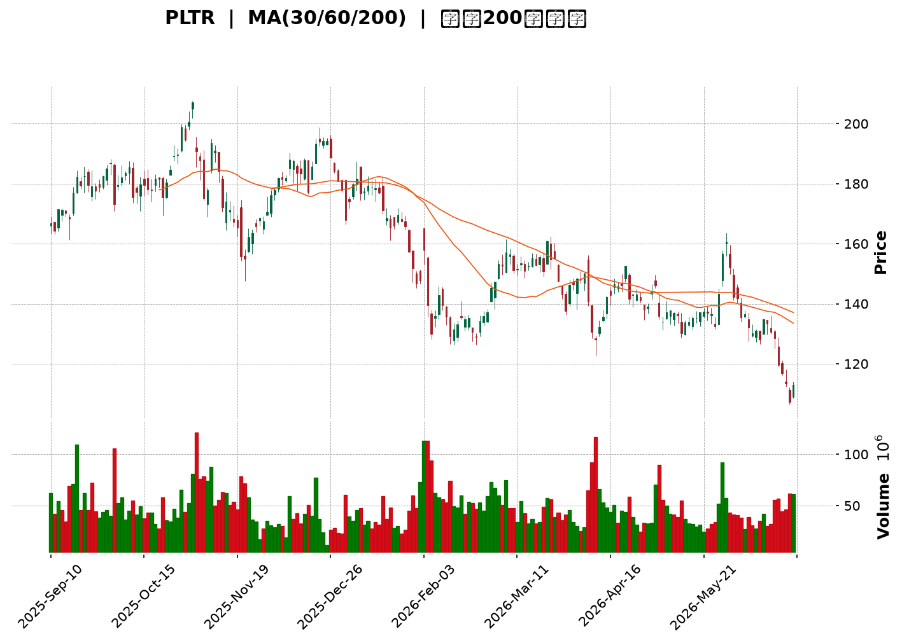
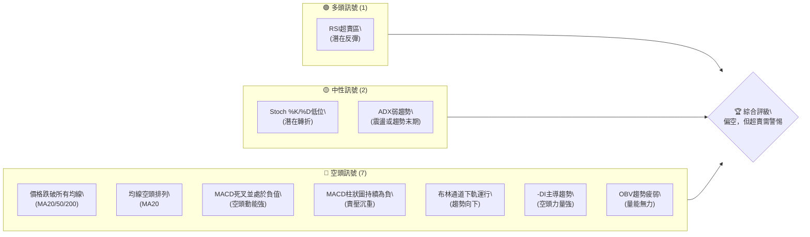
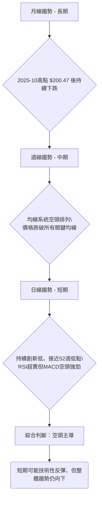
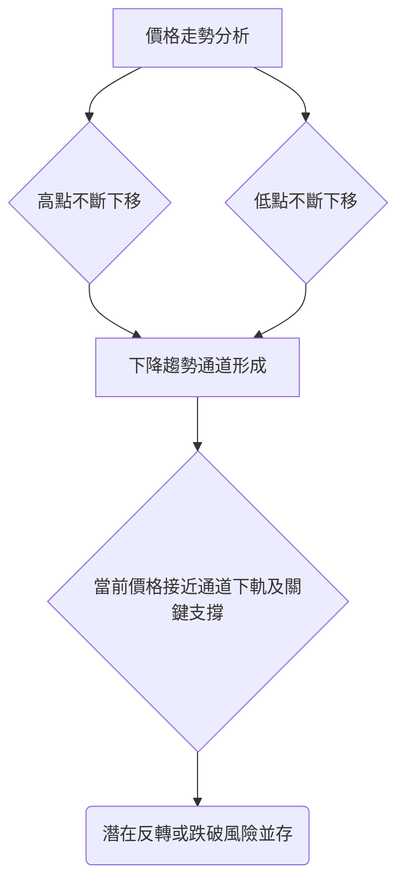
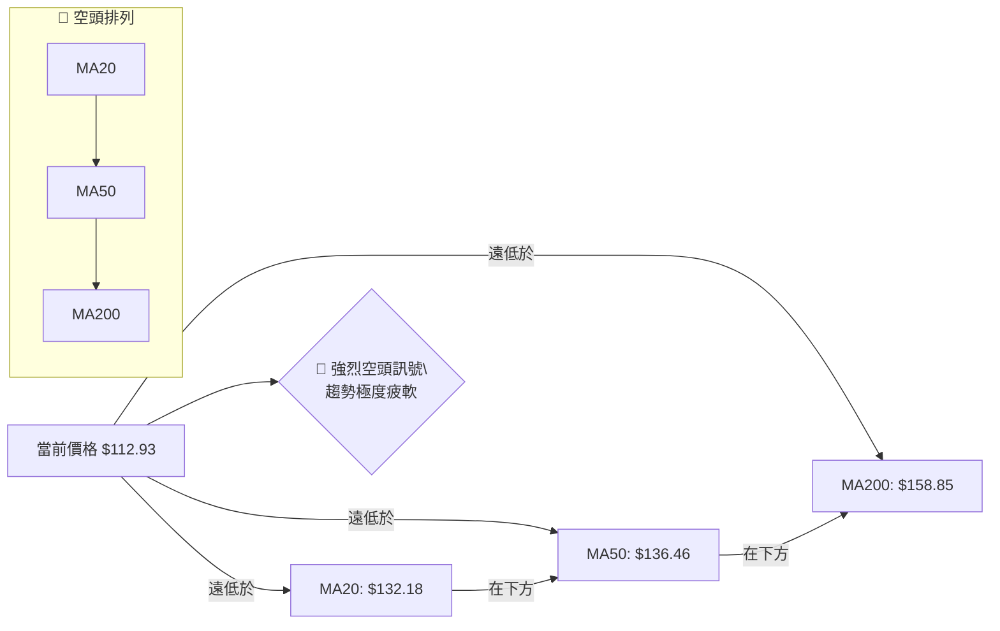
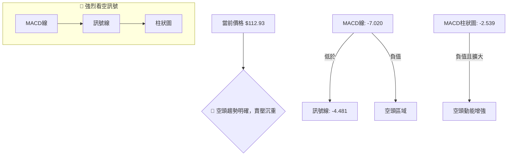
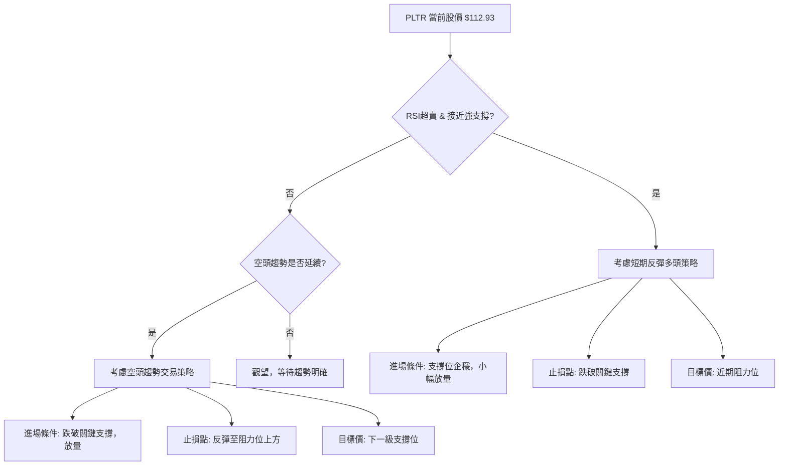

<details>
<summary>📊 靜態圖表 (點擊展開)</summary>

</details>

<html>
<head><meta charset="utf-8" /></head>
<body>
    <div style="height:500px; width:100%;">                        <script>window.PlotlyConfig = {MathJaxConfig: 'local'};</script>
        <script charset="utf-8" src="https://cdn.plot.ly/plotly-3.6.0.min.js" integrity="sha256-QaOVwtVY0T02VaHrr6pnoHLCwayMJp4O5n4YyaE3rJk=" crossorigin="anonymous"></script>                <div id="candlestick-chart" class="plotly-graph-div" style="height:100%; width:100%;"></div>            <script>                window.PLOTLYENV=window.PLOTLYENV || {};                                if (document.getElementById("candlestick-chart")) {                    Plotly.newPlot(                        "candlestick-chart",                        [{"close":{"dtype":"f8","bdata":"AAAAIK7XZEAAAAAghYtkQAAAAIDCbWVAAAAAYLhmZUAAAADgUUhlQAAAAGCPCmVAAAAAQAofZkAAAADgesxmQAAAAGCPamZAAAAAoJnRZkAAAACA63FmQAAAAADXY2ZAAAAAgD0yZkAAAAAghVtmQAAAAKBwzWZAAAAAYGYeZ0AAAACgmWFnQAAAAIA9omVAAAAAwPVwZkAAAACgcMVmQAAAAIDr8WZAAAAAQAovZ0AAAACAFO5lQAAAAGC4JmZAAAAAIK53ZkAAAAAA13NmQAAAAADXQ2ZAAAAAwMxEZkAAAABA4bJmQAAAAOBRsGZAAAAAIK7vZUAAAAAgXI9mQAAAAAApFGdAAAAAgMKlZ0AAAABAM7NnQAAAAIDr2WhAAAAAoJlRaEAAAABACg9pQAAAAIDC5WlAAAAAIK7XZ0AAAADAzHxnQAAAAKCZ4WVAAAAAgMI9ZkAAAAAghTNoQAAAAGC43mdAAAAAoHAFZ0AAAADgeoRlQAAAAOBRwGVAAAAAAABoZUAAAABgj+pkQAAAAKBwrWRAAAAAANd3Y0AAAABAM1tjQAAAAAAASGRAAAAAoJlxZEAAAADgo7hkQAAAAGBmDmVAAAAAIK7vZEAAAACAFFZlQAAAAGCPAmZAAAAAoHA9ZkAAAADgUbhmQAAAACCur2ZAAAAAQOG6ZkAAAADAHn1nQAAAAKBHcWdAAAAAgD3yZkAAAAAAAOhmQAAAAAAAeGdAAAAAoEcpZkAAAACAFDZnQAAAAAApLGhAAAAAIFw\u002faEAAAAAAKURoQAAAAKBwRWhAAAAAYLiWZ0AAAACAwgVnQAAAAEDhmmZAAAAAAAA4ZkAAAAAghftkQAAAAKBHwWVAAAAAYLh2ZkAAAACAwrVmQAAAACCFG2ZAAAAAIK4vZkAAAADAHm1mQAAAAGC4XmZAAAAAwMxMZkAAAACAPSJmQAAAAGC4XmVAAAAAwPUQZUAAAABgj6pkQAAAAMDMvGRAAAAAQDMzZUAAAABACu9kQAAAAGBmtmRAAAAAQDOrY0AAAAAghftiQAAAAEDhUmJAAAAA4FF4YkAAAAAAKbxjQAAAAKBHcWFAAAAA4FFAYEAAAADAzPxgQAAAAMAe3WFAAAAA4FFwYUAAAACAwvVgQAAAAAApJGBAAAAAwB5tYEAAAADgo6BgQAAAAAAp7GBAAAAA4HrcYEAAAAAgrudgQAAAAEAzU2BAAAAAQOEaYEAAAACAFMZgQAAAAIAU\u002fmBAAAAAgBQmYUAAAACgcCViQAAAAEAKZ2JAAAAAgBQmY0AAAACgcBVjQAAAAMAepWNAAAAAgMKNY0AAAADgeuRiQAAAAEAz82JAAAAAAAAwY0AAAABgZt5iQAAAAEAKF2NAAAAAYI9iY0AAAADgoxhjQAAAAIDCdWNAAAAAgMLVYkAAAABA4RpkQAAAAMD1WGNAAAAAYLheY0AAAACA63FiQAAAAIDr4WFAAAAAoJkxYUAAAADA9UhiQAAAACCuT2JAAAAAYLiOYkAAAACAwn1iQAAAAIA9wmJAAAAA4FGYYUAAAAAgrk9gQAAAAIDrAWBAAAAAANeLYEAAAABgZvZgQAAAAMDMxGFAAAAA4FHYYUAAAADgekxiQAAAAOB6PGJAAAAAQAo\u002fYkAAAAAA1xNjQAAAAIA9smFAAAAAQOHiYUAAAABAM+NhQAAAAIDCpWFAAAAAQAo\u002fYUAAAAAghWNhQAAAAIA9AmJAAAAAwPVAYkAAAADAHv1gQAAAAKBHuWBAAAAAoJkhYUAAAACgmTlhQAAAAOB6HGFAAAAAAAAAYUAAAACgmUFgQAAAACBct2BAAAAAIK6\u002fYEAAAADgeuRgQAAAAOBR6GBAAAAAwMwkYUAAAACgRy1hQAAAAAApHGFAAAAAQDMTYUAAAADgUZBgQAAAAEDh6mFAAAAAoEeRY0AAAADAzBRkQAAAAKBwBWNAAAAAYGbGYUAAAABgZrZhQAAAAMD18GBAAAAAQAoPYUAAAACAPYJgQAAAAGC4RmBAAAAAYI9iYEAAAAAgXP9fQAAAAGC41mBAAAAAAACoYEAAAAAAKVRgQAAAAEAKD2BAAAAAAADgXUAAAADAzCxdQAAAAAAAYFxAAAAAoEfRWkAAAAAghTtcQA=="},"high":{"dtype":"f8","bdata":"AAAAAAAgZUAAAADgp+5kQAAAAMD1cGVAAAAAoJl5ZUAAAACA62llQAAAAIDCNWVAAAAAoJlZZkAAAACgcA1nQAAAAAAAyGZAAAAAAAA4Z0AAAABAMxtnQAAAAIA9CmdAAAAAANeDZkAAAAAgXK9mQAAAAOCj2GZAAAAAwPVIZ0AAAABgZoZnQAAAAEDhWmdAAAAAYGbeZkAAAACAwkVnQAAAAOBRCGdAAAAAANdzZ0AAAABAM2NnQAAAAEAKZ2ZAAAAAQOHKZkAAAABAMwtnQAAAAIA9GmdAAAAAQOGyZkAAAABA4eJmQAAAAMByzGZAAAAAYLjGZkAAAACA67FmQAAAAKBwRWdAAAAAYI8aaEAAAADA9fhnQAAAAEAz+2hAAAAAoHD1aEAAAACAwoVpQAAAAOCj8GlAAAAAYGZ2aEAAAACAPcpnQAAAAEDh4mdAAAAAYGZWZkAAAACAwl1oQAAAAKCZHWhAAAAAYI\u002fSZ0AAAABgZtZmQAAAAKBHKWZAAAAAIK7HZUAAAABgj5plQAAAAEAzM2VAAAAAgD3SZUAAAAAghcNjQAAAAKBwpWRAAAAAwMyUZEAAAAAg2QplQAAAAKCZGWVAAAAAQDMjZUAAAAAAAPhlQAAAAMAePWZAAAAAgBROZkAAAABg5cRmQAAAAAAp\u002fGZAAAAAQDPbZkAAAADgesxnQAAAAKCZgWdAAAAAwMxQZ0AAAADA9XhnQAAAAAAAkGdAAAAAAAB4Z0AAAABgj2pnQAAAAAAAYGhAAAAAACncaEAAAAAA12toQAAAAKBwZWhAAAAAQDOLaEAAAABgZmZnQAAAAABUF2dAAAAAwPWwZkAAAABAM6tmQAAAAIA9+mVAAAAAgBSGZkAAAADA9WhnQAAAAMAeNWdAAAAAQApXZkAAAAAAANBmQAAAAEAzo2ZAAAAA4CKzZkAAAABAM5NmQAAAAIDCzWZAAAAAQAp\u002fZUAAAAAgri9lQAAAAAAAIGVAAAAAAACAZUAAAABA4VJlQAAAAIAULmVAAAAAoHChZEAAAAAAKbRjQAAAAAAA4GJAAAAAwMzsYkAAAAAAf6JkQAAAAEAze2NAAAAAIFw\u002fYUAAAADg+zVhQAAAAADXO2JAAAAAgOsxYkAAAAAAAGhhQAAAAOB6\u002fGBAAAAAgOuxYEAAAACAPcpgQAAAAODQnmFAAAAAwB4FYUAAAABguAZhQAAAAKBHgWBAAAAAIK5HYEAAAABA4QJhQAAAAOBRMGFAAAAAQDNDYUAAAADgemRiQAAAAAAAcGJAAAAA4KNQY0AAAAAAKYxjQAAAAGBmLmRAAAAAgBTOY0AAAAAgBpVjQAAAAIBoJWNAAAAAACl8Y0AAAACA61FjQAAAACCFO2NAAAAAAACYY0AAAACAFJZjQAAAAMDMhGNAAAAAwMyUY0AAAABgjyJkQAAAAMDMTGRAAAAA4KMIZEAAAAAA1yNjQAAAAGC4PmJAAAAAANcDYkAAAAAghXtiQAAAAKCZiWJAAAAA4FGQYkAAAAAghdNiQAAAAOCjyGJAAAAAwPWIY0AAAACgR3FhQAAAAGBmJmBAAAAAoHDNYEAAAACAPUJhQAAAAGCP0mFAAAAAoJkxYkAAAADA9YhiQAAAAGBmZmJAAAAAANe7YkAAAACAwhVjQAAAAKBHyWJAAAAAYI\u002fqYUAAAACAPSJiQAAAAEAz+2FAAAAA4FF4YUAAAABgZoZhQAAAAIAUTmJAAAAA4Hq0YkAAAAAgXN9hQAAAAGBm9mBAAAAAYGaeYUAAAAAAKTxhQAAAAOB6JGFAAAAAgMItYUAAAAAgrh9hQAAAACBcz2BAAAAA4Hr0YEAAAACA6\u002f1gQAAAAEAKL2FAAAAAIK4nYUAAAACgmVFhQAAAAOCjYGFAAAAAgMJVYUAAAAAgXPdgQAAAAAAAIGJAAAAAoO24Y0AAAABgZnZkQAAAAKCZ8WNAAAAAgML1YkAAAAAA10tiQAAAAEAKv2FAAAAA4FE4YUAAAAAgrh9hQAAAAIDrpWBAAAAA4KNwYEAAAABA4WJgQAAAACBc32BAAAAAQOHSYEAAAABAMwNhQAAAAIDCbWBAAAAAANcbYEAAAAAAKTxeQAAAAAAAgF1AAAAAoJkJXEAAAADAHoVcQA=="},"hovertemplate":"\u003cb\u003e%{x|%Y-%m-%d}\u003c\u002fb\u003e\u003cbr\u003e\u958b: $%{open:.2f}\u003cbr\u003e\u9ad8: $%{high:.2f}\u003cbr\u003e\u4f4e: $%{low:.2f}\u003cbr\u003e\u6536: $%{close:.2f}\u003cextra\u003e\u003c\u002fextra\u003e","low":{"dtype":"f8","bdata":"AAAAgBRuZEAAAABACmdkQAAAAOBRgGRAAAAAwB7tZEAAAABguB5lQAAAAOCjKGRAAAAA4HosZUAAAABguBZmQAAAAKBHSWZAAAAA4FEgZkAAAAAA1yNmQAAAAKBHyWVAAAAAwB7dZUAAAADAHiVmQAAAAEAKR2ZAAAAAAABwZkAAAABgZt5mQAAAAOCjWGVAAAAAYI86ZkAAAACgcG1mQAAAAGBmpmZAAAAAYGZ+ZkAAAADA9bBlQAAAAGBmrmVAAAAAgD1aZUAAAADgowBmQAAAAGBmDmZAAAAAYGa+ZUAAAACAFC5mQAAAAMDMVGZAAAAAoHAtZUAAAADgUeBlQAAAAEAz22ZAAAAA4KNwZ0AAAADA9VhnQAAAACCuz2dAAAAAANdDaEAAAACgcL1oQAAAAIA9OmlAAAAAgOsxZ0AAAABguKZmQAAAAMD10GVAAAAAwB4dZUAAAADgo\u002fBmQAAAAAApZGdAAAAAwMyMZkAAAABgZFdlQAAAAAAAkGRAAAAAgML1ZEAAAAAAALBkQAAAAKBwTWRAAAAA4KNMY0AAAACA63FiQAAAAAAAoGNAAAAAgMKRY0AAAAAAKXxkQAAAAAAAvGRAAAAAANdjZEAAAABA4TJlQAAAAGCPGmVAAAAAgMLNZUAAAADAHiVmQAAAAKBHcWZAAAAAACmMZkAAAAAAANhmQAAAAGC4hmZAAAAAIFg1ZkAAAADA9YBmQAAAAECLpGZAAAAAAAAQZkAAAADgUbBmQAAAACBcV2dAAAAAgMINaEAAAAAghfdnQAAAAGCPGmhAAAAAANeTZ0AAAADgevRmQAAAAGBmlmZAAAAAAAAoZkAAAABAM8tkQAAAAKBHeWVAAAAA4KPYZUAAAADAHjVmQAAAAADXy2VAAAAAAADYZUAAAABA4QpmQAAAAOB6BGZAAAAAYGa+ZUAAAADA9RBmQAAAAOBRQGVAAAAAIK7HZEAAAAAghSNkQAAAAGBmnmRAAAAAoJnJZEAAAABgZupkQAAAAIAUlmRAAAAAIK6nY0AAAAAA12NiQAAAAMByJGJAAAAAoO1UYkAAAAAA1yNjQAAAAIDC9WBAAAAAgD0KYEAAAABAM4tgQAAAAADV2GBAAAAA4KM4YUAAAABgZp5gQAAAAADXo19AAAAAgOmOX0AAAABgj9JfQAAAAADX22BAAAAA4FFgYEAAAACgcGVgQAAAAMD12F9AAAAAIK6XX0AAAACAwiVgQAAAAAAplGBAAAAAIFy\u002fYEAAAADgo5BhQAAAAGBmRmFAAAAAgOuBYkAAAAAghbNiQAAAAKBHyWJAAAAAQAofY0AAAADgesRiQAAAAGCPqmJAAAAAIFzfYkAAAABgj5JiQAAAAKBw5WJAAAAAANcDY0AAAAAghRNjQAAAAAAA0GJAAAAAQOGiYkAAAAAgridjQAAAAOB69GJAAAAAIFxbY0AAAAAAAGhiQAAAAIDrsWFAAAAAoJkJYUAAAABACl9hQAAAAEAKD2JAAAAAIK4\u002fYUAAAAAgMVRiQAAAAGBmDmJAAAAAoHBlYUAAAABACg9gQAAAACCFq15AAAAAwMwkYEAAAAAAAMBgQAAAAIDC3WBAAAAAwPVwYUAAAACgmelhQAAAAGCP+mFAAAAAwPf\u002fYUAAAADAHm1iQAAAAKBwfWFAAAAAgMJdYUAAAADgUaBhQAAAAKBwjWFAAAAAgMLVYEAAAADAzBRhQAAAAOB6rGFAAAAAQDMnYkAAAABACtdgQAAAAMDMZGBAAAAAwPXYYEAAAADgo6BgQAAAAACsmGBAAAAAYLiuYEAAAAAAABhgQAAAAGBmLmBAAAAAoEeJYEAAAABgj2pgQAAAAEAzs2BAAAAAoHCNYEAAAACgcO1gQAAAAKCZyWBAAAAAoJmpYEAAAAAAKXRgQAAAAAAAoGBAAAAAoEc5YkAAAAAAKXxjQAAAAKCZuWJAAAAAAACoYUAAAABAtIhhQAAAAMDMwGBAAAAAwPXoYEAAAABgZtZfQAAAAKCZGWBAAAAAQOHKX0AAAACgmalfQAAAAGBmNmBAAAAAANczYEAAAACgcD1gQAAAAOCjQF9AAAAAwMzMXUAAAAAghQtdQAAAAAAAEFxAAAAAIK6XWkAAAACAFB5bQA=="},"name":"\u50f9\u683c","open":{"dtype":"f8","bdata":"AAAAAADAZEAAAAAgrudkQAAAAEAzq2RAAAAAQDMzZUAAAACgR2FlQAAAAOCjIGVAAAAA4KNIZUAAAACAPSJmQAAAAAApnGZAAAAA4FHQZkAAAADAHv1mQAAAAKCZ+WVAAAAAoJlhZkAAAADgenRmQAAAACBcX2ZAAAAAgD2qZkAAAABgZlZnQAAAAMDMTGdAAAAAgMJlZkAAAACA64lmQAAAAKCZ2WZAAAAAYI\u002fyZkAAAACgcCVnQAAAAIDCVWZAAAAAAAAAZkAAAADA9bRmQAAAAMD1uGZAAAAAAAA4ZkAAAAAgrm9mQAAAAIDrwWZAAAAAgMK9ZkAAAACAPe5lQAAAAAAp3GZAAAAAQAqfZ0AAAAAgXK9nQAAAAGCP4mdAAAAAoJnNaEAAAABgZuZoQAAAAKBwoWlAAAAAgD0CaEAAAAAAAKBnQAAAACCuf2dAAAAAwMykZUAAAACA6wlnQAAAAGC4ymdAAAAAYI\u002fSZ0AAAABA4bZmQAAAAEAz32RAAAAAwPVQZUAAAAAA1wtlQAAAAKCZ+WRAAAAAgD2CZUAAAADgUYBjQAAAAEAKr2NAAAAAgD0CZEAAAABAM9tkQAAAAOBR+GRAAAAAAACgZEAAAABA4TJlQAAAAOB6RGVAAAAAIK4LZkAAAAAgXEdmQAAAAGC4xmZAAAAAQAqfZkAAAABgZh5nQAAAAKCZGWdAAAAAgOs5Z0AAAABgjyJnQAAAAMD1tGZAAAAAQOF2Z0AAAADgUbBmQAAAACCuV2dAAAAAoEdhaEAAAABgZhpoQAAAAMAeJWhAAAAA4HpgaEAAAABAM1tnQAAAAEAzC2dAAAAAACmkZkAAAACgmalmQAAAAAAp3GVAAAAA4FH4ZUAAAACgmXlmQAAAACCuM2dAAAAA4KMgZkAAAACA6zVmQAAAAAAAXGZAAAAAAABEZkAAAABguFZmQAAAACCFa2ZAAAAAAAD0ZEAAAAAg3QxlQAAAAKCZHWVAAAAA4KPoZEAAAABguAZlQAAAACBc72RAAAAAwMyMZEAAAAAAKbRjQAAAAKCZwWJAAAAAgBTeYkAAAACgmaFkQAAAAMAebWNAAAAAgD0aYUAAAABgj+pgQAAAAGCPEmFAAAAAQOEeYkAAAADAzGBhQAAAACCF62BAAAAAoJn5X0AAAADgoxxgQAAAAOB6\u002fGBAAAAAgOuJYEAAAAAgrotgQAAAAKBHgWBAAAAAACkgYEAAAAAghVNgQAAAAEAKu2BAAAAAgD3CYEAAAADAzJhhQAAAAEAzw2FAAAAAgMKNYkAAAACAFB5jQAAAAIAUzmJAAAAAgBR2Y0AAAAAgrn9jQAAAAAAp7GJAAAAA4FEgY0AAAACgmSljQAAAAGBmDmNAAAAAwPUMY0AAAACAPV5jQAAAAEAzI2NAAAAAYGZmY0AAAAAgridjQAAAAIA9AmRAAAAAoHCtY0AAAACAwiFjQAAAAAApPGJAAAAA4KPoYUAAAADgo4BhQAAAAAAAYGJAAAAAIIXvYUAAAAAghYtiQAAAAGA5XGJAAAAA4HpYY0AAAADgo2xhQAAAACBcD2BAAAAAIFxHYEAAAAAAqs1gQAAAAKBHGWFAAAAAoEcJYkAAAACAFCpiQAAAAAAAIGJAAAAAgOtZYkAAAAAghYtiQAAAAGBmtmJAAAAAYLjeYUAAAAAAAKhhQAAAAKCZyWFAAAAA4FF4YUAAAABAM09hQAAAAAAA6GFAAAAAAAB4YkAAAACgcIlhQAAAAGC4tmBAAAAAQDPjYEAAAAAgrvtgQAAAAMAe3WBAAAAAQDMTYUAAAAAgMcBgQAAAAMDMNGBAAAAAoJmZYEAAAAAAAJBgQAAAAKBw5WBAAAAA4KPEYEAAAACgmflgQAAAAKCZLWFAAAAAwB4FYUAAAACgmalgQAAAAMAepWBAAAAAYGZ6YkAAAAAgXP9jQAAAAIAUlmNAAAAAYGa2YkAAAABguC5iQAAAAGBmimFAAAAAgML1YEAAAAAA19tgQAAAAGBmKmBAAAAAwPUYYEAAAACgR11gQAAAAOCjQGBAAAAAQOHSYEAAAADgUXhgQAAAAEDhWmBAAAAAIFxvX0AAAACgmQleQAAAACCuh1xAAAAA4FHYW0AAAABgj0JbQA=="},"x":["2025-09-10T00:00:00-04:00","2025-09-11T00:00:00-04:00","2025-09-12T00:00:00-04:00","2025-09-15T00:00:00-04:00","2025-09-16T00:00:00-04:00","2025-09-17T00:00:00-04:00","2025-09-18T00:00:00-04:00","2025-09-19T00:00:00-04:00","2025-09-22T00:00:00-04:00","2025-09-23T00:00:00-04:00","2025-09-24T00:00:00-04:00","2025-09-25T00:00:00-04:00","2025-09-26T00:00:00-04:00","2025-09-29T00:00:00-04:00","2025-09-30T00:00:00-04:00","2025-10-01T00:00:00-04:00","2025-10-02T00:00:00-04:00","2025-10-03T00:00:00-04:00","2025-10-06T00:00:00-04:00","2025-10-07T00:00:00-04:00","2025-10-08T00:00:00-04:00","2025-10-09T00:00:00-04:00","2025-10-10T00:00:00-04:00","2025-10-13T00:00:00-04:00","2025-10-14T00:00:00-04:00","2025-10-15T00:00:00-04:00","2025-10-16T00:00:00-04:00","2025-10-17T00:00:00-04:00","2025-10-20T00:00:00-04:00","2025-10-21T00:00:00-04:00","2025-10-22T00:00:00-04:00","2025-10-23T00:00:00-04:00","2025-10-24T00:00:00-04:00","2025-10-27T00:00:00-04:00","2025-10-28T00:00:00-04:00","2025-10-29T00:00:00-04:00","2025-10-30T00:00:00-04:00","2025-10-31T00:00:00-04:00","2025-11-03T00:00:00-05:00","2025-11-04T00:00:00-05:00","2025-11-05T00:00:00-05:00","2025-11-06T00:00:00-05:00","2025-11-07T00:00:00-05:00","2025-11-10T00:00:00-05:00","2025-11-11T00:00:00-05:00","2025-11-12T00:00:00-05:00","2025-11-13T00:00:00-05:00","2025-11-14T00:00:00-05:00","2025-11-17T00:00:00-05:00","2025-11-18T00:00:00-05:00","2025-11-19T00:00:00-05:00","2025-11-20T00:00:00-05:00","2025-11-21T00:00:00-05:00","2025-11-24T00:00:00-05:00","2025-11-25T00:00:00-05:00","2025-11-26T00:00:00-05:00","2025-11-28T00:00:00-05:00","2025-12-01T00:00:00-05:00","2025-12-02T00:00:00-05:00","2025-12-03T00:00:00-05:00","2025-12-04T00:00:00-05:00","2025-12-05T00:00:00-05:00","2025-12-08T00:00:00-05:00","2025-12-09T00:00:00-05:00","2025-12-10T00:00:00-05:00","2025-12-11T00:00:00-05:00","2025-12-12T00:00:00-05:00","2025-12-15T00:00:00-05:00","2025-12-16T00:00:00-05:00","2025-12-17T00:00:00-05:00","2025-12-18T00:00:00-05:00","2025-12-19T00:00:00-05:00","2025-12-22T00:00:00-05:00","2025-12-23T00:00:00-05:00","2025-12-24T00:00:00-05:00","2025-12-26T00:00:00-05:00","2025-12-29T00:00:00-05:00","2025-12-30T00:00:00-05:00","2025-12-31T00:00:00-05:00","2026-01-02T00:00:00-05:00","2026-01-05T00:00:00-05:00","2026-01-06T00:00:00-05:00","2026-01-07T00:00:00-05:00","2026-01-08T00:00:00-05:00","2026-01-09T00:00:00-05:00","2026-01-12T00:00:00-05:00","2026-01-13T00:00:00-05:00","2026-01-14T00:00:00-05:00","2026-01-15T00:00:00-05:00","2026-01-16T00:00:00-05:00","2026-01-20T00:00:00-05:00","2026-01-21T00:00:00-05:00","2026-01-22T00:00:00-05:00","2026-01-23T00:00:00-05:00","2026-01-26T00:00:00-05:00","2026-01-27T00:00:00-05:00","2026-01-28T00:00:00-05:00","2026-01-29T00:00:00-05:00","2026-01-30T00:00:00-05:00","2026-02-02T00:00:00-05:00","2026-02-03T00:00:00-05:00","2026-02-04T00:00:00-05:00","2026-02-05T00:00:00-05:00","2026-02-06T00:00:00-05:00","2026-02-09T00:00:00-05:00","2026-02-10T00:00:00-05:00","2026-02-11T00:00:00-05:00","2026-02-12T00:00:00-05:00","2026-02-13T00:00:00-05:00","2026-02-17T00:00:00-05:00","2026-02-18T00:00:00-05:00","2026-02-19T00:00:00-05:00","2026-02-20T00:00:00-05:00","2026-02-23T00:00:00-05:00","2026-02-24T00:00:00-05:00","2026-02-25T00:00:00-05:00","2026-02-26T00:00:00-05:00","2026-02-27T00:00:00-05:00","2026-03-02T00:00:00-05:00","2026-03-03T00:00:00-05:00","2026-03-04T00:00:00-05:00","2026-03-05T00:00:00-05:00","2026-03-06T00:00:00-05:00","2026-03-09T00:00:00-04:00","2026-03-10T00:00:00-04:00","2026-03-11T00:00:00-04:00","2026-03-12T00:00:00-04:00","2026-03-13T00:00:00-04:00","2026-03-16T00:00:00-04:00","2026-03-17T00:00:00-04:00","2026-03-18T00:00:00-04:00","2026-03-19T00:00:00-04:00","2026-03-20T00:00:00-04:00","2026-03-23T00:00:00-04:00","2026-03-24T00:00:00-04:00","2026-03-25T00:00:00-04:00","2026-03-26T00:00:00-04:00","2026-03-27T00:00:00-04:00","2026-03-30T00:00:00-04:00","2026-03-31T00:00:00-04:00","2026-04-01T00:00:00-04:00","2026-04-02T00:00:00-04:00","2026-04-06T00:00:00-04:00","2026-04-07T00:00:00-04:00","2026-04-08T00:00:00-04:00","2026-04-09T00:00:00-04:00","2026-04-10T00:00:00-04:00","2026-04-13T00:00:00-04:00","2026-04-14T00:00:00-04:00","2026-04-15T00:00:00-04:00","2026-04-16T00:00:00-04:00","2026-04-17T00:00:00-04:00","2026-04-20T00:00:00-04:00","2026-04-21T00:00:00-04:00","2026-04-22T00:00:00-04:00","2026-04-23T00:00:00-04:00","2026-04-24T00:00:00-04:00","2026-04-27T00:00:00-04:00","2026-04-28T00:00:00-04:00","2026-04-29T00:00:00-04:00","2026-04-30T00:00:00-04:00","2026-05-01T00:00:00-04:00","2026-05-04T00:00:00-04:00","2026-05-05T00:00:00-04:00","2026-05-06T00:00:00-04:00","2026-05-07T00:00:00-04:00","2026-05-08T00:00:00-04:00","2026-05-11T00:00:00-04:00","2026-05-12T00:00:00-04:00","2026-05-13T00:00:00-04:00","2026-05-14T00:00:00-04:00","2026-05-15T00:00:00-04:00","2026-05-18T00:00:00-04:00","2026-05-19T00:00:00-04:00","2026-05-20T00:00:00-04:00","2026-05-21T00:00:00-04:00","2026-05-22T00:00:00-04:00","2026-05-26T00:00:00-04:00","2026-05-27T00:00:00-04:00","2026-05-28T00:00:00-04:00","2026-05-29T00:00:00-04:00","2026-06-01T00:00:00-04:00","2026-06-02T00:00:00-04:00","2026-06-03T00:00:00-04:00","2026-06-04T00:00:00-04:00","2026-06-05T00:00:00-04:00","2026-06-08T00:00:00-04:00","2026-06-09T00:00:00-04:00","2026-06-10T00:00:00-04:00","2026-06-11T00:00:00-04:00","2026-06-12T00:00:00-04:00","2026-06-15T00:00:00-04:00","2026-06-16T00:00:00-04:00","2026-06-17T00:00:00-04:00","2026-06-18T00:00:00-04:00","2026-06-22T00:00:00-04:00","2026-06-23T00:00:00-04:00","2026-06-24T00:00:00-04:00","2026-06-25T00:00:00-04:00","2026-06-26T00:00:00-04:00"],"type":"candlestick"},{"hovertemplate":"MA30: $%{y:.2f}\u003cextra\u003e\u003c\u002fextra\u003e","line":{"color":"#2196F3","dash":"dash","width":2},"mode":"lines","name":"MA30","x":["2025-09-10T00:00:00-04:00","2025-09-11T00:00:00-04:00","2025-09-12T00:00:00-04:00","2025-09-15T00:00:00-04:00","2025-09-16T00:00:00-04:00","2025-09-17T00:00:00-04:00","2025-09-18T00:00:00-04:00","2025-09-19T00:00:00-04:00","2025-09-22T00:00:00-04:00","2025-09-23T00:00:00-04:00","2025-09-24T00:00:00-04:00","2025-09-25T00:00:00-04:00","2025-09-26T00:00:00-04:00","2025-09-29T00:00:00-04:00","2025-09-30T00:00:00-04:00","2025-10-01T00:00:00-04:00","2025-10-02T00:00:00-04:00","2025-10-03T00:00:00-04:00","2025-10-06T00:00:00-04:00","2025-10-07T00:00:00-04:00","2025-10-08T00:00:00-04:00","2025-10-09T00:00:00-04:00","2025-10-10T00:00:00-04:00","2025-10-13T00:00:00-04:00","2025-10-14T00:00:00-04:00","2025-10-15T00:00:00-04:00","2025-10-16T00:00:00-04:00","2025-10-17T00:00:00-04:00","2025-10-20T00:00:00-04:00","2025-10-21T00:00:00-04:00","2025-10-22T00:00:00-04:00","2025-10-23T00:00:00-04:00","2025-10-24T00:00:00-04:00","2025-10-27T00:00:00-04:00","2025-10-28T00:00:00-04:00","2025-10-29T00:00:00-04:00","2025-10-30T00:00:00-04:00","2025-10-31T00:00:00-04:00","2025-11-03T00:00:00-05:00","2025-11-04T00:00:00-05:00","2025-11-05T00:00:00-05:00","2025-11-06T00:00:00-05:00","2025-11-07T00:00:00-05:00","2025-11-10T00:00:00-05:00","2025-11-11T00:00:00-05:00","2025-11-12T00:00:00-05:00","2025-11-13T00:00:00-05:00","2025-11-14T00:00:00-05:00","2025-11-17T00:00:00-05:00","2025-11-18T00:00:00-05:00","2025-11-19T00:00:00-05:00","2025-11-20T00:00:00-05:00","2025-11-21T00:00:00-05:00","2025-11-24T00:00:00-05:00","2025-11-25T00:00:00-05:00","2025-11-26T00:00:00-05:00","2025-11-28T00:00:00-05:00","2025-12-01T00:00:00-05:00","2025-12-02T00:00:00-05:00","2025-12-03T00:00:00-05:00","2025-12-04T00:00:00-05:00","2025-12-05T00:00:00-05:00","2025-12-08T00:00:00-05:00","2025-12-09T00:00:00-05:00","2025-12-10T00:00:00-05:00","2025-12-11T00:00:00-05:00","2025-12-12T00:00:00-05:00","2025-12-15T00:00:00-05:00","2025-12-16T00:00:00-05:00","2025-12-17T00:00:00-05:00","2025-12-18T00:00:00-05:00","2025-12-19T00:00:00-05:00","2025-12-22T00:00:00-05:00","2025-12-23T00:00:00-05:00","2025-12-24T00:00:00-05:00","2025-12-26T00:00:00-05:00","2025-12-29T00:00:00-05:00","2025-12-30T00:00:00-05:00","2025-12-31T00:00:00-05:00","2026-01-02T00:00:00-05:00","2026-01-05T00:00:00-05:00","2026-01-06T00:00:00-05:00","2026-01-07T00:00:00-05:00","2026-01-08T00:00:00-05:00","2026-01-09T00:00:00-05:00","2026-01-12T00:00:00-05:00","2026-01-13T00:00:00-05:00","2026-01-14T00:00:00-05:00","2026-01-15T00:00:00-05:00","2026-01-16T00:00:00-05:00","2026-01-20T00:00:00-05:00","2026-01-21T00:00:00-05:00","2026-01-22T00:00:00-05:00","2026-01-23T00:00:00-05:00","2026-01-26T00:00:00-05:00","2026-01-27T00:00:00-05:00","2026-01-28T00:00:00-05:00","2026-01-29T00:00:00-05:00","2026-01-30T00:00:00-05:00","2026-02-02T00:00:00-05:00","2026-02-03T00:00:00-05:00","2026-02-04T00:00:00-05:00","2026-02-05T00:00:00-05:00","2026-02-06T00:00:00-05:00","2026-02-09T00:00:00-05:00","2026-02-10T00:00:00-05:00","2026-02-11T00:00:00-05:00","2026-02-12T00:00:00-05:00","2026-02-13T00:00:00-05:00","2026-02-17T00:00:00-05:00","2026-02-18T00:00:00-05:00","2026-02-19T00:00:00-05:00","2026-02-20T00:00:00-05:00","2026-02-23T00:00:00-05:00","2026-02-24T00:00:00-05:00","2026-02-25T00:00:00-05:00","2026-02-26T00:00:00-05:00","2026-02-27T00:00:00-05:00","2026-03-02T00:00:00-05:00","2026-03-03T00:00:00-05:00","2026-03-04T00:00:00-05:00","2026-03-05T00:00:00-05:00","2026-03-06T00:00:00-05:00","2026-03-09T00:00:00-04:00","2026-03-10T00:00:00-04:00","2026-03-11T00:00:00-04:00","2026-03-12T00:00:00-04:00","2026-03-13T00:00:00-04:00","2026-03-16T00:00:00-04:00","2026-03-17T00:00:00-04:00","2026-03-18T00:00:00-04:00","2026-03-19T00:00:00-04:00","2026-03-20T00:00:00-04:00","2026-03-23T00:00:00-04:00","2026-03-24T00:00:00-04:00","2026-03-25T00:00:00-04:00","2026-03-26T00:00:00-04:00","2026-03-27T00:00:00-04:00","2026-03-30T00:00:00-04:00","2026-03-31T00:00:00-04:00","2026-04-01T00:00:00-04:00","2026-04-02T00:00:00-04:00","2026-04-06T00:00:00-04:00","2026-04-07T00:00:00-04:00","2026-04-08T00:00:00-04:00","2026-04-09T00:00:00-04:00","2026-04-10T00:00:00-04:00","2026-04-13T00:00:00-04:00","2026-04-14T00:00:00-04:00","2026-04-15T00:00:00-04:00","2026-04-16T00:00:00-04:00","2026-04-17T00:00:00-04:00","2026-04-20T00:00:00-04:00","2026-04-21T00:00:00-04:00","2026-04-22T00:00:00-04:00","2026-04-23T00:00:00-04:00","2026-04-24T00:00:00-04:00","2026-04-27T00:00:00-04:00","2026-04-28T00:00:00-04:00","2026-04-29T00:00:00-04:00","2026-04-30T00:00:00-04:00","2026-05-01T00:00:00-04:00","2026-05-04T00:00:00-04:00","2026-05-05T00:00:00-04:00","2026-05-06T00:00:00-04:00","2026-05-07T00:00:00-04:00","2026-05-08T00:00:00-04:00","2026-05-11T00:00:00-04:00","2026-05-12T00:00:00-04:00","2026-05-13T00:00:00-04:00","2026-05-14T00:00:00-04:00","2026-05-15T00:00:00-04:00","2026-05-18T00:00:00-04:00","2026-05-19T00:00:00-04:00","2026-05-20T00:00:00-04:00","2026-05-21T00:00:00-04:00","2026-05-22T00:00:00-04:00","2026-05-26T00:00:00-04:00","2026-05-27T00:00:00-04:00","2026-05-28T00:00:00-04:00","2026-05-29T00:00:00-04:00","2026-06-01T00:00:00-04:00","2026-06-02T00:00:00-04:00","2026-06-03T00:00:00-04:00","2026-06-04T00:00:00-04:00","2026-06-05T00:00:00-04:00","2026-06-08T00:00:00-04:00","2026-06-09T00:00:00-04:00","2026-06-10T00:00:00-04:00","2026-06-11T00:00:00-04:00","2026-06-12T00:00:00-04:00","2026-06-15T00:00:00-04:00","2026-06-16T00:00:00-04:00","2026-06-17T00:00:00-04:00","2026-06-18T00:00:00-04:00","2026-06-22T00:00:00-04:00","2026-06-23T00:00:00-04:00","2026-06-24T00:00:00-04:00","2026-06-25T00:00:00-04:00","2026-06-26T00:00:00-04:00"],"y":{"dtype":"f8","bdata":"AAAAAAAA+H8AAAAAAAD4fwAAAAAAAPh\u002fAAAAAAAA+H8AAAAAAAD4fwAAAAAAAPh\u002fAAAAAAAA+H8AAAAAAAD4fwAAAAAAAPh\u002fAAAAAAAA+H8AAAAAAAD4fwAAAAAAAPh\u002fAAAAAAAA+H8AAAAAAAD4fwAAAAAAAPh\u002fAAAAAAAA+H8AAAAAAAD4fwAAAAAAAPh\u002fAAAAAAAA+H8AAAAAAAD4fwAAAAAAAPh\u002fAAAAAAAA+H8AAAAAAAD4fwAAAAAAAPh\u002fAAAAAAAA+H8AAAAAAAD4fwAAAAAAAPh\u002fAAAAAAAA+H8AAAAAAAD4fzMzM1MqPmZAiYiIqH9HZkDe3d19sVhmQJqZmfnFZmZAq6qq+vB5ZkB3d3cXko5mQJqZmSkVr2ZAzczMrNXBZkCJiIi4HtVmQAAAAKDT8mZAq6qqCpD7ZkCrqqpqdQRnQJqZmQkeAGdAZmZmVoAAZ0AiIiISPBBnQAAAABBYGWdAIiIiEoMYZ0BVVVWlmwhnQDMzM1OcCWdAVVVVVccAZ0BmZmYG8\u002fBmQImIiJiZ3WZAAAAAsOS9ZkDv7u4+7qdmQKuqqir5l2ZAd3d3N7SGZkDv7u4+7ndmQBEREbGdbWZA3t3dzT5iZkARERFhnlZmQBEREaHTUGZA3t3dLWtTZkBERES0yFRmQGZmZkZvUWZAd3d395pJZkC8u7t7zUdmQFVVVQXIO2ZAAAAAwBEwZkCrqqqKsx1mQLy7u9v5CGZAvLu7G6H6ZUAiIiKiRfhlQCIiIvLSC2ZAq6qqqvEcZkCamZmpfx1mQERERDTsIGZA3t3d7cMlZkBmZmammzJmQCIiIrLkOWZAERERodNAZkCrqqpaZEFmQAAAADCWSmZAvLu7OyZkZkC8u7ubxIBmQM3MzBxakGZAmpmZqTifZkCrqqpKxa1mQJqZmTn7uGZAERERYZ7EZkC8u7uLbMtmQCIiInL2xWZAmpmZWfK7ZkDe3d3da6pmQBEREcHKmWZAvLu7a7yMZkAAAADw7nZmQJqZmSmjX2ZAq6qqWqtDZkCrqqrKLyJmQN7d3V1I9mVAVVVVtcjWZUCamZm5HrllQAAAANCwf2VAzczMvHQ7ZUAAAAAQWP1kQKuqqqqqxmRAiYiIyC+SZEDNzMwMdF5kQGZmZsZLJ2RA3t3d3d31Y0CamZk5tNBjQImIiHh3p2NA7+7unqh3Y0CJiIhoH0ZjQImIiFjHFGNAZmZmpuLgYkAzMzOTprBiQO\u002fu7j7DgmJAvLu7K85WYkB3d3dXxzRiQM3MzLx0G2JAVVVV5RcLYkDv7u7elv1hQFVVVUVE9GFAq6qq+jfmYUDNzMzMzNRhQAAAAJDCxWFAERERQafBYUAzMzPDrsBhQJqZmak4x2FAMzMzgwfPYUBEREQklMlhQAAAAHDL2mFAmpmZudfwYUAiIiICcgtiQO\u002fu7k4bGGJAERERMZYoYkCamZk5QjViQKuqqgoeRGJAvLu7q6pKYkCJiIiIz1hiQN7d3U2pZGJAIiIi0iJzYkCJiIgIrIBiQERERKRwlWJAiYiImCeiYkAAAABANZ5iQLy7u3vNlWJAzczMTKmQYkC8u7tbj4ZiQImIiOgmgWJAIiIi0gZ2YkBmZmb2U29iQAAAAIBOY2JAmpmZOSZYYkDNzMxculliQBEREYEHT2JAERER4exDYkDv7u5OjTtiQN7d3R0+L2JAIiIi8v0cYkCrqqraaw5iQN7d3Y0JAmJAvLu7yxP9YUDv7u4+fOJhQDMzM5MYzGFAMzMz8\u002f24YUAiIiLSlK5hQAAAAAAAqGFA7+7uvlimYUAAAADgCJVhQKuqqopsh2FARERERP13YUDv7u6+WGphQAAAAKCMWmFAq6qq2rJWYUBmZmbWFV5hQJqZmUl+Z2FAzczMXAFsYUB3d3dHmmhhQKuqqjrfaWFAZmZmFpJ4YUBEREQEyIdhQAAAAOB6jmFAmpmZaXWKYUBmZmaGz35hQDMzMzNeeGFAAAAAgE5xYUAzMzOTimVhQJqZmQnXWWFAvLu7m31SYUAzMzMboUZhQLy7uzOlPGFAERERaQMvYUBmZmaeYSlhQAAAAOi0I2FA3t3dlfwQYUCJiIjgevpgQBEREdmH4WBAREREpOLCYEBVVVW9n7BgQA=="},"type":"scatter"},{"hovertemplate":"MA60: $%{y:.2f}\u003cextra\u003e\u003c\u002fextra\u003e","line":{"color":"#9C27B0","dash":"dash","width":2},"mode":"lines","name":"MA60","x":["2025-09-10T00:00:00-04:00","2025-09-11T00:00:00-04:00","2025-09-12T00:00:00-04:00","2025-09-15T00:00:00-04:00","2025-09-16T00:00:00-04:00","2025-09-17T00:00:00-04:00","2025-09-18T00:00:00-04:00","2025-09-19T00:00:00-04:00","2025-09-22T00:00:00-04:00","2025-09-23T00:00:00-04:00","2025-09-24T00:00:00-04:00","2025-09-25T00:00:00-04:00","2025-09-26T00:00:00-04:00","2025-09-29T00:00:00-04:00","2025-09-30T00:00:00-04:00","2025-10-01T00:00:00-04:00","2025-10-02T00:00:00-04:00","2025-10-03T00:00:00-04:00","2025-10-06T00:00:00-04:00","2025-10-07T00:00:00-04:00","2025-10-08T00:00:00-04:00","2025-10-09T00:00:00-04:00","2025-10-10T00:00:00-04:00","2025-10-13T00:00:00-04:00","2025-10-14T00:00:00-04:00","2025-10-15T00:00:00-04:00","2025-10-16T00:00:00-04:00","2025-10-17T00:00:00-04:00","2025-10-20T00:00:00-04:00","2025-10-21T00:00:00-04:00","2025-10-22T00:00:00-04:00","2025-10-23T00:00:00-04:00","2025-10-24T00:00:00-04:00","2025-10-27T00:00:00-04:00","2025-10-28T00:00:00-04:00","2025-10-29T00:00:00-04:00","2025-10-30T00:00:00-04:00","2025-10-31T00:00:00-04:00","2025-11-03T00:00:00-05:00","2025-11-04T00:00:00-05:00","2025-11-05T00:00:00-05:00","2025-11-06T00:00:00-05:00","2025-11-07T00:00:00-05:00","2025-11-10T00:00:00-05:00","2025-11-11T00:00:00-05:00","2025-11-12T00:00:00-05:00","2025-11-13T00:00:00-05:00","2025-11-14T00:00:00-05:00","2025-11-17T00:00:00-05:00","2025-11-18T00:00:00-05:00","2025-11-19T00:00:00-05:00","2025-11-20T00:00:00-05:00","2025-11-21T00:00:00-05:00","2025-11-24T00:00:00-05:00","2025-11-25T00:00:00-05:00","2025-11-26T00:00:00-05:00","2025-11-28T00:00:00-05:00","2025-12-01T00:00:00-05:00","2025-12-02T00:00:00-05:00","2025-12-03T00:00:00-05:00","2025-12-04T00:00:00-05:00","2025-12-05T00:00:00-05:00","2025-12-08T00:00:00-05:00","2025-12-09T00:00:00-05:00","2025-12-10T00:00:00-05:00","2025-12-11T00:00:00-05:00","2025-12-12T00:00:00-05:00","2025-12-15T00:00:00-05:00","2025-12-16T00:00:00-05:00","2025-12-17T00:00:00-05:00","2025-12-18T00:00:00-05:00","2025-12-19T00:00:00-05:00","2025-12-22T00:00:00-05:00","2025-12-23T00:00:00-05:00","2025-12-24T00:00:00-05:00","2025-12-26T00:00:00-05:00","2025-12-29T00:00:00-05:00","2025-12-30T00:00:00-05:00","2025-12-31T00:00:00-05:00","2026-01-02T00:00:00-05:00","2026-01-05T00:00:00-05:00","2026-01-06T00:00:00-05:00","2026-01-07T00:00:00-05:00","2026-01-08T00:00:00-05:00","2026-01-09T00:00:00-05:00","2026-01-12T00:00:00-05:00","2026-01-13T00:00:00-05:00","2026-01-14T00:00:00-05:00","2026-01-15T00:00:00-05:00","2026-01-16T00:00:00-05:00","2026-01-20T00:00:00-05:00","2026-01-21T00:00:00-05:00","2026-01-22T00:00:00-05:00","2026-01-23T00:00:00-05:00","2026-01-26T00:00:00-05:00","2026-01-27T00:00:00-05:00","2026-01-28T00:00:00-05:00","2026-01-29T00:00:00-05:00","2026-01-30T00:00:00-05:00","2026-02-02T00:00:00-05:00","2026-02-03T00:00:00-05:00","2026-02-04T00:00:00-05:00","2026-02-05T00:00:00-05:00","2026-02-06T00:00:00-05:00","2026-02-09T00:00:00-05:00","2026-02-10T00:00:00-05:00","2026-02-11T00:00:00-05:00","2026-02-12T00:00:00-05:00","2026-02-13T00:00:00-05:00","2026-02-17T00:00:00-05:00","2026-02-18T00:00:00-05:00","2026-02-19T00:00:00-05:00","2026-02-20T00:00:00-05:00","2026-02-23T00:00:00-05:00","2026-02-24T00:00:00-05:00","2026-02-25T00:00:00-05:00","2026-02-26T00:00:00-05:00","2026-02-27T00:00:00-05:00","2026-03-02T00:00:00-05:00","2026-03-03T00:00:00-05:00","2026-03-04T00:00:00-05:00","2026-03-05T00:00:00-05:00","2026-03-06T00:00:00-05:00","2026-03-09T00:00:00-04:00","2026-03-10T00:00:00-04:00","2026-03-11T00:00:00-04:00","2026-03-12T00:00:00-04:00","2026-03-13T00:00:00-04:00","2026-03-16T00:00:00-04:00","2026-03-17T00:00:00-04:00","2026-03-18T00:00:00-04:00","2026-03-19T00:00:00-04:00","2026-03-20T00:00:00-04:00","2026-03-23T00:00:00-04:00","2026-03-24T00:00:00-04:00","2026-03-25T00:00:00-04:00","2026-03-26T00:00:00-04:00","2026-03-27T00:00:00-04:00","2026-03-30T00:00:00-04:00","2026-03-31T00:00:00-04:00","2026-04-01T00:00:00-04:00","2026-04-02T00:00:00-04:00","2026-04-06T00:00:00-04:00","2026-04-07T00:00:00-04:00","2026-04-08T00:00:00-04:00","2026-04-09T00:00:00-04:00","2026-04-10T00:00:00-04:00","2026-04-13T00:00:00-04:00","2026-04-14T00:00:00-04:00","2026-04-15T00:00:00-04:00","2026-04-16T00:00:00-04:00","2026-04-17T00:00:00-04:00","2026-04-20T00:00:00-04:00","2026-04-21T00:00:00-04:00","2026-04-22T00:00:00-04:00","2026-04-23T00:00:00-04:00","2026-04-24T00:00:00-04:00","2026-04-27T00:00:00-04:00","2026-04-28T00:00:00-04:00","2026-04-29T00:00:00-04:00","2026-04-30T00:00:00-04:00","2026-05-01T00:00:00-04:00","2026-05-04T00:00:00-04:00","2026-05-05T00:00:00-04:00","2026-05-06T00:00:00-04:00","2026-05-07T00:00:00-04:00","2026-05-08T00:00:00-04:00","2026-05-11T00:00:00-04:00","2026-05-12T00:00:00-04:00","2026-05-13T00:00:00-04:00","2026-05-14T00:00:00-04:00","2026-05-15T00:00:00-04:00","2026-05-18T00:00:00-04:00","2026-05-19T00:00:00-04:00","2026-05-20T00:00:00-04:00","2026-05-21T00:00:00-04:00","2026-05-22T00:00:00-04:00","2026-05-26T00:00:00-04:00","2026-05-27T00:00:00-04:00","2026-05-28T00:00:00-04:00","2026-05-29T00:00:00-04:00","2026-06-01T00:00:00-04:00","2026-06-02T00:00:00-04:00","2026-06-03T00:00:00-04:00","2026-06-04T00:00:00-04:00","2026-06-05T00:00:00-04:00","2026-06-08T00:00:00-04:00","2026-06-09T00:00:00-04:00","2026-06-10T00:00:00-04:00","2026-06-11T00:00:00-04:00","2026-06-12T00:00:00-04:00","2026-06-15T00:00:00-04:00","2026-06-16T00:00:00-04:00","2026-06-17T00:00:00-04:00","2026-06-18T00:00:00-04:00","2026-06-22T00:00:00-04:00","2026-06-23T00:00:00-04:00","2026-06-24T00:00:00-04:00","2026-06-25T00:00:00-04:00","2026-06-26T00:00:00-04:00"],"y":{"dtype":"f8","bdata":"AAAAAAAA+H8AAAAAAAD4fwAAAAAAAPh\u002fAAAAAAAA+H8AAAAAAAD4fwAAAAAAAPh\u002fAAAAAAAA+H8AAAAAAAD4fwAAAAAAAPh\u002fAAAAAAAA+H8AAAAAAAD4fwAAAAAAAPh\u002fAAAAAAAA+H8AAAAAAAD4fwAAAAAAAPh\u002fAAAAAAAA+H8AAAAAAAD4fwAAAAAAAPh\u002fAAAAAAAA+H8AAAAAAAD4fwAAAAAAAPh\u002fAAAAAAAA+H8AAAAAAAD4fwAAAAAAAPh\u002fAAAAAAAA+H8AAAAAAAD4fwAAAAAAAPh\u002fAAAAAAAA+H8AAAAAAAD4fwAAAAAAAPh\u002fAAAAAAAA+H8AAAAAAAD4fwAAAAAAAPh\u002fAAAAAAAA+H8AAAAAAAD4fwAAAAAAAPh\u002fAAAAAAAA+H8AAAAAAAD4fwAAAAAAAPh\u002fAAAAAAAA+H8AAAAAAAD4fwAAAAAAAPh\u002fAAAAAAAA+H8AAAAAAAD4fwAAAAAAAPh\u002fAAAAAAAA+H8AAAAAAAD4fwAAAAAAAPh\u002fAAAAAAAA+H8AAAAAAAD4fwAAAAAAAPh\u002fAAAAAAAA+H8AAAAAAAD4fwAAAAAAAPh\u002fAAAAAAAA+H8AAAAAAAD4fwAAAAAAAPh\u002fAAAAAAAA+H8AAAAAAAD4fyIiIvp+R2ZAMzMza3VNZkAREREZvVZmQAAAAKAaXGZAERER+cVhZkCamZnJL2tmQHd3d5dudWZAZmZmtvN4ZkCamZkhaXlmQN7d3b3mfWZAMzMzkxh7ZkBmZmaGXX5mQN7d3X34hWZAiYiIALmOZkDe3d3d3ZZmQCIiIiIinWZAAAAAgCOfZkDe3d2lm51mQKuqqoLAoWZAMzMze82gZkCJiIiwK5lmQEREROQXlGZA3t3ddQWRZkBVVVVtWZRmQLy7u6MplGZAiYiIcPaSZkDNzMzE2ZJmQFVVVXVMk2ZAd3d3l26TZkBmZmZ2BZFmQJqZmQlli2ZAvLu7w66HZkARERFJmn9mQLy7uwOddWZAmpmZsStrZkDe3d01Xl9mQHd3d5e1TWZAVVVVjd45ZkCrqqqq8R9mQM3MzByh\u002f2VAiYiI6LToZUDe3d0tsthlQBEREeHBxWVAvLu7MzOsZUDNzMzca41lQHd3d2\u002fLc2VAMzMz2\u002flbZUCamZnZh0hlQERERDyYMGVAd3d3v1gbZUAiIiJKDAllQERERNQG+WRAVVVVbeftZEAiIiICcuNkQKuqqrqQ0mRAAAAAqA3AZEDv7u7uNa9kQERERDzfnWRAZmZmRraNZECamZnxGYBkQHd3d5e1cGRAd3d3H4VjZEBmZmZeAVRkQDMzM4MHR2RAMzMzM3o5ZEBmZmbe3SVkQM3MzNyyEmRA3t3dTakCZEDv7u5Gb\u002fFjQLy7u4PA3mNAREREHOjSY0Dv7u5uWcFjQAAAACA+rWNAMzMzOyaWY0AREREJZYRjQM3MzPxib2NAzczM\u002fGJdY0AzMzMj20ljQImIiOi0NWNAzczMREQgY0ARERHhwRRjQDMzM2MQBmNAiYiIuGX1YkCJiIi4ZeNiQGZmZv4b1WJAd3d3H4XBYkCamZnpbadiQFVVVV1IjGJAREREvLtzYkCamZlZq11iQKuqqtJNTmJAvLu7W49AYkCrqqpqdTZiQKuqqmLJK2JAIiIiGi8fYkDNzMyUQxdiQImIiAhlCmJAEREREcoCYkAREREJHv5hQLy7u2M7+2FAq6qqugL2YUB3d3f\u002f\u002f+thQO\u002fu7n5q7mFAq6qqwvX2YUCJiIgg9\u002fZhQBEREfEZ8mFAIiIiEsrwYUDe3d2F6\u002fFhQFVVVQUP9mFAVVVVtYH4YUBEREQ07PZhQEREROwK9mFAMzMzC5D1YUC8u7tjgvVhQCIiIqL+92FAmpmZOW38YUAzMzOLJf5hQKuqquKl\u002fmFAzczMVFX+YUCamZnRlPdhQJqZmRGD9WFAREREdEz3YUBVVVX9jfthQAAAALDk+GFAmpmZ0U3xYUCamZnxROxhQCIiItqy42FAiYiIsJ3aYUARERHxi9BhQLy7u5OKxGFA7+7uxr23YUDv7u56hqphQM3MzGBXn2FAZmZmmguWYUCrqqru7oVhQJqZmb3md2FAiYiIRP1kYUBVVVXZh1RhQImIiOzDRGFAmpmZsZ00YUCrqqpO1CJhQA=="},"type":"scatter"},{"hovertemplate":"MA200: $%{y:.2f}\u003cextra\u003e\u003c\u002fextra\u003e","line":{"color":"#FF6F00","dash":"solid","width":2},"mode":"lines","name":"MA200","x":["2025-09-10T00:00:00-04:00","2025-09-11T00:00:00-04:00","2025-09-12T00:00:00-04:00","2025-09-15T00:00:00-04:00","2025-09-16T00:00:00-04:00","2025-09-17T00:00:00-04:00","2025-09-18T00:00:00-04:00","2025-09-19T00:00:00-04:00","2025-09-22T00:00:00-04:00","2025-09-23T00:00:00-04:00","2025-09-24T00:00:00-04:00","2025-09-25T00:00:00-04:00","2025-09-26T00:00:00-04:00","2025-09-29T00:00:00-04:00","2025-09-30T00:00:00-04:00","2025-10-01T00:00:00-04:00","2025-10-02T00:00:00-04:00","2025-10-03T00:00:00-04:00","2025-10-06T00:00:00-04:00","2025-10-07T00:00:00-04:00","2025-10-08T00:00:00-04:00","2025-10-09T00:00:00-04:00","2025-10-10T00:00:00-04:00","2025-10-13T00:00:00-04:00","2025-10-14T00:00:00-04:00","2025-10-15T00:00:00-04:00","2025-10-16T00:00:00-04:00","2025-10-17T00:00:00-04:00","2025-10-20T00:00:00-04:00","2025-10-21T00:00:00-04:00","2025-10-22T00:00:00-04:00","2025-10-23T00:00:00-04:00","2025-10-24T00:00:00-04:00","2025-10-27T00:00:00-04:00","2025-10-28T00:00:00-04:00","2025-10-29T00:00:00-04:00","2025-10-30T00:00:00-04:00","2025-10-31T00:00:00-04:00","2025-11-03T00:00:00-05:00","2025-11-04T00:00:00-05:00","2025-11-05T00:00:00-05:00","2025-11-06T00:00:00-05:00","2025-11-07T00:00:00-05:00","2025-11-10T00:00:00-05:00","2025-11-11T00:00:00-05:00","2025-11-12T00:00:00-05:00","2025-11-13T00:00:00-05:00","2025-11-14T00:00:00-05:00","2025-11-17T00:00:00-05:00","2025-11-18T00:00:00-05:00","2025-11-19T00:00:00-05:00","2025-11-20T00:00:00-05:00","2025-11-21T00:00:00-05:00","2025-11-24T00:00:00-05:00","2025-11-25T00:00:00-05:00","2025-11-26T00:00:00-05:00","2025-11-28T00:00:00-05:00","2025-12-01T00:00:00-05:00","2025-12-02T00:00:00-05:00","2025-12-03T00:00:00-05:00","2025-12-04T00:00:00-05:00","2025-12-05T00:00:00-05:00","2025-12-08T00:00:00-05:00","2025-12-09T00:00:00-05:00","2025-12-10T00:00:00-05:00","2025-12-11T00:00:00-05:00","2025-12-12T00:00:00-05:00","2025-12-15T00:00:00-05:00","2025-12-16T00:00:00-05:00","2025-12-17T00:00:00-05:00","2025-12-18T00:00:00-05:00","2025-12-19T00:00:00-05:00","2025-12-22T00:00:00-05:00","2025-12-23T00:00:00-05:00","2025-12-24T00:00:00-05:00","2025-12-26T00:00:00-05:00","2025-12-29T00:00:00-05:00","2025-12-30T00:00:00-05:00","2025-12-31T00:00:00-05:00","2026-01-02T00:00:00-05:00","2026-01-05T00:00:00-05:00","2026-01-06T00:00:00-05:00","2026-01-07T00:00:00-05:00","2026-01-08T00:00:00-05:00","2026-01-09T00:00:00-05:00","2026-01-12T00:00:00-05:00","2026-01-13T00:00:00-05:00","2026-01-14T00:00:00-05:00","2026-01-15T00:00:00-05:00","2026-01-16T00:00:00-05:00","2026-01-20T00:00:00-05:00","2026-01-21T00:00:00-05:00","2026-01-22T00:00:00-05:00","2026-01-23T00:00:00-05:00","2026-01-26T00:00:00-05:00","2026-01-27T00:00:00-05:00","2026-01-28T00:00:00-05:00","2026-01-29T00:00:00-05:00","2026-01-30T00:00:00-05:00","2026-02-02T00:00:00-05:00","2026-02-03T00:00:00-05:00","2026-02-04T00:00:00-05:00","2026-02-05T00:00:00-05:00","2026-02-06T00:00:00-05:00","2026-02-09T00:00:00-05:00","2026-02-10T00:00:00-05:00","2026-02-11T00:00:00-05:00","2026-02-12T00:00:00-05:00","2026-02-13T00:00:00-05:00","2026-02-17T00:00:00-05:00","2026-02-18T00:00:00-05:00","2026-02-19T00:00:00-05:00","2026-02-20T00:00:00-05:00","2026-02-23T00:00:00-05:00","2026-02-24T00:00:00-05:00","2026-02-25T00:00:00-05:00","2026-02-26T00:00:00-05:00","2026-02-27T00:00:00-05:00","2026-03-02T00:00:00-05:00","2026-03-03T00:00:00-05:00","2026-03-04T00:00:00-05:00","2026-03-05T00:00:00-05:00","2026-03-06T00:00:00-05:00","2026-03-09T00:00:00-04:00","2026-03-10T00:00:00-04:00","2026-03-11T00:00:00-04:00","2026-03-12T00:00:00-04:00","2026-03-13T00:00:00-04:00","2026-03-16T00:00:00-04:00","2026-03-17T00:00:00-04:00","2026-03-18T00:00:00-04:00","2026-03-19T00:00:00-04:00","2026-03-20T00:00:00-04:00","2026-03-23T00:00:00-04:00","2026-03-24T00:00:00-04:00","2026-03-25T00:00:00-04:00","2026-03-26T00:00:00-04:00","2026-03-27T00:00:00-04:00","2026-03-30T00:00:00-04:00","2026-03-31T00:00:00-04:00","2026-04-01T00:00:00-04:00","2026-04-02T00:00:00-04:00","2026-04-06T00:00:00-04:00","2026-04-07T00:00:00-04:00","2026-04-08T00:00:00-04:00","2026-04-09T00:00:00-04:00","2026-04-10T00:00:00-04:00","2026-04-13T00:00:00-04:00","2026-04-14T00:00:00-04:00","2026-04-15T00:00:00-04:00","2026-04-16T00:00:00-04:00","2026-04-17T00:00:00-04:00","2026-04-20T00:00:00-04:00","2026-04-21T00:00:00-04:00","2026-04-22T00:00:00-04:00","2026-04-23T00:00:00-04:00","2026-04-24T00:00:00-04:00","2026-04-27T00:00:00-04:00","2026-04-28T00:00:00-04:00","2026-04-29T00:00:00-04:00","2026-04-30T00:00:00-04:00","2026-05-01T00:00:00-04:00","2026-05-04T00:00:00-04:00","2026-05-05T00:00:00-04:00","2026-05-06T00:00:00-04:00","2026-05-07T00:00:00-04:00","2026-05-08T00:00:00-04:00","2026-05-11T00:00:00-04:00","2026-05-12T00:00:00-04:00","2026-05-13T00:00:00-04:00","2026-05-14T00:00:00-04:00","2026-05-15T00:00:00-04:00","2026-05-18T00:00:00-04:00","2026-05-19T00:00:00-04:00","2026-05-20T00:00:00-04:00","2026-05-21T00:00:00-04:00","2026-05-22T00:00:00-04:00","2026-05-26T00:00:00-04:00","2026-05-27T00:00:00-04:00","2026-05-28T00:00:00-04:00","2026-05-29T00:00:00-04:00","2026-06-01T00:00:00-04:00","2026-06-02T00:00:00-04:00","2026-06-03T00:00:00-04:00","2026-06-04T00:00:00-04:00","2026-06-05T00:00:00-04:00","2026-06-08T00:00:00-04:00","2026-06-09T00:00:00-04:00","2026-06-10T00:00:00-04:00","2026-06-11T00:00:00-04:00","2026-06-12T00:00:00-04:00","2026-06-15T00:00:00-04:00","2026-06-16T00:00:00-04:00","2026-06-17T00:00:00-04:00","2026-06-18T00:00:00-04:00","2026-06-22T00:00:00-04:00","2026-06-23T00:00:00-04:00","2026-06-24T00:00:00-04:00","2026-06-25T00:00:00-04:00","2026-06-26T00:00:00-04:00"],"y":{"dtype":"f8","bdata":"AAAAAAAA+H8AAAAAAAD4fwAAAAAAAPh\u002fAAAAAAAA+H8AAAAAAAD4fwAAAAAAAPh\u002fAAAAAAAA+H8AAAAAAAD4fwAAAAAAAPh\u002fAAAAAAAA+H8AAAAAAAD4fwAAAAAAAPh\u002fAAAAAAAA+H8AAAAAAAD4fwAAAAAAAPh\u002fAAAAAAAA+H8AAAAAAAD4fwAAAAAAAPh\u002fAAAAAAAA+H8AAAAAAAD4fwAAAAAAAPh\u002fAAAAAAAA+H8AAAAAAAD4fwAAAAAAAPh\u002fAAAAAAAA+H8AAAAAAAD4fwAAAAAAAPh\u002fAAAAAAAA+H8AAAAAAAD4fwAAAAAAAPh\u002fAAAAAAAA+H8AAAAAAAD4fwAAAAAAAPh\u002fAAAAAAAA+H8AAAAAAAD4fwAAAAAAAPh\u002fAAAAAAAA+H8AAAAAAAD4fwAAAAAAAPh\u002fAAAAAAAA+H8AAAAAAAD4fwAAAAAAAPh\u002fAAAAAAAA+H8AAAAAAAD4fwAAAAAAAPh\u002fAAAAAAAA+H8AAAAAAAD4fwAAAAAAAPh\u002fAAAAAAAA+H8AAAAAAAD4fwAAAAAAAPh\u002fAAAAAAAA+H8AAAAAAAD4fwAAAAAAAPh\u002fAAAAAAAA+H8AAAAAAAD4fwAAAAAAAPh\u002fAAAAAAAA+H8AAAAAAAD4fwAAAAAAAPh\u002fAAAAAAAA+H8AAAAAAAD4fwAAAAAAAPh\u002fAAAAAAAA+H8AAAAAAAD4fwAAAAAAAPh\u002fAAAAAAAA+H8AAAAAAAD4fwAAAAAAAPh\u002fAAAAAAAA+H8AAAAAAAD4fwAAAAAAAPh\u002fAAAAAAAA+H8AAAAAAAD4fwAAAAAAAPh\u002fAAAAAAAA+H8AAAAAAAD4fwAAAAAAAPh\u002fAAAAAAAA+H8AAAAAAAD4fwAAAAAAAPh\u002fAAAAAAAA+H8AAAAAAAD4fwAAAAAAAPh\u002fAAAAAAAA+H8AAAAAAAD4fwAAAAAAAPh\u002fAAAAAAAA+H8AAAAAAAD4fwAAAAAAAPh\u002fAAAAAAAA+H8AAAAAAAD4fwAAAAAAAPh\u002fAAAAAAAA+H8AAAAAAAD4fwAAAAAAAPh\u002fAAAAAAAA+H8AAAAAAAD4fwAAAAAAAPh\u002fAAAAAAAA+H8AAAAAAAD4fwAAAAAAAPh\u002fAAAAAAAA+H8AAAAAAAD4fwAAAAAAAPh\u002fAAAAAAAA+H8AAAAAAAD4fwAAAAAAAPh\u002fAAAAAAAA+H8AAAAAAAD4fwAAAAAAAPh\u002fAAAAAAAA+H8AAAAAAAD4fwAAAAAAAPh\u002fAAAAAAAA+H8AAAAAAAD4fwAAAAAAAPh\u002fAAAAAAAA+H8AAAAAAAD4fwAAAAAAAPh\u002fAAAAAAAA+H8AAAAAAAD4fwAAAAAAAPh\u002fAAAAAAAA+H8AAAAAAAD4fwAAAAAAAPh\u002fAAAAAAAA+H8AAAAAAAD4fwAAAAAAAPh\u002fAAAAAAAA+H8AAAAAAAD4fwAAAAAAAPh\u002fAAAAAAAA+H8AAAAAAAD4fwAAAAAAAPh\u002fAAAAAAAA+H8AAAAAAAD4fwAAAAAAAPh\u002fAAAAAAAA+H8AAAAAAAD4fwAAAAAAAPh\u002fAAAAAAAA+H8AAAAAAAD4fwAAAAAAAPh\u002fAAAAAAAA+H8AAAAAAAD4fwAAAAAAAPh\u002fAAAAAAAA+H8AAAAAAAD4fwAAAAAAAPh\u002fAAAAAAAA+H8AAAAAAAD4fwAAAAAAAPh\u002fAAAAAAAA+H8AAAAAAAD4fwAAAAAAAPh\u002fAAAAAAAA+H8AAAAAAAD4fwAAAAAAAPh\u002fAAAAAAAA+H8AAAAAAAD4fwAAAAAAAPh\u002fAAAAAAAA+H8AAAAAAAD4fwAAAAAAAPh\u002fAAAAAAAA+H8AAAAAAAD4fwAAAAAAAPh\u002fAAAAAAAA+H8AAAAAAAD4fwAAAAAAAPh\u002fAAAAAAAA+H8AAAAAAAD4fwAAAAAAAPh\u002fAAAAAAAA+H8AAAAAAAD4fwAAAAAAAPh\u002fAAAAAAAA+H8AAAAAAAD4fwAAAAAAAPh\u002fAAAAAAAA+H8AAAAAAAD4fwAAAAAAAPh\u002fAAAAAAAA+H8AAAAAAAD4fwAAAAAAAPh\u002fAAAAAAAA+H8AAAAAAAD4fwAAAAAAAPh\u002fAAAAAAAA+H8AAAAAAAD4fwAAAAAAAPh\u002fAAAAAAAA+H8AAAAAAAD4fwAAAAAAAPh\u002fAAAAAAAA+H8AAAAAAAD4fwAAAAAAAPh\u002fAAAAAAAA+H+F61EeFttjQA=="},"type":"scatter"}],                        {"template":{"data":{"barpolar":[{"marker":{"line":{"color":"rgb(17,17,17)","width":0.5},"pattern":{"fillmode":"overlay","size":10,"solidity":0.2}},"type":"barpolar"}],"bar":[{"error_x":{"color":"#f2f5fa"},"error_y":{"color":"#f2f5fa"},"marker":{"line":{"color":"rgb(17,17,17)","width":0.5},"pattern":{"fillmode":"overlay","size":10,"solidity":0.2}},"type":"bar"}],"carpet":[{"aaxis":{"endlinecolor":"#A2B1C6","gridcolor":"#506784","linecolor":"#506784","minorgridcolor":"#506784","startlinecolor":"#A2B1C6"},"baxis":{"endlinecolor":"#A2B1C6","gridcolor":"#506784","linecolor":"#506784","minorgridcolor":"#506784","startlinecolor":"#A2B1C6"},"type":"carpet"}],"choropleth":[{"colorbar":{"outlinewidth":0,"ticks":""},"type":"choropleth"}],"contourcarpet":[{"colorbar":{"outlinewidth":0,"ticks":""},"type":"contourcarpet"}],"contour":[{"colorbar":{"outlinewidth":0,"ticks":""},"colorscale":[[0.0,"#0d0887"],[0.1111111111111111,"#46039f"],[0.2222222222222222,"#7201a8"],[0.3333333333333333,"#9c179e"],[0.4444444444444444,"#bd3786"],[0.5555555555555556,"#d8576b"],[0.6666666666666666,"#ed7953"],[0.7777777777777778,"#fb9f3a"],[0.8888888888888888,"#fdca26"],[1.0,"#f0f921"]],"type":"contour"}],"heatmap":[{"colorbar":{"outlinewidth":0,"ticks":""},"colorscale":[[0.0,"#0d0887"],[0.1111111111111111,"#46039f"],[0.2222222222222222,"#7201a8"],[0.3333333333333333,"#9c179e"],[0.4444444444444444,"#bd3786"],[0.5555555555555556,"#d8576b"],[0.6666666666666666,"#ed7953"],[0.7777777777777778,"#fb9f3a"],[0.8888888888888888,"#fdca26"],[1.0,"#f0f921"]],"type":"heatmap"}],"histogram2dcontour":[{"colorbar":{"outlinewidth":0,"ticks":""},"colorscale":[[0.0,"#0d0887"],[0.1111111111111111,"#46039f"],[0.2222222222222222,"#7201a8"],[0.3333333333333333,"#9c179e"],[0.4444444444444444,"#bd3786"],[0.5555555555555556,"#d8576b"],[0.6666666666666666,"#ed7953"],[0.7777777777777778,"#fb9f3a"],[0.8888888888888888,"#fdca26"],[1.0,"#f0f921"]],"type":"histogram2dcontour"}],"histogram2d":[{"colorbar":{"outlinewidth":0,"ticks":""},"colorscale":[[0.0,"#0d0887"],[0.1111111111111111,"#46039f"],[0.2222222222222222,"#7201a8"],[0.3333333333333333,"#9c179e"],[0.4444444444444444,"#bd3786"],[0.5555555555555556,"#d8576b"],[0.6666666666666666,"#ed7953"],[0.7777777777777778,"#fb9f3a"],[0.8888888888888888,"#fdca26"],[1.0,"#f0f921"]],"type":"histogram2d"}],"histogram":[{"marker":{"pattern":{"fillmode":"overlay","size":10,"solidity":0.2}},"type":"histogram"}],"mesh3d":[{"colorbar":{"outlinewidth":0,"ticks":""},"type":"mesh3d"}],"parcoords":[{"line":{"colorbar":{"outlinewidth":0,"ticks":""}},"type":"parcoords"}],"pie":[{"automargin":true,"type":"pie"}],"scatter3d":[{"line":{"colorbar":{"outlinewidth":0,"ticks":""}},"marker":{"colorbar":{"outlinewidth":0,"ticks":""}},"type":"scatter3d"}],"scattercarpet":[{"marker":{"colorbar":{"outlinewidth":0,"ticks":""}},"type":"scattercarpet"}],"scattergeo":[{"marker":{"colorbar":{"outlinewidth":0,"ticks":""}},"type":"scattergeo"}],"scattergl":[{"marker":{"line":{"color":"#283442"}},"type":"scattergl"}],"scattermapbox":[{"marker":{"colorbar":{"outlinewidth":0,"ticks":""}},"type":"scattermapbox"}],"scattermap":[{"marker":{"colorbar":{"outlinewidth":0,"ticks":""}},"type":"scattermap"}],"scatterpolargl":[{"marker":{"colorbar":{"outlinewidth":0,"ticks":""}},"type":"scatterpolargl"}],"scatterpolar":[{"marker":{"colorbar":{"outlinewidth":0,"ticks":""}},"type":"scatterpolar"}],"scatter":[{"marker":{"line":{"color":"#283442"}},"type":"scatter"}],"scatterternary":[{"marker":{"colorbar":{"outlinewidth":0,"ticks":""}},"type":"scatterternary"}],"surface":[{"colorbar":{"outlinewidth":0,"ticks":""},"colorscale":[[0.0,"#0d0887"],[0.1111111111111111,"#46039f"],[0.2222222222222222,"#7201a8"],[0.3333333333333333,"#9c179e"],[0.4444444444444444,"#bd3786"],[0.5555555555555556,"#d8576b"],[0.6666666666666666,"#ed7953"],[0.7777777777777778,"#fb9f3a"],[0.8888888888888888,"#fdca26"],[1.0,"#f0f921"]],"type":"surface"}],"table":[{"cells":{"fill":{"color":"#506784"},"line":{"color":"rgb(17,17,17)"}},"header":{"fill":{"color":"#2a3f5f"},"line":{"color":"rgb(17,17,17)"}},"type":"table"}]},"layout":{"annotationdefaults":{"arrowcolor":"#f2f5fa","arrowhead":0,"arrowwidth":1},"autotypenumbers":"strict","coloraxis":{"colorbar":{"outlinewidth":0,"ticks":""}},"colorscale":{"diverging":[[0,"#8e0152"],[0.1,"#c51b7d"],[0.2,"#de77ae"],[0.3,"#f1b6da"],[0.4,"#fde0ef"],[0.5,"#f7f7f7"],[0.6,"#e6f5d0"],[0.7,"#b8e186"],[0.8,"#7fbc41"],[0.9,"#4d9221"],[1,"#276419"]],"sequential":[[0.0,"#0d0887"],[0.1111111111111111,"#46039f"],[0.2222222222222222,"#7201a8"],[0.3333333333333333,"#9c179e"],[0.4444444444444444,"#bd3786"],[0.5555555555555556,"#d8576b"],[0.6666666666666666,"#ed7953"],[0.7777777777777778,"#fb9f3a"],[0.8888888888888888,"#fdca26"],[1.0,"#f0f921"]],"sequentialminus":[[0.0,"#0d0887"],[0.1111111111111111,"#46039f"],[0.2222222222222222,"#7201a8"],[0.3333333333333333,"#9c179e"],[0.4444444444444444,"#bd3786"],[0.5555555555555556,"#d8576b"],[0.6666666666666666,"#ed7953"],[0.7777777777777778,"#fb9f3a"],[0.8888888888888888,"#fdca26"],[1.0,"#f0f921"]]},"colorway":["#636efa","#EF553B","#00cc96","#ab63fa","#FFA15A","#19d3f3","#FF6692","#B6E880","#FF97FF","#FECB52"],"font":{"color":"#f2f5fa"},"geo":{"bgcolor":"rgb(17,17,17)","lakecolor":"rgb(17,17,17)","landcolor":"rgb(17,17,17)","showlakes":true,"showland":true,"subunitcolor":"#506784"},"hoverlabel":{"align":"left"},"hovermode":"closest","mapbox":{"style":"dark"},"paper_bgcolor":"rgb(17,17,17)","plot_bgcolor":"rgb(17,17,17)","polar":{"angularaxis":{"gridcolor":"#506784","linecolor":"#506784","ticks":""},"bgcolor":"rgb(17,17,17)","radialaxis":{"gridcolor":"#506784","linecolor":"#506784","ticks":""}},"scene":{"xaxis":{"backgroundcolor":"rgb(17,17,17)","gridcolor":"#506784","gridwidth":2,"linecolor":"#506784","showbackground":true,"ticks":"","zerolinecolor":"#C8D4E3"},"yaxis":{"backgroundcolor":"rgb(17,17,17)","gridcolor":"#506784","gridwidth":2,"linecolor":"#506784","showbackground":true,"ticks":"","zerolinecolor":"#C8D4E3"},"zaxis":{"backgroundcolor":"rgb(17,17,17)","gridcolor":"#506784","gridwidth":2,"linecolor":"#506784","showbackground":true,"ticks":"","zerolinecolor":"#C8D4E3"}},"shapedefaults":{"line":{"color":"#f2f5fa"}},"sliderdefaults":{"bgcolor":"#C8D4E3","bordercolor":"rgb(17,17,17)","borderwidth":1,"tickwidth":0},"ternary":{"aaxis":{"gridcolor":"#506784","linecolor":"#506784","ticks":""},"baxis":{"gridcolor":"#506784","linecolor":"#506784","ticks":""},"bgcolor":"rgb(17,17,17)","caxis":{"gridcolor":"#506784","linecolor":"#506784","ticks":""}},"title":{"x":0.05},"updatemenudefaults":{"bgcolor":"#506784","borderwidth":0},"xaxis":{"automargin":true,"gridcolor":"#283442","linecolor":"#506784","ticks":"","title":{"standoff":15},"zerolinecolor":"#283442","zerolinewidth":2},"yaxis":{"automargin":true,"gridcolor":"#283442","linecolor":"#506784","ticks":"","title":{"standoff":15},"zerolinecolor":"#283442","zerolinewidth":2}}},"xaxis":{"rangeslider":{"visible":false},"title":{"text":"\u65e5\u671f"}},"font":{"size":11},"title":{"text":"PLTR  |  MA(30\u002f60\u002f200)  |  \u6700\u8fd1200\u4ea4\u6613\u65e5"},"yaxis":{"title":{"text":"\u80a1\u50f9 (USD)"}},"hovermode":"x unified","height":500},                        {"responsive": true}                    )                };            </script>        </div>
</body>
</html>

# PLTR 技術分析報告

> **報告日期**：2026-06-29 ｜ **語言**：繁體中文 ｜ **數據來源**：Yahoo Finance ｜ **當前價格**：$112.93

---

## 目錄

| 章節 | 內容 |
|------|------|
| [1. 技術面概覽](#1-技術面概覽) | 訊號儀表板、核心指標、評分卡 |
| [2. 趨勢分析](#2-趨勢分析) | 多時框趨勢、長中短期走勢 |
| [3. 圖表形態分析](#3-圖表形態分析) | 形態識別、K線組合、目標價 |
| [4. 支撐與阻力](#4-支撐與阻力) | 關鍵價位、斐波那契回調 |
| [5. 技術指標深度解讀](#5-技術指標深度解讀) | MA/RSI/MACD/布林/成交量 |
| [6. 動能與波動率](#6-動能與波動率) | 動能評估、ATR、Beta |
| [7. 多時框架總結](#7-多時框架總結) | 時框架評分矩陣 |
| [8. 交易策略建議](#8-交易策略建議) | 多空策略、風險報酬比 |
| [9. 風險提示與監控](#9-風險提示與監控) | 監控指標、風險場景 |

---

## 1. 技術面概覽

### 🎯 技術訊號儀表板

PLTR 目前正處於明顯的空頭主導狀態，多數關鍵指標指向下跌趨勢的延續，儘管RSI已進入超賣區，預示著潛在的反彈機會，但整體市場結構仍偏弱。



### 📊 核心指標速覽表

| 指標類別 | 指標名稱 | 當前數值 | 訊號 | 解讀 |
|:---------|:---------|:---------|:-----|:-----|
| **價格** | 當前價格 | $112.93 | 🔴 | 創近期新低，接近52週低點 |
| **均線** | MA20 | $132.18 | 🔴 | 價格遠在MA20下方，短期趨勢極弱 |
| **均線** | MA50 | $136.46 | 🔴 | 價格遠在MA50下方，中期趨勢極弱 |
| **均線** | MA200 | $158.85 | 🔴 | 價格遠在MA200下方，長期趨勢轉弱 |
| **動能** | RSI(14) | 27.83 | 🟢 | 進入超賣區，存在技術性反彈可能 |
| **動能** | MACD | -7.020 | 🔴 | MACD線在訊號線下方且為負值，空頭動能強勁 |
| **波動** | ATR(14) | $6.01 | 🟡 | 相對於價格波動率5.32%，屬中等偏高，顯示賣壓導致劇烈波動 |

### 🏆 技術評分卡

PLTR 目前的技術評分顯示整體趨勢極為疲弱，儘管RSI超賣提供了一線潛在反彈希望，但空頭排列的均線系統、強勁的MACD空頭訊號以及疲軟的量能，都指向當前仍處於下行通道。

```
╔══════════════════════════════════════════════════════════════╗
║              技術評分卡 — PLTR (2026-06-29)                  ║
╠══════════════════════════════════════════════════════════════╣
║ 趨勢強度      ▓▓▓▓░░░░░░░░░░░░░░░░  20/100  🔴 (ADX弱趨勢但空頭主導)   ║
║ 動能指標      ▓▓▓▓▓▓░░░░░░░░░░░░░░  30/100  🔴 (MACD強烈看空，RSI超賣) ║
║ 支撐穩定度    ▓▓▓▓▓▓▓▓░░░░░░░░░░░░  40/100  🟡 (接近52W低點及斐波那契強支撐)║
║ 成交量配合    ▓▓▓▓░░░░░░░░░░░░░░░░  20/100  🔴 (OBV疲弱，放量下跌)    ║
║ 形態完整度    ▓▓▓▓▓▓░░░░░░░░░░░░░░  30/100  🔴 (近期呈現下降趨勢通道) ║
║ 均線排列      ▓▓░░░░░░░░░░░░░░░░░░  10/100  🔴 (完全空頭排列)        ║
╠══════════════════════════════════════════════════════════════╣
║ 綜合評分      ▓▓▓▓░░░░░░░░░░░░░░░░  25/100  🔴 弱勢空頭                 ║
╚══════════════════════════════════════════════════════════════╝
```

---

## 2. 趨勢分析

### 🌐 多時框趨勢分析

PLTR 在長期、中期和短期都呈現出明顯的下行趨勢，空頭力量在各個時間框架內佔據主導地位。



### 📈 長期趨勢 — 12個月走勢圖（Unicode）

PLTR 在過去12個月經歷了從強勁上漲到急劇下跌的轉變。2025年10月達到高點$200.47後，股價便進入了漫長的下跌通道，目前已跌至52週區間的低端。

```
PLTR 月線走勢圖（過去12個月）
價格軸 ($)
$200.47 ┤                       ●(2025-10高點)
$180.00 ┤             ●
$160.00 ┤           ●
$140.00 ┤ ●           ●
$120.00 ┤             ●
$112.93 ┤             ●←現在 (2026-06)
$106.37 ┤             ●(52W低點)
        └────────────────────────────
         25-06 25-07 25-08 25-09 25-10 25-11 25-12 26-01 26-02 26-03 26-04 26-05 26-06
```

**走勢特徵分析表格**：

| 階段 | 時間區間 | 主要走勢 | 價格範圍 | 漲跌幅 | 特徵分析 |
|:-----|:---------|:---------|:---------|:-------|:---------|
| **上升期** | 2025-06 至 2025-10 | 強勁上漲 | $136.32 → $200.47 | +47.07% | 在此期間，PLTR 呈現出強勁的多頭趨勢，股價不斷創新高，成交量也相對活躍，顯示市場對其前景高度樂觀。 |
| **回調期** | 2025-10 至 2026-02 | 急速下跌 | $200.47 → $137.19 | -31.56% | 觸及歷史高點後，股價開始快速回調，跌破多條短期均線，賣壓顯著增加，動能轉弱。 |
| **盤整/弱勢反彈** | 2026-02 至 2026-05 | 震盪下跌 | $137.19 → $156.54 | +14.11% | 經歷快速下跌後，股價曾有嘗試反彈，但反彈動能不足，未能有效突破關鍵阻力位，隨後再次承壓。 |
| **加速下跌** | 22026-05 至 2026-06 | 再次急跌 | $156.54 → $112.93 | -27.86% | 近期股價再次加速下跌，跌破多個支撐位，並已接近52週低點，顯示空頭力量再次佔據主導，市場恐慌情緒升溫。 |

### 📊 中期趨勢（週線分析）

PLTR 的中期趨勢呈現明顯的空頭排列，股價已連續跌破MA20、MA50和MA200。這表明自2025年10月的高點以來，市場情緒已從樂觀轉為悲觀，賣方力量持續釋放。當前股價$112.93遠低於所有中期移動平均線，這些均線已成為強勁的動態阻力位。

**近期壓力與支撐示意圖**
```
PLTR 中期趨勢結構
═══════════════════════════════════════════════════
$158.85 ║████████████████████████║ MA200 (強阻力)
$136.46 ║████████████████████    ║ MA50 (重要阻力)
$132.18 ║████████████████████████║ MA20 (近期阻力)
$112.93 ╠════════════════════════╣ ◄ 現價
$106.37 ║▓▓▓▓▓▓▓▓▓▓▓▓▓▓▓▓        ║ 52週低點 (關鍵支撐)
$103.85 ║████████████████████████║ 布林下軌 (短期支撐)
═══════════════════════════════════════════════════
```
- **中期阻力**: MA20 ($132.18)、MA50 ($136.46)、MA200 ($158.85) 都形成強大阻力。
- **中期支撐**: 52週低點 $106.37 和布林通道下軌 $103.85 是當前股價的重要心理和技術支撐。

### ⚡ 趨勢強度評估（ADX 解讀）

ADX 指標用於衡量趨勢的強度，而非方向。當前ADX數值為22.55，介於20-25之間，通常被解讀為「弱趨勢」或「盤整行情」。然而，更重要的是+DI和-DI的相對關係。

```mermaid
graph TD
    A[ADX(14) = 22.55] --> B{趨勢強度判斷}
    B -- ADX < 25 --> C[弱趨勢 或 盤整行情]
    C --> D{同時觀察 +DI 和 -DI}
    D[+DI = 15.89] --> E{空頭主導}
    D[-DI = 37.45] --> F{空頭力量明顯強於多頭}
    E & F --> G[結論：雖然ADX顯示趨勢整體不強，但-DI遠大於+DI，表明當前市場由空頭主導，股價處於一個相對疲軟的下跌階段，但下跌動能可能在減弱或進入震盪築底期。]
```

**ADX 強度對照表**：

| ADX 數值範圍 | 趨勢強度 | 市場解讀 | PLTR 當前狀態 |
|:-------------|:---------|:---------|:--------------|
| 0-20         | 無趨勢/盤整 | 市場方向不明顯 | 不適用 |
| 20-25        | 弱趨勢/盤整 | 趨勢正在形成或減弱 | **PLTR 當前 ADX = 22.55** |
| 25-50        | 強趨勢     | 趨勢明確，動能強勁 | 不適用 |
| 50-75        | 非常強趨勢 | 極強趨勢，可能超買/賣 | 不適用 |
| 75-100       | 極端趨勢   | 過度延伸，反轉風險高 | 不適用 |

**結論**: PLTR 的ADX雖然顯示當前趨勢整體強度不高，但-DI (37.45) 遠高於+DI (15.89)，這明確指出市場由空頭力量主導，下跌壓力依然存在。這意味著股價目前處於一個空頭主導下的弱勢下跌或築底過程，而非強勁的單邊下跌趨勢。

---

## 3. 圖表形態分析

### 🔍 形態識別系統

根據過去12個月的價格走勢，PLTR 在2025年10月達到高點後，形成了一個明顯的下降趨勢通道。儘管沒有典型的頭肩頂或雙頂等反轉形態，但其價格行為符合下降通道的特徵，即高點和低點不斷下移。



### 🕯️ 重要K線形態分析

從近20週的週線收盤數據來看，PLTR 在近期出現了幾次值得關注的價格行為，但沒有形成教科書式的單一K線反轉形態，更多是趨勢的延續。

| 月份 | 收盤價 | RSI | MACD柱 | 週成交量 | K線形態特徵 | 解讀 | 訊號 |
|:-----|:-------|:----|:-------|:---------|:-------------|:-----|:-----|
| 2026-03-08 | $157.16 | 81.7 | +4.019 | 325,901,700 | 長陽線 / 高位放量 | 階段性高點，多頭強勢但面臨回調壓力 | 🟡 |
| 2026-04-12 | $128.06 | 33.7 | -2.240 | 327,659,200 | 長陰線 / 放量下跌 | 恐慌性賣出，跌破關鍵支撐 | 🔴 |
| 2026-05-31 | $156.54 | 71.3 | +1.894 | 210,165,500 | 較長陽線 / 反彈遇阻 | 反彈動能減弱，未能持續突破 | 🟡 |
| 2026-06-28 | $112.93 | 27.8 | -2.539 | 271,124,000 | 長陰線 / 放量下跌 | 再次加速下跌，創近期新低，空頭力量強勁 | 🔴 |

**分析**:
- **2026-03-08 ($157.16)**: 在此週達到階段性高點，RSI進入超買區，MACD柱狀圖達到峰值，且伴隨較高成交量。這通常是多頭力量耗盡，面臨回調的訊號。
- **2026-04-12 ($128.06)**: 股價大幅下跌，形成長陰線，同時伴隨巨量成交，RSI接近超賣區。這是典型的恐慌性拋售或主力出貨的表現，確認了短期下跌趨勢。
- **2026-05-31 ($156.54)**: 股價嘗試反彈，RSI再次進入超買區，但未能突破前期高點，MACD柱狀圖雖為正但未創新高。這顯示反彈缺乏持續性動能，隨後很快再次下跌。
- **2026-06-28 ($112.93)**: 股價再次以長陰線大幅下挫，並伴隨較大成交量，RSI再次進入超賣區。這表明空頭力量依然強勁，股價正尋求新的支撐。

### 📉 ASCII 走勢形態示意圖

目前的價格走勢呈現出一個清晰的下降趨勢通道，高點和低點持續下移。當前價格正測試通道下軌及關鍵支撐。

```
PLTR 下降趨勢通道示意圖
═══════════════════════════════════════════════════
$200.47 ┤                                 R
$180.00 ┤                             /
$160.00 ┤                           / R'
$140.00 ┤                         /
$120.00 ┤                       /
$112.93 ┤                     ●← 現價 (接近S'')
$106.37 ┤                   / S''
$80.00  ┤                 /
        └───────────────────────────────────────────
          高點連線 (下降壓力線) R - R'
          低點連線 (下降支撐線) S - S''

形態判斷：下降趨勢通道 (Descending Channel)
```

### 🎯 形態目標價計算

由於目前PLTR處於下降趨勢通道中，其形態目標價的計算主要基於通道的寬度以及斐波那契擴展位。

**下降趨勢通道目標價 (若跌破)**:
- 假設下降通道的平均寬度約為 $200.47 (2025-10高點) - $137.19 (2026-02低點) = $63.28。
- 如果當前價格 $112.93 跌破下降通道的下軌 (約 $106.37) 和52週低點，則下一個潛在目標價可以通道寬度計算。
- 目標價 = 跌破點 - 通道寬度 = $106.37 - $63.28 = $43.09。
- **此目標價為極端悲觀情境下的預測，僅供參考。**

**近期反彈目標價 (若從超賣反彈)**:
- 根據斐波那契回調 (參見第4節)，如果從當前低點 $112.93 反彈，短期目標會是通道上軌或關鍵阻力。
- 斐波那契38.2%回調位為 $129.59，50%回調位為 $134.74。這些價位同時也是下降通道內的潛在阻力。

---

## 4. 支撐與阻力

### 🗺️ 關鍵價位分布圖（Unicode）

PLTR 目前正處於關鍵的支撐區域，即52週低點和斐波那契50%回調位。跌破此區域將打開進一步下跌的空間，而能否在此企穩反彈，則需觀察量能和動能指標的配合。

```
PLTR 價位結構分布圖
═══════════════════════════════════════════════════
$200.47 ║████████████████████████║ 歷史高點 / 強阻力 R3
$158.85 ║████████████████████    ║ MA200 / 阻力 R2
$136.46 ║████████████████████████║ MA50 / 關鍵阻力 R1 (Fib 50% retracement of recent fall)
$132.18 ║████████████████████████║ MA20 / 近期阻力 R1 (Fib 38.2% retracement of recent fall)
$112.93 ╠════════════════════════╣ ◄ 現價
$112.90 ║▓▓▓▓▓▓▓▓▓▓▓▓▓▓▓▓        ║ 斐波那契50%回調位 (長期) / 強支撐 S1
$106.37 ║████████████████████████║ 52週低點 / 強支撐 S2
$103.85 ║████████████████████████║ 布林下軌 / 強支撐 S3
$92.22  ║▓▓▓▓▓▓▓▓▓▓▓▓▓▓▓▓        ║ 斐波那契61.8%回調位 (長期) / 潛在支撐 S4
═══════════════════════════════════════════════════
```

### 🚧 阻力位分析表

| 阻力級別 | 價位 | 形成原因 | 突破難度 | 重要性 |
|:---------|:-----|:---------|:---------|:-------|
| **近期阻力 R1** | $132.18 | MA20 / 近期下跌的斐波那契38.2%回調位 ($129.59) | 中等偏高 | 突破此位意味著短期跌勢緩解，但仍需面對更強阻力。 |
| **關鍵阻力 R2** | $136.46 | MA50 / 近期下跌的斐波那契50%回調位 ($134.74) | 高 | 突破此位將改善中期趨勢，可能形成W底或雙底形態。 |
| **強阻力 R3** | $158.85 | MA200 / 前期高點 $156.54 | 極高 | 突破此位才能真正宣告趨勢反轉，進入多頭市場。 |
| **歷史阻力 R4** | $200.47 | 2025年10月歷史高點 | 極高 | 長期大牛市的壓力位，短期內難以觸及。 |

### 🛡️ 支撐位分析表

| 支撐級別 | 價位 | 形成原因 | 守住機率 | 重要性 |
|:---------|:-----|:---------|:---------|:-------|
| **當前強支撐 S1** | $112.90 | 斐波那契50%回調位 (長期大漲幅) | 中等 | 股價目前正處於此位，是判斷短期是否企穩的關鍵。 |
| **關鍵支撐 S2** | $106.37 | 52週低點 | 高 | 歷史低點通常具有強大心理支撐，跌破則恐慌情緒加劇。 |
| **布林下軌 S3** | $103.85 | 布林通道下軌 | 高 | 股價在布林下軌附近通常會出現技術性反彈。 |
| **強支撐 S4** | $92.22 | 斐波那契61.8%回調位 (長期大漲幅) | 中等 | 若S2和S3失守，此位將是重要的下一道防線。 |

### 📐 斐波那契回調位分析

我們將從兩個角度計算斐波那契回調位：
1. **長期上漲趨勢的回調**：從2024年6月低點 $25.33 到2025年10月高點 $200.47 的整個大漲幅。這將幫助我們識別長期支撐位。
2. **近期下跌趨勢的反彈**：從2026年5月31日高點 $156.54 到當前價格 $112.93 的跌幅，用於識別短期反彈的阻力位。

**1. 長期上漲趨勢回調 (基於 $25.33 至 $200.47)**
- **漲幅區間**：$200.47 - $25.33 = $175.14
- **當前價格**：$112.93
- **斐波那契回調位計算**：
    - **38.2% 回調**：$200.47 - ($175.14 * 0.382) = $133.55
    - **50.0% 回調**：$200.47 - ($175.14 * 0.500) = $112.90
    - **61.8% 回調**：$200.47 - ($175.14 * 0.618) = $92.22

**視覺化**：
```mermaid
graph TD
    H[高點 $200.47 (2025-10)]
    L[低點 $25.33 (2024-06)]
    H --> F38["38.2%回調: $133.55"]
    H --> F50["50.0%回調: $112.90"]
    H --> F61["61.8%回調: $92.22"]
    F50 -- 當前價格 $112.93 --> C[當前價格非常接近50%回調位，此為強支撐區域]
```
**分析**：當前價格 $112.93 幾乎精確地落在長期上漲趨勢的50%斐波那契回調位 $112.90 上。這是一個極為重要的支撐位，通常被視為一個大型趨勢調整的關鍵點。若此位能有效守住，則有望形成反彈。

**2. 近期下跌趨勢反彈 (基於 $156.54 至 $112.93)**
- **跌幅區間**：$156.54 - $112.93 = $43.61
- **斐波那契反彈位計算** (從 $112.93 向上反彈)：
    - **38.2% 反彈**：$112.93 + ($43.61 * 0.382) = $129.59
    - **50.0% 反彈**：$112.93 + ($43.61 * 0.500) = $134.74
    - **61.8% 反彈**：$112.93 + ($43.61 * 0.618) = $139.88

**視覺化**：
```mermaid
graph TD
    H_r[近期高點 $156.54 (2026-05-31)]
    C_p[當前價格 $112.93]
    C_p --> R38["38.2%反彈: $129.59"]
    C_p --> R50["50.0%反彈: $134.74"]
    C_p --> R61["61.8%反彈: $139.88"]
    R38 -- 阻力 --> MA20["MA20: $132.18"]
    R50 -- 阻力 --> MA50["MA50: $136.46"]
```
**分析**：如果PLTR從當前價格反彈，這些斐波那契反彈位將構成重要的阻力。值得注意的是，這些反彈位與移動平均線阻力位高度重合，例如38.2%反彈位 $129.59 接近MA20 $132.18，50%反彈位 $134.74 接近MA50 $136.46。這顯示這些價位將是強勁的反彈壓力區。

---

## 5. 技術指標深度解讀

### 🎛️ 指標訊號總覽

PLTR 的技術指標呈現出高度一致的空頭訊號，僅RSI的超賣狀況暗示存在潛在的技術性反彈。

```mermaid
graph TD
    A[當前價格 $112.93] --> B{均線系統}
    B --> B1[MA20 $132.18]
    B --> B2[MA50 $136.46]
    B --> B3[MA200 $158.85]
    B1 & B2 & B3 --> C[價格在所有均線下方: 🔴 強烈看空]

    A --> D{動能指標}
    D --> D1[RSI(14) 27.83: 🟢 超賣]
    D --> D2[MACD -7.020, Signal -4.481, Hist -2.539: 🔴 強烈看空]
    D1 & D2 --> E[RSI超賣與MACD空頭矛盾，RSI預示反彈，MACD確認趨勢]

    A --> F{趨勢強度}
    F --> F1[ADX(14) 22.55: 🟡 弱趨勢/盤整]
    F --> F2[+DI 15.89, -DI 37.45: 🔴 空頭主導]
    F1 & F2 --> G[趨勢不強但空頭力量佔優]

    A --> H{波動率與量能}
    H --> H1[BB %B 0.16: 🔴 接近下軌]
    H --> H2[OBV趨勢疲弱: 🔴 量能不配合]
    H --> H3[成交量比1.35x: 🔴 放量下跌]
    H1 & H2 & H3 --> I[布林通道下軌運行，放量下跌且量能疲弱: 🔴 極度看空]

    C & E & G & I --> J[綜合判斷：短期超賣或有反彈，但中長期趨勢仍極度疲軟]
```

### 📈 移動平均線排列分析

PLTR 的移動平均線系統呈現出教科書般的「空頭排列」格局，這是極度看空的訊號。所有短期、中期和長期均線都位於股價上方，並按照MA20 < MA50 < MA200 的順序從下到上排列。



**均線排列狀態**：

| 均線類型 | 數值 | 價格相對位置 | 趨勢判斷 | 訊號 |
|:---------|:-----|:-------------|:---------|:-----|
| MA5      | $113.98 | 價格下方 | 短期下跌 | 🔴 |
| MA10     | $122.50 | 價格下方 | 短期下跌 | 🔴 |
| MA20     | $132.18 | 價格下方 | 短期趨勢極弱 | 🔴 |
| MA50     | $136.46 | 價格下方 | 中期趨勢極弱 | 🔴 |
| MA200    | $158.85 | 價格下方 | 長期趨勢轉弱 | 🔴 |

**分析**：
- **空頭排列確認**：MA20 ($132.18) < MA50 ($136.46) < MA200 ($158.85)，這是典型的空頭排列，表明當前市場處於強勁的下跌趨勢中。
- **動態阻力**：所有移動平均線都已轉變為強大的動態阻力位。任何反彈都可能在這些均線處遇到賣壓。
- **趨勢強度**：這種排列顯示多頭力量幾乎完全消失，空頭完全掌控局面。

### 📉 RSI(14) 分析

RSI(14) 當前數值為 27.83，明確處於傳統的超賣區間（通常定義為30以下）。

**RSI 進度條**：
RSI 強度：▓▓▓▓▓▓▓▓▓▓▓▓▓▓▓▓▓▓▓▓▓▓▓▓▓▓░░░░░░░░░░░░░░░░░░░░░░░░░░░░░░░░░░░░░░░░░░░░░░░░░░░░░░░░ (27.83/100) 🟢

**超買超賣區間分析**：
- **超賣區 (<30)**：當前RSI位於27.83，表示股價在短期內下跌過快，可能存在技術性反彈的需求。這是一個潛在的買入訊號，但單一指標超賣並不代表趨勢反轉。
- **超買區 (>70)**：不適用於當前情況。
- **中性區 (30-70)**：不適用於當前情況。

**RSI 背離判斷**：
- **無明顯背離**：根據提供的數據，RSI並無明顯的底背離跡象。通常，底背離是指股價創新低，但RSI未能創新低，這預示著下跌動能減弱，可能出現反轉。然而，目前PLTR的股價持續下跌至52週低點附近，RSI也隨之進入深層超賣區，並未出現與價格走勢相矛盾的背離現象。這表明當前的下跌是真實且強勁的。

**綜合分析**：雖然RSI超賣提供了技術性反彈的潛在機會，但由於沒有背離訊號，且其他指標均指向空頭，RSI超賣更應被視為下跌趨勢中可能出現的短期修正，而非趨勢反轉的強烈訊號。

### 📊 MACD(12/26/9) 訊號解讀

MACD 當前數值為 -7.020 (MACD線)，訊號線為 -4.481，MACD柱狀圖為 -2.539。



**MACD 訊號分析**：
- **MACD線低於訊號線**：MACD線 (-7.020) 位於訊號線 (-4.481) 下方，形成「死叉」狀態。這是一個明確的空頭訊號，表明短期動能弱於中期動能，下跌趨勢正在持續。
- **MACD線和訊號線均為負值**：兩條線都在零軸下方運行，這確認了市場處於空頭趨勢中，且空頭力量強勁。
- **MACD柱狀圖為負值且擴大**：柱狀圖為 -2.539，且數值為負，顯示空頭動能強勁。從數據來看，上週MACD柱狀圖為 -1.070，本週擴大至 -2.539，表明賣壓在加速。

**MACD 背離判斷**：
- **無明顯背離**：與RSI類似，MACD也沒有出現明顯的底背離。股價持續創新低，MACD線和柱狀圖也隨之創下新低。這表明下跌趨勢的動能依然充沛，沒有衰竭的跡象。

**綜合分析**：MACD指標強烈確認了PLTR的空頭趨勢。MACD死叉、兩線在零軸下方以及柱狀圖負值擴大，都指向當前賣壓沉重，空頭動能強勁。這與RSI的超賣訊號形成一定矛盾，MACD傾向於確認當前趨勢的延續性，而RSI則提示短期可能出現技術性反彈。

### 📦 布林通道分析

布林通道由三條線組成：上軌、中軌（通常是MA20）和下軌。
- **BB上軌**：$160.50
- **BB中軌(MA20)**：$132.18
- **BB下軌**：$103.85
- **當前收盤價**：$112.93
- **BB %B**：0.16 (表示價格位於通道下方的16%位置，非常接近下軌)

**ASCII 布林通道示意圖**：
```
PLTR 布林通道示意圖 (日線)
═══════════════════════════════════════════════════
$160.50 ║████████████████████████║ BB上軌
$132.18 ║▓▓▓▓▓▓▓▓▓▓▓▓▓▓▓▓▓▓▓▓▓▓▓▓║ BB中軌 (MA20)
$112.93 ╠════════════════════════╣ ◄ 現價
$103.85 ║████████████████████████║ BB下軌
═══════════════════════════════════════════════════
```

**分析**：
- **價格位於布林下軌附近**：當前價格 $112.93 顯著低於中軌 $132.18，且非常接近下軌 $103.85 (BB %B = 0.16)。這表明股價正處於強烈的下跌趨勢中，並且短期內可能已經超跌。
- **通道開口**：數據中未明確給出通道寬度變化，但價格從高位快速跌至下軌，通常伴隨著通道開口擴大，顯示波動性增加和趨勢的延續。
- **反彈潛力**：股價觸及布林下軌後，往往會出現技術性反彈，向上方中軌靠攏。這與RSI超賣訊號相互確認，增加了短期反彈的可能性。然而，如果價格跌破下軌並沿下軌運行，則表明下跌趨勢極為強勁。

### 💹 成交量分析（量價配合度）

- **最新成交量**：61,176,800
- **20日均量**：45,165,930
- **50日均量**：42,959,320
- **量比 (最新成交量 / 20日均量)**：1.35x

**OBV 趨勢**：OBV < MA → 量能疲弱

**分析**：
- **放量下跌**：當前成交量 61,176,800 遠高於20日均量 (45,165,930) 和50日均量 (42,959,320)，量比達到1.35倍。這是一個重要的空頭訊號，表明在股價下跌的過程中，賣方力量積極釋放，且有大量籌碼被拋出。這種「放量下跌」通常預示著下跌趨勢的延續性較強，或者市場正經歷恐慌性拋售。
- **OBV 疲弱**：OBV (On-Balance Volume) 趨勢顯示 OBV 線低於其移動平均線，這是一個看空訊號。OBV是一種判斷量能是否配合價格趨勢的指標。當價格下跌而OBV也下跌時，表明賣壓真實且持續。如果OBV在價格下跌時沒有下跌甚至上漲，則可能存在底背離。目前OBV疲弱，確認了下跌趨勢的有效性。
- **量價背離**：當前價格正在創近期新低，而成交量卻放大，這通常被認為是空頭趨勢的確認，而非看漲的量價背離。在下跌趨勢中，放量下跌通常是趨勢延續的標誌。

**綜合分析**：成交量指標與價格走勢高度配合，顯示當前下跌趨勢得到量能的確認。放量下跌和OBV疲弱都加劇了空頭的壓力，表明市場缺乏買盤支撐。

---

## 6. 動能與波動率

### ⚡ 動能評估四象限

PLTR 目前的動能評估結果顯示其處於「弱動能，高波動」的象限，這通常是風險較高且不適合盲目進場的階段。

| 象限 | 動能 | 波動 | 當前狀態 | 評估 | 訊號 |
|:-----|:-----|:-----|:---------|:-----|:-----|
| Q1 | 強 | 低 | - | 最佳機會 (趨勢明確，風險可控) | 🟢 |
| Q2 | 弱 | 低 | - | 謹慎觀望 (缺乏方向，波動小) | 🟡 |
| Q3 | 強 | 高 | - | 高風險高收益 (趨勢強勁，但波動劇烈) | 🟡 |
| Q4 | 弱 | 高 | ✓ | **避免進場** (缺乏方向，波動劇烈，風險高) | 🔴 |

**動能與波動率分析流程**：
```mermaid
graph TD
    A[PLTR 動能評估] --> B{動能強度?}
    B -- MACD負值且擴大 --> C[弱動能]
    B -- RSI超賣 (潛在反彈) --> C

    C --> D{波動率?}
    D -- ATR $6.01 (5.32% of price) --> E[高波動 (相對近期)]
    D -- 價格跌破關鍵支撐 --> E

    C & E --> F[結論: 處於弱動能、高波動象限]
    F --> G(市場缺乏明確方向，但下跌動能佔優，波動劇烈增加不確定性。)
    G --> H(建議觀望，等待動能或趨勢明確)
```

**詳細評估**：
- **動能 (MACD & RSI)**：MACD強烈看空，柱狀圖負值擴大，顯示空頭動能強勁。RSI雖超賣，但未能形成底背離，僅提示短期技術性反彈可能。綜合來看，市場缺乏持續的多頭動能。
- **波動率 (ATR)**：ATR為 $6.01，佔當前價格 $112.93 的 5.32%。對於PLTR這種股票，5.32%的每日波動率屬於相對較高的水平，尤其是在下跌趨勢中，這意味著股價波動劇烈，單日跌幅可能較大，增加了交易風險。

**結論**：PLTR 目前處於一個「弱動能、高波動」的階段，儘管RSI超賣可能引發短期反彈，但整體動能偏弱，且波動劇烈，使得交易風險顯著增加。投資者應極度謹慎，避免在缺乏明確趨勢訊號的情況下盲目進場。

### 📊 ATR 波動率分析

ATR(14) 為 $6.01，這表示在過去14天中，PLTR 的平均每日價格波動範圍為 $6.01。

**ATR 進度條**：
ATR 波動強度：▓▓▓▓▓▓▓▓▓▓▓▓▓▓▓▓▓▓▓▓▓▓▓▓▓▓▓▓▓▓▓▓▓▓▓▓▓▓▓▓▓▓▓▓▓▓▓▓▓▓▓▓▓▓▓▓▓▓▓▓▓▓▓▓▓▓▓▓▓▓▓▓▓▓▓▓▓▓▓▓ (5.32%/100%) 🟡

**分析**：
- **相對波動性**：$6.01 的ATR相對於當前 $112.93 的股價，波動率為 $6.01 / $112.93 = 5.32%。對於科技成長股而言，這個波動率屬於中等偏高水平。在下跌趨勢中，高波動率意味著股價可能快速下行，但同時也可能帶來快速反彈的機會。
- **止損距離建議**：ATR 可以作為設定止損位的重要參考。一般而言，止損位可以設定在價格下方1-2倍ATR的距離。
    - **保守止損** (1.5倍ATR)：$112.93 - (1.5 * $6.01) = $112.93 - $9.01 = $103.92。此止損點接近布林下軌 $103.85 和52週低點 $106.37。
    - **激進止損** (1倍ATR)：$112.93 - (1 * $6.01) = $112.93 - $6.01 = $106.92。此止損點非常接近52週低點 $106.37。
- **風險管理**：高ATR意味著頭寸規模應適當縮小，以避免單次交易造成過大損失。

### 📐 Beta 與市場相關性

報告數據中未提供 PLTR 的 Beta 值。然而，作為一家軟體基礎設施領域的科技成長型公司，我們可以合理推斷 PLTR 的 Beta 值通常會**大於1**。

**推斷與分析**：
- **行業特性**：科技股，特別是成長型科技股，通常對市場波動更為敏感，其股價波動幅度往往大於大盤。
- **高 Beta 影響**：
    - **市場上漲時**：如果整體市場（如標普500指數）上漲1%，PLTR 的股價可能會上漲超過1% (例如，Beta為1.5，則上漲1.5%)。
    - **市場下跌時**：同樣地，如果市場下跌1%，PLTR 的股價可能會下跌超過1%。
- **當前情境下的影響**：由於PLTR目前處於下跌趨勢中，且市場整體情緒可能受宏觀經濟因素影響，高Beta值意味著如果大盤繼續疲軟，PLTR 的跌幅可能會進一步擴大。反之，若市場出現反彈，PLTR 也可能表現出更強的反彈力度。
- **相關性建議**：投資者在交易 PLTR 時，除了關注其自身技術面，也應密切留意整體科技板塊和美股大盤（如納斯達克100指數或標普500指數）的走勢。

---

## 7. 多時框架總結

PLTR 在各個時間框架內都呈現出顯著的空頭壓力，儘管短期內有超賣反彈的可能，但整體趨勢仍不容樂觀。

### 📋 時框架評分表

| 時框架 | 趨勢方向 | 動能 | 均線排列 | 形態 | 綜合評分 | 建議 | 訊號 |
|:-------|:---------|:-----|:---------|:-----|:---------|:-----|:-----|
| **長期** | 下降趨勢 | 弱 | 空頭排列 | 下降通道 | 2/10 | 觀望，等待築底 | 🔴 |
| **中期** | 下降趨勢 | 弱 | 空頭排列 | 下降通道 | 3/10 | 觀望，避免抄底 | 🔴 |
| **短期** | 下降趨勢 | 超賣 | 空頭排列 | 下降通道 | 4/10 | 警惕反彈，謹慎交易 | 🟡 |

**評分理由**：
- **長期 (月線)**：自2025年10月高點以來，股價持續下跌，MACD長期處於空頭區域，均線系統已形成空頭排列，顯示長期趨勢已轉為弱勢。
- **中期 (週線)**：週線圖上，股價遠低於MA20/50/200，且均線呈空頭排列，中期趨勢明確向下。MACD柱狀圖顯示空頭動能強勁。
- **短期 (日線)**：日線圖上，股價跌破所有短期均線，並創近期新低。RSI進入超賣區，可能觸發技術性反彈，但MACD和成交量仍確認空頭壓力。

### 🔲 綜合訊號矩陣

PLTR 的多時框架分析顯示，除了短期RSI超賣提供一絲反彈希望外，絕大多數指標和時間框架都指向空頭。

```mermaid
graph TD
    subgraph 短期 (日線)
        S1[RSI超賣: 🟢]
        S2[MACD空頭: 🔴]
        S3[MA20下方: 🔴]
        S4[布林下軌: 🔴]
    end

    subgraph 中期 (週線)
        M1[MA50下方: 🔴]
        M2[MA200下方: 🔴]
        M3[MACD柱狀圖負值: 🔴]
        M4[下降通道: 🔴]
    end

    subgraph 長期 (月線)
        L1[趨勢轉弱: 🔴]
        L2[高點下移: 🔴]
        L3[低點下移: 🔴]
    end

    S1 --> Overall_Verdict
    S2 --> Overall_Verdict
    S3 --> Overall_Verdict
    S4 --> Overall_Verdict
    M1 --> Overall_Verdict
    M2 --> Overall_Verdict
    M3 --> Overall_Verdict
    M4 --> Overall_Verdict
    L1 --> Overall_Verdict
    L2 --> Overall_Verdict
    L3 --> Overall_Verdict

    Overall_Verdict(🏆 綜合判斷: 偏空，短期或有技術性反彈，但趨勢反轉難度大。)
```

**結論**：各時框架的訊號高度一致，表明PLTR目前處於強勁的空頭趨勢中。儘管短期RSI超賣可能引發技術性反彈，但這僅被視為下跌趨勢中的修正，而非趨勢反轉。投資者應保持極度謹慎，等待更明確的底部訊號或趨勢反轉確認。

---

## 8. 交易策略建議

基於PLTR當前極度疲軟的技術面，以及RSI超賣和接近關鍵長期斐波那契支撐的現狀，我們提供兩種策略：一種是基於超賣反彈的短期多頭策略，另一種是基於趨勢延續的空頭策略。

### 🗺️ 策略決策流程圖



### 🟢 多頭策略詳情 (基於超賣反彈)

此策略適用於短線交易者，預期PLTR從超賣區和強支撐位 $112.90 / $106.37 獲得技術性反彈。風險較高，倉位應輕。

| 策略要素 | 策略 A (超賣反彈) |
|:---------|:--------------------|
| 進場條件 | 股價在 $112.90 - $106.37 區域企穩，出現小陽線，RSI在超賣區止跌回升，且成交量略有放大。 |
| 進場價格 | **$113.00** - **$107.00** 區間分批進場 |
| 目標價 T1 | **$129.59** (近期下跌的斐波那契38.2%反彈位，接近MA20) |
| 目標價 T2 | **$134.74** (近期下跌的斐波那契50%反彈位，接近MA50) |
| 止損價格 | **$103.80** (布林通道下軌 $103.85 略下方，跌破則趨勢極度惡化) |
| 風險報酬比 | 若從 $110 進場：<br> - 至 T1 ($129.59): 19.59 / 6.20 = **3.16 : 1** <br> - 至 T2 ($134.74): 24.74 / 6.20 = **3.99 : 1** |
| 成功機率 | **40%** (超賣反彈通常發生，但趨勢強勁，反彈幅度可能有限) |
| 建議倉位 | **5% - 10%** (輕倉，嚴格控制風險) |

### 🔴 空頭策略詳情 (基於趨勢延續)

此策略適用於趨勢交易者，預期PLTR將跌破關鍵支撐，延續其下降趨勢。

| 策略要素 | 策略 B (跌破支撐做空) |
|:---------|:-----------------------|
| 進場條件 | 股價放量跌破 $106.37 (52週低點)，MACD持續負值並擴大，RSI維持低位。 |
| 進場價格 | **$105.50** (確認跌破 $106.37 後追空) |
| 目標價 T1 | **$92.22** (長期上漲的斐波那契61.8%回調位) |
| 目標價 T2 | **$70.00** (分析師悲觀目標價，或下降通道下一個潛在支撐) |
| 止損價格 | **$110.00** (跌破後若快速反彈至此位上方，則空頭趨勢可能暫緩) |
| 風險報酬比 | 若從 $105.50 進場：<br> - 至 T1 ($92.22): 13.28 / 4.50 = **2.95 : 1** <br> - 至 T2 ($70.00): 35.50 / 4.50 = **7.89 : 1** |
| 成功機率 | **60%** (當前趨勢強勁，跌破低點機率較高) |
| 建議倉位 | **10% - 15%** (中等倉位，嚴格執行止損) |

### ⭐ 整體訊號強度評星

做多訊號強度：★★☆☆☆ (2/5星) 🟢 (僅RSI超賣和關鍵支撐，反彈動能不明)
做空訊號強度：★★★★☆ (4/5星) 🔴 (均線空頭排列，MACD看空，放量下跌，趨勢明確)
整體可信度：  ★★★☆☆ (3/5星) 🟡 (空頭趨勢明確，但RSI超賣可能引發短期震盪，增加了短期交易的不確定性)

---

## 9. 風險提示與監控

PLTR 目前的技術面極為脆弱，投資者應密切關注以下風險因素和監控指標。

### ✅ 關鍵監控指標 Checklist

```
╔══════════════════════════════════════════════════════════════╗
║              PLTR 風險監控清單                               ║
╠══════════════════════════════════════════════════════════════╣
║ [ ] 價格是否跌破 $106.37 (52週低點)？                         ║
║ [ ] 價格是否跌破 $103.85 (布林通道下軌)？                     ║
║ [ ] RSI 是否從超賣區反彈並突破30？                           ║
║ [ ] MACD 柱狀圖是否收窄或轉正？                               ║
║ [ ] 成交量是否在反彈時顯著放大 (確認買盤)？                  ║
║ [ ] 股價能否有效站穩 MA20 ($132.18) 上方？                    ║
║ [ ] 是否出現底背離訊號 (RSI/MACD)？                           ║
║ [ ] 公司是否有重大利好消息或分析師上調評級？                 ║
║ [ ] 整體科技板塊和美股大盤是否企穩反彈？                     ║
╚══════════════════════════════════════════════════════════════╝
```

### ⚠️ 風險場景分析

```mermaid
graph TD
    A[PLTR 當前狀況\\n價格$112.93，極度超賣，空頭趨勢] --> B{樂觀情境}
    A --> C{基本情境}
    A --> D{悲觀情境}

    B --> B1[觸底反彈: 在 $106.37 / $112.90 獲得強勁支撐，RSI觸底反彈，帶量突破MA20和MA50。]
    B1 --> B2[目標價: $136.46 (MA50) -> $158.85 (MA200)]
    B2 --> B3[機率: 20% (需要極大利好或市場情緒轉變)]

    C --> C1[築底震盪: 股價在 $106.37 - $129.59 區間震盪築底，MACD空頭動能減弱，RSI在30-50區間波動。]
    C1 --> C2[目標價: 無明顯方向，區間操作或觀望]
    C2 --> C3[機率: 50% (超賣後常見的盤整階段)]

    D --> D1[加速下跌: 跌破 $103.85，空頭趨勢加速，引發恐慌性拋售，成交量持續放大。]
    D1 --> D2[目標價: $92.22 (Fib 61.8%) -> $70.00 (分析師低目標)]
    D2 --> D3[機率: 30% (當前趨勢強勁，不排除進一步下跌)]
```

### 🛡️ 風險管理重要提醒

1.  **嚴格止損**：鑑於 PLTR 目前的高波動性和明確的下跌趨勢，任何交易都必須設定嚴格的止損點。一旦價格觸及止損位，應立即執行，避免虧損擴大。
2.  **倉位控制**：在不確定的市場環境和高風險標的中，應嚴格控制倉位。特別是對於多頭策略，建議採用輕倉操作，將單次交易虧損控制在總資金的極小比例內（例如1-2%）。
3.  **避免抄底**：RSI超賣不等於底。在沒有明確的底部形態（如雙底、頭肩底）或量價配合的強勁反轉訊號出現之前，盲目抄底風險極高。應等待價格企穩、均線趨勢改善或出現明確的看漲K線組合。
4.  **關注基本面**：雖然本報告是技術分析，但股價的長期走勢最終由公司基本面決定。應關注 PLTR 的財報、業務發展、AI 戰略實施效果以及分析師評級變化，以判斷其長期價值。
5.  **多時框架確認**：在做出交易決策前，務必確保不同時間框架的訊號相互確認。例如，如果短期出現反彈訊號，但中期和長期趨勢依然疲軟，則反彈的持續性可能有限。
6.  **耐心等待**：當前市場缺乏明確的多頭動能，最好的策略可能是耐心等待。在趨勢不明朗時，觀望是最好的風險管理方式。

---

## 📋 報告總結

```
╔════════════════════════════════════════════════════════════════════════════════╗
║                      PLTR 技術分析報告總結                                     ║
╠════════════════════════════════════════════════════════════════════════════════╣
║ 報告日期：2026-06-29                                                           ║
║ 當前價格：$112.93                                                              ║
║ 分析評級：⚖️ 偏空 (Strongly Bearish)                                          ║
║                                                                                ║
║ 關鍵結論：                                                                     ║
║ ├─ 長期趨勢：🔴 明顯下降趨勢，自2025年10月高點後持續回落。                      ║
║ ├─ 中期趨勢：🔴 均線呈空頭排列 (MA20<MA50<MA200)，股價遠低於所有關鍵均線。       ║
║ ├─ 短期趨勢：🔴 股價創近期新低，放量下跌，MACD強烈看空，但RSI處於超賣區。         ║
║ ├─ 關鍵支撐：$112.90 (長期斐波那契50%回調位)，其次為 $106.37 (52週低點) 和 $103.85 (布林下軌)。║
║ ├─ 關鍵阻力：$132.18 (MA20/近期斐波那契38.2%反彈位)，其次為 $136.46 (MA50/近期斐波那契50%反彈位)。║
║ └─ 分析師目標：均價 $182.75 (當前價格遠低於分析師平均目標，可能反映其看好長期價值，但短期技術面極弱)。║
║                                                                                ║
║ 最優策略組合：                                                                 ║
║ 1. 🥇 **最佳機會 (空頭策略)**：若股價放量跌破 $106.37，考慮進場做空。           ║
║    - 進場點：$105.50                                                          ║
║    - 止損點：$110.00                                                          ║
║    - 目標價 T1：$92.22 (長期斐波那契61.8%)                                    ║
║    - 目標價 T2：$70.00 (分析師悲觀目標)                                        ║
║    - 風險報酬比：2.95:1 至 7.89:1                                             ║
║ 2. 🥈 **次選機會 (短期反彈策略)**：若在 $112.90 - $106.37 區域企穩，且RSI出現反彈跡象，可輕倉嘗試多頭。║
║    - 進場點：$113.00 - $107.00 區間                                           ║
║    - 止損點：$103.80                                                          ║
║    - 目標價 T1：$129.59                                                       ║
║    - 目標價 T2：$134.74                                                       ║
║    - 風險報酬比：3.16:1 至 3.99:1                                             ║
║ 3. 🥉 **保守選擇 (觀望)**：當前市場極度疲軟，不確定性高。對於風險規避型投資者，最佳策略是保持觀望，等待更明確的底部訊號或趨勢反轉確認。在沒有明確底部訊號前，避免任何盲目進場。║
╚════════════════════════════════════════════════════════════════════════════════╝
```

---

> ⚠️ **免責聲明**：本報告為 AI 自動生成之技術分析，所有數據及估算均基於提供的歷史價格資訊。本報告**僅供研究與學術參考**，**不構成任何投資建議**。投資有風險，入市需謹慎。

---

*報告生成時間：2026-06-29 ｜ 數據來源：Yahoo Finance ｜ 分析框架：多時框技術分析*