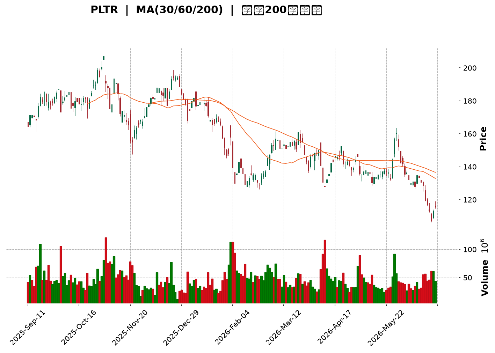
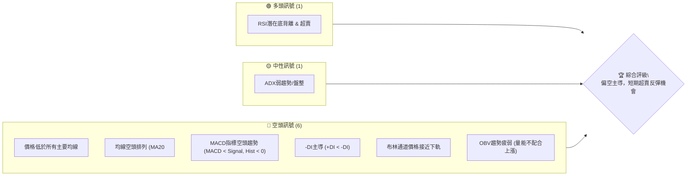
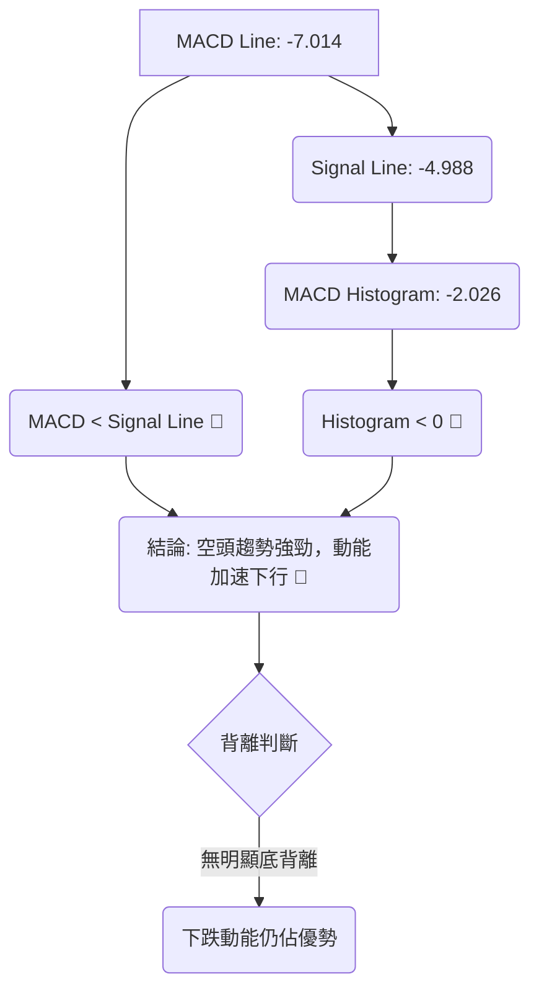
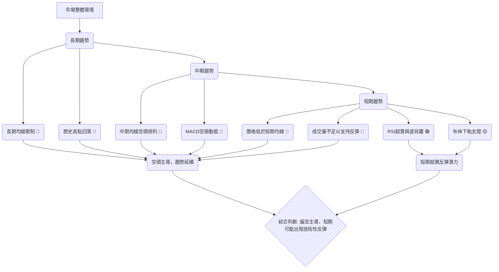

<details>
<summary>📊 靜態圖表 (點擊展開)</summary>

</details>

<html>
<head><meta charset="utf-8" /></head>
<body>
    <div style="height:500px; width:100%;">                        <script>window.PlotlyConfig = {MathJaxConfig: 'local'};</script>
        <script charset="utf-8" src="https://cdn.plot.ly/plotly-3.6.0.min.js" integrity="sha256-QaOVwtVY0T02VaHrr6pnoHLCwayMJp4O5n4YyaE3rJk=" crossorigin="anonymous"></script>                <div id="candlestick-chart" class="plotly-graph-div" style="height:100%; width:100%;"></div>            <script>                window.PLOTLYENV=window.PLOTLYENV || {};                                if (document.getElementById("candlestick-chart")) {                    Plotly.newPlot(                        "candlestick-chart",                        [{"close":{"dtype":"f8","bdata":"AAAAIIWLZEAAAACAwm1lQAAAAGC4ZmVAAAAA4FFIZUAAAABgjwplQAAAAEAKH2ZAAAAA4HrMZkAAAABgj2pmQAAAAKCZ0WZAAAAAgOtxZkAAAAAA12NmQAAAAIA9MmZAAAAAIIVbZkAAAACgcM1mQAAAAGBmHmdAAAAAoJlhZ0AAAACAPaJlQAAAAMD1cGZAAAAAoHDFZkAAAACA6\u002fFmQAAAAEAKL2dAAAAAgBTuZUAAAABguCZmQAAAACCud2ZAAAAAANdzZkAAAAAA10NmQAAAAMDMRGZAAAAAQOGyZkAAAADgUbBmQAAAACCu72VAAAAAIFyPZkAAAAAAKRRnQAAAAIDCpWdAAAAAQDOzZ0AAAACA69loQAAAAKCZUWhAAAAAQAoPaUAAAACAwuVpQAAAACCu12dAAAAAwMx8Z0AAAACgmeFlQAAAAIDCPWZAAAAAIIUzaEAAAABguN5nQAAAAKBwBWdAAAAA4HqEZUAAAADgUcBlQAAAAAAAaGVAAAAAYI\u002fqZEAAAACgcK1kQAAAAADXd2NAAAAAQDNbY0AAAAAAAEhkQAAAAKCZcWRAAAAA4KO4ZEAAAABgZg5lQAAAACCu72RAAAAAgBRWZUAAAABgjwJmQAAAAKBwPWZAAAAA4FG4ZkAAAAAgrq9mQAAAAEDhumZAAAAAwB59Z0AAAACgR3FnQAAAAIA98mZAAAAAAADoZkAAAAAAAHhnQAAAAKBHKWZAAAAAgBQ2Z0AAAAAAKSxoQAAAACBcP2hAAAAAAClEaEAAAACgcEVoQAAAAGC4lmdAAAAAgMIFZ0AAAABA4ZpmQAAAAAAAOGZAAAAAIIX7ZEAAAACgR8FlQAAAAGC4dmZAAAAAgMK1ZkAAAAAghRtmQAAAACCuL2ZAAAAAwB5tZkAAAABguF5mQAAAAMDMTGZAAAAAgD0iZkAAAABguF5lQAAAAMD1EGVAAAAAYI+qZEAAAADAzLxkQAAAAEAzM2VAAAAAQArvZEAAAABgZrZkQAAAAEAzq2NAAAAAIIX7YkAAAABA4VJiQAAAAOBReGJAAAAAACm8Y0AAAACgR3FhQAAAAOBRQGBAAAAAwMz8YEAAAADAHt1hQAAAAOBRcGFAAAAAgML1YEAAAAAAKSRgQAAAAMAebWBAAAAA4KOgYEAAAAAAKexgQAAAAOB63GBAAAAAIK7nYEAAAABAM1NgQAAAAEDhGmBAAAAAgBTGYEAAAACAFP5gQAAAAIAUJmFAAAAAoHAlYkAAAABACmdiQAAAAIAUJmNAAAAAoHAVY0AAAADAHqVjQAAAAIDCjWNAAAAA4HrkYkAAAABAM\u002fNiQAAAAAAAMGNAAAAAYGbeYkAAAABAChdjQAAAAGCPYmNAAAAA4KMYY0AAAACAwnVjQAAAAIDC1WJAAAAAQOEaZEAAAADA9VhjQAAAAGC4XmNAAAAAgOtxYkAAAACA6+FhQAAAAKCZMWFAAAAAwPVIYkAAAAAgrk9iQAAAAGC4jmJAAAAAgMJ9YkAAAACAPcJiQAAAAOBRmGFAAAAAIK5PYEAAAACA6wFgQAAAAADXi2BAAAAAYGb2YEAAAADAzMRhQAAAAOBR2GFAAAAA4HpMYkAAAADgejxiQAAAAEAKP2JAAAAAANcTY0AAAACAPbJhQAAAAEDh4mFAAAAAQDPjYUAAAACAwqVhQAAAAEAKP2FAAAAAIIVjYUAAAACAPQJiQAAAAMD1QGJAAAAAwB79YEAAAACgR7lgQAAAAKCZIWFAAAAAoJk5YUAAAADgehxhQAAAAAAAAGFAAAAAoJlBYEAAAAAgXLdgQAAAACCuv2BAAAAA4HrkYEAAAADgUehgQAAAAMDMJGFAAAAAoEctYUAAAAAAKRxhQAAAAEAzE2FAAAAA4FGQYEAAAABA4ephQAAAAKBHkWNAAAAAwMwUZEAAAACgcAVjQAAAAGBmxmFAAAAAYGa2YUAAAADA9fBgQAAAAEAKD2FAAAAAgD2CYEAAAABguEZgQAAAAGCPYmBAAAAAIFz\u002fX0AAAABguNZgQAAAAAAAqGBAAAAAAClUYEAAAABACg9gQAAAAAAA4F1AAAAAwMwsXUAAAAAAAGBcQAAAAKBH0VpAAAAAIIU7XEAAAADAzOxcQA=="},"high":{"dtype":"f8","bdata":"AAAA4KfuZEAAAADA9XBlQAAAAKCZeWVAAAAAgOtpZUAAAACAwjVlQAAAAKCZWWZAAAAAoHANZ0AAAAAAAMhmQAAAAAAAOGdAAAAAQDMbZ0AAAACAPQpnQAAAAADXg2ZAAAAAIFyvZkAAAADgo9hmQAAAAMD1SGdAAAAAYGaGZ0AAAABA4VpnQAAAAGBm3mZAAAAAgMJFZ0AAAADgUQhnQAAAAADXc2dAAAAAQDNjZ0AAAABACmdmQAAAAEDhymZAAAAAQDMLZ0AAAACAPRpnQAAAAEDhsmZAAAAAQOHiZkAAAADAcsxmQAAAAGC4xmZAAAAAgOuxZkAAAACgcEVnQAAAAGCPGmhAAAAAwPX4Z0AAAABAM\u002ftoQAAAAKBw9WhAAAAAgMKFaUAAAADgo\u002fBpQAAAAGBmdmhAAAAAgD3KZ0AAAABA4eJnQAAAAGBmVmZAAAAAgMJdaEAAAACgmR1oQAAAAGCP0mdAAAAAYGbWZkAAAACgRylmQAAAACCux2VAAAAAYI+aZUAAAABAMzNlQAAAAIA90mVAAAAAIIXDY0AAAACgcKVkQAAAAMDMlGRAAAAAINkKZUAAAACgmRllQAAAAEAzI2VAAAAAAAD4ZUAAAADAHj1mQAAAAIAUTmZAAAAAYOXEZkAAAAAAKfxmQAAAAEAz22ZAAAAA4HrMZ0AAAACgmYFnQAAAAMDMUGdAAAAAwPV4Z0AAAAAAAJBnQAAAAAAAeGdAAAAAYI9qZ0AAAAAAAGBoQAAAAAAp3GhAAAAAANdraEAAAACgcGVoQAAAAEAzi2hAAAAAYGZmZ0AAAAAAVBdnQAAAAMD1sGZAAAAAQDOrZkAAAACAPfplQAAAAIAUhmZAAAAAwPVoZ0AAAADAHjVnQAAAAEAKV2ZAAAAAAADQZkAAAABAM6NmQAAAAOAis2ZAAAAAQDOTZkAAAACAws1mQAAAAEAKf2VAAAAAIK4vZUAAAAAAACBlQAAAAAAAgGVAAAAAQOFSZUAAAACAFC5lQAAAAKBwoWRAAAAAACm0Y0AAAAAAAOBiQAAAAMDM7GJAAAAAAH+iZEAAAABAM3tjQAAAACBcP2FAAAAA4Ps1YUAAAAAA1ztiQAAAAIDrMWJAAAAAAABoYUAAAADgevxgQAAAAIDrsWBAAAAAgD3KYEAAAADg0J5hQAAAAMAeBWFAAAAAYLgGYUAAAACgR4FgQAAAACCuR2BAAAAAQOECYUAAAADgUTBhQAAAAEAzQ2FAAAAA4HpkYkAAAAAAAHBiQAAAAOCjUGNAAAAAACmMY0AAAABgZi5kQAAAAIAUzmNAAAAAIAaVY0AAAACAaCVjQAAAAAApfGNAAAAAgOtRY0AAAAAghTtjQAAAAAAAmGNAAAAAgBSWY0AAAADAzIRjQAAAAMDMlGNAAAAAYI8iZEAAAADAzExkQAAAAOCjCGRAAAAAANcjY0AAAABguD5iQAAAAADXA2JAAAAAIIV7YkAAAACgmYliQAAAAOBRkGJAAAAAIIXTYkAAAADgo8hiQAAAAMD1iGNAAAAAoEdxYUAAAABgZiZgQAAAAKBwzWBAAAAAgD1CYUAAAABgj9JhQAAAAKCZMWJAAAAAwPWIYkAAAABgZmZiQAAAAADXu2JAAAAAgMIVY0AAAACgR8liQAAAAGCP6mFAAAAAgD0iYkAAAABAM\u002fthQAAAAOBReGFAAAAAYGaGYUAAAACAFE5iQAAAAOB6tGJAAAAAIFzfYUAAAABgZvZgQAAAAGBmnmFAAAAAACk8YUAAAADgeiRhQAAAAIDCLWFAAAAAIK4fYUAAAAAgXM9gQAAAAOB69GBAAAAAgOv9YEAAAABACi9hQAAAACCuJ2FAAAAAoJlRYUAAAADgo2BhQAAAAIDCVWFAAAAAIFz3YEAAAAAAACBiQAAAAKDtuGNAAAAAYGZ2ZEAAAACgmfFjQAAAAIDC9WJAAAAAANdLYkAAAABACr9hQAAAAOBROGFAAAAAIK4fYUAAAACA66VgQAAAAOCjcGBAAAAAQOFiYEAAAAAgXN9gQAAAAEDh0mBAAAAAQDMDYUAAAACAwm1gQAAAAADXG2BAAAAAACk8XkAAAAAAAIBdQAAAAKCZCVxAAAAAwB6FXEAAAADAHsVdQA=="},"hovertemplate":"\u003cb\u003e%{x|%Y-%m-%d}\u003c\u002fb\u003e\u003cbr\u003e\u958b: $%{open:.2f}\u003cbr\u003e\u9ad8: $%{high:.2f}\u003cbr\u003e\u4f4e: $%{low:.2f}\u003cbr\u003e\u6536: $%{close:.2f}\u003cextra\u003e\u003c\u002fextra\u003e","low":{"dtype":"f8","bdata":"AAAAQApnZEAAAADgUYBkQAAAAMAe7WRAAAAAYLgeZUAAAADgoyhkQAAAAOB6LGVAAAAAYLgWZkAAAACgR0lmQAAAAOBRIGZAAAAAANcjZkAAAACgR8llQAAAAMAe3WVAAAAAwB4lZkAAAABACkdmQAAAAAAAcGZAAAAAYGbeZkAAAADgo1hlQAAAAGCPOmZAAAAAoHBtZkAAAABgZqZmQAAAAGBmfmZAAAAAwPWwZUAAAABgZq5lQAAAAIA9WmVAAAAA4KMAZkAAAABgZg5mQAAAAGBmvmVAAAAAgBQuZkAAAADAzFRmQAAAAKBwLWVAAAAA4FHgZUAAAABAM9tmQAAAAOCjcGdAAAAAwPVYZ0AAAAAgrs9nQAAAAADXQ2hAAAAAoHC9aEAAAACAPTppQAAAAIDrMWdAAAAAYLimZkAAAADA9dBlQAAAAMAeHWVAAAAA4KPwZkAAAAAAKWRnQAAAAMDMjGZAAAAAYGRXZUAAAAAAAJBkQAAAAIDC9WRAAAAAAACwZEAAAACgcE1kQAAAAOCjTGNAAAAAgOtxYkAAAAAAAKBjQAAAAIDCkWNAAAAAACl8ZEAAAAAAALxkQAAAAADXY2RAAAAAQOEyZUAAAABgjxplQAAAAIDCzWVAAAAAwB4lZkAAAACgR3FmQAAAAAApjGZAAAAAAADYZkAAAABguIZmQAAAACBYNWZAAAAAwPWAZkAAAABAi6RmQAAAAAAAEGZAAAAA4FGwZkAAAAAgXFdnQAAAAIDCDWhAAAAAIIX3Z0AAAABgjxpoQAAAAADXk2dAAAAA4Hr0ZkAAAABgZpZmQAAAAAAAKGZAAAAAQDPLZEAAAACgR3llQAAAAOCj2GVAAAAAwB41ZkAAAAAA18tlQAAAAAAA2GVAAAAAQOEKZkAAAADgegRmQAAAAGBmvmVAAAAAwPUQZkAAAADgUUBlQAAAACCux2RAAAAAIIUjZEAAAABgZp5kQAAAAKCZyWRAAAAAYGbqZEAAAACAFJZkQAAAACCup2NAAAAAANdjYkAAAADAciRiQAAAAKDtVGJAAAAAANcjY0AAAACAwvVgQAAAAIA9CmBAAAAAQDOLYEAAAAAA1dhgQAAAAOCjOGFAAAAAYGaeYEAAAAAA16NfQAAAAIDpjl9AAAAAYI\u002fSX0AAAAAA19tgQAAAAOBRYGBAAAAAoHBlYEAAAADA9dhfQAAAACCul19AAAAAgMIlYEAAAAAAKZRgQAAAACBcv2BAAAAA4KOQYUAAAABgZkZhQAAAAIDrgWJAAAAAIIWzYkAAAACgR8liQAAAAEAKH2NAAAAA4HrEYkAAAABgj6piQAAAACBc32JAAAAAYI+SYkAAAACgcOViQAAAAADXA2NAAAAAIIUTY0AAAAAAANBiQAAAAEDhomJAAAAAIK4nY0AAAADgevRiQAAAACBcW2NAAAAAAABoYkAAAACA67FhQAAAAKCZCWFAAAAAQApfYUAAAABACg9iQAAAACCuP2FAAAAAIDFUYkAAAABgZg5iQAAAAKBwZWFAAAAAQAoPYEAAAAAghateQAAAAMDMJGBAAAAAAADAYEAAAACAwt1gQAAAAMD1cGFAAAAAoJnpYUAAAABgj\u002fphQAAAAMD3\u002f2FAAAAAwB5tYkAAAACgcH1hQAAAAIDCXWFAAAAA4FGgYUAAAACgcI1hQAAAAIDC1WBAAAAAwMwUYUAAAADgeqxhQAAAAEAzJ2JAAAAAQArXYEAAAADAzGRgQAAAAMD12GBAAAAA4KOgYEAAAAAArJhgQAAAAGC4rmBAAAAAAAAYYEAAAABgZi5gQAAAAKBHiWBAAAAAYI9qYEAAAABAM7NgQAAAAKBwjWBAAAAAoHDtYEAAAACgmclgQAAAAKCZqWBAAAAAACl0YEAAAAAAAKBgQAAAAKBHOWJAAAAAACl8Y0AAAACgmbliQAAAAAAAqGFAAAAAQLSIYUAAAADAzMBgQAAAAMD16GBAAAAAYGbWX0AAAACgmRlgQAAAAEDhyl9AAAAAoJmpX0AAAABgZjZgQAAAAADXM2BAAAAAoHA9YEAAAADgo0BfQAAAAMDMzF1AAAAAIIULXUAAAAAAABBcQAAAACCul1pAAAAAgBQeW0AAAACgcK1cQA=="},"name":"\u50f9\u683c","open":{"dtype":"f8","bdata":"AAAAIK7nZEAAAABAM6tkQAAAAEAzM2VAAAAAoEdhZUAAAADgoyBlQAAAAOCjSGVAAAAAgD0iZkAAAAAAKZxmQAAAAOBR0GZAAAAAwB79ZkAAAACgmfllQAAAAKCZYWZAAAAA4Hp0ZkAAAAAgXF9mQAAAAIA9qmZAAAAAYGZWZ0AAAADAzExnQAAAAIDCZWZAAAAAgOuJZkAAAACgmdlmQAAAAGCP8mZAAAAAoHAlZ0AAAACAwlVmQAAAAAAAAGZAAAAAwPW0ZkAAAADA9bhmQAAAAAAAOGZAAAAAIK5vZkAAAACA68FmQAAAAIDCvWZAAAAAgD3uZUAAAAAAKdxmQAAAAEAKn2dAAAAAIFyvZ0AAAABgj+JnQAAAAKCZzWhAAAAAYGbmaEAAAACgcKFpQAAAAIA9AmhAAAAAAACgZ0AAAAAgrn9nQAAAAMDMpGVAAAAAgOsJZ0AAAABguMpnQAAAAGCP0mdAAAAAQOG2ZkAAAABAM99kQAAAAMD1UGVAAAAAANcLZUAAAACgmflkQAAAAIA9gmVAAAAA4FGAY0AAAABACq9jQAAAAIA9AmRAAAAAQDPbZEAAAADgUfhkQAAAAAAAoGRAAAAAQOEyZUAAAADgekRlQAAAACCuC2ZAAAAAIFxHZkAAAABguMZmQAAAAEAKn2ZAAAAAYGYeZ0AAAACgmRlnQAAAAIDrOWdAAAAAYI8iZ0AAAADA9bRmQAAAAEDhdmdAAAAA4FGwZkAAAAAgrldnQAAAAKBHYWhAAAAAYGYaaEAAAADAHiVoQAAAAOB6YGhAAAAAQDNbZ0AAAABAMwtnQAAAAAAppGZAAAAAoJmpZkAAAAAAKdxlQAAAAOBR+GVAAAAAoJl5ZkAAAAAgrjNnQAAAAOCjIGZAAAAAgOs1ZkAAAAAAAFxmQAAAAAAARGZAAAAAYLhWZkAAAAAghWtmQAAAAAAA9GRAAAAAIN0MZUAAAACgmR1lQAAAAOCj6GRAAAAAYLgGZUAAAAAgXO9kQAAAAMDMjGRAAAAAACm0Y0AAAACgmcFiQAAAAIAU3mJAAAAAoJmhZEAAAADAHm1jQAAAAIA9GmFAAAAAYI\u002fqYEAAAABgjxJhQAAAAEDhHmJAAAAAwMxgYUAAAAAghetgQAAAAKCZ+V9AAAAA4KMcYEAAAADgevxgQAAAAIDriWBAAAAAIK6LYEAAAACgR4FgQAAAAAApIGBAAAAAIIVTYEAAAABACrtgQAAAAIA9wmBAAAAAwMyYYUAAAABAM8NhQAAAAIDCjWJAAAAAgBQeY0AAAACAFM5iQAAAAIAUdmNAAAAAIK5\u002fY0AAAAAAKexiQAAAAOBRIGNAAAAAoJkpY0AAAABgZg5jQAAAAMD1DGNAAAAAgD1eY0AAAABAMyNjQAAAAGBmZmNAAAAAIK4nY0AAAACAPQJkQAAAAKBwrWNAAAAAgMIhY0AAAAAAKTxiQAAAAOCj6GFAAAAA4KOAYUAAAAAAAGBiQAAAACCF72FAAAAAIIWLYkAAAABgOVxiQAAAAOB6WGNAAAAA4KNsYUAAAAAgXA9gQAAAACBcR2BAAAAAAKrNYEAAAACgRxlhQAAAAKBHCWJAAAAAgBQqYkAAAAAAACBiQAAAAIDrWWJAAAAAIIWLYkAAAABgZrZiQAAAAGC43mFAAAAAAACoYUAAAACgmclhQAAAAOBReGFAAAAAQDNPYUAAAAAAAOhhQAAAAAAAeGJAAAAAoHCJYUAAAABguLZgQAAAAEAz42BAAAAAIK77YEAAAADAHt1gQAAAAEAzE2FAAAAAIDHAYEAAAADAzDRgQAAAAKCZmWBAAAAAAACQYEAAAACgcOVgQAAAAOCjxGBAAAAAoJn5YEAAAACgmS1hQAAAAMAeBWFAAAAAoJmpYEAAAADAHqVgQAAAAGBmemJAAAAAIFz\u002fY0AAAACAFJZjQAAAAGBmtmJAAAAAYLguYkAAAABgZophQAAAAIDC9WBAAAAAANfbYEAAAABgZipgQAAAAMD1GGBAAAAAoEddYEAAAADgo0BgQAAAAEDh0mBAAAAA4FF4YEAAAABA4VpgQAAAACBcb19AAAAAoJkJXkAAAAAgrodcQAAAAOBR2FtAAAAAYI9CW0AAAABguA5dQA=="},"x":["2025-09-11T00:00:00-04:00","2025-09-12T00:00:00-04:00","2025-09-15T00:00:00-04:00","2025-09-16T00:00:00-04:00","2025-09-17T00:00:00-04:00","2025-09-18T00:00:00-04:00","2025-09-19T00:00:00-04:00","2025-09-22T00:00:00-04:00","2025-09-23T00:00:00-04:00","2025-09-24T00:00:00-04:00","2025-09-25T00:00:00-04:00","2025-09-26T00:00:00-04:00","2025-09-29T00:00:00-04:00","2025-09-30T00:00:00-04:00","2025-10-01T00:00:00-04:00","2025-10-02T00:00:00-04:00","2025-10-03T00:00:00-04:00","2025-10-06T00:00:00-04:00","2025-10-07T00:00:00-04:00","2025-10-08T00:00:00-04:00","2025-10-09T00:00:00-04:00","2025-10-10T00:00:00-04:00","2025-10-13T00:00:00-04:00","2025-10-14T00:00:00-04:00","2025-10-15T00:00:00-04:00","2025-10-16T00:00:00-04:00","2025-10-17T00:00:00-04:00","2025-10-20T00:00:00-04:00","2025-10-21T00:00:00-04:00","2025-10-22T00:00:00-04:00","2025-10-23T00:00:00-04:00","2025-10-24T00:00:00-04:00","2025-10-27T00:00:00-04:00","2025-10-28T00:00:00-04:00","2025-10-29T00:00:00-04:00","2025-10-30T00:00:00-04:00","2025-10-31T00:00:00-04:00","2025-11-03T00:00:00-05:00","2025-11-04T00:00:00-05:00","2025-11-05T00:00:00-05:00","2025-11-06T00:00:00-05:00","2025-11-07T00:00:00-05:00","2025-11-10T00:00:00-05:00","2025-11-11T00:00:00-05:00","2025-11-12T00:00:00-05:00","2025-11-13T00:00:00-05:00","2025-11-14T00:00:00-05:00","2025-11-17T00:00:00-05:00","2025-11-18T00:00:00-05:00","2025-11-19T00:00:00-05:00","2025-11-20T00:00:00-05:00","2025-11-21T00:00:00-05:00","2025-11-24T00:00:00-05:00","2025-11-25T00:00:00-05:00","2025-11-26T00:00:00-05:00","2025-11-28T00:00:00-05:00","2025-12-01T00:00:00-05:00","2025-12-02T00:00:00-05:00","2025-12-03T00:00:00-05:00","2025-12-04T00:00:00-05:00","2025-12-05T00:00:00-05:00","2025-12-08T00:00:00-05:00","2025-12-09T00:00:00-05:00","2025-12-10T00:00:00-05:00","2025-12-11T00:00:00-05:00","2025-12-12T00:00:00-05:00","2025-12-15T00:00:00-05:00","2025-12-16T00:00:00-05:00","2025-12-17T00:00:00-05:00","2025-12-18T00:00:00-05:00","2025-12-19T00:00:00-05:00","2025-12-22T00:00:00-05:00","2025-12-23T00:00:00-05:00","2025-12-24T00:00:00-05:00","2025-12-26T00:00:00-05:00","2025-12-29T00:00:00-05:00","2025-12-30T00:00:00-05:00","2025-12-31T00:00:00-05:00","2026-01-02T00:00:00-05:00","2026-01-05T00:00:00-05:00","2026-01-06T00:00:00-05:00","2026-01-07T00:00:00-05:00","2026-01-08T00:00:00-05:00","2026-01-09T00:00:00-05:00","2026-01-12T00:00:00-05:00","2026-01-13T00:00:00-05:00","2026-01-14T00:00:00-05:00","2026-01-15T00:00:00-05:00","2026-01-16T00:00:00-05:00","2026-01-20T00:00:00-05:00","2026-01-21T00:00:00-05:00","2026-01-22T00:00:00-05:00","2026-01-23T00:00:00-05:00","2026-01-26T00:00:00-05:00","2026-01-27T00:00:00-05:00","2026-01-28T00:00:00-05:00","2026-01-29T00:00:00-05:00","2026-01-30T00:00:00-05:00","2026-02-02T00:00:00-05:00","2026-02-03T00:00:00-05:00","2026-02-04T00:00:00-05:00","2026-02-05T00:00:00-05:00","2026-02-06T00:00:00-05:00","2026-02-09T00:00:00-05:00","2026-02-10T00:00:00-05:00","2026-02-11T00:00:00-05:00","2026-02-12T00:00:00-05:00","2026-02-13T00:00:00-05:00","2026-02-17T00:00:00-05:00","2026-02-18T00:00:00-05:00","2026-02-19T00:00:00-05:00","2026-02-20T00:00:00-05:00","2026-02-23T00:00:00-05:00","2026-02-24T00:00:00-05:00","2026-02-25T00:00:00-05:00","2026-02-26T00:00:00-05:00","2026-02-27T00:00:00-05:00","2026-03-02T00:00:00-05:00","2026-03-03T00:00:00-05:00","2026-03-04T00:00:00-05:00","2026-03-05T00:00:00-05:00","2026-03-06T00:00:00-05:00","2026-03-09T00:00:00-04:00","2026-03-10T00:00:00-04:00","2026-03-11T00:00:00-04:00","2026-03-12T00:00:00-04:00","2026-03-13T00:00:00-04:00","2026-03-16T00:00:00-04:00","2026-03-17T00:00:00-04:00","2026-03-18T00:00:00-04:00","2026-03-19T00:00:00-04:00","2026-03-20T00:00:00-04:00","2026-03-23T00:00:00-04:00","2026-03-24T00:00:00-04:00","2026-03-25T00:00:00-04:00","2026-03-26T00:00:00-04:00","2026-03-27T00:00:00-04:00","2026-03-30T00:00:00-04:00","2026-03-31T00:00:00-04:00","2026-04-01T00:00:00-04:00","2026-04-02T00:00:00-04:00","2026-04-06T00:00:00-04:00","2026-04-07T00:00:00-04:00","2026-04-08T00:00:00-04:00","2026-04-09T00:00:00-04:00","2026-04-10T00:00:00-04:00","2026-04-13T00:00:00-04:00","2026-04-14T00:00:00-04:00","2026-04-15T00:00:00-04:00","2026-04-16T00:00:00-04:00","2026-04-17T00:00:00-04:00","2026-04-20T00:00:00-04:00","2026-04-21T00:00:00-04:00","2026-04-22T00:00:00-04:00","2026-04-23T00:00:00-04:00","2026-04-24T00:00:00-04:00","2026-04-27T00:00:00-04:00","2026-04-28T00:00:00-04:00","2026-04-29T00:00:00-04:00","2026-04-30T00:00:00-04:00","2026-05-01T00:00:00-04:00","2026-05-04T00:00:00-04:00","2026-05-05T00:00:00-04:00","2026-05-06T00:00:00-04:00","2026-05-07T00:00:00-04:00","2026-05-08T00:00:00-04:00","2026-05-11T00:00:00-04:00","2026-05-12T00:00:00-04:00","2026-05-13T00:00:00-04:00","2026-05-14T00:00:00-04:00","2026-05-15T00:00:00-04:00","2026-05-18T00:00:00-04:00","2026-05-19T00:00:00-04:00","2026-05-20T00:00:00-04:00","2026-05-21T00:00:00-04:00","2026-05-22T00:00:00-04:00","2026-05-26T00:00:00-04:00","2026-05-27T00:00:00-04:00","2026-05-28T00:00:00-04:00","2026-05-29T00:00:00-04:00","2026-06-01T00:00:00-04:00","2026-06-02T00:00:00-04:00","2026-06-03T00:00:00-04:00","2026-06-04T00:00:00-04:00","2026-06-05T00:00:00-04:00","2026-06-08T00:00:00-04:00","2026-06-09T00:00:00-04:00","2026-06-10T00:00:00-04:00","2026-06-11T00:00:00-04:00","2026-06-12T00:00:00-04:00","2026-06-15T00:00:00-04:00","2026-06-16T00:00:00-04:00","2026-06-17T00:00:00-04:00","2026-06-18T00:00:00-04:00","2026-06-22T00:00:00-04:00","2026-06-23T00:00:00-04:00","2026-06-24T00:00:00-04:00","2026-06-25T00:00:00-04:00","2026-06-26T00:00:00-04:00","2026-06-29T00:00:00-04:00"],"type":"candlestick"},{"hovertemplate":"MA30: $%{y:.2f}\u003cextra\u003e\u003c\u002fextra\u003e","line":{"color":"#2196F3","dash":"dash","width":2},"mode":"lines","name":"MA30","x":["2025-09-11T00:00:00-04:00","2025-09-12T00:00:00-04:00","2025-09-15T00:00:00-04:00","2025-09-16T00:00:00-04:00","2025-09-17T00:00:00-04:00","2025-09-18T00:00:00-04:00","2025-09-19T00:00:00-04:00","2025-09-22T00:00:00-04:00","2025-09-23T00:00:00-04:00","2025-09-24T00:00:00-04:00","2025-09-25T00:00:00-04:00","2025-09-26T00:00:00-04:00","2025-09-29T00:00:00-04:00","2025-09-30T00:00:00-04:00","2025-10-01T00:00:00-04:00","2025-10-02T00:00:00-04:00","2025-10-03T00:00:00-04:00","2025-10-06T00:00:00-04:00","2025-10-07T00:00:00-04:00","2025-10-08T00:00:00-04:00","2025-10-09T00:00:00-04:00","2025-10-10T00:00:00-04:00","2025-10-13T00:00:00-04:00","2025-10-14T00:00:00-04:00","2025-10-15T00:00:00-04:00","2025-10-16T00:00:00-04:00","2025-10-17T00:00:00-04:00","2025-10-20T00:00:00-04:00","2025-10-21T00:00:00-04:00","2025-10-22T00:00:00-04:00","2025-10-23T00:00:00-04:00","2025-10-24T00:00:00-04:00","2025-10-27T00:00:00-04:00","2025-10-28T00:00:00-04:00","2025-10-29T00:00:00-04:00","2025-10-30T00:00:00-04:00","2025-10-31T00:00:00-04:00","2025-11-03T00:00:00-05:00","2025-11-04T00:00:00-05:00","2025-11-05T00:00:00-05:00","2025-11-06T00:00:00-05:00","2025-11-07T00:00:00-05:00","2025-11-10T00:00:00-05:00","2025-11-11T00:00:00-05:00","2025-11-12T00:00:00-05:00","2025-11-13T00:00:00-05:00","2025-11-14T00:00:00-05:00","2025-11-17T00:00:00-05:00","2025-11-18T00:00:00-05:00","2025-11-19T00:00:00-05:00","2025-11-20T00:00:00-05:00","2025-11-21T00:00:00-05:00","2025-11-24T00:00:00-05:00","2025-11-25T00:00:00-05:00","2025-11-26T00:00:00-05:00","2025-11-28T00:00:00-05:00","2025-12-01T00:00:00-05:00","2025-12-02T00:00:00-05:00","2025-12-03T00:00:00-05:00","2025-12-04T00:00:00-05:00","2025-12-05T00:00:00-05:00","2025-12-08T00:00:00-05:00","2025-12-09T00:00:00-05:00","2025-12-10T00:00:00-05:00","2025-12-11T00:00:00-05:00","2025-12-12T00:00:00-05:00","2025-12-15T00:00:00-05:00","2025-12-16T00:00:00-05:00","2025-12-17T00:00:00-05:00","2025-12-18T00:00:00-05:00","2025-12-19T00:00:00-05:00","2025-12-22T00:00:00-05:00","2025-12-23T00:00:00-05:00","2025-12-24T00:00:00-05:00","2025-12-26T00:00:00-05:00","2025-12-29T00:00:00-05:00","2025-12-30T00:00:00-05:00","2025-12-31T00:00:00-05:00","2026-01-02T00:00:00-05:00","2026-01-05T00:00:00-05:00","2026-01-06T00:00:00-05:00","2026-01-07T00:00:00-05:00","2026-01-08T00:00:00-05:00","2026-01-09T00:00:00-05:00","2026-01-12T00:00:00-05:00","2026-01-13T00:00:00-05:00","2026-01-14T00:00:00-05:00","2026-01-15T00:00:00-05:00","2026-01-16T00:00:00-05:00","2026-01-20T00:00:00-05:00","2026-01-21T00:00:00-05:00","2026-01-22T00:00:00-05:00","2026-01-23T00:00:00-05:00","2026-01-26T00:00:00-05:00","2026-01-27T00:00:00-05:00","2026-01-28T00:00:00-05:00","2026-01-29T00:00:00-05:00","2026-01-30T00:00:00-05:00","2026-02-02T00:00:00-05:00","2026-02-03T00:00:00-05:00","2026-02-04T00:00:00-05:00","2026-02-05T00:00:00-05:00","2026-02-06T00:00:00-05:00","2026-02-09T00:00:00-05:00","2026-02-10T00:00:00-05:00","2026-02-11T00:00:00-05:00","2026-02-12T00:00:00-05:00","2026-02-13T00:00:00-05:00","2026-02-17T00:00:00-05:00","2026-02-18T00:00:00-05:00","2026-02-19T00:00:00-05:00","2026-02-20T00:00:00-05:00","2026-02-23T00:00:00-05:00","2026-02-24T00:00:00-05:00","2026-02-25T00:00:00-05:00","2026-02-26T00:00:00-05:00","2026-02-27T00:00:00-05:00","2026-03-02T00:00:00-05:00","2026-03-03T00:00:00-05:00","2026-03-04T00:00:00-05:00","2026-03-05T00:00:00-05:00","2026-03-06T00:00:00-05:00","2026-03-09T00:00:00-04:00","2026-03-10T00:00:00-04:00","2026-03-11T00:00:00-04:00","2026-03-12T00:00:00-04:00","2026-03-13T00:00:00-04:00","2026-03-16T00:00:00-04:00","2026-03-17T00:00:00-04:00","2026-03-18T00:00:00-04:00","2026-03-19T00:00:00-04:00","2026-03-20T00:00:00-04:00","2026-03-23T00:00:00-04:00","2026-03-24T00:00:00-04:00","2026-03-25T00:00:00-04:00","2026-03-26T00:00:00-04:00","2026-03-27T00:00:00-04:00","2026-03-30T00:00:00-04:00","2026-03-31T00:00:00-04:00","2026-04-01T00:00:00-04:00","2026-04-02T00:00:00-04:00","2026-04-06T00:00:00-04:00","2026-04-07T00:00:00-04:00","2026-04-08T00:00:00-04:00","2026-04-09T00:00:00-04:00","2026-04-10T00:00:00-04:00","2026-04-13T00:00:00-04:00","2026-04-14T00:00:00-04:00","2026-04-15T00:00:00-04:00","2026-04-16T00:00:00-04:00","2026-04-17T00:00:00-04:00","2026-04-20T00:00:00-04:00","2026-04-21T00:00:00-04:00","2026-04-22T00:00:00-04:00","2026-04-23T00:00:00-04:00","2026-04-24T00:00:00-04:00","2026-04-27T00:00:00-04:00","2026-04-28T00:00:00-04:00","2026-04-29T00:00:00-04:00","2026-04-30T00:00:00-04:00","2026-05-01T00:00:00-04:00","2026-05-04T00:00:00-04:00","2026-05-05T00:00:00-04:00","2026-05-06T00:00:00-04:00","2026-05-07T00:00:00-04:00","2026-05-08T00:00:00-04:00","2026-05-11T00:00:00-04:00","2026-05-12T00:00:00-04:00","2026-05-13T00:00:00-04:00","2026-05-14T00:00:00-04:00","2026-05-15T00:00:00-04:00","2026-05-18T00:00:00-04:00","2026-05-19T00:00:00-04:00","2026-05-20T00:00:00-04:00","2026-05-21T00:00:00-04:00","2026-05-22T00:00:00-04:00","2026-05-26T00:00:00-04:00","2026-05-27T00:00:00-04:00","2026-05-28T00:00:00-04:00","2026-05-29T00:00:00-04:00","2026-06-01T00:00:00-04:00","2026-06-02T00:00:00-04:00","2026-06-03T00:00:00-04:00","2026-06-04T00:00:00-04:00","2026-06-05T00:00:00-04:00","2026-06-08T00:00:00-04:00","2026-06-09T00:00:00-04:00","2026-06-10T00:00:00-04:00","2026-06-11T00:00:00-04:00","2026-06-12T00:00:00-04:00","2026-06-15T00:00:00-04:00","2026-06-16T00:00:00-04:00","2026-06-17T00:00:00-04:00","2026-06-18T00:00:00-04:00","2026-06-22T00:00:00-04:00","2026-06-23T00:00:00-04:00","2026-06-24T00:00:00-04:00","2026-06-25T00:00:00-04:00","2026-06-26T00:00:00-04:00","2026-06-29T00:00:00-04:00"],"y":{"dtype":"f8","bdata":"AAAAAAAA+H8AAAAAAAD4fwAAAAAAAPh\u002fAAAAAAAA+H8AAAAAAAD4fwAAAAAAAPh\u002fAAAAAAAA+H8AAAAAAAD4fwAAAAAAAPh\u002fAAAAAAAA+H8AAAAAAAD4fwAAAAAAAPh\u002fAAAAAAAA+H8AAAAAAAD4fwAAAAAAAPh\u002fAAAAAAAA+H8AAAAAAAD4fwAAAAAAAPh\u002fAAAAAAAA+H8AAAAAAAD4fwAAAAAAAPh\u002fAAAAAAAA+H8AAAAAAAD4fwAAAAAAAPh\u002fAAAAAAAA+H8AAAAAAAD4fwAAAAAAAPh\u002fAAAAAAAA+H8AAAAAAAD4f4mIiKh\u002fR2ZA3t3dfbFYZkCamZn5xWZmQKuqqvrweWZAd3d3F5KOZkCamZkpFa9mQM3MzKzVwWZAiYiIuB7VZkAAAACg0\u002fJmQKuqqgqQ+2ZAq6qqanUEZ0CamZkJHgBnQGZmZlaAAGdAIiIiEjwQZ0AAAAAQWBlnQCIiIhKDGGdAVVVVpZsIZ0AzMzNTnAlnQFVVVVXHAGdAZmZmBvPwZkCJiIiYmd1mQAAAALDkvWZA7+7uPu6nZkCrqqoq+ZdmQHd3dze0hmZA7+7uPu53ZkARERGxnW1mQN7d3c0+YmZAERERYZ5WZkARERGh01BmQN7d3S1rU2ZAREREtMhUZkBmZmZGb1FmQHd3d\u002feaSWZAvLu7e81HZkBVVVUFyDtmQAAAAMARMGZAq6qqirMdZkC8u7vb+QhmQLy7uxuh+mVAIiIiokX4ZUAiIiLy0gtmQKuqqqrxHGZAmpmZqX8dZkBEREQ07CBmQN7d3e3DJWZAZmZmppsyZkAiIiKy5DlmQBEREaHTQGZAq6qqWmRBZkAAAAAwlkpmQLy7uzsmZGZAvLu7m8SAZkDNzMwcWpBmQJqZmak4n2ZAq6qqSsWtZkCamZk5+7hmQBEREWGexGZAvLu7i2zLZkAiIiJy9sVmQJqZmVnyu2ZA3t3d3WuqZkARERHByplmQLy7u2u8jGZAAAAA8O52ZkCamZkpo19mQKuqqlqrQ2ZAq6qqyi8iZkDe3d1dSPZlQFVVVbXI1mVAmpmZuR65ZUAAAADQsH9lQM3MzLx0O2VAAAAAEFj9ZECrqqqqqsZkQImIiMgvkmRAzczMDHReZEBmZmbGSydkQN7d3d3d9WNAmpmZObTQY0CJiIh4d6djQO\u002fu7p6od2NAiYiIaB9GY0CJiIhYxxRjQGZmZqbi4GJAMzMzk6awYkDv7u4+w4JiQLy7uyvOVmJAd3d3V8c0YkDNzMy8dBtiQFVVVeUXC2JA7+7u3pb9YUBVVVVFRPRhQKuqqvo35mFAzczMzMzUYUAAAACQwsVhQBEREUGnwWFAMzMzw67AYUCamZmpOMdhQDMzM4MHz2FAREREJJTJYUAAAABwy9phQJqZmbnX8GFAIiIiAnILYkDv7u5OGxhiQBERETGWKGJAmpmZOUI1YkCrqqoKHkRiQLy7u6uqSmJAiYiIiM9YYkDe3d1NqWRiQCIiItIic2JAiYiICKyAYkBERESkcJViQImIiJgnomJAAAAAQDWeYkC8u7t7zZViQM3MzEypkGJAvLu7W4+GYkCJiIjoJoFiQCIiItIGdmJAZmZm9lNvYkAAAACATmNiQJqZmTkmWGJAzczMXLpZYkARERGBB09iQBEREeHsQ2JA7+7uTo07YkDe3d0dPi9iQCIiIvL9HGJAq6qq2msOYkDe3d2NCQJiQLy7u8sT\u002fWFA7+7uPnziYUAzMzOTGMxhQDMzM\u002fP9uGFAIiIi0pSuYUAAAAAAAKhhQO\u002fu7r5YpmFAAAAA4AiVYUCrqqqKbIdhQERERET9d2FA7+7uvlhqYUAAAACgjFphQKuqqtqyVmFAZmZm1hVeYUCamZlJfmdhQM3MzFwBbGFAd3d3R5poYUCrqqo632lhQGZmZhaSeGFAREREBMiHYUAAAADgeo5hQJqZmWl1imFAZmZmhs9+YUAzMzMzXnhhQAAAAIBOcWFAMzMzk4plYUCamZkJ11lhQLy7u5t9UmFAMzMzG6FGYUC8u7szpTxhQBEREWkDL2FAZmZmnmEpYUAAAADotCNhQN7d3ZX8EGFAiYiI4Hr6YEARERHZh+FgQERERKTiwmBAVVVVvZ+wYEARERFZZJ1gQA=="},"type":"scatter"},{"hovertemplate":"MA60: $%{y:.2f}\u003cextra\u003e\u003c\u002fextra\u003e","line":{"color":"#9C27B0","dash":"dash","width":2},"mode":"lines","name":"MA60","x":["2025-09-11T00:00:00-04:00","2025-09-12T00:00:00-04:00","2025-09-15T00:00:00-04:00","2025-09-16T00:00:00-04:00","2025-09-17T00:00:00-04:00","2025-09-18T00:00:00-04:00","2025-09-19T00:00:00-04:00","2025-09-22T00:00:00-04:00","2025-09-23T00:00:00-04:00","2025-09-24T00:00:00-04:00","2025-09-25T00:00:00-04:00","2025-09-26T00:00:00-04:00","2025-09-29T00:00:00-04:00","2025-09-30T00:00:00-04:00","2025-10-01T00:00:00-04:00","2025-10-02T00:00:00-04:00","2025-10-03T00:00:00-04:00","2025-10-06T00:00:00-04:00","2025-10-07T00:00:00-04:00","2025-10-08T00:00:00-04:00","2025-10-09T00:00:00-04:00","2025-10-10T00:00:00-04:00","2025-10-13T00:00:00-04:00","2025-10-14T00:00:00-04:00","2025-10-15T00:00:00-04:00","2025-10-16T00:00:00-04:00","2025-10-17T00:00:00-04:00","2025-10-20T00:00:00-04:00","2025-10-21T00:00:00-04:00","2025-10-22T00:00:00-04:00","2025-10-23T00:00:00-04:00","2025-10-24T00:00:00-04:00","2025-10-27T00:00:00-04:00","2025-10-28T00:00:00-04:00","2025-10-29T00:00:00-04:00","2025-10-30T00:00:00-04:00","2025-10-31T00:00:00-04:00","2025-11-03T00:00:00-05:00","2025-11-04T00:00:00-05:00","2025-11-05T00:00:00-05:00","2025-11-06T00:00:00-05:00","2025-11-07T00:00:00-05:00","2025-11-10T00:00:00-05:00","2025-11-11T00:00:00-05:00","2025-11-12T00:00:00-05:00","2025-11-13T00:00:00-05:00","2025-11-14T00:00:00-05:00","2025-11-17T00:00:00-05:00","2025-11-18T00:00:00-05:00","2025-11-19T00:00:00-05:00","2025-11-20T00:00:00-05:00","2025-11-21T00:00:00-05:00","2025-11-24T00:00:00-05:00","2025-11-25T00:00:00-05:00","2025-11-26T00:00:00-05:00","2025-11-28T00:00:00-05:00","2025-12-01T00:00:00-05:00","2025-12-02T00:00:00-05:00","2025-12-03T00:00:00-05:00","2025-12-04T00:00:00-05:00","2025-12-05T00:00:00-05:00","2025-12-08T00:00:00-05:00","2025-12-09T00:00:00-05:00","2025-12-10T00:00:00-05:00","2025-12-11T00:00:00-05:00","2025-12-12T00:00:00-05:00","2025-12-15T00:00:00-05:00","2025-12-16T00:00:00-05:00","2025-12-17T00:00:00-05:00","2025-12-18T00:00:00-05:00","2025-12-19T00:00:00-05:00","2025-12-22T00:00:00-05:00","2025-12-23T00:00:00-05:00","2025-12-24T00:00:00-05:00","2025-12-26T00:00:00-05:00","2025-12-29T00:00:00-05:00","2025-12-30T00:00:00-05:00","2025-12-31T00:00:00-05:00","2026-01-02T00:00:00-05:00","2026-01-05T00:00:00-05:00","2026-01-06T00:00:00-05:00","2026-01-07T00:00:00-05:00","2026-01-08T00:00:00-05:00","2026-01-09T00:00:00-05:00","2026-01-12T00:00:00-05:00","2026-01-13T00:00:00-05:00","2026-01-14T00:00:00-05:00","2026-01-15T00:00:00-05:00","2026-01-16T00:00:00-05:00","2026-01-20T00:00:00-05:00","2026-01-21T00:00:00-05:00","2026-01-22T00:00:00-05:00","2026-01-23T00:00:00-05:00","2026-01-26T00:00:00-05:00","2026-01-27T00:00:00-05:00","2026-01-28T00:00:00-05:00","2026-01-29T00:00:00-05:00","2026-01-30T00:00:00-05:00","2026-02-02T00:00:00-05:00","2026-02-03T00:00:00-05:00","2026-02-04T00:00:00-05:00","2026-02-05T00:00:00-05:00","2026-02-06T00:00:00-05:00","2026-02-09T00:00:00-05:00","2026-02-10T00:00:00-05:00","2026-02-11T00:00:00-05:00","2026-02-12T00:00:00-05:00","2026-02-13T00:00:00-05:00","2026-02-17T00:00:00-05:00","2026-02-18T00:00:00-05:00","2026-02-19T00:00:00-05:00","2026-02-20T00:00:00-05:00","2026-02-23T00:00:00-05:00","2026-02-24T00:00:00-05:00","2026-02-25T00:00:00-05:00","2026-02-26T00:00:00-05:00","2026-02-27T00:00:00-05:00","2026-03-02T00:00:00-05:00","2026-03-03T00:00:00-05:00","2026-03-04T00:00:00-05:00","2026-03-05T00:00:00-05:00","2026-03-06T00:00:00-05:00","2026-03-09T00:00:00-04:00","2026-03-10T00:00:00-04:00","2026-03-11T00:00:00-04:00","2026-03-12T00:00:00-04:00","2026-03-13T00:00:00-04:00","2026-03-16T00:00:00-04:00","2026-03-17T00:00:00-04:00","2026-03-18T00:00:00-04:00","2026-03-19T00:00:00-04:00","2026-03-20T00:00:00-04:00","2026-03-23T00:00:00-04:00","2026-03-24T00:00:00-04:00","2026-03-25T00:00:00-04:00","2026-03-26T00:00:00-04:00","2026-03-27T00:00:00-04:00","2026-03-30T00:00:00-04:00","2026-03-31T00:00:00-04:00","2026-04-01T00:00:00-04:00","2026-04-02T00:00:00-04:00","2026-04-06T00:00:00-04:00","2026-04-07T00:00:00-04:00","2026-04-08T00:00:00-04:00","2026-04-09T00:00:00-04:00","2026-04-10T00:00:00-04:00","2026-04-13T00:00:00-04:00","2026-04-14T00:00:00-04:00","2026-04-15T00:00:00-04:00","2026-04-16T00:00:00-04:00","2026-04-17T00:00:00-04:00","2026-04-20T00:00:00-04:00","2026-04-21T00:00:00-04:00","2026-04-22T00:00:00-04:00","2026-04-23T00:00:00-04:00","2026-04-24T00:00:00-04:00","2026-04-27T00:00:00-04:00","2026-04-28T00:00:00-04:00","2026-04-29T00:00:00-04:00","2026-04-30T00:00:00-04:00","2026-05-01T00:00:00-04:00","2026-05-04T00:00:00-04:00","2026-05-05T00:00:00-04:00","2026-05-06T00:00:00-04:00","2026-05-07T00:00:00-04:00","2026-05-08T00:00:00-04:00","2026-05-11T00:00:00-04:00","2026-05-12T00:00:00-04:00","2026-05-13T00:00:00-04:00","2026-05-14T00:00:00-04:00","2026-05-15T00:00:00-04:00","2026-05-18T00:00:00-04:00","2026-05-19T00:00:00-04:00","2026-05-20T00:00:00-04:00","2026-05-21T00:00:00-04:00","2026-05-22T00:00:00-04:00","2026-05-26T00:00:00-04:00","2026-05-27T00:00:00-04:00","2026-05-28T00:00:00-04:00","2026-05-29T00:00:00-04:00","2026-06-01T00:00:00-04:00","2026-06-02T00:00:00-04:00","2026-06-03T00:00:00-04:00","2026-06-04T00:00:00-04:00","2026-06-05T00:00:00-04:00","2026-06-08T00:00:00-04:00","2026-06-09T00:00:00-04:00","2026-06-10T00:00:00-04:00","2026-06-11T00:00:00-04:00","2026-06-12T00:00:00-04:00","2026-06-15T00:00:00-04:00","2026-06-16T00:00:00-04:00","2026-06-17T00:00:00-04:00","2026-06-18T00:00:00-04:00","2026-06-22T00:00:00-04:00","2026-06-23T00:00:00-04:00","2026-06-24T00:00:00-04:00","2026-06-25T00:00:00-04:00","2026-06-26T00:00:00-04:00","2026-06-29T00:00:00-04:00"],"y":{"dtype":"f8","bdata":"AAAAAAAA+H8AAAAAAAD4fwAAAAAAAPh\u002fAAAAAAAA+H8AAAAAAAD4fwAAAAAAAPh\u002fAAAAAAAA+H8AAAAAAAD4fwAAAAAAAPh\u002fAAAAAAAA+H8AAAAAAAD4fwAAAAAAAPh\u002fAAAAAAAA+H8AAAAAAAD4fwAAAAAAAPh\u002fAAAAAAAA+H8AAAAAAAD4fwAAAAAAAPh\u002fAAAAAAAA+H8AAAAAAAD4fwAAAAAAAPh\u002fAAAAAAAA+H8AAAAAAAD4fwAAAAAAAPh\u002fAAAAAAAA+H8AAAAAAAD4fwAAAAAAAPh\u002fAAAAAAAA+H8AAAAAAAD4fwAAAAAAAPh\u002fAAAAAAAA+H8AAAAAAAD4fwAAAAAAAPh\u002fAAAAAAAA+H8AAAAAAAD4fwAAAAAAAPh\u002fAAAAAAAA+H8AAAAAAAD4fwAAAAAAAPh\u002fAAAAAAAA+H8AAAAAAAD4fwAAAAAAAPh\u002fAAAAAAAA+H8AAAAAAAD4fwAAAAAAAPh\u002fAAAAAAAA+H8AAAAAAAD4fwAAAAAAAPh\u002fAAAAAAAA+H8AAAAAAAD4fwAAAAAAAPh\u002fAAAAAAAA+H8AAAAAAAD4fwAAAAAAAPh\u002fAAAAAAAA+H8AAAAAAAD4fwAAAAAAAPh\u002fAAAAAAAA+H8AAAAAAAD4fzMzM2t1TWZAERERGb1WZkAAAACgGlxmQBEREfnFYWZAmpmZyS9rZkB3d3eXbnVmQGZmZrbzeGZAmpmZIWl5ZkDe3d295n1mQDMzM5MYe2ZAZmZmhl1+ZkDe3d19+IVmQImIiAC5jmZA3t3d3d2WZkAiIiIiIp1mQAAAAIAjn2ZA3t3dpZudZkCrqqqCwKFmQDMzM3vNoGZAiYiIsCuZZkBERETkF5RmQN7d3XUFkWZAVVVVbVmUZkC8u7ujKZRmQImIiHD2kmZAzczMxNmSZkBVVVV1TJNmQHd3d5duk2ZAZmZmdgWRZkCamZkJZYtmQLy7u8Ouh2ZAERERSZp\u002fZkC8u7sDnXVmQJqZmbEra2ZA3t3dNV5fZkB3d3eXtU1mQFVVVY3eOWZAq6qqqvEfZkDNzMwcof9lQImIiOi06GVA3t3dLbLYZUARERHhwcVlQLy7uzMzrGVAzczM3GuNZUB3d3dvy3NlQDMzM9v5W2VAmpmZ2YdIZUBEREQ8mDBlQHd3d79YG2VAIiIiSgwJZUBERETUBvlkQFVVVW3n7WRAIiIiAnLjZECrqqq6kNJkQAAAAKgNwGRA7+7u7jWvZEBEREQ8351kQGZmZka2jWRAmpmZ8RmAZEB3d3eXtXBkQHd3dx+FY2RAZmZmXgFUZEAzMzODB0dkQDMzMzN6OWRAZmZm3t0lZEDNzMzcshJkQN7d3U2pAmRA7+7uRm\u002fxY0C8u7uDwN5jQERERBzo0mNA7+7ublnBY0AAAAAgPq1jQDMzMzsmlmNAERERCWWEY0DNzMz8Ym9jQM3MzPxiXWNAMzMzI9tJY0CJiIjotDVjQM3MzEREIGNAERER4cEUY0AzMzNjEAZjQImIiLhl9WJAiYiIuGXjYkBmZmb+G9ViQHd3dx+FwWJAmpmZ6W2nYkBVVVVdSIxiQERERLy7c2JAmpmZWatdYkCrqqrSTU5iQLy7u1uPQGJAq6qqanU2YkCrqqpiyStiQCIiIhovH2JAzczMlEMXYkCJiIgIZQpiQBERERHKAmJAERERCR7+YUC8u7tjO\u002fthQKuqqroC9mFAd3d3\u002f\u002f\u002frYUDv7u5+au5hQKuqqsL19mFAiYiIIPf2YUARERHxGfJhQCIiIhLK8GFA3t3dhevxYUBVVVUFD\u002fZhQFVVVbWB+GFARERENOz2YUBERETsCvZhQDMzMwuQ9WFAvLu7Y4L1YUAiIiKi\u002fvdhQJqZmTlt\u002fGFAMzMziyX+YUCrqqripf5hQM3MzFRV\u002fmFAmpmZ0ZT3YUCamZkRg\u002fVhQERERHRM92FAVVVV\u002fY37YUAAAACw5PhhQJqZmdFN8WFAmpmZ8UTsYUAiIiLasuNhQImIiLCd2mFAERER8YvQYUC8u7uTisRhQO\u002fu7sa9t2FA7+7ueoaqYUDNzMxgV59hQGZmZpoLlmFAq6qq7u6FYUCamZm95ndhQImIiET9ZGFAVVVV2YdUYUCJiIjsw0RhQJqZmbGdNGFAq6qqTtQiYUDe3d1xaBJhQA=="},"type":"scatter"},{"hovertemplate":"MA200: $%{y:.2f}\u003cextra\u003e\u003c\u002fextra\u003e","line":{"color":"#FF6F00","dash":"solid","width":2},"mode":"lines","name":"MA200","x":["2025-09-11T00:00:00-04:00","2025-09-12T00:00:00-04:00","2025-09-15T00:00:00-04:00","2025-09-16T00:00:00-04:00","2025-09-17T00:00:00-04:00","2025-09-18T00:00:00-04:00","2025-09-19T00:00:00-04:00","2025-09-22T00:00:00-04:00","2025-09-23T00:00:00-04:00","2025-09-24T00:00:00-04:00","2025-09-25T00:00:00-04:00","2025-09-26T00:00:00-04:00","2025-09-29T00:00:00-04:00","2025-09-30T00:00:00-04:00","2025-10-01T00:00:00-04:00","2025-10-02T00:00:00-04:00","2025-10-03T00:00:00-04:00","2025-10-06T00:00:00-04:00","2025-10-07T00:00:00-04:00","2025-10-08T00:00:00-04:00","2025-10-09T00:00:00-04:00","2025-10-10T00:00:00-04:00","2025-10-13T00:00:00-04:00","2025-10-14T00:00:00-04:00","2025-10-15T00:00:00-04:00","2025-10-16T00:00:00-04:00","2025-10-17T00:00:00-04:00","2025-10-20T00:00:00-04:00","2025-10-21T00:00:00-04:00","2025-10-22T00:00:00-04:00","2025-10-23T00:00:00-04:00","2025-10-24T00:00:00-04:00","2025-10-27T00:00:00-04:00","2025-10-28T00:00:00-04:00","2025-10-29T00:00:00-04:00","2025-10-30T00:00:00-04:00","2025-10-31T00:00:00-04:00","2025-11-03T00:00:00-05:00","2025-11-04T00:00:00-05:00","2025-11-05T00:00:00-05:00","2025-11-06T00:00:00-05:00","2025-11-07T00:00:00-05:00","2025-11-10T00:00:00-05:00","2025-11-11T00:00:00-05:00","2025-11-12T00:00:00-05:00","2025-11-13T00:00:00-05:00","2025-11-14T00:00:00-05:00","2025-11-17T00:00:00-05:00","2025-11-18T00:00:00-05:00","2025-11-19T00:00:00-05:00","2025-11-20T00:00:00-05:00","2025-11-21T00:00:00-05:00","2025-11-24T00:00:00-05:00","2025-11-25T00:00:00-05:00","2025-11-26T00:00:00-05:00","2025-11-28T00:00:00-05:00","2025-12-01T00:00:00-05:00","2025-12-02T00:00:00-05:00","2025-12-03T00:00:00-05:00","2025-12-04T00:00:00-05:00","2025-12-05T00:00:00-05:00","2025-12-08T00:00:00-05:00","2025-12-09T00:00:00-05:00","2025-12-10T00:00:00-05:00","2025-12-11T00:00:00-05:00","2025-12-12T00:00:00-05:00","2025-12-15T00:00:00-05:00","2025-12-16T00:00:00-05:00","2025-12-17T00:00:00-05:00","2025-12-18T00:00:00-05:00","2025-12-19T00:00:00-05:00","2025-12-22T00:00:00-05:00","2025-12-23T00:00:00-05:00","2025-12-24T00:00:00-05:00","2025-12-26T00:00:00-05:00","2025-12-29T00:00:00-05:00","2025-12-30T00:00:00-05:00","2025-12-31T00:00:00-05:00","2026-01-02T00:00:00-05:00","2026-01-05T00:00:00-05:00","2026-01-06T00:00:00-05:00","2026-01-07T00:00:00-05:00","2026-01-08T00:00:00-05:00","2026-01-09T00:00:00-05:00","2026-01-12T00:00:00-05:00","2026-01-13T00:00:00-05:00","2026-01-14T00:00:00-05:00","2026-01-15T00:00:00-05:00","2026-01-16T00:00:00-05:00","2026-01-20T00:00:00-05:00","2026-01-21T00:00:00-05:00","2026-01-22T00:00:00-05:00","2026-01-23T00:00:00-05:00","2026-01-26T00:00:00-05:00","2026-01-27T00:00:00-05:00","2026-01-28T00:00:00-05:00","2026-01-29T00:00:00-05:00","2026-01-30T00:00:00-05:00","2026-02-02T00:00:00-05:00","2026-02-03T00:00:00-05:00","2026-02-04T00:00:00-05:00","2026-02-05T00:00:00-05:00","2026-02-06T00:00:00-05:00","2026-02-09T00:00:00-05:00","2026-02-10T00:00:00-05:00","2026-02-11T00:00:00-05:00","2026-02-12T00:00:00-05:00","2026-02-13T00:00:00-05:00","2026-02-17T00:00:00-05:00","2026-02-18T00:00:00-05:00","2026-02-19T00:00:00-05:00","2026-02-20T00:00:00-05:00","2026-02-23T00:00:00-05:00","2026-02-24T00:00:00-05:00","2026-02-25T00:00:00-05:00","2026-02-26T00:00:00-05:00","2026-02-27T00:00:00-05:00","2026-03-02T00:00:00-05:00","2026-03-03T00:00:00-05:00","2026-03-04T00:00:00-05:00","2026-03-05T00:00:00-05:00","2026-03-06T00:00:00-05:00","2026-03-09T00:00:00-04:00","2026-03-10T00:00:00-04:00","2026-03-11T00:00:00-04:00","2026-03-12T00:00:00-04:00","2026-03-13T00:00:00-04:00","2026-03-16T00:00:00-04:00","2026-03-17T00:00:00-04:00","2026-03-18T00:00:00-04:00","2026-03-19T00:00:00-04:00","2026-03-20T00:00:00-04:00","2026-03-23T00:00:00-04:00","2026-03-24T00:00:00-04:00","2026-03-25T00:00:00-04:00","2026-03-26T00:00:00-04:00","2026-03-27T00:00:00-04:00","2026-03-30T00:00:00-04:00","2026-03-31T00:00:00-04:00","2026-04-01T00:00:00-04:00","2026-04-02T00:00:00-04:00","2026-04-06T00:00:00-04:00","2026-04-07T00:00:00-04:00","2026-04-08T00:00:00-04:00","2026-04-09T00:00:00-04:00","2026-04-10T00:00:00-04:00","2026-04-13T00:00:00-04:00","2026-04-14T00:00:00-04:00","2026-04-15T00:00:00-04:00","2026-04-16T00:00:00-04:00","2026-04-17T00:00:00-04:00","2026-04-20T00:00:00-04:00","2026-04-21T00:00:00-04:00","2026-04-22T00:00:00-04:00","2026-04-23T00:00:00-04:00","2026-04-24T00:00:00-04:00","2026-04-27T00:00:00-04:00","2026-04-28T00:00:00-04:00","2026-04-29T00:00:00-04:00","2026-04-30T00:00:00-04:00","2026-05-01T00:00:00-04:00","2026-05-04T00:00:00-04:00","2026-05-05T00:00:00-04:00","2026-05-06T00:00:00-04:00","2026-05-07T00:00:00-04:00","2026-05-08T00:00:00-04:00","2026-05-11T00:00:00-04:00","2026-05-12T00:00:00-04:00","2026-05-13T00:00:00-04:00","2026-05-14T00:00:00-04:00","2026-05-15T00:00:00-04:00","2026-05-18T00:00:00-04:00","2026-05-19T00:00:00-04:00","2026-05-20T00:00:00-04:00","2026-05-21T00:00:00-04:00","2026-05-22T00:00:00-04:00","2026-05-26T00:00:00-04:00","2026-05-27T00:00:00-04:00","2026-05-28T00:00:00-04:00","2026-05-29T00:00:00-04:00","2026-06-01T00:00:00-04:00","2026-06-02T00:00:00-04:00","2026-06-03T00:00:00-04:00","2026-06-04T00:00:00-04:00","2026-06-05T00:00:00-04:00","2026-06-08T00:00:00-04:00","2026-06-09T00:00:00-04:00","2026-06-10T00:00:00-04:00","2026-06-11T00:00:00-04:00","2026-06-12T00:00:00-04:00","2026-06-15T00:00:00-04:00","2026-06-16T00:00:00-04:00","2026-06-17T00:00:00-04:00","2026-06-18T00:00:00-04:00","2026-06-22T00:00:00-04:00","2026-06-23T00:00:00-04:00","2026-06-24T00:00:00-04:00","2026-06-25T00:00:00-04:00","2026-06-26T00:00:00-04:00","2026-06-29T00:00:00-04:00"],"y":{"dtype":"f8","bdata":"AAAAAAAA+H8AAAAAAAD4fwAAAAAAAPh\u002fAAAAAAAA+H8AAAAAAAD4fwAAAAAAAPh\u002fAAAAAAAA+H8AAAAAAAD4fwAAAAAAAPh\u002fAAAAAAAA+H8AAAAAAAD4fwAAAAAAAPh\u002fAAAAAAAA+H8AAAAAAAD4fwAAAAAAAPh\u002fAAAAAAAA+H8AAAAAAAD4fwAAAAAAAPh\u002fAAAAAAAA+H8AAAAAAAD4fwAAAAAAAPh\u002fAAAAAAAA+H8AAAAAAAD4fwAAAAAAAPh\u002fAAAAAAAA+H8AAAAAAAD4fwAAAAAAAPh\u002fAAAAAAAA+H8AAAAAAAD4fwAAAAAAAPh\u002fAAAAAAAA+H8AAAAAAAD4fwAAAAAAAPh\u002fAAAAAAAA+H8AAAAAAAD4fwAAAAAAAPh\u002fAAAAAAAA+H8AAAAAAAD4fwAAAAAAAPh\u002fAAAAAAAA+H8AAAAAAAD4fwAAAAAAAPh\u002fAAAAAAAA+H8AAAAAAAD4fwAAAAAAAPh\u002fAAAAAAAA+H8AAAAAAAD4fwAAAAAAAPh\u002fAAAAAAAA+H8AAAAAAAD4fwAAAAAAAPh\u002fAAAAAAAA+H8AAAAAAAD4fwAAAAAAAPh\u002fAAAAAAAA+H8AAAAAAAD4fwAAAAAAAPh\u002fAAAAAAAA+H8AAAAAAAD4fwAAAAAAAPh\u002fAAAAAAAA+H8AAAAAAAD4fwAAAAAAAPh\u002fAAAAAAAA+H8AAAAAAAD4fwAAAAAAAPh\u002fAAAAAAAA+H8AAAAAAAD4fwAAAAAAAPh\u002fAAAAAAAA+H8AAAAAAAD4fwAAAAAAAPh\u002fAAAAAAAA+H8AAAAAAAD4fwAAAAAAAPh\u002fAAAAAAAA+H8AAAAAAAD4fwAAAAAAAPh\u002fAAAAAAAA+H8AAAAAAAD4fwAAAAAAAPh\u002fAAAAAAAA+H8AAAAAAAD4fwAAAAAAAPh\u002fAAAAAAAA+H8AAAAAAAD4fwAAAAAAAPh\u002fAAAAAAAA+H8AAAAAAAD4fwAAAAAAAPh\u002fAAAAAAAA+H8AAAAAAAD4fwAAAAAAAPh\u002fAAAAAAAA+H8AAAAAAAD4fwAAAAAAAPh\u002fAAAAAAAA+H8AAAAAAAD4fwAAAAAAAPh\u002fAAAAAAAA+H8AAAAAAAD4fwAAAAAAAPh\u002fAAAAAAAA+H8AAAAAAAD4fwAAAAAAAPh\u002fAAAAAAAA+H8AAAAAAAD4fwAAAAAAAPh\u002fAAAAAAAA+H8AAAAAAAD4fwAAAAAAAPh\u002fAAAAAAAA+H8AAAAAAAD4fwAAAAAAAPh\u002fAAAAAAAA+H8AAAAAAAD4fwAAAAAAAPh\u002fAAAAAAAA+H8AAAAAAAD4fwAAAAAAAPh\u002fAAAAAAAA+H8AAAAAAAD4fwAAAAAAAPh\u002fAAAAAAAA+H8AAAAAAAD4fwAAAAAAAPh\u002fAAAAAAAA+H8AAAAAAAD4fwAAAAAAAPh\u002fAAAAAAAA+H8AAAAAAAD4fwAAAAAAAPh\u002fAAAAAAAA+H8AAAAAAAD4fwAAAAAAAPh\u002fAAAAAAAA+H8AAAAAAAD4fwAAAAAAAPh\u002fAAAAAAAA+H8AAAAAAAD4fwAAAAAAAPh\u002fAAAAAAAA+H8AAAAAAAD4fwAAAAAAAPh\u002fAAAAAAAA+H8AAAAAAAD4fwAAAAAAAPh\u002fAAAAAAAA+H8AAAAAAAD4fwAAAAAAAPh\u002fAAAAAAAA+H8AAAAAAAD4fwAAAAAAAPh\u002fAAAAAAAA+H8AAAAAAAD4fwAAAAAAAPh\u002fAAAAAAAA+H8AAAAAAAD4fwAAAAAAAPh\u002fAAAAAAAA+H8AAAAAAAD4fwAAAAAAAPh\u002fAAAAAAAA+H8AAAAAAAD4fwAAAAAAAPh\u002fAAAAAAAA+H8AAAAAAAD4fwAAAAAAAPh\u002fAAAAAAAA+H8AAAAAAAD4fwAAAAAAAPh\u002fAAAAAAAA+H8AAAAAAAD4fwAAAAAAAPh\u002fAAAAAAAA+H8AAAAAAAD4fwAAAAAAAPh\u002fAAAAAAAA+H8AAAAAAAD4fwAAAAAAAPh\u002fAAAAAAAA+H8AAAAAAAD4fwAAAAAAAPh\u002fAAAAAAAA+H8AAAAAAAD4fwAAAAAAAPh\u002fAAAAAAAA+H8AAAAAAAD4fwAAAAAAAPh\u002fAAAAAAAA+H8AAAAAAAD4fwAAAAAAAPh\u002fAAAAAAAA+H8AAAAAAAD4fwAAAAAAAPh\u002fAAAAAAAA+H8AAAAAAAD4fwAAAAAAAPh\u002fAAAAAAAA+H9xPQqF69JjQA=="},"type":"scatter"}],                        {"template":{"data":{"barpolar":[{"marker":{"line":{"color":"rgb(17,17,17)","width":0.5},"pattern":{"fillmode":"overlay","size":10,"solidity":0.2}},"type":"barpolar"}],"bar":[{"error_x":{"color":"#f2f5fa"},"error_y":{"color":"#f2f5fa"},"marker":{"line":{"color":"rgb(17,17,17)","width":0.5},"pattern":{"fillmode":"overlay","size":10,"solidity":0.2}},"type":"bar"}],"carpet":[{"aaxis":{"endlinecolor":"#A2B1C6","gridcolor":"#506784","linecolor":"#506784","minorgridcolor":"#506784","startlinecolor":"#A2B1C6"},"baxis":{"endlinecolor":"#A2B1C6","gridcolor":"#506784","linecolor":"#506784","minorgridcolor":"#506784","startlinecolor":"#A2B1C6"},"type":"carpet"}],"choropleth":[{"colorbar":{"outlinewidth":0,"ticks":""},"type":"choropleth"}],"contourcarpet":[{"colorbar":{"outlinewidth":0,"ticks":""},"type":"contourcarpet"}],"contour":[{"colorbar":{"outlinewidth":0,"ticks":""},"colorscale":[[0.0,"#0d0887"],[0.1111111111111111,"#46039f"],[0.2222222222222222,"#7201a8"],[0.3333333333333333,"#9c179e"],[0.4444444444444444,"#bd3786"],[0.5555555555555556,"#d8576b"],[0.6666666666666666,"#ed7953"],[0.7777777777777778,"#fb9f3a"],[0.8888888888888888,"#fdca26"],[1.0,"#f0f921"]],"type":"contour"}],"heatmap":[{"colorbar":{"outlinewidth":0,"ticks":""},"colorscale":[[0.0,"#0d0887"],[0.1111111111111111,"#46039f"],[0.2222222222222222,"#7201a8"],[0.3333333333333333,"#9c179e"],[0.4444444444444444,"#bd3786"],[0.5555555555555556,"#d8576b"],[0.6666666666666666,"#ed7953"],[0.7777777777777778,"#fb9f3a"],[0.8888888888888888,"#fdca26"],[1.0,"#f0f921"]],"type":"heatmap"}],"histogram2dcontour":[{"colorbar":{"outlinewidth":0,"ticks":""},"colorscale":[[0.0,"#0d0887"],[0.1111111111111111,"#46039f"],[0.2222222222222222,"#7201a8"],[0.3333333333333333,"#9c179e"],[0.4444444444444444,"#bd3786"],[0.5555555555555556,"#d8576b"],[0.6666666666666666,"#ed7953"],[0.7777777777777778,"#fb9f3a"],[0.8888888888888888,"#fdca26"],[1.0,"#f0f921"]],"type":"histogram2dcontour"}],"histogram2d":[{"colorbar":{"outlinewidth":0,"ticks":""},"colorscale":[[0.0,"#0d0887"],[0.1111111111111111,"#46039f"],[0.2222222222222222,"#7201a8"],[0.3333333333333333,"#9c179e"],[0.4444444444444444,"#bd3786"],[0.5555555555555556,"#d8576b"],[0.6666666666666666,"#ed7953"],[0.7777777777777778,"#fb9f3a"],[0.8888888888888888,"#fdca26"],[1.0,"#f0f921"]],"type":"histogram2d"}],"histogram":[{"marker":{"pattern":{"fillmode":"overlay","size":10,"solidity":0.2}},"type":"histogram"}],"mesh3d":[{"colorbar":{"outlinewidth":0,"ticks":""},"type":"mesh3d"}],"parcoords":[{"line":{"colorbar":{"outlinewidth":0,"ticks":""}},"type":"parcoords"}],"pie":[{"automargin":true,"type":"pie"}],"scatter3d":[{"line":{"colorbar":{"outlinewidth":0,"ticks":""}},"marker":{"colorbar":{"outlinewidth":0,"ticks":""}},"type":"scatter3d"}],"scattercarpet":[{"marker":{"colorbar":{"outlinewidth":0,"ticks":""}},"type":"scattercarpet"}],"scattergeo":[{"marker":{"colorbar":{"outlinewidth":0,"ticks":""}},"type":"scattergeo"}],"scattergl":[{"marker":{"line":{"color":"#283442"}},"type":"scattergl"}],"scattermapbox":[{"marker":{"colorbar":{"outlinewidth":0,"ticks":""}},"type":"scattermapbox"}],"scattermap":[{"marker":{"colorbar":{"outlinewidth":0,"ticks":""}},"type":"scattermap"}],"scatterpolargl":[{"marker":{"colorbar":{"outlinewidth":0,"ticks":""}},"type":"scatterpolargl"}],"scatterpolar":[{"marker":{"colorbar":{"outlinewidth":0,"ticks":""}},"type":"scatterpolar"}],"scatter":[{"marker":{"line":{"color":"#283442"}},"type":"scatter"}],"scatterternary":[{"marker":{"colorbar":{"outlinewidth":0,"ticks":""}},"type":"scatterternary"}],"surface":[{"colorbar":{"outlinewidth":0,"ticks":""},"colorscale":[[0.0,"#0d0887"],[0.1111111111111111,"#46039f"],[0.2222222222222222,"#7201a8"],[0.3333333333333333,"#9c179e"],[0.4444444444444444,"#bd3786"],[0.5555555555555556,"#d8576b"],[0.6666666666666666,"#ed7953"],[0.7777777777777778,"#fb9f3a"],[0.8888888888888888,"#fdca26"],[1.0,"#f0f921"]],"type":"surface"}],"table":[{"cells":{"fill":{"color":"#506784"},"line":{"color":"rgb(17,17,17)"}},"header":{"fill":{"color":"#2a3f5f"},"line":{"color":"rgb(17,17,17)"}},"type":"table"}]},"layout":{"annotationdefaults":{"arrowcolor":"#f2f5fa","arrowhead":0,"arrowwidth":1},"autotypenumbers":"strict","coloraxis":{"colorbar":{"outlinewidth":0,"ticks":""}},"colorscale":{"diverging":[[0,"#8e0152"],[0.1,"#c51b7d"],[0.2,"#de77ae"],[0.3,"#f1b6da"],[0.4,"#fde0ef"],[0.5,"#f7f7f7"],[0.6,"#e6f5d0"],[0.7,"#b8e186"],[0.8,"#7fbc41"],[0.9,"#4d9221"],[1,"#276419"]],"sequential":[[0.0,"#0d0887"],[0.1111111111111111,"#46039f"],[0.2222222222222222,"#7201a8"],[0.3333333333333333,"#9c179e"],[0.4444444444444444,"#bd3786"],[0.5555555555555556,"#d8576b"],[0.6666666666666666,"#ed7953"],[0.7777777777777778,"#fb9f3a"],[0.8888888888888888,"#fdca26"],[1.0,"#f0f921"]],"sequentialminus":[[0.0,"#0d0887"],[0.1111111111111111,"#46039f"],[0.2222222222222222,"#7201a8"],[0.3333333333333333,"#9c179e"],[0.4444444444444444,"#bd3786"],[0.5555555555555556,"#d8576b"],[0.6666666666666666,"#ed7953"],[0.7777777777777778,"#fb9f3a"],[0.8888888888888888,"#fdca26"],[1.0,"#f0f921"]]},"colorway":["#636efa","#EF553B","#00cc96","#ab63fa","#FFA15A","#19d3f3","#FF6692","#B6E880","#FF97FF","#FECB52"],"font":{"color":"#f2f5fa"},"geo":{"bgcolor":"rgb(17,17,17)","lakecolor":"rgb(17,17,17)","landcolor":"rgb(17,17,17)","showlakes":true,"showland":true,"subunitcolor":"#506784"},"hoverlabel":{"align":"left"},"hovermode":"closest","mapbox":{"style":"dark"},"paper_bgcolor":"rgb(17,17,17)","plot_bgcolor":"rgb(17,17,17)","polar":{"angularaxis":{"gridcolor":"#506784","linecolor":"#506784","ticks":""},"bgcolor":"rgb(17,17,17)","radialaxis":{"gridcolor":"#506784","linecolor":"#506784","ticks":""}},"scene":{"xaxis":{"backgroundcolor":"rgb(17,17,17)","gridcolor":"#506784","gridwidth":2,"linecolor":"#506784","showbackground":true,"ticks":"","zerolinecolor":"#C8D4E3"},"yaxis":{"backgroundcolor":"rgb(17,17,17)","gridcolor":"#506784","gridwidth":2,"linecolor":"#506784","showbackground":true,"ticks":"","zerolinecolor":"#C8D4E3"},"zaxis":{"backgroundcolor":"rgb(17,17,17)","gridcolor":"#506784","gridwidth":2,"linecolor":"#506784","showbackground":true,"ticks":"","zerolinecolor":"#C8D4E3"}},"shapedefaults":{"line":{"color":"#f2f5fa"}},"sliderdefaults":{"bgcolor":"#C8D4E3","bordercolor":"rgb(17,17,17)","borderwidth":1,"tickwidth":0},"ternary":{"aaxis":{"gridcolor":"#506784","linecolor":"#506784","ticks":""},"baxis":{"gridcolor":"#506784","linecolor":"#506784","ticks":""},"bgcolor":"rgb(17,17,17)","caxis":{"gridcolor":"#506784","linecolor":"#506784","ticks":""}},"title":{"x":0.05},"updatemenudefaults":{"bgcolor":"#506784","borderwidth":0},"xaxis":{"automargin":true,"gridcolor":"#283442","linecolor":"#506784","ticks":"","title":{"standoff":15},"zerolinecolor":"#283442","zerolinewidth":2},"yaxis":{"automargin":true,"gridcolor":"#283442","linecolor":"#506784","ticks":"","title":{"standoff":15},"zerolinecolor":"#283442","zerolinewidth":2}}},"xaxis":{"rangeslider":{"visible":false},"title":{"text":"\u65e5\u671f"}},"font":{"size":11},"title":{"text":"PLTR  |  MA(30\u002f60\u002f200)  |  \u6700\u8fd1200\u4ea4\u6613\u65e5"},"yaxis":{"title":{"text":"\u80a1\u50f9 (USD)"}},"hovermode":"x unified","height":500},                        {"responsive": true}                    )                };            </script>        </div>
</body>
</html>

# PLTR 技術分析報告

> **報告日期**：2026-06-30 ｜ **語言**：繁體中文 ｜ **數據來源**：提供數據 ｜ **當前價格**：$115.70

---

## 目錄

| 章節 | 內容 |
|------|------|
| [1. 技術面概覽](#1-技術面概覽) | 訊號儀表板、核心指標、評分卡 |
| [2. 趨勢分析](#2-趨勢分析) | 多時框趨勢、長中短期走勢 |
| [3. 圖表形態分析](#3-圖表形態分析) | 形態識別、K線組合、目標價 |
| [4. 支撐與阻力](#4-支撐與阻力) | 關鍵價位、斐波那契回調 |
| [5. 技術指標深度解讀](#5-技術指標深度解讀) | MA/RSI/MACD/布林/成交量 |
| [6. 動能與波動率](#6-動能與波動率) | 動能評估、ATR、Beta |
| [7. 多時框架總結](#7-多時框架總結) | 時框架評分矩陣 |
| [8. 交易策略建議](#8-交易策略建議) | 多空策略、風險報酬比 |
| [9. 風險提示與監控](#9-風險提示與監控) | 監控指標、風險場景 |

---

## 1. 技術面概覽

### 🎯 技術訊號儀表板

PLTR 目前的技術面訊號呈現明顯的空頭主導格局。儘管短期內RSI指標顯示超賣並存在潛在的底背離，但整體趨勢、均線排列和MACD動能均指向下行。



### 📊 核心指標速覽表

下表彙總了 PLTR 當前的關鍵技術指標狀態，為投資者提供快速的市場概覽。

| 指標類別 | 指標名稱 | 當前數值 | 訊號 | 解讀 |
|----------|----------|----------|------|------|
| **價格** | 當前價格 | $115.70 | 🔴 | 位於52週區間底部9.2%，接近歷史低點 |
| **均線** | MA20 | $130.14 | 🔴 | 價格遠低於MA20，短期趨勢承壓 |
| **均線** | MA50 | $135.92 | 🔴 | 價格遠低於MA50，中期趨勢顯著下行 |
| **均線** | MA200 | $158.59 | 🔴 | 價格遠低於MA200，長期趨勢轉空 |
| **動能** | RSI(14) | 30.34 | 🟡 | 接近超賣區(30)，存在反彈潛力，但尚未進入超賣區 |
| **動能** | MACD | -7.014 | 🔴 | MACD線低於訊號線且柱狀圖為負，空頭動能強勁 |
| **波動** | ATR(14) | $6.27 | 🟡 | 佔價格5.42%，波動性中等偏高 |

### 🏆 技術評分卡

綜合當前所有技術訊號，PLTR 的技術面評分顯示其處於明顯的弱勢狀態。

╔══════════════════════════════════════════════════════════════╗
║                    技術評分卡 — PLTR (2026-06-30)              ║
╠══════════════════════════════════════════════════════════════╣
║ 趨勢強度      ███░░░░░░░░░░░░░░░░░░  15/100  🔴 (ADX弱，空頭主導)   ║
║ 動能指標      ████░░░░░░░░░░░░░░░░░  20/100  🔴 (MACD空頭，RSI超賣邊緣)║
║ 支撐穩定度    ██████░░░░░░░░░░░░░░░  30/100  🟡 (接近52W低點，下方支撐薄弱)║
║ 成交量配合    ████░░░░░░░░░░░░░░░░░  20/100  🔴 (OBV疲弱，下跌放量)   ║
║ 形態完整度    ████░░░░░░░░░░░░░░░░░  20/100  🔴 (下降趨勢通道，無明顯底部形態)║
║ 均線排列      █░░░░░░░░░░░░░░░░░░░░  05/100  🔴 (標準空頭排列)     ║
╠══════════════════════════════════════════════════════════════╣
║ 綜合評分      ████░░░░░░░░░░░░░░░░░  20/100  🔴 (極度看空，短期超賣)║
╚══════════════════════════════════════════════════════════════╝

---

## 2. 趨勢分析

### 🌐 多時框趨勢分析

PLTR 在不同時間框架下呈現出一致的弱勢趨勢，長期和中期均為下降趨勢，短期雖有超賣反彈跡象，但尚未改變整體空頭格局。

```mermaid
graph TD
    A[月線 (長期)] -->|自2025年10月高點$200.47以來持續下跌| B(明確空頭趨勢 🔴)
    B --> C{多時框綜合判斷}
    D[週線 (中期)] -->|自2026年5月底$156.54以來快速下行| E(強勁空頭趨勢 🔴)
    E --> C
    F[日線 (短期)] -->|受52週低點$106.37與布林下軌支撐，RSI超賣| G(短期超賣反彈潛力 🟡)
    G --> C
    C --> H[整體趨勢: 空頭主導，短期面臨超賣反彈壓力]
```

### 📈 長期趨勢 — 12個月走勢圖（Unicode）

PLTR 在過去12個月的價格走勢呈現出一個明顯的倒V形反轉，從2025年10月的歷史高點開始進入長期下跌趨勢。

```
PLTR 月線走勢圖（過去12個月）
價格軸 ($)
$210 ┤                                        
$200 ┤                     ●(200.47, 2025-10高點)
$190 ┤                                        
$180 ┤            ●(182.42)                   
$170 ┤        ●(168.45)   ●(177.75)           
$160 ┤●(158.35) ●(156.71)           ●(156.54) 
$150 ┤                                        
$140 ┤                        ●(146.59) ●(146.28) ●(139.11)
$130 ┤                                 ●(137.19)
$120 ┤                                        
$110 ┤                                        ●(115.70, 現在)
$100 ┤                                        
     └────────────────────────────────────────────────────────
      2025-07 08  09  10  11  12  2026-01 02  03  04  05  06

關鍵高點：$200.47 (2025年10月)
關鍵低點：$115.70 (2026年6月，目前價格)
```

**走勢特徵分析表格**：

| 階段名稱 | 時間區間 | 價格區間 | 漲跌幅 | 特徵描述 | 訊號 |
|----------|----------|----------|--------|----------|------|
| **強勢上漲** | 2024-07 ~ 2025-10 | $26.89 ~ $200.47 | +645% | 伴隨AI熱潮的爆發性成長，創下歷史高點。 | 🟢 |
| **高位震盪** | 2025-10 ~ 2026-01 | $200.47 ~ $146.59 | -27% | 在高位形成M頭或雙頂的可能性，隨後開始回落。 | 🔴 |
| **加速下跌** | 2026-01 ~ 2026-02 | $146.59 ~ $137.19 | -6.4% | 短期支撐失效，跌破關鍵均線，下跌速度加快。 | 🔴 |
| **短期反彈** | 2026-02 ~ 2026-05 | $137.19 ~ $156.54 | +14.1% | 嘗試性反彈但未能突破前期高點，形成較低的次高點。 | 🟡 |
| **再次下挫** | 2026-05 ~ 2026-06 | $156.54 ~ $115.70 | -26.1% | 再次跌破關鍵支撐，並接近52週低點，空頭趨勢明確。 | 🔴 |

### 📊 中期趨勢（週線分析）

PLTR 近期的週線走勢清晰地展示了從2026年5月高點$156.54開始的加速下跌趨勢。當前價格 $115.70 位於所有主要移動平均線下方，並接近52週低點。

```
PLTR 中期壓力與支撐示意圖 (週線視角)

$160.00 ║           R3 (MA200, 斐波那契61.8%)
$156.54 ║███████████████████████████████████████████ ◄ R2 (2026-05 高點)
$150.00 ║                                           
$142.32 ║███████████████████████████████████████████ ◄ R1 (斐波那契38.2%)
$135.92 ║███████████████████████████████████████████ ◄ MA50
$130.14 ║███████████████████████████████████████████ ◄ MA20
$120.00 ║                                           
$115.70 ╠═══════════════════════════════════════════╣ ◄ 現價
$112.93 ║▓▓▓▓▓▓▓▓▓▓▓▓▓▓▓▓▓▓▓▓▓▓▓▓▓▓▓▓▓▓▓▓▓▓▓▓▓▓▓▓▓▓▓▓ ◄ S1 (近期低點)
$106.37 ║███████████████████████████████████████████ ◄ S2 (52週低點)
$103.36 ║███████████████████████████████████████████ ◄ S3 (布林下軌)
$70.00  ║███████████████████████████████████████████ ◄ S4 (分析師低目標)
```

### ⚡ 趨勢強度評估（ADX 解讀）

ADX 指標用於衡量趨勢的強度，而非方向。當前 PLTR 的 ADX 數值為 22.83，低於 25，表明目前的趨勢強度較弱，可能處於盤整或弱勢趨勢中。然而，結合 +DI 和 -DI 的數值，我們可以判斷趨勢的方向。

```mermaid
graph TD
    A[ADX(14) 值: 22.83] --> B{趨勢強度判斷}
    B --> C{ADX < 25?}
    C -- 是 --> D[弱趨勢 或 盤整行情]
    C -- 否 --> E[強趨勢行情]
    D --> F{+DI (20.29) vs -DI (34.93)}
    F -- -DI > +DI --> G[空頭主導]
    F -- +DI > -DI --> H[多頭主導]
    G --> I[結論: 弱勢空頭趨勢/盤整偏空]
```

**ADX 強度對照表**：

| ADX 數值 | 趨勢強度 | PLTR 當前狀態 |
|----------|----------|---------------|
| 0-25     | 弱趨勢/盤整 | **22.83 (✓)** |
| 25-50    | 中等趨勢 |               |
| 50-75    | 強趨勢   |               |
| 75-100   | 極強趨勢 |               |

**ADX 解讀**:
儘管 ADX 數值 22.83 顯示趨勢強度偏弱，處於盤整區間，但由於 -DI (34.93) 顯著高於 +DI (20.29)，這表明當前的弱勢趨勢方向為空頭，且空頭力量佔據主導。這意味著市場雖然沒有明確的強勁趨勢，但在盤整中偏向下行。

---

## 3. 圖表形態分析

### 🔍 形態識別系統

根據過去12個月的價格走勢，PLTR 呈現出一個從高點回落的「圓頂」或「潛在M頭」形態，隨後進入下降通道。近期在52週低點附近，可能正在嘗試構建底部，但尚未形成明確的反轉形態。

```mermaid
graph TD
    A[歷史價格走勢] --> B{形態識別}
    B --> C[圓頂/M頭形態 (2025-10高點)]
    B --> D[下降通道 (2025-10至今)]
    B --> E[潛在底部構建 (近期52週低點)]
    C --> F(確認長期空頭趨勢)
    D --> F
    E --> G(需等待突破確認反轉)
    F & G --> H[綜合判斷: 處於下降通道中，底部形態尚未確立]
```

### 🕯️ 重要K線形態分析

分析近20週的週K線形態，可以觀察到幾個關鍵的轉折訊號。

| 月份 | 收盤價 | K線形態 | 解讀 | 訊號 |
|------|--------|---------|------|------|
| 2026-03-08 | $157.16 | 長上影線/射擊之星 (高RSI 81.7) | 價格在高位遭遇強勁阻力，買盤力量衰竭，預示下跌。 | 🔴 |
| 2026-03-29 | $143.06 | 長陰線 | 伴隨MACD柱狀圖轉負，確認下跌趨勢。 | 🔴 |
| 2026-04-12 | $128.06 | 長陰線 | 跌破多個支撐位，加速下跌，RSI接近超賣。 | 🔴 |
| 2026-05-31 | $156.54 | 長上影線/射擊之星 (高RSI 71.3) | 再次挑戰阻力失敗，形成較低的高點，隨後大幅下跌。 | 🔴 |
| 2026-06-21 | $128.47 | 短陰線/錘子線 (RSI 23.7) | 在超賣區出現，可能預示短期賣壓減輕，但反彈動能不明顯。 | 🟡 |
| 2026-06-28 | $112.93 | 短陰線/十字星 (RSI 27.8) | 跌至新低後出現止跌跡象，與RSI底背離形成短期反彈潛力。 | 🟡 |
| 2026-07-05 | $115.70 | 短陽線 | 輕微反彈，但成交量較低，買盤力量不足以改變趨勢。 | 🟡 |

### 📉 ASCII 走勢形態示意圖

根據過去一年的走勢，PLTR 呈現出一個從高點 $200.47 構築圓頂後，形成一個下降通道的形態。近期價格在 $115.70 附近測試 $106.37 的52週低點支撐。

```
PLTR 下降通道與潛在底部示意圖

價格軸 ($)
$210 ┤                                      
$200 ┤              ╲ R (通道上緣)         ●(200.47)
$190 ┤               ╲                     
$180 ┤                ╲                    
$170 ┤                 ╲                   
$160 ┤                  ╲                  
$150 ┤                   ╲                 
$140 ┤                    ╲                
$130 ┤                     ╲               
$120 ┤                      ╲              
$110 ┤                       ●(115.70, 現價)
$100 ┤                        ╲ S (通道下緣)
$90  ┤                         ╲
     └────────────────────────────────────
      時間軸

關鍵形態：下降通道 (Descending Channel)
頂部形態：潛在圓頂或M頭 (Rounded Top / Potential M-top)
底部形態：近期在52週低點 $106.37 附近尋求支撐，尚未形成明確反轉形態。
```

### 🎯 形態目標價計算

當前 PLTR 處於下降通道中，因此目標價的計算主要基於通道的延續或潛在的底部反轉。

1.  **下降通道目標價 (空頭)**：
    *   若價格跌破通道下緣 $106.37 (52週低點)，則根據通道的寬度預計下跌空間。
    *   假設通道寬度約為 $200.47 - $137.19 = $63.28 (高點到第一次較明顯低點)。
    *   若跌破 $106.37，則下一目標可能為 $106.37 - $63.28 = $43.09。這個目標較為極端，但作為潛在風險需考慮。
    *   更保守的目標是分析師的最低目標 $70.00。

2.  **潛在底部反轉目標價 (多頭)**：
    *   目前尚未形成明確的底部反轉形態 (如雙底、頭肩底)。
    *   如果能在 $106.37 附近形成雙底，則頸線將是兩次探底之間的高點。
    *   假設雙底頸線為 $128.00 (2026-04-12低點後反彈的高點)。
    *   形態高度約 $128.00 - $106.37 = $21.63。
    *   突破頸線後的目標價為 $128.00 + $21.63 = $149.63。
    *   **結論**: 由於目前下降趨勢強勁，且底部形態尚未確立，形態目標價的計算主要偏向空頭延續。多頭形態目標需待明確反轉訊號出現後重新評估。

---

## 4. 支撐與阻力

### 🗺️ 關鍵價位分布圖（Unicode）

PLTR 目前正處於關鍵支撐區域，上方阻力重重，顯示市場正經歷顯著的賣壓。

```
PLTR 價位結構分布圖 (2026-06-30)
═══════════════════════════════════════════════════
$200.47 ║████████████████████████║ 強阻力 R5 (歷史高點)
$158.59 ║████████████████████████║ 強阻力 R4 (MA200)
$156.91 ║████████████████████    ║ 阻力 R3 (布林上軌, 斐波那契50%)
$142.32 ║████████████████████████║ 關鍵阻力 R2 (斐波那契38.2%)
$130.14 ║████████████████████████║ 關鍵阻力 R1 (MA20, 布林中軌, 斐波那契23.6%)
$115.70 ╠════════════════════════╣ ◄ 現價
$112.93 ║▓▓▓▓▓▓▓▓▓▓▓▓▓▓▓▓        ║ 近期支撐 S1 (近期週線低點)
$106.37 ║████████████████████████║ 強支撐 S2 (52週低點)
$103.36 ║████████████████████████║ 強支撐 S3 (布林下軌)
$70.00  ║████████████████████████║ 極強支撐 S4 (分析師低目標)
═══════════════════════════════════════════════════
```

### 🚧 阻力位分析表

| 阻力級別 | 價位 | 形成原因 | 突破難度 | 重要性 |
|----------|------|----------|----------|--------|
| **R1**   | $130.14 | MA20, 布林中軌, 斐波那契23.6%回調位 ($128.58) | 中等偏高 | 突破此處可能預示短期超賣反彈的強度 |
| **R2**   | $142.32 | MA50 ($135.92), 斐波那契38.2%回調位 | 高 | 突破此處可能改變短期下跌趨勢 |
| **R3**   | $156.91 | 布林上軌, 2026-05月高點 ($156.54), 斐波那契50%回調位 ($153.42) | 極高 | 突破此處可能意味著中期趨勢逆轉 |
| **R4**   | $158.59 | MA200 | 極高 | 股價重回牛市的關鍵指標 |
| **R5**   | $200.47 | 歷史高點 (2025-10) | 極高 | 長期空頭趨勢的起點 |

### 🛡️ 支撐位分析表

| 支撐級別 | 價位 | 形成原因 | 守住機率 | 重要性 |
|----------|------|----------|----------|--------|
| **S1**   | $112.93 | 近期週線低點 (2026-06-28) | 中等 | 短期止跌的關鍵 |
| **S2**   | $106.37 | 52週低點 | 中等偏高 | 跌破此處將開啟新的下跌空間 |
| **S3**   | $103.36 | 布林通道下軌 | 高 | 價格超賣的極限，通常伴隨反彈 |
| **S4**   | $70.00 | 分析師最低目標價 | 較低 | 若跌破所有技術支撐，此為潛在心理支撐 |

### 📐 斐波那契回調位分析

我們以2025年10月的最高點 $200.47 作為波段高點，2026年6月28日的52週低點 $106.37 作為波段低點，計算其回調位。

*   **斐波那契回調位視覺化**：

```
PLTR 斐波那契回調位 (自 $200.47 跌至 $106.37)

$200.47 ┤███████████████████████████████████████████ ◄ 0.0% (高點)
$164.52 ┤███████████████████████████████████████████ ◄ 61.8% 回調
$153.42 ┤███████████████████████████████████████████ ◄ 50.0% 回調
$142.32 ┤███████████████████████████████████████████ ◄ 38.2% 回調
$128.58 ┤███████████████████████████████████████████ ◄ 23.6% 回調
$115.70 ╠═══════════════════════════════════════════╣ ◄ 現價
$106.37 ┤███████████████████████████████████████████ ◄ 100.0% (低點)
```

*   **斐波那契回調位詳細數值**：
    *   **23.6% 回調位**: $106.37 + ($200.47 - $106.37) * 0.236 = $106.37 + $22.21 = **$128.58**
    *   **38.2% 回調位**: $106.37 + ($200.47 - $106.37) * 0.382 = $106.37 + $35.95 = **$142.32**
    *   **50.0% 回調位**: $106.37 + ($200.47 - $106.37) * 0.500 = $106.37 + $47.05 = **$153.42**
    *   **61.8% 回調位**: $106.37 + ($200.47 - $106.37) * 0.618 = $106.37 + $58.15 = **$164.52**

這些斐波那契回調位將作為潛在的阻力區間，尤其是在價格從低點反彈時。目前 $128.58 (23.6%) 是第一個需要關注的阻力位，與MA20和布林中軌接近，增強了其阻力強度。

---

## 5. 技術指標深度解讀

### 🎛️ 指標訊號總覽

以下 Mermaid 圖表展示了各主要技術指標的當前訊號及其相互關係。

```mermaid
graph TD
    A[當前價格: $115.70] --> B(均線系統)
    A --> C(動能指標)
    A --> D(趨勢強度)
    A --> E(波動率)
    A --> F(成交量)

    B --> B1[MA20: $130.14]
    B --> B2[MA50: $135.92]
    B --> B3[MA200: $158.59]
    B1 & B2 & B3 --> B4(空頭排列: MA20 < MA50 < MA200 🔴)
    B4 --> G(整體偏空)

    C --> C1[RSI(14): 30.34]
    C1 --> C2(接近超賣區 🟡)
    C1 --> C3(潛在底背離 🟢)
    C --> C4[MACD: -7.014]
    C --> C5[MACD Signal: -4.988]
    C --> C6[MACD Hist: -2.026]
    C4 & C5 & C6 --> C7(MACD空頭趨勢，動能加速 🔴)
    C2 & C3 & C7 --> H(動能混合: 短期超賣反彈，中期空頭強勁)

    D --> D1[ADX(14): 22.83]
    D --> D2[+DI: 20.29]
    D --> D3[-DI: 34.93]
    D1 & D2 & D3 --> D4(弱趨勢/盤整，空頭主導 🟡/🔴)
    D4 --> G

    E --> E1[ATR(14): $6.27 (5.42%)]
    E1 --> E2(波動性中等偏高 🟡)

    F --> F1[最新成交量: 43.8M]
    F --> F2[20日均量: 42.7M (量比1.02x)]
    F --> F3[OBV趨勢: OBV < MA 🔴]
    F3 --> G

    G --> I(綜合結論: 偏空主導，短期超賣反彈潛力)
    H --> I
```

### 📈 移動平均線排列分析

PLTR 的移動平均線系統呈現出典型的空頭排列，這是一個非常強烈的看跌訊號，表明股價處於長期、中期和短期均線壓制之下。

*   **均線排列狀態圖**：
    ```mermaid
    graph TD
        A[當前價格: $115.70] --> B(MA5: $113.22)
        B --> C(MA10: $121.27)
        C --> D(MA20: $130.14)
        D --> E(MA50: $135.92)
        E --> F(MA200: $158.59)
        F --> G(均線排列: MA5 < MA10 < MA20 < MA50 < MA200)
        G --> H(結論: 標準空頭排列 🔴)
        H --> I(價格位於所有主要均線下方，壓力巨大 🔴)
    ```

*   **詳細分析**：
    *   **MA20 ($130.14)**: 短期趨勢線，價格遠低於此線，顯示短期賣壓沉重。
    *   **MA50 ($135.92)**: 中期趨勢線，價格持續在此線下方運行，中期趨勢明確向下。
    *   **MA200 ($158.59)**: 長期趨勢線，價格跌破此線且長期位於其下方，確認了長期熊市趨勢。
    *   **空頭排列 (Death Cross)**: MA20 < MA50 < MA200 的排列是經典的空頭排列，預示股價可能持續走弱。
    *   所有均線均呈下降趨勢，且價格位於所有均線下方，短期內難以形成有效反彈。

### 📉 RSI(14) 分析

相對強弱指標 (RSI) 是衡量股價超買或超賣狀態的動能指標。

*   **RSI 數值進度條**：
    RSI(14): 30.34
    ██████░░░░░░░░░░░░░░ 30.34/100 🟡

*   **超買超賣區間分析**：
    *   RSI 30.34 位於 30-70 的中性區間下沿，非常接近超賣區 (通常指 RSI < 30)。
    *   這表明當前賣壓雖強，但股價已相對超賣，短期內存在技術性反彈的需求。
    *   歷史數據顯示，2026-06-21 時 RSI 曾達到 23.7 (超賣)，隨後價格出現小幅反彈。

*   **背離判斷**：
    *   **潛在底背離 (Bullish Divergence)**：
        *   觀察最近兩週的數據：
            *   2026-06-21：收盤價 $128.47，RSI 23.7
            *   2026-06-28：收盤價 $112.93，RSI 27.8
            *   2026-07-05：收盤價 $115.70，RSI 30.34
        *   價格從 $128.47 跌至 $112.93，創下更低的低點 (Lower Low)。
        *   然而，RSI 卻從 23.7 上升到 27.8 (更高的低點，Higher Low)。
        *   **結論：存在明顯的RSI底背離訊號** 🟢。這是一個重要的早期反轉訊號，表明儘管價格仍在下跌，但下跌動能已開始減弱，多頭力量可能正在積聚。這通常預示著短期內可能出現反彈。

### 📊 MACD(12/26/9) 訊號解讀

平滑異同移動平均線 (MACD) 用於判斷趨勢的強度和方向，以及動能的變化。



*   **詳細分析**：
    *   **MACD 線 (-7.014) 低於訊號線 (-4.988)**：這是典型的看跌交叉，表明短期動能弱於長期動能，趨勢向下。
    *   **MACD 柱狀圖 (-2.026) 為負值且持續降低**：這表示空頭動能正在增強，價格可能繼續下跌。
    *   **背離判斷**：
        *   觀察近期的價格低點與 MACD 柱狀圖：
            *   2026-06-21：價格 $128.47，MACD Hist -1.070
            *   2026-06-28：價格 $112.93，MACD Hist -2.539
        *   價格創下更低的低點，MACD 柱狀圖也創下更低的負值 (即更低的低點)。因此，**MACD 未出現底背離訊號**。這與 RSI 的潛在底背離形成一定程度的矛盾，表明雖然短期超賣，但整體下跌動能仍在持續。

### 📦 布林通道分析

布林通道 (Bollinger Bands) 用於衡量價格的波動區間和超買超賣情況。

```
PLTR 布林通道示意圖 (2026-06-30)

$160.00 ┤                                  BB上軌 ($156.91)
$150.00 ┤
$140.00 ┤
$130.14 ┤─────────────────────────────────── BB中軌 (MA20)
$120.00 ┤
$115.70 ╠═══════════════════════════════════════════╣ ◄ 現價
$110.00 ┤
$103.36 ┤─────────────────────────────────── BB下軌 ($103.36)
$100.00 ┤
```

*   **詳細分析**：
    *   **上軌**: $156.91
    *   **中軌 (MA20)**: $130.14
    *   **下軌**: $103.36
    *   **當前價格**: $115.70
    *   **%B 值**: 0.23。這表示價格位於布林通道的下部 23%，非常接近下軌。
    *   **結論**: 價格位於布林通道下軌附近，這通常被視為超賣狀態，可能預示著短期內價格有向中軌回歸的潛力 (布林帶收斂或反彈)。然而，在強勁的下降趨勢中，價格可能會沿著下軌運行，甚至在極端情況下跌破下軌。

### 💹 成交量分析（量價配合度）

成交量是價格走勢的動能來源，量價配合度可以判斷趨勢的可靠性。

*   **當前成交量數據**：
    *   最新成交量: 43,802,400
    *   20日均量: 42,746,220 (量比: 1.02x)
    *   50日均量: 42,960,448
    *   OBV趨勢: OBV < MA → 量能疲弱 🔴

*   **量價配合度分析**：
    *   **近期下跌走勢**：在2026年5月底至6月底的下跌過程中，部分週的成交量顯著放大 (例如2026-06-28週成交量 271,124,000)，這表明下跌過程中伴隨著大量賣盤，確認了下跌趨勢的有效性。
    *   **近期小幅反彈**：當前價格 $115.70 較前一週低點 $112.93 有所反彈，但最新成交量 (43.8M) 僅略高於20日均量 (1.02x)，且遠低於下跌時的高成交量。這表明買盤力量相對不足，缺乏推動價格持續上漲的動能。
    *   **OBV 趨勢**：OBV (On Balance Volume) 趨勢低於其移動平均線，這是一個看跌訊號，表明買盤壓力不足，賣盤壓力持續存在，未能有效累積量能以支持價格上漲。
    *   **結論**：量能分析不支持當前價格的短期反彈，下跌趨勢中的放量和反彈中的縮量都確認了空頭的強勢。

---

## 6. 動能與波動率

### ⚡ 動能評估四象限

我們將 PLTR 的動能和波動率進行評估，以判斷其當前的市場狀態。

| 象限 | 動能 (Momentum) | 波動 (Volatility) | 當前狀態 | 評估 |
|------|-----------------|-------------------|----------|------|
| Q1   | 強 (Strong)     | 低 (Low)          |          | 最佳機會 (Optimal Opportunity) |
| Q2   | 弱 (Weak)       | 低 (Low)          |          | 謹慎觀望 (Cautious Observation) |
| Q3   | 強 (Strong)     | 高 (High)         |          | 高風險高收益 (High Risk, High Reward) |
| Q4   | 弱 (Weak)       | 高 (High)         | **✓**    | 避免進場 (Avoid Entry) 或 趨勢反轉等待 |

*   **動能評估**：
    *   RSI 30.34 接近超賣，且存在潛在底背離，表明短期下跌動能有所減弱。
    *   MACD 指標MACD線低於訊號線，MACD柱狀圖為負且加速，顯示中期空頭動能依然強勁。
    *   綜合來看，雖然短期有超賣反彈需求，但整體動能仍偏弱甚至負面。因此，動能評估為「弱」。

*   **波動率評估**：
    *   ATR(14) 為 $6.27，佔當前價格 $115.70 的 5.42%。
    *   5.42% 的日均波動幅度相對較高，表明 PLTR 股價具有較大的日內波動性。
    *   因此，波動率評估為「高」。

*   **結論**：PLTR 目前處於「弱動能、高波動」的第四象限。這意味著股價缺乏明確的上漲動能，但波動劇烈，投資風險較高。對於做多而言，這是需要極度謹慎的區域；對於做空而言，則需把握反彈阻力點。

### 📊 ATR 波動率分析

平均真實波幅 (ATR) 衡量資產價格的波動性，是設定止損和目標價的重要參考。

*   **當前 ATR(14)**: $6.27
*   **佔股價百分比**: $6.27 / $115.70 = 5.42%

*   **詳細分析**：
    *   ATR 數值 $6.27 意味著在過去14天中，PLTR 每日平均波動幅度約為 $6.27。
    *   相對於 $115.70 的股價，5.42% 的波動率是相對較高的，表明該股票具有較大的日內價格變動潛力。
    *   **止損距離建議**：
        *   對於短線交易者，可以將止損設在 1.5 倍 ATR 距離。
            *   1.5 * $6.27 = $9.41
            *   若做多，止損點約在 $115.70 - $9.41 = $106.29 (非常接近52週低點 $106.37)。
            *   若做空，止損點約在 $115.70 + $9.41 = $125.11。
        *   對於波段交易者，可以將止損設在 2 倍 ATR 距離。
            *   2 * $6.27 = $12.54
            *   若做多，止損點約在 $115.70 - $12.54 = $103.16 (接近布林下軌 $103.36)。
    *   高 ATR 提醒交易者在設置止損和目標時應考慮更大的價格區間，避免過於緊密的止損被輕易觸發。

### 📐 Beta 與市場相關性

提供的數據中未包含 Beta 值。然而，基於 PLTR 作為一家高增長科技公司的性質以及其較高的 ATR 波動率，我們可以合理推斷其 Beta 值可能大於 1。

*   **推測分析**：
    *   **高 Beta 傾向**：科技股通常對市場情緒和經濟前景更為敏感，因此其股價波動性往往高於大盤。PLTR 作為數據分析和 AI 領域的領先者，其成長潛力伴隨著較高的不確定性，這也使其股價更容易受到市場風險偏好的影響。
    *   **市場相關性**：若 Beta > 1，意味著 PLTR 的股價波動幅度通常會大於市場指數 (如 S&P 500)。在牛市中，它可能漲得更多；在熊市中，它也可能跌得更深。當前市場處於不確定性較高的階段，若 PLTR 具備高 Beta，則其面臨的下行風險可能被放大。
    *   **影響**：投資者在配置 PLTR 時，應考慮其可能對投資組合整體風險帶來的影響，尤其是在當前下行趨勢中。

---

## 7. 多時框架總結

### 📋 時框架評分表

綜合各時間框架的技術指標分析，我們可以為 PLTR 建立一份評分表，以清晰地了解其當前狀態。

| 時框架 | 趨勢方向 | 動能 | 均線排列 | 形態 | 綜合評分 (1-10) | 建議 |
|--------|----------|------|----------|------|-----------------|------|
| **長期** | 🔴 下行 | 🔴 弱 | 🔴 空頭 | 🔴 圓頂/下降通道 | 2               | **強烈觀望** (Strong Hold) |
| **中期** | 🔴 下行 | 🔴 弱 | 🔴 空頭 | 🔴 下降通道 | 2               | **避免做多** (Avoid Long) |
| **短期** | 🟡 盤整偏空 | 🟡 止跌/反彈 | 🔴 空頭 | 🟡 潛在底背離 | 4               | **謹慎反彈交易** (Cautious Rebound Trade) |

### 🔲 綜合訊號矩陣

這個矩陣展示了短期、中期和長期訊號的一致性，幫助我們形成最終的交易判斷。



**一致性分析**：
*   **長期與中期趨勢**：兩者高度一致，均顯示為強勁的空頭趨勢，股價受到來自上方均線和歷史高點的巨大壓力。
*   **短期趨勢**：與長中期趨勢存在一定矛盾。雖然價格仍處於短期均線下方，但RSI的超賣和底背離訊號，以及布林通道觸及下軌，都暗示了短期內可能存在技術性反彈的需求。然而，成交量未能配合反彈，MACD也未顯示反轉訊號，使得短期反彈的可靠性大打折扣。
*   **結論**：整體而言，PLTR 仍處於一個顯著的空頭市場中。儘管短期可能出現因超賣引發的反彈，但這更可能被視為下降趨勢中的修正，而非趨勢反轉的開始。投資者應優先考慮順應空頭趨勢的策略，並對短期反彈保持高度警惕。

---

## 8. 交易策略建議

基於 PLTR 當前強勁的空頭趨勢，但伴隨著短期超賣和RSI底背離的潛在反彈訊號，我們提出以下兩種交易策略。主要策略仍為順應趨勢的逢高做空，次要策略為激進的短期反彈做多。

### 🗺️ 策略決策流程圖

```mermaid
graph TD
    A[PLTR 當前狀態判斷] --> B{趨勢: 空頭主導?}
    B -- 是 --> C{短期: 超賣 & RSI底背離?}
    B -- 否 --> D[觀望/等待趨勢明朗]

    C -- 是 --> E[策略選擇: 逢高做空為主，謹慎反彈做多為輔]
    C -- 否 --> F[策略選擇: 純粹逢高做空，避免做多]

    E --> G[🟢 多頭策略 (激進反彈)]
    E --> H[🔴 空頭策略 (趨勢延續)]
```

### 🟢 多頭策略詳情 (激進反彈交易)

此策略基於 RSI 的潛在底背離和超賣狀態，僅適用於風險承受能力高且經驗豐富的短線交易者。

| 策略要素 | 策略 A (超賣反彈) |
|----------|-------------------|
| 進場條件 | 價格在 $112.93 (近期低點) 或 $106.37 (52週低點) 附近獲得支撐，並出現明顯的看漲K線組合，同時RSI確認突破30。 |
| 進場價格 | **$116.00** (需確認站穩 $115.70 並有買盤動能) |
| 目標價 T1 | **$128.58** (斐波那契23.6%回調位 / 近期小阻力) |
| 目標價 T2 | **$130.14** (MA20 / 布林中軌) |
| 止損價格 | **$105.00** (略低於52週低點 $106.37 和布林下軌 $103.36，提供緩衝空間) |
| 風險報酬比 | (128.58 - 116.00) / (116.00 - 105.00) = 12.58 / 11.00 = **1.14:1** |
| 成功機率 | **30%** (逆勢操作，風險高) |
| 建議倉位 | **5%** (極低倉位，嚴格控制風險) |

### 🔴 空頭策略詳情 (趨勢延續交易)

此策略順應當前明確的空頭趨勢，在價格反彈至關鍵阻力位時進行做空，以博取趨勢延續的收益。

| 策略要素 | 策略 A (逢高做空) |
|----------|-------------------|
| 進場條件 | 價格反彈至關鍵阻力區 (如 MA20 或斐波那契回調位) 且動能減弱，出現看跌K線形態或MACD再次轉弱。 |
| 進場價格 | **$130.00** (接近MA20 $130.14 和斐波那契23.6%回調位 $128.58) |
| 目標價 T1 | **$110.00** (跌破52週低點 $106.37 後的心理關口) |
| 目標價 T2 | **$103.36** (布林通道下軌) |
| 止損價格 | **$135.00** (略高於MA50 $135.92，確保止損在關鍵阻力之上) |
| 風險報酬比 | (130.00 - 110.00) / (135.00 - 130.00) = 20.00 / 5.00 = **4.00:1** |
| 成功機率 | **65%** (順勢操作，可靠性較高) |
| 建議倉位 | **10%** (中低倉位，控制風險) |

### ⭐ 整體訊號強度評星

綜合分析，PLTR 的整體技術訊號偏向空頭。

```
做多訊號強度：★★☆☆☆  (2/5星)
  - 理由：RSI超賣及潛在底背離提供短期反彈機會，但整體趨勢極弱，上方阻力重重。
做空訊號強度：★★★★☆  (4/5星)
  - 理由：均線空頭排列，MACD空頭動能強勁，ADX空頭主導，量能疲弱，趨勢明確。
整體可信度：  ★★★☆☆  (3/5星)
  - 理由：空頭趨勢清晰，但短期超賣可能引發波動，需謹慎操作。
```

---

## 9. 風險提示與監控

### ✅ 關鍵監控指標 Checklist

以下是交易 PLTR 時需要密切關注的關鍵技術指標和價位清單，以確保及時調整策略。

╔══════════════════════════════════════════════════════════════╗
║               PLTR 關鍵監控指標 Checklist (2026-06-30)         ║
╠══════════════════════════════════════════════════════════════╣
║ [ ] 價格是否跌破 $106.37 (52週低點)？ → 若是，空頭趨勢加速。  ║
║ [ ] 價格是否突破 $130.14 (MA20 / 布林中軌)？ → 若是，短期反彈確認。 ║
║ [ ] RSI 是否持續上行突破 50？ → 若是，短期動能轉強。         ║
║ [ ] MACD 是否出現金叉 (MACD線穿過訊號線)？ → 若是，空頭動能減弱。 ║
║ [ ] 成交量是否在反彈時顯著放大？ → 若是，反彈可靠性增強。     ║
║ [ ] ADX 是否突破 25 且 +DI 領先？ → 若是，多頭趨勢確立。     ║
║ [ ] 是否有任何重大利好/利空新聞發布？ → 基本面變化可能改變技術面。 ║
╚══════════════════════════════════════════════════════════════╝

### ⚠️ 風險場景分析

針對 PLTR 當前的技術面狀況，我們預設三種可能的情境，以幫助投資者全面評估風險與機會。

```mermaid
graph TD
    A[PLTR 當前市場情境: 空頭主導，短期超賣] --> B{樂觀情境 (Bull Case)}
    A --> C{基本情境 (Base Case)}
    A --> D{悲觀情境 (Bear Case)}

    B --> B1[價格在 $106.37 - $112.93 區間築底成功]
    B --> B2[RSI底背離確認，並伴隨放量突破 MA20 ($130.14)]
    B --> B3[觸發因素: 超預期財報、大型政府訂單、AI利好]
    B --> B4[目標價: $150.00 - $160.00 (挑戰MA200)]

    C --> C1[價格在 $110.00 - $130.00 區間震盪整理]
    C --> C2[短期超賣反彈後，缺乏持續買盤，再次受阻於 MA20 ($130.14) 或 MA50 ($135.92)]
    C --> C3[觸發因素: 市場情緒低迷，缺乏重大催化劑]
    C --> C4[目標價: $100.00 - $110.00 (回測52週低點及布林下軌)]

    D --> D1[價格直接跌破 $106.37 (52週低點) 和 $103.36 (布林下軌)]
    D --> D2[空頭趨勢加速，可能引發止損盤，形成恐慌性拋售]
    D --> D3[觸發因素: 財報不及預期、政府合同流失、競爭加劇、宏觀經濟惡化]
    D --> D4[目標價: $70.00 - $90.00 (分析師低目標區間)]
```

### 🛡️ 風險管理重要提醒

鑑於 PLTR 目前的市場環境和技術面訊號，有效的風險管理至關重要。

1.  **嚴格止損**：無論採取何種交易策略，都必須預設並嚴格執行止損點。尤其在波動性較高的股票上，止損是保護資本的最後一道防線。避免將小虧損演變成大虧損。
2.  **倉位管理**：建議採用較小的倉位進行交易，特別是對於逆勢的短線反彈策略。在趨勢不明朗或風險較高時，降低倉位可以有效控制單筆交易的損失。
3.  **分批建倉/平倉**：避免一次性重倉買入或賣出。可以分批建倉以獲得更好的平均成本，分批平倉以鎖定利潤並降低風險。
4.  **關注基本面消息**：PLTR 作為一家科技公司，其業務發展、政府合同、財報表現以及 AI 產業的整體動態，都可能對股價產生重大影響。技術分析應與基本面分析結合，特別是在關鍵技術點位。
5.  **情緒控制**：在市場波動劇烈時，保持冷靜和客觀至關重要。嚴格遵守自己的交易計劃，避免受市場情緒影響而做出衝動的決策。
6.  **時間框架匹配**：確保你的交易策略與所分析的時間框架相匹配。例如，基於日線圖的短線策略不應與月線圖的長期趨勢判斷混淆。

---

## 📋 報告總結

```
PLTR 技術分析報告總結
════════════════════════════════════════════════════════
報告日期：2026-06-30
當前價格：$115.70
分析評級：⚖️ 偏空主導 (Strongly Bearish)

關鍵結論：
├─ 長期趨勢：🔴 強勁下行趨勢，受MA200壓制。
├─ 中期趨勢：🔴 顯著空頭排列，MACD動能強勁。
├─ 短期趨勢：🟡 處於超賣區，RSI存在潛在底背離，可能出現技術性反彈，但買盤動能不足。
├─ 關鍵支撐：$106.37 (52週低點)
├─ 關鍵阻力：$130.14 (MA20 / 布林中軌)
└─ 分析師目標：$182.75 (均值)，但最低目標為 $70.00，提示下行風險。

最優策略組合：
1. 🥇 最佳機會：**逢高做空** — 於關鍵阻力位 $130.00 附近進場，止損 $135.00，目標 $110.00 / $103.36。
2. 🥈 次選機會：**謹慎短期反彈做多** — 於 $116.00 附近進場，止損 $105.00，目標 $128.58 / $130.14。此為逆勢操作，僅限高風險承受者。
3. 🥉 保守選擇：**觀望** — 等待價格跌破 $106.37 或成功築底，並出現明確反轉訊號後再考慮進場。
════════════════════════════════════════════════════════
```

---

> ⚠️ **免責聲明**：本報告為 AI 自動生成之技術分析，所有數據及估算均基於提供的歷史價格資訊。本報告**僅供研究與學術參考**，**不構成任何投資建議**。投資有風險，入市需謹慎。

---

*報告生成時間：2026-06-30 ｜ 數據來源：提供數據 ｜ 分析框架：多時框技術分析*