<details>
<summary>📊 靜態圖表 (點擊展開)</summary>
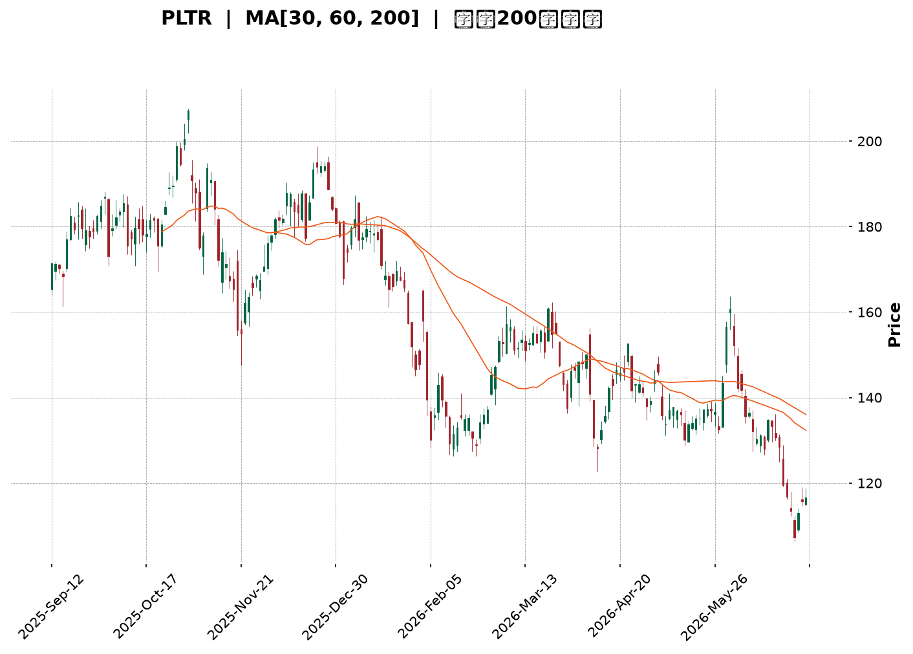
</details>

<html>
<head><meta charset="utf-8" /></head>
<body>
    <div style="height:500px; width:100%;">                        <script>window.PlotlyConfig = {MathJaxConfig: 'local'};</script>
        <script charset="utf-8" src="https://cdn.plot.ly/plotly-3.6.0.min.js" integrity="sha256-QaOVwtVY0T02VaHrr6pnoHLCwayMJp4O5n4YyaE3rJk=" crossorigin="anonymous"></script>                <div id="candlestick-chart" class="plotly-graph-div" style="height:100%; width:100%;"></div>            <script>                window.PLOTLYENV=window.PLOTLYENV || {};                                if (document.getElementById("candlestick-chart")) {                    Plotly.newPlot(                        "candlestick-chart",                        [{"close":{"dtype":"f8","bdata":"AAAAgMJtZUAAAABguGZlQAAAAOBRSGVAAAAAYI8KZUAAAABACh9mQAAAAOB6zGZAAAAAYI9qZkAAAACgmdFmQAAAAIDrcWZAAAAAANdjZkAAAACAPTJmQAAAACCFW2ZAAAAAoHDNZkAAAABgZh5nQAAAAKCZYWdAAAAAgD2iZUAAAADA9XBmQAAAAKBwxWZAAAAAgOvxZkAAAABACi9nQAAAAIAU7mVAAAAAYLgmZkAAAAAgrndmQAAAAADXc2ZAAAAAANdDZkAAAADAzERmQAAAAEDhsmZAAAAA4FGwZkAAAAAgru9lQAAAACBcj2ZAAAAAACkUZ0AAAACAwqVnQAAAAEAzs2dAAAAAgOvZaEAAAACgmVFoQAAAAEAKD2lAAAAAgMLlaUAAAAAgrtdnQAAAAMDMfGdAAAAAoJnhZUAAAACAwj1mQAAAACCFM2hAAAAAYLjeZ0AAAACgcAVnQAAAAOB6hGVAAAAA4FHAZUAAAAAAAGhlQAAAAGCP6mRAAAAAoHCtZEAAAAAA13djQAAAAEAzW2NAAAAAAABIZEAAAACgmXFkQAAAAOCjuGRAAAAAYGYOZUAAAAAgru9kQAAAAIAUVmVAAAAAYI8CZkAAAACgcD1mQAAAAOBRuGZAAAAAIK6vZkAAAABA4bpmQAAAAMAefWdAAAAAoEdxZ0AAAACAPfJmQAAAAAAA6GZAAAAAAAB4Z0AAAACgRylmQAAAAIAUNmdAAAAAACksaEAAAAAgXD9oQAAAAAApRGhAAAAAoHBFaEAAAABguJZnQAAAAIDCBWdAAAAAQOGaZkAAAAAAADhmQAAAACCF+2RAAAAAoEfBZUAAAABguHZmQAAAAIDCtWZAAAAAIIUbZkAAAAAgri9mQAAAAMAebWZAAAAAYLheZkAAAADAzExmQAAAAIA9ImZAAAAAYLheZUAAAADA9RBlQAAAAGCPqmRAAAAAwMy8ZEAAAABAMzNlQAAAAEAK72RAAAAAYGa2ZEAAAABAM6tjQAAAACCF+2JAAAAAQOFSYkAAAADgUXhiQAAAAAApvGNAAAAAoEdxYUAAAADgUUBgQAAAAMDM\u002fGBAAAAAwB7dYUAAAADgUXBhQAAAAIDC9WBAAAAAACkkYEAAAADAHm1gQAAAAOCjoGBAAAAAACnsYEAAAADgetxgQAAAACCu52BAAAAAQDNTYEAAAABA4RpgQAAAAIAUxmBAAAAAgBT+YEAAAACAFCZhQAAAAKBwJWJAAAAAQApnYkAAAACAFCZjQAAAAKBwFWNAAAAAwB6lY0AAAACAwo1jQAAAAOB65GJAAAAAQDPzYkAAAAAAADBjQAAAAGBm3mJAAAAAQAoXY0AAAABgj2JjQAAAAOCjGGNAAAAAgMJ1Y0AAAACAwtViQAAAAEDhGmRAAAAAwPVYY0AAAABguF5jQAAAAIDrcWJAAAAAgOvhYUAAAACgmTFhQAAAAMD1SGJAAAAAIK5PYkAAAABguI5iQAAAAIDCfWJAAAAAgD3CYkAAAADgUZhhQAAAACCuT2BAAAAAgOsBYEAAAAAA14tgQAAAAGBm9mBAAAAAwMzEYUAAAADgUdhhQAAAAOB6TGJAAAAA4Ho8YkAAAABACj9iQAAAAADXE2NAAAAAgD2yYUAAAABA4eJhQAAAAEAz42FAAAAAgMKlYUAAAABACj9hQAAAACCFY2FAAAAAgD0CYkAAAADA9UBiQAAAAMAe\u002fWBAAAAAoEe5YEAAAACgmSFhQAAAAKCZOWFAAAAA4HocYUAAAAAAAABhQAAAAKCZQWBAAAAAIFy3YEAAAAAgrr9gQAAAAOB65GBAAAAA4FHoYEAAAADAzCRhQAAAAKBHLWFAAAAAACkcYUAAAABAMxNhQAAAAOBRkGBAAAAAQOHqYUAAAACgR5FjQAAAAMDMFGRAAAAAoHAFY0AAAABgZsZhQAAAAGBmtmFAAAAAwPXwYEAAAABACg9hQAAAAIA9gmBAAAAAYLhGYEAAAABgj2JgQAAAACBc\u002f19AAAAAYLjWYEAAAAAAAKhgQAAAAAApVGBAAAAAQAoPYEAAAAAAAOBdQAAAAMDMLF1AAAAAAABgXEAAAACgR9FaQAAAACCFO1xAAAAAwMzsXEAAAABA4SpdQA=="},"high":{"dtype":"f8","bdata":"AAAAwPVwZUAAAACgmXllQAAAAIDraWVAAAAAgMI1ZUAAAACgmVlmQAAAAKBwDWdAAAAAAADIZkAAAAAAADhnQAAAAEAzG2dAAAAAgD0KZ0AAAAAA14NmQAAAACBcr2ZAAAAA4KPYZkAAAADA9UhnQAAAAGBmhmdAAAAAQOFaZ0AAAABgZt5mQAAAAIDCRWdAAAAA4FEIZ0AAAAAA13NnQAAAAEAzY2dAAAAAQApnZkAAAABA4cpmQAAAAEAzC2dAAAAAgD0aZ0AAAABA4bJmQAAAAEDh4mZAAAAAwHLMZkAAAABguMZmQAAAAIDrsWZAAAAAoHBFZ0AAAABgjxpoQAAAAMD1+GdAAAAAQDP7aEAAAACgcPVoQAAAAIDChWlAAAAA4KPwaUAAAABgZnZoQAAAAIA9ymdAAAAAQOHiZ0AAAABgZlZmQAAAAIDCXWhAAAAAoJkdaEAAAABgj9JnQAAAAGBm1mZAAAAAoEcpZkAAAAAgrsdlQAAAAGCPmmVAAAAAQDMzZUAAAACAPdJlQAAAACCFw2NAAAAAoHClZEAAAADAzJRkQAAAACDZCmVAAAAAoJkZZUAAAABAMyNlQAAAAAAA+GVAAAAAwB49ZkAAAACAFE5mQAAAAGDlxGZAAAAAACn8ZkAAAABAM9tmQAAAAOB6zGdAAAAAoJmBZ0AAAADAzFBnQAAAAMD1eGdAAAAAAACQZ0AAAAAAAHhnQAAAAGCPamdAAAAAAABgaEAAAAAAKdxoQAAAAADXa2hAAAAAoHBlaEAAAABAM4toQAAAAGBmZmdAAAAAAFQXZ0AAAADA9bBmQAAAAEAzq2ZAAAAAgD36ZUAAAACAFIZmQAAAAMD1aGdAAAAAwB41Z0AAAABACldmQAAAAAAA0GZAAAAAQDOjZkAAAADgIrNmQAAAAEAzk2ZAAAAAgMLNZkAAAABACn9lQAAAACCuL2VAAAAAAAAgZUAAAAAAAIBlQAAAAEDhUmVAAAAAgBQuZUAAAACgcKFkQAAAAAAptGNAAAAAAADgYkAAAADAzOxiQAAAAAB\u002fomRAAAAAQDN7Y0AAAAAgXD9hQAAAAOD7NWFAAAAAANc7YkAAAACA6zFiQAAAAAAAaGFAAAAA4Hr8YEAAAACA67FgQAAAAIA9ymBAAAAA4NCeYUAAAADAHgVhQAAAAGC4BmFAAAAAoEeBYEAAAAAgrkdgQAAAAEDhAmFAAAAA4FEwYUAAAABAM0NhQAAAAOB6ZGJAAAAAAABwYkAAAADgo1BjQAAAAAApjGNAAAAAYGYuZEAAAACAFM5jQAAAACAGlWNAAAAAgGglY0AAAAAAKXxjQAAAAIDrUWNAAAAAIIU7Y0AAAAAAAJhjQAAAAIAUlmNAAAAAwMyEY0AAAADAzJRjQAAAAGCPImRAAAAAwMxMZEAAAADgowhkQAAAAADXI2NAAAAAYLg+YkAAAAAA1wNiQAAAACCFe2JAAAAAoJmJYkAAAADgUZBiQAAAACCF02JAAAAA4KPIYkAAAADA9YhjQAAAAKBHcWFAAAAAYGYmYEAAAACgcM1gQAAAAIA9QmFAAAAAYI\u002fSYUAAAACgmTFiQAAAAMD1iGJAAAAAYGZmYkAAAAAA17tiQAAAAIDCFWNAAAAAoEfJYkAAAABgj+phQAAAAIA9ImJAAAAAQDP7YUAAAADgUXhhQAAAAGBmhmFAAAAAgBROYkAAAADgerRiQAAAACBc32FAAAAAYGb2YEAAAABgZp5hQAAAAAApPGFAAAAA4HokYUAAAACAwi1hQAAAACCuH2FAAAAAIFzPYEAAAADgevRgQAAAAIDr\u002fWBAAAAAQAovYUAAAAAgridhQAAAAKCZUWFAAAAA4KNgYUAAAACAwlVhQAAAACBc92BAAAAAAAAgYkAAAACg7bhjQAAAAGBmdmRAAAAAoJnxY0AAAACAwvViQAAAAADXS2JAAAAAQAq\u002fYUAAAADgUThhQAAAACCuH2FAAAAAgOulYEAAAADgo3BgQAAAAEDhYmBAAAAAIFzfYEAAAABA4dJgQAAAAEAzA2FAAAAAgMJtYEAAAAAA1xtgQAAAAAApPF5AAAAAAACAXUAAAACgmQlcQAAAAMAehVxAAAAAwB7FXUAAAADAzKxdQA=="},"hovertemplate":"\u003cb\u003e%{x|%Y-%m-%d}\u003c\u002fb\u003e\u003cbr\u003e\u958b: $%{open:.2f}\u003cbr\u003e\u9ad8: $%{high:.2f}\u003cbr\u003e\u4f4e: $%{low:.2f}\u003cbr\u003e\u6536: $%{close:.2f}\u003cextra\u003e\u003c\u002fextra\u003e","low":{"dtype":"f8","bdata":"AAAA4FGAZEAAAADAHu1kQAAAAGC4HmVAAAAA4KMoZEAAAADgeixlQAAAAGC4FmZAAAAAoEdJZkAAAADgUSBmQAAAAADXI2ZAAAAAoEfJZUAAAADAHt1lQAAAAMAeJWZAAAAAQApHZkAAAAAAAHBmQAAAAGBm3mZAAAAA4KNYZUAAAABgjzpmQAAAAKBwbWZAAAAAYGamZkAAAABgZn5mQAAAAMD1sGVAAAAAYGauZUAAAACAPVplQAAAAOCjAGZAAAAAYGYOZkAAAABgZr5lQAAAAIAULmZAAAAAwMxUZkAAAACgcC1lQAAAAOBR4GVAAAAAQDPbZkAAAADgo3BnQAAAAMD1WGdAAAAAIK7PZ0AAAAAA10NoQAAAAKBwvWhAAAAAgD06aUAAAACA6zFnQAAAAGC4pmZAAAAAwPXQZUAAAADAHh1lQAAAAOCj8GZAAAAAAClkZ0AAAADAzIxmQAAAAGBkV2VAAAAAAACQZEAAAACAwvVkQAAAAAAAsGRAAAAAoHBNZEAAAADgo0xjQAAAAIDrcWJAAAAAAACgY0AAAACAwpFjQAAAAAApfGRAAAAAAAC8ZEAAAAAA12NkQAAAAEDhMmVAAAAAYI8aZUAAAACAws1lQAAAAMAeJWZAAAAAoEdxZkAAAAAAKYxmQAAAAAAA2GZAAAAAYLiGZkAAAAAgWDVmQAAAAMD1gGZAAAAAQIukZkAAAAAAABBmQAAAAOBRsGZAAAAAIFxXZ0AAAACAwg1oQAAAACCF92dAAAAAYI8aaEAAAAAA15NnQAAAAOB69GZAAAAAYGaWZkAAAAAAAChmQAAAAEAzy2RAAAAAoEd5ZUAAAADgo9hlQAAAAMAeNWZAAAAAANfLZUAAAAAAANhlQAAAAEDhCmZAAAAA4HoEZkAAAABgZr5lQAAAAMD1EGZAAAAA4FFAZUAAAAAgrsdkQAAAACCFI2RAAAAAYGaeZEAAAACgmclkQAAAAGBm6mRAAAAAgBSWZEAAAAAgrqdjQAAAAADXY2JAAAAAwHIkYkAAAACg7VRiQAAAAADXI2NAAAAAgML1YEAAAACAPQpgQAAAAEAzi2BAAAAAANXYYEAAAADgozhhQAAAAGBmnmBAAAAAANejX0AAAACA6Y5fQAAAAGCP0l9AAAAAANfbYEAAAADgUWBgQAAAAKBwZWBAAAAAwPXYX0AAAAAgrpdfQAAAAIDCJWBAAAAAACmUYEAAAAAgXL9gQAAAAOCjkGFAAAAAYGZGYUAAAACA64FiQAAAACCFs2JAAAAAoEfJYkAAAABACh9jQAAAAOB6xGJAAAAAYI+qYkAAAAAgXN9iQAAAAGCPkmJAAAAAoHDlYkAAAAAA1wNjQAAAACCFE2NAAAAAAADQYkAAAABA4aJiQAAAACCuJ2NAAAAA4Hr0YkAAAAAgXFtjQAAAAAAAaGJAAAAAgOuxYUAAAACgmQlhQAAAAEAKX2FAAAAAQAoPYkAAAAAgrj9hQAAAACAxVGJAAAAAYGYOYkAAAACgcGVhQAAAAEAKD2BAAAAAIIWrXkAAAADAzCRgQAAAAAAAwGBAAAAAgMLdYEAAAADA9XBhQAAAAKCZ6WFAAAAAYI\u002f6YUAAAADA9\u002f9hQAAAAMAebWJAAAAAoHB9YUAAAACAwl1hQAAAAOBRoGFAAAAAoHCNYUAAAACAwtVgQAAAAMDMFGFAAAAA4HqsYUAAAABAMydiQAAAAEAK12BAAAAAwMxkYEAAAADA9dhgQAAAAOCjoGBAAAAAAKyYYEAAAABguK5gQAAAAAAAGGBAAAAAYGYuYEAAAACgR4lgQAAAAGCPamBAAAAAQDOzYEAAAACgcI1gQAAAAKBw7WBAAAAAoJnJYEAAAACgmalgQAAAAAApdGBAAAAAAACgYEAAAACgRzliQAAAAAApfGNAAAAAoJm5YkAAAAAAAKhhQAAAAEC0iGFAAAAAwMzAYEAAAADA9ehgQAAAAGBm1l9AAAAAoJkZYEAAAABA4cpfQAAAAKCZqV9AAAAAYGY2YEAAAAAA1zNgQAAAAKBwPWBAAAAA4KNAX0AAAADAzMxdQAAAACCFC11AAAAAAAAQXEAAAAAgrpdaQAAAAIAUHltAAAAAwMysXEAAAADgeqRcQA=="},"name":"\u50f9\u683c","open":{"dtype":"f8","bdata":"AAAAQDOrZEAAAABAMzNlQAAAAKBHYWVAAAAA4KMgZUAAAADgo0hlQAAAAIA9ImZAAAAAACmcZkAAAADgUdBmQAAAAMAe\u002fWZAAAAAoJn5ZUAAAACgmWFmQAAAAOB6dGZAAAAAIFxfZkAAAACAPapmQAAAAGBmVmdAAAAAwMxMZ0AAAACAwmVmQAAAAIDriWZAAAAAoJnZZkAAAABgj\u002fJmQAAAAKBwJWdAAAAAgMJVZkAAAAAAAABmQAAAAMD1tGZAAAAAwPW4ZkAAAAAAADhmQAAAACCub2ZAAAAAgOvBZkAAAACAwr1mQAAAAIA97mVAAAAAACncZkAAAABACp9nQAAAACBcr2dAAAAAYI\u002fiZ0AAAACgmc1oQAAAAGBm5mhAAAAAoHChaUAAAACAPQJoQAAAAAAAoGdAAAAAIK5\u002fZ0AAAADAzKRlQAAAAIDrCWdAAAAAYLjKZ0AAAABgj9JnQAAAAEDhtmZAAAAAQDPfZEAAAADA9VBlQAAAAADXC2VAAAAAoJn5ZEAAAACAPYJlQAAAAOBRgGNAAAAAQAqvY0AAAACAPQJkQAAAAEAz22RAAAAA4FH4ZEAAAAAAAKBkQAAAAEDhMmVAAAAA4HpEZUAAAAAgrgtmQAAAACBcR2ZAAAAAYLjGZkAAAABACp9mQAAAAGBmHmdAAAAAoJkZZ0AAAACA6zlnQAAAAGCPImdAAAAAwPW0ZkAAAABA4XZnQAAAAOBRsGZAAAAAIK5XZ0AAAACgR2FoQAAAAGBmGmhAAAAAwB4laEAAAADgemBoQAAAAEAzW2dAAAAAQDMLZ0AAAAAAKaRmQAAAAKCZqWZAAAAAACncZUAAAADgUfhlQAAAAKCZeWZAAAAAIK4zZ0AAAADgoyBmQAAAAIDrNWZAAAAAAABcZkAAAAAAAERmQAAAAGC4VmZAAAAAIIVrZkAAAAAAAPRkQAAAACDdDGVAAAAAoJkdZUAAAADgo+hkQAAAAGC4BmVAAAAAIFzvZEAAAADAzIxkQAAAAAAptGNAAAAAoJnBYkAAAACAFN5iQAAAAKCZoWRAAAAAwB5tY0AAAACAPRphQAAAAGCP6mBAAAAAYI8SYUAAAABA4R5iQAAAAMDMYGFAAAAAIIXrYEAAAACgmflfQAAAAOCjHGBAAAAA4Hr8YEAAAACA64lgQAAAACCui2BAAAAAoEeBYEAAAAAAKSBgQAAAACCFU2BAAAAAQAq7YEAAAACAPcJgQAAAAMDMmGFAAAAAQDPDYUAAAACAwo1iQAAAAIAUHmNAAAAAgBTOYkAAAACAFHZjQAAAACCuf2NAAAAAACnsYkAAAADgUSBjQAAAAKCZKWNAAAAAYGYOY0AAAADA9QxjQAAAAIA9XmNAAAAAQDMjY0AAAABgZmZjQAAAACCuJ2NAAAAAgD0CZEAAAACgcK1jQAAAAIDCIWNAAAAAACk8YkAAAADgo+hhQAAAAOCjgGFAAAAAAABgYkAAAAAghe9hQAAAACCFi2JAAAAAYDlcYkAAAADgelhjQAAAAOCjbGFAAAAAIFwPYEAAAAAgXEdgQAAAAACqzWBAAAAAoEcZYUAAAACgRwliQAAAAIAUKmJAAAAAAAAgYkAAAACA61liQAAAACCFi2JAAAAAYGa2YkAAAABguN5hQAAAAAAAqGFAAAAAoJnJYUAAAADgUXhhQAAAAEAzT2FAAAAAAADoYUAAAAAAAHhiQAAAAKBwiWFAAAAAYLi2YEAAAABAM+NgQAAAACCu+2BAAAAAwB7dYEAAAABAMxNhQAAAACAxwGBAAAAAwMw0YEAAAACgmZlgQAAAAAAAkGBAAAAAoHDlYEAAAADgo8RgQAAAAKCZ+WBAAAAAoJktYUAAAADAHgVhQAAAAKCZqWBAAAAAwB6lYEAAAABgZnpiQAAAACBc\u002f2NAAAAAgBSWY0AAAABgZrZiQAAAAGC4LmJAAAAAYGaKYUAAAACAwvVgQAAAAADX22BAAAAAYGYqYEAAAADA9RhgQAAAAKBHXWBAAAAA4KNAYEAAAABA4dJgQAAAAOBReGBAAAAAQOFaYEAAAAAgXG9fQAAAAKCZCV5AAAAAIK6HXEAAAADgUdhbQAAAAGCPQltAAAAAYLgOXUAAAACAPbpcQA=="},"x":["2025-09-12T00:00:00-04:00","2025-09-15T00:00:00-04:00","2025-09-16T00:00:00-04:00","2025-09-17T00:00:00-04:00","2025-09-18T00:00:00-04:00","2025-09-19T00:00:00-04:00","2025-09-22T00:00:00-04:00","2025-09-23T00:00:00-04:00","2025-09-24T00:00:00-04:00","2025-09-25T00:00:00-04:00","2025-09-26T00:00:00-04:00","2025-09-29T00:00:00-04:00","2025-09-30T00:00:00-04:00","2025-10-01T00:00:00-04:00","2025-10-02T00:00:00-04:00","2025-10-03T00:00:00-04:00","2025-10-06T00:00:00-04:00","2025-10-07T00:00:00-04:00","2025-10-08T00:00:00-04:00","2025-10-09T00:00:00-04:00","2025-10-10T00:00:00-04:00","2025-10-13T00:00:00-04:00","2025-10-14T00:00:00-04:00","2025-10-15T00:00:00-04:00","2025-10-16T00:00:00-04:00","2025-10-17T00:00:00-04:00","2025-10-20T00:00:00-04:00","2025-10-21T00:00:00-04:00","2025-10-22T00:00:00-04:00","2025-10-23T00:00:00-04:00","2025-10-24T00:00:00-04:00","2025-10-27T00:00:00-04:00","2025-10-28T00:00:00-04:00","2025-10-29T00:00:00-04:00","2025-10-30T00:00:00-04:00","2025-10-31T00:00:00-04:00","2025-11-03T00:00:00-05:00","2025-11-04T00:00:00-05:00","2025-11-05T00:00:00-05:00","2025-11-06T00:00:00-05:00","2025-11-07T00:00:00-05:00","2025-11-10T00:00:00-05:00","2025-11-11T00:00:00-05:00","2025-11-12T00:00:00-05:00","2025-11-13T00:00:00-05:00","2025-11-14T00:00:00-05:00","2025-11-17T00:00:00-05:00","2025-11-18T00:00:00-05:00","2025-11-19T00:00:00-05:00","2025-11-20T00:00:00-05:00","2025-11-21T00:00:00-05:00","2025-11-24T00:00:00-05:00","2025-11-25T00:00:00-05:00","2025-11-26T00:00:00-05:00","2025-11-28T00:00:00-05:00","2025-12-01T00:00:00-05:00","2025-12-02T00:00:00-05:00","2025-12-03T00:00:00-05:00","2025-12-04T00:00:00-05:00","2025-12-05T00:00:00-05:00","2025-12-08T00:00:00-05:00","2025-12-09T00:00:00-05:00","2025-12-10T00:00:00-05:00","2025-12-11T00:00:00-05:00","2025-12-12T00:00:00-05:00","2025-12-15T00:00:00-05:00","2025-12-16T00:00:00-05:00","2025-12-17T00:00:00-05:00","2025-12-18T00:00:00-05:00","2025-12-19T00:00:00-05:00","2025-12-22T00:00:00-05:00","2025-12-23T00:00:00-05:00","2025-12-24T00:00:00-05:00","2025-12-26T00:00:00-05:00","2025-12-29T00:00:00-05:00","2025-12-30T00:00:00-05:00","2025-12-31T00:00:00-05:00","2026-01-02T00:00:00-05:00","2026-01-05T00:00:00-05:00","2026-01-06T00:00:00-05:00","2026-01-07T00:00:00-05:00","2026-01-08T00:00:00-05:00","2026-01-09T00:00:00-05:00","2026-01-12T00:00:00-05:00","2026-01-13T00:00:00-05:00","2026-01-14T00:00:00-05:00","2026-01-15T00:00:00-05:00","2026-01-16T00:00:00-05:00","2026-01-20T00:00:00-05:00","2026-01-21T00:00:00-05:00","2026-01-22T00:00:00-05:00","2026-01-23T00:00:00-05:00","2026-01-26T00:00:00-05:00","2026-01-27T00:00:00-05:00","2026-01-28T00:00:00-05:00","2026-01-29T00:00:00-05:00","2026-01-30T00:00:00-05:00","2026-02-02T00:00:00-05:00","2026-02-03T00:00:00-05:00","2026-02-04T00:00:00-05:00","2026-02-05T00:00:00-05:00","2026-02-06T00:00:00-05:00","2026-02-09T00:00:00-05:00","2026-02-10T00:00:00-05:00","2026-02-11T00:00:00-05:00","2026-02-12T00:00:00-05:00","2026-02-13T00:00:00-05:00","2026-02-17T00:00:00-05:00","2026-02-18T00:00:00-05:00","2026-02-19T00:00:00-05:00","2026-02-20T00:00:00-05:00","2026-02-23T00:00:00-05:00","2026-02-24T00:00:00-05:00","2026-02-25T00:00:00-05:00","2026-02-26T00:00:00-05:00","2026-02-27T00:00:00-05:00","2026-03-02T00:00:00-05:00","2026-03-03T00:00:00-05:00","2026-03-04T00:00:00-05:00","2026-03-05T00:00:00-05:00","2026-03-06T00:00:00-05:00","2026-03-09T00:00:00-04:00","2026-03-10T00:00:00-04:00","2026-03-11T00:00:00-04:00","2026-03-12T00:00:00-04:00","2026-03-13T00:00:00-04:00","2026-03-16T00:00:00-04:00","2026-03-17T00:00:00-04:00","2026-03-18T00:00:00-04:00","2026-03-19T00:00:00-04:00","2026-03-20T00:00:00-04:00","2026-03-23T00:00:00-04:00","2026-03-24T00:00:00-04:00","2026-03-25T00:00:00-04:00","2026-03-26T00:00:00-04:00","2026-03-27T00:00:00-04:00","2026-03-30T00:00:00-04:00","2026-03-31T00:00:00-04:00","2026-04-01T00:00:00-04:00","2026-04-02T00:00:00-04:00","2026-04-06T00:00:00-04:00","2026-04-07T00:00:00-04:00","2026-04-08T00:00:00-04:00","2026-04-09T00:00:00-04:00","2026-04-10T00:00:00-04:00","2026-04-13T00:00:00-04:00","2026-04-14T00:00:00-04:00","2026-04-15T00:00:00-04:00","2026-04-16T00:00:00-04:00","2026-04-17T00:00:00-04:00","2026-04-20T00:00:00-04:00","2026-04-21T00:00:00-04:00","2026-04-22T00:00:00-04:00","2026-04-23T00:00:00-04:00","2026-04-24T00:00:00-04:00","2026-04-27T00:00:00-04:00","2026-04-28T00:00:00-04:00","2026-04-29T00:00:00-04:00","2026-04-30T00:00:00-04:00","2026-05-01T00:00:00-04:00","2026-05-04T00:00:00-04:00","2026-05-05T00:00:00-04:00","2026-05-06T00:00:00-04:00","2026-05-07T00:00:00-04:00","2026-05-08T00:00:00-04:00","2026-05-11T00:00:00-04:00","2026-05-12T00:00:00-04:00","2026-05-13T00:00:00-04:00","2026-05-14T00:00:00-04:00","2026-05-15T00:00:00-04:00","2026-05-18T00:00:00-04:00","2026-05-19T00:00:00-04:00","2026-05-20T00:00:00-04:00","2026-05-21T00:00:00-04:00","2026-05-22T00:00:00-04:00","2026-05-26T00:00:00-04:00","2026-05-27T00:00:00-04:00","2026-05-28T00:00:00-04:00","2026-05-29T00:00:00-04:00","2026-06-01T00:00:00-04:00","2026-06-02T00:00:00-04:00","2026-06-03T00:00:00-04:00","2026-06-04T00:00:00-04:00","2026-06-05T00:00:00-04:00","2026-06-08T00:00:00-04:00","2026-06-09T00:00:00-04:00","2026-06-10T00:00:00-04:00","2026-06-11T00:00:00-04:00","2026-06-12T00:00:00-04:00","2026-06-15T00:00:00-04:00","2026-06-16T00:00:00-04:00","2026-06-17T00:00:00-04:00","2026-06-18T00:00:00-04:00","2026-06-22T00:00:00-04:00","2026-06-23T00:00:00-04:00","2026-06-24T00:00:00-04:00","2026-06-25T00:00:00-04:00","2026-06-26T00:00:00-04:00","2026-06-29T00:00:00-04:00","2026-06-30T00:00:00-04:00"],"type":"candlestick"},{"hovertemplate":"MA30: $%{y:.2f}\u003cextra\u003e\u003c\u002fextra\u003e","line":{"color":"#2196F3","dash":"dash","width":2},"mode":"lines","name":"MA30","x":["2025-09-12T00:00:00-04:00","2025-09-15T00:00:00-04:00","2025-09-16T00:00:00-04:00","2025-09-17T00:00:00-04:00","2025-09-18T00:00:00-04:00","2025-09-19T00:00:00-04:00","2025-09-22T00:00:00-04:00","2025-09-23T00:00:00-04:00","2025-09-24T00:00:00-04:00","2025-09-25T00:00:00-04:00","2025-09-26T00:00:00-04:00","2025-09-29T00:00:00-04:00","2025-09-30T00:00:00-04:00","2025-10-01T00:00:00-04:00","2025-10-02T00:00:00-04:00","2025-10-03T00:00:00-04:00","2025-10-06T00:00:00-04:00","2025-10-07T00:00:00-04:00","2025-10-08T00:00:00-04:00","2025-10-09T00:00:00-04:00","2025-10-10T00:00:00-04:00","2025-10-13T00:00:00-04:00","2025-10-14T00:00:00-04:00","2025-10-15T00:00:00-04:00","2025-10-16T00:00:00-04:00","2025-10-17T00:00:00-04:00","2025-10-20T00:00:00-04:00","2025-10-21T00:00:00-04:00","2025-10-22T00:00:00-04:00","2025-10-23T00:00:00-04:00","2025-10-24T00:00:00-04:00","2025-10-27T00:00:00-04:00","2025-10-28T00:00:00-04:00","2025-10-29T00:00:00-04:00","2025-10-30T00:00:00-04:00","2025-10-31T00:00:00-04:00","2025-11-03T00:00:00-05:00","2025-11-04T00:00:00-05:00","2025-11-05T00:00:00-05:00","2025-11-06T00:00:00-05:00","2025-11-07T00:00:00-05:00","2025-11-10T00:00:00-05:00","2025-11-11T00:00:00-05:00","2025-11-12T00:00:00-05:00","2025-11-13T00:00:00-05:00","2025-11-14T00:00:00-05:00","2025-11-17T00:00:00-05:00","2025-11-18T00:00:00-05:00","2025-11-19T00:00:00-05:00","2025-11-20T00:00:00-05:00","2025-11-21T00:00:00-05:00","2025-11-24T00:00:00-05:00","2025-11-25T00:00:00-05:00","2025-11-26T00:00:00-05:00","2025-11-28T00:00:00-05:00","2025-12-01T00:00:00-05:00","2025-12-02T00:00:00-05:00","2025-12-03T00:00:00-05:00","2025-12-04T00:00:00-05:00","2025-12-05T00:00:00-05:00","2025-12-08T00:00:00-05:00","2025-12-09T00:00:00-05:00","2025-12-10T00:00:00-05:00","2025-12-11T00:00:00-05:00","2025-12-12T00:00:00-05:00","2025-12-15T00:00:00-05:00","2025-12-16T00:00:00-05:00","2025-12-17T00:00:00-05:00","2025-12-18T00:00:00-05:00","2025-12-19T00:00:00-05:00","2025-12-22T00:00:00-05:00","2025-12-23T00:00:00-05:00","2025-12-24T00:00:00-05:00","2025-12-26T00:00:00-05:00","2025-12-29T00:00:00-05:00","2025-12-30T00:00:00-05:00","2025-12-31T00:00:00-05:00","2026-01-02T00:00:00-05:00","2026-01-05T00:00:00-05:00","2026-01-06T00:00:00-05:00","2026-01-07T00:00:00-05:00","2026-01-08T00:00:00-05:00","2026-01-09T00:00:00-05:00","2026-01-12T00:00:00-05:00","2026-01-13T00:00:00-05:00","2026-01-14T00:00:00-05:00","2026-01-15T00:00:00-05:00","2026-01-16T00:00:00-05:00","2026-01-20T00:00:00-05:00","2026-01-21T00:00:00-05:00","2026-01-22T00:00:00-05:00","2026-01-23T00:00:00-05:00","2026-01-26T00:00:00-05:00","2026-01-27T00:00:00-05:00","2026-01-28T00:00:00-05:00","2026-01-29T00:00:00-05:00","2026-01-30T00:00:00-05:00","2026-02-02T00:00:00-05:00","2026-02-03T00:00:00-05:00","2026-02-04T00:00:00-05:00","2026-02-05T00:00:00-05:00","2026-02-06T00:00:00-05:00","2026-02-09T00:00:00-05:00","2026-02-10T00:00:00-05:00","2026-02-11T00:00:00-05:00","2026-02-12T00:00:00-05:00","2026-02-13T00:00:00-05:00","2026-02-17T00:00:00-05:00","2026-02-18T00:00:00-05:00","2026-02-19T00:00:00-05:00","2026-02-20T00:00:00-05:00","2026-02-23T00:00:00-05:00","2026-02-24T00:00:00-05:00","2026-02-25T00:00:00-05:00","2026-02-26T00:00:00-05:00","2026-02-27T00:00:00-05:00","2026-03-02T00:00:00-05:00","2026-03-03T00:00:00-05:00","2026-03-04T00:00:00-05:00","2026-03-05T00:00:00-05:00","2026-03-06T00:00:00-05:00","2026-03-09T00:00:00-04:00","2026-03-10T00:00:00-04:00","2026-03-11T00:00:00-04:00","2026-03-12T00:00:00-04:00","2026-03-13T00:00:00-04:00","2026-03-16T00:00:00-04:00","2026-03-17T00:00:00-04:00","2026-03-18T00:00:00-04:00","2026-03-19T00:00:00-04:00","2026-03-20T00:00:00-04:00","2026-03-23T00:00:00-04:00","2026-03-24T00:00:00-04:00","2026-03-25T00:00:00-04:00","2026-03-26T00:00:00-04:00","2026-03-27T00:00:00-04:00","2026-03-30T00:00:00-04:00","2026-03-31T00:00:00-04:00","2026-04-01T00:00:00-04:00","2026-04-02T00:00:00-04:00","2026-04-06T00:00:00-04:00","2026-04-07T00:00:00-04:00","2026-04-08T00:00:00-04:00","2026-04-09T00:00:00-04:00","2026-04-10T00:00:00-04:00","2026-04-13T00:00:00-04:00","2026-04-14T00:00:00-04:00","2026-04-15T00:00:00-04:00","2026-04-16T00:00:00-04:00","2026-04-17T00:00:00-04:00","2026-04-20T00:00:00-04:00","2026-04-21T00:00:00-04:00","2026-04-22T00:00:00-04:00","2026-04-23T00:00:00-04:00","2026-04-24T00:00:00-04:00","2026-04-27T00:00:00-04:00","2026-04-28T00:00:00-04:00","2026-04-29T00:00:00-04:00","2026-04-30T00:00:00-04:00","2026-05-01T00:00:00-04:00","2026-05-04T00:00:00-04:00","2026-05-05T00:00:00-04:00","2026-05-06T00:00:00-04:00","2026-05-07T00:00:00-04:00","2026-05-08T00:00:00-04:00","2026-05-11T00:00:00-04:00","2026-05-12T00:00:00-04:00","2026-05-13T00:00:00-04:00","2026-05-14T00:00:00-04:00","2026-05-15T00:00:00-04:00","2026-05-18T00:00:00-04:00","2026-05-19T00:00:00-04:00","2026-05-20T00:00:00-04:00","2026-05-21T00:00:00-04:00","2026-05-22T00:00:00-04:00","2026-05-26T00:00:00-04:00","2026-05-27T00:00:00-04:00","2026-05-28T00:00:00-04:00","2026-05-29T00:00:00-04:00","2026-06-01T00:00:00-04:00","2026-06-02T00:00:00-04:00","2026-06-03T00:00:00-04:00","2026-06-04T00:00:00-04:00","2026-06-05T00:00:00-04:00","2026-06-08T00:00:00-04:00","2026-06-09T00:00:00-04:00","2026-06-10T00:00:00-04:00","2026-06-11T00:00:00-04:00","2026-06-12T00:00:00-04:00","2026-06-15T00:00:00-04:00","2026-06-16T00:00:00-04:00","2026-06-17T00:00:00-04:00","2026-06-18T00:00:00-04:00","2026-06-22T00:00:00-04:00","2026-06-23T00:00:00-04:00","2026-06-24T00:00:00-04:00","2026-06-25T00:00:00-04:00","2026-06-26T00:00:00-04:00","2026-06-29T00:00:00-04:00","2026-06-30T00:00:00-04:00"],"y":{"dtype":"f8","bdata":"AAAAAAAA+H8AAAAAAAD4fwAAAAAAAPh\u002fAAAAAAAA+H8AAAAAAAD4fwAAAAAAAPh\u002fAAAAAAAA+H8AAAAAAAD4fwAAAAAAAPh\u002fAAAAAAAA+H8AAAAAAAD4fwAAAAAAAPh\u002fAAAAAAAA+H8AAAAAAAD4fwAAAAAAAPh\u002fAAAAAAAA+H8AAAAAAAD4fwAAAAAAAPh\u002fAAAAAAAA+H8AAAAAAAD4fwAAAAAAAPh\u002fAAAAAAAA+H8AAAAAAAD4fwAAAAAAAPh\u002fAAAAAAAA+H8AAAAAAAD4fwAAAAAAAPh\u002fAAAAAAAA+H8AAAAAAAD4f97d3X2xWGZAmpmZ+cVmZkCrqqr68HlmQHd3dxeSjmZAmpmZKRWvZkDNzMys1cFmQImIiLge1WZAAAAAoNPyZkCrqqoKkPtmQKuqqmp1BGdAmpmZCR4AZ0BmZmZWgABnQCIiIhI8EGdAAAAAEFgZZ0AiIiISgxhnQFVVVaWbCGdAMzMzU5wJZ0BVVVVVxwBnQGZmZgbz8GZAiYiImJndZkAAAACw5L1mQO\u002fu7j7up2ZAq6qqKvmXZkB3d3c3tIZmQO\u002fu7j7ud2ZAERERsZ1tZkDe3d3NPmJmQBEREWGeVmZAERERodNQZkDe3d0ta1NmQERERLTIVGZAZmZmRm9RZkB3d3f3mklmQLy7u3vNR2ZAVVVVBcg7ZkAAAADAETBmQKuqqoqzHWZAvLu72\u002fkIZkC8u7sbofplQCIiIqJF+GVAIiIi8tILZkCrqqqq8RxmQJqZmal\u002fHWZARERENOwgZkDe3d3twyVmQGZmZqabMmZAIiIisuQ5ZkARERGh00BmQKuqqlpkQWZAAAAAMJZKZkC8u7s7JmRmQLy7u5vEgGZAzczMHFqQZkCamZmpOJ9mQKuqqkrFrWZAmpmZOfu4ZkARERFhnsRmQLy7u4tsy2ZAIiIicvbFZkCamZlZ8rtmQN7d3d1rqmZAERERwcqZZkC8u7trvIxmQAAAAPDudmZAmpmZKaNfZkCrqqpaq0NmQKuqqsovImZA3t3dXUj2ZUBVVVW1yNZlQJqZmbkeuWVAAAAA0LB\u002fZUDNzMy8dDtlQAAAABBY\u002fWRAq6qqqqrGZECJiIjIL5JkQM3MzAx0XmRAZmZmxksnZEDe3d3d3fVjQJqZmTm00GNAiYiIeHenY0Dv7u6eqHdjQImIiGgfRmNAiYiIWMcUY0BmZmam4uBiQDMzM5OmsGJA7+7uPsOCYkC8u7srzlZiQHd3d1fHNGJAzczMvHQbYkBVVVXlFwtiQO\u002fu7t6W\u002fWFAVVVVRUT0YUCrqqr6N+ZhQM3MzMzM1GFAAAAAkMLFYUARERFBp8FhQDMzM8OuwGFAmpmZqTjHYUAzMzODB89hQERERCSUyWFAAAAAcMvaYUCamZm51\u002fBhQCIiIgJyC2JA7+7uThsYYkARERExlihiQJqZmTlCNWJAq6qqCh5EYkC8u7urqkpiQImIiIjPWGJA3t3dTalkYkAiIiLSInNiQImIiAisgGJAREREpHCVYkCJiIiYJ6JiQAAAAEA1nmJAvLu7e82VYkDNzMxMqZBiQLy7u1uPhmJAiYiI6CaBYkAiIiLSBnZiQGZmZvZTb2JAAAAAgE5jYkCamZk5JlhiQM3MzFy6WWJAERERgQdPYkARERHh7ENiQO\u002fu7k6NO2JA3t3dHT4vYkAiIiLy\u002fRxiQKuqqtprDmJA3t3djQkCYkC8u7vLE\u002f1hQO\u002fu7j584mFAMzMzkxjMYUAzMzPz\u002fbhhQCIiItKUrmFAAAAAAACoYUDv7u6+WKZhQAAAAOAIlWFAq6qqimyHYUBERERE\u002fXdhQO\u002fu7r5YamFAAAAAoIxaYUCrqqraslZhQGZmZtYVXmFAmpmZSX5nYUDNzMxcAWxhQHd3d0eaaGFAq6qqOt9pYUBmZmYWknhhQERERATIh2FAAAAA4HqOYUCamZlpdYphQGZmZobPfmFAMzMzM154YUAAAACATnFhQDMzM5OKZWFAmpmZCddZYUC8u7ubfVJhQDMzMxuhRmFAvLu7M6U8YUARERFpAy9hQGZmZp5hKWFAAAAA6LQjYUDe3d2V\u002fBBhQImIiOB6+mBAERER2YfhYEBERESk4sJgQFVVVb2fsGBAERERWWSdYEDNzMzU6opgQA=="},"type":"scatter"},{"hovertemplate":"MA60: $%{y:.2f}\u003cextra\u003e\u003c\u002fextra\u003e","line":{"color":"#9C27B0","dash":"dash","width":2},"mode":"lines","name":"MA60","x":["2025-09-12T00:00:00-04:00","2025-09-15T00:00:00-04:00","2025-09-16T00:00:00-04:00","2025-09-17T00:00:00-04:00","2025-09-18T00:00:00-04:00","2025-09-19T00:00:00-04:00","2025-09-22T00:00:00-04:00","2025-09-23T00:00:00-04:00","2025-09-24T00:00:00-04:00","2025-09-25T00:00:00-04:00","2025-09-26T00:00:00-04:00","2025-09-29T00:00:00-04:00","2025-09-30T00:00:00-04:00","2025-10-01T00:00:00-04:00","2025-10-02T00:00:00-04:00","2025-10-03T00:00:00-04:00","2025-10-06T00:00:00-04:00","2025-10-07T00:00:00-04:00","2025-10-08T00:00:00-04:00","2025-10-09T00:00:00-04:00","2025-10-10T00:00:00-04:00","2025-10-13T00:00:00-04:00","2025-10-14T00:00:00-04:00","2025-10-15T00:00:00-04:00","2025-10-16T00:00:00-04:00","2025-10-17T00:00:00-04:00","2025-10-20T00:00:00-04:00","2025-10-21T00:00:00-04:00","2025-10-22T00:00:00-04:00","2025-10-23T00:00:00-04:00","2025-10-24T00:00:00-04:00","2025-10-27T00:00:00-04:00","2025-10-28T00:00:00-04:00","2025-10-29T00:00:00-04:00","2025-10-30T00:00:00-04:00","2025-10-31T00:00:00-04:00","2025-11-03T00:00:00-05:00","2025-11-04T00:00:00-05:00","2025-11-05T00:00:00-05:00","2025-11-06T00:00:00-05:00","2025-11-07T00:00:00-05:00","2025-11-10T00:00:00-05:00","2025-11-11T00:00:00-05:00","2025-11-12T00:00:00-05:00","2025-11-13T00:00:00-05:00","2025-11-14T00:00:00-05:00","2025-11-17T00:00:00-05:00","2025-11-18T00:00:00-05:00","2025-11-19T00:00:00-05:00","2025-11-20T00:00:00-05:00","2025-11-21T00:00:00-05:00","2025-11-24T00:00:00-05:00","2025-11-25T00:00:00-05:00","2025-11-26T00:00:00-05:00","2025-11-28T00:00:00-05:00","2025-12-01T00:00:00-05:00","2025-12-02T00:00:00-05:00","2025-12-03T00:00:00-05:00","2025-12-04T00:00:00-05:00","2025-12-05T00:00:00-05:00","2025-12-08T00:00:00-05:00","2025-12-09T00:00:00-05:00","2025-12-10T00:00:00-05:00","2025-12-11T00:00:00-05:00","2025-12-12T00:00:00-05:00","2025-12-15T00:00:00-05:00","2025-12-16T00:00:00-05:00","2025-12-17T00:00:00-05:00","2025-12-18T00:00:00-05:00","2025-12-19T00:00:00-05:00","2025-12-22T00:00:00-05:00","2025-12-23T00:00:00-05:00","2025-12-24T00:00:00-05:00","2025-12-26T00:00:00-05:00","2025-12-29T00:00:00-05:00","2025-12-30T00:00:00-05:00","2025-12-31T00:00:00-05:00","2026-01-02T00:00:00-05:00","2026-01-05T00:00:00-05:00","2026-01-06T00:00:00-05:00","2026-01-07T00:00:00-05:00","2026-01-08T00:00:00-05:00","2026-01-09T00:00:00-05:00","2026-01-12T00:00:00-05:00","2026-01-13T00:00:00-05:00","2026-01-14T00:00:00-05:00","2026-01-15T00:00:00-05:00","2026-01-16T00:00:00-05:00","2026-01-20T00:00:00-05:00","2026-01-21T00:00:00-05:00","2026-01-22T00:00:00-05:00","2026-01-23T00:00:00-05:00","2026-01-26T00:00:00-05:00","2026-01-27T00:00:00-05:00","2026-01-28T00:00:00-05:00","2026-01-29T00:00:00-05:00","2026-01-30T00:00:00-05:00","2026-02-02T00:00:00-05:00","2026-02-03T00:00:00-05:00","2026-02-04T00:00:00-05:00","2026-02-05T00:00:00-05:00","2026-02-06T00:00:00-05:00","2026-02-09T00:00:00-05:00","2026-02-10T00:00:00-05:00","2026-02-11T00:00:00-05:00","2026-02-12T00:00:00-05:00","2026-02-13T00:00:00-05:00","2026-02-17T00:00:00-05:00","2026-02-18T00:00:00-05:00","2026-02-19T00:00:00-05:00","2026-02-20T00:00:00-05:00","2026-02-23T00:00:00-05:00","2026-02-24T00:00:00-05:00","2026-02-25T00:00:00-05:00","2026-02-26T00:00:00-05:00","2026-02-27T00:00:00-05:00","2026-03-02T00:00:00-05:00","2026-03-03T00:00:00-05:00","2026-03-04T00:00:00-05:00","2026-03-05T00:00:00-05:00","2026-03-06T00:00:00-05:00","2026-03-09T00:00:00-04:00","2026-03-10T00:00:00-04:00","2026-03-11T00:00:00-04:00","2026-03-12T00:00:00-04:00","2026-03-13T00:00:00-04:00","2026-03-16T00:00:00-04:00","2026-03-17T00:00:00-04:00","2026-03-18T00:00:00-04:00","2026-03-19T00:00:00-04:00","2026-03-20T00:00:00-04:00","2026-03-23T00:00:00-04:00","2026-03-24T00:00:00-04:00","2026-03-25T00:00:00-04:00","2026-03-26T00:00:00-04:00","2026-03-27T00:00:00-04:00","2026-03-30T00:00:00-04:00","2026-03-31T00:00:00-04:00","2026-04-01T00:00:00-04:00","2026-04-02T00:00:00-04:00","2026-04-06T00:00:00-04:00","2026-04-07T00:00:00-04:00","2026-04-08T00:00:00-04:00","2026-04-09T00:00:00-04:00","2026-04-10T00:00:00-04:00","2026-04-13T00:00:00-04:00","2026-04-14T00:00:00-04:00","2026-04-15T00:00:00-04:00","2026-04-16T00:00:00-04:00","2026-04-17T00:00:00-04:00","2026-04-20T00:00:00-04:00","2026-04-21T00:00:00-04:00","2026-04-22T00:00:00-04:00","2026-04-23T00:00:00-04:00","2026-04-24T00:00:00-04:00","2026-04-27T00:00:00-04:00","2026-04-28T00:00:00-04:00","2026-04-29T00:00:00-04:00","2026-04-30T00:00:00-04:00","2026-05-01T00:00:00-04:00","2026-05-04T00:00:00-04:00","2026-05-05T00:00:00-04:00","2026-05-06T00:00:00-04:00","2026-05-07T00:00:00-04:00","2026-05-08T00:00:00-04:00","2026-05-11T00:00:00-04:00","2026-05-12T00:00:00-04:00","2026-05-13T00:00:00-04:00","2026-05-14T00:00:00-04:00","2026-05-15T00:00:00-04:00","2026-05-18T00:00:00-04:00","2026-05-19T00:00:00-04:00","2026-05-20T00:00:00-04:00","2026-05-21T00:00:00-04:00","2026-05-22T00:00:00-04:00","2026-05-26T00:00:00-04:00","2026-05-27T00:00:00-04:00","2026-05-28T00:00:00-04:00","2026-05-29T00:00:00-04:00","2026-06-01T00:00:00-04:00","2026-06-02T00:00:00-04:00","2026-06-03T00:00:00-04:00","2026-06-04T00:00:00-04:00","2026-06-05T00:00:00-04:00","2026-06-08T00:00:00-04:00","2026-06-09T00:00:00-04:00","2026-06-10T00:00:00-04:00","2026-06-11T00:00:00-04:00","2026-06-12T00:00:00-04:00","2026-06-15T00:00:00-04:00","2026-06-16T00:00:00-04:00","2026-06-17T00:00:00-04:00","2026-06-18T00:00:00-04:00","2026-06-22T00:00:00-04:00","2026-06-23T00:00:00-04:00","2026-06-24T00:00:00-04:00","2026-06-25T00:00:00-04:00","2026-06-26T00:00:00-04:00","2026-06-29T00:00:00-04:00","2026-06-30T00:00:00-04:00"],"y":{"dtype":"f8","bdata":"AAAAAAAA+H8AAAAAAAD4fwAAAAAAAPh\u002fAAAAAAAA+H8AAAAAAAD4fwAAAAAAAPh\u002fAAAAAAAA+H8AAAAAAAD4fwAAAAAAAPh\u002fAAAAAAAA+H8AAAAAAAD4fwAAAAAAAPh\u002fAAAAAAAA+H8AAAAAAAD4fwAAAAAAAPh\u002fAAAAAAAA+H8AAAAAAAD4fwAAAAAAAPh\u002fAAAAAAAA+H8AAAAAAAD4fwAAAAAAAPh\u002fAAAAAAAA+H8AAAAAAAD4fwAAAAAAAPh\u002fAAAAAAAA+H8AAAAAAAD4fwAAAAAAAPh\u002fAAAAAAAA+H8AAAAAAAD4fwAAAAAAAPh\u002fAAAAAAAA+H8AAAAAAAD4fwAAAAAAAPh\u002fAAAAAAAA+H8AAAAAAAD4fwAAAAAAAPh\u002fAAAAAAAA+H8AAAAAAAD4fwAAAAAAAPh\u002fAAAAAAAA+H8AAAAAAAD4fwAAAAAAAPh\u002fAAAAAAAA+H8AAAAAAAD4fwAAAAAAAPh\u002fAAAAAAAA+H8AAAAAAAD4fwAAAAAAAPh\u002fAAAAAAAA+H8AAAAAAAD4fwAAAAAAAPh\u002fAAAAAAAA+H8AAAAAAAD4fwAAAAAAAPh\u002fAAAAAAAA+H8AAAAAAAD4fwAAAAAAAPh\u002fAAAAAAAA+H8AAAAAAAD4fxERERm9VmZAAAAAoBpcZkARERH5xWFmQJqZmckva2ZAd3d3l251ZkBmZma283hmQJqZmSFpeWZA3t3dveZ9ZkAzMzOTGHtmQGZmZoZdfmZA3t3dffiFZkCJiIgAuY5mQN7d3d3dlmZAIiIiIiKdZkAAAACAI59mQN7d3aWbnWZAq6qqgsChZkAzMzN7zaBmQImIiLArmWZARERE5BeUZkDe3d11BZFmQFVVVW1ZlGZAvLu7oymUZkCJiIhw9pJmQM3MzMTZkmZAVVVVdUyTZkB3d3eXbpNmQGZmZnYFkWZAmpmZCWWLZkC8u7vDrodmQBEREUmaf2ZAvLu7A511ZkCamZmxK2tmQN7d3TVeX2ZAd3d3l7VNZkBVVVWN3jlmQKuqqqrxH2ZAzczMHKH\u002fZUCJiIjotOhlQN7d3S2y2GVAERER4cHFZUC8u7szM6xlQM3MzNxrjWVAd3d3b8tzZUAzMzPb+VtlQJqZmdmHSGVAREREPJgwZUB3d3e\u002fWBtlQCIiIkoMCWVARERE1Ab5ZEBVVVVt5+1kQCIiIgJy42RAq6qqupDSZEAAAACoDcBkQO\u002fu7u41r2RAREREPN+dZEBmZmZGto1kQJqZmfEZgGRAd3d3l7VwZEB3d3cfhWNkQGZmZl4BVGRAMzMzgwdHZEAzMzMzejlkQGZmZt7dJWRAzczM3LISZEDe3d1NqQJkQO\u002fu7kZv8WNAvLu7g8DeY0BEREQc6NJjQO\u002fu7m5ZwWNAAAAAID6tY0AzMzM7JpZjQBEREQllhGNAzczM\u002fGJvY0DNzMz8Yl1jQDMzMyPbSWNAiYiI6LQ1Y0DNzMxERCBjQBEREeHBFGNAMzMzYxAGY0CJiIi4ZfViQImIiLhl42JAZmZm\u002fhvVYkB3d3cfhcFiQJqZmeltp2JAVVVVXUiMYkBERES8u3NiQJqZmVmrXWJAq6qq0k1OYkC8u7tbj0BiQKuqqmp1NmJAq6qqYskrYkAiIiIaLx9iQM3MzJRDF2JAiYiICGUKYkARERERygJiQBEREQke\u002fmFAvLu7Yzv7YUCrqqq6AvZhQHd3d\u002f\u002f\u002f62FA7+7ufmruYUCrqqrC9fZhQImIiCD39mFAERER8RnyYUAiIiISyvBhQN7d3YXr8WFAVVVVBQ\u002f2YUBVVVW1gfhhQERERDTs9mFARERE7Ar2YUAzMzMLkPVhQLy7u2OC9WFAIiIiov73YUCamZk5bfxhQDMzM4sl\u002fmFAq6qq4qX+YUDNzMxUVf5hQJqZmdGU92FAmpmZEYP1YUBERER0TPdhQFVVVf2N+2FAAAAAsOT4YUCamZnRTfFhQJqZmfFE7GFAIiIi2rLjYUCJiIiwndphQBEREfGL0GFAvLu7k4rEYUDv7u7GvbdhQO\u002fu7nqGqmFAzczMYFefYUBmZmaaC5ZhQKuqqu7uhWFAmpmZveZ3YUCJiIhE\u002fWRhQFVVVdmHVGFAiYiI7MNEYUCamZmxnTRhQKuqqk7UImFA3t3dcWgSYUCJiIgMdAFhQA=="},"type":"scatter"},{"hovertemplate":"MA200: $%{y:.2f}\u003cextra\u003e\u003c\u002fextra\u003e","line":{"color":"#FF6F00","dash":"solid","width":2},"mode":"lines","name":"MA200","x":["2025-09-12T00:00:00-04:00","2025-09-15T00:00:00-04:00","2025-09-16T00:00:00-04:00","2025-09-17T00:00:00-04:00","2025-09-18T00:00:00-04:00","2025-09-19T00:00:00-04:00","2025-09-22T00:00:00-04:00","2025-09-23T00:00:00-04:00","2025-09-24T00:00:00-04:00","2025-09-25T00:00:00-04:00","2025-09-26T00:00:00-04:00","2025-09-29T00:00:00-04:00","2025-09-30T00:00:00-04:00","2025-10-01T00:00:00-04:00","2025-10-02T00:00:00-04:00","2025-10-03T00:00:00-04:00","2025-10-06T00:00:00-04:00","2025-10-07T00:00:00-04:00","2025-10-08T00:00:00-04:00","2025-10-09T00:00:00-04:00","2025-10-10T00:00:00-04:00","2025-10-13T00:00:00-04:00","2025-10-14T00:00:00-04:00","2025-10-15T00:00:00-04:00","2025-10-16T00:00:00-04:00","2025-10-17T00:00:00-04:00","2025-10-20T00:00:00-04:00","2025-10-21T00:00:00-04:00","2025-10-22T00:00:00-04:00","2025-10-23T00:00:00-04:00","2025-10-24T00:00:00-04:00","2025-10-27T00:00:00-04:00","2025-10-28T00:00:00-04:00","2025-10-29T00:00:00-04:00","2025-10-30T00:00:00-04:00","2025-10-31T00:00:00-04:00","2025-11-03T00:00:00-05:00","2025-11-04T00:00:00-05:00","2025-11-05T00:00:00-05:00","2025-11-06T00:00:00-05:00","2025-11-07T00:00:00-05:00","2025-11-10T00:00:00-05:00","2025-11-11T00:00:00-05:00","2025-11-12T00:00:00-05:00","2025-11-13T00:00:00-05:00","2025-11-14T00:00:00-05:00","2025-11-17T00:00:00-05:00","2025-11-18T00:00:00-05:00","2025-11-19T00:00:00-05:00","2025-11-20T00:00:00-05:00","2025-11-21T00:00:00-05:00","2025-11-24T00:00:00-05:00","2025-11-25T00:00:00-05:00","2025-11-26T00:00:00-05:00","2025-11-28T00:00:00-05:00","2025-12-01T00:00:00-05:00","2025-12-02T00:00:00-05:00","2025-12-03T00:00:00-05:00","2025-12-04T00:00:00-05:00","2025-12-05T00:00:00-05:00","2025-12-08T00:00:00-05:00","2025-12-09T00:00:00-05:00","2025-12-10T00:00:00-05:00","2025-12-11T00:00:00-05:00","2025-12-12T00:00:00-05:00","2025-12-15T00:00:00-05:00","2025-12-16T00:00:00-05:00","2025-12-17T00:00:00-05:00","2025-12-18T00:00:00-05:00","2025-12-19T00:00:00-05:00","2025-12-22T00:00:00-05:00","2025-12-23T00:00:00-05:00","2025-12-24T00:00:00-05:00","2025-12-26T00:00:00-05:00","2025-12-29T00:00:00-05:00","2025-12-30T00:00:00-05:00","2025-12-31T00:00:00-05:00","2026-01-02T00:00:00-05:00","2026-01-05T00:00:00-05:00","2026-01-06T00:00:00-05:00","2026-01-07T00:00:00-05:00","2026-01-08T00:00:00-05:00","2026-01-09T00:00:00-05:00","2026-01-12T00:00:00-05:00","2026-01-13T00:00:00-05:00","2026-01-14T00:00:00-05:00","2026-01-15T00:00:00-05:00","2026-01-16T00:00:00-05:00","2026-01-20T00:00:00-05:00","2026-01-21T00:00:00-05:00","2026-01-22T00:00:00-05:00","2026-01-23T00:00:00-05:00","2026-01-26T00:00:00-05:00","2026-01-27T00:00:00-05:00","2026-01-28T00:00:00-05:00","2026-01-29T00:00:00-05:00","2026-01-30T00:00:00-05:00","2026-02-02T00:00:00-05:00","2026-02-03T00:00:00-05:00","2026-02-04T00:00:00-05:00","2026-02-05T00:00:00-05:00","2026-02-06T00:00:00-05:00","2026-02-09T00:00:00-05:00","2026-02-10T00:00:00-05:00","2026-02-11T00:00:00-05:00","2026-02-12T00:00:00-05:00","2026-02-13T00:00:00-05:00","2026-02-17T00:00:00-05:00","2026-02-18T00:00:00-05:00","2026-02-19T00:00:00-05:00","2026-02-20T00:00:00-05:00","2026-02-23T00:00:00-05:00","2026-02-24T00:00:00-05:00","2026-02-25T00:00:00-05:00","2026-02-26T00:00:00-05:00","2026-02-27T00:00:00-05:00","2026-03-02T00:00:00-05:00","2026-03-03T00:00:00-05:00","2026-03-04T00:00:00-05:00","2026-03-05T00:00:00-05:00","2026-03-06T00:00:00-05:00","2026-03-09T00:00:00-04:00","2026-03-10T00:00:00-04:00","2026-03-11T00:00:00-04:00","2026-03-12T00:00:00-04:00","2026-03-13T00:00:00-04:00","2026-03-16T00:00:00-04:00","2026-03-17T00:00:00-04:00","2026-03-18T00:00:00-04:00","2026-03-19T00:00:00-04:00","2026-03-20T00:00:00-04:00","2026-03-23T00:00:00-04:00","2026-03-24T00:00:00-04:00","2026-03-25T00:00:00-04:00","2026-03-26T00:00:00-04:00","2026-03-27T00:00:00-04:00","2026-03-30T00:00:00-04:00","2026-03-31T00:00:00-04:00","2026-04-01T00:00:00-04:00","2026-04-02T00:00:00-04:00","2026-04-06T00:00:00-04:00","2026-04-07T00:00:00-04:00","2026-04-08T00:00:00-04:00","2026-04-09T00:00:00-04:00","2026-04-10T00:00:00-04:00","2026-04-13T00:00:00-04:00","2026-04-14T00:00:00-04:00","2026-04-15T00:00:00-04:00","2026-04-16T00:00:00-04:00","2026-04-17T00:00:00-04:00","2026-04-20T00:00:00-04:00","2026-04-21T00:00:00-04:00","2026-04-22T00:00:00-04:00","2026-04-23T00:00:00-04:00","2026-04-24T00:00:00-04:00","2026-04-27T00:00:00-04:00","2026-04-28T00:00:00-04:00","2026-04-29T00:00:00-04:00","2026-04-30T00:00:00-04:00","2026-05-01T00:00:00-04:00","2026-05-04T00:00:00-04:00","2026-05-05T00:00:00-04:00","2026-05-06T00:00:00-04:00","2026-05-07T00:00:00-04:00","2026-05-08T00:00:00-04:00","2026-05-11T00:00:00-04:00","2026-05-12T00:00:00-04:00","2026-05-13T00:00:00-04:00","2026-05-14T00:00:00-04:00","2026-05-15T00:00:00-04:00","2026-05-18T00:00:00-04:00","2026-05-19T00:00:00-04:00","2026-05-20T00:00:00-04:00","2026-05-21T00:00:00-04:00","2026-05-22T00:00:00-04:00","2026-05-26T00:00:00-04:00","2026-05-27T00:00:00-04:00","2026-05-28T00:00:00-04:00","2026-05-29T00:00:00-04:00","2026-06-01T00:00:00-04:00","2026-06-02T00:00:00-04:00","2026-06-03T00:00:00-04:00","2026-06-04T00:00:00-04:00","2026-06-05T00:00:00-04:00","2026-06-08T00:00:00-04:00","2026-06-09T00:00:00-04:00","2026-06-10T00:00:00-04:00","2026-06-11T00:00:00-04:00","2026-06-12T00:00:00-04:00","2026-06-15T00:00:00-04:00","2026-06-16T00:00:00-04:00","2026-06-17T00:00:00-04:00","2026-06-18T00:00:00-04:00","2026-06-22T00:00:00-04:00","2026-06-23T00:00:00-04:00","2026-06-24T00:00:00-04:00","2026-06-25T00:00:00-04:00","2026-06-26T00:00:00-04:00","2026-06-29T00:00:00-04:00","2026-06-30T00:00:00-04:00"],"y":{"dtype":"f8","bdata":"AAAAAAAA+H8AAAAAAAD4fwAAAAAAAPh\u002fAAAAAAAA+H8AAAAAAAD4fwAAAAAAAPh\u002fAAAAAAAA+H8AAAAAAAD4fwAAAAAAAPh\u002fAAAAAAAA+H8AAAAAAAD4fwAAAAAAAPh\u002fAAAAAAAA+H8AAAAAAAD4fwAAAAAAAPh\u002fAAAAAAAA+H8AAAAAAAD4fwAAAAAAAPh\u002fAAAAAAAA+H8AAAAAAAD4fwAAAAAAAPh\u002fAAAAAAAA+H8AAAAAAAD4fwAAAAAAAPh\u002fAAAAAAAA+H8AAAAAAAD4fwAAAAAAAPh\u002fAAAAAAAA+H8AAAAAAAD4fwAAAAAAAPh\u002fAAAAAAAA+H8AAAAAAAD4fwAAAAAAAPh\u002fAAAAAAAA+H8AAAAAAAD4fwAAAAAAAPh\u002fAAAAAAAA+H8AAAAAAAD4fwAAAAAAAPh\u002fAAAAAAAA+H8AAAAAAAD4fwAAAAAAAPh\u002fAAAAAAAA+H8AAAAAAAD4fwAAAAAAAPh\u002fAAAAAAAA+H8AAAAAAAD4fwAAAAAAAPh\u002fAAAAAAAA+H8AAAAAAAD4fwAAAAAAAPh\u002fAAAAAAAA+H8AAAAAAAD4fwAAAAAAAPh\u002fAAAAAAAA+H8AAAAAAAD4fwAAAAAAAPh\u002fAAAAAAAA+H8AAAAAAAD4fwAAAAAAAPh\u002fAAAAAAAA+H8AAAAAAAD4fwAAAAAAAPh\u002fAAAAAAAA+H8AAAAAAAD4fwAAAAAAAPh\u002fAAAAAAAA+H8AAAAAAAD4fwAAAAAAAPh\u002fAAAAAAAA+H8AAAAAAAD4fwAAAAAAAPh\u002fAAAAAAAA+H8AAAAAAAD4fwAAAAAAAPh\u002fAAAAAAAA+H8AAAAAAAD4fwAAAAAAAPh\u002fAAAAAAAA+H8AAAAAAAD4fwAAAAAAAPh\u002fAAAAAAAA+H8AAAAAAAD4fwAAAAAAAPh\u002fAAAAAAAA+H8AAAAAAAD4fwAAAAAAAPh\u002fAAAAAAAA+H8AAAAAAAD4fwAAAAAAAPh\u002fAAAAAAAA+H8AAAAAAAD4fwAAAAAAAPh\u002fAAAAAAAA+H8AAAAAAAD4fwAAAAAAAPh\u002fAAAAAAAA+H8AAAAAAAD4fwAAAAAAAPh\u002fAAAAAAAA+H8AAAAAAAD4fwAAAAAAAPh\u002fAAAAAAAA+H8AAAAAAAD4fwAAAAAAAPh\u002fAAAAAAAA+H8AAAAAAAD4fwAAAAAAAPh\u002fAAAAAAAA+H8AAAAAAAD4fwAAAAAAAPh\u002fAAAAAAAA+H8AAAAAAAD4fwAAAAAAAPh\u002fAAAAAAAA+H8AAAAAAAD4fwAAAAAAAPh\u002fAAAAAAAA+H8AAAAAAAD4fwAAAAAAAPh\u002fAAAAAAAA+H8AAAAAAAD4fwAAAAAAAPh\u002fAAAAAAAA+H8AAAAAAAD4fwAAAAAAAPh\u002fAAAAAAAA+H8AAAAAAAD4fwAAAAAAAPh\u002fAAAAAAAA+H8AAAAAAAD4fwAAAAAAAPh\u002fAAAAAAAA+H8AAAAAAAD4fwAAAAAAAPh\u002fAAAAAAAA+H8AAAAAAAD4fwAAAAAAAPh\u002fAAAAAAAA+H8AAAAAAAD4fwAAAAAAAPh\u002fAAAAAAAA+H8AAAAAAAD4fwAAAAAAAPh\u002fAAAAAAAA+H8AAAAAAAD4fwAAAAAAAPh\u002fAAAAAAAA+H8AAAAAAAD4fwAAAAAAAPh\u002fAAAAAAAA+H8AAAAAAAD4fwAAAAAAAPh\u002fAAAAAAAA+H8AAAAAAAD4fwAAAAAAAPh\u002fAAAAAAAA+H8AAAAAAAD4fwAAAAAAAPh\u002fAAAAAAAA+H8AAAAAAAD4fwAAAAAAAPh\u002fAAAAAAAA+H8AAAAAAAD4fwAAAAAAAPh\u002fAAAAAAAA+H8AAAAAAAD4fwAAAAAAAPh\u002fAAAAAAAA+H8AAAAAAAD4fwAAAAAAAPh\u002fAAAAAAAA+H8AAAAAAAD4fwAAAAAAAPh\u002fAAAAAAAA+H8AAAAAAAD4fwAAAAAAAPh\u002fAAAAAAAA+H8AAAAAAAD4fwAAAAAAAPh\u002fAAAAAAAA+H8AAAAAAAD4fwAAAAAAAPh\u002fAAAAAAAA+H8AAAAAAAD4fwAAAAAAAPh\u002fAAAAAAAA+H8AAAAAAAD4fwAAAAAAAPh\u002fAAAAAAAA+H8AAAAAAAD4fwAAAAAAAPh\u002fAAAAAAAA+H8AAAAAAAD4fwAAAAAAAPh\u002fAAAAAAAA+H8AAAAAAAD4fwAAAAAAAPh\u002fAAAAAAAA+H9SuB4jSstjQA=="},"type":"scatter"}],                        {"template":{"data":{"barpolar":[{"marker":{"line":{"color":"rgb(17,17,17)","width":0.5},"pattern":{"fillmode":"overlay","size":10,"solidity":0.2}},"type":"barpolar"}],"bar":[{"error_x":{"color":"#f2f5fa"},"error_y":{"color":"#f2f5fa"},"marker":{"line":{"color":"rgb(17,17,17)","width":0.5},"pattern":{"fillmode":"overlay","size":10,"solidity":0.2}},"type":"bar"}],"carpet":[{"aaxis":{"endlinecolor":"#A2B1C6","gridcolor":"#506784","linecolor":"#506784","minorgridcolor":"#506784","startlinecolor":"#A2B1C6"},"baxis":{"endlinecolor":"#A2B1C6","gridcolor":"#506784","linecolor":"#506784","minorgridcolor":"#506784","startlinecolor":"#A2B1C6"},"type":"carpet"}],"choropleth":[{"colorbar":{"outlinewidth":0,"ticks":""},"type":"choropleth"}],"contourcarpet":[{"colorbar":{"outlinewidth":0,"ticks":""},"type":"contourcarpet"}],"contour":[{"colorbar":{"outlinewidth":0,"ticks":""},"colorscale":[[0.0,"#0d0887"],[0.1111111111111111,"#46039f"],[0.2222222222222222,"#7201a8"],[0.3333333333333333,"#9c179e"],[0.4444444444444444,"#bd3786"],[0.5555555555555556,"#d8576b"],[0.6666666666666666,"#ed7953"],[0.7777777777777778,"#fb9f3a"],[0.8888888888888888,"#fdca26"],[1.0,"#f0f921"]],"type":"contour"}],"heatmap":[{"colorbar":{"outlinewidth":0,"ticks":""},"colorscale":[[0.0,"#0d0887"],[0.1111111111111111,"#46039f"],[0.2222222222222222,"#7201a8"],[0.3333333333333333,"#9c179e"],[0.4444444444444444,"#bd3786"],[0.5555555555555556,"#d8576b"],[0.6666666666666666,"#ed7953"],[0.7777777777777778,"#fb9f3a"],[0.8888888888888888,"#fdca26"],[1.0,"#f0f921"]],"type":"heatmap"}],"histogram2dcontour":[{"colorbar":{"outlinewidth":0,"ticks":""},"colorscale":[[0.0,"#0d0887"],[0.1111111111111111,"#46039f"],[0.2222222222222222,"#7201a8"],[0.3333333333333333,"#9c179e"],[0.4444444444444444,"#bd3786"],[0.5555555555555556,"#d8576b"],[0.6666666666666666,"#ed7953"],[0.7777777777777778,"#fb9f3a"],[0.8888888888888888,"#fdca26"],[1.0,"#f0f921"]],"type":"histogram2dcontour"}],"histogram2d":[{"colorbar":{"outlinewidth":0,"ticks":""},"colorscale":[[0.0,"#0d0887"],[0.1111111111111111,"#46039f"],[0.2222222222222222,"#7201a8"],[0.3333333333333333,"#9c179e"],[0.4444444444444444,"#bd3786"],[0.5555555555555556,"#d8576b"],[0.6666666666666666,"#ed7953"],[0.7777777777777778,"#fb9f3a"],[0.8888888888888888,"#fdca26"],[1.0,"#f0f921"]],"type":"histogram2d"}],"histogram":[{"marker":{"pattern":{"fillmode":"overlay","size":10,"solidity":0.2}},"type":"histogram"}],"mesh3d":[{"colorbar":{"outlinewidth":0,"ticks":""},"type":"mesh3d"}],"parcoords":[{"line":{"colorbar":{"outlinewidth":0,"ticks":""}},"type":"parcoords"}],"pie":[{"automargin":true,"type":"pie"}],"scatter3d":[{"line":{"colorbar":{"outlinewidth":0,"ticks":""}},"marker":{"colorbar":{"outlinewidth":0,"ticks":""}},"type":"scatter3d"}],"scattercarpet":[{"marker":{"colorbar":{"outlinewidth":0,"ticks":""}},"type":"scattercarpet"}],"scattergeo":[{"marker":{"colorbar":{"outlinewidth":0,"ticks":""}},"type":"scattergeo"}],"scattergl":[{"marker":{"line":{"color":"#283442"}},"type":"scattergl"}],"scattermapbox":[{"marker":{"colorbar":{"outlinewidth":0,"ticks":""}},"type":"scattermapbox"}],"scattermap":[{"marker":{"colorbar":{"outlinewidth":0,"ticks":""}},"type":"scattermap"}],"scatterpolargl":[{"marker":{"colorbar":{"outlinewidth":0,"ticks":""}},"type":"scatterpolargl"}],"scatterpolar":[{"marker":{"colorbar":{"outlinewidth":0,"ticks":""}},"type":"scatterpolar"}],"scatter":[{"marker":{"line":{"color":"#283442"}},"type":"scatter"}],"scatterternary":[{"marker":{"colorbar":{"outlinewidth":0,"ticks":""}},"type":"scatterternary"}],"surface":[{"colorbar":{"outlinewidth":0,"ticks":""},"colorscale":[[0.0,"#0d0887"],[0.1111111111111111,"#46039f"],[0.2222222222222222,"#7201a8"],[0.3333333333333333,"#9c179e"],[0.4444444444444444,"#bd3786"],[0.5555555555555556,"#d8576b"],[0.6666666666666666,"#ed7953"],[0.7777777777777778,"#fb9f3a"],[0.8888888888888888,"#fdca26"],[1.0,"#f0f921"]],"type":"surface"}],"table":[{"cells":{"fill":{"color":"#506784"},"line":{"color":"rgb(17,17,17)"}},"header":{"fill":{"color":"#2a3f5f"},"line":{"color":"rgb(17,17,17)"}},"type":"table"}]},"layout":{"annotationdefaults":{"arrowcolor":"#f2f5fa","arrowhead":0,"arrowwidth":1},"autotypenumbers":"strict","coloraxis":{"colorbar":{"outlinewidth":0,"ticks":""}},"colorscale":{"diverging":[[0,"#8e0152"],[0.1,"#c51b7d"],[0.2,"#de77ae"],[0.3,"#f1b6da"],[0.4,"#fde0ef"],[0.5,"#f7f7f7"],[0.6,"#e6f5d0"],[0.7,"#b8e186"],[0.8,"#7fbc41"],[0.9,"#4d9221"],[1,"#276419"]],"sequential":[[0.0,"#0d0887"],[0.1111111111111111,"#46039f"],[0.2222222222222222,"#7201a8"],[0.3333333333333333,"#9c179e"],[0.4444444444444444,"#bd3786"],[0.5555555555555556,"#d8576b"],[0.6666666666666666,"#ed7953"],[0.7777777777777778,"#fb9f3a"],[0.8888888888888888,"#fdca26"],[1.0,"#f0f921"]],"sequentialminus":[[0.0,"#0d0887"],[0.1111111111111111,"#46039f"],[0.2222222222222222,"#7201a8"],[0.3333333333333333,"#9c179e"],[0.4444444444444444,"#bd3786"],[0.5555555555555556,"#d8576b"],[0.6666666666666666,"#ed7953"],[0.7777777777777778,"#fb9f3a"],[0.8888888888888888,"#fdca26"],[1.0,"#f0f921"]]},"colorway":["#636efa","#EF553B","#00cc96","#ab63fa","#FFA15A","#19d3f3","#FF6692","#B6E880","#FF97FF","#FECB52"],"font":{"color":"#f2f5fa"},"geo":{"bgcolor":"rgb(17,17,17)","lakecolor":"rgb(17,17,17)","landcolor":"rgb(17,17,17)","showlakes":true,"showland":true,"subunitcolor":"#506784"},"hoverlabel":{"align":"left"},"hovermode":"closest","mapbox":{"style":"dark"},"paper_bgcolor":"rgb(17,17,17)","plot_bgcolor":"rgb(17,17,17)","polar":{"angularaxis":{"gridcolor":"#506784","linecolor":"#506784","ticks":""},"bgcolor":"rgb(17,17,17)","radialaxis":{"gridcolor":"#506784","linecolor":"#506784","ticks":""}},"scene":{"xaxis":{"backgroundcolor":"rgb(17,17,17)","gridcolor":"#506784","gridwidth":2,"linecolor":"#506784","showbackground":true,"ticks":"","zerolinecolor":"#C8D4E3"},"yaxis":{"backgroundcolor":"rgb(17,17,17)","gridcolor":"#506784","gridwidth":2,"linecolor":"#506784","showbackground":true,"ticks":"","zerolinecolor":"#C8D4E3"},"zaxis":{"backgroundcolor":"rgb(17,17,17)","gridcolor":"#506784","gridwidth":2,"linecolor":"#506784","showbackground":true,"ticks":"","zerolinecolor":"#C8D4E3"}},"shapedefaults":{"line":{"color":"#f2f5fa"}},"sliderdefaults":{"bgcolor":"#C8D4E3","bordercolor":"rgb(17,17,17)","borderwidth":1,"tickwidth":0},"ternary":{"aaxis":{"gridcolor":"#506784","linecolor":"#506784","ticks":""},"baxis":{"gridcolor":"#506784","linecolor":"#506784","ticks":""},"bgcolor":"rgb(17,17,17)","caxis":{"gridcolor":"#506784","linecolor":"#506784","ticks":""}},"title":{"x":0.05},"updatemenudefaults":{"bgcolor":"#506784","borderwidth":0},"xaxis":{"automargin":true,"gridcolor":"#283442","linecolor":"#506784","ticks":"","title":{"standoff":15},"zerolinecolor":"#283442","zerolinewidth":2},"yaxis":{"automargin":true,"gridcolor":"#283442","linecolor":"#506784","ticks":"","title":{"standoff":15},"zerolinecolor":"#283442","zerolinewidth":2}}},"xaxis":{"rangeslider":{"visible":false},"title":{"text":"\u65e5\u671f"}},"font":{"size":11},"title":{"text":"PLTR  |  MA(30\u002f60\u002f200)  |  \u6700\u8fd1200\u4ea4\u6613\u65e5"},"yaxis":{"title":{"text":"\u80a1\u50f9 (USD)"}},"hovermode":"x unified","height":500},                        {"responsive": true}                    )                };            </script>        </div>
</body>
</html>

# PLTR 技術分析報告

> **報告日期**：2026-07-01 ｜ **語言**：繁體中文 ｜ **數據來源**：提供數據 ｜ **當前價格**：$116.67

---

## 目錄

| 章節 | 內容 |
|------|------|
| [1. 技術面概覽](#1-技術面概覽) | 訊號儀表板、核心指標、評分卡 |
| [2. 趨勢分析](#2-趨勢分析) | 多時框趨勢、長中短期走勢 |
| [3. 圖表形態分析](#3-圖表形態分析) | 形態識別、K線組合、目標價 |
| [4. 支撐與阻力](#4-支撐與阻力) | 關鍵價位、斐波那契回調 |
| [5. 技術指標深度解讀](#5-技術指標深度解讀) | MA/RSI/MACD/布林/成交量 |
| [6. 動能與波動率](#6-動能與波動率) | 動能評估、ATR、Beta |
| [7. 多時框架總結](#7-多時框架總結) | 時框架評分矩陣 |
| [8. 交易策略建議](#8-交易策略建議) | 多空策略、風險報酬比 |
| [9. 風險提示與監控](#9-風險提示與監控) | 監控指標、風險場景 |

---

## 1. 技術面概覽

本章節提供 Palantir Technologies Inc. (PLTR) 技術面的快速總覽，透過儀表板、核心指標速覽與綜合評分卡，讓讀者迅速掌握當前市場訊號。

### 🎯 技術訊號儀表板

當前PLTR的技術訊號以空頭主導，伴隨部分中性訊號，顯示市場情緒偏向悲觀，但短期可能存在反彈機會。

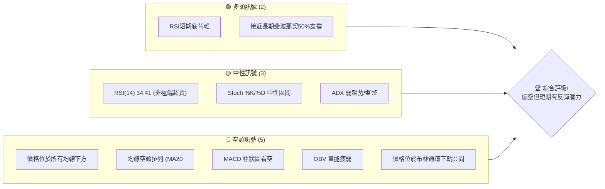

### 📊 核心指標速覽表

下表彙整PLTR當前關鍵技術指標的數值、訊號與初步解讀。

| 指標類別 | 指標名稱 | 當前數值 | 訊號 | 解讀 |
|----------|----------|----------|------|------|
| **價格** | 當前價格 | $116.67 | 🔴 | 處於下跌趨勢，接近52週低點 |
| **均線** | MA20 | $127.94 | 🔴 | 價格遠低於短期均線，空頭強勢 |
| **均線** | MA50 | $135.32 | 🔴 | 價格遠低於中期均線，空頭強勢 |
| **均線** | MA200 | $158.35 | 🔴 | 價格遠低於長期均線，長期趨勢看空 |
| **動能** | RSI(14) | 34.41 | 🟡 | 接近超賣區間，但尚未進入極端超賣 |
| **動能** | MACD | -6.852 | 🔴 | MACD線在訊號線下方，柱狀圖為負值，動能偏空 |
| **波動** | ATR | $5.88 | 🟡 | 每日波動約5.04%，波動性中等 |
| **趨勢** | ADX(14) | 23.11 | 🟡 | 趨勢強度較弱，可能處於盤整或弱勢下跌 |
| **成交量** | 量比(20日) | 0.85x | 🔴 | 成交量低於20日均量，買盤動能不足 |

### 🏆 技術評分卡

綜合考量各項技術指標，PLTR的整體技術評分偏低，尤其在趨勢強度、動能和均線排列方面顯示出顯著的空頭訊號。

```
╔══════════════════════════════════════════════════════════════╗
║             技術評分卡 — PLTR (2026-07-01)                   ║
╠══════════════════════════════════════════════════════════════╣
║ 趨勢強度      ███░░░░░░░░░░░░░░░░░░  15/100  🔴 (ADX弱趨勢，空頭主導)   ║
║ 動能指標      ████░░░░░░░░░░░░░░░░░  20/100  🔴 (MACD看空，RSI接近超賣)║
║ 支撐穩定度    ██████████░░░░░░░░░░░  50/100  🟡 (接近長期斐波那契支撐)║
║ 成交量配合    ████░░░░░░░░░░░░░░░░░  20/100  🔴 (量能疲弱，未確認底部)║
║ 形態完整度    ██████░░░░░░░░░░░░░░░  30/100  🔴 (缺乏明顯反轉形態)   ║
║ 均線排列      █░░░░░░░░░░░░░░░░░░░░  05/100  🔴 (典型空頭排列)       ║
╠══════════════════════════════════════════════════════════════╣
║ 綜合評分      ████░░░░░░░░░░░░░░░░░  25/100  評級：🔴 偏空，短期或有反彈║
╚══════════════════════════════════════════════════════════════╝
```

---

## 2. 趨勢分析

本章節將從多個時間框架深入分析PLTR的價格趨勢，從長期月線到中期週線，再到短期日線，以全面評估其市場方向與潛在轉折點。

### 🌐 多時框趨勢分析

PLTR在長期、中期和短期都呈現出明顯的下降趨勢，但短期內出現了超跌和潛在的止跌訊號。

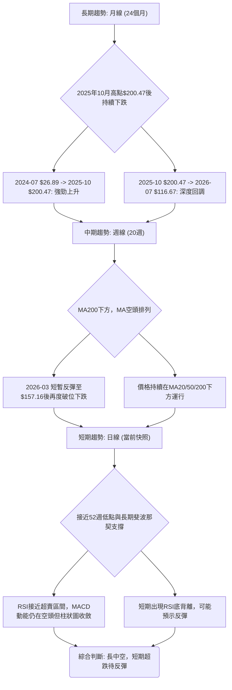

### 📈 長期趨勢 — 12個月走勢圖（Unicode）

PLTR在過去12個月經歷了從強勁上漲到深度回調的過程。從2025年7月的$158.35開始，股價在2025年10月達到$200.47的頂峰，隨後進入了漫長的下跌通道，至2026年6月跌至$116.67。

```
PLTR 月線走勢圖（過去12個月）
價格軸 ($)
$200.47 ┤                       ●(2025-10高點)
$182.42 ┤             ●
$168.45 ┤           ●
$158.35 ┤ ●━━━━━━━━━━━━━━━━━━━━━━━━━━━━━
$146.59 ┤         ●        ●
$137.19 ┤                  ●
$116.67 ┤                       ●←現在 (2026-06)
$106.37 ┤    ●(52W低點)
        └─────────────────────────────────────────
         25-07 25-08 25-09 25-10 25-11 25-12 26-01 26-02 26-03 26-04 26-05 26-06
```

**走勢特徵分析表格**

| 階段 | 時間區間 | 主要特徵 | 漲跌幅 | 關鍵點位 |
|------|----------|----------|--------|----------|
| **上漲趨勢** | 2025-07 至 2025-10 | 強勁上升，量價配合良好，創歷史新高 | +26.5% | $158.35 (2025-07) -> $200.47 (2025-10) |
| **高位震盪** | 2025-11 至 2025-12 | 價格在高位盤整，動能減弱，出現出貨跡象 | -11.3% | $200.47 -> $177.75 |
| **下跌趨勢** | 2026-01 至 2026-06 | 快速下跌，均線空頭排列，多次嘗試反彈失敗 | -34.4% | $177.75 -> $116.67 |
| **當前狀態** | 2026-06 | 觸及近期低點，接近52週低點，短期有止跌訊號 | -25.5% (2026-05 $156.54 -> 2026-06 $116.67) | $116.67 (當前) |

### 📊 中期趨勢（週線分析）

從近20週的週線數據來看，PLTR在中期呈現出明顯的下跌趨勢。儘管在2026年3月初曾有一波強勁反彈，使RSI達到81.7的超買區，並觸及$157.16的高點，但隨後未能守住漲幅，股價持續下行。特別是從2026年5月底的$156.54高點開始，股價加速下跌，跌破了多個關鍵支撐位。目前價格$116.67已遠低於MA20 ($127.94)、MA50 ($135.32)和MA200 ($158.35)，顯示中期趨勢極為疲弱。

**近期壓力與支撐示意圖 (週線)**

```
PLTR 週線壓力與支撐示意圖
═════════════════════════════════════════════════════════
$158.35 ║███████████████████████████████████████████████████████████║  MA200 / 2025-07高點 (強阻力)
$156.54 ║███████████████████████████████████████████████████████████║  2026-05高點 (重要阻力)
$135.32 ║███████████████████████████████████████████████████████████║  MA50 (中期阻力)
$127.94 ║███████████████████████████████████████████████████████████║  MA20 / 布林中軌 (短期阻力)
$116.67 ╠═════════════════════════════════════════════════════════╣ ◄ 現價
$106.37 ║▓▓▓▓▓▓▓▓▓▓▓▓▓▓▓▓▓▓▓▓▓▓▓▓▓▓▓▓▓▓▓▓▓▓▓▓▓▓▓▓▓▓▓▓▓▓▓▓▓▓▓▓▓▓▓▓▓▓▓▓▓║  52週低點 (關鍵支撐)
$104.73 ║▓▓▓▓▓▓▓▓▓▓▓▓▓▓▓▓▓▓▓▓▓▓▓▓▓▓▓▓▓▓▓▓▓▓▓▓▓▓▓▓▓▓▓▓▓▓▓▓▓▓▓▓▓▓▓▓▓▓▓▓▓║  布林下軌 (強支撐)
═════════════════════════════════════════════════════════
```

### ⚡ 趨勢強度評估（ADX 解讀）

ADX (Average Directional Index) 用於衡量趨勢的強度，而非方向。+DI 和 -DI 則指示多頭和空頭的力量。

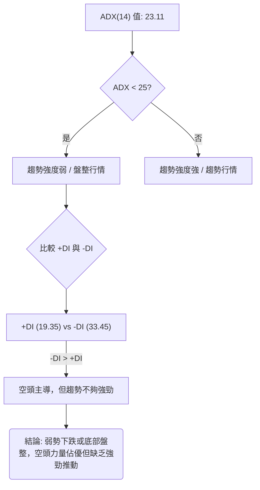

**ADX 強度對照表**

| ADX 數值範圍 | 趨勢強度 | 狀態判斷 |
|--------------|----------|----------|
| 0-25         | 弱趨勢   | 盤整或趨勢不明顯 |
| 25-50        | 中等趨勢 | 明顯趨勢形成 |
| 50-75        | 強趨勢   | 趨勢非常強勁 |
| 75-100       | 極強趨勢 | 極端趨勢，可能面臨回調 |

**ADX 解讀**：
PLTR目前的ADX(14)數值為23.11，位於0-25的區間，這表明當前市場處於**弱趨勢或盤整行情**。雖然股價一直在下跌，但ADX未能突破25，說明下跌動能不夠強勁，或者說市場在嘗試尋找底部並進行盤整。
同時，-DI (33.45) 明顯高於 +DI (19.35)，這確認了當前市場是由**空頭主導**。綜合來看，PLTR正處於一個由空頭主導的弱勢下跌或底部盤整階段，缺乏明確的強勁趨勢。這也意味著股價在短期內可能在低位震盪，等待新的趨勢方向。

---

## 3. 圖表形態分析

圖表形態是價格行為的視覺化表現，有助於預測未來的價格走勢和目標價。本章節將識別PLTR的關鍵圖表形態並分析其潛在影響。

### 🔍 形態識別系統

目前PLTR的股價處於明顯的下跌趨勢中，尚未形成明確的反轉形態，但可能存在一些持續形態或底部初步形態。

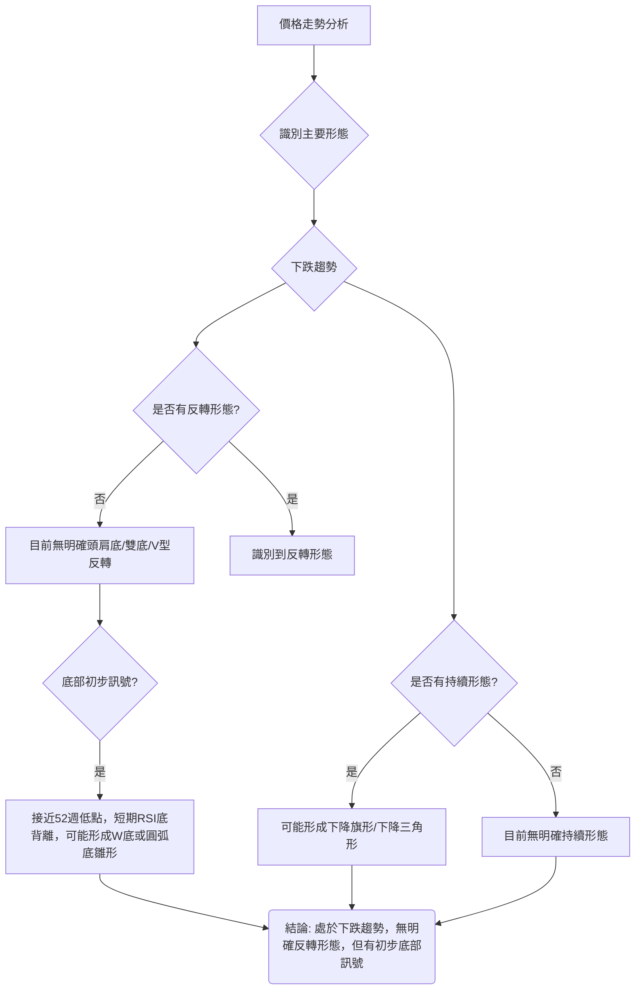
**分析**：
從提供的月線數據來看，PLTR在2025年10月達到$200.47的高點後，股價一路下行，目前尚未形成經典的反轉形態如頭肩底、雙重底或V型反轉。然而，價格在$116.67附近，接近52週低點$106.37，且RSI出現短期底背離，這可能預示著股價正在嘗試構築底部。如果價格能在當前低位區間($106.37 - $116.67)形成一個W底或圓弧底的雛形，將是潛在的多頭反轉訊號。但目前，我們只能觀察到一個**下降趨勢中的潛在底部構築過程**。

### 🕯️ 重要K線形態分析

近期週線數據顯示，PLTR在經歷大幅下跌後，出現了一些值得關注的K線形態，暗示短期可能存在反彈機會。

| 月份 | 收盤價 | K線形態 (週線) | 解讀 | 訊號 |
|------|--------|----------------|------|------|
| 2026-06-07 | $135.53 | 長陰線 | 大幅下跌，空頭強勢 | 🔴 |
| 2026-06-14 | $127.99 | 中陰線 | 跌勢持續，多頭無力 | 🔴 |
| 2026-06-21 | $128.47 | 短陽線 (低點反彈) | 跌勢趨緩，多空僵持，底部有買盤介入 | 🟡 |
| 2026-06-28 | $112.93 | 長陰線 (破位下跌) | 跌破前低，空頭加速，恐慌性拋售 | 🔴 |
| 2026-07-05 | $116.67 | 短陽線 (止跌反彈) | 在低位形成初步止跌訊號，顯示有資金嘗試抄底 | 🟢 |

**分析**：
- **2026-06-28的長陰線**：這是極其看空的訊號，表明空頭力量強大，股價加速下行，跌破了多個支撐位。
- **2026-07-05的短陽線**：儘管前一周大跌，本周收出短陽線，且價格從更低點反彈，這是一個初步的止跌訊號。配合RSI的短期底背離，這可能預示著短期內將迎來技術性反彈。然而，由於成交量相對疲弱（僅為20日均量的0.85x），反彈的持續性仍需觀察。

### 📉 ASCII 走勢形態示意圖

以下圖表展示了PLTR在過去幾週的下跌趨勢，並標注了潛在的底部區域和一個可能的短期反彈。

```
PLTR 近期走勢形態示意圖
════════════════════════════════════════════════════════════════════════════════════════════════════
$156.54 ┤                                 ●(2026-05-31 高點)
$143.06 ┤                ●
$135.53 ┤                      ●
$128.47 ┤                        ●
$116.67 ┤                                                   ●←現價 (初步止跌)
$112.93 ┤                                               ●(2026-06-28 低點)
$106.37 ┤                                            S2 (52W低點/重要支撐)
        └───────────────────────────────────────────────────────────────────────────────────────────────
         26-03  26-04  26-05  26-06-07  26-06-14  26-06-21  26-06-28  26-07-05 (週)

形態分析：
- 從2026-05-31的$156.54高點開始，股價呈現典型的下降趨勢。
- 2026-06-28的$112.93低點創下近期新低，隨後出現反彈。
- 當前價格$116.67位於$112.93之上，形成一個短期的「更高低點」，配合RSI底背離，構成一個**潛在的短期底部區域**。
- 若能在此區域有效築底並突破近期阻力，則可確認短期反彈。
```

### 🎯 形態目標價計算

由於目前沒有明確的經典反轉形態，我們主要關注潛在的底部反彈目標。如果股價在$106.37 - $112.93區間成功築底並反彈，可以參考斐波那契回調位作為目標。

**潛在底部反彈目標 (基於近期下跌波段 $156.54 -> $112.93)**
- **下跌波段**：從2026-05-31的$156.54到2026-06-28的$112.93，跌幅為 $43.61。
- **反彈目標計算**：
    - **23.6% 回調**：$112.93 + ($43.61 * 0.236) = $112.93 + $10.29 = $123.22
    - **38.2% 回調**：$112.93 + ($43.61 * 0.382) = $112.93 + $16.66 = $129.59
    - **50% 回調**：$112.93 + ($43.61 * 0.500) = $112.93 + $21.81 = $134.74
    - **61.8% 回調**：$112.93 + ($43.61 * 0.618) = $112.93 + $26.95 = $139.88

這些回調位將作為短期反彈的阻力，也是多頭策略的潛在目標價。

---

## 4. 支撐與阻力

支撐與阻力是技術分析的核心概念，它們代表了買賣雙方力量的平衡點。本章節將詳細分析PLTR的關鍵支撐與阻力位，並結合斐波那契回調進行評估。

### 🗺️ 關鍵價位分布圖（Unicode）

PLTR的價位結構清晰地顯示出多重阻力位於上方，而下方則有較強的短期和長期支撐。

```
PLTR 價位結構分布圖
═══════════════════════════════════════════════════
$207.52 ║████████████████████████████████████████████║ 強阻力 R4 (52週高點)
$182.75 ║████████████████████████████████████████████║ 阻力 R3 (分析師平均目標)
$158.35 ║████████████████████████████████████████████║ 強阻力 R2 (MA200 / 2025-07高點)
$151.15 ║████████████████████████████████████████████║ 阻力 R1 (布林上軌 / 斐波那契50%)
$135.32 ║████████████████████████████████████████████║ 關鍵阻力 (MA50 / 斐波那契38.2%)
$127.94 ║████████████████████████████████████████████║ 關鍵阻力 (MA20 / 布林中軌)
$116.67 ╠════════════════════════════════════════════╣ ◄ 現價
$113.68 ║▓▓▓▓▓▓▓▓▓▓▓▓▓▓▓▓▓▓▓▓▓▓▓▓▓▓▓▓▓▓▓▓▓▓▓▓▓▓▓▓▓▓▓▓▓║ 近期支撐 S1 (斐波那契50%長期回調)
$106.37 ║████████████████████████████████████████████║ 強支撐 S2 (52週低點)
$104.73 ║████████████████████████████████████████████║ 強支撐 S3 (布林下軌)
═══════════════════════════════════════════════════
```

### 🚧 阻力位分析表

PLTR上方存在多重密集阻力，突破這些阻力需要強勁的買盤動能和利好消息。

| 阻力級別 | 價位 | 形成原因 | 突破難度 | 重要性 |
|----------|------|----------|----------|--------|
| **即時阻力** | $127.94 | MA20 / 布林中軌 | 中等 | 突破此位可視為短期止跌反彈的初步訊號 |
| **短期阻力** | $135.32 | MA50 / 斐波那契38.2% | 中高 | 突破此位將改善中期下跌趨勢 |
| **中期阻力** | $151.15 | 布林上軌 / 斐波那契50% | 高 | 挑戰此位需強勁反彈，可能遇到較大拋壓 |
| **長期阻力** | $158.35 | MA200 / 2025-07高點 | 極高 | 突破此位才能扭轉長期空頭趨勢 |
| **關鍵阻力** | $207.52 | 52週高點 | 極高 | 挑戰歷史高點，需基本面重大改善 |

### 🛡️ 支撐位分析表

PLTR下方存在幾個關鍵支撐位，尤其是在$113.68至$104.73的區間，是潛在的強力買盤區域。

| 支撐級別 | 價位 | 形成原因 | 守住機率 | 重要性 |
|----------|------|----------|----------|--------|
| **即時支撐** | $113.68 | 斐波那契50%長期回調 | 高 | 歷史重要回調位，可能吸引抄底資金 |
| **短期支撐** | $106.37 | 52週低點 | 高 | 心理關口，若跌破將釋放強烈空頭訊號 |
| **強勁支撐** | $104.73 | 布林通道下軌 | 高 | 極端超賣區間，通常會出現技術性反彈 |
| **次要支撐** | $93.20 | 斐波那契61.8%長期回調 | 中 | 若跌破$106.37，此為下一重要支撐 |

### 📐 斐波那契回調位分析

我們將基於兩個不同的波段來計算斐波那契回調位：
1. **長期上漲波段**：從2024年7月低點($26.89)到2025年10月高點($200.47)，用於尋找長期支撐。
2. **近期下跌波段**：從2026年5月高點($156.54)到2026年6月低點($112.93)，用於尋找短期反彈阻力。

**斐波那契回調位 (長期上漲波段：$26.89 -> $200.47)**
- 總漲幅：$200.47 - $26.89 = $173.58
- **23.6% 回調**：$200.47 - ($173.58 * 0.236) = $159.51
- **38.2% 回調**：$200.47 - ($173.58 * 0.382) = $134.17
- **50% 回調**：$200.47 - ($173.58 * 0.500) = $113.68
- **61.8% 回調**：$200.47 - ($173.58 * 0.618) = $93.20

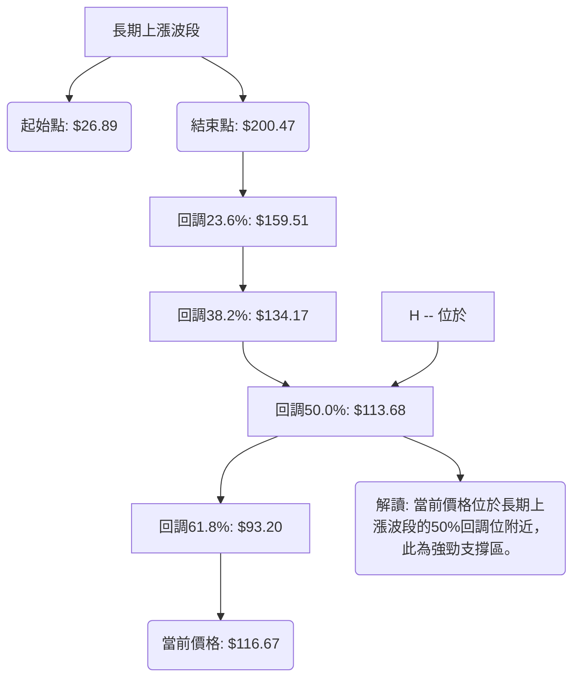
**分析**：當前價格$116.67非常接近$113.68的50%斐波那契回調位，這是一個非常重要的長期支撐區。歷史上，50%回調位往往是強勢股票在經歷大幅回調後尋求支撐的關鍵點。

**斐波那契回調位 (近期下跌波段：$156.54 -> $112.93)**
- 總跌幅：$156.54 - $112.93 = $43.61
- **23.6% 反彈**：$112.93 + ($43.61 * 0.236) = $123.22
- **38.2% 反彈**：$112.93 + ($43.61 * 0.382) = $129.59
- **50% 反彈**：$112.93 + ($43.61 * 0.500) = $134.74
- **61.8% 反彈**：$112.93 + ($43.61 * 0.618) = $139.88

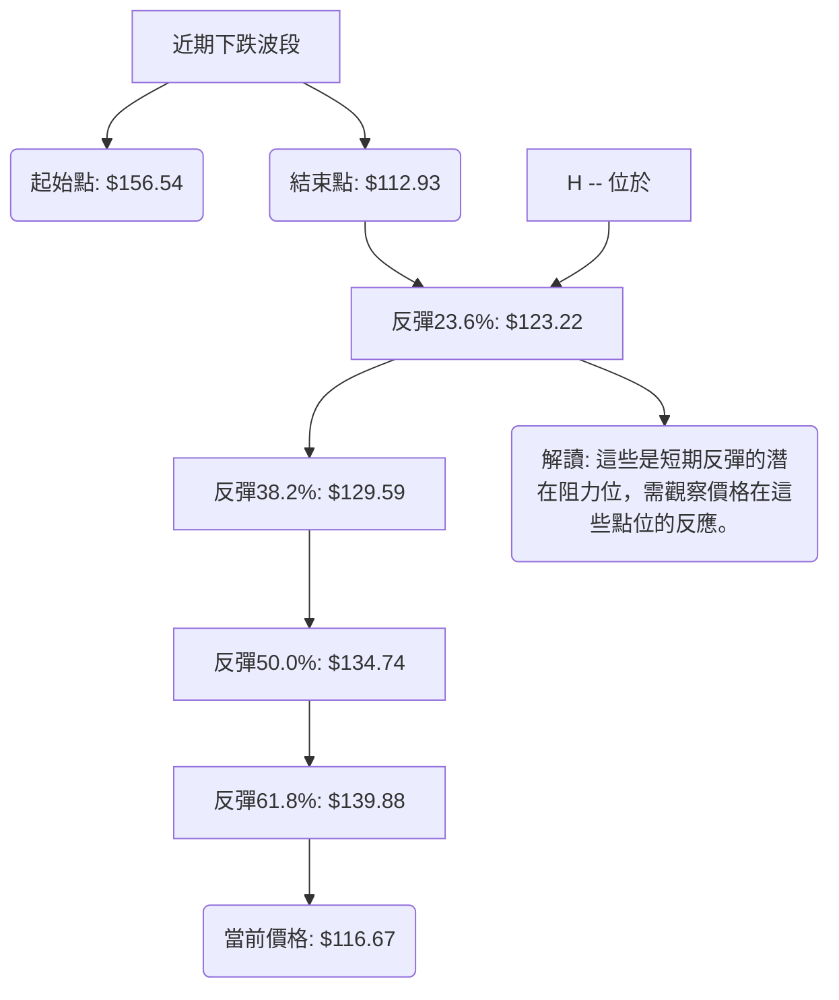
**分析**：短期來看，如果PLTR從當前低點反彈，首先將面臨$123.22的阻力，隨後是$129.59和$134.74。這些點位也是MA20和MA50的匯合區，增加了阻力強度。

---

## 5. 技術指標深度解讀

本章節將對PLTR的各項關鍵技術指標進行詳盡分析，包括移動平均線、RSI、MACD、布林通道和成交量，並探討它們之間的相互確認或矛盾關係。

### 🎛️ 指標訊號總覽

目前PLTR的技術指標普遍指向空頭，但RSI的短期底背離和接近長期斐波那契支撐顯示出潛在的反彈機會。

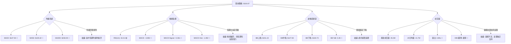

### 📈 移動平均線排列分析

PLTR的移動平均線系統呈現典型的空頭排列，價格位於所有均線下方，顯示出強烈的下跌趨勢。

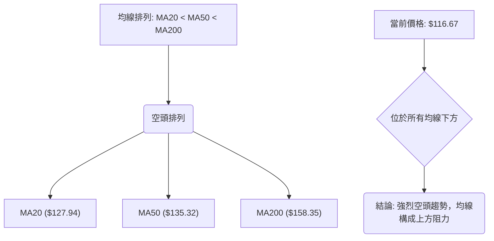

**詳細分析**：
- **MA20 ($127.94)**：短期均線，代表近一個月的平均成本。當前價格遠低於MA20，顯示短期下跌動能強勁。
- **MA50 ($135.32)**：中期均線，代表近兩個半月的平均成本。價格在MA50下方，確認中期趨勢疲弱。
- **MA200 ($158.35)**：長期均線，代表近一年的平均成本。價格在MA200下方，表明長期趨勢已轉為空頭。
- **均線排列**：MA20 < MA50 < MA200，這是一個教科書式的**空頭排列 (Death Cross)**，是強烈看跌的訊號。這意味著短期賣壓沉重，中期趨勢下行，長期趨勢也已惡化。所有均線都將作為價格反彈時的強勁阻力。

### 📉 RSI(14) 分析

相對強弱指數(RSI)衡量價格變動的速度和變化，用於判斷超買或超賣狀態。

- **RSI 數值進度條**：
    RSI(14): 34.41  ▓▓▓▓▓▓▓░░░░░░░░░░░░  34.41/100  🟡

- **超買超賣區間分析**：
    - RSI 位於 30-70 的中性區間 (34.41)。
    - 雖然未正式進入超賣區 (<30)，但已非常接近，這表明股價在經歷大幅下跌後，賣壓可能正在減輕，或者市場情緒過度悲觀。
    - 歷史數據顯示，在2026-06-21時RSI曾低至23.7，進入超賣區。隨後價格有所反彈，但又再次下跌。

- **背離判斷 (頂背離/底背離)**：
    - **短期看漲底背離 (Bullish Divergence)**：根據近20週數據，我們觀察到一個短期的底背離現象。
        - 2026-06-21：收盤價 $128.47，RSI(14) 23.7。
        - 2026-06-28：收盤價 $112.93，RSI(14) 27.8。
        - 在這兩週之間，股價創下更低的低點 ($112.93 < $128.47)，但RSI卻創下更高的低點 (27.8 > 23.7)。這是一個**明確的短期看漲底背離訊號**。
    - **2026-07-05的價格 ($116.67) 和RSI (34.41)**：本週價格和RSI均有所回升，驗證了前一周底背離的有效性，預示著短期內可能會有進一步的反彈。
    - **結論**：儘管RSI整體處於中性偏低區域，但近期出現的底背離是一個重要的多頭訊號，表明下跌動能正在減弱，短期內有望出現技術性反彈。

### 📊 MACD(12/26/9) 訊號解讀

MACD (Moving Average Convergence Divergence) 是一個趨勢追蹤動量指標，由MACD線、訊號線和柱狀圖組成。

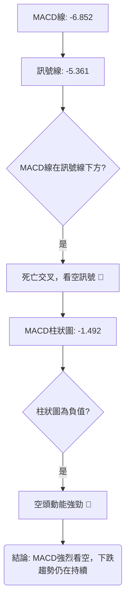
**詳細分析**：
- **MACD線 (-6.852) 與訊號線 (-5.361)**：MACD線位於訊號線下方，形成**死亡交叉**，這是一個強烈的看跌訊號，表明短期動能弱於中期動能。
- **MACD柱狀圖 (-1.492)**：柱狀圖為負值，且仍在負值區間，表示空頭動能仍然主導市場。雖然本週柱狀圖的絕對值 (-1.492) 小於前一周 (-2.539)，顯示空頭動能有所減弱，但整體仍處於空頭趨勢中。
- **背離判斷**：從週線數據來看，MACD柱狀圖的低點與價格的低點大致同步，未見明顯的底背離或頂背離現象。
- **結論**：MACD指標整體呈現強烈空頭，確認了股價的下跌趨勢。儘管柱狀圖顯示空頭動能有所減弱，但尚未出現明確的買入訊號。

### 📦 布林通道分析

布林通道 (Bollinger Bands) 由中軌 (MA20)、上軌和下軌組成，用於衡量價格的波動範圍。

```
PLTR 布林通道示意圖
═══════════════════════════════════════════════════════
$151.15 ║███████████████████████████████████████████████████████████████████████████████████████████████████████║ BB上軌 (壓力)
$127.94 ║                                 ▲ (MA20/中軌)
$116.67 ╠═════════════════════════════════════════════════════════════════════════════════════════════════════╣ ◄ 現價
$104.73 ║███████████████████████████████████████████████████████████████████████████████████████████████████████║ BB下軌 (支撐)
═══════════════════════════════════════════════════════
```
**詳細分析**：
- **布林上軌 ($151.15)**：作為強勁阻力。
- **布林中軌 ($127.94)**：即MA20，是當前價格反彈的首個重要阻力。
- **布林下軌 ($104.73)**：作為強勁支撐。
- **價格位置**：當前價格$116.67位於布林中軌和下軌之間，且**接近下軌**。
- **%B 值 (0.26)**：%B值為0.26，表示價格位於布林通道的底部26%範圍內，這通常被視為**超賣區域**，暗示股價可能過度下跌，短期內存在向中軌反彈的需求。
- **通道寬度**：從數據無法直接判斷通道寬度變化，但近期大幅下跌通常會導致通道擴張，顯示波動性增加。
- **結論**：布林通道顯示PLTR處於超賣狀態，價格有向中軌$127.94反彈的潛力。然而，中軌將構成一個強大的阻力。

### 💹 成交量分析（量價配合度）

成交量是價格趨勢的確認指標，量價關係對於判斷趨勢的健康性至關重要。

- **最新成交量**：35,240,249
- **20日均量**：41,695,467
- **50日均量**：42,680,075
- **量比 (最新/20日均量)**：0.85x 🔴
- **OBV趨勢**：OBV < MA → 量能疲弱 🔴

**詳細分析**：
- **成交量萎縮**：最新成交量為35.2M，遠低於20日均量41.7M和50日均量42.7M，量比僅為0.85x。這表明在當前價格區間，市場參與度不高，買賣雙方都相對謹慎。
- **量價配合**：
    - 在價格下跌過程中，如果成交量放大，則確認下跌趨勢強勁。近期從$156.54到$112.93的下跌，週成交量在2026-06-28達到271M，顯示恐慌性拋售。
    - 然而，最近一周價格反彈至$116.67，但成交量僅為80.2M，遠低於前幾週的成交量。這是一個**量價背離**的訊號：價格小幅反彈，但缺乏成交量的支持，暗示反彈可能不夠強勁或持續。
- **OBV (On-Balance Volume)**：OBV趨勢顯示「OBV < MA → 量能疲弱」，這進一步確認了市場缺乏買盤動能，當前下跌趨勢的量能配合不佳，但反彈也缺乏量能支持。
- **結論**：成交量分析顯示PLTR當前處於量能疲弱的狀態。雖然價格在低位出現初步止跌，但缺乏成交量的確認，使得任何反彈都可能面臨持續性的挑戰。若要形成有效反轉，必須伴隨顯著放大的成交量。

---

## 6. 動能與波動率

本章節將評估PLTR的動能狀態和波動性特徵，這對於理解股票的短期行為和風險管理至關重要。

### ⚡ 動能評估四象限

我們將PLTR的動能評估為「弱動能」和「中等波動」。

| 象限 | 動能 | 波動 | 當前狀態 | 評估 |
|------|------|------|----------|------|
| Q1 | 強 | 低 | - | 最佳機會 (順勢而為) |
| Q2 | 弱 | 低 | - | 謹慎觀望 (等待趨勢明確) |
| Q3 | 強 | 高 | - | 高風險高收益 (適合短線交易者) |
| Q4 | 弱 | 高 | ✓ | **避免進場** (趨勢不明，波動大，風險高) |

**分析**：
- **動能評估**：MACD指標顯示空頭動能強勁，RSI接近超賣但尚未極端。整體而言，股價處於下跌趨勢，缺乏向上動能，因此歸類為**弱動能**。
- **波動率評估**：ATR(14)為$5.88，佔當前價格的5.04%。這個比例相對於許多大型科技股而言屬於中等偏高，說明其每日波動幅度不小。因此歸類為**中等波動**。

結合動能和波動率，PLTR目前處於**弱動能、中等波動**的狀態。這將其置於Q4象限，建議投資者應**避免盲目進場**。在弱動能且波動性中等偏高的情況下，市場方向不明確，容易被短期雜訊干擾，風險較高。應等待動能轉強或波動性降低，並伴隨明確的底部形態或反轉訊號再考慮介入。

### 📊 ATR 波動率分析

平均真實波幅 (ATR) 衡量資產價格在特定時間段內的波動性。

- **ATR(14)**：$5.88
- **佔收盤價比例**：$5.88 / $116.67 = 5.04%

**詳細分析**：
- PLTR的ATR(14)為$5.88，這意味著在過去14天中，PLTR的平均每日波動範圍約為$5.88。
- ATR佔當前價格的5.04%，這是一個**中等偏高**的波動性水平。對於短線交易者而言，這提供了足夠的日內波動空間；對於中長線投資者，則需要更大的止損空間來應對日常波動。
- **止損距離建議**：
    - 由於ATR代表平均每日波動，通常會將止損設置為ATR的1.5倍至2倍。
    - **保守止損**：1.5 * $5.88 = $8.82。若從$116.67進場，止損點約為 $116.67 - $8.82 = $107.85。
    - **激進止損**：1.0 * $5.88 = $5.88。若從$116.67進場，止損點約為 $116.67 - $5.88 = $110.79。
- **結論**：PLTR具有中等偏高的波動性，投資者應充分考慮這一點來設定止損和倉位大小。

### 📐 Beta 與市場相關性

Beta 值衡量股票相對於大盤（如S&P 500）的波動性。由於未提供Beta數據，我們將基於其行業屬性和歷史表現進行推斷。

**推斷分析**：
- **行業屬性**：Palantir 屬於科技行業的軟體基礎設施領域，這類公司通常具有較高的增長潛力，但也伴隨著較高的波動性。
- **市場情緒**：科技股往往對市場風險情緒更敏感，在牛市中漲幅可能超過大盤，在熊市中跌幅也可能更大。
- **PLTR的歷史價格波動**：從$26.89到$200.47再到$116.67的劇烈波動，遠超同期大盤表現，這強烈暗示其Beta值可能**大於1**。
- **結論**：基於行業特性和歷史價格走勢，預計PLTR的Beta值會大於1，可能在1.5到2.0之間。這表示PLTR的股價波動幅度通常會比大盤更大。投資者應意識到持有PLTR可能面臨更高的市場風險，在市場波動時其股價的漲跌幅會被放大。

---

## 7. 多時框架總結

本章節將整合短期、中期和長期時間框架的分析結果，提供一個全面的趨勢評估和交易建議。

### 📋 時框架評分表

| 時框架 | 趨勢方向 | 動能 | 均線排列 | 形態 | 綜合評分 (1-10) | 建議 |
|--------|----------|------|----------|------|-----------------|------|
| **長期** | 🔴 下跌 | 🔴 弱 | 🔴 空頭排列 | 🔴 無反轉 | 2/10 | 警惕，不宜長線做多 |
| **中期** | 🔴 下跌 | 🔴 弱 | 🔴 空頭排列 | 🔴 下跌通道 | 3/10 | 觀望，等待築底 |
| **短期** | 🟡 盤整/潛在反彈 | 🟡 減弱但偏空 | 🔴 空頭排列 | 🟢 短期底背離 | 4/10 | 謹慎做多，博反彈 |

**分析**：
- **長期 (月線)**：PLTR自2025年10月高點後一直處於長期下跌趨勢，均線空頭排列，缺乏反轉形態。儘管接近長期斐波那契50%支撐，但整體趨勢仍然看空。
- **中期 (週線)**：中期趨勢同樣是下跌，價格持續在MA20、MA50下方運行，MACD和ADX均顯示空頭主導且動能不足。
- **短期 (日線/週線最新數據)**：短期內，價格接近52週低點，RSI出現短期底背離，且布林通道顯示超賣。這提供了短期技術性反彈的可能性。然而，成交量疲弱限制了反彈的潛力。

### 🔲 綜合訊號矩陣

下表展示了不同時框架下各技術分析維度的一致性。

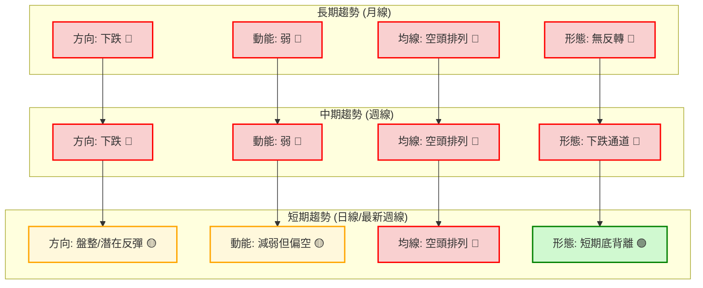

**結論**：
PLTR在長、中期趨勢上呈現高度一致的空頭訊號，這表明其主要趨勢仍是下跌。然而，短期內出現了超賣和RSI底背離等多頭反彈訊號。這種矛盾的訊號組合意味著，儘管長期前景不佳，但短期內可能會有技術性反彈。投資者應避免逆勢而為進行長期做多，但激進的短線交易者可以考慮在嚴格止損下博取短期反彈。

---

## 8. 交易策略建議

基於上述多時框架的技術分析，PLTR目前處於長期下跌趨勢中的短期超賣反彈機會。因此，我們將提供一個謹慎的短期多頭策略和一個趨勢追蹤的空頭策略。

### 🗺️ 策略決策流程圖

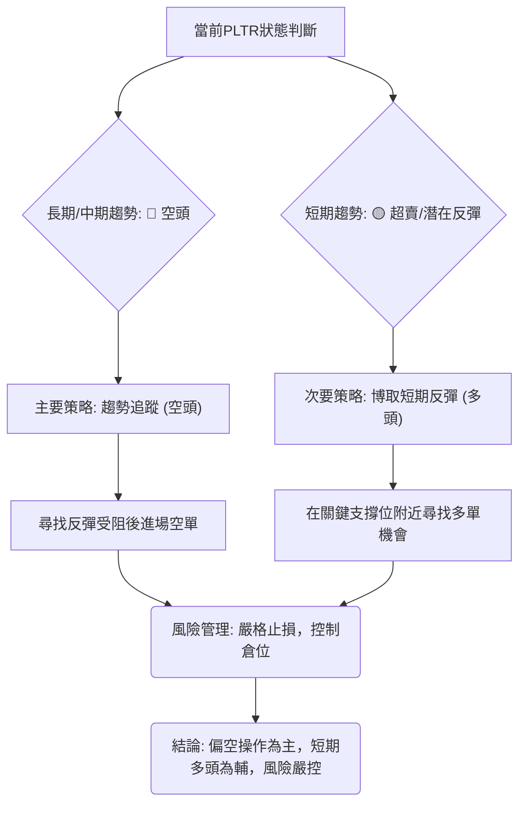

### 🟢 多頭策略詳情 (波段反彈)

此策略旨在捕捉PLTR從超賣區反彈的機會，風險較高，需嚴格控制倉位和止損。

| 策略要素 | 策略 A (激進反彈) | 策略 B (保守反彈) |
|----------|--------------------|--------------------|
| 進場條件 | 價格在$113.68-$116.67區間企穩，RSI維持上升，MACD柱狀圖縮小或翻正 | 價格有效突破MA20 ($127.94) 並回踩確認 |
| 進場價格 | $116.00 (接近長期斐波那契50%支撐) | $128.50 (突破MA20後回踩) |
| 目標價 T1 | $127.94 (MA20 / 布林中軌) | $135.32 (MA50 / 斐波那契38.2%反彈) |
| 目標價 T2 | $135.32 (MA50 / 斐波那契38.2%反彈) | $151.15 (布林上軌 / 斐波那契50%反彈) |
| 止損價格 | $106.30 (略低於52週低點 $106.37) | $123.00 (低於MA20和斐波那契23.6%反彈) |
| 風險報酬比 | T1: (127.94-116.00)/(116.00-106.30) = 1.23:1 <br> T2: (135.32-116.00)/(116.00-106.30) = 1.99:1 | T1: (135.32-128.50)/(128.50-123.00) = 1.24:1 <br> T2: (151.15-128.50)/(128.50-123.00) = 4.12:1 |
| 成功機率 | 40% (逆勢操作，依賴短期超跌反彈) | 55% (等待趨勢初步確認，成功率稍高) |
| 建議倉位 | 5% - 10% (高風險) | 10% - 15% (中等風險) |

### 🔴 空頭策略詳情 (趨勢追蹤)

此策略基於PLTR的長中期下跌趨勢，尋找反彈受阻後的做空機會。

| 策略要素 | 策略 C (反彈受阻做空) | 策略 D (破位追空) |
|----------|----------------------|--------------------|
| 進場條件 | 價格反彈至MA20或MA50附近受阻，K線出現看跌形態 (如長上影線、烏雲蓋頂) | 價格有效跌破52週低點 $106.37 |
| 進場價格 | $127.00 (MA20下方) | $106.00 (跌破52週低點後) |
| 目標價 T1 | $113.00 (斐波那契50%長期回調支撐) | $93.20 (斐波那契61.8%長期回調支撐) |
| 目標價 T2 | $106.00 (52週低點) | $80.00 (心理關口及更深層次支撐) |
| 止損價格 | $130.00 (略高於MA20/布林中軌) | $110.00 (回補破位缺口) |
| 風險報酬比 | T1: (127.00-113.00)/(130.00-127.00) = 4.67:1 <br> T2: (127.00-106.00)/(130.00-127.00) = 7.00:1 | T1: (106.00-93.20)/(110.00-106.00) = 3.20:1 <br> T2: (106.00-80.00)/(110.00-106.00) = 6.50:1 |
| 成功機率 | 65% (順應中期下跌趨勢) | 70% (跌破關鍵支撐後通常加速下跌) |
| 建議倉位 | 10% - 15% (中等風險) | 15% - 20% (中高風險) |

### ⭐ 整體訊號強度評星

```
做多訊號強度：★★☆☆☆  (2/5星) (短期超跌反彈機會，但逆勢且量能不足)
做空訊號強度：★★★★☆  (4/5星) (長中短期趨勢均為空頭，反彈乏力，符合趨勢追蹤)
整體可信度：  ★★★☆☆  (3/5星) (長期趨勢明確，但短期可能受超賣影響波動)
```

**總結**：
鑑於PLTR長中期趨勢的明確空頭，以及短期反彈缺乏量能支持，**做空策略在當前環境下具有更高的成功機率和風險報酬比**。多頭策略僅建議給予風險承受能力較強的短線交易者，且必須嚴格控制止損和倉位。

---

## 9. 風險提示與監控

在當前市場環境下，PLTR的投資面臨多重風險。本章節將提供關鍵監控指標和風險場景分析，以幫助投資者更好地管理風險。

### ✅ 關鍵監控指標 Checklist

以下是交易PLTR時需要密切關注的關鍵技術指標和價位：

```
╔══════════════════════════════════════════════════════════════╗
║             PLTR 關鍵監控指標 Checklist                      ║
╠══════════════════════════════════════════════════════════════╣
║ [ ] 價格是否有效跌破 $106.37 (52週低點)？ → 強烈空頭訊號     ║
║ [ ] 價格是否有效突破 $127.94 (MA20/布林中軌)？ → 初步反彈訊號 ║
║ [ ] RSI 是否跌破 30 (進入極端超賣)？ → 強烈超賣反彈潛力      ║
║ [ ] MACD 柱狀圖是否翻正？ → 動能轉多訊號                      ║
║ [ ] 成交量在反彈時是否顯著放大？ → 反彈有效性確認             ║
║ [ ] ADX 是否回升並突破 25，且 +DI 向上？ → 趨勢轉強訊號       ║
║ [ ] 是否出現明確的底部反轉K線形態 (如看漲吞噬、錘子線)？     ║
║ [ ] 斐波那契 $113.68 (長期50%回調) 是否被有效跌破？ → 長期支撐失效 ║
╚══════════════════════════════════════════════════════════════╝
```

### ⚠️ 風險場景分析

PLTR的未來走勢可能在以下三種情境中演變：

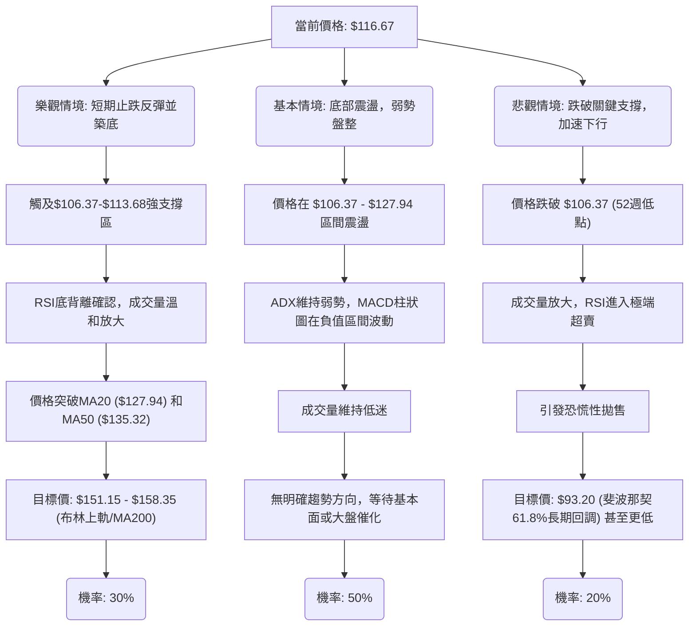

### 🛡️ 風險管理重要提醒

1.  **倉位管理**：由於PLTR的波動性較高且趨勢偏空，無論採取何種策略，都應嚴格控制倉位大小，避免重倉。建議單一股票倉位不超過總投資組合的10-15%。
2.  **止損設定**：務必設定並嚴格執行止損。基於ATR分析，建議將止損設置在ATR的1.5倍至2倍範圍外，或關鍵支撐/阻力位下方/上方。對於多頭策略，止損點可以設置在$106.30以下；對於空頭策略，止損點可以設置在MA20上方或前高點。
3.  **多空平衡**：鑒於長中期的空頭趨勢，應以逢高做空或等待明確反轉訊號後再做多為主。逆勢做多風險極高，僅適合短線交易且需迅速反應。
4.  **基本面配合**：技術分析是基於價格行為的判斷，但長期走勢仍受基本面影響。在交易決策前，應結合基本面分析師的報告，關注公司財報、業務發展和行業趨勢。
5.  **市場情緒**：科技股對市場情緒敏感，大盤走勢對PLTR有較大影響。在整體市場情緒不佳時，PLTR的下跌趨勢可能加速。
6.  **時間框架**：明確自己的交易時間框架。短線交易者應關注日線和小時線訊號，中長線投資者則應以週線和月線趨勢為主。

---

## 📋 報告總結

```
╔════════════════════════════════════════════════════════════╗
║             PLTR 技術分析報告總結                          ║
╠════════════════════════════════════════════════════════════╣
║ 報告日期：2026-07-01                                         ║
║ 當前價格：$116.67                                            ║
║ 分析評級：⚖️ 偏空但短期有反彈潛力 (長中期趨勢明確空頭，短期超賣) ║
║                                                              ║
║ 關鍵結論：                                                   ║
║ ├─ 長期趨勢：🔴 強烈下跌，價格遠低於MA200。                    ║
║ ├─ 中期趨勢：🔴 下跌趨勢確立，均線空頭排列，MACD看空。         ║
║ ├─ 短期趨勢：🟡 處於超賣區間，RSI出現短期底背離，有止跌反彈跡象。║
║ ├─ 關鍵支撐：$113.68 (長期斐波那契50%回調), $106.37 (52週低點), $104.73 (布林下軌)。║
║ └─ 關鍵阻力：$127.94 (MA20/布林中軌), $135.32 (MA50), $158.35 (MA200)。║
║ └─ 分析師平均目標：$182.75 (遠高於現價，顯示長期潛力但短期壓力大)。║
║                                                              ║
║ 最優策略組合：                                               ║
║ 1. 🥇 最佳機會：**反彈受阻做空**。在價格反彈至MA20 ($127.94) 或MA50 ($135.32) 附近出現看跌訊號時，建立空頭倉位，目標價 $113.00 - $106.00，止損設在 $130.00。風險報酬比高。║
║ 2. 🥈 次選機會：**謹慎短期波段做多**。若價格在 $113.68 - $106.37 區間築底成功並有效反彈，可考慮在 $116.00 附近輕倉進場，目標價 $127.94 - $135.32，止損設在 $106.30。風險報酬比中等。║
║ 3. 🥉 保守選擇：**觀望等待**。在趨勢不明朗且波動較大的情況下，等待股價跌破 $106.37 追空，或明確突破MA20、MA50並形成底部反轉形態後再考慮做多，以降低風險。║
╚════════════════════════════════════════════════════════════╝
```

---

> ⚠️ **免責聲明**：本報告為 AI 自動生成之技術分析，所有數據及估算均基於提供的歷史價格資訊。本報告**僅供研究與學術參考**，**不構成任何投資建議**。投資有風險，入市需謹慎。

---

*報告生成時間：2026-07-01 ｜ 數據來源：提供數據 ｜ 分析框架：多時框技術分析*