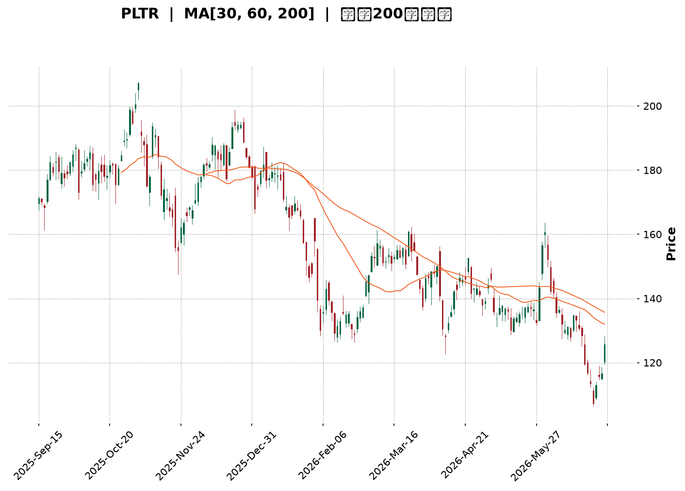
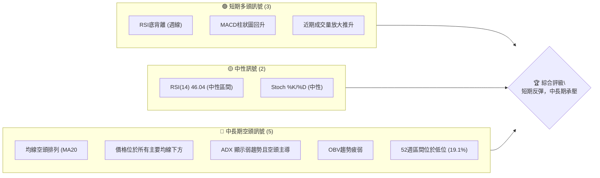
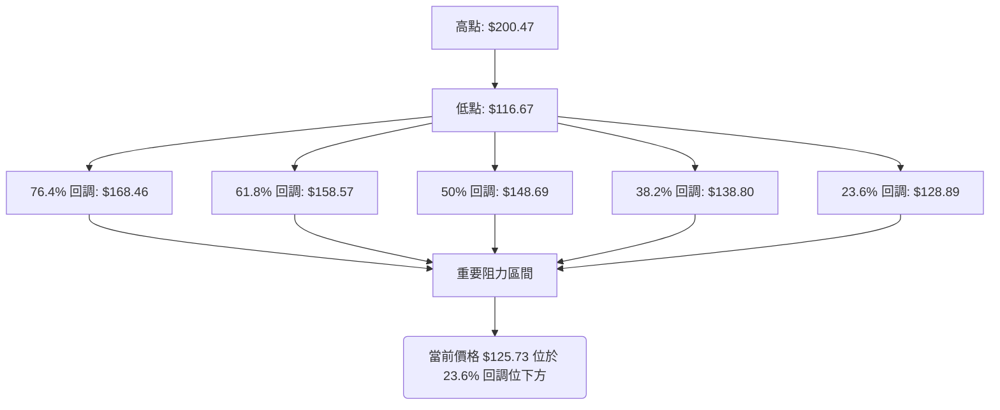
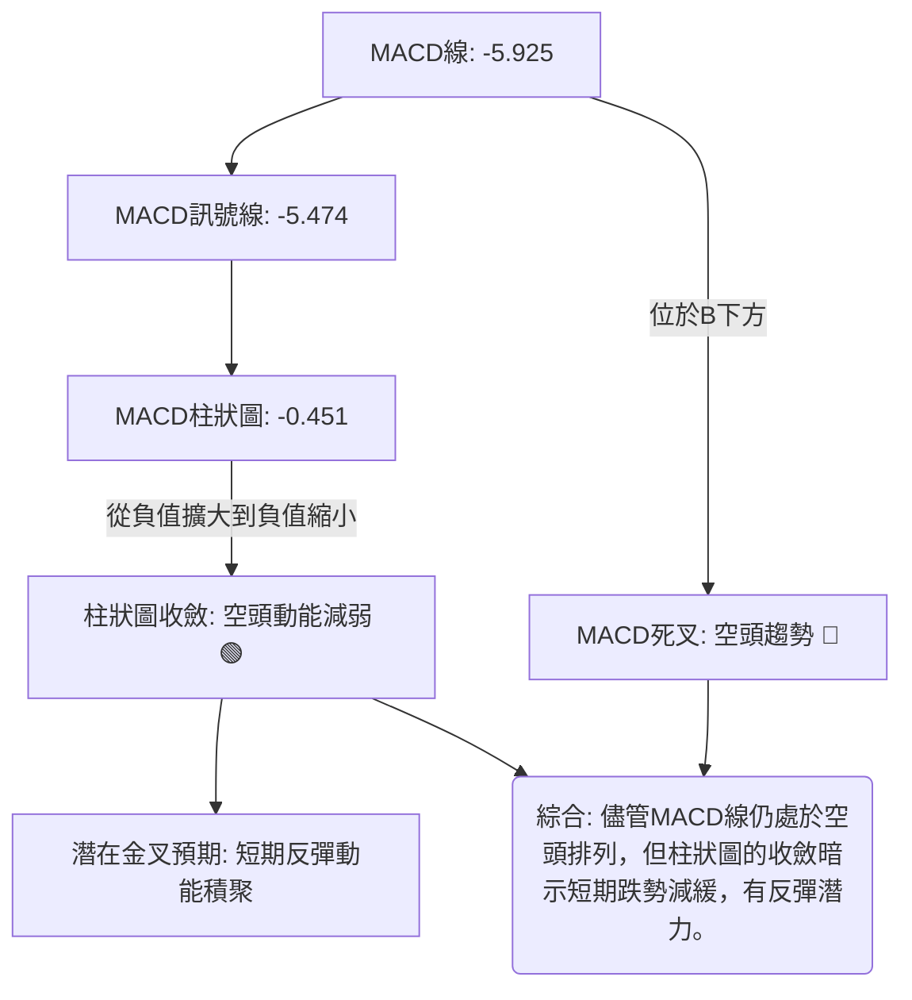
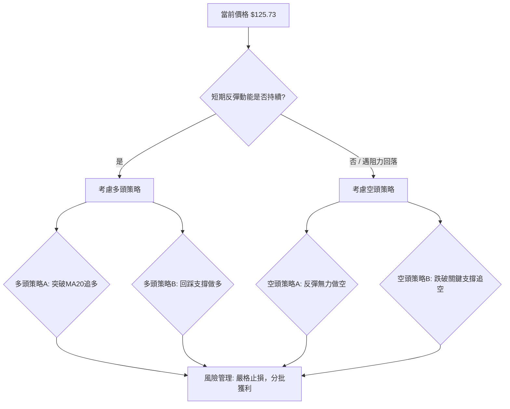

<details>
<summary>📊 靜態圖表 (點擊展開)</summary>

</details>

<html>
<head><meta charset="utf-8" /></head>
<body>
    <div style="height:500px; width:100%;">                        <script>window.PlotlyConfig = {MathJaxConfig: 'local'};</script>
        <script charset="utf-8" src="https://cdn.plot.ly/plotly-3.6.0.min.js" integrity="sha256-QaOVwtVY0T02VaHrr6pnoHLCwayMJp4O5n4YyaE3rJk=" crossorigin="anonymous"></script>                <div id="candlestick-chart" class="plotly-graph-div" style="height:100%; width:100%;"></div>            <script>                window.PLOTLYENV=window.PLOTLYENV || {};                                if (document.getElementById("candlestick-chart")) {                    Plotly.newPlot(                        "candlestick-chart",                        [{"close":{"dtype":"f8","bdata":"AAAAYLhmZUAAAADgUUhlQAAAAGCPCmVAAAAAQAofZkAAAADgesxmQAAAAGCPamZAAAAAoJnRZkAAAACA63FmQAAAAADXY2ZAAAAAgD0yZkAAAAAghVtmQAAAAKBwzWZAAAAAYGYeZ0AAAACgmWFnQAAAAIA9omVAAAAAwPVwZkAAAACgcMVmQAAAAIDr8WZAAAAAQAovZ0AAAACAFO5lQAAAAGC4JmZAAAAAIK53ZkAAAAAA13NmQAAAAADXQ2ZAAAAAwMxEZkAAAABA4bJmQAAAAOBRsGZAAAAAIK7vZUAAAAAgXI9mQAAAAAApFGdAAAAAgMKlZ0AAAABAM7NnQAAAAIDr2WhAAAAAoJlRaEAAAABACg9pQAAAAIDC5WlAAAAAIK7XZ0AAAADAzHxnQAAAAKCZ4WVAAAAAgMI9ZkAAAAAghTNoQAAAAGC43mdAAAAAoHAFZ0AAAADgeoRlQAAAAOBRwGVAAAAAAABoZUAAAABgj+pkQAAAAKBwrWRAAAAAANd3Y0AAAABAM1tjQAAAAAAASGRAAAAAoJlxZEAAAADgo7hkQAAAAGBmDmVAAAAAIK7vZEAAAACAFFZlQAAAAGCPAmZAAAAAoHA9ZkAAAADgUbhmQAAAACCur2ZAAAAAQOG6ZkAAAADAHn1nQAAAAKBHcWdAAAAAgD3yZkAAAAAAAOhmQAAAAAAAeGdAAAAAoEcpZkAAAACAFDZnQAAAAAApLGhAAAAAIFw\u002faEAAAAAAKURoQAAAAKBwRWhAAAAAYLiWZ0AAAACAwgVnQAAAAEDhmmZAAAAAAAA4ZkAAAAAghftkQAAAAKBHwWVAAAAAYLh2ZkAAAACAwrVmQAAAACCFG2ZAAAAAIK4vZkAAAADAHm1mQAAAAGC4XmZAAAAAwMxMZkAAAACAPSJmQAAAAGC4XmVAAAAAwPUQZUAAAABgj6pkQAAAAMDMvGRAAAAAQDMzZUAAAABACu9kQAAAAGBmtmRAAAAAQDOrY0AAAAAghftiQAAAAEDhUmJAAAAA4FF4YkAAAAAAKbxjQAAAAKBHcWFAAAAA4FFAYEAAAADAzPxgQAAAAMAe3WFAAAAA4FFwYUAAAACAwvVgQAAAAAApJGBAAAAAwB5tYEAAAADgo6BgQAAAAAAp7GBAAAAA4HrcYEAAAAAgrudgQAAAAEAzU2BAAAAAQOEaYEAAAACAFMZgQAAAAIAU\u002fmBAAAAAgBQmYUAAAACgcCViQAAAAEAKZ2JAAAAAgBQmY0AAAACgcBVjQAAAAMAepWNAAAAAgMKNY0AAAADgeuRiQAAAAEAz82JAAAAAAAAwY0AAAABgZt5iQAAAAEAKF2NAAAAAYI9iY0AAAADgoxhjQAAAAIDCdWNAAAAAgMLVYkAAAABA4RpkQAAAAMD1WGNAAAAAYLheY0AAAACA63FiQAAAAIDr4WFAAAAAoJkxYUAAAADA9UhiQAAAACCuT2JAAAAAYLiOYkAAAACAwn1iQAAAAIA9wmJAAAAA4FGYYUAAAAAgrk9gQAAAAIDrAWBAAAAAANeLYEAAAABgZvZgQAAAAMDMxGFAAAAA4FHYYUAAAADgekxiQAAAAOB6PGJAAAAAQAo\u002fYkAAAAAA1xNjQAAAAIA9smFAAAAAQOHiYUAAAABAM+NhQAAAAIDCpWFAAAAAQAo\u002fYUAAAAAghWNhQAAAAIA9AmJAAAAAwPVAYkAAAADAHv1gQAAAAKBHuWBAAAAAoJkhYUAAAACgmTlhQAAAAOB6HGFAAAAAAAAAYUAAAACgmUFgQAAAACBct2BAAAAAIK6\u002fYEAAAADgeuRgQAAAAOBR6GBAAAAAwMwkYUAAAACgRy1hQAAAAAApHGFAAAAAQDMTYUAAAADgUZBgQAAAAEDh6mFAAAAAoEeRY0AAAADAzBRkQAAAAKBwBWNAAAAAYGbGYUAAAABgZrZhQAAAAMD18GBAAAAAQAoPYUAAAACAPYJgQAAAAGC4RmBAAAAAYI9iYEAAAAAgXP9fQAAAAGC41mBAAAAAAACoYEAAAAAAKVRgQAAAAEAKD2BAAAAAAADgXUAAAADAzCxdQAAAAAAAYFxAAAAAoEfRWkAAAAAghTtcQAAAAMDM7FxAAAAAQOEqXUAAAABguG5fQA=="},"high":{"dtype":"f8","bdata":"AAAAoJl5ZUAAAACA62llQAAAAIDCNWVAAAAAoJlZZkAAAACgcA1nQAAAAAAAyGZAAAAAAAA4Z0AAAABAMxtnQAAAAIA9CmdAAAAAANeDZkAAAAAgXK9mQAAAAOCj2GZAAAAAwPVIZ0AAAABgZoZnQAAAAEDhWmdAAAAAYGbeZkAAAACAwkVnQAAAAOBRCGdAAAAAANdzZ0AAAABAM2NnQAAAAEAKZ2ZAAAAAQOHKZkAAAABAMwtnQAAAAIA9GmdAAAAAQOGyZkAAAABA4eJmQAAAAMByzGZAAAAAYLjGZkAAAACA67FmQAAAAKBwRWdAAAAAYI8aaEAAAADA9fhnQAAAAEAz+2hAAAAAoHD1aEAAAACAwoVpQAAAAOCj8GlAAAAAYGZ2aEAAAACAPcpnQAAAAEDh4mdAAAAAYGZWZkAAAACAwl1oQAAAAKCZHWhAAAAAYI\u002fSZ0AAAABgZtZmQAAAAKBHKWZAAAAAIK7HZUAAAABgj5plQAAAAEAzM2VAAAAAgD3SZUAAAAAghcNjQAAAAKBwpWRAAAAAwMyUZEAAAAAg2QplQAAAAKCZGWVAAAAAQDMjZUAAAAAAAPhlQAAAAMAePWZAAAAAgBROZkAAAABg5cRmQAAAAAAp\u002fGZAAAAAQDPbZkAAAADgesxnQAAAAKCZgWdAAAAAwMxQZ0AAAADA9XhnQAAAAAAAkGdAAAAAAAB4Z0AAAABgj2pnQAAAAAAAYGhAAAAAACncaEAAAAAA12toQAAAAKBwZWhAAAAAQDOLaEAAAABgZmZnQAAAAABUF2dAAAAAwPWwZkAAAABAM6tmQAAAAIA9+mVAAAAAgBSGZkAAAADA9WhnQAAAAMAeNWdAAAAAQApXZkAAAAAAANBmQAAAAEAzo2ZAAAAA4CKzZkAAAABAM5NmQAAAAIDCzWZAAAAAQAp\u002fZUAAAAAgri9lQAAAAAAAIGVAAAAAAACAZUAAAABA4VJlQAAAAIAULmVAAAAAoHChZEAAAAAAKbRjQAAAAAAA4GJAAAAAwMzsYkAAAAAAf6JkQAAAAEAze2NAAAAAIFw\u002fYUAAAADg+zVhQAAAAADXO2JAAAAAgOsxYkAAAAAAAGhhQAAAAOB6\u002fGBAAAAAgOuxYEAAAACAPcpgQAAAAODQnmFAAAAAwB4FYUAAAABguAZhQAAAAKBHgWBAAAAAIK5HYEAAAABA4QJhQAAAAOBRMGFAAAAAQDNDYUAAAADgemRiQAAAAAAAcGJAAAAA4KNQY0AAAAAAKYxjQAAAAGBmLmRAAAAAgBTOY0AAAAAgBpVjQAAAAIBoJWNAAAAAACl8Y0AAAACA61FjQAAAACCFO2NAAAAAAACYY0AAAACAFJZjQAAAAMDMhGNAAAAAwMyUY0AAAABgjyJkQAAAAMDMTGRAAAAA4KMIZEAAAAAA1yNjQAAAAGC4PmJAAAAAANcDYkAAAAAghXtiQAAAAKCZiWJAAAAA4FGQYkAAAAAghdNiQAAAAOCjyGJAAAAAwPWIY0AAAACgR3FhQAAAAGBmJmBAAAAAoHDNYEAAAACAPUJhQAAAAGCP0mFAAAAAoJkxYkAAAADA9YhiQAAAAGBmZmJAAAAAANe7YkAAAACAwhVjQAAAAKBHyWJAAAAAYI\u002fqYUAAAACAPSJiQAAAAEAz+2FAAAAA4FF4YUAAAABgZoZhQAAAAIAUTmJAAAAA4Hq0YkAAAAAgXN9hQAAAAGBm9mBAAAAAYGaeYUAAAAAAKTxhQAAAAOB6JGFAAAAAgMItYUAAAAAgrh9hQAAAACBcz2BAAAAA4Hr0YEAAAACA6\u002f1gQAAAAEAKL2FAAAAAIK4nYUAAAACgmVFhQAAAAOCjYGFAAAAAgMJVYUAAAAAgXPdgQAAAAAAAIGJAAAAAoO24Y0AAAABgZnZkQAAAAKCZ8WNAAAAAgML1YkAAAAAA10tiQAAAAEAKv2FAAAAA4FE4YUAAAAAgrh9hQAAAAIDrpWBAAAAA4KNwYEAAAABA4WJgQAAAACBc32BAAAAAQOHSYEAAAABAMwNhQAAAAIDCbWBAAAAAANcbYEAAAAAAKTxeQAAAAAAAgF1AAAAAoJkJXEAAAADAHoVcQAAAAMAexV1AAAAAwMysXUAAAAAAAAhgQA=="},"hovertemplate":"\u003cb\u003e%{x|%Y-%m-%d}\u003c\u002fb\u003e\u003cbr\u003e\u958b: $%{open:.2f}\u003cbr\u003e\u9ad8: $%{high:.2f}\u003cbr\u003e\u4f4e: $%{low:.2f}\u003cbr\u003e\u6536: $%{close:.2f}\u003cextra\u003e\u003c\u002fextra\u003e","low":{"dtype":"f8","bdata":"AAAAwB7tZEAAAABguB5lQAAAAOCjKGRAAAAA4HosZUAAAABguBZmQAAAAKBHSWZAAAAA4FEgZkAAAAAA1yNmQAAAAKBHyWVAAAAAwB7dZUAAAADAHiVmQAAAAEAKR2ZAAAAAAABwZkAAAABgZt5mQAAAAOCjWGVAAAAAYI86ZkAAAACgcG1mQAAAAGBmpmZAAAAAYGZ+ZkAAAADA9bBlQAAAAGBmrmVAAAAAgD1aZUAAAADgowBmQAAAAGBmDmZAAAAAYGa+ZUAAAACAFC5mQAAAAMDMVGZAAAAAoHAtZUAAAADgUeBlQAAAAEAz22ZAAAAA4KNwZ0AAAADA9VhnQAAAACCuz2dAAAAAANdDaEAAAACgcL1oQAAAAIA9OmlAAAAAgOsxZ0AAAABguKZmQAAAAMD10GVAAAAAwB4dZUAAAADgo\u002fBmQAAAAAApZGdAAAAAwMyMZkAAAABgZFdlQAAAAAAAkGRAAAAAgML1ZEAAAAAAALBkQAAAAKBwTWRAAAAA4KNMY0AAAACA63FiQAAAAAAAoGNAAAAAgMKRY0AAAAAAKXxkQAAAAAAAvGRAAAAAANdjZEAAAABA4TJlQAAAAGCPGmVAAAAAgMLNZUAAAADAHiVmQAAAAKBHcWZAAAAAACmMZkAAAAAAANhmQAAAAGC4hmZAAAAAIFg1ZkAAAADA9YBmQAAAAECLpGZAAAAAAAAQZkAAAADgUbBmQAAAACBcV2dAAAAAgMINaEAAAAAghfdnQAAAAGCPGmhAAAAAANeTZ0AAAADgevRmQAAAAGBmlmZAAAAAAAAoZkAAAABAM8tkQAAAAKBHeWVAAAAA4KPYZUAAAADAHjVmQAAAAADXy2VAAAAAAADYZUAAAABA4QpmQAAAAOB6BGZAAAAAYGa+ZUAAAADA9RBmQAAAAOBRQGVAAAAAIK7HZEAAAAAghSNkQAAAAGBmnmRAAAAAoJnJZEAAAABgZupkQAAAAIAUlmRAAAAAIK6nY0AAAAAA12NiQAAAAMByJGJAAAAAoO1UYkAAAAAA1yNjQAAAAIDC9WBAAAAAgD0KYEAAAABAM4tgQAAAAADV2GBAAAAA4KM4YUAAAABgZp5gQAAAAADXo19AAAAAgOmOX0AAAABgj9JfQAAAAADX22BAAAAA4FFgYEAAAACgcGVgQAAAAMD12F9AAAAAIK6XX0AAAACAwiVgQAAAAAAplGBAAAAAIFy\u002fYEAAAADgo5BhQAAAAGBmRmFAAAAAgOuBYkAAAAAghbNiQAAAAKBHyWJAAAAAQAofY0AAAADgesRiQAAAAGCPqmJAAAAAIFzfYkAAAABgj5JiQAAAAKBw5WJAAAAAANcDY0AAAAAghRNjQAAAAAAA0GJAAAAAQOGiYkAAAAAgridjQAAAAOB69GJAAAAAIFxbY0AAAAAAAGhiQAAAAIDrsWFAAAAAoJkJYUAAAABACl9hQAAAAEAKD2JAAAAAIK4\u002fYUAAAAAgMVRiQAAAAGBmDmJAAAAAoHBlYUAAAABACg9gQAAAACCFq15AAAAAwMwkYEAAAAAAAMBgQAAAAIDC3WBAAAAAwPVwYUAAAACgmelhQAAAAGCP+mFAAAAAwPf\u002fYUAAAADAHm1iQAAAAKBwfWFAAAAAgMJdYUAAAADgUaBhQAAAAKBwjWFAAAAAgMLVYEAAAADAzBRhQAAAAOB6rGFAAAAAQDMnYkAAAABACtdgQAAAAMDMZGBAAAAAwPXYYEAAAADgo6BgQAAAAACsmGBAAAAAYLiuYEAAAAAAABhgQAAAAGBmLmBAAAAAoEeJYEAAAABgj2pgQAAAAEAzs2BAAAAAoHCNYEAAAACgcO1gQAAAAKCZyWBAAAAAoJmpYEAAAAAAKXRgQAAAAAAAoGBAAAAAoEc5YkAAAAAAKXxjQAAAAKCZuWJAAAAAAACoYUAAAABAtIhhQAAAAMDMwGBAAAAAwPXoYEAAAABgZtZfQAAAAKCZGWBAAAAAQOHKX0AAAACgmalfQAAAAGBmNmBAAAAAANczYEAAAACgcD1gQAAAAOCjQF9AAAAAwMzMXUAAAAAghQtdQAAAAAAAEFxAAAAAIK6XWkAAAACAFB5bQAAAAMDMrFxAAAAA4HqkXEAAAABgZtZdQA=="},"name":"\u50f9\u683c","open":{"dtype":"f8","bdata":"AAAAQDMzZUAAAACgR2FlQAAAAOCjIGVAAAAA4KNIZUAAAACAPSJmQAAAAAApnGZAAAAA4FHQZkAAAADAHv1mQAAAAKCZ+WVAAAAAoJlhZkAAAADgenRmQAAAACBcX2ZAAAAAgD2qZkAAAABgZlZnQAAAAMDMTGdAAAAAgMJlZkAAAACA64lmQAAAAKCZ2WZAAAAAYI\u002fyZkAAAACgcCVnQAAAAIDCVWZAAAAAAAAAZkAAAADA9bRmQAAAAMD1uGZAAAAAAAA4ZkAAAAAgrm9mQAAAAIDrwWZAAAAAgMK9ZkAAAACAPe5lQAAAAAAp3GZAAAAAQAqfZ0AAAAAgXK9nQAAAAGCP4mdAAAAAoJnNaEAAAABgZuZoQAAAAKBwoWlAAAAAgD0CaEAAAAAAAKBnQAAAACCuf2dAAAAAwMykZUAAAACA6wlnQAAAAGC4ymdAAAAAYI\u002fSZ0AAAABA4bZmQAAAAEAz32RAAAAAwPVQZUAAAAAA1wtlQAAAAKCZ+WRAAAAAgD2CZUAAAADgUYBjQAAAAEAKr2NAAAAAgD0CZEAAAABAM9tkQAAAAOBR+GRAAAAAAACgZEAAAABA4TJlQAAAAOB6RGVAAAAAIK4LZkAAAAAgXEdmQAAAAGC4xmZAAAAAQAqfZkAAAABgZh5nQAAAAKCZGWdAAAAAgOs5Z0AAAABgjyJnQAAAAMD1tGZAAAAAQOF2Z0AAAADgUbBmQAAAACCuV2dAAAAAoEdhaEAAAABgZhpoQAAAAMAeJWhAAAAA4HpgaEAAAABAM1tnQAAAAEAzC2dAAAAAACmkZkAAAACgmalmQAAAAAAp3GVAAAAA4FH4ZUAAAACgmXlmQAAAACCuM2dAAAAA4KMgZkAAAACA6zVmQAAAAAAAXGZAAAAAAABEZkAAAABguFZmQAAAACCFa2ZAAAAAAAD0ZEAAAAAg3QxlQAAAAKCZHWVAAAAA4KPoZEAAAABguAZlQAAAACBc72RAAAAAwMyMZEAAAAAAKbRjQAAAAKCZwWJAAAAAgBTeYkAAAACgmaFkQAAAAMAebWNAAAAAgD0aYUAAAABgj+pgQAAAAGCPEmFAAAAAQOEeYkAAAADAzGBhQAAAACCF62BAAAAAoJn5X0AAAADgoxxgQAAAAOB6\u002fGBAAAAAgOuJYEAAAAAgrotgQAAAAKBHgWBAAAAAACkgYEAAAAAghVNgQAAAAEAKu2BAAAAAgD3CYEAAAADAzJhhQAAAAEAzw2FAAAAAgMKNYkAAAACAFB5jQAAAAIAUzmJAAAAAgBR2Y0AAAAAgrn9jQAAAAAAp7GJAAAAA4FEgY0AAAACgmSljQAAAAGBmDmNAAAAAwPUMY0AAAACAPV5jQAAAAEAzI2NAAAAAYGZmY0AAAAAgridjQAAAAIA9AmRAAAAAoHCtY0AAAACAwiFjQAAAAAApPGJAAAAA4KPoYUAAAADgo4BhQAAAAAAAYGJAAAAAIIXvYUAAAAAghYtiQAAAAGA5XGJAAAAA4HpYY0AAAADgo2xhQAAAACBcD2BAAAAAIFxHYEAAAAAAqs1gQAAAAKBHGWFAAAAAoEcJYkAAAACAFCpiQAAAAAAAIGJAAAAAgOtZYkAAAAAghYtiQAAAAGBmtmJAAAAAYLjeYUAAAAAAAKhhQAAAAKCZyWFAAAAA4FF4YUAAAABAM09hQAAAAAAA6GFAAAAAAAB4YkAAAACgcIlhQAAAAGC4tmBAAAAAQDPjYEAAAAAgrvtgQAAAAMAe3WBAAAAAQDMTYUAAAAAgMcBgQAAAAMDMNGBAAAAAoJmZYEAAAAAAAJBgQAAAAKBw5WBAAAAA4KPEYEAAAACgmflgQAAAAKCZLWFAAAAAwB4FYUAAAACgmalgQAAAAMAepWBAAAAAYGZ6YkAAAAAgXP9jQAAAAIAUlmNAAAAAYGa2YkAAAABguC5iQAAAAGBmimFAAAAAgML1YEAAAAAA19tgQAAAAGBmKmBAAAAAwPUYYEAAAACgR11gQAAAAOCjQGBAAAAAQOHSYEAAAADgUXhgQAAAAEDhWmBAAAAAIFxvX0AAAACgmQleQAAAACCuh1xAAAAA4FHYW0AAAABgj0JbQAAAAGC4Dl1AAAAAwMy8XEAAAAAAqhFeQA=="},"x":["2025-09-15T00:00:00-04:00","2025-09-16T00:00:00-04:00","2025-09-17T00:00:00-04:00","2025-09-18T00:00:00-04:00","2025-09-19T00:00:00-04:00","2025-09-22T00:00:00-04:00","2025-09-23T00:00:00-04:00","2025-09-24T00:00:00-04:00","2025-09-25T00:00:00-04:00","2025-09-26T00:00:00-04:00","2025-09-29T00:00:00-04:00","2025-09-30T00:00:00-04:00","2025-10-01T00:00:00-04:00","2025-10-02T00:00:00-04:00","2025-10-03T00:00:00-04:00","2025-10-06T00:00:00-04:00","2025-10-07T00:00:00-04:00","2025-10-08T00:00:00-04:00","2025-10-09T00:00:00-04:00","2025-10-10T00:00:00-04:00","2025-10-13T00:00:00-04:00","2025-10-14T00:00:00-04:00","2025-10-15T00:00:00-04:00","2025-10-16T00:00:00-04:00","2025-10-17T00:00:00-04:00","2025-10-20T00:00:00-04:00","2025-10-21T00:00:00-04:00","2025-10-22T00:00:00-04:00","2025-10-23T00:00:00-04:00","2025-10-24T00:00:00-04:00","2025-10-27T00:00:00-04:00","2025-10-28T00:00:00-04:00","2025-10-29T00:00:00-04:00","2025-10-30T00:00:00-04:00","2025-10-31T00:00:00-04:00","2025-11-03T00:00:00-05:00","2025-11-04T00:00:00-05:00","2025-11-05T00:00:00-05:00","2025-11-06T00:00:00-05:00","2025-11-07T00:00:00-05:00","2025-11-10T00:00:00-05:00","2025-11-11T00:00:00-05:00","2025-11-12T00:00:00-05:00","2025-11-13T00:00:00-05:00","2025-11-14T00:00:00-05:00","2025-11-17T00:00:00-05:00","2025-11-18T00:00:00-05:00","2025-11-19T00:00:00-05:00","2025-11-20T00:00:00-05:00","2025-11-21T00:00:00-05:00","2025-11-24T00:00:00-05:00","2025-11-25T00:00:00-05:00","2025-11-26T00:00:00-05:00","2025-11-28T00:00:00-05:00","2025-12-01T00:00:00-05:00","2025-12-02T00:00:00-05:00","2025-12-03T00:00:00-05:00","2025-12-04T00:00:00-05:00","2025-12-05T00:00:00-05:00","2025-12-08T00:00:00-05:00","2025-12-09T00:00:00-05:00","2025-12-10T00:00:00-05:00","2025-12-11T00:00:00-05:00","2025-12-12T00:00:00-05:00","2025-12-15T00:00:00-05:00","2025-12-16T00:00:00-05:00","2025-12-17T00:00:00-05:00","2025-12-18T00:00:00-05:00","2025-12-19T00:00:00-05:00","2025-12-22T00:00:00-05:00","2025-12-23T00:00:00-05:00","2025-12-24T00:00:00-05:00","2025-12-26T00:00:00-05:00","2025-12-29T00:00:00-05:00","2025-12-30T00:00:00-05:00","2025-12-31T00:00:00-05:00","2026-01-02T00:00:00-05:00","2026-01-05T00:00:00-05:00","2026-01-06T00:00:00-05:00","2026-01-07T00:00:00-05:00","2026-01-08T00:00:00-05:00","2026-01-09T00:00:00-05:00","2026-01-12T00:00:00-05:00","2026-01-13T00:00:00-05:00","2026-01-14T00:00:00-05:00","2026-01-15T00:00:00-05:00","2026-01-16T00:00:00-05:00","2026-01-20T00:00:00-05:00","2026-01-21T00:00:00-05:00","2026-01-22T00:00:00-05:00","2026-01-23T00:00:00-05:00","2026-01-26T00:00:00-05:00","2026-01-27T00:00:00-05:00","2026-01-28T00:00:00-05:00","2026-01-29T00:00:00-05:00","2026-01-30T00:00:00-05:00","2026-02-02T00:00:00-05:00","2026-02-03T00:00:00-05:00","2026-02-04T00:00:00-05:00","2026-02-05T00:00:00-05:00","2026-02-06T00:00:00-05:00","2026-02-09T00:00:00-05:00","2026-02-10T00:00:00-05:00","2026-02-11T00:00:00-05:00","2026-02-12T00:00:00-05:00","2026-02-13T00:00:00-05:00","2026-02-17T00:00:00-05:00","2026-02-18T00:00:00-05:00","2026-02-19T00:00:00-05:00","2026-02-20T00:00:00-05:00","2026-02-23T00:00:00-05:00","2026-02-24T00:00:00-05:00","2026-02-25T00:00:00-05:00","2026-02-26T00:00:00-05:00","2026-02-27T00:00:00-05:00","2026-03-02T00:00:00-05:00","2026-03-03T00:00:00-05:00","2026-03-04T00:00:00-05:00","2026-03-05T00:00:00-05:00","2026-03-06T00:00:00-05:00","2026-03-09T00:00:00-04:00","2026-03-10T00:00:00-04:00","2026-03-11T00:00:00-04:00","2026-03-12T00:00:00-04:00","2026-03-13T00:00:00-04:00","2026-03-16T00:00:00-04:00","2026-03-17T00:00:00-04:00","2026-03-18T00:00:00-04:00","2026-03-19T00:00:00-04:00","2026-03-20T00:00:00-04:00","2026-03-23T00:00:00-04:00","2026-03-24T00:00:00-04:00","2026-03-25T00:00:00-04:00","2026-03-26T00:00:00-04:00","2026-03-27T00:00:00-04:00","2026-03-30T00:00:00-04:00","2026-03-31T00:00:00-04:00","2026-04-01T00:00:00-04:00","2026-04-02T00:00:00-04:00","2026-04-06T00:00:00-04:00","2026-04-07T00:00:00-04:00","2026-04-08T00:00:00-04:00","2026-04-09T00:00:00-04:00","2026-04-10T00:00:00-04:00","2026-04-13T00:00:00-04:00","2026-04-14T00:00:00-04:00","2026-04-15T00:00:00-04:00","2026-04-16T00:00:00-04:00","2026-04-17T00:00:00-04:00","2026-04-20T00:00:00-04:00","2026-04-21T00:00:00-04:00","2026-04-22T00:00:00-04:00","2026-04-23T00:00:00-04:00","2026-04-24T00:00:00-04:00","2026-04-27T00:00:00-04:00","2026-04-28T00:00:00-04:00","2026-04-29T00:00:00-04:00","2026-04-30T00:00:00-04:00","2026-05-01T00:00:00-04:00","2026-05-04T00:00:00-04:00","2026-05-05T00:00:00-04:00","2026-05-06T00:00:00-04:00","2026-05-07T00:00:00-04:00","2026-05-08T00:00:00-04:00","2026-05-11T00:00:00-04:00","2026-05-12T00:00:00-04:00","2026-05-13T00:00:00-04:00","2026-05-14T00:00:00-04:00","2026-05-15T00:00:00-04:00","2026-05-18T00:00:00-04:00","2026-05-19T00:00:00-04:00","2026-05-20T00:00:00-04:00","2026-05-21T00:00:00-04:00","2026-05-22T00:00:00-04:00","2026-05-26T00:00:00-04:00","2026-05-27T00:00:00-04:00","2026-05-28T00:00:00-04:00","2026-05-29T00:00:00-04:00","2026-06-01T00:00:00-04:00","2026-06-02T00:00:00-04:00","2026-06-03T00:00:00-04:00","2026-06-04T00:00:00-04:00","2026-06-05T00:00:00-04:00","2026-06-08T00:00:00-04:00","2026-06-09T00:00:00-04:00","2026-06-10T00:00:00-04:00","2026-06-11T00:00:00-04:00","2026-06-12T00:00:00-04:00","2026-06-15T00:00:00-04:00","2026-06-16T00:00:00-04:00","2026-06-17T00:00:00-04:00","2026-06-18T00:00:00-04:00","2026-06-22T00:00:00-04:00","2026-06-23T00:00:00-04:00","2026-06-24T00:00:00-04:00","2026-06-25T00:00:00-04:00","2026-06-26T00:00:00-04:00","2026-06-29T00:00:00-04:00","2026-06-30T00:00:00-04:00","2026-07-01T00:00:00-04:00"],"type":"candlestick"},{"hovertemplate":"MA30: $%{y:.2f}\u003cextra\u003e\u003c\u002fextra\u003e","line":{"color":"#2196F3","dash":"dash","width":2},"mode":"lines","name":"MA30","x":["2025-09-15T00:00:00-04:00","2025-09-16T00:00:00-04:00","2025-09-17T00:00:00-04:00","2025-09-18T00:00:00-04:00","2025-09-19T00:00:00-04:00","2025-09-22T00:00:00-04:00","2025-09-23T00:00:00-04:00","2025-09-24T00:00:00-04:00","2025-09-25T00:00:00-04:00","2025-09-26T00:00:00-04:00","2025-09-29T00:00:00-04:00","2025-09-30T00:00:00-04:00","2025-10-01T00:00:00-04:00","2025-10-02T00:00:00-04:00","2025-10-03T00:00:00-04:00","2025-10-06T00:00:00-04:00","2025-10-07T00:00:00-04:00","2025-10-08T00:00:00-04:00","2025-10-09T00:00:00-04:00","2025-10-10T00:00:00-04:00","2025-10-13T00:00:00-04:00","2025-10-14T00:00:00-04:00","2025-10-15T00:00:00-04:00","2025-10-16T00:00:00-04:00","2025-10-17T00:00:00-04:00","2025-10-20T00:00:00-04:00","2025-10-21T00:00:00-04:00","2025-10-22T00:00:00-04:00","2025-10-23T00:00:00-04:00","2025-10-24T00:00:00-04:00","2025-10-27T00:00:00-04:00","2025-10-28T00:00:00-04:00","2025-10-29T00:00:00-04:00","2025-10-30T00:00:00-04:00","2025-10-31T00:00:00-04:00","2025-11-03T00:00:00-05:00","2025-11-04T00:00:00-05:00","2025-11-05T00:00:00-05:00","2025-11-06T00:00:00-05:00","2025-11-07T00:00:00-05:00","2025-11-10T00:00:00-05:00","2025-11-11T00:00:00-05:00","2025-11-12T00:00:00-05:00","2025-11-13T00:00:00-05:00","2025-11-14T00:00:00-05:00","2025-11-17T00:00:00-05:00","2025-11-18T00:00:00-05:00","2025-11-19T00:00:00-05:00","2025-11-20T00:00:00-05:00","2025-11-21T00:00:00-05:00","2025-11-24T00:00:00-05:00","2025-11-25T00:00:00-05:00","2025-11-26T00:00:00-05:00","2025-11-28T00:00:00-05:00","2025-12-01T00:00:00-05:00","2025-12-02T00:00:00-05:00","2025-12-03T00:00:00-05:00","2025-12-04T00:00:00-05:00","2025-12-05T00:00:00-05:00","2025-12-08T00:00:00-05:00","2025-12-09T00:00:00-05:00","2025-12-10T00:00:00-05:00","2025-12-11T00:00:00-05:00","2025-12-12T00:00:00-05:00","2025-12-15T00:00:00-05:00","2025-12-16T00:00:00-05:00","2025-12-17T00:00:00-05:00","2025-12-18T00:00:00-05:00","2025-12-19T00:00:00-05:00","2025-12-22T00:00:00-05:00","2025-12-23T00:00:00-05:00","2025-12-24T00:00:00-05:00","2025-12-26T00:00:00-05:00","2025-12-29T00:00:00-05:00","2025-12-30T00:00:00-05:00","2025-12-31T00:00:00-05:00","2026-01-02T00:00:00-05:00","2026-01-05T00:00:00-05:00","2026-01-06T00:00:00-05:00","2026-01-07T00:00:00-05:00","2026-01-08T00:00:00-05:00","2026-01-09T00:00:00-05:00","2026-01-12T00:00:00-05:00","2026-01-13T00:00:00-05:00","2026-01-14T00:00:00-05:00","2026-01-15T00:00:00-05:00","2026-01-16T00:00:00-05:00","2026-01-20T00:00:00-05:00","2026-01-21T00:00:00-05:00","2026-01-22T00:00:00-05:00","2026-01-23T00:00:00-05:00","2026-01-26T00:00:00-05:00","2026-01-27T00:00:00-05:00","2026-01-28T00:00:00-05:00","2026-01-29T00:00:00-05:00","2026-01-30T00:00:00-05:00","2026-02-02T00:00:00-05:00","2026-02-03T00:00:00-05:00","2026-02-04T00:00:00-05:00","2026-02-05T00:00:00-05:00","2026-02-06T00:00:00-05:00","2026-02-09T00:00:00-05:00","2026-02-10T00:00:00-05:00","2026-02-11T00:00:00-05:00","2026-02-12T00:00:00-05:00","2026-02-13T00:00:00-05:00","2026-02-17T00:00:00-05:00","2026-02-18T00:00:00-05:00","2026-02-19T00:00:00-05:00","2026-02-20T00:00:00-05:00","2026-02-23T00:00:00-05:00","2026-02-24T00:00:00-05:00","2026-02-25T00:00:00-05:00","2026-02-26T00:00:00-05:00","2026-02-27T00:00:00-05:00","2026-03-02T00:00:00-05:00","2026-03-03T00:00:00-05:00","2026-03-04T00:00:00-05:00","2026-03-05T00:00:00-05:00","2026-03-06T00:00:00-05:00","2026-03-09T00:00:00-04:00","2026-03-10T00:00:00-04:00","2026-03-11T00:00:00-04:00","2026-03-12T00:00:00-04:00","2026-03-13T00:00:00-04:00","2026-03-16T00:00:00-04:00","2026-03-17T00:00:00-04:00","2026-03-18T00:00:00-04:00","2026-03-19T00:00:00-04:00","2026-03-20T00:00:00-04:00","2026-03-23T00:00:00-04:00","2026-03-24T00:00:00-04:00","2026-03-25T00:00:00-04:00","2026-03-26T00:00:00-04:00","2026-03-27T00:00:00-04:00","2026-03-30T00:00:00-04:00","2026-03-31T00:00:00-04:00","2026-04-01T00:00:00-04:00","2026-04-02T00:00:00-04:00","2026-04-06T00:00:00-04:00","2026-04-07T00:00:00-04:00","2026-04-08T00:00:00-04:00","2026-04-09T00:00:00-04:00","2026-04-10T00:00:00-04:00","2026-04-13T00:00:00-04:00","2026-04-14T00:00:00-04:00","2026-04-15T00:00:00-04:00","2026-04-16T00:00:00-04:00","2026-04-17T00:00:00-04:00","2026-04-20T00:00:00-04:00","2026-04-21T00:00:00-04:00","2026-04-22T00:00:00-04:00","2026-04-23T00:00:00-04:00","2026-04-24T00:00:00-04:00","2026-04-27T00:00:00-04:00","2026-04-28T00:00:00-04:00","2026-04-29T00:00:00-04:00","2026-04-30T00:00:00-04:00","2026-05-01T00:00:00-04:00","2026-05-04T00:00:00-04:00","2026-05-05T00:00:00-04:00","2026-05-06T00:00:00-04:00","2026-05-07T00:00:00-04:00","2026-05-08T00:00:00-04:00","2026-05-11T00:00:00-04:00","2026-05-12T00:00:00-04:00","2026-05-13T00:00:00-04:00","2026-05-14T00:00:00-04:00","2026-05-15T00:00:00-04:00","2026-05-18T00:00:00-04:00","2026-05-19T00:00:00-04:00","2026-05-20T00:00:00-04:00","2026-05-21T00:00:00-04:00","2026-05-22T00:00:00-04:00","2026-05-26T00:00:00-04:00","2026-05-27T00:00:00-04:00","2026-05-28T00:00:00-04:00","2026-05-29T00:00:00-04:00","2026-06-01T00:00:00-04:00","2026-06-02T00:00:00-04:00","2026-06-03T00:00:00-04:00","2026-06-04T00:00:00-04:00","2026-06-05T00:00:00-04:00","2026-06-08T00:00:00-04:00","2026-06-09T00:00:00-04:00","2026-06-10T00:00:00-04:00","2026-06-11T00:00:00-04:00","2026-06-12T00:00:00-04:00","2026-06-15T00:00:00-04:00","2026-06-16T00:00:00-04:00","2026-06-17T00:00:00-04:00","2026-06-18T00:00:00-04:00","2026-06-22T00:00:00-04:00","2026-06-23T00:00:00-04:00","2026-06-24T00:00:00-04:00","2026-06-25T00:00:00-04:00","2026-06-26T00:00:00-04:00","2026-06-29T00:00:00-04:00","2026-06-30T00:00:00-04:00","2026-07-01T00:00:00-04:00"],"y":{"dtype":"f8","bdata":"AAAAAAAA+H8AAAAAAAD4fwAAAAAAAPh\u002fAAAAAAAA+H8AAAAAAAD4fwAAAAAAAPh\u002fAAAAAAAA+H8AAAAAAAD4fwAAAAAAAPh\u002fAAAAAAAA+H8AAAAAAAD4fwAAAAAAAPh\u002fAAAAAAAA+H8AAAAAAAD4fwAAAAAAAPh\u002fAAAAAAAA+H8AAAAAAAD4fwAAAAAAAPh\u002fAAAAAAAA+H8AAAAAAAD4fwAAAAAAAPh\u002fAAAAAAAA+H8AAAAAAAD4fwAAAAAAAPh\u002fAAAAAAAA+H8AAAAAAAD4fwAAAAAAAPh\u002fAAAAAAAA+H8AAAAAAAD4f5qZmfnFZmZAq6qq+vB5ZkB3d3cXko5mQJqZmSkVr2ZAzczMrNXBZkCJiIi4HtVmQAAAAKDT8mZAq6qqCpD7ZkCrqqpqdQRnQJqZmQkeAGdAZmZmVoAAZ0AiIiISPBBnQAAAABBYGWdAIiIiEoMYZ0BVVVWlmwhnQDMzM1OcCWdAVVVVVccAZ0BmZmYG8\u002fBmQImIiJiZ3WZAAAAAsOS9ZkDv7u4+7qdmQKuqqir5l2ZAd3d3N7SGZkDv7u4+7ndmQBEREbGdbWZA3t3dzT5iZkARERFhnlZmQBEREaHTUGZA3t3dLWtTZkBERES0yFRmQGZmZkZvUWZAd3d395pJZkC8u7t7zUdmQFVVVQXIO2ZAAAAAwBEwZkCrqqqKsx1mQLy7u9v5CGZAvLu7G6H6ZUAiIiKiRfhlQCIiIvLSC2ZAq6qqqvEcZkCamZmpfx1mQERERDTsIGZA3t3d7cMlZkBmZmammzJmQCIiIrLkOWZAERERodNAZkCrqqpaZEFmQAAAADCWSmZAvLu7OyZkZkC8u7ubxIBmQM3MzBxakGZAmpmZqTifZkCrqqpKxa1mQJqZmTn7uGZAERERYZ7EZkC8u7uLbMtmQCIiInL2xWZAmpmZWfK7ZkDe3d3da6pmQBEREcHKmWZAvLu7a7yMZkAAAADw7nZmQJqZmSmjX2ZAq6qqWqtDZkCrqqrKLyJmQN7d3V1I9mVAVVVVtcjWZUCamZm5HrllQAAAANCwf2VAzczMvHQ7ZUAAAAAQWP1kQKuqqqqqxmRAiYiIyC+SZEDNzMwMdF5kQGZmZsZLJ2RA3t3d3d31Y0CamZk5tNBjQImIiHh3p2NA7+7unqh3Y0CJiIhoH0ZjQImIiFjHFGNAZmZmpuLgYkAzMzOTprBiQO\u002fu7j7DgmJAvLu7K85WYkB3d3dXxzRiQM3MzLx0G2JAVVVV5RcLYkDv7u7elv1hQFVVVUVE9GFAq6qq+jfmYUDNzMzMzNRhQAAAAJDCxWFAERERQafBYUAzMzPDrsBhQJqZmak4x2FAMzMzgwfPYUBEREQklMlhQAAAAHDL2mFAmpmZudfwYUAiIiICcgtiQO\u002fu7k4bGGJAERERMZYoYkCamZk5QjViQKuqqgoeRGJAvLu7q6pKYkCJiIiIz1hiQN7d3U2pZGJAIiIi0iJzYkCJiIgIrIBiQERERKRwlWJAiYiImCeiYkAAAABANZ5iQLy7u3vNlWJAzczMTKmQYkC8u7tbj4ZiQImIiOgmgWJAIiIi0gZ2YkBmZmb2U29iQAAAAIBOY2JAmpmZOSZYYkDNzMxculliQBEREYEHT2JAERER4exDYkDv7u5OjTtiQN7d3R0+L2JAIiIi8v0cYkCrqqraaw5iQN7d3Y0JAmJAvLu7yxP9YUDv7u4+fOJhQDMzM5MYzGFAMzMz8\u002f24YUAiIiLSlK5hQAAAAAAAqGFA7+7uvlimYUAAAADgCJVhQKuqqopsh2FARERERP13YUDv7u6+WGphQAAAAKCMWmFAq6qq2rJWYUBmZmbWFV5hQJqZmUl+Z2FAzczMXAFsYUB3d3dHmmhhQKuqqjrfaWFAZmZmFpJ4YUBEREQEyIdhQAAAAOB6jmFAmpmZaXWKYUBmZmaGz35hQDMzMzNeeGFAAAAAgE5xYUAzMzOTimVhQJqZmQnXWWFAvLu7m31SYUAzMzMboUZhQLy7uzOlPGFAERERaQMvYUBmZmaeYSlhQAAAAOi0I2FA3t3dlfwQYUCJiIjgevpgQBEREdmH4WBAREREpOLCYEBVVVW9n7BgQBEREVlknWBAzczM1OqKYEBmZmZG4YBgQA=="},"type":"scatter"},{"hovertemplate":"MA60: $%{y:.2f}\u003cextra\u003e\u003c\u002fextra\u003e","line":{"color":"#9C27B0","dash":"dash","width":2},"mode":"lines","name":"MA60","x":["2025-09-15T00:00:00-04:00","2025-09-16T00:00:00-04:00","2025-09-17T00:00:00-04:00","2025-09-18T00:00:00-04:00","2025-09-19T00:00:00-04:00","2025-09-22T00:00:00-04:00","2025-09-23T00:00:00-04:00","2025-09-24T00:00:00-04:00","2025-09-25T00:00:00-04:00","2025-09-26T00:00:00-04:00","2025-09-29T00:00:00-04:00","2025-09-30T00:00:00-04:00","2025-10-01T00:00:00-04:00","2025-10-02T00:00:00-04:00","2025-10-03T00:00:00-04:00","2025-10-06T00:00:00-04:00","2025-10-07T00:00:00-04:00","2025-10-08T00:00:00-04:00","2025-10-09T00:00:00-04:00","2025-10-10T00:00:00-04:00","2025-10-13T00:00:00-04:00","2025-10-14T00:00:00-04:00","2025-10-15T00:00:00-04:00","2025-10-16T00:00:00-04:00","2025-10-17T00:00:00-04:00","2025-10-20T00:00:00-04:00","2025-10-21T00:00:00-04:00","2025-10-22T00:00:00-04:00","2025-10-23T00:00:00-04:00","2025-10-24T00:00:00-04:00","2025-10-27T00:00:00-04:00","2025-10-28T00:00:00-04:00","2025-10-29T00:00:00-04:00","2025-10-30T00:00:00-04:00","2025-10-31T00:00:00-04:00","2025-11-03T00:00:00-05:00","2025-11-04T00:00:00-05:00","2025-11-05T00:00:00-05:00","2025-11-06T00:00:00-05:00","2025-11-07T00:00:00-05:00","2025-11-10T00:00:00-05:00","2025-11-11T00:00:00-05:00","2025-11-12T00:00:00-05:00","2025-11-13T00:00:00-05:00","2025-11-14T00:00:00-05:00","2025-11-17T00:00:00-05:00","2025-11-18T00:00:00-05:00","2025-11-19T00:00:00-05:00","2025-11-20T00:00:00-05:00","2025-11-21T00:00:00-05:00","2025-11-24T00:00:00-05:00","2025-11-25T00:00:00-05:00","2025-11-26T00:00:00-05:00","2025-11-28T00:00:00-05:00","2025-12-01T00:00:00-05:00","2025-12-02T00:00:00-05:00","2025-12-03T00:00:00-05:00","2025-12-04T00:00:00-05:00","2025-12-05T00:00:00-05:00","2025-12-08T00:00:00-05:00","2025-12-09T00:00:00-05:00","2025-12-10T00:00:00-05:00","2025-12-11T00:00:00-05:00","2025-12-12T00:00:00-05:00","2025-12-15T00:00:00-05:00","2025-12-16T00:00:00-05:00","2025-12-17T00:00:00-05:00","2025-12-18T00:00:00-05:00","2025-12-19T00:00:00-05:00","2025-12-22T00:00:00-05:00","2025-12-23T00:00:00-05:00","2025-12-24T00:00:00-05:00","2025-12-26T00:00:00-05:00","2025-12-29T00:00:00-05:00","2025-12-30T00:00:00-05:00","2025-12-31T00:00:00-05:00","2026-01-02T00:00:00-05:00","2026-01-05T00:00:00-05:00","2026-01-06T00:00:00-05:00","2026-01-07T00:00:00-05:00","2026-01-08T00:00:00-05:00","2026-01-09T00:00:00-05:00","2026-01-12T00:00:00-05:00","2026-01-13T00:00:00-05:00","2026-01-14T00:00:00-05:00","2026-01-15T00:00:00-05:00","2026-01-16T00:00:00-05:00","2026-01-20T00:00:00-05:00","2026-01-21T00:00:00-05:00","2026-01-22T00:00:00-05:00","2026-01-23T00:00:00-05:00","2026-01-26T00:00:00-05:00","2026-01-27T00:00:00-05:00","2026-01-28T00:00:00-05:00","2026-01-29T00:00:00-05:00","2026-01-30T00:00:00-05:00","2026-02-02T00:00:00-05:00","2026-02-03T00:00:00-05:00","2026-02-04T00:00:00-05:00","2026-02-05T00:00:00-05:00","2026-02-06T00:00:00-05:00","2026-02-09T00:00:00-05:00","2026-02-10T00:00:00-05:00","2026-02-11T00:00:00-05:00","2026-02-12T00:00:00-05:00","2026-02-13T00:00:00-05:00","2026-02-17T00:00:00-05:00","2026-02-18T00:00:00-05:00","2026-02-19T00:00:00-05:00","2026-02-20T00:00:00-05:00","2026-02-23T00:00:00-05:00","2026-02-24T00:00:00-05:00","2026-02-25T00:00:00-05:00","2026-02-26T00:00:00-05:00","2026-02-27T00:00:00-05:00","2026-03-02T00:00:00-05:00","2026-03-03T00:00:00-05:00","2026-03-04T00:00:00-05:00","2026-03-05T00:00:00-05:00","2026-03-06T00:00:00-05:00","2026-03-09T00:00:00-04:00","2026-03-10T00:00:00-04:00","2026-03-11T00:00:00-04:00","2026-03-12T00:00:00-04:00","2026-03-13T00:00:00-04:00","2026-03-16T00:00:00-04:00","2026-03-17T00:00:00-04:00","2026-03-18T00:00:00-04:00","2026-03-19T00:00:00-04:00","2026-03-20T00:00:00-04:00","2026-03-23T00:00:00-04:00","2026-03-24T00:00:00-04:00","2026-03-25T00:00:00-04:00","2026-03-26T00:00:00-04:00","2026-03-27T00:00:00-04:00","2026-03-30T00:00:00-04:00","2026-03-31T00:00:00-04:00","2026-04-01T00:00:00-04:00","2026-04-02T00:00:00-04:00","2026-04-06T00:00:00-04:00","2026-04-07T00:00:00-04:00","2026-04-08T00:00:00-04:00","2026-04-09T00:00:00-04:00","2026-04-10T00:00:00-04:00","2026-04-13T00:00:00-04:00","2026-04-14T00:00:00-04:00","2026-04-15T00:00:00-04:00","2026-04-16T00:00:00-04:00","2026-04-17T00:00:00-04:00","2026-04-20T00:00:00-04:00","2026-04-21T00:00:00-04:00","2026-04-22T00:00:00-04:00","2026-04-23T00:00:00-04:00","2026-04-24T00:00:00-04:00","2026-04-27T00:00:00-04:00","2026-04-28T00:00:00-04:00","2026-04-29T00:00:00-04:00","2026-04-30T00:00:00-04:00","2026-05-01T00:00:00-04:00","2026-05-04T00:00:00-04:00","2026-05-05T00:00:00-04:00","2026-05-06T00:00:00-04:00","2026-05-07T00:00:00-04:00","2026-05-08T00:00:00-04:00","2026-05-11T00:00:00-04:00","2026-05-12T00:00:00-04:00","2026-05-13T00:00:00-04:00","2026-05-14T00:00:00-04:00","2026-05-15T00:00:00-04:00","2026-05-18T00:00:00-04:00","2026-05-19T00:00:00-04:00","2026-05-20T00:00:00-04:00","2026-05-21T00:00:00-04:00","2026-05-22T00:00:00-04:00","2026-05-26T00:00:00-04:00","2026-05-27T00:00:00-04:00","2026-05-28T00:00:00-04:00","2026-05-29T00:00:00-04:00","2026-06-01T00:00:00-04:00","2026-06-02T00:00:00-04:00","2026-06-03T00:00:00-04:00","2026-06-04T00:00:00-04:00","2026-06-05T00:00:00-04:00","2026-06-08T00:00:00-04:00","2026-06-09T00:00:00-04:00","2026-06-10T00:00:00-04:00","2026-06-11T00:00:00-04:00","2026-06-12T00:00:00-04:00","2026-06-15T00:00:00-04:00","2026-06-16T00:00:00-04:00","2026-06-17T00:00:00-04:00","2026-06-18T00:00:00-04:00","2026-06-22T00:00:00-04:00","2026-06-23T00:00:00-04:00","2026-06-24T00:00:00-04:00","2026-06-25T00:00:00-04:00","2026-06-26T00:00:00-04:00","2026-06-29T00:00:00-04:00","2026-06-30T00:00:00-04:00","2026-07-01T00:00:00-04:00"],"y":{"dtype":"f8","bdata":"AAAAAAAA+H8AAAAAAAD4fwAAAAAAAPh\u002fAAAAAAAA+H8AAAAAAAD4fwAAAAAAAPh\u002fAAAAAAAA+H8AAAAAAAD4fwAAAAAAAPh\u002fAAAAAAAA+H8AAAAAAAD4fwAAAAAAAPh\u002fAAAAAAAA+H8AAAAAAAD4fwAAAAAAAPh\u002fAAAAAAAA+H8AAAAAAAD4fwAAAAAAAPh\u002fAAAAAAAA+H8AAAAAAAD4fwAAAAAAAPh\u002fAAAAAAAA+H8AAAAAAAD4fwAAAAAAAPh\u002fAAAAAAAA+H8AAAAAAAD4fwAAAAAAAPh\u002fAAAAAAAA+H8AAAAAAAD4fwAAAAAAAPh\u002fAAAAAAAA+H8AAAAAAAD4fwAAAAAAAPh\u002fAAAAAAAA+H8AAAAAAAD4fwAAAAAAAPh\u002fAAAAAAAA+H8AAAAAAAD4fwAAAAAAAPh\u002fAAAAAAAA+H8AAAAAAAD4fwAAAAAAAPh\u002fAAAAAAAA+H8AAAAAAAD4fwAAAAAAAPh\u002fAAAAAAAA+H8AAAAAAAD4fwAAAAAAAPh\u002fAAAAAAAA+H8AAAAAAAD4fwAAAAAAAPh\u002fAAAAAAAA+H8AAAAAAAD4fwAAAAAAAPh\u002fAAAAAAAA+H8AAAAAAAD4fwAAAAAAAPh\u002fAAAAAAAA+H8AAAAAAAD4fwAAAKAaXGZAERER+cVhZkCamZnJL2tmQHd3d5dudWZAZmZmtvN4ZkCamZkhaXlmQN7d3b3mfWZAMzMzkxh7ZkBmZmaGXX5mQN7d3X34hWZAiYiIALmOZkDe3d3d3ZZmQCIiIiIinWZAAAAAgCOfZkDe3d2lm51mQKuqqoLAoWZAMzMze82gZkCJiIiwK5lmQEREROQXlGZA3t3ddQWRZkBVVVVtWZRmQLy7u6MplGZAiYiIcPaSZkDNzMzE2ZJmQFVVVXVMk2ZAd3d3l26TZkBmZmZ2BZFmQJqZmQlli2ZAvLu7w66HZkARERFJmn9mQLy7uwOddWZAmpmZsStrZkDe3d01Xl9mQHd3d5e1TWZAVVVVjd45ZkCrqqqq8R9mQM3MzByh\u002f2VAiYiI6LToZUDe3d0tsthlQBEREeHBxWVAvLu7MzOsZUDNzMzca41lQHd3d2\u002fLc2VAMzMz2\u002flbZUCamZnZh0hlQERERDyYMGVAd3d3v1gbZUAiIiJKDAllQERERNQG+WRAVVVVbeftZEAiIiICcuNkQKuqqrqQ0mRAAAAAqA3AZEDv7u7uNa9kQERERDzfnWRAZmZmRraNZECamZnxGYBkQHd3d5e1cGRAd3d3H4VjZEBmZmZeAVRkQDMzM4MHR2RAMzMzM3o5ZEBmZmbe3SVkQM3MzNyyEmRA3t3dTakCZEDv7u5Gb\u002fFjQLy7u4PA3mNAREREHOjSY0Dv7u5uWcFjQAAAACA+rWNAMzMzOyaWY0AREREJZYRjQM3MzPxib2NAzczM\u002fGJdY0AzMzMj20ljQImIiOi0NWNAzczMREQgY0ARERHhwRRjQDMzM2MQBmNAiYiIuGX1YkCJiIi4ZeNiQGZmZv4b1WJAd3d3H4XBYkCamZnpbadiQFVVVV1IjGJAREREvLtzYkCamZlZq11iQKuqqtJNTmJAvLu7W49AYkCrqqpqdTZiQKuqqmLJK2JAIiIiGi8fYkDNzMyUQxdiQImIiAhlCmJAEREREcoCYkAREREJHv5hQLy7u2M7+2FAq6qqugL2YUB3d3f\u002f\u002f+thQO\u002fu7n5q7mFAq6qqwvX2YUCJiIgg9\u002fZhQBEREfEZ8mFAIiIiEsrwYUDe3d2F6\u002fFhQFVVVQUP9mFAVVVVtYH4YUBEREQ07PZhQEREROwK9mFAMzMzC5D1YUC8u7tjgvVhQCIiIqL+92FAmpmZOW38YUAzMzOLJf5hQKuqquKl\u002fmFAzczMVFX+YUCamZnRlPdhQJqZmRGD9WFAREREdEz3YUBVVVX9jfthQAAAALDk+GFAmpmZ0U3xYUCamZnxROxhQCIiItqy42FAiYiIsJ3aYUARERHxi9BhQLy7u5OKxGFA7+7uxr23YUDv7u56hqphQM3MzGBXn2FAZmZmmguWYUCrqqru7oVhQJqZmb3md2FAiYiIRP1kYUBVVVXZh1RhQImIiOzDRGFAmpmZsZ00YUCrqqpO1CJhQN7d3XFoEmFAiYiIDHQBYUCrqqoCnfVgQA=="},"type":"scatter"},{"hovertemplate":"MA200: $%{y:.2f}\u003cextra\u003e\u003c\u002fextra\u003e","line":{"color":"#FF6F00","dash":"solid","width":2},"mode":"lines","name":"MA200","x":["2025-09-15T00:00:00-04:00","2025-09-16T00:00:00-04:00","2025-09-17T00:00:00-04:00","2025-09-18T00:00:00-04:00","2025-09-19T00:00:00-04:00","2025-09-22T00:00:00-04:00","2025-09-23T00:00:00-04:00","2025-09-24T00:00:00-04:00","2025-09-25T00:00:00-04:00","2025-09-26T00:00:00-04:00","2025-09-29T00:00:00-04:00","2025-09-30T00:00:00-04:00","2025-10-01T00:00:00-04:00","2025-10-02T00:00:00-04:00","2025-10-03T00:00:00-04:00","2025-10-06T00:00:00-04:00","2025-10-07T00:00:00-04:00","2025-10-08T00:00:00-04:00","2025-10-09T00:00:00-04:00","2025-10-10T00:00:00-04:00","2025-10-13T00:00:00-04:00","2025-10-14T00:00:00-04:00","2025-10-15T00:00:00-04:00","2025-10-16T00:00:00-04:00","2025-10-17T00:00:00-04:00","2025-10-20T00:00:00-04:00","2025-10-21T00:00:00-04:00","2025-10-22T00:00:00-04:00","2025-10-23T00:00:00-04:00","2025-10-24T00:00:00-04:00","2025-10-27T00:00:00-04:00","2025-10-28T00:00:00-04:00","2025-10-29T00:00:00-04:00","2025-10-30T00:00:00-04:00","2025-10-31T00:00:00-04:00","2025-11-03T00:00:00-05:00","2025-11-04T00:00:00-05:00","2025-11-05T00:00:00-05:00","2025-11-06T00:00:00-05:00","2025-11-07T00:00:00-05:00","2025-11-10T00:00:00-05:00","2025-11-11T00:00:00-05:00","2025-11-12T00:00:00-05:00","2025-11-13T00:00:00-05:00","2025-11-14T00:00:00-05:00","2025-11-17T00:00:00-05:00","2025-11-18T00:00:00-05:00","2025-11-19T00:00:00-05:00","2025-11-20T00:00:00-05:00","2025-11-21T00:00:00-05:00","2025-11-24T00:00:00-05:00","2025-11-25T00:00:00-05:00","2025-11-26T00:00:00-05:00","2025-11-28T00:00:00-05:00","2025-12-01T00:00:00-05:00","2025-12-02T00:00:00-05:00","2025-12-03T00:00:00-05:00","2025-12-04T00:00:00-05:00","2025-12-05T00:00:00-05:00","2025-12-08T00:00:00-05:00","2025-12-09T00:00:00-05:00","2025-12-10T00:00:00-05:00","2025-12-11T00:00:00-05:00","2025-12-12T00:00:00-05:00","2025-12-15T00:00:00-05:00","2025-12-16T00:00:00-05:00","2025-12-17T00:00:00-05:00","2025-12-18T00:00:00-05:00","2025-12-19T00:00:00-05:00","2025-12-22T00:00:00-05:00","2025-12-23T00:00:00-05:00","2025-12-24T00:00:00-05:00","2025-12-26T00:00:00-05:00","2025-12-29T00:00:00-05:00","2025-12-30T00:00:00-05:00","2025-12-31T00:00:00-05:00","2026-01-02T00:00:00-05:00","2026-01-05T00:00:00-05:00","2026-01-06T00:00:00-05:00","2026-01-07T00:00:00-05:00","2026-01-08T00:00:00-05:00","2026-01-09T00:00:00-05:00","2026-01-12T00:00:00-05:00","2026-01-13T00:00:00-05:00","2026-01-14T00:00:00-05:00","2026-01-15T00:00:00-05:00","2026-01-16T00:00:00-05:00","2026-01-20T00:00:00-05:00","2026-01-21T00:00:00-05:00","2026-01-22T00:00:00-05:00","2026-01-23T00:00:00-05:00","2026-01-26T00:00:00-05:00","2026-01-27T00:00:00-05:00","2026-01-28T00:00:00-05:00","2026-01-29T00:00:00-05:00","2026-01-30T00:00:00-05:00","2026-02-02T00:00:00-05:00","2026-02-03T00:00:00-05:00","2026-02-04T00:00:00-05:00","2026-02-05T00:00:00-05:00","2026-02-06T00:00:00-05:00","2026-02-09T00:00:00-05:00","2026-02-10T00:00:00-05:00","2026-02-11T00:00:00-05:00","2026-02-12T00:00:00-05:00","2026-02-13T00:00:00-05:00","2026-02-17T00:00:00-05:00","2026-02-18T00:00:00-05:00","2026-02-19T00:00:00-05:00","2026-02-20T00:00:00-05:00","2026-02-23T00:00:00-05:00","2026-02-24T00:00:00-05:00","2026-02-25T00:00:00-05:00","2026-02-26T00:00:00-05:00","2026-02-27T00:00:00-05:00","2026-03-02T00:00:00-05:00","2026-03-03T00:00:00-05:00","2026-03-04T00:00:00-05:00","2026-03-05T00:00:00-05:00","2026-03-06T00:00:00-05:00","2026-03-09T00:00:00-04:00","2026-03-10T00:00:00-04:00","2026-03-11T00:00:00-04:00","2026-03-12T00:00:00-04:00","2026-03-13T00:00:00-04:00","2026-03-16T00:00:00-04:00","2026-03-17T00:00:00-04:00","2026-03-18T00:00:00-04:00","2026-03-19T00:00:00-04:00","2026-03-20T00:00:00-04:00","2026-03-23T00:00:00-04:00","2026-03-24T00:00:00-04:00","2026-03-25T00:00:00-04:00","2026-03-26T00:00:00-04:00","2026-03-27T00:00:00-04:00","2026-03-30T00:00:00-04:00","2026-03-31T00:00:00-04:00","2026-04-01T00:00:00-04:00","2026-04-02T00:00:00-04:00","2026-04-06T00:00:00-04:00","2026-04-07T00:00:00-04:00","2026-04-08T00:00:00-04:00","2026-04-09T00:00:00-04:00","2026-04-10T00:00:00-04:00","2026-04-13T00:00:00-04:00","2026-04-14T00:00:00-04:00","2026-04-15T00:00:00-04:00","2026-04-16T00:00:00-04:00","2026-04-17T00:00:00-04:00","2026-04-20T00:00:00-04:00","2026-04-21T00:00:00-04:00","2026-04-22T00:00:00-04:00","2026-04-23T00:00:00-04:00","2026-04-24T00:00:00-04:00","2026-04-27T00:00:00-04:00","2026-04-28T00:00:00-04:00","2026-04-29T00:00:00-04:00","2026-04-30T00:00:00-04:00","2026-05-01T00:00:00-04:00","2026-05-04T00:00:00-04:00","2026-05-05T00:00:00-04:00","2026-05-06T00:00:00-04:00","2026-05-07T00:00:00-04:00","2026-05-08T00:00:00-04:00","2026-05-11T00:00:00-04:00","2026-05-12T00:00:00-04:00","2026-05-13T00:00:00-04:00","2026-05-14T00:00:00-04:00","2026-05-15T00:00:00-04:00","2026-05-18T00:00:00-04:00","2026-05-19T00:00:00-04:00","2026-05-20T00:00:00-04:00","2026-05-21T00:00:00-04:00","2026-05-22T00:00:00-04:00","2026-05-26T00:00:00-04:00","2026-05-27T00:00:00-04:00","2026-05-28T00:00:00-04:00","2026-05-29T00:00:00-04:00","2026-06-01T00:00:00-04:00","2026-06-02T00:00:00-04:00","2026-06-03T00:00:00-04:00","2026-06-04T00:00:00-04:00","2026-06-05T00:00:00-04:00","2026-06-08T00:00:00-04:00","2026-06-09T00:00:00-04:00","2026-06-10T00:00:00-04:00","2026-06-11T00:00:00-04:00","2026-06-12T00:00:00-04:00","2026-06-15T00:00:00-04:00","2026-06-16T00:00:00-04:00","2026-06-17T00:00:00-04:00","2026-06-18T00:00:00-04:00","2026-06-22T00:00:00-04:00","2026-06-23T00:00:00-04:00","2026-06-24T00:00:00-04:00","2026-06-25T00:00:00-04:00","2026-06-26T00:00:00-04:00","2026-06-29T00:00:00-04:00","2026-06-30T00:00:00-04:00","2026-07-01T00:00:00-04:00"],"y":{"dtype":"f8","bdata":"AAAAAAAA+H8AAAAAAAD4fwAAAAAAAPh\u002fAAAAAAAA+H8AAAAAAAD4fwAAAAAAAPh\u002fAAAAAAAA+H8AAAAAAAD4fwAAAAAAAPh\u002fAAAAAAAA+H8AAAAAAAD4fwAAAAAAAPh\u002fAAAAAAAA+H8AAAAAAAD4fwAAAAAAAPh\u002fAAAAAAAA+H8AAAAAAAD4fwAAAAAAAPh\u002fAAAAAAAA+H8AAAAAAAD4fwAAAAAAAPh\u002fAAAAAAAA+H8AAAAAAAD4fwAAAAAAAPh\u002fAAAAAAAA+H8AAAAAAAD4fwAAAAAAAPh\u002fAAAAAAAA+H8AAAAAAAD4fwAAAAAAAPh\u002fAAAAAAAA+H8AAAAAAAD4fwAAAAAAAPh\u002fAAAAAAAA+H8AAAAAAAD4fwAAAAAAAPh\u002fAAAAAAAA+H8AAAAAAAD4fwAAAAAAAPh\u002fAAAAAAAA+H8AAAAAAAD4fwAAAAAAAPh\u002fAAAAAAAA+H8AAAAAAAD4fwAAAAAAAPh\u002fAAAAAAAA+H8AAAAAAAD4fwAAAAAAAPh\u002fAAAAAAAA+H8AAAAAAAD4fwAAAAAAAPh\u002fAAAAAAAA+H8AAAAAAAD4fwAAAAAAAPh\u002fAAAAAAAA+H8AAAAAAAD4fwAAAAAAAPh\u002fAAAAAAAA+H8AAAAAAAD4fwAAAAAAAPh\u002fAAAAAAAA+H8AAAAAAAD4fwAAAAAAAPh\u002fAAAAAAAA+H8AAAAAAAD4fwAAAAAAAPh\u002fAAAAAAAA+H8AAAAAAAD4fwAAAAAAAPh\u002fAAAAAAAA+H8AAAAAAAD4fwAAAAAAAPh\u002fAAAAAAAA+H8AAAAAAAD4fwAAAAAAAPh\u002fAAAAAAAA+H8AAAAAAAD4fwAAAAAAAPh\u002fAAAAAAAA+H8AAAAAAAD4fwAAAAAAAPh\u002fAAAAAAAA+H8AAAAAAAD4fwAAAAAAAPh\u002fAAAAAAAA+H8AAAAAAAD4fwAAAAAAAPh\u002fAAAAAAAA+H8AAAAAAAD4fwAAAAAAAPh\u002fAAAAAAAA+H8AAAAAAAD4fwAAAAAAAPh\u002fAAAAAAAA+H8AAAAAAAD4fwAAAAAAAPh\u002fAAAAAAAA+H8AAAAAAAD4fwAAAAAAAPh\u002fAAAAAAAA+H8AAAAAAAD4fwAAAAAAAPh\u002fAAAAAAAA+H8AAAAAAAD4fwAAAAAAAPh\u002fAAAAAAAA+H8AAAAAAAD4fwAAAAAAAPh\u002fAAAAAAAA+H8AAAAAAAD4fwAAAAAAAPh\u002fAAAAAAAA+H8AAAAAAAD4fwAAAAAAAPh\u002fAAAAAAAA+H8AAAAAAAD4fwAAAAAAAPh\u002fAAAAAAAA+H8AAAAAAAD4fwAAAAAAAPh\u002fAAAAAAAA+H8AAAAAAAD4fwAAAAAAAPh\u002fAAAAAAAA+H8AAAAAAAD4fwAAAAAAAPh\u002fAAAAAAAA+H8AAAAAAAD4fwAAAAAAAPh\u002fAAAAAAAA+H8AAAAAAAD4fwAAAAAAAPh\u002fAAAAAAAA+H8AAAAAAAD4fwAAAAAAAPh\u002fAAAAAAAA+H8AAAAAAAD4fwAAAAAAAPh\u002fAAAAAAAA+H8AAAAAAAD4fwAAAAAAAPh\u002fAAAAAAAA+H8AAAAAAAD4fwAAAAAAAPh\u002fAAAAAAAA+H8AAAAAAAD4fwAAAAAAAPh\u002fAAAAAAAA+H8AAAAAAAD4fwAAAAAAAPh\u002fAAAAAAAA+H8AAAAAAAD4fwAAAAAAAPh\u002fAAAAAAAA+H8AAAAAAAD4fwAAAAAAAPh\u002fAAAAAAAA+H8AAAAAAAD4fwAAAAAAAPh\u002fAAAAAAAA+H8AAAAAAAD4fwAAAAAAAPh\u002fAAAAAAAA+H8AAAAAAAD4fwAAAAAAAPh\u002fAAAAAAAA+H8AAAAAAAD4fwAAAAAAAPh\u002fAAAAAAAA+H8AAAAAAAD4fwAAAAAAAPh\u002fAAAAAAAA+H8AAAAAAAD4fwAAAAAAAPh\u002fAAAAAAAA+H8AAAAAAAD4fwAAAAAAAPh\u002fAAAAAAAA+H8AAAAAAAD4fwAAAAAAAPh\u002fAAAAAAAA+H8AAAAAAAD4fwAAAAAAAPh\u002fAAAAAAAA+H8AAAAAAAD4fwAAAAAAAPh\u002fAAAAAAAA+H8AAAAAAAD4fwAAAAAAAPh\u002fAAAAAAAA+H8AAAAAAAD4fwAAAAAAAPh\u002fAAAAAAAA+H8AAAAAAAD4fwAAAAAAAPh\u002fAAAAAAAA+H8AAAAAAAD4fwAAAAAAAPh\u002fAAAAAAAA+H8AAABE+sNjQA=="},"type":"scatter"}],                        {"template":{"data":{"barpolar":[{"marker":{"line":{"color":"rgb(17,17,17)","width":0.5},"pattern":{"fillmode":"overlay","size":10,"solidity":0.2}},"type":"barpolar"}],"bar":[{"error_x":{"color":"#f2f5fa"},"error_y":{"color":"#f2f5fa"},"marker":{"line":{"color":"rgb(17,17,17)","width":0.5},"pattern":{"fillmode":"overlay","size":10,"solidity":0.2}},"type":"bar"}],"carpet":[{"aaxis":{"endlinecolor":"#A2B1C6","gridcolor":"#506784","linecolor":"#506784","minorgridcolor":"#506784","startlinecolor":"#A2B1C6"},"baxis":{"endlinecolor":"#A2B1C6","gridcolor":"#506784","linecolor":"#506784","minorgridcolor":"#506784","startlinecolor":"#A2B1C6"},"type":"carpet"}],"choropleth":[{"colorbar":{"outlinewidth":0,"ticks":""},"type":"choropleth"}],"contourcarpet":[{"colorbar":{"outlinewidth":0,"ticks":""},"type":"contourcarpet"}],"contour":[{"colorbar":{"outlinewidth":0,"ticks":""},"colorscale":[[0.0,"#0d0887"],[0.1111111111111111,"#46039f"],[0.2222222222222222,"#7201a8"],[0.3333333333333333,"#9c179e"],[0.4444444444444444,"#bd3786"],[0.5555555555555556,"#d8576b"],[0.6666666666666666,"#ed7953"],[0.7777777777777778,"#fb9f3a"],[0.8888888888888888,"#fdca26"],[1.0,"#f0f921"]],"type":"contour"}],"heatmap":[{"colorbar":{"outlinewidth":0,"ticks":""},"colorscale":[[0.0,"#0d0887"],[0.1111111111111111,"#46039f"],[0.2222222222222222,"#7201a8"],[0.3333333333333333,"#9c179e"],[0.4444444444444444,"#bd3786"],[0.5555555555555556,"#d8576b"],[0.6666666666666666,"#ed7953"],[0.7777777777777778,"#fb9f3a"],[0.8888888888888888,"#fdca26"],[1.0,"#f0f921"]],"type":"heatmap"}],"histogram2dcontour":[{"colorbar":{"outlinewidth":0,"ticks":""},"colorscale":[[0.0,"#0d0887"],[0.1111111111111111,"#46039f"],[0.2222222222222222,"#7201a8"],[0.3333333333333333,"#9c179e"],[0.4444444444444444,"#bd3786"],[0.5555555555555556,"#d8576b"],[0.6666666666666666,"#ed7953"],[0.7777777777777778,"#fb9f3a"],[0.8888888888888888,"#fdca26"],[1.0,"#f0f921"]],"type":"histogram2dcontour"}],"histogram2d":[{"colorbar":{"outlinewidth":0,"ticks":""},"colorscale":[[0.0,"#0d0887"],[0.1111111111111111,"#46039f"],[0.2222222222222222,"#7201a8"],[0.3333333333333333,"#9c179e"],[0.4444444444444444,"#bd3786"],[0.5555555555555556,"#d8576b"],[0.6666666666666666,"#ed7953"],[0.7777777777777778,"#fb9f3a"],[0.8888888888888888,"#fdca26"],[1.0,"#f0f921"]],"type":"histogram2d"}],"histogram":[{"marker":{"pattern":{"fillmode":"overlay","size":10,"solidity":0.2}},"type":"histogram"}],"mesh3d":[{"colorbar":{"outlinewidth":0,"ticks":""},"type":"mesh3d"}],"parcoords":[{"line":{"colorbar":{"outlinewidth":0,"ticks":""}},"type":"parcoords"}],"pie":[{"automargin":true,"type":"pie"}],"scatter3d":[{"line":{"colorbar":{"outlinewidth":0,"ticks":""}},"marker":{"colorbar":{"outlinewidth":0,"ticks":""}},"type":"scatter3d"}],"scattercarpet":[{"marker":{"colorbar":{"outlinewidth":0,"ticks":""}},"type":"scattercarpet"}],"scattergeo":[{"marker":{"colorbar":{"outlinewidth":0,"ticks":""}},"type":"scattergeo"}],"scattergl":[{"marker":{"line":{"color":"#283442"}},"type":"scattergl"}],"scattermapbox":[{"marker":{"colorbar":{"outlinewidth":0,"ticks":""}},"type":"scattermapbox"}],"scattermap":[{"marker":{"colorbar":{"outlinewidth":0,"ticks":""}},"type":"scattermap"}],"scatterpolargl":[{"marker":{"colorbar":{"outlinewidth":0,"ticks":""}},"type":"scatterpolargl"}],"scatterpolar":[{"marker":{"colorbar":{"outlinewidth":0,"ticks":""}},"type":"scatterpolar"}],"scatter":[{"marker":{"line":{"color":"#283442"}},"type":"scatter"}],"scatterternary":[{"marker":{"colorbar":{"outlinewidth":0,"ticks":""}},"type":"scatterternary"}],"surface":[{"colorbar":{"outlinewidth":0,"ticks":""},"colorscale":[[0.0,"#0d0887"],[0.1111111111111111,"#46039f"],[0.2222222222222222,"#7201a8"],[0.3333333333333333,"#9c179e"],[0.4444444444444444,"#bd3786"],[0.5555555555555556,"#d8576b"],[0.6666666666666666,"#ed7953"],[0.7777777777777778,"#fb9f3a"],[0.8888888888888888,"#fdca26"],[1.0,"#f0f921"]],"type":"surface"}],"table":[{"cells":{"fill":{"color":"#506784"},"line":{"color":"rgb(17,17,17)"}},"header":{"fill":{"color":"#2a3f5f"},"line":{"color":"rgb(17,17,17)"}},"type":"table"}]},"layout":{"annotationdefaults":{"arrowcolor":"#f2f5fa","arrowhead":0,"arrowwidth":1},"autotypenumbers":"strict","coloraxis":{"colorbar":{"outlinewidth":0,"ticks":""}},"colorscale":{"diverging":[[0,"#8e0152"],[0.1,"#c51b7d"],[0.2,"#de77ae"],[0.3,"#f1b6da"],[0.4,"#fde0ef"],[0.5,"#f7f7f7"],[0.6,"#e6f5d0"],[0.7,"#b8e186"],[0.8,"#7fbc41"],[0.9,"#4d9221"],[1,"#276419"]],"sequential":[[0.0,"#0d0887"],[0.1111111111111111,"#46039f"],[0.2222222222222222,"#7201a8"],[0.3333333333333333,"#9c179e"],[0.4444444444444444,"#bd3786"],[0.5555555555555556,"#d8576b"],[0.6666666666666666,"#ed7953"],[0.7777777777777778,"#fb9f3a"],[0.8888888888888888,"#fdca26"],[1.0,"#f0f921"]],"sequentialminus":[[0.0,"#0d0887"],[0.1111111111111111,"#46039f"],[0.2222222222222222,"#7201a8"],[0.3333333333333333,"#9c179e"],[0.4444444444444444,"#bd3786"],[0.5555555555555556,"#d8576b"],[0.6666666666666666,"#ed7953"],[0.7777777777777778,"#fb9f3a"],[0.8888888888888888,"#fdca26"],[1.0,"#f0f921"]]},"colorway":["#636efa","#EF553B","#00cc96","#ab63fa","#FFA15A","#19d3f3","#FF6692","#B6E880","#FF97FF","#FECB52"],"font":{"color":"#f2f5fa"},"geo":{"bgcolor":"rgb(17,17,17)","lakecolor":"rgb(17,17,17)","landcolor":"rgb(17,17,17)","showlakes":true,"showland":true,"subunitcolor":"#506784"},"hoverlabel":{"align":"left"},"hovermode":"closest","mapbox":{"style":"dark"},"paper_bgcolor":"rgb(17,17,17)","plot_bgcolor":"rgb(17,17,17)","polar":{"angularaxis":{"gridcolor":"#506784","linecolor":"#506784","ticks":""},"bgcolor":"rgb(17,17,17)","radialaxis":{"gridcolor":"#506784","linecolor":"#506784","ticks":""}},"scene":{"xaxis":{"backgroundcolor":"rgb(17,17,17)","gridcolor":"#506784","gridwidth":2,"linecolor":"#506784","showbackground":true,"ticks":"","zerolinecolor":"#C8D4E3"},"yaxis":{"backgroundcolor":"rgb(17,17,17)","gridcolor":"#506784","gridwidth":2,"linecolor":"#506784","showbackground":true,"ticks":"","zerolinecolor":"#C8D4E3"},"zaxis":{"backgroundcolor":"rgb(17,17,17)","gridcolor":"#506784","gridwidth":2,"linecolor":"#506784","showbackground":true,"ticks":"","zerolinecolor":"#C8D4E3"}},"shapedefaults":{"line":{"color":"#f2f5fa"}},"sliderdefaults":{"bgcolor":"#C8D4E3","bordercolor":"rgb(17,17,17)","borderwidth":1,"tickwidth":0},"ternary":{"aaxis":{"gridcolor":"#506784","linecolor":"#506784","ticks":""},"baxis":{"gridcolor":"#506784","linecolor":"#506784","ticks":""},"bgcolor":"rgb(17,17,17)","caxis":{"gridcolor":"#506784","linecolor":"#506784","ticks":""}},"title":{"x":0.05},"updatemenudefaults":{"bgcolor":"#506784","borderwidth":0},"xaxis":{"automargin":true,"gridcolor":"#283442","linecolor":"#506784","ticks":"","title":{"standoff":15},"zerolinecolor":"#283442","zerolinewidth":2},"yaxis":{"automargin":true,"gridcolor":"#283442","linecolor":"#506784","ticks":"","title":{"standoff":15},"zerolinecolor":"#283442","zerolinewidth":2}}},"xaxis":{"rangeslider":{"visible":false},"title":{"text":"\u65e5\u671f"}},"font":{"size":11},"title":{"text":"PLTR  |  MA(30\u002f60\u002f200)  |  \u6700\u8fd1200\u4ea4\u6613\u65e5"},"yaxis":{"title":{"text":"\u80a1\u50f9 (USD)"}},"hovermode":"x unified","height":500},                        {"responsive": true}                    )                };            </script>        </div>
</body>
</html>

# PLTR 技術分析報告

> **報告日期**：2026-07-02 ｜ **語言**：繁體中文 ｜ **數據來源**：Yahoo Finance ｜ **當前價格**：$125.73

---

## 目錄

| 章節 | 內容 |
|------|------|
| [1. 技術面概覽](#1-技術面概覽) | 訊號儀表板、核心指標、評分卡 |
| [2. 趨勢分析](#2-趨勢分析) | 多時框趨勢、長中短期走勢 |
| [3. 圖表形態分析](#3-圖表形態分析) | 形態識別、K線組合、目標價 |
| [4. 支撐與阻力](#4-支撐與阻力) | 關鍵價位、斐波那契回調 |
| [5. 技術指標深度解讀](#5-技術指標深度解讀) | MA/RSI/MACD/布林/成交量 |
| [6. 動能與波動率](#6-動能與波動率) | 動能評估、ATR、Beta |
| [7. 多時框架總結](#7-多時框架總結) | 時框架評分矩陣 |
| [8. 交易策略建議](#8-交易策略建議) | 多空策略、風險報酬比 |
| [9. 風險提示與監控](#9-風險提示與監控) | 監控指標、風險場景 |

---

## 1. 技術面概覽

### 🎯 技術訊號儀表板

當前PLTR的技術訊號呈現多空交織的複雜局面。儘管長期趨勢仍處於空頭排列，但短期內出現了數個止跌反彈的積極訊號，值得密切關注。



### 📊 核心指標速覽表

| 指標類別 | 指標名稱 | 當前數值 | 訊號 | 解讀 |
|----------|----------|----------|------|------|
| **價格** | 當前價格 | $125.73 | 🟡 | 位於52週高點下方80%，近期從低點反彈 |
| **均線** | MA20 | $126.62 | 🔴 | 價格位於MA20下方，短期壓力 |
| **均線** | MA50 | $134.92 | 🔴 | 價格位於MA50下方，中期壓力 |
| **均線** | MA200 | $158.12 | 🔴 | 價格位於MA200下方，長期壓力 |
| **動能** | RSI(14) | 46.04 | 🟡 | 處於中性區間，無明顯超買超賣 |
| **動能** | MACD | -5.925 | 🔴 | MACD線位於訊號線下方，但柱狀圖收斂 |
| **波動** | ATR(14) | $6.39 | 🟡 | 每日波動約5.08%，屬中高波動 |
| **趨勢** | ADX(14) | 21.74 | 🟡 | 弱趨勢，但-DI > +DI，空頭主導 |
| **量能** | 量比 | 1.35x | 🟢 | 最新成交量高於20日均量，短期買盤活躍 |
| **量能** | OBV趨勢 | OBV < MA | 🔴 | 整體量能累積不足，趨勢確認度低 |

### 🏆 技術評分卡

綜合來看，PLTR在短期內展現出一些反彈的跡象，但在中長期趨勢和指標上仍面臨較大壓力。

```
╔══════════════════════════════════════════════════════════════╗
║              技術評分卡 — PLTR (2026-07-02)                  ║
╠══════════════════════════════════════════════════════════════╣
║ 趨勢強度      ██████░░░░░░░░░░░░░░  30/100  🔴 (弱勢空頭)      ║
║ 動能指標      ████████░░░░░░░░░░░░  45/100  🟡 (短期改善，整體偏弱)║
║ 支撐穩定度    ████████████░░░░░░░░  60/100  🟡 (近期低點有支撐)  ║
║ 成交量配合    ██████████░░░░░░░░░░  55/100  🟡 (近期量增，但OBV疲弱)║
║ 形態完整度    ██████░░░░░░░░░░░░░░  35/100  🔴 (缺乏明確反轉形態)║
║ 均線排列      ████░░░░░░░░░░░░░░░░  20/100  🔴 (標準空頭排列)  ║
╠══════════════════════════════════════════════════════════════╣
║ 綜合評分      ██████░░░░░░░░░░░░░░  40/100  ⚖️ 謹慎觀望，擇機短多║
╚══════════════════════════════════════════════════════════════╝
```

---

## 2. 趨勢分析

### 🌐 多時框趨勢分析

PLTR的多時框架趨勢分析顯示，該股目前處於一個長期下跌趨勢中的短期反彈階段。

```mermaid
graph TD
    A[長期趨勢 (月線)] --> B{2025年10月高點 $200.47}
    B --> C[一路下跌至2026年6月低點 $116.67]
    C --> D(整體呈熊市趨勢 🔴)

    E[中期趨勢 (週線)] --> F{2026年3月高點 $157.16}
    F --> G[急劇下跌至2026年6月低點 $112.93]
    G --> H{近期反彈至 $125.73}
    H --> I(中期趨勢偏空，但有反彈跡象 🟡)

    J[短期趨勢 (日線)] --> K{價格位於MA20下方 $126.62}
    K --> L{MA5/MA10向上，但仍受MA20壓制}
    L --> M(短期反彈動能，但上方壓力重重 🟡)

    D & I & M --> N(綜合判斷: 熊市反彈，上方壓力大)
```

### 📈 長期趨勢 — 12個月走勢圖（Unicode）

過去12個月的PLTR月線走勢圖清晰顯示了從2025年10月高點開始的顯著下跌趨勢。

```
PLTR 月線走勢圖（過去12個月）
價格軸 ($)
$210 ┤                                  ● (200.47, 2025-10)
$200 ┤
$190 ┤
$180 ┤              ● (182.42, 2025-09)
$170 ┤                                 ● (177.75, 2025-12)
$160 ┤● (158.35, 2025-07) ● (156.71, 2025-08)                                             ● (156.54, 2026-05)
$150 ┤                                 ● (146.59, 2026-01)          ● (146.28, 2026-03)
$140 ┤                                      ● (137.19, 2026-02)        ● (139.11, 2026-04)
$130 ┤                                                                      ● (125.73, 2026-07)
$120 ┤                                                                   ● (116.67, 2026-06)
$110 ┤
$100 ┤
     └──────────────────────────────────────────────────────────────────────────────────────────
      25/Jul 25/Aug 25/Sep 25/Oct 25/Nov 25/Dec 26/Jan 26/Feb 26/Mar 26/Apr 26/May 26/Jun 26/Jul
```

**走勢特徵分析表格**：

| 時間段 | 特徵描述 | 漲跌幅 (月收盤價) | 關鍵價位 |
|----------|------------|---------------------|------------|
| 2025-07 ~ 2025-10 | 強勁上漲 | 從 $158.35 漲至 $200.47 (+26.6%) | 高點 $200.47 |
| 2025-10 ~ 2026-02 | 震盪下跌 | 從 $200.47 跌至 $137.19 (-31.5%) | 期間低點 $137.19 |
| 2026-02 ~ 2026-03 | 小幅反彈 | 從 $137.19 漲至 $146.28 (+6.6%) | 震盪高點 $146.28 |
| 2026-03 ~ 2026-06 | 再次急跌 | 從 $146.28 跌至 $116.67 (-20.3%) | 低點 $116.67 |
| 2026-06 ~ 2026-07 | 短期反彈 | 從 $116.67 漲至 $125.73 (+7.8%) | 當前價格 $125.73 |

### 📊 中期趨勢（週線分析）

中期趨勢上，PLTR在2026年3月初達到一個重要的週線高點約 $157.16後，便開始了一輪持續的下跌，直至2026年6月底觸及 $112.93的低點。最近一週的價格反彈，顯示在短期內有資金介入，但尚未改變中期下跌的結構。

```
PLTR 近期壓力與支撐示意圖（週線）

$160.00 ┤                                         ● (2026-03-08 高點 $157.16)
        │                                         ▲ 阻力區間
$150.00 ┤                                         │
        │                                         │
$140.00 ┤                                         │
        │                                         ▼
$130.00 ┤                                       ● (MA50 $134.92)
        │                                       ● (MA20 $126.62)
$125.73 ├─────────────────────────●← 當前價格
        │
$120.00 ┤
        │
$110.00 ┤          ● (2026-06-28 低點 $112.93)
        │          ▼ 關鍵支撐
$100.00 ┤
        └─────────────────────────────────────────────────────
                         時間軸 (週)
```

從上圖可見，MA20 ($126.62) 和MA50 ($134.92) 均位於當前價格上方，構成即時和中期的壓力。若要扭轉中期跌勢，價格必須有效突破這些移動平均線。

### ⚡ 趨勢強度評估（ADX 解讀）

ADX指標用於衡量趨勢的強度，而非方向。當前PLTR的ADX數值為21.74，低於25的閾值，這表明市場目前處於弱趨勢或盤整狀態。

```mermaid
graph TD
    A[ADX(14) 值: 21.74] --> B{ADX < 25?}
    B -- 是 --> C[市場處於弱趨勢或盤整狀態]
    C --> D{+DI: 27.11, -DI: 29.34}
    D -- -DI > +DI --> E[空頭力量略佔優勢]
    E --> F(結論: 弱勢盤整，空頭主導 🟡🔴)
    B -- 否 --> G[市場處於強趨勢]
```

**ADX強度對照表**：

| ADX 數值範圍 | 趨勢強度 | 市場狀態 |
|----------------|----------|----------|
| 0 - 25         | 弱趨勢   | 盤整或無明顯方向 |
| 25 - 50        | 中等趨勢 | 有方向性趨勢 |
| 50 - 75        | 強趨勢   | 強勁趨勢 |
| 75 - 100       | 極強趨勢 | 異常強勁趨勢 |

目前ADX指示PLTR缺乏明確的強勢趨勢，而是處於震盪整理階段。然而，+DI (27.11) 和 -DI (29.34) 的對比顯示，在當前的弱勢中，空頭力量略微佔據主導，這與整體均線排列的空頭結構相符。因此，儘管短期有反彈，但缺乏強勁的多頭趨勢支撐。

---

## 3. 圖表形態分析

### 🔍 形態識別系統

從提供的歷史數據來看，PLTR在達到2025年10月的歷史高點 $200.47後，進入了一個顯著的下跌通道。儘管沒有典型的頭肩頂或雙頂形態，但其走勢更接近於一個**下降旗形 (Bear Flag)** 或**下降楔形 (Falling Wedge)** 的初期階段，在主要下跌趨勢中偶爾出現反彈。最近從 $112.93的低點反彈，可能構成一個短期的小型底部或旗形整理的下沿支撐。

```mermaid
graph TD
    A[價格高點 $200.47 (2025-10)] --> B[急劇下跌]
    B --> C[在 $116.67 (2026-06) 附近形成階段性低點]
    C --> D[近期反彈至 $125.73]
    D --> E{形態判斷}

    E -- 主要下跌趨勢中的反彈 --> F[下降旗形/楔形整理]
    F --> G[潛在的熊市延續形態 🔴]

    E -- 短期止跌反彈 --> H[短期底部初步形成 🟢]
    H --> I[需確認突破上方阻力以確認反轉]

    G & I --> J(綜合: 熊市反彈，形態不明確，需觀察確認)
```

### 🕯️ 重要K線形態分析

分析最近20週的週線收盤價走勢，可以觀察到一些重要的K線行為，尤其是在關鍵轉折點。

| 月份 | 收盤價 | K線形態 (基於週收盤價推斷) | 解讀 | 訊號 |
|------|--------|----------------------------------|------------------------------------|------|
| 2026-03-08 | $157.16 | 長上影線或吞噬頂部 (推斷)        | 週線高點，遭遇強勁賣壓，預示下跌 | 🔴 |
| 2026-03-29 | $143.06 | 長陰線或實體較大的陰線          | 強勢下跌，空頭掌控市場             | 🔴 |
| 2026-06-28 | $112.93 | 長下影線或錘子線 (推斷)          | 價格觸及低點後有買盤介入，止跌訊號 | 🟢 |
| 2026-07-05 | $125.73 | 實體陽線，吞噬前一週陰線 (推斷) | 止跌反彈確認，短期多頭動能增強     | 🟢 |

*備註：K線形態為基於週收盤價和前後走勢的合理推斷，非實際K線圖。*

最近兩週的走勢尤為關鍵：2026年6月28日價格跌至 $112.93，隨後在2026年7月5日強勁反彈至 $125.73。這種走勢若在K線圖上表現為**看漲吞噬 (Bullish Engulfing)** 或**錘子線 (Hammer)**，則強烈暗示短期底部形成，並預示價格將進一步反彈。

### 📉 ASCII 走勢形態示意圖

以下示意圖展示了PLTR從近期高點到低點的下跌趨勢，以及目前的短期反彈。

```
PLTR 近期走勢形態示意圖

$160 ┤                                 ● (2026-03-08 高點 $157.16)
     │                                 │
$150 ┤                                 │
     │                                 │
$140 ┤                                 │
     │                                 ▼
$130 ┤                                 ┌───┐
     │                                 │   │
$120 ┤                                 │   │
     │                                 │   │
$110 ┤                                 └─●─┘ (2026-06-28 低點 $112.93)
     │                                     ▲ (短期反彈)
$100 ┤                                     │
     └───────────────────────────────────●───────────────────
      2026-03         2026-04         2026-05         2026-06         2026-07
                                                                (現價 $125.73)
```

此圖顯示，在經歷了一段急劇下跌後，價格在 $112.93附近找到了支撐，並開始向上反彈。這個反彈的持續性將是判斷其是否能形成更大規模反轉的關鍵。

### 🎯 形態目標價計算

鑑於當前形態較為模糊且處於熊市反彈階段，難以給出傳統的反轉形態目標價。但若將近期從 $157.16跌至 $112.93的下跌視為一個下跌波段，並假設當前反彈是其修正，則可基於斐波那契回調進行目標價推算。

若將 $157.16作為高點， $112.93作為低點，則：
*   **短期反彈目標：**
    *   回調至38.2%：$112.93 + ($157.16 - $112.93) * 0.382 = $112.93 + $16.90 = **$129.83**
    *   回調至50%：$112.93 + ($157.16 - $112.93) * 0.50 = $112.93 + $22.11 = **$135.04**
    *   回調至61.8%：$112.93 + ($157.16 - $112.93) * 0.618 = $112.93 + $27.31 = **$140.24**

這些價位將成為短期反彈的重要阻力。如果價格能夠有效突破 $135.04，則有望挑戰 $140.24甚至更高。

---

## 4. 支撐與阻力

### 🗺️ 關鍵價位分布圖（Unicode）

PLTR的關鍵價位分佈顯示，當前價格 $125.73正處於多個阻力位下方，而下方則有較強的支撐區。

```
PLTR 價位結構分布圖
═══════════════════════════════════════════════════
$200.47 ║████████████████████████║ 強阻力 R4 (2025-10高點)
$182.42 ║████████████████████████║ 阻力 R3 (2025-09高點)
$158.12 ║████████████████████████║ 強阻力 R2 (MA200)
$148.69 ║████████████████████    ║ 阻力 R1 (Fib 38.2%)
$134.92 ║████████████████████████║ 關鍵阻力 (MA50)
$126.62 ║████████████████████████║ 近期阻力 (MA20)
$125.73 ╠════════════════════════╣ ◄ 現價
$116.67 ║▓▓▓▓▓▓▓▓▓▓▓▓▓▓▓▓        ║ 近期支撐 S1 (2026-06低點)
$112.93 ║████████████████████████║ 強支撐 S2 (週線低點)
$106.40 ║████████████████████████║ 強支撐 S3 (布林下軌 / 52W低點 $106.37)
═══════════════════════════════════════════════════
```

### 🚧 阻力位分析表

| 阻力級別 | 價位 | 形成原因 | 突破難度 | 重要性 |
|----------|------|----------|----------|--------|
| **近期阻力** | $126.62 | 20日移動平均線 (MA20) | 中等 | 價格能否短期走強的關鍵 |
| **關鍵阻力** | $134.92 | 50日移動平均線 (MA50) | 較高 | 中期趨勢能否反轉的關鍵 |
| **斐波那契回調** | $148.69 | 從 $200.47到 $116.67跌幅的38.2%回調位 | 較高 | 重要的技術回調壓力 |
| **長期阻力** | $158.12 | 200日移動平均線 (MA200) | 極高 | 長期空頭趨勢的強大壓制 |
| **歷史高點** | $200.47 | 2025年10月月線收盤高點 | 極高 | 長期下跌趨勢的起點 |

當前價格 $125.73正位於MA20 ($126.62) 下方，顯示短期上漲動能仍需努力。一旦突破MA20，將面臨MA50的強大阻力。

### 🛡️ 支撐位分析表

| 支撐級別 | 價位 | 形成原因 | 守住機率 | 重要性 |
|----------|------|----------|----------|--------|
| **近期支撐** | $116.67 | 2026年6月月線收盤低點 | 中等 | 短期反彈的基礎 |
| **關鍵支撐** | $112.93 | 2026年6月28日週線低點 | 較高 | 若跌破將確認下跌趨勢延續 |
| **強支撐** | $106.40 | 布林通道下軌 / 52週低點 $106.37 | 極高 | 長期底部區間，有極強買盤介入的可能 |

近期價格在 $112.93附近獲得支撐並反彈，顯示該價位具備一定的多頭防守意願。 $106.40不僅是布林通道下軌，也與52週低點 $106.37吻合，構成極其重要的心理和技術支撐區。

### 📐 斐波那契回調位分析

我們以PLTR從2025年10月高點 $200.47到2026年6月低點 $116.67的整個下跌波段進行斐波那契回調分析，以判斷潛在的反彈目標或阻力。



**斐波那契回調位計算及解讀**：

| 斐波那契水平 | 價位 | 解讀 | 訊號 |
|----------------|------|------|------|
| **23.6% 回調** | $138.80 | 首個重要的反彈阻力位，若能突破顯示反彈動能增強。 | 🟡 |
| **38.2% 回調** | $148.69 | 較強的阻力區，與之前的震盪區間重疊，突破難度大。 | 🔴 |
| **50% 回調** | $158.57 | 心理關卡，往往是重要趨勢反轉的關鍵點，與MA200接近。 | 🔴 |
| **61.8% 回調** | $168.46 | 黃金分割點，極強阻力，突破意味著趨勢可能徹底反轉。 | 🔴 |

當前價格 $125.73位於這些斐波那契回調位下方，顯示上方存在多重技術阻力。短期反彈的初步目標可能會是 $138.80，但要持續上漲，需要更大的買盤動能來克服這些阻力。

---

## 5. 技術指標深度解讀

### 🎛️ 指標訊號總覽

以下Mermaid圖表概括了各主要技術指標當前的訊號狀態及其相互關係。

```mermaid
graph TD
    A[當前價格 $125.73] --> B[移動平均線]
    A --> C[動能指標 (RSI, MACD, Stoch)]
    A --> D[波動率 (布林通道, ATR)]
    A --> E[成交量 (OBV, 量比)]

    B --> B1{MA20 ($126.62): 🔴 價格下方}
    B --> B2{MA50 ($134.92): 🔴 價格下方}
    B --> B3{MA200 ($158.12): 🔴 價格下方}
    B --> B4{均線排列: 🔴 空頭排列 MA20<MA50<MA200}

    C --> C1{RSI(14) 46.04: 🟡 中性}
    C --> C2{RSI背離: 🟢 週線底背離}
    C --> C3{MACD: -5.925 (MACD < Signal)}
    C --> C4{MACD Hist: -0.451 (柱狀圖收斂): 🟢 短期看多}
    C --> C5{Stoch %K 65.12, %D 43.41: 🟡 中性}

    D --> D1{BB上軌: $146.84}
    D --> D2{BB中軌: $126.62}
    D --> D3{BB下軌: $106.40}
    D --> D4{BB %B: 0.48 (接近中軌): 🟡 中性}
    D --> D5{ATR(14): $6.39 (中高波動): 🟡}

    E --> E1{最新成交量: 57.26M}
    E --> E2{20日均量: 42.54M}
    E --> E3{量比: 1.35x: 🟢 短期買盤活躍}
    E --> E4{OBV趨勢: 🔴 OBV < MA (量能疲弱)}

    B1 & B2 & B3 & B4 --> F[均線系統: 🔴 強烈空頭]
    C1 & C2 & C3 & C4 & C5 --> G[動能系統: 🟡 短期改善，中性偏弱]
    D1 & D2 & D3 & D4 & D5 --> H[波動率: 🟡 中高波動，價格位於中軌附近]
    E1 & E2 & E3 & E4 --> I[成交量: 🟡 短期量價配合，但整體量能不足]

    F & G & H & I --> J(綜合判斷: 趨勢空頭，短期動能有改善，波動較大)
```

### 📈 移動平均線排列分析

PLTR的移動平均線系統呈現典型的空頭排列，這是強烈的看跌訊號，表明中長期趨勢向下。

```mermaid
graph TD
    P[當前價格 $125.73] --> MA20[MA20: $126.62]
    MA20 --> MA50[MA50: $134.92]
    MA50 --> MA200[MA200: $158.12]

    P -- 位於下方 --> MA20
    MA20 -- 位於下方 --> MA50
    MA50 -- 位於下方 --> MA200

    style P fill:#F9F,stroke:#333,stroke-width:2px
    style MA20 fill:#F00,stroke:#333,stroke-width:2px
    style MA50 fill:#F00,stroke:#333,stroke-width:2px
    style MA200 fill:#F00,stroke:#333,stroke-width:2px

    subgraph 均線排列判斷
        MA20 -->|在MA50下方| 空頭排列
        MA50 -->|在MA200下方| 空頭排列
        P -->|在所有均線下方| 趨勢弱勢
    end

    空頭排列 --> 🔴[強烈看空訊號]
```

**當前均線排列狀態**：

| 均線 | 數值 | 與當前價格關係 | 訊號 | 解讀 |
|------|------|----------------|------|------|
| MA20 | $126.62 | 價格位於MA20下方 | 🔴 | 短期壓力，需突破才能轉強 |
| MA50 | $134.92 | 價格位於MA50下方 | 🔴 | 中期壓力，跌勢延續 |
| MA200 | $158.12 | 價格位於MA200下方 | 🔴 | 長期空頭趨勢確立 |
| **整體排列** | MA20 < MA50 < MA200 | 典型空頭排列 | 🔴 | 股票處於弱勢，上漲空間受限 |

價格目前位於所有主要移動平均線下方，且均線呈現完美的空頭排列，這表明PLTR的中長期趨勢仍處於下跌通道中，上方阻力重重。即使有短期反彈，也可能在這些均線附近遭遇賣壓。

### 📉 RSI(14) 分析

RSI(14) 當前數值為46.04，位於30-70的中性區間，顯示市場力量相對平衡，沒有明顯的超買或超賣。

**RSI 數值進度條**：
RSI(14) 強度: ▓▓▓▓▓▓▓▓▓▓▓▓▓▓▓▓▓▓▓▓▓▓▓▓▓▓▓▓▓▓▓▓▓▓▓▓▓▓▓▓▓▓▓▓▓▓▓▓░░░░░░░░░░░░░░░░░░░░░░░░░░░░░░░░░░░░░░░░░░░░░░░░░░░░ 46.04/100 🟡

**超買超賣區間分析**：
*   RSI 位於50下方，略偏向空頭，但距離超賣區30仍有一定距離。
*   這表明當前市場尚未達到極度悲觀的超賣狀態，也未達到極度樂觀的超買狀態。

**背離判斷**：
根據提供的近20週週線數據：
*   2026-06-21收盤價 $128.47，RSI 23.7。
*   2026-06-28收盤價 $112.93，RSI 27.8。
在此期間，價格創下更低的低點 ($112.93 < $128.47)，而RSI卻創下更高的低點 (27.8 > 23.7)。這是一個清晰的**週線級別底背離 (Bullish Divergence)** 訊號。
**結論**：週線RSI底背離是一個重要的看漲反轉訊號，表明儘管價格下跌，但下跌動能已在減弱，預示著隨後的反彈。當前價格從 $112.93反彈至 $125.73，正是對這個底背離訊號的初步確認。🟢

### 📊 MACD(12/26/9) 訊號解讀

MACD指標當前數值為MACD線 -5.925，MACD Signal線 -5.474，MACD Histogram柱狀圖為 -0.451。



**MACD背離判斷**：
根據近20週週線數據：
*   2026-06-21收盤價 $128.47，MACD Hist -1.070。
*   2026-06-28收盤價 $112.93，MACD Hist -2.539。
*   2026-07-05收盤價 $125.73，MACD Hist -0.451。
從2026-06-21到2026-06-28，價格創下更低的低點，MACD柱狀圖也創下更低的負值，沒有形成底背離。
然而，從2026-06-28 ($112.93, Hist -2.539) 到2026-07-05 ($125.73, Hist -0.451)，價格反彈，MACD柱狀圖從較大的負值迅速收斂至較小的負值。這表示空頭動能大幅減弱，多頭力量開始介入，預示著短期反彈的延續。

**結論**：MACD線仍處於訊號線下方，整體趨勢偏空。然而，MACD柱狀圖的快速收斂（從 -2.539大幅縮小至 -0.451）是一個積極的短期訊號，表明下跌動能正在減弱，多頭反彈動能正在積聚。這與RSI的底背離形成互相確認。🟢

### 📦 布林通道分析

布林通道能衡量價格的波動範圍和相對位置。

```
PLTR 布林通道示意圖

$150.00 ┤                                      布林上軌 ($146.84)
        │                                      ▲
$140.00 ┤                                      │
        │                                      │
$130.00 ┤                                      │
        │                       ●現價($125.73)
$126.62 ├─────────────────────────────────────── 布林中軌 (MA20 $126.62)
        │
$120.00 ┤
        │
$110.00 ┤
        │                                      ▼
$106.40 ├─────────────────────────────────────── 布林下軌 ($106.40)
        └─────────────────────────────────────────────────────
                         時間軸
```

**布林通道關鍵數據**：
*   BB上軌: $146.84
*   BB中軌(MA20): $126.62
*   BB下軌: $106.40
*   BB %B: 0.48

**解讀**：
*   當前價格 $125.73位於布林通道中軌 $126.62下方，但非常接近中軌。BB %B為0.48也印證了這一點，表明價格接近布林通道的中心。
*   這說明價格在經歷了從下軌附近的強勁反彈後，目前正試圖挑戰中軌。中軌（MA20）通常作為一個動態的支撐或阻力。
*   若能有效突破中軌，則有機會向上測試上軌 $146.84。若未能突破中軌，則可能在中軌下方震盪或再次回測下軌。
*   布林通道的寬度（上軌與下軌之間的距離）為 $146.84 - $106.40 = $40.44，相對於當前股價 $125.73，波動性較大，這與ATR指標的判斷一致。🟡

### 💹 成交量分析（量價配合度）

成交量是判斷價格走勢是否真實有效的關鍵。

**成交量數據**：
*   最新成交量: 57,264,188
*   20日均量: 42,541,994
*   50日均量: 43,212,294
*   量比 (最新成交量 / 20日均量): 1.35x

**OBV趨勢**：
*   OBV趨勢: OBV < MA → 量能疲弱

**量價配合度分析**：
1.  **近期量能活躍**：當前成交量 57,264,188股顯著高於20日均量 (42,541,994股) 和50日均量 (43,212,294股)，量比達到1.35x。這表明在當前價格反彈的過程中，有更多的資金介入，買盤活躍。這種價漲量增的現象是健康的短期反彈訊號。🟢
2.  **OBV趨勢疲弱**：儘管短期成交量放大，但OBV (On-Balance Volume) 趨勢仍顯示OBV線位於其移動平均線下方，這表明在較長期的時間框架內，總體的買賣壓力仍傾向於賣方，累積性量能仍不足以支持長期上漲。這與均線的空頭排列相呼應，暗示短期反彈的基礎可能不夠穩固。🔴
3.  **潛在矛盾**：短期內量能放大配合價格反彈是積極的，但長期OBV的疲弱則提醒投資者，這種反彈可能只是熊市中的一次修正，而不是趨勢的根本性逆轉。

**結論**：短期內，量價配合良好，支持當前反彈。但從中長期來看，OBV的疲弱顯示市場缺乏持續性的買盤累積，這增加了反彈後再次回落的風險。🟡

---

## 6. 動能與波動率

### ⚡ 動能評估四象限

動能評估四象限分析結合了股票的動能強度與波動率，幫助我們判斷當前的市場環境。

| 象限 | 動能 (RSI, MACD) | 波動 (ATR) | 當前狀態 | 評估 |
|------|--------------------|------------|----------|------|
| Q1   | 強                 | 低         | -        | 最佳機會 (趨勢明確，風險較低) |
| Q2   | 弱                 | 低         | -        | 謹慎觀望 (缺乏方向，但風險可控) |
| Q3   | 強                 | 高         | -        | 高風險高收益 (趨勢強勁，但波動劇烈) |
| Q4   | 弱                 | 高         | ✓        | 避免進場 / 尋找短期機會 (方向不明，風險高) |

**PLTR 當前狀態分析**：
*   **動能**：RSI(14) 46.04 處於中性區間，但週線RSI出現底背離，MACD柱狀圖回升，顯示短期動能從弱轉為中性偏強。整體而言，動能從極弱狀態有所改善，但尚未達到強勁水平。評為 **"弱至中等"**。
*   **波動率**：ATR(14)為 $6.39，佔當前價格 $125.73的約5.08%。這是一個相對較高的波動率，表明PLTR每日價格波動幅度較大。評為 **"高"**。

**結論**：PLTR目前處於**Q4象限**：動能從弱勢改善至中等，但波動率較高。這意味著在當前市場環境下，PLTR的方向性不夠明確，但價格波動劇烈。對於趨勢交易者而言，這種環境存在較大不確定性。對於短線交易者，高波動性可能提供交易機會，但需要嚴格的風險管理。

```mermaid
graph TD
    A[PLTR 動能與波動率評估] --> B{動能強度?}
    B --> C[弱至中等動能]
    C --> D{波動率?}
    D --> E[高波動率 (ATR $6.39)]

    E --> F[位於 Q4 象限]
    F --> G(結論: 方向不明，波動劇烈，操作難度高 🟡)
    G --> H(建議: 短線交易者可尋找反彈機會，但嚴格止損；長線投資者需等待趨勢明朗。)
```

### 📊 ATR 波動率分析

ATR (Average True Range) 衡量資產的價格波動幅度。PLTR的ATR(14)為 $6.39。

**ATR(14) 數值**：$6.39
**佔股價比例**：($6.39 / $125.73) * 100% = 5.08%

**解讀**：
*   $6.39的ATR數值表明，PLTR在過去14天內的平均每日價格波動範圍為 $6.39。相對於其 $125.73的股價，5.08%的比例屬於中高水平。
*   **對交易的影響**：高波動性意味著價格在短時間內可能出現較大的漲跌幅，這既帶來了潛在的快速獲利機會，也伴隨著更高的風險。
*   **止損距離建議**：在設定止損點時，可以參考ATR來避免過早地被震出。通常建議將止損點設置在當前價格的1.5倍至3倍ATR距離之外。
    *   1.5倍ATR止損距離：1.5 * $6.39 = $9.585
    *   2倍ATR止損距離：2 * $6.39 = $12.78
    *   3倍ATR止損距離：3 * $6.39 = $19.17

若當前價格 $125.73，則一個基於ATR的止損點可以在 $125.73 - $9.585 = $116.14 或 $125.73 - $12.78 = $112.95 附近。這與我們識別的關鍵支撐位 $112.93和 $116.67吻合，增加了這些支撐位的重要性。

### 📐 Beta 與市場相關性

提供的數據中未包含PLTR的Beta值。因此無法直接分析其與大盤的相關性。

**推斷**：
作為一家科技行業的軟體基礎設施公司，PLTR通常被歸類為成長型股票。成長型股票的Beta值普遍較高，意味著其股價波動性通常大於市場整體。在牛市中，高Beta股票可能跑贏大盤；在熊市中，則可能跌幅更大。考慮到其行業特性和ATR所示的高波動性，合理推斷PLTR的Beta值應高於1。

**結論**：缺乏具體Beta數據，但預計其波動性較大，與市場的相關性可能偏高，且在市場波動時會被放大。

---

## 7. 多時框架總結

多時框架分析是理解股票整體技術狀況的關鍵。我們將PLTR的長期、中期和短期趨勢進行整合評估。

### 📋 時框架評分表

| 時框架 | 趨勢方向 | 動能 (RSI, MACD) | 均線排列 | 形態 | 綜合評分 (1-10) | 建議 |
|--------|----------|--------------------|----------|------|-------------------|------|
| **長期** | 🔴 下跌 | 🔴 疲弱             | 🔴 空頭排列 | 🔴 下降通道 | 2                 | 遠離 / 觀察 |
| **中期** | 🔴 下跌 | 🟡 止跌改善         | 🔴 空頭排列 | 🟡 熊市反彈 | 4                 | 謹慎觀望 |
| **短期** | 🟢 反彈 | 🟢 增強             | 🟡 價格挑戰MA20 | 🟢 短期底部 | 6                 | 擇機短多 |

### 🔲 綜合訊號矩陣

以下矩陣展示了不同時框架下各技術維度訊號的一致性或矛盾。

```mermaid
graph TD
    subgraph 長期 (月線)
        LT_Trend[趨勢: 🔴 下跌]
        LT_MA[均線: 🔴 空頭排列]
        LT_Momentum[動能: 🔴 疲弱]
    end

    subgraph 中期 (週線)
        MT_Trend[趨勢: 🔴 下跌中的反彈]
        MT_MA[均線: 🔴 空頭排列]
        MT_Momentum[動能: 🟡 止跌改善]
        MT_Divergence[週線RSI: 🟢 底背離]
    end

    subgraph 短期 (日線)
        ST_Trend[趨勢: 🟢 反彈]
        ST_MA[均線: 🟡 價格挑戰MA20]
        ST_Momentum[動能: 🟢 MACD柱狀圖回升]
        ST_Volume[成交量: 🟢 短期量增]
    end

    LT_Trend --> Overall[整體判斷]
    LT_MA --> Overall
    LT_Momentum --> Overall

    MT_Trend --> Overall
    MT_MA --> Overall
    MT_Momentum --> Overall
    MT_Divergence --> Overall

    ST_Trend --> Overall
    ST_MA --> Overall
    ST_Momentum --> Overall
    ST_Volume --> Overall

    Overall --> Verdict(結論: 長期空頭趨勢未變，但短期內出現強勁反彈訊號，值得短線關注。)
```

**分析結論**：
*   **長期與中期**：PLTR毫無疑問處於一個熊市結構中，所有主要均線均呈現空頭排列，價格遠低於長期均線，顯示出強烈的下行壓力。
*   **短期**：然而，短期內出現了積極的變化。週線RSI底背離、MACD柱狀圖回升以及近期成交量放大推升，都指向一個從 $112.93附近開始的強勁短期反彈。價格正試圖挑戰MA20和布林中軌。
*   **矛盾與機會**：這種多空矛盾的局面，為短線交易者提供了在熊市中尋求反彈機會的可能，但中長期投資者則應繼續保持謹慎，等待更明確的趨勢反轉訊號。反彈的高度將取決於能否有效突破關鍵阻力位，特別是MA20 ($126.62) 和MA50 ($134.92)。

---

## 8. 交易策略建議

基於PLTR當前多空交織的技術訊號，我們將提供兩種主要的交易策略：針對短期反彈的多頭策略，以及在反彈失敗或趨勢延續時的空頭策略。

### 🗺️ 策略決策流程圖



### 🟢 多頭策略詳情

考慮到週線RSI底背離、MACD柱狀圖回升和近期量能放大，短期內存在一個反彈做多的機會。

| 策略要素 | 策略 A: 突破MA20追多 (確認反彈強度) | 策略 B: 回踩支撐區間做多 (更保守) |
|----------|------------------------------------|------------------------------------|
| 進場條件 | 價格有效突破MA20 ($126.62) 並站穩 | 價格回踩 $116.67 - $118.00 支撐區間不破 |
| 進場價格 | **$127.00 - $127.50**              | **$117.00 - $118.50**              |
| 目標價 T1 | **$134.92** (MA50)                 | **$126.00** (MA20附近)             |
| 目標價 T2 | **$148.69** (斐波那契38.2%回調)    | **$134.92** (MA50)                 |
| 止損價格 | **$123.50** (位於MA20下方約1.5倍ATR) | **$111.90** (略低於 $112.93關鍵支撐) |
| 風險報酬比 | T1: 約 1:2.0  \| T2: 約 1:5.7      | T1: 約 1:2.5  \| T2: 約 1:6.5      |
| 成功機率 | 55%                                | 60%                                |
| 建議倉位 | 5-8%                               | 8-12%                              |

*   **策略A解釋**：等待價格突破MA20，確認短期反彈動能。這種策略相對激進，追求更快的收益，但止損需嚴格。
*   **策略B解釋**：如果價格在測試MA20後回落，在重要支撐位附近再次獲得支撐，則提供更安全的進場點。這種策略風險較低，但可能錯過部分上漲。

### 🔴 空頭策略詳情

如果短期反彈未能持續，或者價格跌破關鍵支撐，則空頭策略將成為主要考量。

| 策略要素 | 策略 A: 反彈無力遇阻做空 (高位阻力) | 策略 B: 跌破關鍵支撐追空 (趨勢延續) |
|----------|------------------------------------|------------------------------------|
| 進場條件 | 價格在 $134.92 - $138.80 區間遇阻回落 | 價格有效跌破 $112.93 關鍵支撐 |
| 進場價格 | **$134.00 - $135.00**              | **$112.00 - $112.50**              |
| 目標價 T1 | **$125.00** (當前價格區間)         | **$106.37** (52週低點 / 布林下軌) |
| 目標價 T2 | **$116.00** (近期支撐)             | **$95.00** (形態延伸目標)          |
| 止損價格 | **$139.50** (略高於斐波那契23.6%回調) | **$116.00** (近期支撐區間)         |
| 風險報酬比 | T1: 約 1:2.0  \| T2: 約 1:4.0      | T1: 約 1:2.0  \| T2: 約 1:4.5      |
| 成功機率 | 50%                                | 65%                                |
| 建議倉位 | 5-8%                               | 8-12%                              |

*   **策略A解釋**：在主要阻力位附近觀察價格行為，若出現明確的看跌訊號（如長上影線、看跌吞噬），則可考慮做空。
*   **策略B解釋**：跌破關鍵支撐 $112.93將確認下跌趨勢的延續，是較為可靠的追空訊號。

### ⭐ 整體訊號強度評星

綜合考量當前多空訊號的強度和可靠性：

```
做多訊號強度：★★★☆☆  (3/5星) - 短期反彈動能強勁，但上方阻力重重。
做空訊號強度：★★★★☆  (4/5星) - 中長期空頭趨勢確立，一旦反彈結束，下跌空間較大。
整體可信度：  ★★★☆☆  (3/5星) - 市場處於多空轉換的關鍵節點，操作難度較高，需密切監控。
```

---

## 9. 風險提示與監控

在PLTR當前多空交織的市場環境下，風險管理至關重要。以下是關鍵的監控指標和風險情境分析。

### ✅ 關鍵監控指標 Checklist

以下是交易者在操作PLTR時應密切關注的指標和價位清單：

```
╔══════════════════════════════════════════════════════════════╗
║              PLTR 關鍵監控指標 Checklist                     ║
╠══════════════════════════════════════════════════════════════╣
║ [ ] 價格是否有效突破MA20 ($126.62) 並站穩？                 ║
║ [ ] 價格能否突破MA50 ($134.92) 和斐波那契23.6%回調 ($138.80)？ ║
║ [ ] 週線RSI底背離訊號是否持續有效？ (RSI是否維持50以上)       ║
║ [ ] MACD柱狀圖是否持續收斂並轉正？ (金叉是否形成)            ║
║ [ ] 成交量是否持續放大配合價格上漲？ (OBV趨勢是否改善)       ║
║ [ ] ADX是否開始上升並確認多頭趨勢？ (+DI是否超越-DI)         ║
║ [ ] 價格是否跌破近期低點 $112.93？                           ║
║ [ ] 價格是否跌破52週低點 $106.37？                           ║
║ [ ] 是否有重大利空/利多消息影響公司基本面？                 ║
╚══════════════════════════════════════════════════════════════╝
```

### ⚠️ 風險場景分析

我們將PLTR的未來走勢分為三種情境進行分析：

```mermaid
graph TD
    A[PLTR 當前市場狀態] --> B{短期反彈是否持續?}

    B -- 樂觀情境 (30%) --> C[價格有效突破MA50 ($134.92)]
    C --> D[挑戰斐波那契38.2% ($148.69) 和MA200 ($158.12)]
    D --> E(結論: 短期反彈演變為中期上漲，空頭趨勢逆轉初步確認。🟢)

    B -- 基本情境 (50%) --> F[價格在MA20 ($126.62) - MA50 ($134.92) 區間震盪]
    F --> G[未能有效突破關鍵阻力]
    G --> H[最終回落至 $112.93 - $116.67 支撐區間]
    H --> I(結論: 短期反彈後進入盤整或再次測試底部。🟡)

    B -- 悲觀情境 (20%) --> J[反彈無力，價格跌破 $112.93]
    J --> K[測試52週低點 $106.37]
    K --> L[若跌破 $106.37，則開啟新一輪下跌趨勢]
    L --> M(結論: 空頭趨勢延續並加速，下行空間打開。🔴)
```

**分析**：當前PLTR處於基本情境的邊緣，即反彈後可能進入震盪或回落。樂觀情境的實現需要強勁的買盤和突破關鍵阻力，悲觀情境則是在反彈失敗後，空頭重新佔據主導。

### 🛡️ 風險管理重要提醒

1.  **嚴格止損**：無論採取何種策略，都必須設定明確的止損點並嚴格執行。PLTR波動性較高，止損是保護資本的關鍵。建議止損距離參考ATR。
2.  **倉位管理**：鑑於市場的不確定性和PLTR的高波動性，建議使用較小的倉位進行交易，避免重倉。對於短期交易，倉位應更輕。
3.  **分批操作**：無論是進場還是出場，都可以考慮分批進行。例如，分批買入以降低平均成本，分批賣出以鎖定利潤。
4.  **監控基本面**：雖然本報告是技術分析，但任何重大的基本面消息（如財報、新合同、行業政策變化）都可能瞬間改變技術走勢。應保持對公司新聞和宏觀經濟環境的關注。
5.  **耐心等待確認**：在趨勢不明朗時，耐心等待價格突破關鍵阻力或跌破關鍵支撐，並得到其他指標的確認後再行動，可以有效降低風險。避免在關鍵阻力位附近追漲或在關鍵支撐位附近追空。

---

## 📋 報告總結

```
╔════════════════════════════════════════════════════════════════════╗
║                   PLTR 技術分析報告總結                            ║
╠════════════════════════════════════════════════════════════════════╣
║ 報告日期：2026-07-02                                                ║
║ 當前價格：$125.73                                                   ║
║ 分析評級：⚖️ 謹慎觀望，擇機短多 (中長期空頭，短期反彈)             ║
║                                                                    ║
║ 關鍵結論：                                                         ║
║ ├─ 長期趨勢：🔴 強烈空頭，均線空頭排列，價格遠低於MA200。         ║
║ ├─ 中期趨勢：🔴 下跌趨勢，但週線RSI出現底背離，MACD柱狀圖收斂。   ║
║ ├─ 短期趨勢：🟢 止跌反彈，量能放大，挑戰短期均線壓力。             ║
║ ├─ 關鍵支撐：$112.93 (近期低點)，其次是 $106.37 (52週低點/布林下軌)。║
║ ├─ 關鍵阻力：$126.62 (MA20)，$134.92 (MA50)，$138.80 (Fib 23.6%)。║
║ └─ 分析師目標：$182.75 (平均目標價，遠高於當前技術面顯示的阻力位)。║
║                                                                    ║
║ 最優策略組合：                                                     ║
║ 1. 🥇 最佳機會：**短期反彈追多**。若價格能有效站穩MA20 ($126.62) 且量能持續，目標看向MA50 ($134.92) 和斐波那契23.6%回調 ($138.80)。止損設在 $123.50。
║ 2. 🥈 次選機會：**支撐位附近做多**。若反彈受阻回落至 $116.67 - $118.00 支撐區間並獲得支撐，可考慮在該區間低吸，止損設在 $111.90，目標仍為上方阻力。
║ 3. 🥉 保守選擇：**等待趨勢明朗或空頭策略**。若反彈失敗並跌破 $112.93，則應果斷離場或考慮做空至 $106.37。長線投資者應等待更明確的底部形成和趨勢反轉訊號。
╚════════════════════════════════════════════════════════════════════╝
```

---

> ⚠️ **免責聲明**：本報告為 AI 自動生成之技術分析，所有數據及估算均基於提供的歷史價格資訊。本報告**僅供研究與學術參考**，**不構成任何投資建議**。投資有風險，入市需謹慎。

---

*報告生成時間：2026-07-02 ｜ 數據來源：Yahoo Finance ｜ 分析框架：多時框技術分析*