<details>
<summary>📊 靜態圖表 (點擊展開)</summary>
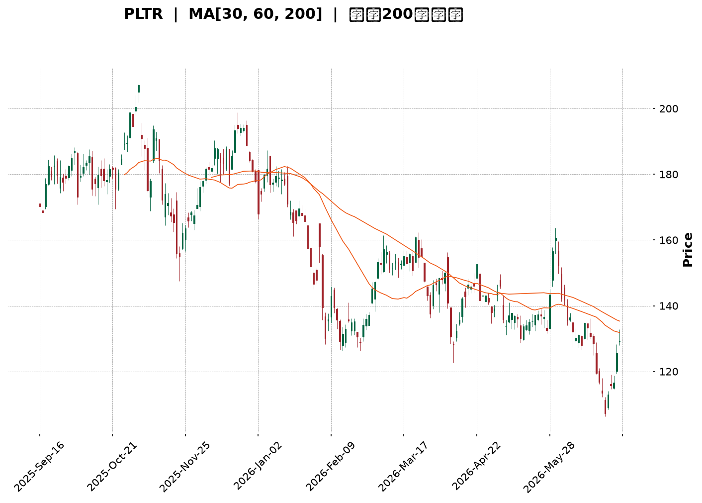
</details>

<html>
<head><meta charset="utf-8" /></head>
<body>
    <div style="height:500px; width:100%;">                        <script>window.PlotlyConfig = {MathJaxConfig: 'local'};</script>
        <script charset="utf-8" src="https://cdn.plot.ly/plotly-3.6.0.min.js" integrity="sha256-QaOVwtVY0T02VaHrr6pnoHLCwayMJp4O5n4YyaE3rJk=" crossorigin="anonymous"></script>                <div id="candlestick-chart" class="plotly-graph-div" style="height:100%; width:100%;"></div>            <script>                window.PLOTLYENV=window.PLOTLYENV || {};                                if (document.getElementById("candlestick-chart")) {                    Plotly.newPlot(                        "candlestick-chart",                        [{"close":{"dtype":"f8","bdata":"AAAA4FFIZUAAAABgjwplQAAAAEAKH2ZAAAAA4HrMZkAAAABgj2pmQAAAAKCZ0WZAAAAAgOtxZkAAAAAA12NmQAAAAIA9MmZAAAAAIIVbZkAAAACgcM1mQAAAAGBmHmdAAAAAoJlhZ0AAAACAPaJlQAAAAMD1cGZAAAAAoHDFZkAAAACA6\u002fFmQAAAAEAKL2dAAAAAgBTuZUAAAABguCZmQAAAACCud2ZAAAAAANdzZkAAAAAA10NmQAAAAMDMRGZAAAAAQOGyZkAAAADgUbBmQAAAACCu72VAAAAAIFyPZkAAAAAAKRRnQAAAAIDCpWdAAAAAQDOzZ0AAAACA69loQAAAAKCZUWhAAAAAQAoPaUAAAACAwuVpQAAAACCu12dAAAAAwMx8Z0AAAACgmeFlQAAAAIDCPWZAAAAAIIUzaEAAAABguN5nQAAAAKBwBWdAAAAA4HqEZUAAAADgUcBlQAAAAAAAaGVAAAAAYI\u002fqZEAAAACgcK1kQAAAAADXd2NAAAAAQDNbY0AAAAAAAEhkQAAAAKCZcWRAAAAA4KO4ZEAAAABgZg5lQAAAACCu72RAAAAAgBRWZUAAAABgjwJmQAAAAKBwPWZAAAAA4FG4ZkAAAAAgrq9mQAAAAEDhumZAAAAAwB59Z0AAAACgR3FnQAAAAIA98mZAAAAAAADoZkAAAAAAAHhnQAAAAKBHKWZAAAAAgBQ2Z0AAAAAAKSxoQAAAACBcP2hAAAAAAClEaEAAAACgcEVoQAAAAGC4lmdAAAAAgMIFZ0AAAABA4ZpmQAAAAAAAOGZAAAAAIIX7ZEAAAACgR8FlQAAAAGC4dmZAAAAAgMK1ZkAAAAAghRtmQAAAACCuL2ZAAAAAwB5tZkAAAABguF5mQAAAAMDMTGZAAAAAgD0iZkAAAABguF5lQAAAAMD1EGVAAAAAYI+qZEAAAADAzLxkQAAAAEAzM2VAAAAAQArvZEAAAABgZrZkQAAAAEAzq2NAAAAAIIX7YkAAAABA4VJiQAAAAOBReGJAAAAAACm8Y0AAAACgR3FhQAAAAOBRQGBAAAAAwMz8YEAAAADAHt1hQAAAAOBRcGFAAAAAgML1YEAAAAAAKSRgQAAAAMAebWBAAAAA4KOgYEAAAAAAKexgQAAAAOB63GBAAAAAIK7nYEAAAABAM1NgQAAAAEDhGmBAAAAAgBTGYEAAAACAFP5gQAAAAIAUJmFAAAAAoHAlYkAAAABACmdiQAAAAIAUJmNAAAAAoHAVY0AAAADAHqVjQAAAAIDCjWNAAAAA4HrkYkAAAABAM\u002fNiQAAAAAAAMGNAAAAAYGbeYkAAAABAChdjQAAAAGCPYmNAAAAA4KMYY0AAAACAwnVjQAAAAIDC1WJAAAAAQOEaZEAAAADA9VhjQAAAAGC4XmNAAAAAgOtxYkAAAACA6+FhQAAAAKCZMWFAAAAAwPVIYkAAAAAgrk9iQAAAAGC4jmJAAAAAgMJ9YkAAAACAPcJiQAAAAOBRmGFAAAAAIK5PYEAAAACA6wFgQAAAAADXi2BAAAAAYGb2YEAAAADAzMRhQAAAAOBR2GFAAAAA4HpMYkAAAADgejxiQAAAAEAKP2JAAAAAANcTY0AAAACAPbJhQAAAAEDh4mFAAAAAQDPjYUAAAACAwqVhQAAAAEAKP2FAAAAAIIVjYUAAAACAPQJiQAAAAMD1QGJAAAAAwB79YEAAAACgR7lgQAAAAKCZIWFAAAAAoJk5YUAAAADgehxhQAAAAAAAAGFAAAAAoJlBYEAAAAAgXLdgQAAAACCuv2BAAAAA4HrkYEAAAADgUehgQAAAAMDMJGFAAAAAoEctYUAAAAAAKRxhQAAAAEAzE2FAAAAA4FGQYEAAAABA4ephQAAAAKBHkWNAAAAAwMwUZEAAAACgcAVjQAAAAGBmxmFAAAAAYGa2YUAAAADA9fBgQAAAAEAKD2FAAAAAgD2CYEAAAABguEZgQAAAAGCPYmBAAAAAIFz\u002fX0AAAABguNZgQAAAAAAAqGBAAAAAAClUYEAAAABACg9gQAAAAAAA4F1AAAAAwMwsXUAAAAAAAGBcQAAAAKBH0VpAAAAAIIU7XEAAAADAzOxcQAAAAEDhKl1AAAAAYLhuX0AAAACgmSlgQA=="},"high":{"dtype":"f8","bdata":"AAAAgOtpZUAAAACAwjVlQAAAAKCZWWZAAAAAoHANZ0AAAAAAAMhmQAAAAAAAOGdAAAAAQDMbZ0AAAACAPQpnQAAAAADXg2ZAAAAAIFyvZkAAAADgo9hmQAAAAMD1SGdAAAAAYGaGZ0AAAABA4VpnQAAAAGBm3mZAAAAAgMJFZ0AAAADgUQhnQAAAAADXc2dAAAAAQDNjZ0AAAABACmdmQAAAAEDhymZAAAAAQDMLZ0AAAACAPRpnQAAAAEDhsmZAAAAAQOHiZkAAAADAcsxmQAAAAGC4xmZAAAAAgOuxZkAAAACgcEVnQAAAAGCPGmhAAAAAwPX4Z0AAAABAM\u002ftoQAAAAKBw9WhAAAAAgMKFaUAAAADgo\u002fBpQAAAAGBmdmhAAAAAgD3KZ0AAAABA4eJnQAAAAGBmVmZAAAAAgMJdaEAAAACgmR1oQAAAAGCP0mdAAAAAYGbWZkAAAACgRylmQAAAACCux2VAAAAAYI+aZUAAAABAMzNlQAAAAIA90mVAAAAAIIXDY0AAAACgcKVkQAAAAMDMlGRAAAAAINkKZUAAAACgmRllQAAAAEAzI2VAAAAAAAD4ZUAAAADAHj1mQAAAAIAUTmZAAAAAYOXEZkAAAAAAKfxmQAAAAEAz22ZAAAAA4HrMZ0AAAACgmYFnQAAAAMDMUGdAAAAAwPV4Z0AAAAAAAJBnQAAAAAAAeGdAAAAAYI9qZ0AAAAAAAGBoQAAAAAAp3GhAAAAAANdraEAAAACgcGVoQAAAAEAzi2hAAAAAYGZmZ0AAAAAAVBdnQAAAAMD1sGZAAAAAQDOrZkAAAACAPfplQAAAAIAUhmZAAAAAwPVoZ0AAAADAHjVnQAAAAEAKV2ZAAAAAAADQZkAAAABAM6NmQAAAAOAis2ZAAAAAQDOTZkAAAACAws1mQAAAAEAKf2VAAAAAIK4vZUAAAAAAACBlQAAAAAAAgGVAAAAAQOFSZUAAAACAFC5lQAAAAKBwoWRAAAAAACm0Y0AAAAAAAOBiQAAAAMDM7GJAAAAAAH+iZEAAAABAM3tjQAAAACBcP2FAAAAA4Ps1YUAAAAAA1ztiQAAAAIDrMWJAAAAAAABoYUAAAADgevxgQAAAAIDrsWBAAAAAgD3KYEAAAADg0J5hQAAAAMAeBWFAAAAAYLgGYUAAAACgR4FgQAAAACCuR2BAAAAAQOECYUAAAADgUTBhQAAAAEAzQ2FAAAAA4HpkYkAAAAAAAHBiQAAAAOCjUGNAAAAAACmMY0AAAABgZi5kQAAAAIAUzmNAAAAAIAaVY0AAAACAaCVjQAAAAAApfGNAAAAAgOtRY0AAAAAghTtjQAAAAAAAmGNAAAAAgBSWY0AAAADAzIRjQAAAAMDMlGNAAAAAYI8iZEAAAADAzExkQAAAAOCjCGRAAAAAANcjY0AAAABguD5iQAAAAADXA2JAAAAAIIV7YkAAAACgmYliQAAAAOBRkGJAAAAAIIXTYkAAAADgo8hiQAAAAMD1iGNAAAAAoEdxYUAAAABgZiZgQAAAAKBwzWBAAAAAgD1CYUAAAABgj9JhQAAAAKCZMWJAAAAAwPWIYkAAAABgZmZiQAAAAADXu2JAAAAAgMIVY0AAAACgR8liQAAAAGCP6mFAAAAAgD0iYkAAAABAM\u002fthQAAAAOBReGFAAAAAYGaGYUAAAACAFE5iQAAAAOB6tGJAAAAAIFzfYUAAAABgZvZgQAAAAGBmnmFAAAAAACk8YUAAAADgeiRhQAAAAIDCLWFAAAAAIK4fYUAAAAAgXM9gQAAAAOB69GBAAAAAgOv9YEAAAABACi9hQAAAACCuJ2FAAAAAoJlRYUAAAADgo2BhQAAAAIDCVWFAAAAAIFz3YEAAAAAAACBiQAAAAKDtuGNAAAAAYGZ2ZEAAAACgmfFjQAAAAIDC9WJAAAAAANdLYkAAAABACr9hQAAAAOBROGFAAAAAIK4fYUAAAACA66VgQAAAAOCjcGBAAAAAQOFiYEAAAAAgXN9gQAAAAEDh0mBAAAAAQDMDYUAAAACAwm1gQAAAAADXG2BAAAAAACk8XkAAAAAAAIBdQAAAAKCZCVxAAAAAwB6FXEAAAADAHsVdQAAAAMDMrF1AAAAAAAAIYEAAAAAAKZxgQA=="},"hovertemplate":"\u003cb\u003e%{x|%Y-%m-%d}\u003c\u002fb\u003e\u003cbr\u003e\u958b: $%{open:.2f}\u003cbr\u003e\u9ad8: $%{high:.2f}\u003cbr\u003e\u4f4e: $%{low:.2f}\u003cbr\u003e\u6536: $%{close:.2f}\u003cextra\u003e\u003c\u002fextra\u003e","low":{"dtype":"f8","bdata":"AAAAYLgeZUAAAADgoyhkQAAAAOB6LGVAAAAAYLgWZkAAAACgR0lmQAAAAOBRIGZAAAAAANcjZkAAAACgR8llQAAAAMAe3WVAAAAAwB4lZkAAAABACkdmQAAAAAAAcGZAAAAAYGbeZkAAAADgo1hlQAAAAGCPOmZAAAAAoHBtZkAAAABgZqZmQAAAAGBmfmZAAAAAwPWwZUAAAABgZq5lQAAAAIA9WmVAAAAA4KMAZkAAAABgZg5mQAAAAGBmvmVAAAAAgBQuZkAAAADAzFRmQAAAAKBwLWVAAAAA4FHgZUAAAABAM9tmQAAAAOCjcGdAAAAAwPVYZ0AAAAAgrs9nQAAAAADXQ2hAAAAAoHC9aEAAAACAPTppQAAAAIDrMWdAAAAAYLimZkAAAADA9dBlQAAAAMAeHWVAAAAA4KPwZkAAAAAAKWRnQAAAAMDMjGZAAAAAYGRXZUAAAAAAAJBkQAAAAIDC9WRAAAAAAACwZEAAAACgcE1kQAAAAOCjTGNAAAAAgOtxYkAAAAAAAKBjQAAAAIDCkWNAAAAAACl8ZEAAAAAAALxkQAAAAADXY2RAAAAAQOEyZUAAAABgjxplQAAAAIDCzWVAAAAAwB4lZkAAAACgR3FmQAAAAAApjGZAAAAAAADYZkAAAABguIZmQAAAACBYNWZAAAAAwPWAZkAAAABAi6RmQAAAAAAAEGZAAAAA4FGwZkAAAAAgXFdnQAAAAIDCDWhAAAAAIIX3Z0AAAABgjxpoQAAAAADXk2dAAAAA4Hr0ZkAAAABgZpZmQAAAAAAAKGZAAAAAQDPLZEAAAACgR3llQAAAAOCj2GVAAAAAwB41ZkAAAAAA18tlQAAAAAAA2GVAAAAAQOEKZkAAAADgegRmQAAAAGBmvmVAAAAAwPUQZkAAAADgUUBlQAAAACCux2RAAAAAIIUjZEAAAABgZp5kQAAAAKCZyWRAAAAAYGbqZEAAAACAFJZkQAAAACCup2NAAAAAANdjYkAAAADAciRiQAAAAKDtVGJAAAAAANcjY0AAAACAwvVgQAAAAIA9CmBAAAAAQDOLYEAAAAAA1dhgQAAAAOCjOGFAAAAAYGaeYEAAAAAA16NfQAAAAIDpjl9AAAAAYI\u002fSX0AAAAAA19tgQAAAAOBRYGBAAAAAoHBlYEAAAADA9dhfQAAAACCul19AAAAAgMIlYEAAAAAAKZRgQAAAACBcv2BAAAAA4KOQYUAAAABgZkZhQAAAAIDrgWJAAAAAIIWzYkAAAACgR8liQAAAAEAKH2NAAAAA4HrEYkAAAABgj6piQAAAACBc32JAAAAAYI+SYkAAAACgcOViQAAAAADXA2NAAAAAIIUTY0AAAAAAANBiQAAAAEDhomJAAAAAIK4nY0AAAADgevRiQAAAACBcW2NAAAAAAABoYkAAAACA67FhQAAAAKCZCWFAAAAAQApfYUAAAABACg9iQAAAACCuP2FAAAAAIDFUYkAAAABgZg5iQAAAAKBwZWFAAAAAQAoPYEAAAAAghateQAAAAMDMJGBAAAAAAADAYEAAAACAwt1gQAAAAMD1cGFAAAAAoJnpYUAAAABgj\u002fphQAAAAMD3\u002f2FAAAAAwB5tYkAAAACgcH1hQAAAAIDCXWFAAAAA4FGgYUAAAACgcI1hQAAAAIDC1WBAAAAAwMwUYUAAAADgeqxhQAAAAEAzJ2JAAAAAQArXYEAAAADAzGRgQAAAAMD12GBAAAAA4KOgYEAAAAAArJhgQAAAAGC4rmBAAAAAAAAYYEAAAABgZi5gQAAAAKBHiWBAAAAAYI9qYEAAAABAM7NgQAAAAKBwjWBAAAAAoHDtYEAAAACgmclgQAAAAKCZqWBAAAAAACl0YEAAAAAAAKBgQAAAAKBHOWJAAAAAACl8Y0AAAACgmbliQAAAAAAAqGFAAAAAQLSIYUAAAADAzMBgQAAAAMD16GBAAAAAYGbWX0AAAACgmRlgQAAAAEDhyl9AAAAAoJmpX0AAAABgZjZgQAAAAADXM2BAAAAAoHA9YEAAAADgo0BfQAAAAMDMzF1AAAAAIIULXUAAAAAAABBcQAAAACCul1pAAAAAgBQeW0AAAADAzKxcQAAAAOB6pFxAAAAAYGbWXUAAAADAzPxfQA=="},"name":"\u50f9\u683c","open":{"dtype":"f8","bdata":"AAAAoEdhZUAAAADgoyBlQAAAAOCjSGVAAAAAgD0iZkAAAAAAKZxmQAAAAOBR0GZAAAAAwB79ZkAAAACgmfllQAAAAKCZYWZAAAAA4Hp0ZkAAAAAgXF9mQAAAAIA9qmZAAAAAYGZWZ0AAAADAzExnQAAAAIDCZWZAAAAAgOuJZkAAAACgmdlmQAAAAGCP8mZAAAAAoHAlZ0AAAACAwlVmQAAAAAAAAGZAAAAAwPW0ZkAAAADA9bhmQAAAAAAAOGZAAAAAIK5vZkAAAACA68FmQAAAAIDCvWZAAAAAgD3uZUAAAAAAKdxmQAAAAEAKn2dAAAAAIFyvZ0AAAABgj+JnQAAAAKCZzWhAAAAAYGbmaEAAAACgcKFpQAAAAIA9AmhAAAAAAACgZ0AAAAAgrn9nQAAAAMDMpGVAAAAAgOsJZ0AAAABguMpnQAAAAGCP0mdAAAAAQOG2ZkAAAABAM99kQAAAAMD1UGVAAAAAANcLZUAAAACgmflkQAAAAIA9gmVAAAAA4FGAY0AAAABACq9jQAAAAIA9AmRAAAAAQDPbZEAAAADgUfhkQAAAAAAAoGRAAAAAQOEyZUAAAADgekRlQAAAACCuC2ZAAAAAIFxHZkAAAABguMZmQAAAAEAKn2ZAAAAAYGYeZ0AAAACgmRlnQAAAAIDrOWdAAAAAYI8iZ0AAAADA9bRmQAAAAEDhdmdAAAAA4FGwZkAAAAAgrldnQAAAAKBHYWhAAAAAYGYaaEAAAADAHiVoQAAAAOB6YGhAAAAAQDNbZ0AAAABAMwtnQAAAAAAppGZAAAAAoJmpZkAAAAAAKdxlQAAAAOBR+GVAAAAAoJl5ZkAAAAAgrjNnQAAAAOCjIGZAAAAAgOs1ZkAAAAAAAFxmQAAAAAAARGZAAAAAYLhWZkAAAAAghWtmQAAAAAAA9GRAAAAAIN0MZUAAAACgmR1lQAAAAOCj6GRAAAAAYLgGZUAAAAAgXO9kQAAAAMDMjGRAAAAAACm0Y0AAAACgmcFiQAAAAIAU3mJAAAAAoJmhZEAAAADAHm1jQAAAAIA9GmFAAAAAYI\u002fqYEAAAABgjxJhQAAAAEDhHmJAAAAAwMxgYUAAAAAghetgQAAAAKCZ+V9AAAAA4KMcYEAAAADgevxgQAAAAIDriWBAAAAAIK6LYEAAAACgR4FgQAAAAAApIGBAAAAAIIVTYEAAAABACrtgQAAAAIA9wmBAAAAAwMyYYUAAAABAM8NhQAAAAIDCjWJAAAAAgBQeY0AAAACAFM5iQAAAAIAUdmNAAAAAIK5\u002fY0AAAAAAKexiQAAAAOBRIGNAAAAAoJkpY0AAAABgZg5jQAAAAMD1DGNAAAAAgD1eY0AAAABAMyNjQAAAAGBmZmNAAAAAIK4nY0AAAACAPQJkQAAAAKBwrWNAAAAAgMIhY0AAAAAAKTxiQAAAAOCj6GFAAAAA4KOAYUAAAAAAAGBiQAAAACCF72FAAAAAIIWLYkAAAABgOVxiQAAAAOB6WGNAAAAA4KNsYUAAAAAgXA9gQAAAACBcR2BAAAAAAKrNYEAAAACgRxlhQAAAAKBHCWJAAAAAgBQqYkAAAAAAACBiQAAAAIDrWWJAAAAAIIWLYkAAAABgZrZiQAAAAGC43mFAAAAAAACoYUAAAACgmclhQAAAAOBReGFAAAAAQDNPYUAAAAAAAOhhQAAAAAAAeGJAAAAAoHCJYUAAAABguLZgQAAAAEAz42BAAAAAIK77YEAAAADAHt1gQAAAAEAzE2FAAAAAIDHAYEAAAADAzDRgQAAAAKCZmWBAAAAAAACQYEAAAACgcOVgQAAAAOCjxGBAAAAAoJn5YEAAAACgmS1hQAAAAMAeBWFAAAAAoJmpYEAAAADAHqVgQAAAAGBmemJAAAAAIFz\u002fY0AAAACAFJZjQAAAAGBmtmJAAAAAYLguYkAAAABgZophQAAAAIDC9WBAAAAAANfbYEAAAABgZipgQAAAAMD1GGBAAAAAoEddYEAAAADgo0BgQAAAAEDh0mBAAAAA4FF4YEAAAABA4VpgQAAAACBcb19AAAAAoJkJXkAAAAAgrodcQAAAAOBR2FtAAAAAYI9CW0AAAABguA5dQAAAAMDMvFxAAAAAQDMDXkAAAAAgrh9gQA=="},"x":["2025-09-16T00:00:00-04:00","2025-09-17T00:00:00-04:00","2025-09-18T00:00:00-04:00","2025-09-19T00:00:00-04:00","2025-09-22T00:00:00-04:00","2025-09-23T00:00:00-04:00","2025-09-24T00:00:00-04:00","2025-09-25T00:00:00-04:00","2025-09-26T00:00:00-04:00","2025-09-29T00:00:00-04:00","2025-09-30T00:00:00-04:00","2025-10-01T00:00:00-04:00","2025-10-02T00:00:00-04:00","2025-10-03T00:00:00-04:00","2025-10-06T00:00:00-04:00","2025-10-07T00:00:00-04:00","2025-10-08T00:00:00-04:00","2025-10-09T00:00:00-04:00","2025-10-10T00:00:00-04:00","2025-10-13T00:00:00-04:00","2025-10-14T00:00:00-04:00","2025-10-15T00:00:00-04:00","2025-10-16T00:00:00-04:00","2025-10-17T00:00:00-04:00","2025-10-20T00:00:00-04:00","2025-10-21T00:00:00-04:00","2025-10-22T00:00:00-04:00","2025-10-23T00:00:00-04:00","2025-10-24T00:00:00-04:00","2025-10-27T00:00:00-04:00","2025-10-28T00:00:00-04:00","2025-10-29T00:00:00-04:00","2025-10-30T00:00:00-04:00","2025-10-31T00:00:00-04:00","2025-11-03T00:00:00-05:00","2025-11-04T00:00:00-05:00","2025-11-05T00:00:00-05:00","2025-11-06T00:00:00-05:00","2025-11-07T00:00:00-05:00","2025-11-10T00:00:00-05:00","2025-11-11T00:00:00-05:00","2025-11-12T00:00:00-05:00","2025-11-13T00:00:00-05:00","2025-11-14T00:00:00-05:00","2025-11-17T00:00:00-05:00","2025-11-18T00:00:00-05:00","2025-11-19T00:00:00-05:00","2025-11-20T00:00:00-05:00","2025-11-21T00:00:00-05:00","2025-11-24T00:00:00-05:00","2025-11-25T00:00:00-05:00","2025-11-26T00:00:00-05:00","2025-11-28T00:00:00-05:00","2025-12-01T00:00:00-05:00","2025-12-02T00:00:00-05:00","2025-12-03T00:00:00-05:00","2025-12-04T00:00:00-05:00","2025-12-05T00:00:00-05:00","2025-12-08T00:00:00-05:00","2025-12-09T00:00:00-05:00","2025-12-10T00:00:00-05:00","2025-12-11T00:00:00-05:00","2025-12-12T00:00:00-05:00","2025-12-15T00:00:00-05:00","2025-12-16T00:00:00-05:00","2025-12-17T00:00:00-05:00","2025-12-18T00:00:00-05:00","2025-12-19T00:00:00-05:00","2025-12-22T00:00:00-05:00","2025-12-23T00:00:00-05:00","2025-12-24T00:00:00-05:00","2025-12-26T00:00:00-05:00","2025-12-29T00:00:00-05:00","2025-12-30T00:00:00-05:00","2025-12-31T00:00:00-05:00","2026-01-02T00:00:00-05:00","2026-01-05T00:00:00-05:00","2026-01-06T00:00:00-05:00","2026-01-07T00:00:00-05:00","2026-01-08T00:00:00-05:00","2026-01-09T00:00:00-05:00","2026-01-12T00:00:00-05:00","2026-01-13T00:00:00-05:00","2026-01-14T00:00:00-05:00","2026-01-15T00:00:00-05:00","2026-01-16T00:00:00-05:00","2026-01-20T00:00:00-05:00","2026-01-21T00:00:00-05:00","2026-01-22T00:00:00-05:00","2026-01-23T00:00:00-05:00","2026-01-26T00:00:00-05:00","2026-01-27T00:00:00-05:00","2026-01-28T00:00:00-05:00","2026-01-29T00:00:00-05:00","2026-01-30T00:00:00-05:00","2026-02-02T00:00:00-05:00","2026-02-03T00:00:00-05:00","2026-02-04T00:00:00-05:00","2026-02-05T00:00:00-05:00","2026-02-06T00:00:00-05:00","2026-02-09T00:00:00-05:00","2026-02-10T00:00:00-05:00","2026-02-11T00:00:00-05:00","2026-02-12T00:00:00-05:00","2026-02-13T00:00:00-05:00","2026-02-17T00:00:00-05:00","2026-02-18T00:00:00-05:00","2026-02-19T00:00:00-05:00","2026-02-20T00:00:00-05:00","2026-02-23T00:00:00-05:00","2026-02-24T00:00:00-05:00","2026-02-25T00:00:00-05:00","2026-02-26T00:00:00-05:00","2026-02-27T00:00:00-05:00","2026-03-02T00:00:00-05:00","2026-03-03T00:00:00-05:00","2026-03-04T00:00:00-05:00","2026-03-05T00:00:00-05:00","2026-03-06T00:00:00-05:00","2026-03-09T00:00:00-04:00","2026-03-10T00:00:00-04:00","2026-03-11T00:00:00-04:00","2026-03-12T00:00:00-04:00","2026-03-13T00:00:00-04:00","2026-03-16T00:00:00-04:00","2026-03-17T00:00:00-04:00","2026-03-18T00:00:00-04:00","2026-03-19T00:00:00-04:00","2026-03-20T00:00:00-04:00","2026-03-23T00:00:00-04:00","2026-03-24T00:00:00-04:00","2026-03-25T00:00:00-04:00","2026-03-26T00:00:00-04:00","2026-03-27T00:00:00-04:00","2026-03-30T00:00:00-04:00","2026-03-31T00:00:00-04:00","2026-04-01T00:00:00-04:00","2026-04-02T00:00:00-04:00","2026-04-06T00:00:00-04:00","2026-04-07T00:00:00-04:00","2026-04-08T00:00:00-04:00","2026-04-09T00:00:00-04:00","2026-04-10T00:00:00-04:00","2026-04-13T00:00:00-04:00","2026-04-14T00:00:00-04:00","2026-04-15T00:00:00-04:00","2026-04-16T00:00:00-04:00","2026-04-17T00:00:00-04:00","2026-04-20T00:00:00-04:00","2026-04-21T00:00:00-04:00","2026-04-22T00:00:00-04:00","2026-04-23T00:00:00-04:00","2026-04-24T00:00:00-04:00","2026-04-27T00:00:00-04:00","2026-04-28T00:00:00-04:00","2026-04-29T00:00:00-04:00","2026-04-30T00:00:00-04:00","2026-05-01T00:00:00-04:00","2026-05-04T00:00:00-04:00","2026-05-05T00:00:00-04:00","2026-05-06T00:00:00-04:00","2026-05-07T00:00:00-04:00","2026-05-08T00:00:00-04:00","2026-05-11T00:00:00-04:00","2026-05-12T00:00:00-04:00","2026-05-13T00:00:00-04:00","2026-05-14T00:00:00-04:00","2026-05-15T00:00:00-04:00","2026-05-18T00:00:00-04:00","2026-05-19T00:00:00-04:00","2026-05-20T00:00:00-04:00","2026-05-21T00:00:00-04:00","2026-05-22T00:00:00-04:00","2026-05-26T00:00:00-04:00","2026-05-27T00:00:00-04:00","2026-05-28T00:00:00-04:00","2026-05-29T00:00:00-04:00","2026-06-01T00:00:00-04:00","2026-06-02T00:00:00-04:00","2026-06-03T00:00:00-04:00","2026-06-04T00:00:00-04:00","2026-06-05T00:00:00-04:00","2026-06-08T00:00:00-04:00","2026-06-09T00:00:00-04:00","2026-06-10T00:00:00-04:00","2026-06-11T00:00:00-04:00","2026-06-12T00:00:00-04:00","2026-06-15T00:00:00-04:00","2026-06-16T00:00:00-04:00","2026-06-17T00:00:00-04:00","2026-06-18T00:00:00-04:00","2026-06-22T00:00:00-04:00","2026-06-23T00:00:00-04:00","2026-06-24T00:00:00-04:00","2026-06-25T00:00:00-04:00","2026-06-26T00:00:00-04:00","2026-06-29T00:00:00-04:00","2026-06-30T00:00:00-04:00","2026-07-01T00:00:00-04:00","2026-07-02T00:00:00-04:00"],"type":"candlestick"},{"hovertemplate":"MA30: $%{y:.2f}\u003cextra\u003e\u003c\u002fextra\u003e","line":{"color":"#2196F3","dash":"dash","width":2},"mode":"lines","name":"MA30","x":["2025-09-16T00:00:00-04:00","2025-09-17T00:00:00-04:00","2025-09-18T00:00:00-04:00","2025-09-19T00:00:00-04:00","2025-09-22T00:00:00-04:00","2025-09-23T00:00:00-04:00","2025-09-24T00:00:00-04:00","2025-09-25T00:00:00-04:00","2025-09-26T00:00:00-04:00","2025-09-29T00:00:00-04:00","2025-09-30T00:00:00-04:00","2025-10-01T00:00:00-04:00","2025-10-02T00:00:00-04:00","2025-10-03T00:00:00-04:00","2025-10-06T00:00:00-04:00","2025-10-07T00:00:00-04:00","2025-10-08T00:00:00-04:00","2025-10-09T00:00:00-04:00","2025-10-10T00:00:00-04:00","2025-10-13T00:00:00-04:00","2025-10-14T00:00:00-04:00","2025-10-15T00:00:00-04:00","2025-10-16T00:00:00-04:00","2025-10-17T00:00:00-04:00","2025-10-20T00:00:00-04:00","2025-10-21T00:00:00-04:00","2025-10-22T00:00:00-04:00","2025-10-23T00:00:00-04:00","2025-10-24T00:00:00-04:00","2025-10-27T00:00:00-04:00","2025-10-28T00:00:00-04:00","2025-10-29T00:00:00-04:00","2025-10-30T00:00:00-04:00","2025-10-31T00:00:00-04:00","2025-11-03T00:00:00-05:00","2025-11-04T00:00:00-05:00","2025-11-05T00:00:00-05:00","2025-11-06T00:00:00-05:00","2025-11-07T00:00:00-05:00","2025-11-10T00:00:00-05:00","2025-11-11T00:00:00-05:00","2025-11-12T00:00:00-05:00","2025-11-13T00:00:00-05:00","2025-11-14T00:00:00-05:00","2025-11-17T00:00:00-05:00","2025-11-18T00:00:00-05:00","2025-11-19T00:00:00-05:00","2025-11-20T00:00:00-05:00","2025-11-21T00:00:00-05:00","2025-11-24T00:00:00-05:00","2025-11-25T00:00:00-05:00","2025-11-26T00:00:00-05:00","2025-11-28T00:00:00-05:00","2025-12-01T00:00:00-05:00","2025-12-02T00:00:00-05:00","2025-12-03T00:00:00-05:00","2025-12-04T00:00:00-05:00","2025-12-05T00:00:00-05:00","2025-12-08T00:00:00-05:00","2025-12-09T00:00:00-05:00","2025-12-10T00:00:00-05:00","2025-12-11T00:00:00-05:00","2025-12-12T00:00:00-05:00","2025-12-15T00:00:00-05:00","2025-12-16T00:00:00-05:00","2025-12-17T00:00:00-05:00","2025-12-18T00:00:00-05:00","2025-12-19T00:00:00-05:00","2025-12-22T00:00:00-05:00","2025-12-23T00:00:00-05:00","2025-12-24T00:00:00-05:00","2025-12-26T00:00:00-05:00","2025-12-29T00:00:00-05:00","2025-12-30T00:00:00-05:00","2025-12-31T00:00:00-05:00","2026-01-02T00:00:00-05:00","2026-01-05T00:00:00-05:00","2026-01-06T00:00:00-05:00","2026-01-07T00:00:00-05:00","2026-01-08T00:00:00-05:00","2026-01-09T00:00:00-05:00","2026-01-12T00:00:00-05:00","2026-01-13T00:00:00-05:00","2026-01-14T00:00:00-05:00","2026-01-15T00:00:00-05:00","2026-01-16T00:00:00-05:00","2026-01-20T00:00:00-05:00","2026-01-21T00:00:00-05:00","2026-01-22T00:00:00-05:00","2026-01-23T00:00:00-05:00","2026-01-26T00:00:00-05:00","2026-01-27T00:00:00-05:00","2026-01-28T00:00:00-05:00","2026-01-29T00:00:00-05:00","2026-01-30T00:00:00-05:00","2026-02-02T00:00:00-05:00","2026-02-03T00:00:00-05:00","2026-02-04T00:00:00-05:00","2026-02-05T00:00:00-05:00","2026-02-06T00:00:00-05:00","2026-02-09T00:00:00-05:00","2026-02-10T00:00:00-05:00","2026-02-11T00:00:00-05:00","2026-02-12T00:00:00-05:00","2026-02-13T00:00:00-05:00","2026-02-17T00:00:00-05:00","2026-02-18T00:00:00-05:00","2026-02-19T00:00:00-05:00","2026-02-20T00:00:00-05:00","2026-02-23T00:00:00-05:00","2026-02-24T00:00:00-05:00","2026-02-25T00:00:00-05:00","2026-02-26T00:00:00-05:00","2026-02-27T00:00:00-05:00","2026-03-02T00:00:00-05:00","2026-03-03T00:00:00-05:00","2026-03-04T00:00:00-05:00","2026-03-05T00:00:00-05:00","2026-03-06T00:00:00-05:00","2026-03-09T00:00:00-04:00","2026-03-10T00:00:00-04:00","2026-03-11T00:00:00-04:00","2026-03-12T00:00:00-04:00","2026-03-13T00:00:00-04:00","2026-03-16T00:00:00-04:00","2026-03-17T00:00:00-04:00","2026-03-18T00:00:00-04:00","2026-03-19T00:00:00-04:00","2026-03-20T00:00:00-04:00","2026-03-23T00:00:00-04:00","2026-03-24T00:00:00-04:00","2026-03-25T00:00:00-04:00","2026-03-26T00:00:00-04:00","2026-03-27T00:00:00-04:00","2026-03-30T00:00:00-04:00","2026-03-31T00:00:00-04:00","2026-04-01T00:00:00-04:00","2026-04-02T00:00:00-04:00","2026-04-06T00:00:00-04:00","2026-04-07T00:00:00-04:00","2026-04-08T00:00:00-04:00","2026-04-09T00:00:00-04:00","2026-04-10T00:00:00-04:00","2026-04-13T00:00:00-04:00","2026-04-14T00:00:00-04:00","2026-04-15T00:00:00-04:00","2026-04-16T00:00:00-04:00","2026-04-17T00:00:00-04:00","2026-04-20T00:00:00-04:00","2026-04-21T00:00:00-04:00","2026-04-22T00:00:00-04:00","2026-04-23T00:00:00-04:00","2026-04-24T00:00:00-04:00","2026-04-27T00:00:00-04:00","2026-04-28T00:00:00-04:00","2026-04-29T00:00:00-04:00","2026-04-30T00:00:00-04:00","2026-05-01T00:00:00-04:00","2026-05-04T00:00:00-04:00","2026-05-05T00:00:00-04:00","2026-05-06T00:00:00-04:00","2026-05-07T00:00:00-04:00","2026-05-08T00:00:00-04:00","2026-05-11T00:00:00-04:00","2026-05-12T00:00:00-04:00","2026-05-13T00:00:00-04:00","2026-05-14T00:00:00-04:00","2026-05-15T00:00:00-04:00","2026-05-18T00:00:00-04:00","2026-05-19T00:00:00-04:00","2026-05-20T00:00:00-04:00","2026-05-21T00:00:00-04:00","2026-05-22T00:00:00-04:00","2026-05-26T00:00:00-04:00","2026-05-27T00:00:00-04:00","2026-05-28T00:00:00-04:00","2026-05-29T00:00:00-04:00","2026-06-01T00:00:00-04:00","2026-06-02T00:00:00-04:00","2026-06-03T00:00:00-04:00","2026-06-04T00:00:00-04:00","2026-06-05T00:00:00-04:00","2026-06-08T00:00:00-04:00","2026-06-09T00:00:00-04:00","2026-06-10T00:00:00-04:00","2026-06-11T00:00:00-04:00","2026-06-12T00:00:00-04:00","2026-06-15T00:00:00-04:00","2026-06-16T00:00:00-04:00","2026-06-17T00:00:00-04:00","2026-06-18T00:00:00-04:00","2026-06-22T00:00:00-04:00","2026-06-23T00:00:00-04:00","2026-06-24T00:00:00-04:00","2026-06-25T00:00:00-04:00","2026-06-26T00:00:00-04:00","2026-06-29T00:00:00-04:00","2026-06-30T00:00:00-04:00","2026-07-01T00:00:00-04:00","2026-07-02T00:00:00-04:00"],"y":{"dtype":"f8","bdata":"AAAAAAAA+H8AAAAAAAD4fwAAAAAAAPh\u002fAAAAAAAA+H8AAAAAAAD4fwAAAAAAAPh\u002fAAAAAAAA+H8AAAAAAAD4fwAAAAAAAPh\u002fAAAAAAAA+H8AAAAAAAD4fwAAAAAAAPh\u002fAAAAAAAA+H8AAAAAAAD4fwAAAAAAAPh\u002fAAAAAAAA+H8AAAAAAAD4fwAAAAAAAPh\u002fAAAAAAAA+H8AAAAAAAD4fwAAAAAAAPh\u002fAAAAAAAA+H8AAAAAAAD4fwAAAAAAAPh\u002fAAAAAAAA+H8AAAAAAAD4fwAAAAAAAPh\u002fAAAAAAAA+H8AAAAAAAD4f6uqqvrweWZAd3d3F5KOZkCamZkpFa9mQM3MzKzVwWZAiYiIuB7VZkAAAACg0\u002fJmQKuqqgqQ+2ZAq6qqanUEZ0CamZkJHgBnQGZmZlaAAGdAIiIiEjwQZ0AAAAAQWBlnQCIiIhKDGGdAVVVVpZsIZ0AzMzNTnAlnQFVVVVXHAGdAZmZmBvPwZkCJiIiYmd1mQAAAALDkvWZA7+7uPu6nZkCrqqoq+ZdmQHd3dze0hmZA7+7uPu53ZkARERGxnW1mQN7d3c0+YmZAERERYZ5WZkARERGh01BmQN7d3S1rU2ZAREREtMhUZkBmZmZGb1FmQHd3d\u002feaSWZAvLu7e81HZkBVVVUFyDtmQAAAAMARMGZAq6qqirMdZkC8u7vb+QhmQLy7uxuh+mVAIiIiokX4ZUAiIiLy0gtmQKuqqqrxHGZAmpmZqX8dZkBEREQ07CBmQN7d3e3DJWZAZmZmppsyZkAiIiKy5DlmQBEREaHTQGZAq6qqWmRBZkAAAAAwlkpmQLy7uzsmZGZAvLu7m8SAZkDNzMwcWpBmQJqZmak4n2ZAq6qqSsWtZkCamZk5+7hmQBEREWGexGZAvLu7i2zLZkAiIiJy9sVmQJqZmVnyu2ZA3t3d3WuqZkARERHByplmQLy7u2u8jGZAAAAA8O52ZkCamZkpo19mQKuqqlqrQ2ZAq6qqyi8iZkDe3d1dSPZlQFVVVbXI1mVAmpmZuR65ZUAAAADQsH9lQM3MzLx0O2VAAAAAEFj9ZECrqqqqqsZkQImIiMgvkmRAzczMDHReZEBmZmbGSydkQN7d3d3d9WNAmpmZObTQY0CJiIh4d6djQO\u002fu7p6od2NAiYiIaB9GY0CJiIhYxxRjQGZmZqbi4GJAMzMzk6awYkDv7u4+w4JiQLy7uyvOVmJAd3d3V8c0YkDNzMy8dBtiQFVVVeUXC2JA7+7u3pb9YUBVVVVFRPRhQKuqqvo35mFAzczMzMzUYUAAAACQwsVhQBEREUGnwWFAMzMzw67AYUCamZmpOMdhQDMzM4MHz2FAREREJJTJYUAAAABwy9phQJqZmbnX8GFAIiIiAnILYkDv7u5OGxhiQBERETGWKGJAmpmZOUI1YkCrqqoKHkRiQLy7u6uqSmJAiYiIiM9YYkDe3d1NqWRiQCIiItIic2JAiYiICKyAYkBERESkcJViQImIiJgnomJAAAAAQDWeYkC8u7t7zZViQM3MzEypkGJAvLu7W4+GYkCJiIjoJoFiQCIiItIGdmJAZmZm9lNvYkAAAACATmNiQJqZmTkmWGJAzczMXLpZYkARERGBB09iQBEREeHsQ2JA7+7uTo07YkDe3d0dPi9iQCIiIvL9HGJAq6qq2msOYkDe3d2NCQJiQLy7u8sT\u002fWFA7+7uPnziYUAzMzOTGMxhQDMzM\u002fP9uGFAIiIi0pSuYUAAAAAAAKhhQO\u002fu7r5YpmFAAAAA4AiVYUCrqqqKbIdhQERERET9d2FA7+7uvlhqYUAAAACgjFphQKuqqtqyVmFAZmZm1hVeYUCamZlJfmdhQM3MzFwBbGFAd3d3R5poYUCrqqo632lhQGZmZhaSeGFAREREBMiHYUAAAADgeo5hQJqZmWl1imFAZmZmhs9+YUAzMzMzXnhhQAAAAIBOcWFAMzMzk4plYUCamZkJ11lhQLy7u5t9UmFAMzMzG6FGYUC8u7szpTxhQBEREWkDL2FAZmZmnmEpYUAAAADotCNhQN7d3ZX8EGFAiYiI4Hr6YEARERHZh+FgQERERKTiwmBAVVVVvZ+wYEARERFZZJ1gQM3MzNTqimBAZmZmRuGAYEDNzMzMhXpgQA=="},"type":"scatter"},{"hovertemplate":"MA60: $%{y:.2f}\u003cextra\u003e\u003c\u002fextra\u003e","line":{"color":"#9C27B0","dash":"dash","width":2},"mode":"lines","name":"MA60","x":["2025-09-16T00:00:00-04:00","2025-09-17T00:00:00-04:00","2025-09-18T00:00:00-04:00","2025-09-19T00:00:00-04:00","2025-09-22T00:00:00-04:00","2025-09-23T00:00:00-04:00","2025-09-24T00:00:00-04:00","2025-09-25T00:00:00-04:00","2025-09-26T00:00:00-04:00","2025-09-29T00:00:00-04:00","2025-09-30T00:00:00-04:00","2025-10-01T00:00:00-04:00","2025-10-02T00:00:00-04:00","2025-10-03T00:00:00-04:00","2025-10-06T00:00:00-04:00","2025-10-07T00:00:00-04:00","2025-10-08T00:00:00-04:00","2025-10-09T00:00:00-04:00","2025-10-10T00:00:00-04:00","2025-10-13T00:00:00-04:00","2025-10-14T00:00:00-04:00","2025-10-15T00:00:00-04:00","2025-10-16T00:00:00-04:00","2025-10-17T00:00:00-04:00","2025-10-20T00:00:00-04:00","2025-10-21T00:00:00-04:00","2025-10-22T00:00:00-04:00","2025-10-23T00:00:00-04:00","2025-10-24T00:00:00-04:00","2025-10-27T00:00:00-04:00","2025-10-28T00:00:00-04:00","2025-10-29T00:00:00-04:00","2025-10-30T00:00:00-04:00","2025-10-31T00:00:00-04:00","2025-11-03T00:00:00-05:00","2025-11-04T00:00:00-05:00","2025-11-05T00:00:00-05:00","2025-11-06T00:00:00-05:00","2025-11-07T00:00:00-05:00","2025-11-10T00:00:00-05:00","2025-11-11T00:00:00-05:00","2025-11-12T00:00:00-05:00","2025-11-13T00:00:00-05:00","2025-11-14T00:00:00-05:00","2025-11-17T00:00:00-05:00","2025-11-18T00:00:00-05:00","2025-11-19T00:00:00-05:00","2025-11-20T00:00:00-05:00","2025-11-21T00:00:00-05:00","2025-11-24T00:00:00-05:00","2025-11-25T00:00:00-05:00","2025-11-26T00:00:00-05:00","2025-11-28T00:00:00-05:00","2025-12-01T00:00:00-05:00","2025-12-02T00:00:00-05:00","2025-12-03T00:00:00-05:00","2025-12-04T00:00:00-05:00","2025-12-05T00:00:00-05:00","2025-12-08T00:00:00-05:00","2025-12-09T00:00:00-05:00","2025-12-10T00:00:00-05:00","2025-12-11T00:00:00-05:00","2025-12-12T00:00:00-05:00","2025-12-15T00:00:00-05:00","2025-12-16T00:00:00-05:00","2025-12-17T00:00:00-05:00","2025-12-18T00:00:00-05:00","2025-12-19T00:00:00-05:00","2025-12-22T00:00:00-05:00","2025-12-23T00:00:00-05:00","2025-12-24T00:00:00-05:00","2025-12-26T00:00:00-05:00","2025-12-29T00:00:00-05:00","2025-12-30T00:00:00-05:00","2025-12-31T00:00:00-05:00","2026-01-02T00:00:00-05:00","2026-01-05T00:00:00-05:00","2026-01-06T00:00:00-05:00","2026-01-07T00:00:00-05:00","2026-01-08T00:00:00-05:00","2026-01-09T00:00:00-05:00","2026-01-12T00:00:00-05:00","2026-01-13T00:00:00-05:00","2026-01-14T00:00:00-05:00","2026-01-15T00:00:00-05:00","2026-01-16T00:00:00-05:00","2026-01-20T00:00:00-05:00","2026-01-21T00:00:00-05:00","2026-01-22T00:00:00-05:00","2026-01-23T00:00:00-05:00","2026-01-26T00:00:00-05:00","2026-01-27T00:00:00-05:00","2026-01-28T00:00:00-05:00","2026-01-29T00:00:00-05:00","2026-01-30T00:00:00-05:00","2026-02-02T00:00:00-05:00","2026-02-03T00:00:00-05:00","2026-02-04T00:00:00-05:00","2026-02-05T00:00:00-05:00","2026-02-06T00:00:00-05:00","2026-02-09T00:00:00-05:00","2026-02-10T00:00:00-05:00","2026-02-11T00:00:00-05:00","2026-02-12T00:00:00-05:00","2026-02-13T00:00:00-05:00","2026-02-17T00:00:00-05:00","2026-02-18T00:00:00-05:00","2026-02-19T00:00:00-05:00","2026-02-20T00:00:00-05:00","2026-02-23T00:00:00-05:00","2026-02-24T00:00:00-05:00","2026-02-25T00:00:00-05:00","2026-02-26T00:00:00-05:00","2026-02-27T00:00:00-05:00","2026-03-02T00:00:00-05:00","2026-03-03T00:00:00-05:00","2026-03-04T00:00:00-05:00","2026-03-05T00:00:00-05:00","2026-03-06T00:00:00-05:00","2026-03-09T00:00:00-04:00","2026-03-10T00:00:00-04:00","2026-03-11T00:00:00-04:00","2026-03-12T00:00:00-04:00","2026-03-13T00:00:00-04:00","2026-03-16T00:00:00-04:00","2026-03-17T00:00:00-04:00","2026-03-18T00:00:00-04:00","2026-03-19T00:00:00-04:00","2026-03-20T00:00:00-04:00","2026-03-23T00:00:00-04:00","2026-03-24T00:00:00-04:00","2026-03-25T00:00:00-04:00","2026-03-26T00:00:00-04:00","2026-03-27T00:00:00-04:00","2026-03-30T00:00:00-04:00","2026-03-31T00:00:00-04:00","2026-04-01T00:00:00-04:00","2026-04-02T00:00:00-04:00","2026-04-06T00:00:00-04:00","2026-04-07T00:00:00-04:00","2026-04-08T00:00:00-04:00","2026-04-09T00:00:00-04:00","2026-04-10T00:00:00-04:00","2026-04-13T00:00:00-04:00","2026-04-14T00:00:00-04:00","2026-04-15T00:00:00-04:00","2026-04-16T00:00:00-04:00","2026-04-17T00:00:00-04:00","2026-04-20T00:00:00-04:00","2026-04-21T00:00:00-04:00","2026-04-22T00:00:00-04:00","2026-04-23T00:00:00-04:00","2026-04-24T00:00:00-04:00","2026-04-27T00:00:00-04:00","2026-04-28T00:00:00-04:00","2026-04-29T00:00:00-04:00","2026-04-30T00:00:00-04:00","2026-05-01T00:00:00-04:00","2026-05-04T00:00:00-04:00","2026-05-05T00:00:00-04:00","2026-05-06T00:00:00-04:00","2026-05-07T00:00:00-04:00","2026-05-08T00:00:00-04:00","2026-05-11T00:00:00-04:00","2026-05-12T00:00:00-04:00","2026-05-13T00:00:00-04:00","2026-05-14T00:00:00-04:00","2026-05-15T00:00:00-04:00","2026-05-18T00:00:00-04:00","2026-05-19T00:00:00-04:00","2026-05-20T00:00:00-04:00","2026-05-21T00:00:00-04:00","2026-05-22T00:00:00-04:00","2026-05-26T00:00:00-04:00","2026-05-27T00:00:00-04:00","2026-05-28T00:00:00-04:00","2026-05-29T00:00:00-04:00","2026-06-01T00:00:00-04:00","2026-06-02T00:00:00-04:00","2026-06-03T00:00:00-04:00","2026-06-04T00:00:00-04:00","2026-06-05T00:00:00-04:00","2026-06-08T00:00:00-04:00","2026-06-09T00:00:00-04:00","2026-06-10T00:00:00-04:00","2026-06-11T00:00:00-04:00","2026-06-12T00:00:00-04:00","2026-06-15T00:00:00-04:00","2026-06-16T00:00:00-04:00","2026-06-17T00:00:00-04:00","2026-06-18T00:00:00-04:00","2026-06-22T00:00:00-04:00","2026-06-23T00:00:00-04:00","2026-06-24T00:00:00-04:00","2026-06-25T00:00:00-04:00","2026-06-26T00:00:00-04:00","2026-06-29T00:00:00-04:00","2026-06-30T00:00:00-04:00","2026-07-01T00:00:00-04:00","2026-07-02T00:00:00-04:00"],"y":{"dtype":"f8","bdata":"AAAAAAAA+H8AAAAAAAD4fwAAAAAAAPh\u002fAAAAAAAA+H8AAAAAAAD4fwAAAAAAAPh\u002fAAAAAAAA+H8AAAAAAAD4fwAAAAAAAPh\u002fAAAAAAAA+H8AAAAAAAD4fwAAAAAAAPh\u002fAAAAAAAA+H8AAAAAAAD4fwAAAAAAAPh\u002fAAAAAAAA+H8AAAAAAAD4fwAAAAAAAPh\u002fAAAAAAAA+H8AAAAAAAD4fwAAAAAAAPh\u002fAAAAAAAA+H8AAAAAAAD4fwAAAAAAAPh\u002fAAAAAAAA+H8AAAAAAAD4fwAAAAAAAPh\u002fAAAAAAAA+H8AAAAAAAD4fwAAAAAAAPh\u002fAAAAAAAA+H8AAAAAAAD4fwAAAAAAAPh\u002fAAAAAAAA+H8AAAAAAAD4fwAAAAAAAPh\u002fAAAAAAAA+H8AAAAAAAD4fwAAAAAAAPh\u002fAAAAAAAA+H8AAAAAAAD4fwAAAAAAAPh\u002fAAAAAAAA+H8AAAAAAAD4fwAAAAAAAPh\u002fAAAAAAAA+H8AAAAAAAD4fwAAAAAAAPh\u002fAAAAAAAA+H8AAAAAAAD4fwAAAAAAAPh\u002fAAAAAAAA+H8AAAAAAAD4fwAAAAAAAPh\u002fAAAAAAAA+H8AAAAAAAD4fwAAAAAAAPh\u002fAAAAAAAA+H8AAAAAAAD4fxEREfnFYWZAmpmZyS9rZkB3d3eXbnVmQGZmZrbzeGZAmpmZIWl5ZkDe3d295n1mQDMzM5MYe2ZAZmZmhl1+ZkDe3d19+IVmQImIiAC5jmZA3t3d3d2WZkAiIiIiIp1mQAAAAIAjn2ZA3t3dpZudZkCrqqqCwKFmQDMzM3vNoGZAiYiIsCuZZkBERETkF5RmQN7d3XUFkWZAVVVVbVmUZkC8u7ujKZRmQImIiHD2kmZAzczMxNmSZkBVVVV1TJNmQHd3d5duk2ZAZmZmdgWRZkCamZkJZYtmQLy7u8Ouh2ZAERERSZp\u002fZkC8u7sDnXVmQJqZmbEra2ZA3t3dNV5fZkB3d3eXtU1mQFVVVY3eOWZAq6qqqvEfZkDNzMwcof9lQImIiOi06GVA3t3dLbLYZUARERHhwcVlQLy7uzMzrGVAzczM3GuNZUB3d3dvy3NlQDMzM9v5W2VAmpmZ2YdIZUBEREQ8mDBlQHd3d79YG2VAIiIiSgwJZUBERETUBvlkQFVVVW3n7WRAIiIiAnLjZECrqqq6kNJkQAAAAKgNwGRA7+7u7jWvZEBEREQ8351kQGZmZka2jWRAmpmZ8RmAZEB3d3eXtXBkQHd3dx+FY2RAZmZmXgFUZEAzMzODB0dkQDMzMzN6OWRAZmZm3t0lZEDNzMzcshJkQN7d3U2pAmRA7+7uRm\u002fxY0C8u7uDwN5jQERERBzo0mNA7+7ublnBY0AAAAAgPq1jQDMzMzsmlmNAERERCWWEY0DNzMz8Ym9jQM3MzPxiXWNAMzMzI9tJY0CJiIjotDVjQM3MzEREIGNAERER4cEUY0AzMzNjEAZjQImIiLhl9WJAiYiIuGXjYkBmZmb+G9ViQHd3dx+FwWJAmpmZ6W2nYkBVVVVdSIxiQERERLy7c2JAmpmZWatdYkCrqqrSTU5iQLy7u1uPQGJAq6qqanU2YkCrqqpiyStiQCIiIhovH2JAzczMlEMXYkCJiIgIZQpiQBERERHKAmJAERERCR7+YUC8u7tjO\u002fthQKuqqroC9mFAd3d3\u002f\u002f\u002frYUDv7u5+au5hQKuqqsL19mFAiYiIIPf2YUARERHxGfJhQCIiIhLK8GFA3t3dhevxYUBVVVUFD\u002fZhQFVVVbWB+GFARERENOz2YUBERETsCvZhQDMzMwuQ9WFAvLu7Y4L1YUAiIiKi\u002fvdhQJqZmTlt\u002fGFAMzMziyX+YUCrqqripf5hQM3MzFRV\u002fmFAmpmZ0ZT3YUCamZkRg\u002fVhQERERHRM92FAVVVV\u002fY37YUAAAACw5PhhQJqZmdFN8WFAmpmZ8UTsYUAiIiLasuNhQImIiLCd2mFAERER8YvQYUC8u7uTisRhQO\u002fu7sa9t2FA7+7ueoaqYUDNzMxgV59hQGZmZpoLlmFAq6qq7u6FYUCamZm95ndhQImIiET9ZGFAVVVV2YdUYUCJiIjsw0RhQJqZmbGdNGFAq6qqTtQiYUDe3d1xaBJhQImIiAx0AWFAq6qqAp31YEBmZmY2iepgQA=="},"type":"scatter"},{"hovertemplate":"MA200: $%{y:.2f}\u003cextra\u003e\u003c\u002fextra\u003e","line":{"color":"#FF6F00","dash":"solid","width":2},"mode":"lines","name":"MA200","x":["2025-09-16T00:00:00-04:00","2025-09-17T00:00:00-04:00","2025-09-18T00:00:00-04:00","2025-09-19T00:00:00-04:00","2025-09-22T00:00:00-04:00","2025-09-23T00:00:00-04:00","2025-09-24T00:00:00-04:00","2025-09-25T00:00:00-04:00","2025-09-26T00:00:00-04:00","2025-09-29T00:00:00-04:00","2025-09-30T00:00:00-04:00","2025-10-01T00:00:00-04:00","2025-10-02T00:00:00-04:00","2025-10-03T00:00:00-04:00","2025-10-06T00:00:00-04:00","2025-10-07T00:00:00-04:00","2025-10-08T00:00:00-04:00","2025-10-09T00:00:00-04:00","2025-10-10T00:00:00-04:00","2025-10-13T00:00:00-04:00","2025-10-14T00:00:00-04:00","2025-10-15T00:00:00-04:00","2025-10-16T00:00:00-04:00","2025-10-17T00:00:00-04:00","2025-10-20T00:00:00-04:00","2025-10-21T00:00:00-04:00","2025-10-22T00:00:00-04:00","2025-10-23T00:00:00-04:00","2025-10-24T00:00:00-04:00","2025-10-27T00:00:00-04:00","2025-10-28T00:00:00-04:00","2025-10-29T00:00:00-04:00","2025-10-30T00:00:00-04:00","2025-10-31T00:00:00-04:00","2025-11-03T00:00:00-05:00","2025-11-04T00:00:00-05:00","2025-11-05T00:00:00-05:00","2025-11-06T00:00:00-05:00","2025-11-07T00:00:00-05:00","2025-11-10T00:00:00-05:00","2025-11-11T00:00:00-05:00","2025-11-12T00:00:00-05:00","2025-11-13T00:00:00-05:00","2025-11-14T00:00:00-05:00","2025-11-17T00:00:00-05:00","2025-11-18T00:00:00-05:00","2025-11-19T00:00:00-05:00","2025-11-20T00:00:00-05:00","2025-11-21T00:00:00-05:00","2025-11-24T00:00:00-05:00","2025-11-25T00:00:00-05:00","2025-11-26T00:00:00-05:00","2025-11-28T00:00:00-05:00","2025-12-01T00:00:00-05:00","2025-12-02T00:00:00-05:00","2025-12-03T00:00:00-05:00","2025-12-04T00:00:00-05:00","2025-12-05T00:00:00-05:00","2025-12-08T00:00:00-05:00","2025-12-09T00:00:00-05:00","2025-12-10T00:00:00-05:00","2025-12-11T00:00:00-05:00","2025-12-12T00:00:00-05:00","2025-12-15T00:00:00-05:00","2025-12-16T00:00:00-05:00","2025-12-17T00:00:00-05:00","2025-12-18T00:00:00-05:00","2025-12-19T00:00:00-05:00","2025-12-22T00:00:00-05:00","2025-12-23T00:00:00-05:00","2025-12-24T00:00:00-05:00","2025-12-26T00:00:00-05:00","2025-12-29T00:00:00-05:00","2025-12-30T00:00:00-05:00","2025-12-31T00:00:00-05:00","2026-01-02T00:00:00-05:00","2026-01-05T00:00:00-05:00","2026-01-06T00:00:00-05:00","2026-01-07T00:00:00-05:00","2026-01-08T00:00:00-05:00","2026-01-09T00:00:00-05:00","2026-01-12T00:00:00-05:00","2026-01-13T00:00:00-05:00","2026-01-14T00:00:00-05:00","2026-01-15T00:00:00-05:00","2026-01-16T00:00:00-05:00","2026-01-20T00:00:00-05:00","2026-01-21T00:00:00-05:00","2026-01-22T00:00:00-05:00","2026-01-23T00:00:00-05:00","2026-01-26T00:00:00-05:00","2026-01-27T00:00:00-05:00","2026-01-28T00:00:00-05:00","2026-01-29T00:00:00-05:00","2026-01-30T00:00:00-05:00","2026-02-02T00:00:00-05:00","2026-02-03T00:00:00-05:00","2026-02-04T00:00:00-05:00","2026-02-05T00:00:00-05:00","2026-02-06T00:00:00-05:00","2026-02-09T00:00:00-05:00","2026-02-10T00:00:00-05:00","2026-02-11T00:00:00-05:00","2026-02-12T00:00:00-05:00","2026-02-13T00:00:00-05:00","2026-02-17T00:00:00-05:00","2026-02-18T00:00:00-05:00","2026-02-19T00:00:00-05:00","2026-02-20T00:00:00-05:00","2026-02-23T00:00:00-05:00","2026-02-24T00:00:00-05:00","2026-02-25T00:00:00-05:00","2026-02-26T00:00:00-05:00","2026-02-27T00:00:00-05:00","2026-03-02T00:00:00-05:00","2026-03-03T00:00:00-05:00","2026-03-04T00:00:00-05:00","2026-03-05T00:00:00-05:00","2026-03-06T00:00:00-05:00","2026-03-09T00:00:00-04:00","2026-03-10T00:00:00-04:00","2026-03-11T00:00:00-04:00","2026-03-12T00:00:00-04:00","2026-03-13T00:00:00-04:00","2026-03-16T00:00:00-04:00","2026-03-17T00:00:00-04:00","2026-03-18T00:00:00-04:00","2026-03-19T00:00:00-04:00","2026-03-20T00:00:00-04:00","2026-03-23T00:00:00-04:00","2026-03-24T00:00:00-04:00","2026-03-25T00:00:00-04:00","2026-03-26T00:00:00-04:00","2026-03-27T00:00:00-04:00","2026-03-30T00:00:00-04:00","2026-03-31T00:00:00-04:00","2026-04-01T00:00:00-04:00","2026-04-02T00:00:00-04:00","2026-04-06T00:00:00-04:00","2026-04-07T00:00:00-04:00","2026-04-08T00:00:00-04:00","2026-04-09T00:00:00-04:00","2026-04-10T00:00:00-04:00","2026-04-13T00:00:00-04:00","2026-04-14T00:00:00-04:00","2026-04-15T00:00:00-04:00","2026-04-16T00:00:00-04:00","2026-04-17T00:00:00-04:00","2026-04-20T00:00:00-04:00","2026-04-21T00:00:00-04:00","2026-04-22T00:00:00-04:00","2026-04-23T00:00:00-04:00","2026-04-24T00:00:00-04:00","2026-04-27T00:00:00-04:00","2026-04-28T00:00:00-04:00","2026-04-29T00:00:00-04:00","2026-04-30T00:00:00-04:00","2026-05-01T00:00:00-04:00","2026-05-04T00:00:00-04:00","2026-05-05T00:00:00-04:00","2026-05-06T00:00:00-04:00","2026-05-07T00:00:00-04:00","2026-05-08T00:00:00-04:00","2026-05-11T00:00:00-04:00","2026-05-12T00:00:00-04:00","2026-05-13T00:00:00-04:00","2026-05-14T00:00:00-04:00","2026-05-15T00:00:00-04:00","2026-05-18T00:00:00-04:00","2026-05-19T00:00:00-04:00","2026-05-20T00:00:00-04:00","2026-05-21T00:00:00-04:00","2026-05-22T00:00:00-04:00","2026-05-26T00:00:00-04:00","2026-05-27T00:00:00-04:00","2026-05-28T00:00:00-04:00","2026-05-29T00:00:00-04:00","2026-06-01T00:00:00-04:00","2026-06-02T00:00:00-04:00","2026-06-03T00:00:00-04:00","2026-06-04T00:00:00-04:00","2026-06-05T00:00:00-04:00","2026-06-08T00:00:00-04:00","2026-06-09T00:00:00-04:00","2026-06-10T00:00:00-04:00","2026-06-11T00:00:00-04:00","2026-06-12T00:00:00-04:00","2026-06-15T00:00:00-04:00","2026-06-16T00:00:00-04:00","2026-06-17T00:00:00-04:00","2026-06-18T00:00:00-04:00","2026-06-22T00:00:00-04:00","2026-06-23T00:00:00-04:00","2026-06-24T00:00:00-04:00","2026-06-25T00:00:00-04:00","2026-06-26T00:00:00-04:00","2026-06-29T00:00:00-04:00","2026-06-30T00:00:00-04:00","2026-07-01T00:00:00-04:00","2026-07-02T00:00:00-04:00"],"y":{"dtype":"f8","bdata":"AAAAAAAA+H8AAAAAAAD4fwAAAAAAAPh\u002fAAAAAAAA+H8AAAAAAAD4fwAAAAAAAPh\u002fAAAAAAAA+H8AAAAAAAD4fwAAAAAAAPh\u002fAAAAAAAA+H8AAAAAAAD4fwAAAAAAAPh\u002fAAAAAAAA+H8AAAAAAAD4fwAAAAAAAPh\u002fAAAAAAAA+H8AAAAAAAD4fwAAAAAAAPh\u002fAAAAAAAA+H8AAAAAAAD4fwAAAAAAAPh\u002fAAAAAAAA+H8AAAAAAAD4fwAAAAAAAPh\u002fAAAAAAAA+H8AAAAAAAD4fwAAAAAAAPh\u002fAAAAAAAA+H8AAAAAAAD4fwAAAAAAAPh\u002fAAAAAAAA+H8AAAAAAAD4fwAAAAAAAPh\u002fAAAAAAAA+H8AAAAAAAD4fwAAAAAAAPh\u002fAAAAAAAA+H8AAAAAAAD4fwAAAAAAAPh\u002fAAAAAAAA+H8AAAAAAAD4fwAAAAAAAPh\u002fAAAAAAAA+H8AAAAAAAD4fwAAAAAAAPh\u002fAAAAAAAA+H8AAAAAAAD4fwAAAAAAAPh\u002fAAAAAAAA+H8AAAAAAAD4fwAAAAAAAPh\u002fAAAAAAAA+H8AAAAAAAD4fwAAAAAAAPh\u002fAAAAAAAA+H8AAAAAAAD4fwAAAAAAAPh\u002fAAAAAAAA+H8AAAAAAAD4fwAAAAAAAPh\u002fAAAAAAAA+H8AAAAAAAD4fwAAAAAAAPh\u002fAAAAAAAA+H8AAAAAAAD4fwAAAAAAAPh\u002fAAAAAAAA+H8AAAAAAAD4fwAAAAAAAPh\u002fAAAAAAAA+H8AAAAAAAD4fwAAAAAAAPh\u002fAAAAAAAA+H8AAAAAAAD4fwAAAAAAAPh\u002fAAAAAAAA+H8AAAAAAAD4fwAAAAAAAPh\u002fAAAAAAAA+H8AAAAAAAD4fwAAAAAAAPh\u002fAAAAAAAA+H8AAAAAAAD4fwAAAAAAAPh\u002fAAAAAAAA+H8AAAAAAAD4fwAAAAAAAPh\u002fAAAAAAAA+H8AAAAAAAD4fwAAAAAAAPh\u002fAAAAAAAA+H8AAAAAAAD4fwAAAAAAAPh\u002fAAAAAAAA+H8AAAAAAAD4fwAAAAAAAPh\u002fAAAAAAAA+H8AAAAAAAD4fwAAAAAAAPh\u002fAAAAAAAA+H8AAAAAAAD4fwAAAAAAAPh\u002fAAAAAAAA+H8AAAAAAAD4fwAAAAAAAPh\u002fAAAAAAAA+H8AAAAAAAD4fwAAAAAAAPh\u002fAAAAAAAA+H8AAAAAAAD4fwAAAAAAAPh\u002fAAAAAAAA+H8AAAAAAAD4fwAAAAAAAPh\u002fAAAAAAAA+H8AAAAAAAD4fwAAAAAAAPh\u002fAAAAAAAA+H8AAAAAAAD4fwAAAAAAAPh\u002fAAAAAAAA+H8AAAAAAAD4fwAAAAAAAPh\u002fAAAAAAAA+H8AAAAAAAD4fwAAAAAAAPh\u002fAAAAAAAA+H8AAAAAAAD4fwAAAAAAAPh\u002fAAAAAAAA+H8AAAAAAAD4fwAAAAAAAPh\u002fAAAAAAAA+H8AAAAAAAD4fwAAAAAAAPh\u002fAAAAAAAA+H8AAAAAAAD4fwAAAAAAAPh\u002fAAAAAAAA+H8AAAAAAAD4fwAAAAAAAPh\u002fAAAAAAAA+H8AAAAAAAD4fwAAAAAAAPh\u002fAAAAAAAA+H8AAAAAAAD4fwAAAAAAAPh\u002fAAAAAAAA+H8AAAAAAAD4fwAAAAAAAPh\u002fAAAAAAAA+H8AAAAAAAD4fwAAAAAAAPh\u002fAAAAAAAA+H8AAAAAAAD4fwAAAAAAAPh\u002fAAAAAAAA+H8AAAAAAAD4fwAAAAAAAPh\u002fAAAAAAAA+H8AAAAAAAD4fwAAAAAAAPh\u002fAAAAAAAA+H8AAAAAAAD4fwAAAAAAAPh\u002fAAAAAAAA+H8AAAAAAAD4fwAAAAAAAPh\u002fAAAAAAAA+H8AAAAAAAD4fwAAAAAAAPh\u002fAAAAAAAA+H8AAAAAAAD4fwAAAAAAAPh\u002fAAAAAAAA+H8AAAAAAAD4fwAAAAAAAPh\u002fAAAAAAAA+H8AAAAAAAD4fwAAAAAAAPh\u002fAAAAAAAA+H8AAAAAAAD4fwAAAAAAAPh\u002fAAAAAAAA+H8AAAAAAAD4fwAAAAAAAPh\u002fAAAAAAAA+H8AAAAAAAD4fwAAAAAAAPh\u002fAAAAAAAA+H8AAAAAAAD4fwAAAAAAAPh\u002fAAAAAAAA+H8AAAAAAAD4fwAAAAAAAPh\u002fAAAAAAAA+H8AAAAAAAD4fwAAAAAAAPh\u002fAAAAAAAA+H9cj8KhRb1jQA=="},"type":"scatter"}],                        {"template":{"data":{"barpolar":[{"marker":{"line":{"color":"rgb(17,17,17)","width":0.5},"pattern":{"fillmode":"overlay","size":10,"solidity":0.2}},"type":"barpolar"}],"bar":[{"error_x":{"color":"#f2f5fa"},"error_y":{"color":"#f2f5fa"},"marker":{"line":{"color":"rgb(17,17,17)","width":0.5},"pattern":{"fillmode":"overlay","size":10,"solidity":0.2}},"type":"bar"}],"carpet":[{"aaxis":{"endlinecolor":"#A2B1C6","gridcolor":"#506784","linecolor":"#506784","minorgridcolor":"#506784","startlinecolor":"#A2B1C6"},"baxis":{"endlinecolor":"#A2B1C6","gridcolor":"#506784","linecolor":"#506784","minorgridcolor":"#506784","startlinecolor":"#A2B1C6"},"type":"carpet"}],"choropleth":[{"colorbar":{"outlinewidth":0,"ticks":""},"type":"choropleth"}],"contourcarpet":[{"colorbar":{"outlinewidth":0,"ticks":""},"type":"contourcarpet"}],"contour":[{"colorbar":{"outlinewidth":0,"ticks":""},"colorscale":[[0.0,"#0d0887"],[0.1111111111111111,"#46039f"],[0.2222222222222222,"#7201a8"],[0.3333333333333333,"#9c179e"],[0.4444444444444444,"#bd3786"],[0.5555555555555556,"#d8576b"],[0.6666666666666666,"#ed7953"],[0.7777777777777778,"#fb9f3a"],[0.8888888888888888,"#fdca26"],[1.0,"#f0f921"]],"type":"contour"}],"heatmap":[{"colorbar":{"outlinewidth":0,"ticks":""},"colorscale":[[0.0,"#0d0887"],[0.1111111111111111,"#46039f"],[0.2222222222222222,"#7201a8"],[0.3333333333333333,"#9c179e"],[0.4444444444444444,"#bd3786"],[0.5555555555555556,"#d8576b"],[0.6666666666666666,"#ed7953"],[0.7777777777777778,"#fb9f3a"],[0.8888888888888888,"#fdca26"],[1.0,"#f0f921"]],"type":"heatmap"}],"histogram2dcontour":[{"colorbar":{"outlinewidth":0,"ticks":""},"colorscale":[[0.0,"#0d0887"],[0.1111111111111111,"#46039f"],[0.2222222222222222,"#7201a8"],[0.3333333333333333,"#9c179e"],[0.4444444444444444,"#bd3786"],[0.5555555555555556,"#d8576b"],[0.6666666666666666,"#ed7953"],[0.7777777777777778,"#fb9f3a"],[0.8888888888888888,"#fdca26"],[1.0,"#f0f921"]],"type":"histogram2dcontour"}],"histogram2d":[{"colorbar":{"outlinewidth":0,"ticks":""},"colorscale":[[0.0,"#0d0887"],[0.1111111111111111,"#46039f"],[0.2222222222222222,"#7201a8"],[0.3333333333333333,"#9c179e"],[0.4444444444444444,"#bd3786"],[0.5555555555555556,"#d8576b"],[0.6666666666666666,"#ed7953"],[0.7777777777777778,"#fb9f3a"],[0.8888888888888888,"#fdca26"],[1.0,"#f0f921"]],"type":"histogram2d"}],"histogram":[{"marker":{"pattern":{"fillmode":"overlay","size":10,"solidity":0.2}},"type":"histogram"}],"mesh3d":[{"colorbar":{"outlinewidth":0,"ticks":""},"type":"mesh3d"}],"parcoords":[{"line":{"colorbar":{"outlinewidth":0,"ticks":""}},"type":"parcoords"}],"pie":[{"automargin":true,"type":"pie"}],"scatter3d":[{"line":{"colorbar":{"outlinewidth":0,"ticks":""}},"marker":{"colorbar":{"outlinewidth":0,"ticks":""}},"type":"scatter3d"}],"scattercarpet":[{"marker":{"colorbar":{"outlinewidth":0,"ticks":""}},"type":"scattercarpet"}],"scattergeo":[{"marker":{"colorbar":{"outlinewidth":0,"ticks":""}},"type":"scattergeo"}],"scattergl":[{"marker":{"line":{"color":"#283442"}},"type":"scattergl"}],"scattermapbox":[{"marker":{"colorbar":{"outlinewidth":0,"ticks":""}},"type":"scattermapbox"}],"scattermap":[{"marker":{"colorbar":{"outlinewidth":0,"ticks":""}},"type":"scattermap"}],"scatterpolargl":[{"marker":{"colorbar":{"outlinewidth":0,"ticks":""}},"type":"scatterpolargl"}],"scatterpolar":[{"marker":{"colorbar":{"outlinewidth":0,"ticks":""}},"type":"scatterpolar"}],"scatter":[{"marker":{"line":{"color":"#283442"}},"type":"scatter"}],"scatterternary":[{"marker":{"colorbar":{"outlinewidth":0,"ticks":""}},"type":"scatterternary"}],"surface":[{"colorbar":{"outlinewidth":0,"ticks":""},"colorscale":[[0.0,"#0d0887"],[0.1111111111111111,"#46039f"],[0.2222222222222222,"#7201a8"],[0.3333333333333333,"#9c179e"],[0.4444444444444444,"#bd3786"],[0.5555555555555556,"#d8576b"],[0.6666666666666666,"#ed7953"],[0.7777777777777778,"#fb9f3a"],[0.8888888888888888,"#fdca26"],[1.0,"#f0f921"]],"type":"surface"}],"table":[{"cells":{"fill":{"color":"#506784"},"line":{"color":"rgb(17,17,17)"}},"header":{"fill":{"color":"#2a3f5f"},"line":{"color":"rgb(17,17,17)"}},"type":"table"}]},"layout":{"annotationdefaults":{"arrowcolor":"#f2f5fa","arrowhead":0,"arrowwidth":1},"autotypenumbers":"strict","coloraxis":{"colorbar":{"outlinewidth":0,"ticks":""}},"colorscale":{"diverging":[[0,"#8e0152"],[0.1,"#c51b7d"],[0.2,"#de77ae"],[0.3,"#f1b6da"],[0.4,"#fde0ef"],[0.5,"#f7f7f7"],[0.6,"#e6f5d0"],[0.7,"#b8e186"],[0.8,"#7fbc41"],[0.9,"#4d9221"],[1,"#276419"]],"sequential":[[0.0,"#0d0887"],[0.1111111111111111,"#46039f"],[0.2222222222222222,"#7201a8"],[0.3333333333333333,"#9c179e"],[0.4444444444444444,"#bd3786"],[0.5555555555555556,"#d8576b"],[0.6666666666666666,"#ed7953"],[0.7777777777777778,"#fb9f3a"],[0.8888888888888888,"#fdca26"],[1.0,"#f0f921"]],"sequentialminus":[[0.0,"#0d0887"],[0.1111111111111111,"#46039f"],[0.2222222222222222,"#7201a8"],[0.3333333333333333,"#9c179e"],[0.4444444444444444,"#bd3786"],[0.5555555555555556,"#d8576b"],[0.6666666666666666,"#ed7953"],[0.7777777777777778,"#fb9f3a"],[0.8888888888888888,"#fdca26"],[1.0,"#f0f921"]]},"colorway":["#636efa","#EF553B","#00cc96","#ab63fa","#FFA15A","#19d3f3","#FF6692","#B6E880","#FF97FF","#FECB52"],"font":{"color":"#f2f5fa"},"geo":{"bgcolor":"rgb(17,17,17)","lakecolor":"rgb(17,17,17)","landcolor":"rgb(17,17,17)","showlakes":true,"showland":true,"subunitcolor":"#506784"},"hoverlabel":{"align":"left"},"hovermode":"closest","mapbox":{"style":"dark"},"paper_bgcolor":"rgb(17,17,17)","plot_bgcolor":"rgb(17,17,17)","polar":{"angularaxis":{"gridcolor":"#506784","linecolor":"#506784","ticks":""},"bgcolor":"rgb(17,17,17)","radialaxis":{"gridcolor":"#506784","linecolor":"#506784","ticks":""}},"scene":{"xaxis":{"backgroundcolor":"rgb(17,17,17)","gridcolor":"#506784","gridwidth":2,"linecolor":"#506784","showbackground":true,"ticks":"","zerolinecolor":"#C8D4E3"},"yaxis":{"backgroundcolor":"rgb(17,17,17)","gridcolor":"#506784","gridwidth":2,"linecolor":"#506784","showbackground":true,"ticks":"","zerolinecolor":"#C8D4E3"},"zaxis":{"backgroundcolor":"rgb(17,17,17)","gridcolor":"#506784","gridwidth":2,"linecolor":"#506784","showbackground":true,"ticks":"","zerolinecolor":"#C8D4E3"}},"shapedefaults":{"line":{"color":"#f2f5fa"}},"sliderdefaults":{"bgcolor":"#C8D4E3","bordercolor":"rgb(17,17,17)","borderwidth":1,"tickwidth":0},"ternary":{"aaxis":{"gridcolor":"#506784","linecolor":"#506784","ticks":""},"baxis":{"gridcolor":"#506784","linecolor":"#506784","ticks":""},"bgcolor":"rgb(17,17,17)","caxis":{"gridcolor":"#506784","linecolor":"#506784","ticks":""}},"title":{"x":0.05},"updatemenudefaults":{"bgcolor":"#506784","borderwidth":0},"xaxis":{"automargin":true,"gridcolor":"#283442","linecolor":"#506784","ticks":"","title":{"standoff":15},"zerolinecolor":"#283442","zerolinewidth":2},"yaxis":{"automargin":true,"gridcolor":"#283442","linecolor":"#506784","ticks":"","title":{"standoff":15},"zerolinecolor":"#283442","zerolinewidth":2}}},"xaxis":{"rangeslider":{"visible":false},"title":{"text":"\u65e5\u671f"}},"font":{"size":11},"title":{"text":"PLTR  |  MA(30\u002f60\u002f200)  |  \u6700\u8fd1200\u4ea4\u6613\u65e5"},"yaxis":{"title":{"text":"\u80a1\u50f9 (USD)"}},"hovermode":"x unified","height":500},                        {"responsive": true}                    )                };            </script>        </div>
</body>
</html>

# PLTR 技術分析報告

> **報告日期**：2026-07-04 ｜ **語言**：繁體中文 ｜ **數據來源**：提供數據 ｜ **當前價格**：$129.30

---

## 目錄

| 章節 | 內容 |
|------|------|
| [1. 技術面概覽](#1-技術面概覽) | 訊號儀表板、核心指標、評分卡 |
| [2. 趨勢分析](#2-趨勢分析) | 多時框趨勢、長中短期走勢 |
| [3. 圖表形態分析](#3-圖表形態分析) | 形態識別、K線組合、目標價 |
| [4. 支撐與阻力](#4-支撐與阻力) | 關鍵價位、斐波那契回調 |
| [5. 技術指標深度解讀](#5-技術指標深度解讀) | MA/RSI/MACD/布林/成交量 |
| [6. 動能與波動率](#6-動能與波動率) | 動能評估、ATR、Beta |
| [7. 多時框架總結](#7-多時框架總結) | 時框架評分矩陣 |
| [8. 交易策略建議](#8-交易策略建議) | 多空策略、風險報酬比 |
| [9. 風險提示與監控](#9-風險提示與監控) | 監控指標、風險場景 |

---

## 1. 技術面概覽

本章提供PLTR當前技術狀態的快速概覽，透過儀表板、核心指標速覽及專業評分卡，幫助投資者迅速掌握其多空訊號分佈及潛在機會。

### 🎯 技術訊號儀表板

PLTR目前技術訊號呈現短期偏多，中期觀望，長期偏空的複雜局面。短期動能指標如MACD、成交量表現積極，但長期均線的空頭排列仍是顯著的壓力。

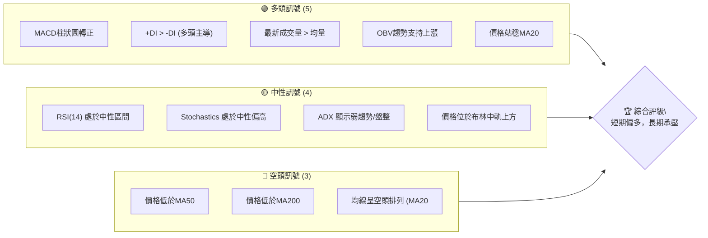

### 📊 核心指標速覽表

以下表格彙整PLTR當前的關鍵技術指標數值及其訊號解讀：

| 指標類別 | 指標名稱 | 當前數值 | 訊號 | 解讀 |
|----------|----------|----------|------|------|
| **價格** | 當前價格 | $129.30 | 🟡 | 位於52週區間的22.7%，接近底部反彈 |
| **均線** | MA20 | $125.97 | 🟢 | 價格位於MA20上方，短期趨勢轉強 |
| **均線** | MA50 | $134.58 | 🔴 | 價格位於MA50下方，中期壓力顯著 |
| **均線** | MA200 | $157.91 | 🔴 | 價格遠低於MA200，長期空頭趨勢 |
| **動能** | RSI(14) | 48.50 | 🟡 | 處於中性區間，從超賣區反彈 |
| **動能** | MACD Hist | +0.503 | 🟢 | MACD線金叉訊號線，動能轉多 |
| **趨勢** | ADX(14) | 20.54 | 🟡 | 趨勢強度弱，處於盤整或弱趨勢狀態 |
| **波動** | ATR(14) | $6.59 | 🟡 | 每日波動約5.10%，波動性中等 |
| **成交量** | 量比(20日) | 1.39x | 🟢 | 成交量顯著放大，支持價格上漲 |
| **量能** | OBV趨勢 | OBV > MA | 🟢 | 量能確認價格上升趨勢 |

### 🏆 技術評分卡

綜合各項技術指標分析，PLTR的技術評分如下：

```
╔══════════════════════════════════════════════════════════════╗
║              技術評分卡 — PLTR (2026-07-04)                  ║
╠══════════════════════════════════════════════════════════════╣
║ 趨勢強度      ████████░░░░░░░░░░░░  40/100  🟡 (ADX弱趨勢，均線空頭排列但短期反彈) ║
║ 動能指標      ████████████░░░░░░░░  60/100  🟢 (MACD金叉，RSI從超賣反彈)         ║
║ 支撐穩定度    ████████████░░░░░░░░  55/100  🟡 (短期MA20支撐，下方有重要底部區間) ║
║ 成交量配合    ██████████████░░░░░░  70/100  🟢 (量能放大，OBV支持上漲)           ║
║ 形態完整度    ████████░░░░░░░░░░░░  45/100  🟡 (潛在底部形態形成中，尚待確認)   ║
║ 均線排列      ██████░░░░░░░░░░░░░░  30/100  🔴 (空頭排列，壓力沉重)             ║
╠══════════════════════════════════════════════════════════════╣
║ 綜合評分      ██████████░░░░░░░░░░  50/100  ⚖️ 中性偏多                        ║
╚══════════════════════════════════════════════════════════════╝
```

**評級說明**：PLTR目前處於長期下降趨勢中的短期反彈階段。儘管短期動能指標顯示積極的買盤介入和量能支持，但中期和長期均線的空頭排列以及上方密集的阻力區間，使得其上漲空間可能受限。綜合來看，市場存在多空拉鋸，投資者需謹慎觀察。

---

## 2. 趨勢分析

本章將從多時框架角度深入剖析PLTR的股價趨勢，從長期宏觀視角到短期微觀動態，提供全面的趨勢判斷。

### 🌐 多時框趨勢分析

PLTR的趨勢分析顯示，雖然短期出現反彈動能，但整體市場結構仍受長期空頭趨勢影響。

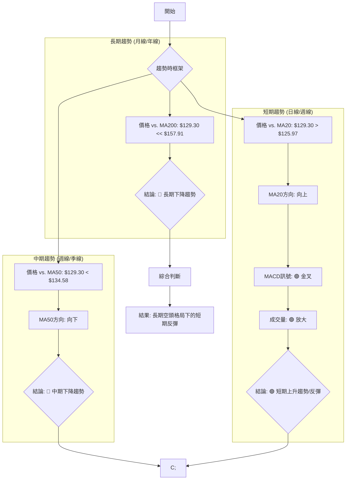

**分析詳情**：
*   **長期趨勢 (12個月以上)**：PLTR的股價目前遠低於MA200 ($157.91)，且MA200呈現下降趨勢，明確指示長期處於空頭格局。自2025年10月創下高點$200.47後，股價進入了顯著的下行通道。
*   **中期趨勢 (數週至數月)**：價格也低於MA50 ($134.58)，且MA50也呈下行趨勢。這表明在中期層面，空頭力量依然佔據主導地位。儘管近期有所反彈，但尚未能扭轉中期跌勢。
*   **短期趨勢 (數日/數週)**：值得注意的是，價格已站上MA20 ($125.97)，且MA20開始向上傾斜。MACD指標出現金叉，成交量也明顯放大，這些都是短期動能轉強的積極訊號，表明市場正在經歷一波有力的反彈。

### 📈 長期趨勢 — 12個月走勢圖（Unicode）

下圖展示了PLTR過去12個月的月線收盤價走勢，標示出關鍵高低點：

```
PLTR 月線走勢圖（過去12個月）
價格軸 ($)
$210 ┤                                   ●(200.47, 25-10)
$200 ┤                                 ╱
$190 ┤                            ●(182.42, 25-09)
$180 ┤                          ╱   ╲ ●(177.75, 25-12)
$170 ┤                      ╱         ╲ ●(168.45, 25-11)
$160 ┤●(158.35, 25-07)  ╱             ╲   ●(156.54, 26-05)
$150 ┤  ╲                 ●(146.59, 26-01)  ╱  ●(146.28, 26-03)
$140 ┤    ╲             ╱   ╲ ●(139.11, 26-04)
$130 ┤      ╲         ╱       ╲                     ●(129.30, 26-07)
$120 ┤        ╲     ╱           ╲                 ╱
$110 ┤          ●(116.67, 26-06)
     └────────────────────────────────────────────────────────────
      25-07  25-08  25-09  25-10  25-11  25-12  26-01  26-02  26-03  26-04  26-05  26-06  26-07
```

**走勢特徵分析表格**：

| 時期 | 起始價 | 結束價 | 漲跌幅 | 主要特徵 | 訊號 |
|------|--------|--------|--------|----------|------|
| 2025年7月-10月 | $158.35 | $200.47 | +26.6% | 強勁上升趨勢，創下近期新高 | 🟢 |
| 2025年11月-2026年2月 | $168.45 | $137.19 | -18.6% | 大幅回調，跌破關鍵支撐 | 🔴 |
| 2026年3月-5月 | $146.28 | $156.54 | +7.0% | 短暫反彈，未能突破前期高點 | 🟡 |
| 2026年6月 | $156.54 | $116.67 | -25.4% | 急速下跌，創12個月新低 | 🔴 |
| 2026年7月 | $116.67 | $129.30 | +10.8% | 從低點強勢反彈，買盤介入 | 🟢 |

### 📊 中期趨勢（週線分析）

從週線圖來看，PLTR在經歷2026年6月的急劇下跌後，於$112.93附近獲得支撐並開始反彈。儘管短期動能強勁，但股價仍處於MA50和MA200下方，暗示中期下行壓力依然存在。近期反彈的關鍵在於能否有效突破並站穩MA50 ($134.58)，這將是扭轉中期頹勢的重要訊號。

**近期壓力與支撐示意圖**：
```
PLTR 中期走勢示意圖
═══════════════════════════════════════════════════
$160 ║                                     (中期阻力:MA200)
$150 ║
$140 ║            █ (MA50: $134.58)  <-- 中期壓力
$130 ╠═══════════════════════════════════╣ ← 現價 ($129.30)
$120 ║          █ (MA20: $125.97)  <-- 短期支撐
$110 ║        █ (近期底部: $116.67) <-- 強勁支撐
═══════════════════════════════════════════════════
```

### ⚡ 趨勢強度評估（ADX 解讀）

ADX指標用於衡量趨勢的強度，而非方向。

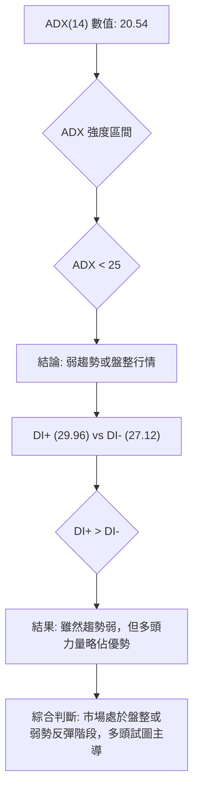

**ADX 強度對照表**：

| ADX 數值範圍 | 趨勢強度 | 市場解讀 |
|--------------|----------|----------|
| 0-25         | 弱趨勢/盤整 | 市場缺乏明確方向，多空拉鋸或等待訊號 |
| 25-50        | 中等趨勢 | 趨勢正在形成或持續，可尋找交易機會 |
| 50-75        | 強趨勢   | 趨勢明確且強勁，可順勢操作 |
| 75-100       | 極強趨勢 | 趨勢可能過熱，需警惕反轉風險 |

**PLTR ADX 分析**：當前ADX(14)為20.54，處於「弱趨勢/盤整」區間，這意味著市場缺乏一個強勁且明確的單邊趨勢。然而，+DI (29.96) 高於 -DI (27.12)，這表明在當前的弱勢市場中，多頭力量略微佔據主導地位，正在嘗試推動股價上漲。這與短期價格反彈的現象相符，但需注意這種主導地位的持續性可能不足以形成強趨勢。

---

## 3. 圖表形態分析

本章將分析PLTR的圖表形態，識別潛在的價格結構和K線組合，並據此推導可能的目標價。

### 🔍 形態識別系統

根據近期的價格走勢，PLTR可能正在形成一個底部反轉形態。

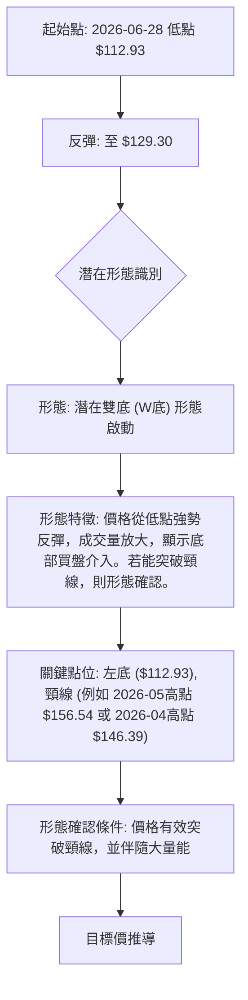

**形態分析**：
PLTR在2026年6月28日觸及週線低點$112.93後，隨即在2026年7月5日反彈至$129.30，顯示出強勁的底部買盤。這可能預示著一個潛在的「雙底（W底）」形態正在形成。第一個底部已經出現，目前正處於反彈階段，以形成第二個底部或直接挑戰頸線。此形態的確認需要觀察股價能否持續上漲並突破關鍵頸線位。

### 🕯️ 重要K線形態分析

根據近20週的週線收盤數據，我們可以觀察到以下K線形態特徵：

| 日期 | 收盤價 | K線形態 | 解讀 | 訊號 |
|------|--------|---------|------|------|
| 2026-06-21 | $128.47 | 較長下影線 | 價格下跌後買盤迅速介入，顯示下方支撐強勁 | 🟡 |
| 2026-06-28 | $112.93 | 大陰線 | 恐慌性拋售，跌至近期低點 | 🔴 |
| 2026-07-05 | $129.30 | 大陽線/看漲吞噬 | 從低點強力反彈，吞噬前一週跌幅，買盤強勁 | 🟢 |

**分析詳情**：
最近一週（2026-07-05）的價格從$112.93大幅上漲至$129.30，形成了一根強勁的陽線。如果考慮前一週（2026-06-28）的大陰線，這一週的走勢可能構成一個**看漲吞噬（Bullish Engulfing）**或**錘子線（Hammer）**形態，具體取決於開盤價。無論何種，這都表明在經歷了恐慌性拋售後，市場在低點找到了強大的買盤支撐，多頭力量開始佔據主導，是短期反轉的強烈訊號。

### 📉 ASCII 走勢形態示意圖

以下是PLTR潛在W底形態的示意圖：

```
PLTR 潛在 W底形態示意圖
═══════════════════════════════════════════════════
$160 ┤                                  (潛在頸線: $156.54)
$150 ┤
$140 ┤
$130 ┤            ╱╲                   ● 現價 ($129.30)
$120 ┤          ╱    ╲               ╱
$110 ┤─────────●───────●───────────
     └─低點1 ($112.93)  低點2 (可能在$116.67附近或更高)
```
**說明**：圖中顯示股價在$112.93附近觸底後反彈，如果後續能再次回踩但不跌破此低點（或更高點），並再次反彈突破頸線，則W底形態將被確認。

### 🎯 形態目標價計算

基於上述潛在W底形態的假設，我們可以進行目標價的初步計算。
*   **形態底部**：最低點約為 $112.93 (2026-06-28 週線收盤價)。
*   **潛在頸線**：我們可以將近期反彈的高點，例如2026年5月底的$156.54，視為一個潛在的頸線位。
*   **形態高度**：頸線價格 - 底部價格 = $156.54 - $112.93 = $43.61。
*   **目標價計算**：若形態確認突破頸線，則目標價約為 頸線價格 + 形態高度。
    *   **目標價 T1 (W底形態突破)** = $156.54 + $43.61 = $200.15。

**重要提示**：此目標價基於形態假設，需在股價有效突破頸線並伴隨大量能後方能確認。若形態未能成功形成或突破失敗，則此目標價無效。

---

## 4. 支撐與阻力

本章將詳細分析PLTR的關鍵支撐與阻力價位，這些價位是判斷股價未來走勢的重要參考。

### 🗺️ 關鍵價位分布圖（Unicode）

下圖展示了PLTR當前價格周圍的關鍵支撐與阻力區間：

```
PLTR 價位結構分布圖 (2026-07-04)
═══════════════════════════════════════════════════
$200.47 ║████████████████████████║ 強阻力 R4 (2025-10高點)
$182.42 ║████████████████████    ║ 阻力 R3 (2025-09高點)
$157.91 ║████████████████████████║ 強阻力 R2 (MA200 / 斐波那契50%)
$146.38 ║████████████████████    ║ 關鍵阻力 R1 (斐波那契38.2% / 2026-01高點)
$134.58 ║████████████████████████║ 中期阻力 R0 (MA50)
$129.30 ╠════════════════════════╣ ◄ 現價
$125.97 ║▓▓▓▓▓▓▓▓▓▓▓▓▓▓▓▓        ║ 近期支撐 S0 (MA20)
$116.67 ║████████████████████████║ 強支撐 S1 (2026-06月低點)
$112.93 ║████████████████████    ║ 關鍵支撐 S2 (近期週線低點)
$106.37 ║████████████████████████║ 極強支撐 S3 (52週低點)
═══════════════════════════════════════════════════
```

### 🚧 阻力位分析表

| 阻力級別 | 價位 | 形成原因 | 突破難度 | 重要性 |
|----------|------|----------|----------|--------|
| **R0**   | $134.58 | MA50 (50日移動平均線) | 中等偏高 | 🟢 | 突破此線有助於扭轉中期下降趨勢。 |
| **R1**   | $146.38 | 斐波那契38.2%回調位 / 2026-01高點 ($146.59) | 高 | 🟡 | 關鍵技術阻力，測試回調能否持續。 |
| **R2**   | $157.91 | MA200 (200日移動平均線) / 斐波那契50%回調位 ($156.70) | 極高 | 🔴 | 長期下降趨勢線，突破將是重大反轉訊號。 |
| **R3**   | $182.42 | 2025年9月高點 | 極高 | 🔴 | 歷史高點壓力，需要極大買盤才能突破。 |

### 🛡️ 支撐位分析表

| 支撐級別 | 價位 | 形成原因 | 守住機率 | 重要性 |
|----------|------|----------|----------|--------|
| **S0**   | $125.97 | MA20 (20日移動平均線) | 中等偏高 | 🟢 | 短期動態支撐，短期反彈的生命線。 |
| **S1**   | $116.67 | 2026年6月月線低點 | 高 | 🟢 | 近期重要底部，若跌破可能引發進一步下跌。 |
| **S2**   | $112.93 | 2026年6月28日週線低點 | 極高 | 🟢 | 潛在W底的第一個底部，極具參考價值。 |
| **S3**   | $106.37 | 52週低點 | 極高 | 🟢 | 極強心理與技術支撐，跌破將是災難性訊號。 |

### 📐 斐波那契回調位分析

我們以2025年10月的高點$200.47作為波段高點，2026年6月28日的週線低點$112.93作為波段低點，計算其斐波那契回調位，以評估反彈的潛在阻力。

*   **波段高點 (High)**: $200.47
*   **波段低點 (Low)**: $112.93
*   **波段範圍 (Range)**: $200.47 - $112.93 = $87.54

| 斐波那契水平 | 價位計算 | 具體價位 | 重要性 |
|--------------|----------|----------|--------|
| **23.6%**    | $112.93 + ($87.54 * 0.236) | $133.61 | 初步反彈阻力 |
| **38.2%**    | $112.93 + ($87.54 * 0.382) | $146.38 | 關鍵回調阻力，與R1重疊 |
| **50.0%**    | $112.93 + ($87.54 * 0.500) | $156.70 | 重要心理關口，與R2重疊 |
| **61.8%**    | $112.93 + ($87.54 * 0.618) | $167.05 | 強勁回調阻力 |

**斐波那契回調位視覺化**：
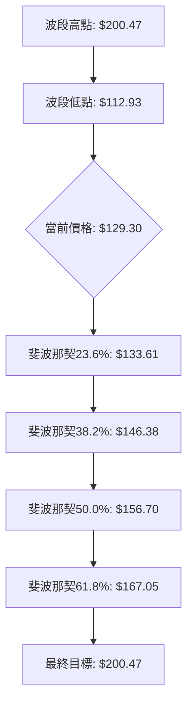
**分析結論**：當前股價$129.30位於斐波那契23.6%以下，表明反彈仍處於早期階段。上方$133.61 (23.6%)、$146.38 (38.2%)、$156.70 (50%)將構成重要阻力。其中$146.38與MA200 ($157.91) 和MA50 ($134.58) 附近的阻力位形成了重疊，使得這些區域成為反彈能否持續的關鍵考驗。

---

## 5. 技術指標深度解讀

本章將對PLTR的各項核心技術指標進行深入分析，探討其相互關係和對股價走勢的影響。

### 🎛️ 指標訊號總覽

以下Mermaid圖展示了各項技術指標的訊號及其相互關係：

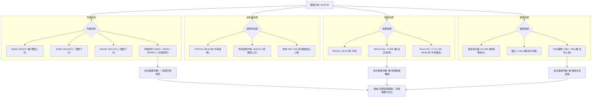

### 📈 移動平均線排列分析

PLTR的移動平均線（MA）系統顯示出明顯的空頭排列，但短期MA20已開始向上彎曲。

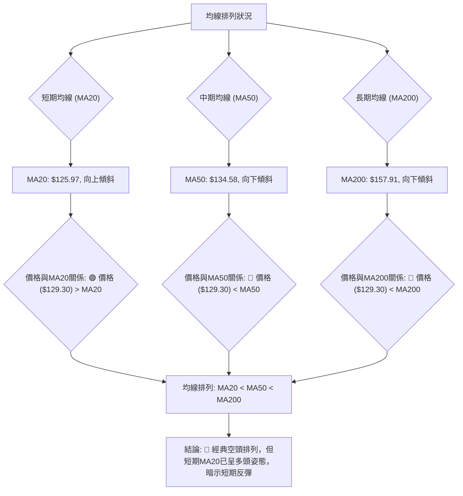
**分析詳情**：
目前PLTR的MA20 ($125.97) 低於MA50 ($134.58)，MA50又低於MA200 ($157.91)，形成了典型的「空頭排列」。這表明PLTR的股價在長期和中期層面仍處於下降趨勢中，上方存在沉重的壓力。然而，值得注意的是，當前股價已成功站上MA20，且MA20本身已開始向上彎曲，顯示短期內買盤力量正在積聚，試圖扭轉短期趨勢。若MA20能進一步上穿MA50，將形成「黃金交叉」，為中期趨勢的反轉提供初步訊號。

### 📉 RSI(14) 分析

相對強弱指標RSI(14)衡量股價的買賣力道。

*   **RSI 數值進度條**：
    RSI(14): 48.50  ▓▓▓▓▓▓▓▓▓▓░░░░░░░░░░  (48.5%)
    (超賣區 < 30, 超買區 > 70, 中性區 30-70)

*   **超買超賣區間分析**：
    PLTR的RSI(14)當前為48.50，位於中性區間 (30-70)。這表明股價既未處於超買狀態，也未處於超賣狀態。從近20週的數據來看，RSI在2026-06-21曾跌至23.7（超賣區），隨後反彈至目前的48.50。這顯示在股價跌至超賣區時，有資金入場抄底，推動RSI回升，是短期看漲的積極訊號。

*   **背離判斷**：
    根據提供的數據，**無明顯RSI頂背離或底背離現象**。股價在2026-06-28觸及$112.93的低點後，RSI也從超賣區快速反彈。這是一個正常的價格與動能同步的走勢。

### 📊 MACD(12/26/9) 訊號解讀

平滑異同移動平均線MACD是判斷趨勢和動能的重要指標。

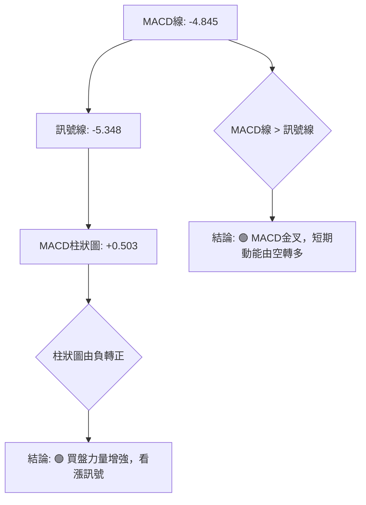
**分析詳情**：
PLTR的MACD線目前為-4.845，訊號線為-5.348。MACD線向上穿越訊號線，形成了**黃金交叉（Golden Cross）**，這是一個明確的看漲訊號。同時，MACD柱狀圖由負值轉為正值 (+0.503)，並開始向上延伸，進一步確認了短期動能從空頭轉向多頭，顯示買盤力量正在增強。這與近期股價的反彈和成交量的放大相互印證，是一個較為可靠的短期多頭訊號。

### 📦 布林通道分析

布林通道衡量股價的波動範圍和相對位置。

**ASCII 布林通道示意圖**：
```
PLTR 布林通道示意圖 (2026-07-04)
═══════════════════════════════════════════════════
$144.88 ║             (BB上軌)
$130.00 ║     ╱╲
$129.30 ╠═══════════════════════════════════╣ ← 現價
$125.97 ║   ╱    █ (BB中軌 / MA20)
$120.00 ║ ╱
$107.06 ║(BB下軌)
═══════════════════════════════════════════════════
```
**分析詳情**：
*   **BB上軌**：$144.88
*   **BB中軌 (MA20)**：$125.97
*   **BB下軌**：$107.06
*   **當前價格**：$129.30

PLTR的股價$129.30目前位於布林通道中軌 ($125.97) 之上，且正在向布林上軌運行。BB %B 為0.59，表明價格略高於中軌。這是一個短期看漲的訊號，表明價格正在嘗試向通道上方擴展。如果價格能夠突破上軌，則可能形成一波強勁的趨勢上漲行情。然而，若價格在中軌上方受阻，或未能有效突破上軌，則可能在中軌與上軌之間進行盤整。通道寬度（由ATR反映）中等，顯示波動性適中。

### 💹 成交量分析（量價配合度）

成交量是判斷價格趨勢有效性的重要依據。

*   **最新成交量**：60,789,400
*   **20日均量**：43,592,695
*   **50日均量**：43,557,424
*   **量比 (最新/20日均量)**：1.39x

**分析詳情**：
PLTR的最新成交量達60,789,400股，顯著高於其20日均量和50日均量，量比高達1.39倍。這是一個非常強勁的訊號，表明在近期股價反彈的過程中，市場交易活躍，有大量資金介入。成交量的放大，尤其是伴隨價格上漲，通常被視為趨勢有效性或反轉訊號的確認。

**OBV趨勢**：
OBV (On-Balance Volume) 趨勢顯示「OBV > MA」，這進一步確認了量能對價格上漲的支撐。當OBV線突破其移動平均線時，通常預示著累積性買盤的增加，並為價格上漲提供動能。這種量價配合的關係，強化了短期反彈的可靠性。

**結論**：成交量分析為PLTR的短期反彈提供了強有力的支持，顯示出健康的買盤活動和市場參與度。

---

## 6. 動能與波動率

本章將從動能和波動率兩個維度評估PLTR的市場表現，為交易決策提供更全面的視角。

### ⚡ 動能評估四象限

我們將PLTR的當前狀態放置在動能強度與波動率的四象限矩陣中進行分析。

| 象限 | 動能強度 | 波動率 | 當前狀態 | 評估 |
|------|----------|--------|----------|------|
| Q1 | 強       | 低     | -        | 最佳機會 (強勢股，穩定上漲) |
| Q2 | 弱       | 低     | -        | 謹慎觀望 (盤整或趨勢不明，波動小) |
| Q3 | 強       | 高     | -        | 高風險高收益 (趨勢強勁但波動大，適合短線操作) |
| **Q4** | **弱**   | **中** | **✓**    | **謹慎，可能處於趨勢轉折期** |

**PLTR 當前評估**：
*   **動能強度**：ADX為20.54，顯示為弱趨勢。然而，MACD金叉，RSI從超賣反彈，且成交量放大，這些短期指標顯示動能正在從弱轉強。綜合來看，目前的動能可評估為「中等偏弱」但「正在增強」。
*   **波動率**：ATR(14)為$6.59，佔股價的5.10%。這屬於中等波動水平，市場活躍但未達到極端波動。

**綜合結論**：PLTR目前正從「弱動能，中波動」的Q4象限向「強動能，中波動」的Q3象限過渡。這意味著股價正試圖擺脫盤整或弱勢下跌的局面，進入一個動能增強的階段。雖然當前趨勢強度尚未完全確認，但動能的積極變化值得關注。投資者應密切觀察趨勢能否進一步強化，以判斷其是否能穩定進入Q3象限。

### 📊 ATR 波動率分析

平均真實波幅 (ATR) 衡量資產價格在特定時間內的波動程度。

*   **ATR(14) 數值**：$6.59
*   **ATR佔股價比例**：5.10% ($6.59 / $129.30)

**分析詳情**：
PLTR的ATR(14)為$6.59，這表示在過去14天中，PLTR的平均每日波動範圍約為$6.59。相對於當前股價$129.30，ATR佔比約5.10%，這是一個中等偏高的波動水平。對於日交易者或短線操作者而言，這種波動性提供了足夠的交易機會。

**止損距離建議**：
ATR常用於設定止損點，以適應市場的自然波動。
*   **保守止損**：建議將止損設在進場點下方2倍ATR，即 $129.30 - (2 * $6.59) = $129.30 - $13.18 = $116.12。
*   **激進止損**：可設在進場點下方1倍ATR，即 $129.30 - $6.59 = $122.71。
這有助於避免因市場噪音而過早出場，同時控制潛在損失。

### 📐 Beta 與市場相關性

**Beta 數據未提供**。

**一般性分析**：
儘管未提供具體Beta數值，但Palantir Technologies作為一家科技基礎設施軟體公司，通常其股票會被歸類為成長股，且可能具有較高的Beta值。高Beta值意味著其股價波動性可能大於整體市場（例如S&P 500指數）。在牛市中，高Beta股可能漲幅更大；而在熊市中，跌幅也可能更深。投資者在考慮PLTR時，應預期其股價相對於大盤會有較大的波動性。

---

## 7. 多時框架總結

本章將整合前述分析，從不同時間框架總結PLTR的技術訊號，並提供綜合評分。

### 📋 時框架評分表

| 時框架 | 趨勢方向 | 動能 | 均線排列 | 形態 | 綜合評分 | 建議 |
|--------|----------|------|----------|------|----------|------|
| **長期** | 🔴 下降   | 🔴 弱勢 | 🔴 空頭排列 | 🔴 無明確底部形態 | 2/10     | 觀望/看空 |
| **中期** | 🔴 下降   | 🟡 觀望 | 🔴 空頭排列 | 🟡 底部形成中 | 4/10     | 謹慎觀望 |
| **短期** | 🟢 上升   | 🟢 強勁 | 🟢 價格站MA20 | 🟢 潛在反轉形態 | 7/10     | 偏多操作 |

**分析詳情**：
*   **長期**：PLTR的長期趨勢仍明確處於下降通道，價格遠低於MA200，均線呈現空頭排列，顯示長期缺乏上漲動能。在此框架下，建議保持觀望或偏空態度。
*   **中期**：中期趨勢也偏向下降，價格仍在MA50下方。儘管有短期反彈，但尚未形成中期反轉。潛在的底部形態仍在形成中，需要時間確認。
*   **短期**：短期內，PLTR展現出強勁的反彈動能。價格突破MA20，MACD金叉，成交量放大，且從超賣區反彈，這些都支持短期看漲。

### 🔲 綜合訊號矩陣

以下矩陣展示了不同時間框架下各項技術訊號的一致性：

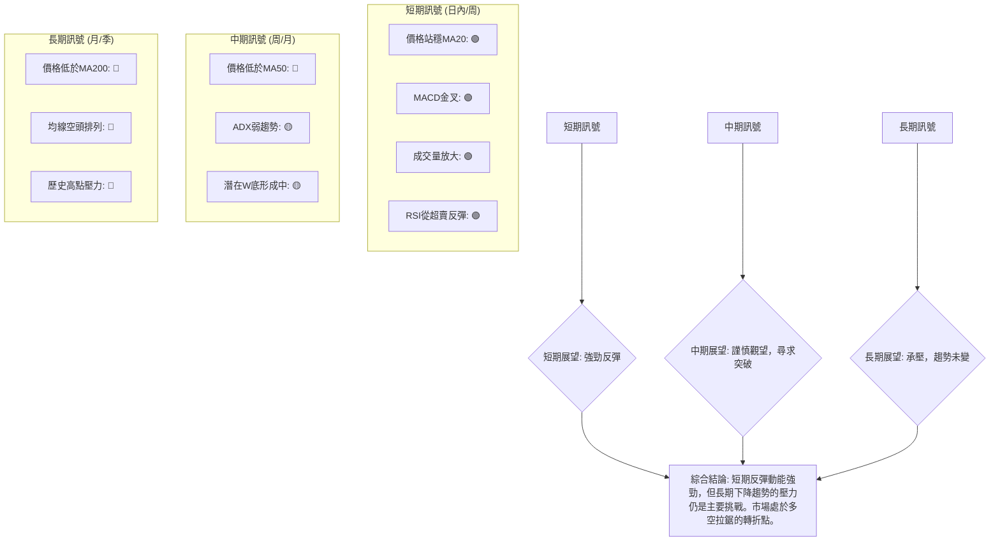
**一致性分析**：
短期訊號高度一致地指向多頭，反映出市場在經歷大幅下跌後，買盤力量的積極介入。然而，中期和長期訊號仍顯現出空頭主導的局面，價格距離關鍵的中長期移動平均線仍有距離。這種短多長空的格局表明，當前的反彈可能只是長期下降趨勢中的一個修正浪，除非能有效突破並站穩中期關鍵阻力（如MA50和斐波那契38.2%回調位），否則上漲空間可能受限。

---

## 8. 交易策略建議

本章將基於上述詳盡的技術分析，為PLTR提供具體的交易策略建議，包含多頭和空頭兩種情境。

### 🗺️ 策略決策流程圖

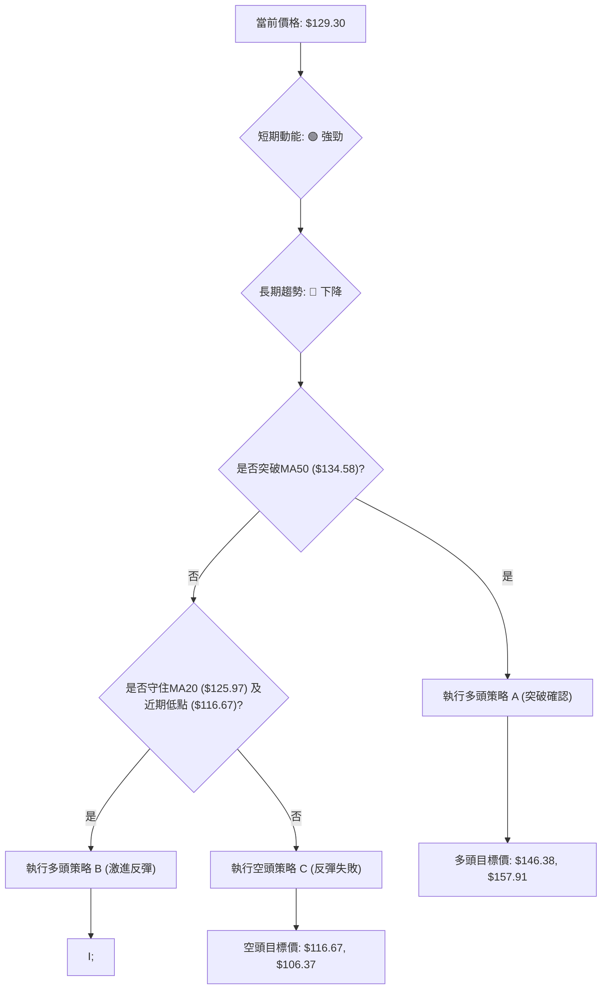

### 🟢 多頭策略詳情

考慮到PLTR目前短期動能強勁，MACD金叉，成交量放大，且價格站穩MA20，我們可以構建以下多頭策略。

| 策略要素 | 策略 A (激進反彈) | 策略 B (突破確認) |
|----------|--------------------|--------------------|
| 進場條件 | 價格站穩MA20 ($125.97) 並MACD持續發散 | 價格突破並站穩MA50 ($134.58) |
| 進場價格 | **$129.30 - $130.00** (當前價位附近) | **$135.00 - $136.00** (突破MA50後確認) |
| 目標價 T1 | **$134.58** (MA50) | **$146.38** (斐波那契38.2% / R1) |
| 目標價 T2 | **$146.38** (斐波那契38.2% / R1) | **$157.91** (MA200 / R2) |
| 止損價格 | **$125.97** (MA20下方) | **$132.00** (MA50下方約2 ATR) |
| 風險報酬比 | T1: **1.58:1** (5.28 / 3.33) <br> T2: **5.13:1** (17.08 / 3.33) | T1: **3.11:1** (10.88 / 3.50) <br> T2: **6.40:1** (22.41 / 3.50) |
| 成功機率 | **60%** (短期動能強勁，但上方阻力大) | **55%** (需要有效突破關鍵中期阻力) |
| 建議倉位 | **15%** | **10%** |

**策略說明**：
*   **策略 A (激進反彈)**：適用於相信短期反彈將持續的投資者。在MA20提供支撐的情況下進場，目標是挑戰MA50及斐波那契回調位。止損設在MA20下方，以防反彈失敗。
*   **策略 B (突破確認)**：較為保守但更穩健的策略。等待股價突破中期關鍵阻力MA50，確認中期趨勢有轉好的跡象後再進場，目標挑戰更高的斐波那契回調位和MA200。止損設在MA50下方，確保突破有效性。

### 🔴 空頭策略詳情

儘管短期動能偏多，但PLTR的長期趨勢仍為空頭。若短期反彈動能衰竭或關鍵支撐被跌破，空頭策略將變得可行。

| 策略要素 | 策略 C (反彈失敗) |
|----------|--------------------|
| 進場條件 | 價格跌破MA20 ($125.97) 且MACD死叉 |
| 進場價格 | **$125.00** (跌破MA20後確認) |
| 目標價 T1 | **$116.67** (2026-06月低點 / S1) |
| 目標價 T2 | **$106.37** (52週低點 / S3) |
| 止損價格 | **$129.30** (現價上方) |
| 風險報酬比 | T1: **1.94:1** (8.33 / 4.30) <br> T2: **4.33:1** (18.63 / 4.30) |
| 成功機率 | **45%** (短期買盤活躍，反彈可能持續) |
| 建議倉位 | **10%** |

**策略說明**：
*   **策略 C (反彈失敗)**：適用於認為當前反彈只是長期下降趨勢中的一次修正，且可能很快結束的投資者。在股價跌破短期關鍵支撐MA20時進場，目標是測試近期底部甚至52週低點。止損設在現價上方，控制反彈再起的風險。

### ⭐ 整體訊號強度評星

```
做多訊號強度：★★★☆☆  (3/5星)
  - 短期動能強勁，MACD金叉，量能支持。但上方阻力密集，長期趨勢仍空。
做空訊號強度：★★☆☆☆  (2/5星)
  - 長期趨勢向下，均線空頭排列。但短期買盤活躍，反彈動能強勁，不宜盲目做空。
整體可信度：  ★★★☆☆  (3/5星)
  - 市場處於多空拉鋸的轉折點，短期反彈與長期下降趨勢交織，需謹慎選擇策略並嚴格止損。
```

---

## 9. 風險提示與監控

本章將詳細闡述PLTR投資面臨的潛在風險，並提供關鍵監控指標與風險管理建議。

### ✅ 關鍵監控指標 Checklist

以下是交易PLTR時需要密切關注的關鍵技術指標清單，建議每日或每週進行檢查：

```
╔══════════════════════════════════════════════════════════════╗
║              PLTR 關鍵監控指標 Checklist                     ║
╠══════════════════════════════════════════════════════════════╣
║ [ ] 價格是否持續站穩MA20 ($125.97)？                          ║
║ [ ] MACD柱狀圖是否持續為正並擴大？                            ║
║ [ ] 成交量是否持續保持高位，支持價格上漲？                    ║
║ [ ] RSI(14)是否突破50並向超買區運行？                         ║
║ [ ] ADX(14)是否開始上升並突破25，確認新趨勢形成？             ║
║ [ ] 價格能否有效突破MA50 ($134.58) 及斐波那契38.2% ($146.38)？║
║ [ ] 是否出現任何看空K線形態（如烏雲蓋頂、吞噬形態）？         ║
║ [ ] 留意市場整體情緒及科技板塊的資金流向。                    ║
╚══════════════════════════════════════════════════════════════╝
```

### ⚠️ 風險場景分析

PLTR的未來走勢存在多種可能性，以下分析樂觀、基本和悲觀三種情境：

```mermaid
graph TD
    A["當前狀態: 短期反彈，長期空頭"] --> B{"市場發展情境"};

    subgraph 🟢 樂觀情境
        B --> L1["價格突破MA50 ($134.58) 和R1 ($146.38)"];
        L1 --> L2["量能持續放大，MACD維持強勢"];
        L2 --> L3["形成W底形態，突破頸線 ($156.54)"];
        L3 --> L4["結論: 股價加速上行至MA200 ($157.91)，甚至挑戰歷史高點附近，扭轉中期趨勢"];
    end

    subgraph 🟡 基本情境
        B --> M1["價格在MA20 ($125.97) 和MA50 ($134.58) 之間盤整"];
        M1 --> M2["短期動能耗盡，成交量萎縮"];
        M2 --> M3["無法有效突破中期阻力，也未跌破短期支撐"];
        M3 --> M4["結論: 股價維持區間震盪，等待新的催化劑或方向選擇"];
    end

    subgraph 🔴 悲觀情境
        B --> D1["價格跌破MA20 ($125.97)"];
        D1 --> D2["MACD死叉，成交量放大下跌"];
        D2 --> D3["跌破近期低點 ($116.67) 和52週低點 ($106.37)"];
        D3 --> D4["結論: 股價繼續探底，長期下降趨勢加速，可能創下新低"];
    end
```

### 🛡️ 風險管理重要提醒

1.  **嚴格執行止損**：無論採取何種策略，都必須設定並嚴格執行止損點。PLTR的波動性中等偏高 (ATR 5.10%)，若未能及時止損，可能造成較大損失。
2.  **倉位管理**：鑑於PLTR目前趨勢不明朗（短多長空），建議採取較小的倉位進行試探性操作，避免重倉。隨著趨勢的明朗化再逐步調整倉位。
3.  **分批建倉/減倉**：可以採用分批建倉的方式，在不同支撐位附近逐步買入，或在不同阻力位附近分批減倉，以降低單一價格點的風險。
4.  **關注基本面與新聞**：雖然本報告專注於技術分析，但基本面變化（如財報、新合同、行業政策）和突發新聞可能迅速改變技術走勢，需綜合考量。
5.  **警惕假突破/假跌破**：在關鍵支撐阻力位附近，價格可能出現假突破或假跌破。建議等待K線收盤確認，並結合成交量判斷突破的有效性。

---

## 📋 報告總結

```
╔════════════════════════════════════════════════════════════════╗
║                   PLTR 技術分析報告總結                        ║
╠════════════════════════════════════════════════════════════════╣
║ 報告日期：2026-07-04                                           ║
║ 當前價格：$129.30                                              ║
║ 分析評級：⚖️ 中性偏多 (短期動能強勁，但長期趨勢仍空頭，存在較大阻力) ║
╠════════════════════════════════════════════════════════════════╣
║ 關鍵結論：                                                     ║
║ ├─ 長期趨勢：🔴 下降趨勢 (價格遠低於MA200，均線空頭排列)        ║
║ ├─ 中期趨勢：🔴 下降趨勢 (價格低於MA50，中期壓力顯著)           ║
║ ├─ 短期趨勢：🟢 上升趨勢 (價格高於MA20，MACD金叉，量能配合良好) ║
║ ├─ 關鍵支撐：$125.97 (MA20), $116.67 (近期低點), $106.37 (52週低點)║
║ ├─ 關鍵阻力：$134.58 (MA50), $146.38 (斐波那契38.2%), $157.91 (MA200)║
║ └─ 分析師目標：$183.12 (市場普遍預期仍有較大上漲空間)          ║
╠════════════════════════════════════════════════════════════════╣
║ 最優策略組合：                                                 ║
║ 1. 🥇 最佳機會：等待價格有效突破MA50 ($134.58) 並確認站穩後，順勢做多，以斐波那契回調位為目標。 ║
║ 2. 🥈 次選機會：在MA20 ($125.97) 附近獲得支撐時，短期做多，並嚴格止損在MA20下方。               ║
║ 3. 🥉 保守選擇：觀望，等待長期趨勢轉變或更明確的底部形態形成，避免在趨勢不明朗時過度操作。        ║
╚════════════════════════════════════════════════════════════════╝
```

---

> ⚠️ **免責聲明**：本報告為 AI 自動生成之技術分析，所有數據及估算均基於提供的歷史價格資訊。本報告**僅供研究與學術參考**，**不構成任何投資建議**。投資有風險，入市需謹慎。

---

*報告生成時間：2026-07-04 ｜ 數據來源：提供數據 ｜ 分析框架：多時框技術分析*