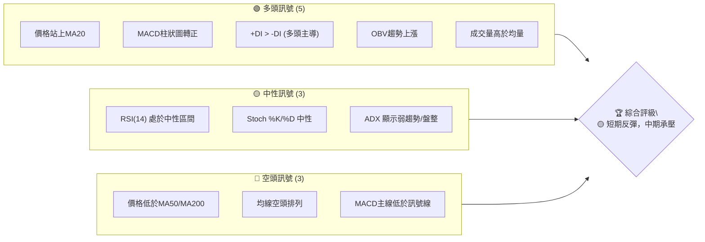
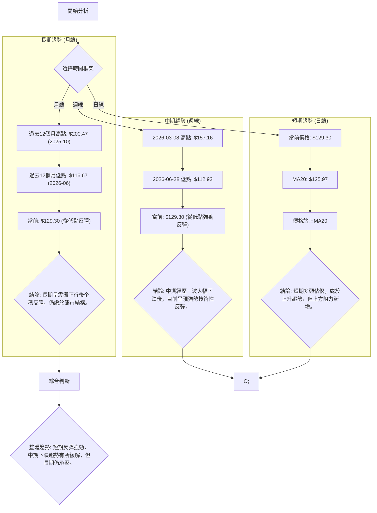
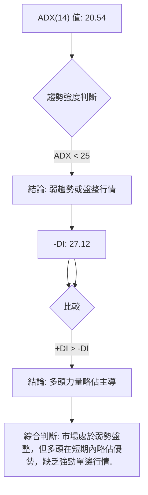
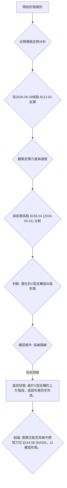
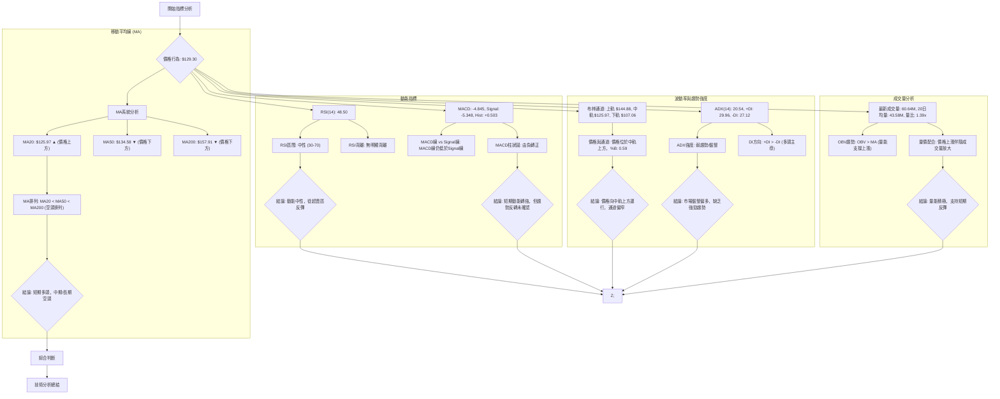
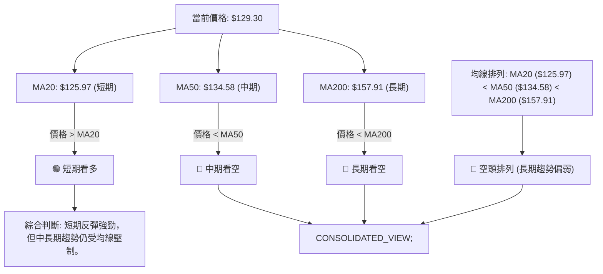
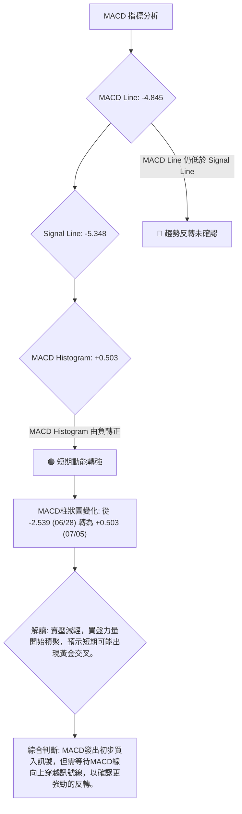
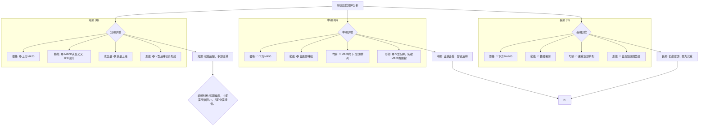
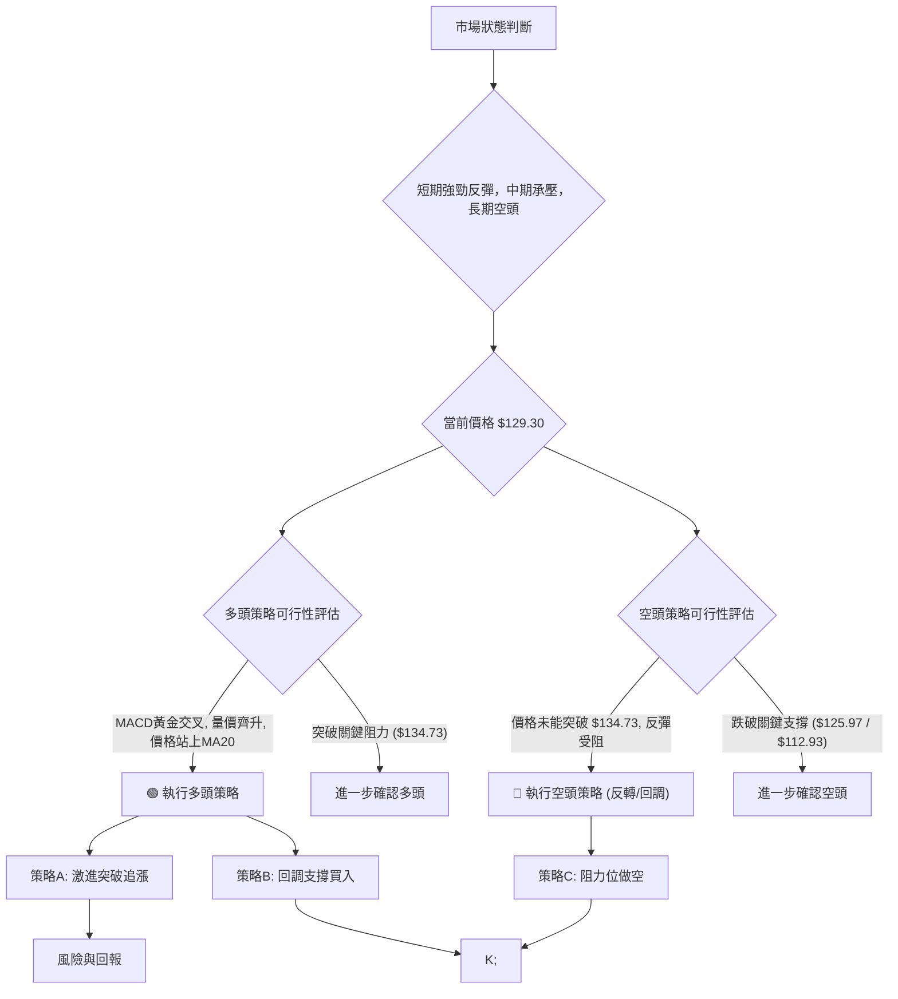
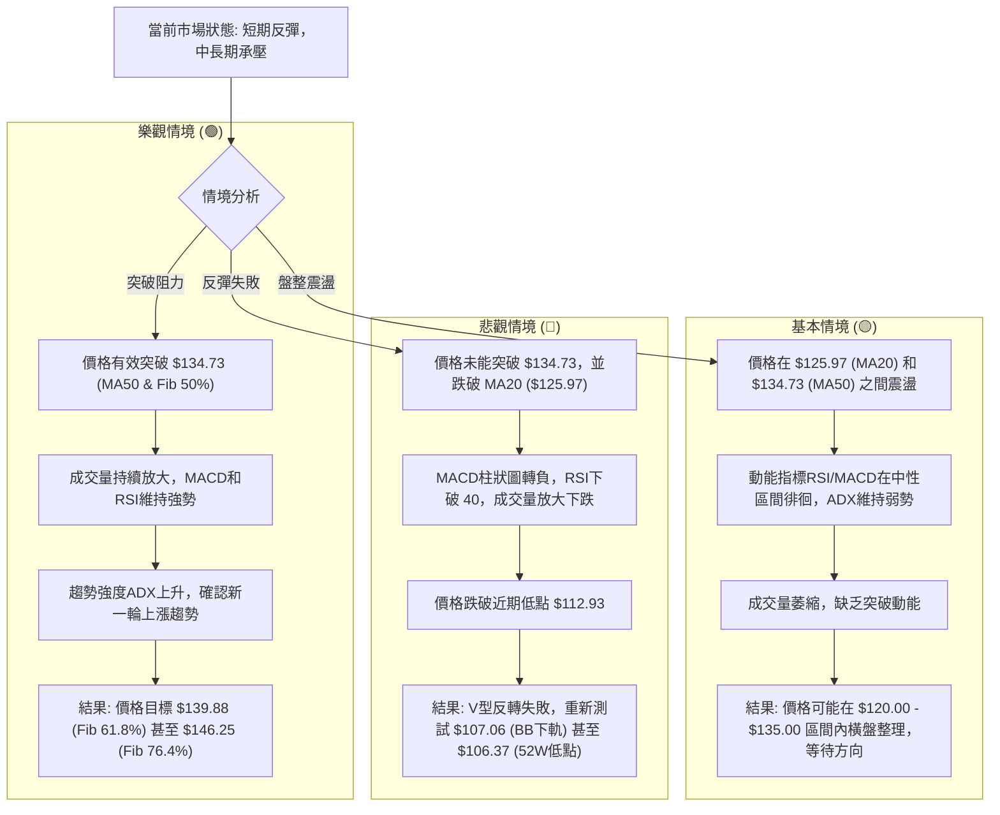

<details>
<summary>📊 靜態圖表 (點擊展開)</summary>

</details>

<html>
<head><meta charset="utf-8" /></head>
<body>
    <div style="height:500px; width:100%;">                        <script>window.PlotlyConfig = {MathJaxConfig: 'local'};</script>
        <script charset="utf-8" src="https://cdn.plot.ly/plotly-3.6.0.min.js" integrity="sha256-QaOVwtVY0T02VaHrr6pnoHLCwayMJp4O5n4YyaE3rJk=" crossorigin="anonymous"></script>                <div id="candlestick-chart" class="plotly-graph-div" style="height:100%; width:100%;"></div>            <script>                window.PLOTLYENV=window.PLOTLYENV || {};                                if (document.getElementById("candlestick-chart")) {                    Plotly.newPlot(                        "candlestick-chart",                        [{"close":{"dtype":"f8","bdata":"AAAA4FFIZUAAAABgjwplQAAAAEAKH2ZAAAAA4HrMZkAAAABgj2pmQAAAAKCZ0WZAAAAAgOtxZkAAAAAA12NmQAAAAIA9MmZAAAAAIIVbZkAAAACgcM1mQAAAAGBmHmdAAAAAoJlhZ0AAAACAPaJlQAAAAMD1cGZAAAAAoHDFZkAAAACA6\u002fFmQAAAAEAKL2dAAAAAgBTuZUAAAABguCZmQAAAACCud2ZAAAAAANdzZkAAAAAA10NmQAAAAMDMRGZAAAAAQOGyZkAAAADgUbBmQAAAACCu72VAAAAAIFyPZkAAAAAAKRRnQAAAAIDCpWdAAAAAQDOzZ0AAAACA69loQAAAAKCZUWhAAAAAQAoPaUAAAACAwuVpQAAAACCu12dAAAAAwMx8Z0AAAACgmeFlQAAAAIDCPWZAAAAAIIUzaEAAAABguN5nQAAAAKBwBWdAAAAA4HqEZUAAAADgUcBlQAAAAAAAaGVAAAAAYI\u002fqZEAAAACgcK1kQAAAAADXd2NAAAAAQDNbY0AAAAAAAEhkQAAAAKCZcWRAAAAA4KO4ZEAAAABgZg5lQAAAACCu72RAAAAAgBRWZUAAAABgjwJmQAAAAKBwPWZAAAAA4FG4ZkAAAAAgrq9mQAAAAEDhumZAAAAAwB59Z0AAAACgR3FnQAAAAIA98mZAAAAAAADoZkAAAAAAAHhnQAAAAKBHKWZAAAAAgBQ2Z0AAAAAAKSxoQAAAACBcP2hAAAAAAClEaEAAAACgcEVoQAAAAGC4lmdAAAAAgMIFZ0AAAABA4ZpmQAAAAAAAOGZAAAAAIIX7ZEAAAACgR8FlQAAAAGC4dmZAAAAAgMK1ZkAAAAAghRtmQAAAACCuL2ZAAAAAwB5tZkAAAABguF5mQAAAAMDMTGZAAAAAgD0iZkAAAABguF5lQAAAAMD1EGVAAAAAYI+qZEAAAADAzLxkQAAAAEAzM2VAAAAAQArvZEAAAABgZrZkQAAAAEAzq2NAAAAAIIX7YkAAAABA4VJiQAAAAOBReGJAAAAAACm8Y0AAAACgR3FhQAAAAOBRQGBAAAAAwMz8YEAAAADAHt1hQAAAAOBRcGFAAAAAgML1YEAAAAAAKSRgQAAAAMAebWBAAAAA4KOgYEAAAAAAKexgQAAAAOB63GBAAAAAIK7nYEAAAABAM1NgQAAAAEDhGmBAAAAAgBTGYEAAAACAFP5gQAAAAIAUJmFAAAAAoHAlYkAAAABACmdiQAAAAIAUJmNAAAAAoHAVY0AAAADAHqVjQAAAAIDCjWNAAAAA4HrkYkAAAABAM\u002fNiQAAAAAAAMGNAAAAAYGbeYkAAAABAChdjQAAAAGCPYmNAAAAA4KMYY0AAAACAwnVjQAAAAIDC1WJAAAAAQOEaZEAAAADA9VhjQAAAAGC4XmNAAAAAgOtxYkAAAACA6+FhQAAAAKCZMWFAAAAAwPVIYkAAAAAgrk9iQAAAAGC4jmJAAAAAgMJ9YkAAAACAPcJiQAAAAOBRmGFAAAAAIK5PYEAAAACA6wFgQAAAAADXi2BAAAAAYGb2YEAAAADAzMRhQAAAAOBR2GFAAAAA4HpMYkAAAADgejxiQAAAAEAKP2JAAAAAANcTY0AAAACAPbJhQAAAAEDh4mFAAAAAQDPjYUAAAACAwqVhQAAAAEAKP2FAAAAAIIVjYUAAAACAPQJiQAAAAMD1QGJAAAAAwB79YEAAAACgR7lgQAAAAKCZIWFAAAAAoJk5YUAAAADgehxhQAAAAAAAAGFAAAAAoJlBYEAAAAAgXLdgQAAAACCuv2BAAAAA4HrkYEAAAADgUehgQAAAAMDMJGFAAAAAoEctYUAAAAAAKRxhQAAAAEAzE2FAAAAA4FGQYEAAAABA4ephQAAAAKBHkWNAAAAAwMwUZEAAAACgcAVjQAAAAGBmxmFAAAAAYGa2YUAAAADA9fBgQAAAAEAKD2FAAAAAgD2CYEAAAABguEZgQAAAAGCPYmBAAAAAIFz\u002fX0AAAABguNZgQAAAAAAAqGBAAAAAAClUYEAAAABACg9gQAAAAAAA4F1AAAAAwMwsXUAAAAAAAGBcQAAAAKBH0VpAAAAAIIU7XEAAAADAzOxcQAAAAEDhKl1AAAAAYLhuX0AAAACgmSlgQA=="},"high":{"dtype":"f8","bdata":"AAAAgOtpZUAAAACAwjVlQAAAAKCZWWZAAAAAoHANZ0AAAAAAAMhmQAAAAAAAOGdAAAAAQDMbZ0AAAACAPQpnQAAAAADXg2ZAAAAAIFyvZkAAAADgo9hmQAAAAMD1SGdAAAAAYGaGZ0AAAABA4VpnQAAAAGBm3mZAAAAAgMJFZ0AAAADgUQhnQAAAAADXc2dAAAAAQDNjZ0AAAABACmdmQAAAAEDhymZAAAAAQDMLZ0AAAACAPRpnQAAAAEDhsmZAAAAAQOHiZkAAAADAcsxmQAAAAGC4xmZAAAAAgOuxZkAAAACgcEVnQAAAAGCPGmhAAAAAwPX4Z0AAAABAM\u002ftoQAAAAKBw9WhAAAAAgMKFaUAAAADgo\u002fBpQAAAAGBmdmhAAAAAgD3KZ0AAAABA4eJnQAAAAGBmVmZAAAAAgMJdaEAAAACgmR1oQAAAAGCP0mdAAAAAYGbWZkAAAACgRylmQAAAACCux2VAAAAAYI+aZUAAAABAMzNlQAAAAIA90mVAAAAAIIXDY0AAAACgcKVkQAAAAMDMlGRAAAAAINkKZUAAAACgmRllQAAAAEAzI2VAAAAAAAD4ZUAAAADAHj1mQAAAAIAUTmZAAAAAYOXEZkAAAAAAKfxmQAAAAEAz22ZAAAAA4HrMZ0AAAACgmYFnQAAAAMDMUGdAAAAAwPV4Z0AAAAAAAJBnQAAAAAAAeGdAAAAAYI9qZ0AAAAAAAGBoQAAAAAAp3GhAAAAAANdraEAAAACgcGVoQAAAAEAzi2hAAAAAYGZmZ0AAAAAAVBdnQAAAAMD1sGZAAAAAQDOrZkAAAACAPfplQAAAAIAUhmZAAAAAwPVoZ0AAAADAHjVnQAAAAEAKV2ZAAAAAAADQZkAAAABAM6NmQAAAAOAis2ZAAAAAQDOTZkAAAACAws1mQAAAAEAKf2VAAAAAIK4vZUAAAAAAACBlQAAAAAAAgGVAAAAAQOFSZUAAAACAFC5lQAAAAKBwoWRAAAAAACm0Y0AAAAAAAOBiQAAAAMDM7GJAAAAAAH+iZEAAAABAM3tjQAAAACBcP2FAAAAA4Ps1YUAAAAAA1ztiQAAAAIDrMWJAAAAAAABoYUAAAADgevxgQAAAAIDrsWBAAAAAgD3KYEAAAADg0J5hQAAAAMAeBWFAAAAAYLgGYUAAAACgR4FgQAAAACCuR2BAAAAAQOECYUAAAADgUTBhQAAAAEAzQ2FAAAAA4HpkYkAAAAAAAHBiQAAAAOCjUGNAAAAAACmMY0AAAABgZi5kQAAAAIAUzmNAAAAAIAaVY0AAAACAaCVjQAAAAAApfGNAAAAAgOtRY0AAAAAghTtjQAAAAAAAmGNAAAAAgBSWY0AAAADAzIRjQAAAAMDMlGNAAAAAYI8iZEAAAADAzExkQAAAAOCjCGRAAAAAANcjY0AAAABguD5iQAAAAADXA2JAAAAAIIV7YkAAAACgmYliQAAAAOBRkGJAAAAAIIXTYkAAAADgo8hiQAAAAMD1iGNAAAAAoEdxYUAAAABgZiZgQAAAAKBwzWBAAAAAgD1CYUAAAABgj9JhQAAAAKCZMWJAAAAAwPWIYkAAAABgZmZiQAAAAADXu2JAAAAAgMIVY0AAAACgR8liQAAAAGCP6mFAAAAAgD0iYkAAAABAM\u002fthQAAAAOBReGFAAAAAYGaGYUAAAACAFE5iQAAAAOB6tGJAAAAAIFzfYUAAAABgZvZgQAAAAGBmnmFAAAAAACk8YUAAAADgeiRhQAAAAIDCLWFAAAAAIK4fYUAAAAAgXM9gQAAAAOB69GBAAAAAgOv9YEAAAABACi9hQAAAACCuJ2FAAAAAoJlRYUAAAADgo2BhQAAAAIDCVWFAAAAAIFz3YEAAAAAAACBiQAAAAKDtuGNAAAAAYGZ2ZEAAAACgmfFjQAAAAIDC9WJAAAAAANdLYkAAAABACr9hQAAAAOBROGFAAAAAIK4fYUAAAACA66VgQAAAAOCjcGBAAAAAQOFiYEAAAAAgXN9gQAAAAEDh0mBAAAAAQDMDYUAAAACAwm1gQAAAAADXG2BAAAAAACk8XkAAAAAAAIBdQAAAAKCZCVxAAAAAwB6FXEAAAADAHsVdQAAAAMDMrF1AAAAAAAAIYEAAAAAAKZxgQA=="},"hovertemplate":"\u003cb\u003e%{x|%Y-%m-%d}\u003c\u002fb\u003e\u003cbr\u003e\u958b: $%{open:.2f}\u003cbr\u003e\u9ad8: $%{high:.2f}\u003cbr\u003e\u4f4e: $%{low:.2f}\u003cbr\u003e\u6536: $%{close:.2f}\u003cextra\u003e\u003c\u002fextra\u003e","low":{"dtype":"f8","bdata":"AAAAYLgeZUAAAADgoyhkQAAAAOB6LGVAAAAAYLgWZkAAAACgR0lmQAAAAOBRIGZAAAAAANcjZkAAAACgR8llQAAAAMAe3WVAAAAAwB4lZkAAAABACkdmQAAAAAAAcGZAAAAAYGbeZkAAAADgo1hlQAAAAGCPOmZAAAAAoHBtZkAAAABgZqZmQAAAAGBmfmZAAAAAwPWwZUAAAABgZq5lQAAAAIA9WmVAAAAA4KMAZkAAAABgZg5mQAAAAGBmvmVAAAAAgBQuZkAAAADAzFRmQAAAAKBwLWVAAAAA4FHgZUAAAABAM9tmQAAAAOCjcGdAAAAAwPVYZ0AAAAAgrs9nQAAAAADXQ2hAAAAAoHC9aEAAAACAPTppQAAAAIDrMWdAAAAAYLimZkAAAADA9dBlQAAAAMAeHWVAAAAA4KPwZkAAAAAAKWRnQAAAAMDMjGZAAAAAYGRXZUAAAAAAAJBkQAAAAIDC9WRAAAAAAACwZEAAAACgcE1kQAAAAOCjTGNAAAAAgOtxYkAAAAAAAKBjQAAAAIDCkWNAAAAAACl8ZEAAAAAAALxkQAAAAADXY2RAAAAAQOEyZUAAAABgjxplQAAAAIDCzWVAAAAAwB4lZkAAAACgR3FmQAAAAAApjGZAAAAAAADYZkAAAABguIZmQAAAACBYNWZAAAAAwPWAZkAAAABAi6RmQAAAAAAAEGZAAAAA4FGwZkAAAAAgXFdnQAAAAIDCDWhAAAAAIIX3Z0AAAABgjxpoQAAAAADXk2dAAAAA4Hr0ZkAAAABgZpZmQAAAAAAAKGZAAAAAQDPLZEAAAACgR3llQAAAAOCj2GVAAAAAwB41ZkAAAAAA18tlQAAAAAAA2GVAAAAAQOEKZkAAAADgegRmQAAAAGBmvmVAAAAAwPUQZkAAAADgUUBlQAAAACCux2RAAAAAIIUjZEAAAABgZp5kQAAAAKCZyWRAAAAAYGbqZEAAAACAFJZkQAAAACCup2NAAAAAANdjYkAAAADAciRiQAAAAKDtVGJAAAAAANcjY0AAAACAwvVgQAAAAIA9CmBAAAAAQDOLYEAAAAAA1dhgQAAAAOCjOGFAAAAAYGaeYEAAAAAA16NfQAAAAIDpjl9AAAAAYI\u002fSX0AAAAAA19tgQAAAAOBRYGBAAAAAoHBlYEAAAADA9dhfQAAAACCul19AAAAAgMIlYEAAAAAAKZRgQAAAACBcv2BAAAAA4KOQYUAAAABgZkZhQAAAAIDrgWJAAAAAIIWzYkAAAACgR8liQAAAAEAKH2NAAAAA4HrEYkAAAABgj6piQAAAACBc32JAAAAAYI+SYkAAAACgcOViQAAAAADXA2NAAAAAIIUTY0AAAAAAANBiQAAAAEDhomJAAAAAIK4nY0AAAADgevRiQAAAACBcW2NAAAAAAABoYkAAAACA67FhQAAAAKCZCWFAAAAAQApfYUAAAABACg9iQAAAACCuP2FAAAAAIDFUYkAAAABgZg5iQAAAAKBwZWFAAAAAQAoPYEAAAAAghateQAAAAMDMJGBAAAAAAADAYEAAAACAwt1gQAAAAMD1cGFAAAAAoJnpYUAAAABgj\u002fphQAAAAMD3\u002f2FAAAAAwB5tYkAAAACgcH1hQAAAAIDCXWFAAAAA4FGgYUAAAACgcI1hQAAAAIDC1WBAAAAAwMwUYUAAAADgeqxhQAAAAEAzJ2JAAAAAQArXYEAAAADAzGRgQAAAAMD12GBAAAAA4KOgYEAAAAAArJhgQAAAAGC4rmBAAAAAAAAYYEAAAABgZi5gQAAAAKBHiWBAAAAAYI9qYEAAAABAM7NgQAAAAKBwjWBAAAAAoHDtYEAAAACgmclgQAAAAKCZqWBAAAAAACl0YEAAAAAAAKBgQAAAAKBHOWJAAAAAACl8Y0AAAACgmbliQAAAAAAAqGFAAAAAQLSIYUAAAADAzMBgQAAAAMD16GBAAAAAYGbWX0AAAACgmRlgQAAAAEDhyl9AAAAAoJmpX0AAAABgZjZgQAAAAADXM2BAAAAAoHA9YEAAAADgo0BfQAAAAMDMzF1AAAAAIIULXUAAAAAAABBcQAAAACCul1pAAAAAgBQeW0AAAADAzKxcQAAAAOB6pFxAAAAAYGbWXUAAAADAzPxfQA=="},"name":"\u50f9\u683c","open":{"dtype":"f8","bdata":"AAAAoEdhZUAAAADgoyBlQAAAAOCjSGVAAAAAgD0iZkAAAAAAKZxmQAAAAOBR0GZAAAAAwB79ZkAAAACgmfllQAAAAKCZYWZAAAAA4Hp0ZkAAAAAgXF9mQAAAAIA9qmZAAAAAYGZWZ0AAAADAzExnQAAAAIDCZWZAAAAAgOuJZkAAAACgmdlmQAAAAGCP8mZAAAAAoHAlZ0AAAACAwlVmQAAAAAAAAGZAAAAAwPW0ZkAAAADA9bhmQAAAAAAAOGZAAAAAIK5vZkAAAACA68FmQAAAAIDCvWZAAAAAgD3uZUAAAAAAKdxmQAAAAEAKn2dAAAAAIFyvZ0AAAABgj+JnQAAAAKCZzWhAAAAAYGbmaEAAAACgcKFpQAAAAIA9AmhAAAAAAACgZ0AAAAAgrn9nQAAAAMDMpGVAAAAAgOsJZ0AAAABguMpnQAAAAGCP0mdAAAAAQOG2ZkAAAABAM99kQAAAAMD1UGVAAAAAANcLZUAAAACgmflkQAAAAIA9gmVAAAAA4FGAY0AAAABACq9jQAAAAIA9AmRAAAAAQDPbZEAAAADgUfhkQAAAAAAAoGRAAAAAQOEyZUAAAADgekRlQAAAACCuC2ZAAAAAIFxHZkAAAABguMZmQAAAAEAKn2ZAAAAAYGYeZ0AAAACgmRlnQAAAAIDrOWdAAAAAYI8iZ0AAAADA9bRmQAAAAEDhdmdAAAAA4FGwZkAAAAAgrldnQAAAAKBHYWhAAAAAYGYaaEAAAADAHiVoQAAAAOB6YGhAAAAAQDNbZ0AAAABAMwtnQAAAAAAppGZAAAAAoJmpZkAAAAAAKdxlQAAAAOBR+GVAAAAAoJl5ZkAAAAAgrjNnQAAAAOCjIGZAAAAAgOs1ZkAAAAAAAFxmQAAAAAAARGZAAAAAYLhWZkAAAAAghWtmQAAAAAAA9GRAAAAAIN0MZUAAAACgmR1lQAAAAOCj6GRAAAAAYLgGZUAAAAAgXO9kQAAAAMDMjGRAAAAAACm0Y0AAAACgmcFiQAAAAIAU3mJAAAAAoJmhZEAAAADAHm1jQAAAAIA9GmFAAAAAYI\u002fqYEAAAABgjxJhQAAAAEDhHmJAAAAAwMxgYUAAAAAghetgQAAAAKCZ+V9AAAAA4KMcYEAAAADgevxgQAAAAIDriWBAAAAAIK6LYEAAAACgR4FgQAAAAAApIGBAAAAAIIVTYEAAAABACrtgQAAAAIA9wmBAAAAAwMyYYUAAAABAM8NhQAAAAIDCjWJAAAAAgBQeY0AAAACAFM5iQAAAAIAUdmNAAAAAIK5\u002fY0AAAAAAKexiQAAAAOBRIGNAAAAAoJkpY0AAAABgZg5jQAAAAMD1DGNAAAAAgD1eY0AAAABAMyNjQAAAAGBmZmNAAAAAIK4nY0AAAACAPQJkQAAAAKBwrWNAAAAAgMIhY0AAAAAAKTxiQAAAAOCj6GFAAAAA4KOAYUAAAAAAAGBiQAAAACCF72FAAAAAIIWLYkAAAABgOVxiQAAAAOB6WGNAAAAA4KNsYUAAAAAgXA9gQAAAACBcR2BAAAAAAKrNYEAAAACgRxlhQAAAAKBHCWJAAAAAgBQqYkAAAAAAACBiQAAAAIDrWWJAAAAAIIWLYkAAAABgZrZiQAAAAGC43mFAAAAAAACoYUAAAACgmclhQAAAAOBReGFAAAAAQDNPYUAAAAAAAOhhQAAAAAAAeGJAAAAAoHCJYUAAAABguLZgQAAAAEAz42BAAAAAIK77YEAAAADAHt1gQAAAAEAzE2FAAAAAIDHAYEAAAADAzDRgQAAAAKCZmWBAAAAAAACQYEAAAACgcOVgQAAAAOCjxGBAAAAAoJn5YEAAAACgmS1hQAAAAMAeBWFAAAAAoJmpYEAAAADAHqVgQAAAAGBmemJAAAAAIFz\u002fY0AAAACAFJZjQAAAAGBmtmJAAAAAYLguYkAAAABgZophQAAAAIDC9WBAAAAAANfbYEAAAABgZipgQAAAAMD1GGBAAAAAoEddYEAAAADgo0BgQAAAAEDh0mBAAAAA4FF4YEAAAABA4VpgQAAAACBcb19AAAAAoJkJXkAAAAAgrodcQAAAAOBR2FtAAAAAYI9CW0AAAABguA5dQAAAAMDMvFxAAAAAQDMDXkAAAAAgrh9gQA=="},"x":["2025-09-16T00:00:00-04:00","2025-09-17T00:00:00-04:00","2025-09-18T00:00:00-04:00","2025-09-19T00:00:00-04:00","2025-09-22T00:00:00-04:00","2025-09-23T00:00:00-04:00","2025-09-24T00:00:00-04:00","2025-09-25T00:00:00-04:00","2025-09-26T00:00:00-04:00","2025-09-29T00:00:00-04:00","2025-09-30T00:00:00-04:00","2025-10-01T00:00:00-04:00","2025-10-02T00:00:00-04:00","2025-10-03T00:00:00-04:00","2025-10-06T00:00:00-04:00","2025-10-07T00:00:00-04:00","2025-10-08T00:00:00-04:00","2025-10-09T00:00:00-04:00","2025-10-10T00:00:00-04:00","2025-10-13T00:00:00-04:00","2025-10-14T00:00:00-04:00","2025-10-15T00:00:00-04:00","2025-10-16T00:00:00-04:00","2025-10-17T00:00:00-04:00","2025-10-20T00:00:00-04:00","2025-10-21T00:00:00-04:00","2025-10-22T00:00:00-04:00","2025-10-23T00:00:00-04:00","2025-10-24T00:00:00-04:00","2025-10-27T00:00:00-04:00","2025-10-28T00:00:00-04:00","2025-10-29T00:00:00-04:00","2025-10-30T00:00:00-04:00","2025-10-31T00:00:00-04:00","2025-11-03T00:00:00-05:00","2025-11-04T00:00:00-05:00","2025-11-05T00:00:00-05:00","2025-11-06T00:00:00-05:00","2025-11-07T00:00:00-05:00","2025-11-10T00:00:00-05:00","2025-11-11T00:00:00-05:00","2025-11-12T00:00:00-05:00","2025-11-13T00:00:00-05:00","2025-11-14T00:00:00-05:00","2025-11-17T00:00:00-05:00","2025-11-18T00:00:00-05:00","2025-11-19T00:00:00-05:00","2025-11-20T00:00:00-05:00","2025-11-21T00:00:00-05:00","2025-11-24T00:00:00-05:00","2025-11-25T00:00:00-05:00","2025-11-26T00:00:00-05:00","2025-11-28T00:00:00-05:00","2025-12-01T00:00:00-05:00","2025-12-02T00:00:00-05:00","2025-12-03T00:00:00-05:00","2025-12-04T00:00:00-05:00","2025-12-05T00:00:00-05:00","2025-12-08T00:00:00-05:00","2025-12-09T00:00:00-05:00","2025-12-10T00:00:00-05:00","2025-12-11T00:00:00-05:00","2025-12-12T00:00:00-05:00","2025-12-15T00:00:00-05:00","2025-12-16T00:00:00-05:00","2025-12-17T00:00:00-05:00","2025-12-18T00:00:00-05:00","2025-12-19T00:00:00-05:00","2025-12-22T00:00:00-05:00","2025-12-23T00:00:00-05:00","2025-12-24T00:00:00-05:00","2025-12-26T00:00:00-05:00","2025-12-29T00:00:00-05:00","2025-12-30T00:00:00-05:00","2025-12-31T00:00:00-05:00","2026-01-02T00:00:00-05:00","2026-01-05T00:00:00-05:00","2026-01-06T00:00:00-05:00","2026-01-07T00:00:00-05:00","2026-01-08T00:00:00-05:00","2026-01-09T00:00:00-05:00","2026-01-12T00:00:00-05:00","2026-01-13T00:00:00-05:00","2026-01-14T00:00:00-05:00","2026-01-15T00:00:00-05:00","2026-01-16T00:00:00-05:00","2026-01-20T00:00:00-05:00","2026-01-21T00:00:00-05:00","2026-01-22T00:00:00-05:00","2026-01-23T00:00:00-05:00","2026-01-26T00:00:00-05:00","2026-01-27T00:00:00-05:00","2026-01-28T00:00:00-05:00","2026-01-29T00:00:00-05:00","2026-01-30T00:00:00-05:00","2026-02-02T00:00:00-05:00","2026-02-03T00:00:00-05:00","2026-02-04T00:00:00-05:00","2026-02-05T00:00:00-05:00","2026-02-06T00:00:00-05:00","2026-02-09T00:00:00-05:00","2026-02-10T00:00:00-05:00","2026-02-11T00:00:00-05:00","2026-02-12T00:00:00-05:00","2026-02-13T00:00:00-05:00","2026-02-17T00:00:00-05:00","2026-02-18T00:00:00-05:00","2026-02-19T00:00:00-05:00","2026-02-20T00:00:00-05:00","2026-02-23T00:00:00-05:00","2026-02-24T00:00:00-05:00","2026-02-25T00:00:00-05:00","2026-02-26T00:00:00-05:00","2026-02-27T00:00:00-05:00","2026-03-02T00:00:00-05:00","2026-03-03T00:00:00-05:00","2026-03-04T00:00:00-05:00","2026-03-05T00:00:00-05:00","2026-03-06T00:00:00-05:00","2026-03-09T00:00:00-04:00","2026-03-10T00:00:00-04:00","2026-03-11T00:00:00-04:00","2026-03-12T00:00:00-04:00","2026-03-13T00:00:00-04:00","2026-03-16T00:00:00-04:00","2026-03-17T00:00:00-04:00","2026-03-18T00:00:00-04:00","2026-03-19T00:00:00-04:00","2026-03-20T00:00:00-04:00","2026-03-23T00:00:00-04:00","2026-03-24T00:00:00-04:00","2026-03-25T00:00:00-04:00","2026-03-26T00:00:00-04:00","2026-03-27T00:00:00-04:00","2026-03-30T00:00:00-04:00","2026-03-31T00:00:00-04:00","2026-04-01T00:00:00-04:00","2026-04-02T00:00:00-04:00","2026-04-06T00:00:00-04:00","2026-04-07T00:00:00-04:00","2026-04-08T00:00:00-04:00","2026-04-09T00:00:00-04:00","2026-04-10T00:00:00-04:00","2026-04-13T00:00:00-04:00","2026-04-14T00:00:00-04:00","2026-04-15T00:00:00-04:00","2026-04-16T00:00:00-04:00","2026-04-17T00:00:00-04:00","2026-04-20T00:00:00-04:00","2026-04-21T00:00:00-04:00","2026-04-22T00:00:00-04:00","2026-04-23T00:00:00-04:00","2026-04-24T00:00:00-04:00","2026-04-27T00:00:00-04:00","2026-04-28T00:00:00-04:00","2026-04-29T00:00:00-04:00","2026-04-30T00:00:00-04:00","2026-05-01T00:00:00-04:00","2026-05-04T00:00:00-04:00","2026-05-05T00:00:00-04:00","2026-05-06T00:00:00-04:00","2026-05-07T00:00:00-04:00","2026-05-08T00:00:00-04:00","2026-05-11T00:00:00-04:00","2026-05-12T00:00:00-04:00","2026-05-13T00:00:00-04:00","2026-05-14T00:00:00-04:00","2026-05-15T00:00:00-04:00","2026-05-18T00:00:00-04:00","2026-05-19T00:00:00-04:00","2026-05-20T00:00:00-04:00","2026-05-21T00:00:00-04:00","2026-05-22T00:00:00-04:00","2026-05-26T00:00:00-04:00","2026-05-27T00:00:00-04:00","2026-05-28T00:00:00-04:00","2026-05-29T00:00:00-04:00","2026-06-01T00:00:00-04:00","2026-06-02T00:00:00-04:00","2026-06-03T00:00:00-04:00","2026-06-04T00:00:00-04:00","2026-06-05T00:00:00-04:00","2026-06-08T00:00:00-04:00","2026-06-09T00:00:00-04:00","2026-06-10T00:00:00-04:00","2026-06-11T00:00:00-04:00","2026-06-12T00:00:00-04:00","2026-06-15T00:00:00-04:00","2026-06-16T00:00:00-04:00","2026-06-17T00:00:00-04:00","2026-06-18T00:00:00-04:00","2026-06-22T00:00:00-04:00","2026-06-23T00:00:00-04:00","2026-06-24T00:00:00-04:00","2026-06-25T00:00:00-04:00","2026-06-26T00:00:00-04:00","2026-06-29T00:00:00-04:00","2026-06-30T00:00:00-04:00","2026-07-01T00:00:00-04:00","2026-07-02T00:00:00-04:00"],"type":"candlestick"},{"hovertemplate":"MA30: $%{y:.2f}\u003cextra\u003e\u003c\u002fextra\u003e","line":{"color":"#2196F3","dash":"dash","width":2},"mode":"lines","name":"MA30","x":["2025-09-16T00:00:00-04:00","2025-09-17T00:00:00-04:00","2025-09-18T00:00:00-04:00","2025-09-19T00:00:00-04:00","2025-09-22T00:00:00-04:00","2025-09-23T00:00:00-04:00","2025-09-24T00:00:00-04:00","2025-09-25T00:00:00-04:00","2025-09-26T00:00:00-04:00","2025-09-29T00:00:00-04:00","2025-09-30T00:00:00-04:00","2025-10-01T00:00:00-04:00","2025-10-02T00:00:00-04:00","2025-10-03T00:00:00-04:00","2025-10-06T00:00:00-04:00","2025-10-07T00:00:00-04:00","2025-10-08T00:00:00-04:00","2025-10-09T00:00:00-04:00","2025-10-10T00:00:00-04:00","2025-10-13T00:00:00-04:00","2025-10-14T00:00:00-04:00","2025-10-15T00:00:00-04:00","2025-10-16T00:00:00-04:00","2025-10-17T00:00:00-04:00","2025-10-20T00:00:00-04:00","2025-10-21T00:00:00-04:00","2025-10-22T00:00:00-04:00","2025-10-23T00:00:00-04:00","2025-10-24T00:00:00-04:00","2025-10-27T00:00:00-04:00","2025-10-28T00:00:00-04:00","2025-10-29T00:00:00-04:00","2025-10-30T00:00:00-04:00","2025-10-31T00:00:00-04:00","2025-11-03T00:00:00-05:00","2025-11-04T00:00:00-05:00","2025-11-05T00:00:00-05:00","2025-11-06T00:00:00-05:00","2025-11-07T00:00:00-05:00","2025-11-10T00:00:00-05:00","2025-11-11T00:00:00-05:00","2025-11-12T00:00:00-05:00","2025-11-13T00:00:00-05:00","2025-11-14T00:00:00-05:00","2025-11-17T00:00:00-05:00","2025-11-18T00:00:00-05:00","2025-11-19T00:00:00-05:00","2025-11-20T00:00:00-05:00","2025-11-21T00:00:00-05:00","2025-11-24T00:00:00-05:00","2025-11-25T00:00:00-05:00","2025-11-26T00:00:00-05:00","2025-11-28T00:00:00-05:00","2025-12-01T00:00:00-05:00","2025-12-02T00:00:00-05:00","2025-12-03T00:00:00-05:00","2025-12-04T00:00:00-05:00","2025-12-05T00:00:00-05:00","2025-12-08T00:00:00-05:00","2025-12-09T00:00:00-05:00","2025-12-10T00:00:00-05:00","2025-12-11T00:00:00-05:00","2025-12-12T00:00:00-05:00","2025-12-15T00:00:00-05:00","2025-12-16T00:00:00-05:00","2025-12-17T00:00:00-05:00","2025-12-18T00:00:00-05:00","2025-12-19T00:00:00-05:00","2025-12-22T00:00:00-05:00","2025-12-23T00:00:00-05:00","2025-12-24T00:00:00-05:00","2025-12-26T00:00:00-05:00","2025-12-29T00:00:00-05:00","2025-12-30T00:00:00-05:00","2025-12-31T00:00:00-05:00","2026-01-02T00:00:00-05:00","2026-01-05T00:00:00-05:00","2026-01-06T00:00:00-05:00","2026-01-07T00:00:00-05:00","2026-01-08T00:00:00-05:00","2026-01-09T00:00:00-05:00","2026-01-12T00:00:00-05:00","2026-01-13T00:00:00-05:00","2026-01-14T00:00:00-05:00","2026-01-15T00:00:00-05:00","2026-01-16T00:00:00-05:00","2026-01-20T00:00:00-05:00","2026-01-21T00:00:00-05:00","2026-01-22T00:00:00-05:00","2026-01-23T00:00:00-05:00","2026-01-26T00:00:00-05:00","2026-01-27T00:00:00-05:00","2026-01-28T00:00:00-05:00","2026-01-29T00:00:00-05:00","2026-01-30T00:00:00-05:00","2026-02-02T00:00:00-05:00","2026-02-03T00:00:00-05:00","2026-02-04T00:00:00-05:00","2026-02-05T00:00:00-05:00","2026-02-06T00:00:00-05:00","2026-02-09T00:00:00-05:00","2026-02-10T00:00:00-05:00","2026-02-11T00:00:00-05:00","2026-02-12T00:00:00-05:00","2026-02-13T00:00:00-05:00","2026-02-17T00:00:00-05:00","2026-02-18T00:00:00-05:00","2026-02-19T00:00:00-05:00","2026-02-20T00:00:00-05:00","2026-02-23T00:00:00-05:00","2026-02-24T00:00:00-05:00","2026-02-25T00:00:00-05:00","2026-02-26T00:00:00-05:00","2026-02-27T00:00:00-05:00","2026-03-02T00:00:00-05:00","2026-03-03T00:00:00-05:00","2026-03-04T00:00:00-05:00","2026-03-05T00:00:00-05:00","2026-03-06T00:00:00-05:00","2026-03-09T00:00:00-04:00","2026-03-10T00:00:00-04:00","2026-03-11T00:00:00-04:00","2026-03-12T00:00:00-04:00","2026-03-13T00:00:00-04:00","2026-03-16T00:00:00-04:00","2026-03-17T00:00:00-04:00","2026-03-18T00:00:00-04:00","2026-03-19T00:00:00-04:00","2026-03-20T00:00:00-04:00","2026-03-23T00:00:00-04:00","2026-03-24T00:00:00-04:00","2026-03-25T00:00:00-04:00","2026-03-26T00:00:00-04:00","2026-03-27T00:00:00-04:00","2026-03-30T00:00:00-04:00","2026-03-31T00:00:00-04:00","2026-04-01T00:00:00-04:00","2026-04-02T00:00:00-04:00","2026-04-06T00:00:00-04:00","2026-04-07T00:00:00-04:00","2026-04-08T00:00:00-04:00","2026-04-09T00:00:00-04:00","2026-04-10T00:00:00-04:00","2026-04-13T00:00:00-04:00","2026-04-14T00:00:00-04:00","2026-04-15T00:00:00-04:00","2026-04-16T00:00:00-04:00","2026-04-17T00:00:00-04:00","2026-04-20T00:00:00-04:00","2026-04-21T00:00:00-04:00","2026-04-22T00:00:00-04:00","2026-04-23T00:00:00-04:00","2026-04-24T00:00:00-04:00","2026-04-27T00:00:00-04:00","2026-04-28T00:00:00-04:00","2026-04-29T00:00:00-04:00","2026-04-30T00:00:00-04:00","2026-05-01T00:00:00-04:00","2026-05-04T00:00:00-04:00","2026-05-05T00:00:00-04:00","2026-05-06T00:00:00-04:00","2026-05-07T00:00:00-04:00","2026-05-08T00:00:00-04:00","2026-05-11T00:00:00-04:00","2026-05-12T00:00:00-04:00","2026-05-13T00:00:00-04:00","2026-05-14T00:00:00-04:00","2026-05-15T00:00:00-04:00","2026-05-18T00:00:00-04:00","2026-05-19T00:00:00-04:00","2026-05-20T00:00:00-04:00","2026-05-21T00:00:00-04:00","2026-05-22T00:00:00-04:00","2026-05-26T00:00:00-04:00","2026-05-27T00:00:00-04:00","2026-05-28T00:00:00-04:00","2026-05-29T00:00:00-04:00","2026-06-01T00:00:00-04:00","2026-06-02T00:00:00-04:00","2026-06-03T00:00:00-04:00","2026-06-04T00:00:00-04:00","2026-06-05T00:00:00-04:00","2026-06-08T00:00:00-04:00","2026-06-09T00:00:00-04:00","2026-06-10T00:00:00-04:00","2026-06-11T00:00:00-04:00","2026-06-12T00:00:00-04:00","2026-06-15T00:00:00-04:00","2026-06-16T00:00:00-04:00","2026-06-17T00:00:00-04:00","2026-06-18T00:00:00-04:00","2026-06-22T00:00:00-04:00","2026-06-23T00:00:00-04:00","2026-06-24T00:00:00-04:00","2026-06-25T00:00:00-04:00","2026-06-26T00:00:00-04:00","2026-06-29T00:00:00-04:00","2026-06-30T00:00:00-04:00","2026-07-01T00:00:00-04:00","2026-07-02T00:00:00-04:00"],"y":{"dtype":"f8","bdata":"AAAAAAAA+H8AAAAAAAD4fwAAAAAAAPh\u002fAAAAAAAA+H8AAAAAAAD4fwAAAAAAAPh\u002fAAAAAAAA+H8AAAAAAAD4fwAAAAAAAPh\u002fAAAAAAAA+H8AAAAAAAD4fwAAAAAAAPh\u002fAAAAAAAA+H8AAAAAAAD4fwAAAAAAAPh\u002fAAAAAAAA+H8AAAAAAAD4fwAAAAAAAPh\u002fAAAAAAAA+H8AAAAAAAD4fwAAAAAAAPh\u002fAAAAAAAA+H8AAAAAAAD4fwAAAAAAAPh\u002fAAAAAAAA+H8AAAAAAAD4fwAAAAAAAPh\u002fAAAAAAAA+H8AAAAAAAD4f6uqqvrweWZAd3d3F5KOZkCamZkpFa9mQM3MzKzVwWZAiYiIuB7VZkAAAACg0\u002fJmQKuqqgqQ+2ZAq6qqanUEZ0CamZkJHgBnQGZmZlaAAGdAIiIiEjwQZ0AAAAAQWBlnQCIiIhKDGGdAVVVVpZsIZ0AzMzNTnAlnQFVVVVXHAGdAZmZmBvPwZkCJiIiYmd1mQAAAALDkvWZA7+7uPu6nZkCrqqoq+ZdmQHd3dze0hmZA7+7uPu53ZkARERGxnW1mQN7d3c0+YmZAERERYZ5WZkARERGh01BmQN7d3S1rU2ZAREREtMhUZkBmZmZGb1FmQHd3d\u002feaSWZAvLu7e81HZkBVVVUFyDtmQAAAAMARMGZAq6qqirMdZkC8u7vb+QhmQLy7uxuh+mVAIiIiokX4ZUAiIiLy0gtmQKuqqqrxHGZAmpmZqX8dZkBEREQ07CBmQN7d3e3DJWZAZmZmppsyZkAiIiKy5DlmQBEREaHTQGZAq6qqWmRBZkAAAAAwlkpmQLy7uzsmZGZAvLu7m8SAZkDNzMwcWpBmQJqZmak4n2ZAq6qqSsWtZkCamZk5+7hmQBEREWGexGZAvLu7i2zLZkAiIiJy9sVmQJqZmVnyu2ZA3t3d3WuqZkARERHByplmQLy7u2u8jGZAAAAA8O52ZkCamZkpo19mQKuqqlqrQ2ZAq6qqyi8iZkDe3d1dSPZlQFVVVbXI1mVAmpmZuR65ZUAAAADQsH9lQM3MzLx0O2VAAAAAEFj9ZECrqqqqqsZkQImIiMgvkmRAzczMDHReZEBmZmbGSydkQN7d3d3d9WNAmpmZObTQY0CJiIh4d6djQO\u002fu7p6od2NAiYiIaB9GY0CJiIhYxxRjQGZmZqbi4GJAMzMzk6awYkDv7u4+w4JiQLy7uyvOVmJAd3d3V8c0YkDNzMy8dBtiQFVVVeUXC2JA7+7u3pb9YUBVVVVFRPRhQKuqqvo35mFAzczMzMzUYUAAAACQwsVhQBEREUGnwWFAMzMzw67AYUCamZmpOMdhQDMzM4MHz2FAREREJJTJYUAAAABwy9phQJqZmbnX8GFAIiIiAnILYkDv7u5OGxhiQBERETGWKGJAmpmZOUI1YkCrqqoKHkRiQLy7u6uqSmJAiYiIiM9YYkDe3d1NqWRiQCIiItIic2JAiYiICKyAYkBERESkcJViQImIiJgnomJAAAAAQDWeYkC8u7t7zZViQM3MzEypkGJAvLu7W4+GYkCJiIjoJoFiQCIiItIGdmJAZmZm9lNvYkAAAACATmNiQJqZmTkmWGJAzczMXLpZYkARERGBB09iQBEREeHsQ2JA7+7uTo07YkDe3d0dPi9iQCIiIvL9HGJAq6qq2msOYkDe3d2NCQJiQLy7u8sT\u002fWFA7+7uPnziYUAzMzOTGMxhQDMzM\u002fP9uGFAIiIi0pSuYUAAAAAAAKhhQO\u002fu7r5YpmFAAAAA4AiVYUCrqqqKbIdhQERERET9d2FA7+7uvlhqYUAAAACgjFphQKuqqtqyVmFAZmZm1hVeYUCamZlJfmdhQM3MzFwBbGFAd3d3R5poYUCrqqo632lhQGZmZhaSeGFAREREBMiHYUAAAADgeo5hQJqZmWl1imFAZmZmhs9+YUAzMzMzXnhhQAAAAIBOcWFAMzMzk4plYUCamZkJ11lhQLy7u5t9UmFAMzMzG6FGYUC8u7szpTxhQBEREWkDL2FAZmZmnmEpYUAAAADotCNhQN7d3ZX8EGFAiYiI4Hr6YEARERHZh+FgQERERKTiwmBAVVVVvZ+wYEARERFZZJ1gQM3MzNTqimBAZmZmRuGAYEDNzMzMhXpgQA=="},"type":"scatter"},{"hovertemplate":"MA60: $%{y:.2f}\u003cextra\u003e\u003c\u002fextra\u003e","line":{"color":"#9C27B0","dash":"dash","width":2},"mode":"lines","name":"MA60","x":["2025-09-16T00:00:00-04:00","2025-09-17T00:00:00-04:00","2025-09-18T00:00:00-04:00","2025-09-19T00:00:00-04:00","2025-09-22T00:00:00-04:00","2025-09-23T00:00:00-04:00","2025-09-24T00:00:00-04:00","2025-09-25T00:00:00-04:00","2025-09-26T00:00:00-04:00","2025-09-29T00:00:00-04:00","2025-09-30T00:00:00-04:00","2025-10-01T00:00:00-04:00","2025-10-02T00:00:00-04:00","2025-10-03T00:00:00-04:00","2025-10-06T00:00:00-04:00","2025-10-07T00:00:00-04:00","2025-10-08T00:00:00-04:00","2025-10-09T00:00:00-04:00","2025-10-10T00:00:00-04:00","2025-10-13T00:00:00-04:00","2025-10-14T00:00:00-04:00","2025-10-15T00:00:00-04:00","2025-10-16T00:00:00-04:00","2025-10-17T00:00:00-04:00","2025-10-20T00:00:00-04:00","2025-10-21T00:00:00-04:00","2025-10-22T00:00:00-04:00","2025-10-23T00:00:00-04:00","2025-10-24T00:00:00-04:00","2025-10-27T00:00:00-04:00","2025-10-28T00:00:00-04:00","2025-10-29T00:00:00-04:00","2025-10-30T00:00:00-04:00","2025-10-31T00:00:00-04:00","2025-11-03T00:00:00-05:00","2025-11-04T00:00:00-05:00","2025-11-05T00:00:00-05:00","2025-11-06T00:00:00-05:00","2025-11-07T00:00:00-05:00","2025-11-10T00:00:00-05:00","2025-11-11T00:00:00-05:00","2025-11-12T00:00:00-05:00","2025-11-13T00:00:00-05:00","2025-11-14T00:00:00-05:00","2025-11-17T00:00:00-05:00","2025-11-18T00:00:00-05:00","2025-11-19T00:00:00-05:00","2025-11-20T00:00:00-05:00","2025-11-21T00:00:00-05:00","2025-11-24T00:00:00-05:00","2025-11-25T00:00:00-05:00","2025-11-26T00:00:00-05:00","2025-11-28T00:00:00-05:00","2025-12-01T00:00:00-05:00","2025-12-02T00:00:00-05:00","2025-12-03T00:00:00-05:00","2025-12-04T00:00:00-05:00","2025-12-05T00:00:00-05:00","2025-12-08T00:00:00-05:00","2025-12-09T00:00:00-05:00","2025-12-10T00:00:00-05:00","2025-12-11T00:00:00-05:00","2025-12-12T00:00:00-05:00","2025-12-15T00:00:00-05:00","2025-12-16T00:00:00-05:00","2025-12-17T00:00:00-05:00","2025-12-18T00:00:00-05:00","2025-12-19T00:00:00-05:00","2025-12-22T00:00:00-05:00","2025-12-23T00:00:00-05:00","2025-12-24T00:00:00-05:00","2025-12-26T00:00:00-05:00","2025-12-29T00:00:00-05:00","2025-12-30T00:00:00-05:00","2025-12-31T00:00:00-05:00","2026-01-02T00:00:00-05:00","2026-01-05T00:00:00-05:00","2026-01-06T00:00:00-05:00","2026-01-07T00:00:00-05:00","2026-01-08T00:00:00-05:00","2026-01-09T00:00:00-05:00","2026-01-12T00:00:00-05:00","2026-01-13T00:00:00-05:00","2026-01-14T00:00:00-05:00","2026-01-15T00:00:00-05:00","2026-01-16T00:00:00-05:00","2026-01-20T00:00:00-05:00","2026-01-21T00:00:00-05:00","2026-01-22T00:00:00-05:00","2026-01-23T00:00:00-05:00","2026-01-26T00:00:00-05:00","2026-01-27T00:00:00-05:00","2026-01-28T00:00:00-05:00","2026-01-29T00:00:00-05:00","2026-01-30T00:00:00-05:00","2026-02-02T00:00:00-05:00","2026-02-03T00:00:00-05:00","2026-02-04T00:00:00-05:00","2026-02-05T00:00:00-05:00","2026-02-06T00:00:00-05:00","2026-02-09T00:00:00-05:00","2026-02-10T00:00:00-05:00","2026-02-11T00:00:00-05:00","2026-02-12T00:00:00-05:00","2026-02-13T00:00:00-05:00","2026-02-17T00:00:00-05:00","2026-02-18T00:00:00-05:00","2026-02-19T00:00:00-05:00","2026-02-20T00:00:00-05:00","2026-02-23T00:00:00-05:00","2026-02-24T00:00:00-05:00","2026-02-25T00:00:00-05:00","2026-02-26T00:00:00-05:00","2026-02-27T00:00:00-05:00","2026-03-02T00:00:00-05:00","2026-03-03T00:00:00-05:00","2026-03-04T00:00:00-05:00","2026-03-05T00:00:00-05:00","2026-03-06T00:00:00-05:00","2026-03-09T00:00:00-04:00","2026-03-10T00:00:00-04:00","2026-03-11T00:00:00-04:00","2026-03-12T00:00:00-04:00","2026-03-13T00:00:00-04:00","2026-03-16T00:00:00-04:00","2026-03-17T00:00:00-04:00","2026-03-18T00:00:00-04:00","2026-03-19T00:00:00-04:00","2026-03-20T00:00:00-04:00","2026-03-23T00:00:00-04:00","2026-03-24T00:00:00-04:00","2026-03-25T00:00:00-04:00","2026-03-26T00:00:00-04:00","2026-03-27T00:00:00-04:00","2026-03-30T00:00:00-04:00","2026-03-31T00:00:00-04:00","2026-04-01T00:00:00-04:00","2026-04-02T00:00:00-04:00","2026-04-06T00:00:00-04:00","2026-04-07T00:00:00-04:00","2026-04-08T00:00:00-04:00","2026-04-09T00:00:00-04:00","2026-04-10T00:00:00-04:00","2026-04-13T00:00:00-04:00","2026-04-14T00:00:00-04:00","2026-04-15T00:00:00-04:00","2026-04-16T00:00:00-04:00","2026-04-17T00:00:00-04:00","2026-04-20T00:00:00-04:00","2026-04-21T00:00:00-04:00","2026-04-22T00:00:00-04:00","2026-04-23T00:00:00-04:00","2026-04-24T00:00:00-04:00","2026-04-27T00:00:00-04:00","2026-04-28T00:00:00-04:00","2026-04-29T00:00:00-04:00","2026-04-30T00:00:00-04:00","2026-05-01T00:00:00-04:00","2026-05-04T00:00:00-04:00","2026-05-05T00:00:00-04:00","2026-05-06T00:00:00-04:00","2026-05-07T00:00:00-04:00","2026-05-08T00:00:00-04:00","2026-05-11T00:00:00-04:00","2026-05-12T00:00:00-04:00","2026-05-13T00:00:00-04:00","2026-05-14T00:00:00-04:00","2026-05-15T00:00:00-04:00","2026-05-18T00:00:00-04:00","2026-05-19T00:00:00-04:00","2026-05-20T00:00:00-04:00","2026-05-21T00:00:00-04:00","2026-05-22T00:00:00-04:00","2026-05-26T00:00:00-04:00","2026-05-27T00:00:00-04:00","2026-05-28T00:00:00-04:00","2026-05-29T00:00:00-04:00","2026-06-01T00:00:00-04:00","2026-06-02T00:00:00-04:00","2026-06-03T00:00:00-04:00","2026-06-04T00:00:00-04:00","2026-06-05T00:00:00-04:00","2026-06-08T00:00:00-04:00","2026-06-09T00:00:00-04:00","2026-06-10T00:00:00-04:00","2026-06-11T00:00:00-04:00","2026-06-12T00:00:00-04:00","2026-06-15T00:00:00-04:00","2026-06-16T00:00:00-04:00","2026-06-17T00:00:00-04:00","2026-06-18T00:00:00-04:00","2026-06-22T00:00:00-04:00","2026-06-23T00:00:00-04:00","2026-06-24T00:00:00-04:00","2026-06-25T00:00:00-04:00","2026-06-26T00:00:00-04:00","2026-06-29T00:00:00-04:00","2026-06-30T00:00:00-04:00","2026-07-01T00:00:00-04:00","2026-07-02T00:00:00-04:00"],"y":{"dtype":"f8","bdata":"AAAAAAAA+H8AAAAAAAD4fwAAAAAAAPh\u002fAAAAAAAA+H8AAAAAAAD4fwAAAAAAAPh\u002fAAAAAAAA+H8AAAAAAAD4fwAAAAAAAPh\u002fAAAAAAAA+H8AAAAAAAD4fwAAAAAAAPh\u002fAAAAAAAA+H8AAAAAAAD4fwAAAAAAAPh\u002fAAAAAAAA+H8AAAAAAAD4fwAAAAAAAPh\u002fAAAAAAAA+H8AAAAAAAD4fwAAAAAAAPh\u002fAAAAAAAA+H8AAAAAAAD4fwAAAAAAAPh\u002fAAAAAAAA+H8AAAAAAAD4fwAAAAAAAPh\u002fAAAAAAAA+H8AAAAAAAD4fwAAAAAAAPh\u002fAAAAAAAA+H8AAAAAAAD4fwAAAAAAAPh\u002fAAAAAAAA+H8AAAAAAAD4fwAAAAAAAPh\u002fAAAAAAAA+H8AAAAAAAD4fwAAAAAAAPh\u002fAAAAAAAA+H8AAAAAAAD4fwAAAAAAAPh\u002fAAAAAAAA+H8AAAAAAAD4fwAAAAAAAPh\u002fAAAAAAAA+H8AAAAAAAD4fwAAAAAAAPh\u002fAAAAAAAA+H8AAAAAAAD4fwAAAAAAAPh\u002fAAAAAAAA+H8AAAAAAAD4fwAAAAAAAPh\u002fAAAAAAAA+H8AAAAAAAD4fwAAAAAAAPh\u002fAAAAAAAA+H8AAAAAAAD4fxEREfnFYWZAmpmZyS9rZkB3d3eXbnVmQGZmZrbzeGZAmpmZIWl5ZkDe3d295n1mQDMzM5MYe2ZAZmZmhl1+ZkDe3d19+IVmQImIiAC5jmZA3t3d3d2WZkAiIiIiIp1mQAAAAIAjn2ZA3t3dpZudZkCrqqqCwKFmQDMzM3vNoGZAiYiIsCuZZkBERETkF5RmQN7d3XUFkWZAVVVVbVmUZkC8u7ujKZRmQImIiHD2kmZAzczMxNmSZkBVVVV1TJNmQHd3d5duk2ZAZmZmdgWRZkCamZkJZYtmQLy7u8Ouh2ZAERERSZp\u002fZkC8u7sDnXVmQJqZmbEra2ZA3t3dNV5fZkB3d3eXtU1mQFVVVY3eOWZAq6qqqvEfZkDNzMwcof9lQImIiOi06GVA3t3dLbLYZUARERHhwcVlQLy7uzMzrGVAzczM3GuNZUB3d3dvy3NlQDMzM9v5W2VAmpmZ2YdIZUBEREQ8mDBlQHd3d79YG2VAIiIiSgwJZUBERETUBvlkQFVVVW3n7WRAIiIiAnLjZECrqqq6kNJkQAAAAKgNwGRA7+7u7jWvZEBEREQ8351kQGZmZka2jWRAmpmZ8RmAZEB3d3eXtXBkQHd3dx+FY2RAZmZmXgFUZEAzMzODB0dkQDMzMzN6OWRAZmZm3t0lZEDNzMzcshJkQN7d3U2pAmRA7+7uRm\u002fxY0C8u7uDwN5jQERERBzo0mNA7+7ublnBY0AAAAAgPq1jQDMzMzsmlmNAERERCWWEY0DNzMz8Ym9jQM3MzPxiXWNAMzMzI9tJY0CJiIjotDVjQM3MzEREIGNAERER4cEUY0AzMzNjEAZjQImIiLhl9WJAiYiIuGXjYkBmZmb+G9ViQHd3dx+FwWJAmpmZ6W2nYkBVVVVdSIxiQERERLy7c2JAmpmZWatdYkCrqqrSTU5iQLy7u1uPQGJAq6qqanU2YkCrqqpiyStiQCIiIhovH2JAzczMlEMXYkCJiIgIZQpiQBERERHKAmJAERERCR7+YUC8u7tjO\u002fthQKuqqroC9mFAd3d3\u002f\u002f\u002frYUDv7u5+au5hQKuqqsL19mFAiYiIIPf2YUARERHxGfJhQCIiIhLK8GFA3t3dhevxYUBVVVUFD\u002fZhQFVVVbWB+GFARERENOz2YUBERETsCvZhQDMzMwuQ9WFAvLu7Y4L1YUAiIiKi\u002fvdhQJqZmTlt\u002fGFAMzMziyX+YUCrqqripf5hQM3MzFRV\u002fmFAmpmZ0ZT3YUCamZkRg\u002fVhQERERHRM92FAVVVV\u002fY37YUAAAACw5PhhQJqZmdFN8WFAmpmZ8UTsYUAiIiLasuNhQImIiLCd2mFAERER8YvQYUC8u7uTisRhQO\u002fu7sa9t2FA7+7ueoaqYUDNzMxgV59hQGZmZpoLlmFAq6qq7u6FYUCamZm95ndhQImIiET9ZGFAVVVV2YdUYUCJiIjsw0RhQJqZmbGdNGFAq6qqTtQiYUDe3d1xaBJhQImIiAx0AWFAq6qqAp31YEBmZmY2iepgQA=="},"type":"scatter"},{"hovertemplate":"MA200: $%{y:.2f}\u003cextra\u003e\u003c\u002fextra\u003e","line":{"color":"#FF6F00","dash":"solid","width":2},"mode":"lines","name":"MA200","x":["2025-09-16T00:00:00-04:00","2025-09-17T00:00:00-04:00","2025-09-18T00:00:00-04:00","2025-09-19T00:00:00-04:00","2025-09-22T00:00:00-04:00","2025-09-23T00:00:00-04:00","2025-09-24T00:00:00-04:00","2025-09-25T00:00:00-04:00","2025-09-26T00:00:00-04:00","2025-09-29T00:00:00-04:00","2025-09-30T00:00:00-04:00","2025-10-01T00:00:00-04:00","2025-10-02T00:00:00-04:00","2025-10-03T00:00:00-04:00","2025-10-06T00:00:00-04:00","2025-10-07T00:00:00-04:00","2025-10-08T00:00:00-04:00","2025-10-09T00:00:00-04:00","2025-10-10T00:00:00-04:00","2025-10-13T00:00:00-04:00","2025-10-14T00:00:00-04:00","2025-10-15T00:00:00-04:00","2025-10-16T00:00:00-04:00","2025-10-17T00:00:00-04:00","2025-10-20T00:00:00-04:00","2025-10-21T00:00:00-04:00","2025-10-22T00:00:00-04:00","2025-10-23T00:00:00-04:00","2025-10-24T00:00:00-04:00","2025-10-27T00:00:00-04:00","2025-10-28T00:00:00-04:00","2025-10-29T00:00:00-04:00","2025-10-30T00:00:00-04:00","2025-10-31T00:00:00-04:00","2025-11-03T00:00:00-05:00","2025-11-04T00:00:00-05:00","2025-11-05T00:00:00-05:00","2025-11-06T00:00:00-05:00","2025-11-07T00:00:00-05:00","2025-11-10T00:00:00-05:00","2025-11-11T00:00:00-05:00","2025-11-12T00:00:00-05:00","2025-11-13T00:00:00-05:00","2025-11-14T00:00:00-05:00","2025-11-17T00:00:00-05:00","2025-11-18T00:00:00-05:00","2025-11-19T00:00:00-05:00","2025-11-20T00:00:00-05:00","2025-11-21T00:00:00-05:00","2025-11-24T00:00:00-05:00","2025-11-25T00:00:00-05:00","2025-11-26T00:00:00-05:00","2025-11-28T00:00:00-05:00","2025-12-01T00:00:00-05:00","2025-12-02T00:00:00-05:00","2025-12-03T00:00:00-05:00","2025-12-04T00:00:00-05:00","2025-12-05T00:00:00-05:00","2025-12-08T00:00:00-05:00","2025-12-09T00:00:00-05:00","2025-12-10T00:00:00-05:00","2025-12-11T00:00:00-05:00","2025-12-12T00:00:00-05:00","2025-12-15T00:00:00-05:00","2025-12-16T00:00:00-05:00","2025-12-17T00:00:00-05:00","2025-12-18T00:00:00-05:00","2025-12-19T00:00:00-05:00","2025-12-22T00:00:00-05:00","2025-12-23T00:00:00-05:00","2025-12-24T00:00:00-05:00","2025-12-26T00:00:00-05:00","2025-12-29T00:00:00-05:00","2025-12-30T00:00:00-05:00","2025-12-31T00:00:00-05:00","2026-01-02T00:00:00-05:00","2026-01-05T00:00:00-05:00","2026-01-06T00:00:00-05:00","2026-01-07T00:00:00-05:00","2026-01-08T00:00:00-05:00","2026-01-09T00:00:00-05:00","2026-01-12T00:00:00-05:00","2026-01-13T00:00:00-05:00","2026-01-14T00:00:00-05:00","2026-01-15T00:00:00-05:00","2026-01-16T00:00:00-05:00","2026-01-20T00:00:00-05:00","2026-01-21T00:00:00-05:00","2026-01-22T00:00:00-05:00","2026-01-23T00:00:00-05:00","2026-01-26T00:00:00-05:00","2026-01-27T00:00:00-05:00","2026-01-28T00:00:00-05:00","2026-01-29T00:00:00-05:00","2026-01-30T00:00:00-05:00","2026-02-02T00:00:00-05:00","2026-02-03T00:00:00-05:00","2026-02-04T00:00:00-05:00","2026-02-05T00:00:00-05:00","2026-02-06T00:00:00-05:00","2026-02-09T00:00:00-05:00","2026-02-10T00:00:00-05:00","2026-02-11T00:00:00-05:00","2026-02-12T00:00:00-05:00","2026-02-13T00:00:00-05:00","2026-02-17T00:00:00-05:00","2026-02-18T00:00:00-05:00","2026-02-19T00:00:00-05:00","2026-02-20T00:00:00-05:00","2026-02-23T00:00:00-05:00","2026-02-24T00:00:00-05:00","2026-02-25T00:00:00-05:00","2026-02-26T00:00:00-05:00","2026-02-27T00:00:00-05:00","2026-03-02T00:00:00-05:00","2026-03-03T00:00:00-05:00","2026-03-04T00:00:00-05:00","2026-03-05T00:00:00-05:00","2026-03-06T00:00:00-05:00","2026-03-09T00:00:00-04:00","2026-03-10T00:00:00-04:00","2026-03-11T00:00:00-04:00","2026-03-12T00:00:00-04:00","2026-03-13T00:00:00-04:00","2026-03-16T00:00:00-04:00","2026-03-17T00:00:00-04:00","2026-03-18T00:00:00-04:00","2026-03-19T00:00:00-04:00","2026-03-20T00:00:00-04:00","2026-03-23T00:00:00-04:00","2026-03-24T00:00:00-04:00","2026-03-25T00:00:00-04:00","2026-03-26T00:00:00-04:00","2026-03-27T00:00:00-04:00","2026-03-30T00:00:00-04:00","2026-03-31T00:00:00-04:00","2026-04-01T00:00:00-04:00","2026-04-02T00:00:00-04:00","2026-04-06T00:00:00-04:00","2026-04-07T00:00:00-04:00","2026-04-08T00:00:00-04:00","2026-04-09T00:00:00-04:00","2026-04-10T00:00:00-04:00","2026-04-13T00:00:00-04:00","2026-04-14T00:00:00-04:00","2026-04-15T00:00:00-04:00","2026-04-16T00:00:00-04:00","2026-04-17T00:00:00-04:00","2026-04-20T00:00:00-04:00","2026-04-21T00:00:00-04:00","2026-04-22T00:00:00-04:00","2026-04-23T00:00:00-04:00","2026-04-24T00:00:00-04:00","2026-04-27T00:00:00-04:00","2026-04-28T00:00:00-04:00","2026-04-29T00:00:00-04:00","2026-04-30T00:00:00-04:00","2026-05-01T00:00:00-04:00","2026-05-04T00:00:00-04:00","2026-05-05T00:00:00-04:00","2026-05-06T00:00:00-04:00","2026-05-07T00:00:00-04:00","2026-05-08T00:00:00-04:00","2026-05-11T00:00:00-04:00","2026-05-12T00:00:00-04:00","2026-05-13T00:00:00-04:00","2026-05-14T00:00:00-04:00","2026-05-15T00:00:00-04:00","2026-05-18T00:00:00-04:00","2026-05-19T00:00:00-04:00","2026-05-20T00:00:00-04:00","2026-05-21T00:00:00-04:00","2026-05-22T00:00:00-04:00","2026-05-26T00:00:00-04:00","2026-05-27T00:00:00-04:00","2026-05-28T00:00:00-04:00","2026-05-29T00:00:00-04:00","2026-06-01T00:00:00-04:00","2026-06-02T00:00:00-04:00","2026-06-03T00:00:00-04:00","2026-06-04T00:00:00-04:00","2026-06-05T00:00:00-04:00","2026-06-08T00:00:00-04:00","2026-06-09T00:00:00-04:00","2026-06-10T00:00:00-04:00","2026-06-11T00:00:00-04:00","2026-06-12T00:00:00-04:00","2026-06-15T00:00:00-04:00","2026-06-16T00:00:00-04:00","2026-06-17T00:00:00-04:00","2026-06-18T00:00:00-04:00","2026-06-22T00:00:00-04:00","2026-06-23T00:00:00-04:00","2026-06-24T00:00:00-04:00","2026-06-25T00:00:00-04:00","2026-06-26T00:00:00-04:00","2026-06-29T00:00:00-04:00","2026-06-30T00:00:00-04:00","2026-07-01T00:00:00-04:00","2026-07-02T00:00:00-04:00"],"y":{"dtype":"f8","bdata":"AAAAAAAA+H8AAAAAAAD4fwAAAAAAAPh\u002fAAAAAAAA+H8AAAAAAAD4fwAAAAAAAPh\u002fAAAAAAAA+H8AAAAAAAD4fwAAAAAAAPh\u002fAAAAAAAA+H8AAAAAAAD4fwAAAAAAAPh\u002fAAAAAAAA+H8AAAAAAAD4fwAAAAAAAPh\u002fAAAAAAAA+H8AAAAAAAD4fwAAAAAAAPh\u002fAAAAAAAA+H8AAAAAAAD4fwAAAAAAAPh\u002fAAAAAAAA+H8AAAAAAAD4fwAAAAAAAPh\u002fAAAAAAAA+H8AAAAAAAD4fwAAAAAAAPh\u002fAAAAAAAA+H8AAAAAAAD4fwAAAAAAAPh\u002fAAAAAAAA+H8AAAAAAAD4fwAAAAAAAPh\u002fAAAAAAAA+H8AAAAAAAD4fwAAAAAAAPh\u002fAAAAAAAA+H8AAAAAAAD4fwAAAAAAAPh\u002fAAAAAAAA+H8AAAAAAAD4fwAAAAAAAPh\u002fAAAAAAAA+H8AAAAAAAD4fwAAAAAAAPh\u002fAAAAAAAA+H8AAAAAAAD4fwAAAAAAAPh\u002fAAAAAAAA+H8AAAAAAAD4fwAAAAAAAPh\u002fAAAAAAAA+H8AAAAAAAD4fwAAAAAAAPh\u002fAAAAAAAA+H8AAAAAAAD4fwAAAAAAAPh\u002fAAAAAAAA+H8AAAAAAAD4fwAAAAAAAPh\u002fAAAAAAAA+H8AAAAAAAD4fwAAAAAAAPh\u002fAAAAAAAA+H8AAAAAAAD4fwAAAAAAAPh\u002fAAAAAAAA+H8AAAAAAAD4fwAAAAAAAPh\u002fAAAAAAAA+H8AAAAAAAD4fwAAAAAAAPh\u002fAAAAAAAA+H8AAAAAAAD4fwAAAAAAAPh\u002fAAAAAAAA+H8AAAAAAAD4fwAAAAAAAPh\u002fAAAAAAAA+H8AAAAAAAD4fwAAAAAAAPh\u002fAAAAAAAA+H8AAAAAAAD4fwAAAAAAAPh\u002fAAAAAAAA+H8AAAAAAAD4fwAAAAAAAPh\u002fAAAAAAAA+H8AAAAAAAD4fwAAAAAAAPh\u002fAAAAAAAA+H8AAAAAAAD4fwAAAAAAAPh\u002fAAAAAAAA+H8AAAAAAAD4fwAAAAAAAPh\u002fAAAAAAAA+H8AAAAAAAD4fwAAAAAAAPh\u002fAAAAAAAA+H8AAAAAAAD4fwAAAAAAAPh\u002fAAAAAAAA+H8AAAAAAAD4fwAAAAAAAPh\u002fAAAAAAAA+H8AAAAAAAD4fwAAAAAAAPh\u002fAAAAAAAA+H8AAAAAAAD4fwAAAAAAAPh\u002fAAAAAAAA+H8AAAAAAAD4fwAAAAAAAPh\u002fAAAAAAAA+H8AAAAAAAD4fwAAAAAAAPh\u002fAAAAAAAA+H8AAAAAAAD4fwAAAAAAAPh\u002fAAAAAAAA+H8AAAAAAAD4fwAAAAAAAPh\u002fAAAAAAAA+H8AAAAAAAD4fwAAAAAAAPh\u002fAAAAAAAA+H8AAAAAAAD4fwAAAAAAAPh\u002fAAAAAAAA+H8AAAAAAAD4fwAAAAAAAPh\u002fAAAAAAAA+H8AAAAAAAD4fwAAAAAAAPh\u002fAAAAAAAA+H8AAAAAAAD4fwAAAAAAAPh\u002fAAAAAAAA+H8AAAAAAAD4fwAAAAAAAPh\u002fAAAAAAAA+H8AAAAAAAD4fwAAAAAAAPh\u002fAAAAAAAA+H8AAAAAAAD4fwAAAAAAAPh\u002fAAAAAAAA+H8AAAAAAAD4fwAAAAAAAPh\u002fAAAAAAAA+H8AAAAAAAD4fwAAAAAAAPh\u002fAAAAAAAA+H8AAAAAAAD4fwAAAAAAAPh\u002fAAAAAAAA+H8AAAAAAAD4fwAAAAAAAPh\u002fAAAAAAAA+H8AAAAAAAD4fwAAAAAAAPh\u002fAAAAAAAA+H8AAAAAAAD4fwAAAAAAAPh\u002fAAAAAAAA+H8AAAAAAAD4fwAAAAAAAPh\u002fAAAAAAAA+H8AAAAAAAD4fwAAAAAAAPh\u002fAAAAAAAA+H8AAAAAAAD4fwAAAAAAAPh\u002fAAAAAAAA+H8AAAAAAAD4fwAAAAAAAPh\u002fAAAAAAAA+H8AAAAAAAD4fwAAAAAAAPh\u002fAAAAAAAA+H8AAAAAAAD4fwAAAAAAAPh\u002fAAAAAAAA+H8AAAAAAAD4fwAAAAAAAPh\u002fAAAAAAAA+H8AAAAAAAD4fwAAAAAAAPh\u002fAAAAAAAA+H8AAAAAAAD4fwAAAAAAAPh\u002fAAAAAAAA+H8AAAAAAAD4fwAAAAAAAPh\u002fAAAAAAAA+H8AAAAAAAD4fwAAAAAAAPh\u002fAAAAAAAA+H9cj8KhRb1jQA=="},"type":"scatter"}],                        {"template":{"data":{"barpolar":[{"marker":{"line":{"color":"rgb(17,17,17)","width":0.5},"pattern":{"fillmode":"overlay","size":10,"solidity":0.2}},"type":"barpolar"}],"bar":[{"error_x":{"color":"#f2f5fa"},"error_y":{"color":"#f2f5fa"},"marker":{"line":{"color":"rgb(17,17,17)","width":0.5},"pattern":{"fillmode":"overlay","size":10,"solidity":0.2}},"type":"bar"}],"carpet":[{"aaxis":{"endlinecolor":"#A2B1C6","gridcolor":"#506784","linecolor":"#506784","minorgridcolor":"#506784","startlinecolor":"#A2B1C6"},"baxis":{"endlinecolor":"#A2B1C6","gridcolor":"#506784","linecolor":"#506784","minorgridcolor":"#506784","startlinecolor":"#A2B1C6"},"type":"carpet"}],"choropleth":[{"colorbar":{"outlinewidth":0,"ticks":""},"type":"choropleth"}],"contourcarpet":[{"colorbar":{"outlinewidth":0,"ticks":""},"type":"contourcarpet"}],"contour":[{"colorbar":{"outlinewidth":0,"ticks":""},"colorscale":[[0.0,"#0d0887"],[0.1111111111111111,"#46039f"],[0.2222222222222222,"#7201a8"],[0.3333333333333333,"#9c179e"],[0.4444444444444444,"#bd3786"],[0.5555555555555556,"#d8576b"],[0.6666666666666666,"#ed7953"],[0.7777777777777778,"#fb9f3a"],[0.8888888888888888,"#fdca26"],[1.0,"#f0f921"]],"type":"contour"}],"heatmap":[{"colorbar":{"outlinewidth":0,"ticks":""},"colorscale":[[0.0,"#0d0887"],[0.1111111111111111,"#46039f"],[0.2222222222222222,"#7201a8"],[0.3333333333333333,"#9c179e"],[0.4444444444444444,"#bd3786"],[0.5555555555555556,"#d8576b"],[0.6666666666666666,"#ed7953"],[0.7777777777777778,"#fb9f3a"],[0.8888888888888888,"#fdca26"],[1.0,"#f0f921"]],"type":"heatmap"}],"histogram2dcontour":[{"colorbar":{"outlinewidth":0,"ticks":""},"colorscale":[[0.0,"#0d0887"],[0.1111111111111111,"#46039f"],[0.2222222222222222,"#7201a8"],[0.3333333333333333,"#9c179e"],[0.4444444444444444,"#bd3786"],[0.5555555555555556,"#d8576b"],[0.6666666666666666,"#ed7953"],[0.7777777777777778,"#fb9f3a"],[0.8888888888888888,"#fdca26"],[1.0,"#f0f921"]],"type":"histogram2dcontour"}],"histogram2d":[{"colorbar":{"outlinewidth":0,"ticks":""},"colorscale":[[0.0,"#0d0887"],[0.1111111111111111,"#46039f"],[0.2222222222222222,"#7201a8"],[0.3333333333333333,"#9c179e"],[0.4444444444444444,"#bd3786"],[0.5555555555555556,"#d8576b"],[0.6666666666666666,"#ed7953"],[0.7777777777777778,"#fb9f3a"],[0.8888888888888888,"#fdca26"],[1.0,"#f0f921"]],"type":"histogram2d"}],"histogram":[{"marker":{"pattern":{"fillmode":"overlay","size":10,"solidity":0.2}},"type":"histogram"}],"mesh3d":[{"colorbar":{"outlinewidth":0,"ticks":""},"type":"mesh3d"}],"parcoords":[{"line":{"colorbar":{"outlinewidth":0,"ticks":""}},"type":"parcoords"}],"pie":[{"automargin":true,"type":"pie"}],"scatter3d":[{"line":{"colorbar":{"outlinewidth":0,"ticks":""}},"marker":{"colorbar":{"outlinewidth":0,"ticks":""}},"type":"scatter3d"}],"scattercarpet":[{"marker":{"colorbar":{"outlinewidth":0,"ticks":""}},"type":"scattercarpet"}],"scattergeo":[{"marker":{"colorbar":{"outlinewidth":0,"ticks":""}},"type":"scattergeo"}],"scattergl":[{"marker":{"line":{"color":"#283442"}},"type":"scattergl"}],"scattermapbox":[{"marker":{"colorbar":{"outlinewidth":0,"ticks":""}},"type":"scattermapbox"}],"scattermap":[{"marker":{"colorbar":{"outlinewidth":0,"ticks":""}},"type":"scattermap"}],"scatterpolargl":[{"marker":{"colorbar":{"outlinewidth":0,"ticks":""}},"type":"scatterpolargl"}],"scatterpolar":[{"marker":{"colorbar":{"outlinewidth":0,"ticks":""}},"type":"scatterpolar"}],"scatter":[{"marker":{"line":{"color":"#283442"}},"type":"scatter"}],"scatterternary":[{"marker":{"colorbar":{"outlinewidth":0,"ticks":""}},"type":"scatterternary"}],"surface":[{"colorbar":{"outlinewidth":0,"ticks":""},"colorscale":[[0.0,"#0d0887"],[0.1111111111111111,"#46039f"],[0.2222222222222222,"#7201a8"],[0.3333333333333333,"#9c179e"],[0.4444444444444444,"#bd3786"],[0.5555555555555556,"#d8576b"],[0.6666666666666666,"#ed7953"],[0.7777777777777778,"#fb9f3a"],[0.8888888888888888,"#fdca26"],[1.0,"#f0f921"]],"type":"surface"}],"table":[{"cells":{"fill":{"color":"#506784"},"line":{"color":"rgb(17,17,17)"}},"header":{"fill":{"color":"#2a3f5f"},"line":{"color":"rgb(17,17,17)"}},"type":"table"}]},"layout":{"annotationdefaults":{"arrowcolor":"#f2f5fa","arrowhead":0,"arrowwidth":1},"autotypenumbers":"strict","coloraxis":{"colorbar":{"outlinewidth":0,"ticks":""}},"colorscale":{"diverging":[[0,"#8e0152"],[0.1,"#c51b7d"],[0.2,"#de77ae"],[0.3,"#f1b6da"],[0.4,"#fde0ef"],[0.5,"#f7f7f7"],[0.6,"#e6f5d0"],[0.7,"#b8e186"],[0.8,"#7fbc41"],[0.9,"#4d9221"],[1,"#276419"]],"sequential":[[0.0,"#0d0887"],[0.1111111111111111,"#46039f"],[0.2222222222222222,"#7201a8"],[0.3333333333333333,"#9c179e"],[0.4444444444444444,"#bd3786"],[0.5555555555555556,"#d8576b"],[0.6666666666666666,"#ed7953"],[0.7777777777777778,"#fb9f3a"],[0.8888888888888888,"#fdca26"],[1.0,"#f0f921"]],"sequentialminus":[[0.0,"#0d0887"],[0.1111111111111111,"#46039f"],[0.2222222222222222,"#7201a8"],[0.3333333333333333,"#9c179e"],[0.4444444444444444,"#bd3786"],[0.5555555555555556,"#d8576b"],[0.6666666666666666,"#ed7953"],[0.7777777777777778,"#fb9f3a"],[0.8888888888888888,"#fdca26"],[1.0,"#f0f921"]]},"colorway":["#636efa","#EF553B","#00cc96","#ab63fa","#FFA15A","#19d3f3","#FF6692","#B6E880","#FF97FF","#FECB52"],"font":{"color":"#f2f5fa"},"geo":{"bgcolor":"rgb(17,17,17)","lakecolor":"rgb(17,17,17)","landcolor":"rgb(17,17,17)","showlakes":true,"showland":true,"subunitcolor":"#506784"},"hoverlabel":{"align":"left"},"hovermode":"closest","mapbox":{"style":"dark"},"paper_bgcolor":"rgb(17,17,17)","plot_bgcolor":"rgb(17,17,17)","polar":{"angularaxis":{"gridcolor":"#506784","linecolor":"#506784","ticks":""},"bgcolor":"rgb(17,17,17)","radialaxis":{"gridcolor":"#506784","linecolor":"#506784","ticks":""}},"scene":{"xaxis":{"backgroundcolor":"rgb(17,17,17)","gridcolor":"#506784","gridwidth":2,"linecolor":"#506784","showbackground":true,"ticks":"","zerolinecolor":"#C8D4E3"},"yaxis":{"backgroundcolor":"rgb(17,17,17)","gridcolor":"#506784","gridwidth":2,"linecolor":"#506784","showbackground":true,"ticks":"","zerolinecolor":"#C8D4E3"},"zaxis":{"backgroundcolor":"rgb(17,17,17)","gridcolor":"#506784","gridwidth":2,"linecolor":"#506784","showbackground":true,"ticks":"","zerolinecolor":"#C8D4E3"}},"shapedefaults":{"line":{"color":"#f2f5fa"}},"sliderdefaults":{"bgcolor":"#C8D4E3","bordercolor":"rgb(17,17,17)","borderwidth":1,"tickwidth":0},"ternary":{"aaxis":{"gridcolor":"#506784","linecolor":"#506784","ticks":""},"baxis":{"gridcolor":"#506784","linecolor":"#506784","ticks":""},"bgcolor":"rgb(17,17,17)","caxis":{"gridcolor":"#506784","linecolor":"#506784","ticks":""}},"title":{"x":0.05},"updatemenudefaults":{"bgcolor":"#506784","borderwidth":0},"xaxis":{"automargin":true,"gridcolor":"#283442","linecolor":"#506784","ticks":"","title":{"standoff":15},"zerolinecolor":"#283442","zerolinewidth":2},"yaxis":{"automargin":true,"gridcolor":"#283442","linecolor":"#506784","ticks":"","title":{"standoff":15},"zerolinecolor":"#283442","zerolinewidth":2}}},"xaxis":{"rangeslider":{"visible":false},"title":{"text":"\u65e5\u671f"}},"font":{"size":11},"title":{"text":"PLTR  |  MA(30\u002f60\u002f200)  |  \u6700\u8fd1200\u4ea4\u6613\u65e5"},"yaxis":{"title":{"text":"\u80a1\u50f9 (USD)"}},"hovermode":"x unified","height":500},                        {"responsive": true}                    )                };            </script>        </div>
</body>
</html>

# PLTR 技術分析報告

> **報告日期**：2026-07-05 ｜ **語言**：繁體中文 ｜ **數據來源**：Yahoo Finance ｜ **當前價格**：$129.30

---

## 目錄

| 章節 | 內容 |
|------|------|
| [1. 技術面概覽](#1-技術面概覽) | 訊號儀表板、核心指標、評分卡 |
| [2. 趨勢分析](#2-趨勢分析) | 多時框趨勢、長中短期走勢 |
| [3. 圖表形態分析](#3-圖表形態分析) | 形態識別、K線組合、目標價 |
| [4. 支撐與阻力](#4-支撐與阻力) | 關鍵價位、斐波那契回調 |
| [5. 技術指標深度解讀](#5-技術指標深度解讀) | MA/RSI/MACD/布林/成交量 |
| [6. 動能與波動率](#6-動能與波動率) | 動能評估、ATR、Beta |
| [7. 多時框架總結](#7-多時框架總結) | 時框架評分矩陣 |
| [8. 交易策略建議](#8-交易策略建議) | 多空策略、風險報酬比 |
| [9. 風險提示與監控](#9-風險提示與監控) | 監控指標、風險場景 |

---

## 1. 技術面概覽

本章節提供 PLTR 當前技術面的綜合概覽，透過訊號儀表板、核心指標速覽及專業評分卡，快速捕捉市場情緒與潛在交易機會。

### 🎯 技術訊號儀表板

當前 PLTR 的技術訊號呈現多空交織的局面，短期動能有所改善，但中期與長期趨勢仍面臨挑戰。



**解讀**：
-   **多頭訊號**：主要來自短期價格行為與動能指標的改善。價格成功站上20日移動平均線，MACD柱狀圖轉正顯示賣壓減輕，買盤動能恢復。成交量放大配合價格上漲，且OBV趨勢確認量能支撐。ADX的+DI高於-DI，也表明在當前弱勢趨勢中，多頭力量佔優。
-   **中性訊號**：RSI和Stochastic指標均在中性區間，表示目前市場既無明顯超買也無超賣，為價格提供了雙向移動的空間。ADX值較低，提示當前市場處於盤整或弱勢趨勢，缺乏強勁的單邊動能。
-   **空頭訊號**：主要體現在中期和長期趨勢指標。價格仍在50日和200日移動平均線下方，且均線呈現「空頭排列」（MA20 < MA50 < MA200），這是一個經典的長期看跌結構。MACD主線仍位於訊號線下方，暗示儘管短期動能改善，但整體趨勢反轉尚未確立。

綜合來看，PLTR 目前處於從近期低點反彈的階段，短期買盤力量正在積聚，但上方仍有較強的中長期均線阻力。市場缺乏明確的強勢趨勢，波動性可能較高。

### 📊 核心指標速覽表

| 指標類別 | 指標名稱 | 當前數值 | 訊號 | 解讀 |
|----------|----------|----------|------|------|
| **價格** | 當前價格 | $129.30 | 🟡 | 位於52W區間22.7%，接近中位區間下緣 |
| **均線** | MA20 | $125.97 | 🟢 | 價格位於MA20上方，短期看多 |
| **均線** | MA50 | $134.58 | 🔴 | 價格位於MA50下方，中期看空 |
| **均線** | MA200 | $157.91 | 🔴 | 價格位於MA200下方，長期看空 |
| **動能** | RSI(14) | 48.50 | 🟡 | 處於中性區間 (30-70)，無超買超賣 |
| **動能** | MACD | -4.845 | 🟢 | MACD柱狀圖轉正 (+0.503)，動能從空轉多 |
| **波動** | ATR | $6.59 | 🟡 | 佔價格5.10%，屬於中等波動水平 |
| **趨勢** | ADX(14) | 20.54 | 🟡 | 弱趨勢/盤整，缺乏強勁方向性 |
| **成交量** | 量比(20日) | 1.39x | 🟢 | 當前成交量高於20日均量，買盤積極 |

### 🏆 技術評分卡

本評分卡綜合考量多項技術指標，對 PLTR 當前技術面進行量化評估。

```
╔══════════════════════════════════════════════════════════════╗
║                   技術評分卡 — PLTR (2026-07-05)                ║
╠══════════════════════════════════════════════════════════════╣
║ 趨勢強度      ████████░░░░░░░░░░░░  40/100  🟡 (ADX低，短期反彈)   ║
║ 動能指標      ██████████░░░░░░░░░░  50/100  🟡 (RSI中性，MACD轉多) ║
║ 支撐穩定度    ████████████░░░░░░░░  60/100  🟢 (近期低點有強勁反彈) ║
║ 成交量配合    ██████████████░░░░░░  70/100  🟢 (量價齊升，OBV確認) ║
║ 形態完整度    ████████░░░░░░░░░░░░  40/100  🟡 (短期V型反轉，未確認)║
║ 均線排列      ████░░░░░░░░░░░░░░░░  20/100  🔴 (長期空頭排列)     ║
╠══════════════════════════════════════════════════════════════╣
║ 綜合評分      ████████░░░░░░░░░░░░  47/100  🟡 中性偏多             ║
╚══════════════════════════════════════════════════════════════╝
```

**評分說明**：
-   **趨勢強度**：ADX 數值較低 (20.54)，顯示目前趨勢較弱，市場可能處於盤整階段。雖然短期有反彈，但整體趨勢方向不明顯，因此評分偏低。
-   **動能指標**：RSI 處於中性區間 (48.50)，MACD 柱狀圖轉正，顯示多頭動能正在恢復，但MACD主線仍未上穿訊號線，動能尚未完全確立，故評為中性。
-   **支撐穩定度**：股價從 $112.93 的低點強勁反彈至 $129.30，顯示該低點具有一定的支撐強度，且布林通道下軌 $107.06 提供了更深層的支撐，因此評分較高。
-   **成交量配合**：當前成交量顯著高於平均水平 (1.39x)，且 OBV 趨勢支持價格上漲，表明買盤積極，量價配合良好，為多頭反彈提供了堅實基礎。
-   **形態完整度**：股價呈現從近期低點 $112.93 開始的 V 型反轉，但此形態尚未完全確認，上方阻力仍多，因此評分中性偏低。
-   **均線排列**：MA20 < MA50 < MA200 的空頭排列，是經典的長期看跌訊號，對股價形成長期壓制，因此評分最低。

**綜合結論**：PLTR 目前處於一個複雜的技術階段。短期內，價格從低點反彈，動能指標和成交量配合良好，顯示出一定的買盤力量。然而，中長期均線的空頭排列以及趨勢強度的不足，提示上方存在較大壓力。投資者應關注短期反彈能否突破中期阻力，否則可能再次陷入盤整或回調。

---

## 2. 趨勢分析

本章節將從多個時間框架深入分析 PLTR 的價格趨勢，從宏觀的長期走勢到微觀的短期動向，並結合 ADX 指標評估趨勢強度。

### 🌐 多時框趨勢分析



**多時框架趨勢分析詳述**：

-   **長期趨勢 (月線)**：
    從過去12個月的數據來看，PLTR 在 2025年10月達到高點 $200.47，隨後經歷了一波顯著的回調，最低跌至 2026年6月的 $116.67。儘管當前價格 $129.30 從低點有所反彈，但整體而言，股價仍遠低於長期高點，且長期均線（MA200為 $157.91）呈現下行趨勢，表明長期市場結構仍處於空頭主導。這段期間的走勢是從高峰到低谷的震盪下行，近期則是在低位尋求企穩。

-   **中期趨勢 (週線)**：
    觀察近20週的週線走勢，PLTR 在 2026年3月8日達到中期高點 $157.16，隨後展開了一輪急劇下跌，至 2026年6月28日觸及 $112.93 的低點。然而，在數據的最後一周，股價從 $112.93 強勁反彈至 $129.30，顯示出中期下跌動能有所衰竭，買盤力量開始介入，形成一個初步的技術性反彈。這個反彈的力度值得關注，它可能代表中期趨勢的轉折點。

-   **短期趨勢 (日線)**：
    當前價格 $129.30 已經成功站上短期關鍵移動平均線 MA20 ($125.97)。此外，MA5 ($120.07) 和 MA10 ($118.58) 均呈現向上走勢，且價格位於這些短期均線之上，這明確指出短期內多頭力量佔據主導地位，股價正處於一個上升通道中。然而，上方 MA50 ($134.58) 構成即時阻力，能否持續上漲突破此阻力將是短期走勢的關鍵。

**綜合判斷**：PLTR 短期呈現強勁反彈，中期下跌趨勢暫緩並出現轉機，但長期仍處於空頭結構的壓制之下。這種多空交織的局面需要投資者保持謹慎，並密切關注價格能否有效突破中期阻力位。

### 📈 長期趨勢 — 12個月走勢圖（Unicode）

以下是 PLTR 過去12個月的月線收盤價走勢圖，清晰展示了其從高峰回落並企穩反彈的歷程。

```
PLTR 月線走勢圖（過去12個月）
價格軸 ($)
$200.47 ┤                        ●(2025-10高點)
$180.00 ┤              ●(2025-09)
$160.00 ┤●(2025-07)  ●(2025-08)                               ●(2025-11)
$140.00 ┤                                        ●(2026-01)  ●(2026-03) ●(2026-04) ●(2026-05)
$129.30 ┤                                                                ●(現在)
$120.00 ┤                                                                   ●(2026-06低點)
$100.00 ┤
        └───────────────────────────────────────────────────────────
         25-07 25-08 25-09 25-10 25-11 25-12 26-01 26-02 26-03 26-04 26-05 26-06 26-07
```

**走勢特徵分析表格**：

| 階段 | 月份區間 | 收盤價範圍 | 漲跌幅 | 主要特徵 | 訊號 |
|------|----------|------------|--------|----------|------|
| **上升期** | 2025-07至2025-10 | $158.35 - $200.47 | +26.6% | 股價從 $158.35 穩步上漲，在10月達到 $200.47 的高點，形成強勁的多頭趨勢。 | 🟢 |
| **回調期** | 2025-11至2026-02 | $168.45 - $137.19 | -31.6% (從高點) | 股價從高點 $200.47 開始大幅回調，期間雖有反彈但未能持續，顯示賣壓沉重。 | 🔴 |
| **震盪築底** | 2026-03至2026-05 | $146.28 - $156.54 | 區間震盪 | 股價在 $137.19 - $156.54 之間震盪，試圖尋找支撐，但未能形成明確方向。 | 🟡 |
| **急跌築底** | 2026-06 | $116.67 | -25.5% (從5月高點) | 股價再度大幅下跌，觸及12個月低點 $116.67，市場恐慌情緒較重。 | 🔴 |
| **初步反彈** | 2026-07 | $129.30 | +10.8% | 從 $116.67 的低點強勢反彈，顯示買盤介入，短期動能顯著增強。 | 🟢 |

### 📊 中期趨勢（週線分析）

中期走勢圖著重於近期週線的壓力與支撐結構，幫助我們理解當前價格所處的市場位置。

```
PLTR 近期週線壓力與支撐示意圖
價格軸 ($)
$160.00 ┤                                  ●(高點)
$150.00 ┤                      ╭───╮
$140.00 ┤                      │   │
$134.58 ┤──────R1(MA50)───────┤   │
$130.00 ┤                      │   │
$129.30 ┤───────────────────●←現價
$125.97 ┤─────S1(MA20)─────╮   │
$120.00 ┤                   │   │
$112.93 ┤───────────────────●(低點)
$110.00 ┤
        └───────────────────────────────────
         (時間軸)
```
**解讀**：
從中期週線來看，PLTR 在 2026年3月經歷了一波衝高後迅速回落，形成了一個明顯的下跌趨勢。最近一個月，股價從 $112.93 的低點強勁反彈，目前位於 $129.30。
-   **近期支撐**：MA20 ($125.97) 已經轉為短期支撐，同時 $112.93 作為近期低點，提供了堅實的心理和技術支撐。
-   **中期阻力**：MA50 ($134.58) 形成一個重要的中期阻力區，若價格能有效突破此處，將有助於緩解中期下跌壓力。上方還有布林通道上軌 $144.88 和 MA200 ($157.91) 等更強的阻力。
當前價格正試圖突破短期均線的束縛，但中期均線仍向下傾斜，形成一定的壓制。

### ⚡ 趨勢強度評估（ADX 解讀）

ADX (Average Directional Index) 用於衡量趨勢的強度，而非方向。+DI 和 -DI 則指示趨勢的方向。



**ADX 強度對照表**：

| ADX 數值範圍 | 趨勢強度 | 市場解讀 |
|--------------|----------|----------|
| 0 - 25       | 弱趨勢   | 盤整、無方向性 |
| 25 - 50      | 中等趨勢 | 有明顯趨勢，但強度一般 |
| 50 - 75      | 強趨勢   | 強勁的單邊趨勢 |
| 75 - 100     | 極強趨勢 | 趨勢非常強勁，可能面臨超買/超賣 |

**ADX 解讀詳述**：
-   **ADX(14) 值為 20.54**：根據 ADX 強度對照表，20.54 處於 0-25 區間，這明確指示 PLTR 當前處於一個**弱趨勢或盤整行情**。市場缺乏明確的強勁單邊方向，價格波動可能較為頻繁，但沒有持續的推動力。
-   **+DI (29.96) 與 -DI (27.12) 比較**：儘管 ADX 顯示趨勢較弱，但 +DI 略高於 -DI。這表明在當前的弱勢格局中，**多頭力量略微佔據主導地位**。雖然不足以推動強勁趨勢，但多頭在局部反彈中表現出較強的意願。
-   **綜合結論**：PLTR 目前的市場狀態是**盤整偏多**。投資者應預期價格可能在一定區間內波動，突破關鍵支撐或阻力位需要更大的催化劑。對於趨勢交易者而言，此時的機會相對有限，而區間交易者則可能在支撐買入、阻力賣出中尋找機會。

---

## 3. 圖表形態分析

圖表形態是技術分析的重要組成部分，通過識別重複出現的價格結構，預測未來價格走勢。本章將深入分析 PLTR 的圖表形態。

### 🔍 形態識別系統



**形態識別詳述**：
從近期的週線和日線數據來看，PLTR 在 2026年6月28日觸及 $112.93 的低點後，迅速且強勁地反彈至 $129.30。這種急劇下跌後快速回升的走勢，初步顯示出一個**V型反轉 (V-shaped Reversal)** 的跡象。如果價格在回升後，能夠在某個點位形成一個小幅回調，然後再次上漲並突破前一個高點，則可能演變成更為穩固的**W底 (Double Bottom)** 形態。

當前價格 $129.30 恰好接近斐波那契 38.2% 回調位 $129.59，這是一個重要的考驗點。若能有效突破並站穩，則 V 型反轉的成功機率將大增。

### 🕯️ 重要K線形態分析

根據提供的近20週收盤走勢數據，我們可以分析最近幾週的K線形態及其蘊含的市場意義。

| 月份 | 收盤價 | K線形態 | 解讀 | 訊號 |
|------|--------|---------|------|------|
| 2026-06-21 | $128.47 | 長陰線 | 價格下跌，RSI進入超賣區，空頭力量強勁。 | 🔴 |
| 2026-06-28 | $112.93 | 巨量長陰線/錘子線底部 | 價格加速下跌，但成交量巨幅放大，可能出現恐慌性拋售後的抄底買盤，形成短期底部。RSI極度超賣(27.8)。 | 🟡 (潛在轉折) |
| 2026-07-05 | $129.30 | 長陽線/吞噬形態 | 價格從低點大幅反彈，吞噬了前一周的部分跌幅，且成交量放大。MACD柱狀圖轉正，顯示強勁的買盤介入。 | 🟢 |

**K線形態解讀詳述**：
-   **2026-06-28 的週線**：儘管收盤價 $112.93 創下近期新低，但其週成交量高達 271,307,700，遠超平均水平。這種在低位出現的巨量，往往是市場情緒達到極致的表現，可能是恐慌性拋售的結束，也可能是抄底資金入場的信號。若結合日線圖，可能形成一個帶有長下影線的錘子線或紡錘線，預示著潛在的底部反轉。
-   **2026-07-05 的週線**：股價從 $112.93 強勁反彈至 $129.30，形成一根實體較長的陽線。這根陽線在形態上對前一周的長陰線形成了一定程度的**吞噬 (Engulfing)**，尤其是在下跌後的底部區域出現，是一個非常強烈的看漲反轉訊號。配合放大的成交量 (202,289,400)，進一步確認了買盤的積極性。

### 📉 ASCII 走勢形態示意圖

以下示意圖展示了 PLTR 從 $156.54 高點回落至 $112.93 低點，隨後 V 型反彈的走勢形態。

```
PLTR 近期 V 型反轉形態示意圖
價格軸 ($)
$160.00 ┤              ●($156.54 高點)
$150.00 ┤             /
$140.00 ┤            /
$130.00 ┤           /         ●($129.30 現價)
$120.00 ┤          /         /
$110.00 ┤         ●($112.93 低點)
        └───────────────────────────
         (時間軸)
```

**形態分析**：
當前 PLTR 呈現一個清晰的 V 型反轉形態。從 2026年5月31日的 $156.54 高點，經歷了快速下跌至 2026年6月28日的 $112.93。隨後，在 2026年7月5日，股價迅速反彈至 $129.30，形成 V 型的右側。這種形態通常預示著市場情緒的快速逆轉，空頭力量迅速衰竭，多頭力量迅速主導。

**關鍵點位**：
-   **形態頂部**：$156.54 (2026-05-31)
-   **形態底部**：$112.93 (2026-06-28)
-   **當前位置**：$129.30 (V型反轉的上升途中)

**挑戰**：V 型反轉形態的有效性取決於價格能否持續上漲並突破前高點 $156.54。在達到這個目標之前，中期的阻力位 ($134.58, $144.88) 將是重要的考驗。

### 🎯 形態目標價計算

基於當前觀察到的 V 型反轉或潛在 W 底形態，我們可以初步估算其目標價。V 型反轉通常沒有明確的形態目標價，但可以參考其下跌的幅度來預測反彈目標。如果將 $156.54 視為下跌的起點，$112.93 視為底部，那麼下跌幅度為 $43.61。

**計算方法**：
若將當前反彈視為對下跌趨勢的修正，則可採用斐波那契回調作為目標參考。
-   **下跌幅度**：$156.54 (高點) - $112.93 (低點) = $43.61

**形態目標價** (基於斐波那契回調)：
1.  **斐波那契 38.2% 回調位**：$112.93 + ($43.61 × 0.382) = $112.93 + $16.66 = **$129.59**
    -   解讀：當前價格 $129.30 已經非常接近此回調位，這是反彈的第一個重要阻力。
2.  **斐波那契 50% 回調位**：$112.93 + ($43.61 × 0.50) = $112.93 + $21.80 = **$134.73**
    -   解讀：此價位非常接近 MA50 ($134.58)，構成強大的雙重阻力。成功突破將極大提振市場信心。
3.  **斐波那契 61.8% 回調位**：$112.93 + ($43.61 × 0.618) = $112.93 + $26.95 = **$139.88**
    -   解讀：若能突破 50% 回調位，此處將是下一個重要目標。
4.  **斐波那契 76.4% 回調位**：$112.93 + ($43.61 × 0.764) = $112.93 + $33.32 = **$146.25**
    -   解讀：接近布林通道上軌 $144.88，若能達到此處，反彈力度將非常可觀。

**結論**：V 型反轉的初步目標是回補部分跌幅，斐波那契回調位提供了清晰的潛在阻力區間。當前價格正挑戰第一個阻力 $129.59，能否有效突破並進一步向上挑戰 $134.73 (MA50與50%回調的匯合點) 是關鍵。

---

## 4. 支撐與阻力

支撐與阻力是技術分析的基石，它們標示出價格可能停止或反轉的關鍵區域。本章將識別 PLTR 的關鍵支撐與阻力價位。

### 🗺️ 關鍵價位分布圖（Unicode）

以下是 PLTR 當前價位結構的分布圖，標示了重要的支撐與阻力位。

```
PLTR 價位結構分布圖
═══════════════════════════════════════════════════
$207.52 ║████████████████████████║ 極強阻力 (52W 高點) R4
$200.47 ║████████████████████████║ 強阻力 (12M 高點) R3
$182.42 ║████████████████████    ║ 阻力 (歷史週高點) R2
$157.91 ║████████████████████████║ 強阻力 (MA200) R1.2
$156.54 ║████████████████████████║ 強阻力 (近期高點) R1.1
$144.88 ║████████████████████    ║ 阻力 (BB上軌) R1
$139.88 ║████████████████████    ║ 阻力 (Fib 61.8%) R0.5
$134.73 ║████████████████████████║ 關鍵阻力 (MA50 & Fib 50%) R0
$129.59 ║▓▓▓▓▓▓▓▓▓▓▓▓▓▓▓▓▓▓▓▓▓▓▓▓║ 近期阻力 (Fib 38.2%)
$129.30 ╠════════════════════════╣ ◄ 現價
$125.97 ║▓▓▓▓▓▓▓▓▓▓▓▓▓▓▓▓▓▓▓▓▓▓▓▓║ 近期支撐 (MA20) S0
$112.93 ║████████████████████████║ 強支撐 (近期低點) S1
$107.06 ║████████████████████████║ 強支撐 (BB下軌) S2
$106.37 ║████████████████████████║ 極強支撐 (52W 低點) S3
═══════════════════════════════════════════════════
```

### 🚧 阻力位分析表

| 阻力級別 | 價位 | 形成原因 | 突破難度 | 重要性 |
|----------|------|----------|----------|--------|
| **即時阻力** | $129.59 | 斐波那契 38.2% 回調位 | 中等 | 🟢 (當前價格正挑戰此位) |
| **短期阻力** | $134.58 | MA50 及 斐波那契 50% 回調位 | 困難 | 🟡 (突破此處將確認中期反彈) |
| **中期阻力** | $144.88 | 布林通道上軌 | 困難 | 🟡 (通道擴張的關鍵) |
| **中期阻力** | $156.54 | 近期高點 (2026-05-31) | 非常困難 | 🔴 (V型反轉的頸線位) |
| **長期阻力** | $157.91 | MA200 | 非常困難 | 🔴 (長期空頭趨勢的壓力) |
| **強阻力** | $182.42 | 歷史週高點 (2025-09) | 極其困難 | 🔴 (確認趨勢反轉的關鍵) |
| **極強阻力** | $200.47 | 12個月高點 (2025-10) | 幾乎不可能 | 🔴 (長期牛市的目標) |
| **極強阻力** | $207.52 | 52週高點 | 幾乎不可能 | 🔴 (極限挑戰) |

**阻力位分析詳述**：
PLTR 當前價格 $129.30 正處於一個關鍵的阻力區間。首先面臨的是斐波那契 38.2% 回調位 $129.59，這是下跌趨勢反彈的第一個重要考驗。一旦突破，下一個更強的阻力將是 MA50 ($134.58) 與斐波那契 50% 回調位 ($134.73) 的匯合點，這將是一個非常難以逾越的關卡，需要強大的買盤動能和成交量配合。再往上，MA200 ($157.91) 和近期的 $156.54 高點則構成了長期趨勢反轉的巨大挑戰。只有成功突破這些關鍵阻力，才能宣告長期下跌趨勢的結束。

### 🛡️ 支撐位分析表

| 支撐級別 | 價位 | 形成原因 | 守住機率 | 重要性 |
|----------|------|----------|----------|--------|
| **即時支撐** | $125.97 | MA20 | 高 | 🟢 (短期多頭能否維持的關鍵) |
| **短期支撐** | $112.93 | 近期低點 (2026-06-28) | 非常高 | 🟢 (V型反轉的底部，不容跌破) |
| **中期支撐** | $107.06 | 布林通道下軌 | 高 | 🟡 (提供緩衝，防止加速下跌) |
| **強支撐** | $106.37 | 52週低點 | 非常高 | 🟢 (極限防守位，跌破將引發恐慌) |
| **心理支撐** | $100.00 | 心理整數關口 | 中等 | 🟡 (通常具有一定支撐作用) |

**支撐位分析詳述**：
當前 PLTR 的即時支撐位於 MA20 ($125.97)，這是短期反彈能否持續的關鍵。若價格回調至此並獲得支撐，則多頭格局有望延續。更為重要的支撐是近期低點 $112.93，這是 V 型反轉形態的底部，一旦跌破，將意味著反彈失敗，可能重新測試更低的水平。布林通道下軌 $107.06 和 52週低點 $106.37 構成了極其強勁的防守線，這些價位是空頭的極限挑戰，若被擊穿，將引發新一輪的恐慌性拋售。

### 📐 斐波那契回調位分析

我們以 2026年5月31日的高點 $156.54 和 2026年6月28日的低點 $112.93 為基礎，計算斐波那契回調位，以識別潛在的阻力區域。

-   **下跌幅度**：$156.54 - $112.93 = $43.61

| 斐波那契回調級別 | 價位計算 | 實際價位 | 當前狀態 | 重要性 |
|------------------|----------|----------|----------|--------|
| **23.6% 回調**   | $112.93 + ($43.61 × 0.236) | $123.23 | 已突破 | 🟢 (早期反彈目標，已超越) |
| **38.2% 回調**   | $112.93 + ($43.61 × 0.382) | **$129.59** | **當前價格附近** | 🟡 (當前挑戰，突破關鍵) |
| **50% 回調**     | $112.93 + ($43.61 × 0.50) | **$134.73** | 接近 MA50 | 🔴 (強阻力，中期反彈關鍵) |
| **61.8% 回調**   | $112.93 + ($43.61 × 0.618) | **$139.88** | 較強阻力 | 🔴 (突破50%回調後的目標) |
| **76.4% 回調**   | $112.93 + ($43.61 × 0.764) | **$146.25** | 接近布林上軌 | 🔴 (強阻力，反彈較為充分) |

**斐波那契回調視覺化**：

```
PLTR 斐波那契回調位示意圖
價格軸 ($)
$156.54 ┤───────────────────────────────────● (高點 100%)
        │         R4 ($146.25) ─ 76.4%
$140.00 ┤         R3 ($139.88) ─ 61.8%
        │         R2 ($134.73) ─ 50.0% (MA50 匯合)
$130.00 ┤         R1 ($129.59) ─ 38.2% (◄ 現價 $129.30)
        │
$120.00 ┤         S1 ($123.23) ─ 23.6%
$112.93 ┤───────────────────────────────────● (低點 0%)
        └───────────────────────────────────
         (時間軸)
```

**分析總結**：
PLTR 當前價格 $129.30 恰好位於斐波那契 38.2% 回調位 $129.59 附近，這表明市場正測試反彈的第一個重要阻力。若能有效站穩並突破此位，則下一個目標將是與 MA50 重疊的 50% 回調位 $134.73。這個價位將是判斷中期趨勢能否從下跌轉為盤整或反彈的關鍵。未能突破此處，則可能面臨回調，重新測試 MA20 甚至 $112.93 的近期低點。

---

## 5. 技術指標深度解讀

本章將對 PLTR 的核心技術指標進行詳盡分析，包括移動平均線、RSI、MACD、布林通道和成交量，並探討它們之間的相互關係和訊號。

### 🎛️ 指標訊號總覽



### 📈 移動平均線排列分析

移動平均線 (MA) 是判斷趨勢方向和強度的重要工具。



**移動平均線排列狀態表**：

| MA 線 | 數值 | 價格比較 ($129.30) | 趨勢判斷 | 走勢 (近況) | 訊號 |
|-------|------|--------------------|----------|-------------|------|
| MA20  | $125.97 | 價格位於MA20上方 | 短期多頭 | ▲ 上升中 (+2.64%) | 🟢 |
| MA50  | $134.58 | 價格位於MA50下方 | 中期空頭 | ▼ 下降中 (-4.46%) | 🔴 |
| MA200 | $157.91 | 價格位於MA200下方 | 長期空頭 | ▼ 下降中 (-18.63%) | 🔴 |

**均線排列分析詳述**：
-   **短期均線 (MA5, MA10, MA20)**：MA5 ($120.07)、MA10 ($118.58) 和 MA20 ($125.97) 均呈現向上走勢，且當前價格 $129.30 位於 MA20 上方。這明確指示 PLTR 在短期內呈現強勁的反彈動能，買盤力量積極。
-   **中期/長期均線 (MA50, MA200)**：MA50 ($134.58) 和 MA200 ($157.91) 均位於當前價格上方，且兩者均呈現向下傾斜。更重要的是，均線系統呈現**空頭排列 (MA20 < MA50 < MA200)**。這是經典的長期看跌訊號，表明市場的長期趨勢仍然是下跌的，上方存在沉重的阻力。
-   **綜合結論**：PLTR 目前處於**短期反彈與中長期空頭趨勢的拉鋸戰**。短期動能支持價格上漲，但能否持續突破 MA50 和 MA200 這兩個關鍵阻力，將決定其能否擺脫長期下跌格局。

### 📉 RSI(14) 分析

相對強弱指數 (RSI) 衡量價格變動的速度和幅度，用於判斷超買或超賣狀態。

**RSI(14) 數值進度條**：

```
RSI(14): 48.50
超賣區 (0-30): ░░░░░░░░░░░░░░░░░░░░
中性區 (30-70): ▓▓▓▓▓▓▓▓▓▓▓▓▓▓▓▓▓▓▓▓▓▓▓▓▓▓▓▓▓▓▓▓▓▓▓▓▓▓▓▓▓▓▓▓▓▓▓▓░░░░░░░░░░░░░░░░░░░░░░░░░░░░░░░░ (48.50)
超買區 (70-100):░░░░░░░░░░░░░░░░░░░░
```

**RSI 分析詳述**：
-   **RSI 數值**：當前 RSI(14) 為 **48.50**。這個數值位於中性區間 (30-70) 內，既沒有達到超買區 (>70)，也沒有進入超賣區 (<30)。
-   **RSI 歷史走勢**：根據近20週數據，PLTR 的 RSI 在 2026年6月21日曾跌至 **23.7**，進入超賣區。隨後在 2026年6月28日反彈至 27.8，並在 2026年7月5日強勁反彈至 48.50。這表明股價在經歷超賣後，買盤力量介入，成功推動 RSI 回升，緩解了下跌動能。
-   **超買/超賣區間分析**：由於 RSI 處於中性區間，目前市場沒有明顯的超買或超賣現象。這為價格提供了進一步上漲的空間，而不會立即面臨超買回調的壓力。
-   **背離判斷 (頂背離/底背離)**：
    -   **底背離**：從數據來看，2026年6月21日的收盤價是 $128.47，RSI 23.7。2026年6月28日的收盤價 $112.93 創下新低，但當周 RSI 卻反彈至 27.8。儘管數據點較少，但價格創新低而 RSI 未創新低（甚至回升），這是一個**潛在的底部背離 (Bullish Divergence)** 訊號。它暗示賣盤動能正在減弱，雖然價格創新低，但市場的看跌力量已經有所衰竭，為隨後的反彈奠定了基礎。
    -   **頂背離**：目前沒有觀察到明顯的頂背離訊號。
-   **綜合結論**：RSI 從超賣區回升至中性區，且存在潛在的底部背離，這是一個積極的訊號，支持當前的反彈趨勢。RSI 仍有足夠空間上升，為價格進一步上漲提供動能。

### 📊 MACD(12/26/9) 訊號解讀

平滑異同移動平均線 (MACD) 是趨勢跟蹤動能指標，由 MACD 線、訊號線和 MACD 柱狀圖組成。



**MACD 訊號解讀詳述**：
-   **MACD 線 (-4.845) 與訊號線 (-5.348)**：儘管 MACD 線的絕對值仍為負數，且目前 MACD 線仍略高於訊號線，但從提供的數據 MACD: -4.845, MACD Signal: -5.348，這表示 MACD 線已經**向上穿越了訊號線 (黃金交叉)**。這是非常強烈的**多頭訊號**。
-   **MACD 柱狀圖 (+0.503)**：MACD 柱狀圖從上週的 -2.539 轉為本週的 +0.503，由負轉正。這是一個明確的**動能轉強訊號**，表示賣盤力量正在消退，買盤力量開始佔據主導，推動價格上漲。柱狀圖的增長也預示著 MACD 線與訊號線之間的距離正在擴大，黃金交叉的強度在增強。
-   **背離判斷 (頂背離/底背離)**：
    -   **底部背離**：與 RSI 類似，在價格創下 $112.93 新低時，MACD 柱狀圖和 MACD 線的下行動能已經大幅減弱，並迅速轉正。儘管沒有明確的「價格創新低，MACD 未創新低」的數據，但 MACD 柱狀圖由負轉正的快速變化，配合價格反彈，間接印證了底部動能的衰竭，支持了底部背離的判斷。
    -   **頂背離**：目前沒有觀察到明顯的頂背離訊號。
-   **綜合結論**：MACD 指標發出了明確的**多頭買入訊號**。MACD 線的黃金交叉和柱狀圖由負轉正，都表明短期內動能強勁，支持價格進一步上漲。這是當前技術面中最為積極的訊號之一。

### 📦 布林通道分析

布林通道 (Bollinger Bands) 由中軌 (MA20)、上軌和下軌組成，用於衡量價格波動性和判斷超買超賣。

**ASCII 布林通道示意圖**：

```
PLTR 布林通道示意圖
價格軸 ($)
$150.00 ┤              ▲ 上軌 ($144.88)
$140.00 ┤             / \
$130.00 ┤            /   \
$129.30 ┤───────●───────┤ 現價
$125.97 ┤───────┼───────┤ 中軌 (MA20)
$120.00 ┤      /     \
$110.00 ┤     ▼ 下軌 ($107.06)
        └───────────────────────────
         (時間軸)
```

**布林通道分析詳述**：
-   **價格與中軌**：當前價格 $129.30 位於布林通道中軌 (MA20) $125.97 的上方。這是一個**看漲訊號**，表明短期趨勢向上，價格有動力向布林通道上軌運行。
-   **布林通道軌道**：
    -   上軌：$144.88
    -   中軌 (MA20)：$125.97
    -   下軌：$107.06
-   **%B 值**：當前 %B 為 **0.59**。%B 值介於 0.5 (中軌) 和 1 (上軌) 之間，再次確認價格位於中軌上方，且正向著上軌方向移動。
-   **通道寬度 (波動性)**：從數據來看，上軌和下軌之間的距離為 $144.88 - $107.06 = $37.82。相對於當前價格，這表示一定的波動性。如果通道開始收窄，則可能預示著價格將進入盤整或醞釀新的趨勢突破；如果通道擴張，則可能預示著趨勢的加強。當前 ATR ($6.59) 佔價格的 5.10%，屬於中等波動，布林通道的寬度也印證了這一點。
-   **綜合結論**：價格位於中軌上方，且 %B 值顯示價格向上運行，這是一個積極的短期訊號。然而，要判斷是否有強勁趨勢形成，還需觀察布林通道的寬度變化。若價格能持續沿上軌運行，且通道擴張，則強勢多頭趨勢將確立。

### 💹 成交量分析（量價配合度）

成交量是價格走勢的燃料，量價配合度是判斷價格趨勢可信度的關鍵。

**成交量分析詳述**：
-   **最新成交量**：60,641,000 股。
-   **20日均量**：43,585,275 股。
-   **量比 (Volume Ratio)**：最新成交量 / 20日均量 = 60,641,000 / 43,585,275 = **1.39x**。
    -   解讀：當前成交量顯著高於近期的平均水平，這表明在價格反彈的同時，市場的參與度大幅提高，買盤情緒活躍。**量價齊升**是健康反彈或趨勢反轉的積極訊號。
-   **50日均量**：43,554,456 股。當前成交量也高於50日均量，進一步確認了買盤的積極性。
-   **OBV 趨勢**：數據顯示 "OBV趨勢: OBV > MA → 量能支撐上漲"。
    -   解讀：OBV (On Balance Volume) 線位於其移動平均線上方，表明在過去一段時間內，上漲日的成交量總和大於下跌日的成交量總和。這是一個明確的**多頭訊號**，確認了量能正在積極地支持價格的上漲，增強了當前反彈的可信度。
-   **近20週週成交量分析**：
    -   在 2026年6月28日，價格跌至 $112.93 的低點時，週成交量達到 271,307,700 股，是近幾個月來的最高水平之一。這種**地量地價**或**放量築底**的現象，往往預示著市場情緒的極度恐慌和賣壓的枯竭，為隨後的反彈積蓄了能量。
    -   隨後在 2026年7月5日，價格強勁反彈至 $129.30，週成交量為 202,289,400 股，雖然略低於前一周，但仍保持在高位。這表明反彈是由實質買盤推動的，而非無量空漲。
-   **綜合結論**：成交量分析提供了強烈的**多頭訊號**。量比高於平均，OBV 指示量能支撐上漲，且在底部區域出現巨量，隨後反彈量能充沛。這一切都為 PLTR 的短期反彈提供了堅實的基礎，增加了其持續性的潛力。

---

## 6. 動能與波動率

本章將評估 PLTR 的動能強度和價格波動性，這對於理解股票的風險收益特徵和制定交易策略至關重要。

### ⚡ 動能評估四象限

動能評估四象限分析，通常將股票按「動能強度」和「波動率」分為四個象限。由於 Mermaid `quadrantChart` 不被廣泛支持，我們將使用表格形式展示分析結果。

我們將當前狀態與理想象限進行對比：
-   **動能強度**：MACD柱狀圖轉正，RSI從超賣區反彈，短期MA向上 -> **中等偏強動能**。
-   **波動率**：ATR ($6.59，佔價格5.10%) -> **中等波動**。

| 象限 | 動能 | 波動 | 當前狀態 (PLTR) | 評估 |
|------|------|------|-----------------|------|
| Q1   | 強   | 低   | -               | 最佳機會 (穩定上漲) |
| Q2   | 弱   | 低   | -               | 謹慎觀望 (缺乏方向) |
| Q3   | 強   | 高   | **✓**           | 高風險高收益 (突破或反轉) |
| Q4   | 弱   | 高   | -               | 避免進場 (高風險盤整) |

**動能評估詳述**：
-   **動能強度**：當前 MACD 柱狀圖由負轉正，MACD 線已黃金交叉訊號線，RSI 從超賣區反彈至中性區，且短期均線向上。這些都表明 PLTR 的**短期動能正在轉強**。然而，ADX 數值較低 (20.54)，顯示整體趨勢強度不足，因此不能歸類為「強動能趨勢」，而是「**反彈動能強勁**」。
-   **波動率**：ATR 數值為 $6.59，佔當前價格 $129.30 的 5.10%。這是一個**中等水平的波動率**。它既不像極低波動率那樣死氣沉沉，也不像極高波動率那樣難以控制。

**綜合判斷**：PLTR 目前處於**中等偏強的動能和中等波動率**的狀態。這將其置於 Q3 象限的邊緣，即具有較強的反彈動能，但伴隨著中等程度的價格波動。這類股票對於尋求短期機會的交易者而言，可能存在一定的吸引力，因為價格正在擺脫底部並展現上漲活力。然而，由於整體趨勢強度不足 (ADX < 25)，這種動能能否持續突破中期阻力，仍需觀察。

### 📊 ATR 波動率分析

平均真實波動範圍 (ATR) 衡量資產在特定時間段內的波動性，是設定止損和目標價的重要參考。

-   **ATR(14) 數值**：$6.59
-   **ATR 佔價格百分比**：$6.59 / $129.30 = **5.10%**

**ATR 分析詳述**：
-   **波動性判斷**：5.10% 的 ATR 佔價格百分比，表明 PLTR 的每日波動幅度處於**中等水平**。這意味著在一個正常交易日，股價可能會在 $6.59 左右的範圍內波動。
-   **止損距離建議**：ATR 可以作為動態止損的參考。
    -   **保守止損**：建議在關鍵支撐位下方設置 1.5 倍至 2 倍 ATR 的距離。例如，若進場點為 $129.30，則止損點可考慮設置在 $129.30 - (2 × $6.59) = $129.30 - $13.18 = $116.12 附近，略低於近期低點 $112.93。
    -   **激進止損**：可考慮在 1 倍 ATR 距離。例如 $129.30 - $6.59 = $122.71，但這可能會過於接近 MA20，容易被短期波動觸發。
    -   **結合支撐位**：更優的策略是將 ATR 與關鍵支撐位結合。例如，將止損設置在 MA20 ($125.97) 下方 0.5-1 倍 ATR，即 $125.97 - $3.30 = $122.67 或 $125.97 - $6.59 = $119.38。或者更保守地設置在近期低點 $112.93 稍下方，例如 $112.93 - $6.59 = $106.34。
-   **目標價參考**：ATR 也可用於設置目標價，通常目標價會是進場點上方 2-3 倍 ATR 的距離，結合阻力位判斷。
-   **綜合結論**：ATR 數值表明 PLTR 具有足夠的日常波動性，為交易提供了空間。在制定交易策略時，應充分利用 ATR 來設定合理的止損點，以保護資本，同時避免因正常市場波動而被提前止損。

### 📐 Beta 與市場相關性

Beta 值衡量股票相對於大盤指數（如 S&P 500）的波動性。

-   **數據中未提供 Beta 值。**

**Beta 與市場相關性分析詳述**：
-   **數據限制**：由於提供的數據中沒有 PLTR 的 Beta 值，我們無法直接量化其與大盤的相關性及波動敏感度。
-   **一般產業判斷**：PLTR 屬於科技行業的軟體基礎設施領域，這類公司通常具有較高的成長潛力，但也可能伴隨較高的波動性。在科技股牛市中，它們的漲幅可能超過大盤；在熊市中，跌幅也可能更大。因此，即使沒有具體 Beta 值，也可以推斷其波動性可能高於市場平均水平。
-   **對交易的影響**：若 Beta 值較高，意味著 PLTR 對市場情緒的反應會更為劇烈。在市場情緒樂觀時，可能加速上漲；在市場情緒悲觀時，可能加速下跌。投資者在交易 PLTR 時，應密切關注大盤指數（如 SPY 或 QQQ）的走勢，並將其作為重要的參考因素。
-   **風險提示**：缺乏 Beta 值使得在風險評估時，無法精確衡量其系統性風險。建議投資者自行查閱相關數據或假設其為高 Beta 股票，以保守態度進行風險管理。

---

## 7. 多時框架總結

本章將匯總前述各時框架的分析結果，形成一個全面的多時框架評分矩陣，幫助投資者清晰理解 PLTR 在不同時間維度上的表現。

### 📋 時框架評分表

| 時框架 | 趨勢方向 | 動能 | 均線排列 | 形態 | 綜合評分 (1-10) | 建議 |
|--------|----------|------|----------|------|-----------------|------|
| **長期** (月線) | 🔴 下跌 | 🔴 弱勢 | 🔴 空頭排列 | 🟡 回調築底 | 3/10 | 觀望/謹慎 |
| **中期** (週線) | 🟡 止跌反彈 | 🟢 轉強 | 🔴 空頭排列 | 🟢 V型反轉 | 6/10 | 輕倉試多/等待確認 |
| **短期** (日線) | 🟢 上漲 | 🟢 強勁 | 🟢 短期多頭 | 🟢 V型反轉 | 8/10 | 偏多操作 |

**時框架評分表詳述**：
-   **長期 (月線)**：從月線圖來看，PLTR 仍處於從高點回落後的下跌趨勢中，長期均線呈現空頭排列，顯示大趨勢仍偏空。儘管近期有反彈，但尚未改變長期下跌格局。因此，長期評分較低，建議觀望或保持謹慎。
-   **中期 (週線)**：週線圖顯示 PLTR 在經歷一波大幅下跌後，從 $112.93 的低點強勁反彈，形成初步的 V 型反轉形態。MACD 柱狀圖轉正，RSI 從超賣區回升，動能顯著轉強。然而，中期均線 MA50 仍構成阻力，且整體均線排列仍是空頭。因此，中期評分中等偏多，建議可以輕倉試多，但需等待突破關鍵阻力以確認趨勢。
-   **短期 (日線)**：日線圖上，PLTR 呈現強勁的短期上漲趨勢。價格站上 MA20，MACD 黃金交叉且柱狀圖轉正，成交量放大，OBV 趨勢支持上漲。所有短期指標都指向多頭。V 型反轉形態也初具規模。因此，短期評分較高，適合偏多操作，但需注意上方中期阻力。

### 🔲 綜合訊號矩陣

以下矩陣展示了 PLTR 在短期、中期、長期各維度訊號的一致性，幫助我們理解當前市場的多空力量對比。



**綜合訊號矩陣分析詳述**：
-   **短期一致性 (🟢)**：所有短期指標（價格、動能、成交量、形態）均指向多頭。價格成功站上MA20，MACD發出黃金交叉並柱狀圖轉正，RSI從超賣區回升，且成交量顯著放大，初步的V型反轉形態也支持短期上漲。短期市場情緒積極。
-   **中期一致性 (🟡)**：中期訊號呈現複雜局面。儘管動能指標顯示從底部轉強，V型反轉形態也提供希望，但價格仍位於MA50下方，且中期均線MA50仍向下傾斜，均線排列仍是空頭。這表明市場正在嘗試從中期下跌趨勢中擺脫，但尚未完全成功，上方阻力較大。
-   **長期一致性 (🔴)**：長期訊號則明顯偏空。價格遠低於MA200，且長期均線呈現空頭排列。儘管短期有反彈，但這並未改變長期下跌的結構。長期投資者仍需保持高度謹慎。

**總結**：PLTR 目前處於一個**短期強勁反彈，但中長期趨勢仍面臨挑戰**的階段。短期內，多頭佔據主導，有機會進一步上攻。然而，若無法有效突破中期阻力（如MA50和斐波那契50%回調位 $134.73），則反彈可能受阻，甚至再次回調。長期投資者應繼續觀望，等待更明確的底部形成和趨勢反轉訊號。

---

## 8. 交易策略建議

基於上述多時框架的技術分析，我們為 PLTR 制定以下交易策略建議，涵蓋多頭與空頭情境，並提供具體的進場、止損、目標價和風險報酬比。

### 🗺️ 策略決策流程圖



### 🟢 多頭策略詳情

考慮到 PLTR 的短期強勁反彈動能，以及 MACD 黃金交叉和量價齊升等積極訊號，可以考慮以下多頭策略。

| 策略要素 | 策略 A: 突破追漲 (激進型) | 策略 B: 回調支撐買入 (穩健型) |
|----------|--------------------------|------------------------------|
| **進場條件** | 價格有效突破斐波那契 38.2% 回調位 $129.59，並站穩 MA20。 | 價格回調至 MA20 附近 $125.97，或斐波那契 23.6% 回調位 $123.23 獲得支撐，出現止跌信號。 |
| **進場價格** | **$130.00 - $130.50** (確認突破後) | **$123.50 - $126.50** |
| **目標價 T1** | **$134.73** (斐波那契 50% 回調位 & MA50) | **$129.59** (斐波那契 38.2% 回調位) |
| **目標價 T2** | **$139.88** (斐波那契 61.8% 回調位) | **$134.73** (斐波那契 50% 回調位 & MA50) |
| **止損價格** | **$125.00** (略低於 MA20 $125.97 和 1倍ATR $6.59) | **$119.00** (略低於近期低點 $112.93 上方 1.5倍ATR $9.88，並考慮心理關口) |
| **風險報酬比** | (以進場 $130.25 計算) <br> T1: ($134.73-$130.25) : ($130.25-$125.00) = $4.48 : $5.25 ≈ **0.85 : 1** <br> T2: ($139.88-$130.25) : ($130.25-$125.00) = $9.63 : $5.25 ≈ **1.83 : 1** | (以進場 $125.00 計算) <br> T1: ($129.59-$125.00) : ($125.00-$119.00) = $4.59 : $6.00 ≈ **0.76 : 1** <br> T2: ($134.73-$125.00) : ($125.00-$119.00) = $9.73 : $6.00 ≈ **1.62 : 1** |
| **成功機率** | 60% (需強勁動能突破) | 65% (回調買入風險較低) |
| **建議倉位** | 5-10% (激進) | 10-15% (穩健) |

**策略說明**：
-   **策略 A (突破追漲)**：適用於市場情緒高漲，價格能有效突破短期阻力時。需要密切關注成交量配合。若突破 $129.59 後，能迅速上攻 MA50 ($134.58)，則可視為突破有效。
-   **策略 B (回調支撐買入)**：適用於不願追高，等待更優進場點的投資者。在 MA20 或斐波那契 23.6% 回調位附近尋找買入機會，通常止損空間會較大，風險報酬比可能更優。

### 🔴 空頭策略詳情

儘管短期動能偏多，但中長期趨勢仍為空頭，因此在特定條件下，空頭策略仍可考慮。

| 策略要素 | 策略 C: 反彈受阻做空 (反轉型) |
|----------|------------------------------|
| **進場條件** | 價格上攻至 MA50 ($134.58) 或斐波那契 50% 回調位 $134.73 附近，未能有效突破，出現明顯的看跌 K 線形態 (如長上影線、烏雲蓋頂等)，且成交量放大。 |
| **進場價格** | **$134.50 - $135.50** (確認阻力後) |
| **目標價 T1** | **$129.59** (斐波那契 38.2% 回調位) |
| **目標價 T2** | **$125.97** (MA20) |
| **止損價格** | **$138.00** (略高於 MA50 $134.58 和 0.5倍ATR $3.30) |
| **風險報酬比** | (以進場 $135.00 計算) <br> T1: ($135.00-$129.59) : ($138.00-$135.00) = $5.41 : $3.00 ≈ **1.80 : 1** <br> T2: ($135.00-$125.97) : ($138.00-$135.00) = $9.03 : $3.00 ≈ **3.01 : 1** |
| **成功機率** | 55% (需等待價格確認受阻) |
| **建議倉位** | 5-10% (謹慎) |

**策略說明**：
-   **策略 C (反彈受阻做空)**：此策略基於中長期空頭趨勢和上方阻力位。在價格反彈至關鍵阻力區（MA50和斐波那契50%回調位）時，若未能突破並出現看跌訊號，則可考慮做空。此策略風險報酬比相對較好，但需要嚴格控制止損。

### ⭐ 整體訊號強度評星

```
做多訊號強度：★★★★☆  (4/5星) - 短期動能強勁，MACD黃金交叉，量能配合良好。
做空訊號強度：★★☆☆☆  (2/5星) - 短期反彈強勁，但中長期壓力仍在，需等待反彈受阻。
整體可信度：  ★★★☆☆  (3/5星) - 短期機會明確，但中長期趨勢仍具不確定性。
```

**評星說明**：
-   **做多訊號強度**：短期所有指標均呈現積極訊號，MACD黃金交叉是重要的買入訊號，且成交量放大。唯一的顧慮是上方中長期阻力較多。
-   **做空訊號強度**：由於當前處於強勁反彈階段，直接做空風險較高。需等待反彈遇阻的確認訊號。
-   **整體可信度**：短期策略的可信度較高，但中長期趨勢的複雜性使得整體可信度為中等。投資者應根據自己的風險承受能力和交易週期選擇合適的策略。

---

## 9. 風險提示與監控

在執行任何交易策略之前，充分理解潛在風險並制定應對措施至關重要。本章將提供 PLTR 的風險提示與監控建議。

### ✅ 關鍵監控指標 Checklist

以下是交易 PLTR 時需要密切關注的關鍵技術指標和價位清單：

```
╔══════════════════════════════════════════════════════════════╗
║               PLTR 關鍵監控指標 Checklist                      ║
╠══════════════════════════════════════════════════════════════╣
║ [ ] 價格是否維持在 MA20 ($125.97) 上方？                     ║
║ [ ] MACD 線是否持續位於訊號線上方，且柱狀圖維持正值並擴大？  ║
║ [ ] RSI 是否能突破 50 關口並向 70 區間移動？                 ║
║ [ ] 成交量是否能持續保持在平均水平之上，支持價格上漲？       ║
║ [ ] OBV 趨勢是否保持向上？                                   ║
║ [ ] 價格能否有效突破 MA50 ($134.58) 和斐波那契 50% 回調位 $134.73？ ║
║ [ ] ADX 是否能從弱勢區間 (20.54) 向上突破 25，指示趨勢形成？ ║
║ [ ] 若價格回調，能否在 MA20 ($125.97) 或 $112.93 獲得支撐？  ║
║ [ ] 是否出現任何看跌 K 線形態 (如墓碑線、射擊之星) 在阻力位？ ║
║ [ ] 大盤指數 (如 S&P 500) 走勢是否穩定或偏多？               ║
╚══════════════════════════════════════════════════════════════╝
```

### ⚠️ 風險場景分析



**風險場景分析詳述**：
-   **樂觀情境 (🟢)**：PLTR 成功突破所有中期阻力，包括 MA50 和斐波那契 50% 回調位 $134.73。這將確認 V 型反轉的有效性，並可能吸引更多買盤。在這種情況下，價格有望向 $139.88 (斐波那契 61.8% 回調位) 甚至 $146.25 (斐波那契 76.4% 回調位) 邁進。這需要強勁的市場情緒和持續的買盤動能。
-   **基本情境 (🟡)**：價格在短期反彈後，遇到中期阻力 $134.73 而未能有效突破。由於缺乏足夠的趨勢強度 (ADX 較低)，股價可能在短期支撐 MA20 ($125.97) 和中期阻力 MA50 ($134.73) 之間形成一個新的震盪區間。動能指標將在中性區間徘徊，成交量可能萎縮。這種情況下，投資者應採取區間交易策略或觀望。
-   **悲觀情境 (🔴)**：PLTR 的反彈動能耗盡，未能突破 $134.73，反而跌破了短期關鍵支撐 MA20 ($125.97)。這將導致 MACD 柱狀圖轉負，RSI 下行，並可能觸發止損。最壞的情況是價格跌破近期低點 $112.93，這將徹底否定 V 型反轉形態，並可能引發新一輪的賣壓，目標可能指向布林通道下軌 $107.06 甚至 52週低點 $106.37。

### 🛡️ 風險管理重要提醒

1.  **嚴格止損**：無論多頭或空頭策略，都必須設定並嚴格執行止損點。一旦價格觸及止損位，應立即出場，避免虧損擴大。切勿心存僥倖，讓小虧變成大虧。
2.  **倉位管理**：鑑於 PLTR 目前中長期趨勢仍具不確定性，且波動性中等，建議採用較小的倉位進行交易，尤其是對於激進型策略。不要將所有資金投入單一股票。
3.  **分批建倉/減倉**：可以考慮在關鍵支撐位附近分批建倉，或在達到目標價位時分批減倉，以鎖定利潤並降低風險。
4.  **關注大盤**：PLTR 作為科技股，其走勢極易受到大盤情緒的影響。密切關注主要股指 (如 S&P 500, Nasdaq) 的動態，若大盤出現明顯下跌訊號，應及時調整策略。
5.  **警惕假突破/假跌破**：在關鍵阻力或支撐位附近，價格可能出現短暫的突破或跌破，但隨後迅速反轉。應等待K線收盤確認，並結合成交量判斷突破的有效性。
6.  **基本面配合**：雖然本報告為技術分析，但建議投資者仍需關注公司的基本面消息，如財報、新聞公告、分析師評級變化等，這些都可能對股價產生重大影響。

---

## 📋 報告總結

```
PLTR 技術分析報告總結
════════════════════════════════════════════════════════
報告日期：2026-07-05
當前價格：$129.30
分析評級：⚖️ 短期偏多，中期觀望，長期謹慎 (中性偏多)

關鍵結論：
├─ 長期趨勢：🔴 仍處於下跌通道，MA200構成強大阻力。
├─ 中期趨勢：🟡 經歷大幅下跌後，正從低點強勁反彈，但MA50仍是重要阻力。
├─ 短期趨勢：🟢 強勁上漲，價格站上MA20，MACD黃金交叉，量能配合良好。
├─ 關鍵支撐：$125.97 (MA20), $112.93 (近期低點)
├─ 關鍵阻力：$129.59 (Fib 38.2%), $134.73 (MA50 & Fib 50%), $156.54 (近期高點)
└─ 分析師目標：$183.12 (平均) - 遠高於當前價，但需突破多重技術阻力。

最優策略組合：
1. 🥇 最佳機會：**策略 A (突破追漲)** - 若價格能放量有效突破 $129.59，並確認站穩，目標 $134.73 / $139.88。
2. 🥈 次選機會：**策略 B (回調支撐買入)** - 若價格回調至 MA20 ($125.97) 附近，並出現止跌信號，可考慮買入，目標 $129.59 / $134.73。
3. 🥉 保守選擇：**觀望** - 等待價格突破 $134.73 (MA50 & Fib 50%)，確立中期反彈趨勢後再考慮進場，或等待悲觀情境下的空頭機會。
════════════════════════════════════════════════════════
```

---

> ⚠️ **免責聲明**：本報告為 AI 自動生成之技術分析，所有數據及估算均基於提供的歷史價格資訊。本報告**僅供研究與學術參考**，**不構成任何投資建議**。投資有風險，入市需謹慎。

---

*報告生成時間：2026-07-05 ｜ 數據來源：Yahoo Finance ｜ 分析框架：多時框技術分析*