<details>
<summary>📊 靜態圖表 (點擊展開)</summary>
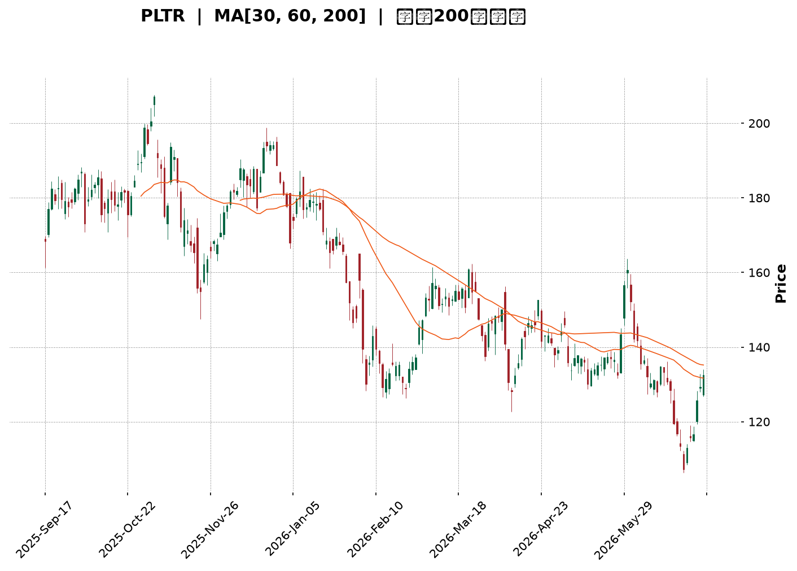
</details>

<html>
<head><meta charset="utf-8" /></head>
<body>
    <div style="height:500px; width:100%;">                        <script>window.PlotlyConfig = {MathJaxConfig: 'local'};</script>
        <script charset="utf-8" src="https://cdn.plot.ly/plotly-3.6.0.min.js" integrity="sha256-QaOVwtVY0T02VaHrr6pnoHLCwayMJp4O5n4YyaE3rJk=" crossorigin="anonymous"></script>                <div id="candlestick-chart" class="plotly-graph-div" style="height:100%; width:100%;"></div>            <script>                window.PLOTLYENV=window.PLOTLYENV || {};                                if (document.getElementById("candlestick-chart")) {                    Plotly.newPlot(                        "candlestick-chart",                        [{"close":{"dtype":"f8","bdata":"AAAAYI8KZUAAAABACh9mQAAAAOB6zGZAAAAAYI9qZkAAAACgmdFmQAAAAIDrcWZAAAAAANdjZkAAAACAPTJmQAAAACCFW2ZAAAAAoHDNZkAAAABgZh5nQAAAAKCZYWdAAAAAgD2iZUAAAADA9XBmQAAAAKBwxWZAAAAAgOvxZkAAAABACi9nQAAAAIAU7mVAAAAAYLgmZkAAAAAgrndmQAAAAADXc2ZAAAAAANdDZkAAAADAzERmQAAAAEDhsmZAAAAA4FGwZkAAAAAgru9lQAAAACBcj2ZAAAAAACkUZ0AAAACAwqVnQAAAAEAzs2dAAAAAgOvZaEAAAACgmVFoQAAAAEAKD2lAAAAAgMLlaUAAAAAgrtdnQAAAAMDMfGdAAAAAoJnhZUAAAACAwj1mQAAAACCFM2hAAAAAYLjeZ0AAAACgcAVnQAAAAOB6hGVAAAAA4FHAZUAAAAAAAGhlQAAAAGCP6mRAAAAAoHCtZEAAAAAA13djQAAAAEAzW2NAAAAAAABIZEAAAACgmXFkQAAAAOCjuGRAAAAAYGYOZUAAAAAgru9kQAAAAIAUVmVAAAAAYI8CZkAAAACgcD1mQAAAAOBRuGZAAAAAIK6vZkAAAABA4bpmQAAAAMAefWdAAAAAoEdxZ0AAAACAPfJmQAAAAAAA6GZAAAAAAAB4Z0AAAACgRylmQAAAAIAUNmdAAAAAACksaEAAAAAgXD9oQAAAAAApRGhAAAAAoHBFaEAAAABguJZnQAAAAIDCBWdAAAAAQOGaZkAAAAAAADhmQAAAACCF+2RAAAAAoEfBZUAAAABguHZmQAAAAIDCtWZAAAAAIIUbZkAAAAAgri9mQAAAAMAebWZAAAAAYLheZkAAAADAzExmQAAAAIA9ImZAAAAAYLheZUAAAADA9RBlQAAAAGCPqmRAAAAAwMy8ZEAAAABAMzNlQAAAAEAK72RAAAAAYGa2ZEAAAABAM6tjQAAAACCF+2JAAAAAQOFSYkAAAADgUXhiQAAAAAApvGNAAAAAoEdxYUAAAADgUUBgQAAAAMDM\u002fGBAAAAAwB7dYUAAAADgUXBhQAAAAIDC9WBAAAAAACkkYEAAAADAHm1gQAAAAOCjoGBAAAAAACnsYEAAAADgetxgQAAAACCu52BAAAAAQDNTYEAAAABA4RpgQAAAAIAUxmBAAAAAgBT+YEAAAACAFCZhQAAAAKBwJWJAAAAAQApnYkAAAACAFCZjQAAAAKBwFWNAAAAAwB6lY0AAAACAwo1jQAAAAOB65GJAAAAAQDPzYkAAAAAAADBjQAAAAGBm3mJAAAAAQAoXY0AAAABgj2JjQAAAAOCjGGNAAAAAgMJ1Y0AAAACAwtViQAAAAEDhGmRAAAAAwPVYY0AAAABguF5jQAAAAIDrcWJAAAAAgOvhYUAAAACgmTFhQAAAAMD1SGJAAAAAIK5PYkAAAABguI5iQAAAAIDCfWJAAAAAgD3CYkAAAADgUZhhQAAAACCuT2BAAAAAgOsBYEAAAAAA14tgQAAAAGBm9mBAAAAAwMzEYUAAAADgUdhhQAAAAOB6TGJAAAAA4Ho8YkAAAABACj9iQAAAAADXE2NAAAAAgD2yYUAAAABA4eJhQAAAAEAz42FAAAAAgMKlYUAAAABACj9hQAAAACCFY2FAAAAAgD0CYkAAAADA9UBiQAAAAMAe\u002fWBAAAAAoEe5YEAAAACgmSFhQAAAAKCZOWFAAAAA4HocYUAAAAAAAABhQAAAAKCZQWBAAAAAIFy3YEAAAAAgrr9gQAAAAOB65GBAAAAA4FHoYEAAAADAzCRhQAAAAKBHLWFAAAAAACkcYUAAAABAMxNhQAAAAOBRkGBAAAAAQOHqYUAAAACgR5FjQAAAAMDMFGRAAAAAoHAFY0AAAABgZsZhQAAAAGBmtmFAAAAAwPXwYEAAAABACg9hQAAAAIA9gmBAAAAAYLhGYEAAAABgj2JgQAAAACBc\u002f19AAAAAYLjWYEAAAAAAAKhgQAAAAAApVGBAAAAAQAoPYEAAAAAAAOBdQAAAAMDMLF1AAAAAAABgXEAAAACgR9FaQAAAACCFO1xAAAAAwMzsXEAAAABA4SpdQAAAAGC4bl9AAAAAoJkpYEAAAACgR5FgQA=="},"high":{"dtype":"f8","bdata":"AAAAgMI1ZUAAAACgmVlmQAAAAKBwDWdAAAAAAADIZkAAAAAAADhnQAAAAEAzG2dAAAAAgD0KZ0AAAAAA14NmQAAAACBcr2ZAAAAA4KPYZkAAAADA9UhnQAAAAGBmhmdAAAAAQOFaZ0AAAABgZt5mQAAAAIDCRWdAAAAA4FEIZ0AAAAAA13NnQAAAAEAzY2dAAAAAQApnZkAAAABA4cpmQAAAAEAzC2dAAAAAgD0aZ0AAAABA4bJmQAAAAEDh4mZAAAAAwHLMZkAAAABguMZmQAAAAIDrsWZAAAAAoHBFZ0AAAABgjxpoQAAAAMD1+GdAAAAAQDP7aEAAAACgcPVoQAAAAIDChWlAAAAA4KPwaUAAAABgZnZoQAAAAIA9ymdAAAAAQOHiZ0AAAABgZlZmQAAAAIDCXWhAAAAAoJkdaEAAAABgj9JnQAAAAGBm1mZAAAAAoEcpZkAAAAAgrsdlQAAAAGCPmmVAAAAAQDMzZUAAAACAPdJlQAAAACCFw2NAAAAAoHClZEAAAADAzJRkQAAAACDZCmVAAAAAoJkZZUAAAABAMyNlQAAAAAAA+GVAAAAAwB49ZkAAAACAFE5mQAAAAGDlxGZAAAAAACn8ZkAAAABAM9tmQAAAAOB6zGdAAAAAoJmBZ0AAAADAzFBnQAAAAMD1eGdAAAAAAACQZ0AAAAAAAHhnQAAAAGCPamdAAAAAAABgaEAAAAAAKdxoQAAAAADXa2hAAAAAoHBlaEAAAABAM4toQAAAAGBmZmdAAAAAAFQXZ0AAAADA9bBmQAAAAEAzq2ZAAAAAgD36ZUAAAACAFIZmQAAAAMD1aGdAAAAAwB41Z0AAAABACldmQAAAAAAA0GZAAAAAQDOjZkAAAADgIrNmQAAAAEAzk2ZAAAAAgMLNZkAAAABACn9lQAAAACCuL2VAAAAAAAAgZUAAAAAAAIBlQAAAAEDhUmVAAAAAgBQuZUAAAACgcKFkQAAAAAAptGNAAAAAAADgYkAAAADAzOxiQAAAAAB\u002fomRAAAAAQDN7Y0AAAAAgXD9hQAAAAOD7NWFAAAAAANc7YkAAAACA6zFiQAAAAAAAaGFAAAAA4Hr8YEAAAACA67FgQAAAAIA9ymBAAAAA4NCeYUAAAADAHgVhQAAAAGC4BmFAAAAAoEeBYEAAAAAgrkdgQAAAAEDhAmFAAAAA4FEwYUAAAABAM0NhQAAAAOB6ZGJAAAAAAABwYkAAAADgo1BjQAAAAAApjGNAAAAAYGYuZEAAAACAFM5jQAAAACAGlWNAAAAAgGglY0AAAAAAKXxjQAAAAIDrUWNAAAAAIIU7Y0AAAAAAAJhjQAAAAIAUlmNAAAAAwMyEY0AAAADAzJRjQAAAAGCPImRAAAAAwMxMZEAAAADgowhkQAAAAADXI2NAAAAAYLg+YkAAAAAA1wNiQAAAACCFe2JAAAAAoJmJYkAAAADgUZBiQAAAACCF02JAAAAA4KPIYkAAAADA9YhjQAAAAKBHcWFAAAAAYGYmYEAAAACgcM1gQAAAAIA9QmFAAAAAYI\u002fSYUAAAACgmTFiQAAAAMD1iGJAAAAAYGZmYkAAAAAA17tiQAAAAIDCFWNAAAAAoEfJYkAAAABgj+phQAAAAIA9ImJAAAAAQDP7YUAAAADgUXhhQAAAAGBmhmFAAAAAgBROYkAAAADgerRiQAAAACBc32FAAAAAYGb2YEAAAABgZp5hQAAAAAApPGFAAAAA4HokYUAAAACAwi1hQAAAACCuH2FAAAAAIFzPYEAAAADgevRgQAAAAIDr\u002fWBAAAAAQAovYUAAAAAgridhQAAAAKCZUWFAAAAA4KNgYUAAAACAwlVhQAAAACBc92BAAAAAAAAgYkAAAACg7bhjQAAAAGBmdmRAAAAAoJnxY0AAAACAwvViQAAAAADXS2JAAAAAQAq\u002fYUAAAADgUThhQAAAACCuH2FAAAAAgOulYEAAAADgo3BgQAAAAEDhYmBAAAAAIFzfYEAAAABA4dJgQAAAAEAzA2FAAAAAgMJtYEAAAAAA1xtgQAAAAAApPF5AAAAAAACAXUAAAACgmQlcQAAAAMAehVxAAAAAwB7FXUAAAADAzKxdQAAAAAAACGBAAAAAACmcYEAAAADAN8JgQA=="},"hovertemplate":"\u003cb\u003e%{x|%Y-%m-%d}\u003c\u002fb\u003e\u003cbr\u003e\u958b: $%{open:.2f}\u003cbr\u003e\u9ad8: $%{high:.2f}\u003cbr\u003e\u4f4e: $%{low:.2f}\u003cbr\u003e\u6536: $%{close:.2f}\u003cextra\u003e\u003c\u002fextra\u003e","low":{"dtype":"f8","bdata":"AAAA4KMoZEAAAADgeixlQAAAAGC4FmZAAAAAoEdJZkAAAADgUSBmQAAAAADXI2ZAAAAAoEfJZUAAAADAHt1lQAAAAMAeJWZAAAAAQApHZkAAAAAAAHBmQAAAAGBm3mZAAAAA4KNYZUAAAABgjzpmQAAAAKBwbWZAAAAAYGamZkAAAABgZn5mQAAAAMD1sGVAAAAAYGauZUAAAACAPVplQAAAAOCjAGZAAAAAYGYOZkAAAABgZr5lQAAAAIAULmZAAAAAwMxUZkAAAACgcC1lQAAAAOBR4GVAAAAAQDPbZkAAAADgo3BnQAAAAMD1WGdAAAAAIK7PZ0AAAAAA10NoQAAAAKBwvWhAAAAAgD06aUAAAACA6zFnQAAAAGC4pmZAAAAAwPXQZUAAAADAHh1lQAAAAOCj8GZAAAAAAClkZ0AAAADAzIxmQAAAAGBkV2VAAAAAAACQZEAAAACAwvVkQAAAAAAAsGRAAAAAoHBNZEAAAADgo0xjQAAAAIDrcWJAAAAAAACgY0AAAACAwpFjQAAAAAApfGRAAAAAAAC8ZEAAAAAA12NkQAAAAEDhMmVAAAAAYI8aZUAAAACAws1lQAAAAMAeJWZAAAAAoEdxZkAAAAAAKYxmQAAAAAAA2GZAAAAAYLiGZkAAAAAgWDVmQAAAAMD1gGZAAAAAQIukZkAAAAAAABBmQAAAAOBRsGZAAAAAIFxXZ0AAAACAwg1oQAAAACCF92dAAAAAYI8aaEAAAAAA15NnQAAAAOB69GZAAAAAYGaWZkAAAAAAAChmQAAAAEAzy2RAAAAAoEd5ZUAAAADgo9hlQAAAAMAeNWZAAAAAANfLZUAAAAAAANhlQAAAAEDhCmZAAAAA4HoEZkAAAABgZr5lQAAAAMD1EGZAAAAA4FFAZUAAAAAgrsdkQAAAACCFI2RAAAAAYGaeZEAAAACgmclkQAAAAGBm6mRAAAAAgBSWZEAAAAAgrqdjQAAAAADXY2JAAAAAwHIkYkAAAACg7VRiQAAAAADXI2NAAAAAgML1YEAAAACAPQpgQAAAAEAzi2BAAAAAANXYYEAAAADgozhhQAAAAGBmnmBAAAAAANejX0AAAACA6Y5fQAAAAGCP0l9AAAAAANfbYEAAAADgUWBgQAAAAKBwZWBAAAAAwPXYX0AAAAAgrpdfQAAAAIDCJWBAAAAAACmUYEAAAAAgXL9gQAAAAOCjkGFAAAAAYGZGYUAAAACA64FiQAAAACCFs2JAAAAAoEfJYkAAAABACh9jQAAAAOB6xGJAAAAAYI+qYkAAAAAgXN9iQAAAAGCPkmJAAAAAoHDlYkAAAAAA1wNjQAAAACCFE2NAAAAAAADQYkAAAABA4aJiQAAAACCuJ2NAAAAA4Hr0YkAAAAAgXFtjQAAAAAAAaGJAAAAAgOuxYUAAAACgmQlhQAAAAEAKX2FAAAAAQAoPYkAAAAAgrj9hQAAAACAxVGJAAAAAYGYOYkAAAACgcGVhQAAAAEAKD2BAAAAAIIWrXkAAAADAzCRgQAAAAAAAwGBAAAAAgMLdYEAAAADA9XBhQAAAAKCZ6WFAAAAAYI\u002f6YUAAAADA9\u002f9hQAAAAMAebWJAAAAAoHB9YUAAAACAwl1hQAAAAOBRoGFAAAAAoHCNYUAAAACAwtVgQAAAAMDMFGFAAAAA4HqsYUAAAABAMydiQAAAAEAK12BAAAAAwMxkYEAAAADA9dhgQAAAAOCjoGBAAAAAAKyYYEAAAABguK5gQAAAAAAAGGBAAAAAYGYuYEAAAACgR4lgQAAAAGCPamBAAAAAQDOzYEAAAACgcI1gQAAAAKBw7WBAAAAAoJnJYEAAAACgmalgQAAAAAApdGBAAAAAAACgYEAAAACgRzliQAAAAAApfGNAAAAAoJm5YkAAAAAAAKhhQAAAAEC0iGFAAAAAwMzAYEAAAADA9ehgQAAAAGBm1l9AAAAAoJkZYEAAAABA4cpfQAAAAKCZqV9AAAAAYGY2YEAAAAAA1zNgQAAAAKBwPWBAAAAA4KNAX0AAAADAzMxdQAAAACCFC11AAAAAAAAQXEAAAAAgrpdaQAAAAIAUHltAAAAAwMysXEAAAADgeqRcQAAAAGBm1l1AAAAAwMz8X0AAAADgo7BfQA=="},"name":"\u50f9\u683c","open":{"dtype":"f8","bdata":"AAAA4KMgZUAAAADgo0hlQAAAAIA9ImZAAAAAACmcZkAAAADgUdBmQAAAAMAe\u002fWZAAAAAoJn5ZUAAAACgmWFmQAAAAOB6dGZAAAAAIFxfZkAAAACAPapmQAAAAGBmVmdAAAAAwMxMZ0AAAACAwmVmQAAAAIDriWZAAAAAoJnZZkAAAABgj\u002fJmQAAAAKBwJWdAAAAAgMJVZkAAAAAAAABmQAAAAMD1tGZAAAAAwPW4ZkAAAAAAADhmQAAAACCub2ZAAAAAgOvBZkAAAACAwr1mQAAAAIA97mVAAAAAACncZkAAAABACp9nQAAAACBcr2dAAAAAYI\u002fiZ0AAAACgmc1oQAAAAGBm5mhAAAAAoHChaUAAAACAPQJoQAAAAAAAoGdAAAAAIK5\u002fZ0AAAADAzKRlQAAAAIDrCWdAAAAAYLjKZ0AAAABgj9JnQAAAAEDhtmZAAAAAQDPfZEAAAADA9VBlQAAAAADXC2VAAAAAoJn5ZEAAAACAPYJlQAAAAOBRgGNAAAAAQAqvY0AAAACAPQJkQAAAAEAz22RAAAAA4FH4ZEAAAAAAAKBkQAAAAEDhMmVAAAAA4HpEZUAAAAAgrgtmQAAAACBcR2ZAAAAAYLjGZkAAAABACp9mQAAAAGBmHmdAAAAAoJkZZ0AAAACA6zlnQAAAAGCPImdAAAAAwPW0ZkAAAABA4XZnQAAAAOBRsGZAAAAAIK5XZ0AAAACgR2FoQAAAAGBmGmhAAAAAwB4laEAAAADgemBoQAAAAEAzW2dAAAAAQDMLZ0AAAAAAKaRmQAAAAKCZqWZAAAAAACncZUAAAADgUfhlQAAAAKCZeWZAAAAAIK4zZ0AAAADgoyBmQAAAAIDrNWZAAAAAAABcZkAAAAAAAERmQAAAAGC4VmZAAAAAIIVrZkAAAAAAAPRkQAAAACDdDGVAAAAAoJkdZUAAAADgo+hkQAAAAGC4BmVAAAAAIFzvZEAAAADAzIxkQAAAAAAptGNAAAAAoJnBYkAAAACAFN5iQAAAAKCZoWRAAAAAwB5tY0AAAACAPRphQAAAAGCP6mBAAAAAYI8SYUAAAABA4R5iQAAAAMDMYGFAAAAAIIXrYEAAAACgmflfQAAAAOCjHGBAAAAA4Hr8YEAAAACA64lgQAAAACCui2BAAAAAoEeBYEAAAAAAKSBgQAAAACCFU2BAAAAAQAq7YEAAAACAPcJgQAAAAMDMmGFAAAAAQDPDYUAAAACAwo1iQAAAAIAUHmNAAAAAgBTOYkAAAACAFHZjQAAAACCuf2NAAAAAACnsYkAAAADgUSBjQAAAAKCZKWNAAAAAYGYOY0AAAADA9QxjQAAAAIA9XmNAAAAAQDMjY0AAAABgZmZjQAAAACCuJ2NAAAAAgD0CZEAAAACgcK1jQAAAAIDCIWNAAAAAACk8YkAAAADgo+hhQAAAAOCjgGFAAAAAAABgYkAAAAAghe9hQAAAACCFi2JAAAAAYDlcYkAAAADgelhjQAAAAOCjbGFAAAAAIFwPYEAAAAAgXEdgQAAAAACqzWBAAAAAoEcZYUAAAACgRwliQAAAAIAUKmJAAAAAAAAgYkAAAACA61liQAAAACCFi2JAAAAAYGa2YkAAAABguN5hQAAAAAAAqGFAAAAAoJnJYUAAAADgUXhhQAAAAEAzT2FAAAAAAADoYUAAAAAAAHhiQAAAAKBwiWFAAAAAYLi2YEAAAABAM+NgQAAAACCu+2BAAAAAwB7dYEAAAABAMxNhQAAAACAxwGBAAAAAwMw0YEAAAACgmZlgQAAAAAAAkGBAAAAAoHDlYEAAAADgo8RgQAAAAKCZ+WBAAAAAoJktYUAAAADAHgVhQAAAAKCZqWBAAAAAwB6lYEAAAABgZnpiQAAAACBc\u002f2NAAAAAgBSWY0AAAABgZrZiQAAAAGC4LmJAAAAAYGaKYUAAAACAwvVgQAAAAADX22BAAAAAYGYqYEAAAADA9RhgQAAAAKBHXWBAAAAA4KNAYEAAAABA4dJgQAAAAOBReGBAAAAAQOFaYEAAAAAgXG9fQAAAAKCZCV5AAAAAIK6HXEAAAADgUdhbQAAAAGCPQltAAAAAYLgOXUAAAADAzLxcQAAAAEAzA15AAAAAIK4fYEAAAADA9chfQA=="},"x":["2025-09-17T00:00:00-04:00","2025-09-18T00:00:00-04:00","2025-09-19T00:00:00-04:00","2025-09-22T00:00:00-04:00","2025-09-23T00:00:00-04:00","2025-09-24T00:00:00-04:00","2025-09-25T00:00:00-04:00","2025-09-26T00:00:00-04:00","2025-09-29T00:00:00-04:00","2025-09-30T00:00:00-04:00","2025-10-01T00:00:00-04:00","2025-10-02T00:00:00-04:00","2025-10-03T00:00:00-04:00","2025-10-06T00:00:00-04:00","2025-10-07T00:00:00-04:00","2025-10-08T00:00:00-04:00","2025-10-09T00:00:00-04:00","2025-10-10T00:00:00-04:00","2025-10-13T00:00:00-04:00","2025-10-14T00:00:00-04:00","2025-10-15T00:00:00-04:00","2025-10-16T00:00:00-04:00","2025-10-17T00:00:00-04:00","2025-10-20T00:00:00-04:00","2025-10-21T00:00:00-04:00","2025-10-22T00:00:00-04:00","2025-10-23T00:00:00-04:00","2025-10-24T00:00:00-04:00","2025-10-27T00:00:00-04:00","2025-10-28T00:00:00-04:00","2025-10-29T00:00:00-04:00","2025-10-30T00:00:00-04:00","2025-10-31T00:00:00-04:00","2025-11-03T00:00:00-05:00","2025-11-04T00:00:00-05:00","2025-11-05T00:00:00-05:00","2025-11-06T00:00:00-05:00","2025-11-07T00:00:00-05:00","2025-11-10T00:00:00-05:00","2025-11-11T00:00:00-05:00","2025-11-12T00:00:00-05:00","2025-11-13T00:00:00-05:00","2025-11-14T00:00:00-05:00","2025-11-17T00:00:00-05:00","2025-11-18T00:00:00-05:00","2025-11-19T00:00:00-05:00","2025-11-20T00:00:00-05:00","2025-11-21T00:00:00-05:00","2025-11-24T00:00:00-05:00","2025-11-25T00:00:00-05:00","2025-11-26T00:00:00-05:00","2025-11-28T00:00:00-05:00","2025-12-01T00:00:00-05:00","2025-12-02T00:00:00-05:00","2025-12-03T00:00:00-05:00","2025-12-04T00:00:00-05:00","2025-12-05T00:00:00-05:00","2025-12-08T00:00:00-05:00","2025-12-09T00:00:00-05:00","2025-12-10T00:00:00-05:00","2025-12-11T00:00:00-05:00","2025-12-12T00:00:00-05:00","2025-12-15T00:00:00-05:00","2025-12-16T00:00:00-05:00","2025-12-17T00:00:00-05:00","2025-12-18T00:00:00-05:00","2025-12-19T00:00:00-05:00","2025-12-22T00:00:00-05:00","2025-12-23T00:00:00-05:00","2025-12-24T00:00:00-05:00","2025-12-26T00:00:00-05:00","2025-12-29T00:00:00-05:00","2025-12-30T00:00:00-05:00","2025-12-31T00:00:00-05:00","2026-01-02T00:00:00-05:00","2026-01-05T00:00:00-05:00","2026-01-06T00:00:00-05:00","2026-01-07T00:00:00-05:00","2026-01-08T00:00:00-05:00","2026-01-09T00:00:00-05:00","2026-01-12T00:00:00-05:00","2026-01-13T00:00:00-05:00","2026-01-14T00:00:00-05:00","2026-01-15T00:00:00-05:00","2026-01-16T00:00:00-05:00","2026-01-20T00:00:00-05:00","2026-01-21T00:00:00-05:00","2026-01-22T00:00:00-05:00","2026-01-23T00:00:00-05:00","2026-01-26T00:00:00-05:00","2026-01-27T00:00:00-05:00","2026-01-28T00:00:00-05:00","2026-01-29T00:00:00-05:00","2026-01-30T00:00:00-05:00","2026-02-02T00:00:00-05:00","2026-02-03T00:00:00-05:00","2026-02-04T00:00:00-05:00","2026-02-05T00:00:00-05:00","2026-02-06T00:00:00-05:00","2026-02-09T00:00:00-05:00","2026-02-10T00:00:00-05:00","2026-02-11T00:00:00-05:00","2026-02-12T00:00:00-05:00","2026-02-13T00:00:00-05:00","2026-02-17T00:00:00-05:00","2026-02-18T00:00:00-05:00","2026-02-19T00:00:00-05:00","2026-02-20T00:00:00-05:00","2026-02-23T00:00:00-05:00","2026-02-24T00:00:00-05:00","2026-02-25T00:00:00-05:00","2026-02-26T00:00:00-05:00","2026-02-27T00:00:00-05:00","2026-03-02T00:00:00-05:00","2026-03-03T00:00:00-05:00","2026-03-04T00:00:00-05:00","2026-03-05T00:00:00-05:00","2026-03-06T00:00:00-05:00","2026-03-09T00:00:00-04:00","2026-03-10T00:00:00-04:00","2026-03-11T00:00:00-04:00","2026-03-12T00:00:00-04:00","2026-03-13T00:00:00-04:00","2026-03-16T00:00:00-04:00","2026-03-17T00:00:00-04:00","2026-03-18T00:00:00-04:00","2026-03-19T00:00:00-04:00","2026-03-20T00:00:00-04:00","2026-03-23T00:00:00-04:00","2026-03-24T00:00:00-04:00","2026-03-25T00:00:00-04:00","2026-03-26T00:00:00-04:00","2026-03-27T00:00:00-04:00","2026-03-30T00:00:00-04:00","2026-03-31T00:00:00-04:00","2026-04-01T00:00:00-04:00","2026-04-02T00:00:00-04:00","2026-04-06T00:00:00-04:00","2026-04-07T00:00:00-04:00","2026-04-08T00:00:00-04:00","2026-04-09T00:00:00-04:00","2026-04-10T00:00:00-04:00","2026-04-13T00:00:00-04:00","2026-04-14T00:00:00-04:00","2026-04-15T00:00:00-04:00","2026-04-16T00:00:00-04:00","2026-04-17T00:00:00-04:00","2026-04-20T00:00:00-04:00","2026-04-21T00:00:00-04:00","2026-04-22T00:00:00-04:00","2026-04-23T00:00:00-04:00","2026-04-24T00:00:00-04:00","2026-04-27T00:00:00-04:00","2026-04-28T00:00:00-04:00","2026-04-29T00:00:00-04:00","2026-04-30T00:00:00-04:00","2026-05-01T00:00:00-04:00","2026-05-04T00:00:00-04:00","2026-05-05T00:00:00-04:00","2026-05-06T00:00:00-04:00","2026-05-07T00:00:00-04:00","2026-05-08T00:00:00-04:00","2026-05-11T00:00:00-04:00","2026-05-12T00:00:00-04:00","2026-05-13T00:00:00-04:00","2026-05-14T00:00:00-04:00","2026-05-15T00:00:00-04:00","2026-05-18T00:00:00-04:00","2026-05-19T00:00:00-04:00","2026-05-20T00:00:00-04:00","2026-05-21T00:00:00-04:00","2026-05-22T00:00:00-04:00","2026-05-26T00:00:00-04:00","2026-05-27T00:00:00-04:00","2026-05-28T00:00:00-04:00","2026-05-29T00:00:00-04:00","2026-06-01T00:00:00-04:00","2026-06-02T00:00:00-04:00","2026-06-03T00:00:00-04:00","2026-06-04T00:00:00-04:00","2026-06-05T00:00:00-04:00","2026-06-08T00:00:00-04:00","2026-06-09T00:00:00-04:00","2026-06-10T00:00:00-04:00","2026-06-11T00:00:00-04:00","2026-06-12T00:00:00-04:00","2026-06-15T00:00:00-04:00","2026-06-16T00:00:00-04:00","2026-06-17T00:00:00-04:00","2026-06-18T00:00:00-04:00","2026-06-22T00:00:00-04:00","2026-06-23T00:00:00-04:00","2026-06-24T00:00:00-04:00","2026-06-25T00:00:00-04:00","2026-06-26T00:00:00-04:00","2026-06-29T00:00:00-04:00","2026-06-30T00:00:00-04:00","2026-07-01T00:00:00-04:00","2026-07-02T00:00:00-04:00","2026-07-06T00:00:00-04:00"],"type":"candlestick"},{"hovertemplate":"MA30: $%{y:.2f}\u003cextra\u003e\u003c\u002fextra\u003e","line":{"color":"#2196F3","dash":"dash","width":2},"mode":"lines","name":"MA30","x":["2025-09-17T00:00:00-04:00","2025-09-18T00:00:00-04:00","2025-09-19T00:00:00-04:00","2025-09-22T00:00:00-04:00","2025-09-23T00:00:00-04:00","2025-09-24T00:00:00-04:00","2025-09-25T00:00:00-04:00","2025-09-26T00:00:00-04:00","2025-09-29T00:00:00-04:00","2025-09-30T00:00:00-04:00","2025-10-01T00:00:00-04:00","2025-10-02T00:00:00-04:00","2025-10-03T00:00:00-04:00","2025-10-06T00:00:00-04:00","2025-10-07T00:00:00-04:00","2025-10-08T00:00:00-04:00","2025-10-09T00:00:00-04:00","2025-10-10T00:00:00-04:00","2025-10-13T00:00:00-04:00","2025-10-14T00:00:00-04:00","2025-10-15T00:00:00-04:00","2025-10-16T00:00:00-04:00","2025-10-17T00:00:00-04:00","2025-10-20T00:00:00-04:00","2025-10-21T00:00:00-04:00","2025-10-22T00:00:00-04:00","2025-10-23T00:00:00-04:00","2025-10-24T00:00:00-04:00","2025-10-27T00:00:00-04:00","2025-10-28T00:00:00-04:00","2025-10-29T00:00:00-04:00","2025-10-30T00:00:00-04:00","2025-10-31T00:00:00-04:00","2025-11-03T00:00:00-05:00","2025-11-04T00:00:00-05:00","2025-11-05T00:00:00-05:00","2025-11-06T00:00:00-05:00","2025-11-07T00:00:00-05:00","2025-11-10T00:00:00-05:00","2025-11-11T00:00:00-05:00","2025-11-12T00:00:00-05:00","2025-11-13T00:00:00-05:00","2025-11-14T00:00:00-05:00","2025-11-17T00:00:00-05:00","2025-11-18T00:00:00-05:00","2025-11-19T00:00:00-05:00","2025-11-20T00:00:00-05:00","2025-11-21T00:00:00-05:00","2025-11-24T00:00:00-05:00","2025-11-25T00:00:00-05:00","2025-11-26T00:00:00-05:00","2025-11-28T00:00:00-05:00","2025-12-01T00:00:00-05:00","2025-12-02T00:00:00-05:00","2025-12-03T00:00:00-05:00","2025-12-04T00:00:00-05:00","2025-12-05T00:00:00-05:00","2025-12-08T00:00:00-05:00","2025-12-09T00:00:00-05:00","2025-12-10T00:00:00-05:00","2025-12-11T00:00:00-05:00","2025-12-12T00:00:00-05:00","2025-12-15T00:00:00-05:00","2025-12-16T00:00:00-05:00","2025-12-17T00:00:00-05:00","2025-12-18T00:00:00-05:00","2025-12-19T00:00:00-05:00","2025-12-22T00:00:00-05:00","2025-12-23T00:00:00-05:00","2025-12-24T00:00:00-05:00","2025-12-26T00:00:00-05:00","2025-12-29T00:00:00-05:00","2025-12-30T00:00:00-05:00","2025-12-31T00:00:00-05:00","2026-01-02T00:00:00-05:00","2026-01-05T00:00:00-05:00","2026-01-06T00:00:00-05:00","2026-01-07T00:00:00-05:00","2026-01-08T00:00:00-05:00","2026-01-09T00:00:00-05:00","2026-01-12T00:00:00-05:00","2026-01-13T00:00:00-05:00","2026-01-14T00:00:00-05:00","2026-01-15T00:00:00-05:00","2026-01-16T00:00:00-05:00","2026-01-20T00:00:00-05:00","2026-01-21T00:00:00-05:00","2026-01-22T00:00:00-05:00","2026-01-23T00:00:00-05:00","2026-01-26T00:00:00-05:00","2026-01-27T00:00:00-05:00","2026-01-28T00:00:00-05:00","2026-01-29T00:00:00-05:00","2026-01-30T00:00:00-05:00","2026-02-02T00:00:00-05:00","2026-02-03T00:00:00-05:00","2026-02-04T00:00:00-05:00","2026-02-05T00:00:00-05:00","2026-02-06T00:00:00-05:00","2026-02-09T00:00:00-05:00","2026-02-10T00:00:00-05:00","2026-02-11T00:00:00-05:00","2026-02-12T00:00:00-05:00","2026-02-13T00:00:00-05:00","2026-02-17T00:00:00-05:00","2026-02-18T00:00:00-05:00","2026-02-19T00:00:00-05:00","2026-02-20T00:00:00-05:00","2026-02-23T00:00:00-05:00","2026-02-24T00:00:00-05:00","2026-02-25T00:00:00-05:00","2026-02-26T00:00:00-05:00","2026-02-27T00:00:00-05:00","2026-03-02T00:00:00-05:00","2026-03-03T00:00:00-05:00","2026-03-04T00:00:00-05:00","2026-03-05T00:00:00-05:00","2026-03-06T00:00:00-05:00","2026-03-09T00:00:00-04:00","2026-03-10T00:00:00-04:00","2026-03-11T00:00:00-04:00","2026-03-12T00:00:00-04:00","2026-03-13T00:00:00-04:00","2026-03-16T00:00:00-04:00","2026-03-17T00:00:00-04:00","2026-03-18T00:00:00-04:00","2026-03-19T00:00:00-04:00","2026-03-20T00:00:00-04:00","2026-03-23T00:00:00-04:00","2026-03-24T00:00:00-04:00","2026-03-25T00:00:00-04:00","2026-03-26T00:00:00-04:00","2026-03-27T00:00:00-04:00","2026-03-30T00:00:00-04:00","2026-03-31T00:00:00-04:00","2026-04-01T00:00:00-04:00","2026-04-02T00:00:00-04:00","2026-04-06T00:00:00-04:00","2026-04-07T00:00:00-04:00","2026-04-08T00:00:00-04:00","2026-04-09T00:00:00-04:00","2026-04-10T00:00:00-04:00","2026-04-13T00:00:00-04:00","2026-04-14T00:00:00-04:00","2026-04-15T00:00:00-04:00","2026-04-16T00:00:00-04:00","2026-04-17T00:00:00-04:00","2026-04-20T00:00:00-04:00","2026-04-21T00:00:00-04:00","2026-04-22T00:00:00-04:00","2026-04-23T00:00:00-04:00","2026-04-24T00:00:00-04:00","2026-04-27T00:00:00-04:00","2026-04-28T00:00:00-04:00","2026-04-29T00:00:00-04:00","2026-04-30T00:00:00-04:00","2026-05-01T00:00:00-04:00","2026-05-04T00:00:00-04:00","2026-05-05T00:00:00-04:00","2026-05-06T00:00:00-04:00","2026-05-07T00:00:00-04:00","2026-05-08T00:00:00-04:00","2026-05-11T00:00:00-04:00","2026-05-12T00:00:00-04:00","2026-05-13T00:00:00-04:00","2026-05-14T00:00:00-04:00","2026-05-15T00:00:00-04:00","2026-05-18T00:00:00-04:00","2026-05-19T00:00:00-04:00","2026-05-20T00:00:00-04:00","2026-05-21T00:00:00-04:00","2026-05-22T00:00:00-04:00","2026-05-26T00:00:00-04:00","2026-05-27T00:00:00-04:00","2026-05-28T00:00:00-04:00","2026-05-29T00:00:00-04:00","2026-06-01T00:00:00-04:00","2026-06-02T00:00:00-04:00","2026-06-03T00:00:00-04:00","2026-06-04T00:00:00-04:00","2026-06-05T00:00:00-04:00","2026-06-08T00:00:00-04:00","2026-06-09T00:00:00-04:00","2026-06-10T00:00:00-04:00","2026-06-11T00:00:00-04:00","2026-06-12T00:00:00-04:00","2026-06-15T00:00:00-04:00","2026-06-16T00:00:00-04:00","2026-06-17T00:00:00-04:00","2026-06-18T00:00:00-04:00","2026-06-22T00:00:00-04:00","2026-06-23T00:00:00-04:00","2026-06-24T00:00:00-04:00","2026-06-25T00:00:00-04:00","2026-06-26T00:00:00-04:00","2026-06-29T00:00:00-04:00","2026-06-30T00:00:00-04:00","2026-07-01T00:00:00-04:00","2026-07-02T00:00:00-04:00","2026-07-06T00:00:00-04:00"],"y":{"dtype":"f8","bdata":"AAAAAAAA+H8AAAAAAAD4fwAAAAAAAPh\u002fAAAAAAAA+H8AAAAAAAD4fwAAAAAAAPh\u002fAAAAAAAA+H8AAAAAAAD4fwAAAAAAAPh\u002fAAAAAAAA+H8AAAAAAAD4fwAAAAAAAPh\u002fAAAAAAAA+H8AAAAAAAD4fwAAAAAAAPh\u002fAAAAAAAA+H8AAAAAAAD4fwAAAAAAAPh\u002fAAAAAAAA+H8AAAAAAAD4fwAAAAAAAPh\u002fAAAAAAAA+H8AAAAAAAD4fwAAAAAAAPh\u002fAAAAAAAA+H8AAAAAAAD4fwAAAAAAAPh\u002fAAAAAAAA+H8AAAAAAAD4f3d3dxeSjmZAmpmZKRWvZkDNzMys1cFmQImIiLge1WZAAAAAoNPyZkCrqqoKkPtmQKuqqmp1BGdAmpmZCR4AZ0BmZmZWgABnQCIiIhI8EGdAAAAAEFgZZ0AiIiISgxhnQFVVVaWbCGdAMzMzU5wJZ0BVVVVVxwBnQGZmZgbz8GZAiYiImJndZkAAAACw5L1mQO\u002fu7j7up2ZAq6qqKvmXZkB3d3c3tIZmQO\u002fu7j7ud2ZAERERsZ1tZkDe3d3NPmJmQBEREWGeVmZAERERodNQZkDe3d0ta1NmQERERLTIVGZAZmZmRm9RZkB3d3f3mklmQLy7u3vNR2ZAVVVVBcg7ZkAAAADAETBmQKuqqoqzHWZAvLu72\u002fkIZkC8u7sbofplQCIiIqJF+GVAIiIi8tILZkCrqqqq8RxmQJqZmal\u002fHWZARERENOwgZkDe3d3twyVmQGZmZqabMmZAIiIisuQ5ZkARERGh00BmQKuqqlpkQWZAAAAAMJZKZkC8u7s7JmRmQLy7u5vEgGZAzczMHFqQZkCamZmpOJ9mQKuqqkrFrWZAmpmZOfu4ZkARERFhnsRmQLy7u4tsy2ZAIiIicvbFZkCamZlZ8rtmQN7d3d1rqmZAERERwcqZZkC8u7trvIxmQAAAAPDudmZAmpmZKaNfZkCrqqpaq0NmQKuqqsovImZA3t3dXUj2ZUBVVVW1yNZlQJqZmbkeuWVAAAAA0LB\u002fZUDNzMy8dDtlQAAAABBY\u002fWRAq6qqqqrGZECJiIjIL5JkQM3MzAx0XmRAZmZmxksnZEDe3d3d3fVjQJqZmTm00GNAiYiIeHenY0Dv7u6eqHdjQImIiGgfRmNAiYiIWMcUY0BmZmam4uBiQDMzM5OmsGJA7+7uPsOCYkC8u7srzlZiQHd3d1fHNGJAzczMvHQbYkBVVVXlFwtiQO\u002fu7t6W\u002fWFAVVVVRUT0YUCrqqr6N+ZhQM3MzMzM1GFAAAAAkMLFYUARERFBp8FhQDMzM8OuwGFAmpmZqTjHYUAzMzODB89hQERERCSUyWFAAAAAcMvaYUCamZm51\u002fBhQCIiIgJyC2JA7+7uThsYYkARERExlihiQJqZmTlCNWJAq6qqCh5EYkC8u7urqkpiQImIiIjPWGJA3t3dTalkYkAiIiLSInNiQImIiAisgGJAREREpHCVYkCJiIiYJ6JiQAAAAEA1nmJAvLu7e82VYkDNzMxMqZBiQLy7u1uPhmJAiYiI6CaBYkAiIiLSBnZiQGZmZvZTb2JAAAAAgE5jYkCamZk5JlhiQM3MzFy6WWJAERERgQdPYkARERHh7ENiQO\u002fu7k6NO2JA3t3dHT4vYkAiIiLy\u002fRxiQKuqqtprDmJA3t3djQkCYkC8u7vLE\u002f1hQO\u002fu7j584mFAMzMzkxjMYUAzMzPz\u002fbhhQCIiItKUrmFAAAAAAACoYUDv7u6+WKZhQAAAAOAIlWFAq6qqimyHYUBERERE\u002fXdhQO\u002fu7r5YamFAAAAAoIxaYUCrqqraslZhQGZmZtYVXmFAmpmZSX5nYUDNzMxcAWxhQHd3d0eaaGFAq6qqOt9pYUBmZmYWknhhQERERATIh2FAAAAA4HqOYUCamZlpdYphQGZmZobPfmFAMzMzM154YUAAAACATnFhQDMzM5OKZWFAmpmZCddZYUC8u7ubfVJhQDMzMxuhRmFAvLu7M6U8YUARERFpAy9hQGZmZp5hKWFAAAAA6LQjYUDe3d2V\u002fBBhQImIiOB6+mBAERER2YfhYEBERESk4sJgQFVVVb2fsGBAERERWWSdYEDNzMzU6opgQGZmZkbhgGBAzczMzIV6YEBmZmb2mnVgQA=="},"type":"scatter"},{"hovertemplate":"MA60: $%{y:.2f}\u003cextra\u003e\u003c\u002fextra\u003e","line":{"color":"#9C27B0","dash":"dash","width":2},"mode":"lines","name":"MA60","x":["2025-09-17T00:00:00-04:00","2025-09-18T00:00:00-04:00","2025-09-19T00:00:00-04:00","2025-09-22T00:00:00-04:00","2025-09-23T00:00:00-04:00","2025-09-24T00:00:00-04:00","2025-09-25T00:00:00-04:00","2025-09-26T00:00:00-04:00","2025-09-29T00:00:00-04:00","2025-09-30T00:00:00-04:00","2025-10-01T00:00:00-04:00","2025-10-02T00:00:00-04:00","2025-10-03T00:00:00-04:00","2025-10-06T00:00:00-04:00","2025-10-07T00:00:00-04:00","2025-10-08T00:00:00-04:00","2025-10-09T00:00:00-04:00","2025-10-10T00:00:00-04:00","2025-10-13T00:00:00-04:00","2025-10-14T00:00:00-04:00","2025-10-15T00:00:00-04:00","2025-10-16T00:00:00-04:00","2025-10-17T00:00:00-04:00","2025-10-20T00:00:00-04:00","2025-10-21T00:00:00-04:00","2025-10-22T00:00:00-04:00","2025-10-23T00:00:00-04:00","2025-10-24T00:00:00-04:00","2025-10-27T00:00:00-04:00","2025-10-28T00:00:00-04:00","2025-10-29T00:00:00-04:00","2025-10-30T00:00:00-04:00","2025-10-31T00:00:00-04:00","2025-11-03T00:00:00-05:00","2025-11-04T00:00:00-05:00","2025-11-05T00:00:00-05:00","2025-11-06T00:00:00-05:00","2025-11-07T00:00:00-05:00","2025-11-10T00:00:00-05:00","2025-11-11T00:00:00-05:00","2025-11-12T00:00:00-05:00","2025-11-13T00:00:00-05:00","2025-11-14T00:00:00-05:00","2025-11-17T00:00:00-05:00","2025-11-18T00:00:00-05:00","2025-11-19T00:00:00-05:00","2025-11-20T00:00:00-05:00","2025-11-21T00:00:00-05:00","2025-11-24T00:00:00-05:00","2025-11-25T00:00:00-05:00","2025-11-26T00:00:00-05:00","2025-11-28T00:00:00-05:00","2025-12-01T00:00:00-05:00","2025-12-02T00:00:00-05:00","2025-12-03T00:00:00-05:00","2025-12-04T00:00:00-05:00","2025-12-05T00:00:00-05:00","2025-12-08T00:00:00-05:00","2025-12-09T00:00:00-05:00","2025-12-10T00:00:00-05:00","2025-12-11T00:00:00-05:00","2025-12-12T00:00:00-05:00","2025-12-15T00:00:00-05:00","2025-12-16T00:00:00-05:00","2025-12-17T00:00:00-05:00","2025-12-18T00:00:00-05:00","2025-12-19T00:00:00-05:00","2025-12-22T00:00:00-05:00","2025-12-23T00:00:00-05:00","2025-12-24T00:00:00-05:00","2025-12-26T00:00:00-05:00","2025-12-29T00:00:00-05:00","2025-12-30T00:00:00-05:00","2025-12-31T00:00:00-05:00","2026-01-02T00:00:00-05:00","2026-01-05T00:00:00-05:00","2026-01-06T00:00:00-05:00","2026-01-07T00:00:00-05:00","2026-01-08T00:00:00-05:00","2026-01-09T00:00:00-05:00","2026-01-12T00:00:00-05:00","2026-01-13T00:00:00-05:00","2026-01-14T00:00:00-05:00","2026-01-15T00:00:00-05:00","2026-01-16T00:00:00-05:00","2026-01-20T00:00:00-05:00","2026-01-21T00:00:00-05:00","2026-01-22T00:00:00-05:00","2026-01-23T00:00:00-05:00","2026-01-26T00:00:00-05:00","2026-01-27T00:00:00-05:00","2026-01-28T00:00:00-05:00","2026-01-29T00:00:00-05:00","2026-01-30T00:00:00-05:00","2026-02-02T00:00:00-05:00","2026-02-03T00:00:00-05:00","2026-02-04T00:00:00-05:00","2026-02-05T00:00:00-05:00","2026-02-06T00:00:00-05:00","2026-02-09T00:00:00-05:00","2026-02-10T00:00:00-05:00","2026-02-11T00:00:00-05:00","2026-02-12T00:00:00-05:00","2026-02-13T00:00:00-05:00","2026-02-17T00:00:00-05:00","2026-02-18T00:00:00-05:00","2026-02-19T00:00:00-05:00","2026-02-20T00:00:00-05:00","2026-02-23T00:00:00-05:00","2026-02-24T00:00:00-05:00","2026-02-25T00:00:00-05:00","2026-02-26T00:00:00-05:00","2026-02-27T00:00:00-05:00","2026-03-02T00:00:00-05:00","2026-03-03T00:00:00-05:00","2026-03-04T00:00:00-05:00","2026-03-05T00:00:00-05:00","2026-03-06T00:00:00-05:00","2026-03-09T00:00:00-04:00","2026-03-10T00:00:00-04:00","2026-03-11T00:00:00-04:00","2026-03-12T00:00:00-04:00","2026-03-13T00:00:00-04:00","2026-03-16T00:00:00-04:00","2026-03-17T00:00:00-04:00","2026-03-18T00:00:00-04:00","2026-03-19T00:00:00-04:00","2026-03-20T00:00:00-04:00","2026-03-23T00:00:00-04:00","2026-03-24T00:00:00-04:00","2026-03-25T00:00:00-04:00","2026-03-26T00:00:00-04:00","2026-03-27T00:00:00-04:00","2026-03-30T00:00:00-04:00","2026-03-31T00:00:00-04:00","2026-04-01T00:00:00-04:00","2026-04-02T00:00:00-04:00","2026-04-06T00:00:00-04:00","2026-04-07T00:00:00-04:00","2026-04-08T00:00:00-04:00","2026-04-09T00:00:00-04:00","2026-04-10T00:00:00-04:00","2026-04-13T00:00:00-04:00","2026-04-14T00:00:00-04:00","2026-04-15T00:00:00-04:00","2026-04-16T00:00:00-04:00","2026-04-17T00:00:00-04:00","2026-04-20T00:00:00-04:00","2026-04-21T00:00:00-04:00","2026-04-22T00:00:00-04:00","2026-04-23T00:00:00-04:00","2026-04-24T00:00:00-04:00","2026-04-27T00:00:00-04:00","2026-04-28T00:00:00-04:00","2026-04-29T00:00:00-04:00","2026-04-30T00:00:00-04:00","2026-05-01T00:00:00-04:00","2026-05-04T00:00:00-04:00","2026-05-05T00:00:00-04:00","2026-05-06T00:00:00-04:00","2026-05-07T00:00:00-04:00","2026-05-08T00:00:00-04:00","2026-05-11T00:00:00-04:00","2026-05-12T00:00:00-04:00","2026-05-13T00:00:00-04:00","2026-05-14T00:00:00-04:00","2026-05-15T00:00:00-04:00","2026-05-18T00:00:00-04:00","2026-05-19T00:00:00-04:00","2026-05-20T00:00:00-04:00","2026-05-21T00:00:00-04:00","2026-05-22T00:00:00-04:00","2026-05-26T00:00:00-04:00","2026-05-27T00:00:00-04:00","2026-05-28T00:00:00-04:00","2026-05-29T00:00:00-04:00","2026-06-01T00:00:00-04:00","2026-06-02T00:00:00-04:00","2026-06-03T00:00:00-04:00","2026-06-04T00:00:00-04:00","2026-06-05T00:00:00-04:00","2026-06-08T00:00:00-04:00","2026-06-09T00:00:00-04:00","2026-06-10T00:00:00-04:00","2026-06-11T00:00:00-04:00","2026-06-12T00:00:00-04:00","2026-06-15T00:00:00-04:00","2026-06-16T00:00:00-04:00","2026-06-17T00:00:00-04:00","2026-06-18T00:00:00-04:00","2026-06-22T00:00:00-04:00","2026-06-23T00:00:00-04:00","2026-06-24T00:00:00-04:00","2026-06-25T00:00:00-04:00","2026-06-26T00:00:00-04:00","2026-06-29T00:00:00-04:00","2026-06-30T00:00:00-04:00","2026-07-01T00:00:00-04:00","2026-07-02T00:00:00-04:00","2026-07-06T00:00:00-04:00"],"y":{"dtype":"f8","bdata":"AAAAAAAA+H8AAAAAAAD4fwAAAAAAAPh\u002fAAAAAAAA+H8AAAAAAAD4fwAAAAAAAPh\u002fAAAAAAAA+H8AAAAAAAD4fwAAAAAAAPh\u002fAAAAAAAA+H8AAAAAAAD4fwAAAAAAAPh\u002fAAAAAAAA+H8AAAAAAAD4fwAAAAAAAPh\u002fAAAAAAAA+H8AAAAAAAD4fwAAAAAAAPh\u002fAAAAAAAA+H8AAAAAAAD4fwAAAAAAAPh\u002fAAAAAAAA+H8AAAAAAAD4fwAAAAAAAPh\u002fAAAAAAAA+H8AAAAAAAD4fwAAAAAAAPh\u002fAAAAAAAA+H8AAAAAAAD4fwAAAAAAAPh\u002fAAAAAAAA+H8AAAAAAAD4fwAAAAAAAPh\u002fAAAAAAAA+H8AAAAAAAD4fwAAAAAAAPh\u002fAAAAAAAA+H8AAAAAAAD4fwAAAAAAAPh\u002fAAAAAAAA+H8AAAAAAAD4fwAAAAAAAPh\u002fAAAAAAAA+H8AAAAAAAD4fwAAAAAAAPh\u002fAAAAAAAA+H8AAAAAAAD4fwAAAAAAAPh\u002fAAAAAAAA+H8AAAAAAAD4fwAAAAAAAPh\u002fAAAAAAAA+H8AAAAAAAD4fwAAAAAAAPh\u002fAAAAAAAA+H8AAAAAAAD4fwAAAAAAAPh\u002fAAAAAAAA+H8AAAAAAAD4f5qZmckva2ZAd3d3l251ZkBmZma283hmQJqZmSFpeWZA3t3dveZ9ZkAzMzOTGHtmQGZmZoZdfmZA3t3dffiFZkCJiIgAuY5mQN7d3d3dlmZAIiIiIiKdZkAAAACAI59mQN7d3aWbnWZAq6qqgsChZkAzMzN7zaBmQImIiLArmWZARERE5BeUZkDe3d11BZFmQFVVVW1ZlGZAvLu7oymUZkCJiIhw9pJmQM3MzMTZkmZAVVVVdUyTZkB3d3eXbpNmQGZmZnYFkWZAmpmZCWWLZkC8u7vDrodmQBEREUmaf2ZAvLu7A511ZkCamZmxK2tmQN7d3TVeX2ZAd3d3l7VNZkBVVVWN3jlmQKuqqqrxH2ZAzczMHKH\u002fZUCJiIjotOhlQN7d3S2y2GVAERER4cHFZUC8u7szM6xlQM3MzNxrjWVAd3d3b8tzZUAzMzPb+VtlQJqZmdmHSGVAREREPJgwZUB3d3e\u002fWBtlQCIiIkoMCWVARERE1Ab5ZEBVVVVt5+1kQCIiIgJy42RAq6qqupDSZEAAAACoDcBkQO\u002fu7u41r2RAREREPN+dZEBmZmZGto1kQJqZmfEZgGRAd3d3l7VwZEB3d3cfhWNkQGZmZl4BVGRAMzMzgwdHZEAzMzMzejlkQGZmZt7dJWRAzczM3LISZEDe3d1NqQJkQO\u002fu7kZv8WNAvLu7g8DeY0BEREQc6NJjQO\u002fu7m5ZwWNAAAAAID6tY0AzMzM7JpZjQBEREQllhGNAzczM\u002fGJvY0DNzMz8Yl1jQDMzMyPbSWNAiYiI6LQ1Y0DNzMxERCBjQBEREeHBFGNAMzMzYxAGY0CJiIi4ZfViQImIiLhl42JAZmZm\u002fhvVYkB3d3cfhcFiQJqZmeltp2JAVVVVXUiMYkBERES8u3NiQJqZmVmrXWJAq6qq0k1OYkC8u7tbj0BiQKuqqmp1NmJAq6qqYskrYkAiIiIaLx9iQM3MzJRDF2JAiYiICGUKYkARERERygJiQBEREQke\u002fmFAvLu7Yzv7YUCrqqq6AvZhQHd3d\u002f\u002f\u002f62FA7+7ufmruYUCrqqrC9fZhQImIiCD39mFAERER8RnyYUAiIiISyvBhQN7d3YXr8WFAVVVVBQ\u002f2YUBVVVW1gfhhQERERDTs9mFARERE7Ar2YUAzMzMLkPVhQLy7u2OC9WFAIiIiov73YUCamZk5bfxhQDMzM4sl\u002fmFAq6qq4qX+YUDNzMxUVf5hQJqZmdGU92FAmpmZEYP1YUBERER0TPdhQFVVVf2N+2FAAAAAsOT4YUCamZnRTfFhQJqZmfFE7GFAIiIi2rLjYUCJiIiwndphQBEREfGL0GFAvLu7k4rEYUDv7u7GvbdhQO\u002fu7nqGqmFAzczMYFefYUBmZmaaC5ZhQKuqqu7uhWFAmpmZveZ3YUCJiIhE\u002fWRhQFVVVdmHVGFAiYiI7MNEYUCamZmxnTRhQKuqqk7UImFA3t3dcWgSYUCJiIgMdAFhQKuqqgKd9WBAZmZmNonqYECJiIjoJuZgQA=="},"type":"scatter"},{"hovertemplate":"MA200: $%{y:.2f}\u003cextra\u003e\u003c\u002fextra\u003e","line":{"color":"#FF6F00","dash":"solid","width":2},"mode":"lines","name":"MA200","x":["2025-09-17T00:00:00-04:00","2025-09-18T00:00:00-04:00","2025-09-19T00:00:00-04:00","2025-09-22T00:00:00-04:00","2025-09-23T00:00:00-04:00","2025-09-24T00:00:00-04:00","2025-09-25T00:00:00-04:00","2025-09-26T00:00:00-04:00","2025-09-29T00:00:00-04:00","2025-09-30T00:00:00-04:00","2025-10-01T00:00:00-04:00","2025-10-02T00:00:00-04:00","2025-10-03T00:00:00-04:00","2025-10-06T00:00:00-04:00","2025-10-07T00:00:00-04:00","2025-10-08T00:00:00-04:00","2025-10-09T00:00:00-04:00","2025-10-10T00:00:00-04:00","2025-10-13T00:00:00-04:00","2025-10-14T00:00:00-04:00","2025-10-15T00:00:00-04:00","2025-10-16T00:00:00-04:00","2025-10-17T00:00:00-04:00","2025-10-20T00:00:00-04:00","2025-10-21T00:00:00-04:00","2025-10-22T00:00:00-04:00","2025-10-23T00:00:00-04:00","2025-10-24T00:00:00-04:00","2025-10-27T00:00:00-04:00","2025-10-28T00:00:00-04:00","2025-10-29T00:00:00-04:00","2025-10-30T00:00:00-04:00","2025-10-31T00:00:00-04:00","2025-11-03T00:00:00-05:00","2025-11-04T00:00:00-05:00","2025-11-05T00:00:00-05:00","2025-11-06T00:00:00-05:00","2025-11-07T00:00:00-05:00","2025-11-10T00:00:00-05:00","2025-11-11T00:00:00-05:00","2025-11-12T00:00:00-05:00","2025-11-13T00:00:00-05:00","2025-11-14T00:00:00-05:00","2025-11-17T00:00:00-05:00","2025-11-18T00:00:00-05:00","2025-11-19T00:00:00-05:00","2025-11-20T00:00:00-05:00","2025-11-21T00:00:00-05:00","2025-11-24T00:00:00-05:00","2025-11-25T00:00:00-05:00","2025-11-26T00:00:00-05:00","2025-11-28T00:00:00-05:00","2025-12-01T00:00:00-05:00","2025-12-02T00:00:00-05:00","2025-12-03T00:00:00-05:00","2025-12-04T00:00:00-05:00","2025-12-05T00:00:00-05:00","2025-12-08T00:00:00-05:00","2025-12-09T00:00:00-05:00","2025-12-10T00:00:00-05:00","2025-12-11T00:00:00-05:00","2025-12-12T00:00:00-05:00","2025-12-15T00:00:00-05:00","2025-12-16T00:00:00-05:00","2025-12-17T00:00:00-05:00","2025-12-18T00:00:00-05:00","2025-12-19T00:00:00-05:00","2025-12-22T00:00:00-05:00","2025-12-23T00:00:00-05:00","2025-12-24T00:00:00-05:00","2025-12-26T00:00:00-05:00","2025-12-29T00:00:00-05:00","2025-12-30T00:00:00-05:00","2025-12-31T00:00:00-05:00","2026-01-02T00:00:00-05:00","2026-01-05T00:00:00-05:00","2026-01-06T00:00:00-05:00","2026-01-07T00:00:00-05:00","2026-01-08T00:00:00-05:00","2026-01-09T00:00:00-05:00","2026-01-12T00:00:00-05:00","2026-01-13T00:00:00-05:00","2026-01-14T00:00:00-05:00","2026-01-15T00:00:00-05:00","2026-01-16T00:00:00-05:00","2026-01-20T00:00:00-05:00","2026-01-21T00:00:00-05:00","2026-01-22T00:00:00-05:00","2026-01-23T00:00:00-05:00","2026-01-26T00:00:00-05:00","2026-01-27T00:00:00-05:00","2026-01-28T00:00:00-05:00","2026-01-29T00:00:00-05:00","2026-01-30T00:00:00-05:00","2026-02-02T00:00:00-05:00","2026-02-03T00:00:00-05:00","2026-02-04T00:00:00-05:00","2026-02-05T00:00:00-05:00","2026-02-06T00:00:00-05:00","2026-02-09T00:00:00-05:00","2026-02-10T00:00:00-05:00","2026-02-11T00:00:00-05:00","2026-02-12T00:00:00-05:00","2026-02-13T00:00:00-05:00","2026-02-17T00:00:00-05:00","2026-02-18T00:00:00-05:00","2026-02-19T00:00:00-05:00","2026-02-20T00:00:00-05:00","2026-02-23T00:00:00-05:00","2026-02-24T00:00:00-05:00","2026-02-25T00:00:00-05:00","2026-02-26T00:00:00-05:00","2026-02-27T00:00:00-05:00","2026-03-02T00:00:00-05:00","2026-03-03T00:00:00-05:00","2026-03-04T00:00:00-05:00","2026-03-05T00:00:00-05:00","2026-03-06T00:00:00-05:00","2026-03-09T00:00:00-04:00","2026-03-10T00:00:00-04:00","2026-03-11T00:00:00-04:00","2026-03-12T00:00:00-04:00","2026-03-13T00:00:00-04:00","2026-03-16T00:00:00-04:00","2026-03-17T00:00:00-04:00","2026-03-18T00:00:00-04:00","2026-03-19T00:00:00-04:00","2026-03-20T00:00:00-04:00","2026-03-23T00:00:00-04:00","2026-03-24T00:00:00-04:00","2026-03-25T00:00:00-04:00","2026-03-26T00:00:00-04:00","2026-03-27T00:00:00-04:00","2026-03-30T00:00:00-04:00","2026-03-31T00:00:00-04:00","2026-04-01T00:00:00-04:00","2026-04-02T00:00:00-04:00","2026-04-06T00:00:00-04:00","2026-04-07T00:00:00-04:00","2026-04-08T00:00:00-04:00","2026-04-09T00:00:00-04:00","2026-04-10T00:00:00-04:00","2026-04-13T00:00:00-04:00","2026-04-14T00:00:00-04:00","2026-04-15T00:00:00-04:00","2026-04-16T00:00:00-04:00","2026-04-17T00:00:00-04:00","2026-04-20T00:00:00-04:00","2026-04-21T00:00:00-04:00","2026-04-22T00:00:00-04:00","2026-04-23T00:00:00-04:00","2026-04-24T00:00:00-04:00","2026-04-27T00:00:00-04:00","2026-04-28T00:00:00-04:00","2026-04-29T00:00:00-04:00","2026-04-30T00:00:00-04:00","2026-05-01T00:00:00-04:00","2026-05-04T00:00:00-04:00","2026-05-05T00:00:00-04:00","2026-05-06T00:00:00-04:00","2026-05-07T00:00:00-04:00","2026-05-08T00:00:00-04:00","2026-05-11T00:00:00-04:00","2026-05-12T00:00:00-04:00","2026-05-13T00:00:00-04:00","2026-05-14T00:00:00-04:00","2026-05-15T00:00:00-04:00","2026-05-18T00:00:00-04:00","2026-05-19T00:00:00-04:00","2026-05-20T00:00:00-04:00","2026-05-21T00:00:00-04:00","2026-05-22T00:00:00-04:00","2026-05-26T00:00:00-04:00","2026-05-27T00:00:00-04:00","2026-05-28T00:00:00-04:00","2026-05-29T00:00:00-04:00","2026-06-01T00:00:00-04:00","2026-06-02T00:00:00-04:00","2026-06-03T00:00:00-04:00","2026-06-04T00:00:00-04:00","2026-06-05T00:00:00-04:00","2026-06-08T00:00:00-04:00","2026-06-09T00:00:00-04:00","2026-06-10T00:00:00-04:00","2026-06-11T00:00:00-04:00","2026-06-12T00:00:00-04:00","2026-06-15T00:00:00-04:00","2026-06-16T00:00:00-04:00","2026-06-17T00:00:00-04:00","2026-06-18T00:00:00-04:00","2026-06-22T00:00:00-04:00","2026-06-23T00:00:00-04:00","2026-06-24T00:00:00-04:00","2026-06-25T00:00:00-04:00","2026-06-26T00:00:00-04:00","2026-06-29T00:00:00-04:00","2026-06-30T00:00:00-04:00","2026-07-01T00:00:00-04:00","2026-07-02T00:00:00-04:00","2026-07-06T00:00:00-04:00"],"y":{"dtype":"f8","bdata":"AAAAAAAA+H8AAAAAAAD4fwAAAAAAAPh\u002fAAAAAAAA+H8AAAAAAAD4fwAAAAAAAPh\u002fAAAAAAAA+H8AAAAAAAD4fwAAAAAAAPh\u002fAAAAAAAA+H8AAAAAAAD4fwAAAAAAAPh\u002fAAAAAAAA+H8AAAAAAAD4fwAAAAAAAPh\u002fAAAAAAAA+H8AAAAAAAD4fwAAAAAAAPh\u002fAAAAAAAA+H8AAAAAAAD4fwAAAAAAAPh\u002fAAAAAAAA+H8AAAAAAAD4fwAAAAAAAPh\u002fAAAAAAAA+H8AAAAAAAD4fwAAAAAAAPh\u002fAAAAAAAA+H8AAAAAAAD4fwAAAAAAAPh\u002fAAAAAAAA+H8AAAAAAAD4fwAAAAAAAPh\u002fAAAAAAAA+H8AAAAAAAD4fwAAAAAAAPh\u002fAAAAAAAA+H8AAAAAAAD4fwAAAAAAAPh\u002fAAAAAAAA+H8AAAAAAAD4fwAAAAAAAPh\u002fAAAAAAAA+H8AAAAAAAD4fwAAAAAAAPh\u002fAAAAAAAA+H8AAAAAAAD4fwAAAAAAAPh\u002fAAAAAAAA+H8AAAAAAAD4fwAAAAAAAPh\u002fAAAAAAAA+H8AAAAAAAD4fwAAAAAAAPh\u002fAAAAAAAA+H8AAAAAAAD4fwAAAAAAAPh\u002fAAAAAAAA+H8AAAAAAAD4fwAAAAAAAPh\u002fAAAAAAAA+H8AAAAAAAD4fwAAAAAAAPh\u002fAAAAAAAA+H8AAAAAAAD4fwAAAAAAAPh\u002fAAAAAAAA+H8AAAAAAAD4fwAAAAAAAPh\u002fAAAAAAAA+H8AAAAAAAD4fwAAAAAAAPh\u002fAAAAAAAA+H8AAAAAAAD4fwAAAAAAAPh\u002fAAAAAAAA+H8AAAAAAAD4fwAAAAAAAPh\u002fAAAAAAAA+H8AAAAAAAD4fwAAAAAAAPh\u002fAAAAAAAA+H8AAAAAAAD4fwAAAAAAAPh\u002fAAAAAAAA+H8AAAAAAAD4fwAAAAAAAPh\u002fAAAAAAAA+H8AAAAAAAD4fwAAAAAAAPh\u002fAAAAAAAA+H8AAAAAAAD4fwAAAAAAAPh\u002fAAAAAAAA+H8AAAAAAAD4fwAAAAAAAPh\u002fAAAAAAAA+H8AAAAAAAD4fwAAAAAAAPh\u002fAAAAAAAA+H8AAAAAAAD4fwAAAAAAAPh\u002fAAAAAAAA+H8AAAAAAAD4fwAAAAAAAPh\u002fAAAAAAAA+H8AAAAAAAD4fwAAAAAAAPh\u002fAAAAAAAA+H8AAAAAAAD4fwAAAAAAAPh\u002fAAAAAAAA+H8AAAAAAAD4fwAAAAAAAPh\u002fAAAAAAAA+H8AAAAAAAD4fwAAAAAAAPh\u002fAAAAAAAA+H8AAAAAAAD4fwAAAAAAAPh\u002fAAAAAAAA+H8AAAAAAAD4fwAAAAAAAPh\u002fAAAAAAAA+H8AAAAAAAD4fwAAAAAAAPh\u002fAAAAAAAA+H8AAAAAAAD4fwAAAAAAAPh\u002fAAAAAAAA+H8AAAAAAAD4fwAAAAAAAPh\u002fAAAAAAAA+H8AAAAAAAD4fwAAAAAAAPh\u002fAAAAAAAA+H8AAAAAAAD4fwAAAAAAAPh\u002fAAAAAAAA+H8AAAAAAAD4fwAAAAAAAPh\u002fAAAAAAAA+H8AAAAAAAD4fwAAAAAAAPh\u002fAAAAAAAA+H8AAAAAAAD4fwAAAAAAAPh\u002fAAAAAAAA+H8AAAAAAAD4fwAAAAAAAPh\u002fAAAAAAAA+H8AAAAAAAD4fwAAAAAAAPh\u002fAAAAAAAA+H8AAAAAAAD4fwAAAAAAAPh\u002fAAAAAAAA+H8AAAAAAAD4fwAAAAAAAPh\u002fAAAAAAAA+H8AAAAAAAD4fwAAAAAAAPh\u002fAAAAAAAA+H8AAAAAAAD4fwAAAAAAAPh\u002fAAAAAAAA+H8AAAAAAAD4fwAAAAAAAPh\u002fAAAAAAAA+H8AAAAAAAD4fwAAAAAAAPh\u002fAAAAAAAA+H8AAAAAAAD4fwAAAAAAAPh\u002fAAAAAAAA+H8AAAAAAAD4fwAAAAAAAPh\u002fAAAAAAAA+H8AAAAAAAD4fwAAAAAAAPh\u002fAAAAAAAA+H8AAAAAAAD4fwAAAAAAAPh\u002fAAAAAAAA+H8AAAAAAAD4fwAAAAAAAPh\u002fAAAAAAAA+H8AAAAAAAD4fwAAAAAAAPh\u002fAAAAAAAA+H8AAAAAAAD4fwAAAAAAAPh\u002fAAAAAAAA+H8AAAAAAAD4fwAAAAAAAPh\u002fAAAAAAAA+H8AAAAAAAD4fwAAAAAAAPh\u002fAAAAAAAA+H+uR+GePLdjQA=="},"type":"scatter"}],                        {"template":{"data":{"barpolar":[{"marker":{"line":{"color":"rgb(17,17,17)","width":0.5},"pattern":{"fillmode":"overlay","size":10,"solidity":0.2}},"type":"barpolar"}],"bar":[{"error_x":{"color":"#f2f5fa"},"error_y":{"color":"#f2f5fa"},"marker":{"line":{"color":"rgb(17,17,17)","width":0.5},"pattern":{"fillmode":"overlay","size":10,"solidity":0.2}},"type":"bar"}],"carpet":[{"aaxis":{"endlinecolor":"#A2B1C6","gridcolor":"#506784","linecolor":"#506784","minorgridcolor":"#506784","startlinecolor":"#A2B1C6"},"baxis":{"endlinecolor":"#A2B1C6","gridcolor":"#506784","linecolor":"#506784","minorgridcolor":"#506784","startlinecolor":"#A2B1C6"},"type":"carpet"}],"choropleth":[{"colorbar":{"outlinewidth":0,"ticks":""},"type":"choropleth"}],"contourcarpet":[{"colorbar":{"outlinewidth":0,"ticks":""},"type":"contourcarpet"}],"contour":[{"colorbar":{"outlinewidth":0,"ticks":""},"colorscale":[[0.0,"#0d0887"],[0.1111111111111111,"#46039f"],[0.2222222222222222,"#7201a8"],[0.3333333333333333,"#9c179e"],[0.4444444444444444,"#bd3786"],[0.5555555555555556,"#d8576b"],[0.6666666666666666,"#ed7953"],[0.7777777777777778,"#fb9f3a"],[0.8888888888888888,"#fdca26"],[1.0,"#f0f921"]],"type":"contour"}],"heatmap":[{"colorbar":{"outlinewidth":0,"ticks":""},"colorscale":[[0.0,"#0d0887"],[0.1111111111111111,"#46039f"],[0.2222222222222222,"#7201a8"],[0.3333333333333333,"#9c179e"],[0.4444444444444444,"#bd3786"],[0.5555555555555556,"#d8576b"],[0.6666666666666666,"#ed7953"],[0.7777777777777778,"#fb9f3a"],[0.8888888888888888,"#fdca26"],[1.0,"#f0f921"]],"type":"heatmap"}],"histogram2dcontour":[{"colorbar":{"outlinewidth":0,"ticks":""},"colorscale":[[0.0,"#0d0887"],[0.1111111111111111,"#46039f"],[0.2222222222222222,"#7201a8"],[0.3333333333333333,"#9c179e"],[0.4444444444444444,"#bd3786"],[0.5555555555555556,"#d8576b"],[0.6666666666666666,"#ed7953"],[0.7777777777777778,"#fb9f3a"],[0.8888888888888888,"#fdca26"],[1.0,"#f0f921"]],"type":"histogram2dcontour"}],"histogram2d":[{"colorbar":{"outlinewidth":0,"ticks":""},"colorscale":[[0.0,"#0d0887"],[0.1111111111111111,"#46039f"],[0.2222222222222222,"#7201a8"],[0.3333333333333333,"#9c179e"],[0.4444444444444444,"#bd3786"],[0.5555555555555556,"#d8576b"],[0.6666666666666666,"#ed7953"],[0.7777777777777778,"#fb9f3a"],[0.8888888888888888,"#fdca26"],[1.0,"#f0f921"]],"type":"histogram2d"}],"histogram":[{"marker":{"pattern":{"fillmode":"overlay","size":10,"solidity":0.2}},"type":"histogram"}],"mesh3d":[{"colorbar":{"outlinewidth":0,"ticks":""},"type":"mesh3d"}],"parcoords":[{"line":{"colorbar":{"outlinewidth":0,"ticks":""}},"type":"parcoords"}],"pie":[{"automargin":true,"type":"pie"}],"scatter3d":[{"line":{"colorbar":{"outlinewidth":0,"ticks":""}},"marker":{"colorbar":{"outlinewidth":0,"ticks":""}},"type":"scatter3d"}],"scattercarpet":[{"marker":{"colorbar":{"outlinewidth":0,"ticks":""}},"type":"scattercarpet"}],"scattergeo":[{"marker":{"colorbar":{"outlinewidth":0,"ticks":""}},"type":"scattergeo"}],"scattergl":[{"marker":{"line":{"color":"#283442"}},"type":"scattergl"}],"scattermapbox":[{"marker":{"colorbar":{"outlinewidth":0,"ticks":""}},"type":"scattermapbox"}],"scattermap":[{"marker":{"colorbar":{"outlinewidth":0,"ticks":""}},"type":"scattermap"}],"scatterpolargl":[{"marker":{"colorbar":{"outlinewidth":0,"ticks":""}},"type":"scatterpolargl"}],"scatterpolar":[{"marker":{"colorbar":{"outlinewidth":0,"ticks":""}},"type":"scatterpolar"}],"scatter":[{"marker":{"line":{"color":"#283442"}},"type":"scatter"}],"scatterternary":[{"marker":{"colorbar":{"outlinewidth":0,"ticks":""}},"type":"scatterternary"}],"surface":[{"colorbar":{"outlinewidth":0,"ticks":""},"colorscale":[[0.0,"#0d0887"],[0.1111111111111111,"#46039f"],[0.2222222222222222,"#7201a8"],[0.3333333333333333,"#9c179e"],[0.4444444444444444,"#bd3786"],[0.5555555555555556,"#d8576b"],[0.6666666666666666,"#ed7953"],[0.7777777777777778,"#fb9f3a"],[0.8888888888888888,"#fdca26"],[1.0,"#f0f921"]],"type":"surface"}],"table":[{"cells":{"fill":{"color":"#506784"},"line":{"color":"rgb(17,17,17)"}},"header":{"fill":{"color":"#2a3f5f"},"line":{"color":"rgb(17,17,17)"}},"type":"table"}]},"layout":{"annotationdefaults":{"arrowcolor":"#f2f5fa","arrowhead":0,"arrowwidth":1},"autotypenumbers":"strict","coloraxis":{"colorbar":{"outlinewidth":0,"ticks":""}},"colorscale":{"diverging":[[0,"#8e0152"],[0.1,"#c51b7d"],[0.2,"#de77ae"],[0.3,"#f1b6da"],[0.4,"#fde0ef"],[0.5,"#f7f7f7"],[0.6,"#e6f5d0"],[0.7,"#b8e186"],[0.8,"#7fbc41"],[0.9,"#4d9221"],[1,"#276419"]],"sequential":[[0.0,"#0d0887"],[0.1111111111111111,"#46039f"],[0.2222222222222222,"#7201a8"],[0.3333333333333333,"#9c179e"],[0.4444444444444444,"#bd3786"],[0.5555555555555556,"#d8576b"],[0.6666666666666666,"#ed7953"],[0.7777777777777778,"#fb9f3a"],[0.8888888888888888,"#fdca26"],[1.0,"#f0f921"]],"sequentialminus":[[0.0,"#0d0887"],[0.1111111111111111,"#46039f"],[0.2222222222222222,"#7201a8"],[0.3333333333333333,"#9c179e"],[0.4444444444444444,"#bd3786"],[0.5555555555555556,"#d8576b"],[0.6666666666666666,"#ed7953"],[0.7777777777777778,"#fb9f3a"],[0.8888888888888888,"#fdca26"],[1.0,"#f0f921"]]},"colorway":["#636efa","#EF553B","#00cc96","#ab63fa","#FFA15A","#19d3f3","#FF6692","#B6E880","#FF97FF","#FECB52"],"font":{"color":"#f2f5fa"},"geo":{"bgcolor":"rgb(17,17,17)","lakecolor":"rgb(17,17,17)","landcolor":"rgb(17,17,17)","showlakes":true,"showland":true,"subunitcolor":"#506784"},"hoverlabel":{"align":"left"},"hovermode":"closest","mapbox":{"style":"dark"},"paper_bgcolor":"rgb(17,17,17)","plot_bgcolor":"rgb(17,17,17)","polar":{"angularaxis":{"gridcolor":"#506784","linecolor":"#506784","ticks":""},"bgcolor":"rgb(17,17,17)","radialaxis":{"gridcolor":"#506784","linecolor":"#506784","ticks":""}},"scene":{"xaxis":{"backgroundcolor":"rgb(17,17,17)","gridcolor":"#506784","gridwidth":2,"linecolor":"#506784","showbackground":true,"ticks":"","zerolinecolor":"#C8D4E3"},"yaxis":{"backgroundcolor":"rgb(17,17,17)","gridcolor":"#506784","gridwidth":2,"linecolor":"#506784","showbackground":true,"ticks":"","zerolinecolor":"#C8D4E3"},"zaxis":{"backgroundcolor":"rgb(17,17,17)","gridcolor":"#506784","gridwidth":2,"linecolor":"#506784","showbackground":true,"ticks":"","zerolinecolor":"#C8D4E3"}},"shapedefaults":{"line":{"color":"#f2f5fa"}},"sliderdefaults":{"bgcolor":"#C8D4E3","bordercolor":"rgb(17,17,17)","borderwidth":1,"tickwidth":0},"ternary":{"aaxis":{"gridcolor":"#506784","linecolor":"#506784","ticks":""},"baxis":{"gridcolor":"#506784","linecolor":"#506784","ticks":""},"bgcolor":"rgb(17,17,17)","caxis":{"gridcolor":"#506784","linecolor":"#506784","ticks":""}},"title":{"x":0.05},"updatemenudefaults":{"bgcolor":"#506784","borderwidth":0},"xaxis":{"automargin":true,"gridcolor":"#283442","linecolor":"#506784","ticks":"","title":{"standoff":15},"zerolinecolor":"#283442","zerolinewidth":2},"yaxis":{"automargin":true,"gridcolor":"#283442","linecolor":"#506784","ticks":"","title":{"standoff":15},"zerolinecolor":"#283442","zerolinewidth":2}}},"xaxis":{"rangeslider":{"visible":false},"title":{"text":"\u65e5\u671f"}},"font":{"size":11},"title":{"text":"PLTR  |  MA(30\u002f60\u002f200)  |  \u6700\u8fd1200\u4ea4\u6613\u65e5"},"yaxis":{"title":{"text":"\u80a1\u50f9 (USD)"}},"hovermode":"x unified","height":500},                        {"responsive": true}                    )                };            </script>        </div>
</body>
</html>

# PLTR 技術分析報告

> **報告日期**：2026-07-07 ｜ **語言**：繁體中文 ｜ **數據來源**：內部數據與市場快照 ｜ **當前價格**：$132.54

---

## 目錄

| 章節 | 內容 |
|------|------|
| [1. 技術面概覽](#1-技術面概覽) | 訊號儀表板、核心指標、評分卡 |
| [2. 趨勢分析](#2-趨勢分析) | 多時框趨勢、長中短期走勢 |
| [3. 圖表形態分析](#3-圖表形態分析) | 形態識別、K線組合、目標價 |
| [4. 支撐與阻力](#4-支撐與阻力) | 關鍵價位、斐波那契回調 |
| [5. 技術指標深度解讀](#5-技術指標深度解讀) | MA/RSI/MACD/布林/成交量 |
| [6. 動能與波動率](#6-動能與波動率) | 動能評估、ATR、Beta |
| [7. 多時框架總結](#7-多時框架總結) | 時框架評分矩陣 |
| [8. 交易策略建議](#8-交易策略建議) | 多空策略、風險報酬比 |
| [9. 風險提示與監控](#9-風險提示與監控) | 監控指標、風險場景 |

---

## 1. 技術面概覽

### 🎯 技術訊號儀表板

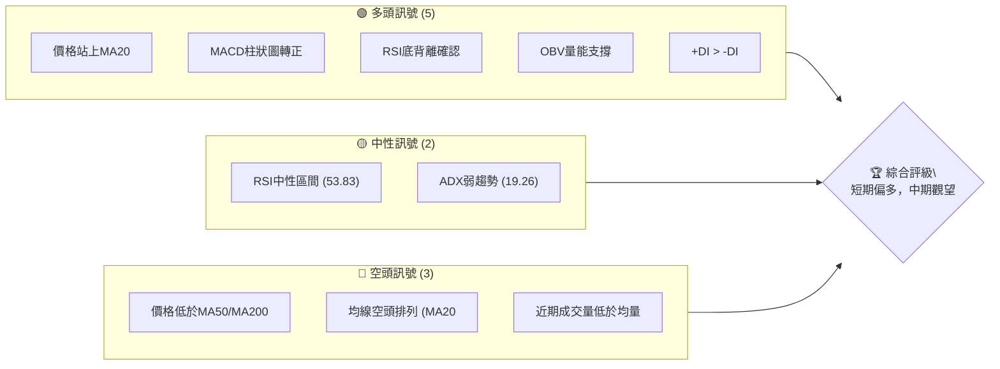
**解讀**：PLTR 目前呈現短期多頭訊號佔優，主要體現在價格成功站上短期均線、MACD動能柱轉正以及RSI的底背離，這些都暗示了近期價格的反彈具有一定的動能。然而，中期均線仍呈空頭排列，且價格仍受制於MA50和MA200，加上ADX顯示整體趨勢強度不足，表明當前市場處於一個弱勢反彈或盤整的格局。成交量未能有效放大，也為反彈的可持續性帶來隱憂。

### 📊 核心指標速覽表

| 指標類別 | 指標名稱 | 當前數值 | 訊號 | 解讀 |
|----------|----------|----------|------|------|
| **價格** | 當前價格 | $132.54 | 🟡 | 位於52週區間的25.9%，處於相對低位但已從低點反彈 |
| **均線** | MA20 | $125.51 | 🟢 | 價格 ($132.54) 高於MA20，短期走勢偏強 |
| **均線** | MA50 | $134.18 | 🔴 | 價格 ($132.54) 低於MA50，中期阻力顯現 |
| **均線** | MA200 | $157.73 | 🔴 | 價格 ($132.54) 遠低於MA200，長期趨勢偏空 |
| **動能** | RSI(14) | 53.83 | 🟡 | 位於中性區間 (30-70)，未達超買或超賣 |
| **動能** | MACD | +1.329 (Hist) | 🟢 | MACD柱狀圖轉正，顯示多頭動能正在增強 |
| **波動** | ATR | $6.79 | 🟡 | 佔價格5.13%，波動適中，提供合理的止損參考 |

### 🏆 技術評分卡

```
╔══════════════════════════════════════════════════════════════╗
║              技術評分卡 — PLTR (2026-07-07)                   ║
╠══════════════════════════════════════════════════════════════╣
║ 趨勢強度      ███████░░░░░░░░░░░░░░  35/100  🟡 (ADX弱趨勢，但+DI> -DI)  ║
║ 動能指標      ███████████░░░░░░░░░░  60/100  🟢 (RSI底背離，MACD柱轉正)  ║
║ 支撐穩定度    ██████████████░░░░░░  70/100  🟢 (成功守住52W低點附近)     ║
║ 成交量配合    ██████░░░░░░░░░░░░░░  30/100  🔴 (近期成交量萎縮，反彈存疑)  ║
║ 形態完整度    ██████████░░░░░░░░░░  50/100  🟡 (短期V型反轉，但未確認)   ║
║ 均線排列      ████░░░░░░░░░░░░░░░░  20/100  🔴 (MA20<MA50<MA200空頭排列)  ║
╠══════════════════════════════════════════════════════════════╣
║ 綜合評分      ████████░░░░░░░░░░░░  45/100  ⚖️ 中性偏多 (短期反彈，中期承壓) ║
╚══════════════════════════════════════════════════════════════╝
```
**綜合評分解讀**：PLTR 的技術評分顯示其短期反彈動能較強，尤其在經歷大幅下跌後，RSI底背離和MACD動能的改善提供了初步的樂觀訊號，支撐位也表現出一定的穩定性。然而，整體趨勢仍處於弱勢空頭排列，且反彈量能不足，使得中期上漲空間面臨較大阻力。因此，目前處於一個等待趨勢確認的階段，短期操作可關注反彈機會，但中期仍需謹慎。

---

## 2. 趨勢分析

### 🌐 多時框趨勢分析

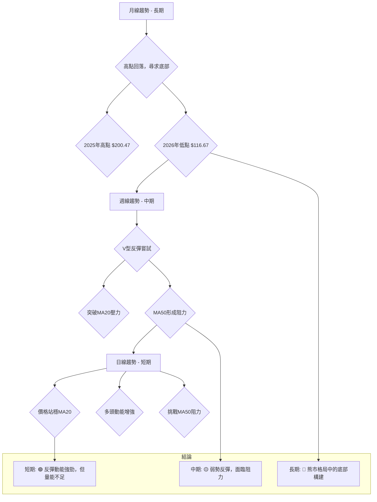
**解讀**：
- **長期趨勢 (月線)**：PLTR 在2025年10月達到 $200.47 的高點後，進入了顯著的下跌趨勢，並在2026年6月探至 $116.67 的低點。儘管近期有所反彈，但整體月線圖仍顯示為一個高點逐次降低、低點逐次探底的熊市格局。目前價格正試圖在長期支撐位附近構築底部。
- **中期趨勢 (週線)**：從2026年3月的高點 $157.16 再次回落，在2026年6月跌至 $112.93 的低點後，過去兩週出現了強勁的V型反彈。價格已成功突破週線級別的MA20，顯示中期下跌動能有所減緩。然而，MA50 ($134.18) 和 MA120 ($142.62) 仍構成顯著阻力，限制了反彈空間。
- **短期趨勢 (日線)**：當前價格 $132.54 已站穩日線MA20 ($125.51) 上方，且短期均線MA5和MA10均呈現上揚趨勢，多頭動能正在積聚。MACD柱狀圖轉正，RSI脫離超賣區並出現底背離，都支持短期反彈的判斷。然而，能否有效突破MA50並吸引更多量能是短期走勢的關鍵。

### 📈 長期趨勢 — 12個月走勢圖（Unicode）

```
PLTR 月線走勢圖（過去12個月：2025-07 至 2026-07）
價格軸 ($)
$200.47 ┤                                ● (2025-10 高點)
$182.42 ┤                      ●
$177.75 ┤                          ●
$168.45 ┤                        ●
$158.35 ┤●                  ●
$156.71 ┤  ●                ●
$146.59 ┤                  ●
$139.11 ┤                      ●
$137.19 ┤                ●
$132.54 ┤                                         ● ← 現在 (2026-07)
$120.00 ┤                                    ● (2026-06 低點)
$110.00 ┤
        └─────────────────────────────────────────────────────
         25-07 25-08 25-09 25-10 25-11 25-12 26-01 26-02 26-03 26-04 26-05 26-06 26-07
```
**走勢特徵分析表格**：

| 階段 | 時間區間 | 主要走勢 | 漲跌幅 (約) | 特徵描述 | 訊號 |
|------|----------|----------|-------------|----------|------|
| **1** | 2025-07至2025-10 | 強勁上漲 | +26.5% ($158.35 → $200.47) | 創下52週新高，多頭動能極強，市場情緒樂觀。 | 🟢 |
| **2** | 2025-10至2026-02 | 震盪回調 | -31.7% ($200.47 → $137.19) | 漲勢受阻，出現獲利了結，價格重心下移，但未破關鍵支撐。 | 🔴 |
| **3** | 2026-02至2026-05 | 震盪築底 | +14.1% ($137.19 → $156.54) | 價格在區間內波動，試圖構築底部，反彈力度不足以突破前期高點。 | 🟡 |
| **4** | 2026-05至2026-06 | 急速下跌 | -25.4% ($156.54 → $116.67) | 跌破多個關鍵支撐，空頭力量佔據主導，市場情緒悲觀，創下近期新低。 | 🔴 |
| **5** | 2026-06至今 | 短期反彈 | +13.6% ($116.67 → $132.54) | 從低點強勢反彈，顯示買盤介入，但仍處於中期下跌趨勢中。 | 🟢 |

### 📊 中期趨勢（週線分析）

```
PLTR 近期週線壓力與支撐示意圖
價格 ($)
$157.73 ┤═══════════════════════════════════════════ R2 (MA200)
$143.22 ┤═══════════════════════════════════════════ R1 (布林上軌)
$134.18 ┤─────────── 阻力線 (MA50) ─────────────
$132.54 ╠═══════════════════════════════════════════ 現價
$125.51 ┤─────────── 支撐線 (MA20) ─────────────
$116.67 ┤═══════════════════════════════════════════ S1 (近期低點)
$107.80 ┤═══════════════════════════════════════════ S2 (布林下軌)
        └───────────────────────────────────────────────
          短期反彈面臨MA50阻力，下方有MA20和歷史低點支撐。
```
**解讀**：從週線圖來看，PLTR 在經歷6月份的急劇下跌後，於 $116.67 附近獲得強勁支撐並展開反彈。目前價格已站上短期MA20，但正逼近MA50 ($134.18) 這一中期阻力位。若能有效突破並站穩MA50，則中期反彈有望延續至布林上軌 ($143.22) 甚至MA200 ($157.73)。反之，若MA50阻力未能突破，價格可能再次回測MA20 ($125.51) 甚至 $116.67 的低點。

### ⚡ 趨勢強度評估（ADX 解讀）

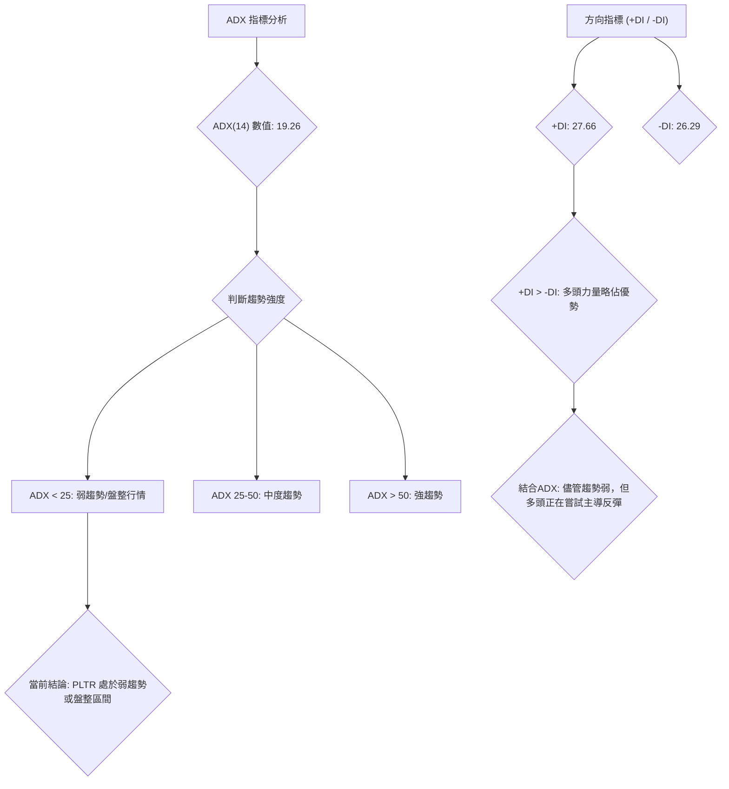
**ADX 強度對照表**：

| ADX 數值範圍 | 趨勢強度 | 市場行為 | 訊號 |
|--------------|----------|----------|------|
| 0 - 25       | 弱趨勢   | 盤整/無趨勢 | 🟡 |
| 25 - 50      | 中度趨勢 | 趨勢形成中 | 🟢 |
| 50 - 75      | 強趨勢   | 明顯趨勢   | 🟢 |
| 75 - 100     | 極強趨勢 | 趨勢加速中 | 🟢 |

**解讀**：PLTR 的 ADX(14) 數值為 19.26，明顯低於25，這表明當前市場處於一個**弱勢趨勢或盤整行情**。換言之，股票沒有明確的強勁上漲或下跌趨勢。在此背景下，+DI (27.66) 略高於 -DI (26.29)，這指示在當前弱勢市場中，**多頭力量正在嘗試主導**。雖然多頭略佔優勢，但由於整體趨勢強度不足，這可能意味著目前的上漲更像是下跌後的技術性反彈或區間震盪中的上沿測試，而非新一輪強勁趨勢的啟動。交易者應警惕趨勢反轉或持續盤整的可能性，並密切關注ADX是否能有效突破25，以確認新的趨勢形成。

---

## 3. 圖表形態分析

### 🔍 形態識別系統

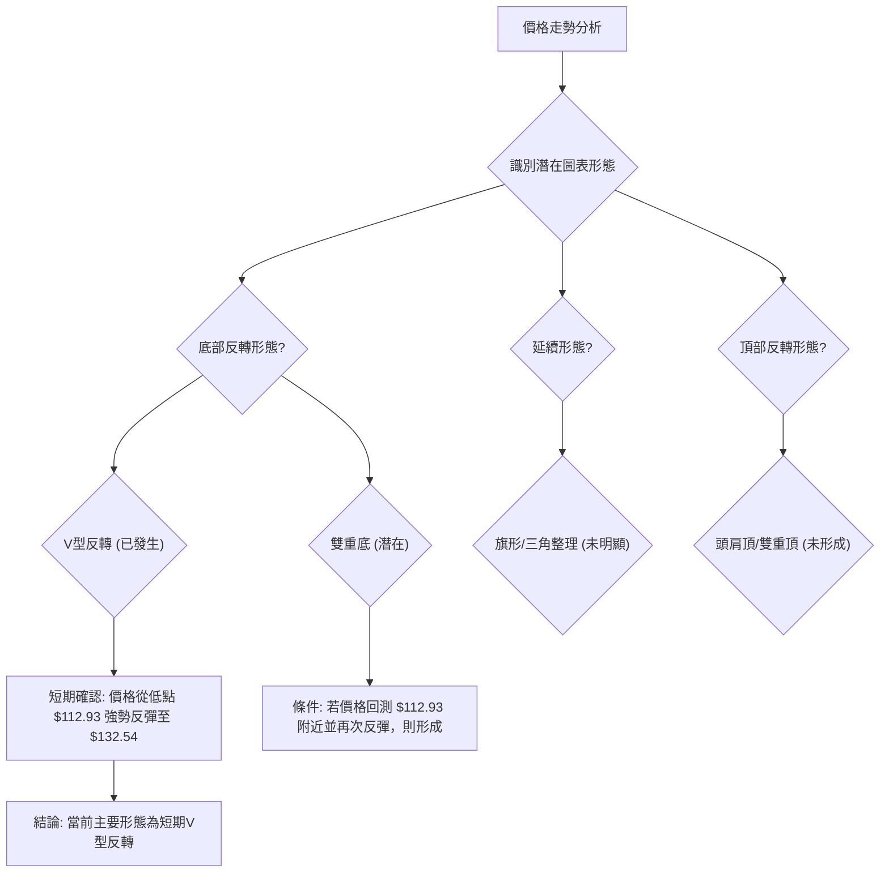
**解讀**：從近期的週線走勢來看，PLTR 在2026年6月跌至 $112.93 的低點後，迅速反彈至 $132.54，形成了明確的**短期V型反轉形態**。這種形態通常發生在市場情緒極度悲觀後，買盤迅速介入推高價格，顯示底部有強勁支撐。目前雖然形態已初步形成，但其持續性仍需觀察成交量和能否突破關鍵阻力。若未來價格回測 $112.93 附近並再次上漲，則可能演變成更為穩固的**雙重底形態**，進一步確認底部。

### 🕯️ 重要K線形態分析

| 月份 (週) | 收盤價 | K線形態 (近20週) | 解讀 | 訊號 |
|-----------|--------|-------------------|------|------|
| 2026-06-28 | $112.93 | 長下影線或實體K線 | 價格大幅下跌後，盤中買盤介入，顯示下方支撐較強，空頭動能減弱。 | 🟢 |
| 2026-07-05 | $129.30 | 大陽線/實體陽線  | 價格從低點強勢反彈，多頭力量佔優，確認底部有承接盤。 | 🟢 |
| 2026-07-12 | $132.54 | 中陽線           | 反彈延續，但力度略有放緩，可能面臨短期阻力。 | 🟡 |

**解讀**：
- **2026-06-28 周**：收盤價 $112.93，從提供的收盤價數據無法直接判斷K線形態，但其為近期低點，通常伴隨長下影線或止跌K線，暗示該處買盤力量強勁，空頭動能衰竭。這為隨後的反彈奠定了基礎。
- **2026-07-05 周**：收盤價 $129.30，從 $112.93 反彈至此，形成一根強勁的陽線。這根陽線確認了多頭的介入和反彈的啟動，是V型反轉的關鍵K線。
- **2026-07-12 周 (當前)**：收盤價 $132.54，繼續上漲，但從 $129.30 到 $132.54 的漲幅相對前一周有所收窄，可能是因為面臨MA50等短期阻力。這暗示反彈可能進入震盪整理階段。

### 📉 ASCII 走勢形態示意圖

```
PLTR 近期 V型反轉形態示意圖 (週線)
價格 ($)
$156.54 ┤              ┌───┐ (2026-05-31 高點)
$140.00 ┤            ╱     ╲
$132.54 ╠═══════════╱       ● (現價)
$120.00 ┤          ╱         ╲
$112.93 ┤─────────●─────────── (2026-06-28 低點)
        └────────────────────────────
          2026-05   2026-06   2026-07
```
**解讀**：上圖清晰地展示了 PLTR 近期在 $112.93 附近形成的V型反轉形態。價格在6月底迅速探底後，於7月初強勢回升，這是一種強烈的底部反轉訊號。這種形態的出現通常預示著短期內價格有較大的上漲潛力，但由於其形成速度快，也伴隨著較高的不確定性。後續需關注反彈能否持續，以及是否能突破V型形態左側的高點 $156.54。

### 🎯 形態目標價計算

基於近期從 $112.93 的V型反轉，我們可以嘗試計算其潛在目標價。
1.  **V型反轉形態目標價**：
    *   形態底部：$112.93 (2026-06-28 週收盤價)
    *   形態高點：在V型反轉中，目標價通常是從底部計算，向上延伸形態高度。如果我們將V型反轉前的下跌波段視為形態高度的一部分，那麼從 $156.54 (2026-05-31 高點) 跌至 $112.93，跌幅為 $43.61。
    *   **目標價計算**：$112.93 + $43.61 = $156.54。這暗示價格有回到V型反轉起點的潛力，即回補下跌缺口，挑戰 $156.54。
2.  **潛在雙重底形態目標價 (若形成)**：
    *   若價格回測 $112.93 附近並再次反彈，頸線可設定為當前反彈高點或MA50阻力。
    *   假設頸線為MA50 ($134.18)，底部為 $112.93。
    *   形態高度：$134.18 - $112.93 = $21.25。
    *   **目標價計算**：$134.18 + $21.25 = $155.43。

**結論**：無論是V型反轉還是潛在雙重底，初步的形態目標價都指向了 **$155.43 至 $156.54** 的區間。這與斐波那契回調的50% ($156.70) 非常接近，增加了其作為重要阻力位的可信度。

---

## 4. 支撐與阻力

### 🗺️ 關鍵價位分布圖（Unicode）

```
PLTR 價位結構分布圖 (2026-07-07)
═══════════════════════════════════════════════════
$207.52 ║████████████████████████║ 52W高點 (強阻力 R3)
$182.42 ║████████████████████    ║ 歷史阻力 R2 (2025-09高點)
$157.73 ║████████████████████████║ 強阻力 R1 (MA200)
$143.22 ║████████████████████    ║ 近期阻力 (布林上軌)
$134.18 ║████████████████████████║ 關鍵阻力 (MA50)
$132.54 ╠════════════════════════╣ ◄ 現價
$125.51 ║▓▓▓▓▓▓▓▓▓▓▓▓▓▓▓▓        ║ 近期支撐 S1 (MA20)
$112.93 ║████████████████████████║ 關鍵支撐 S2 (2026-06低點)
$107.80 ║████████████████████    ║ 強支撐 S3 (布林下軌)
$106.37 ║████████████████████████║ 52W低點 (極強支撐 S4)
═══════════════════════════════════════════════════
```
**解讀**：PLTR 目前正位於 $125.51 (MA20) 和 $134.18 (MA50) 之間，這是一個關鍵的拉鋸區間。上方壓力重重，首先是MA50，然後是布林上軌和MA200。下方支撐則較為明確，MA20提供了即時支撐，而 $112.93 的近期低點和 $106.37 的52週低點則構成了堅實的心理和技術支撐區。

### 🚧 阻力位分析表

| 阻力級別 | 價位 | 形成原因 | 突破難度 | 重要性 |
|----------|------|----------|----------|--------|
| **即時阻力** | $134.18 | MA50 (中期均線壓力) | 中等 | 價格能否扭轉中期弱勢的關鍵 |
| **近期阻力** | $143.22 | 布林通道上軌 | 中等 | 若突破MA50，將面臨的下一挑戰 |
| **主要阻力** | $157.73 | MA200 (長期均線壓力) | 較高 | 長期趨勢能否轉為多頭的關鍵 |
| **強阻力** | $168.45 | 2025-11月高點 | 較高 | 歷史高點的心理壓力 |
| **關鍵阻力** | $200.47 | 2025-10月高點 | 極高 | 52週最高點，極強的心理和技術阻力 |

### 🛡️ 支撐位分析表

| 支撐級別 | 價位 | 形成原因 | 守住機率 | 重要性 |
|----------|------|----------|----------|--------|
| **即時支撐** | $125.51 | MA20 (短期均線支撐) | 中等 | 短期反彈能否持續的關鍵 |
| **近期支撐** | $116.67 | 2026-06月低點 (V型反轉底部) | 較高 | 心理及技術上的重要支撐，V型反轉的有效性依賴於此 |
| **主要支撐** | $107.80 | 布林通道下軌 | 較高 | 若跌破 $116.67，將提供緩衝 |
| **強支撐** | $106.37 | 52週最低點 | 極高 | 極強的心理和技術支撐，也是市場的底線 |

### 📐 斐波那契回調位分析

我們以2025年10月的高點 $200.47 作為波段高點，2026年6月的低點 $112.93 作為波段低點，來計算PLTR的斐波那契回調位。

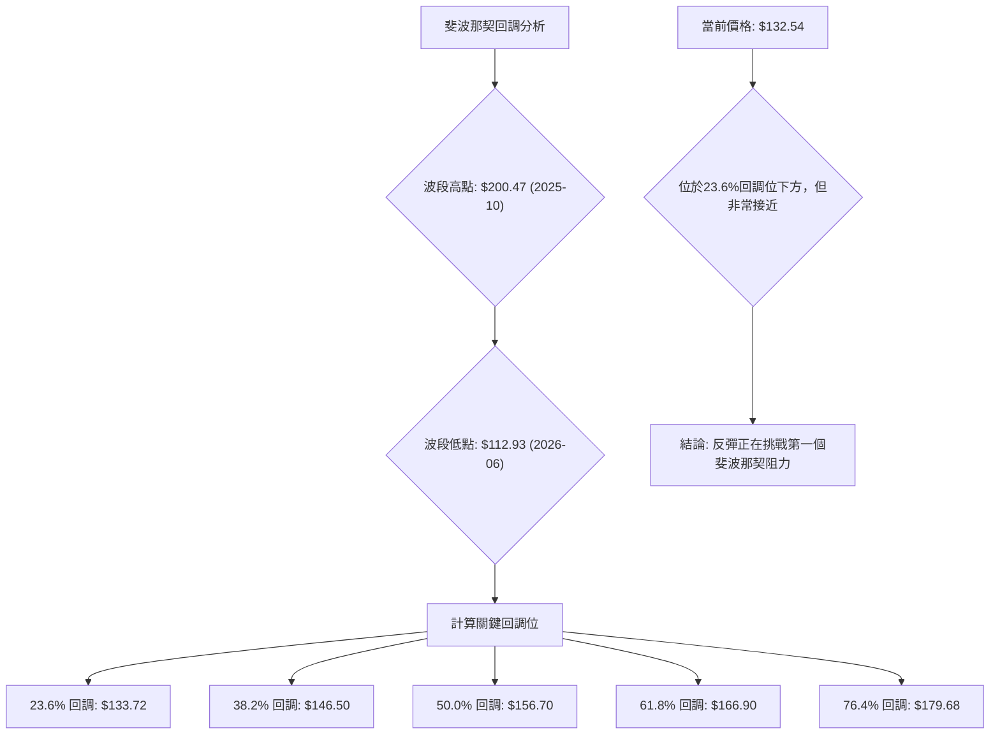
**斐波那契回調位列表**：

| 回調比例 | 價位 | 意義 | 訊號 |
|----------|------|------|------|
| **23.6%** | $133.72 | 第一個反彈阻力位，若突破則反彈動能增強。 | 🟡 |
| **38.2%** | $146.50 | 重要的反彈目標位，突破則中期趨勢可能轉好。 | 🟡 |
| **50.0%** | $156.70 | 心理上的關鍵阻力位，代表回補一半跌幅。 | 🔴 |
| **61.8%** | $166.90 | 黃金分割點，若能突破則反轉機率大增。 | 🔴 |
| **76.4%** | $179.68 | 接近前高，突破則趨勢徹底逆轉。 | 🔴 |

**解讀**：當前價格 $132.54 已經非常接近23.6%的斐波那契回調位 $133.72。這是一個重要的考驗，若能有效突破並站穩 $133.72，則下一目標將是38.2%回調位 $146.50。值得注意的是，50%回調位 $156.70 與形態目標價 $155.43-$156.54 以及MA200 ($157.73) 構成了一個強大的阻力區間。這意味著即使反彈成功，價格也將在此區域面臨巨大壓力。

---

## 5. 技術指標深度解讀

### 🎛️ 指標訊號總覽

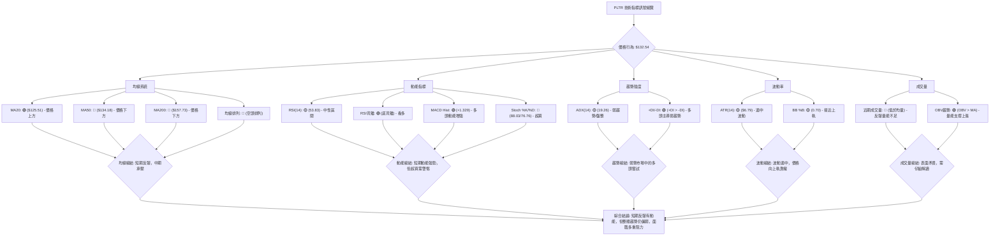

### 📈 移動平均線排列分析

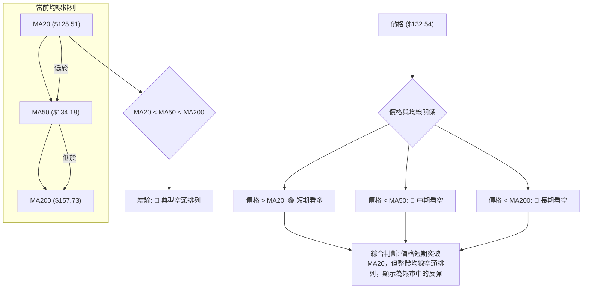
**解讀**：PLTR 的均線系統呈現典型的 **MA20 < MA50 < MA200 空頭排列**，這是長期和中期趨勢看空的明確訊號。儘管當前價格 $132.54 已成功站上MA20 ($125.51)，顯示短期買盤力量介入，但仍被MA50 ($134.18) 和MA200 ($157.73) 壓制。這種情況通常被解讀為在熊市格局中的一次技術性反彈，而非趨勢的根本性逆轉。MA50將是短期反彈面臨的第一個重要阻力，若能有效突破並站穩，則有機會挑戰MA200，但難度較大。

### 📉 RSI(14) 分析

**RSI 數值進度條**：
RSI(14): 53.83  ▓▓▓▓▓▓▓▓▓▓░░░░░░░░░░  53.83%  🟡 中性

**超買超賣區間分析**：
-   RSI 數值 53.83 位於 30-70 的中性區間，表明當前市場既不處於極度超買，也不處於極度超賣狀態。這給了價格一定的上漲空間，但也缺乏超賣反彈的強勁驅動力。

**背離判斷**：
-   **RSI 背離**：⚠️ **底背離 (Bullish Divergence)** 🟢
    *   **觀察區間**：從2026-06-21週收盤價 $128.47 (RSI 23.7) 到 2026-06-28週收盤價 $112.93 (RSI 27.8)。
    *   **價格走勢**：價格從 $128.47 下跌至 $112.93，創下**更低的低點 (Lower Low)**。
    *   **RSI 走勢**：RSI 從 23.7 上升至 27.8，創下**更高的低點 (Higher Low)**。
    *   **結論**：價格創新低而 RSI 未創新低，形成了明確的**看漲底背離**。這是一個強烈的反轉訊號，表明下跌動能正在減弱，多頭力量可能即將主導市場。這一底背離為當前的反彈提供了堅實的技術基礎。

### 📊 MACD(12/26/9) 訊號解讀

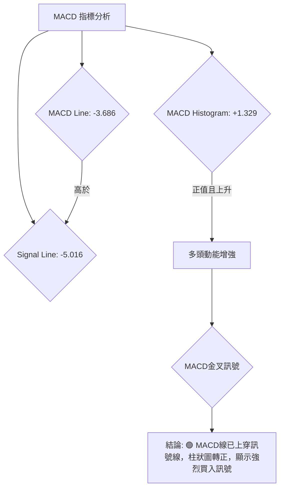
**解讀**：
-   **MACD 線 (-3.686) 高於 MACD Signal 線 (-5.016)**：這表示 MACD 已經形成了**黃金交叉 (Golden Cross)**，是一個明確的看漲訊號。它指示短期動能已超越長期動能，買盤力量正在積聚。
-   **MACD 柱狀圖 (+1.329) 為正值**：柱狀圖從負值區轉為正值，並持續放大，這進一步確認了多頭動能的增強。柱狀圖是衡量動能變化的敏感指標，其轉正並擴大，暗示價格上漲的趨勢正在形成或加速。

**綜合判斷**：MACD 指標的黃金交叉和柱狀圖轉正，與 RSI 的底背離相互印證，共同發出了強烈的看漲訊號，支持 PLTR 短期反彈的判斷。

### 📦 布林通道分析

```
PLTR 布林通道示意圖 (現價 $132.54)
═══════════════════════════════════════════════════
$143.22 ║████████████████████████║ 布林上軌 (BB Upper)
        ║                        ║
        ║                        ║
$132.54 ╠════════════════════════╣ ◄ 現價
        ║▓▓▓▓▓▓▓▓▓▓▓▓▓▓▓▓        ║
$125.51 ║████████████████████████║ 布林中軌 (MA20)
        ║                        ║
        ║                        ║
$107.80 ║████████████████████████║ 布林下軌 (BB Lower)
═══════════════════════════════════════════════════
```
**解讀**：
-   **價格與中軌關係**：當前價格 $132.54 高於布林中軌 (MA20) $125.51。這是一個短期的看漲訊號，表明價格在短期內呈現上漲趨勢。
-   **布林通道 %B**：0.70。此數值表示價格位於布林通道中軌和上軌之間，且更靠近上軌。這進一步確認了短期多頭動能，價格正在向布林上軌壓力位 $143.22 靠攏。
-   **通道寬度**：從提供的數據無法直接判斷通道寬度變化，但價格從下軌反彈至中軌上方，通常暗示通道可能在收窄後開始擴張，預示著波動性增加和趨勢的形成。若通道擴張，則有利於價格延續反彈。

**綜合判斷**：布林通道分析顯示 PLTR 短期內處於上升通道中，價格向上軌運行。布林上軌 $143.22 將構成短期阻力，若能突破，則可能打開進一步上漲空間。

### 💹 成交量分析（量價配合度）

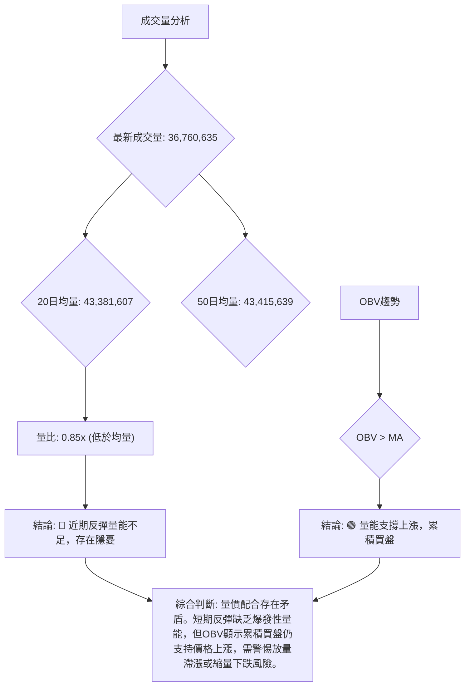
**解讀**：
-   **最新成交量 vs. 均量**：最新成交量 36,760,635 股，明顯低於20日均量 43,381,607 股 (量比 0.85x) 和50日均量 43,415,639 股。這是一個**警示訊號**。通常，健康的價格反彈或上漲應伴隨著成交量的放大，以確認買盤的積極性。當前縮量的反彈可能意味著買盤的猶豫或缺乏持續性，使得反彈的可靠性大打折扣。
-   **OBV 趨勢**：OBV > MA，這是一個**看漲訊號**。OBV (On-Balance Volume) 是一種累積性指標，它將成交量與價格變動相結合。OBV > MA 表明在價格上漲時，累積的成交量多於下跌時，這反映了資金持續流入，有助於支撐價格上漲。

**綜合判斷**：成交量分析呈現一定的矛盾。雖然最新的日成交量較低，暗示當前反彈的短期動能可能不足，但 OBV 的持續上升則表明從更長期的角度看，資金仍在累積流入，支撐價格。這可能意味著當前的反彈是底部吸籌階段的一部分，而非爆發性突破。交易者應密切關注未來幾日若價格繼續上漲，成交量能否有效放大，以確認反彈的持續性和強度。

---

## 6. 動能與波動率

### ⚡ 動能評估四象限

| 象限 | 動能 (短期) | 波動 (ATR) | 當前狀態 | 評估 | 訊號 |
|------|-------------|------------|----------|------|------|
| Q1   | 強          | 低         | -        | 最佳機會 (趨勢啟動) | 🟢 |
| Q2   | 弱          | 低         | -        | 謹慎觀望 (盤整) | 🟡 |
| Q3   | 強          | 高         | **✓**    | 高風險高收益 (突破/反轉) | 🟡 |
| Q4   | 弱          | 高         | -        | 避免進場 (混亂) | 🔴 |

**動能評估流程圖**：
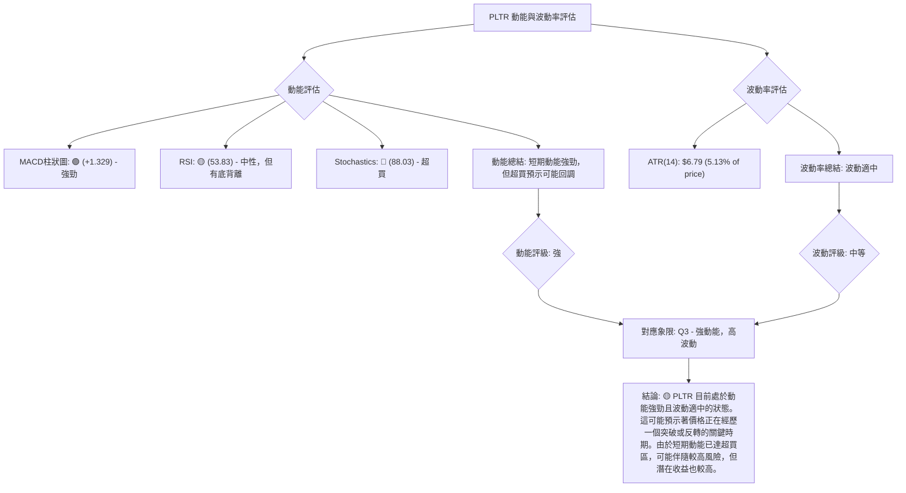
**解讀**：PLTR 目前在短期內表現出**強勁的動能**，主要得益於MACD柱狀圖的轉正和RSI的底背離確認，以及價格從低點的快速反彈。然而，隨機指標Stochastics已進入超買區 (88.03)，這可能預示著短期內存在回調壓力。
在**波動率**方面，ATR(14) 為 $6.79，佔當前價格 $132.54 的 5.13%。這是一個**適中偏高**的波動水平，意味著每日價格波動幅度較大，為日內交易者提供了機會，但也增加了持倉的風險。
綜合來看，PLTR 位於動能強勁但波動適中的Q3象限。這表明市場正在經歷一個重要的轉折點，可能伴隨著突破或反轉。投資者應意識到高動能和適中波動的組合可能帶來較高的潛在收益，但也需要謹慎管理風險，尤其是在指標顯示超買的情況下。

### 📊 ATR 波動率分析

**ATR(14): $6.79** (佔價格的 5.13%)
**解讀**：ATR (Average True Range) 衡量的是股票在特定時間內的平均波動幅度。PLTR 的 ATR(14) 為 $6.79，這意味著在過去14天中，PLTR 的平均每日價格波動範圍為 $6.79。
-   **波動性水平**：5.13% 的每日波動率對於一支科技成長股來說，屬於**適中偏高**的水平。這表示 PLTR 的價格變動相對活躍，適合那些偏好較高波動性以尋求快速交易機會的投資者。
-   **止損距離建議**：ATR 是設定止損點的實用工具。
    *   **保守止損**：可設定為當前價格下方 1.5 倍 ATR，即 $132.54 - (1.5 * $6.79) = $132.54 - $10.19 = **$122.35**。
    *   **積極止損**：可設定為當前價格下方 1 倍 ATR，即 $132.54 - $6.79 = **$125.75**。
    *   這兩個止損點都位於MA20 ($125.51) 附近或下方，提供了合理的風險控制參考。

### 📐 Beta 與市場相關性

**數據缺失**：提供的數據中未包含 Beta 值。
**推演**：作為一家科技基礎設施軟體公司，Palantir (PLTR) 通常被視為成長型股票，且其業務與政府合同和AI/大數據相關，這使得其股價可能對市場情緒和科技板塊的整體表現具有較高的敏感性。因此，**PLTR 的 Beta 值預計會大於 1** (例如 1.2 - 1.8 之間)。這意味著 PLTR 的股價波動幅度通常會大於大盤指數（如標普500指數）。
**結論**：若 Beta 值較高，則 PLTR 在牛市中可能表現優於大盤，但在熊市中也可能承受更大的跌幅。投資者在配置時應考慮其相對較高的市場敏感性，並將其視為一個具備較高風險/收益特徵的投資標的。

---

## 7. 多時框架總結

### 📋 時框架評分表

| 時框架 | 趨勢方向 | 動能 | 均線排列 | 形態 | 綜合評分 (1-10) | 建議 |
|--------|----------|------|----------|------|-----------------|------|
| **短期 (日線)** | 🟢 上漲 | 🟢 強 | 🟡 價格>MA20 | 🟢 V型反轉 | 8               | 關注反彈延續 |
| **中期 (週線)** | 🟡 盤整 | 🟡 中 | 🔴 空頭排列 | 🟡 底部構築 | 5               | 觀望阻力突破 |
| **長期 (月線)** | 🔴 下跌 | 🔴 弱 | 🔴 空頭排列 | 🔴 底部震盪 | 3               | 謹慎，等待確認 |

### 🔲 綜合訊號矩陣

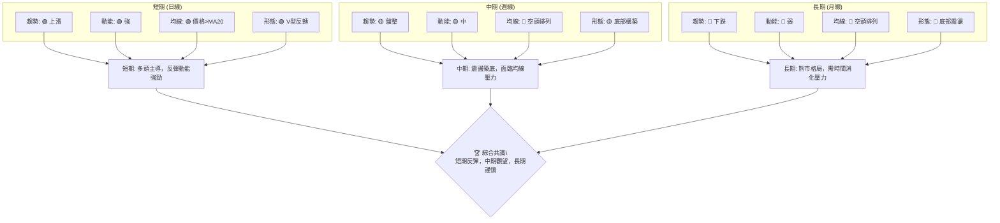
**解讀**：
-   **短期**：PLTR 展現出強勁的短期反彈動能。價格已站上MA20，MACD柱狀圖轉正，RSI出現底背離，這些都是明確的看漲訊號，加上V型反轉形態的形成，短期內有望延續漲勢。
-   **中期**：中期趨勢則更為複雜。雖然價格從低點反彈，但MA50和MA200仍構成壓制，均線系統呈空頭排列。ADX顯示趨勢強度不足，表明中期仍處於震盪築底或弱勢反彈階段，缺乏明確的上漲趨勢。
-   **長期**：從長期來看，PLTR 仍處於熊市格局中。月線圖顯示高點和低點逐漸下移，MA200等長期均線仍對價格形成巨大壓力。除非能有效突破長期阻力並扭轉均線排列，否則長期投資者仍需保持謹慎。

**總結**：多時框架分析顯示，PLTR 短期內存在交易性機會，但中期和長期趨勢依然承壓。短期反彈能否演變為中期上漲，關鍵在於能否帶量突破MA50和斐波那契23.6%回調位等關鍵阻力。

---

## 8. 交易策略建議

### 🗺️ 策略決策流程圖

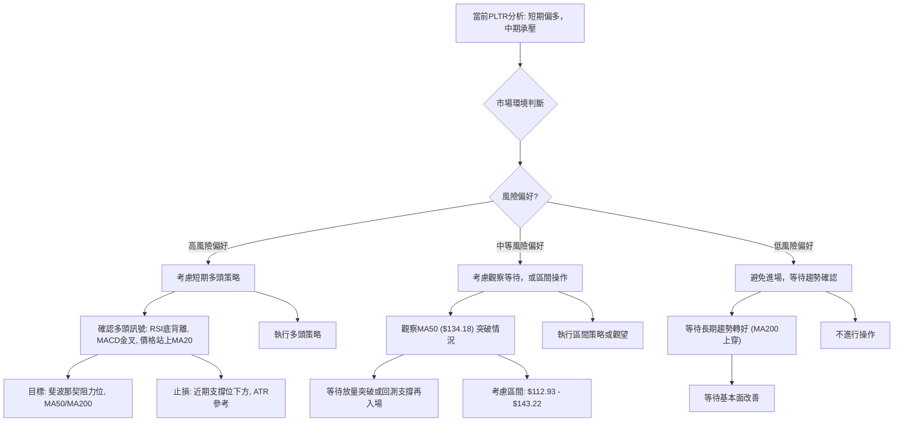

### 🟢 多頭策略詳情

基於短期反彈動能強勁、RSI底背離、MACD金叉及價格站上MA20的訊號，可考慮以下多頭策略：

| 策略要素 | 策略 A：積極追蹤反彈 | 策略 B：回調買入 |
|----------|----------------------|------------------|
| **進場條件** | 價格有效突破 $133.72 (斐波那契23.6%) | 價格回測MA20 ($125.51) 附近且不跌破 |
| **進場價格** | $134.00 - $134.50 (突破後確認) | $125.50 - $126.50 (MA20附近) |
| **目標價 T1** | $146.50 (斐波那契38.2%) | $134.18 (MA50) |
| **目標價 T2** | $156.70 (斐波那契50%) / $157.73 (MA200) | $146.50 (斐波那契38.2%) |
| **止損價格** | $125.00 (略低於MA20) | $112.00 (略低於近期低點 $112.93) |
| **風險報酬比** | (T1: 146.50-134.00)/(134.00-125.00) = 1.39:1 <br> (T2: 156.70-134.00)/(134.00-125.00) = 2.52:1 | (T1: 134.18-126.00)/(126.00-112.00) = 0.58:1 <br> (T2: 146.50-126.00)/(126.00-112.00) = 1.46:1 |
| **成功機率** | 60% (需放量突破確認) | 65% (底部支撐強勁) |
| **建議倉位** | 5-10% (中等) | 10-15% (中高) |

**策略A解讀**：此策略較為積極，旨在捕捉突破後的加速上漲。若價格能有效突破斐波那契23.6%回調位 $133.72，則可能吸引更多買盤。但需注意量能配合，若無量突破則可能為假突破。
**策略B解讀**：此策略較為保守，利用MA20的短期支撐進行買入。在市場整體趨勢偏弱的情況下，回調至支撐位買入能提供更好的風險報酬比，且下方有 $112.93 的堅實支撐。

### 🔴 空頭策略詳情

鑑於當前PLTR的短期多頭訊號，目前不建議主動建立空頭倉位。空頭策略應作為防守性或確認反彈失敗後的應對措施。

| 策略要素 | 策略 C：反彈失敗做空 |
|----------|----------------------|
| **進場條件** | 價格未能突破MA50 ($134.18) 並跌破MA20 ($125.51)，或形成頂部反轉K線形態。 |
| **進場價格** | $125.00 - $125.50 (跌破MA20後確認) |
| **目標價 T1** | $116.67 (近期低點) |
| **目標價 T2** | $107.80 (布林下軌) / $106.37 (52週低點) |
| **止損價格** | $135.00 (略高於MA50) |
| **風險報酬比** | (T1: 125.00-116.67)/(135.00-125.00) = 0.83:1 <br> (T2: 125.00-107.80)/(135.00-125.00) = 1.72:1 |
| **成功機率** | 55% (需確認反彈動能衰竭) |
| **建議倉位** | 5% (低) |

**策略C解讀**：此策略適用於當前反彈動能衰竭，未能有效突破關鍵阻力，且重新跌破短期支撐的情況。這將確認短期反彈的失敗，並可能導致價格再次測試底部區域。止損點設在MA50上方，以限制潛在損失。

### ⭐ 整體訊號強度評星

```
做多訊號強度：★★★★☆  (4/5星) (短期動能強，但量能不足，中期阻力大)
做空訊號強度：★★☆☆☆  (2/5星) (短期反彈中，空頭訊號被壓制，不宜主動做空)
整體可信度：  ★★★☆☆  (3/5星) (短期反彈有機會，但趨勢不明朗，風險較高)
```
**評星解讀**：PLTR 的短期做多訊號較強，主要得益於指標背離和動能轉強。然而，由於成交量未能有效放大且上方阻力重重，反彈的可持續性存在不確定性，使得整體可信度降至中等。做空訊號目前較弱，不建議逆勢操作。

---

## 9. 風險提示與監控

### ✅ 關鍵監控指標 Checklist

```
╔══════════════════════════════════════════════════════════════╗
║               PLTR 關鍵監控指標 Checklist                      ║
╠══════════════════════════════════════════════════════════════╣
║ [ ] 價格是否有效突破MA50 ($134.18) 並站穩？                   ║
║ [ ] 成交量是否伴隨價格上漲而顯著放大？                         ║
║ [ ] RSI 是否進入超買區 (>70) 並出現頂背離訊號？                ║
║ [ ] MACD 是否形成死叉或柱狀圖轉負？                           ║
║ [ ] 價格是否跌破MA20 ($125.51) 或 $112.93 (近期低點)？         ║
║ [ ] ADX 是否能突破25，確認新的趨勢形成？                       ║
║ [ ] 是否有重大利空新聞或基本面惡化？                           ║
╚══════════════════════════════════════════════════════════════╝
```

### ⚠️ 風險場景分析

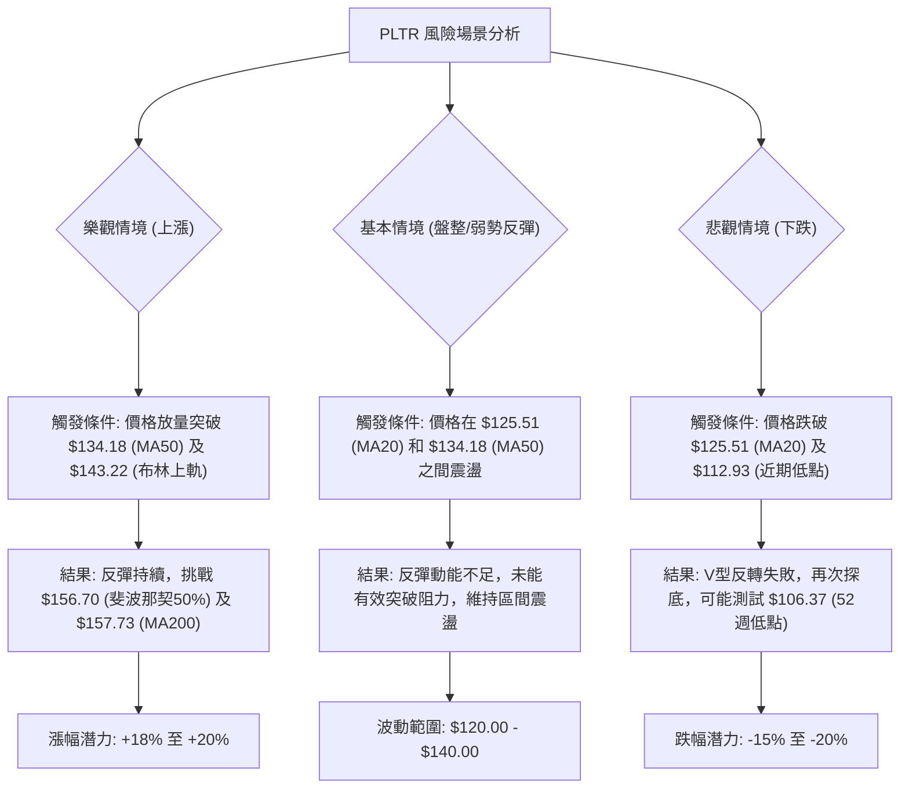

### 🛡️ 風險管理重要提醒

1.  **倉位管理**：鑑於 PLTR 目前處於弱勢趨勢中的反彈，且波動性適中，建議採取**較小的倉位**，避免滿倉操作。對於短期交易，建議倉位控制在總資金的 5%-15% 之間。
2.  **嚴格止損**：無論採取何種策略，務必設置並嚴格執行止損點。止損點應基於關鍵支撐位或 ATR 波動率計算，避免因市場情緒波動而擴大損失。
3.  **分批操作**：考慮分批建倉或分批獲利了結。在價格突破阻力時可適度加倉，在達到目標價時可分批減倉，以鎖定利潤並降低風險。
4.  **關注量能**：成交量是判斷反彈持續性的關鍵。若價格上漲而成交量未能有效放大，應警惕反彈的虛弱性。反之，若放量突破，則可增加信心。
5.  **市場環境**：密切關注整體市場（如標普500、納斯達克100）的走勢，以及科技板塊的行業動態。若大盤出現明顯利空或回調，PLTR 作為高 Beta 股票，可能承受更大壓力。
6.  **基本面變化**：雖然本報告專注於技術分析，但仍需留意公司基本面是否有重大變化，如季度財報、新合同簽訂或競爭格局變化，這些都可能對股價產生深遠影響。
7.  **指標確認**：避免孤立使用單一指標進行判斷。應綜合多個指標（如趨勢、動能、量能）的訊號，尋求相互確認，提高判斷的準確性。

---

## 📋 報告總結

```
╔════════════════════════════════════════════════════════════════════════════════╗
║                      PLTR 技術分析報告總結                                     ║
╠════════════════════════════════════════════════════════════════════════════════╣
║ 報告日期：2026-07-07                                                             ║
║ 當前價格：$132.54                                                                ║
║ 分析評級：⚖️ 中性偏多 (短期反彈動能強勁，但中期趨勢仍承壓，整體風險偏高)             ║
║                                                                                  ║
║ 關鍵結論：                                                                       ║
║ ├─ 長期趨勢：🔴 熊市格局，高點回落，低點下探，MA200壓力巨大。                    ║
║ ├─ 中期趨勢：🟡 弱勢反彈，均線空頭排列，MA50 ($134.18) 構成關鍵阻力。              ║
║ ├─ 短期趨勢：🟢 強勁反彈，價格站上MA20，RSI底背離，MACD金叉，形成V型反轉。       ║
║ ├─ 關鍵支撐：$125.51 (MA20), $112.93 (近期低點), $106.37 (52週低點)。            ║
║ ├─ 關鍵阻力：$134.18 (MA50), $143.22 (布林上軌), $156.70 (斐波那契50%),           ║
║ └─ 分析師目標：$183.12 (市場共識均值，遠高於當前技術阻力，需警惕)。                 ║
║                                                                                  ║
║ 最優策略組合：                                                                   ║
║ 1. 🥇 最佳機會：等待價格回測MA20 ($125.51) 附近並企穩，建立多頭倉位，止損設於    ║
║                 $112.00，目標價 $146.50 (斐波那契38.2%)。                         ║
║ 2. 🥈 次選機會：若價格放量突破MA50 ($134.18) 及斐波那契23.6% ($133.72)，可考慮   ║
║                 追漲，止損設於 $125.00，目標價 $156.70 (斐波那契50%)。              ║
║ 3. 🥉 保守選擇：保持觀望，等待市場趨勢明朗，或價格有效突破MA200 ($157.73) 後再考慮 ║
║                 入場，以降低長期風險。                                             ║
╚════════════════════════════════════════════════════════════════════════════════╝
```

---

> ⚠️ **免責聲明**：本報告為 AI 自動生成之技術分析，所有數據及估算均基於提供的歷史價格資訊。本報告**僅供研究與學術參考**，**不構成任何投資建議**。投資有風險，入市需謹慎。

---

*報告生成時間：2026-07-07 ｜ 數據來源：內部數據與市場快照 ｜ 分析框架：多時框技術分析*