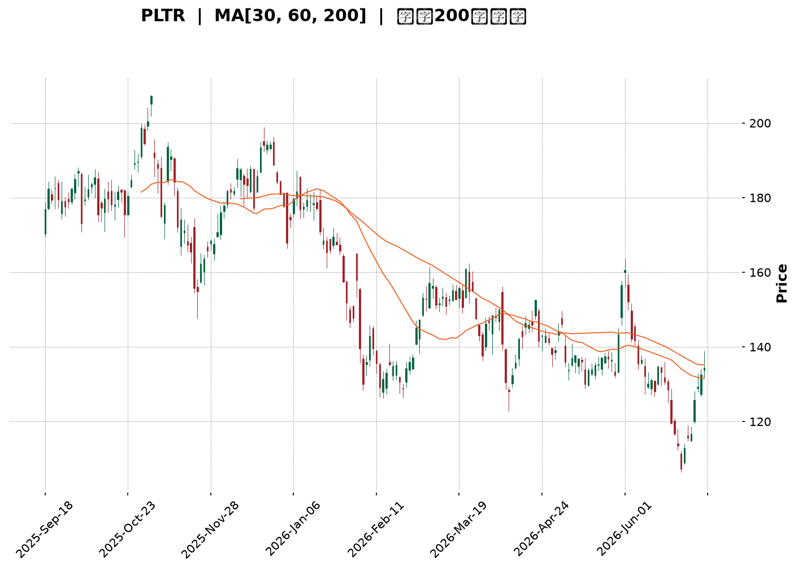
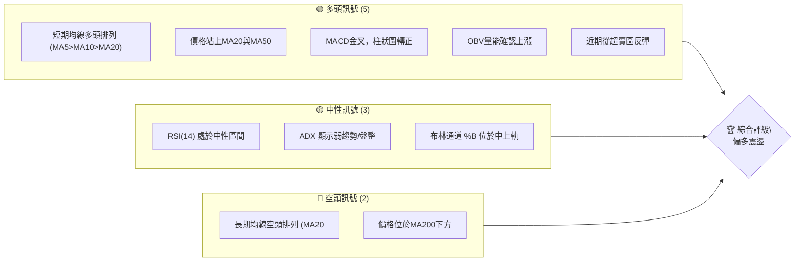
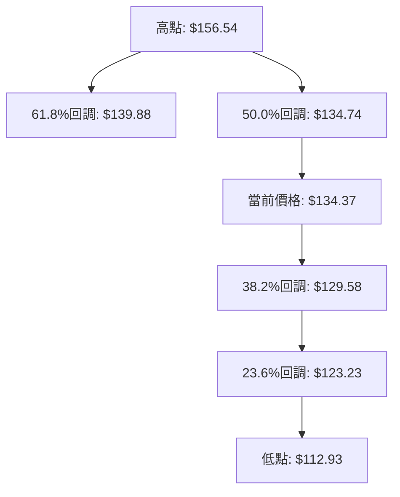
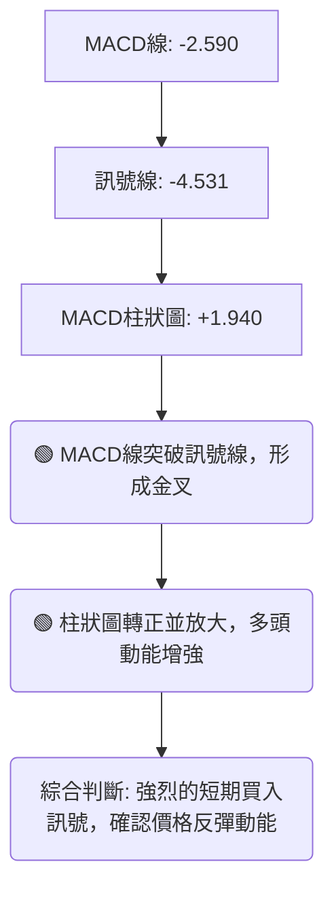
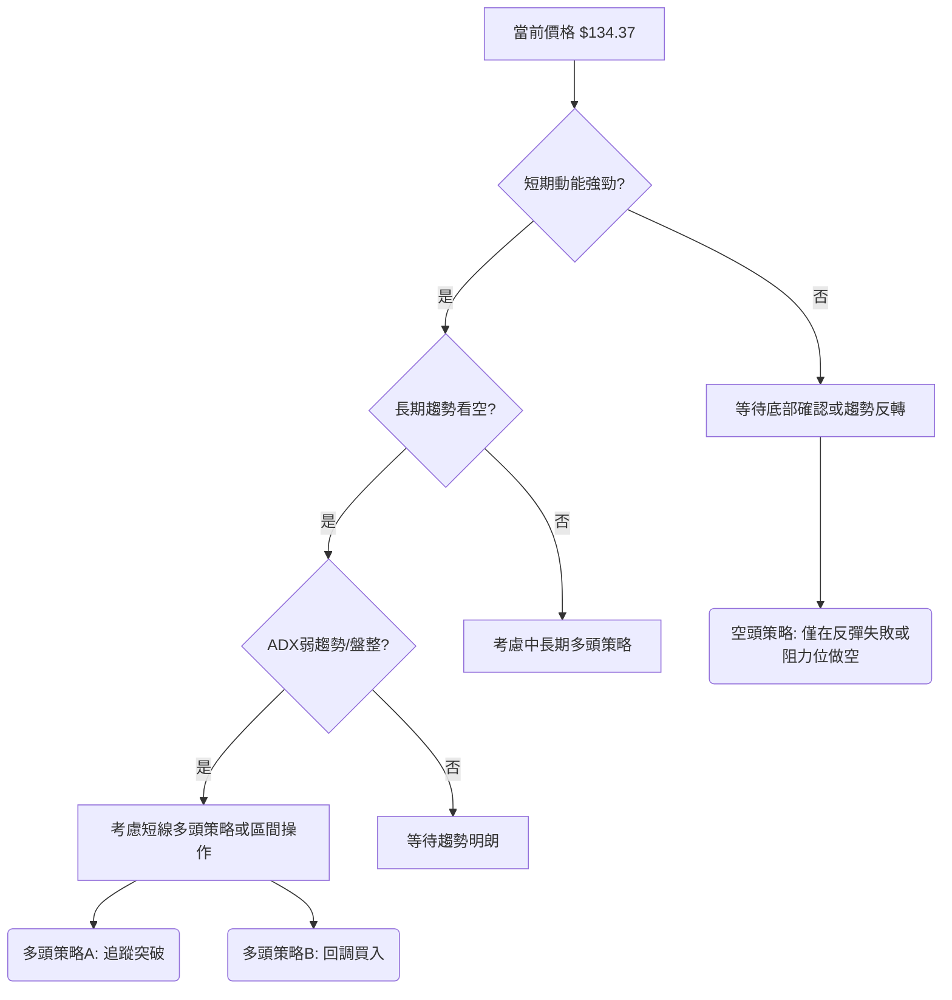

<details>
<summary>📊 靜態圖表 (點擊展開)</summary>

</details>

<html>
<head><meta charset="utf-8" /></head>
<body>
    <div style="height:500px; width:100%;">                        <script>window.PlotlyConfig = {MathJaxConfig: 'local'};</script>
        <script charset="utf-8" src="https://cdn.plot.ly/plotly-3.6.0.min.js" integrity="sha256-QaOVwtVY0T02VaHrr6pnoHLCwayMJp4O5n4YyaE3rJk=" crossorigin="anonymous"></script>                <div id="candlestick-chart" class="plotly-graph-div" style="height:100%; width:100%;"></div>            <script>                window.PLOTLYENV=window.PLOTLYENV || {};                                if (document.getElementById("candlestick-chart")) {                    Plotly.newPlot(                        "candlestick-chart",                        [{"close":{"dtype":"f8","bdata":"AAAAQAofZkAAAADgesxmQAAAAGCPamZAAAAAoJnRZkAAAACA63FmQAAAAADXY2ZAAAAAgD0yZkAAAAAghVtmQAAAAKBwzWZAAAAAYGYeZ0AAAACgmWFnQAAAAIA9omVAAAAAwPVwZkAAAACgcMVmQAAAAIDr8WZAAAAAQAovZ0AAAACAFO5lQAAAAGC4JmZAAAAAIK53ZkAAAAAA13NmQAAAAADXQ2ZAAAAAwMxEZkAAAABA4bJmQAAAAOBRsGZAAAAAIK7vZUAAAAAgXI9mQAAAAAApFGdAAAAAgMKlZ0AAAABAM7NnQAAAAIDr2WhAAAAAoJlRaEAAAABACg9pQAAAAIDC5WlAAAAAIK7XZ0AAAADAzHxnQAAAAKCZ4WVAAAAAgMI9ZkAAAAAghTNoQAAAAGC43mdAAAAAoHAFZ0AAAADgeoRlQAAAAOBRwGVAAAAAAABoZUAAAABgj+pkQAAAAKBwrWRAAAAAANd3Y0AAAABAM1tjQAAAAAAASGRAAAAAoJlxZEAAAADgo7hkQAAAAGBmDmVAAAAAIK7vZEAAAACAFFZlQAAAAGCPAmZAAAAAoHA9ZkAAAADgUbhmQAAAACCur2ZAAAAAQOG6ZkAAAADAHn1nQAAAAKBHcWdAAAAAgD3yZkAAAAAAAOhmQAAAAAAAeGdAAAAAoEcpZkAAAACAFDZnQAAAAAApLGhAAAAAIFw\u002faEAAAAAAKURoQAAAAKBwRWhAAAAAYLiWZ0AAAACAwgVnQAAAAEDhmmZAAAAAAAA4ZkAAAAAghftkQAAAAKBHwWVAAAAAYLh2ZkAAAACAwrVmQAAAACCFG2ZAAAAAIK4vZkAAAADAHm1mQAAAAGC4XmZAAAAAwMxMZkAAAACAPSJmQAAAAGC4XmVAAAAAwPUQZUAAAABgj6pkQAAAAMDMvGRAAAAAQDMzZUAAAABACu9kQAAAAGBmtmRAAAAAQDOrY0AAAAAghftiQAAAAEDhUmJAAAAA4FF4YkAAAAAAKbxjQAAAAKBHcWFAAAAA4FFAYEAAAADAzPxgQAAAAMAe3WFAAAAA4FFwYUAAAACAwvVgQAAAAAApJGBAAAAAwB5tYEAAAADgo6BgQAAAAAAp7GBAAAAA4HrcYEAAAAAgrudgQAAAAEAzU2BAAAAAQOEaYEAAAACAFMZgQAAAAIAU\u002fmBAAAAAgBQmYUAAAACgcCViQAAAAEAKZ2JAAAAAgBQmY0AAAACgcBVjQAAAAMAepWNAAAAAgMKNY0AAAADgeuRiQAAAAEAz82JAAAAAAAAwY0AAAABgZt5iQAAAAEAKF2NAAAAAYI9iY0AAAADgoxhjQAAAAIDCdWNAAAAAgMLVYkAAAABA4RpkQAAAAMD1WGNAAAAAYLheY0AAAACA63FiQAAAAIDr4WFAAAAAoJkxYUAAAADA9UhiQAAAACCuT2JAAAAAYLiOYkAAAACAwn1iQAAAAIA9wmJAAAAA4FGYYUAAAAAgrk9gQAAAAIDrAWBAAAAAANeLYEAAAABgZvZgQAAAAMDMxGFAAAAA4FHYYUAAAADgekxiQAAAAOB6PGJAAAAAQAo\u002fYkAAAAAA1xNjQAAAAIA9smFAAAAAQOHiYUAAAABAM+NhQAAAAIDCpWFAAAAAQAo\u002fYUAAAAAghWNhQAAAAIA9AmJAAAAAwPVAYkAAAADAHv1gQAAAAKBHuWBAAAAAoJkhYUAAAACgmTlhQAAAAOB6HGFAAAAAAAAAYUAAAACgmUFgQAAAACBct2BAAAAAIK6\u002fYEAAAADgeuRgQAAAAOBR6GBAAAAAwMwkYUAAAACgRy1hQAAAAAApHGFAAAAAQDMTYUAAAADgUZBgQAAAAEDh6mFAAAAAoEeRY0AAAADAzBRkQAAAAKBwBWNAAAAAYGbGYUAAAABgZrZhQAAAAMD18GBAAAAAQAoPYUAAAACAPYJgQAAAAGC4RmBAAAAAYI9iYEAAAAAgXP9fQAAAAGC41mBAAAAAAACoYEAAAAAAKVRgQAAAAEAKD2BAAAAAAADgXUAAAADAzCxdQAAAAAAAYFxAAAAAoEfRWkAAAAAghTtcQAAAAMDM7FxAAAAAQOEqXUAAAABguG5fQAAAAKCZKWBAAAAAoEeRYEAAAAAA18tgQA=="},"high":{"dtype":"f8","bdata":"AAAAoJlZZkAAAACgcA1nQAAAAAAAyGZAAAAAAAA4Z0AAAABAMxtnQAAAAIA9CmdAAAAAANeDZkAAAAAgXK9mQAAAAOCj2GZAAAAAwPVIZ0AAAABgZoZnQAAAAEDhWmdAAAAAYGbeZkAAAACAwkVnQAAAAOBRCGdAAAAAANdzZ0AAAABAM2NnQAAAAEAKZ2ZAAAAAQOHKZkAAAABAMwtnQAAAAIA9GmdAAAAAQOGyZkAAAABA4eJmQAAAAMByzGZAAAAAYLjGZkAAAACA67FmQAAAAKBwRWdAAAAAYI8aaEAAAADA9fhnQAAAAEAz+2hAAAAAoHD1aEAAAACAwoVpQAAAAOCj8GlAAAAAYGZ2aEAAAACAPcpnQAAAAEDh4mdAAAAAYGZWZkAAAACAwl1oQAAAAKCZHWhAAAAAYI\u002fSZ0AAAABgZtZmQAAAAKBHKWZAAAAAIK7HZUAAAABgj5plQAAAAEAzM2VAAAAAgD3SZUAAAAAghcNjQAAAAKBwpWRAAAAAwMyUZEAAAAAg2QplQAAAAKCZGWVAAAAAQDMjZUAAAAAAAPhlQAAAAMAePWZAAAAAgBROZkAAAABg5cRmQAAAAAAp\u002fGZAAAAAQDPbZkAAAADgesxnQAAAAKCZgWdAAAAAwMxQZ0AAAADA9XhnQAAAAAAAkGdAAAAAAAB4Z0AAAABgj2pnQAAAAAAAYGhAAAAAACncaEAAAAAA12toQAAAAKBwZWhAAAAAQDOLaEAAAABgZmZnQAAAAABUF2dAAAAAwPWwZkAAAABAM6tmQAAAAIA9+mVAAAAAgBSGZkAAAADA9WhnQAAAAMAeNWdAAAAAQApXZkAAAAAAANBmQAAAAEAzo2ZAAAAA4CKzZkAAAABAM5NmQAAAAIDCzWZAAAAAQAp\u002fZUAAAAAgri9lQAAAAAAAIGVAAAAAAACAZUAAAABA4VJlQAAAAIAULmVAAAAAoHChZEAAAAAAKbRjQAAAAAAA4GJAAAAAwMzsYkAAAAAAf6JkQAAAAEAze2NAAAAAIFw\u002fYUAAAADg+zVhQAAAAADXO2JAAAAAgOsxYkAAAAAAAGhhQAAAAOB6\u002fGBAAAAAgOuxYEAAAACAPcpgQAAAAODQnmFAAAAAwB4FYUAAAABguAZhQAAAAKBHgWBAAAAAIK5HYEAAAABA4QJhQAAAAOBRMGFAAAAAQDNDYUAAAADgemRiQAAAAAAAcGJAAAAA4KNQY0AAAAAAKYxjQAAAAGBmLmRAAAAAgBTOY0AAAAAgBpVjQAAAAIBoJWNAAAAAACl8Y0AAAACA61FjQAAAACCFO2NAAAAAAACYY0AAAACAFJZjQAAAAMDMhGNAAAAAwMyUY0AAAABgjyJkQAAAAMDMTGRAAAAA4KMIZEAAAAAA1yNjQAAAAGC4PmJAAAAAANcDYkAAAAAghXtiQAAAAKCZiWJAAAAA4FGQYkAAAAAghdNiQAAAAOCjyGJAAAAAwPWIY0AAAACgR3FhQAAAAGBmJmBAAAAAoHDNYEAAAACAPUJhQAAAAGCP0mFAAAAAoJkxYkAAAADA9YhiQAAAAGBmZmJAAAAAANe7YkAAAACAwhVjQAAAAKBHyWJAAAAAYI\u002fqYUAAAACAPSJiQAAAAEAz+2FAAAAA4FF4YUAAAABgZoZhQAAAAIAUTmJAAAAA4Hq0YkAAAAAgXN9hQAAAAGBm9mBAAAAAYGaeYUAAAAAAKTxhQAAAAOB6JGFAAAAAgMItYUAAAAAgrh9hQAAAACBcz2BAAAAA4Hr0YEAAAACA6\u002f1gQAAAAEAKL2FAAAAAIK4nYUAAAACgmVFhQAAAAOCjYGFAAAAAgMJVYUAAAAAgXPdgQAAAAAAAIGJAAAAAoO24Y0AAAABgZnZkQAAAAKCZ8WNAAAAAgML1YkAAAAAA10tiQAAAAEAKv2FAAAAA4FE4YUAAAAAgrh9hQAAAAIDrpWBAAAAA4KNwYEAAAABA4WJgQAAAACBc32BAAAAAQOHSYEAAAABAMwNhQAAAAIDCbWBAAAAAANcbYEAAAAAAKTxeQAAAAAAAgF1AAAAAoJkJXEAAAADAHoVcQAAAAMAexV1AAAAAwMysXUAAAAAAAAhgQAAAAAApnGBAAAAAQDXCYEAAAADAzFxhQA=="},"hovertemplate":"\u003cb\u003e%{x|%Y-%m-%d}\u003c\u002fb\u003e\u003cbr\u003e\u958b: $%{open:.2f}\u003cbr\u003e\u9ad8: $%{high:.2f}\u003cbr\u003e\u4f4e: $%{low:.2f}\u003cbr\u003e\u6536: $%{close:.2f}\u003cextra\u003e\u003c\u002fextra\u003e","low":{"dtype":"f8","bdata":"AAAA4HosZUAAAABguBZmQAAAAKBHSWZAAAAA4FEgZkAAAAAA1yNmQAAAAKBHyWVAAAAAwB7dZUAAAADAHiVmQAAAAEAKR2ZAAAAAAABwZkAAAABgZt5mQAAAAOCjWGVAAAAAYI86ZkAAAACgcG1mQAAAAGBmpmZAAAAAYGZ+ZkAAAADA9bBlQAAAAGBmrmVAAAAAgD1aZUAAAADgowBmQAAAAGBmDmZAAAAAYGa+ZUAAAACAFC5mQAAAAMDMVGZAAAAAoHAtZUAAAADgUeBlQAAAAEAz22ZAAAAA4KNwZ0AAAADA9VhnQAAAACCuz2dAAAAAANdDaEAAAACgcL1oQAAAAIA9OmlAAAAAgOsxZ0AAAABguKZmQAAAAMD10GVAAAAAwB4dZUAAAADgo\u002fBmQAAAAAApZGdAAAAAwMyMZkAAAABgZFdlQAAAAAAAkGRAAAAAgML1ZEAAAAAAALBkQAAAAKBwTWRAAAAA4KNMY0AAAACA63FiQAAAAAAAoGNAAAAAgMKRY0AAAAAAKXxkQAAAAAAAvGRAAAAAANdjZEAAAABA4TJlQAAAAGCPGmVAAAAAgMLNZUAAAADAHiVmQAAAAKBHcWZAAAAAACmMZkAAAAAAANhmQAAAAGC4hmZAAAAAIFg1ZkAAAADA9YBmQAAAAECLpGZAAAAAAAAQZkAAAADgUbBmQAAAACBcV2dAAAAAgMINaEAAAAAghfdnQAAAAGCPGmhAAAAAANeTZ0AAAADgevRmQAAAAGBmlmZAAAAAAAAoZkAAAABAM8tkQAAAAKBHeWVAAAAA4KPYZUAAAADAHjVmQAAAAADXy2VAAAAAAADYZUAAAABA4QpmQAAAAOB6BGZAAAAAYGa+ZUAAAADA9RBmQAAAAOBRQGVAAAAAIK7HZEAAAAAghSNkQAAAAGBmnmRAAAAAoJnJZEAAAABgZupkQAAAAIAUlmRAAAAAIK6nY0AAAAAA12NiQAAAAMByJGJAAAAAoO1UYkAAAAAA1yNjQAAAAIDC9WBAAAAAgD0KYEAAAABAM4tgQAAAAADV2GBAAAAA4KM4YUAAAABgZp5gQAAAAADXo19AAAAAgOmOX0AAAABgj9JfQAAAAADX22BAAAAA4FFgYEAAAACgcGVgQAAAAMD12F9AAAAAIK6XX0AAAACAwiVgQAAAAAAplGBAAAAAIFy\u002fYEAAAADgo5BhQAAAAGBmRmFAAAAAgOuBYkAAAAAghbNiQAAAAKBHyWJAAAAAQAofY0AAAADgesRiQAAAAGCPqmJAAAAAIFzfYkAAAABgj5JiQAAAAKBw5WJAAAAAANcDY0AAAAAghRNjQAAAAAAA0GJAAAAAQOGiYkAAAAAgridjQAAAAOB69GJAAAAAIFxbY0AAAAAAAGhiQAAAAIDrsWFAAAAAoJkJYUAAAABACl9hQAAAAEAKD2JAAAAAIK4\u002fYUAAAAAgMVRiQAAAAGBmDmJAAAAAoHBlYUAAAABACg9gQAAAACCFq15AAAAAwMwkYEAAAAAAAMBgQAAAAIDC3WBAAAAAwPVwYUAAAACgmelhQAAAAGCP+mFAAAAAwPf\u002fYUAAAADAHm1iQAAAAKBwfWFAAAAAgMJdYUAAAADgUaBhQAAAAKBwjWFAAAAAgMLVYEAAAADAzBRhQAAAAOB6rGFAAAAAQDMnYkAAAABACtdgQAAAAMDMZGBAAAAAwPXYYEAAAADgo6BgQAAAAACsmGBAAAAAYLiuYEAAAAAAABhgQAAAAGBmLmBAAAAAoEeJYEAAAABgj2pgQAAAAEAzs2BAAAAAoHCNYEAAAACgcO1gQAAAAKCZyWBAAAAAoJmpYEAAAAAAKXRgQAAAAAAAoGBAAAAAoEc5YkAAAAAAKXxjQAAAAKCZuWJAAAAAAACoYUAAAABAtIhhQAAAAMDMwGBAAAAAwPXoYEAAAABgZtZfQAAAAKCZGWBAAAAAQOHKX0AAAACgmalfQAAAAGBmNmBAAAAAANczYEAAAACgcD1gQAAAAOCjQF9AAAAAwMzMXUAAAAAghQtdQAAAAAAAEFxAAAAAIK6XWkAAAACAFB5bQAAAAMDMrFxAAAAA4HqkXEAAAABgZtZdQAAAAMDM\u002fF9AAAAAwPWoX0AAAABguG5gQA=="},"name":"\u50f9\u683c","open":{"dtype":"f8","bdata":"AAAA4KNIZUAAAACAPSJmQAAAAAApnGZAAAAA4FHQZkAAAADAHv1mQAAAAKCZ+WVAAAAAoJlhZkAAAADgenRmQAAAACBcX2ZAAAAAgD2qZkAAAABgZlZnQAAAAMDMTGdAAAAAgMJlZkAAAACA64lmQAAAAKCZ2WZAAAAAYI\u002fyZkAAAACgcCVnQAAAAIDCVWZAAAAAAAAAZkAAAADA9bRmQAAAAMD1uGZAAAAAAAA4ZkAAAAAgrm9mQAAAAIDrwWZAAAAAgMK9ZkAAAACAPe5lQAAAAAAp3GZAAAAAQAqfZ0AAAAAgXK9nQAAAAGCP4mdAAAAAoJnNaEAAAABgZuZoQAAAAKBwoWlAAAAAgD0CaEAAAAAAAKBnQAAAACCuf2dAAAAAwMykZUAAAACA6wlnQAAAAGC4ymdAAAAAYI\u002fSZ0AAAABA4bZmQAAAAEAz32RAAAAAwPVQZUAAAAAA1wtlQAAAAKCZ+WRAAAAAgD2CZUAAAADgUYBjQAAAAEAKr2NAAAAAgD0CZEAAAABAM9tkQAAAAOBR+GRAAAAAAACgZEAAAABA4TJlQAAAAOB6RGVAAAAAIK4LZkAAAAAgXEdmQAAAAGC4xmZAAAAAQAqfZkAAAABgZh5nQAAAAKCZGWdAAAAAgOs5Z0AAAABgjyJnQAAAAMD1tGZAAAAAQOF2Z0AAAADgUbBmQAAAACCuV2dAAAAAoEdhaEAAAABgZhpoQAAAAMAeJWhAAAAA4HpgaEAAAABAM1tnQAAAAEAzC2dAAAAAACmkZkAAAACgmalmQAAAAAAp3GVAAAAA4FH4ZUAAAACgmXlmQAAAACCuM2dAAAAA4KMgZkAAAACA6zVmQAAAAAAAXGZAAAAAAABEZkAAAABguFZmQAAAACCFa2ZAAAAAAAD0ZEAAAAAg3QxlQAAAAKCZHWVAAAAA4KPoZEAAAABguAZlQAAAACBc72RAAAAAwMyMZEAAAAAAKbRjQAAAAKCZwWJAAAAAgBTeYkAAAACgmaFkQAAAAMAebWNAAAAAgD0aYUAAAABgj+pgQAAAAGCPEmFAAAAAQOEeYkAAAADAzGBhQAAAACCF62BAAAAAoJn5X0AAAADgoxxgQAAAAOB6\u002fGBAAAAAgOuJYEAAAAAgrotgQAAAAKBHgWBAAAAAACkgYEAAAAAghVNgQAAAAEAKu2BAAAAAgD3CYEAAAADAzJhhQAAAAEAzw2FAAAAAgMKNYkAAAACAFB5jQAAAAIAUzmJAAAAAgBR2Y0AAAAAgrn9jQAAAAAAp7GJAAAAA4FEgY0AAAACgmSljQAAAAGBmDmNAAAAAwPUMY0AAAACAPV5jQAAAAEAzI2NAAAAAYGZmY0AAAAAgridjQAAAAIA9AmRAAAAAoHCtY0AAAACAwiFjQAAAAAApPGJAAAAA4KPoYUAAAADgo4BhQAAAAAAAYGJAAAAAIIXvYUAAAAAghYtiQAAAAGA5XGJAAAAA4HpYY0AAAADgo2xhQAAAACBcD2BAAAAAIFxHYEAAAAAAqs1gQAAAAKBHGWFAAAAAoEcJYkAAAACAFCpiQAAAAAAAIGJAAAAAgOtZYkAAAAAghYtiQAAAAGBmtmJAAAAAYLjeYUAAAAAAAKhhQAAAAKCZyWFAAAAA4FF4YUAAAABAM09hQAAAAAAA6GFAAAAAAAB4YkAAAACgcIlhQAAAAGC4tmBAAAAAQDPjYEAAAAAgrvtgQAAAAMAe3WBAAAAAQDMTYUAAAAAgMcBgQAAAAMDMNGBAAAAAoJmZYEAAAAAAAJBgQAAAAKBw5WBAAAAA4KPEYEAAAACgmflgQAAAAKCZLWFAAAAAwB4FYUAAAACgmalgQAAAAMAepWBAAAAAYGZ6YkAAAAAgXP9jQAAAAIAUlmNAAAAAYGa2YkAAAABguC5iQAAAAGBmimFAAAAAgML1YEAAAAAA19tgQAAAAGBmKmBAAAAAwPUYYEAAAACgR11gQAAAAOCjQGBAAAAAQOHSYEAAAADgUXhgQAAAAEDhWmBAAAAAIFxvX0AAAACgmQleQAAAACCuh1xAAAAA4FHYW0AAAABgj0JbQAAAAGC4Dl1AAAAAwMy8XEAAAABAMwNeQAAAACCuH2BAAAAAIFzPX0AAAAAgXLdgQA=="},"x":["2025-09-18T00:00:00-04:00","2025-09-19T00:00:00-04:00","2025-09-22T00:00:00-04:00","2025-09-23T00:00:00-04:00","2025-09-24T00:00:00-04:00","2025-09-25T00:00:00-04:00","2025-09-26T00:00:00-04:00","2025-09-29T00:00:00-04:00","2025-09-30T00:00:00-04:00","2025-10-01T00:00:00-04:00","2025-10-02T00:00:00-04:00","2025-10-03T00:00:00-04:00","2025-10-06T00:00:00-04:00","2025-10-07T00:00:00-04:00","2025-10-08T00:00:00-04:00","2025-10-09T00:00:00-04:00","2025-10-10T00:00:00-04:00","2025-10-13T00:00:00-04:00","2025-10-14T00:00:00-04:00","2025-10-15T00:00:00-04:00","2025-10-16T00:00:00-04:00","2025-10-17T00:00:00-04:00","2025-10-20T00:00:00-04:00","2025-10-21T00:00:00-04:00","2025-10-22T00:00:00-04:00","2025-10-23T00:00:00-04:00","2025-10-24T00:00:00-04:00","2025-10-27T00:00:00-04:00","2025-10-28T00:00:00-04:00","2025-10-29T00:00:00-04:00","2025-10-30T00:00:00-04:00","2025-10-31T00:00:00-04:00","2025-11-03T00:00:00-05:00","2025-11-04T00:00:00-05:00","2025-11-05T00:00:00-05:00","2025-11-06T00:00:00-05:00","2025-11-07T00:00:00-05:00","2025-11-10T00:00:00-05:00","2025-11-11T00:00:00-05:00","2025-11-12T00:00:00-05:00","2025-11-13T00:00:00-05:00","2025-11-14T00:00:00-05:00","2025-11-17T00:00:00-05:00","2025-11-18T00:00:00-05:00","2025-11-19T00:00:00-05:00","2025-11-20T00:00:00-05:00","2025-11-21T00:00:00-05:00","2025-11-24T00:00:00-05:00","2025-11-25T00:00:00-05:00","2025-11-26T00:00:00-05:00","2025-11-28T00:00:00-05:00","2025-12-01T00:00:00-05:00","2025-12-02T00:00:00-05:00","2025-12-03T00:00:00-05:00","2025-12-04T00:00:00-05:00","2025-12-05T00:00:00-05:00","2025-12-08T00:00:00-05:00","2025-12-09T00:00:00-05:00","2025-12-10T00:00:00-05:00","2025-12-11T00:00:00-05:00","2025-12-12T00:00:00-05:00","2025-12-15T00:00:00-05:00","2025-12-16T00:00:00-05:00","2025-12-17T00:00:00-05:00","2025-12-18T00:00:00-05:00","2025-12-19T00:00:00-05:00","2025-12-22T00:00:00-05:00","2025-12-23T00:00:00-05:00","2025-12-24T00:00:00-05:00","2025-12-26T00:00:00-05:00","2025-12-29T00:00:00-05:00","2025-12-30T00:00:00-05:00","2025-12-31T00:00:00-05:00","2026-01-02T00:00:00-05:00","2026-01-05T00:00:00-05:00","2026-01-06T00:00:00-05:00","2026-01-07T00:00:00-05:00","2026-01-08T00:00:00-05:00","2026-01-09T00:00:00-05:00","2026-01-12T00:00:00-05:00","2026-01-13T00:00:00-05:00","2026-01-14T00:00:00-05:00","2026-01-15T00:00:00-05:00","2026-01-16T00:00:00-05:00","2026-01-20T00:00:00-05:00","2026-01-21T00:00:00-05:00","2026-01-22T00:00:00-05:00","2026-01-23T00:00:00-05:00","2026-01-26T00:00:00-05:00","2026-01-27T00:00:00-05:00","2026-01-28T00:00:00-05:00","2026-01-29T00:00:00-05:00","2026-01-30T00:00:00-05:00","2026-02-02T00:00:00-05:00","2026-02-03T00:00:00-05:00","2026-02-04T00:00:00-05:00","2026-02-05T00:00:00-05:00","2026-02-06T00:00:00-05:00","2026-02-09T00:00:00-05:00","2026-02-10T00:00:00-05:00","2026-02-11T00:00:00-05:00","2026-02-12T00:00:00-05:00","2026-02-13T00:00:00-05:00","2026-02-17T00:00:00-05:00","2026-02-18T00:00:00-05:00","2026-02-19T00:00:00-05:00","2026-02-20T00:00:00-05:00","2026-02-23T00:00:00-05:00","2026-02-24T00:00:00-05:00","2026-02-25T00:00:00-05:00","2026-02-26T00:00:00-05:00","2026-02-27T00:00:00-05:00","2026-03-02T00:00:00-05:00","2026-03-03T00:00:00-05:00","2026-03-04T00:00:00-05:00","2026-03-05T00:00:00-05:00","2026-03-06T00:00:00-05:00","2026-03-09T00:00:00-04:00","2026-03-10T00:00:00-04:00","2026-03-11T00:00:00-04:00","2026-03-12T00:00:00-04:00","2026-03-13T00:00:00-04:00","2026-03-16T00:00:00-04:00","2026-03-17T00:00:00-04:00","2026-03-18T00:00:00-04:00","2026-03-19T00:00:00-04:00","2026-03-20T00:00:00-04:00","2026-03-23T00:00:00-04:00","2026-03-24T00:00:00-04:00","2026-03-25T00:00:00-04:00","2026-03-26T00:00:00-04:00","2026-03-27T00:00:00-04:00","2026-03-30T00:00:00-04:00","2026-03-31T00:00:00-04:00","2026-04-01T00:00:00-04:00","2026-04-02T00:00:00-04:00","2026-04-06T00:00:00-04:00","2026-04-07T00:00:00-04:00","2026-04-08T00:00:00-04:00","2026-04-09T00:00:00-04:00","2026-04-10T00:00:00-04:00","2026-04-13T00:00:00-04:00","2026-04-14T00:00:00-04:00","2026-04-15T00:00:00-04:00","2026-04-16T00:00:00-04:00","2026-04-17T00:00:00-04:00","2026-04-20T00:00:00-04:00","2026-04-21T00:00:00-04:00","2026-04-22T00:00:00-04:00","2026-04-23T00:00:00-04:00","2026-04-24T00:00:00-04:00","2026-04-27T00:00:00-04:00","2026-04-28T00:00:00-04:00","2026-04-29T00:00:00-04:00","2026-04-30T00:00:00-04:00","2026-05-01T00:00:00-04:00","2026-05-04T00:00:00-04:00","2026-05-05T00:00:00-04:00","2026-05-06T00:00:00-04:00","2026-05-07T00:00:00-04:00","2026-05-08T00:00:00-04:00","2026-05-11T00:00:00-04:00","2026-05-12T00:00:00-04:00","2026-05-13T00:00:00-04:00","2026-05-14T00:00:00-04:00","2026-05-15T00:00:00-04:00","2026-05-18T00:00:00-04:00","2026-05-19T00:00:00-04:00","2026-05-20T00:00:00-04:00","2026-05-21T00:00:00-04:00","2026-05-22T00:00:00-04:00","2026-05-26T00:00:00-04:00","2026-05-27T00:00:00-04:00","2026-05-28T00:00:00-04:00","2026-05-29T00:00:00-04:00","2026-06-01T00:00:00-04:00","2026-06-02T00:00:00-04:00","2026-06-03T00:00:00-04:00","2026-06-04T00:00:00-04:00","2026-06-05T00:00:00-04:00","2026-06-08T00:00:00-04:00","2026-06-09T00:00:00-04:00","2026-06-10T00:00:00-04:00","2026-06-11T00:00:00-04:00","2026-06-12T00:00:00-04:00","2026-06-15T00:00:00-04:00","2026-06-16T00:00:00-04:00","2026-06-17T00:00:00-04:00","2026-06-18T00:00:00-04:00","2026-06-22T00:00:00-04:00","2026-06-23T00:00:00-04:00","2026-06-24T00:00:00-04:00","2026-06-25T00:00:00-04:00","2026-06-26T00:00:00-04:00","2026-06-29T00:00:00-04:00","2026-06-30T00:00:00-04:00","2026-07-01T00:00:00-04:00","2026-07-02T00:00:00-04:00","2026-07-06T00:00:00-04:00","2026-07-07T00:00:00-04:00"],"type":"candlestick"},{"hovertemplate":"MA30: $%{y:.2f}\u003cextra\u003e\u003c\u002fextra\u003e","line":{"color":"#2196F3","dash":"dash","width":2},"mode":"lines","name":"MA30","x":["2025-09-18T00:00:00-04:00","2025-09-19T00:00:00-04:00","2025-09-22T00:00:00-04:00","2025-09-23T00:00:00-04:00","2025-09-24T00:00:00-04:00","2025-09-25T00:00:00-04:00","2025-09-26T00:00:00-04:00","2025-09-29T00:00:00-04:00","2025-09-30T00:00:00-04:00","2025-10-01T00:00:00-04:00","2025-10-02T00:00:00-04:00","2025-10-03T00:00:00-04:00","2025-10-06T00:00:00-04:00","2025-10-07T00:00:00-04:00","2025-10-08T00:00:00-04:00","2025-10-09T00:00:00-04:00","2025-10-10T00:00:00-04:00","2025-10-13T00:00:00-04:00","2025-10-14T00:00:00-04:00","2025-10-15T00:00:00-04:00","2025-10-16T00:00:00-04:00","2025-10-17T00:00:00-04:00","2025-10-20T00:00:00-04:00","2025-10-21T00:00:00-04:00","2025-10-22T00:00:00-04:00","2025-10-23T00:00:00-04:00","2025-10-24T00:00:00-04:00","2025-10-27T00:00:00-04:00","2025-10-28T00:00:00-04:00","2025-10-29T00:00:00-04:00","2025-10-30T00:00:00-04:00","2025-10-31T00:00:00-04:00","2025-11-03T00:00:00-05:00","2025-11-04T00:00:00-05:00","2025-11-05T00:00:00-05:00","2025-11-06T00:00:00-05:00","2025-11-07T00:00:00-05:00","2025-11-10T00:00:00-05:00","2025-11-11T00:00:00-05:00","2025-11-12T00:00:00-05:00","2025-11-13T00:00:00-05:00","2025-11-14T00:00:00-05:00","2025-11-17T00:00:00-05:00","2025-11-18T00:00:00-05:00","2025-11-19T00:00:00-05:00","2025-11-20T00:00:00-05:00","2025-11-21T00:00:00-05:00","2025-11-24T00:00:00-05:00","2025-11-25T00:00:00-05:00","2025-11-26T00:00:00-05:00","2025-11-28T00:00:00-05:00","2025-12-01T00:00:00-05:00","2025-12-02T00:00:00-05:00","2025-12-03T00:00:00-05:00","2025-12-04T00:00:00-05:00","2025-12-05T00:00:00-05:00","2025-12-08T00:00:00-05:00","2025-12-09T00:00:00-05:00","2025-12-10T00:00:00-05:00","2025-12-11T00:00:00-05:00","2025-12-12T00:00:00-05:00","2025-12-15T00:00:00-05:00","2025-12-16T00:00:00-05:00","2025-12-17T00:00:00-05:00","2025-12-18T00:00:00-05:00","2025-12-19T00:00:00-05:00","2025-12-22T00:00:00-05:00","2025-12-23T00:00:00-05:00","2025-12-24T00:00:00-05:00","2025-12-26T00:00:00-05:00","2025-12-29T00:00:00-05:00","2025-12-30T00:00:00-05:00","2025-12-31T00:00:00-05:00","2026-01-02T00:00:00-05:00","2026-01-05T00:00:00-05:00","2026-01-06T00:00:00-05:00","2026-01-07T00:00:00-05:00","2026-01-08T00:00:00-05:00","2026-01-09T00:00:00-05:00","2026-01-12T00:00:00-05:00","2026-01-13T00:00:00-05:00","2026-01-14T00:00:00-05:00","2026-01-15T00:00:00-05:00","2026-01-16T00:00:00-05:00","2026-01-20T00:00:00-05:00","2026-01-21T00:00:00-05:00","2026-01-22T00:00:00-05:00","2026-01-23T00:00:00-05:00","2026-01-26T00:00:00-05:00","2026-01-27T00:00:00-05:00","2026-01-28T00:00:00-05:00","2026-01-29T00:00:00-05:00","2026-01-30T00:00:00-05:00","2026-02-02T00:00:00-05:00","2026-02-03T00:00:00-05:00","2026-02-04T00:00:00-05:00","2026-02-05T00:00:00-05:00","2026-02-06T00:00:00-05:00","2026-02-09T00:00:00-05:00","2026-02-10T00:00:00-05:00","2026-02-11T00:00:00-05:00","2026-02-12T00:00:00-05:00","2026-02-13T00:00:00-05:00","2026-02-17T00:00:00-05:00","2026-02-18T00:00:00-05:00","2026-02-19T00:00:00-05:00","2026-02-20T00:00:00-05:00","2026-02-23T00:00:00-05:00","2026-02-24T00:00:00-05:00","2026-02-25T00:00:00-05:00","2026-02-26T00:00:00-05:00","2026-02-27T00:00:00-05:00","2026-03-02T00:00:00-05:00","2026-03-03T00:00:00-05:00","2026-03-04T00:00:00-05:00","2026-03-05T00:00:00-05:00","2026-03-06T00:00:00-05:00","2026-03-09T00:00:00-04:00","2026-03-10T00:00:00-04:00","2026-03-11T00:00:00-04:00","2026-03-12T00:00:00-04:00","2026-03-13T00:00:00-04:00","2026-03-16T00:00:00-04:00","2026-03-17T00:00:00-04:00","2026-03-18T00:00:00-04:00","2026-03-19T00:00:00-04:00","2026-03-20T00:00:00-04:00","2026-03-23T00:00:00-04:00","2026-03-24T00:00:00-04:00","2026-03-25T00:00:00-04:00","2026-03-26T00:00:00-04:00","2026-03-27T00:00:00-04:00","2026-03-30T00:00:00-04:00","2026-03-31T00:00:00-04:00","2026-04-01T00:00:00-04:00","2026-04-02T00:00:00-04:00","2026-04-06T00:00:00-04:00","2026-04-07T00:00:00-04:00","2026-04-08T00:00:00-04:00","2026-04-09T00:00:00-04:00","2026-04-10T00:00:00-04:00","2026-04-13T00:00:00-04:00","2026-04-14T00:00:00-04:00","2026-04-15T00:00:00-04:00","2026-04-16T00:00:00-04:00","2026-04-17T00:00:00-04:00","2026-04-20T00:00:00-04:00","2026-04-21T00:00:00-04:00","2026-04-22T00:00:00-04:00","2026-04-23T00:00:00-04:00","2026-04-24T00:00:00-04:00","2026-04-27T00:00:00-04:00","2026-04-28T00:00:00-04:00","2026-04-29T00:00:00-04:00","2026-04-30T00:00:00-04:00","2026-05-01T00:00:00-04:00","2026-05-04T00:00:00-04:00","2026-05-05T00:00:00-04:00","2026-05-06T00:00:00-04:00","2026-05-07T00:00:00-04:00","2026-05-08T00:00:00-04:00","2026-05-11T00:00:00-04:00","2026-05-12T00:00:00-04:00","2026-05-13T00:00:00-04:00","2026-05-14T00:00:00-04:00","2026-05-15T00:00:00-04:00","2026-05-18T00:00:00-04:00","2026-05-19T00:00:00-04:00","2026-05-20T00:00:00-04:00","2026-05-21T00:00:00-04:00","2026-05-22T00:00:00-04:00","2026-05-26T00:00:00-04:00","2026-05-27T00:00:00-04:00","2026-05-28T00:00:00-04:00","2026-05-29T00:00:00-04:00","2026-06-01T00:00:00-04:00","2026-06-02T00:00:00-04:00","2026-06-03T00:00:00-04:00","2026-06-04T00:00:00-04:00","2026-06-05T00:00:00-04:00","2026-06-08T00:00:00-04:00","2026-06-09T00:00:00-04:00","2026-06-10T00:00:00-04:00","2026-06-11T00:00:00-04:00","2026-06-12T00:00:00-04:00","2026-06-15T00:00:00-04:00","2026-06-16T00:00:00-04:00","2026-06-17T00:00:00-04:00","2026-06-18T00:00:00-04:00","2026-06-22T00:00:00-04:00","2026-06-23T00:00:00-04:00","2026-06-24T00:00:00-04:00","2026-06-25T00:00:00-04:00","2026-06-26T00:00:00-04:00","2026-06-29T00:00:00-04:00","2026-06-30T00:00:00-04:00","2026-07-01T00:00:00-04:00","2026-07-02T00:00:00-04:00","2026-07-06T00:00:00-04:00","2026-07-07T00:00:00-04:00"],"y":{"dtype":"f8","bdata":"AAAAAAAA+H8AAAAAAAD4fwAAAAAAAPh\u002fAAAAAAAA+H8AAAAAAAD4fwAAAAAAAPh\u002fAAAAAAAA+H8AAAAAAAD4fwAAAAAAAPh\u002fAAAAAAAA+H8AAAAAAAD4fwAAAAAAAPh\u002fAAAAAAAA+H8AAAAAAAD4fwAAAAAAAPh\u002fAAAAAAAA+H8AAAAAAAD4fwAAAAAAAPh\u002fAAAAAAAA+H8AAAAAAAD4fwAAAAAAAPh\u002fAAAAAAAA+H8AAAAAAAD4fwAAAAAAAPh\u002fAAAAAAAA+H8AAAAAAAD4fwAAAAAAAPh\u002fAAAAAAAA+H8AAAAAAAD4f5qZmSkVr2ZAzczMrNXBZkCJiIi4HtVmQAAAAKDT8mZAq6qqCpD7ZkCrqqpqdQRnQJqZmQkeAGdAZmZmVoAAZ0AiIiISPBBnQAAAABBYGWdAIiIiEoMYZ0BVVVWlmwhnQDMzM1OcCWdAVVVVVccAZ0BmZmYG8\u002fBmQImIiJiZ3WZAAAAAsOS9ZkDv7u4+7qdmQKuqqir5l2ZAd3d3N7SGZkDv7u4+7ndmQBEREbGdbWZA3t3dzT5iZkARERFhnlZmQBEREaHTUGZA3t3dLWtTZkBERES0yFRmQGZmZkZvUWZAd3d395pJZkC8u7t7zUdmQFVVVQXIO2ZAAAAAwBEwZkCrqqqKsx1mQLy7u9v5CGZAvLu7G6H6ZUAiIiKiRfhlQCIiIvLSC2ZAq6qqqvEcZkCamZmpfx1mQERERDTsIGZA3t3d7cMlZkBmZmammzJmQCIiIrLkOWZAERERodNAZkCrqqpaZEFmQAAAADCWSmZAvLu7OyZkZkC8u7ubxIBmQM3MzBxakGZAmpmZqTifZkCrqqpKxa1mQJqZmTn7uGZAERERYZ7EZkC8u7uLbMtmQCIiInL2xWZAmpmZWfK7ZkDe3d3da6pmQBEREcHKmWZAvLu7a7yMZkAAAADw7nZmQJqZmSmjX2ZAq6qqWqtDZkCrqqrKLyJmQN7d3V1I9mVAVVVVtcjWZUCamZm5HrllQAAAANCwf2VAzczMvHQ7ZUAAAAAQWP1kQKuqqqqqxmRAiYiIyC+SZEDNzMwMdF5kQGZmZsZLJ2RA3t3d3d31Y0CamZk5tNBjQImIiHh3p2NA7+7unqh3Y0CJiIhoH0ZjQImIiFjHFGNAZmZmpuLgYkAzMzOTprBiQO\u002fu7j7DgmJAvLu7K85WYkB3d3dXxzRiQM3MzLx0G2JAVVVV5RcLYkDv7u7elv1hQFVVVUVE9GFAq6qq+jfmYUDNzMzMzNRhQAAAAJDCxWFAERERQafBYUAzMzPDrsBhQJqZmak4x2FAMzMzgwfPYUBEREQklMlhQAAAAHDL2mFAmpmZudfwYUAiIiICcgtiQO\u002fu7k4bGGJAERERMZYoYkCamZk5QjViQKuqqgoeRGJAvLu7q6pKYkCJiIiIz1hiQN7d3U2pZGJAIiIi0iJzYkCJiIgIrIBiQERERKRwlWJAiYiImCeiYkAAAABANZ5iQLy7u3vNlWJAzczMTKmQYkC8u7tbj4ZiQImIiOgmgWJAIiIi0gZ2YkBmZmb2U29iQAAAAIBOY2JAmpmZOSZYYkDNzMxculliQBEREYEHT2JAERER4exDYkDv7u5OjTtiQN7d3R0+L2JAIiIi8v0cYkCrqqraaw5iQN7d3Y0JAmJAvLu7yxP9YUDv7u4+fOJhQDMzM5MYzGFAMzMz8\u002f24YUAiIiLSlK5hQAAAAAAAqGFA7+7uvlimYUAAAADgCJVhQKuqqopsh2FARERERP13YUDv7u6+WGphQAAAAKCMWmFAq6qq2rJWYUBmZmbWFV5hQJqZmUl+Z2FAzczMXAFsYUB3d3dHmmhhQKuqqjrfaWFAZmZmFpJ4YUBEREQEyIdhQAAAAOB6jmFAmpmZaXWKYUBmZmaGz35hQDMzMzNeeGFAAAAAgE5xYUAzMzOTimVhQJqZmQnXWWFAvLu7m31SYUAzMzMboUZhQLy7uzOlPGFAERERaQMvYUBmZmaeYSlhQAAAAOi0I2FA3t3dlfwQYUCJiIjgevpgQBEREdmH4WBAREREpOLCYEBVVVW9n7BgQBEREVlknWBAzczM1OqKYEBmZmZG4YBgQM3MzMyFemBAZmZm9pp1YECamZl5W3JgQA=="},"type":"scatter"},{"hovertemplate":"MA60: $%{y:.2f}\u003cextra\u003e\u003c\u002fextra\u003e","line":{"color":"#9C27B0","dash":"dash","width":2},"mode":"lines","name":"MA60","x":["2025-09-18T00:00:00-04:00","2025-09-19T00:00:00-04:00","2025-09-22T00:00:00-04:00","2025-09-23T00:00:00-04:00","2025-09-24T00:00:00-04:00","2025-09-25T00:00:00-04:00","2025-09-26T00:00:00-04:00","2025-09-29T00:00:00-04:00","2025-09-30T00:00:00-04:00","2025-10-01T00:00:00-04:00","2025-10-02T00:00:00-04:00","2025-10-03T00:00:00-04:00","2025-10-06T00:00:00-04:00","2025-10-07T00:00:00-04:00","2025-10-08T00:00:00-04:00","2025-10-09T00:00:00-04:00","2025-10-10T00:00:00-04:00","2025-10-13T00:00:00-04:00","2025-10-14T00:00:00-04:00","2025-10-15T00:00:00-04:00","2025-10-16T00:00:00-04:00","2025-10-17T00:00:00-04:00","2025-10-20T00:00:00-04:00","2025-10-21T00:00:00-04:00","2025-10-22T00:00:00-04:00","2025-10-23T00:00:00-04:00","2025-10-24T00:00:00-04:00","2025-10-27T00:00:00-04:00","2025-10-28T00:00:00-04:00","2025-10-29T00:00:00-04:00","2025-10-30T00:00:00-04:00","2025-10-31T00:00:00-04:00","2025-11-03T00:00:00-05:00","2025-11-04T00:00:00-05:00","2025-11-05T00:00:00-05:00","2025-11-06T00:00:00-05:00","2025-11-07T00:00:00-05:00","2025-11-10T00:00:00-05:00","2025-11-11T00:00:00-05:00","2025-11-12T00:00:00-05:00","2025-11-13T00:00:00-05:00","2025-11-14T00:00:00-05:00","2025-11-17T00:00:00-05:00","2025-11-18T00:00:00-05:00","2025-11-19T00:00:00-05:00","2025-11-20T00:00:00-05:00","2025-11-21T00:00:00-05:00","2025-11-24T00:00:00-05:00","2025-11-25T00:00:00-05:00","2025-11-26T00:00:00-05:00","2025-11-28T00:00:00-05:00","2025-12-01T00:00:00-05:00","2025-12-02T00:00:00-05:00","2025-12-03T00:00:00-05:00","2025-12-04T00:00:00-05:00","2025-12-05T00:00:00-05:00","2025-12-08T00:00:00-05:00","2025-12-09T00:00:00-05:00","2025-12-10T00:00:00-05:00","2025-12-11T00:00:00-05:00","2025-12-12T00:00:00-05:00","2025-12-15T00:00:00-05:00","2025-12-16T00:00:00-05:00","2025-12-17T00:00:00-05:00","2025-12-18T00:00:00-05:00","2025-12-19T00:00:00-05:00","2025-12-22T00:00:00-05:00","2025-12-23T00:00:00-05:00","2025-12-24T00:00:00-05:00","2025-12-26T00:00:00-05:00","2025-12-29T00:00:00-05:00","2025-12-30T00:00:00-05:00","2025-12-31T00:00:00-05:00","2026-01-02T00:00:00-05:00","2026-01-05T00:00:00-05:00","2026-01-06T00:00:00-05:00","2026-01-07T00:00:00-05:00","2026-01-08T00:00:00-05:00","2026-01-09T00:00:00-05:00","2026-01-12T00:00:00-05:00","2026-01-13T00:00:00-05:00","2026-01-14T00:00:00-05:00","2026-01-15T00:00:00-05:00","2026-01-16T00:00:00-05:00","2026-01-20T00:00:00-05:00","2026-01-21T00:00:00-05:00","2026-01-22T00:00:00-05:00","2026-01-23T00:00:00-05:00","2026-01-26T00:00:00-05:00","2026-01-27T00:00:00-05:00","2026-01-28T00:00:00-05:00","2026-01-29T00:00:00-05:00","2026-01-30T00:00:00-05:00","2026-02-02T00:00:00-05:00","2026-02-03T00:00:00-05:00","2026-02-04T00:00:00-05:00","2026-02-05T00:00:00-05:00","2026-02-06T00:00:00-05:00","2026-02-09T00:00:00-05:00","2026-02-10T00:00:00-05:00","2026-02-11T00:00:00-05:00","2026-02-12T00:00:00-05:00","2026-02-13T00:00:00-05:00","2026-02-17T00:00:00-05:00","2026-02-18T00:00:00-05:00","2026-02-19T00:00:00-05:00","2026-02-20T00:00:00-05:00","2026-02-23T00:00:00-05:00","2026-02-24T00:00:00-05:00","2026-02-25T00:00:00-05:00","2026-02-26T00:00:00-05:00","2026-02-27T00:00:00-05:00","2026-03-02T00:00:00-05:00","2026-03-03T00:00:00-05:00","2026-03-04T00:00:00-05:00","2026-03-05T00:00:00-05:00","2026-03-06T00:00:00-05:00","2026-03-09T00:00:00-04:00","2026-03-10T00:00:00-04:00","2026-03-11T00:00:00-04:00","2026-03-12T00:00:00-04:00","2026-03-13T00:00:00-04:00","2026-03-16T00:00:00-04:00","2026-03-17T00:00:00-04:00","2026-03-18T00:00:00-04:00","2026-03-19T00:00:00-04:00","2026-03-20T00:00:00-04:00","2026-03-23T00:00:00-04:00","2026-03-24T00:00:00-04:00","2026-03-25T00:00:00-04:00","2026-03-26T00:00:00-04:00","2026-03-27T00:00:00-04:00","2026-03-30T00:00:00-04:00","2026-03-31T00:00:00-04:00","2026-04-01T00:00:00-04:00","2026-04-02T00:00:00-04:00","2026-04-06T00:00:00-04:00","2026-04-07T00:00:00-04:00","2026-04-08T00:00:00-04:00","2026-04-09T00:00:00-04:00","2026-04-10T00:00:00-04:00","2026-04-13T00:00:00-04:00","2026-04-14T00:00:00-04:00","2026-04-15T00:00:00-04:00","2026-04-16T00:00:00-04:00","2026-04-17T00:00:00-04:00","2026-04-20T00:00:00-04:00","2026-04-21T00:00:00-04:00","2026-04-22T00:00:00-04:00","2026-04-23T00:00:00-04:00","2026-04-24T00:00:00-04:00","2026-04-27T00:00:00-04:00","2026-04-28T00:00:00-04:00","2026-04-29T00:00:00-04:00","2026-04-30T00:00:00-04:00","2026-05-01T00:00:00-04:00","2026-05-04T00:00:00-04:00","2026-05-05T00:00:00-04:00","2026-05-06T00:00:00-04:00","2026-05-07T00:00:00-04:00","2026-05-08T00:00:00-04:00","2026-05-11T00:00:00-04:00","2026-05-12T00:00:00-04:00","2026-05-13T00:00:00-04:00","2026-05-14T00:00:00-04:00","2026-05-15T00:00:00-04:00","2026-05-18T00:00:00-04:00","2026-05-19T00:00:00-04:00","2026-05-20T00:00:00-04:00","2026-05-21T00:00:00-04:00","2026-05-22T00:00:00-04:00","2026-05-26T00:00:00-04:00","2026-05-27T00:00:00-04:00","2026-05-28T00:00:00-04:00","2026-05-29T00:00:00-04:00","2026-06-01T00:00:00-04:00","2026-06-02T00:00:00-04:00","2026-06-03T00:00:00-04:00","2026-06-04T00:00:00-04:00","2026-06-05T00:00:00-04:00","2026-06-08T00:00:00-04:00","2026-06-09T00:00:00-04:00","2026-06-10T00:00:00-04:00","2026-06-11T00:00:00-04:00","2026-06-12T00:00:00-04:00","2026-06-15T00:00:00-04:00","2026-06-16T00:00:00-04:00","2026-06-17T00:00:00-04:00","2026-06-18T00:00:00-04:00","2026-06-22T00:00:00-04:00","2026-06-23T00:00:00-04:00","2026-06-24T00:00:00-04:00","2026-06-25T00:00:00-04:00","2026-06-26T00:00:00-04:00","2026-06-29T00:00:00-04:00","2026-06-30T00:00:00-04:00","2026-07-01T00:00:00-04:00","2026-07-02T00:00:00-04:00","2026-07-06T00:00:00-04:00","2026-07-07T00:00:00-04:00"],"y":{"dtype":"f8","bdata":"AAAAAAAA+H8AAAAAAAD4fwAAAAAAAPh\u002fAAAAAAAA+H8AAAAAAAD4fwAAAAAAAPh\u002fAAAAAAAA+H8AAAAAAAD4fwAAAAAAAPh\u002fAAAAAAAA+H8AAAAAAAD4fwAAAAAAAPh\u002fAAAAAAAA+H8AAAAAAAD4fwAAAAAAAPh\u002fAAAAAAAA+H8AAAAAAAD4fwAAAAAAAPh\u002fAAAAAAAA+H8AAAAAAAD4fwAAAAAAAPh\u002fAAAAAAAA+H8AAAAAAAD4fwAAAAAAAPh\u002fAAAAAAAA+H8AAAAAAAD4fwAAAAAAAPh\u002fAAAAAAAA+H8AAAAAAAD4fwAAAAAAAPh\u002fAAAAAAAA+H8AAAAAAAD4fwAAAAAAAPh\u002fAAAAAAAA+H8AAAAAAAD4fwAAAAAAAPh\u002fAAAAAAAA+H8AAAAAAAD4fwAAAAAAAPh\u002fAAAAAAAA+H8AAAAAAAD4fwAAAAAAAPh\u002fAAAAAAAA+H8AAAAAAAD4fwAAAAAAAPh\u002fAAAAAAAA+H8AAAAAAAD4fwAAAAAAAPh\u002fAAAAAAAA+H8AAAAAAAD4fwAAAAAAAPh\u002fAAAAAAAA+H8AAAAAAAD4fwAAAAAAAPh\u002fAAAAAAAA+H8AAAAAAAD4fwAAAAAAAPh\u002fAAAAAAAA+H8AAAAAAAD4f3d3d5dudWZAZmZmtvN4ZkCamZkhaXlmQN7d3b3mfWZAMzMzkxh7ZkBmZmaGXX5mQN7d3X34hWZAiYiIALmOZkDe3d3d3ZZmQCIiIiIinWZAAAAAgCOfZkDe3d2lm51mQKuqqoLAoWZAMzMze82gZkCJiIiwK5lmQEREROQXlGZA3t3ddQWRZkBVVVVtWZRmQLy7u6MplGZAiYiIcPaSZkDNzMzE2ZJmQFVVVXVMk2ZAd3d3l26TZkBmZmZ2BZFmQJqZmQlli2ZAvLu7w66HZkARERFJmn9mQLy7uwOddWZAmpmZsStrZkDe3d01Xl9mQHd3d5e1TWZAVVVVjd45ZkCrqqqq8R9mQM3MzByh\u002f2VAiYiI6LToZUDe3d0tsthlQBEREeHBxWVAvLu7MzOsZUDNzMzca41lQHd3d2\u002fLc2VAMzMz2\u002flbZUCamZnZh0hlQERERDyYMGVAd3d3v1gbZUAiIiJKDAllQERERNQG+WRAVVVVbeftZEAiIiICcuNkQKuqqrqQ0mRAAAAAqA3AZEDv7u7uNa9kQERERDzfnWRAZmZmRraNZECamZnxGYBkQHd3d5e1cGRAd3d3H4VjZEBmZmZeAVRkQDMzM4MHR2RAMzMzM3o5ZEBmZmbe3SVkQM3MzNyyEmRA3t3dTakCZEDv7u5Gb\u002fFjQLy7u4PA3mNAREREHOjSY0Dv7u5uWcFjQAAAACA+rWNAMzMzOyaWY0AREREJZYRjQM3MzPxib2NAzczM\u002fGJdY0AzMzMj20ljQImIiOi0NWNAzczMREQgY0ARERHhwRRjQDMzM2MQBmNAiYiIuGX1YkCJiIi4ZeNiQGZmZv4b1WJAd3d3H4XBYkCamZnpbadiQFVVVV1IjGJAREREvLtzYkCamZlZq11iQKuqqtJNTmJAvLu7W49AYkCrqqpqdTZiQKuqqmLJK2JAIiIiGi8fYkDNzMyUQxdiQImIiAhlCmJAEREREcoCYkAREREJHv5hQLy7u2M7+2FAq6qqugL2YUB3d3f\u002f\u002f+thQO\u002fu7n5q7mFAq6qqwvX2YUCJiIgg9\u002fZhQBEREfEZ8mFAIiIiEsrwYUDe3d2F6\u002fFhQFVVVQUP9mFAVVVVtYH4YUBEREQ07PZhQEREROwK9mFAMzMzC5D1YUC8u7tjgvVhQCIiIqL+92FAmpmZOW38YUAzMzOLJf5hQKuqquKl\u002fmFAzczMVFX+YUCamZnRlPdhQJqZmRGD9WFAREREdEz3YUBVVVX9jfthQAAAALDk+GFAmpmZ0U3xYUCamZnxROxhQCIiItqy42FAiYiIsJ3aYUARERHxi9BhQLy7u5OKxGFA7+7uxr23YUDv7u56hqphQM3MzGBXn2FAZmZmmguWYUCrqqru7oVhQJqZmb3md2FAiYiIRP1kYUBVVVXZh1RhQImIiOzDRGFAmpmZsZ00YUCrqqpO1CJhQN7d3XFoEmFAiYiIDHQBYUCrqqoCnfVgQGZmZjaJ6mBAiYiI6CbmYEAAAACoOOhgQA=="},"type":"scatter"},{"hovertemplate":"MA200: $%{y:.2f}\u003cextra\u003e\u003c\u002fextra\u003e","line":{"color":"#FF6F00","dash":"solid","width":2},"mode":"lines","name":"MA200","x":["2025-09-18T00:00:00-04:00","2025-09-19T00:00:00-04:00","2025-09-22T00:00:00-04:00","2025-09-23T00:00:00-04:00","2025-09-24T00:00:00-04:00","2025-09-25T00:00:00-04:00","2025-09-26T00:00:00-04:00","2025-09-29T00:00:00-04:00","2025-09-30T00:00:00-04:00","2025-10-01T00:00:00-04:00","2025-10-02T00:00:00-04:00","2025-10-03T00:00:00-04:00","2025-10-06T00:00:00-04:00","2025-10-07T00:00:00-04:00","2025-10-08T00:00:00-04:00","2025-10-09T00:00:00-04:00","2025-10-10T00:00:00-04:00","2025-10-13T00:00:00-04:00","2025-10-14T00:00:00-04:00","2025-10-15T00:00:00-04:00","2025-10-16T00:00:00-04:00","2025-10-17T00:00:00-04:00","2025-10-20T00:00:00-04:00","2025-10-21T00:00:00-04:00","2025-10-22T00:00:00-04:00","2025-10-23T00:00:00-04:00","2025-10-24T00:00:00-04:00","2025-10-27T00:00:00-04:00","2025-10-28T00:00:00-04:00","2025-10-29T00:00:00-04:00","2025-10-30T00:00:00-04:00","2025-10-31T00:00:00-04:00","2025-11-03T00:00:00-05:00","2025-11-04T00:00:00-05:00","2025-11-05T00:00:00-05:00","2025-11-06T00:00:00-05:00","2025-11-07T00:00:00-05:00","2025-11-10T00:00:00-05:00","2025-11-11T00:00:00-05:00","2025-11-12T00:00:00-05:00","2025-11-13T00:00:00-05:00","2025-11-14T00:00:00-05:00","2025-11-17T00:00:00-05:00","2025-11-18T00:00:00-05:00","2025-11-19T00:00:00-05:00","2025-11-20T00:00:00-05:00","2025-11-21T00:00:00-05:00","2025-11-24T00:00:00-05:00","2025-11-25T00:00:00-05:00","2025-11-26T00:00:00-05:00","2025-11-28T00:00:00-05:00","2025-12-01T00:00:00-05:00","2025-12-02T00:00:00-05:00","2025-12-03T00:00:00-05:00","2025-12-04T00:00:00-05:00","2025-12-05T00:00:00-05:00","2025-12-08T00:00:00-05:00","2025-12-09T00:00:00-05:00","2025-12-10T00:00:00-05:00","2025-12-11T00:00:00-05:00","2025-12-12T00:00:00-05:00","2025-12-15T00:00:00-05:00","2025-12-16T00:00:00-05:00","2025-12-17T00:00:00-05:00","2025-12-18T00:00:00-05:00","2025-12-19T00:00:00-05:00","2025-12-22T00:00:00-05:00","2025-12-23T00:00:00-05:00","2025-12-24T00:00:00-05:00","2025-12-26T00:00:00-05:00","2025-12-29T00:00:00-05:00","2025-12-30T00:00:00-05:00","2025-12-31T00:00:00-05:00","2026-01-02T00:00:00-05:00","2026-01-05T00:00:00-05:00","2026-01-06T00:00:00-05:00","2026-01-07T00:00:00-05:00","2026-01-08T00:00:00-05:00","2026-01-09T00:00:00-05:00","2026-01-12T00:00:00-05:00","2026-01-13T00:00:00-05:00","2026-01-14T00:00:00-05:00","2026-01-15T00:00:00-05:00","2026-01-16T00:00:00-05:00","2026-01-20T00:00:00-05:00","2026-01-21T00:00:00-05:00","2026-01-22T00:00:00-05:00","2026-01-23T00:00:00-05:00","2026-01-26T00:00:00-05:00","2026-01-27T00:00:00-05:00","2026-01-28T00:00:00-05:00","2026-01-29T00:00:00-05:00","2026-01-30T00:00:00-05:00","2026-02-02T00:00:00-05:00","2026-02-03T00:00:00-05:00","2026-02-04T00:00:00-05:00","2026-02-05T00:00:00-05:00","2026-02-06T00:00:00-05:00","2026-02-09T00:00:00-05:00","2026-02-10T00:00:00-05:00","2026-02-11T00:00:00-05:00","2026-02-12T00:00:00-05:00","2026-02-13T00:00:00-05:00","2026-02-17T00:00:00-05:00","2026-02-18T00:00:00-05:00","2026-02-19T00:00:00-05:00","2026-02-20T00:00:00-05:00","2026-02-23T00:00:00-05:00","2026-02-24T00:00:00-05:00","2026-02-25T00:00:00-05:00","2026-02-26T00:00:00-05:00","2026-02-27T00:00:00-05:00","2026-03-02T00:00:00-05:00","2026-03-03T00:00:00-05:00","2026-03-04T00:00:00-05:00","2026-03-05T00:00:00-05:00","2026-03-06T00:00:00-05:00","2026-03-09T00:00:00-04:00","2026-03-10T00:00:00-04:00","2026-03-11T00:00:00-04:00","2026-03-12T00:00:00-04:00","2026-03-13T00:00:00-04:00","2026-03-16T00:00:00-04:00","2026-03-17T00:00:00-04:00","2026-03-18T00:00:00-04:00","2026-03-19T00:00:00-04:00","2026-03-20T00:00:00-04:00","2026-03-23T00:00:00-04:00","2026-03-24T00:00:00-04:00","2026-03-25T00:00:00-04:00","2026-03-26T00:00:00-04:00","2026-03-27T00:00:00-04:00","2026-03-30T00:00:00-04:00","2026-03-31T00:00:00-04:00","2026-04-01T00:00:00-04:00","2026-04-02T00:00:00-04:00","2026-04-06T00:00:00-04:00","2026-04-07T00:00:00-04:00","2026-04-08T00:00:00-04:00","2026-04-09T00:00:00-04:00","2026-04-10T00:00:00-04:00","2026-04-13T00:00:00-04:00","2026-04-14T00:00:00-04:00","2026-04-15T00:00:00-04:00","2026-04-16T00:00:00-04:00","2026-04-17T00:00:00-04:00","2026-04-20T00:00:00-04:00","2026-04-21T00:00:00-04:00","2026-04-22T00:00:00-04:00","2026-04-23T00:00:00-04:00","2026-04-24T00:00:00-04:00","2026-04-27T00:00:00-04:00","2026-04-28T00:00:00-04:00","2026-04-29T00:00:00-04:00","2026-04-30T00:00:00-04:00","2026-05-01T00:00:00-04:00","2026-05-04T00:00:00-04:00","2026-05-05T00:00:00-04:00","2026-05-06T00:00:00-04:00","2026-05-07T00:00:00-04:00","2026-05-08T00:00:00-04:00","2026-05-11T00:00:00-04:00","2026-05-12T00:00:00-04:00","2026-05-13T00:00:00-04:00","2026-05-14T00:00:00-04:00","2026-05-15T00:00:00-04:00","2026-05-18T00:00:00-04:00","2026-05-19T00:00:00-04:00","2026-05-20T00:00:00-04:00","2026-05-21T00:00:00-04:00","2026-05-22T00:00:00-04:00","2026-05-26T00:00:00-04:00","2026-05-27T00:00:00-04:00","2026-05-28T00:00:00-04:00","2026-05-29T00:00:00-04:00","2026-06-01T00:00:00-04:00","2026-06-02T00:00:00-04:00","2026-06-03T00:00:00-04:00","2026-06-04T00:00:00-04:00","2026-06-05T00:00:00-04:00","2026-06-08T00:00:00-04:00","2026-06-09T00:00:00-04:00","2026-06-10T00:00:00-04:00","2026-06-11T00:00:00-04:00","2026-06-12T00:00:00-04:00","2026-06-15T00:00:00-04:00","2026-06-16T00:00:00-04:00","2026-06-17T00:00:00-04:00","2026-06-18T00:00:00-04:00","2026-06-22T00:00:00-04:00","2026-06-23T00:00:00-04:00","2026-06-24T00:00:00-04:00","2026-06-25T00:00:00-04:00","2026-06-26T00:00:00-04:00","2026-06-29T00:00:00-04:00","2026-06-30T00:00:00-04:00","2026-07-01T00:00:00-04:00","2026-07-02T00:00:00-04:00","2026-07-06T00:00:00-04:00","2026-07-07T00:00:00-04:00"],"y":{"dtype":"f8","bdata":"AAAAAAAA+H8AAAAAAAD4fwAAAAAAAPh\u002fAAAAAAAA+H8AAAAAAAD4fwAAAAAAAPh\u002fAAAAAAAA+H8AAAAAAAD4fwAAAAAAAPh\u002fAAAAAAAA+H8AAAAAAAD4fwAAAAAAAPh\u002fAAAAAAAA+H8AAAAAAAD4fwAAAAAAAPh\u002fAAAAAAAA+H8AAAAAAAD4fwAAAAAAAPh\u002fAAAAAAAA+H8AAAAAAAD4fwAAAAAAAPh\u002fAAAAAAAA+H8AAAAAAAD4fwAAAAAAAPh\u002fAAAAAAAA+H8AAAAAAAD4fwAAAAAAAPh\u002fAAAAAAAA+H8AAAAAAAD4fwAAAAAAAPh\u002fAAAAAAAA+H8AAAAAAAD4fwAAAAAAAPh\u002fAAAAAAAA+H8AAAAAAAD4fwAAAAAAAPh\u002fAAAAAAAA+H8AAAAAAAD4fwAAAAAAAPh\u002fAAAAAAAA+H8AAAAAAAD4fwAAAAAAAPh\u002fAAAAAAAA+H8AAAAAAAD4fwAAAAAAAPh\u002fAAAAAAAA+H8AAAAAAAD4fwAAAAAAAPh\u002fAAAAAAAA+H8AAAAAAAD4fwAAAAAAAPh\u002fAAAAAAAA+H8AAAAAAAD4fwAAAAAAAPh\u002fAAAAAAAA+H8AAAAAAAD4fwAAAAAAAPh\u002fAAAAAAAA+H8AAAAAAAD4fwAAAAAAAPh\u002fAAAAAAAA+H8AAAAAAAD4fwAAAAAAAPh\u002fAAAAAAAA+H8AAAAAAAD4fwAAAAAAAPh\u002fAAAAAAAA+H8AAAAAAAD4fwAAAAAAAPh\u002fAAAAAAAA+H8AAAAAAAD4fwAAAAAAAPh\u002fAAAAAAAA+H8AAAAAAAD4fwAAAAAAAPh\u002fAAAAAAAA+H8AAAAAAAD4fwAAAAAAAPh\u002fAAAAAAAA+H8AAAAAAAD4fwAAAAAAAPh\u002fAAAAAAAA+H8AAAAAAAD4fwAAAAAAAPh\u002fAAAAAAAA+H8AAAAAAAD4fwAAAAAAAPh\u002fAAAAAAAA+H8AAAAAAAD4fwAAAAAAAPh\u002fAAAAAAAA+H8AAAAAAAD4fwAAAAAAAPh\u002fAAAAAAAA+H8AAAAAAAD4fwAAAAAAAPh\u002fAAAAAAAA+H8AAAAAAAD4fwAAAAAAAPh\u002fAAAAAAAA+H8AAAAAAAD4fwAAAAAAAPh\u002fAAAAAAAA+H8AAAAAAAD4fwAAAAAAAPh\u002fAAAAAAAA+H8AAAAAAAD4fwAAAAAAAPh\u002fAAAAAAAA+H8AAAAAAAD4fwAAAAAAAPh\u002fAAAAAAAA+H8AAAAAAAD4fwAAAAAAAPh\u002fAAAAAAAA+H8AAAAAAAD4fwAAAAAAAPh\u002fAAAAAAAA+H8AAAAAAAD4fwAAAAAAAPh\u002fAAAAAAAA+H8AAAAAAAD4fwAAAAAAAPh\u002fAAAAAAAA+H8AAAAAAAD4fwAAAAAAAPh\u002fAAAAAAAA+H8AAAAAAAD4fwAAAAAAAPh\u002fAAAAAAAA+H8AAAAAAAD4fwAAAAAAAPh\u002fAAAAAAAA+H8AAAAAAAD4fwAAAAAAAPh\u002fAAAAAAAA+H8AAAAAAAD4fwAAAAAAAPh\u002fAAAAAAAA+H8AAAAAAAD4fwAAAAAAAPh\u002fAAAAAAAA+H8AAAAAAAD4fwAAAAAAAPh\u002fAAAAAAAA+H8AAAAAAAD4fwAAAAAAAPh\u002fAAAAAAAA+H8AAAAAAAD4fwAAAAAAAPh\u002fAAAAAAAA+H8AAAAAAAD4fwAAAAAAAPh\u002fAAAAAAAA+H8AAAAAAAD4fwAAAAAAAPh\u002fAAAAAAAA+H8AAAAAAAD4fwAAAAAAAPh\u002fAAAAAAAA+H8AAAAAAAD4fwAAAAAAAPh\u002fAAAAAAAA+H8AAAAAAAD4fwAAAAAAAPh\u002fAAAAAAAA+H8AAAAAAAD4fwAAAAAAAPh\u002fAAAAAAAA+H8AAAAAAAD4fwAAAAAAAPh\u002fAAAAAAAA+H8AAAAAAAD4fwAAAAAAAPh\u002fAAAAAAAA+H8AAAAAAAD4fwAAAAAAAPh\u002fAAAAAAAA+H8AAAAAAAD4fwAAAAAAAPh\u002fAAAAAAAA+H8AAAAAAAD4fwAAAAAAAPh\u002fAAAAAAAA+H8AAAAAAAD4fwAAAAAAAPh\u002fAAAAAAAA+H8AAAAAAAD4fwAAAAAAAPh\u002fAAAAAAAA+H8AAAAAAAD4fwAAAAAAAPh\u002fAAAAAAAA+H8AAAAAAAD4fwAAAAAAAPh\u002fAAAAAAAA+H8AAAAAAAD4fwAAAAAAAPh\u002fAAAAAAAA+H9mZmaezbFjQA=="},"type":"scatter"}],                        {"template":{"data":{"barpolar":[{"marker":{"line":{"color":"rgb(17,17,17)","width":0.5},"pattern":{"fillmode":"overlay","size":10,"solidity":0.2}},"type":"barpolar"}],"bar":[{"error_x":{"color":"#f2f5fa"},"error_y":{"color":"#f2f5fa"},"marker":{"line":{"color":"rgb(17,17,17)","width":0.5},"pattern":{"fillmode":"overlay","size":10,"solidity":0.2}},"type":"bar"}],"carpet":[{"aaxis":{"endlinecolor":"#A2B1C6","gridcolor":"#506784","linecolor":"#506784","minorgridcolor":"#506784","startlinecolor":"#A2B1C6"},"baxis":{"endlinecolor":"#A2B1C6","gridcolor":"#506784","linecolor":"#506784","minorgridcolor":"#506784","startlinecolor":"#A2B1C6"},"type":"carpet"}],"choropleth":[{"colorbar":{"outlinewidth":0,"ticks":""},"type":"choropleth"}],"contourcarpet":[{"colorbar":{"outlinewidth":0,"ticks":""},"type":"contourcarpet"}],"contour":[{"colorbar":{"outlinewidth":0,"ticks":""},"colorscale":[[0.0,"#0d0887"],[0.1111111111111111,"#46039f"],[0.2222222222222222,"#7201a8"],[0.3333333333333333,"#9c179e"],[0.4444444444444444,"#bd3786"],[0.5555555555555556,"#d8576b"],[0.6666666666666666,"#ed7953"],[0.7777777777777778,"#fb9f3a"],[0.8888888888888888,"#fdca26"],[1.0,"#f0f921"]],"type":"contour"}],"heatmap":[{"colorbar":{"outlinewidth":0,"ticks":""},"colorscale":[[0.0,"#0d0887"],[0.1111111111111111,"#46039f"],[0.2222222222222222,"#7201a8"],[0.3333333333333333,"#9c179e"],[0.4444444444444444,"#bd3786"],[0.5555555555555556,"#d8576b"],[0.6666666666666666,"#ed7953"],[0.7777777777777778,"#fb9f3a"],[0.8888888888888888,"#fdca26"],[1.0,"#f0f921"]],"type":"heatmap"}],"histogram2dcontour":[{"colorbar":{"outlinewidth":0,"ticks":""},"colorscale":[[0.0,"#0d0887"],[0.1111111111111111,"#46039f"],[0.2222222222222222,"#7201a8"],[0.3333333333333333,"#9c179e"],[0.4444444444444444,"#bd3786"],[0.5555555555555556,"#d8576b"],[0.6666666666666666,"#ed7953"],[0.7777777777777778,"#fb9f3a"],[0.8888888888888888,"#fdca26"],[1.0,"#f0f921"]],"type":"histogram2dcontour"}],"histogram2d":[{"colorbar":{"outlinewidth":0,"ticks":""},"colorscale":[[0.0,"#0d0887"],[0.1111111111111111,"#46039f"],[0.2222222222222222,"#7201a8"],[0.3333333333333333,"#9c179e"],[0.4444444444444444,"#bd3786"],[0.5555555555555556,"#d8576b"],[0.6666666666666666,"#ed7953"],[0.7777777777777778,"#fb9f3a"],[0.8888888888888888,"#fdca26"],[1.0,"#f0f921"]],"type":"histogram2d"}],"histogram":[{"marker":{"pattern":{"fillmode":"overlay","size":10,"solidity":0.2}},"type":"histogram"}],"mesh3d":[{"colorbar":{"outlinewidth":0,"ticks":""},"type":"mesh3d"}],"parcoords":[{"line":{"colorbar":{"outlinewidth":0,"ticks":""}},"type":"parcoords"}],"pie":[{"automargin":true,"type":"pie"}],"scatter3d":[{"line":{"colorbar":{"outlinewidth":0,"ticks":""}},"marker":{"colorbar":{"outlinewidth":0,"ticks":""}},"type":"scatter3d"}],"scattercarpet":[{"marker":{"colorbar":{"outlinewidth":0,"ticks":""}},"type":"scattercarpet"}],"scattergeo":[{"marker":{"colorbar":{"outlinewidth":0,"ticks":""}},"type":"scattergeo"}],"scattergl":[{"marker":{"line":{"color":"#283442"}},"type":"scattergl"}],"scattermapbox":[{"marker":{"colorbar":{"outlinewidth":0,"ticks":""}},"type":"scattermapbox"}],"scattermap":[{"marker":{"colorbar":{"outlinewidth":0,"ticks":""}},"type":"scattermap"}],"scatterpolargl":[{"marker":{"colorbar":{"outlinewidth":0,"ticks":""}},"type":"scatterpolargl"}],"scatterpolar":[{"marker":{"colorbar":{"outlinewidth":0,"ticks":""}},"type":"scatterpolar"}],"scatter":[{"marker":{"line":{"color":"#283442"}},"type":"scatter"}],"scatterternary":[{"marker":{"colorbar":{"outlinewidth":0,"ticks":""}},"type":"scatterternary"}],"surface":[{"colorbar":{"outlinewidth":0,"ticks":""},"colorscale":[[0.0,"#0d0887"],[0.1111111111111111,"#46039f"],[0.2222222222222222,"#7201a8"],[0.3333333333333333,"#9c179e"],[0.4444444444444444,"#bd3786"],[0.5555555555555556,"#d8576b"],[0.6666666666666666,"#ed7953"],[0.7777777777777778,"#fb9f3a"],[0.8888888888888888,"#fdca26"],[1.0,"#f0f921"]],"type":"surface"}],"table":[{"cells":{"fill":{"color":"#506784"},"line":{"color":"rgb(17,17,17)"}},"header":{"fill":{"color":"#2a3f5f"},"line":{"color":"rgb(17,17,17)"}},"type":"table"}]},"layout":{"annotationdefaults":{"arrowcolor":"#f2f5fa","arrowhead":0,"arrowwidth":1},"autotypenumbers":"strict","coloraxis":{"colorbar":{"outlinewidth":0,"ticks":""}},"colorscale":{"diverging":[[0,"#8e0152"],[0.1,"#c51b7d"],[0.2,"#de77ae"],[0.3,"#f1b6da"],[0.4,"#fde0ef"],[0.5,"#f7f7f7"],[0.6,"#e6f5d0"],[0.7,"#b8e186"],[0.8,"#7fbc41"],[0.9,"#4d9221"],[1,"#276419"]],"sequential":[[0.0,"#0d0887"],[0.1111111111111111,"#46039f"],[0.2222222222222222,"#7201a8"],[0.3333333333333333,"#9c179e"],[0.4444444444444444,"#bd3786"],[0.5555555555555556,"#d8576b"],[0.6666666666666666,"#ed7953"],[0.7777777777777778,"#fb9f3a"],[0.8888888888888888,"#fdca26"],[1.0,"#f0f921"]],"sequentialminus":[[0.0,"#0d0887"],[0.1111111111111111,"#46039f"],[0.2222222222222222,"#7201a8"],[0.3333333333333333,"#9c179e"],[0.4444444444444444,"#bd3786"],[0.5555555555555556,"#d8576b"],[0.6666666666666666,"#ed7953"],[0.7777777777777778,"#fb9f3a"],[0.8888888888888888,"#fdca26"],[1.0,"#f0f921"]]},"colorway":["#636efa","#EF553B","#00cc96","#ab63fa","#FFA15A","#19d3f3","#FF6692","#B6E880","#FF97FF","#FECB52"],"font":{"color":"#f2f5fa"},"geo":{"bgcolor":"rgb(17,17,17)","lakecolor":"rgb(17,17,17)","landcolor":"rgb(17,17,17)","showlakes":true,"showland":true,"subunitcolor":"#506784"},"hoverlabel":{"align":"left"},"hovermode":"closest","mapbox":{"style":"dark"},"paper_bgcolor":"rgb(17,17,17)","plot_bgcolor":"rgb(17,17,17)","polar":{"angularaxis":{"gridcolor":"#506784","linecolor":"#506784","ticks":""},"bgcolor":"rgb(17,17,17)","radialaxis":{"gridcolor":"#506784","linecolor":"#506784","ticks":""}},"scene":{"xaxis":{"backgroundcolor":"rgb(17,17,17)","gridcolor":"#506784","gridwidth":2,"linecolor":"#506784","showbackground":true,"ticks":"","zerolinecolor":"#C8D4E3"},"yaxis":{"backgroundcolor":"rgb(17,17,17)","gridcolor":"#506784","gridwidth":2,"linecolor":"#506784","showbackground":true,"ticks":"","zerolinecolor":"#C8D4E3"},"zaxis":{"backgroundcolor":"rgb(17,17,17)","gridcolor":"#506784","gridwidth":2,"linecolor":"#506784","showbackground":true,"ticks":"","zerolinecolor":"#C8D4E3"}},"shapedefaults":{"line":{"color":"#f2f5fa"}},"sliderdefaults":{"bgcolor":"#C8D4E3","bordercolor":"rgb(17,17,17)","borderwidth":1,"tickwidth":0},"ternary":{"aaxis":{"gridcolor":"#506784","linecolor":"#506784","ticks":""},"baxis":{"gridcolor":"#506784","linecolor":"#506784","ticks":""},"bgcolor":"rgb(17,17,17)","caxis":{"gridcolor":"#506784","linecolor":"#506784","ticks":""}},"title":{"x":0.05},"updatemenudefaults":{"bgcolor":"#506784","borderwidth":0},"xaxis":{"automargin":true,"gridcolor":"#283442","linecolor":"#506784","ticks":"","title":{"standoff":15},"zerolinecolor":"#283442","zerolinewidth":2},"yaxis":{"automargin":true,"gridcolor":"#283442","linecolor":"#506784","ticks":"","title":{"standoff":15},"zerolinecolor":"#283442","zerolinewidth":2}}},"xaxis":{"rangeslider":{"visible":false},"title":{"text":"\u65e5\u671f"}},"font":{"size":11},"title":{"text":"PLTR  |  MA(30\u002f60\u002f200)  |  \u6700\u8fd1200\u4ea4\u6613\u65e5"},"yaxis":{"title":{"text":"\u80a1\u50f9 (USD)"}},"hovermode":"x unified","height":500},                        {"responsive": true}                    )                };            </script>        </div>
</body>
</html>

# PLTR 技術分析報告

> **報告日期**：2026-07-08 ｜ **語言**：繁體中文 ｜ **數據來源**：Yahoo Finance ｜ **當前價格**：$134.37

---

## 目錄

| 章節 | 內容 |
|------|------|
| [1. 技術面概覽](#1-技術面概覽) | 訊號儀表板、核心指標、評分卡 |
| [2. 趨勢分析](#2-趨勢分析) | 多時框趨勢、長中短期走勢 |
| [3. 圖表形態分析](#3-圖表形態分析) | 形態識別、K線組合、目標價 |
| [4. 支撐與阻力](#4-支撐與阻力) | 關鍵價位、斐波那契回調 |
| [5. 技術指標深度解讀](#5-技術指標深度解讀) | MA/RSI/MACD/布林/成交量 |
| [6. 動能與波動率](#6-動能與波動率) | 動能評估、ATR、Beta |
| [7. 多時框架總結](#7-多時框架總結) | 時框架評分矩陣 |
| [8. 交易策略建議](#8-交易策略建議) | 多空策略、風險報酬比 |
| [9. 風險提示與監控](#9-風險提示與監控) | 監控指標、風險場景 |

---

## 1. 技術面概覽

### 🎯 技術訊號儀表板


**分析概覽**：PLTR 目前呈現短期動能強勁的偏多震盪格局。多頭訊號主要來自於短期移動平均線的積極排列、價格成功站穩MA20與MA50上方、MACD指標發出的明確金叉買入訊號，以及成交量OBV對價格上漲的確認。此外，近期價格從RSI超賣區強勢反彈，顯示市場買盤力量正在積聚。然而，市場也存在中性及空頭訊號，RSI處於中性區間，ADX顯示目前趨勢強度較弱，可能處於盤整或趨勢轉換期。最大的空頭壓力來自於長期均線的空頭排列 (MA20 < MA50 < MA200)，以及價格仍未能突破MA200上方，這表明長期趨勢仍偏向下行。綜合來看，PLTR短期內有望延續反彈，但上方阻力重重，需警惕長期趨勢的壓制。

### 📊 核心指標速覽表

| 指標類別 | 指標名稱 | 當前數值 | 訊號 | 解讀 |
|----------|----------|----------|------|------|
| **價格** | 當前價格 | $134.37 | 🟡 | 位於52週區間 27.7%，近期反彈中 |
| **均線** | MA20 | $125.45 | 🟢 | 價格在MA20上方，短期看多 |
| **均線** | MA50 | $134.04 | 🟢 | 價格在MA50上方，中期動能轉強 |
| **均線** | MA200 | $157.56 | 🔴 | 價格在MA200下方，長期趨勢偏空 |
| **動能** | RSI(14) | 49.69 | 🟡 | 中性區間，無超買超賣 |
| **動能** | MACD | +1.940 (Hist) | 🟢 | MACD線突破訊號線，柱狀圖為正，看多 |
| **波動** | ATR | $6.83 | 🟡 | 佔價格 5.09%，波動率中等偏高 |

### 🏆 技術評分卡

```
╔══════════════════════════════════════════════════════════════╗
║              技術評分卡 — PLTR (2026-07-08)                  ║
╠══════════════════════════════════════════════════════════════╣
║ 趨勢強度      ▓▓▓▓▓▓░░░░░░░░░░░░░░  30/100  🟡 (ADX弱趨勢)    ║
║ 動能指標      ▓▓▓▓▓▓▓▓▓▓▓▓░░░░░░░░  60/100  🟢 (MACD金叉，RSI反彈) ║
║ 支撐穩定度    ▓▓▓▓▓▓▓▓▓▓▓▓▓▓░░░░░░  75/100  🟢 (MA20/50提供支撐) ║
║ 成交量配合    ▓▓▓▓▓▓▓▓▓▓▓▓▓▓▓▓░░░░  80/100  🟢 (量能放大，OBV確認) ║
║ 形態完整度    ▓▓▓▓▓▓▓▓░░░░░░░░░░░░  50/100  🟡 (潛在底部形態，待確認)║
║ 均線排列      ▓▓▓▓▓▓░░░░░░░░░░░░░░  40/100  🟡 (短期偏多，長期偏空)║
╠══════════════════════════════════════════════════════════════╣
║ 綜合評分      ▓▓▓▓▓▓▓▓▓▓░░░░░░░░░░  57/100  🟡 (偏多震盪)      ║
╚══════════════════════════════════════════════════════════════╝
```
**評分解讀**：PLTR的技術評分顯示其目前處於一個相對複雜的局面。動能指標和成交量配合表現強勁，這是短期反彈的有力支持，尤其是在價格從低點反彈的過程中，量能的放大和OBV的確認為上漲趨勢提供了基礎。支撐穩定度也表現良好，MA20和MA50為價格提供了即時的支撐。然而，趨勢強度評分較低，ADX顯示當前市場缺乏明確的強勢趨勢，更傾向於盤整。均線排列方面，儘管價格已站上短期均線，但長期均線的空頭排列仍然是潛在的阻力，限制了整體評分。形態完整度評分中等，暗示目前可能正在構築底部形態，但尚未完全確立。綜合而言，PLTR短期內有反彈潛力，但長期方向仍需進一步觀察，目前屬於偏多震盪格局，操作上宜採取區間交易或追蹤短期動能。

---

## 2. 趨勢分析

### 🌐 多時框趨勢分析

```mermaid
graph TD
    A[長期趨勢: 月線/MA200] -->|價格低於MA200 ($157.56)| B(🔴 空頭主導)
    B --> C{市場情緒}
    C --> D[中期趨勢: 週線/MA50]
    D -->|價格高於MA50 ($134.04)| E(🟢 多頭轉強)
    E --> F{近期動能}
    F --> G[短期趨勢: 日線/MA20]
    G -->|價格高於MA20 ($125.45) & MA5/MA10多頭排列| H(🟢 多頭佔優)
    H --> I(綜合判斷: 短期反彈，中期轉強，長期承壓)
```
**分析**：
- **長期趨勢 (月線/MA200)**：從24個月的價格歷史來看，PLTR在2025年10月創下$200.47的高點後，經歷了一波顯著的回調。當前價格$134.37遠低於MA200 ($157.56)，這明確指示長期趨勢仍處於空頭市場。儘管近期有所反彈，但只要未能突破並站穩MA200之上，長期趨勢的反轉訊號就尚未出現。
- **中期趨勢 (週線/MA50)**：在過去20週的數據中，PLTR經歷了從$156.54 (2026-05-31) 下跌至$112.93 (2026-06-28) 的修正。然而，近期價格已成功反彈至MA50 ($134.04) 上方，顯示中期趨勢正在轉強，空頭壓力有所緩解。MACD柱狀圖也從負值轉正，進一步支持中期動能的改善。
- **短期趨勢 (日線/MA20)**：當前價格$134.37明顯位於MA20 ($125.45) 上方，且短期均線MA5 ($127.72) 和MA10 ($120.47) 呈現多頭排列，MA5 > MA10 > MA20。這是一個強烈的短期多頭訊號，表明短期買盤力量強勁，價格處於上升通道。

**綜合判斷**：PLTR目前處於一個短期和中期偏多，但長期趨勢仍偏空的複雜局面。短期反彈動能強勁，中期趨勢正在築底轉強，但上方MA200的長期阻力不容忽視。

### 📈 長期趨勢 — 12個月走勢圖（Unicode）

```
PLTR 月線走勢圖（過去12個月：2025-07 至 2026-07）
價格軸 ($)
$200.47 ┤                                ● (2025-10 高點)
$182.42 ┤                  ● (2025-09)
$177.75 ┤                          ● (2025-12)
$168.45 ┤                        ● (2025-11)
$158.35 ┤                ● (2025-07)
$157.56 ┤─────────────────────────── MA200
$156.71 ┤                 ● (22025-08)
$146.59 ┤                            ● (2026-01)
$146.28 ┤                              ● (2026-03)
$139.11 ┤                                ● (2026-04)
$134.37 ┤                                    ● ← 現在 (2026-07)
$131.78 ┤          ● (2025-05)
$118.44 ┤        ● (2025-04)
$116.67 ┤                                  ● (2026-06)
$106.37 ┤─────────────────────────── 52W 低點
     └─────────────────────────────────────────────────────
      2025-07 - 2026-07 月份
```

**走勢特徵分析表格**：

| 時間段         | 收盤價區間 | 漲跌幅 | 主要特徵                                                               |
|----------------|------------|--------|------------------------------------------------------------------------|
| 2024-07 ~ 2025-10 | $26.89 ~ $200.47 | +645%  | 強勁多頭趨勢，創歷史新高，動能極強。                                   |
| 2025-10 ~ 2026-02 | $200.47 ~ $137.19 | -31.5% | 高位回調，空頭力量顯現，但仍守住部分漲幅。                             |
| 2026-02 ~ 2026-05 | $137.19 ~ $156.54 | +14.1% | 區間震盪，嘗試築底反彈，但未能有效突破前高。                           |
| 2026-05 ~ 2026-06 | $156.54 ~ $116.67 | -25.5% | 再次下探，跌破前期支撐，短期空頭力量強勁，逼近52週低點。               |
| 2026-06 ~ 2026-07 | $116.67 ~ $134.37 | +15.2% | 從低點強勢反彈，顯示買盤介入，短期動能轉強。                           |

### 📊 中期趨勢（週線分析）

```
PLTR 近期週線壓力與支撐示意圖 (2026-03 至 2026-07)

價格 ($)
$157.16 ┤                         ● (2026-03-08 高點)
$156.54 ┤                                     ● (2026-05-31 高點)
$148.46 ┤                  ● (2026-04-05)
$146.39 ┤                             ● (2026-04-19)
$143.06 ┤                ● (2026-03-29)
$139.11 ┤──────────────────────────── 潛在壓力區 (歷史密集交易區)
$134.37 ┤                                       ● ← 當前價格
$134.04 ┤──────────────────────────── MA50 (動態支撐/阻力)
$129.30 ┤                                   ● (2026-07-05)
$128.06 ┤               ● (2026-04-12)
$125.45 ┤──────────────────────────── MA20 (動態支撐/阻力)
$116.67 ┤                                  ● (2026-06-07)
$112.93 ┤                                ● (2026-06-28 低點)
     └────────────────────────────────────────────────────────
       2026-03      2026-04      2026-05      2026-06      2026-07
```
**分析**：中期週線圖顯示，PLTR在2026年3月初達到$157.16的高點後，經歷了一波震盪下行，並在2026年6月底觸及$112.93的低點。這個低點與52週低點$106.37非常接近，顯示出較強的底部支撐。隨後，價格從$112.93強勢反彈至當前的$134.37，並成功站上MA50 ($134.04)。
- **中期壓力**：上方的關鍵壓力位包括$139.11 (2026年4月低點附近)、$143.06 (2026年3月底支撐轉阻力)、以及$146.39 (2026年4月中反彈高點)。更上方的強阻力則在$156.54 (2026年5月底高點) 和MA200 ($157.56)。
- **中期支撐**：當前價格已站穩MA50 ($134.04) 和MA20 ($125.45) 之上，這些均線將提供動態支撐。近期反彈的起點$112.93是重要的心理和技術支撐位。

### ⚡ 趨勢強度評估（ADX 解讀）

```mermaid
graph TD
    A[ADX(14) 值: 18.67] --> B{趨勢強度判斷}
    B -->|ADX < 25| C(弱趨勢 / 盤整行情)
    C --> D[DI 指標分析]
    D --> E[+DI: 30.52]
    D --> F[-DI: 24.34]
    E -->| +DI > -DI | G(🟢 多頭力量佔優)
    G --> H(綜合結論: 雖然整體趨勢較弱，但多頭正在主導市場反彈)
```
**ADX 強度對照表**：

| ADX 值區間 | 趨勢強度 | 市場行為 |
|------------|----------|----------|
| 0-25       | 弱趨勢   | 盤整、無方向性 |
| 25-50      | 中等趨勢 | 趨勢確立，動能增強 |
| 50-75      | 強趨勢   | 趨勢強勁，動能持續 |
| 75-100     | 極強趨勢 | 趨勢極端，可能過熱 |

**分析**：PLTR的ADX(14)數值為18.67，明顯低於25，這表明當前市場處於一個弱趨勢或盤整行情中，缺乏明確的強勁方向。這與我們觀察到的長期均線空頭排列與短期反彈動能並存的複雜局面相符。
然而，值得注意的是，+DI (30.52) 顯著高於 -DI (24.34)。這意味著在當前弱勢趨勢中，多頭力量正在主導市場。雖然整體趨勢不強，但多頭正在努力推動價格上漲，這通常發生在底部構築或趨勢反轉的早期階段。投資者應將此解讀為，儘管市場缺乏明確的長期方向，但短期內買方具有較強的控制力，促使價格反彈。

---

## 3. 圖表形態分析

### 🔍 形態識別系統

```mermaid
graph TD
    A[價格走勢分析] --> B{識別潛在形態}
    B --> C{近期低點: $112.93 (2026-06-28)}
    B --> D{反彈高點: $134.37 (現價)}
    B --> E{關鍵阻力: $146.39 (2026-04-19)}
    C --> F[可能形成雙重底 / 圓弧底的右側]
    F --> G{確認條件}
    G --> G1[突破頸線阻力位 ($146.39)]
    G --> G2[成交量配合放大]
    G --> G3[指標持續偏多]
    G1 --> H(🟢 潛在底部形態正在形成，待突破確認)
```
**分析**：基於近期從$112.93低點的反彈，PLTR的價格走勢正在形成一個潛在的底部形態。從週線圖來看，2026年4月12日的低點$128.06和2026年6月28日的低點$112.93，可能構成一個雙重底的結構，或是一個較大的圓弧底形態的右側正在構築。當前價格$134.37正處於形態的上升階段。
**關鍵點**：
- **低點確認**：$112.93作為近期底部，其支撐作用至關重要。
- **頸線阻力**：若要確認雙重底形態，價格需要有效突破近期高點形成的頸線阻力。根據歷史數據，2026年4月19日的$146.39以及2026年5月31日的$156.54是重要的參考點。我們將$146.39作為近期形態的初步頸線。

### 🕯️ 重要K線形態分析

| 月份       | 收盤價 | K線形態 (週線級別)       | 解讀                                       | 訊號 |
|------------|--------|----------------------------|--------------------------------------------|------|
| 2026-06-28 | $112.93 | 長下影線或小實體K線        | 價格觸及低點後出現反彈，顯示買盤承接力道。 | 🟢   |
| 2026-07-05 | $129.30 | 大陽線 (相對前週)          | 價格強勢上漲，吞噬前週部分跌幅，多頭發力。 | 🟢   |
| 2026-07-12 | $134.37 | 中陽線 (延續上漲)          | 繼續上漲，延續反彈動能，但動能略有減緩。   | 🟢   |

**分析**：從近三週的週線收盤價來看，2026-06-28在$112.93的收盤價，RSI觸及27.8的超賣區，暗示市場情緒極度悲觀，但收盤價相對低點有所反彈，可能形成帶有長下影線的K線，預示止跌。隨後2026-07-05收盤於$129.30，形成一根強勁的陽線，MACD柱狀圖也轉為正值，確認了短期反彈的開始。最新一週（2026-07-12）收盤於$134.37，延續了上漲勢頭，MACD柱狀圖進一步放大。這組K線形態暗示了一個強勢的底部反轉，類似於「早晨之星」或「看漲吞噬」的結構，表明短期買盤力量正在積聚。

### 📉 ASCII 走勢形態示意圖

```
PLTR 潛在底部反轉形態示意圖 (週線)

價格 ($)
$146.39 ┤                     ┌───────┐
       │                     │ 頸線阻力 │
$134.37 ┤───────────────●────┘ ← 當前價格
       │              ／
       │             ／
$129.30 ┤           ●
       │          ／
       │         ／
$112.93 ┤───────●───────
       │      ／       ／
       │     ／       ／
$106.37 ┤───●─────────── 52週低點 / 形態底部
     └──────────────────────────
       2026-06-28  2026-07-05  2026-07-12
       (底部)      (反彈)      (延續)
```
**分析**：此示意圖描繪了PLTR近期從$112.93低點反彈的走勢，形成了一個V型反轉的雛形，並可能演變為雙重底或圓弧底。當前價格已成功從低點拉升，並逼近$146.39的初步頸線阻力。若能有效突破此頸線，將確認底部形態的成立，並開啟新一輪上漲空間。

### 🎯 形態目標價計算

**基於潛在的雙重底形態**：
1.  **底部確認**：最低點為 $112.93 (2026-06-28)。
2.  **頸線確認**：選擇最近的反彈高點作為頸線。根據20週數據，2026-04-19的高點$146.39是一個重要的阻力區。我們將此視為潛在的頸線。
3.  **形態高度**：頸線價格 - 底部價格 = $146.39 - $112.93 = $33.46。
4.  **目標價計算**：將形態高度加到頸線價格之上。
    **目標價 = 頸線價格 + 形態高度 = $146.39 + $33.46 = $179.85**

**分析**：如果PLTR能夠有效突破並站穩$146.39的頸線阻力，則按照雙重底形態的量度目標，股價有望上漲至$179.85。這個目標價位接近分析師平均目標價$183.12，也接近MA200 ($157.56) 和2025年11月高點$168.45，顯示出較高的合理性。然而，突破頸線時需要有放大的成交量配合，以確認形態的有效性。

---

## 4. 支撐與阻力

### 🗺️ 關鍵價位分布圖（Unicode）

```
PLTR 價位結構分布圖 (當前價格 $134.37)
═══════════════════════════════════════════════════
$207.52 ║████████████████████████║ 52週高點 / 極強阻力 R4
$183.12 ║████████████████████    ║ 分析師平均目標價 / 阻力 R3
$157.56 ║████████████████████████║ MA200 / 強阻力 R2
$146.39 ║████████████████████    ║ 形態頸線 / 關鍵阻力 R1
$143.03 ║████████████████████████║ 布林上軌
$134.37 ╠════════════════════════╣ ◄ 現價
$134.04 ║▓▓▓▓▓▓▓▓▓▓▓▓▓▓▓▓        ║ MA50 / 近期支撐 S1
$125.45 ║▓▓▓▓▓▓▓▓▓▓▓▓▓▓▓▓▓▓▓▓▓▓▓▓║ MA20 / 關鍵支撐 S2
$112.93 ║████████████████████████║ 近期低點 / 強支撐 S3
$107.88 ║████████████████████    ║ 布林下軌
$106.37 ║████████████████████████║ 52週低點 / 極強支撐 S4
═══════════════════════════════════════════════════
```
**分析**：PLTR的當前價格$134.37處於關鍵的支撐與阻力區間之間。價格成功站穩了MA50和MA20之上，這兩條均線將在短期內提供強勁的動態支撐。然而，上方阻力密集，特別是MA200和形態頸線構成的壓力區。

### 🚧 阻力位分析表

| 阻力級別 | 價位     | 形成原因                                   | 突破難度 | 重要性 |
|----------|----------|--------------------------------------------|----------|--------|
| **R1**   | $143.03 | 布林通道上軌                               | 中       | 🟡     |
| **R2**   | $146.39 | 潛在形態頸線 / 2026-04-19高點              | 高       | 🔴     |
| **R3**   | $157.56 | MA200 (長期趨勢線)                         | 極高     | 🔴     |
| **R4**   | $183.12 | 分析師平均目標價 / 歷史交易密集區          | 極高     | 🔴     |
| **R5**   | $207.52 | 52週高點 / 歷史最高點                      | 極高     | 🔴     |

**分析**：PLTR上方的阻力位層層疊加。首先是布林通道上軌$143.03，這是短期反彈可能面臨的第一個壓力。更關鍵的阻力位於$146.39，這不僅是4月份的反彈高點，也是潛在雙重底形態的頸線，其突破將決定形態能否成立。若能突破，下一個重大挑戰是MA200所在的$157.56，這是長期空頭趨勢的臨界點。一旦站穩MA200之上，市場信心將大幅提振，並有望挑戰分析師平均目標價$183.12，乃至52週高點$207.52。

### 🛡️ 支撐位分析表

| 支撐級別 | 價位     | 形成原因                                   | 守住機率 | 重要性 |
|----------|----------|--------------------------------------------|----------|--------|
| **S1**   | $134.04 | MA50 (中期趨勢線)                          | 高       | 🟢     |
| **S2**   | $125.45 | MA20 (短期趨勢線)                          | 極高     | 🟢     |
| **S3**   | $112.93 | 近期低點 / 潛在形態底部 / 心理關口         | 極高     | 🟢     |
| **S4**   | $107.88 | 布林通道下軌                               | 極高     | 🟢     |
| **S5**   | $106.37 | 52週低點                                   | 極高     | 🟢     |

**分析**：PLTR的支撐結構相對穩固。當前價格$134.37略高於MA50 ($134.04)，MA50將作為即時的動態支撐。下方$125.45的MA20是更強的短期支撐，其被跌破可能意味著短期反彈的結束。而近期從$112.93強勢反彈，使得此價位成為極為關鍵的心理和技術支撐，也是潛在底部形態的基礎。布林通道下軌$107.88和52週低點$106.37則構成了極限支撐區，在當前反彈勢頭下，跌破這些點位的可能性較低。

### 📐 斐波那契回調位分析

我們以近期下跌波段（從2026-05-31高點$156.54至2026-06-28低點$112.93）作為參考，計算其回調位。

*   **高點 (A)**：$156.54 (2026-05-31)
*   **低點 (B)**：$112.93 (2026-06-28)
*   **跌幅**：$156.54 - $112.93 = $43.61

**斐波那契回調位計算**：
*   **23.6% 回調**：$112.93 + ($43.61 * 0.236) = $112.93 + $10.30 = **$123.23**
*   **38.2% 回調**：$112.93 + ($43.61 * 0.382) = $112.93 + $16.65 = **$129.58**
*   **50.0% 回調**：$112.93 + ($43.61 * 0.500) = $112.93 + $21.81 = **$134.74**
*   **61.8% 回調**：$112.93 + ($43.61 * 0.618) = $112.93 + $26.95 = **$139.88**
*   **76.4% 回調**：$112.93 + ($43.61 * 0.764) = $112.93 + $33.32 = **$146.25**


**分析**：當前價格$134.37非常接近50%斐波那契回調位$134.74。這是一個非常重要的關口。
- **若能站穩50%回調位**：表明價格已收復一半跌幅，通常被視為反彈強勁的訊號，並有望進一步挑戰61.8%回調位$139.88和76.4%回調位$146.25。其中，$146.25與之前識別的形態頸線$146.39高度重合，增強了該阻力位的關鍵性。
- **若未能站穩50%回調位並回落**：則可能意味著反彈動能不足，價格可能再次測試38.2%回調位$129.58，甚至更低的支撐。
目前價格略低於50%回調位，暗示短線可能會在這個位置附近震盪或遇到輕微阻力。

---

## 5. 技術指標深度解讀

### 🎛️ 指標訊號總覽

```mermaid
graph TD
    A[價格行為 ($134.37)] --> B(短期反彈動能強勁)
    B --> C[均線系統]
    C --> C1(MA5/10/20多頭排列: 🟢)
    C --> C2(價格站上MA20/50: 🟢)
    C --> C3(價格低於MA200，長期空頭排列: 🔴)
    B --> D[動能指標]
    D --> D1(RSI(14) 49.69: 🟡 中性，從超賣反彈)
    D --> D2(MACD金叉，柱狀圖為正: 🟢 強烈買入訊號)
    D --> D3(Stoch %K 86.07: 🔴 超買)
    B --> E[趨勢強度/波動率]
    E --> E1(ADX(14) 18.67: 🟡 弱趨勢/盤整)
    E --> E2(+DI > -DI: 🟢 多頭主導)
    E --> E3(ATR $6.83: 🟡 中高波動)
    B --> F[成交量]
    F --> F1(最新成交量 > 均量: 🟢 買盤活躍)
    F --> F2(OBV趨勢向上: 🟢 量能支撐上漲)
    F --> G(綜合判斷: 短期多頭動能強勁，但長期趨勢仍受壓制，市場處於趨勢轉換期)
```
**分析**：整體指標訊號呈現複雜但短期偏多的格局。價格從低點反彈，並得到短期均線和MACD的強烈支持。成交量也配合上漲，顯示買盤活躍。然而，RSI處於中性區間，Stochastics進入超買區，以及ADX顯示的弱趨勢，都提醒我們上漲可能面臨短期調整或動能減緩。長期均線的空頭排列仍然是潛在的風險。

### 📈 移動平均線排列分析

```mermaid
graph TD
    A["MA5: $127.72"] --> B["MA10: $120.47"]
    B --> C["MA20: $125.45"]
    C --> D["MA50: $134.04"]
    D --> E["MA200: $157.56"]

    style A fill:#D0F0C0,stroke:#3C9
    style B fill:#D0F0C0,stroke:#3C9
    style C fill:#D0F0C0,stroke:#3C9
    style D fill:#FDFD96,stroke:#FFD700
    style E fill:#FFC0CB,stroke:#FF69B4

    subgraph 短期均線 (🟢 多頭排列)
        A -- > B_desc[MA5 > MA10]
        B -- > C_desc[MA10 > MA20]
    end

    subgraph 中長期均線 (🔴 空頭排列)
        C -- > D_desc[MA20 < MA50]
        D -- > E_desc[MA50 < MA200]
    end

    subgraph 價格與均線關係
        P[價格: $134.37]
        P --> P1(🟢 價格位於MA5, MA10, MA20, MA50之上)
        P --> P2(🔴 價格位於MA200之下)
    end
```
**分析**：
- **短期均線**：MA5 ($127.72) > MA10 ($120.47) > MA20 ($125.45)。這是一個典型的短期多頭排列，顯示短期買盤力量強勁，價格處於上升通道。
- **中期均線**：MA20 ($125.45) < MA50 ($134.04)。
- **長期均線**：MA50 ($134.04) < MA200 ($157.56)。
- **均線整體排列**：MA20 < MA50 < MA200，這是一個標準的空頭排列，指示長期趨勢仍然向下。
- **價格與均線關係**：當前價格$134.37位於MA5、MA10、MA20、MA50之上，這是一個強烈的短期和中期看漲訊號，表明價格正在試圖扭轉中期趨勢。然而，價格仍位於MA200 ($157.56) 之下，這條長期壓力線是多頭能否徹底反轉的關鍵考驗。
**總結**：均線系統發出混合訊號。短期均線呈現多頭排列且價格站上MA20和MA50，表明短期反彈動能強勁。但長期均線的空頭排列以及價格未能突破MA200，說明長期下行壓力依然存在。這預示著PLTR可能在短期內繼續反彈，但上方阻力重重，尤其是在MA200附近。

### 📉 RSI(14) 分析

**RSI(14) 數值進度條**：
RSI 強度：▓▓▓▓▓▓▓▓▓▓▓▓▓▓▓▓▓▓▓▓▓▓▓▓░░░░░░░░░░░░░░░░ 49.69 (中性)

**分析**：
- **RSI 數值**：當前RSI(14)為49.69，處於30-70的中性區間。這表明市場既沒有達到超買狀態，也沒有進入超賣區間，多空力量相對均衡。
- **超買超賣區間分析**：從近20週的數據來看，PLTR在2026-03-08曾達到RSI 81.7的超買區，隨後價格出現回調。而在2026-06-21和2026-06-28，RSI分別跌至23.7和27.8，進入超賣區，隨即引發了當前的強勁反彈。這說明RSI的超買超賣區間在PLTR上具有較好的參考價值。當前從超賣區反彈至中性區間，是多頭動能積聚的表現。
- **背離判斷**：數據顯示「RSI 背離: 無明顯背離」。這意味著在最近的價格走勢中，RSI的趨勢與價格趨勢保持一致，沒有出現頂背離（價格創新高但RSI未創新高，預示下跌）或底背離（價格創新低但RSI未創新低，預示上漲）的訊號。因此，RSI目前沒有提供額外的反轉警示，而是確認了價格的當前反彈動能。

### 📊 MACD(12/26/9) 訊號解讀


**分析**：
- **MACD線與訊號線**：當前MACD線為-2.590，訊號線為-4.531。由於MACD線 (-2.590) 位於訊號線 (-4.531) 之上，這明確構成了一個**金叉 (Bullish Crossover)** 買入訊號。這表明短期動能正在超越中期動能，預示價格可能繼續上漲。
- **MACD柱狀圖**：MACD柱狀圖為+1.940，且為正值。從近20週數據看，MACD柱狀圖在2026-06-28為-2.539，隨後在2026-07-05轉正為+0.503，最新數據進一步放大至+1.940。柱狀圖從負轉正並持續放大，是多頭動能積聚和增強的明確訊號，進一步確認了金叉的有效性。
- **背離判斷**：數據顯示「無明顯背離」。MACD與價格走勢保持一致，沒有出現頂背離或底背離的訊號。
**總結**：MACD指標當前發出了強烈的多頭訊號，金叉和柱狀圖的轉正及放大都預示著PLTR短期內有望延續上漲。這與RSI從超賣區反彈的訊號相互確認，增強了短期反彈的可靠性。

### 📦 布林通道分析

```
PLTR 布林通道示意圖 (當前價格 $134.37)

價格 ($)
$143.03 ┤───────────────────────────────────── BB上軌
       │                                       ↑
       │                                       │ 壓力區
$134.37 ┤───────────●───────────────────────── 現價 (BB %B = 0.75)
       │           │                           │
$125.45 ┤───────────┼───────────────────────── BB中軌 (MA20)
       │           │                           │ 支撐區
       │           ↓                           ↓
$107.88 ┤───────────────────────────────────── BB下軌
     └────────────────────────────────────────────────────────
```
**分析**：
- **布林通道參數**：上軌$143.03，中軌(MA20)$125.45，下軌$107.88。
- **價格位置**：當前價格$134.37位於布林通道中軌和上軌之間，且更靠近上軌。BB %B值為0.75，表示價格位於布林通道中軸以上75%的位置。這是一個偏多的訊號，顯示價格正在向通道上沿運行，短期動能偏強。
- **通道寬度**：布林通道的絕對寬度為 $143.03 - $107.88 = $35.15。ATR為$6.83 (5.09% of price)。通道寬度相對較大，表明市場波動性中等偏高。
- **潛在走勢**：價格向上軌運行，若能突破上軌並伴隨量能放大，可能預示著一波強勁的上漲。然而，若在上軌附近受阻，則可能回調至中軌尋求支撐。考慮到Stochastics已進入超買區，價格接近上軌可能會面臨一定的技術性回調壓力。

### 💹 成交量分析（量價配合度）

```mermaid
graph TD
    A[最新成交量: 52,334,140] --> B[20日均量: 44,114,112]
    B --> C[量比: 1.19x (🟢 高於平均)]
    C --> D[OBV趨勢: OBV > MA (🟢 量能支撐上漲)]
    D --> E[近20週週成交量分析]
    E --> E1[低點反彈週 (2026-06-28): 271,307,700 (高量)]
    E --> E2[反彈初期週 (2026-07-05): 202,289,400 (中高量)]
    E --> E3[當前週 (2026-07-12): 89,694,240 (截至目前)]
    E3 --> F(綜合判斷: 量能確認反彈，但需注意反彈後期量能是否持續萎縮)
```
**分析**：
- **最新成交量與均量比較**：當前成交量為52,334,140股，顯著高於20日均量44,114,112股和50日均量43,301,223股，量比達到1.19x。這是一個明確的看漲訊號，表明在價格上漲的過程中，有更多的資金流入，買盤積極，支撐了價格的反彈。
- **OBV趨勢**：「OBV趨勢: OBV > MA → 量能支撐上漲」。OBV (On-Balance Volume) 指標向上且位於其移動平均線之上，確認了成交量與價格上漲的同步性。這表示上漲是由真實的買盤推動，而非無量空漲，增加了反彈的可靠性。
- **近20週週成交量分析**：
    - 在價格觸底的2026-06-28當週，成交量高達271,307,700股，顯示在低位有大量資金承接，止跌訊號明顯。
    - 隨後在2026-07-05反彈初期，成交量保持在202,289,400股的中高水平，進一步確認了反彈的有效性。
    - 當前週(2026-07-12)的成交量為89,694,240股 (截至報告日)，相對前兩週有所縮減，但仍高於平均水平。這需要警惕，若反彈持續，成交量應保持活躍或放大，否則可能預示動能減弱。
**總結**：成交量分析顯示，PLTR的近期反彈得到了量能的良好配合，尤其是在底部區域的放量和OBV的持續上漲，為價格反彈提供了堅實的基礎。這是一個強烈的多頭訊號，與MACD和RSI的訊號相互確認。

---

## 6. 動能與波動率

### ⚡ 動能評估四象限

| 象限 | 動能     | 波動     | 當前狀態                                   | 評估                                   |
|------|----------|----------|--------------------------------------------|----------------------------------------|
| Q1   | 強       | 低       | -                                          | 最佳機會：趨勢明確，風險較低           |
| Q2   | 弱       | 低       | -                                          | 謹慎觀望：趨勢不明，適合觀望           |
| Q3   | 強       | 高       | **✓ PLTR 目前在此象限**                    | 高風險高收益：趨勢動能強，但波動劇烈   |
| Q4   | 弱       | 高       | -                                          | 避免進場：趨勢不明，風險極高           |

**分析**：
- **動能評估**：PLTR目前MACD呈現金叉且柱狀圖轉正放大，OBV向上，短期均線多頭排列，顯示出較強的短期動能。RSI從超賣區反彈，也確認了動能的轉強。儘管Stochastics進入超買區，但整體動能仍偏強。
- **波動率評估**：ATR(14)為$6.83，佔當前價格$134.37的5.09%。這是一個相對較高的百分比，顯示PLTR的每日價格波動較大，屬於高波動性股票。
**綜合判斷**：PLTR目前處於「強動能、高波動」的第三象限。這表示股票目前具有較強的上漲潛力，但同時也伴隨著較高的日內波動風險。對於風險承受能力較高的交易者，這可能意味著高風險高收益的交易機會；對於保守型投資者，則需謹慎對待，嚴格控制倉位和止損。

### 📊 ATR 波動率分析

**ATR(14) 數值**：$6.83
**ATR佔價格百分比**：5.09%

**分析**：ATR (Average True Range) 是衡量資產波動性的重要指標。PLTR的ATR(14)為$6.83，這意味著在過去14個交易日中，PLTR的平均每日價格波動範圍約為$6.83。ATR佔當前價格的5.09%，這是一個相對較高的百分比，表明PLTR具有較高的波動性。
- **交易策略影響**：高ATR意味著日內價格變動大，可能提供較多的短線交易機會，但也增加了持倉風險。交易者需要預留較大的止損空間，以避免被正常波動洗出。
- **止損距離建議**：對於高波動性股票，通常建議將止損設置在1-2倍ATR的範圍。
    - **保守止損 (1.5x ATR)**：1.5 * $6.83 = $10.25。若在$134.37進場，止損位約為 $134.37 - $10.25 = $124.12。
    - **激進止損 (1x ATR)**：1 * $6.83 = $6.83。若在$134.37進場，止損位約為 $134.37 - $6.83 = $127.54。
    - 結合技術支撐位，止損點應考慮在MA20 ($125.45) 或MA50 ($134.04) 之下，例如選擇$124.12或$120.00作為更安全的止損。

### 📐 Beta 與市場相關性

**分析**：很抱歉，提供的技術數據中未包含PLTR的Beta值。Beta值衡量的是單一股票相對於整個市場（通常是大盤指數如SPY）的波動性。
- **若Beta > 1**：表示PLTR的波動性高於市場，在大盤上漲時漲幅可能更大，下跌時跌幅也可能更大。鑑於其高ATR，預計PLTR的Beta值可能高於1。
- **若Beta < 1**：表示PLTR的波動性低於市場。
- **若Beta = 1**：表示PLTR的波動性與市場一致。
由於缺乏具體數據，我們無法量化其市場相關性。然而，根據其行業屬性（科技、軟體-基礎設施）和高ATR，通常這類公司表現出較高的Beta值，意味著它可能是一個更具風險和回報潛力的投資標的。在制定交易策略時，應考慮到其價格可能對市場整體情緒變化較為敏感。

---

## 7. 多時框架總結

### 📋 時框架評分表

| 時框架 | 趨勢方向 | 動能     | 均線排列 | 形態           | 綜合評分 | 建議 |
|--------|----------|----------|----------|----------------|----------|------|
| **短期** | 🟢 上漲   | 🟢 強勁   | 🟢 多頭   | 🟢 V型反轉     | **8/10** | 偏多 |
| **中期** | 🟡 反彈   | 🟢 轉強   | 🟡 混雜   | 🟡 築底進行中 | **6/10** | 觀察 |
| **長期** | 🔴 下跌   | 🟡 弱化   | 🔴 空頭   | 🟡 底部待確認 | **4/10** | 謹慎 |

**分析**：
- **短期 (日線)**：PLTR在短期內表現出強勁的多頭動能。價格成功站上MA5、MA10、MA20，MACD金叉，RSI從超賣區反彈，成交量放大。這一切都指向短期V型反轉的成功，並有望進一步上漲。
- **中期 (週線)**：中期趨勢正在從下跌轉為反彈。價格已站上MA50，但均線排列仍有混雜，ADX顯示趨勢強度不足。潛在的底部形態正在構築，但尚未完全突破頸線確認。中期來看，市場仍處於一個觀察期，等待更明確的趨勢。
- **長期 (月線)**：長期趨勢依然偏空。價格遠低於MA200，且長期均線呈現空頭排列。儘管短期反彈，但未能改變長期下跌的格局。因此，對於長期投資者而言，仍需保持謹慎，等待更明確的長期反轉訊號。

### 🔲 綜合訊號矩陣

```mermaid
graph TD
    subgraph 短期訊號 (🟢)
        ST1[價格 > MA20/50]
        ST2[MACD金叉]
        ST3[RSI從超賣反彈]
        ST4[OBV量能放大]
    end

    subgraph 中期訊號 (🟡)
        MT1[價格 > MA50]
        MT2[ADX弱趨勢]
        MT3[斐波那契50%回調附近]
        MT4[潛在底部形態]
    end

    subgraph 長期訊號 (🔴)
        LT1[價格 < MA200]
        LT2[MA20<MA50<MA200 空頭排列]
        LT3[52W區間27.7%]
    end

    ST1 & ST2 & ST3 & ST4 --> CONSISTENCY{"訊號一致性分析"}
    MT1 & MT2 & MT3 & MT4 --> CONSISTENCY
    LT1 & LT2 & LT3 --> CONSISTENCY

    CONSISTENCY --> VERDICT(總體結論: 短期多頭強勢，但中期有待確認，長期仍偏空，策略宜短線操作或分批建倉)
```
**分析**：
- **短期訊號一致性**：短期層面，所有指標幾乎都指向多頭。價格位於短期均線之上，MACD發出買入訊號，RSI從超賣區反彈，成交量也積極配合。這顯示了非常高的一致性，短期反彈勢頭強勁且可靠。
- **中期訊號一致性**：中期訊號呈現較高的混雜性。價格雖然站上MA50，但ADX顯示趨勢強度不足，斐波那契50%回調位附近也可能存在阻力。潛在底部形態的構築為中期反轉提供了希望，但尚未完全確認。因此，中期趨勢仍需進一步觀察。
- **長期訊號一致性**：長期訊號則高度一致地指向空頭。價格遠低於MA200，且長期均線呈現空頭排列。這表明PLTR的長期趨勢仍處於下行通道。
**總結**：PLTR目前處於一個多空拉鋸的關鍵階段。短期內多頭佔據主導，但中期仍需確認，長期空頭壓力猶存。這種情況下，激進的長期多頭策略風險較高，更適合採取短期追蹤動能、區間操作或分批建倉的策略。

---

## 8. 交易策略建議

### 🗺️ 策略決策流程圖



### 🟢 多頭策略詳情

**情境分析**：鑑於PLTR短期動能強勁，MACD金叉，OBV配合，且價格從超賣區反彈並站上MA20/50，多頭策略在短期內具有較高勝率。但考慮到長期趨勢偏空和ADX的弱趨勢，應嚴格控制風險。

| 策略要素   | 策略 A：突破頸線追漲 (較激進)          | 策略 B：回調支撐買入 (較保守)          |
|------------|------------------------------------------|------------------------------------------|
| **進場條件** | 價格有效突破 $146.39 (形態頸線/斐波那契76.4%)，並伴隨放量。 | 價格回調至 MA50 ($134.04) 或 MA20 ($125.45) 附近獲得支撐，出現止跌K線。 |
| **進場價格** | $147.00 - $148.00                        | $126.00 - $134.00                        |
| **目標價 T1**| $157.56 (MA200)                          | $143.03 (布林上軌)                      |
| **目標價 T2**| $179.85 (形態目標價)                     | $146.39 (形態頸線)                     |
| **止損價格** | $143.00 (頸線下方，或MA200下方約1.5x ATR) | $124.00 (MA20下方，或$112.93上方約1.5x ATR) |
| **風險報酬比** | 1:2.5 (以 $147進場, $143止損, $157.56 T1) | 1:2.0 (以 $130進場, $124止損, $143.03 T1) |
| **成功機率** | 60%                                      | 65%                                      |
| **建議倉位** | 5% - 10%                                 | 10% - 15%                                |

### 🔴 空頭策略詳情

**情境分析**：儘管短期偏多，但PLTR長期趨勢仍偏空，且ADX顯示弱趨勢，可能在重要阻力位遇阻回落。若多頭反彈失敗，空頭策略可能具備機會。

| 策略要素   | 策略 C：阻力位受阻做空 (反轉)            |
|------------|------------------------------------------|
| **進場條件** | 價格觸及 $146.39 (形態頸線) 或 $157.56 (MA200) 附近，出現明顯的看跌K線組合 (如黃昏之星、吞噬形態)，且量能萎縮。 |
| **進場價格** | $145.00 - $146.00 (R1附近) 或 $156.00 - $157.00 (R2附近) |
| **目標價 T1**| $134.04 (MA50)                           |
| **目標價 T2**| $125.45 (MA20)                           |
| **止損價格** | $149.00 (R1上方約1.5x ATR) 或 $160.00 (R2上方約1.5x ATR) |
| **風險報酬比** | 1:1.5 (以 $145進場, $149止損, $134.04 T1) |
| **成功機率** | 55%                                      |
| **建議倉位** | 5% - 8%                                  |

### ⭐ 整體訊號強度評星

```
做多訊號強度：★★★★☆  (4/5星) 理由: 短期動能強勁，MACD金叉，RSI從超賣反彈，量能配合良好。
做空訊號強度：★★☆☆☆  (2/5星) 理由: 短期反彈強勁，空頭力量暫時被壓制，僅在重要阻力位有潛在機會。
整體可信度：  ★★★☆☆  (3/5星) 理由: 短期訊號明確，但中期趨勢仍待確認，長期趨勢偏空限制了整體可信度。
```

---

## 9. 風險提示與監控

### ✅ 關鍵監控指標 Checklist

```
╔══════════════════════════════════════════════════════════════╗
║               PLTR 關鍵監控指標 Checklist                      ║
╠══════════════════════════════════════════════════════════════╣
║ [ ] 價格是否能站穩 $134.04 (MA50)？                           ║
║ [ ] 價格是否能突破 $146.39 (形態頸線/斐波那契76.4%)？         ║
║ [ ] 價格是否能突破 $157.56 (MA200)？                          ║
║ [ ] MACD 金叉是否持續，柱狀圖是否繼續放大？                   ║
║ [ ] RSI(14) 是否進入超買區 (>70) 並出現頂背離？               ║
║ [ ] 成交量是否持續放大配合上漲？若量能萎縮，需警惕。          ║
║ [ ] ADX 值是否能突破25，確認趨勢形成？ +DI與-DI的相對強弱？   ║
║ [ ] 布林通道是否持續擴張，價格是否能沿上軌運行？              ║
║ [ ] 全球股市大盤 (如SPY, QQQ) 走勢是否穩定？                  ║
║ [ ] 公司是否有突發性利好/利空消息？                           ║
╚══════════════════════════════════════════════════════════════╝
```

### ⚠️ 風險場景分析

```mermaid
graph TD
    A[當前狀態: 短期偏多，長期偏空] --> B{樂觀情境}
    B --> B1[突破 $146.39 頸線]
    B1 --> B2[量能持續放大，站穩MA200 ($157.56)]
    B2 --> B3[形成明確反轉，挑戰 $179.85 甚至更高]
    A --> C{基本情境}
    C --> C1[在 $143.03 - $146.39 區間震盪]
    C1 --> C2[未能有效突破頸線，MACD動能減弱]
    C2 --> C3[回調至 MA50 ($134.04) 或 MA20 ($125.45) 尋求支撐]
    A --> D{悲觀情境}
    D --> D1[反彈動能衰竭，跌破 MA20 ($125.45)]
    D1 --> D2[MACD死叉，RSI重新進入超賣區]
    D2 --> D3[價格跌破 $112.93 近期低點，測試 $106.37 52週低點]
```
**分析**：
- **樂觀情境**：PLTR成功突破形態頸線$146.39，並在放量配合下站穩MA200 ($157.56)。這將徹底扭轉中期和部分長期趨勢，股價有望挑戰形態目標價$179.85，甚至更高點。
- **基本情境**：價格在短期反彈後，在$143.03 (布林上軌) 至$146.39 (形態頸線) 之間遇到較強阻力，未能有效突破。隨後進入區間震盪，或小幅回調至MA50 ($134.04) 或MA20 ($125.45) 尋求支撐。MACD動能可能減弱，RSI在中性區間徘徊。
- **悲觀情境**：短期反彈動能衰竭，價格未能突破關鍵阻力，反而跌破MA20 ($125.45) 甚至MA50 ($134.04)。MACD可能形成死叉，RSI再次進入超賣區。若跌破近期低點$112.93，則底部形態失敗，價格可能繼續下探至52週低點$106.37。

### 🛡️ 風險管理重要提醒

1.  **嚴格止損**：鑑於PLTR的高波動性 (ATR $6.83)，必須設定並嚴格執行止損點。不要讓小幅虧損演變成巨額虧損。建議結合關鍵支撐位和ATR來設定止損。
2.  **倉位控制**：根據個人風險承受能力和對策略的信心，合理分配倉位。在高波動、趨勢不明朗的環境下，建議採用較小的倉位。
3.  **分批建倉/減倉**：可以採取分批建倉的策略，例如在突破頸線後買入一部分，回調至支撐位時再加倉。同理，達到目標價時也可以分批減倉，鎖定利潤。
4.  **監控關鍵價位**：密切關注$134.04 (MA50)、$125.45 (MA20) 的支撐作用，以及$146.39 (形態頸線)、$157.56 (MA200) 的阻力作用。這些價位的突破或跌破將是重要的交易訊號。
5.  **警惕指標背離**：雖然目前無明顯背離，但未來若價格創新高而RSI/MACD未能同步創新高，則需警惕頂背離的賣出訊號。
6.  **關注外部因素**：雖然本報告側重技術分析，但仍需關注宏觀經濟環境、科技板塊整體走勢以及公司基本面是否有重大變化，這些都可能影響股價走勢。

---

## 📋 報告總結

```
╔════════════════════════════════════════════════════════════════╗
║                   PLTR 技術分析報告總結                          ║
╠════════════════════════════════════════════════════════════════╣
║ 報告日期：2026-07-08                                             ║
║ 當前價格：$134.37                                                ║
║ 分析評級：⚖️ 偏多震盪 (短期動能強勁，中期築底，長期承壓)         ║
║                                                                  ║
║ 關鍵結論：                                                       ║
║ ├─ 長期趨勢：🔴 偏空，價格位於MA200 ($157.56) 之下，均線空頭排列。║
║ ├─ 中期趨勢：🟡 築底轉強，價格已站上MA50 ($134.04)，但ADX顯示弱趨勢。║
║ ├─ 短期趨勢：🟢 強勁反彈，MACD金叉，RSI從超賣區反彈，量能配合良好。║
║ ├─ 關鍵支撐：$134.04 (MA50)，其次為 $125.45 (MA20) 和 $112.93 (近期低點)。║
║ ├─ 關鍵阻力：$146.39 (形態頸線/斐波那契76.4%)，其次為 $157.56 (MA200)。║
║ └─ 分析師目標：平均目標價 $183.12，高低區間 $70.00 - $255.00。║
║                                                                  ║
║ 最優策略組合：                                                   ║
║ 1. 🥇 最佳機會：短期追蹤動能的多頭策略。若價格有效突破 $146.39 頸線，可考慮追漲至 $157.56。║
║ 2. 🥈 次選機會：回調支撐買入策略。在 $134.04 (MA50) 或 $125.45 (MA20) 附近尋找止跌訊號進場。║
║ 3. 🥉 保守選擇：觀望。等待ADX確認趨勢強度，或價格明確站穩MA200，或跌破關鍵支撐後再做決策。║
╚════════════════════════════════════════════════════════════════╝
```

---

> ⚠️ **免責聲明**：本報告為 AI 自動生成之技術分析，所有數據及估算均基於提供的歷史價格資訊。本報告**僅供研究與學術參考**，**不構成任何投資建議**。投資有風險，入市需謹慎。

---

*報告生成時間：2026-07-08 ｜ 數據來源：Yahoo Finance ｜ 分析框架：多時框技術分析*