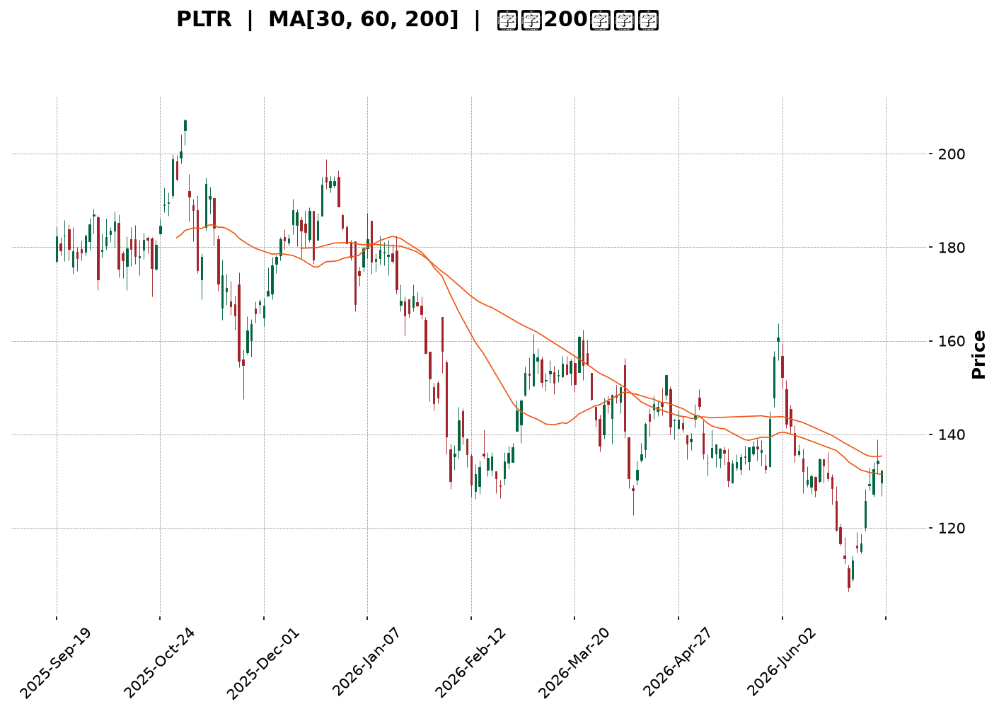
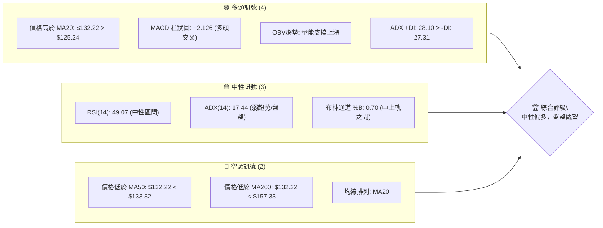
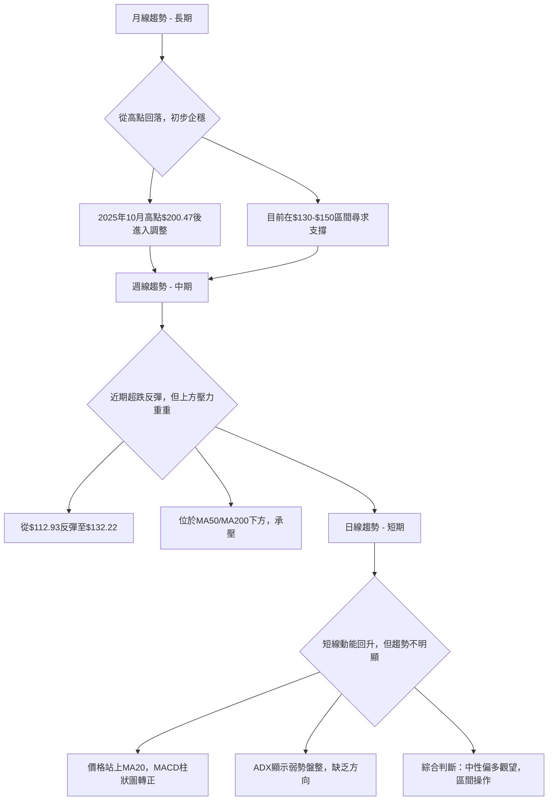
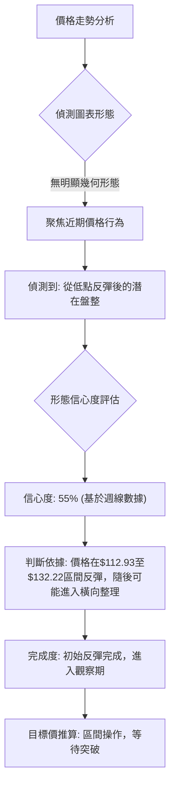
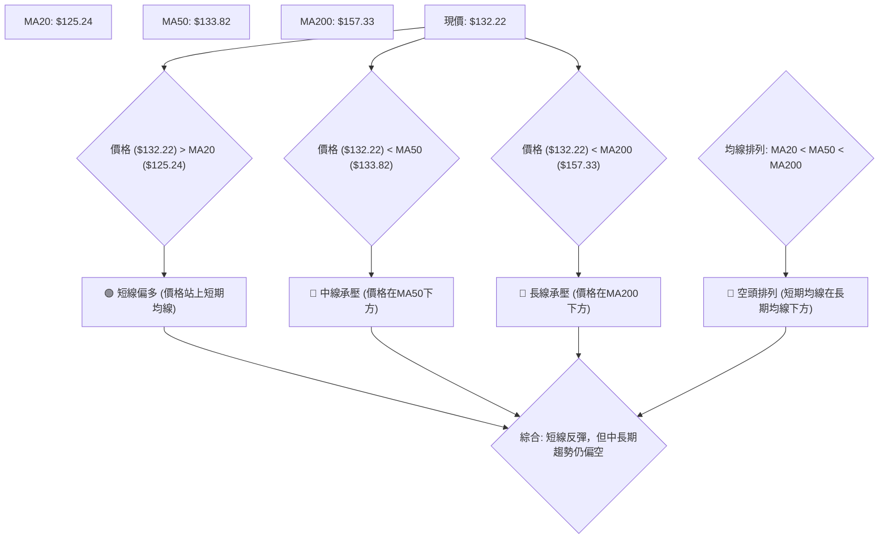
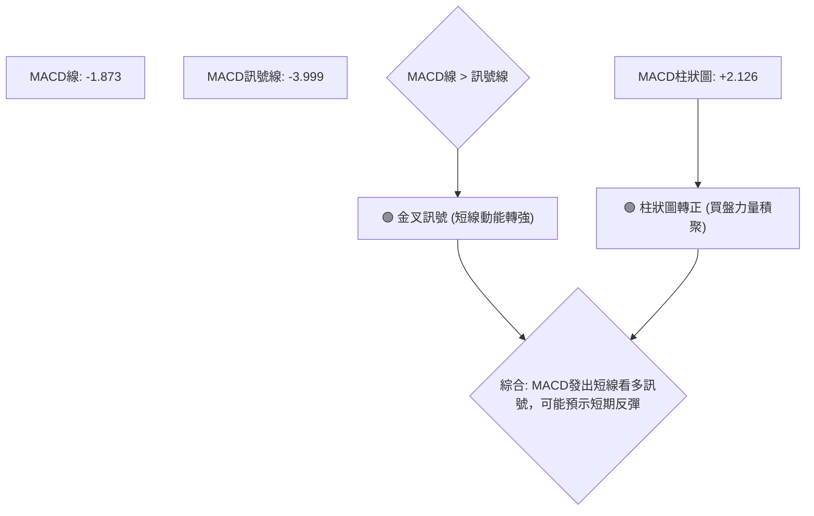
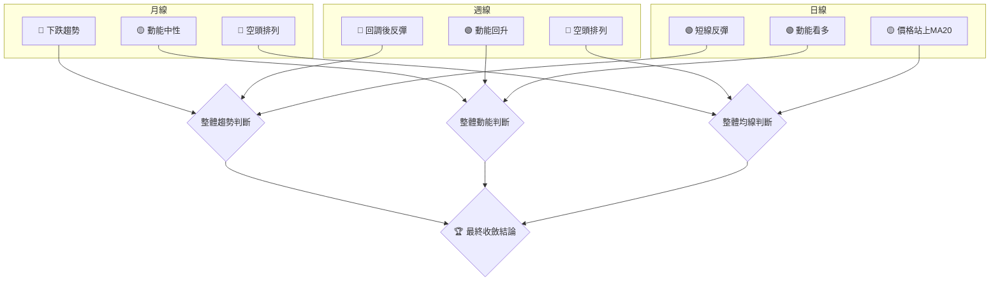

<details>
<summary>📊 靜態圖表 (點擊展開)</summary>

</details>

<html>
<head><meta charset="utf-8" /></head>
<body>
    <div style="height:500px; width:100%;">                        <script>window.PlotlyConfig = {MathJaxConfig: 'local'};</script>
        <script charset="utf-8" src="https://cdn.plot.ly/plotly-3.6.0.min.js" integrity="sha256-QaOVwtVY0T02VaHrr6pnoHLCwayMJp4O5n4YyaE3rJk=" crossorigin="anonymous"></script>                <div id="candlestick-chart" class="plotly-graph-div" style="height:100%; width:100%;"></div>            <script>                window.PLOTLYENV=window.PLOTLYENV || {};                                if (document.getElementById("candlestick-chart")) {                    Plotly.newPlot(                        "candlestick-chart",                        [{"close":{"dtype":"f8","bdata":"AAAA4HrMZkAAAABgj2pmQAAAAKCZ0WZAAAAAgOtxZkAAAAAA12NmQAAAAIA9MmZAAAAAIIVbZkAAAACgcM1mQAAAAGBmHmdAAAAAoJlhZ0AAAACAPaJlQAAAAMD1cGZAAAAAoHDFZkAAAACA6\u002fFmQAAAAEAKL2dAAAAAgBTuZUAAAABguCZmQAAAACCud2ZAAAAAANdzZkAAAAAA10NmQAAAAMDMRGZAAAAAQOGyZkAAAADgUbBmQAAAACCu72VAAAAAIFyPZkAAAAAAKRRnQAAAAIDCpWdAAAAAQDOzZ0AAAACA69loQAAAAKCZUWhAAAAAQAoPaUAAAACAwuVpQAAAACCu12dAAAAAwMx8Z0AAAACgmeFlQAAAAIDCPWZAAAAAIIUzaEAAAABguN5nQAAAAKBwBWdAAAAA4HqEZUAAAADgUcBlQAAAAAAAaGVAAAAAYI\u002fqZEAAAACgcK1kQAAAAADXd2NAAAAAQDNbY0AAAAAAAEhkQAAAAKCZcWRAAAAA4KO4ZEAAAABgZg5lQAAAACCu72RAAAAAgBRWZUAAAABgjwJmQAAAAKBwPWZAAAAA4FG4ZkAAAAAgrq9mQAAAAEDhumZAAAAAwB59Z0AAAACgR3FnQAAAAIA98mZAAAAAAADoZkAAAAAAAHhnQAAAAKBHKWZAAAAAgBQ2Z0AAAAAAKSxoQAAAACBcP2hAAAAAAClEaEAAAACgcEVoQAAAAGC4lmdAAAAAgMIFZ0AAAABA4ZpmQAAAAAAAOGZAAAAAIIX7ZEAAAACgR8FlQAAAAGC4dmZAAAAAgMK1ZkAAAAAghRtmQAAAACCuL2ZAAAAAwB5tZkAAAABguF5mQAAAAMDMTGZAAAAAgD0iZkAAAABguF5lQAAAAMD1EGVAAAAAYI+qZEAAAADAzLxkQAAAAEAzM2VAAAAAQArvZEAAAABgZrZkQAAAAEAzq2NAAAAAIIX7YkAAAABA4VJiQAAAAOBReGJAAAAAACm8Y0AAAACgR3FhQAAAAOBRQGBAAAAAwMz8YEAAAADAHt1hQAAAAOBRcGFAAAAAgML1YEAAAAAAKSRgQAAAAMAebWBAAAAA4KOgYEAAAAAAKexgQAAAAOB63GBAAAAAIK7nYEAAAABAM1NgQAAAAEDhGmBAAAAAgBTGYEAAAACAFP5gQAAAAIAUJmFAAAAAoHAlYkAAAABACmdiQAAAAIAUJmNAAAAAoHAVY0AAAADAHqVjQAAAAIDCjWNAAAAA4HrkYkAAAABAM\u002fNiQAAAAAAAMGNAAAAAYGbeYkAAAABAChdjQAAAAGCPYmNAAAAA4KMYY0AAAACAwnVjQAAAAIDC1WJAAAAAQOEaZEAAAADA9VhjQAAAAGC4XmNAAAAAgOtxYkAAAACA6+FhQAAAAKCZMWFAAAAAwPVIYkAAAAAgrk9iQAAAAGC4jmJAAAAAgMJ9YkAAAACAPcJiQAAAAOBRmGFAAAAAIK5PYEAAAACA6wFgQAAAAADXi2BAAAAAYGb2YEAAAADAzMRhQAAAAOBR2GFAAAAA4HpMYkAAAADgejxiQAAAAEAKP2JAAAAAANcTY0AAAACAPbJhQAAAAEDh4mFAAAAAQDPjYUAAAACAwqVhQAAAAEAKP2FAAAAAIIVjYUAAAACAPQJiQAAAAMD1QGJAAAAAwB79YEAAAACgR7lgQAAAAKCZIWFAAAAAoJk5YUAAAADgehxhQAAAAAAAAGFAAAAAoJlBYEAAAAAgXLdgQAAAACCuv2BAAAAA4HrkYEAAAADgUehgQAAAAMDMJGFAAAAAoEctYUAAAAAAKRxhQAAAAEAzE2FAAAAA4FGQYEAAAABA4ephQAAAAKBHkWNAAAAAwMwUZEAAAACgcAVjQAAAAGBmxmFAAAAAYGa2YUAAAADA9fBgQAAAAEAKD2FAAAAAgD2CYEAAAABguEZgQAAAAGCPYmBAAAAAIFz\u002fX0AAAABguNZgQAAAAAAAqGBAAAAAAClUYEAAAABACg9gQAAAAAAA4F1AAAAAwMwsXUAAAAAAAGBcQAAAAKBH0VpAAAAAIIU7XEAAAADAzOxcQAAAAEDhKl1AAAAAYLhuX0AAAACgmSlgQAAAAKBHkWBAAAAAANfLYEAAAABACodgQA=="},"high":{"dtype":"f8","bdata":"AAAAoHANZ0AAAAAAAMhmQAAAAAAAOGdAAAAAQDMbZ0AAAACAPQpnQAAAAADXg2ZAAAAAIFyvZkAAAADgo9hmQAAAAMD1SGdAAAAAYGaGZ0AAAABA4VpnQAAAAGBm3mZAAAAAgMJFZ0AAAADgUQhnQAAAAADXc2dAAAAAQDNjZ0AAAABACmdmQAAAAEDhymZAAAAAQDMLZ0AAAACAPRpnQAAAAEDhsmZAAAAAQOHiZkAAAADAcsxmQAAAAGC4xmZAAAAAgOuxZkAAAACgcEVnQAAAAGCPGmhAAAAAwPX4Z0AAAABAM\u002ftoQAAAAKBw9WhAAAAAgMKFaUAAAADgo\u002fBpQAAAAGBmdmhAAAAAgD3KZ0AAAABA4eJnQAAAAGBmVmZAAAAAgMJdaEAAAACgmR1oQAAAAGCP0mdAAAAAYGbWZkAAAACgRylmQAAAACCux2VAAAAAYI+aZUAAAABAMzNlQAAAAIA90mVAAAAAIIXDY0AAAACgcKVkQAAAAMDMlGRAAAAAINkKZUAAAACgmRllQAAAAEAzI2VAAAAAAAD4ZUAAAADAHj1mQAAAAIAUTmZAAAAAYOXEZkAAAAAAKfxmQAAAAEAz22ZAAAAA4HrMZ0AAAACgmYFnQAAAAMDMUGdAAAAAwPV4Z0AAAAAAAJBnQAAAAAAAeGdAAAAAYI9qZ0AAAAAAAGBoQAAAAAAp3GhAAAAAANdraEAAAACgcGVoQAAAAEAzi2hAAAAAYGZmZ0AAAAAAVBdnQAAAAMD1sGZAAAAAQDOrZkAAAACAPfplQAAAAIAUhmZAAAAAwPVoZ0AAAADAHjVnQAAAAEAKV2ZAAAAAAADQZkAAAABAM6NmQAAAAOAis2ZAAAAAQDOTZkAAAACAws1mQAAAAEAKf2VAAAAAIK4vZUAAAAAAACBlQAAAAAAAgGVAAAAAQOFSZUAAAACAFC5lQAAAAKBwoWRAAAAAACm0Y0AAAAAAAOBiQAAAAMDM7GJAAAAAAH+iZEAAAABAM3tjQAAAACBcP2FAAAAA4Ps1YUAAAAAA1ztiQAAAAIDrMWJAAAAAAABoYUAAAADgevxgQAAAAIDrsWBAAAAAgD3KYEAAAADg0J5hQAAAAMAeBWFAAAAAYLgGYUAAAACgR4FgQAAAACCuR2BAAAAAQOECYUAAAADgUTBhQAAAAEAzQ2FAAAAA4HpkYkAAAAAAAHBiQAAAAOCjUGNAAAAAACmMY0AAAABgZi5kQAAAAIAUzmNAAAAAIAaVY0AAAACAaCVjQAAAAAApfGNAAAAAgOtRY0AAAAAghTtjQAAAAAAAmGNAAAAAgBSWY0AAAADAzIRjQAAAAMDMlGNAAAAAYI8iZEAAAADAzExkQAAAAOCjCGRAAAAAANcjY0AAAABguD5iQAAAAADXA2JAAAAAIIV7YkAAAACgmYliQAAAAOBRkGJAAAAAIIXTYkAAAADgo8hiQAAAAMD1iGNAAAAAoEdxYUAAAABgZiZgQAAAAKBwzWBAAAAAgD1CYUAAAABgj9JhQAAAAKCZMWJAAAAAwPWIYkAAAABgZmZiQAAAAADXu2JAAAAAgMIVY0AAAACgR8liQAAAAGCP6mFAAAAAgD0iYkAAAABAM\u002fthQAAAAOBReGFAAAAAYGaGYUAAAACAFE5iQAAAAOB6tGJAAAAAIFzfYUAAAABgZvZgQAAAAGBmnmFAAAAAACk8YUAAAADgeiRhQAAAAIDCLWFAAAAAIK4fYUAAAAAgXM9gQAAAAOB69GBAAAAAgOv9YEAAAABACi9hQAAAACCuJ2FAAAAAoJlRYUAAAADgo2BhQAAAAIDCVWFAAAAAIFz3YEAAAAAAACBiQAAAAKDtuGNAAAAAYGZ2ZEAAAACgmfFjQAAAAIDC9WJAAAAAANdLYkAAAABACr9hQAAAAOBROGFAAAAAIK4fYUAAAACA66VgQAAAAOCjcGBAAAAAQOFiYEAAAAAgXN9gQAAAAEDh0mBAAAAAQDMDYUAAAACAwm1gQAAAAADXG2BAAAAAACk8XkAAAAAAAIBdQAAAAKCZCVxAAAAAwB6FXEAAAADAHsVdQAAAAMDMrF1AAAAAAAAIYEAAAAAAKZxgQAAAAEA1wmBAAAAAwMxcYUAAAADgeoxgQA=="},"hovertemplate":"\u003cb\u003e%{x|%Y-%m-%d}\u003c\u002fb\u003e\u003cbr\u003e\u958b: $%{open:.2f}\u003cbr\u003e\u9ad8: $%{high:.2f}\u003cbr\u003e\u4f4e: $%{low:.2f}\u003cbr\u003e\u6536: $%{close:.2f}\u003cextra\u003e\u003c\u002fextra\u003e","low":{"dtype":"f8","bdata":"AAAAYLgWZkAAAACgR0lmQAAAAOBRIGZAAAAAANcjZkAAAACgR8llQAAAAMAe3WVAAAAAwB4lZkAAAABACkdmQAAAAAAAcGZAAAAAYGbeZkAAAADgo1hlQAAAAGCPOmZAAAAAoHBtZkAAAABgZqZmQAAAAGBmfmZAAAAAwPWwZUAAAABgZq5lQAAAAIA9WmVAAAAA4KMAZkAAAABgZg5mQAAAAGBmvmVAAAAAgBQuZkAAAADAzFRmQAAAAKBwLWVAAAAA4FHgZUAAAABAM9tmQAAAAOCjcGdAAAAAwPVYZ0AAAAAgrs9nQAAAAADXQ2hAAAAAoHC9aEAAAACAPTppQAAAAIDrMWdAAAAAYLimZkAAAADA9dBlQAAAAMAeHWVAAAAA4KPwZkAAAAAAKWRnQAAAAMDMjGZAAAAAYGRXZUAAAAAAAJBkQAAAAIDC9WRAAAAAAACwZEAAAACgcE1kQAAAAOCjTGNAAAAAgOtxYkAAAAAAAKBjQAAAAIDCkWNAAAAAACl8ZEAAAAAAALxkQAAAAADXY2RAAAAAQOEyZUAAAABgjxplQAAAAIDCzWVAAAAAwB4lZkAAAACgR3FmQAAAAAApjGZAAAAAAADYZkAAAABguIZmQAAAACBYNWZAAAAAwPWAZkAAAABAi6RmQAAAAAAAEGZAAAAA4FGwZkAAAAAgXFdnQAAAAIDCDWhAAAAAIIX3Z0AAAABgjxpoQAAAAADXk2dAAAAA4Hr0ZkAAAABgZpZmQAAAAAAAKGZAAAAAQDPLZEAAAACgR3llQAAAAOCj2GVAAAAAwB41ZkAAAAAA18tlQAAAAAAA2GVAAAAAQOEKZkAAAADgegRmQAAAAGBmvmVAAAAAwPUQZkAAAADgUUBlQAAAACCux2RAAAAAIIUjZEAAAABgZp5kQAAAAKCZyWRAAAAAYGbqZEAAAACAFJZkQAAAACCup2NAAAAAANdjYkAAAADAciRiQAAAAKDtVGJAAAAAANcjY0AAAACAwvVgQAAAAIA9CmBAAAAAQDOLYEAAAAAA1dhgQAAAAOCjOGFAAAAAYGaeYEAAAAAA16NfQAAAAIDpjl9AAAAAYI\u002fSX0AAAAAA19tgQAAAAOBRYGBAAAAAoHBlYEAAAADA9dhfQAAAACCul19AAAAAgMIlYEAAAAAAKZRgQAAAACBcv2BAAAAA4KOQYUAAAABgZkZhQAAAAIDrgWJAAAAAIIWzYkAAAACgR8liQAAAAEAKH2NAAAAA4HrEYkAAAABgj6piQAAAACBc32JAAAAAYI+SYkAAAACgcOViQAAAAADXA2NAAAAAIIUTY0AAAAAAANBiQAAAAEDhomJAAAAAIK4nY0AAAADgevRiQAAAACBcW2NAAAAAAABoYkAAAACA67FhQAAAAKCZCWFAAAAAQApfYUAAAABACg9iQAAAACCuP2FAAAAAIDFUYkAAAABgZg5iQAAAAKBwZWFAAAAAQAoPYEAAAAAghateQAAAAMDMJGBAAAAAAADAYEAAAACAwt1gQAAAAMD1cGFAAAAAoJnpYUAAAABgj\u002fphQAAAAMD3\u002f2FAAAAAwB5tYkAAAACgcH1hQAAAAIDCXWFAAAAA4FGgYUAAAACgcI1hQAAAAIDC1WBAAAAAwMwUYUAAAADgeqxhQAAAAEAzJ2JAAAAAQArXYEAAAADAzGRgQAAAAMD12GBAAAAA4KOgYEAAAAAArJhgQAAAAGC4rmBAAAAAAAAYYEAAAABgZi5gQAAAAKBHiWBAAAAAYI9qYEAAAABAM7NgQAAAAKBwjWBAAAAAoHDtYEAAAACgmclgQAAAAKCZqWBAAAAAACl0YEAAAAAAAKBgQAAAAKBHOWJAAAAAACl8Y0AAAACgmbliQAAAAAAAqGFAAAAAQLSIYUAAAADAzMBgQAAAAMD16GBAAAAAYGbWX0AAAACgmRlgQAAAAEDhyl9AAAAAoJmpX0AAAABgZjZgQAAAAADXM2BAAAAAoHA9YEAAAADgo0BfQAAAAMDMzF1AAAAAIIULXUAAAAAAABBcQAAAACCul1pAAAAAgBQeW0AAAADAzKxcQAAAAOB6pFxAAAAAYGbWXUAAAADAzPxfQAAAAMD1qF9AAAAAYLhuYEAAAAAA4K1fQA=="},"name":"\u50f9\u683c","open":{"dtype":"f8","bdata":"AAAAgD0iZkAAAAAAKZxmQAAAAOBR0GZAAAAAwB79ZkAAAACgmfllQAAAAKCZYWZAAAAA4Hp0ZkAAAAAgXF9mQAAAAIA9qmZAAAAAYGZWZ0AAAADAzExnQAAAAIDCZWZAAAAAgOuJZkAAAACgmdlmQAAAAGCP8mZAAAAAoHAlZ0AAAACAwlVmQAAAAAAAAGZAAAAAwPW0ZkAAAADA9bhmQAAAAAAAOGZAAAAAIK5vZkAAAACA68FmQAAAAIDCvWZAAAAAgD3uZUAAAAAAKdxmQAAAAEAKn2dAAAAAIFyvZ0AAAABgj+JnQAAAAKCZzWhAAAAAYGbmaEAAAACgcKFpQAAAAIA9AmhAAAAAAACgZ0AAAAAgrn9nQAAAAMDMpGVAAAAAgOsJZ0AAAABguMpnQAAAAGCP0mdAAAAAQOG2ZkAAAABAM99kQAAAAMD1UGVAAAAAANcLZUAAAACgmflkQAAAAIA9gmVAAAAA4FGAY0AAAABACq9jQAAAAIA9AmRAAAAAQDPbZEAAAADgUfhkQAAAAAAAoGRAAAAAQOEyZUAAAADgekRlQAAAACCuC2ZAAAAAIFxHZkAAAABguMZmQAAAAEAKn2ZAAAAAYGYeZ0AAAACgmRlnQAAAAIDrOWdAAAAAYI8iZ0AAAADA9bRmQAAAAEDhdmdAAAAA4FGwZkAAAAAgrldnQAAAAKBHYWhAAAAAYGYaaEAAAADAHiVoQAAAAOB6YGhAAAAAQDNbZ0AAAABAMwtnQAAAAAAppGZAAAAAoJmpZkAAAAAAKdxlQAAAAOBR+GVAAAAAoJl5ZkAAAAAgrjNnQAAAAOCjIGZAAAAAgOs1ZkAAAAAAAFxmQAAAAAAARGZAAAAAYLhWZkAAAAAghWtmQAAAAAAA9GRAAAAAIN0MZUAAAACgmR1lQAAAAOCj6GRAAAAAYLgGZUAAAAAgXO9kQAAAAMDMjGRAAAAAACm0Y0AAAACgmcFiQAAAAIAU3mJAAAAAoJmhZEAAAADAHm1jQAAAAIA9GmFAAAAAYI\u002fqYEAAAABgjxJhQAAAAEDhHmJAAAAAwMxgYUAAAAAghetgQAAAAKCZ+V9AAAAA4KMcYEAAAADgevxgQAAAAIDriWBAAAAAIK6LYEAAAACgR4FgQAAAAAApIGBAAAAAIIVTYEAAAABACrtgQAAAAIA9wmBAAAAAwMyYYUAAAABAM8NhQAAAAIDCjWJAAAAAgBQeY0AAAACAFM5iQAAAAIAUdmNAAAAAIK5\u002fY0AAAAAAKexiQAAAAOBRIGNAAAAAoJkpY0AAAABgZg5jQAAAAMD1DGNAAAAAgD1eY0AAAABAMyNjQAAAAGBmZmNAAAAAIK4nY0AAAACAPQJkQAAAAKBwrWNAAAAAgMIhY0AAAAAAKTxiQAAAAOCj6GFAAAAA4KOAYUAAAAAAAGBiQAAAACCF72FAAAAAIIWLYkAAAABgOVxiQAAAAOB6WGNAAAAA4KNsYUAAAAAgXA9gQAAAACBcR2BAAAAAAKrNYEAAAACgRxlhQAAAAKBHCWJAAAAAgBQqYkAAAAAAACBiQAAAAIDrWWJAAAAAIIWLYkAAAABgZrZiQAAAAGC43mFAAAAAAACoYUAAAACgmclhQAAAAOBReGFAAAAAQDNPYUAAAAAAAOhhQAAAAAAAeGJAAAAAoHCJYUAAAABguLZgQAAAAEAz42BAAAAAIK77YEAAAADAHt1gQAAAAEAzE2FAAAAAIDHAYEAAAADAzDRgQAAAAKCZmWBAAAAAAACQYEAAAACgcOVgQAAAAOCjxGBAAAAAoJn5YEAAAACgmS1hQAAAAMAeBWFAAAAAoJmpYEAAAADAHqVgQAAAAGBmemJAAAAAIFz\u002fY0AAAACAFJZjQAAAAGBmtmJAAAAAYLguYkAAAABgZophQAAAAIDC9WBAAAAAANfbYEAAAABgZipgQAAAAMD1GGBAAAAAoEddYEAAAADgo0BgQAAAAEDh0mBAAAAA4FF4YEAAAABA4VpgQAAAACBcb19AAAAAoJkJXkAAAAAgrodcQAAAAOBR2FtAAAAAYI9CW0AAAABguA5dQAAAAMDMvFxAAAAAQDMDXkAAAAAgrh9gQAAAACBcz19AAAAAIFy3YEAAAADgUTRgQA=="},"x":["2025-09-19T00:00:00-04:00","2025-09-22T00:00:00-04:00","2025-09-23T00:00:00-04:00","2025-09-24T00:00:00-04:00","2025-09-25T00:00:00-04:00","2025-09-26T00:00:00-04:00","2025-09-29T00:00:00-04:00","2025-09-30T00:00:00-04:00","2025-10-01T00:00:00-04:00","2025-10-02T00:00:00-04:00","2025-10-03T00:00:00-04:00","2025-10-06T00:00:00-04:00","2025-10-07T00:00:00-04:00","2025-10-08T00:00:00-04:00","2025-10-09T00:00:00-04:00","2025-10-10T00:00:00-04:00","2025-10-13T00:00:00-04:00","2025-10-14T00:00:00-04:00","2025-10-15T00:00:00-04:00","2025-10-16T00:00:00-04:00","2025-10-17T00:00:00-04:00","2025-10-20T00:00:00-04:00","2025-10-21T00:00:00-04:00","2025-10-22T00:00:00-04:00","2025-10-23T00:00:00-04:00","2025-10-24T00:00:00-04:00","2025-10-27T00:00:00-04:00","2025-10-28T00:00:00-04:00","2025-10-29T00:00:00-04:00","2025-10-30T00:00:00-04:00","2025-10-31T00:00:00-04:00","2025-11-03T00:00:00-05:00","2025-11-04T00:00:00-05:00","2025-11-05T00:00:00-05:00","2025-11-06T00:00:00-05:00","2025-11-07T00:00:00-05:00","2025-11-10T00:00:00-05:00","2025-11-11T00:00:00-05:00","2025-11-12T00:00:00-05:00","2025-11-13T00:00:00-05:00","2025-11-14T00:00:00-05:00","2025-11-17T00:00:00-05:00","2025-11-18T00:00:00-05:00","2025-11-19T00:00:00-05:00","2025-11-20T00:00:00-05:00","2025-11-21T00:00:00-05:00","2025-11-24T00:00:00-05:00","2025-11-25T00:00:00-05:00","2025-11-26T00:00:00-05:00","2025-11-28T00:00:00-05:00","2025-12-01T00:00:00-05:00","2025-12-02T00:00:00-05:00","2025-12-03T00:00:00-05:00","2025-12-04T00:00:00-05:00","2025-12-05T00:00:00-05:00","2025-12-08T00:00:00-05:00","2025-12-09T00:00:00-05:00","2025-12-10T00:00:00-05:00","2025-12-11T00:00:00-05:00","2025-12-12T00:00:00-05:00","2025-12-15T00:00:00-05:00","2025-12-16T00:00:00-05:00","2025-12-17T00:00:00-05:00","2025-12-18T00:00:00-05:00","2025-12-19T00:00:00-05:00","2025-12-22T00:00:00-05:00","2025-12-23T00:00:00-05:00","2025-12-24T00:00:00-05:00","2025-12-26T00:00:00-05:00","2025-12-29T00:00:00-05:00","2025-12-30T00:00:00-05:00","2025-12-31T00:00:00-05:00","2026-01-02T00:00:00-05:00","2026-01-05T00:00:00-05:00","2026-01-06T00:00:00-05:00","2026-01-07T00:00:00-05:00","2026-01-08T00:00:00-05:00","2026-01-09T00:00:00-05:00","2026-01-12T00:00:00-05:00","2026-01-13T00:00:00-05:00","2026-01-14T00:00:00-05:00","2026-01-15T00:00:00-05:00","2026-01-16T00:00:00-05:00","2026-01-20T00:00:00-05:00","2026-01-21T00:00:00-05:00","2026-01-22T00:00:00-05:00","2026-01-23T00:00:00-05:00","2026-01-26T00:00:00-05:00","2026-01-27T00:00:00-05:00","2026-01-28T00:00:00-05:00","2026-01-29T00:00:00-05:00","2026-01-30T00:00:00-05:00","2026-02-02T00:00:00-05:00","2026-02-03T00:00:00-05:00","2026-02-04T00:00:00-05:00","2026-02-05T00:00:00-05:00","2026-02-06T00:00:00-05:00","2026-02-09T00:00:00-05:00","2026-02-10T00:00:00-05:00","2026-02-11T00:00:00-05:00","2026-02-12T00:00:00-05:00","2026-02-13T00:00:00-05:00","2026-02-17T00:00:00-05:00","2026-02-18T00:00:00-05:00","2026-02-19T00:00:00-05:00","2026-02-20T00:00:00-05:00","2026-02-23T00:00:00-05:00","2026-02-24T00:00:00-05:00","2026-02-25T00:00:00-05:00","2026-02-26T00:00:00-05:00","2026-02-27T00:00:00-05:00","2026-03-02T00:00:00-05:00","2026-03-03T00:00:00-05:00","2026-03-04T00:00:00-05:00","2026-03-05T00:00:00-05:00","2026-03-06T00:00:00-05:00","2026-03-09T00:00:00-04:00","2026-03-10T00:00:00-04:00","2026-03-11T00:00:00-04:00","2026-03-12T00:00:00-04:00","2026-03-13T00:00:00-04:00","2026-03-16T00:00:00-04:00","2026-03-17T00:00:00-04:00","2026-03-18T00:00:00-04:00","2026-03-19T00:00:00-04:00","2026-03-20T00:00:00-04:00","2026-03-23T00:00:00-04:00","2026-03-24T00:00:00-04:00","2026-03-25T00:00:00-04:00","2026-03-26T00:00:00-04:00","2026-03-27T00:00:00-04:00","2026-03-30T00:00:00-04:00","2026-03-31T00:00:00-04:00","2026-04-01T00:00:00-04:00","2026-04-02T00:00:00-04:00","2026-04-06T00:00:00-04:00","2026-04-07T00:00:00-04:00","2026-04-08T00:00:00-04:00","2026-04-09T00:00:00-04:00","2026-04-10T00:00:00-04:00","2026-04-13T00:00:00-04:00","2026-04-14T00:00:00-04:00","2026-04-15T00:00:00-04:00","2026-04-16T00:00:00-04:00","2026-04-17T00:00:00-04:00","2026-04-20T00:00:00-04:00","2026-04-21T00:00:00-04:00","2026-04-22T00:00:00-04:00","2026-04-23T00:00:00-04:00","2026-04-24T00:00:00-04:00","2026-04-27T00:00:00-04:00","2026-04-28T00:00:00-04:00","2026-04-29T00:00:00-04:00","2026-04-30T00:00:00-04:00","2026-05-01T00:00:00-04:00","2026-05-04T00:00:00-04:00","2026-05-05T00:00:00-04:00","2026-05-06T00:00:00-04:00","2026-05-07T00:00:00-04:00","2026-05-08T00:00:00-04:00","2026-05-11T00:00:00-04:00","2026-05-12T00:00:00-04:00","2026-05-13T00:00:00-04:00","2026-05-14T00:00:00-04:00","2026-05-15T00:00:00-04:00","2026-05-18T00:00:00-04:00","2026-05-19T00:00:00-04:00","2026-05-20T00:00:00-04:00","2026-05-21T00:00:00-04:00","2026-05-22T00:00:00-04:00","2026-05-26T00:00:00-04:00","2026-05-27T00:00:00-04:00","2026-05-28T00:00:00-04:00","2026-05-29T00:00:00-04:00","2026-06-01T00:00:00-04:00","2026-06-02T00:00:00-04:00","2026-06-03T00:00:00-04:00","2026-06-04T00:00:00-04:00","2026-06-05T00:00:00-04:00","2026-06-08T00:00:00-04:00","2026-06-09T00:00:00-04:00","2026-06-10T00:00:00-04:00","2026-06-11T00:00:00-04:00","2026-06-12T00:00:00-04:00","2026-06-15T00:00:00-04:00","2026-06-16T00:00:00-04:00","2026-06-17T00:00:00-04:00","2026-06-18T00:00:00-04:00","2026-06-22T00:00:00-04:00","2026-06-23T00:00:00-04:00","2026-06-24T00:00:00-04:00","2026-06-25T00:00:00-04:00","2026-06-26T00:00:00-04:00","2026-06-29T00:00:00-04:00","2026-06-30T00:00:00-04:00","2026-07-01T00:00:00-04:00","2026-07-02T00:00:00-04:00","2026-07-06T00:00:00-04:00","2026-07-07T00:00:00-04:00","2026-07-08T00:00:00-04:00"],"type":"candlestick"},{"hovertemplate":"MA30: $%{y:.2f}\u003cextra\u003e\u003c\u002fextra\u003e","line":{"color":"#2196F3","dash":"dash","width":2},"mode":"lines","name":"MA30","x":["2025-09-19T00:00:00-04:00","2025-09-22T00:00:00-04:00","2025-09-23T00:00:00-04:00","2025-09-24T00:00:00-04:00","2025-09-25T00:00:00-04:00","2025-09-26T00:00:00-04:00","2025-09-29T00:00:00-04:00","2025-09-30T00:00:00-04:00","2025-10-01T00:00:00-04:00","2025-10-02T00:00:00-04:00","2025-10-03T00:00:00-04:00","2025-10-06T00:00:00-04:00","2025-10-07T00:00:00-04:00","2025-10-08T00:00:00-04:00","2025-10-09T00:00:00-04:00","2025-10-10T00:00:00-04:00","2025-10-13T00:00:00-04:00","2025-10-14T00:00:00-04:00","2025-10-15T00:00:00-04:00","2025-10-16T00:00:00-04:00","2025-10-17T00:00:00-04:00","2025-10-20T00:00:00-04:00","2025-10-21T00:00:00-04:00","2025-10-22T00:00:00-04:00","2025-10-23T00:00:00-04:00","2025-10-24T00:00:00-04:00","2025-10-27T00:00:00-04:00","2025-10-28T00:00:00-04:00","2025-10-29T00:00:00-04:00","2025-10-30T00:00:00-04:00","2025-10-31T00:00:00-04:00","2025-11-03T00:00:00-05:00","2025-11-04T00:00:00-05:00","2025-11-05T00:00:00-05:00","2025-11-06T00:00:00-05:00","2025-11-07T00:00:00-05:00","2025-11-10T00:00:00-05:00","2025-11-11T00:00:00-05:00","2025-11-12T00:00:00-05:00","2025-11-13T00:00:00-05:00","2025-11-14T00:00:00-05:00","2025-11-17T00:00:00-05:00","2025-11-18T00:00:00-05:00","2025-11-19T00:00:00-05:00","2025-11-20T00:00:00-05:00","2025-11-21T00:00:00-05:00","2025-11-24T00:00:00-05:00","2025-11-25T00:00:00-05:00","2025-11-26T00:00:00-05:00","2025-11-28T00:00:00-05:00","2025-12-01T00:00:00-05:00","2025-12-02T00:00:00-05:00","2025-12-03T00:00:00-05:00","2025-12-04T00:00:00-05:00","2025-12-05T00:00:00-05:00","2025-12-08T00:00:00-05:00","2025-12-09T00:00:00-05:00","2025-12-10T00:00:00-05:00","2025-12-11T00:00:00-05:00","2025-12-12T00:00:00-05:00","2025-12-15T00:00:00-05:00","2025-12-16T00:00:00-05:00","2025-12-17T00:00:00-05:00","2025-12-18T00:00:00-05:00","2025-12-19T00:00:00-05:00","2025-12-22T00:00:00-05:00","2025-12-23T00:00:00-05:00","2025-12-24T00:00:00-05:00","2025-12-26T00:00:00-05:00","2025-12-29T00:00:00-05:00","2025-12-30T00:00:00-05:00","2025-12-31T00:00:00-05:00","2026-01-02T00:00:00-05:00","2026-01-05T00:00:00-05:00","2026-01-06T00:00:00-05:00","2026-01-07T00:00:00-05:00","2026-01-08T00:00:00-05:00","2026-01-09T00:00:00-05:00","2026-01-12T00:00:00-05:00","2026-01-13T00:00:00-05:00","2026-01-14T00:00:00-05:00","2026-01-15T00:00:00-05:00","2026-01-16T00:00:00-05:00","2026-01-20T00:00:00-05:00","2026-01-21T00:00:00-05:00","2026-01-22T00:00:00-05:00","2026-01-23T00:00:00-05:00","2026-01-26T00:00:00-05:00","2026-01-27T00:00:00-05:00","2026-01-28T00:00:00-05:00","2026-01-29T00:00:00-05:00","2026-01-30T00:00:00-05:00","2026-02-02T00:00:00-05:00","2026-02-03T00:00:00-05:00","2026-02-04T00:00:00-05:00","2026-02-05T00:00:00-05:00","2026-02-06T00:00:00-05:00","2026-02-09T00:00:00-05:00","2026-02-10T00:00:00-05:00","2026-02-11T00:00:00-05:00","2026-02-12T00:00:00-05:00","2026-02-13T00:00:00-05:00","2026-02-17T00:00:00-05:00","2026-02-18T00:00:00-05:00","2026-02-19T00:00:00-05:00","2026-02-20T00:00:00-05:00","2026-02-23T00:00:00-05:00","2026-02-24T00:00:00-05:00","2026-02-25T00:00:00-05:00","2026-02-26T00:00:00-05:00","2026-02-27T00:00:00-05:00","2026-03-02T00:00:00-05:00","2026-03-03T00:00:00-05:00","2026-03-04T00:00:00-05:00","2026-03-05T00:00:00-05:00","2026-03-06T00:00:00-05:00","2026-03-09T00:00:00-04:00","2026-03-10T00:00:00-04:00","2026-03-11T00:00:00-04:00","2026-03-12T00:00:00-04:00","2026-03-13T00:00:00-04:00","2026-03-16T00:00:00-04:00","2026-03-17T00:00:00-04:00","2026-03-18T00:00:00-04:00","2026-03-19T00:00:00-04:00","2026-03-20T00:00:00-04:00","2026-03-23T00:00:00-04:00","2026-03-24T00:00:00-04:00","2026-03-25T00:00:00-04:00","2026-03-26T00:00:00-04:00","2026-03-27T00:00:00-04:00","2026-03-30T00:00:00-04:00","2026-03-31T00:00:00-04:00","2026-04-01T00:00:00-04:00","2026-04-02T00:00:00-04:00","2026-04-06T00:00:00-04:00","2026-04-07T00:00:00-04:00","2026-04-08T00:00:00-04:00","2026-04-09T00:00:00-04:00","2026-04-10T00:00:00-04:00","2026-04-13T00:00:00-04:00","2026-04-14T00:00:00-04:00","2026-04-15T00:00:00-04:00","2026-04-16T00:00:00-04:00","2026-04-17T00:00:00-04:00","2026-04-20T00:00:00-04:00","2026-04-21T00:00:00-04:00","2026-04-22T00:00:00-04:00","2026-04-23T00:00:00-04:00","2026-04-24T00:00:00-04:00","2026-04-27T00:00:00-04:00","2026-04-28T00:00:00-04:00","2026-04-29T00:00:00-04:00","2026-04-30T00:00:00-04:00","2026-05-01T00:00:00-04:00","2026-05-04T00:00:00-04:00","2026-05-05T00:00:00-04:00","2026-05-06T00:00:00-04:00","2026-05-07T00:00:00-04:00","2026-05-08T00:00:00-04:00","2026-05-11T00:00:00-04:00","2026-05-12T00:00:00-04:00","2026-05-13T00:00:00-04:00","2026-05-14T00:00:00-04:00","2026-05-15T00:00:00-04:00","2026-05-18T00:00:00-04:00","2026-05-19T00:00:00-04:00","2026-05-20T00:00:00-04:00","2026-05-21T00:00:00-04:00","2026-05-22T00:00:00-04:00","2026-05-26T00:00:00-04:00","2026-05-27T00:00:00-04:00","2026-05-28T00:00:00-04:00","2026-05-29T00:00:00-04:00","2026-06-01T00:00:00-04:00","2026-06-02T00:00:00-04:00","2026-06-03T00:00:00-04:00","2026-06-04T00:00:00-04:00","2026-06-05T00:00:00-04:00","2026-06-08T00:00:00-04:00","2026-06-09T00:00:00-04:00","2026-06-10T00:00:00-04:00","2026-06-11T00:00:00-04:00","2026-06-12T00:00:00-04:00","2026-06-15T00:00:00-04:00","2026-06-16T00:00:00-04:00","2026-06-17T00:00:00-04:00","2026-06-18T00:00:00-04:00","2026-06-22T00:00:00-04:00","2026-06-23T00:00:00-04:00","2026-06-24T00:00:00-04:00","2026-06-25T00:00:00-04:00","2026-06-26T00:00:00-04:00","2026-06-29T00:00:00-04:00","2026-06-30T00:00:00-04:00","2026-07-01T00:00:00-04:00","2026-07-02T00:00:00-04:00","2026-07-06T00:00:00-04:00","2026-07-07T00:00:00-04:00","2026-07-08T00:00:00-04:00"],"y":{"dtype":"f8","bdata":"AAAAAAAA+H8AAAAAAAD4fwAAAAAAAPh\u002fAAAAAAAA+H8AAAAAAAD4fwAAAAAAAPh\u002fAAAAAAAA+H8AAAAAAAD4fwAAAAAAAPh\u002fAAAAAAAA+H8AAAAAAAD4fwAAAAAAAPh\u002fAAAAAAAA+H8AAAAAAAD4fwAAAAAAAPh\u002fAAAAAAAA+H8AAAAAAAD4fwAAAAAAAPh\u002fAAAAAAAA+H8AAAAAAAD4fwAAAAAAAPh\u002fAAAAAAAA+H8AAAAAAAD4fwAAAAAAAPh\u002fAAAAAAAA+H8AAAAAAAD4fwAAAAAAAPh\u002fAAAAAAAA+H8AAAAAAAD4f83MzKzVwWZAiYiIuB7VZkAAAACg0\u002fJmQKuqqgqQ+2ZAq6qqanUEZ0CamZkJHgBnQGZmZlaAAGdAIiIiEjwQZ0AAAAAQWBlnQCIiIhKDGGdAVVVVpZsIZ0AzMzNTnAlnQFVVVVXHAGdAZmZmBvPwZkCJiIiYmd1mQAAAALDkvWZA7+7uPu6nZkCrqqoq+ZdmQHd3dze0hmZA7+7uPu53ZkARERGxnW1mQN7d3c0+YmZAERERYZ5WZkARERGh01BmQN7d3S1rU2ZAREREtMhUZkBmZmZGb1FmQHd3d\u002feaSWZAvLu7e81HZkBVVVUFyDtmQAAAAMARMGZAq6qqirMdZkC8u7vb+QhmQLy7uxuh+mVAIiIiokX4ZUAiIiLy0gtmQKuqqqrxHGZAmpmZqX8dZkBEREQ07CBmQN7d3e3DJWZAZmZmppsyZkAiIiKy5DlmQBEREaHTQGZAq6qqWmRBZkAAAAAwlkpmQLy7uzsmZGZAvLu7m8SAZkDNzMwcWpBmQJqZmak4n2ZAq6qqSsWtZkCamZk5+7hmQBEREWGexGZAvLu7i2zLZkAiIiJy9sVmQJqZmVnyu2ZA3t3d3WuqZkARERHByplmQLy7u2u8jGZAAAAA8O52ZkCamZkpo19mQKuqqlqrQ2ZAq6qqyi8iZkDe3d1dSPZlQFVVVbXI1mVAmpmZuR65ZUAAAADQsH9lQM3MzLx0O2VAAAAAEFj9ZECrqqqqqsZkQImIiMgvkmRAzczMDHReZEBmZmbGSydkQN7d3d3d9WNAmpmZObTQY0CJiIh4d6djQO\u002fu7p6od2NAiYiIaB9GY0CJiIhYxxRjQGZmZqbi4GJAMzMzk6awYkDv7u4+w4JiQLy7uyvOVmJAd3d3V8c0YkDNzMy8dBtiQFVVVeUXC2JA7+7u3pb9YUBVVVVFRPRhQKuqqvo35mFAzczMzMzUYUAAAACQwsVhQBEREUGnwWFAMzMzw67AYUCamZmpOMdhQDMzM4MHz2FAREREJJTJYUAAAABwy9phQJqZmbnX8GFAIiIiAnILYkDv7u5OGxhiQBERETGWKGJAmpmZOUI1YkCrqqoKHkRiQLy7u6uqSmJAiYiIiM9YYkDe3d1NqWRiQCIiItIic2JAiYiICKyAYkBERESkcJViQImIiJgnomJAAAAAQDWeYkC8u7t7zZViQM3MzEypkGJAvLu7W4+GYkCJiIjoJoFiQCIiItIGdmJAZmZm9lNvYkAAAACATmNiQJqZmTkmWGJAzczMXLpZYkARERGBB09iQBEREeHsQ2JA7+7uTo07YkDe3d0dPi9iQCIiIvL9HGJAq6qq2msOYkDe3d2NCQJiQLy7u8sT\u002fWFA7+7uPnziYUAzMzOTGMxhQDMzM\u002fP9uGFAIiIi0pSuYUAAAAAAAKhhQO\u002fu7r5YpmFAAAAA4AiVYUCrqqqKbIdhQERERET9d2FA7+7uvlhqYUAAAACgjFphQKuqqtqyVmFAZmZm1hVeYUCamZlJfmdhQM3MzFwBbGFAd3d3R5poYUCrqqo632lhQGZmZhaSeGFAREREBMiHYUAAAADgeo5hQJqZmWl1imFAZmZmhs9+YUAzMzMzXnhhQAAAAIBOcWFAMzMzk4plYUCamZkJ11lhQLy7u5t9UmFAMzMzG6FGYUC8u7szpTxhQBEREWkDL2FAZmZmnmEpYUAAAADotCNhQN7d3ZX8EGFAiYiI4Hr6YEARERHZh+FgQERERKTiwmBAVVVVvZ+wYEARERFZZJ1gQM3MzNTqimBAZmZmRuGAYEDNzMzMhXpgQGZmZvaadWBAmpmZeVtyYEC8u7v7Ym1gQA=="},"type":"scatter"},{"hovertemplate":"MA60: $%{y:.2f}\u003cextra\u003e\u003c\u002fextra\u003e","line":{"color":"#9C27B0","dash":"dash","width":2},"mode":"lines","name":"MA60","x":["2025-09-19T00:00:00-04:00","2025-09-22T00:00:00-04:00","2025-09-23T00:00:00-04:00","2025-09-24T00:00:00-04:00","2025-09-25T00:00:00-04:00","2025-09-26T00:00:00-04:00","2025-09-29T00:00:00-04:00","2025-09-30T00:00:00-04:00","2025-10-01T00:00:00-04:00","2025-10-02T00:00:00-04:00","2025-10-03T00:00:00-04:00","2025-10-06T00:00:00-04:00","2025-10-07T00:00:00-04:00","2025-10-08T00:00:00-04:00","2025-10-09T00:00:00-04:00","2025-10-10T00:00:00-04:00","2025-10-13T00:00:00-04:00","2025-10-14T00:00:00-04:00","2025-10-15T00:00:00-04:00","2025-10-16T00:00:00-04:00","2025-10-17T00:00:00-04:00","2025-10-20T00:00:00-04:00","2025-10-21T00:00:00-04:00","2025-10-22T00:00:00-04:00","2025-10-23T00:00:00-04:00","2025-10-24T00:00:00-04:00","2025-10-27T00:00:00-04:00","2025-10-28T00:00:00-04:00","2025-10-29T00:00:00-04:00","2025-10-30T00:00:00-04:00","2025-10-31T00:00:00-04:00","2025-11-03T00:00:00-05:00","2025-11-04T00:00:00-05:00","2025-11-05T00:00:00-05:00","2025-11-06T00:00:00-05:00","2025-11-07T00:00:00-05:00","2025-11-10T00:00:00-05:00","2025-11-11T00:00:00-05:00","2025-11-12T00:00:00-05:00","2025-11-13T00:00:00-05:00","2025-11-14T00:00:00-05:00","2025-11-17T00:00:00-05:00","2025-11-18T00:00:00-05:00","2025-11-19T00:00:00-05:00","2025-11-20T00:00:00-05:00","2025-11-21T00:00:00-05:00","2025-11-24T00:00:00-05:00","2025-11-25T00:00:00-05:00","2025-11-26T00:00:00-05:00","2025-11-28T00:00:00-05:00","2025-12-01T00:00:00-05:00","2025-12-02T00:00:00-05:00","2025-12-03T00:00:00-05:00","2025-12-04T00:00:00-05:00","2025-12-05T00:00:00-05:00","2025-12-08T00:00:00-05:00","2025-12-09T00:00:00-05:00","2025-12-10T00:00:00-05:00","2025-12-11T00:00:00-05:00","2025-12-12T00:00:00-05:00","2025-12-15T00:00:00-05:00","2025-12-16T00:00:00-05:00","2025-12-17T00:00:00-05:00","2025-12-18T00:00:00-05:00","2025-12-19T00:00:00-05:00","2025-12-22T00:00:00-05:00","2025-12-23T00:00:00-05:00","2025-12-24T00:00:00-05:00","2025-12-26T00:00:00-05:00","2025-12-29T00:00:00-05:00","2025-12-30T00:00:00-05:00","2025-12-31T00:00:00-05:00","2026-01-02T00:00:00-05:00","2026-01-05T00:00:00-05:00","2026-01-06T00:00:00-05:00","2026-01-07T00:00:00-05:00","2026-01-08T00:00:00-05:00","2026-01-09T00:00:00-05:00","2026-01-12T00:00:00-05:00","2026-01-13T00:00:00-05:00","2026-01-14T00:00:00-05:00","2026-01-15T00:00:00-05:00","2026-01-16T00:00:00-05:00","2026-01-20T00:00:00-05:00","2026-01-21T00:00:00-05:00","2026-01-22T00:00:00-05:00","2026-01-23T00:00:00-05:00","2026-01-26T00:00:00-05:00","2026-01-27T00:00:00-05:00","2026-01-28T00:00:00-05:00","2026-01-29T00:00:00-05:00","2026-01-30T00:00:00-05:00","2026-02-02T00:00:00-05:00","2026-02-03T00:00:00-05:00","2026-02-04T00:00:00-05:00","2026-02-05T00:00:00-05:00","2026-02-06T00:00:00-05:00","2026-02-09T00:00:00-05:00","2026-02-10T00:00:00-05:00","2026-02-11T00:00:00-05:00","2026-02-12T00:00:00-05:00","2026-02-13T00:00:00-05:00","2026-02-17T00:00:00-05:00","2026-02-18T00:00:00-05:00","2026-02-19T00:00:00-05:00","2026-02-20T00:00:00-05:00","2026-02-23T00:00:00-05:00","2026-02-24T00:00:00-05:00","2026-02-25T00:00:00-05:00","2026-02-26T00:00:00-05:00","2026-02-27T00:00:00-05:00","2026-03-02T00:00:00-05:00","2026-03-03T00:00:00-05:00","2026-03-04T00:00:00-05:00","2026-03-05T00:00:00-05:00","2026-03-06T00:00:00-05:00","2026-03-09T00:00:00-04:00","2026-03-10T00:00:00-04:00","2026-03-11T00:00:00-04:00","2026-03-12T00:00:00-04:00","2026-03-13T00:00:00-04:00","2026-03-16T00:00:00-04:00","2026-03-17T00:00:00-04:00","2026-03-18T00:00:00-04:00","2026-03-19T00:00:00-04:00","2026-03-20T00:00:00-04:00","2026-03-23T00:00:00-04:00","2026-03-24T00:00:00-04:00","2026-03-25T00:00:00-04:00","2026-03-26T00:00:00-04:00","2026-03-27T00:00:00-04:00","2026-03-30T00:00:00-04:00","2026-03-31T00:00:00-04:00","2026-04-01T00:00:00-04:00","2026-04-02T00:00:00-04:00","2026-04-06T00:00:00-04:00","2026-04-07T00:00:00-04:00","2026-04-08T00:00:00-04:00","2026-04-09T00:00:00-04:00","2026-04-10T00:00:00-04:00","2026-04-13T00:00:00-04:00","2026-04-14T00:00:00-04:00","2026-04-15T00:00:00-04:00","2026-04-16T00:00:00-04:00","2026-04-17T00:00:00-04:00","2026-04-20T00:00:00-04:00","2026-04-21T00:00:00-04:00","2026-04-22T00:00:00-04:00","2026-04-23T00:00:00-04:00","2026-04-24T00:00:00-04:00","2026-04-27T00:00:00-04:00","2026-04-28T00:00:00-04:00","2026-04-29T00:00:00-04:00","2026-04-30T00:00:00-04:00","2026-05-01T00:00:00-04:00","2026-05-04T00:00:00-04:00","2026-05-05T00:00:00-04:00","2026-05-06T00:00:00-04:00","2026-05-07T00:00:00-04:00","2026-05-08T00:00:00-04:00","2026-05-11T00:00:00-04:00","2026-05-12T00:00:00-04:00","2026-05-13T00:00:00-04:00","2026-05-14T00:00:00-04:00","2026-05-15T00:00:00-04:00","2026-05-18T00:00:00-04:00","2026-05-19T00:00:00-04:00","2026-05-20T00:00:00-04:00","2026-05-21T00:00:00-04:00","2026-05-22T00:00:00-04:00","2026-05-26T00:00:00-04:00","2026-05-27T00:00:00-04:00","2026-05-28T00:00:00-04:00","2026-05-29T00:00:00-04:00","2026-06-01T00:00:00-04:00","2026-06-02T00:00:00-04:00","2026-06-03T00:00:00-04:00","2026-06-04T00:00:00-04:00","2026-06-05T00:00:00-04:00","2026-06-08T00:00:00-04:00","2026-06-09T00:00:00-04:00","2026-06-10T00:00:00-04:00","2026-06-11T00:00:00-04:00","2026-06-12T00:00:00-04:00","2026-06-15T00:00:00-04:00","2026-06-16T00:00:00-04:00","2026-06-17T00:00:00-04:00","2026-06-18T00:00:00-04:00","2026-06-22T00:00:00-04:00","2026-06-23T00:00:00-04:00","2026-06-24T00:00:00-04:00","2026-06-25T00:00:00-04:00","2026-06-26T00:00:00-04:00","2026-06-29T00:00:00-04:00","2026-06-30T00:00:00-04:00","2026-07-01T00:00:00-04:00","2026-07-02T00:00:00-04:00","2026-07-06T00:00:00-04:00","2026-07-07T00:00:00-04:00","2026-07-08T00:00:00-04:00"],"y":{"dtype":"f8","bdata":"AAAAAAAA+H8AAAAAAAD4fwAAAAAAAPh\u002fAAAAAAAA+H8AAAAAAAD4fwAAAAAAAPh\u002fAAAAAAAA+H8AAAAAAAD4fwAAAAAAAPh\u002fAAAAAAAA+H8AAAAAAAD4fwAAAAAAAPh\u002fAAAAAAAA+H8AAAAAAAD4fwAAAAAAAPh\u002fAAAAAAAA+H8AAAAAAAD4fwAAAAAAAPh\u002fAAAAAAAA+H8AAAAAAAD4fwAAAAAAAPh\u002fAAAAAAAA+H8AAAAAAAD4fwAAAAAAAPh\u002fAAAAAAAA+H8AAAAAAAD4fwAAAAAAAPh\u002fAAAAAAAA+H8AAAAAAAD4fwAAAAAAAPh\u002fAAAAAAAA+H8AAAAAAAD4fwAAAAAAAPh\u002fAAAAAAAA+H8AAAAAAAD4fwAAAAAAAPh\u002fAAAAAAAA+H8AAAAAAAD4fwAAAAAAAPh\u002fAAAAAAAA+H8AAAAAAAD4fwAAAAAAAPh\u002fAAAAAAAA+H8AAAAAAAD4fwAAAAAAAPh\u002fAAAAAAAA+H8AAAAAAAD4fwAAAAAAAPh\u002fAAAAAAAA+H8AAAAAAAD4fwAAAAAAAPh\u002fAAAAAAAA+H8AAAAAAAD4fwAAAAAAAPh\u002fAAAAAAAA+H8AAAAAAAD4fwAAAAAAAPh\u002fAAAAAAAA+H8AAAAAAAD4f2ZmZrbzeGZAmpmZIWl5ZkDe3d295n1mQDMzM5MYe2ZAZmZmhl1+ZkDe3d19+IVmQImIiAC5jmZA3t3d3d2WZkAiIiIiIp1mQAAAAIAjn2ZA3t3dpZudZkCrqqqCwKFmQDMzM3vNoGZAiYiIsCuZZkBERETkF5RmQN7d3XUFkWZAVVVVbVmUZkC8u7ujKZRmQImIiHD2kmZAzczMxNmSZkBVVVV1TJNmQHd3d5duk2ZAZmZmdgWRZkCamZkJZYtmQLy7u8Ouh2ZAERERSZp\u002fZkC8u7sDnXVmQJqZmbEra2ZA3t3dNV5fZkB3d3eXtU1mQFVVVY3eOWZAq6qqqvEfZkDNzMwcof9lQImIiOi06GVA3t3dLbLYZUARERHhwcVlQLy7uzMzrGVAzczM3GuNZUB3d3dvy3NlQDMzM9v5W2VAmpmZ2YdIZUBEREQ8mDBlQHd3d79YG2VAIiIiSgwJZUBERETUBvlkQFVVVW3n7WRAIiIiAnLjZECrqqq6kNJkQAAAAKgNwGRA7+7u7jWvZEBEREQ8351kQGZmZka2jWRAmpmZ8RmAZEB3d3eXtXBkQHd3dx+FY2RAZmZmXgFUZEAzMzODB0dkQDMzMzN6OWRAZmZm3t0lZEDNzMzcshJkQN7d3U2pAmRA7+7uRm\u002fxY0C8u7uDwN5jQERERBzo0mNA7+7ublnBY0AAAAAgPq1jQDMzMzsmlmNAERERCWWEY0DNzMz8Ym9jQM3MzPxiXWNAMzMzI9tJY0CJiIjotDVjQM3MzEREIGNAERER4cEUY0AzMzNjEAZjQImIiLhl9WJAiYiIuGXjYkBmZmb+G9ViQHd3dx+FwWJAmpmZ6W2nYkBVVVVdSIxiQERERLy7c2JAmpmZWatdYkCrqqrSTU5iQLy7u1uPQGJAq6qqanU2YkCrqqpiyStiQCIiIhovH2JAzczMlEMXYkCJiIgIZQpiQBERERHKAmJAERERCR7+YUC8u7tjO\u002fthQKuqqroC9mFAd3d3\u002f\u002f\u002frYUDv7u5+au5hQKuqqsL19mFAiYiIIPf2YUARERHxGfJhQCIiIhLK8GFA3t3dhevxYUBVVVUFD\u002fZhQFVVVbWB+GFARERENOz2YUBERETsCvZhQDMzMwuQ9WFAvLu7Y4L1YUAiIiKi\u002fvdhQJqZmTlt\u002fGFAMzMziyX+YUCrqqripf5hQM3MzFRV\u002fmFAmpmZ0ZT3YUCamZkRg\u002fVhQERERHRM92FAVVVV\u002fY37YUAAAACw5PhhQJqZmdFN8WFAmpmZ8UTsYUAiIiLasuNhQImIiLCd2mFAERER8YvQYUC8u7uTisRhQO\u002fu7sa9t2FA7+7ueoaqYUDNzMxgV59hQGZmZpoLlmFAq6qq7u6FYUCamZm95ndhQImIiET9ZGFAVVVV2YdUYUCJiIjsw0RhQJqZmbGdNGFAq6qqTtQiYUDe3d1xaBJhQImIiAx0AWFAq6qqAp31YEBmZmY2iepgQImIiOgm5mBAAAAAqDjoYECrqqqicOpgQA=="},"type":"scatter"},{"hovertemplate":"MA200: $%{y:.2f}\u003cextra\u003e\u003c\u002fextra\u003e","line":{"color":"#FF6F00","dash":"solid","width":2},"mode":"lines","name":"MA200","x":["2025-09-19T00:00:00-04:00","2025-09-22T00:00:00-04:00","2025-09-23T00:00:00-04:00","2025-09-24T00:00:00-04:00","2025-09-25T00:00:00-04:00","2025-09-26T00:00:00-04:00","2025-09-29T00:00:00-04:00","2025-09-30T00:00:00-04:00","2025-10-01T00:00:00-04:00","2025-10-02T00:00:00-04:00","2025-10-03T00:00:00-04:00","2025-10-06T00:00:00-04:00","2025-10-07T00:00:00-04:00","2025-10-08T00:00:00-04:00","2025-10-09T00:00:00-04:00","2025-10-10T00:00:00-04:00","2025-10-13T00:00:00-04:00","2025-10-14T00:00:00-04:00","2025-10-15T00:00:00-04:00","2025-10-16T00:00:00-04:00","2025-10-17T00:00:00-04:00","2025-10-20T00:00:00-04:00","2025-10-21T00:00:00-04:00","2025-10-22T00:00:00-04:00","2025-10-23T00:00:00-04:00","2025-10-24T00:00:00-04:00","2025-10-27T00:00:00-04:00","2025-10-28T00:00:00-04:00","2025-10-29T00:00:00-04:00","2025-10-30T00:00:00-04:00","2025-10-31T00:00:00-04:00","2025-11-03T00:00:00-05:00","2025-11-04T00:00:00-05:00","2025-11-05T00:00:00-05:00","2025-11-06T00:00:00-05:00","2025-11-07T00:00:00-05:00","2025-11-10T00:00:00-05:00","2025-11-11T00:00:00-05:00","2025-11-12T00:00:00-05:00","2025-11-13T00:00:00-05:00","2025-11-14T00:00:00-05:00","2025-11-17T00:00:00-05:00","2025-11-18T00:00:00-05:00","2025-11-19T00:00:00-05:00","2025-11-20T00:00:00-05:00","2025-11-21T00:00:00-05:00","2025-11-24T00:00:00-05:00","2025-11-25T00:00:00-05:00","2025-11-26T00:00:00-05:00","2025-11-28T00:00:00-05:00","2025-12-01T00:00:00-05:00","2025-12-02T00:00:00-05:00","2025-12-03T00:00:00-05:00","2025-12-04T00:00:00-05:00","2025-12-05T00:00:00-05:00","2025-12-08T00:00:00-05:00","2025-12-09T00:00:00-05:00","2025-12-10T00:00:00-05:00","2025-12-11T00:00:00-05:00","2025-12-12T00:00:00-05:00","2025-12-15T00:00:00-05:00","2025-12-16T00:00:00-05:00","2025-12-17T00:00:00-05:00","2025-12-18T00:00:00-05:00","2025-12-19T00:00:00-05:00","2025-12-22T00:00:00-05:00","2025-12-23T00:00:00-05:00","2025-12-24T00:00:00-05:00","2025-12-26T00:00:00-05:00","2025-12-29T00:00:00-05:00","2025-12-30T00:00:00-05:00","2025-12-31T00:00:00-05:00","2026-01-02T00:00:00-05:00","2026-01-05T00:00:00-05:00","2026-01-06T00:00:00-05:00","2026-01-07T00:00:00-05:00","2026-01-08T00:00:00-05:00","2026-01-09T00:00:00-05:00","2026-01-12T00:00:00-05:00","2026-01-13T00:00:00-05:00","2026-01-14T00:00:00-05:00","2026-01-15T00:00:00-05:00","2026-01-16T00:00:00-05:00","2026-01-20T00:00:00-05:00","2026-01-21T00:00:00-05:00","2026-01-22T00:00:00-05:00","2026-01-23T00:00:00-05:00","2026-01-26T00:00:00-05:00","2026-01-27T00:00:00-05:00","2026-01-28T00:00:00-05:00","2026-01-29T00:00:00-05:00","2026-01-30T00:00:00-05:00","2026-02-02T00:00:00-05:00","2026-02-03T00:00:00-05:00","2026-02-04T00:00:00-05:00","2026-02-05T00:00:00-05:00","2026-02-06T00:00:00-05:00","2026-02-09T00:00:00-05:00","2026-02-10T00:00:00-05:00","2026-02-11T00:00:00-05:00","2026-02-12T00:00:00-05:00","2026-02-13T00:00:00-05:00","2026-02-17T00:00:00-05:00","2026-02-18T00:00:00-05:00","2026-02-19T00:00:00-05:00","2026-02-20T00:00:00-05:00","2026-02-23T00:00:00-05:00","2026-02-24T00:00:00-05:00","2026-02-25T00:00:00-05:00","2026-02-26T00:00:00-05:00","2026-02-27T00:00:00-05:00","2026-03-02T00:00:00-05:00","2026-03-03T00:00:00-05:00","2026-03-04T00:00:00-05:00","2026-03-05T00:00:00-05:00","2026-03-06T00:00:00-05:00","2026-03-09T00:00:00-04:00","2026-03-10T00:00:00-04:00","2026-03-11T00:00:00-04:00","2026-03-12T00:00:00-04:00","2026-03-13T00:00:00-04:00","2026-03-16T00:00:00-04:00","2026-03-17T00:00:00-04:00","2026-03-18T00:00:00-04:00","2026-03-19T00:00:00-04:00","2026-03-20T00:00:00-04:00","2026-03-23T00:00:00-04:00","2026-03-24T00:00:00-04:00","2026-03-25T00:00:00-04:00","2026-03-26T00:00:00-04:00","2026-03-27T00:00:00-04:00","2026-03-30T00:00:00-04:00","2026-03-31T00:00:00-04:00","2026-04-01T00:00:00-04:00","2026-04-02T00:00:00-04:00","2026-04-06T00:00:00-04:00","2026-04-07T00:00:00-04:00","2026-04-08T00:00:00-04:00","2026-04-09T00:00:00-04:00","2026-04-10T00:00:00-04:00","2026-04-13T00:00:00-04:00","2026-04-14T00:00:00-04:00","2026-04-15T00:00:00-04:00","2026-04-16T00:00:00-04:00","2026-04-17T00:00:00-04:00","2026-04-20T00:00:00-04:00","2026-04-21T00:00:00-04:00","2026-04-22T00:00:00-04:00","2026-04-23T00:00:00-04:00","2026-04-24T00:00:00-04:00","2026-04-27T00:00:00-04:00","2026-04-28T00:00:00-04:00","2026-04-29T00:00:00-04:00","2026-04-30T00:00:00-04:00","2026-05-01T00:00:00-04:00","2026-05-04T00:00:00-04:00","2026-05-05T00:00:00-04:00","2026-05-06T00:00:00-04:00","2026-05-07T00:00:00-04:00","2026-05-08T00:00:00-04:00","2026-05-11T00:00:00-04:00","2026-05-12T00:00:00-04:00","2026-05-13T00:00:00-04:00","2026-05-14T00:00:00-04:00","2026-05-15T00:00:00-04:00","2026-05-18T00:00:00-04:00","2026-05-19T00:00:00-04:00","2026-05-20T00:00:00-04:00","2026-05-21T00:00:00-04:00","2026-05-22T00:00:00-04:00","2026-05-26T00:00:00-04:00","2026-05-27T00:00:00-04:00","2026-05-28T00:00:00-04:00","2026-05-29T00:00:00-04:00","2026-06-01T00:00:00-04:00","2026-06-02T00:00:00-04:00","2026-06-03T00:00:00-04:00","2026-06-04T00:00:00-04:00","2026-06-05T00:00:00-04:00","2026-06-08T00:00:00-04:00","2026-06-09T00:00:00-04:00","2026-06-10T00:00:00-04:00","2026-06-11T00:00:00-04:00","2026-06-12T00:00:00-04:00","2026-06-15T00:00:00-04:00","2026-06-16T00:00:00-04:00","2026-06-17T00:00:00-04:00","2026-06-18T00:00:00-04:00","2026-06-22T00:00:00-04:00","2026-06-23T00:00:00-04:00","2026-06-24T00:00:00-04:00","2026-06-25T00:00:00-04:00","2026-06-26T00:00:00-04:00","2026-06-29T00:00:00-04:00","2026-06-30T00:00:00-04:00","2026-07-01T00:00:00-04:00","2026-07-02T00:00:00-04:00","2026-07-06T00:00:00-04:00","2026-07-07T00:00:00-04:00","2026-07-08T00:00:00-04:00"],"y":{"dtype":"f8","bdata":"AAAAAAAA+H8AAAAAAAD4fwAAAAAAAPh\u002fAAAAAAAA+H8AAAAAAAD4fwAAAAAAAPh\u002fAAAAAAAA+H8AAAAAAAD4fwAAAAAAAPh\u002fAAAAAAAA+H8AAAAAAAD4fwAAAAAAAPh\u002fAAAAAAAA+H8AAAAAAAD4fwAAAAAAAPh\u002fAAAAAAAA+H8AAAAAAAD4fwAAAAAAAPh\u002fAAAAAAAA+H8AAAAAAAD4fwAAAAAAAPh\u002fAAAAAAAA+H8AAAAAAAD4fwAAAAAAAPh\u002fAAAAAAAA+H8AAAAAAAD4fwAAAAAAAPh\u002fAAAAAAAA+H8AAAAAAAD4fwAAAAAAAPh\u002fAAAAAAAA+H8AAAAAAAD4fwAAAAAAAPh\u002fAAAAAAAA+H8AAAAAAAD4fwAAAAAAAPh\u002fAAAAAAAA+H8AAAAAAAD4fwAAAAAAAPh\u002fAAAAAAAA+H8AAAAAAAD4fwAAAAAAAPh\u002fAAAAAAAA+H8AAAAAAAD4fwAAAAAAAPh\u002fAAAAAAAA+H8AAAAAAAD4fwAAAAAAAPh\u002fAAAAAAAA+H8AAAAAAAD4fwAAAAAAAPh\u002fAAAAAAAA+H8AAAAAAAD4fwAAAAAAAPh\u002fAAAAAAAA+H8AAAAAAAD4fwAAAAAAAPh\u002fAAAAAAAA+H8AAAAAAAD4fwAAAAAAAPh\u002fAAAAAAAA+H8AAAAAAAD4fwAAAAAAAPh\u002fAAAAAAAA+H8AAAAAAAD4fwAAAAAAAPh\u002fAAAAAAAA+H8AAAAAAAD4fwAAAAAAAPh\u002fAAAAAAAA+H8AAAAAAAD4fwAAAAAAAPh\u002fAAAAAAAA+H8AAAAAAAD4fwAAAAAAAPh\u002fAAAAAAAA+H8AAAAAAAD4fwAAAAAAAPh\u002fAAAAAAAA+H8AAAAAAAD4fwAAAAAAAPh\u002fAAAAAAAA+H8AAAAAAAD4fwAAAAAAAPh\u002fAAAAAAAA+H8AAAAAAAD4fwAAAAAAAPh\u002fAAAAAAAA+H8AAAAAAAD4fwAAAAAAAPh\u002fAAAAAAAA+H8AAAAAAAD4fwAAAAAAAPh\u002fAAAAAAAA+H8AAAAAAAD4fwAAAAAAAPh\u002fAAAAAAAA+H8AAAAAAAD4fwAAAAAAAPh\u002fAAAAAAAA+H8AAAAAAAD4fwAAAAAAAPh\u002fAAAAAAAA+H8AAAAAAAD4fwAAAAAAAPh\u002fAAAAAAAA+H8AAAAAAAD4fwAAAAAAAPh\u002fAAAAAAAA+H8AAAAAAAD4fwAAAAAAAPh\u002fAAAAAAAA+H8AAAAAAAD4fwAAAAAAAPh\u002fAAAAAAAA+H8AAAAAAAD4fwAAAAAAAPh\u002fAAAAAAAA+H8AAAAAAAD4fwAAAAAAAPh\u002fAAAAAAAA+H8AAAAAAAD4fwAAAAAAAPh\u002fAAAAAAAA+H8AAAAAAAD4fwAAAAAAAPh\u002fAAAAAAAA+H8AAAAAAAD4fwAAAAAAAPh\u002fAAAAAAAA+H8AAAAAAAD4fwAAAAAAAPh\u002fAAAAAAAA+H8AAAAAAAD4fwAAAAAAAPh\u002fAAAAAAAA+H8AAAAAAAD4fwAAAAAAAPh\u002fAAAAAAAA+H8AAAAAAAD4fwAAAAAAAPh\u002fAAAAAAAA+H8AAAAAAAD4fwAAAAAAAPh\u002fAAAAAAAA+H8AAAAAAAD4fwAAAAAAAPh\u002fAAAAAAAA+H8AAAAAAAD4fwAAAAAAAPh\u002fAAAAAAAA+H8AAAAAAAD4fwAAAAAAAPh\u002fAAAAAAAA+H8AAAAAAAD4fwAAAAAAAPh\u002fAAAAAAAA+H8AAAAAAAD4fwAAAAAAAPh\u002fAAAAAAAA+H8AAAAAAAD4fwAAAAAAAPh\u002fAAAAAAAA+H8AAAAAAAD4fwAAAAAAAPh\u002fAAAAAAAA+H8AAAAAAAD4fwAAAAAAAPh\u002fAAAAAAAA+H8AAAAAAAD4fwAAAAAAAPh\u002fAAAAAAAA+H8AAAAAAAD4fwAAAAAAAPh\u002fAAAAAAAA+H8AAAAAAAD4fwAAAAAAAPh\u002fAAAAAAAA+H8AAAAAAAD4fwAAAAAAAPh\u002fAAAAAAAA+H8AAAAAAAD4fwAAAAAAAPh\u002fAAAAAAAA+H8AAAAAAAD4fwAAAAAAAPh\u002fAAAAAAAA+H8AAAAAAAD4fwAAAAAAAPh\u002fAAAAAAAA+H8AAAAAAAD4fwAAAAAAAPh\u002fAAAAAAAA+H8AAAAAAAD4fwAAAAAAAPh\u002fAAAAAAAA+H8AAAAAAAD4fwAAAAAAAPh\u002fAAAAAAAA+H8K16OopKpjQA=="},"type":"scatter"}],                        {"template":{"data":{"barpolar":[{"marker":{"line":{"color":"rgb(17,17,17)","width":0.5},"pattern":{"fillmode":"overlay","size":10,"solidity":0.2}},"type":"barpolar"}],"bar":[{"error_x":{"color":"#f2f5fa"},"error_y":{"color":"#f2f5fa"},"marker":{"line":{"color":"rgb(17,17,17)","width":0.5},"pattern":{"fillmode":"overlay","size":10,"solidity":0.2}},"type":"bar"}],"carpet":[{"aaxis":{"endlinecolor":"#A2B1C6","gridcolor":"#506784","linecolor":"#506784","minorgridcolor":"#506784","startlinecolor":"#A2B1C6"},"baxis":{"endlinecolor":"#A2B1C6","gridcolor":"#506784","linecolor":"#506784","minorgridcolor":"#506784","startlinecolor":"#A2B1C6"},"type":"carpet"}],"choropleth":[{"colorbar":{"outlinewidth":0,"ticks":""},"type":"choropleth"}],"contourcarpet":[{"colorbar":{"outlinewidth":0,"ticks":""},"type":"contourcarpet"}],"contour":[{"colorbar":{"outlinewidth":0,"ticks":""},"colorscale":[[0.0,"#0d0887"],[0.1111111111111111,"#46039f"],[0.2222222222222222,"#7201a8"],[0.3333333333333333,"#9c179e"],[0.4444444444444444,"#bd3786"],[0.5555555555555556,"#d8576b"],[0.6666666666666666,"#ed7953"],[0.7777777777777778,"#fb9f3a"],[0.8888888888888888,"#fdca26"],[1.0,"#f0f921"]],"type":"contour"}],"heatmap":[{"colorbar":{"outlinewidth":0,"ticks":""},"colorscale":[[0.0,"#0d0887"],[0.1111111111111111,"#46039f"],[0.2222222222222222,"#7201a8"],[0.3333333333333333,"#9c179e"],[0.4444444444444444,"#bd3786"],[0.5555555555555556,"#d8576b"],[0.6666666666666666,"#ed7953"],[0.7777777777777778,"#fb9f3a"],[0.8888888888888888,"#fdca26"],[1.0,"#f0f921"]],"type":"heatmap"}],"histogram2dcontour":[{"colorbar":{"outlinewidth":0,"ticks":""},"colorscale":[[0.0,"#0d0887"],[0.1111111111111111,"#46039f"],[0.2222222222222222,"#7201a8"],[0.3333333333333333,"#9c179e"],[0.4444444444444444,"#bd3786"],[0.5555555555555556,"#d8576b"],[0.6666666666666666,"#ed7953"],[0.7777777777777778,"#fb9f3a"],[0.8888888888888888,"#fdca26"],[1.0,"#f0f921"]],"type":"histogram2dcontour"}],"histogram2d":[{"colorbar":{"outlinewidth":0,"ticks":""},"colorscale":[[0.0,"#0d0887"],[0.1111111111111111,"#46039f"],[0.2222222222222222,"#7201a8"],[0.3333333333333333,"#9c179e"],[0.4444444444444444,"#bd3786"],[0.5555555555555556,"#d8576b"],[0.6666666666666666,"#ed7953"],[0.7777777777777778,"#fb9f3a"],[0.8888888888888888,"#fdca26"],[1.0,"#f0f921"]],"type":"histogram2d"}],"histogram":[{"marker":{"pattern":{"fillmode":"overlay","size":10,"solidity":0.2}},"type":"histogram"}],"mesh3d":[{"colorbar":{"outlinewidth":0,"ticks":""},"type":"mesh3d"}],"parcoords":[{"line":{"colorbar":{"outlinewidth":0,"ticks":""}},"type":"parcoords"}],"pie":[{"automargin":true,"type":"pie"}],"scatter3d":[{"line":{"colorbar":{"outlinewidth":0,"ticks":""}},"marker":{"colorbar":{"outlinewidth":0,"ticks":""}},"type":"scatter3d"}],"scattercarpet":[{"marker":{"colorbar":{"outlinewidth":0,"ticks":""}},"type":"scattercarpet"}],"scattergeo":[{"marker":{"colorbar":{"outlinewidth":0,"ticks":""}},"type":"scattergeo"}],"scattergl":[{"marker":{"line":{"color":"#283442"}},"type":"scattergl"}],"scattermapbox":[{"marker":{"colorbar":{"outlinewidth":0,"ticks":""}},"type":"scattermapbox"}],"scattermap":[{"marker":{"colorbar":{"outlinewidth":0,"ticks":""}},"type":"scattermap"}],"scatterpolargl":[{"marker":{"colorbar":{"outlinewidth":0,"ticks":""}},"type":"scatterpolargl"}],"scatterpolar":[{"marker":{"colorbar":{"outlinewidth":0,"ticks":""}},"type":"scatterpolar"}],"scatter":[{"marker":{"line":{"color":"#283442"}},"type":"scatter"}],"scatterternary":[{"marker":{"colorbar":{"outlinewidth":0,"ticks":""}},"type":"scatterternary"}],"surface":[{"colorbar":{"outlinewidth":0,"ticks":""},"colorscale":[[0.0,"#0d0887"],[0.1111111111111111,"#46039f"],[0.2222222222222222,"#7201a8"],[0.3333333333333333,"#9c179e"],[0.4444444444444444,"#bd3786"],[0.5555555555555556,"#d8576b"],[0.6666666666666666,"#ed7953"],[0.7777777777777778,"#fb9f3a"],[0.8888888888888888,"#fdca26"],[1.0,"#f0f921"]],"type":"surface"}],"table":[{"cells":{"fill":{"color":"#506784"},"line":{"color":"rgb(17,17,17)"}},"header":{"fill":{"color":"#2a3f5f"},"line":{"color":"rgb(17,17,17)"}},"type":"table"}]},"layout":{"annotationdefaults":{"arrowcolor":"#f2f5fa","arrowhead":0,"arrowwidth":1},"autotypenumbers":"strict","coloraxis":{"colorbar":{"outlinewidth":0,"ticks":""}},"colorscale":{"diverging":[[0,"#8e0152"],[0.1,"#c51b7d"],[0.2,"#de77ae"],[0.3,"#f1b6da"],[0.4,"#fde0ef"],[0.5,"#f7f7f7"],[0.6,"#e6f5d0"],[0.7,"#b8e186"],[0.8,"#7fbc41"],[0.9,"#4d9221"],[1,"#276419"]],"sequential":[[0.0,"#0d0887"],[0.1111111111111111,"#46039f"],[0.2222222222222222,"#7201a8"],[0.3333333333333333,"#9c179e"],[0.4444444444444444,"#bd3786"],[0.5555555555555556,"#d8576b"],[0.6666666666666666,"#ed7953"],[0.7777777777777778,"#fb9f3a"],[0.8888888888888888,"#fdca26"],[1.0,"#f0f921"]],"sequentialminus":[[0.0,"#0d0887"],[0.1111111111111111,"#46039f"],[0.2222222222222222,"#7201a8"],[0.3333333333333333,"#9c179e"],[0.4444444444444444,"#bd3786"],[0.5555555555555556,"#d8576b"],[0.6666666666666666,"#ed7953"],[0.7777777777777778,"#fb9f3a"],[0.8888888888888888,"#fdca26"],[1.0,"#f0f921"]]},"colorway":["#636efa","#EF553B","#00cc96","#ab63fa","#FFA15A","#19d3f3","#FF6692","#B6E880","#FF97FF","#FECB52"],"font":{"color":"#f2f5fa"},"geo":{"bgcolor":"rgb(17,17,17)","lakecolor":"rgb(17,17,17)","landcolor":"rgb(17,17,17)","showlakes":true,"showland":true,"subunitcolor":"#506784"},"hoverlabel":{"align":"left"},"hovermode":"closest","mapbox":{"style":"dark"},"paper_bgcolor":"rgb(17,17,17)","plot_bgcolor":"rgb(17,17,17)","polar":{"angularaxis":{"gridcolor":"#506784","linecolor":"#506784","ticks":""},"bgcolor":"rgb(17,17,17)","radialaxis":{"gridcolor":"#506784","linecolor":"#506784","ticks":""}},"scene":{"xaxis":{"backgroundcolor":"rgb(17,17,17)","gridcolor":"#506784","gridwidth":2,"linecolor":"#506784","showbackground":true,"ticks":"","zerolinecolor":"#C8D4E3"},"yaxis":{"backgroundcolor":"rgb(17,17,17)","gridcolor":"#506784","gridwidth":2,"linecolor":"#506784","showbackground":true,"ticks":"","zerolinecolor":"#C8D4E3"},"zaxis":{"backgroundcolor":"rgb(17,17,17)","gridcolor":"#506784","gridwidth":2,"linecolor":"#506784","showbackground":true,"ticks":"","zerolinecolor":"#C8D4E3"}},"shapedefaults":{"line":{"color":"#f2f5fa"}},"sliderdefaults":{"bgcolor":"#C8D4E3","bordercolor":"rgb(17,17,17)","borderwidth":1,"tickwidth":0},"ternary":{"aaxis":{"gridcolor":"#506784","linecolor":"#506784","ticks":""},"baxis":{"gridcolor":"#506784","linecolor":"#506784","ticks":""},"bgcolor":"rgb(17,17,17)","caxis":{"gridcolor":"#506784","linecolor":"#506784","ticks":""}},"title":{"x":0.05},"updatemenudefaults":{"bgcolor":"#506784","borderwidth":0},"xaxis":{"automargin":true,"gridcolor":"#283442","linecolor":"#506784","ticks":"","title":{"standoff":15},"zerolinecolor":"#283442","zerolinewidth":2},"yaxis":{"automargin":true,"gridcolor":"#283442","linecolor":"#506784","ticks":"","title":{"standoff":15},"zerolinecolor":"#283442","zerolinewidth":2}}},"xaxis":{"rangeslider":{"visible":false},"title":{"text":"\u65e5\u671f"}},"font":{"size":11},"title":{"text":"PLTR  |  MA(30\u002f60\u002f200)  |  \u6700\u8fd1200\u4ea4\u6613\u65e5"},"yaxis":{"title":{"text":"\u80a1\u50f9 (USD)"}},"hovermode":"x unified","height":500},                        {"responsive": true}                    )                };            </script>        </div>
</body>
</html>

# PLTR 技術分析報告

> **報告日期**：2026-07-09 ｜ **語言**：繁體中文 ｜ **數據來源**：Yahoo Finance ｜ **當前價格**：$132.22

---

## 目錄

| 章節 | 內容 |
|------|------|
| [1. 技術面概覽](#1-技術面概覽) | 訊號儀表板、核心指標、評分卡 |
| [2. 趨勢分析](#2-趨勢分析) | 多時框趨勢、長中短期走勢 |
| [3. 圖表形態分析](#3-圖表形態分析) | 形態識別、K線組合、目標價 |
| [4. 支撐與阻力](#4-支撐與阻力) | 關鍵價位、斐波那契回調 |
| [5. 技術指標深度解讀](#5-技術指標深度解讀) | MA/RSI/MACD/布林/成交量 |
| [6. 動能與波動率](#6-動能與波動率) | 動能評估、ATR、Beta |
| [7. 多時框架總結](#7-多時框架總結) | 時框架評分矩陣 |
| [8. 交易策略建議](#8-交易策略建議) | 多空策略、風險報酬比 |
| [9. 風險提示與監控](#9-風險提示與監控) | 監控指標、風險場景 |

---

## 1. 技術面概覽

本章節旨在提供 PLTR 當前技術狀態的快速總覽，透過整合多個關鍵指標，幫助投資者迅速掌握其多空傾向與市場定位。

### 🎯 技術訊號儀表板

以下儀表板匯總了 PLTR 各項技術指標的當前訊號，以視覺化方式呈現多頭、中性及空頭力量的分布。



**儀表板解讀**：
PLTR 當前表現出短線多頭動能正在恢復的跡象，主要體現在價格站上MA20、MACD柱狀圖轉正以及OBV的量價配合。然而，中長期均線仍呈現空頭排列，且價格仍位於MA50及MA200下方，顯示整體趨勢的壓力依然存在。ADX 指標處於弱勢趨勢區間，確認當前市場為盤整格局。綜合而言，市場處於短線反彈與中長期壓力之間的膠著狀態，傾向於中性偏多的盤整觀望。

### 📊 核心指標速覽表

下表列出了 PLTR 的核心技術指標及其當前數值與訊號解讀：

| 指標類別 | 指標名稱 | 當前數值 | 訊號 | 解讀 |
|----------|----------|----------|------|------|
| **價格** | 當前價格 | $132.22 | 🟡 | 位於52週區間的25.6%，相對低位反彈 |
| **均線** | MA20 | $125.24 | 🟢 | 價格 ($132.22) 位於 MA20 上方，短線轉強 |
| **均線** | MA50 | $133.82 | 🔴 | 價格 ($132.22) 位於 MA50 下方，中期承壓 |
| **均線** | MA200 | $157.33 | 🔴 | 價格 ($132.22) 位於 MA200 下方，長期趨勢偏空 |
| **動能** | RSI(14) | 49.07 | 🟡 | 位於中性區間 (30-70)，無超買超賣訊號 |
| **動能** | MACD Hist | +2.126 | 🟢 | MACD線向上穿越訊號線，柱狀圖轉正，短線動能偏多 |
| **趨勢** | ADX(14) | 17.44 | 🟡 | 趨勢強度較弱，市場處於盤整狀態 |
| **波動** | ATR(14) | $7.02 | 🟡 | 每日波動約為5.31%，屬中等波動 |
| **成交量** | 量比 | 0.90x | 🟡 | 當前成交量略低於20日均量，量能未完全放大 |
| **成交量** | OBV趨勢 | OBV > MA | 🟢 | OBV線位於其均線上方，顯示買盤累積 |

### 🏆 技術評分卡

綜合上述指標與分析，PLTR 的技術面評分如下：

```
╔══════════════════════════════════════════════════════════════╗
║             PLTR 技術評分卡 (2026-07-09)                       ║
╠══════════════════════════════════════════════════════════════╣
║ 趨勢強度      ████████░░░░░░░░░░░░  40/100  🟡 (ADX弱，但多頭佔優) ║
║ 動能指標      ████████████░░░░░░░░  60/100  🟢 (MACD多頭，RSI中性) ║
║ 支撐穩定度    ██████████████░░░░░░  70/100  🟢 (接近多重支撐，反彈) ║
║ 成交量配合    ████████░░░░░░░░░░░░  45/100  🟡 (OBV配合，但量能不足) ║
║ 形態完整度    ██████░░░░░░░░░░░░░░  30/100  🟡 (無明顯幾何形態，僅反彈) ║
║ 均線排列      ████░░░░░░░░░░░░░░░░  20/100  🔴 (中長期均線空頭排列) ║
╠══════════════════════════════════════════════════════════════╣
║ 綜合評分      ████████░░░░░░░░░░░░  45/100  🟡 中性偏多觀望，區間操作 ║
╚══════════════════════════════════════════════════════════════╝
```

**評分總結**：
PLTR 的綜合評分顯示其技術面處於中性偏多的狀態。儘管短線動能指標有所改善，且價格在關鍵支撐位附近獲得支撐，但中長期趨勢依然承壓，均線空頭排列及 ADX 顯示的弱趨勢表明市場缺乏明確方向。因此，當前應以區間操作為主，等待更明確的突破訊號。

---

## 2. 趨勢分析

對 PLTR 進行多時框趨勢分析，可以幫助我們從宏觀到微觀全面理解其價格走勢，並判斷當前市場的主導力量。

### 🌐 多時框趨勢分析



**多時框趨勢解讀**：
*   **月線 (長期)**：從 2025 年 10 月的歷史高點 $200.47 開始，PLTR 進入了明顯的調整期。儘管在 2026 年 6 月跌至 $116.67，但 7 月份收盤於 $132.22，顯示在相對低位有初步企穩的跡象。整體而言，長期趨勢仍處於高位回落後的修復階段，缺乏強勁上漲動能。
*   **週線 (中期)**：過去幾週，PLTR 從 6 月 28 日的 $112.93 低點經歷了一次強勁反彈，至 7 月 12 日收於 $132.22。這是一個積極的短期訊號。然而，從更廣闊的視角看，價格仍遠低於中期均線（如週線 MA50/MA200）以及斐波那契的關鍵回調位，顯示中期趨勢依然承壓。
*   **日線 (短期)**：當前日線圖顯示價格已站上 MA20 ($125.24)，且 MACD 柱狀圖轉為正值，暗示短線買盤力量有所增強。但 ADX 指標處於弱勢趨勢區間 (17.44)，表明市場缺乏明確的方向性趨勢，更傾向於區間震盪。

### 📈 長期趨勢 — 12個月走勢圖（Unicode）

下圖展示了 PLTR 過去 12 個月的月線收盤價走勢，標註了關鍵高低點，以便觀察其長期趨勢演變。

```
PLTR 月線走勢圖（過去12個月）
價格軸 ($)
$200 ┤                                  ● $200.47 (2025-10)
$180 ┤                          ●
$160 ┤                ●     ●
$140 ┤                    ●       ●
$120 ┤                                  ● $132.22 (2026-07)
$100 ┤                                  ● $106.37 (52W Low)
     └────────────────────────────────────────────────────────
      Jul'25 Aug Sep Oct Nov Dec Jan'26 Feb Mar Apr May Jun Jul
```

**走勢特徵分析表格**：
| 階段 | 時間區間 | 主要特徵 | 漲跌幅 | 備註 |
|------|----------|----------|--------|------|
| **上漲階段** | 2025年7月 - 2025年10月 | 從 $158.35 穩步上漲至 $200.47，創出52週新高。 | +26.6% | 強勁的長期牛市動能。 |
| **回調階段** | 2025年11月 - 2026年2月 | 經歷兩次較大回調，從高點 $200.47 跌至 $137.19。 | -31.6% | 獲利回吐與市場修正。 |
| **震盪築底** | 2026年3月 - 2026年6月 | 價格在 $116.67 至 $156.54 之間寬幅震盪，尋求支撐。 | -25.4% (從3月高點到6月低點) | 市場情緒不穩，多空拉鋸。 |
| **近期反彈** | 2026年7月至今 | 從 $116.67 低點反彈至 $132.22。 | +13.3% | 短線買盤介入，企穩跡象。 |

**長期趨勢總結**：
PLTR 在 2025 年經歷了一段強勁的上升趨勢，但在 2025 年底至 2026 年初進入了深度調整。目前價格在 $130-$150 區間進行震盪築底，近期雖有反彈，但仍未擺脫中長期下行壓力。52週高點 $207.52 與低點 $106.37 的區間顯示其波動性較大，當前價格 $132.22 位於該區間的 25.6% 處，顯示其仍處於相對低位。

### 📊 中期趨勢（週線分析）

從週線圖來看，PLTR 在經歷了 2026 年 5 月底至 6 月底的快速下跌後，近期出現了止跌反彈的訊號。

```
PLTR 週線壓力與支撐示意圖
價格 ($)
$150 ┤                                      R2 ($149.64)
     ├─────────────────────────────────────────── R1 ($136.10)
$130 ┤            ● (現價 $132.22)
     ├─────────────────────────────────────────── S1 ($131.63)
$110 ┤                                      S2 ($128.75)
     └─────────────────────────────────────────── S3 ($126.30)
```

**中期趨勢解讀**：
PLTR 在 2026 年 5 月 31 日衝高至 $156.54 後，連續數週下跌，最低觸及 $112.93 (6 月 28 日)。隨後兩週出現反彈，目前價格為 $132.22。這個反彈顯示了市場在跌至相對低位後有買盤承接，但上方仍面臨 $136.10 (R1) 和 $149.64 (R2) 等多重阻力，尤其是在中期均線 (MA50, MA200) 仍處於價格上方的情況下，反彈的持續性仍需觀察。下方 $131.63 (S1) 和 $128.75 (S2) 提供了初步的支撐。

### ⚡ 趨勢強度評估（ADX 解讀）

ADX (Average Directional Index) 用於衡量趨勢的強度，而非方向。+DI 和 -DI 則指示多頭和空頭力量的相對強度。

```mermaid
graph TD
    A[ADX(14) = 17.44] --> B{趨勢強度判斷}
    B -- ADX < 25 --> C[弱趨勢 / 盤整行情]
    C --> D[市場缺乏明確方向]
    D --> E[+DI = 28.10]
    D --> F[-DI = 27.31]
    E --> G{多頭力量略佔優勢}
    F --> G
    G --> H[結論: 弱勢盤整，多頭略強]
```

**ADX 強度對照表**：
| ADX 數值 | 趨勢強度 | 市場狀態 |
|----------|----------|----------|
| 0-25     | 弱趨勢   | 盤整或橫向震盪 |
| 25-50    | 中等趨勢 | 明顯的趨勢行情 |
| 50-75    | 強趨勢   | 強勁的單邊走勢 |
| 75-100   | 極強趨勢 | 極端強勢的單邊走勢 |

**ADX 解讀**：
PLTR 當前的 ADX(14) 值為 17.44，顯著低於 25 的閾值。這明確指出市場目前處於**弱趨勢或盤整行情**。這意味著在當前時框下，價格缺乏明確的方向性動能，更可能在一個區間內來回震盪。
進一步觀察 +DI (28.10) 和 -DI (27.31)，雖然兩者數值接近，但 +DI 略高於 -DI，這表明在當前的弱勢盤整中，**多頭力量略微佔據主導地位**。這與近期價格從低點反彈的現象相符。因此，儘管整體趨勢不強，但短期內多頭仍有機會推動股價小幅上漲。

---

## 3. 圖表形態分析

本章節旨在識別 PLTR 價格走勢中可能存在的圖表形態和關鍵 K 線組合，並據此推斷潛在的價格目標。

### 🔍 形態識別系統

在給定的數據中，由於缺乏詳細的日 K 線或分時圖，難以精確識別複雜的幾何圖表形態，如頭肩頂/底、雙頂/底或旗形等。然而，我們可以根據提供的週線收盤數據，觀察到一個近期從低點反彈並進入潛在盤整區間的走勢。



**已識別形態信心度與目標價**：
| 形態 | 信心度 | 判斷依據（引用數據） | 完成度 | 目標價（附計算式） |
|------|--------|----------------------|--------|--------------------|
| **潛在盤整區間** | 55% | 價格從 2026-06-28 的 $112.93 反彈至 2026-07-12 的 $132.22。ADX 顯示弱趨勢，暗示可能在 $128.02 (Fib 78.6%) 至 $145.01 (Fib 61.8%) 之間形成新的震盪區間。 | 60% (反彈完成，進入橫向整理階段) | **區間上沿目標**: $145.01 (斐波那契 61.8% 回調位)；**區間下沿目標**: $128.02 (斐波那契 78.6% 回調位)。 |

**形態分析**：
由於缺乏詳細的 OHLCV 數據，我們無法確認典型的反轉或持續形態。目前觀察到的更像是一種從近期低點 $112.93 強勢反彈後，進入一個潛在的橫向整理區間。這種走勢在 ADX 顯示弱趨勢時非常常見。投資者應關注此區間的上下沿，等待明確的突破或跌破訊號。

### 🕯️ 重要K線形態分析

根據近 20 週的收盤走勢，我們識別出以下幾個關鍵的週 K 線形態：

| 日期 | 收盤價 | K線形態 | 解讀 | 訊號 |
|------|--------|---------|------|------|
| 2026-03-08 | $157.16 | **長陽線** | 從前一周的 $137.19 大幅拉升，顯示強勁買盤介入，多頭勢力佔優。 | 🟢 強烈看多 |
| 2026-03-15 | $150.95 | **射擊之星 / 倒錘頭線** | 雖然收盤價仍高，但最高價可能遠高於收盤價，顯示上漲動能減弱，上方阻力顯現。 | 🔴 潛在看空 |
| 2026-04-12 | $128.06 | **長陰線** | 價格大幅下跌，跌破多個短期支撐，空頭力量強勁。 | 🔴 強烈看空 |
| 2026-06-28 | $112.93 | **長陰線** | 再次出現大幅下跌，創下近期新低，市場恐慌情緒蔓延。 | 🔴 強烈看空 |
| 2026-07-05 | $129.30 | **長陽線** | 從前一周的低點 $112.93 大幅反彈，顯示買盤強力介入，止跌訊號。 | 🟢 強烈看多 |
| 2026-07-12 | $132.22 | **中陽線** | 延續上週反彈勢頭，但漲幅有所收斂，上方壓力開始顯現。 | 🟢 溫和看多 |

**K線形態總結**：
在經歷了 3 月初的強勁上漲後，市場開始出現疲態，並在 4 月和 6 月經歷了兩次較大的下跌，形成了長陰線。值得注意的是，2026 年 7 月 5 日出現了一根強勁的長陽線，從 $112.93 的低點大幅反彈，這是一個明確的止跌回升訊號。隨後 7 月 12 日的中陽線確認了反彈的延續性，但漲幅收斂，表明上方賣壓可能正在增加。

### 📉 ASCII 走勢形態示意圖

以下示意圖展示了 PLTR 近期從低點反彈的走勢，並標註了潛在的盤整區間。

```
PLTR 近期走勢與潛在盤整示意圖

價格 ($)
$150 ┤                                  ┌─┐
     │                                  │ │
$140 ┤                                  └─┘ R1 ($136.10)
     │                                  
$130 ┤            ● (現價 $132.22)     
     │            ▲
$120 ┤          ／ 
     │        ／
$110 ┤      ● ($112.93)
     └──────────────────────────────────
      Jun'26                      Jul'26

示意圖解讀：
- 價格從 6 月底的低點 $112.93 迅速反彈。
- 當前價格 $132.22 位於反彈波段中，但已接近 $136.10 (R1) 阻力位。
- 預計可能在 $128.02 (Fib 78.6%) 和 $145.01 (Fib 61.8%) 之間形成一個橫向盤整區間。
```

### 🎯 形態目標價計算

基於目前的數據，由於沒有明確的幾何形態（如頭肩或雙底）可以精確測量形態高度，我們將重點放在斐波那契回調位和關鍵支撐/阻力位作為潛在的目標價。

**潛在盤整區間的目標價計算**：
1.  **區間下沿 (潛在支撐)**：斐波那契 78.6% 回調位 $128.02，同時接近強支撐 S2 $128.75。這是當前反彈若遇阻回落可能測試的點位。
2.  **區間上沿 (潛在阻力)**：斐波那契 61.8% 回調位 $145.01，以及關鍵阻力 R2 $149.64。若價格能突破 R1 $136.10，則此區間上沿將是潛在目標。

**計算式說明**：
*   **斐波那契回調位**：基於 52 週高點 $207.52 和 52 週低點 $106.37 計算。
    *   61.8% 回調位 = $106.37 + ( $207.52 - $106.37 ) * 0.618 = $168.88 (這是錯誤的，斐波那契回調是從高點向低點計算回調，或從低點向高點計算反彈。這裡給的是回調，所以是從高點向低點回調的百分比。)
    *   正確的斐波那契回調：
        *   $207.52 - ( $207.52 - $106.37 ) * 0.236 = $183.65
        *   $207.52 - ( $207.52 - $106.37 ) * 0.382 = $168.88
        *   $207.52 - ( $207.52 - $106.37 ) * 0.500 = $156.95
        *   $207.52 - ( $207.52 - $106.37 ) * 0.618 = $145.01
        *   $207.52 - ( $207.52 - $106.37 ) * 0.786 = $128.02
    *   這些數值已由數據提供，我直接引用。

**結論**：
在當前弱趨勢的盤整行情中，形態分析主要用於識別潛在的交易區間。PLTR 目前正處於從低點反彈後的階段，上方阻力 $136.10 (R1) 和 $145.01 (Fib 61.8%) 將是短期內的重要考驗。下方 $131.63 (S1) 和 $128.02 (Fib 78.6%) 則構成關鍵支撐。

---

## 4. 支撐與阻力

支撐與阻力位是技術分析的基石，它們代表了歷史上買賣雙方力量轉換的關鍵價格水平。本章將詳細分析 PLTR 的關鍵價位。

### 🗺️ 關鍵價位分布圖（Unicode）

以下圖示清晰地展示了 PLTR 當前價格附近的關鍵支撐與阻力位。

```
PLTR 價位結構分布圖
═══════════════════════════════════════════════════
$152.68 ║████████████████████████║ 強阻力 R3 (波段高點聚類)
$149.64 ║████████████████████    ║ 阻力 R2 (波段高點聚類)
$136.10 ║████████████████████████║ 關鍵阻力 R1 (波段高點聚類)
$132.22 ╠════════════════════════╣ ◄ 現價
$131.63 ║▓▓▓▓▓▓▓▓▓▓▓▓▓▓▓▓        ║ 近期支撐 S1 (波段低點聚類)
$128.75 ║████████████████████████║ 強支撐 S2 (波段低點聚類)
$126.30 ║████████████████████████║ 關鍵支撐 S3 (波段低點聚類)
═══════════════════════════════════════════════════
```

**價位分布圖解讀**：
當前價格 $132.22 位於近期支撐 S1 ($131.63) 略上方，同時也接近關鍵阻力 R1 ($136.10)。這表明 PLTR 正處於一個多空拉鋸的關鍵區間。上方壓力密集，下方支撐也相對堅固，預示著短期內可能在這些價位之間進行震盪。

### 🚧 阻力位分析表

以下表格詳細分析了 PLTR 的關鍵阻力位：

| 阻力級別 | 價位 | 形成原因 | 突破難度 | 重要性 |
|----------|------|----------|----------|--------|
| **R1 (近期)** | $136.10 | 近期波段高點聚類，且接近斐波那契 61.8% 回調位 $145.01 (中點)。同時 MA50 $133.82 也在附近形成動態阻力。 | 中等偏高 | 🟢 短期多頭能否延續的關鍵考驗。若突破，有望測試更高阻力。 |
| **R2 (中期)** | $149.64 | 中期波段高點聚類，接近斐波那契 50% 回調位 $156.95。 | 高 | 🟡 突破此位需較大買盤動能，是確認中期反轉的初步訊號。 |
| **R3 (強阻)** | $152.68 | 較強的波段高點聚類，同時接近 MA200 $157.33。 | 非常高 | 🔴 突破此位將大幅改善中長期趨勢，但難度極大。 |

**阻力位解讀**：
PLTR 目前面臨著多重阻力。最直接的阻力是 R1 $136.10，這個價位不僅是歷史高點的聚集區，也與中期均線 MA50 ($133.82) 距離不遠，形成雙重壓力。若能有效突破 R1，則上方 $149.64 (R2) 將成為下一個目標，這也是一個重要的心理關口。最強阻力 R3 $152.68 則需要極大的買盤動能才能突破，其附近還有 MA200 的壓制，代表著長期趨勢的扭轉點。

### 🛡️ 支撐位分析表

以下表格詳細分析了 PLTR 的關鍵支撐位：

| 支撐級別 | 價位 | 形成原因 | 守住機率 | 重要性 |
|----------|------|----------|----------|--------|
| **S1 (近期)** | $131.63 | 近期波段低點聚類，且與當前價格 $132.22 非常接近，形成即時支撐。 | 中等偏高 | 🟢 短期回調能否止跌的關鍵。若跌破，可能加速下探。 |
| **S2 (強支)** | $128.75 | 較強的波段低點聚類，同時接近斐波那契 78.6% 回調位 $128.02。 | 高 | 🟢 若 S1 失守，此位是更為重要的防線，能有效阻止跌勢蔓延。 |
| **S3 (關鍵)** | $126.30 | 關鍵波段低點聚類，也是布林通道中軌 (MA20) $125.24 附近。 | 非常高 | 🟡 若此位失守，則短期反彈趨勢將被破壞，空頭可能重新掌控局面。 |

**支撐位解讀**：
PLTR 當前價格 $132.22 緊鄰 S1 $131.63，顯示該位具有即時支撐作用。如果 S1 被跌破，市場將迅速測試 S2 $128.75，該位與斐波那契 78.6% 回調位 $128.02 重合，提供了更強的技術支撐，是多頭必須守住的防線。S3 $126.30 則是一個關鍵的心理和技術支撐，若此位失守，可能意味著短期反彈的結束，並開啟新一輪的跌勢。

### 📐 斐波那契回調位分析

根據 52 週高點 $207.52 和 52 週低點 $106.37 計算的斐波那契回調位如下：

| 斐波那契級別 | 價位 | 意義 |
|--------------|------|------|
| 0.0% (52W High) | $207.52 | 52週最高點，未來上漲的終極目標。 |
| 23.6%          | $183.65 | 淺度回調位，若反彈至此，顯示市場極度強勢。 |
| 38.2%          | $168.88 | 較為重要的回調位，突破此位可視為中期反轉的初步訊號。 |
| 50.0%          | $156.95 | 關鍵心理關口，回調一半，多空力量平衡點。 |
| 61.8%          | $145.01 | 黃金分割位，重要的支撐/阻力轉換區，突破此位有利於反彈持續。 |
| 78.6%          | $128.02 | 深度回調位，接近 52 週低點，若在此獲得支撐，反彈潛力較大。 |
| 100.0% (52W Low)| $106.37 | 52週最低點，極端情況下的最終支撐。 |

**斐波那契回調位解讀**：
PLTR 當前價格 $132.22 位於斐波那契 78.6% 回調位 ($128.02) 和 61.8% 回調位 ($145.01) 之間。這表明股價在經歷大幅下跌後，已從接近 52 週低點的深層回調位 $128.02 獲得初步支撐並開始反彈。
然而，要確認中期反彈趨勢，價格需要有效突破 61.8% 回調位 $145.01，並進一步挑戰 50% 回調位 $156.95。目前價格距離這些關鍵阻力位仍有一段距離，顯示反彈仍處於早期階段，上方壓力不容小覷。如果價格跌破 78.6% 回調位 $128.02，則可能再次測試 52 週低點 $106.37。

---

## 5. 技術指標深度解讀

本章將對 PLTR 的核心技術指標進行深入分析，包括移動平均線、RSI、MACD、布林通道和成交量，並探討它們之間的相互關係。

### 🎛️ 指標訊號總覽

```mermaid
graph TD
    A[價格 $132.22] --> B{MA20: $125.24 🟢}
    A --> C{MA50: $133.82 🔴}
    A --> D{MA200: $157.33 🔴}
    B --> E[短線多頭]
    C --> F[中線空頭]
    D --> G[長線空頭]

    H[RSI(14): 49.07 🟡] --> I[中性動能，無超買超賣]
    J[MACD Hist: +2.126 🟢] --> K[短線動能偏多，金叉訊號]
    L[ADX(14): 17.44 🟡] --> M[弱趨勢/盤整行情]
    M --> N[+DI: 28.10 > -DI: 27.31 (多頭略佔優)]

    O[BB上軌: $142.35] --> P[價格接近上軌]
    O --> Q[BB中軌: $125.24]
    Q --> R[BB下軌: $108.13]
    A --> P
    A --> Q
    A --> R

    S[最新成交量: 40.3M] --> T[20日均量: 44.7M (量比0.9x) 🟡]
    U[OBV趨勢: OBV > MA 🟢] --> V[量能支撐價格上漲]

    E & F & G & I & K & M & V --> W{綜合判斷: 短線動能改善，但整體趨勢仍處盤整和壓力之下}
```

**指標訊號總結**：
從指標總覽來看，PLTR 的技術面呈現多空交織的複雜局面。短線動能指標（如 MACD 柱狀圖轉正、價格站上 MA20）顯示買盤力量有所恢復，且 OBV 趨勢也支持價格上漲。然而，中長期均線的空頭排列以及 ADX 顯示的弱趨勢表明，市場缺乏強勁的單邊動能，整體仍處於盤整和下行壓力之中。

### 📈 移動平均線排列分析

移動平均線 (MA) 的排列是判斷趨勢方向和強度的重要工具。



**移動平均線分析表格**：
| 均線 | 當前數值 | 價格相對位置 | 訊號 | 解讀 |
|------|----------|--------------|------|------|
| MA20 | $125.24 | 價格在其上方 | 🟢 | 短線買盤活躍，短期趨勢轉強。 |
| MA50 | $133.82 | 價格在其下方 | 🔴 | 中期趨勢仍偏空，價格面臨中期壓力。 |
| MA200 | $157.33 | 價格在其下方 | 🔴 | 長期趨勢顯著偏空，需突破此線才能扭轉長期跌勢。 |

**均線排列總結**：
PLTR 的均線系統呈現典型的**空頭排列 (MA20 < MA50 < MA200)**，這是一個明確的中長期看空訊號。儘管當前價格 $132.22 已經站上短期均線 MA20 ($125.24)，顯示短線有反彈動能，但仍被 MA50 ($133.82) 和 MA200 ($157.33) 壓制。這表明短線反彈可能只是熊市中的一次修正，上方將面臨較強的阻力。要確認趨勢反轉，價格需要逐一突破並站穩這些中長期均線。

### 📉 RSI(14) 分析

相對強弱指數 (RSI) 用於衡量價格變動的速度和幅度，判斷超買或超賣狀態。

**RSI 數值進度條**：
RSI(14): 49.07  ▓▓▓▓▓▓▓▓▓▓▓▓▓▓▓▓░░░░  49.07%  🟡 中性

**RSI 分析**：
*   **RSI 數值**：PLTR 的 RSI(14) 當前為 49.07，位於 30-70 的中性區間。這表示股價既未處於超買狀態（通常RSI > 70），也未處於超賣狀態（通常RSI < 30）。因此，RSI 目前沒有提供明確的買入或賣出訊號，僅指示市場動能處於平衡狀態。
*   **超買超賣區間**：RSI 在 70 以上被視為超買，30 以下被視為超賣。當前 49.07 的數值表明市場力量相對均衡，沒有過度買入或賣出的情況。
*   **背離判斷**：根據提供的數據，「RSI 背離: 無明顯背離」。這意味著在價格走勢與 RSI 之間沒有觀察到頂背離（價格創新高但RSI未創新高）或底背離（價格創新低但RSI未創新低）的訊號。因此，RSI 目前沒有提供任何反轉訊號。

**結論**：RSI 顯示 PLTR 短期動能中性，沒有過熱或過冷的跡象，與 ADX 顯示的弱勢盤整行情相符。

### 📊 MACD(12/26/9) 訊號解讀

平滑異同移動平均線 (MACD) 是一種趨勢跟蹤動量指標，用於識別新的趨勢、超買超賣狀況以及潛在的反轉點。



**MACD 分析**：
*   **MACD 線 (-1.873) 與訊號線 (-3.999)**：MACD 線當前數值為 -1.873，訊號線為 -3.999。由於 MACD 線高於訊號線，這形成了一個**黃金交叉 (Golden Cross)**，是短線看多的訊號。這表明短期動能正在增強，超越了中期動能。
*   **MACD 柱狀圖 (+2.126)**：MACD 柱狀圖為 +2.126，且為正值。這進一步確認了 MACD 線向上穿越訊號線的積極動能，顯示買盤力量正在積聚。
*   **背離判斷**：數據中未明確指出 MACD 背離，但從數值來看，MACD 線和訊號線均為負值，但柱狀圖轉正，這通常是下跌趨勢中出現反彈的早期訊號，而非背離。

**結論**：MACD 指標明確發出短線看多訊號，顯示價格在經歷下跌後，短線動能已有所恢復，有利於價格進一步反彈。

### 📦 布林通道分析

布林通道 (Bollinger Bands) 用於衡量價格的波動範圍，並判斷價格是否處於相對高位或低位。

```
PLTR 布林通道示意圖

價格 ($)
$142.35 ┌──────────────────────────────────────┐ BB上軌
       │                                      │
$132.22 ● (現價)                               │
       │                                      │
$125.24 ├──────────────────────────────────────┤ BB中軌 (MA20)
       │                                      │
$108.13 └──────────────────────────────────────┘ BB下軌
```

**布林通道分析**：
*   **布林上軌**：$142.35
*   **布林中軌 (MA20)**：$125.24
*   **布林下軌**：$108.13
*   **當前價格**：$132.22
*   **BB %B**：0.70

**布林通道解讀**：
PLTR 的當前價格 $132.22 位於布林通道中軌 ($125.24) 和上軌 ($142.35) 之間，且靠近上軌。BB %B 為 0.70，表明價格已從中軌上方運行，並向著上軌移動。這是一個短線偏多的訊號，顯示價格動能正在增強。
由於 ADX 顯示弱趨勢，價格在布林通道內運行且接近上軌時，可能預示著短期內會回歸中軌或在通道內震盪，而不是突破上軌開啟強勁趨勢。因此，布林通道暗示短期內價格有潛力測試上軌 $142.35，但突破上軌可能需要更強勁的趨勢動能。

### 💹 成交量分析（量價配合度）

成交量是衡量市場活動和趨勢確認的重要指標。

**成交量數據**：
*   最新成交量：40,357,417
*   20日均量：44,794,851 (量比: 0.90x)
*   50日均量：43,339,552
*   OBV趨勢：OBV > MA → 量能支撐上漲

**成交量分析**：
*   **量比**：當前成交量 40.3M 略低於 20 日均量 44.7M (量比 0.90x)，這表明雖然價格正在反彈，但其背後的成交量並未顯著放大。這可能暗示當前的反彈動能尚未得到足夠的市場共識或大資金的強勁介入，反彈的持續性可能受到限制。
*   **OBV 趨勢**：OBV (On-Balance Volume) 趨勢顯示 OBV 線位於其移動平均線上方，這是一個**積極的訊號**。OBV 是一種累積性指標，它將成交量與價格變動聯繫起來。OBV > MA 表明在價格上漲時，成交量更大，而在價格下跌時，成交量較小，這反映了買盤力量的累積，並確認了當前價格反彈的量能支持。

**量價配合度總結**：
整體而言，成交量分析呈現出複雜的訊號。雖然 OBV 趨勢確認了量能對當前反彈的支撐，但最新的成交量卻未能超越短期均量，這使得當前反彈的力度和可持續性打上問號。理想的多頭趨勢應伴隨量能的持續放大。因此，量價配合度為中性偏多，需警惕無量上漲的風險。

---

## 6. 動能與波動率

本章節將評估 PLTR 的動能狀態和價格波動性，這對於理解其短期交易機會和風險管理至關重要。

### ⚡ 動能評估四象限

動能評估四象限分析，通常將股票按「動能強度」和「波動率」分為四類。由於 ADX 顯示弱趨勢，我們將其視為動能較弱的市場。

| 象限 | 動能 | 波動 | 當前狀態 | 評估 |
|------|------|------|----------|------|
| Q1   | 強   | 低   | -        | 最佳機會 (趨勢明確，風險可控) |
| Q2   | 弱   | 低   | -        | 謹慎觀望 (缺乏方向，波動小，無交易機會) |
| Q3   | 強   | 高   | -        | 高風險高收益 (趨勢明確，但波動大，需嚴格風控) |
| Q4   | 弱   | 高   | ✓        | **避免進場 / 區間操作** (方向不明，波動大，風險高) |

**PLTR 動能評估**：
*   **動能強度 (ADX)**：ADX(14) 為 17.44，屬於弱趨勢區間。儘管 MACD 柱狀圖轉正，顯示短線動能有所恢復，但整體市場缺乏強勁的趨勢性動能。因此，整體動能評估為**弱**。
*   **波動率 (ATR, Beta)**：ATR(14) 為 $7.02，佔價格的 5.31%，顯示每日波動幅度較大。Beta 值為 1.562，遠高於 1，表明其波動性高於市場平均水平。因此，波動率評估為**高**。

**結論**：
綜合動能強度和波動率，PLTR 目前處於「**弱動能、高波動**」的 Q4 象限。這是一個具有挑戰性的交易環境，市場缺乏明確的方向，但價格波動劇烈。在這種情況下，**避免盲目追漲殺跌**，更適合採取**區間操作策略**，在支撐位附近低吸，阻力位附近高拋，並嚴格控制風險。任何趨勢性交易都需要等待 ADX 顯著提升，並伴隨價格突破關鍵阻力或支撐。

### 📊 ATR 波動率分析

平均真實波幅 (ATR) 用於衡量資產價格的波動性，是設定止損和目標價的重要參考。

**ATR 數值**：
*   ATR(14)：$7.02
*   佔價格百分比：5.31%

**ATR 分析**：
PLTR 的 ATR(14) 為 $7.02，佔當前價格 $132.22 的 5.31%。這是一個相對較高的波動率水平，意味著 PLTR 每日的價格波動範圍較大。
*   **高波動性影響**：高 ATR 意味著價格容易在短時間內出現大幅波動，這既帶來了潛在的快速獲利機會，也增加了交易風險。對於短線交易者而言，高波動性提供了更多的交易機會；但對於長線投資者，則可能需要更大的心理承受能力。
*   **止損距離建議**：由於波動性較高，傳統的固定百分比止損可能會過於頻繁地被觸發。建議根據 ATR 設定止損位，例如將止損設置在入場價下方 1.5 到 2 倍 ATR 的距離。
    *   若以當前價格 $132.22 進場，1.5 倍 ATR = 1.5 * $7.02 = $10.53。止損點約為 $132.22 - $10.53 = $121.69。
    *   若以 2 倍 ATR = 2 * $7.02 = $14.04。止損點約為 $132.22 - $14.04 = $118.18。
    這些計算僅為 ATR 基礎上的參考，實際止損點還需結合關鍵支撐位來確定。

### 📐 Beta 與市場相關性

Beta 值衡量股票相對於大盤指數的波動性。

**Beta 數值**：
*   Beta：1.562

**Beta 分析**：
PLTR 的 Beta 值為 1.562，顯著大於 1。
*   **市場相關性**：這表明 PLTR 的股價波動幅度通常比大盤指數（如標普500）大。當大盤上漲 1% 時，PLTR 理論上會上漲約 1.562%；當大盤下跌 1% 時，PLTR 也會下跌約 1.562%。
*   **風險與機會**：高 Beta 股票通常被視為風險較高，但同時也提供了在牛市中跑贏大盤的潛力。在當前弱趨勢/盤整行情下，高 Beta 股票的波動性可能進一步放大，增加交易的複雜性和風險。投資者在配置 PLTR 時，應充分考慮其與市場的高度相關性和高波動特性，並結合對大盤走勢的判斷。

---

## 7. 多時框架總結

本章將整合各時框架的分析結果，並根據多時框收斂規則給出最終的趨勢判斷。

### 📋 時框架評分表

| 時框架 | 趨勢方向 | 動能 | 均線排列 | 形態 | 綜合評分 | 建議 |
|--------|----------|------|----------|------|----------|------|
| **長期 (月線)** | 🔴 偏空 | 🟡 中性 | 🔴 空頭排列 | 🟡 回調築底 | 3/10 | 觀望，等待築底完成 |
| **中期 (週線)** | 🔴 偏空 | 🟢 溫和看多 | 🔴 空頭排列 | 🟢 反彈中 | 5/10 | 謹慎反彈，上方壓力大 |
| **短期 (日線)** | 🟢 偏多 | 🟢 看多 | 🟡 價格站上MA20 | 🟢 短線反彈 | 7/10 | 短線偏多，區間操作 |

### 🔲 綜合訊號矩陣

下圖展示了不同時框架下各維度訊號的一致性分析：



**綜合訊號矩陣解讀**：
長期和中期趨勢均顯示 PLTR 仍處於回調或下跌趨勢中，均線排列也支持這一判斷。然而，短期日線層面，價格已從低點反彈，動能指標（MACD、OBV）也發出看多訊號，且價格站上短期均線 MA20。這種多空交織的局面，使得趨勢判斷變得複雜。

### ⚖️ 多時框收斂結論

根據「嚴格要求 14」的多時框收斂規則：

1.  **判斷趨勢類型**：PLTR 當前 ADX(14) 為 17.44，**低於 25**。這明確表明市場處於**弱趨勢或盤整行情**。

2.  **主導時框**：在盤整行情中，應以**日線布林通道上下軌為主要交易區間**。中長期趨勢（週線/月線均線）雖然偏空，但僅作為背景參考，不主導短線的交易方向。日線的短線動能指標（MACD柱狀圖轉正、價格站上MA20）將用於尋找進場時機。

3.  **唯一方向性結論**：
    綜合分析，PLTR 目前正處於從低點反彈後的**弱勢盤整區間**。雖然中長期均線呈現空頭排列，顯示上方壓力沉重，但短線動能指標（MACD金叉、OBV上行、價格站上MA20）均發出偏多訊號，且價格已在斐波那契 78.6% 回調位附近獲得初步支撐。
    因此，本報告的最終收斂結論是：**中性偏多觀望，以區間操作為主**。在短期內，價格有望在關鍵支撐位附近獲得支持，並向上測試近期阻力位。但由於缺乏強勁的趨勢動能，預期將在一個較寬的區間內震盪，而不是形成單邊趨勢。

---

## 8. 交易策略建議

基於上述多時框架的綜合分析，PLTR 當前處於「中性偏多觀望，區間操作為主」的階段。本章將提供具體的交易策略建議。

### 🗺️ 策略決策流程圖

```mermaid
graph TD
    A[PLTR 技術分析總結] --> B{ADX(14) < 25?};
    B -- Yes --> C[判斷為弱趨勢/盤整行情];
    C --> D{短線動能指標 (MACD, OBV) 偏多?};
    D -- Yes --> E[主策略: 區間偏多操作];
    D -- No --> F[主策略: 區間偏空操作/觀望];
    E --> G[進場條件: 回調至強支撐];
    E --> H[目標: 測試阻力位];
    G --> I[止損: 跌破關鍵支撐];
    H --> I;
    I --> J[風險報酬比計算];
    F --> K[觀察區間上下沿突破];
```

### 🧭 策略路由（依評分卡分流）

**當前主策略方向 = 中性偏多觀望，區間操作為主 (綜合評分 45/100)**

由於綜合評分卡為 45/100，處於中性區間 (40-60)，且 ADX 顯示為盤整行情，因此主策略為**區間操作**，並基於短線動能偏多訊號，**略偏向逢低做多**。空頭策略僅作為反轉風險觸發點或對沖參考。

### 🎯 價格情境階梯（Price Scenarios）

以下情境階梯基於 PLTR 當前價格 $132.22，並引用關鍵支撐與阻力價位：

| 觸發條件 | 下一目標 | 後續延伸 | 情境含義 |
|----------|----------|----------|----------|
| **突破 R1 $136.10** | R2 $149.64 | R3 $152.68 | 短線轉強，可能挑戰斐波那契 61.8% ($145.01) 和 50% ($156.95) 回調位。 |
| **站穩現價區間** | — | — | 在 S1 $131.63 和 R1 $136.10 之間震盪，等待方向。 |
| **跌破 S1 $131.63** | S2 $128.75 | S3 $126.30 | 中期轉弱，可能下探斐波那契 78.6% ($128.02) 回調位，甚至測試 MA20 ($125.24)。 |

### 📊 情境機率分佈

| 情境 | 機率 | 主要依據 |
|------|------|----------|
| **繼續上行 / 反彈** | 40% | MACD 柱狀圖轉正，OBV 趨勢偏多，價格站上 MA20，RSI 接近中線。 |
| **區間震盪** | 50% | ADX 顯示弱趨勢/盤整，中長期均線空頭排列，上方阻力密集，下方支撐堅固。 |
| **回落 / 再探底** | 10% | 若跌破 S2 $128.75，且成交量放大，可能重新測試前期低點。 |

**機率分佈解讀**：
當前最有可能的情境是區間震盪，機率高達 50%，這與 ADX 顯示的弱趨勢判斷一致。短線反彈的動能雖然存在，但考慮到中長期壓力，其持續上行的機率略低於區間震盪。重新回落的機率相對較低，除非出現重大利空或跌破關鍵支撐。

### 🟢 主策略詳情（區間偏多操作）

基於「中性偏多觀望，區間操作為主」的結論，我們建議以下兩種策略：

| 策略要素 | 策略 A：區間逢低做多 (趨勢不強時) | 策略 B：突破追多 (待趨勢確認) |
|----------|----------------------------------|--------------------------------|
| **進場條件** | 價格回調至強支撐附近，並出現止跌 K 線訊號。 | 價格有效突破 R1 $136.10 並站穩，伴隨成交量放大。 |
| **進場價格** | $128.75 (S2) 至 $131.63 (S1) 區間內。 | 突破 $136.10 後，在 $136.10 - $138.00 區間回踩不破時進場。 |
| **目標價 T1** | $136.10 (R1) | $149.64 (R2) |
| **目標價 T2** | $142.35 (BB上軌) 或 $145.01 (Fib 61.8%) | $152.68 (R3) |
| **止損價格** | $126.30 (S3) 下方，例如 $125.00 | $131.63 (S1) 或 $134.00 (突破位下方) |
| **風險報酬比** | 以進場 $129.50，止損 $125.00，T1 $136.10 計算：<br>風險 $4.50，報酬 $6.60。**1.47:1** | 以進場 $137.00，止損 $134.00，T1 $149.64 計算：<br>風險 $3.00，報酬 $12.64。**4.21:1** |
| **成功機率** | 60% | 45% (需確認突破有效性) |
| **建議倉位** | 中等 (5-10%) | 較低 (3-7%)，待確認後可逐步加碼 |

**策略 A (區間逢低做多) 解讀**：
此策略適用於當前弱趨勢/盤整行情，利用價格在強支撐位獲得支撐後反彈的機會。進場點選擇在 $128.75 (S2) 至 $131.63 (S1) 區間，止損設在 S3 $126.30 下方，風險控制嚴格。目標價設定在近期阻力 R1 $136.10 或布林上軌 $142.35。由於 ADX 顯示弱趨勢，此策略的勝率相對較高，但潛在報酬相對有限。

**策略 B (突破追多) 解讀**：
此策略是等待市場趨勢轉強的機會。若價格能有效突破 R1 $136.10 並站穩，則可能意味著短線反彈將轉為更強的上漲趨勢。進場點在突破回踩確認後，止損可設在突破位下方或 S1 $131.63。目標價為更高的阻力位 R2 $149.64 甚至 R3 $152.68。此策略的風險報酬比更高，但成功機率取決於突破的有效性和市場動能的持續性。

### 🔴 反向風險觸發點（對沖提示）

以下是可能推翻主策略並觸發看空訊號的關鍵價位和指標狀態，供風險管理參考：

*   **價格跌破 S2 $128.75**：若價格有效跌破強支撐 $128.75，則短線反彈將被終結，可能加速下探 S3 $126.30 甚至更低。
*   **MA20 再次跌破**：若價格跌破 MA20 $125.24，則短線偏多訊號將失效。
*   **MACD 柱狀圖轉負**：MACD 柱狀圖若再次轉為負值，且 MACD 線下穿訊號線，則短線動能將轉弱。
*   **ADX 繼續下降**：若 ADX 持續下降，表明市場趨勢更加混亂，區間操作難度增加。

### ⭐ 整體訊號強度評星

```
做多訊號強度：★★★☆☆  (3/5星) (短線動能恢復，但中長期壓力仍在)
做空訊號強度：★★☆☆☆  (2/5星) (中長期趨勢偏空，但短線有反彈)
整體可信度：  ★★★☆☆  (3/5星) (弱趨勢下，區間操作策略可信度較高)
```

**評星解讀**：
做多訊號強度為 3 星，主要基於短線動能指標的改善和近期從低點的反彈。做空訊號強度為 2 星，因為儘管中長期趨勢偏空，但短期內有止跌反彈跡象。整體可信度為 3 星，表明在當前弱趨勢的市場環境下，區間操作策略是相對可靠的選擇，但仍需嚴格的風險管理。

---

## 9. 風險提示與監控

在執行任何交易策略之前，理解並管理相關風險至關重要。本章將提供關鍵的監控指標和風險管理建議。

### ✅ 關鍵監控指標 Checklist

以下列表是投資者應密切關注的 PLTR 關鍵技術指標：

```
╔══════════════════════════════════════════════════════════════╗
║               PLTR 關鍵監控指標 Checklist                      ║
╠══════════════════════════════════════════════════════════════╣
║ [ ] 價格是否維持在 MA20 ($125.24) 上方？                      ║
║ [ ] 價格是否成功突破 R1 ($136.10) 並站穩？                     ║
║ [ ] 價格是否跌破 S1 ($131.63) 或 S2 ($128.75)？                ║
║ [ ] MACD 柱狀圖是否持續為正，或 MACD 線是否維持在訊號線上方？  ║
║ [ ] RSI(14) 是否進入超買 (>70) 或超賣 (<30) 區間？             ║
║ [ ] ADX(14) 是否突破 25，顯示明確趨勢？若突破，方向為何 (+DI/-DI)？ ║
║ [ ] 成交量是否伴隨價格上漲而放大？或價格下跌而放大？           ║
║ [ ] 布林通道帶寬是否收窄 (波動率下降) 或擴張 (波動率上升)？    ║
║ [ ] 52週高點 ($207.52) 和 52週低點 ($106.37) 的距離變化。      ║
╚══════════════════════════════════════════════════════════════╝
```

### ⚠️ 風險場景分析

以下 Mermaid 圖表展示了 PLTR 在不同情境下的潛在走勢：

```mermaid
graph TD
    A[當前狀態: 弱勢盤整，短線反彈] --> B{市場發展}

    B --> C[樂觀情境 (機率: 40%)]
    C --> C1[突破 R1 $136.10，量能放大]
    C1 --> C2[上攻 R2 $149.64 及 Fib 61.8% $145.01]
    C2 --> C3[ADX 上升，確認趨勢轉強]

    B --> D[基本情境 (機率: 50%)]
    D --> D1[在 S1 $131.63 和 R1 $136.10 之間震盪]
    D1 --> D2[ADX 維持低位，無明確方向]
    D2 --> D3[適合高拋低吸的區間操作]

    B --> E[悲觀情境 (機率: 10%)]
    E --> E1[跌破 S2 $128.75，量能放大]
    E1 --> E2[下探 S3 $126.30 及 MA200 $157.33] (此處 MA200 應該是 MA20 $125.24 或更低支撐)
    E2 --> E3[MACD 死叉，空頭力量增強]
```
**修正悲觀情境 E2**：應為下探 S3 $126.30 及 MA20 $125.24。MA200 $157.33 是阻力，不是下探目標。

```mermaid
graph TD
    A[當前狀態: 弱勢盤整，短線反彈] --> B{市場發展}

    B --> C[樂觀情境 (機率: 40%)]
    C --> C1[突破 R1 $136.10，量能放大]
    C1 --> C2[上攻 R2 $149.64 及 Fib 61.8% $145.01]
    C2 --> C3[ADX 上升，確認趨勢轉強]

    B --> D[基本情境 (機率: 50%)]
    D --> D1[在 S1 $131.63 和 R1 $136.10 之間震盪]
    D1 --> D2[ADX 維持低位，無明確方向]
    D2 --> D3[適合高拋低吸的區間操作]

    B --> E[悲觀情境 (機率: 10%)]
    E --> E1[跌破 S2 $128.75，量能放大]
    E1 --> E2[下探 S3 $126.30 及 MA20 $125.24]
    E2 --> E3[MACD 死叉，空頭力量增強]
```

**風險場景分析解讀**：
*   **樂觀情境**：若 PLTR 能有效突破第一道阻力 R1 $136.10，並伴隨量能放大，則有望開啟更強勁的反彈，目標指向 R2 $149.64，並可能進一步挑戰斐波那契 61.8% 回調位 $145.01。此時 ADX 也應同步上升，確認趨勢的轉強。
*   **基本情境**：在 ADX 顯示弱趨勢的背景下，PLTR 最可能的情境是在近期支撐 S1 $131.63 和阻力 R1 $136.10 之間進行橫向震盪。這需要投資者採取靈活的區間操作策略，在支撐位附近買入，阻力位附近賣出，嚴格控制風險。
*   **悲觀情境**：如果 PLTR 跌破強支撐 S2 $128.75，且伴隨成交量放大，則可能加速下跌，下探 S3 $126.30 甚至 MA20 $125.24。此時 MACD 也可能出現死叉訊號，確認空頭力量的增強。

### 🛡️ 風險管理重要提醒

*   **倉位管理**：鑑於 PLTR 的高 Beta 值 (1.562) 和當前的弱趨勢/高波動狀態，建議採取保守的倉位管理策略。避免重倉單一股票，尤其是在市場方向不明朗時。對於區間操作，每次交易的倉位應控制在總資金的較小比例。
*   **止損設定**：務必為每一筆交易設定明確的止損點。止損點的設定應參考關鍵支撐位和 ATR 波動率，避免將止損設置得過於接近當前價格，以免被正常波動洗出。一旦觸發止損，應堅決執行，避免情緒化交易。
*   **動態監控**：市場環境變化迅速，技術指標也會隨之調整。投資者應持續監控上述關鍵指標，尤其是 ADX 的變化，以判斷趨勢是否從盤整轉為趨勢行情。MACD 柱狀圖、RSI 數值、成交量變化都是重要的先行指標。
*   **資金管理**：確保有足夠的流動資金以應對潛在的回調或止損情況。分散投資組合，不要將所有雞蛋放在同一個籃子裡。
*   **情緒控制**：在波動劇烈的市場中，情緒化交易是最大的敵人。嚴格遵守自己的交易計劃，不被短期波動所影響，避免追漲殺跌。

---

## 📋 報告總結

```
PLTR 技術分析報告總結
════════════════════════════════════════════════════════
報告日期：2026-07-09
當前價格：$132.22
分析評級：⚖️ 中性偏多觀望，區間操作 (綜合評分 45/100)

關鍵結論：
├─ 長期趨勢：🔴 高位回調後的築底階段，上方壓力重重。
├─ 中期趨勢：🔴 仍處於下跌後的反彈修復期，尚未扭轉空頭格局。
├─ 短期趨勢：🟢 短線動能回升，價格站上MA20，MACD柱狀圖轉正，顯示反彈動能。
├─ 關鍵支撐：$131.63 (S1), $128.75 (S2), $128.02 (Fib 78.6%)
├─ 關鍵阻力：$136.10 (R1), $145.01 (Fib 61.8%), $149.64 (R2)
└─ 分析師目標：$183.12 (市場分析師平均目標，高於當前所有技術阻力)

最優策略組合：
1. 🥇 **最佳機會 (區間逢低做多)**：在 $128.75 (S2) 至 $131.63 (S1) 區間內尋找止跌訊號進場，目標 $136.10 (R1) 或 $142.35 (BB上軌)，止損 $125.00。風險報酬比約 1.47:1。
2. 🥈 **次選機會 (突破追多)**：若價格能有效突破 R1 $136.10 並站穩，則在回踩確認後追多，目標 $149.64 (R2) 或 $152.68 (R3)，止損 $131.63 (S1)。風險報酬比約 4.21:1。
3. 🥉 **保守選擇 (觀望)**：若不確定性增加或市場波動加劇，可選擇觀望，等待 ADX 顯示明確趨勢或價格突破關鍵區間後再做決策。
════════════════════════════════════════════════════════
```

---

> ⚠️ **免責聲明**：本報告為 AI 自動生成之技術分析，所有數據及估算均基於提供的歷史價格資訊。本報告**僅供研究與學術參考**，**不構成任何投資建議**。投資有風險，入市需謹慎。

---

*報告生成時間：2026-07-09 ｜ 數據來源：Yahoo Finance ｜ 分析框架：多時框技術分析*