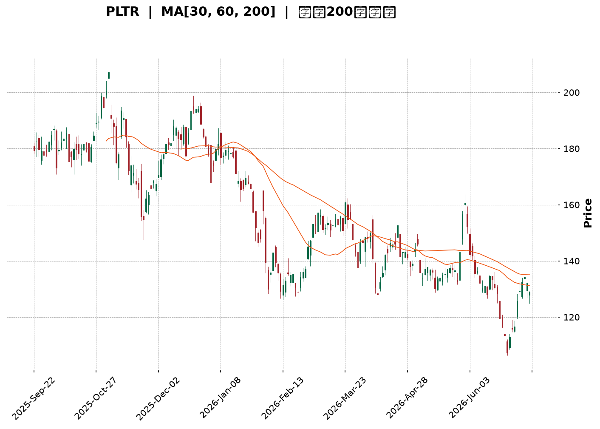
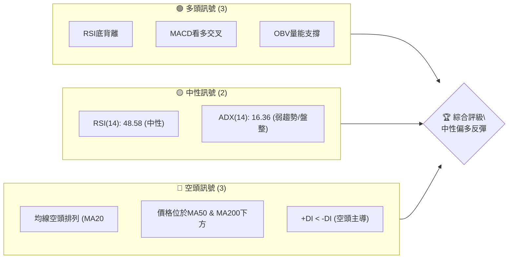
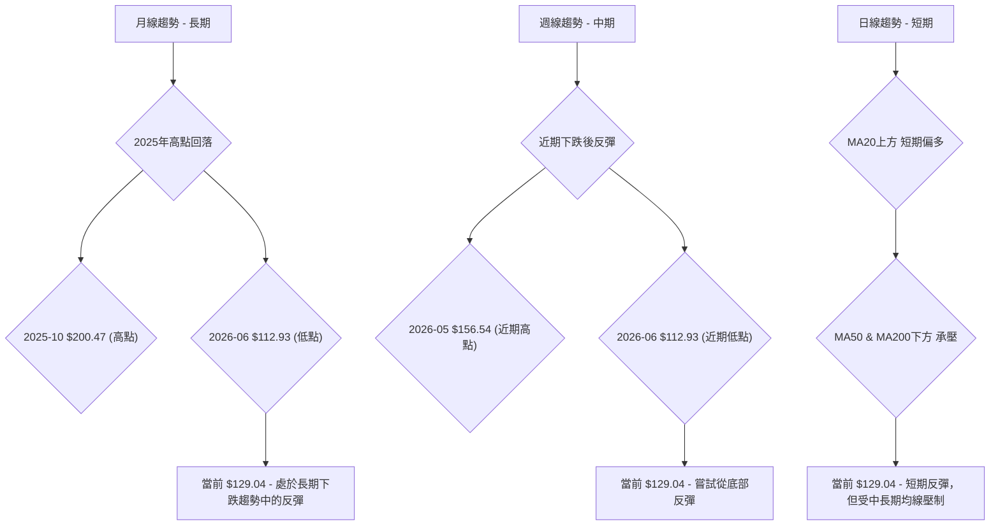
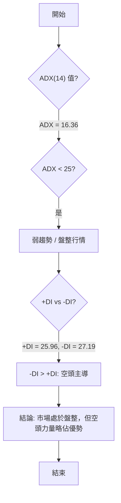
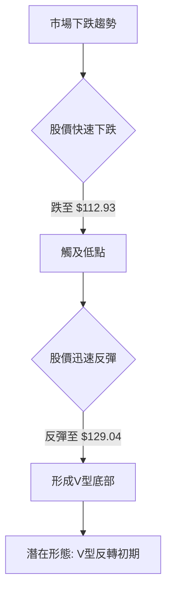
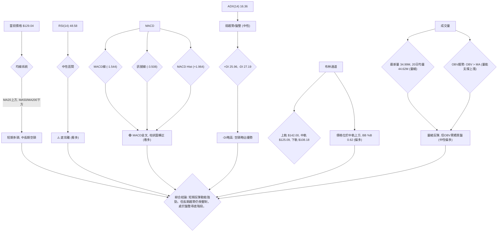
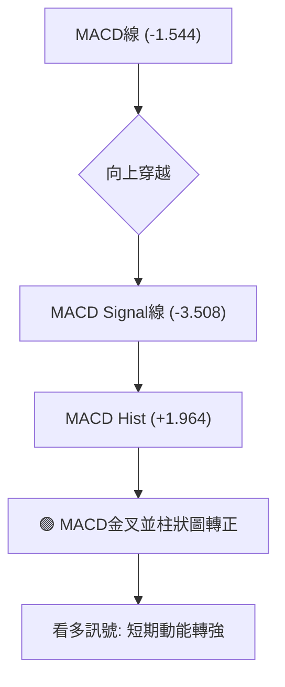
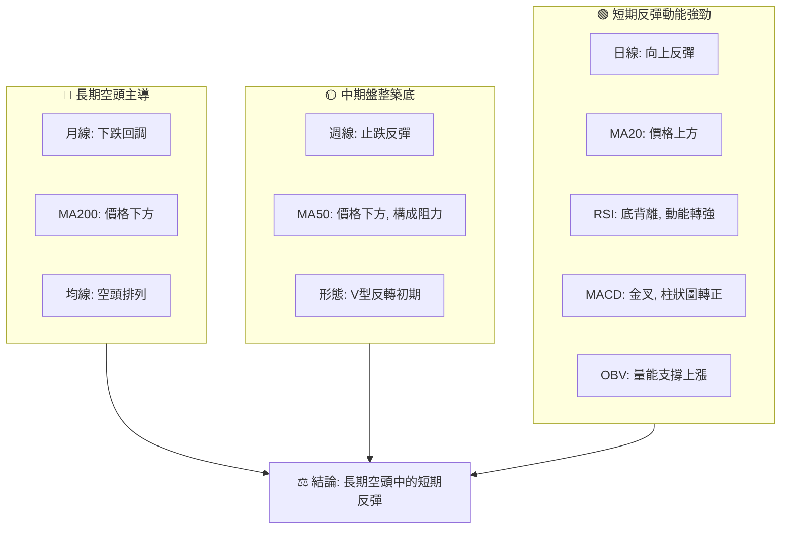
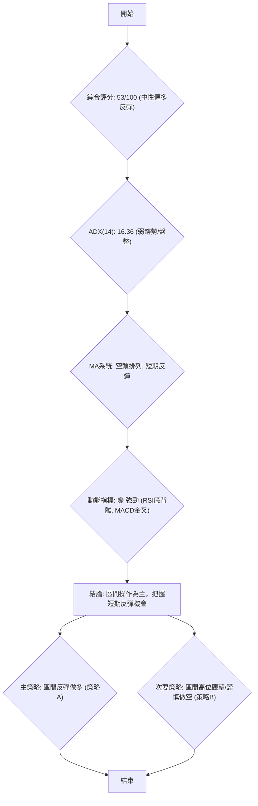
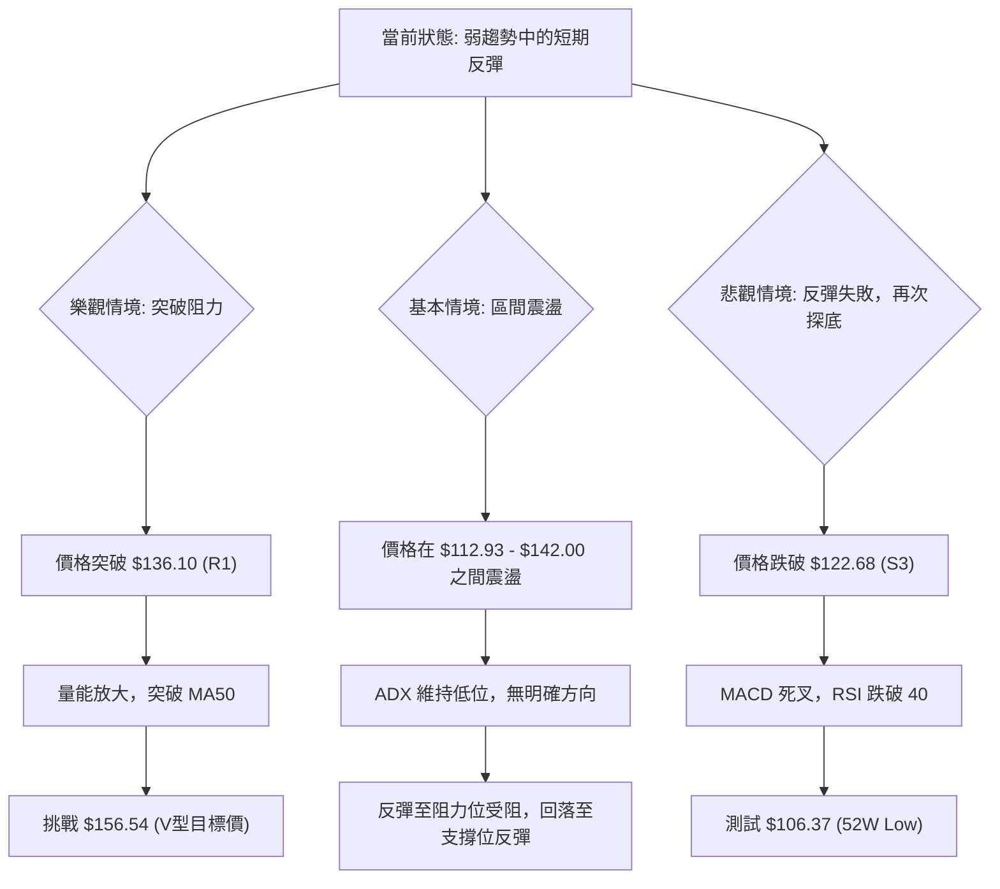

<details>
<summary>📊 靜態圖表 (點擊展開)</summary>

</details>

<html>
<head><meta charset="utf-8" /></head>
<body>
    <div style="height:500px; width:100%;">                        <script>window.PlotlyConfig = {MathJaxConfig: 'local'};</script>
        <script charset="utf-8" src="https://cdn.plot.ly/plotly-3.7.0.min.js" integrity="sha256-jvTGqxNp8AGWEcvNLVuKr+8j5dGe9Yw51LQkmDH+IYA=" crossorigin="anonymous"></script>                <div id="candlestick-chart" class="plotly-graph-div" style="height:100%; width:100%;"></div>            <script>                window.PLOTLYENV=window.PLOTLYENV || {};                                if (document.getElementById("candlestick-chart")) {                    Plotly.newPlot(                        "candlestick-chart",                        [{"close":{"dtype":"f8","bdata":"AAAAYI9qZkAAAACgmdFmQAAAAIDrcWZAAAAAANdjZkAAAACAPTJmQAAAACCFW2ZAAAAAoHDNZkAAAABgZh5nQAAAAKCZYWdAAAAAgD2iZUAAAADA9XBmQAAAAKBwxWZAAAAAgOvxZkAAAABACi9nQAAAAIAU7mVAAAAAYLgmZkAAAAAgrndmQAAAAADXc2ZAAAAAANdDZkAAAADAzERmQAAAAEDhsmZAAAAA4FGwZkAAAAAgru9lQAAAACBcj2ZAAAAAACkUZ0AAAACAwqVnQAAAAEAzs2dAAAAAgOvZaEAAAACgmVFoQAAAAEAKD2lAAAAAgMLlaUAAAAAgrtdnQAAAAMDMfGdAAAAAoJnhZUAAAACAwj1mQAAAACCFM2hAAAAAYLjeZ0AAAACgcAVnQAAAAOB6hGVAAAAA4FHAZUAAAAAAAGhlQAAAAGCP6mRAAAAAoHCtZEAAAAAA13djQAAAAEAzW2NAAAAAAABIZEAAAACgmXFkQAAAAOCjuGRAAAAAYGYOZUAAAAAgru9kQAAAAIAUVmVAAAAAYI8CZkAAAACgcD1mQAAAAOBRuGZAAAAAIK6vZkAAAABA4bpmQAAAAMAefWdAAAAAoEdxZ0AAAACAPfJmQAAAAAAA6GZAAAAAAAB4Z0AAAACgRylmQAAAAIAUNmdAAAAAACksaEAAAAAgXD9oQAAAAAApRGhAAAAAoHBFaEAAAABguJZnQAAAAIDCBWdAAAAAQOGaZkAAAAAAADhmQAAAACCF+2RAAAAAoEfBZUAAAABguHZmQAAAAIDCtWZAAAAAIIUbZkAAAAAgri9mQAAAAMAebWZAAAAAYLheZkAAAADAzExmQAAAAIA9ImZAAAAAYLheZUAAAADA9RBlQAAAAGCPqmRAAAAAwMy8ZEAAAABAMzNlQAAAAEAK72RAAAAAYGa2ZEAAAABAM6tjQAAAACCF+2JAAAAAQOFSYkAAAADgUXhiQAAAAAApvGNAAAAAoEdxYUAAAADgUUBgQAAAAMDM\u002fGBAAAAAwB7dYUAAAADgUXBhQAAAAIDC9WBAAAAAACkkYEAAAADAHm1gQAAAAOCjoGBAAAAAACnsYEAAAADgetxgQAAAACCu52BAAAAAQDNTYEAAAABA4RpgQAAAAIAUxmBAAAAAgBT+YEAAAACAFCZhQAAAAKBwJWJAAAAAQApnYkAAAACAFCZjQAAAAKBwFWNAAAAAwB6lY0AAAACAwo1jQAAAAOB65GJAAAAAQDPzYkAAAAAAADBjQAAAAGBm3mJAAAAAQAoXY0AAAABgj2JjQAAAAOCjGGNAAAAAgMJ1Y0AAAACAwtViQAAAAEDhGmRAAAAAwPVYY0AAAABguF5jQAAAAIDrcWJAAAAAgOvhYUAAAACgmTFhQAAAAMD1SGJAAAAAIK5PYkAAAABguI5iQAAAAIDCfWJAAAAAgD3CYkAAAADgUZhhQAAAACCuT2BAAAAAgOsBYEAAAAAA14tgQAAAAGBm9mBAAAAAwMzEYUAAAADgUdhhQAAAAOB6TGJAAAAA4Ho8YkAAAABACj9iQAAAAADXE2NAAAAAgD2yYUAAAABA4eJhQAAAAEAz42FAAAAAgMKlYUAAAABACj9hQAAAACCFY2FAAAAAgD0CYkAAAADA9UBiQAAAAMAe\u002fWBAAAAAoEe5YEAAAACgmSFhQAAAAKCZOWFAAAAA4HocYUAAAAAAAABhQAAAAKCZQWBAAAAAIFy3YEAAAAAgrr9gQAAAAOB65GBAAAAA4FHoYEAAAADAzCRhQAAAAKBHLWFAAAAAACkcYUAAAABAMxNhQAAAAOBRkGBAAAAAQOHqYUAAAACgR5FjQAAAAMDMFGRAAAAAoHAFY0AAAABgZsZhQAAAAGBmtmFAAAAAwPXwYEAAAABACg9hQAAAAIA9gmBAAAAAYLhGYEAAAABgj2JgQAAAACBc\u002f19AAAAAYLjWYEAAAAAAAKhgQAAAAAApVGBAAAAAQAoPYEAAAAAAAOBdQAAAAMDMLF1AAAAAAABgXEAAAACgR9FaQAAAACCFO1xAAAAAwMzsXEAAAABA4SpdQAAAAGC4bl9AAAAAoJkpYEAAAACgR5FgQAAAAADXy2BAAAAAQAqHYEAAAACgRyFgQA=="},"high":{"dtype":"f8","bdata":"AAAAAADIZkAAAAAAADhnQAAAAEAzG2dAAAAAgD0KZ0AAAAAA14NmQAAAACBcr2ZAAAAA4KPYZkAAAADA9UhnQAAAAGBmhmdAAAAAQOFaZ0AAAABgZt5mQAAAAIDCRWdAAAAA4FEIZ0AAAAAA13NnQAAAAEAzY2dAAAAAQApnZkAAAABA4cpmQAAAAEAzC2dAAAAAgD0aZ0AAAABA4bJmQAAAAEDh4mZAAAAAwHLMZkAAAABguMZmQAAAAIDrsWZAAAAAoHBFZ0AAAABgjxpoQAAAAMD1+GdAAAAAQDP7aEAAAACgcPVoQAAAAIDChWlAAAAA4KPwaUAAAABgZnZoQAAAAIA9ymdAAAAAQOHiZ0AAAABgZlZmQAAAAIDCXWhAAAAAoJkdaEAAAABgj9JnQAAAAGBm1mZAAAAAoEcpZkAAAAAgrsdlQAAAAGCPmmVAAAAAQDMzZUAAAACAPdJlQAAAACCFw2NAAAAAoHClZEAAAADAzJRkQAAAACDZCmVAAAAAoJkZZUAAAABAMyNlQAAAAAAA+GVAAAAAwB49ZkAAAACAFE5mQAAAAGDlxGZAAAAAACn8ZkAAAABAM9tmQAAAAOB6zGdAAAAAoJmBZ0AAAADAzFBnQAAAAMD1eGdAAAAAAACQZ0AAAAAAAHhnQAAAAGCPamdAAAAAAABgaEAAAAAAKdxoQAAAAADXa2hAAAAAoHBlaEAAAABAM4toQAAAAGBmZmdAAAAAAFQXZ0AAAADA9bBmQAAAAEAzq2ZAAAAAgD36ZUAAAACAFIZmQAAAAMD1aGdAAAAAwB41Z0AAAABACldmQAAAAAAA0GZAAAAAQDOjZkAAAADgIrNmQAAAAEAzk2ZAAAAAgMLNZkAAAABACn9lQAAAACCuL2VAAAAAAAAgZUAAAAAAAIBlQAAAAEDhUmVAAAAAgBQuZUAAAACgcKFkQAAAAAAptGNAAAAAAADgYkAAAADAzOxiQAAAAAB\u002fomRAAAAAQDN7Y0AAAAAgXD9hQAAAAOD7NWFAAAAAANc7YkAAAACA6zFiQAAAAAAAaGFAAAAA4Hr8YEAAAACA67FgQAAAAIA9ymBAAAAA4NCeYUAAAADAHgVhQAAAAGC4BmFAAAAAoEeBYEAAAAAgrkdgQAAAAEDhAmFAAAAA4FEwYUAAAABAM0NhQAAAAOB6ZGJAAAAAAABwYkAAAADgo1BjQAAAAAApjGNAAAAAYGYuZEAAAACAFM5jQAAAACAGlWNAAAAAgGglY0AAAAAAKXxjQAAAAIDrUWNAAAAAIIU7Y0AAAAAAAJhjQAAAAIAUlmNAAAAAwMyEY0AAAADAzJRjQAAAAGCPImRAAAAAwMxMZEAAAADgowhkQAAAAADXI2NAAAAAYLg+YkAAAAAA1wNiQAAAACCFe2JAAAAAoJmJYkAAAADgUZBiQAAAACCF02JAAAAA4KPIYkAAAADA9YhjQAAAAKBHcWFAAAAAYGYmYEAAAACgcM1gQAAAAIA9QmFAAAAAYI\u002fSYUAAAACgmTFiQAAAAMD1iGJAAAAAYGZmYkAAAAAA17tiQAAAAIDCFWNAAAAAoEfJYkAAAABgj+phQAAAAIA9ImJAAAAAQDP7YUAAAADgUXhhQAAAAGBmhmFAAAAAgBROYkAAAADgerRiQAAAACBc32FAAAAAYGb2YEAAAABgZp5hQAAAAAApPGFAAAAA4HokYUAAAACAwi1hQAAAACCuH2FAAAAAIFzPYEAAAADgevRgQAAAAIDr\u002fWBAAAAAQAovYUAAAAAgridhQAAAAKCZUWFAAAAA4KNgYUAAAACAwlVhQAAAACBc92BAAAAAAAAgYkAAAACg7bhjQAAAAGBmdmRAAAAAoJnxY0AAAACAwvViQAAAAADXS2JAAAAAQAq\u002fYUAAAADgUThhQAAAACCuH2FAAAAAgOulYEAAAADgo3BgQAAAAEDhYmBAAAAAIFzfYEAAAABA4dJgQAAAAEAzA2FAAAAAgMJtYEAAAAAA1xtgQAAAAAApPF5AAAAAAACAXUAAAACgmQlcQAAAAMAehVxAAAAAwB7FXUAAAADAzKxdQAAAAAAACGBAAAAAACmcYEAAAABANcJgQAAAAMDMXGFAAAAA4HqMYEAAAACAFCZgQA=="},"hovertemplate":"\u003cb\u003e%{x|%Y-%m-%d}\u003c\u002fb\u003e\u003cbr\u003e\u958b: $%{open:.2f}\u003cbr\u003e\u9ad8: $%{high:.2f}\u003cbr\u003e\u4f4e: $%{low:.2f}\u003cbr\u003e\u6536: $%{close:.2f}\u003cextra\u003e\u003c\u002fextra\u003e","low":{"dtype":"f8","bdata":"AAAAoEdJZkAAAADgUSBmQAAAAADXI2ZAAAAAoEfJZUAAAADAHt1lQAAAAMAeJWZAAAAAQApHZkAAAAAAAHBmQAAAAGBm3mZAAAAA4KNYZUAAAABgjzpmQAAAAKBwbWZAAAAAYGamZkAAAABgZn5mQAAAAMD1sGVAAAAAYGauZUAAAACAPVplQAAAAOCjAGZAAAAAYGYOZkAAAABgZr5lQAAAAIAULmZAAAAAwMxUZkAAAACgcC1lQAAAAOBR4GVAAAAAQDPbZkAAAADgo3BnQAAAAMD1WGdAAAAAIK7PZ0AAAAAA10NoQAAAAKBwvWhAAAAAgD06aUAAAACA6zFnQAAAAGC4pmZAAAAAwPXQZUAAAADAHh1lQAAAAOCj8GZAAAAAAClkZ0AAAADAzIxmQAAAAGBkV2VAAAAAAACQZEAAAACAwvVkQAAAAAAAsGRAAAAAoHBNZEAAAADgo0xjQAAAAIDrcWJAAAAAAACgY0AAAACAwpFjQAAAAAApfGRAAAAAAAC8ZEAAAAAA12NkQAAAAEDhMmVAAAAAYI8aZUAAAACAws1lQAAAAMAeJWZAAAAAoEdxZkAAAAAAKYxmQAAAAAAA2GZAAAAAYLiGZkAAAAAgWDVmQAAAAMD1gGZAAAAAQIukZkAAAAAAABBmQAAAAOBRsGZAAAAAIFxXZ0AAAACAwg1oQAAAACCF92dAAAAAYI8aaEAAAAAA15NnQAAAAOB69GZAAAAAYGaWZkAAAAAAAChmQAAAAEAzy2RAAAAAoEd5ZUAAAADgo9hlQAAAAMAeNWZAAAAAANfLZUAAAAAAANhlQAAAAEDhCmZAAAAA4HoEZkAAAABgZr5lQAAAAMD1EGZAAAAA4FFAZUAAAAAgrsdkQAAAACCFI2RAAAAAYGaeZEAAAACgmclkQAAAAGBm6mRAAAAAgBSWZEAAAAAgrqdjQAAAAADXY2JAAAAAwHIkYkAAAACg7VRiQAAAAADXI2NAAAAAgML1YEAAAACAPQpgQAAAAEAzi2BAAAAAANXYYEAAAADgozhhQAAAAGBmnmBAAAAAANejX0AAAACA6Y5fQAAAAGCP0l9AAAAAANfbYEAAAADgUWBgQAAAAKBwZWBAAAAAwPXYX0AAAAAgrpdfQAAAAIDCJWBAAAAAACmUYEAAAAAgXL9gQAAAAOCjkGFAAAAAYGZGYUAAAACA64FiQAAAACCFs2JAAAAAoEfJYkAAAABACh9jQAAAAOB6xGJAAAAAYI+qYkAAAAAgXN9iQAAAAGCPkmJAAAAAoHDlYkAAAAAA1wNjQAAAACCFE2NAAAAAAADQYkAAAABA4aJiQAAAACCuJ2NAAAAA4Hr0YkAAAAAgXFtjQAAAAAAAaGJAAAAAgOuxYUAAAACgmQlhQAAAAEAKX2FAAAAAQAoPYkAAAAAgrj9hQAAAACAxVGJAAAAAYGYOYkAAAACgcGVhQAAAAEAKD2BAAAAAIIWrXkAAAADAzCRgQAAAAAAAwGBAAAAAgMLdYEAAAADA9XBhQAAAAKCZ6WFAAAAAYI\u002f6YUAAAADA9\u002f9hQAAAAMAebWJAAAAAoHB9YUAAAACAwl1hQAAAAOBRoGFAAAAAoHCNYUAAAACAwtVgQAAAAMDMFGFAAAAA4HqsYUAAAABAMydiQAAAAEAK12BAAAAAwMxkYEAAAADA9dhgQAAAAOCjoGBAAAAAAKyYYEAAAABguK5gQAAAAAAAGGBAAAAAYGYuYEAAAACgR4lgQAAAAGCPamBAAAAAQDOzYEAAAACgcI1gQAAAAKBw7WBAAAAAoJnJYEAAAACgmalgQAAAAAApdGBAAAAAAACgYEAAAACgRzliQAAAAAApfGNAAAAAoJm5YkAAAAAAAKhhQAAAAEC0iGFAAAAAwMzAYEAAAADA9ehgQAAAAGBm1l9AAAAAoJkZYEAAAABA4cpfQAAAAKCZqV9AAAAAYGY2YEAAAAAA1zNgQAAAAKBwPWBAAAAA4KNAX0AAAADAzMxdQAAAACCFC11AAAAAAAAQXEAAAAAgrpdaQAAAAIAUHltAAAAAwMysXEAAAADgeqRcQAAAAGBm1l1AAAAAwMz8X0AAAADA9ahfQAAAAGC4bmBAAAAAoHCtX0AAAAAA1zNfQA=="},"name":"\u50f9\u683c","open":{"dtype":"f8","bdata":"AAAAACmcZkAAAADgUdBmQAAAAMAe\u002fWZAAAAAoJn5ZUAAAACgmWFmQAAAAOB6dGZAAAAAIFxfZkAAAACAPapmQAAAAGBmVmdAAAAAwMxMZ0AAAACAwmVmQAAAAIDriWZAAAAAoJnZZkAAAABgj\u002fJmQAAAAKBwJWdAAAAAgMJVZkAAAAAAAABmQAAAAMD1tGZAAAAAwPW4ZkAAAAAAADhmQAAAACCub2ZAAAAAgOvBZkAAAACAwr1mQAAAAIA97mVAAAAAACncZkAAAABACp9nQAAAACBcr2dAAAAAYI\u002fiZ0AAAACgmc1oQAAAAGBm5mhAAAAAoHChaUAAAACAPQJoQAAAAAAAoGdAAAAAIK5\u002fZ0AAAADAzKRlQAAAAIDrCWdAAAAAYLjKZ0AAAABgj9JnQAAAAEDhtmZAAAAAQDPfZEAAAADA9VBlQAAAAADXC2VAAAAAoJn5ZEAAAACAPYJlQAAAAOBRgGNAAAAAQAqvY0AAAACAPQJkQAAAAEAz22RAAAAA4FH4ZEAAAAAAAKBkQAAAAEDhMmVAAAAA4HpEZUAAAAAgrgtmQAAAACBcR2ZAAAAAYLjGZkAAAABACp9mQAAAAGBmHmdAAAAAoJkZZ0AAAACA6zlnQAAAAGCPImdAAAAAwPW0ZkAAAABA4XZnQAAAAOBRsGZAAAAAIK5XZ0AAAACgR2FoQAAAAGBmGmhAAAAAwB4laEAAAADgemBoQAAAAEAzW2dAAAAAQDMLZ0AAAAAAKaRmQAAAAKCZqWZAAAAAACncZUAAAADgUfhlQAAAAKCZeWZAAAAAIK4zZ0AAAADgoyBmQAAAAIDrNWZAAAAAAABcZkAAAAAAAERmQAAAAGC4VmZAAAAAIIVrZkAAAAAAAPRkQAAAACDdDGVAAAAAoJkdZUAAAADgo+hkQAAAAGC4BmVAAAAAIFzvZEAAAADAzIxkQAAAAAAptGNAAAAAoJnBYkAAAACAFN5iQAAAAKCZoWRAAAAAwB5tY0AAAACAPRphQAAAAGCP6mBAAAAAYI8SYUAAAABA4R5iQAAAAMDMYGFAAAAAIIXrYEAAAACgmflfQAAAAOCjHGBAAAAA4Hr8YEAAAACA64lgQAAAACCui2BAAAAAoEeBYEAAAAAAKSBgQAAAACCFU2BAAAAAQAq7YEAAAACAPcJgQAAAAMDMmGFAAAAAQDPDYUAAAACAwo1iQAAAAIAUHmNAAAAAgBTOYkAAAACAFHZjQAAAACCuf2NAAAAAACnsYkAAAADgUSBjQAAAAKCZKWNAAAAAYGYOY0AAAADA9QxjQAAAAIA9XmNAAAAAQDMjY0AAAABgZmZjQAAAACCuJ2NAAAAAgD0CZEAAAACgcK1jQAAAAIDCIWNAAAAAACk8YkAAAADgo+hhQAAAAOCjgGFAAAAAAABgYkAAAAAghe9hQAAAACCFi2JAAAAAYDlcYkAAAADgelhjQAAAAOCjbGFAAAAAIFwPYEAAAAAgXEdgQAAAAACqzWBAAAAAoEcZYUAAAACgRwliQAAAAIAUKmJAAAAAAAAgYkAAAACA61liQAAAACCFi2JAAAAAYGa2YkAAAABguN5hQAAAAAAAqGFAAAAAoJnJYUAAAADgUXhhQAAAAEAzT2FAAAAAAADoYUAAAAAAAHhiQAAAAKBwiWFAAAAAYLi2YEAAAABAM+NgQAAAACCu+2BAAAAAwB7dYEAAAABAMxNhQAAAACAxwGBAAAAAwMw0YEAAAACgmZlgQAAAAAAAkGBAAAAAoHDlYEAAAADgo8RgQAAAAKCZ+WBAAAAAoJktYUAAAADAHgVhQAAAAKCZqWBAAAAAwB6lYEAAAABgZnpiQAAAACBc\u002f2NAAAAAgBSWY0AAAABgZrZiQAAAAGC4LmJAAAAAYGaKYUAAAACAwvVgQAAAAADX22BAAAAAYGYqYEAAAADA9RhgQAAAAKBHXWBAAAAA4KNAYEAAAABA4dJgQAAAAOBReGBAAAAAQOFaYEAAAAAgXG9fQAAAAKCZCV5AAAAAIK6HXEAAAADgUdhbQAAAAGCPQltAAAAAYLgOXUAAAADAzLxcQAAAAEAzA15AAAAAIK4fYEAAAAAgXM9fQAAAACBct2BAAAAAIK4vYEAAAADgzvdfQA=="},"x":["2025-09-22T00:00:00-04:00","2025-09-23T00:00:00-04:00","2025-09-24T00:00:00-04:00","2025-09-25T00:00:00-04:00","2025-09-26T00:00:00-04:00","2025-09-29T00:00:00-04:00","2025-09-30T00:00:00-04:00","2025-10-01T00:00:00-04:00","2025-10-02T00:00:00-04:00","2025-10-03T00:00:00-04:00","2025-10-06T00:00:00-04:00","2025-10-07T00:00:00-04:00","2025-10-08T00:00:00-04:00","2025-10-09T00:00:00-04:00","2025-10-10T00:00:00-04:00","2025-10-13T00:00:00-04:00","2025-10-14T00:00:00-04:00","2025-10-15T00:00:00-04:00","2025-10-16T00:00:00-04:00","2025-10-17T00:00:00-04:00","2025-10-20T00:00:00-04:00","2025-10-21T00:00:00-04:00","2025-10-22T00:00:00-04:00","2025-10-23T00:00:00-04:00","2025-10-24T00:00:00-04:00","2025-10-27T00:00:00-04:00","2025-10-28T00:00:00-04:00","2025-10-29T00:00:00-04:00","2025-10-30T00:00:00-04:00","2025-10-31T00:00:00-04:00","2025-11-03T00:00:00-05:00","2025-11-04T00:00:00-05:00","2025-11-05T00:00:00-05:00","2025-11-06T00:00:00-05:00","2025-11-07T00:00:00-05:00","2025-11-10T00:00:00-05:00","2025-11-11T00:00:00-05:00","2025-11-12T00:00:00-05:00","2025-11-13T00:00:00-05:00","2025-11-14T00:00:00-05:00","2025-11-17T00:00:00-05:00","2025-11-18T00:00:00-05:00","2025-11-19T00:00:00-05:00","2025-11-20T00:00:00-05:00","2025-11-21T00:00:00-05:00","2025-11-24T00:00:00-05:00","2025-11-25T00:00:00-05:00","2025-11-26T00:00:00-05:00","2025-11-28T00:00:00-05:00","2025-12-01T00:00:00-05:00","2025-12-02T00:00:00-05:00","2025-12-03T00:00:00-05:00","2025-12-04T00:00:00-05:00","2025-12-05T00:00:00-05:00","2025-12-08T00:00:00-05:00","2025-12-09T00:00:00-05:00","2025-12-10T00:00:00-05:00","2025-12-11T00:00:00-05:00","2025-12-12T00:00:00-05:00","2025-12-15T00:00:00-05:00","2025-12-16T00:00:00-05:00","2025-12-17T00:00:00-05:00","2025-12-18T00:00:00-05:00","2025-12-19T00:00:00-05:00","2025-12-22T00:00:00-05:00","2025-12-23T00:00:00-05:00","2025-12-24T00:00:00-05:00","2025-12-26T00:00:00-05:00","2025-12-29T00:00:00-05:00","2025-12-30T00:00:00-05:00","2025-12-31T00:00:00-05:00","2026-01-02T00:00:00-05:00","2026-01-05T00:00:00-05:00","2026-01-06T00:00:00-05:00","2026-01-07T00:00:00-05:00","2026-01-08T00:00:00-05:00","2026-01-09T00:00:00-05:00","2026-01-12T00:00:00-05:00","2026-01-13T00:00:00-05:00","2026-01-14T00:00:00-05:00","2026-01-15T00:00:00-05:00","2026-01-16T00:00:00-05:00","2026-01-20T00:00:00-05:00","2026-01-21T00:00:00-05:00","2026-01-22T00:00:00-05:00","2026-01-23T00:00:00-05:00","2026-01-26T00:00:00-05:00","2026-01-27T00:00:00-05:00","2026-01-28T00:00:00-05:00","2026-01-29T00:00:00-05:00","2026-01-30T00:00:00-05:00","2026-02-02T00:00:00-05:00","2026-02-03T00:00:00-05:00","2026-02-04T00:00:00-05:00","2026-02-05T00:00:00-05:00","2026-02-06T00:00:00-05:00","2026-02-09T00:00:00-05:00","2026-02-10T00:00:00-05:00","2026-02-11T00:00:00-05:00","2026-02-12T00:00:00-05:00","2026-02-13T00:00:00-05:00","2026-02-17T00:00:00-05:00","2026-02-18T00:00:00-05:00","2026-02-19T00:00:00-05:00","2026-02-20T00:00:00-05:00","2026-02-23T00:00:00-05:00","2026-02-24T00:00:00-05:00","2026-02-25T00:00:00-05:00","2026-02-26T00:00:00-05:00","2026-02-27T00:00:00-05:00","2026-03-02T00:00:00-05:00","2026-03-03T00:00:00-05:00","2026-03-04T00:00:00-05:00","2026-03-05T00:00:00-05:00","2026-03-06T00:00:00-05:00","2026-03-09T00:00:00-04:00","2026-03-10T00:00:00-04:00","2026-03-11T00:00:00-04:00","2026-03-12T00:00:00-04:00","2026-03-13T00:00:00-04:00","2026-03-16T00:00:00-04:00","2026-03-17T00:00:00-04:00","2026-03-18T00:00:00-04:00","2026-03-19T00:00:00-04:00","2026-03-20T00:00:00-04:00","2026-03-23T00:00:00-04:00","2026-03-24T00:00:00-04:00","2026-03-25T00:00:00-04:00","2026-03-26T00:00:00-04:00","2026-03-27T00:00:00-04:00","2026-03-30T00:00:00-04:00","2026-03-31T00:00:00-04:00","2026-04-01T00:00:00-04:00","2026-04-02T00:00:00-04:00","2026-04-06T00:00:00-04:00","2026-04-07T00:00:00-04:00","2026-04-08T00:00:00-04:00","2026-04-09T00:00:00-04:00","2026-04-10T00:00:00-04:00","2026-04-13T00:00:00-04:00","2026-04-14T00:00:00-04:00","2026-04-15T00:00:00-04:00","2026-04-16T00:00:00-04:00","2026-04-17T00:00:00-04:00","2026-04-20T00:00:00-04:00","2026-04-21T00:00:00-04:00","2026-04-22T00:00:00-04:00","2026-04-23T00:00:00-04:00","2026-04-24T00:00:00-04:00","2026-04-27T00:00:00-04:00","2026-04-28T00:00:00-04:00","2026-04-29T00:00:00-04:00","2026-04-30T00:00:00-04:00","2026-05-01T00:00:00-04:00","2026-05-04T00:00:00-04:00","2026-05-05T00:00:00-04:00","2026-05-06T00:00:00-04:00","2026-05-07T00:00:00-04:00","2026-05-08T00:00:00-04:00","2026-05-11T00:00:00-04:00","2026-05-12T00:00:00-04:00","2026-05-13T00:00:00-04:00","2026-05-14T00:00:00-04:00","2026-05-15T00:00:00-04:00","2026-05-18T00:00:00-04:00","2026-05-19T00:00:00-04:00","2026-05-20T00:00:00-04:00","2026-05-21T00:00:00-04:00","2026-05-22T00:00:00-04:00","2026-05-26T00:00:00-04:00","2026-05-27T00:00:00-04:00","2026-05-28T00:00:00-04:00","2026-05-29T00:00:00-04:00","2026-06-01T00:00:00-04:00","2026-06-02T00:00:00-04:00","2026-06-03T00:00:00-04:00","2026-06-04T00:00:00-04:00","2026-06-05T00:00:00-04:00","2026-06-08T00:00:00-04:00","2026-06-09T00:00:00-04:00","2026-06-10T00:00:00-04:00","2026-06-11T00:00:00-04:00","2026-06-12T00:00:00-04:00","2026-06-15T00:00:00-04:00","2026-06-16T00:00:00-04:00","2026-06-17T00:00:00-04:00","2026-06-18T00:00:00-04:00","2026-06-22T00:00:00-04:00","2026-06-23T00:00:00-04:00","2026-06-24T00:00:00-04:00","2026-06-25T00:00:00-04:00","2026-06-26T00:00:00-04:00","2026-06-29T00:00:00-04:00","2026-06-30T00:00:00-04:00","2026-07-01T00:00:00-04:00","2026-07-02T00:00:00-04:00","2026-07-06T00:00:00-04:00","2026-07-07T00:00:00-04:00","2026-07-08T00:00:00-04:00","2026-07-09T00:00:00-04:00"],"type":"candlestick"},{"hovertemplate":"MA30: $%{y:.2f}\u003cextra\u003e\u003c\u002fextra\u003e","line":{"color":"#2196F3","dash":"dash","width":2},"mode":"lines","name":"MA30","x":["2025-09-22T00:00:00-04:00","2025-09-23T00:00:00-04:00","2025-09-24T00:00:00-04:00","2025-09-25T00:00:00-04:00","2025-09-26T00:00:00-04:00","2025-09-29T00:00:00-04:00","2025-09-30T00:00:00-04:00","2025-10-01T00:00:00-04:00","2025-10-02T00:00:00-04:00","2025-10-03T00:00:00-04:00","2025-10-06T00:00:00-04:00","2025-10-07T00:00:00-04:00","2025-10-08T00:00:00-04:00","2025-10-09T00:00:00-04:00","2025-10-10T00:00:00-04:00","2025-10-13T00:00:00-04:00","2025-10-14T00:00:00-04:00","2025-10-15T00:00:00-04:00","2025-10-16T00:00:00-04:00","2025-10-17T00:00:00-04:00","2025-10-20T00:00:00-04:00","2025-10-21T00:00:00-04:00","2025-10-22T00:00:00-04:00","2025-10-23T00:00:00-04:00","2025-10-24T00:00:00-04:00","2025-10-27T00:00:00-04:00","2025-10-28T00:00:00-04:00","2025-10-29T00:00:00-04:00","2025-10-30T00:00:00-04:00","2025-10-31T00:00:00-04:00","2025-11-03T00:00:00-05:00","2025-11-04T00:00:00-05:00","2025-11-05T00:00:00-05:00","2025-11-06T00:00:00-05:00","2025-11-07T00:00:00-05:00","2025-11-10T00:00:00-05:00","2025-11-11T00:00:00-05:00","2025-11-12T00:00:00-05:00","2025-11-13T00:00:00-05:00","2025-11-14T00:00:00-05:00","2025-11-17T00:00:00-05:00","2025-11-18T00:00:00-05:00","2025-11-19T00:00:00-05:00","2025-11-20T00:00:00-05:00","2025-11-21T00:00:00-05:00","2025-11-24T00:00:00-05:00","2025-11-25T00:00:00-05:00","2025-11-26T00:00:00-05:00","2025-11-28T00:00:00-05:00","2025-12-01T00:00:00-05:00","2025-12-02T00:00:00-05:00","2025-12-03T00:00:00-05:00","2025-12-04T00:00:00-05:00","2025-12-05T00:00:00-05:00","2025-12-08T00:00:00-05:00","2025-12-09T00:00:00-05:00","2025-12-10T00:00:00-05:00","2025-12-11T00:00:00-05:00","2025-12-12T00:00:00-05:00","2025-12-15T00:00:00-05:00","2025-12-16T00:00:00-05:00","2025-12-17T00:00:00-05:00","2025-12-18T00:00:00-05:00","2025-12-19T00:00:00-05:00","2025-12-22T00:00:00-05:00","2025-12-23T00:00:00-05:00","2025-12-24T00:00:00-05:00","2025-12-26T00:00:00-05:00","2025-12-29T00:00:00-05:00","2025-12-30T00:00:00-05:00","2025-12-31T00:00:00-05:00","2026-01-02T00:00:00-05:00","2026-01-05T00:00:00-05:00","2026-01-06T00:00:00-05:00","2026-01-07T00:00:00-05:00","2026-01-08T00:00:00-05:00","2026-01-09T00:00:00-05:00","2026-01-12T00:00:00-05:00","2026-01-13T00:00:00-05:00","2026-01-14T00:00:00-05:00","2026-01-15T00:00:00-05:00","2026-01-16T00:00:00-05:00","2026-01-20T00:00:00-05:00","2026-01-21T00:00:00-05:00","2026-01-22T00:00:00-05:00","2026-01-23T00:00:00-05:00","2026-01-26T00:00:00-05:00","2026-01-27T00:00:00-05:00","2026-01-28T00:00:00-05:00","2026-01-29T00:00:00-05:00","2026-01-30T00:00:00-05:00","2026-02-02T00:00:00-05:00","2026-02-03T00:00:00-05:00","2026-02-04T00:00:00-05:00","2026-02-05T00:00:00-05:00","2026-02-06T00:00:00-05:00","2026-02-09T00:00:00-05:00","2026-02-10T00:00:00-05:00","2026-02-11T00:00:00-05:00","2026-02-12T00:00:00-05:00","2026-02-13T00:00:00-05:00","2026-02-17T00:00:00-05:00","2026-02-18T00:00:00-05:00","2026-02-19T00:00:00-05:00","2026-02-20T00:00:00-05:00","2026-02-23T00:00:00-05:00","2026-02-24T00:00:00-05:00","2026-02-25T00:00:00-05:00","2026-02-26T00:00:00-05:00","2026-02-27T00:00:00-05:00","2026-03-02T00:00:00-05:00","2026-03-03T00:00:00-05:00","2026-03-04T00:00:00-05:00","2026-03-05T00:00:00-05:00","2026-03-06T00:00:00-05:00","2026-03-09T00:00:00-04:00","2026-03-10T00:00:00-04:00","2026-03-11T00:00:00-04:00","2026-03-12T00:00:00-04:00","2026-03-13T00:00:00-04:00","2026-03-16T00:00:00-04:00","2026-03-17T00:00:00-04:00","2026-03-18T00:00:00-04:00","2026-03-19T00:00:00-04:00","2026-03-20T00:00:00-04:00","2026-03-23T00:00:00-04:00","2026-03-24T00:00:00-04:00","2026-03-25T00:00:00-04:00","2026-03-26T00:00:00-04:00","2026-03-27T00:00:00-04:00","2026-03-30T00:00:00-04:00","2026-03-31T00:00:00-04:00","2026-04-01T00:00:00-04:00","2026-04-02T00:00:00-04:00","2026-04-06T00:00:00-04:00","2026-04-07T00:00:00-04:00","2026-04-08T00:00:00-04:00","2026-04-09T00:00:00-04:00","2026-04-10T00:00:00-04:00","2026-04-13T00:00:00-04:00","2026-04-14T00:00:00-04:00","2026-04-15T00:00:00-04:00","2026-04-16T00:00:00-04:00","2026-04-17T00:00:00-04:00","2026-04-20T00:00:00-04:00","2026-04-21T00:00:00-04:00","2026-04-22T00:00:00-04:00","2026-04-23T00:00:00-04:00","2026-04-24T00:00:00-04:00","2026-04-27T00:00:00-04:00","2026-04-28T00:00:00-04:00","2026-04-29T00:00:00-04:00","2026-04-30T00:00:00-04:00","2026-05-01T00:00:00-04:00","2026-05-04T00:00:00-04:00","2026-05-05T00:00:00-04:00","2026-05-06T00:00:00-04:00","2026-05-07T00:00:00-04:00","2026-05-08T00:00:00-04:00","2026-05-11T00:00:00-04:00","2026-05-12T00:00:00-04:00","2026-05-13T00:00:00-04:00","2026-05-14T00:00:00-04:00","2026-05-15T00:00:00-04:00","2026-05-18T00:00:00-04:00","2026-05-19T00:00:00-04:00","2026-05-20T00:00:00-04:00","2026-05-21T00:00:00-04:00","2026-05-22T00:00:00-04:00","2026-05-26T00:00:00-04:00","2026-05-27T00:00:00-04:00","2026-05-28T00:00:00-04:00","2026-05-29T00:00:00-04:00","2026-06-01T00:00:00-04:00","2026-06-02T00:00:00-04:00","2026-06-03T00:00:00-04:00","2026-06-04T00:00:00-04:00","2026-06-05T00:00:00-04:00","2026-06-08T00:00:00-04:00","2026-06-09T00:00:00-04:00","2026-06-10T00:00:00-04:00","2026-06-11T00:00:00-04:00","2026-06-12T00:00:00-04:00","2026-06-15T00:00:00-04:00","2026-06-16T00:00:00-04:00","2026-06-17T00:00:00-04:00","2026-06-18T00:00:00-04:00","2026-06-22T00:00:00-04:00","2026-06-23T00:00:00-04:00","2026-06-24T00:00:00-04:00","2026-06-25T00:00:00-04:00","2026-06-26T00:00:00-04:00","2026-06-29T00:00:00-04:00","2026-06-30T00:00:00-04:00","2026-07-01T00:00:00-04:00","2026-07-02T00:00:00-04:00","2026-07-06T00:00:00-04:00","2026-07-07T00:00:00-04:00","2026-07-08T00:00:00-04:00","2026-07-09T00:00:00-04:00"],"y":{"dtype":"f8","bdata":"AAAAAAAA+H8AAAAAAAD4fwAAAAAAAPh\u002fAAAAAAAA+H8AAAAAAAD4fwAAAAAAAPh\u002fAAAAAAAA+H8AAAAAAAD4fwAAAAAAAPh\u002fAAAAAAAA+H8AAAAAAAD4fwAAAAAAAPh\u002fAAAAAAAA+H8AAAAAAAD4fwAAAAAAAPh\u002fAAAAAAAA+H8AAAAAAAD4fwAAAAAAAPh\u002fAAAAAAAA+H8AAAAAAAD4fwAAAAAAAPh\u002fAAAAAAAA+H8AAAAAAAD4fwAAAAAAAPh\u002fAAAAAAAA+H8AAAAAAAD4fwAAAAAAAPh\u002fAAAAAAAA+H8AAAAAAAD4f4mIiLge1WZAAAAAoNPyZkCrqqoKkPtmQKuqqmp1BGdAmpmZCR4AZ0BmZmZWgABnQCIiIhI8EGdAAAAAEFgZZ0AiIiISgxhnQFVVVaWbCGdAMzMzU5wJZ0BVVVVVxwBnQGZmZgbz8GZAiYiImJndZkAAAACw5L1mQO\u002fu7j7up2ZAq6qqKvmXZkB3d3c3tIZmQO\u002fu7j7ud2ZAERERsZ1tZkDe3d3NPmJmQBEREWGeVmZAERERodNQZkDe3d0ta1NmQERERLTIVGZAZmZmRm9RZkB3d3f3mklmQLy7u3vNR2ZAVVVVBcg7ZkAAAADAETBmQKuqqoqzHWZAvLu72\u002fkIZkC8u7sbofplQCIiIqJF+GVAIiIi8tILZkCrqqqq8RxmQJqZmal\u002fHWZARERENOwgZkDe3d3twyVmQGZmZqabMmZAIiIisuQ5ZkARERGh00BmQKuqqlpkQWZAAAAAMJZKZkC8u7s7JmRmQLy7u5vEgGZAzczMHFqQZkCamZmpOJ9mQKuqqkrFrWZAmpmZOfu4ZkARERFhnsRmQLy7u4tsy2ZAIiIicvbFZkCamZlZ8rtmQN7d3d1rqmZAERERwcqZZkC8u7trvIxmQAAAAPDudmZAmpmZKaNfZkCrqqpaq0NmQKuqqsovImZA3t3dXUj2ZUBVVVW1yNZlQJqZmbkeuWVAAAAA0LB\u002fZUDNzMy8dDtlQAAAABBY\u002fWRAq6qqqqrGZECJiIjIL5JkQM3MzAx0XmRAZmZmxksnZEDe3d3d3fVjQJqZmTm00GNAiYiIeHenY0Dv7u6eqHdjQImIiGgfRmNAiYiIWMcUY0BmZmam4uBiQDMzM5OmsGJA7+7uPsOCYkC8u7srzlZiQHd3d1fHNGJAzczMvHQbYkBVVVXlFwtiQO\u002fu7t6W\u002fWFAVVVVRUT0YUCrqqr6N+ZhQM3MzMzM1GFAAAAAkMLFYUARERFBp8FhQDMzM8OuwGFAmpmZqTjHYUAzMzODB89hQERERCSUyWFAAAAAcMvaYUCamZm51\u002fBhQCIiIgJyC2JA7+7uThsYYkARERExlihiQJqZmTlCNWJAq6qqCh5EYkC8u7urqkpiQImIiIjPWGJA3t3dTalkYkAiIiLSInNiQImIiAisgGJAREREpHCVYkCJiIiYJ6JiQAAAAEA1nmJAvLu7e82VYkDNzMxMqZBiQLy7u1uPhmJAiYiI6CaBYkAiIiLSBnZiQGZmZvZTb2JAAAAAgE5jYkCamZk5JlhiQM3MzFy6WWJAERERgQdPYkARERHh7ENiQO\u002fu7k6NO2JA3t3dHT4vYkAiIiLy\u002fRxiQKuqqtprDmJA3t3djQkCYkC8u7vLE\u002f1hQO\u002fu7j584mFAMzMzkxjMYUAzMzPz\u002fbhhQCIiItKUrmFAAAAAAACoYUDv7u6+WKZhQAAAAOAIlWFAq6qqimyHYUBERERE\u002fXdhQO\u002fu7r5YamFAAAAAoIxaYUCrqqraslZhQGZmZtYVXmFAmpmZSX5nYUDNzMxcAWxhQHd3d0eaaGFAq6qqOt9pYUBmZmYWknhhQERERATIh2FAAAAA4HqOYUCamZlpdYphQGZmZobPfmFAMzMzM154YUAAAACATnFhQDMzM5OKZWFAmpmZCddZYUC8u7ubfVJhQDMzMxuhRmFAvLu7M6U8YUARERFpAy9hQGZmZp5hKWFAAAAA6LQjYUDe3d2V\u002fBBhQImIiOB6+mBAERER2YfhYEBERESk4sJgQFVVVb2fsGBAERERWWSdYEDNzMzU6opgQGZmZkbhgGBAzczMzIV6YEBmZmb2mnVgQJqZmXlbcmBAvLu7+2JtYECJiIiYUmVgQA=="},"type":"scatter"},{"hovertemplate":"MA60: $%{y:.2f}\u003cextra\u003e\u003c\u002fextra\u003e","line":{"color":"#9C27B0","dash":"dash","width":2},"mode":"lines","name":"MA60","x":["2025-09-22T00:00:00-04:00","2025-09-23T00:00:00-04:00","2025-09-24T00:00:00-04:00","2025-09-25T00:00:00-04:00","2025-09-26T00:00:00-04:00","2025-09-29T00:00:00-04:00","2025-09-30T00:00:00-04:00","2025-10-01T00:00:00-04:00","2025-10-02T00:00:00-04:00","2025-10-03T00:00:00-04:00","2025-10-06T00:00:00-04:00","2025-10-07T00:00:00-04:00","2025-10-08T00:00:00-04:00","2025-10-09T00:00:00-04:00","2025-10-10T00:00:00-04:00","2025-10-13T00:00:00-04:00","2025-10-14T00:00:00-04:00","2025-10-15T00:00:00-04:00","2025-10-16T00:00:00-04:00","2025-10-17T00:00:00-04:00","2025-10-20T00:00:00-04:00","2025-10-21T00:00:00-04:00","2025-10-22T00:00:00-04:00","2025-10-23T00:00:00-04:00","2025-10-24T00:00:00-04:00","2025-10-27T00:00:00-04:00","2025-10-28T00:00:00-04:00","2025-10-29T00:00:00-04:00","2025-10-30T00:00:00-04:00","2025-10-31T00:00:00-04:00","2025-11-03T00:00:00-05:00","2025-11-04T00:00:00-05:00","2025-11-05T00:00:00-05:00","2025-11-06T00:00:00-05:00","2025-11-07T00:00:00-05:00","2025-11-10T00:00:00-05:00","2025-11-11T00:00:00-05:00","2025-11-12T00:00:00-05:00","2025-11-13T00:00:00-05:00","2025-11-14T00:00:00-05:00","2025-11-17T00:00:00-05:00","2025-11-18T00:00:00-05:00","2025-11-19T00:00:00-05:00","2025-11-20T00:00:00-05:00","2025-11-21T00:00:00-05:00","2025-11-24T00:00:00-05:00","2025-11-25T00:00:00-05:00","2025-11-26T00:00:00-05:00","2025-11-28T00:00:00-05:00","2025-12-01T00:00:00-05:00","2025-12-02T00:00:00-05:00","2025-12-03T00:00:00-05:00","2025-12-04T00:00:00-05:00","2025-12-05T00:00:00-05:00","2025-12-08T00:00:00-05:00","2025-12-09T00:00:00-05:00","2025-12-10T00:00:00-05:00","2025-12-11T00:00:00-05:00","2025-12-12T00:00:00-05:00","2025-12-15T00:00:00-05:00","2025-12-16T00:00:00-05:00","2025-12-17T00:00:00-05:00","2025-12-18T00:00:00-05:00","2025-12-19T00:00:00-05:00","2025-12-22T00:00:00-05:00","2025-12-23T00:00:00-05:00","2025-12-24T00:00:00-05:00","2025-12-26T00:00:00-05:00","2025-12-29T00:00:00-05:00","2025-12-30T00:00:00-05:00","2025-12-31T00:00:00-05:00","2026-01-02T00:00:00-05:00","2026-01-05T00:00:00-05:00","2026-01-06T00:00:00-05:00","2026-01-07T00:00:00-05:00","2026-01-08T00:00:00-05:00","2026-01-09T00:00:00-05:00","2026-01-12T00:00:00-05:00","2026-01-13T00:00:00-05:00","2026-01-14T00:00:00-05:00","2026-01-15T00:00:00-05:00","2026-01-16T00:00:00-05:00","2026-01-20T00:00:00-05:00","2026-01-21T00:00:00-05:00","2026-01-22T00:00:00-05:00","2026-01-23T00:00:00-05:00","2026-01-26T00:00:00-05:00","2026-01-27T00:00:00-05:00","2026-01-28T00:00:00-05:00","2026-01-29T00:00:00-05:00","2026-01-30T00:00:00-05:00","2026-02-02T00:00:00-05:00","2026-02-03T00:00:00-05:00","2026-02-04T00:00:00-05:00","2026-02-05T00:00:00-05:00","2026-02-06T00:00:00-05:00","2026-02-09T00:00:00-05:00","2026-02-10T00:00:00-05:00","2026-02-11T00:00:00-05:00","2026-02-12T00:00:00-05:00","2026-02-13T00:00:00-05:00","2026-02-17T00:00:00-05:00","2026-02-18T00:00:00-05:00","2026-02-19T00:00:00-05:00","2026-02-20T00:00:00-05:00","2026-02-23T00:00:00-05:00","2026-02-24T00:00:00-05:00","2026-02-25T00:00:00-05:00","2026-02-26T00:00:00-05:00","2026-02-27T00:00:00-05:00","2026-03-02T00:00:00-05:00","2026-03-03T00:00:00-05:00","2026-03-04T00:00:00-05:00","2026-03-05T00:00:00-05:00","2026-03-06T00:00:00-05:00","2026-03-09T00:00:00-04:00","2026-03-10T00:00:00-04:00","2026-03-11T00:00:00-04:00","2026-03-12T00:00:00-04:00","2026-03-13T00:00:00-04:00","2026-03-16T00:00:00-04:00","2026-03-17T00:00:00-04:00","2026-03-18T00:00:00-04:00","2026-03-19T00:00:00-04:00","2026-03-20T00:00:00-04:00","2026-03-23T00:00:00-04:00","2026-03-24T00:00:00-04:00","2026-03-25T00:00:00-04:00","2026-03-26T00:00:00-04:00","2026-03-27T00:00:00-04:00","2026-03-30T00:00:00-04:00","2026-03-31T00:00:00-04:00","2026-04-01T00:00:00-04:00","2026-04-02T00:00:00-04:00","2026-04-06T00:00:00-04:00","2026-04-07T00:00:00-04:00","2026-04-08T00:00:00-04:00","2026-04-09T00:00:00-04:00","2026-04-10T00:00:00-04:00","2026-04-13T00:00:00-04:00","2026-04-14T00:00:00-04:00","2026-04-15T00:00:00-04:00","2026-04-16T00:00:00-04:00","2026-04-17T00:00:00-04:00","2026-04-20T00:00:00-04:00","2026-04-21T00:00:00-04:00","2026-04-22T00:00:00-04:00","2026-04-23T00:00:00-04:00","2026-04-24T00:00:00-04:00","2026-04-27T00:00:00-04:00","2026-04-28T00:00:00-04:00","2026-04-29T00:00:00-04:00","2026-04-30T00:00:00-04:00","2026-05-01T00:00:00-04:00","2026-05-04T00:00:00-04:00","2026-05-05T00:00:00-04:00","2026-05-06T00:00:00-04:00","2026-05-07T00:00:00-04:00","2026-05-08T00:00:00-04:00","2026-05-11T00:00:00-04:00","2026-05-12T00:00:00-04:00","2026-05-13T00:00:00-04:00","2026-05-14T00:00:00-04:00","2026-05-15T00:00:00-04:00","2026-05-18T00:00:00-04:00","2026-05-19T00:00:00-04:00","2026-05-20T00:00:00-04:00","2026-05-21T00:00:00-04:00","2026-05-22T00:00:00-04:00","2026-05-26T00:00:00-04:00","2026-05-27T00:00:00-04:00","2026-05-28T00:00:00-04:00","2026-05-29T00:00:00-04:00","2026-06-01T00:00:00-04:00","2026-06-02T00:00:00-04:00","2026-06-03T00:00:00-04:00","2026-06-04T00:00:00-04:00","2026-06-05T00:00:00-04:00","2026-06-08T00:00:00-04:00","2026-06-09T00:00:00-04:00","2026-06-10T00:00:00-04:00","2026-06-11T00:00:00-04:00","2026-06-12T00:00:00-04:00","2026-06-15T00:00:00-04:00","2026-06-16T00:00:00-04:00","2026-06-17T00:00:00-04:00","2026-06-18T00:00:00-04:00","2026-06-22T00:00:00-04:00","2026-06-23T00:00:00-04:00","2026-06-24T00:00:00-04:00","2026-06-25T00:00:00-04:00","2026-06-26T00:00:00-04:00","2026-06-29T00:00:00-04:00","2026-06-30T00:00:00-04:00","2026-07-01T00:00:00-04:00","2026-07-02T00:00:00-04:00","2026-07-06T00:00:00-04:00","2026-07-07T00:00:00-04:00","2026-07-08T00:00:00-04:00","2026-07-09T00:00:00-04:00"],"y":{"dtype":"f8","bdata":"AAAAAAAA+H8AAAAAAAD4fwAAAAAAAPh\u002fAAAAAAAA+H8AAAAAAAD4fwAAAAAAAPh\u002fAAAAAAAA+H8AAAAAAAD4fwAAAAAAAPh\u002fAAAAAAAA+H8AAAAAAAD4fwAAAAAAAPh\u002fAAAAAAAA+H8AAAAAAAD4fwAAAAAAAPh\u002fAAAAAAAA+H8AAAAAAAD4fwAAAAAAAPh\u002fAAAAAAAA+H8AAAAAAAD4fwAAAAAAAPh\u002fAAAAAAAA+H8AAAAAAAD4fwAAAAAAAPh\u002fAAAAAAAA+H8AAAAAAAD4fwAAAAAAAPh\u002fAAAAAAAA+H8AAAAAAAD4fwAAAAAAAPh\u002fAAAAAAAA+H8AAAAAAAD4fwAAAAAAAPh\u002fAAAAAAAA+H8AAAAAAAD4fwAAAAAAAPh\u002fAAAAAAAA+H8AAAAAAAD4fwAAAAAAAPh\u002fAAAAAAAA+H8AAAAAAAD4fwAAAAAAAPh\u002fAAAAAAAA+H8AAAAAAAD4fwAAAAAAAPh\u002fAAAAAAAA+H8AAAAAAAD4fwAAAAAAAPh\u002fAAAAAAAA+H8AAAAAAAD4fwAAAAAAAPh\u002fAAAAAAAA+H8AAAAAAAD4fwAAAAAAAPh\u002fAAAAAAAA+H8AAAAAAAD4fwAAAAAAAPh\u002fAAAAAAAA+H8AAAAAAAD4f5qZmSFpeWZA3t3dveZ9ZkAzMzOTGHtmQGZmZoZdfmZA3t3dffiFZkCJiIgAuY5mQN7d3d3dlmZAIiIiIiKdZkAAAACAI59mQN7d3aWbnWZAq6qqgsChZkAzMzN7zaBmQImIiLArmWZARERE5BeUZkDe3d11BZFmQFVVVW1ZlGZAvLu7oymUZkCJiIhw9pJmQM3MzMTZkmZAVVVVdUyTZkB3d3eXbpNmQGZmZnYFkWZAmpmZCWWLZkC8u7vDrodmQBEREUmaf2ZAvLu7A511ZkCamZmxK2tmQN7d3TVeX2ZAd3d3l7VNZkBVVVWN3jlmQKuqqqrxH2ZAzczMHKH\u002fZUCJiIjotOhlQN7d3S2y2GVAERER4cHFZUC8u7szM6xlQM3MzNxrjWVAd3d3b8tzZUAzMzPb+VtlQJqZmdmHSGVAREREPJgwZUB3d3e\u002fWBtlQCIiIkoMCWVARERE1Ab5ZEBVVVVt5+1kQCIiIgJy42RAq6qqupDSZEAAAACoDcBkQO\u002fu7u41r2RAREREPN+dZEBmZmZGto1kQJqZmfEZgGRAd3d3l7VwZEB3d3cfhWNkQGZmZl4BVGRAMzMzgwdHZEAzMzMzejlkQGZmZt7dJWRAzczM3LISZEDe3d1NqQJkQO\u002fu7kZv8WNAvLu7g8DeY0BEREQc6NJjQO\u002fu7m5ZwWNAAAAAID6tY0AzMzM7JpZjQBEREQllhGNAzczM\u002fGJvY0DNzMz8Yl1jQDMzMyPbSWNAiYiI6LQ1Y0DNzMxERCBjQBEREeHBFGNAMzMzYxAGY0CJiIi4ZfViQImIiLhl42JAZmZm\u002fhvVYkB3d3cfhcFiQJqZmeltp2JAVVVVXUiMYkBERES8u3NiQJqZmVmrXWJAq6qq0k1OYkC8u7tbj0BiQKuqqmp1NmJAq6qqYskrYkAiIiIaLx9iQM3MzJRDF2JAiYiICGUKYkARERERygJiQBEREQke\u002fmFAvLu7Yzv7YUCrqqq6AvZhQHd3d\u002f\u002f\u002f62FA7+7ufmruYUCrqqrC9fZhQImIiCD39mFAERER8RnyYUAiIiISyvBhQN7d3YXr8WFAVVVVBQ\u002f2YUBVVVW1gfhhQERERDTs9mFARERE7Ar2YUAzMzMLkPVhQLy7u2OC9WFAIiIiov73YUCamZk5bfxhQDMzM4sl\u002fmFAq6qq4qX+YUDNzMxUVf5hQJqZmdGU92FAmpmZEYP1YUBERER0TPdhQFVVVf2N+2FAAAAAsOT4YUCamZnRTfFhQJqZmfFE7GFAIiIi2rLjYUCJiIiwndphQBEREfGL0GFAvLu7k4rEYUDv7u7GvbdhQO\u002fu7nqGqmFAzczMYFefYUBmZmaaC5ZhQKuqqu7uhWFAmpmZveZ3YUCJiIhE\u002fWRhQFVVVdmHVGFAiYiI7MNEYUCamZmxnTRhQKuqqk7UImFA3t3dcWgSYUCJiIgMdAFhQKuqqgKd9WBAZmZmNonqYECJiIjoJuZgQAAAAKg46GBAq6qqonDqYECrqqr6qehgQA=="},"type":"scatter"},{"hovertemplate":"MA200: $%{y:.2f}\u003cextra\u003e\u003c\u002fextra\u003e","line":{"color":"#FF6F00","dash":"solid","width":2},"mode":"lines","name":"MA200","x":["2025-09-22T00:00:00-04:00","2025-09-23T00:00:00-04:00","2025-09-24T00:00:00-04:00","2025-09-25T00:00:00-04:00","2025-09-26T00:00:00-04:00","2025-09-29T00:00:00-04:00","2025-09-30T00:00:00-04:00","2025-10-01T00:00:00-04:00","2025-10-02T00:00:00-04:00","2025-10-03T00:00:00-04:00","2025-10-06T00:00:00-04:00","2025-10-07T00:00:00-04:00","2025-10-08T00:00:00-04:00","2025-10-09T00:00:00-04:00","2025-10-10T00:00:00-04:00","2025-10-13T00:00:00-04:00","2025-10-14T00:00:00-04:00","2025-10-15T00:00:00-04:00","2025-10-16T00:00:00-04:00","2025-10-17T00:00:00-04:00","2025-10-20T00:00:00-04:00","2025-10-21T00:00:00-04:00","2025-10-22T00:00:00-04:00","2025-10-23T00:00:00-04:00","2025-10-24T00:00:00-04:00","2025-10-27T00:00:00-04:00","2025-10-28T00:00:00-04:00","2025-10-29T00:00:00-04:00","2025-10-30T00:00:00-04:00","2025-10-31T00:00:00-04:00","2025-11-03T00:00:00-05:00","2025-11-04T00:00:00-05:00","2025-11-05T00:00:00-05:00","2025-11-06T00:00:00-05:00","2025-11-07T00:00:00-05:00","2025-11-10T00:00:00-05:00","2025-11-11T00:00:00-05:00","2025-11-12T00:00:00-05:00","2025-11-13T00:00:00-05:00","2025-11-14T00:00:00-05:00","2025-11-17T00:00:00-05:00","2025-11-18T00:00:00-05:00","2025-11-19T00:00:00-05:00","2025-11-20T00:00:00-05:00","2025-11-21T00:00:00-05:00","2025-11-24T00:00:00-05:00","2025-11-25T00:00:00-05:00","2025-11-26T00:00:00-05:00","2025-11-28T00:00:00-05:00","2025-12-01T00:00:00-05:00","2025-12-02T00:00:00-05:00","2025-12-03T00:00:00-05:00","2025-12-04T00:00:00-05:00","2025-12-05T00:00:00-05:00","2025-12-08T00:00:00-05:00","2025-12-09T00:00:00-05:00","2025-12-10T00:00:00-05:00","2025-12-11T00:00:00-05:00","2025-12-12T00:00:00-05:00","2025-12-15T00:00:00-05:00","2025-12-16T00:00:00-05:00","2025-12-17T00:00:00-05:00","2025-12-18T00:00:00-05:00","2025-12-19T00:00:00-05:00","2025-12-22T00:00:00-05:00","2025-12-23T00:00:00-05:00","2025-12-24T00:00:00-05:00","2025-12-26T00:00:00-05:00","2025-12-29T00:00:00-05:00","2025-12-30T00:00:00-05:00","2025-12-31T00:00:00-05:00","2026-01-02T00:00:00-05:00","2026-01-05T00:00:00-05:00","2026-01-06T00:00:00-05:00","2026-01-07T00:00:00-05:00","2026-01-08T00:00:00-05:00","2026-01-09T00:00:00-05:00","2026-01-12T00:00:00-05:00","2026-01-13T00:00:00-05:00","2026-01-14T00:00:00-05:00","2026-01-15T00:00:00-05:00","2026-01-16T00:00:00-05:00","2026-01-20T00:00:00-05:00","2026-01-21T00:00:00-05:00","2026-01-22T00:00:00-05:00","2026-01-23T00:00:00-05:00","2026-01-26T00:00:00-05:00","2026-01-27T00:00:00-05:00","2026-01-28T00:00:00-05:00","2026-01-29T00:00:00-05:00","2026-01-30T00:00:00-05:00","2026-02-02T00:00:00-05:00","2026-02-03T00:00:00-05:00","2026-02-04T00:00:00-05:00","2026-02-05T00:00:00-05:00","2026-02-06T00:00:00-05:00","2026-02-09T00:00:00-05:00","2026-02-10T00:00:00-05:00","2026-02-11T00:00:00-05:00","2026-02-12T00:00:00-05:00","2026-02-13T00:00:00-05:00","2026-02-17T00:00:00-05:00","2026-02-18T00:00:00-05:00","2026-02-19T00:00:00-05:00","2026-02-20T00:00:00-05:00","2026-02-23T00:00:00-05:00","2026-02-24T00:00:00-05:00","2026-02-25T00:00:00-05:00","2026-02-26T00:00:00-05:00","2026-02-27T00:00:00-05:00","2026-03-02T00:00:00-05:00","2026-03-03T00:00:00-05:00","2026-03-04T00:00:00-05:00","2026-03-05T00:00:00-05:00","2026-03-06T00:00:00-05:00","2026-03-09T00:00:00-04:00","2026-03-10T00:00:00-04:00","2026-03-11T00:00:00-04:00","2026-03-12T00:00:00-04:00","2026-03-13T00:00:00-04:00","2026-03-16T00:00:00-04:00","2026-03-17T00:00:00-04:00","2026-03-18T00:00:00-04:00","2026-03-19T00:00:00-04:00","2026-03-20T00:00:00-04:00","2026-03-23T00:00:00-04:00","2026-03-24T00:00:00-04:00","2026-03-25T00:00:00-04:00","2026-03-26T00:00:00-04:00","2026-03-27T00:00:00-04:00","2026-03-30T00:00:00-04:00","2026-03-31T00:00:00-04:00","2026-04-01T00:00:00-04:00","2026-04-02T00:00:00-04:00","2026-04-06T00:00:00-04:00","2026-04-07T00:00:00-04:00","2026-04-08T00:00:00-04:00","2026-04-09T00:00:00-04:00","2026-04-10T00:00:00-04:00","2026-04-13T00:00:00-04:00","2026-04-14T00:00:00-04:00","2026-04-15T00:00:00-04:00","2026-04-16T00:00:00-04:00","2026-04-17T00:00:00-04:00","2026-04-20T00:00:00-04:00","2026-04-21T00:00:00-04:00","2026-04-22T00:00:00-04:00","2026-04-23T00:00:00-04:00","2026-04-24T00:00:00-04:00","2026-04-27T00:00:00-04:00","2026-04-28T00:00:00-04:00","2026-04-29T00:00:00-04:00","2026-04-30T00:00:00-04:00","2026-05-01T00:00:00-04:00","2026-05-04T00:00:00-04:00","2026-05-05T00:00:00-04:00","2026-05-06T00:00:00-04:00","2026-05-07T00:00:00-04:00","2026-05-08T00:00:00-04:00","2026-05-11T00:00:00-04:00","2026-05-12T00:00:00-04:00","2026-05-13T00:00:00-04:00","2026-05-14T00:00:00-04:00","2026-05-15T00:00:00-04:00","2026-05-18T00:00:00-04:00","2026-05-19T00:00:00-04:00","2026-05-20T00:00:00-04:00","2026-05-21T00:00:00-04:00","2026-05-22T00:00:00-04:00","2026-05-26T00:00:00-04:00","2026-05-27T00:00:00-04:00","2026-05-28T00:00:00-04:00","2026-05-29T00:00:00-04:00","2026-06-01T00:00:00-04:00","2026-06-02T00:00:00-04:00","2026-06-03T00:00:00-04:00","2026-06-04T00:00:00-04:00","2026-06-05T00:00:00-04:00","2026-06-08T00:00:00-04:00","2026-06-09T00:00:00-04:00","2026-06-10T00:00:00-04:00","2026-06-11T00:00:00-04:00","2026-06-12T00:00:00-04:00","2026-06-15T00:00:00-04:00","2026-06-16T00:00:00-04:00","2026-06-17T00:00:00-04:00","2026-06-18T00:00:00-04:00","2026-06-22T00:00:00-04:00","2026-06-23T00:00:00-04:00","2026-06-24T00:00:00-04:00","2026-06-25T00:00:00-04:00","2026-06-26T00:00:00-04:00","2026-06-29T00:00:00-04:00","2026-06-30T00:00:00-04:00","2026-07-01T00:00:00-04:00","2026-07-02T00:00:00-04:00","2026-07-06T00:00:00-04:00","2026-07-07T00:00:00-04:00","2026-07-08T00:00:00-04:00","2026-07-09T00:00:00-04:00"],"y":{"dtype":"f8","bdata":"AAAAAAAA+H8AAAAAAAD4fwAAAAAAAPh\u002fAAAAAAAA+H8AAAAAAAD4fwAAAAAAAPh\u002fAAAAAAAA+H8AAAAAAAD4fwAAAAAAAPh\u002fAAAAAAAA+H8AAAAAAAD4fwAAAAAAAPh\u002fAAAAAAAA+H8AAAAAAAD4fwAAAAAAAPh\u002fAAAAAAAA+H8AAAAAAAD4fwAAAAAAAPh\u002fAAAAAAAA+H8AAAAAAAD4fwAAAAAAAPh\u002fAAAAAAAA+H8AAAAAAAD4fwAAAAAAAPh\u002fAAAAAAAA+H8AAAAAAAD4fwAAAAAAAPh\u002fAAAAAAAA+H8AAAAAAAD4fwAAAAAAAPh\u002fAAAAAAAA+H8AAAAAAAD4fwAAAAAAAPh\u002fAAAAAAAA+H8AAAAAAAD4fwAAAAAAAPh\u002fAAAAAAAA+H8AAAAAAAD4fwAAAAAAAPh\u002fAAAAAAAA+H8AAAAAAAD4fwAAAAAAAPh\u002fAAAAAAAA+H8AAAAAAAD4fwAAAAAAAPh\u002fAAAAAAAA+H8AAAAAAAD4fwAAAAAAAPh\u002fAAAAAAAA+H8AAAAAAAD4fwAAAAAAAPh\u002fAAAAAAAA+H8AAAAAAAD4fwAAAAAAAPh\u002fAAAAAAAA+H8AAAAAAAD4fwAAAAAAAPh\u002fAAAAAAAA+H8AAAAAAAD4fwAAAAAAAPh\u002fAAAAAAAA+H8AAAAAAAD4fwAAAAAAAPh\u002fAAAAAAAA+H8AAAAAAAD4fwAAAAAAAPh\u002fAAAAAAAA+H8AAAAAAAD4fwAAAAAAAPh\u002fAAAAAAAA+H8AAAAAAAD4fwAAAAAAAPh\u002fAAAAAAAA+H8AAAAAAAD4fwAAAAAAAPh\u002fAAAAAAAA+H8AAAAAAAD4fwAAAAAAAPh\u002fAAAAAAAA+H8AAAAAAAD4fwAAAAAAAPh\u002fAAAAAAAA+H8AAAAAAAD4fwAAAAAAAPh\u002fAAAAAAAA+H8AAAAAAAD4fwAAAAAAAPh\u002fAAAAAAAA+H8AAAAAAAD4fwAAAAAAAPh\u002fAAAAAAAA+H8AAAAAAAD4fwAAAAAAAPh\u002fAAAAAAAA+H8AAAAAAAD4fwAAAAAAAPh\u002fAAAAAAAA+H8AAAAAAAD4fwAAAAAAAPh\u002fAAAAAAAA+H8AAAAAAAD4fwAAAAAAAPh\u002fAAAAAAAA+H8AAAAAAAD4fwAAAAAAAPh\u002fAAAAAAAA+H8AAAAAAAD4fwAAAAAAAPh\u002fAAAAAAAA+H8AAAAAAAD4fwAAAAAAAPh\u002fAAAAAAAA+H8AAAAAAAD4fwAAAAAAAPh\u002fAAAAAAAA+H8AAAAAAAD4fwAAAAAAAPh\u002fAAAAAAAA+H8AAAAAAAD4fwAAAAAAAPh\u002fAAAAAAAA+H8AAAAAAAD4fwAAAAAAAPh\u002fAAAAAAAA+H8AAAAAAAD4fwAAAAAAAPh\u002fAAAAAAAA+H8AAAAAAAD4fwAAAAAAAPh\u002fAAAAAAAA+H8AAAAAAAD4fwAAAAAAAPh\u002fAAAAAAAA+H8AAAAAAAD4fwAAAAAAAPh\u002fAAAAAAAA+H8AAAAAAAD4fwAAAAAAAPh\u002fAAAAAAAA+H8AAAAAAAD4fwAAAAAAAPh\u002fAAAAAAAA+H8AAAAAAAD4fwAAAAAAAPh\u002fAAAAAAAA+H8AAAAAAAD4fwAAAAAAAPh\u002fAAAAAAAA+H8AAAAAAAD4fwAAAAAAAPh\u002fAAAAAAAA+H8AAAAAAAD4fwAAAAAAAPh\u002fAAAAAAAA+H8AAAAAAAD4fwAAAAAAAPh\u002fAAAAAAAA+H8AAAAAAAD4fwAAAAAAAPh\u002fAAAAAAAA+H8AAAAAAAD4fwAAAAAAAPh\u002fAAAAAAAA+H8AAAAAAAD4fwAAAAAAAPh\u002fAAAAAAAA+H8AAAAAAAD4fwAAAAAAAPh\u002fAAAAAAAA+H8AAAAAAAD4fwAAAAAAAPh\u002fAAAAAAAA+H8AAAAAAAD4fwAAAAAAAPh\u002fAAAAAAAA+H8AAAAAAAD4fwAAAAAAAPh\u002fAAAAAAAA+H8AAAAAAAD4fwAAAAAAAPh\u002fAAAAAAAA+H8AAAAAAAD4fwAAAAAAAPh\u002fAAAAAAAA+H8AAAAAAAD4fwAAAAAAAPh\u002fAAAAAAAA+H8AAAAAAAD4fwAAAAAAAPh\u002fAAAAAAAA+H8AAAAAAAD4fwAAAAAAAPh\u002fAAAAAAAA+H8AAAAAAAD4fwAAAAAAAPh\u002fAAAAAAAA+H8AAAAAAAD4fwAAAAAAAPh\u002fAAAAAAAA+H8UrkdxG6JjQA=="},"type":"scatter"}],                        {"template":{"data":{"barpolar":[{"marker":{"line":{"color":"rgb(17,17,17)","width":0.5},"pattern":{"fillmode":"overlay","size":10,"solidity":0.2}},"type":"barpolar"}],"bar":[{"error_x":{"color":"#f2f5fa"},"error_y":{"color":"#f2f5fa"},"marker":{"line":{"color":"rgb(17,17,17)","width":0.5},"pattern":{"fillmode":"overlay","size":10,"solidity":0.2}},"type":"bar"}],"carpet":[{"aaxis":{"endlinecolor":"#A2B1C6","gridcolor":"#506784","linecolor":"#506784","minorgridcolor":"#506784","startlinecolor":"#A2B1C6"},"baxis":{"endlinecolor":"#A2B1C6","gridcolor":"#506784","linecolor":"#506784","minorgridcolor":"#506784","startlinecolor":"#A2B1C6"},"type":"carpet"}],"choropleth":[{"colorbar":{"outlinewidth":0,"ticks":""},"type":"choropleth"}],"contourcarpet":[{"colorbar":{"outlinewidth":0,"ticks":""},"type":"contourcarpet"}],"contour":[{"colorbar":{"outlinewidth":0,"ticks":""},"colorscale":[[0.0,"#0d0887"],[0.1111111111111111,"#46039f"],[0.2222222222222222,"#7201a8"],[0.3333333333333333,"#9c179e"],[0.4444444444444444,"#bd3786"],[0.5555555555555556,"#d8576b"],[0.6666666666666666,"#ed7953"],[0.7777777777777778,"#fb9f3a"],[0.8888888888888888,"#fdca26"],[1.0,"#f0f921"]],"type":"contour"}],"heatmap":[{"colorbar":{"outlinewidth":0,"ticks":""},"colorscale":[[0.0,"#0d0887"],[0.1111111111111111,"#46039f"],[0.2222222222222222,"#7201a8"],[0.3333333333333333,"#9c179e"],[0.4444444444444444,"#bd3786"],[0.5555555555555556,"#d8576b"],[0.6666666666666666,"#ed7953"],[0.7777777777777778,"#fb9f3a"],[0.8888888888888888,"#fdca26"],[1.0,"#f0f921"]],"type":"heatmap"}],"histogram2dcontour":[{"colorbar":{"outlinewidth":0,"ticks":""},"colorscale":[[0.0,"#0d0887"],[0.1111111111111111,"#46039f"],[0.2222222222222222,"#7201a8"],[0.3333333333333333,"#9c179e"],[0.4444444444444444,"#bd3786"],[0.5555555555555556,"#d8576b"],[0.6666666666666666,"#ed7953"],[0.7777777777777778,"#fb9f3a"],[0.8888888888888888,"#fdca26"],[1.0,"#f0f921"]],"type":"histogram2dcontour"}],"histogram2d":[{"colorbar":{"outlinewidth":0,"ticks":""},"colorscale":[[0.0,"#0d0887"],[0.1111111111111111,"#46039f"],[0.2222222222222222,"#7201a8"],[0.3333333333333333,"#9c179e"],[0.4444444444444444,"#bd3786"],[0.5555555555555556,"#d8576b"],[0.6666666666666666,"#ed7953"],[0.7777777777777778,"#fb9f3a"],[0.8888888888888888,"#fdca26"],[1.0,"#f0f921"]],"type":"histogram2d"}],"histogram":[{"marker":{"pattern":{"fillmode":"overlay","size":10,"solidity":0.2}},"type":"histogram"}],"mesh3d":[{"colorbar":{"outlinewidth":0,"ticks":""},"type":"mesh3d"}],"parcoords":[{"line":{"colorbar":{"outlinewidth":0,"ticks":""}},"type":"parcoords"}],"pie":[{"automargin":true,"type":"pie"}],"scatter3d":[{"line":{"colorbar":{"outlinewidth":0,"ticks":""}},"marker":{"colorbar":{"outlinewidth":0,"ticks":""}},"type":"scatter3d"}],"scattercarpet":[{"marker":{"colorbar":{"outlinewidth":0,"ticks":""}},"type":"scattercarpet"}],"scattergeo":[{"marker":{"colorbar":{"outlinewidth":0,"ticks":""}},"type":"scattergeo"}],"scattergl":[{"marker":{"line":{"color":"#283442"}},"type":"scattergl"}],"scattermapbox":[{"marker":{"colorbar":{"outlinewidth":0,"ticks":""}},"type":"scattermapbox"}],"scattermap":[{"marker":{"colorbar":{"outlinewidth":0,"ticks":""}},"type":"scattermap"}],"scatterpolargl":[{"marker":{"colorbar":{"outlinewidth":0,"ticks":""}},"type":"scatterpolargl"}],"scatterpolar":[{"marker":{"colorbar":{"outlinewidth":0,"ticks":""}},"type":"scatterpolar"}],"scatter":[{"marker":{"line":{"color":"#283442"}},"type":"scatter"}],"scatterternary":[{"marker":{"colorbar":{"outlinewidth":0,"ticks":""}},"type":"scatterternary"}],"surface":[{"colorbar":{"outlinewidth":0,"ticks":""},"colorscale":[[0.0,"#0d0887"],[0.1111111111111111,"#46039f"],[0.2222222222222222,"#7201a8"],[0.3333333333333333,"#9c179e"],[0.4444444444444444,"#bd3786"],[0.5555555555555556,"#d8576b"],[0.6666666666666666,"#ed7953"],[0.7777777777777778,"#fb9f3a"],[0.8888888888888888,"#fdca26"],[1.0,"#f0f921"]],"type":"surface"}],"table":[{"cells":{"fill":{"color":"#506784"},"line":{"color":"rgb(17,17,17)"}},"header":{"fill":{"color":"#2a3f5f"},"line":{"color":"rgb(17,17,17)"}},"type":"table"}]},"layout":{"annotationdefaults":{"arrowcolor":"#f2f5fa","arrowhead":0,"arrowwidth":1},"autotypenumbers":"strict","coloraxis":{"colorbar":{"outlinewidth":0,"ticks":""}},"colorscale":{"diverging":[[0,"#8e0152"],[0.1,"#c51b7d"],[0.2,"#de77ae"],[0.3,"#f1b6da"],[0.4,"#fde0ef"],[0.5,"#f7f7f7"],[0.6,"#e6f5d0"],[0.7,"#b8e186"],[0.8,"#7fbc41"],[0.9,"#4d9221"],[1,"#276419"]],"sequential":[[0.0,"#0d0887"],[0.1111111111111111,"#46039f"],[0.2222222222222222,"#7201a8"],[0.3333333333333333,"#9c179e"],[0.4444444444444444,"#bd3786"],[0.5555555555555556,"#d8576b"],[0.6666666666666666,"#ed7953"],[0.7777777777777778,"#fb9f3a"],[0.8888888888888888,"#fdca26"],[1.0,"#f0f921"]],"sequentialminus":[[0.0,"#0d0887"],[0.1111111111111111,"#46039f"],[0.2222222222222222,"#7201a8"],[0.3333333333333333,"#9c179e"],[0.4444444444444444,"#bd3786"],[0.5555555555555556,"#d8576b"],[0.6666666666666666,"#ed7953"],[0.7777777777777778,"#fb9f3a"],[0.8888888888888888,"#fdca26"],[1.0,"#f0f921"]]},"colorway":["#636efa","#EF553B","#00cc96","#ab63fa","#FFA15A","#19d3f3","#FF6692","#B6E880","#FF97FF","#FECB52"],"font":{"color":"#f2f5fa"},"geo":{"bgcolor":"rgb(17,17,17)","lakecolor":"rgb(17,17,17)","landcolor":"rgb(17,17,17)","showlakes":true,"showland":true,"subunitcolor":"#506784"},"hoverlabel":{"align":"left"},"hovermode":"closest","mapbox":{"style":"dark"},"paper_bgcolor":"rgb(17,17,17)","plot_bgcolor":"rgb(17,17,17)","polar":{"angularaxis":{"gridcolor":"#506784","linecolor":"#506784","ticks":""},"bgcolor":"rgb(17,17,17)","radialaxis":{"gridcolor":"#506784","linecolor":"#506784","ticks":""}},"scene":{"xaxis":{"backgroundcolor":"rgb(17,17,17)","gridcolor":"#506784","gridwidth":2,"linecolor":"#506784","showbackground":true,"ticks":"","zerolinecolor":"#C8D4E3"},"yaxis":{"backgroundcolor":"rgb(17,17,17)","gridcolor":"#506784","gridwidth":2,"linecolor":"#506784","showbackground":true,"ticks":"","zerolinecolor":"#C8D4E3"},"zaxis":{"backgroundcolor":"rgb(17,17,17)","gridcolor":"#506784","gridwidth":2,"linecolor":"#506784","showbackground":true,"ticks":"","zerolinecolor":"#C8D4E3"}},"shapedefaults":{"line":{"color":"#f2f5fa"}},"sliderdefaults":{"bgcolor":"#C8D4E3","bordercolor":"rgb(17,17,17)","borderwidth":1,"tickwidth":0},"ternary":{"aaxis":{"gridcolor":"#506784","linecolor":"#506784","ticks":""},"baxis":{"gridcolor":"#506784","linecolor":"#506784","ticks":""},"bgcolor":"rgb(17,17,17)","caxis":{"gridcolor":"#506784","linecolor":"#506784","ticks":""}},"title":{"x":0.05},"updatemenudefaults":{"bgcolor":"#506784","borderwidth":0},"xaxis":{"automargin":true,"gridcolor":"#283442","linecolor":"#506784","ticks":"","title":{"standoff":15},"zerolinecolor":"#283442","zerolinewidth":2},"yaxis":{"automargin":true,"gridcolor":"#283442","linecolor":"#506784","ticks":"","title":{"standoff":15},"zerolinecolor":"#283442","zerolinewidth":2}}},"xaxis":{"rangeslider":{"visible":false},"title":{"text":"\u65e5\u671f"}},"font":{"size":11},"title":{"text":"PLTR  |  MA(30\u002f60\u002f200)  |  \u6700\u8fd1200\u4ea4\u6613\u65e5"},"yaxis":{"title":{"text":"\u80a1\u50f9 (USD)"}},"hovermode":"x unified","height":500},                        {"responsive": true}                    )                };            </script>        </div>
</body>
</html>

# PLTR 技術分析報告

> **報告日期**：2026-07-10 ｜ **語言**：繁體中文 ｜ **數據來源**：Yahoo Finance ｜ **當前價格**：$129.04

---

## 目錄

| 章節 | 內容 |
|------|------|
| [1. 技術面概覽](#1-技術面概覽) | 訊號儀表板、核心指標、評分卡 |
| [2. 趨勢分析](#2-趨勢分析) | 多時框趨勢、長中短期走勢 |
| [3. 圖表形態分析](#3-圖表形態分析) | 形態識別、K線組合、目標價 |
| [4. 支撐與阻力](#4-支撐與阻力) | 關鍵價位、斐波那契回調 |
| [5. 技術指標深度解讀](#5-技術指標深度解讀) | MA/RSI/MACD/布林/成交量 |
| [6. 動能與波動率](#6-動能與波動率) | 動能評估、ATR、Beta |
| [7. 多時框架總結](#7-多時框架總結) | 時框架評分矩陣 |
| [8. 交易策略建議](#8-交易策略建議) | 多空策略、風險報酬比 |
| [9. 風險提示與監控](#9-風險提示與監控) | 監控指標、風險場景 |

---

## 1. 技術面概覽

本章節提供 PLTR 技術面狀況的快速總覽，透過儀表板、核心指標速覽及評分卡，讓讀者迅速掌握當前多空訊號及潛在風險。

### 🎯 技術訊號儀表板

以下 Mermaid 圖表展示了當前 PLTR 的多空訊號分佈：



**解讀**：目前多頭訊號主要來自於動能指標的改善及底背離現象，顯示短期內存在反彈動能。然而，均線系統仍處於空頭排列，且價格位於中長期均線下方，長期趨勢仍偏空。ADX顯示市場處於弱趨勢或盤整狀態。綜合來看，PLTR 目前處於一個長期下跌趨勢中的短期反彈階段，整體訊號偏向中性但帶有短期反彈的機會。

### 📊 核心指標速覽表

| 指標類別 | 指標名稱 | 當前數值 | 訊號 | 解讀 |
|----------|----------|----------|------|------|
| **價格** | 當前價格 | $129.04 | 🟡 | 位於52週區間 22.4%，接近斐波那契78.6%回調位 |
| **均線** | MA20 | $125.09 | 🟢 | 價格位於短期MA20上方，短期偏多 |
| **均線** | MA50 | $133.54 | 🔴 | 價格位於中期MA50下方，中期偏空 |
| **均線** | MA200 | $157.07 | 🔴 | 價格位於長期MA200下方，長期偏空 |
| **動能** | RSI(14) | 48.58 | 🟡 | 處於中性區間，但存在底背離訊號 |
| **動能** | MACD | +1.964 | 🟢 | MACD線向上穿越訊號線，柱狀圖轉正，看多 |
| **趨勢** | ADX(14) | 16.36 | 🟡 | 趨勢強度較弱，市場處於盤整或弱趨勢 |
| **波動** | ATR(14) | $7.11 | 🟡 | 每日波動約為價格的 5.51%，波動性中等偏高 |
| **成交量** | OBV趨勢 | OBV > MA | 🟢 | 量能支撐價格上漲，顯示累積性買盤 |

### 🏆 技術評分卡

```
╔══════════════════════════════════════════════════════════════╗
║              技術評分卡 — PLTR (2026-07-10)                  ║
╠══════════════════════════════════════════════════════════════╣
║  趨勢強度      ███░░░░░░░░░░░░░░░░░░░  30/100  🟡 (ADX弱趨勢)    ║
║  動能指標      ███████░░░░░░░░░░░░░░░  70/100  🟢 (RSI底背離, MACD金叉) ║
║  支撐穩定度    ██████░░░░░░░░░░░░░░░░  60/100  🟡 (接近關鍵斐波那契支撐)║
║  成交量配合    ███████░░░░░░░░░░░░░░░  75/100  🟢 (OBV確認上漲)  ║
║  形態完整度    ██████░░░░░░░░░░░░░░░░  65/100  🟢 (V型反轉初期)  ║
║  均線排列      ██░░░░░░░░░░░░░░░░░░░░  20/100  🔴 (空頭排列)    ║
╠══════════════════════════════════════════════════════════════╣
║  綜合評分      ██████░░░░░░░░░░░░░░░░  53/100  ⚖️ 中性偏多反彈    ║
╚══════════════════════════════════════════════════════════════╝
```

**評分總結**：PLTR 的綜合技術評分顯示其處於中性偏多的反彈階段。儘管動能指標和成交量配合度表現積極，且價格接近重要支撐位，但長期趨勢仍受空頭均線排列壓制。這表明當前市場存在短期反彈機會，但上方阻力重重，需警惕趨勢反轉的失敗。

---

## 2. 趨勢分析

本章將從月線、週線、日線等多時框角度，深入剖析 PLTR 的價格趨勢，並結合 ADX 指標評估趨勢強度。

### 🌐 多時框趨勢分析



**長期趨勢 (月線)**：從24個月的歷史數據來看，PLTR 在2024年下半年至2025年10月經歷了一波強勁上漲，從 $26.89 漲至 $200.47。隨後，從2025年11月開始進入回調階段，並在2026年6月跌至 $112.93 的近期低點。目前股價 $129.04 仍遠低於2025年的高點，顯示長期上漲趨勢已轉為修正或盤整，整體仍處於回調階段。

**中期趨勢 (週線)**：檢視近20週的收盤數據，PLTR 在2026年5月31日達到 $156.54 的高點後，隨即展開一波快速下跌，在2026年6月28日觸及 $112.93 的近期低點。隨後兩週股價強勁反彈至 $129.04。這表明中期趨勢經歷了從下跌到嘗試築底反彈的過程，但反彈的持續性仍需觀察。

**短期趨勢 (日線)**：當前價格 $129.04 位於短期移動平均線 MA20 ($125.09) 之上，顯示短期內買盤力量較強，呈現反彈格局。然而，價格仍受制於中期 MA50 ($133.54) 和長期 MA200 ($157.07) 之下，短期反彈面臨上方壓力。

### 📈 長期趨勢 — 12個月走勢圖（Unicode）

以下 ASCII 圖表展示了 PLTR 過去12個月的月線收盤價格走勢，標注了關鍵高點和低點。

```
PLTR 月線走勢圖（過去12個月）
價格軸 ($)
$207.52 ┤                                             ● (2025-10 高點 $200.47, 52W高點 $207.52)
$180.00 ┤                                        ●
$160.00 ┤              ●          ●
$140.00 ┤         ●          ●       ●
$120.00 ┤                                       ●
$100.00 ┤                                           ● (2026-06 低點 $112.93, 52W低點 $106.37)
        └────────────────────────────────────────────────────────────────────────
         2025-07 2025-08 2025-09 2025-10 2025-11 2025-12 2026-01 2026-02 2026-03 2026-04 2026-05 2026-06 2026-07 (現價 $129.04)
```

**走勢特徵分析表格**：

| 階段 | 時間區間 | 價格範圍 | 漲跌幅 | 走勢特徵 |
|------|------------|----------|--------|----------|
| **強勁上漲** | 2025-07 ~ 2025-10 | $158.35 ~ $200.47 | +26.6% | 股價持續創高，動能強勁，為長期多頭主導。 |
| **高位震盪回調** | 2025-11 ~ 2026-01 | $146.59 ~ $177.75 | -17.5% | 股價在相對高位震盪，未能有效突破前高，顯示多頭力量減弱。 |
| **加速下跌** | 2026-02 ~ 2026-06 | $112.93 ~ $146.28 | -22.9% | 股價跌破關鍵支撐，空頭力量主導，形成明顯下跌趨勢。 |
| **觸底反彈** | 2026-06 ~ 2026-07 | $112.93 ~ $129.04 | +14.3% | 股價在經歷大幅下跌後，出現強勁反彈，但尚未突破重要阻力。 |

### 📊 中期趨勢（週線分析）

以下 ASCII 圖表展示了 PLTR 近期的週線價格走勢，並標示了主要的壓力與支撐位。

```
PLTR 近期週線走勢與關鍵價位示意圖
價格軸 ($)
$156.54 ┤                               ● (2026-05-31 高點)
$149.64 ┤                       ╔═════════════════════════╗ (R2)
$136.10 ┤                       ║                         ║ (R1)
$129.04 ╠═══════════════════════╣◄ 現價
$128.75 ┤                       ║                         ║ (S1)
$122.68 ┤                       ╚═════════════════════════╝ (S3)
$112.93 ┤                  ● (2026-06-28 低點)
        └───────────────────────────────────────────────────
         2026-05-17  2026-05-31  2026-06-14  2026-06-28  2026-07-12
```
**解讀**：從週線圖來看，PLTR 在2026年5月底衝高至 $156.54 後快速回落，並於6月底觸及 $112.93 的低點。隨後兩週股價出現強勁反彈，目前已回到 $129.04，並正在挑戰第一個近期支撐 $128.75，若能站穩則有望進一步挑戰阻力 $136.10 (R1)。中期而言，若能持續站穩 $128.75，則有望形成一個中期底部，否則仍有回測前低的風險。

### ⚡ 趨勢強度評估（ADX 解讀）

以下 Mermaid 圖表展示了 ADX 指標的分析流程，用以評估當前趨勢的強度。



**ADX 強度對照表**：

| ADX 數值範圍 | 趨勢強度 | 市場行為 | 交易策略偏向 |
|--------------|----------|----------|--------------|
| 0 - 25       | 弱趨勢   | 盤整或震盪 | 區間操作，等待突破 |
| 25 - 50      | 中等趨勢 | 趨勢形成中 | 順勢交易，追蹤趨勢 |
| 50 - 75      | 強趨勢   | 趨勢明確   | 順勢交易，把握機會 |
| 75 - 100     | 極強趨勢 | 趨勢過熱   | 謹慎追高，準備獲利了結 |

**ADX 解讀**：當前 PLTR 的 ADX(14) 數值為 16.36，遠低於 25 的閾值，這明確指出市場目前處於**弱趨勢或盤整行情**。這意味著股價在短期內可能在一個範圍內震盪，缺乏明確的方向性。同時，+DI 數值為 25.96，而 -DI 數值為 27.19，-DI 略高於 +DI，表明儘管趨勢疲軟，但**空頭力量在當前的弱勢中略佔主導地位**。因此，在當前環境下，區間操作策略可能比單純的趨勢追蹤更為合適。

---

## 3. 圖表形態分析

本章將嘗試識別 PLTR 價格走勢中可能存在的圖表形態和關鍵K線組合，並計算其潛在目標價。

### 🔍 形態識別系統

根據提供的週線收盤數據，PLTR 在近期從 $156.54 快速下跌至 $112.93，隨後迅速反彈至 $129.04。這種走勢可能形成一個 **V型反轉 (V-shape Reversal)** 的初期階段。



**形態信心度表格**：

| 形態 | 信心度 | 判斷依據（引用數據） | 完成度 | 目標價（附計算式） |
|------|--------|----------------------|--------|--------------------|
| **V型反轉** | 70% | 價格從 $156.54 (2026-05-31) 快速下跌至 $112.93 (2026-06-28) 後，隨即強勢反彈至 $129.04 (2026-07-12)。此快速下跌與V型反彈的模式符合V型反轉初期特徵。 | 60% | **第一目標價**：$156.54 (回補下跌缺口前的近期高點) |
| **矩形整理** | 55% | 考慮到 ADX 顯示弱趨勢/盤整，若V型反轉失敗，則可能在 $112.93 - $142.00 (布林上軌) 之間形成矩形整理。 | 30% | **上沿突破目標**：$142.00 + ($142.00 - $112.93) = $171.07 |

**分析**：V型反轉的信心度較高，因為價格從低點反彈的力度非常強勁。若此形態確認，則有望回補先前的下跌空間。矩形整理則作為V型反轉失敗後的替代情境，表示股價可能在一定區間內震盪。

### 🕯️ 重要K線形態分析

根據近20週的收盤數據，我們可以觀察到以下幾個關鍵的週K線組合：

| 日期 | 收盤價 | K線形態 | 解讀 | 訊號 |
|------|--------|---------|------|------|
| 2026-06-28 | $112.93 | **大陰線** | 股價經歷大幅下跌，收於當週最低點附近，顯示空頭力量極度強勁。 | 🔴 強烈看空 |
| 2026-07-05 | $129.30 | **大陽線** | 股價從低點大幅反彈，收於當週最高點附近，且實體遠大於前一週的陰線，形成潛在的「吞噬形態」或「錘子線」後續。顯示買盤力量迅速介入，強勢扭轉跌勢。 | 🟢 強烈看多 |
| 2026-07-12 | $129.04 | **小陰線/十字星** | 股價在經歷大幅反彈後，小幅回落或盤整，收盤價接近開盤價，顯示多空力量暫時平衡，等待方向選擇。 | 🟡 中性 |

**K線形態總結**：在2026年6月28日形成極度悲觀的大陰線後，隨即在7月5日出現了強勢的大陽線反彈，這是一個非常明顯的止跌反轉訊號，尤其是在重要的支撐區域（斐波那契78.6%回調位附近）。最新的週K線（7月12日）顯示為一個中性的小陰線或十字星，表明在經歷急劇反彈後，市場正在消化漲幅，並在當前價位尋求新的平衡。

### 📉 ASCII 走勢形態示意圖

以下 ASCII 圖表展示了 PLTR 近期價格走勢中潛在的 V型反轉形態。

```
PLTR V型反轉形態示意圖
價格軸 ($)
$156.54 ┤       ╔═══════════════════════════════════════════════╗ (V型頂部/阻力)
$140.00 ┤       ║                                               ║
$129.04 ╠═══════╣◄ 現價 (反彈中)
$120.00 ┤       ║                                               ║
$112.93 ┤       ╚═══════════════════════════════════════════════╝ (V型底部)
        └─────────────────────────────────────────────────────────
             下跌段                   底部                       反彈段
```

**解讀**：從圖中可見，股價從 $156.54 (2026-05-31) 迅速下跌至 $112.93 (2026-06-28)，隨後在極短時間內反彈至 $129.04。這種「尖底」的形成，配合隨後的強勁反彈，是 V型反轉形態的典型特徵。目前股價處於反彈階段，若能有效突破上方阻力，則 V型反轉形態有望確認。

### 🎯 形態目標價計算

**V型反轉形態目標價**：
V型反轉形態的常見目標是回補下跌前的起點或重要的阻力位。
*   **下跌起點**：約為 $156.54 (2026-05-31 的高點)。
*   **計算方式**：從底部 $112.93 算起，目標是回到下跌前的關鍵高點。
*   **第一目標價 (T1)**：$156.54 (回補下跌前的近期高點)。

**矩形整理形態目標價 (若形成並突破)**：
*   **整理區間**：假設區間在 $112.93 (底部) 和 $142.00 (布林上軌/潛在阻力)。
*   **形態高度**：$142.00 - $112.93 = $29.07。
*   **上沿突破目標**：$142.00 (上沿) + $29.07 (形態高度) = $171.07。
*   **下沿跌破目標**：$112.93 (下沿) - $29.07 (形態高度) = $83.86。

**總結**：目前 V型反轉的初期訊號較為明確，潛在的第一目標價為 $156.54。如果 V型反轉未能成功並轉為矩形整理，則需關注 $142.00 和 $112.93 兩個關鍵邊界。

---

## 4. 支撐與阻力

本章將詳細分析 PLTR 的關鍵支撐與阻力位，並結合斐波那契回調位，描繪其潛在的價格波動區間。

### 🗺️ 關鍵價位分布圖（Unicode）

以下 ASCII 方框圖展示了 PLTR 當前價格附近的關鍵支撐位、阻力位和斐波那契回調位。

```
╔══════════════════════════════════════════════════════════════╗
║              PLTR 價位結構分布圖 (2026-07-10)                ║
╠══════════════════════════════════════════════════════════════╣
║ $207.52 ║████████████████████████║ 52W High (0.0% Fib)
║ $183.65 ║████████████████████████║ 斐波那契回調 23.6%
║ $168.88 ║████████████████████████║ 斐波那契回調 38.2%
║ $156.95 ║████████████████████████║ 斐波那契回調 50.0%
║ $152.68 ║████████████████████████║ 強阻力 R3
║ $149.64 ║████████████████████    ║ 阻力 R2
║ $145.01 ║████████████████████████║ 斐波那契回調 61.8%
║ $142.00 ║████████████████████████║ 布林通道上軌
║ $136.10 ║████████████████████████║ 關鍵阻力 R1
║ $133.54 ║████████████████████████║ MA50 (中期阻力)
║ $129.04 ╠════════════════════════╣ ◄ 現價
║ $128.75 ║▓▓▓▓▓▓▓▓▓▓▓▓▓▓▓▓        ║ 近期支撐 S1
║ $128.02 ║████████████████████████║ 斐波那契回調 78.6%
║ $126.30 ║████████████████████████║ 強支撐 S2
║ $125.09 ║████████████████████████║ MA20 (短期支撐/布林中軌)
║ $122.68 ║████████████████████████║ 強支撐 S3
║ $108.18 ║████████████████████████║ 布林通道下軌
║ $106.37 ║████████████████████████║ 52W Low (100.0% Fib)
╚══════════════════════════════════════════════════════════════╝
```

### 🚧 阻力位分析表

以下表格列出了 PLTR 當前價格上方的關鍵阻力位及其特性。這些價位均嚴格引用自提供的「關鍵價位」數據。

| 阻力級別 | 價位 | 形成原因 | 突破難度 | 重要性 |
|----------|------|----------|----------|--------|
| **R1**   | $136.10 | 近期波段高點聚類，且接近中期均線MA50 ($133.54)。 | 中等偏高 | 突破此位將確認短期反彈動能，並挑戰中期下行趨勢。 |
| **R2**   | $149.64 | 近期波段高點聚類，且接近斐波那契50%回調位 ($156.95)。 | 高       | 突破此位意味著反彈幅度擴大，可能轉為更強勢的盤整或反轉。 |
| **R3**   | $152.68 | 近期波段高點聚類，是更強的心理和技術阻力。 | 極高     | 突破此位將顯著改善中期趨勢，有望挑戰長期均線。 |
| **額外阻力** | $142.00 | 布林通道上軌，通常是短期價格波動的上限。 | 中等     | 短期反彈若觸及此處可能受阻，需放量突破。 |
| **額外阻力** | $157.07 | MA200，長期趨勢線，通常是強勁的長期阻力。 | 極高     | 突破此位意味著長期趨勢可能反轉。 |

### 🛡️ 支撐位分析表

以下表格列出了 PLTR 當前價格下方的關鍵支撐位及其特性。這些價位均嚴格引用自提供的「關鍵價位」數據。

| 支撐級別 | 價位 | 形成原因 | 守住機率 | 重要性 |
|----------|------|----------|----------|--------|
| **S1**   | $128.75 | 接近當前價格，是近期反彈後的首個考驗支撐。 | 中等偏高 | 若能守穩，則短期反彈趨勢得以維持。 |
| **S2**   | $126.30 | 近期波段低點聚類，提供第二層支撐。 | 高       | 跌破此位將削弱短期反彈動能，可能回測更低支撐。 |
| **S3**   | $122.68 | 近期波段低點聚類，強勁的技術支撐位。 | 極高     | 跌破此位將確認短期反彈失敗，可能開啟新一輪下跌。 |
| **額外支撐** | $128.02 | 斐波那契回調 78.6%，極為重要的回調支撐位。 | 極高     | 股價已回調至此，若能守穩並反彈，是強烈的築底訊號。 |
| **額外支撐** | $125.09 | MA20 和布林通道中軌，短期趨勢的關鍵支撐。 | 高       | 跌破此位表示短期反彈趨勢結束，可能轉為盤整或下跌。 |
| **額外支撐** | $108.18 | 布林通道下軌，通常是短期價格波動的下限。 | 極高     | 跌破此位將暗示股價可能進入超賣區間，或加速下跌。 |
| **額外支撐** | $106.37 | 52週低點，斐波那契回調 100%，終極支撐。 | 極高     | 若跌破此位，將創下52週新低，長期趨勢將極度悲觀。 |

### 📐 斐波那契回調位分析

PLTR 在過去52週的區間為 $106.37 (52W Low) 至 $207.52 (52W High)。根據此區間計算的斐波那契回調位如下：

| 斐波那契回調位 | 價位 |
|----------------|------|
| 0.0% (52W High) | $207.52 |
| 23.6%          | $183.65 |
| 38.2%          | $168.88 |
| 50.0%          | $156.95 |
| 61.8%          | $145.01 |
| **78.6%**      | **$128.02** |
| 100.0% (52W Low)| $106.37 |

**解讀**：
當前價格 $129.04 非常接近斐波那契 78.6% 回調位 $128.02。這是一個極為關鍵的支撐區域。

*   **意義**：斐波那契 78.6% 回調位通常被視為多頭能否維持長期趨勢的最後一道防線。價格回調至此位並獲得支撐，顯示了市場對該股票的潛在買盤興趣。
*   **當前狀態**：PLTR 股價已從高點大幅回調，幾乎回吐了過去一年大部分漲幅。在 $128.02 附近獲得支撐並出現反彈，配合 RSI 的底背離，是潛在築底的積極訊號。
*   **未來展望**：若能有效守穩 $128.02 並持續反彈，則有機會挑戰上方 61.8% 回調位 $145.01。反之，若跌破 $128.02，則下一個重要支撐將是 52週低點 $106.37。

---

## 5. 技術指標深度解讀

本章將對 PLTR 的核心技術指標進行詳盡分析，包括移動平均線、RSI、MACD、布林通道和成交量，並探討它們之間的相互關係。

### 🎛️ 指標訊號總覽

以下 Mermaid 圖表展示了各個技術指標的訊號及其相互影響。



### 📈 移動平均線排列分析

PLTR 的移動平均線系統呈現典型的空頭排列，但短期 MA20 已被價格突破。

*   **MA20** (短期)：$125.09
*   **MA50** (中期)：$133.54
*   **MA200** (長期)：$157.07
*   **當前價格**：$129.04

**均線排列**：MA20 ($125.09) < MA50 ($133.54) < MA200 ($157.07)。這是一個經典的**空頭排列**，表明 PLTR 的中長期趨勢仍然處於下跌格局。

**價格與均線關係**：
*   **價格 ($129.04) > MA20 ($125.09)**：這是一個短期看多訊號，表明股價在經歷下跌後，短期內已開始反彈並站上短期均線。
*   **價格 ($129.04) < MA50 ($133.54)**：股價仍在中期均線下方，意味著中期的下跌壓力尚未完全解除，MA50 構成上方的強力阻力。
*   **價格 ($129.04) < MA200 ($157.07)**：股價遠低於長期均線，確認了長期的空頭趨勢。MA200 將是未來反彈的重大考驗。

**總結**：儘管短期內股價站上了 MA20，顯示出反彈動能，但整體均線系統的空頭排列以及價格仍在 MA50 和 MA200 下方，強烈提示中長期趨勢依然偏空。任何反彈都可能在這些中長期均線處遇到強勁阻力。

### 📉 RSI(14) 分析

*   **RSI(14) 數值**：48.58

**RSI 強度進度條**：
RSI(14) 48.58: ▓▓▓▓▓▓▓▓▓▓░░░░░░░░░░ (48.58%)

**超買超賣區間分析**：
*   RSI 數值 48.58 位於 30-70 的中性區間，既非超買也非超賣。這表明股價在經歷近期波動後，目前處於一個相對平衡的狀態。
*   從20週數據來看，RSI 在2026-06-21曾跌至 23.7 (超賣區)，隨後股價反彈，RSI也隨之回升，顯示超賣狀態已解除，並有動能向上。

**背離判斷 (頂背離/底背離)**：
*   **⚠️ 底背離 (Bullish Divergence)**：數據明確指出存在底背離。
*   **判斷依據**：在 PLTR 股價從 $156.54 下跌至 $112.93 的過程中，尤其是在 $128.06 (2026-04-12) 和 $112.93 (2026-06-28) 兩個相對低點之間，雖然價格創下了更低的低點 ($112.93 < $128.06)，但 RSI 數值從 33.7 (2026-04-12) 跌至 23.7 (2026-06-21) 後又快速回升至 27.8 (2026-06-28)，且隨後反彈至 48.58。更重要的是，在價格創下 $112.93 的新低時，RSI 的低點並未創下新低（或在相對位置上形成較高的低點），隨後RSI快速反彈至中性區間。這種價格創新低而指標未創新低的現象，是典型的**底背離**訊號。
*   **結論**：RSI 底背離是一個強烈的看多訊號，預示著當前下跌趨勢的動能正在減弱，股價有較高的機率出現反轉或強勁反彈。這與近期股價從 $112.93 反彈的走勢相符。

### 📊 MACD(12/26/9) 訊號解讀

*   **MACD 線**：-1.544
*   **MACD Signal 線**：-3.508
*   **MACD Histogram (柱狀圖)**：+1.964

以下 Mermaid 圖表展示了 MACD 指標的三線關係。



**解讀**：
*   **MACD 金叉**：MACD 線 (-1.544) 已經向上穿越了 MACD Signal 線 (-3.508)。這是一個經典的**買入訊號**，表明短期動能已由空轉多。
*   **MACD 柱狀圖轉正**：MACD Histogram 從負值轉為正值 (+1.964)，並且持續放大，進一步確認了多頭動能的增強。柱狀圖的增長顯示多頭力量正在積聚。
*   **位置**：雖然 MACD 線和 Signal 線仍處於零軸下方，但金叉和柱狀圖轉正顯示了從下跌趨勢中反彈的強勁動能。若能持續上漲並突破零軸，則將確認更強勁的反轉趨勢。
*   **結論**：MACD 指標發出明確的看多訊號，與 RSI 的底背離相互印證，共同支持短期內股價繼續反彈的判斷。

### 📦 布林通道分析

*   **布林通道上軌**：$142.00
*   **布林通道中軌 (MA20)**：$125.09
*   **布林通道下軌**：$108.18
*   **當前價格**：$129.04
*   **BB %B**：0.62 (價格位於中軌和上軌之間)

以下 ASCII 圖表展示了 PLTR 當前價格在布林通道中的位置。

```
PLTR 布林通道示意圖
價格軸 ($)
$142.00 ┤              ╔═════════════════════════╗ (BB上軌)
        ┤              ║                         ║
$129.04 ╠══════════════╣◄ 現價 (BB %B = 0.62)
        ┤              ║                         ║
$125.09 ┤              ╠═════════════════════════╣ (BB中軌/MA20)
        ┤              ║                         ║
$108.18 ┤              ╚═════════════════════════╝ (BB下軌)
        └─────────────────────────────────────────
```

**解讀**：
*   **價格位置**：當前價格 $129.04 位於布林通道中軌 $125.09 上方，且接近上軌。BB %B 數值 0.62 也表明價格偏向上軌運行。這是一個短期看多的訊號，顯示價格在反彈後保持強勢。
*   **通道寬度**：從提供的數據無法直接判斷布林通道的寬度變化，但價格從下軌反彈至中軌上方，表明市場波動性可能在增加，或價格正在脫離低點。
*   **支撐與阻力**：布林中軌 $125.09 (同時也是 MA20) 構成短期重要支撐。布林上軌 $142.00 則構成短期上行阻力。若價格能有效突破上軌，則可能開啟一波更強勁的漲勢；若跌破中軌，則反彈動能將減弱。
*   **結論**：布林通道顯示短期內價格偏向上行，但上方上軌 $142.00 將構成一個潛在的阻力。

### 💹 成交量分析（量價配合度）

*   **最新成交量**：34,989,694
*   **20日均量**：44,621,855
*   **50日均量**：43,418,446
*   **量比 (最新量/20日均量)**：0.78x
*   **OBV 趨勢**：OBV > MA → 量能支撐上漲 (🟢 看多)

**解讀**：
*   **成交量萎縮**：最新成交量 34.99M 顯著低於 20日均量 44.62M 和 50日均量 43.42M，量比僅為 0.78x。這表明在當前的反彈過程中，日成交量有所萎縮。傳統上，健康的價格上漲應伴隨成交量的放大，量縮反彈可能暗示買盤動能不足，反彈缺乏強勁的說服力。
*   **OBV 訊號**：然而，OBV 趨勢顯示 OBV 線位於其移動平均線上方，這是一個**看多訊號**。OBV 衡量的是累積的買賣壓力，OBV 上升表明總體而言資金仍在流入，累積性買盤支撐價格上漲。這與日成交量的萎縮形成了一定程度的矛盾。
*   **綜合判斷**：日成交量的萎縮可能表示短期內市場觀望情緒較濃，或者近期反彈的參與者數量有限。但 OBV 的積極趨勢則暗示儘管短期交易量下降，但從更長期的角度來看，累積的買盤壓力仍在增加，這為價格的潛在反彈提供了基礎。因此，我們將其解讀為**中性偏多**，即短期反彈動能存在，但其持續性需觀察後續成交量能否放大。

---

## 6. 動能與波動率

本章將分析 PLTR 的動能狀況、波動率指標 ATR 以及其與大盤的相關性 Beta，以全面評估其市場表現特徵。

### ⚡ 動能評估四象限

我們將根據 PLTR 當前的「動能」和「波動率」狀態，將其定位在以下四象限中。

| 象限 | 動能評估 | 波動率評估 | 當前狀態 | 評估 |
|------|----------|------------|----------|------|
| **Q1** | 強       | 低         | -        | 最佳機會 (穩定上漲) |
| **Q2** | 弱       | 低         | -        | 謹慎觀望 (缺乏方向) |
| **Q3** | 強       | 高         | ✓        | 高風險高收益 (劇烈波動中尋找機會) |
| **Q4** | 弱       | 高         | -        | 避免進場 (不確定性高) |

**PLTR 當前評估**：
*   **動能**：RSI 處於中性區間但存在底背離，MACD 發出金叉並柱狀圖轉正，OBV 趨勢向上。這些指標共同指向動能正在從低谷中恢復，且短期內轉為看多。因此，動能評估為**中等偏強**。
*   **波動率**：ATR(14) 為 $7.11，佔當前價格 $129.04 的 5.51%。對於一個大型科技股而言，5.51% 的日波動率屬於**中等偏高**水平。Beta 值 1.562 也確認了其高於市場的波動性。

**結論**：綜合來看，PLTR 目前處於**Q3 象限 (強動能, 高波動)**。這意味著股價在經歷大幅波動後，正展現出強勁的短期反彈動能，但伴隨著較高的風險。這種環境適合尋求高風險高收益的交易者，但需要嚴格的風險管理。

### 📊 ATR 波動率分析

*   **ATR(14)**：$7.11
*   **佔當前價格比重**：5.51% ($7.11 / $129.04)

**解讀**：
*   **波動性水平**：ATR(14) 數值 $7.11 表示 PLTR 在過去14天內，平均每日的真實波動範圍約為 $7.11。相對價格 5.51% 的波動幅度，對於大型股而言屬於較高水平。這意味著 PLTR 的股價在短期內可能會有較大的日間或盤中波動。
*   **交易應用**：高 ATR 提示交易者在設定止損和目標價時，應給予更大的空間，以避免被正常波動洗出場。
    *   **止損距離建議**：通常可將止損點設置在當前價格下方 1x 或 2x ATR 的距離。
        *   1x ATR 止損：$129.04 - $7.11 = $121.93
        *   2x ATR 止損：$129.04 - ($7.11 * 2) = $114.82
    *   **風險管理**：較高的波動率也意味著需要更小的倉位，以控制單筆交易的潛在損失在可接受範圍內。

### 📐 Beta 與市場相關性

*   **Beta**：1.562

**解讀**：
*   **市場敏感度**：Beta 值為 1.562，顯著大於 1。這表示 PLTR 的股價波動性高於整體市場（例如標普500指數）。具體而言，當市場上漲 1% 時，PLTR 的股價平均可能上漲 1.562%；反之，當市場下跌 1% 時，PLTR 的股價平均可能下跌 1.562%。
*   **風險屬性**：較高的 Beta 值表明 PLTR 是一支**高風險高報酬**的股票。在牛市中，它可能帶來更高的收益；但在熊市或市場回調時，其跌幅也可能更大。
*   **投資組合影響**：對於追求穩定性的投資者，PLTR 可能會增加投資組合的整體波動性。對於追求成長和願意承受更高風險的投資者，它則提供了放大市場收益的潛力。在當前市場趨勢不明朗的情況下，高 Beta 值也意味著其更容易受到市場情緒變化的影響。

---

## 7. 多時框架總結

本章將綜合前述分析，對 PLTR 在不同時框架下的技術訊號進行評分和歸納，並根據多時框收斂規則，得出最終的趨勢判斷。

### 📋 時框架評分表

| 時框架 | 趨勢方向 | 動能 | 均線排列 | 形態 | 綜合評分 | 建議 |
|--------|----------|------|----------|------|----------|------|
| **長期 (月線)** | 🔴 下跌趨勢 | 🟡 止跌回升 | 🔴 空頭排列 | 🟡 回調築底 | 2.5/5 | 觀望/謹慎 |
| **中期 (週線)** | 🟡 盤整築底 | 🟢 轉強 | 🔴 空頭排列 | 🟢 V型反轉初 | 3.0/5 | 區間操作 |
| **短期 (日線)** | 🟢 反彈趨勢 | 🟢 強勁 | 🟡 突破MA20 | 🟢 向上延伸 | 4.0/5 | 短線做多 |

### 🔲 綜合訊號矩陣

以下圖表展示了 PLTR 在不同時框架下各維度訊號的一致性分析：



**一致性分析**：
*   **長期與中期**：長期趨勢明確偏空 (MA200、空頭排列)，中期趨勢也受制於長期均線下方，但已出現止跌反彈跡象，顯示中期可能從加速下跌轉為盤整築底。
*   **短期與中長期**：短期指標（RSI、MACD、OBV）發出強烈看多訊號，顯示從近期低點的反彈動能強勁，並已突破短期 MA20。這與中長期的偏空趨勢形成對比。

### ⚖️ 多時框收斂結論

根據嚴格要求的多時框收斂規則：

1.  **趨勢強度判斷**：當前 ADX(14) 為 16.36，小於 25，表明 PLTR 處於**弱趨勢或盤整行情**。同時，+DI (25.96) 略低於 -DI (27.19)，顯示空頭力量在弱勢中略佔優勢。
2.  **主導時框**：在盤整行情下，雖然日線布林通道上下軌是主要交易區間，但我們必須考量中長期均線的壓制作用。目前股價仍位於 MA50 ($133.54) 和 MA200 ($157.07) 下方，且均線呈空頭排列，這意味著**中長期趨勢仍偏空**。
3.  **訊號衝突處理**：日線層面的強勁反彈動能 (RSI 底背離、MACD 金叉、OBV 上升) 與中長期空頭排列形成衝突。根據規則，在 ADX < 25 的盤整行情中，日線布林通道上下軌是主要交易區間。然而，中長期均線方向仍然是關鍵的背景。
4.  **最終結論**：綜合來看，PLTR 目前處於一個**長期下跌趨勢中的短期強勁反彈階段，並在關鍵斐波那契支撐位附近形成盤整築底的初期**。日線級別的動能指標顯示買盤活躍，有望將股價推向布林通道上軌或中期阻力。但由於中長期均線的壓制和 ADX 顯示的弱趨勢，反彈的持續性仍存疑，上方阻力重重。

因此，**當前 PLTR 的唯一方向性結論是：偏多反彈，但受制於中長期空頭趨勢下的區間震盪。** 交易策略應以短線反彈操作為主，並嚴格控制風險，警惕上方阻力。

---

## 8. 交易策略建議

本章將根據 PLTR 的多時框架總結，提供具體的交易策略建議，包含進場點、止損點、目標價和風險報酬比。

### 🗺️ 策略決策流程圖



### 🧭 策略路由

**當前主策略方向 = 區間反彈做多 (依評分 53/100)**。
由於綜合評分落在中性區間 (40-60)，且 ADX 顯示為盤整行情，因此主策略應聚焦於區間操作。然而，鑑於短期動能指標 (RSI 底背離, MACD 金叉, OBV 趨勢) 均發出強烈看多訊號，且股價剛從關鍵支撐位反彈，因此短期內偏向把握反彈機會，但需警惕上方阻力。

### 🎯 價格情境階梯

以下情境階梯以當前價格 $129.04 為基準，列出可能的價格走勢及其含義：

| 觸發條件 | 下一目標 | 後續延伸 | 情境含義 |
|----------|----------|----------|----------|
| **突破 R1 $136.10** | R2 $149.64 | R3 $152.68 / $156.54 (V型目標價) | 短線強勢轉強，有望挑戰中期阻力，V型反轉確認。 |
| **站穩現價區間 ($128.02 - $136.10)** | — | — | 股價在斐波那契 78.6% 回調位上方盤整，積蓄動能。 |
| **跌破 S1 $128.75** | S2 $126.30 | S3 $122.68 / $108.18 (BB下軌) | 短期反彈動能衰竭，可能重新探底，區間下移。 |
| **跌破 52W Low $106.37** | — | — | 徹底跌破關鍵支撐，長期趨勢極度悲觀。 |

### 📊 情境機率分佈

| 情境 | 機率 | 主要依據 |
|------|------|----------|
| **繼續上行 / 反彈** | 45% | RSI 底背離、MACD 金叉、OBV 趨勢向上、價格位於短期MA20上方、從斐波那契 78.6% 強勁反彈。 |
| **區間震盪** | 40% | ADX 顯示弱趨勢/盤整、價格受MA50及MA200壓制、成交量萎縮、上方阻力位密集。 |
| **回落 / 再探底** | 15% | 中長期均線空頭排列、若反彈量能不足，可能再次受阻回落，跌破關鍵支撐。 |

**總和**：100%

### 🟢 主策略詳情 (區間反彈做多)

考慮到當前中性偏多的評分和短期動能指標的強勁，主策略建議為**區間反彈做多**。

| 策略要素 | 策略 A (短線反彈做多) | 策略 B (保守區間做多) |
|----------|-----------------------|-----------------------|
| **進場條件** | 價格回測 S1 ($128.75) 或斐波那契 78.6% ($128.02) 附近，並出現止跌訊號。 | 價格突破 MA50 ($133.54) 並站穩，確認中期反彈。 |
| **進場價格** | **$128.02 - $128.75** (現價附近，或略回調) | **$134.00 - $135.00** (突破MA50後確認) |
| **目標價 T1** | **$136.10** (R1) | **$142.00** (布林上軌) |
| **目標價 T2** | **$142.00** (布林上軌) | **$149.64** (R2) |
| **止損價格** | **$122.68** (S3) | **$128.75** (S1) |
| **風險報酬比** | (以進場 $128.50, 止損 $122.68, T1 $136.10 計算) <br> 損失: $5.82, 收益: $7.60. **約 1.3:1** | (以進場 $134.50, 止損 $128.75, T1 $142.00 計算) <br> 損失: $5.75, 收益: $7.50. **約 1.3:1** |
| **成功機率** | 60% | 55% |
| **建議倉位** | 10-15% | 5-10% (更為謹慎) |

### 🔴 反向風險觸發點（對沖提示）

以下為若主策略失效時需警惕的關鍵價位與訊號，作為風險管理或對沖參考：

*   **跌破 $122.68 (S3)**：若股價跌破此重要支撐位，將確認短期反彈失敗，可能重新測試 $108.18 (布林下軌) 甚至 $106.37 (52W Low)。
*   **MACD 線跌破 Signal 線**：若 MACD 再次形成死叉，顯示短期多頭動能耗盡。
*   **RSI 跌破 40**：RSI 跌破中性區間下沿，暗示空頭力量重新佔據主導。
*   **成交量持續萎縮或下跌放量**：反彈過程中量能未能有效放大，或下跌時伴隨巨量，均為不利訊號。

### ⭐ 整體訊號強度評星

```
做多訊號強度：★★★☆☆  (3/5星) (短期動能強勁，但長期受阻)
做空訊號強度：★★☆☆☆  (2/5星) (中長期趨勢偏空，但短期有反彈)
整體可信度：  ★★★☆☆  (3/5星) (多空交織，需謹慎把握區間機會)
```

---

## 9. 風險提示與監控

本章將列出關鍵監控指標、分析不同風險場景，並提供重要的風險管理建議。

### ✅ 關鍵監控指標 Checklist

```
╔══════════════════════════════════════════════════════════════╗
║              PLTR 關鍵監控指標 清單                          ║
╠══════════════════════════════════════════════════════════════╣
║  [ ] 價格是否站穩 $128.02 (斐波那契 78.6%)                  ║
║  [ ] 價格能否有效突破 $136.10 (R1) 和 $142.00 (布林上軌)    ║
║  [ ] MACD 柱狀圖是否持續為正並放大，或出現死叉               ║
║  [ ] RSI 是否維持在中性區間上方，或跌破 40                   ║
║  [ ] 成交量在反彈時是否能有效放大，或下跌時是否放量           ║
║  [ ] ADX 是否開始上升並突破 25，確認新的趨勢方向             ║
║  [ ] MA50 ($133.54) 和 MA200 ($157.07) 是否被有效突破        ║
║  [ ] 是否出現任何新的圖表形態 (如頭肩頂、雙頂等)             ║
╚══════════════════════════════════════════════════════════════╝
```

### ⚠️ 風險場景分析

以下 Mermaid 圖表展示了 PLTR 可能的三種未來情境：



**情境分析**：
*   **樂觀情境 (機率 45%)**：在當前短期動能指標強勁的推動下，股價有望突破近期阻力 R1 ($136.10)，並進一步挑戰布林上軌 $142.00 甚至 V型反轉的目標價 $156.54。這將需要成交量的持續放大來支持。
*   **基本情境 (機率 40%)**：由於 ADX 顯示為盤整行情，且中長期均線仍構成壓制，PLTR 最可能的情境是在當前 $112.93 - $142.00 的區間內震盪。股價可能反彈至 R1 或布林上軌後受阻回落，然後在 S1 或更低支撐位獲得支撐。
*   **悲觀情境 (機率 15%)**：若短期反彈動能衰竭，或遇到宏觀經濟利空，股價可能跌破關鍵支撐 S3 ($122.68)，MACD 形成死叉，RSI 跌破中性區間。這將預示著反彈失敗，股價可能重新測試甚至跌破 52週低點 $106.37。

### 🛡️ 風險管理重要提醒

1.  **嚴格止損**：鑑於 PLTR 的高波動性 (Beta 1.562, ATR $7.11)，任何交易策略都必須設定明確且嚴格的止損點。一旦價格觸及止損位，應毫不猶豫地執行，以限制潛在損失。
2.  **倉位控制**：高波動性意味著較小的倉位。建議將單筆交易的風險控制在總資本的 1-2% 以內。避免重倉或滿倉操作，尤其是在趨勢不明朗的盤整行情中。
3.  **分批建倉/出貨**：不要一次性建倉或出貨。可以考慮在關鍵支撐位附近分批買入，並在反彈至阻力位時分批獲利了結，以平滑交易成本和風險。
4.  **監控宏觀環境**：PLTR 作為科技股，其股價表現容易受宏觀經濟環境、利率政策、市場情緒等因素影響。密切關注整體市場走勢，特別是科技板塊的表現。
5.  **耐心等待確認**：在盤整行情中，價格往往缺乏明確方向。避免在區間中間盲目追漲殺跌。耐心等待價格在關鍵支撐位獲得明確支撐，或在阻力位遭遇明確阻力時再入場，提高交易勝率。
6.  **警惕量價背離**：目前反彈量能不足，需警惕若價格持續上漲但成交量未能放大，這可能是一個假突破或反彈動能衰竭的訊號。

---

## 📋 報告總結

```
╔══════════════════════════════════════════════════════════════╗
║              PLTR 技術分析報告總結                           ║
╠══════════════════════════════════════════════════════════════╣
║  報告日期：2026-07-10                                        ║
║  當前價格：$129.04                                           ║
║  分析評級：⚖️ 中性偏多反彈 (長期空頭中的短期反彈)              ║
╠══════════════════════════════════════════════════════════════╣
║  關鍵結論：                                                  ║
║  ├─ 長期趨勢：🔴 下跌趨勢，受 MA200 壓制。                  ║
║  ├─ 中期趨勢：🟡 盤整築底，受 MA50 壓制，但有反彈跡象。        ║
║  ├─ 短期趨勢：🟢 強勁反彈，RSI 底背離、MACD 金叉，動能轉強。  ║
║  ├─ 關鍵支撐：$128.02 (斐波那契 78.6%)，其次是 $122.68 (S3)。║
║  ├─ 關鍵阻力：$136.10 (R1)，其次是 $142.00 (布林上軌) 和 $149.64 (R2)。║
║  └─ 分析師目標：$183.12 (共識平均) (注意當前價格遠低於此目標)║
╠══════════════════════════════════════════════════════════════╣
║  最優策略組合：                                              ║
║  1. 🥇 **最佳機會 (短線反彈做多)**：在 $128.02 - $128.75 區間尋找進場機會，目標 $136.10 - $142.00，止損 $122.68。此策略利用短期動能轉強。
║  2. 🥈 **次選機會 (保守區間做多)**：等待價格突破 MA50 ($133.54) 並站穩後，在 $134.00 - $135.00 區間進場，目標 $142.00 - $149.64，止損 $128.75。此策略等待中期趨勢確認。
║  3. 🥉 **保守選擇 (觀望)**：若不願承擔高波動風險，或市場未出現明確方向，建議觀望，等待股價明確突破關鍵阻力 ($136.10) 或跌破關鍵支撐 ($122.68) 後再決定。
╚══════════════════════════════════════════════════════════════╝
```

---

> ⚠️ **免責聲明**：本報告為 AI 自動生成之技術分析，所有數據及估算均基於提供的歷史價格資訊。本報告**僅供研究與學術參考**，**不構成任何投資建議**。投資有風險，入市需謹慎。

---

*報告生成時間：2026-07-10 ｜ 數據來源：Yahoo Finance ｜ 分析框架：多時框技術分析*