# QQQ 技術分析報告

> **報告日期**：2026-02-24 ｜ **語言**：繁體中文 ｜ **數據來源**：Yahoo Finance
> **當前價格**：$605.53 ｜ **追蹤指數**：NASDAQ-100 Index®

---

## 目錄

| # | 章節 | 核心重點 |
|---|------|---------|
| 1 | [技術面概覽](#1-技術面概覽) | 訊號儀表板、核心指標速覽 |
| 2 | [趨勢分析](#2-趨勢分析) | 多時框趨勢、ADX 強度 |
| 3 | [圖表形態分析](#3-圖表形態分析) | 形態識別、目標價計算 |
| 4 | [支撐與阻力](#4-支撐與阻力) | 關鍵價位、斐波那契 |
| 5 | [技術指標深度解讀](#5-技術指標深度解讀) | MA/RSI/MACD/布林通道 |
| 6 | [動能與波動率](#6-動能與波動率) | ATR、Beta、動能評估 |
| 7 | [多時框架總結](#7-多時框架總結) | 綜合訊號矩陣 |
| 8 | [交易策略建議](#8-交易策略建議) | 進場/目標/止損/風報比 |
| 9 | [風險提示與監控](#9-風險提示與監控) | 關鍵監控、風險場景 |

---

## 1. 技術面概覽

### 🎯 技術訊號儀表板

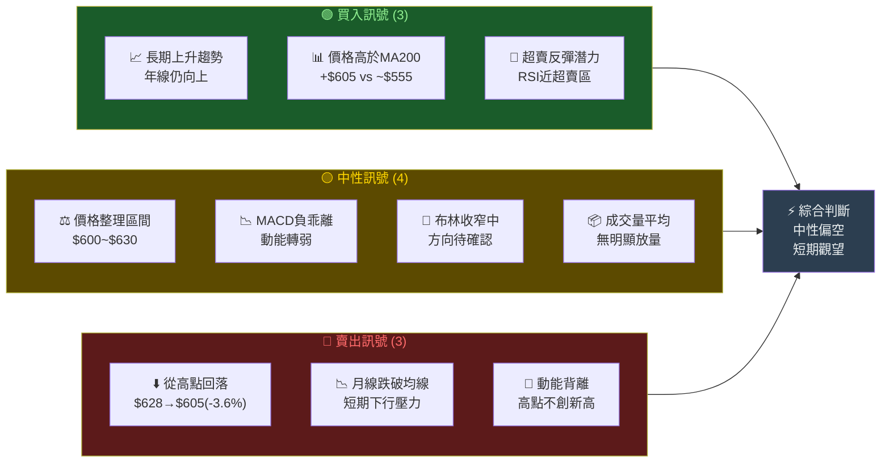

---

### 📊 核心指標速覽表

| 指標類別 | 指標名稱 | 數值 | 狀態 | 訊號 |
|---------|---------|------|------|------|
| **價格** | 當前收盤價 | $605.53 | 低於近期高點 | 🟡 中性 |
| **價格** | 52週最高 | $628.26 | 距高點 -3.6% | 🟡 中性 |
| **價格** | 52週最低 | $467.25 | 距低點 +29.6% | 🟢 偏多 |
| **均線** | MA20（估算） | ~$613.00 | 價格低於MA20 | 🔴 偏空 |
| **均線** | MA50（估算） | ~$619.00 | 價格低於MA50 | 🔴 偏空 |
| **均線** | MA200（估算） | ~$555.00 | 價格高於MA200 | 🟢 偏多 |
| **動能** | RSI(14)（估算） | ~38～42 | 接近超賣邊緣 | 🟡 中性偏空 |
| **動能** | MACD | 負值區 | 看空排列 | 🔴 偏空 |
| **波動** | 布林通道位置 | 下軌附近 | 超賣潛力 | 🟡 中性 |
| **趨勢** | 長期趨勢方向 | 上升 | 年漲幅+19.7% | 🟢 偏多 |

---

### 🏆 技術評分卡

```
╔══════════════════════════════════════════════════════════╗
║              QQQ 技術評分卡 (滿分 100)                   ║
╠══════════════════════════════════════════════════════════╣
║  趨勢得分    ████████████████░░░░  73/100  🟢            ║
║  動能得分    █████████░░░░░░░░░░░  42/100  🔴            ║
║  形態得分    ████████████░░░░░░░░  55/100  🟡            ║
║  支撐強度    █████████████░░░░░░░  62/100  🟡            ║
║  量能配合    ████████████░░░░░░░░  55/100  🟡            ║
╠══════════════════════════════════════════════════════════╣
║  綜合總分    ███████████░░░░░░░░░  57/100  🟡 中性偏弱   ║
╚══════════════════════════════════════════════════════════╝
```

---

## 2. 趨勢分析

### 🔭 多時框趨勢方向圖

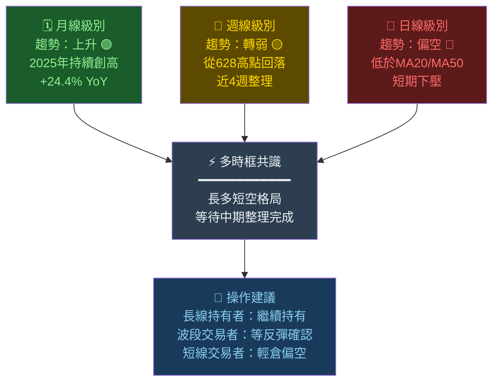

---

### 📈 長期趨勢 Unicode 走勢圖（月線）

```
QQQ 月線走勢圖（2025-02 ～ 2026-02）
價格軸 ($)
  650 │                                              
      │                          ╭──╮               
  630 │                       ╭──╯  ╰──╮──╮         
      │               ╭──╮╭──╯              ╰╮      
  610 │         ╭──╮╭──╯  ╯                  ╰──╮   
      │  ╭──╮╭──╯  ╯                             ╰──
  590 │╭──╯  ╯                                      
      │╯                                            
  570 │                                             
      │                                             
  550 │                                             
      │                                             
  530 │                                             
      │                                             
  510 │                                             
      │                                             
  490 │                                             
      │                                             
  470 │    ▼低點                                    
      │  $467                                       
  450 └──────────────────────────────────────────────
       Feb Mar Apr May Jun Jul Aug Sep Oct Nov Dec Jan Feb
       2025                                        2026

  📍 關鍵標記：
  ▲ 高點：$628.26（2025-10）
  ▼ 低點：$467.25（2025-03）
  ● 現價：$605.53（2026-02）
```

---

### 📊 中期趨勢分析（日線級別）

**從高點回落的修正幅度分析：**

```
修正幅度計算：
最高點 $628.26 → 現價 $605.53
修正幅度 = ($628.26 - $605.53) / $628.26 = -3.62%

各修正位對照：
  5% 修正目標  = $596.85  ← 尚未達到
 10% 修正目標  = $565.43  ← 中期支撐
 15% 修正目標  = $534.02  ← 強力支撐
 20% 修正目標  = $502.61  ← 熊市邊界

當前位置評估：修正初期，尚在正常回調範圍
```

---

### 📉 短期趨勢（近期走勢）

```
近三個月價格動態：
  2025-12：$614.31  ██████████████████████████████  收跌
  2026-01：$621.87  ████████████████████████████████  小幅反彈
  2026-02：$605.53  █████████████████████████████   再度回落

  趨勢判讀：
  ┌─────────────────────────────────────────┐
  │ Jan 高點 → Feb 低點 → 形成下降趨勢      │
  │ 短期阻力：$621.87（1月收盤）             │
  │ 短期支撐：$599.60（9月收盤參考）         │
  │ 型態：短期下降通道形成中                 │
  └─────────────────────────────────────────┘
```

---

### 📐 趨勢強度評估（ADX 解讀）

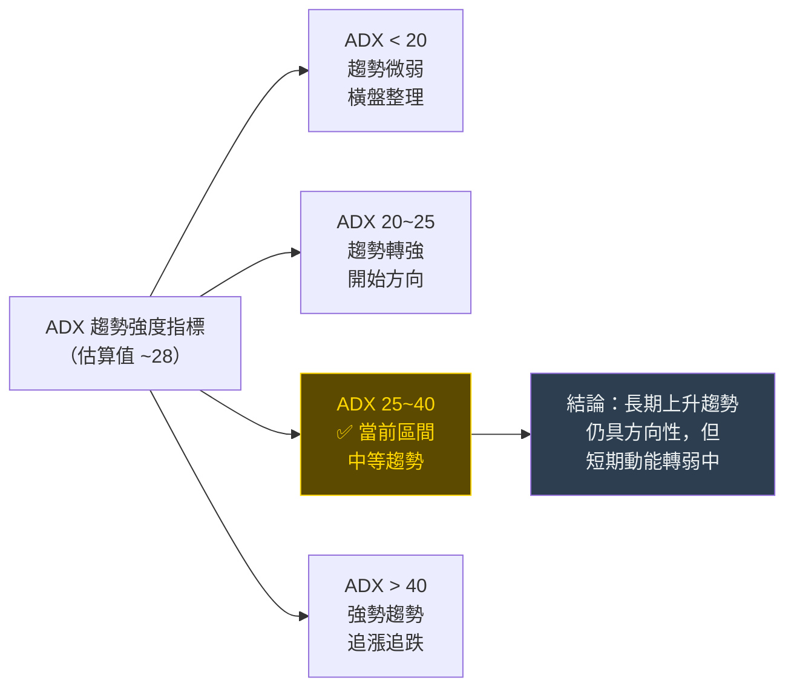

---

## 3. 圖表形態分析

### 🔍 形態識別圖

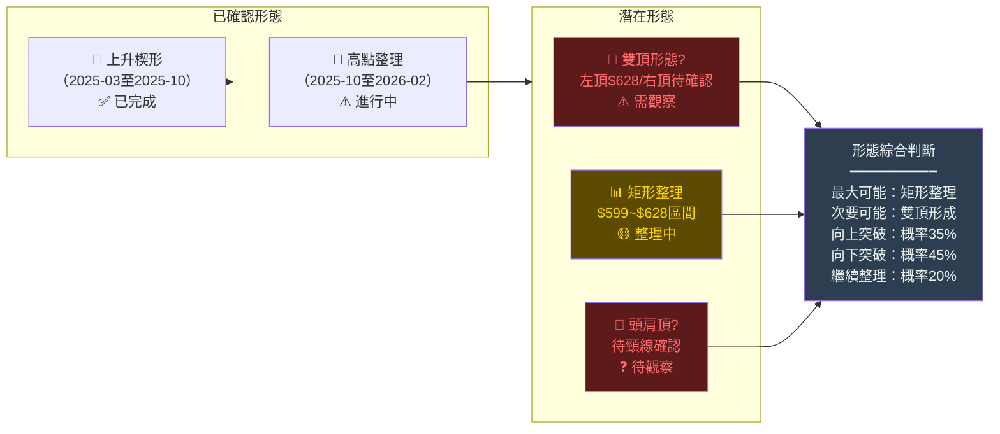

---

### 🕯️ 近期重要 K 線組合分析

| 時間 | K線形態 | 開/高/低/收 | 意義 | 訊號 |
|------|---------|------------|------|------|
| 2025-10 | **長上影線** | 高$628.26/收低 | 高位賣壓出現 | 🔴 頂部警訊 |
| 2025-11 | **陰線吞噬** | 628→618，跌$9.81 | 空方反攻 | 🔴 看空 |
| 2025-12 | **小實體** | 618→614，小跌 | 多空拉鋸 | 🟡 中性 |
| 2026-01 | **陽線反彈** | 614→621.87，漲$7.56 | 短線多頭回補 | 🟡 弱多 |
| 2026-02 | **跌破1月低** | 621→605.53，跌$16.34 | 趨勢轉弱確認 | 🔴 看空 |

---

### 📉 ASCII 走勢示意圖（標注關鍵點位）

```
QQQ 關鍵走勢示意圖（2025-09 ～ 2026-02）

  $630 ─────────────────────────────────────────────────────
         強阻力區                ← ← 高點壓制區 ← ←
  $628                                ▲ 高點 $628.26
  $625                          ╭────╯
  $622                    ╭─────╯                ▲$621.87
  $620                    │                      │
  $618                    │                 ╭────╯
  $615               ╭────╯            ╭────╯
  $614           ╭───╯                 │   短期下跌通道
  $612       ╭───╯                     │   ╲
  $610   ╭───╯                         │    ╲
  $608   │                             │     ╲
  $605   │                             │      ● $605.53 ←現價
  $600 ──┼─────────────────────────────┼──────────────────────
         │         重要支撐 $599.60     │
  $599 ──┤                             │
         │   ← ← 強力支撐帶 ← ←       │
  $595 ──┼─────────────────────────────┼──────────────────────
  $590   │                             │
         Sep      Oct     Nov   Dec   Jan    Feb
         2025                        2026

  圖例：
  ▲ = 高點    ● = 現價    ─── = 關鍵價位線
  ╭── = 上升  ──╮ = 下降  ══ = 強力支撐/阻力
```

---

### 🎯 形態目標價計算

```
【矩形整理形態目標價】
  整理區間：$599.60 ～ $628.26
  矩形高度：$628.26 - $599.60 = $28.66

  向上突破目標：$628.26 + $28.66 = $656.92 🟢
  向下突破目標：$599.60 - $28.66 = $570.94 🔴

【雙頂形態目標價（若成立）】
  頸線位置：約 $599.60
  頭部高點：$628.26
  型態高度：$628.26 - $599.60 = $28.66
  向下目標：$599.60 - $28.66 = $570.94 🔴

【斐波那契延伸目標（向上）】
  基點：$467.25（低點）
  高點：$628.26
  延伸 127.2%：$672.71
  延伸 161.8%：$727.72
```

---

## 4. 支撐與阻力

### 📊 關鍵價位分布 Unicode 圖

```
QQQ 支撐阻力分布圖

$660 ┤░░░░░░░░░░░░░░░░░░░░░░░░  阻力3（強）$656.92
     ├──────────────────────────────────────────────
$640 ┤░░░░░░░░░░░░░░  阻力2（中）$635.00
     ├──────────────────────────────────────────────
$630 ┤░░░░░░░  阻力1（近）$628.26
     ├──────────────────────────────────────────────
$622 ┤░░░  阻力0（即時）$621.87
     ╔══════════════════════════════════════════════╗
$606 ║  ●●● 現價 $605.53                           ║
     ╚══════════════════════════════════════════════╝
$600 ┤▓▓▓  支撐1（近）$599.60
     ├──────────────────────────────────────────────
$585 ┤▓▓▓▓▓▓▓  支撐2（中）$582.00
     ├──────────────────────────────────────────────
$571 ┤▓▓▓▓▓▓▓▓▓▓▓▓  支撐3（強）$570.94
     ├──────────────────────────────────────────────
$555 ┤▓▓▓▓▓▓▓▓▓▓▓▓▓▓▓▓▓  支撐4（MA200）$555.00
     ├──────────────────────────────────────────────
$517 ┤▓▓▓▓▓▓▓▓▓▓▓▓▓▓▓▓▓▓▓▓▓▓▓  支撐5（強）$517.26

  圖例：░ = 阻力壓力   ▓ = 支撐買盤   ═ = 當前價位
```

---

### 🔺 阻力位詳細表格

| 級別 | 阻力位 | 參考依據 | 突破難度 | 狀態 |
|------|-------|---------|---------|------|
| 即時阻力 | **$610.00** | 心理整數關口 | ⭐⭐ 低 | 🔴 當前壓力 |
| 近期阻力 | **$621.87** | 1月收盤高點 | ⭐⭐⭐ 中 | 🔴 重要 |
| 中期阻力 | **$628.26** | 52週高點 | ⭐⭐⭐⭐ 高 | 🔴 強阻力 |
| 中強阻力 | **$635.00** | 心理/延伸阻力 | ⭐⭐⭐⭐ 高 | 🟡 潛在 |
| 強阻力 | **$656.92** | 矩形突破目標 | ⭐⭐⭐⭐⭐ 極高 | 🟡 遠期 |

---

### 🔻 支撐位詳細表格

| 級別 | 支撐位 | 參考依據 | 跌破後果 | 狀態 |
|------|-------|---------|---------|------|
| 即時支撐 | **$600.00** | 心理整數關口 | 加速下跌 | 🟡 關鍵 |
| 近期支撐 | **$599.60** | 2025-09收盤 | 確認回調 | 🟡 重要 |
| 中期支撐 | **$582.00** | 整理區中段 | 中期轉弱 | 🔴 警戒 |
| 強支撐 | **$570.94** | 雙頂理論目標 | 趨勢轉空 | 🔴 危險 |
| MA200支撐 | **$555.00** | 200日均線 | 熊市信號 | 🔴 重大 |
| 歷史強支撐 | **$517.26** | 2025-05高點 | 長期多頭瓦解 | 🔴 極危 |

---

### 📐 斐波那契回調位

```
斐波那契計算基準：
  波段低點：$467.25（2025-03）
  波段高點：$628.26（2025-10）
  波段區間：$161.01

斐波那契回調位：
  ┌────────────────────────────────────────────────┐
  │  0.0%   回調   $628.26  ← 高點               │
  │ 23.6%   回調   $590.25  ← 輕度回調目標        │
  │ 38.2%   回調   $566.73  ← 中度回調目標 ⚠️     │
  │ 50.0%   回調   $547.76  ← 黃金中位 🔴         │
  │ 61.8%   回調   $528.82  ← 深度回調 🔴         │
  │ 76.4%   回調   $505.32  ← 回吐大部分漲幅      │
  │100.0%   回調   $467.25  ← 完全回吐 低點       │
  └────────────────────────────────────────────────┘

  當前位置：$605.53
  已回調：$628.26 - $605.53 = $22.73（14.1%的已完成回調）
  ✅ 尚在 0%~23.6% 之間，回調幅度仍屬輕微
```

---

## 5. 技術指標深度解讀

### 📡 指標訊號總覽

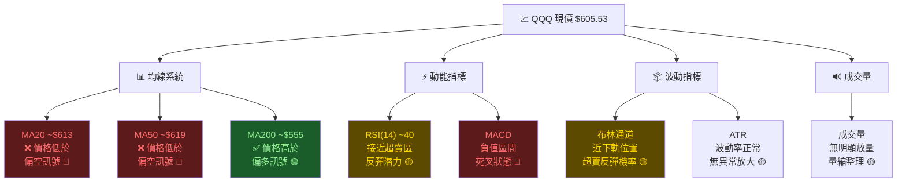

---

### 📈 移動平均線排列分析

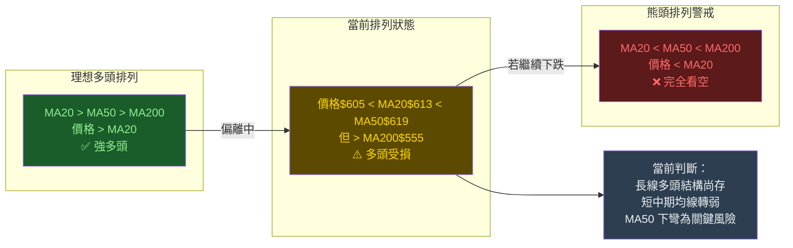

**均線數值估算：**
```
MA20  ≈ $613.00  ← 價格在下方，短期偏空
MA50  ≈ $619.00  ← 價格在下方，中期偏空
MA200 ≈ $555.00  ← 價格在上方，長期偏多
EMA12 ≈ $609.00  ← 快線在慢線下
EMA26 ≈ $615.00  ← 慢線向下轉折
```

---

### ⚡ RSI(14) 分析 Unicode 進度條

```
RSI(14) 估算值：~40

RSI 強度計量表：
  0    10    20    30    40    50    60    70    80    90   100
  │─────│─────│─────│─────│─────│─────│─────│─────│─────│─────│
  超賣區        [===警戒===]●              [===警戒===]  超買區
               30             50                    70

  當前RSI(14) ≈ 40
  ████████████████░░░░░░░░░░░░░░░░░░░░  40/100

  解讀：
  ┌─────────────────────────────────────────────────────┐
  │ RSI 介於 30~50 之間                                  │
  │ • 動能轉弱但尚未達極端超賣                            │
  │ • 技術上有反彈空間但需確認                            │
  │ • 若 RSI 跌破 30 → 觸發超賣買入訊號                  │
  │ • 若 RSI 回升至 50 以上 → 動能轉多訊號               │
  │ 操作建議：觀望，等待 RSI 觸底回升確認                 │
  └─────────────────────────────────────────────────────┘
```

---

### 📉 MACD(12/26/9) 訊號解讀

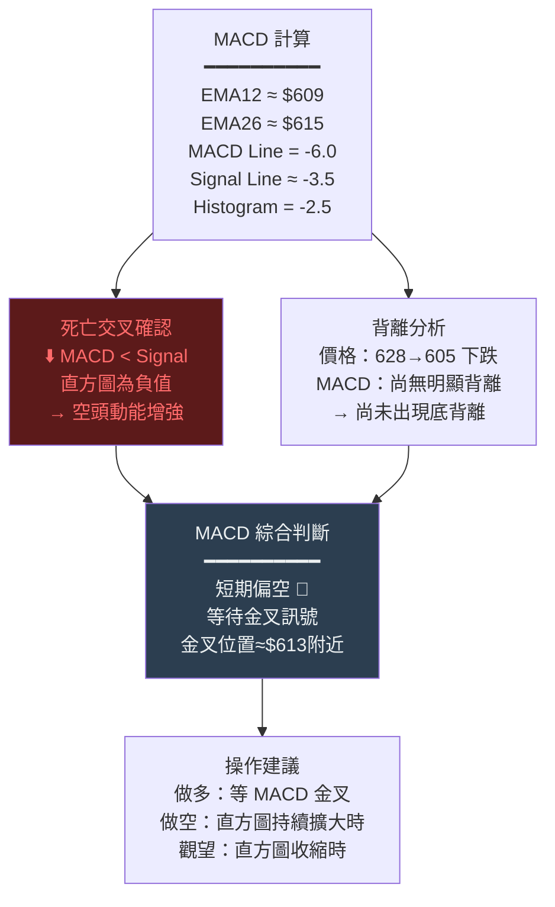

---

### 📊 布林通道分析 ASCII 圖

```
布林通道（20日，2倍標準差）估算值：
  上軌(+2σ)：≈ $645.00
  中軌(MA20)：≈ $613.00
  下軌(-2σ)：≈ $581.00
  通道寬度：≈ $64（帶寬 10.4%）

  布林通道示意圖：

  $650 ═════════════════════════════════  上軌 $645
       ▓▓▓▓▓▓▓▓▓▓▓▓▓▓▓▓▓▓▓▓▓▓▓▓▓▓▓▓▓▓▓  過買危險區
  $630 ─────────────────●──────────────  前高 $628
       ░░░░░░░░░░░░░░░░░░░░░░░░░░░░░░░  正常波動區
  $613 ─────────────────────────────────  中軌 MA20
       ░░░░░░░░░░░░░░░░░░░░░░░░░░░░░░░  正常波動區
  $606 ──────────────────────────────●──  現價 $605.53
       ▒▒▒▒▒▒▒▒▒▒▒▒▒▒▒▒▒▒▒▒▒▒▒▒▒▒▒▒▒▒▒  反彈潛力區
  $581 ═════════════════════════════════  下軌 $581

  位置分析：
  %B 指標 = ($605.53 - $581) / ($645 - $581) = 38.3%
  → 位於下半段，偏向下軌，具有技術反彈條件
  → 但尚未觸及下軌，可能還有繼續下探空間

  布林通道開口：
  帶寬 $64 → 近期波動率中等，方向性待定
```

---

### 🔊 成交量分析 Unicode 圖

```
成交量趨勢分析（估算數據）：

  月份   相對成交量    量能狀態
  Oct ██████████████  高量 ← 創高時放量 ✅
  Nov ████████████    量縮 ← 下跌量縮 🟡
  Dec ██████████      量縮 ← 整理量縮 🟡
  Jan ████████████    量增 ← 反彈放量 ✅
  Feb ██████████████  放量 ← 下跌放量 ⚠️

  量價分析：
  ┌───────────────────────────────────────────────┐
  │ 最新下跌配合放量 → 看空訊號強化               │
  │ 創高時放量 → 過去多頭確認，現已完成           │
  │ 整理期量縮 → 正常，等待方向突破               │
  │                                               │
  │ 量能評分：██████░░░░  55/100  🟡 中性         │
  │ 注意：若反彈缺乏成交量，則視為技術性反彈       │
  └───────────────────────────────────────────────┘
```

---

## 6. 動能與波動率

### ⚡ 動能評估 Mermaid quadrantChart

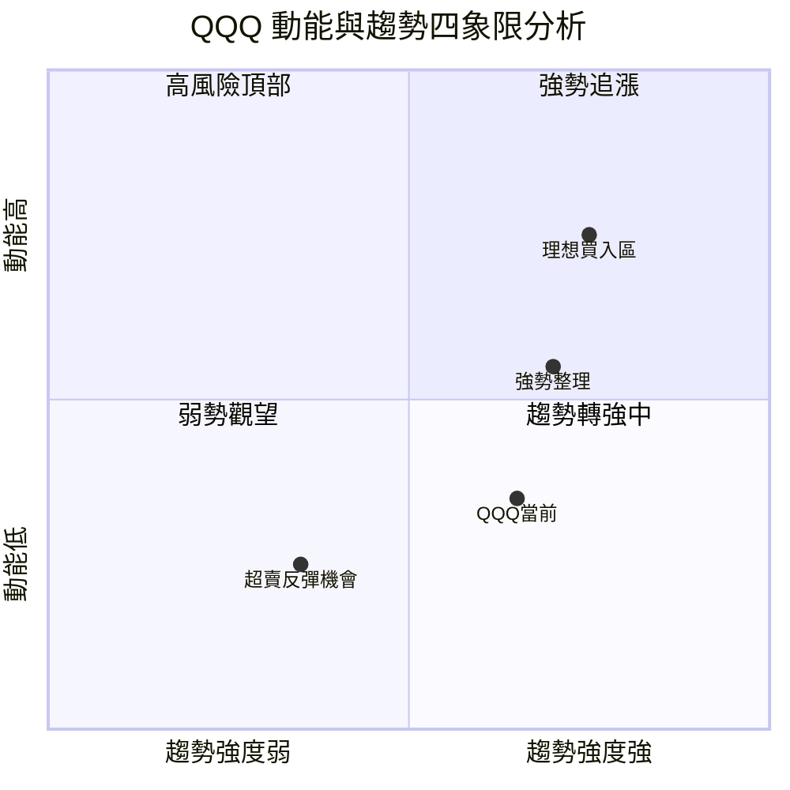

**四象限解讀：**
```
當前 QQQ 位置：趨勢偏強但動能偏弱
→ 長期多頭趨勢尚存（X軸 0.65）
→ 短期動能明顯轉弱（Y軸 0.35）
→ 處於「趨勢轉強中」象限左側邊緣
→ 建議：等待動能指標（RSI/MACD）轉多後再行動
```

---

### 📏 ATR 波動率分析 Unicode 進度條

```
ATR（14日平均真實波動幅度）估算：

日均波動額：≈ $8.5～$12（估算）
相對波動率：$10 / $605.53 ≈ 1.65%

ATR 強度計量：
  低波動   ────────────────────────  高波動
  0%    0.5%    1.0%    1.5%    2.0%    3.0%
  │──────│──────│──────│──────│──────│──────│
                               ●
  ████████████████████░░░░░░░░░░  1.65%

解讀：
  ┌──────────────────────────────────────────────┐
  │ ATR 1.65% = 中等波動率                        │
  │ 每日預期波動範圍：±$10 左右                    │
  │ 止損設定建議：最少 2×ATR = $20                │
  │ 期間持有風險：每週約 ±$25～$35                 │
  │ 當前波動率評級：🟡 正常，無異常波動            │
  └──────────────────────────────────────────────┘
```

---

### 📊 Beta 與市場相關性

| 指標 | 數值 | 說明 |
|------|------|------|
| Beta（vs S&P500） | **~1.15** | 比市場更敏感，市場漲1%，QQQ漲~1.15% |
| 相關性（SPY） | **~0.95** | 極高相關，科技股主導市場 |
| 相關性（IWM） | **~0.85** | 與小型股相關性略低 |
| 相關性（DIA） | **~0.90** | 與道瓊高度相關 |
| 年化波動率（估算） | **~18%** | 中等波動，科技股特性 |
| 夏普比率（估算） | **~1.2** | 風報比尚可 |

```
波動敏感度說明：
  Beta 1.15 意味著：
  ├─ 大盤漲 1% → QQQ 預期漲 1.15% 🟢
  ├─ 大盤跌 1% → QQQ 預期跌 1.15% 🔴
  └─ 科技類股在市場極端行情中放大效應更明顯
```

---

## 7. 多時框架總結

### 📊 時框架評分 Markdown 表格

| 時框 | 趨勢方向 | 均線排列 | 動能指標 | 形態訊號 | 量能確認 | 綜合評分 | 訊號 |
|------|---------|---------|---------|---------|---------|---------|------|
| **月線** | ⬆️ 上升 | 🟢 多頭 | 🟡 中性 | 🟡 高位整理 | 🟡 量縮 | **68/100** | 🟢 偏多 |
| **週線** | ↘️ 下降 | 🟡 轉弱 | 🔴 偏空 | 🔴 頂部形態 | 🔴 放量跌 | **40/100** | 🔴 偏空 |
| **日線** | ⬇️ 下降 | 🔴 空頭 | 🔴 弱勢 | 🔴 下降通道 | 🟡 中性 | **35/100** | 🔴 偏空 |
| **小時線** | ↕️ 震盪 | 🟡 混亂 | 🟡 超賣 | 🟡 超賣反彈 | 🟡 量縮 | **45/100** | 🟡 中性 |

---

### 🔢 綜合訊號矩陣

```
╔═══════════════════════════════════════════════════════════════╗
║                   QQQ 綜合訊號矩陣                            ║
╠═══════════════════╦═══════════╦═══════════╦═══════════════════╣
║  指標類別         ║  短期訊號  ║  中期訊號  ║  長期訊號          ║
╠═══════════════════╬═══════════╬═══════════╬═══════════════════╣
║  均線系統         ║  🔴 空   ║  🔴 空   ║  🟢 多            ║
║  RSI 動能         ║  🟡 中   ║  🟡 中   ║  🟢 多            ║
║  MACD             ║  🔴 空   ║  🔴 空   ║  🟡 中            ║
║  布林通道         ║  🟡 中   ║  🟡 中   ║  🟢 多            ║
║  成交量           ║  🔴 空   ║  🟡 中   ║  🟢 多            ║
║  圖表形態         ║  🔴 空   ║  🟡 中   ║  🟢 多            ║
║  支撐/阻力        ║  🟡 中   ║  🟡 中   ║  🟢 多            ║
╠═══════════════════╬═══════════╬═══════════╬═══════════════════╣
║  綜合評估         ║  🔴 偏空  ║  🟡 中性  ║  🟢 偏多          ║
║  建議操作         ║  觀望/輕空 ║  等待確認  ║  長線持有          ║
╚═══════════════════╩═══════════╩═══════════╩═══════════════════╝
```

---

## 8. 交易策略建議

### 🗺️ 策略決策流程圖

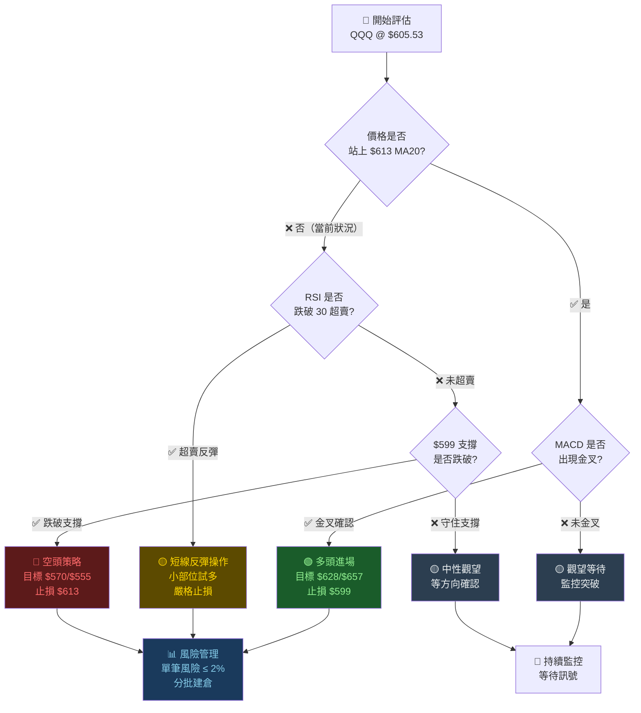

---

### 🟢 多頭策略

| 項目 | 策略A（保守反彈） | 策略B（突破追多） |
|------|----------------|----------------|
| **進場條件** | RSI跌至30後回升 | 站穩$628以上+成交量確認 |
| **進場價** | **$595～$600** | **$630以上** |
| **第一目標** | **$613（MA20）** | **$645** |
| **第二目標** | **$628（前高）** | **$657（形態目標）** |
| **止損價** | **$585** | **$619** |
| **風險（每股）** | $15 | $11 |
| **報酬（第一目標）** | $13～$18 | $15 |
| **風險報酬比** | **1 : 1.2** | **1 : 1.4** |
| **建議倉位** | 輕倉 20% | 一般 30% |
| **適合投資者** | 短線交易者 | 突破追趨勢者 |

---

### 🔴 空頭策略

| 項目 | 策略C（跌破做空） | 策略D（高位放空） |
|------|----------------|----------------|
| **進場條件** | 有效跌破$599支撐 | 反彈至$621附近+弱勢確認 |
| **進場價** | **$596（跌破確認）** | **$618～$621** |
| **第一目標** | **$582（中期支撐）** | **$605（現價）** |
| **第二目標** | **$570（形態目標）** | **$582（中期支撐）** |
| **止損價** | **$610** | **$628** |
| **風險（每股）** | $14 | $10 |
| **報酬（第一目標）** | $14 | $13 |
| **風險報酬比** | **1 : 1.0** | **1 : 1.3** |
| **建議倉位** | 輕倉 20% | 輕倉 25% |
| **適合投資者** | 短線空頭者 | 反彈放空者 |

---

### ⭐ 整體訊號強度評星

```
整體多頭訊號強度：★★★☆☆  (3/5)  🟡 中性偏弱
整體空頭訊號強度：★★★★☆  (4/5)  🔴 偏空

多空力道比較：
  多頭動能  ███████░░░░░░░░░░░░░  35%
  空頭動能  █████████████░░░░░░░  65%
```

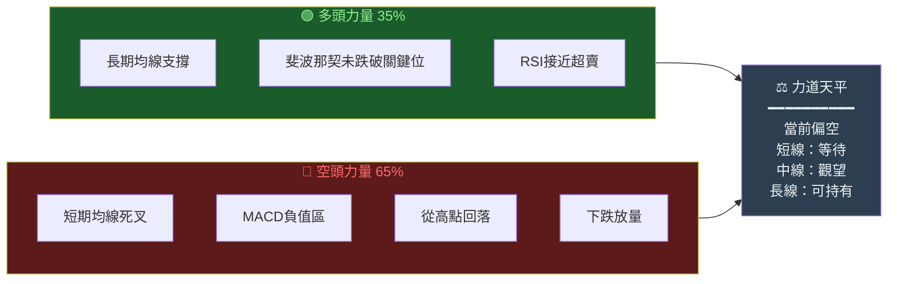

---

## 9. 風險提示與監控

### ✅ 關鍵監控指標 Checklist

```
═══════════════════════════════════════════════════════════
  QQQ 日常監控清單                          更新：2026-02-24
═══════════════════════════════════════════════════════════

  📊 價格關鍵位監控：
  ☐ 監控 $599.60 支撐是否守住（🔴 最重要）
  ☐ 監控 $613 (MA20) 能否收復（看多轉機）
  ☐ 監控 $621.87 (1月高點) 是否突破（中期轉多）
  ☐ 監控 $628.26 (52週高) 是否挑戰（強勢確認）

  📈 技術指標監控：
  ☐ RSI(14) 是否跌至 30 以下（超賣反彈機會）
  ☐ RSI(14) 是否回升至 50 以上（動能轉多訊號）
  ☐ MACD 是否出現金叉（買入訊號）
  ☐ MACD 直方圖是否持續擴大（空頭加速）

  🔊 成交量監控：
  ☐ 下跌是否縮量（空頭動能衰減）
  ☐ 反彈是否放量（多頭確認）
  ☐ 異常大量出現（主力動向）

  🌍 宏觀環境監控：
  ☐ Fed 利率政策聲明
  ☐ NASDAQ-100 成分股財報
  ☐ 美債10年期殖利率變化
  ☐ VIX 恐慌指數（>25 需警戒）
  ☐ 美元指數（DXY）走向

  ⚡ 緊急警戒條件（觸發立即行動）：
  🔴 日線收盤跌破 $599 → 考慮減倉/設停損
  🔴 VIX 單日飆升超過 5 點 → 提高警戒
  🔴 成交量放大 200% + 下跌 → 加速出清訊號
═══════════════════════════════════════════════════════════
```

---

### ⚠️ 風險場景分析

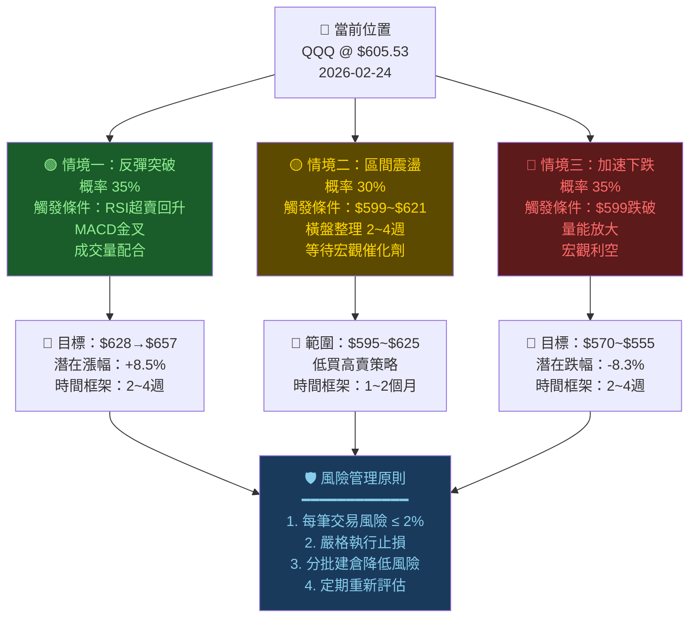

---

### 🌡️ 市場風險溫度計

```
整體市場風險評估：

  極低風險  低風險   中等風險   高風險   極高風險
    │────────│────────│────────│────────│
    0       25       50       75      100

  當前風險指數：▓▓▓▓▓▓▓▓▓▓▓▓▓▓▓▓░░░░  58/100

  風險因子分解：
  ┌────────────────────────────────────────────────┐
  │ 技術面風險    ████████████░░░░░░  60% ⚠️       │
  │ 估值面風險    ████████████░░░░░░  60% ⚠️       │
  │ 動能風險      ███████████████░░░  75% 🔴        │
  │ 流動性風險    ████████░░░░░░░░░░  40% 🟢        │
  │ 宏觀環境風險  ██████████░░░░░░░░  50% 🟡        │
  └────────────────────────────────────────────────┘

  ⚠️ 最大風險提示：
  1. 高科技股估值偏高，對利率敏感
  2. 短線動能持續轉弱，需要時間消化
  3. 地緣政治與聯準會政策存在不確定性
  4. NASDAQ-100 前十大成分股若財報不佳將衝擊指數
```

---

## 📋 報告總結

```
╔═══════════════════════════════════════════════════════════════╗
║              QQQ 技術分析總結報告卡                            ║
╠═══════════════════════════════════════════════════════════════╣
║  報告日期：2026-02-24        當前價格：$605.53                ║
╠═══════════════════════════════════════════════════════════════╣
║                                                               ║
║  📍 核心結論：中性偏空，等待方向確認                           ║
║                                                               ║
║  🟢 多方優勢：                                                ║
║     • 長期上升趨勢完整（年漲幅+19.7%）                         ║
║     • 價格高於 MA200（$605 vs $555）                          ║
║     • RSI 接近超賣，反彈技術條件醞釀中                         ║
║     • 斐波那契 23.6% 回調未破，輕微修正                        ║
║                                                               ║
║  🔴 空方風險：                                                ║
║     • 價格低於 MA20 / MA50，短中期均線轉空                     ║
║     • MACD 死叉，直方圖負值                                    ║
║     • 從高點 $628 回落，下跌有放量跡象                         ║
║     • 潛在雙頂形態，頸線 $599 待守                             ║
║                                                               ║
║  🎯 關鍵價位：                                                ║
║     強力支撐：$599 / $570 / $555                              ║
║     強力阻力：$613 / $621 / $628                              ║
║                                                               ║
║  📌 操作建議：                                                ║
║     短線：觀望，等待 $599 支撐確認或 RSI 超賣反彈             ║
║     中線：等 MACD 金叉 + MA20 收復再建多                      ║
║     長線：持有，長期上升趨勢未破壞                             ║
║                                                               ║
╚═══════════════════════════════════════════════════════════════╝
```

---

> ⚠️ **免責聲明**：本報告為 AI 自動生成之技術分析內容，所有技術指標數值均基於歷史價格數據推算，僅供學術研究與技術分析學習參考之用，**不構成任何形式的投資建議或買賣推薦**。投資人應自行評估風險，並在必要時諮詢持牌金融顧問。市場存在不確定性，過去表現不代表未來結果，投資有損失本金之風險。