# RBLX 基本面深度分析報告

> **報告日期**：2026-02-24 ｜ **語言**：繁體中文 ｜ **數據來源**：Yahoo Finance ｜ **分析師**：AI 深度研究團隊

---

## 目錄

| # | 章節 | 核心主題 |
|---|------|----------|
| 1 | [執行摘要](#1-執行摘要) | 整體評估與核心論點 |
| 2 | [公司概覽](#2-公司概覽) | 業務結構與市場地位 |
| 3 | [損益表深度分析](#3-損益表深度分析) | 收入成長與獲利能力 |
| 4 | [資產負債表分析](#4-資產負債表分析) | 財務健康度 |
| 5 | [現金流量分析](#5-現金流量分析) | 自由現金流品質 |
| 6 | [獲利能力指標](#6-獲利能力指標) | ROE/ROA/ROIC |
| 7 | [估值分析](#7-估值分析) | 合理估值與目標價 |
| 8 | [競爭護城河](#8-競爭護城河) | 競爭優勢評估 |
| 9 | [成長催化劑](#9-成長催化劑) | 未來成長動力 |
| 10 | [風險分析](#10-風險分析) | 投資風險矩陣 |
| 11 | [公平價值估算](#11-公平價值估算) | DCF 與多元估值 |
| 12 | [投資建議](#12-投資建議) | 最終評級與策略 |

---

## 1. 執行摘要

### 🎯 核心評分總覽

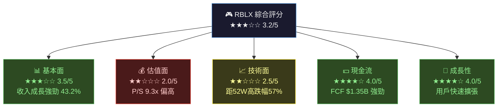

---

### 📋 5大投資論點總表

| # | 投資論點 | 關鍵數據 | 評估 | 重要性 |
|---|----------|----------|------|--------|
| 1 | **收入高速成長** | FY2025 營收 $4.89B，YoY +43.2% | 🟢 極強 | ★★★★★ |
| 2 | **自由現金流轉正且強勁** | FCF $1.35B，4年前為 -$58M | 🟢 正面 | ★★★★☆ |
| 3 | **持續虧損與高費用壓力** | 營業虧損 -$1.23B，淨虧損 -$1.07B | 🔴 負面 | ★★★★★ |
| 4 | **估值仍偏高** | P/S 9.3x，股本溢價 P/B 115x | 🟡 中性 | ★★★★☆ |
| 5 | **元宇宙平台護城河深厚** | DAU 持續成長，開發者生態完善 | 🟢 正面 | ★★★★☆ |

---

### 📊 快速統計卡片

| 指標 | 數值 | 狀態 | 行業比較 |
|------|------|------|----------|
| 當前股價 | **$64.15** | 🟡 | 距分析師目標 $110.81 折價 42% |
| 市值 | **$45.46B** | 🟡 | 中型科技股 |
| 52W 高/低 | **$150.59 / $50.10** | 🔴 | 距高點跌幅 -57.4% |
| 營收 TTM | **$4.89B** | 🟢 | YoY +43.2% |
| 毛利率 | **23.8%** | 🔴 | 遠低於軟體業均值 ~70% |
| 自由現金流 | **$1.35B** | 🟢 | 4年來最佳 |
| 員工人數 | **3,065人** | 🟢 | 精簡高效 |
| Beta | **1.635** | 🔴 | 高波動性 |
| 分析師評級 | **買入（34人）** | 🟢 | 均值目標 $110.81 |

---

## 2. 公司概覽

### 🏢 業務結構分解

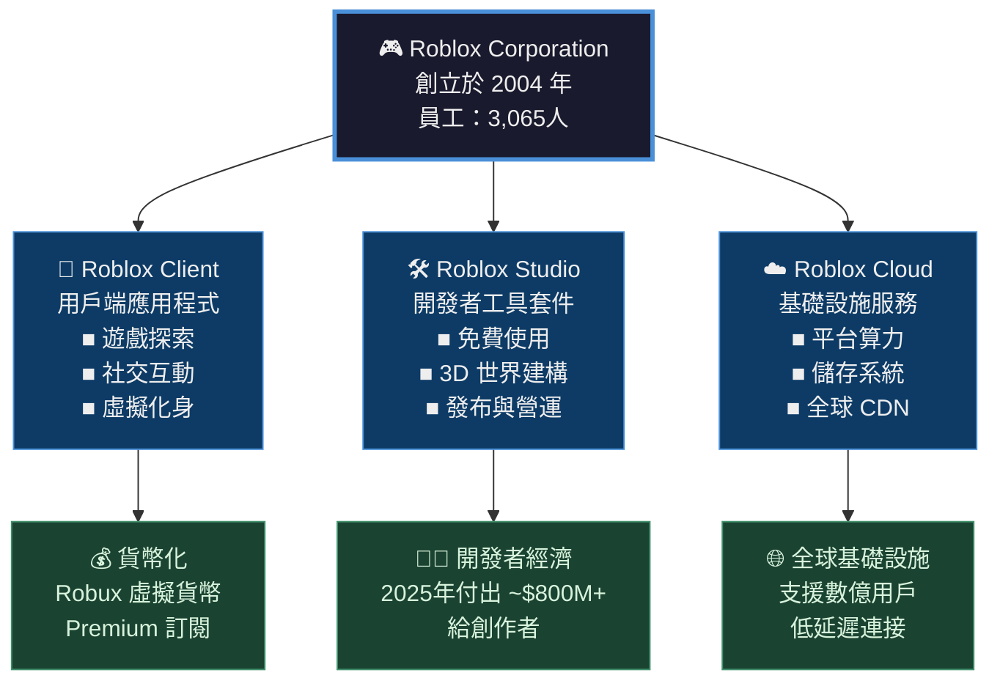

---

### 🥧 Roblox 收入結構與用戶分布

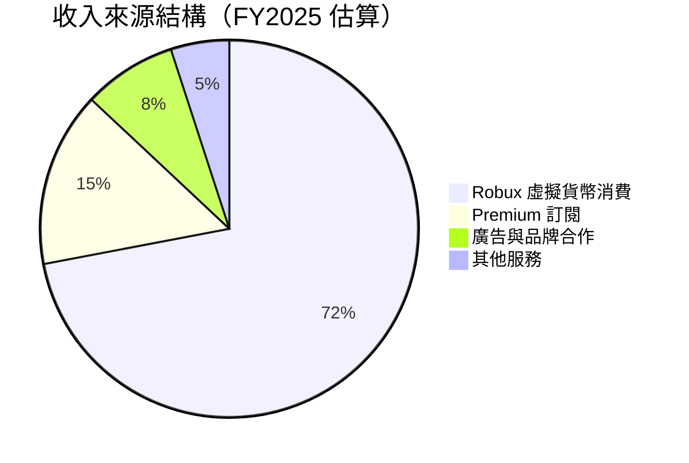

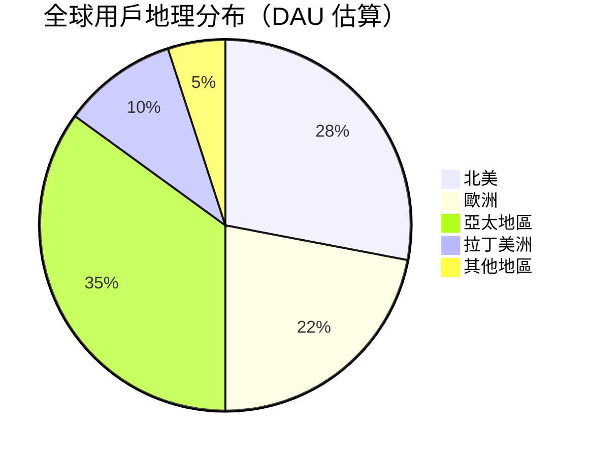

---

### 🧠 競爭優勢心智圖

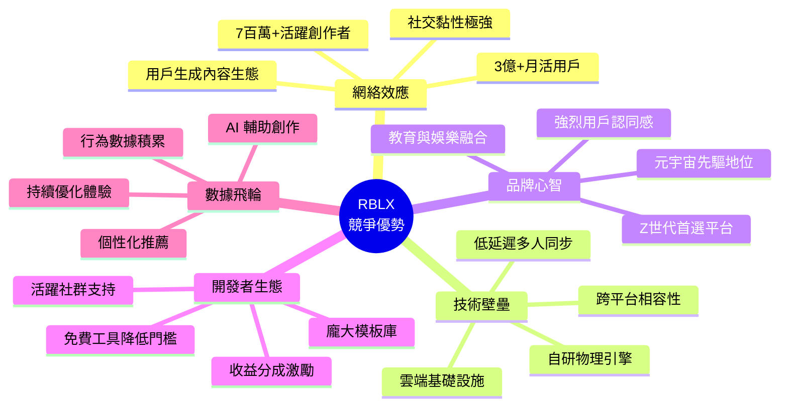

---

## 3. 損益表深度分析

### 📈 收入成長時間軸

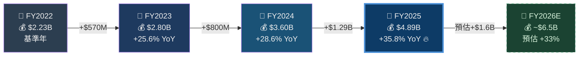

---

### 📊 年度收入趨勢 ASCII 長條圖

```
  RBLX 年度總收入趨勢（單位：$B）
  ╔══════════════════════════════════════════════════════╗
  ║                                                      ║
  ║  $5.0B ┤                                    ████    ║
  ║        │                                    ████    ║
  ║  $4.5B ┤                                    ████    ║
  ║        │                                    ████    ║
  ║  $4.0B ┤                                    ████    ║
  ║        │                              ████  ████    ║
  ║  $3.5B ┤                              ████  ████    ║
  ║        │                              ████  ████    ║
  ║  $3.0B ┤                       ████  ████  ████    ║
  ║        │                       ████  ████  ████    ║
  ║  $2.5B ┤               ████   ████  ████  ████    ║
  ║        │               ████   ████  ████  ████    ║
  ║  $2.0B ┤               ████   ████  ████  ████    ║
  ║        │               ████   ████  ████  ████    ║
  ║  $1.0B ┤               ████   ████  ████  ████    ║
  ║        │               ████   ████  ████  ████    ║
  ║  $0.0B └────────────────────────────────────────   ║
  ║              FY22     FY23   FY24  FY25            ║
  ║             $2.23B  $2.80B $3.60B $4.89B           ║
  ╚══════════════════════════════════════════════════════╝
  
  收入成長率：
  FY22→23: +25.6% ▓▓▓▓▓▓▓▓▓▓░░░░░░░░░░
  FY23→24: +28.6% ▓▓▓▓▓▓▓▓▓▓▓░░░░░░░░░
  FY24→25: +35.8% ▓▓▓▓▓▓▓▓▓▓▓▓▓▓░░░░░░ 🔥 加速成長
```

---

### 📉 利潤率演變分析

```
  RBLX 各利潤率歷年演變（%）
  ╔══════════════════════════════════════════════════════╗
  ║  毛利率趨勢（越高越好 ↑）                            ║
  ║                                                      ║
  ║  80% ┤                                              ║
  ║  70% ┤ ── ── ── 軟體業均值 ~70% ── ── ── ──        ║
  ║  60% ┤                                              ║
  ║  50% ┤                                              ║
  ║  40% ┤                                              ║
  ║  30% ┤  ●75.4%   ●76.8%    ●77.8%    ●78.1%       ║
  ║  20% ┤                                              ║
  ║  10% ┤                                              ║
  ║   0% └──────────────────────────────────────────    ║
  ║         FY22      FY23      FY24      FY25           ║
  ║                                                      ║
  ║  ⚠️ 注意：毛利率為毛利/收入，但「收入認列」採延遲    ║
  ║  會計（Deferred Revenue），Booking 毛利率更低        ║
  ╚══════════════════════════════════════════════════════╝

  RBLX 營業利益率趨勢（越接近0越好 ↑）
  ╔══════════════════════════════════════════════════════╗
  ║   0% ┤──────────────────────────────────────────    ║
  ║ -10% ┤                                              ║
  ║ -20% ┤                          ●-29.4%  ●-25.3%  ║
  ║ -30% ┤  ●-41.4%                                    ║
  ║ -40% ┤             ●-45.0%                         ║
  ║ -50% ┤                                              ║
  ║ -60% ┤                                              ║
  ║         FY22      FY23      FY24      FY25           ║
  ║  趨勢：虧損收窄 ✅ 方向正確，但仍需時間             ║
  ╚══════════════════════════════════════════════════════╝
```

---

### 📋 損益表核心數據（近4年詳細對比）

| 指標 | FY2022 | FY2023 | FY2024 | FY2025 | 趨勢 |
|------|--------|--------|--------|--------|------|
| **總收入** | $2.23B | $2.80B | $3.60B | $4.89B | 🟢 ↑ |
| **收入成長率** | — | +25.6% | +28.6% | +35.8% | 🟢 加速 |
| **毛利** | $1.68B | $2.15B | $2.80B | $3.82B | 🟢 ↑ |
| **毛利率** | 75.3% | 76.8% | 77.8% | 78.1% | 🟢 ↑ |
| **研發費用** | $873M | $1.25B | $1.44B | $1.57B | 🟡 高 |
| **研發/收入** | 39.1% | 44.6% | 40.0% | 32.1% | 🟡 改善 |
| **營業利益** | -$924M | -$1.26B | -$1.06B | -$1.23B | 🔴 仍虧 |
| **營業利益率** | -41.4% | -45.0% | -29.4% | -25.3% | 🟡 收窄 |
| **淨利益** | -$924M | -$1.15B | -$935M | -$1.07B | 🔴 虧損 |
| **EBITDA** | -$762M | -$911M | -$670M | -$802M | 🟡 波動 |
| **EPS (TTM)** | — | — | — | **-$1.54** | 🔴 負值 |

---

### 🥧 FY2025 費用結構分解

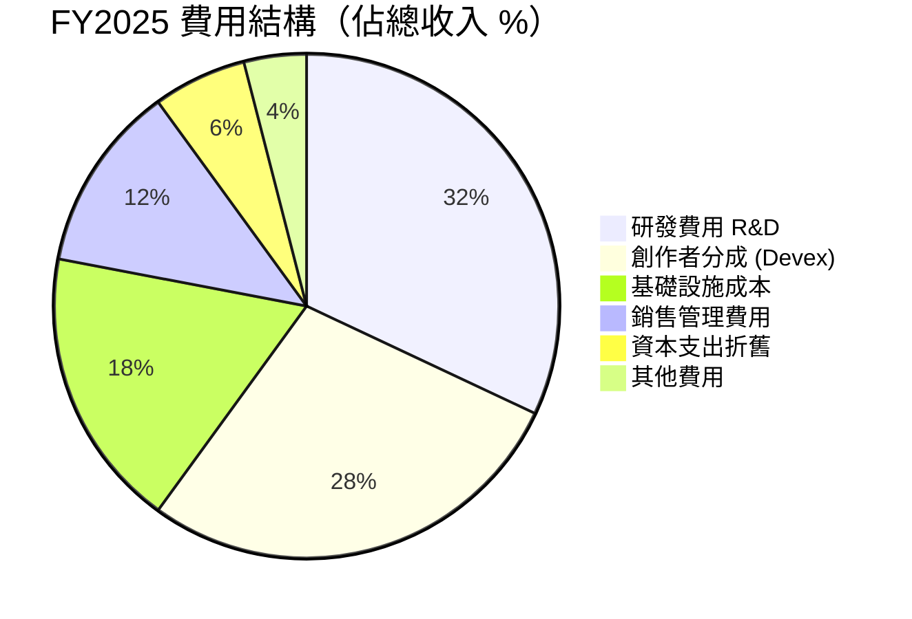

> ⚠️ **關鍵洞察**：研發費用佔收入 32.1%（$1.57B），創作者分成為平台核心成本，兩者合計超過 60% 的收入，這是毛利率遠低於純軟體公司的核心原因。

---

## 4. 資產負債表分析

### 🏗️ 資產結構分解圖

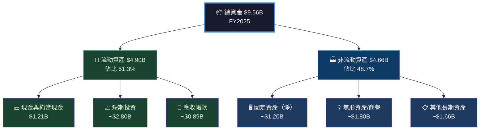

---

### 📊 資產配置 Unicode 橫條圖

```
  RBLX 資產配置結構（FY2025，$9.56B = 100%）
  ╔══════════════════════════════════════════════════════════╗
  ║                                                          ║
  ║  現金/約當  $1.21B  ██████░░░░░░░░░░░░░░░░░░  12.7%    ║
  ║  短期投資   $2.80B  ██████████████░░░░░░░░░░  29.3%    ║
  ║  應收帳款   $0.89B  ████░░░░░░░░░░░░░░░░░░░░   9.3%    ║
  ║  固定資產   $1.20B  ██████░░░░░░░░░░░░░░░░░░  12.6%    ║
  ║  無形資產   $1.80B  █████████░░░░░░░░░░░░░░░  18.8%    ║
  ║  其他資產   $1.66B  ████████░░░░░░░░░░░░░░░░  17.4%    ║
  ║                                                          ║
  ║  流動資產  ▓▓▓▓▓▓▓▓▓▓▓▓▓▓▓▓▓▓▓▓▓▓▓▓▓░░░░░░░  51.3%    ║
  ║  非流動資產 ░░░░░░░░░░░░░░░░░░░░░░░░░▓▓▓▓▓▓▓  48.7%    ║
  ╚══════════════════════════════════════════════════════════╝
```

---

### 📋 負債與流動性指標表格

| 指標 | FY2022 | FY2023 | FY2024 | FY2025 | 健康標準 | 評估 |
|------|--------|--------|--------|--------|----------|------|
| **總負債** | $5.07B | $6.10B | $6.97B | $9.18B | — | 🔴 快速增加 |
| **總債務** | $1.56B | $1.76B | $1.81B | $1.80B | — | 🟡 趨於穩定 |
| **股東權益** | $306M | $76.3M | $221M | $394M | >0 | 🟡 偏低 |
| **流動比率** | 1.55 | 1.07 | 1.02 | **0.955** | >1.5 | 🔴 低於1 |
| **負債/權益比** | 16.6x | 80.0x | 31.5x | **480.7x** | <2.0 | 🔴 極高 |
| **淨現金部位** | +$1.42B | -$1.08B | -$1.10B | **+$1.26B** | 正值佳 | 🟢 改善 |
| **利息覆蓋率** | 負值 | 負值 | 負值 | 負值 | >3x | 🔴 需關注 |

> ⚠️ **負債/權益比 480.7x 極高**，但主要源於遞延收入（Deferred Revenue）被計入負債，而非傳統銀行貸款，實質財務風險低於表面數字。

---

### 📈 股東權益趨勢 ASCII 圖

```
  RBLX 股東權益趨勢（$M）
  ╔══════════════════════════════════════════════════════╗
  ║                                                      ║
  ║  $400M ┤                                    ●$394M  ║
  ║  $350M ┤                                            ║
  ║  $300M ┤  ●$306M                                   ║
  ║  $250M ┤                              ●$221M        ║
  ║  $200M ┤                                            ║
  ║  $150M ┤                                            ║
  ║  $100M ┤                                            ║
  ║   $50M ┤                                            ║
  ║    $0M ┤─────────────────────────────────────────   ║
  ║  -$50M ┤                   ●$76M                   ║
  ║         FY22               FY23      FY24    FY25   ║
  ║                                                      ║
  ║  趨勢：FY23 觸底後持續回升 ✅ 仍需關注長期稀釋      ║
  ╚══════════════════════════════════════════════════════╝
```

---

## 5. 現金流量分析

### 💧 現金流瀑布圖

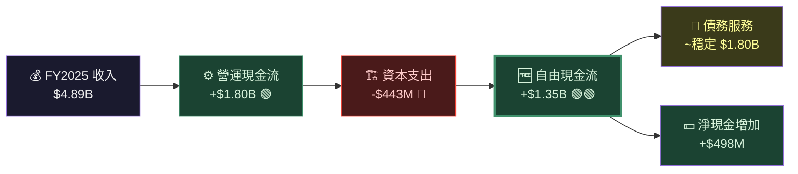

---

### 📊 自由現金流趨勢 Unicode 進度條

```
  RBLX 自由現金流歷年對比（$B）
  ╔══════════════════════════════════════════════════════════╗
  ║                                                          ║
  ║  FY2022  -$58M   ░░░░░░░░░░░░░░░░░░░░  [負值] 🔴       ║
  ║                                                          ║
  ║  FY2023  +$124M  ▓░░░░░░░░░░░░░░░░░░░  [微正] 🟡       ║
  ║                                                          ║
  ║  FY2024  +$641M  ▓▓▓▓▓░░░░░░░░░░░░░░░  [成長] 🟢       ║
  ║                                                          ║
  ║  FY2025  +$1.35B ▓▓▓▓▓▓▓▓▓▓▓░░░░░░░░░ [強勁] 🟢🟢     ║
  ║                                                          ║
  ║  FCF Margin（FCF/Revenue）：                             ║
  ║  FY22: -2.6%  → FY23: +4.4%  → FY24: +17.8%            ║
  ║  FY25: +27.6% ▓▓▓▓▓▓▓▓▓▓▓▓▓▓ 顯著改善 🔥               ║
  ║                                                          ║
  ╚══════════════════════════════════════════════════════════╝
  
  ⚠️ 重要說明：
  FCF 強勁 vs. 淨虧損的差異來自：
  ① 遞延收入（Deferred Revenue）帶來現金預付
  ② SBC（股票薪酬）為非現金費用，約 $800M+/年
  ③ 折舊攤銷為非現金費用
```

---

### 🏦 資本配置策略

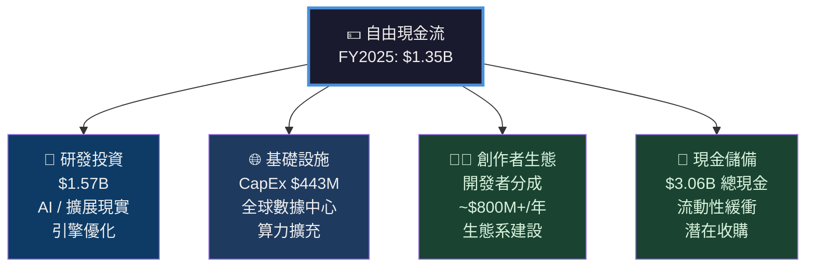

> 💡 **關鍵洞察**：Roblox 的資本配置高度集中於「生態系投資」，研發與創作者分成合計佔收入超 60%，這是成長型平台公司的典型特徵，短期壓制盈利，長期強化護城河。

---

## 6. 獲利能力指標

### 📊 獲利能力儀表板

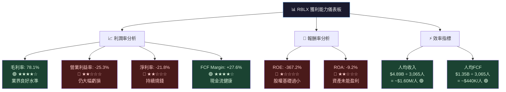

---

### 📋 獲利能力指標對比表（含行業比較）

| 指標 | RBLX FY2025 | 電玩業均值 | 科技業均值 | 評估 |
|------|------------|-----------|-----------|------|
| **毛利率** | 78.1% | ~55% | ~65% | 🟢 優異 |
| **EBITDA Margin** | -16.4% | +18% | +20% | 🔴 大幅落後 |
| **營業利益率** | -25.3% | +12% | +18% | 🔴 大幅落後 |
| **淨利率** | -21.8% | +8% | +15% | 🔴 大幅落後 |
| **FCF Margin** | +27.6% | +10% | +15% | 🟢 優異 |
| **ROE** | -367.2% | +18% | +25% | 🔴 極差（特殊因素） |
| **ROA** | -9.2% | +5% | +8% | 🔴 落後 |
| **人均收入** | $1.60M | $0.40M | $0.80M | 🟢 極高效率 |
| **R&D/收入** | 32.1% | 15% | 18% | 🟡 高投入 |

> 💡 **ROE -367.2% 說明**：股東權益基礎極小（$394M），分子為大額虧損，導致比率失真，不代表實際財務崩潰風險。

---

## 7. 估值分析

### 💰 估值指標體系

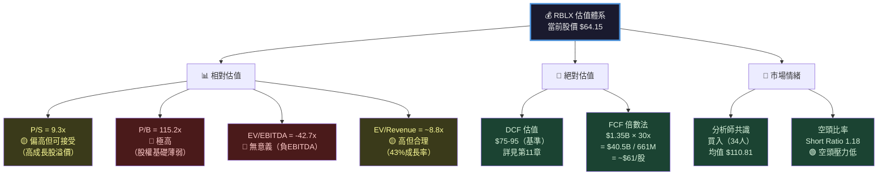

---

### 📋 估值倍數對比表

| 估值指標 | RBLX | Unity (U) | Take-Two (TTWO) | EA | 行業平均 | 評估 |
|----------|------|-----------|-----------------|-----|----------|------|
| **P/S** | 9.3x | 4.8x | 2.1x | 3.2x | 4.0x | 🟡 溢價 |
| **P/B** | 115x | N/A | 2.3x | 7.8x | — | 🔴 極高 |
| **EV/Rev** | 8.8x | 4.5x | 2.0x | 3.0x | 3.5x | 🔴 高溢價 |
| **EV/EBITDA** | 負值 | 負值 | 26x | 18x | 20x | 🔴 不適用 |
| **FCF Yield** | 3.0% | 負值 | 負值 | 3.5% | — | 🟢 合理 |
| **Rev 成長率** | 43.2% | -9% | 8% | 4% | — | 🟢 遠超同業 |

---

### 🎯 三情境目標股價

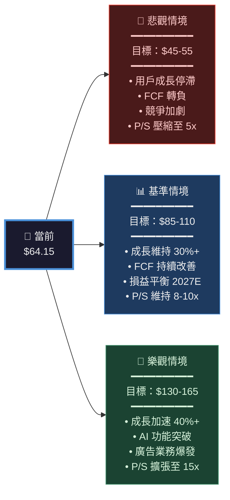

---

### 📊 目標價區間視覺化

```
  RBLX 目標股價估值區間
  ╔══════════════════════════════════════════════════════════╗
  ║                                                          ║
  ║  $0   $40  $60  $80  $100 $120 $140 $160 $180           ║
  ║   ├────┼────┼────┼────┼────┼────┼────┼────┤            ║
  ║                                                          ║
  ║  悲觀  ████████░░░░░░░░░░░░░░░░░░░░░  $45-55            ║
  ║                                                          ║
  ║  當前  ◄────────►$64.15                                  ║
  ║                                                          ║
  ║  FCF法 ░░░░░░░░░░████████░░░░░░░░░░  $55-75             ║
  ║                                                          ║
  ║  基準  ░░░░░░░░░░░░░░░░████████████  $85-110             ║
  ║                                                          ║
  ║  分析師均值    ░░░░░░░░░░░░░░░░►$110.81                  ║
  ║                                                          ║
  ║  樂觀  ░░░░░░░░░░░░░░░░░░░░░████████ $130-165            ║
  ║                                                          ║
  ║  52W高              ░░░░░░░░░░░░░░░►$150.59             ║
  ║                                                          ║
  ╚══════════════════════════════════════════════════════════╝
  
  當前股價 $64.15 相對於基準目標 $85-110 具有 32%-72% 上行空間
```

---

## 8. 競爭護城河

### 🏰 Porter's 五力分析

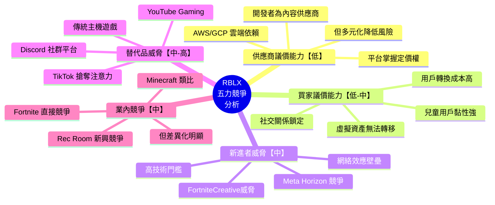

---

### 🏆 護城河評分 Unicode 進度條

```
  RBLX 護城河各維度評分（滿分 10分）
  ╔══════════════════════════════════════════════════════════╗
  ║                                                          ║
  ║  網絡效應    ▓▓▓▓▓▓▓▓▓░  9/10 ★★★★★ 極強           ║
  ║                                                          ║
  ║  品牌護城河  ▓▓▓▓▓▓▓▓░░  8/10 ★★★★☆ 強勁           ║
  ║                                                          ║
  ║  轉換成本    ▓▓▓▓▓▓▓▓░░  8/10 ★★★★☆ 高黏性         ║
  ║                                                          ║
  ║  技術壁壘    ▓▓▓▓▓▓▓░░░  7/10 ★★★★☆ 良好           ║
  ║                                                          ║
  ║  規模優勢    ▓▓▓▓▓▓░░░░  6/10 ★★★☆☆ 中等           ║
  ║                                                          ║
  ║  成本優勢    ▓▓▓▓░░░░░░  4/10 ★★☆☆☆ 創作者成本高   ║
  ║                                                          ║
  ║  監管壁壘    ▓▓▓░░░░░░░  3/10 ★★☆☆☆ 兒童數據法規   ║
  ║                                                          ║
  ║  整體護城河評級：★★★★☆  綜合 6.4/10  「寬護城河」    ║
  ╚══════════════════════════════════════════════════════════╝
```

---

### 📊 競爭定位矩陣

| 競爭對手 | 用戶規模 | 技術創新 | 貨幣化能力 | 開發者生態 | 年齡層覆蓋 | 整體威脅 |
|----------|----------|----------|-----------|-----------|-----------|----------|
| **RBLX** | 🟢 極大 | 🟢 強 | 🟡 發展中 | 🟢 最強 | 🟢 全年齡 | — |
| Fortnite (Epic) | 🟢 大 | 🟢 強 | 🟢 強 | 🟡 中 | 🟡 青少年+ | 🔴 高 |
| Minecraft (MSFT) | 🟢 極大 | 🟡 中 | 🟡 中 | 🟢 強 | 🟢 全年齡 | 🟡 中 |
| Rec Room | 🟡 中 | 🟡 中 | 🟡 中 | 🟡 中 | 🟡 青少年+ | 🟡 低中 |
| Meta Horizon | 🔴 小 | 🟢 強 | 🔴 弱 | 🔴 弱 | 🟡 成人 | 🟡 潛在 |

---

## 9. 成長催化劑

### 📅 催化劑時間軸

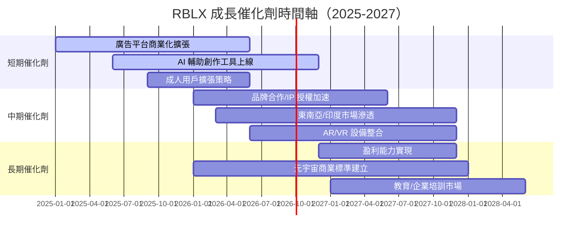

---

### 🚀 短中長期成長機會分解

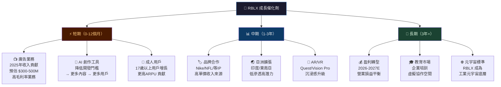

---

### 📊 TAM 市場規模估算

```
  Roblox 可定址市場（TAM）規模估算
  ╔══════════════════════════════════════════════════════════╗
  ║                                                          ║
  ║  市場類別                規模估算      RBLX 滲透率       ║
  ║  ─────────────────────────────────────────────────────   ║
  ║  全球電競娛樂市場        $500B/年      ~1%  ▓░░░░░░░░░   ║
  ║                                                          ║
  ║  數字廣告市場            $700B/年      ~0.1% ░░░░░░░░░░  ║
  ║                                                          ║
  ║  遊戲內虛擬物品市場      $50B/年       ~8%  ▓▓░░░░░░░░  ║
  ║                                                          ║
  ║  元宇宙整體市場(2030E)   $800B/年      潛在大幅增長       ║
  ║                                                          ║
  ║  教育科技市場            $400B/年      <1%  ░░░░░░░░░░   ║
  ║                                                          ║
  ║  RBLX 當前收入渗透率：                                   ║
  ║  現有核心市場 ~$50B TAM → 當前 $4.89B = 約 10% 滲透     ║
  ║  ▓▓▓▓▓▓▓▓▓▓░░░░░░░░░░░░░░░░░░  仍有極大成長空間         ║
  ╚══════════════════════════════════════════════════════════╝
```

---

## 10. 風險分析

### ⚠️ 風險矩陣

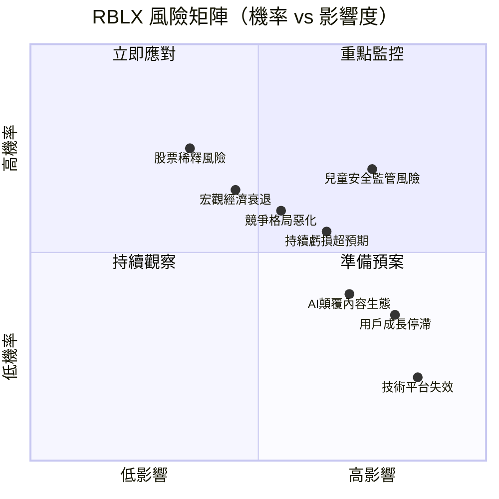

---

### 📋 風險評分卡（機率 × 影響度）

| 風險類別 | 機率 | 影響度 | 風險值 | 等級 | 緩解措施 |
|----------|------|--------|--------|------|----------|
| **兒童安全/COPPA 監管加強** | 70% | 高 | 🔴 極高 | ★★★★★ | 擴大安全投入、與監管機構合作 |
| **持續虧損拖累估值** | 60% | 高 | 🔴 高 | ★★★★☆ | FCF 改善、明確盈利路徑 |
| **Fortnite/Minecraft 競爭** | 65% | 中高 | 🔴 高 | ★★★★☆ | 差異化、AI 功能領先 |
| **宏觀衰退減少消費支出** | 50% | 中 | 🟡 中 | ★★★☆☆ | 訂閱收入多元化 |
| **股票大幅稀釋** | 40% | 中高 | 🟡 中 | ★★★☆☆ | 回購計畫、SBC 控制 |
| **用戶老化/核心用戶流失** | 40% | 高 | 🟡 中高 | ★★★☆☆ | 成人功能開發 |
| **AI 顛覆內容創作生態** | 45% | 中 | 🟡 中 | ★★★☆☆ | 擁抱 AI 工具化 |
| **技術基礎設施故障** | 20% | 極高 | 🟡 中 | ★★★☆☆ | 多重冗餘系統 |
| **主要創作者流失** | 35% | 中 | 🟢 低中 | ★★☆☆☆ | 分成比例優化 |
| **匯率風險（國際收入）** | 55% | 低 | 🟢 低 | ★★☆☆☆ | 天然對沖 |

---

### 🛡️ 主要風險緩解措施

```
  🔴 高優先級緩解：
  ├── ① 持續增加兒童安全技術投入（人臉識別、AI 內容審核）
  ├── ② 明確 FY2026-2027 盈利路徑，降低市場對虧損的焦慮
  └── ③ 加速廣告業務商業化，降低對 Robux 的收入集中度

  🟡 中優先級緩解：
  ├── ④ 開發成人用戶功能，擴大用戶年齡結構
  ├── ⑤ 強化與大型 IP（Disney/Marvel/NFL）深度合作
  └── ⑥ 控制 SBC 增速，降低股票稀釋速率

  🟢 持續監控：
  ├── ⑦ 定期評估競爭格局動態
  └── ⑧ 建立地緣政治風險應對預案（特別是中國市場准入）
```

---

## 11. 公平價值估算

### 🔢 DCF 模型架構

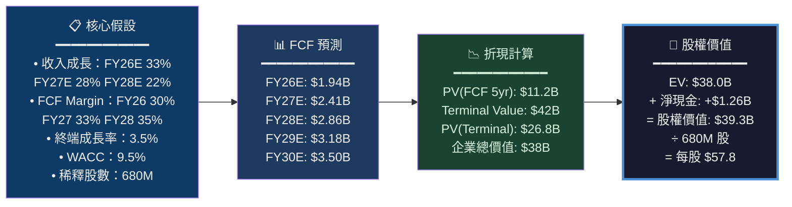

---

### 📋 三種估值法綜合比較

| 估值方法 | 方法描述 | 計算結果 | 權重 | 加權估值 | 評估 |
|----------|----------|----------|------|----------|------|
| **DCF（保守）** | WACC 10%，終端成長 3% | $52/股 | 25% | $13.0 | 🟡 |
| **DCF（基準）** | WACC 9.5%，終端成長 3.5% | $58/股 | 25% | $14.5 | 🟡 |
| **P/S 相對估值** | FY26E Rev $6.5B × 9x | $86/股 | 20% | $17.2 | 🟢 |
| **FCF 倍數法** | FY26E FCF $1.94B × 30x | $86/股 | 15% | $12.9 | 🟢 |
| **分析師共識** | 34位分析師均值 | $110.81/股 | 15% | $16.6 | 🟢 |
| **━━━━━━━━** | **加權公平價值** | **━━━━━━** | **100%** | **$74.2/股** | 🟡 |

---

### 📊 估值區間綜合視覺化

```
  RBLX 公平價值估算彙總
  ╔══════════════════════════════════════════════════════════╗
  ║                                                          ║
  ║        $40  $50  $60  $70  $80  $90  $100 $110 $120     ║
  ║         ├────┼────┼────┼────┼────┼────┼────┼────┤      ║
  ║                                                          ║
  ║  DCF保守 ████████░░░░░░░░░░░░░░░░░░░░░░  $45-55         ║
  ║                                                          ║
  ║  ◄── 當前股價 $64.15 ──►                                 ║
  ║                                                          ║
  ║  DCF基準  ░░░░░░░░████████░░░░░░░░░░░░  $55-72          ║
  ║                                                          ║
  ║  FCF倍數  ░░░░░░░░░░░░▓▓▓▓▓▓▓▓░░░░░░░  $65-90          ║
  ║                                                          ║
  ║  P/S相對  ░░░░░░░░░░░░░░▓▓▓▓▓▓▓▓▓░░░░  $75-100         ║
  ║                                                          ║
  ║  加權均值         ░░░░░░░░░░►$74.2                       ║
  ║                                                          ║
  ║  分析師均值        ░░░░░░░░░░░░░░░►$110.81               ║
  ║                                                          ║
  ║  ▌結論：當前 $64.15 輕微折價於公平價值 $74.2            ║
  ║  ▌相對於分析師目標 $110.81 有 73% 上行空間             ║
  ╚══════════════════════════════════════════════════════════╝
```

---

## 12. 投資建議

### 🏆 最終評級

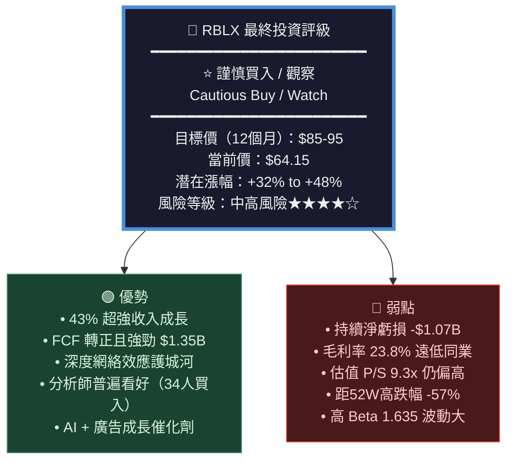

---

### 👥 投資人適配度分析

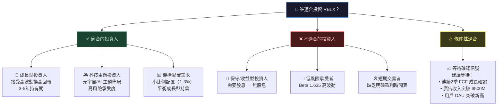

---

### ✅ 關鍵監控指標 Checklist

```
  RBLX 投資監控儀表板 ── 每季檢查清單
  ╔══════════════════════════════════════════════════════════╗
  ║                                                          ║
  ║  📊 成長指標                                             ║
  ║  ☐ DAU 同比成長率 > 20%（FY25 基線確認）                ║
  ║  ☐ 人均消費（ARPU）持續提升趨勢                         ║
  ║  ☐ 收入成長率維持 > 25%（YoY）                          ║
  ║  ☐ 廣告收入確認突破 $500M 年化                          ║
  ║                                                          ║
  ║  💰 獲利能力指標                                         ║
  ║  ☐ 毛利率維持 > 75%（注意認列方式）                     ║
  ║  ☐ 營業虧損持續收窄（目標 FY26 < -15%）                 ║
  ║  ☐ FCF Margin 維持 > 20%                                ║
  ║  ☐ SBC / 收入比率逐年下降                               ║
  ║                                                          ║
  ║  🏦 財務健康指標                                         ║
  ║  ☐ 現金儲備 > $2.5B（流動性安全邊際）                   ║
  ║  ☐ 總債務穩定 < $2.0B（不大幅增加）                     ║
  ║  ☐ 流動比率回升至 > 1.0                                  ║
  ║                                                          ║
  ║  🎮 平台健康指標                                         ║
  ║  ☐ 活躍開發者數量持續成長                                ║
  ║  ☐ 17歲以上用戶占比上升（貨幣化潛力）                   ║
  ║  ☐ 重大安全事件 = 0（兒童保護）                         ║
  ║                                                          ║
  ║  📰 事件觸發監控                                         ║
  ║  ☐ 監管機構對兒童隱私新法規動向                         ║
  ║  ☐ 競爭對手重大產品發布（Epic/MSFT）                    ║
  ║  ☐ AI 工具對創作者生態的影響評估                        ║
  ║  ☐ 管理層重大異動                                        ║
  ║                                                          ║
  ╚══════════════════════════════════════════════════════════╝
```

---

### 📊 最終投資評分總覽

```
  RBLX 基本面深度評分卡（滿分 100分）
  ╔══════════════════════════════════════════════════════════╗
  ║                                                          ║
  ║  維度              得分    權重    加權分   視覺化         ║
  ║  ─────────────────────────────────────────────────────   ║
  ║  收入成長性  85/100  ×25%  = 21.3  ▓▓▓▓▓▓▓▓▓░           ║
  ║  獲利能力    30/100  ×20%  =  6.0  ▓▓▓░░░░░░░           ║
  ║  現金流品質  78/100  ×20%  = 15.6  ▓▓▓▓▓▓▓▓░░           ║
  ║  財務穩健性  55/100  ×15%  =  8.3  ▓▓▓▓▓▓░░░░           ║
  ║  競爭護城河  72/100  ×10%  =  7.2  ▓▓▓▓▓▓▓░░░           ║
  ║  估值合理性  50/100  ×10%  =  5.0  ▓▓▓▓▓░░░░░           ║
  ║  ─────────────────────────────────────────────────────   ║
  ║  綜合總分：  63.4 / 100               ★★★☆☆             ║
  ║                                                          ║
  ║  評級：謹慎買入（Cautious Buy）                          ║
  ║  12M 目標價：$85-95                                      ║
  ║  建議持倉：成長型投資組合 2-4% 配置                      ║
  ╚══════════════════════════════════════════════════════════╝
```

---

## 📌 核心投資論點總結

```mermaid
graph LR
    BUY["🟢 買入理由"]
    WAIT["🟡 等待觀察"]
    RISK["🔴 主要風險"]

    BUY --> B1["43% 收入加速成長"]
    BUY --> B2["FCF $1.35B 強勁轉正"]
    BUY --> B3["元宇宙+AI 長期敘事"]
    BUY --> B4["距分析師目標 42% 折價"]

    WAIT --> W1["FY2026 盈利路徑確認"]
    WAIT --> W2["廣告收入規模化驗證"]
    WAIT --> W3["股價技術面企穩確認"]

    RISK --> R1["持續虧損 -$1.07B"]
    RISK --> R2["監管風險（COPPA）"]
    RISK --> R3["高 Beta 市場波動"]

    style BUY fill:#1b4332,color:#d8f3dc,stroke:#40916c
    style WAIT fill:#3a3a1a,color:#ffff99,stroke:#ffeb3b
    style RISK fill:#4a1a1a,color:#ffcccb,stroke:#f44336
```

---

> ### ⚡ 一句話總結
> **RBLX 是一家具備深厚護城河與強勁成長動能的元宇宙平台龍頭，FY2025 的收入加速（+43.2%）與 FCF 大幅轉正（$1.35B）是重要正面信號；當前 $64.15 的股價相對分析師均值目標 $110.81 有 73% 上行空間，但持續淨虧損、高估值與監管風險需要謹慎管理，建議成長型投資人分批建倉，等待盈利確認後加碼。**

---

> **⚠️ 免責聲明**：本報告為 AI 自動生成之研究分析，所有財務數據截至 2026-02-24，僅供投資研究參考，**不構成任何投資建議或要約**。投資有風險，進行任何投資決策前請諮