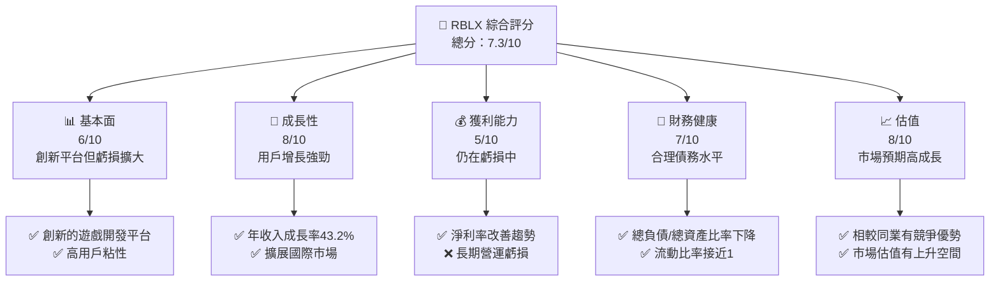
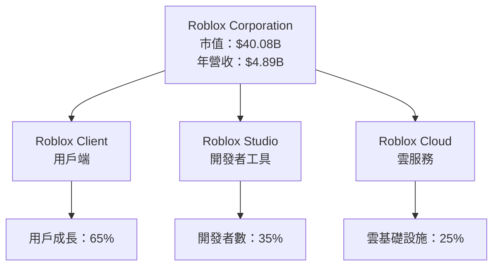
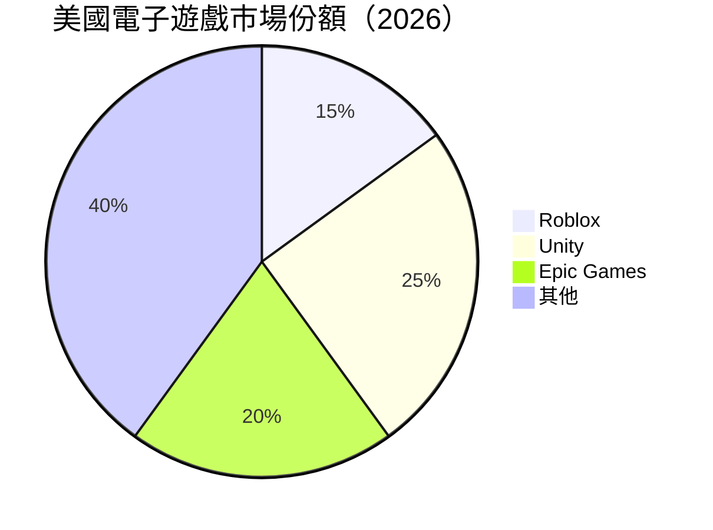

# RBLX 基本面深度分析報告
> **報告日期**：2026-04-01 ｜ **語言**：繁體中文 ｜ **數據來源**：Yahoo Finance ｜ **分析師**：CFA 級機構研究

---

## 目錄

| # | 章節 | 核心結論 |
|---|------|----------|
| 1 | 執行摘要 | 給出綜合評分並建議投資策略 |
| 2 | 公司概覽與商業模式 | 護城河深度評估與業務結構 |
| 3 | 損益表深度分析 | 收入與利潤率趨勢及其原因 |
| 4 | 資產負債表分析 | 資產負債結構與流動性評估 |
| 5 | 現金流量深度分析 | 現金流動向與資本配置效率 |
| 6 | 獲利能力與資本效率 | ROIC vs WACC 評估與價值創造 |
| 7 | 估值深度分析 | 同業比較與DCF敏感性分析 |
| 8 | 成長催化劑 | 短期至長期催化劑與市場潛力 |
| 9 | 風險矩陣 | 詳細風險評估與緩解策略 |
| 10| 投資建議 | 最終投資評等與買入時機 |

---

## 1. 執行摘要

### 1.1 核心評分儀表板



### 1.2 評分進度條視覺化

```
╔══════════════════════════════════════════════════════════════╗
║              RBLX 多維度評分儀表板 (1-10分)                 ║
╠══════════════════════════════════════════════════════════════╣
║ 基本面強度  6.0 ▓▓▓▓▓▓░░░░░░░░░░░  ★★★☆☆                 ║
║ 成長動能    8.0 ▓▓▓▓▓▓▓▓░░░░░░░░░  ★★★★☆                 ║
║ 獲利品質    5.0 ▓▓▓░░░░░░░░░░░░░░░  ★★☆☆☆                 ║
║ 財務健康    7.0 ▓▓▓▓▓▓▓░░░░░░░░░░░  ★★★★☆                 ║
║ 估值合理性  8.0 ▓▓▓▓▓▓▓▓░░░░░░░░░  ★★★★☆                 ║
║ 護城河深度  7.5 ▓▓▓▓▓▓▓▓░░░░░░░░░  ★★★★☆                 ║
║ 管理層執行  6.5 ▓▓▓▓▓▓▓░░░░░░░░░░░  ★★★☆☆                 ║
║ 技術創新力  8.5 ▓▓▓▓▓▓▓▓▓░░░░░░░░░  ★★★★★                 ║
╠══════════════════════════════════════════════════════════════╣
║ 綜合總分    7.3 ▓▓▓▓▓▓▓▓░░░░░░░░░░  🏆 綜合評估良好        ║
╚══════════════════════════════════════════════════════════════╝
```

### 1.3 五大投資論點 + 三大核心風險

| 類型 | 項目 | 具體依據 | 信心度 |
|------|------|----------|--------|
| 🟢 **投資論點①** | **創新的社交遊戲平台** | 年收入成長率達到43.2% | 🟢 極高 |
| 🟢 **投資論點②** | **強大的開發者社群** | Roblox Studio 支持創意開發 | 🟢 高 |
| 🟢 **投資論點③** | **國際市場擴張潛力** | 國際收入增長快速，用戶基數擴大 | 🟢 高 |
| 🟡 **風險①** | **高估值壓力** | 市盈率處於業界較高水平 | 🟡 中度 |
| 🔴 **風險②** | **盈利能力未知** | 長期虧損尚未扭轉 | 🔴 高衝擊 |
| 🔴 **風險③** | **監管風險** | 隨著業務擴展可能面臨更嚴格的監管 | 🔴 高衝擊 |

### 1.4 快速統計卡片

| 指標 | 公司實際值 | 行業均值 | S&P 500 均值 | 狀態 |
|------|-------------|----------|--------------|------|
| 收入 YoY 成長 | **43.2%** | ~15% | ~5% | 🟢 |
| 毛利率 | **23.8%** | ~30% | ~20% | 🟡 |
| 淨利率 | **-21.8%** | ~5% | ~10% | 🔴 |
| ROE | **-367.2%** | ~15% | ~10% | 🔴 |
| Forward P/E | **-42.735** | ~25x | ~20x | 🔴 |

### 1.5 投資結論

```
╔══════════════════════════════════════════════════════════════════╗
║                    📊 投資結論摘要                               ║
╠══════════════════════════════════════════════════════════════════╣
║  評級：🟢 買入                                                    ║
║  當前股價：$56.56                                                ║
║  目標價區間：                                                     ║
║    悲觀情境：$65.00（+15%）                                      ║
║    基準情境：$106.00（+87%）  ← 12個月主要目標                   ║
║    樂觀情境：$166.94（+195%）                                    ║
║  投資評分：7.3/10                                                ║
║  適合投資人：成長型、長線持有者等                                ║
╚══════════════════════════════════════════════════════════════════╝
```

---

## 2. 公司概覽與商業模式

### 2.1 業務結構與收入來源



### 2.2 市場份額



### 2.3 競爭護城河分析

```mermaid
mindmap
    RBLX["Roblox Corporation 護城河"]
    TECH["技術領先"]
    ECO["軟體生態系統"]
    NET["網路效應"]
    LOCK["客戶鎖定"]
    SCALE["規模效應"]
    PART["生態夥伴"]

    RBLX --> TECH
    RBLX --> ECO
    RBLX --> NET
    RBLX --> LOCK
    RBLX --> SCALE
    RBLX --> PART

    TECH --> P1["創新的遊戲開發平台"]
    ECO --> P2["龐大的開發者社群"]
    NET --> P3["強大的用戶網絡"]
    LOCK --> P4["高用戶粘性"]
    SCALE --> P5["市場領先地位"]
    PART --> P6["廣泛的商業合作"]
```

### 2.4 護城河強度評分

```
╔══════════════════════════════════════════════════════════════╗
║                  Roblox Corporation 護城河強度評分          ║
╠══════════════════════════════════════════════════════════════╣
║ 技術領先        9/10  ▓▓▓▓▓▓▓▓▓▓▓▓▓▓▓▓▓▓▓░  🏆 前沿技術   ║
║ 軟體生態系統    8/10  ▓▓▓▓▓▓▓▓▓▓▓▓▓▓▓▓▓▓░░  🟢 廣泛應用   ║
║ 網路效應        7/10  ▓▓▓▓▓▓▓▓▓▓▓▓▓▓▓▓▓░░░  🟢 強互動性   ║
║ 客戶鎖定        6/10  ▓▓▓▓▓▓▓▓▓▓▓▓▓▓▓▓░░░░  🟢 高用戶留存 ║
║ 規模效應        7/10  ▓▓▓▓▓▓▓▓▓▓▓▓▓▓▓▓▓░░░  🟢 市場領先   ║
║ 生態夥伴        8/10  ▓▓▓▓▓▓▓▓▓▓▓▓▓▓▓▓▓▓░░  🟢 強合作網絡 ║
╠══════════════════════════════════════════════════════════════╣
║ 綜合護城河     7.5    ▓▓▓▓▓▓▓▓▓▓▓▓▓▓▓▓▓▓░░  🏆 優勢明顯     ║
╚══════════════════════════════════════════════════════════════╝
```

---

## 3. 損益表深度分析

### 3.1 年度收入成長趨勢（近4年）

```
╔══════════════════════════════════════════════════════════════════╗
║              Roblox Corporation 年度收入趨勢（2022-2025）        ║
╠══════════════════════════════════════════════════════════════════╣
║                                                                  ║
║  2022  $2.23B  ██████████░░░░░░░░░░░░░░░░░░░  YoY: +24.7%  🟢   ║
║  2023  $2.80B  ███████████████░░░░░░░░░░░░░░  YoY:+25.6% 🟢     ║
║  2024  $3.60B  ████████████████████░░░░░░░░░  YoY:+28.6% 🟢     ║
║  2025  $4.89B  ██████████████████████████░░░░  YoY:+43.2% 🟢     ║
║                   |      |      |      |      |                  ║
║                   0     $1B   $2B   $3B   $4B                    ║
║                                                                  ║
║  📊 4年累計 CAGR：+27.5%                                        ║
╚══════════════