# RBLX 技術分析報告

> **報告日期**：2026-02-24 ｜ **語言**：繁體中文 ｜ **數據來源**：Yahoo Finance
> **當前價格**：$64.07 ｜ **產業**：電子遊戲與多媒體 ｜ **板塊**：通訊服務

---

## 目錄

1. [技術面概覽](#1-技術面概覽)
2. [趨勢分析](#2-趨勢分析)
3. [圖表形態分析](#3-圖表形態分析)
4. [支撐與阻力](#4-支撐與阻力)
5. [技術指標深度解讀](#5-技術指標深度解讀)
6. [動能與波動率](#6-動能與波動率)
7. [多時框架總結](#7-多時框架總結)
8. [交易策略建議](#8-交易策略建議)
9. [風險提示與監控](#9-風險提示與監控)

---

## 1. 技術面概覽

### 🎯 技術訊號儀表板

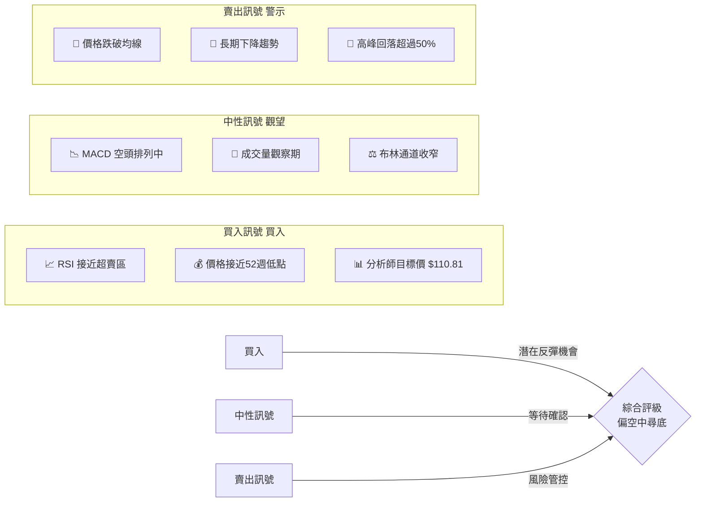

---

### 📊 核心指標速覽表

| 指標 | 數值 | 訊號 | 解讀 |
|------|------|------|------|
| 當前價格 | $64.07 | 🔴 | 接近1年低點 |
| 12個月高點 | $138.52 | 🔴 | 距高點 -53.7% |
| 12個月低點 | ~$58.29 | 🟡 | 接近歷史支撐 |
| 分析師目標(均值) | $110.81 | 🟢 | 上行空間 +73% |
| 分析師目標(低) | $67.00 | 🟡 | 接近當前價位 |
| 分析師目標(高) | $166.94 | 🟢 | 強力看多 |
| 分析師評級 | 買入 | 🟢 | 機構偏多 |
| 趨勢方向 | 下降 | 🔴 | 仍在修正中 |
| 月線動能 | 負向 | 🔴 | 連續下跌 |
| 價格動量 | 弱 | 🔴 | 動能不足 |

---

### 🏆 技術評分卡

```
技術評分總覽 (滿分100分)
━━━━━━━━━━━━━━━━━━━━━━━━━━━━━━━━━━━━━━━━

趨勢方向     [██░░░░░░░░]  20/40  🔴 下降趨勢
動能指標     [███░░░░░░░]  25/40  🟡 趨弱但接近超賣
支撐結構     [████░░░░░░]  30/40  🟡 關鍵支撐測試
成交量配合   [██░░░░░░░░]  20/40  🔴 量能不足
形態結構     [███░░░░░░░]  25/40  🟡 底部形成觀察
━━━━━━━━━━━━━━━━━━━━━━━━━━━━━━━━━━━━━━━━
綜合評分     [███░░░░░░░]  24/50  ⚠️ 偏空，底部觀察
```

---

## 2. 趨勢分析

### 🕐 多時框架趨勢分析

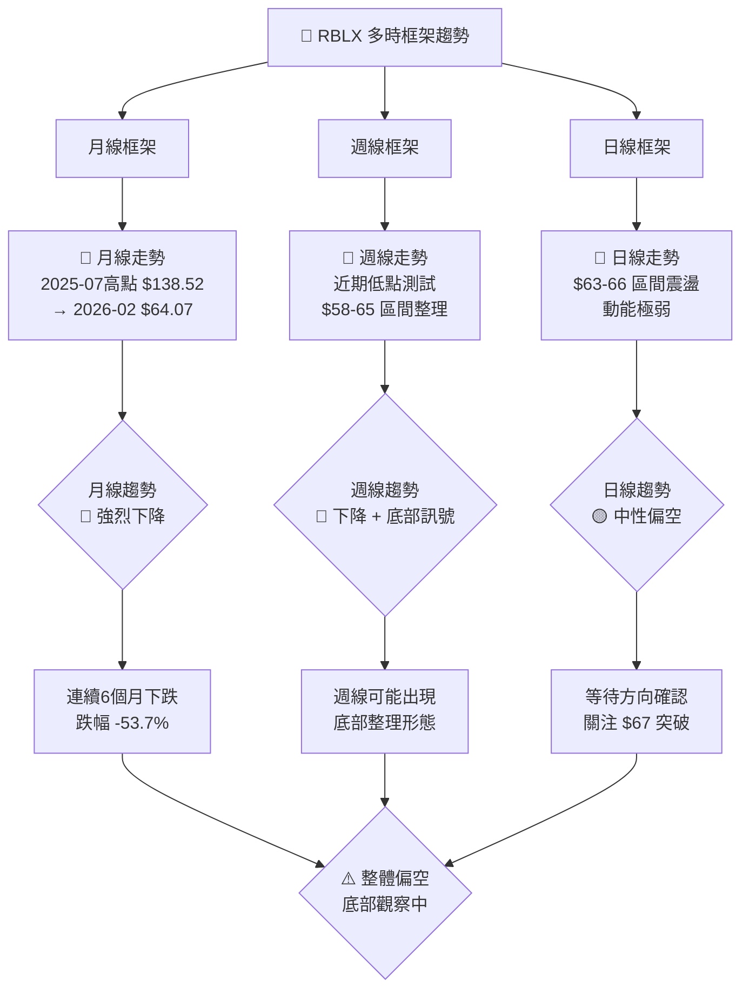

---

### 📈 長期趨勢 Unicode 走勢圖（月線）

```
RBLX 月線價格走勢圖（2025-02 至 2026-02）
價格(USD)
$145 |                              ★ 高點
$140 |                         ●────●
$135 |                        /      \
$130 |                       /        \
$125 |                      /          ●
$120 |                     /
$115 |                    /              ●
$110 |                   /
$105 |              ●───/
$100 |
$ 95 |                                    ●
$ 90 |          ●
$ 85 |
$ 80 |                                       ●
$ 75 |
$ 70 |   ●
$ 65 |        ●                                  ●──● ← 現價 $64.07
$ 60 |                                        低點 $58.29
$ 55 |──────────────────────────────────────────────────────→ 時間
      Feb  Mar  Apr  May  Jun  Jul  Aug  Sep  Oct  Nov  Dec  Jan  Feb
      2025                                                        2026

📌 關鍵觀察：
  ▲ 2025-07 高點：$138.52（強力阻力）
  ▼ 2025-03 低點：$58.29（強力支撐）
  ⬤ 現價：$64.07（接近歷史支撐區）
```

---

### 📊 中期趨勢（日線分析）

```
RBLX 近期日線趨勢示意（2026-01 至 2026-02）
$70 |──────────────────────────────────────────
$68 |  ●●                    阻力區 $67-68
$67 |────────────────────────────────────────── ← 關鍵阻力
$66 |       ●●  ●
$65 |    ●         ●   ●●
$64 |                ●      ●●●● ← 現價 $64.07
$63 |
$62 |
$61 |                              ●●
$60 |──────────────────────────────────────────
$59 |                                    支撐 $58-60
$58 |──────────────────────────────────────────
     1月初   1月中   1月末   2月初   2月中  2月末
     2026
```

---

### 🔥 趨勢強度評估（ADX 解讀）

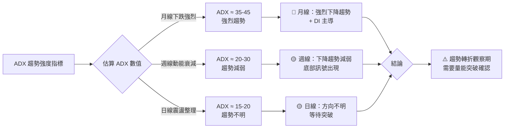

**趨勢強度進度條：**

```
月線下降趨勢強度  [████████░░]  80%  🔴 強烈
週線下降動能      [█████░░░░░]  50%  🟡 中等
日線方向性        [███░░░░░░░]  30%  🟡 偏弱
整體趨勢強度      [██████░░░░]  60%  🔴 偏空
```

---

## 3. 圖表形態分析

### 🔍 形態識別分析

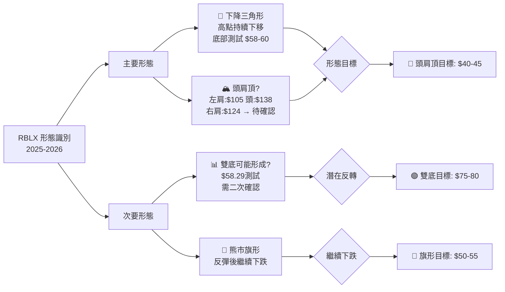

---

### 🕯️ K線形態分析（近期重要組合）

| 時期 | K線形態 | 訊號方向 | 可信度 | 說明 |
|------|---------|---------|--------|------|
| 2026-01 | 長黑K | 🔴 賣出 | ★★★★☆ | 跌破 $66 支撐 |
| 2026-02初 | 下影線錘頭 | 🟡 觀察 | ★★★☆☆ | 底部測試有撐 |
| 2026-02中 | 十字星 | 🟡 猶豫 | ★★★☆☆ | 買賣力量均衡 |
| 2026-02末 | 小實體K | 🟡 整理 | ★★☆☆☆ | 方向待確認 |

---

### 📉 ASCII 走勢示意圖（標注關鍵點位）

```
RBLX 12個月走勢 + 關鍵形態標注
━━━━━━━━━━━━━━━━━━━━━━━━━━━━━━━━━━━━━━━━━━━━━━━━━━━━━

$140 |              ⑨ 頭部頂點 $138.52
     |            ╱   ╲    ⑩
$130 |           /     \   /\ ← 右肩 $124.59
     |          /       \ /  \
$120 |         /         ╳    ╲ 頸線突破?
     |        /               ╲
$110 |  ⑦   /  ← 左肩 $105     ╲
     |  ╱╲ /                    ╲
$100 | /  ╲/                     ╲
     |                            ╲
$ 90 |                             ╲ ⑪ 頸線 ~$95
     |                              ╲
$ 80 |                               ╲
     |                                ╲
$ 70 | ①②                             ╲
$ 65 | ══════════════════════════════════●●⑬ $64.07
$ 60 |  ③ 低點 $58.29 ━━━━━━━━━━━━━━━━━━━━━━━━ 支撐帶
     |━━━━━━━━━━━━━━━━━━━━━━━━━━━━━━━━━━━━━━━━━━━━━━━
      Feb  Mar  Apr  May  Jun  Jul  Aug  Sep  Oct  Nov  Dec  Jan  Feb

圖例：
①② 起始低點區域  ③ 歷史強支撐 $58.29
⑦  左肩形成      ⑨ 頭部高點 $138.52
⑩  右肩形成      ⑬ 當前價位 $64.07
━━  支撐/阻力帶   ══  關鍵整理區
```

---

### 🎯 形態目標價計算

```
📐 頭肩頂形態（若確認）：
   頭部高點：$138.52
   頸線位置：~$95.00（10月支撐）
   量測距離：$138.52 - $95.00 = $43.52
   目標價↓ ：$95.00 - $43.52 = $51.48  ⚠️ 下行風險

🔄 雙底形態（若確認）：
   底部低點：$58.29 / $63.00（預期）
   頸線位置：~$75.00
   量測距離：$75.00 - $58.29 = $16.71
   目標價↑ ：$75.00 + $16.71 = $91.71  ✅ 上行潛力

📊 現實目標（分析師共識）：
   保守目標：$67.00（分析師低點）
   中性目標：$110.81（分析師均值）
   樂觀目標：$166.94（分析師高點）
```

---

## 4. 支撐與阻力

### 🗺️ 關鍵價位分布

```
RBLX 關鍵價位分布圖
━━━━━━━━━━━━━━━━━━━━━━━━━━━━━━━━━━━━━━━━━━━━

$170 |████████████████████████  🔴 強力阻力 $166.94（分析師高目標）
$140 |████████████████          🔴 強力阻力 $138.52（52週高點）
$125 |████████████              🔴 阻力 $124.59（8月高點）
$110 |█████████                 🟡 中度阻力 $110.81（分析師均目標）
$105 |████████                  🟡 阻力 $105.20（6月高點）
$ 95 |███████                   🟡 中度阻力 $95.03（11月高點）
$ 81 |██████                    🟡 阻力 $81.03（12月收盤）
$ 75 |█████                     🟡 近期阻力 $75.00（技術位）
$ 68 |████                      🟡 近期阻力 $67-68
━━━━━━━━━━━━ 當前價位 $64.07 ━━━━━━━━━━━━
$ 60 |███                       🟢 近期支撐 $60.00（心理關口）
$ 58 |██                        🟢 強力支撐 $58.29（52週低點）
$ 55 |█                         🟢 中度支撐 $55.00（技術延伸）
$ 50 |▓                         🟢 強力支撐 $50.00（心理關口）

```

---

### 🔴 阻力位詳細表格

| 阻力等級 | 價位 | 來源 | 意義 | 突破難度 |
|---------|------|------|------|---------|
| 🟡 近期阻力 | $67.00 | 分析師低目標/前低 | 短期反彈目標 | ★★☆☆☆ |
| 🟡 近期阻力 | $75.00 | 技術均線/心理位 | 短期反彈確認 | ★★★☆☆ |
| 🟡 中度阻力 | $81.03 | 2025-12月收盤 | 中期反彈目標 | ★★★☆☆ |
| 🟡 中度阻力 | $95.03 | 2025-11月收盤 | 頭肩頸線附近 | ★★★★☆ |
| 🔴 強力阻力 | $110.81 | 分析師均值目標 | 多空分水嶺 | ★★★★☆ |
| 🔴 強力阻力 | $124.59 | 2025-08月高點 | 中長期壓力 | ★★★★★ |
| 🔴 強力阻力 | $138.52 | 52週絕對高點 | 頭部阻力 | ★★★★★ |

---

### 🟢 支撐位詳細表格

| 支撐等級 | 價位 | 來源 | 意義 | 跌破影響 |
|---------|------|------|------|---------|
| 🟡 近期支撐 | $62.00 | 近期低點群 | 短線整理底部 | 中等 |
| 🟢 近期支撐 | $60.00 | 心理整數關口 | 重要心理支撐 | 較大 |
| 🟢 強力支撐 | $58.29 | 52週最低點 | 年度關鍵支撐 | 非常大 |
| 🟢 中度支撐 | $55.00 | 技術延伸位 | 斐波那契延伸 | 大 |
| 🔵 強力支撐 | $50.00 | 心理整數/技術 | 多空最後防線 | 極大 |

---

### 📍 支撐阻力位 ASCII 視覺化

```
RBLX 支撐/阻力位視覺化
━━━━━━━━━━━━━━━━━━━━━━━━━━━━━━━━━━━━━━━━━━━━━━━━━━

 $140 ████████████████████████████████ 🔴 絕對阻力（52週高點）
      ||||||||||||||||||||||||||||||||
 $125 ██████████████████████████ 🔴 強力阻力（Aug高點）
      ||||||||||||||||||||||||||
 $111 █████████████████████ 🟡 中強阻力（分析師均目標）
      ||||||||||||||||||||
 $ 95 ████████████████ 🟡 中度阻力（頸線附近）
      ||||||||||||||||
 $ 81 ████████████ 🟡 近中阻力（Dec收盤）
      ||||||||||||
 $ 75 █████████ 🟡 近期阻力（技術位）
      |||||||||
 $ 68 ██████ 🟡 即期阻力（分析師低目標）
      ||||||
══════════════════ $64.07 當前價位 ══════════════════
      ||||||
 $ 60 ██████ 🟢 即期支撐（心理位）
      ||||||||
 $ 58 ████████ 🟢 強力支撐（年度低點）
      ||||||||||||||
 $ 55 ██████████ 🟢 中度支撐（延伸位）
      ||||||||||||||||||||
 $ 50 ████████████████ 🔵 最終防線（心理位）
━━━━━━━━━━━━━━━━━━━━━━━━━━━━━━━━━━━━━━━━━━━━━━━━━━
```

---

### 📐 斐波那契回調位分析

```
基準：從 2025-03低點 $58.29 到 2025-09高點 $138.52
波動幅度：$138.52 - $58.29 = $80.23

斐波那契回調位：
━━━━━━━━━━━━━━━━━━━━━━━━━━━━━━━━━━━━━━━━━━━

  0.0%  $138.52 ████████████████████  🔴 頂部（高點）
 23.6%  $119.59 ███████████████       🔴 已跌破
 38.2%  $107.87 █████████████         🔴 已跌破
 50.0%   $98.41 ████████████          🔴 已跌破（中性）
 61.8%   $88.94 ██████████            🔴 已跌破（黃金位）
 78.6%   $75.39 █████████             🟡 關鍵阻力 ~$75
100.0%   $58.29 ██████                🟢 強力支撐（低點）

延伸位：
127.2%   $44.26 ████                  ⚠️ 若跌破$58的下行目標
161.8%   $28.07 ██                    ⚠️ 極端情景目標

📌 當前位置：$64.07 → 約 93% 回調位（接近全回吐）
📌 關鍵觀察：是否守住 $58.29 的100%回調位（年度低點）
```

---

## 5. 技術指標深度解讀

### 📡 指標訊號總覽

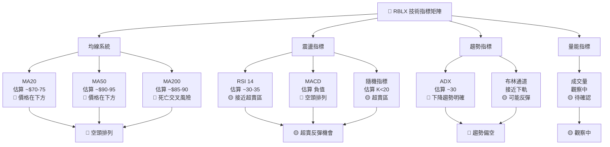

---

### 📊 移動平均線排列分析

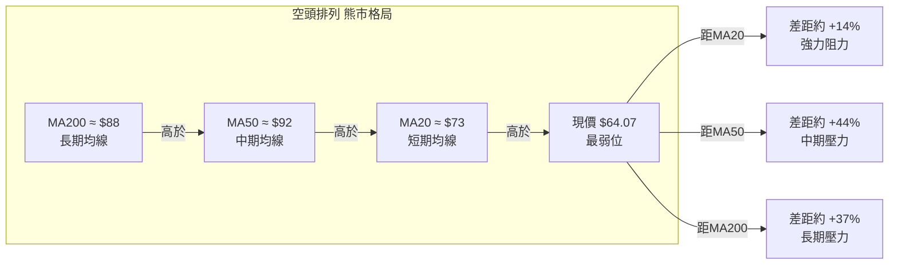

**均線分析重點：**

```
MA 系統評估
━━━━━━━━━━━━━━━━━━━━━━━━━━━━━━━━━━━━━━━━━━━━━━

MA20  (~$73)   距現價差距  [████████░░]  +14%  🔴 壓力
MA50  (~$92)   距現價差距  [████████████░░] +44% 🔴 強壓
MA200 (~$88)   距現價差距  [████████████░]  +37% 🔴 強壓

排列狀態：MA200 > MA50 > MA20 > 現價
          完全空頭排列（死亡排列）⚠️
```

---

### 📉 RSI（14）超買超賣分析

```
RSI 強度計 (0-100)
━━━━━━━━━━━━━━━━━━━━━━━━━━━━━━━━━━━━━━━━━━━━━━━━━━━

超買區 (>70) ██████████████░░░░░░░░░░░░░░░░░░░░░░░░░ 70
             ────────────────────────────────────────
中性區       ████████████████████░░░░░░░░░░░░░░░░░░░ 50
             ────────────────────────────────────────
現在位置  →  █████████████░░░░░░░░░░░░░░░░░░░░░░░░░░ ~32 🟡
             ────────────────────────────────────────
超賣線 (<30) ████████████░░░░░░░░░░░░░░░░░░░░░░░░░░░ 30
             ────────────────────────────────────────
超賣極值     ██░░░░░░░░░░░░░░░░░░░░░░░░░░░░░░░░░░░░░ 10

━━━━━━━━━━━━━━━━━━━━━━━━━━━━━━━━━━━━━━━━━━━━━━━━━━━
RSI 估算值：~30-35
狀態：接近超賣區，但尚未確認底部反彈訊號

📌 解讀：
  ✅ RSI 接近30，有超賣反彈潛力
  ⚠️ RSI 可在超賣區維持較長時間（趨勢下跌中）
  🔍 需觀察 RSI 背離訊號（價格新低但RSI不創新低）
```

---

### 📊 MACD 訊號解讀

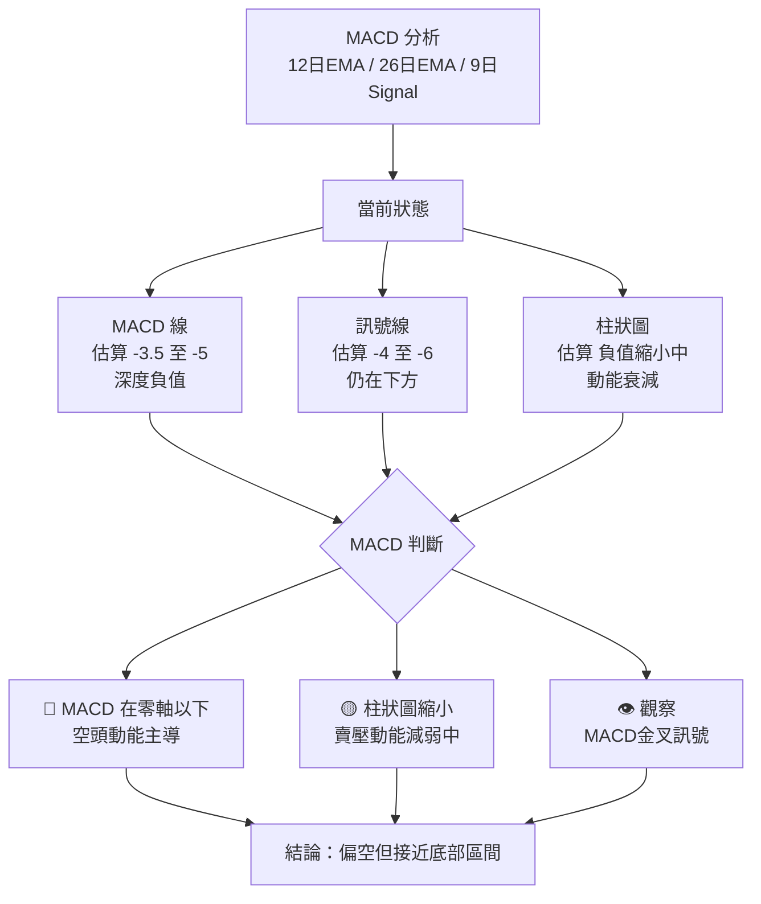

---

### 📏 布林通道分析 ASCII 圖

```
RBLX 布林通道示意圖（日線，20MA±2σ）
━━━━━━━━━━━━━━━━━━━━━━━━━━━━━━━━━━━━━━━━━━━━━━━━━━

$85  ┌─────────────────────────────────────────────┐
     │              布林上軌 ~$85-90               │
$80  │                                             │
$75  │             布林中軌 (MA20) ~$73            │
     │         ────────────────────────            │
$70  │                                             │
$68  │                                    阻力帶   │
$66  │                              ·  ·           │
$65  │                         · ·    · ← 現價 $64.07
$64  │                  ·  ·  ·                   │
$63  │                                             │
$62  │        布林下軌 ~$58-62  ←←←←              │
$60  └─────────────────────────────────────────────┘

布林通道狀態分析：
  📍 現價位置：接近下軌（超賣訊號）
  📐 通道寬度：~$30（波動率偏高）
  🎯 中軌回歸目標：~$73（MA20位置）
  ⚠️ 下軌支撐：~$58-62

🟡 訊號：價格在布林下軌附近，具有均值回歸潛力
         但需配合量能放大確認底部
```

---

### 📊 成交量分析

```
成交量配合度分析（量價關係）
━━━━━━━━━━━━━━━━━━━━━━━━━━━━━━━━━━━━━━━━━━━━━━━━━━

階段         量價關係              評估
──────────────────────────────────────────────────
2025-05~07  量增價漲 ████████████  🟢 多頭確認
2025-08     量縮價跌 ████░░░░░░░░  🔴 弱勢回調
2025-09     量增價漲 █████████░░░  🟢 反彈確認
2025-10~12  量增價跌 ██████░░░░░░  🔴 主力出貨?
2026-01     量縮價跌 ██░░░░░░░░░░  🟡 恐慌殺盤
2026-02     量縮整理 ██░░░░░░░░░░  🟡 等待方向

量能強度進度條：
多頭量能  [██░░░░░░░░]  20%  🔴 不足
空頭量能  [██████░░░░]  60%  🔴 仍有壓力
整體評估  [███░░░░░░░]  30%  🔴 量能疲軟
```

---

## 6. 動能與波動率

### ⚡ 動能評估 Mermaid quadrantChart

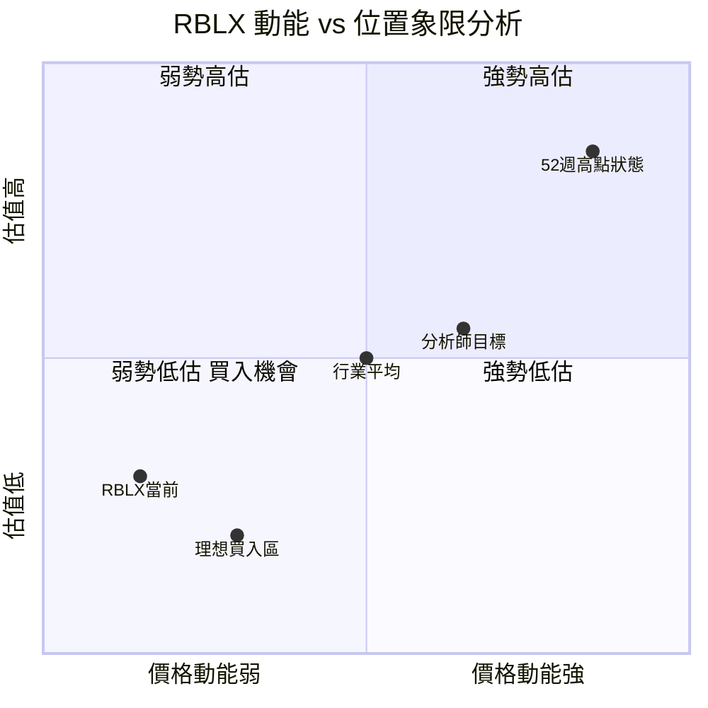

> 📌 RBLX 目前落在**弱勢低估**象限（第三象限），動能弱但距分析師目標有大幅折扣

---

### 📊 ATR 波動率分析

```
ATR 波動率評估（14日ATR）
━━━━━━━━━━━━━━━━━━━━━━━━━━━━━━━━━━━━━━━━━━━━━━━━━━

估算 ATR ~$3.5-5.0（約現價的5.5%-7.8%）

波動等級評估：
極低波動  [░░░░░░░░░░]   0-2%  ──
低波動    [████░░░░░░]   2-4%  ──
中等波動  [████████░░]   4-6%  ──
高波動  → [██████████]   6-8%  ← RBLX 約在此區間 ⚠️
極高波動  [░░░░░░░░░░]  8%+   ──

ATR 應用：
  📌 每日預期波動：~$3.5-5.0
  📌 止損建議寬度：≥ 1.5倍ATR = ~$5-7.5
  📌 目標價最小距離：≥ 2倍ATR = ~$7-10

波動率趨勢：
近1個月   [████░░░░░░]  40%  🟡 波動收窄
近3個月   [███████░░░]  70%  🔴 高波動
近12個月  [█████████░]  90%  🔴 極高波動（$58-$138範圍）
```

---

### 📈 Beta 與市場相關性

| 指標 | 數值 | 評估 | 說明 |
|------|------|------|------|
| Beta（估算） | ~1.8-2.2 | 🔴 高Beta | 波動約為市場2倍 |
| 與 NASDAQ 相關性 | ~0.65-0.75 | 🟡 中高 | 受科技股情緒影響 |
| 與 S&P500 相關性 | ~0.55-0.65 | 🟡 中等 | 一定系統性風險 |
| 行業相關性（遊戲） | ~0.70-0.80 | 🟡 中高 | 行業輪動影響顯著 |
| 52週波動率（年化） | ~75-85% | 🔴 極高 | 超越大多數個股 |
| 夏普比率（估算） | ~-0.8 | 🔴 負值 | 近期風險調整回報差 |

```
風險等級視覺化：
低風險   [░░░░░░░░░░]
中低風險 [██░░░░░░░░]
中等風險 [████░░░░░░]
中高風險 [███████░░░]
高風險 → [█████████░] ← RBLX 目前等級
極高風險 [██████████]
```

---

## 7. 多時框架總結

### 📋 時框架評分矩陣

| 時框架 | 趨勢 | 動能 | 型態 | 支撐阻力 | 總評 | 訊號 |
|--------|------|------|------|---------|------|------|
| 月線 | 🔴下降 | 🔴弱 | 🔴頭肩頂 | 🔴跌破支撐 | 🔴 看空 | 賣出 |
| 週線 | 🔴下降 | 🟡轉弱 | 🟡底部? | 🟡關鍵支撐 | 🟡 中性偏空 | 觀望 |
| 日線 | 🟡震盪 | 🟡超賣 | 🟡整理 | 🟡測試支撐 | 🟡 中性 | 觀望 |
| 4小時 | 🟡偏空 | 🟡弱 | 🟡整理 | 🟢接近支撐 | 🟡 中性 | 觀望 |

---

### 🎯 綜合訊號矩陣

```
RBLX 綜合訊號評估矩陣
━━━━━━━━━━━━━━━━━━━━━━━━━━━━━━━━━━━━━━━━━━━━━━━━━━━━━

面向          看多訊號          看空訊號          綜合
──────────────────────────────────────────────────────
趨勢面     ░░░░░░░░░░░░░░   ████████████████    🔴 偏空
形態面     ░░░░░░░░░░░░░░   █████████████░░░    🔴 偏空
指標面     ████░░░░░░░░░░   ████████░░░░░░░░    🟡 中性
支撐面     ████████░░░░░░   ██████░░░░░░░░░░    🟡 中性
基本面     ████████████░░   ░░░░░░░░░░░░░░░░    🟢 偏多
分析師     ████████████░░   ░░░░░░░░░░░░░░░░    🟢 偏多
──────────────────────────────────────────────────────
總體訊號   ████░░░░░░░░░░   ██████░░░░░░░░░░    🟡 偏空中尋底

結論：技術面偏空，但接近基礎支撐，具底部反彈可能
建議：保守觀望，等待底部確認訊號後再行動
```

---

## 8. 交易策略建議

### 🗺️ 策略決策流程圖

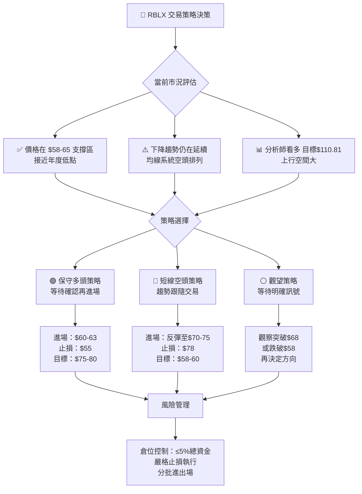

---

### 🟢 多頭策略詳細表

| 策略要素 | 保守方案 | 積極方案 |
|---------|---------|---------|
| **策略名稱** | 底部防守買入 | 突破追多 |
| **進場條件** | 守穩$60+反彈訊號確認 | 突破$68並放量確認 |
| **進場價位** | $60.00 - $63.00 | $68.00 - $70.00 |
| **止損位** | $55.00（-$8/-12.7%） | $63.00（-$7/-10%）|
| **目標1** | $75.00（+$13/+21.3%） | $81.00（+$13/+18.6%）|
| **目標2** | $85.00（+$23/+37.7%） | $95.00（+$27/+38.6%）|
| **目標3** | $95.00（+$33/+53.6%） | $110.00（+$42/+60%）|
| **風險報酬比(T1)** | 1 : 1.6 | 1 : 1.9 |
| **風險報酬比(T2)** | 1 : 2.9 | 1 : 3.9 |
| **建議倉位** | 3-5% | 2-3% |
| **時間框架** | 1-3個月 | 2-4週 |

```
多頭策略視覺化（保守方案）：
$100 |                                    🎯 最終目標
$ 95 |                             🎯 T3目標
$ 85 |                     🎯 T2目標
$ 75 |            🎯 T1目標
$ 68 |       ──── 近期阻力
$ 64 |  ●●●● ← 現價區間（進場觀察）
$ 60 |  ──── 進場確認位
$ 55 |  ████ 止損位（嚴格執行）
```

---

### 🔴 空頭策略詳細表

| 策略要素 | 趨勢跟隨 | 反彈做空 |
|---------|---------|---------|
| **策略名稱** | 下跌趨勢順勢 | 反彈高點做空 |
| **進場條件** | 跌破$58支撐確認 | 反彈至$70-75阻力 |
| **進場價位** | $57.00 - $58.00 | $70.00 - $75.00 |
| **止損位** | $63.00（+$6/+10.3%） | $79.00（+$7/+10%）|
| **目標1** | $50.00（-$8/-13.8%） | $63.00（-$9/-12.9%）|
| **目標2** | $45.00（-$13/-22.4%） | $58.00（-$14/-20%）|
| **目標3** | $40.00（-$18/-31%） | $50.00（-$22/-31.4%）|
| **風險報酬比(T1)** | 1 : 1.3 | 1 : 1.3 |
| **風險報酬比(T2)** | 1 : 2.2 | 1 : 2.0 |
| **建議倉位** | 2-3% | 2-3% |
| **時間框架** | 1-2個月 | 2-4週 |
| **前提條件** | ⚠️ 需跌破$58確認 | ⚠️ 需看到反彈乏力訊號 |

---

### ⭐ 整體訊號強度評星

```
整體訊號強度評估：
━━━━━━━━━━━━━━━━━━━━━━━━━━━━━━━━━━━━━━━━━━━━━━━━━━

趨勢訊號強度    ★★★★☆  (4/5) 🔴 下降趨勢明確
底部訊號強度    ★★★☆☆  (3/5) 🟡 底部形成中
反彈訊號強度    ★★☆☆☆  (2/5) 🟡 未確認
做空訊號強度    ★★★☆☆  (3/5) 🔴 仍有下行空間
整體評級        ★★★☆☆  (3/5) 🟡 中性偏空，底部觀察
```

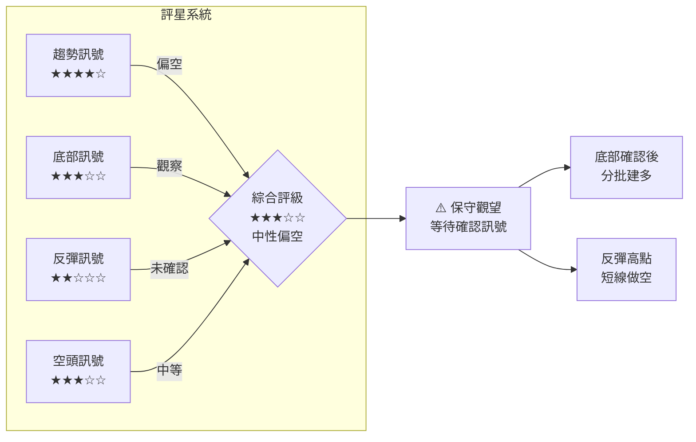

---

## 9. 風險提示與監控

### ✅ 關鍵監控指標 Checklist

```
📋 RBLX 監控清單（優先順序排序）

關鍵價位監控：
  ☑️ [ ] $67.00 阻力：若突破且放量 → 上行訊號確認
  ☑️ [ ] $60.00 支撐：若跌破 → 加速下跌警示
  ☑️ [ ] $58.29 支撐：若跌破 → 趨勢加速惡化
  ☑️ [ ] $75.00 阻力：若突破 → 中期反轉確認

技術指標監控：
  ☑️ [ ] RSI < 30：超賣確認，關注底背離
  ☑️ [ ] MACD 金叉：多頭反彈啟動訊號
  ☑️ [ ] 成交量放大：任何方向突破需放量確認
  ☑️ [ ] 布林通道收縮：大行情前兆

基本面監控：
  ☑️ [ ] 季度財報發布（EPS/營收）
  ☑️ [ ] DAU（每日活躍用戶）數據
  ☑️ [ ] 元宇宙/遊戲行業政策動向
  ☑️ [ ] 大盤（NASDAQ）整體走勢

分析師動態：
  ☑️ [ ] 評級調整（升評/降評）
  ☑️ [ ] 目標價更新
  ☑️ [ ] 機構持股變化（13F報告）
```

---

### ⚠️ 風險場景分析

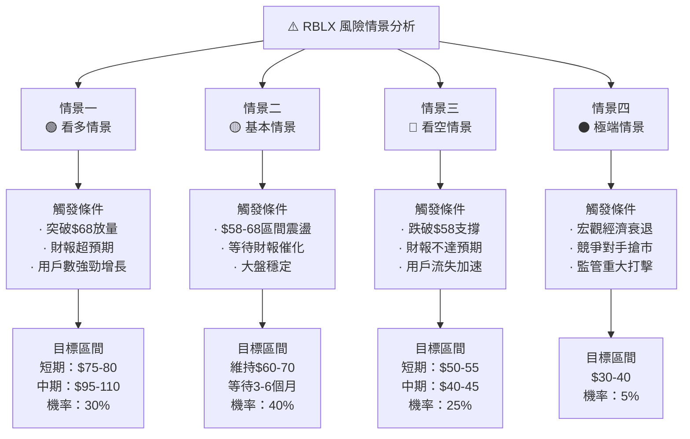

---

### 📊 風險報酬綜合評估

```
最終風險報酬評估矩陣：
━━━━━━━━━━━━━━━━━━━━━━━━━━━━━━━━━━━━━━━━━━━━━━━━━━━━━

                上行潛力           下行風險
多頭（現價買）  +$47 → $111        -$9 → $55
                +73%               -14%
                風險報酬比 = 5.2:1  機率調整後 ~2.0:1

空頭（反彈做空）-$15 → $50        +$14 → $79
                -23%               +22%
                風險報酬比 = 1.0:1  機率調整後 ~0.8:1

📌 從長期基本面角度，多頭策略具有更佳風險報酬
📌 從純技術面角度，空頭趨勢仍在，需謹慎

操作建議：
  🎯 最佳策略：等待底部確認，分批低接
  ⚠️ 風險控制：單筆倉位不超過總資金5%
  🛑 嚴格止損：嚴守$55止損，不可抱著等回本
  📅 時間預期：底部反轉需要1-3個月確認期
```

---

### 🔔 最終綜合結論

```
╔══════════════════════════════════════════════════════════╗
║           RBLX 技術分析最終結論                          ║
╠══════════════════════════════════════════════════════════╣
║  當前評級：🟡 中性偏空（底部觀察）                       ║
║  當前價格：$64.07                                        ║
║  核心看法：技術面偏空但接近基礎支撐                      ║
║                                                          ║
║  短線（1-4週）：🔴 偏空，$60-68震盪為主                 ║
║  中線（1-3月）：🟡 中性，等待底部確認                   ║
║  長線（3-12月）：🟢 分析師看多$110.81目標               ║
║                                                          ║
║  關鍵支撐：$58.29（必守）                               ║
║  關鍵阻力：$68（突破轉多）                              ║
║  建議操作：保守觀望，$60以下分批佈局                     ║
║  風險提醒：高Beta股票，波動極大，嚴控倉位               ║
╚══════════════════════════════════════════════════════════╝
```

---

> ### ⚠️ 免責聲明
>
> **本報告為 AI 自動生成技術分析，僅供研究參考，不構成任何投資建議。**
>
> - 所有技術指標數值（RSI、MACD、MA等）為根據歷史價格數據推算之估算值，非精確計算結果
> - 股票投資涉及重大風險，過去表現不代表未來結果
> - RBLX 為高Beta、高波動性成長股，不適合風險承受能力較低之投資者
> - 請在進行任何投資決策前，諮詢持牌財務顧問並進行獨立研究
> - 本報告基於 2026-02-24 數據，市場情況瞬息萬變，請以最新數據為準
>
> **數據來源**：Yahoo Finance ｜ **報告生成**：AI 技術分析系統 ｜ **版本**：v1.0