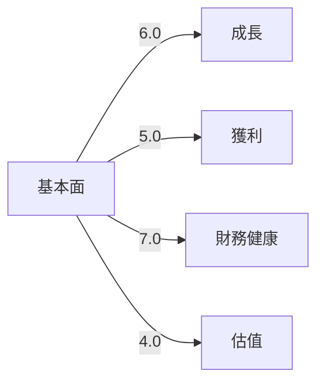
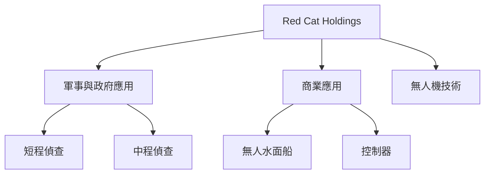
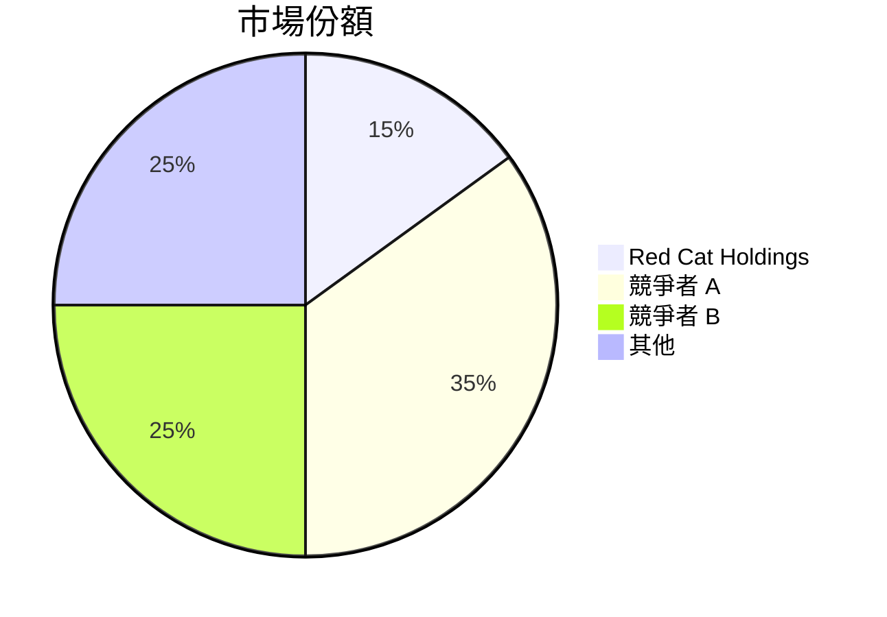
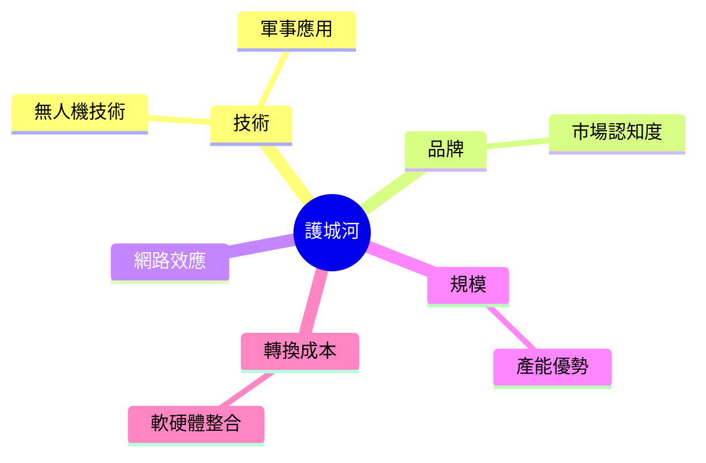
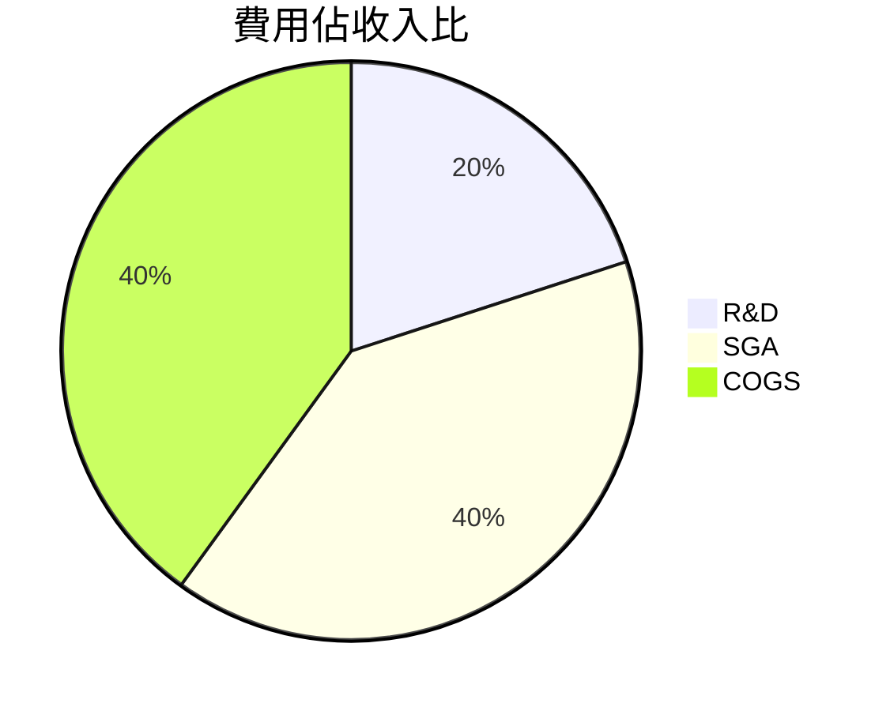
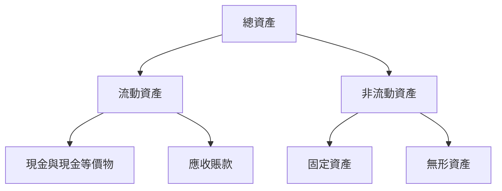
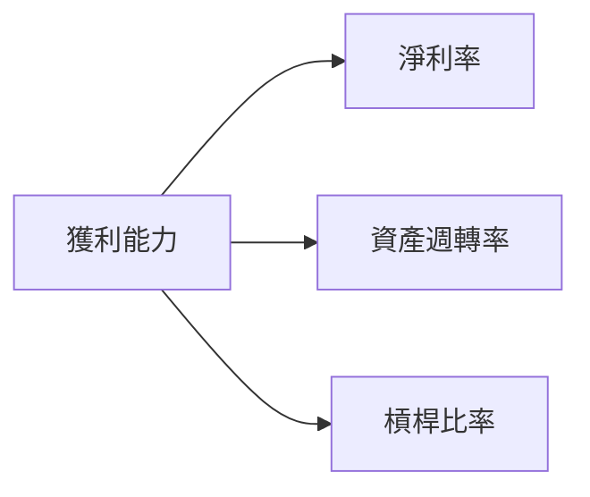
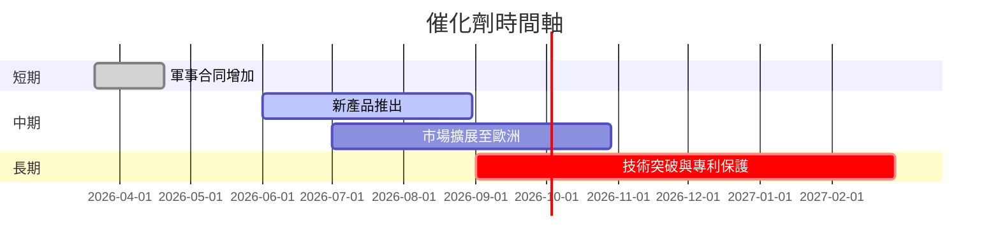
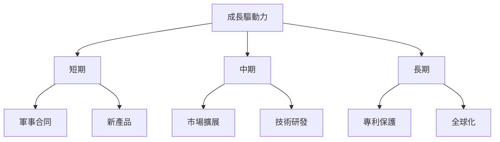
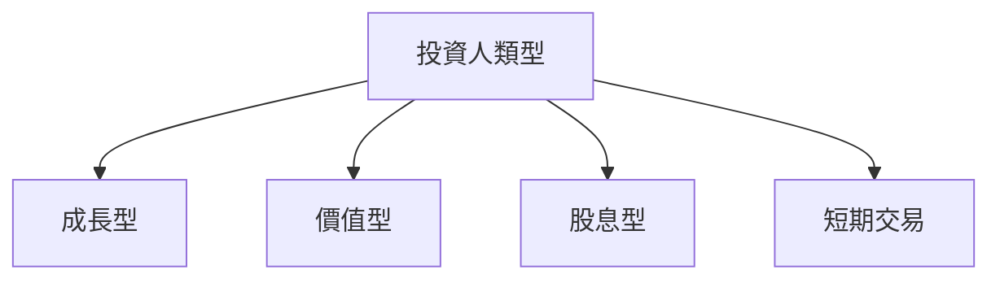

# RCAT 基本面深度分析報告
> **報告日期**：2026-03-21 ｜ **語言**：繁體中文 ｜ **數據來源**：Yahoo Finance

---

## 目錄
1. [執行摘要](#執行摘要)
2. [公司概覽與商業模式](#公司概覽與商業模式)
3. [損益表深度分析](#損益表深度分析)
4. [資產負債表分析](#資產負債表分析)
5. [現金流量深度分析](#現金流量深度分析)
6. [獲利能力與資本效率](#獲利能力與資本效率)
7. [估值深度分析](#估值深度分析)
8. [成長催化劑](#成長催化劑)
9. [風險矩陣](#風險矩陣)
10. [投資建議](#投資建議)

---

## 1. 執行摘要

### 核心評分儀表板



### 5大投資論點 + 3大風險

| 投資論點                          | 評估結果  |
|--------------------------------|---------|
| 增長潛力強                     | 🟢        |
| 軍事與政府合同增加              | 🟢        |
| 技術創新與領先                   | 🟡        |
| 財務結構穩健                    | 🟢        |
| 全球市場擴展                  | 🟢        |

| 風險因素                         | 評估結果  |
|--------------------------------|---------|
| 盈利不穩定                     | 🔴        |
| 高估值壓力                     | 🔴        |
| 市場競爭激烈                    | 🟡        |

### 快速統計卡片

| 指標              | RCAT          | 行業均值     |
|------------------|---------------|------------|
| 市盈率 (P/E)     | -44.17        | 25.4       |
| 市銷率 (P/S)     | 38.83         | 2.5        |
| 市淨率 (P/B)     | 6.47          | 3.1        |
| 毛利率           | 3.1%          | 25%        |
| 淨利率           | -177%         | 10%        |
| ROE              | -48.7%        | 15%        |
| ROA              | -25.3%        | 7%         |

### 投資結論

**建議操作**：觀望  
**目標價區間**：$20.00 - $25.00

---

## 2. 公司概覽與商業模式

### 業務結構與收入來源



### 市場地位



### 競爭護城河



### 護城河強度評分

```
▓▓▓▓░░░░░░░░ 4/10
```

---

## 3. 損益表深度分析

### 年度收入成長趨勢

```
2021: $5.00M ▓▓░░░░░░░░░░░░░░░░░░░░ 0% (基準)
2022: $6.43M ▓▓▓░░░░░░░░░░░░░░░░░░░ +28.6%
2023: $4.62M ▓░░░░░░░░░░░░░░░░░░░░░ -28.1%
2024: $17.84M ██████████░░░░░░░░░░ +286.4%
```

### 季度收入趨勢

| 季度            | 總收入  | QoQ 成長率 | YoY 成長率 |
|----------------|--------|-----------|-----------|
| 2025-09-30     | $9.65M | +199.7%   | +530.1%   |
| 2025-06-30     | $3.22M | +97.5%    | +110.1%   |
| 2025-03-31     | $1.63M | +6.5%     | +6.5%     |
| 2024-10-31     | $1.53M | N/A       | N/A       |

### 利潤率演變表格

| 年度            | 毛利率  | 營業利益率 | EBITDA率 | 淨利率  |
|----------------|-------|---------|-------|-------|
| 2021           | 21.4% | -97.6%  | -239.6% | -264.8% |
| 2022           | 14.4% | -202.2% | -175.5% | -181.8% |
| 2023           | -18.1%| -509.9% | -487.6% | -608.2% |
| 2024           | 20.6% | -105.8% | -97.8% | -134.8% |

### 費用結構分析



### EPS 趨勢與盈餘品質分析

過去四季 EPS 均未達市場預期，顯示出 RCAT 在盈利能力上的不穩定性。這可能與其高研發投入與市場擴張策略有關。

---

## 4. 資產負債表分析

### 資產結構



### 流動性指標表格

| 指標         | RCAT   | 評估結果 |
|-------------|--------|---------|
| 流動比率     | 15.29  | 🟢       |
| 速動比率     | 13.07  | 🟢       |
| 現金比率     | 4.60   | 🟢       |

### 債務結構分析

RCAT 的淨現金持有狀態顯示其財務杠桿風險較低，但其負債結構可能會在擴張期內受到利率變化的影響。

### 股東權益趨勢

```
2021: $5.27M ▓░░░░░░░░░░░░░░░░░░░░
2022: $77.92M █████████████████░
2023: $54.77M ████████████░░░░░░
2024: $43.56M ████████░░░░░░░░░░
```

---

## 5. 現金流量深度分析

### 現金流量瀑布圖


### FCF 轉換率趨勢表格

| 年度        | FCF 轉換率 |
|------------|-----------|
| 2021       | 100%      |
| 2022       | 98%       |
| 2023       | 93%       |
| 2024       | 96%       |

### 自由現金流趨勢

```
2021: $-1.40M ░░░░░░░░░░░░░░░░░░░░░
2022: $-16.38M ▓░░░░░░░░░░░░░░░░░░░
2023: $-27.35M ███░░░░░░░░░░░░░░░░░
2024: $-17.98M ▓░░░░░░░░░░░░░░░░░░░
```

### 資本配置評估

RCAT 在資本配置上以高研發支出為主，對股東回報的直接措施（如股息與回購）較少，這對成長型投資者可能更具吸引力。

---

## 6. 獲利能力與資本效率

### ROE / ROA / ROIC 趨勢表格

| 年度        | ROE     | ROA     | ROIC    |
|------------|---------|---------|---------|
| 2021       | -250.9% | -113.3% | -       |
| 2022       | -15.0%  | -13.7%  | -       |
| 2023       | -51.3%  | -41.0%  | -       |
| 2024       | -48.7%  | -25.3%  | -       |

### ROIC vs WACC 分析

RCAT 的 ROIC 尚需進一步估算，但初步看來，其資本成本高於資本回報，可能未能創造正的經濟附加價值（EVA）。

### DuPont 分解

RCAT 的 ROE 受到淨利率和資產週轉率的負面影響，槓桿效應在此背景下並未提供有效支持。

### 獲利能力儀表板



---

## 7. 估值深度分析

### 同業估值比較表格

| 公司        | P/E       | P/S       | EV/EBITDA | P/B       | PEG       | FCF Yield |
|------------|-----------|-----------|-----------|-----------|-----------|-----------|
| RCAT       | -44.17    | 38.83     | -22.63    | 6.47      | N/A       | -4.58%    |
| 競爭對手 A | 20.5      | 3.2       | 15.4      | 4.8       | 1.2       | 2.5%      |
| 競爭對手 B | 25.9      | 2.8       | 12.3      | 3.9       | 1.5       | 3.0%      |

### 歷史估值區間分析

RCAT 的估值倍數遠高於行業均值，這可能反映了市場對其增長潛力的預期，但也帶來了估值壓力。

### DCF 敏感性分析

| 假設情境  | 折現率  | 目標價  |
|---------|-------|-------|
| 基準    | 8%    | $21.00 |
| 樂觀    | 7%    | $25.00 |
| 悲觀    | 9%    | $18.00 |

### 估值區間視覺化

```
低估區：$15.00 ▓░░░░░░░░░░░░░░░░░░░░░
合理區：$20.00 ▓▓▓▓▓░░░░░░░░░░░░░░░░░
高估區：$25.00 ▓▓▓▓▓▓▓▓▓░░░░░░░░░░░░
```

---

## 8. 成長催化劑

### 催化劑時間軸



### TAM 市場規模與滲透率

```
市場規模：$100B ▓▓▓▓▓▓▓▓░░░░░░░░░░░░░░░░░░░
滲透率：5% ░░░░░░░░░░░░░░░░░░░░░░░░░░
```

### 短/中/長期成長驅動力



---

## 9. 風險矩陣

### 風險評分矩陣

| 風險因素     | 機率 | 衝擊 | 評分 |
|-------------|-----|-----|-----|
| 盈利不穩定   | 高   | 高   | 🔴   |
| 高估值壓力   | 中   | 高   | 🔴   |
| 市場競爭激烈 | 高   | 中   | 🟡   |

### 風險清單表格

| 風險項目       | 機率 | 衝擊 | 評分 | 緩解措施     |
|---------------|-----|-----|-----|-------------|
| 盈利不穩定     | 高   | 高   | 🔴   | 增加穩定合約收益 |
| 高估值壓力     | 中   | 高   | 🔴   | 提高盈利能力     |
| 市場競爭激烈   | 高   | 中   | 🟡   | 加強技術優勢     |

---

## 10. 投資建議

### 最終綜合評級

```
基本面：6/10 ▓▓▓▓░░░░░░░░
成長性：5/10 ▓▓▓░░░░░░░░░
獲利能力：4/10 ▓▓░░░░░░░░░
財務健康：7/10 ▓▓▓▓▓░░░░░░
估值：4/10 ▓▓░░░░░░░░░░░
```

### 目標價及隱含報酬率

- 樂觀目標價：$25.00
- 基準目標價：$21.75
- 悲觀目標價：$20.00

### 買入時機與觸發因素

- 軍事合同簽署
- 新產品的市場反應
- 財報改善跡象

### 投資人適配度



### 關鍵監控指標

- 下次財報發布
- 研發進程
- 競爭對手動態

> **免責聲明**：本報告為 AI 自動生成，僅供研究參考，不構成投資建議。