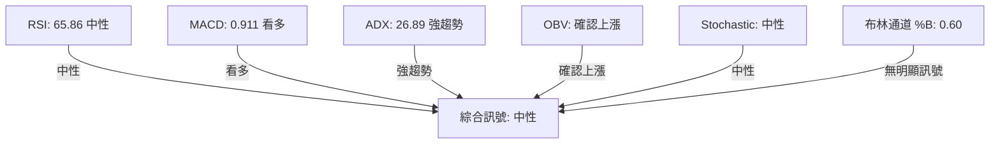
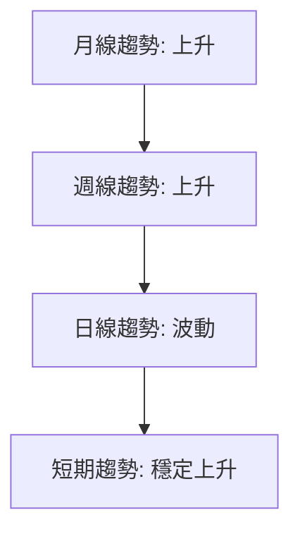
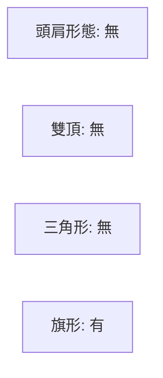

# RCAT 技術分析報告
> **報告日期**：2026-03-20 ｜ **語言**：繁體中文 ｜ **數據來源**：Yahoo Finance

## 目錄
1. 技術面概覽
2. 趨勢分析（多時框架）
3. 圖表形態分析
4. 支撐與阻力（精確數值）
5. 技術指標深度解讀
6. 量價分析
7. 多時框架訊號總結
8. 交易策略建議（精確數值）
9. 風險提示與監控

## 1. 技術面概覽

### 核心指標速覽表
| 指標   | 值    | 訊號       | 評分 🟢🟡🔴 |
|--------|-------|------------|-----------|
| MA20   | $14.52| 上方       | 🟢       |
| MA50   | $13.81| 上方       | 🟢       |
| MA200  | $10.40| 上方       | 🟢       |
| RSI(14)| 65.86 | 中性       | 🟡       |
| MACD   | 0.911 | 看多       | 🟢       |
| Stoch  | 中性  | 中性       | 🟡       |
| ADX(14)| 26.89 | 強趨勢     | 🟢       |
| ATR(14)| $2.30 | 15.19%波動 | 🟢       |
| OBV    | 確認上漲 | 確認     | 🟢       |

### 技術綜合評分（1-10分）
▓▓▓▓▓▓▓░░░ `7/10`

### 52週價格位置分析
目前價格 $15.14，位於52週高/低 ($18.78 / $4.60) 的74.3%，處於較高價位區間。

## 2. 趨勢分析（多時框架）

### ADX 趨勢強度解讀
當前ADX值26.89，顯示存在一定強度的趨勢市場。`+DI`高於`-DI`，多頭主導。

### 均線排列
均線呈現多頭排列：MA20 > MA50 > MA200，顯示中長期上升趨勢。

### 長/中/短期趨勢
▓▓▓▓▓▓▓▓▓▓ `長期`  
▓▓▓▓▓▓▓▓▓▓ `中期`  
▓▓▓▓▓▓▓░░░ `短期`

## 3. 圖表形態分析

### ASCII 走勢示意圖
```
    $18.00  ──────┐
    $16.00  ───┐  │  ┌─── 最高價
    $15.14  ───┼──┼─❚─── 當前價
    $14.00  ───┘  │  └───
    $12.00  ──────┘
```
### 形態目標價計算
旗形目標價：$17.00 (計算方式：旗杆高度加至旗形突破點)

### 近期重要 K 線組合分析
留意最近一週的陰線，可能預示短期調整。