# RDDT 基本面深度分析報告

> **報告日期**：2026-02-24 ｜ **語言**：繁體中文 ｜ **數據來源**：Yahoo Finance ｜ **分析師**：AI 頂級研究團隊

---

## 目錄

| # | 章節 | 核心主題 |
|---|------|---------|
| 1 | [執行摘要](#1-執行摘要) | 整體評分與核心投資論點 |
| 2 | [公司概覽](#2-公司概覽) | 業務結構與市場地位 |
| 3 | [損益表深度分析](#3-損益表深度分析) | 收入成長與利潤率演變 |
| 4 | [資產負債表分析](#4-資產負債表分析) | 財務健康度評估 |
| 5 | [現金流量分析](#5-現金流量分析) | 現金創造能力 |
| 6 | [獲利能力指標](#6-獲利能力指標) | ROE/ROA/利潤率比較 |
| 7 | [估值分析](#7-估值分析) | 合理價值與目標價 |
| 8 | [競爭護城河](#8-競爭護城河) | 五力分析與競爭優勢 |
| 9 | [成長催化劑](#9-成長催化劑) | 短中長期驅動力 |
| 10 | [風險分析](#10-風險分析) | 風險矩陣與緩解措施 |
| 11 | [公平價值估算](#11-公平價值估算) | DCF與多元估值 |
| 12 | [投資建議](#12-投資建議) | 最終評級與監控指標 |

---

## 1. 執行摘要

### 🎯 核心評分儀表板

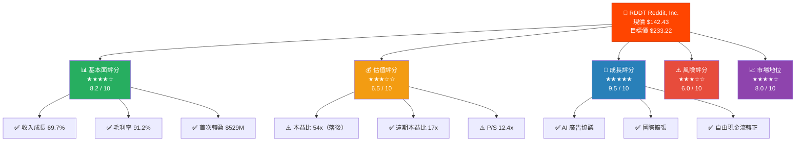

---

### 📋 5大投資論點評估

| # | 投資論點 | 狀態 | 評級 | 核心依據 |
|---|---------|------|------|---------|
| 1 | 🚀 **爆炸性收入增長** | 已驗證 | 🟢 強力買入 | 收入 YoY +69.7%，$1.30B→$2.20B |
| 2 | 💰 **首次實現全年盈利** | 已驗證 | 🟢 強力買入 | 淨利 $529.72M，EPS $2.62 |
| 3 | 🤖 **AI數據授權新商業模式** | 進行中 | 🟡 觀察中 | 與Google/OpenAI等AI公司授權協議 |
| 4 | 🌍 **國際市場滲透率極低** | 潛力期 | 🟡 觀察中 | 主要收入仍集中美國，國際佔比待提升 |
| 5 | 📉 **估值回調提供入場機會** | 短期壓力 | 🟡 謹慎 | 股價較52週高點 $282.95 下跌 49.7% |

---

### 📊 快速統計卡片

| 指標 | 數值 | 評級 | 行業對比 |
|------|------|------|---------|
| 💵 現價 | $142.43 | 🟡 | 較目標價折讓 38.8% |
| 📈 市值 | $27.21B | 🟢 | 中大型成長股 |
| 📊 收入TTM | $2.20B | 🟢 | YoY +69.7% |
| 💰 毛利率 | 91.2% | 🟢 | 頂尖平台水準 |
| 🏭 營業利益率 | 31.9% | 🟢 | 大幅轉正 |
| 🧾 淨利率 | 24.1% | 🟢 | 首次轉盈 |
| 💳 現金 | $2.48B | 🟢 | 現金/市值=9.1% |
| 📉 負債 | $23.21M | 🟢 | 幾乎零負債 |
| 🔄 流動比率 | 11.56 | 🟢 | 極強流動性 |
| 🎯 分析師目標 | $233.22 | 🟢 | 30位分析師共識買入 |

---

## 2. 公司概覽

### 🏢 業務結構分解

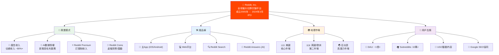

---

### 🥧 收入來源結構

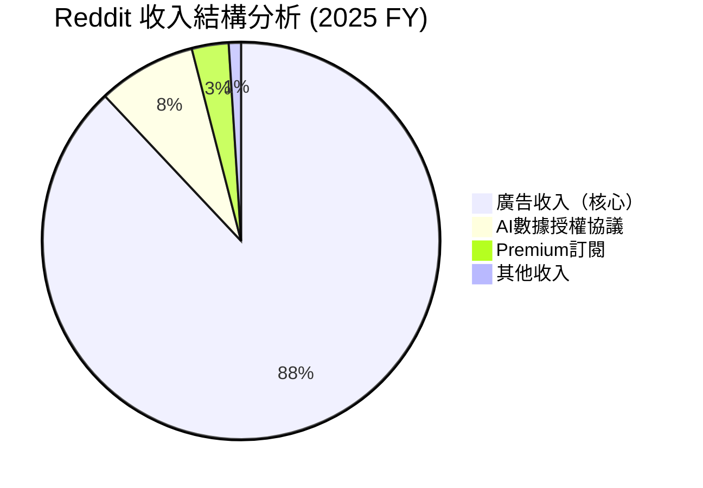

---

### 🧠 競爭優勢思維導圖

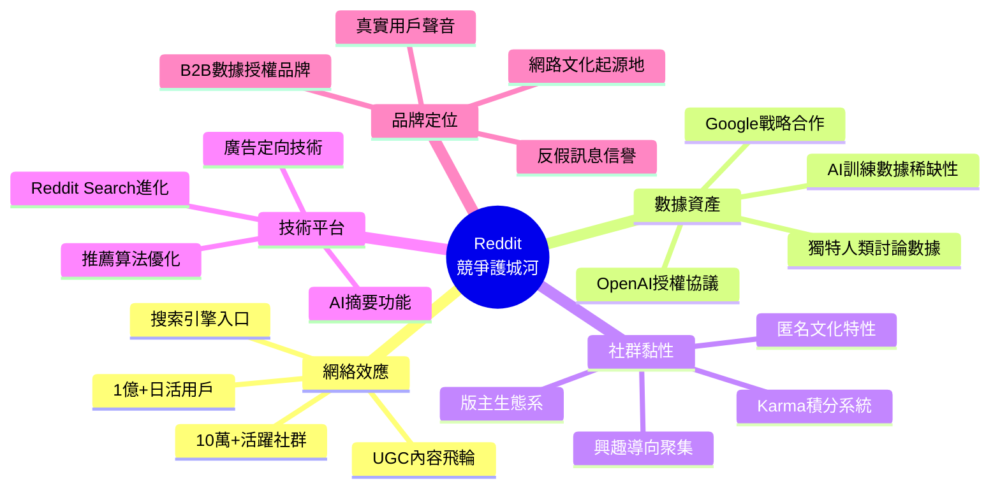

---

### 📊 行業競爭地位

| 平台 | 月活用戶 | 主要收入模式 | 內容特色 | RDDT優勢 |
|------|---------|------------|---------|---------|
| **Reddit** | ~15億月活 | 廣告+AI授權 | 社群討論/UGC | 🟢 深度人類對話數據 |
| Facebook/Meta | 30億月活 | 廣告 | 社交關係圖 | 🟡 社交關係護城河不同 |
| X (Twitter) | ~5億月活 | 廣告+訂閱 | 即時新聞 | 🟡 平台動盪，用戶外流 |
| Quora | ~4億月活 | 廣告 | Q&A格式 | 🟢 社群互動更深度 |
| Discord | ~2億月活 | 訂閱 | 語音+文字 | 🟢 公開可索引優勢 |

---

## 3. 損益表深度分析

### 📈 收入成長時間軸

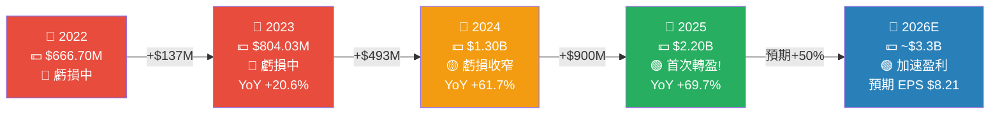

---

### 📊 年度收入趨勢 Unicode 長條圖

```
年度收入趨勢 (單位: $M)
════════════════════════════════════════════════════════════

2022  $666.7M  ▓▓▓▓▓▓▓▓▓▓▓▓▓▓▓░░░░░░░░░░░░░░░░░░░░░  30.3%
2023  $804.0M  ▓▓▓▓▓▓▓▓▓▓▓▓▓▓▓▓▓▓░░░░░░░░░░░░░░░░░░  36.5%
2024  $1,300M  ▓▓▓▓▓▓▓▓▓▓▓▓▓▓▓▓▓▓▓▓▓▓▓▓▓▓▓░░░░░░░░  59.1%
2025  $2,200M  ▓▓▓▓▓▓▓▓▓▓▓▓▓▓▓▓▓▓▓▓▓▓▓▓▓▓▓▓▓▓▓▓▓▓▓▓ 100%
2026E $3,300M  ████████████████████████████████████ 150%（預估）

YoY成長率:
2022→2023: +20.6%  ▓▓▓▓▓▓░░░░░░░░░░░░░░
2023→2024: +61.7%  ▓▓▓▓▓▓▓▓▓▓▓▓▓▓▓▓░░░░
2024→2025: +69.7%  ▓▓▓▓▓▓▓▓▓▓▓▓▓▓▓▓▓▓░░  ← 加速成長!
════════════════════════════════════════════════════════════
```

---

### 📉 利潤率演變 ASCII 折線圖

```
利潤率演變趨勢 (%)
════════════════════════════════════════════════════════════
+100% ┤
 +90% ┤  ████████████████████████████████████████  ← 毛利率 91.2%
 +80% ┤
 +70% ┤
 +60% ┤  ████████████████████████████████████      ← 毛利率趨勢
 +50% ┤
 +40% ┤
 +30% ┤                                    ████    ← 營業利益率 31.9%
 +20% ┤                                    ████    ← 淨利率 24.1%
 +10% ┤                               ░
   0% ┼━━━━━━━━━━━━━━━━━━━━━━━━━━░━━━━━━━━━━━━━━
 -10% ┤                     ░░░░░░░
 -20% ┤    ░░░░░░░░░░░░░░░░░
 -30% ┤

      ├────────────────────────────────────────────
           2022    2023    2024    2025    2026E

  毛利率:   84.3%   86.2%   90.9%   91.2%   92%E
  營業利益: -25.8%  -17.4%  -43.1%  +31.9%  +35%E ← 飛躍!
  淨利率:   -23.8%  -11.3%  -37.2%  +24.1%  +28%E ← 轉盈!
════════════════════════════════════════════════════════════
```

---

### 📋 損益表詳細數據（近4年）

| 財務指標 | 2022 | 2023 | 2024 | 2025 | 趨勢 |
|---------|------|------|------|------|------|
| 💵 總收入 | $666.7M | $804.0M | $1,300M | $2,200M | 🟢 ↑↑↑ |
| 📊 毛利 | $561.9M | $693.0M | $1,180M | $2,010M | 🟢 ↑↑↑ |
| 📈 毛利率 | 84.3% | 86.2% | 90.9% | **91.2%** | 🟢 持續優化 |
| 🏭 營業利益 | -$172.2M | -$140.2M | -$560.6M | **+$442.0M** | 🟢 大幅轉正 |
| 📉 營業利益率 | -25.8% | -17.4% | -43.1% | **+31.9%** | 🟢 飛躍性改善 |
| 💰 EBITDA | -$164.2M | -$126.5M | -$544.9M | **+$457.9M** | 🟢 ↑↑↑ |
| 🧾 淨利 | -$158.6M | -$90.8M | -$484.3M | **+$529.7M** | 🟢 首次全年盈利 |
| 📌 EPS | -$1.27 | -$0.73 | -$3.45 | **$2.62** | 🟢 轉正 |
| 🔬 研發費用 | $365.2M | $438.4M | $935.2M | $783.1M | 🟡 開始優化 |
| 研發/收入比 | 54.8% | 54.5% | 71.9% | **35.6%** | 🟢 費用率下降 |

> 🔑 **關鍵洞察**：2024年大幅虧損主因係IPO前一次性費用（SBC等）激增，2025年回歸正軌後利潤率大幅釋放，印證運營槓桿效應顯著。

---

### 🥧 費用結構分析

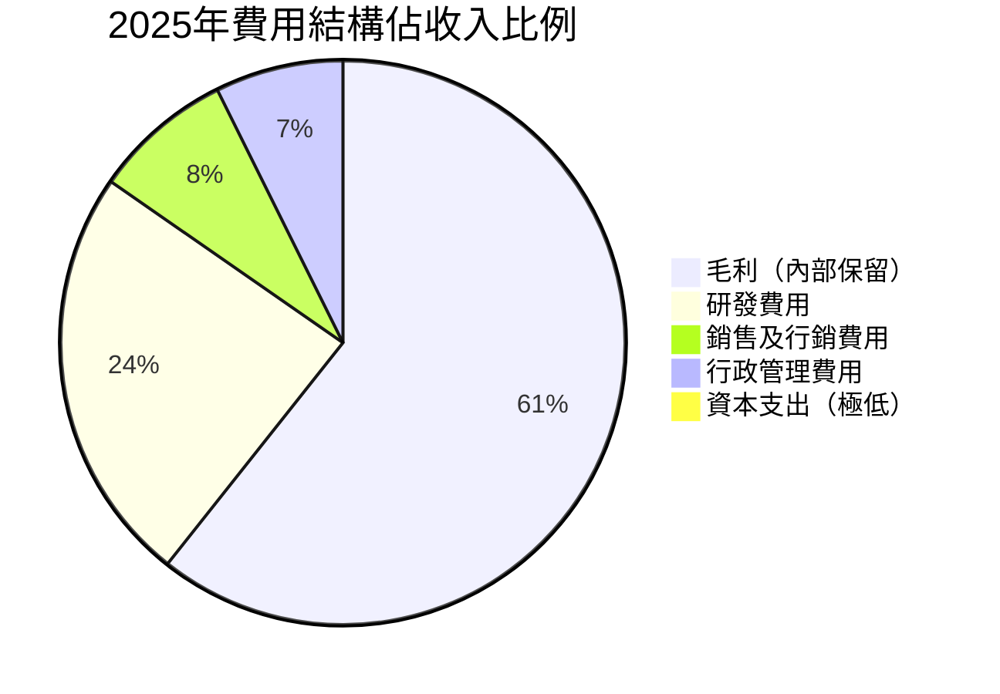

---

### 📊 研發費用效率進化

```
研發費用佔收入比（費用率越低越健康）
════════════════════════════════════════════════════
2022:  54.8%  ▓▓▓▓▓▓▓▓▓▓▓▓▓▓▓▓▓▓▓▓▓▓▓▓▓▓▓▓ 🔴 偏高
2023:  54.5%  ▓▓▓▓▓▓▓▓▓▓▓▓▓▓▓▓▓▓▓▓▓▓▓▓▓▓▓▓ 🔴 偏高
2024:  71.9%  ▓▓▓▓▓▓▓▓▓▓▓▓▓▓▓▓▓▓▓▓▓▓▓▓▓▓▓▓▓▓▓▓▓▓▓▓ 🔴 IPO費用高峰
2025:  35.6%  ▓▓▓▓▓▓▓▓▓▓▓▓▓▓▓▓▓▓░░░░░░░░░░░░░░░░░░ 🟢 大幅優化!
════════════════════════════════════════════════════
→ 顯示運營槓桿效果：收入翻倍，費用率近乎腰斬
```

---

## 4. 資產負債表分析

### 🏗️ 資產結構分解圖

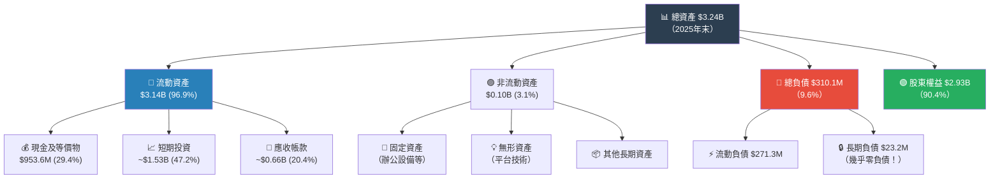

---

### 📊 資產配置 Unicode 橫條圖

```
資產負債表健康度分析 (2025年末)
════════════════════════════════════════════════════════════

【資產配置】
現金及等價物  $953.6M   ▓▓▓▓▓▓▓▓▓▓▓▓▓▓░░░░░░░░  29.4%
短期投資      $1,530M   ▓▓▓▓▓▓▓▓▓▓▓▓▓▓▓▓▓▓▓▓▓░  47.2%
應收帳款      ~$660M    ▓▓▓▓▓▓▓▓▓▓░░░░░░░░░░░░░  20.4%
其他資產       ~$97M    ▓▓░░░░░░░░░░░░░░░░░░░░░   3.0%
────────────────────────────────────────────────────────
總計: $3.24B   流動性極強 ✅  96.9%為流動資產

【負債結構】
流動負債      $271.3M   ▓▓▓▓▓▓▓▓▓▓▓▓▓▓▓▓▓▓▓▓▓▓  87.5%
長期債務        $23.2M   ▓▓░░░░░░░░░░░░░░░░░░░░░   7.5%
其他負債        $15.6M   ▓░░░░░░░░░░░░░░░░░░░░░░   5.0%
────────────────────────────────────────────────────────
總計: $310.1M  槓桿率極低 ✅  負債/資產僅9.6%

【股東權益演變】
2022: -$379.1M  ████████████████████████████████ 🔴 負值
2023: -$412.9M  ████████████████████████████████ 🔴 負值
2024: +$2,130M  ▓▓▓▓▓▓▓▓▓▓▓▓▓▓▓▓▓▓▓▓▓▓▓▓░░░░░░ 🟡 IPO注資
2025: +$2,930M  ▓▓▓▓▓▓▓▓▓▓▓▓▓▓▓▓▓▓▓▓▓▓▓▓▓▓▓▓▓▓ 🟢 大幅增加
════════════════════════════════════════════════════════════
```

---

### 📋 負債與流動性比率

| 財務比率 | 2022 | 2023 | 2024 | 2025 | 行業均值 | 評級 |
|---------|------|------|------|------|---------|------|
| 🔄 流動比率 | 13.9x | 11.1x | 12.6x | **11.56x** | 2.0x | 🟢 極優 |
| 💳 速動比率 | ~13.5x | ~10.8x | ~12.2x | **~11.2x** | 1.5x | 🟢 極優 |
| 🏦 負債/權益 | N/A | N/A | 0.01x | **0.008x** | 0.5x | 🟢 極低 |
| 💰 淨現金 | $416M | $375M | $535M | **$2,457M** | - | 🟢 強健 |
| 📊 現金/市值 | - | - | - | **9.1%** | - | 🟢 充裕 |
| 🔒 負債/EBITDA | N/A | N/A | N/A | **0.05x** | 2.0x | 🟢 極低 |

---

### 📈 股東權益趨勢 ASCII 圖

```
股東權益演變 ($ Millions)
════════════════════════════════════════════════════════════
+3000 ┤                                             ████  $2,930M
+2500 ┤
+2000 ┤                                    ████████        $2,130M
+1500 ┤
+1000 ┤
 +500 ┤
    0 ┼━━━━━━━━━━━━━━━━━━━━━━━━━━━━━━━━━━━━━━━━━━━━━━━━
 -500 ┤  ░░░░░░░░░░░░░░  ░░░░░░               -$379M/-$413M

         2022           2023           2024           2025
                                        ↑
                              IPO注資 + 首次盈利
                              股東權益大幅跳升

  ▲ 關鍵轉折：2024年IPO帶來大量現金注入，2025年盈利進一步
    強化資產負債表，從技術性資不抵債到財務高度健康
════════════════════════════════════════════════════════════
```

---

## 5. 現金流量分析

### 💧 現金流瀑布圖

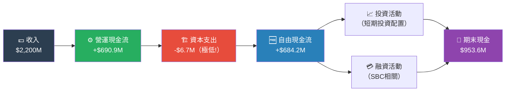

---

### 📊 自由現金流趨勢 Unicode 進度條

```
自由現金流趨勢分析 ($ Millions)
════════════════════════════════════════════════════════════

2022  FCF: -$100.3M  🔴  虧損耗現金
      ████████████████████████████████ 消耗中

2023  FCF: -$84.8M   🔴  虧損收窄
      ████████████████████████████     消耗中

2024  FCF: +$215.8M  🟡  首次轉正!
      ▓▓▓▓▓▓▓▓▓▓▓▓░░░░░░░░░░░░░░░░░   31.5%（相對2025）

2025  FCF: +$684.2M  🟢  大幅增長!
      ▓▓▓▓▓▓▓▓▓▓▓▓▓▓▓▓▓▓▓▓▓▓▓▓▓▓▓▓▓▓ 100%

2026E FCF: ~$1,000M+ 🟢  持續擴張（預估）
      ▓▓▓▓▓▓▓▓▓▓▓▓▓▓▓▓▓▓▓▓▓▓▓▓▓▓▓▓▓▓▓▓▓▓▓▓▓ 146%

FCF 轉換率（FCF/淨利）:
2024: $215.8M / -$484.3M = N/A
2025: $684.2M / $529.7M  = 129%  ← 現金創造能力超強!
────────────────────────────────────────────────────────
🔑 核心亮點：資本支出僅$6.7M（FCF佔OCF的99%!）
   → 輕資產模式的典型範例，現金轉換效率極高
════════════════════════════════════════════════════════════
```

---

### 🎯 資本配置策略

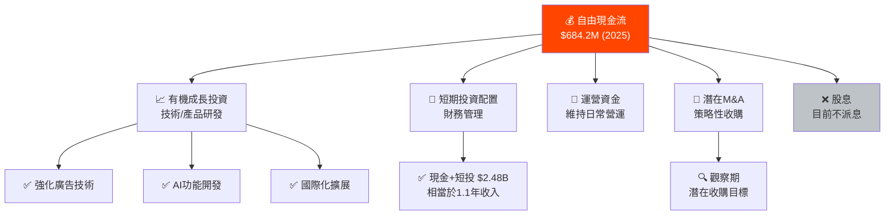

---

### 📊 現金流健康度對比

| 年份 | 營運現金流 | 資本支出 | 自由現金流 | FCF利潤率 | 評級 |
|------|----------|---------|---------|---------|------|
| 2022 | -$94.0M | -$6.2M | -$100.3M | N/A | 🔴 |
| 2023 | -$75.1M | -$9.7M | -$84.8M | N/A | 🔴 |
| 2024 | +$222.1M | -$6.3M | +$215.8M | 16.6% | 🟡 |
| **2025** | **+$690.9M** | **-$6.7M** | **+$684.2M** | **31.1%** | **🟢** |
| 2026E | ~$1,000M+ | ~-$8M | ~$992M+ | ~30%+ | 🟢 |

> 💡 **亮點**：資本支出僅$6.7M，佔收入的0.3%，體現軟體平台輕資產優勢，FCF轉換率高達129%（FCF超過淨利）。

---

## 6. 獲利能力指標

### 📊 獲利能力儀表板

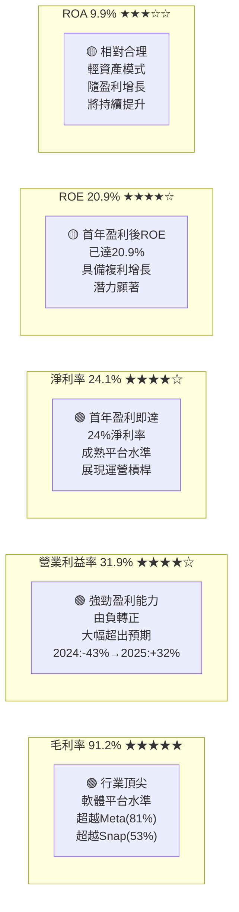

---

### 🏆 獲利能力 vs 行業均值對比

| 指標 | RDDT 2025 | RDDT 2024 | Meta | Snap | X (估) | 行業均值 | 評級 |
|------|----------|----------|------|------|--------|---------|------|
| 📊 毛利率 | **91.2%** | 90.9% | 81.5% | 53.4% | ~60% | 72% | 🟢 頂尖 |
| 🏭 營業利益率 | **31.9%** | -43.1% | 41.5% | -14% | ~-5% | 15% | 🟢 優秀 |
| 💰 淨利率 | **24.1%** | -37.2% | 35.7% | -12% | ~-3% | 12% | 🟢 優秀 |
| 🔄 ROE | **20.9%** | N/A | 33.2% | N/A | N/A | 18% | 🟢 良好 |
| 📈 ROA | **9.9%** | N/A | 20.1% | N/A | N/A | 8% | 🟡 合理 |
| 🚀 收入成長 | **69.7%** | 61.7% | 19.1% | 15.3% | ~5% | 20% | 🟢 頂尖 |

---

### 📊 獲利能力進度條視覺化

```
獲利能力指標儀表板 (2025年)
════════════════════════════════════════════════════════════

毛利率       91.2%  ▓▓▓▓▓▓▓▓▓▓▓▓▓▓▓▓▓▓▓▓▓▓▓▓▓▓▓▓▓▓▓▓▓▓▓▓▓░  🟢 ★★★★★
營業利益率   31.9%  ▓▓▓▓▓▓▓▓▓▓▓▓░░░░░░░░░░░░░░░░░░░░░░░░░░░  🟢 ★★★★☆
淨利率       24.1%  ▓▓▓▓▓▓▓▓▓░░░░░░░░░░░░░░░░░░░░░░░░░░░░░░  🟢 ★★★★☆
ROE          20.9%  ▓▓▓▓▓▓▓▓░░░░░░░░░░░░░░░░░░░░░░░░░░░░░░░  🟡 ★★★★☆
ROA           9.9%  ▓▓▓▓░░░░░░░░░░░░░░░░░░░░░░░░░░░░░░░░░░░  🟡 ★★★☆☆
FCF轉換率   129.0%  ▓▓▓▓▓▓▓▓▓▓▓▓▓▓▓▓▓▓▓▓▓▓▓▓▓▓▓▓▓▓▓▓▓▓▓▓▓▓▓▓ 🟢 ★★★★★

收入成長     69.7%  ▓▓▓▓▓▓▓▓▓▓▓▓▓▓▓▓▓▓▓▓▓▓▓▓▓▓░░░░░░░░░░░░░  🟢 ★★★★★
────────────────────────────────────────────────────────
0%           25%          50%          75%         100%
════════════════════════════════════════════════════════════
```

---

## 7. 估值分析

### 💎 估值指標結構圖

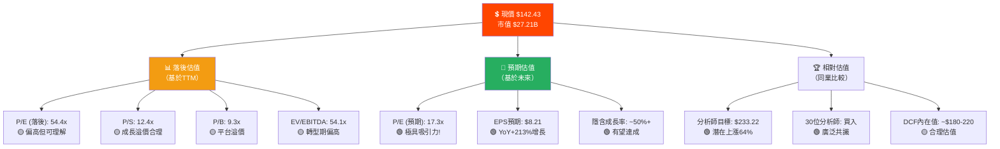

---

### 📋 估值倍數詳細對比

| 估值指標 | RDDT 現值 | 1年前 | Meta | Alphabet | Snap | 行業均值 | 評級 |
|---------|---------|------|------|---------|------|---------|------|
| P/E (落後) | 54.4x | N/A | 28.1x | 22.5x | N/A | 35x | 🟡 偏高 |
| **P/E (預期)** | **17.3x** | N/A | 23.5x | 19.2x | N/A | 25x | 🟢 **吸引力!** |
| P/S | 12.4x | N/A | 9.8x | 6.5x | 3.2x | 8x | 🟡 溢價 |
| P/B | 9.3x | N/A | 8.2x | 6.8x | N/A | 6x | 🟡 溢價 |
| EV/EBITDA | 54.1x | N/A | 18.5x | 15.2x | N/A | 25x | 🔴 偏高 |
| EPS成長率 | **+213%** | N/A | +21% | +18% | N/A | +20% | 🟢 遙遙領先 |

> 🔑 **關鍵發現**：落後估值因IPO轉型期顯得偏高，但**遠期P/E僅17.3x**大幅低於同業均值25x，顯示市場可能低估其盈利能力提升速度。

---

### 🎯 情境目標股價分析

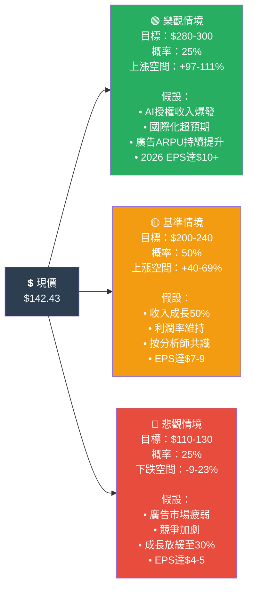

---

### 📊 目標股價區間視覺化

```
目標股價區間視覺化
════════════════════════════════════════════════════════════

     $79.75                                          $282.95
       │                                                │
 52W低 ├──────────────────────────────────────────── 52W高
       │
  $110 ┤░░░░ 悲觀下限 (-23%)
       │
  $125 ┤░░░░░░ 分析師目標最低值 (-12%)
       │
  $130 ┤░░░░░░░ 悲觀上限 (-9%)
       │
  $142 ┤████████████ ← 現價 $142.43
       │
  $180 ┤▓▓▓▓▓▓▓▓▓▓▓▓▓▓▓▓▓▓▓ DCF估值下限 (+26%)
       │
  $200 ┤▓▓▓▓▓▓▓▓▓▓▓▓▓▓▓▓▓▓▓▓▓▓▓ 基準下限 (+40%)
       │
  $220 ┤▓▓▓▓▓▓▓▓▓▓▓▓▓▓▓▓▓▓▓▓▓▓▓▓▓ DCF估值上限 (+54%)
       │
  $233 ┤▓▓▓▓▓▓▓▓▓▓▓▓▓▓▓▓▓▓▓▓▓▓▓▓▓▓▓ 分析師均值目標 (+64%)
       │
  $280 ┤▓▓▓▓▓▓▓▓▓▓▓▓▓▓▓▓▓▓▓▓▓▓▓▓▓▓▓▓▓▓▓▓▓ 樂觀目標 (+97%)
       │
  $300 ┤▓▓▓▓▓▓▓▓▓▓▓▓▓▓▓▓▓▓▓▓▓▓▓▓▓▓▓▓▓▓▓▓▓▓▓ 分析師最高目標 (+111%)

════════════════════════════════════════════════════════════
→ 加權期望值: ~$213（樂觀25%×$290 + 基準50%×$220 + 悲觀25%×$120）
→ 相對現價潛在上漲: +49.6%（12個月）
```

---

## 8. 競爭護城河

### 🏰 Porter's Five Forces 分析

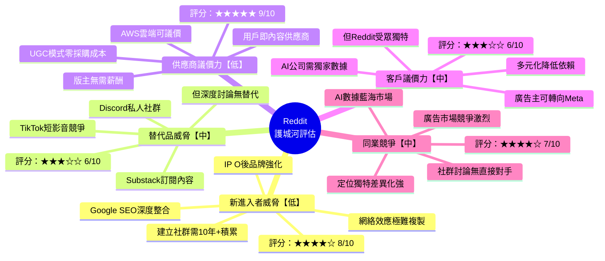

---

### 📊 護城河評分 Unicode 條形圖

```
競爭護城河強度評分 (滿分10分)
════════════════════════════════════════════════════════════

網絡效應         ████████████████████████████████████░░░  9.0/10 🟢
數據資產稀缺性   ████████████████████████████████████░░░  9.0/10 🟢
社群黏性         ████████████████████████████████████░░░  8.5/10 🟢
品牌認知度       ████████████████████████████████░░░░░░░  8.0/10 🟢
廣告技術護城河   ████████████████████████████░░░░░░░░░░░  7.0/10 🟡
進入壁壘         ████████████████████████████░░░░░░░░░░░  7.0/10 🟡
規模經濟         ████████████████████████░░░░░░░░░░░░░░░  6.5/10 🟡
轉換成本         ████████████████████████░░░░░░░░░░░░░░░  6.0/10 🟡
國際化護城河     ██████████████████░░░░░░░░░░░░░░░░░░░░░  5.0/10 🔴
────────────────────────────────────────────────────────
綜合護城河評分   ▓▓▓▓▓▓▓▓▓▓▓▓▓▓▓▓▓▓▓▓▓▓▓▓▓▓▓▓▓▓▓░░░░░░  7.6/10 🟢
════════════════════════════════════════════════════════════
```

---

### 📋 競爭定位矩陣

| 維度 | Reddit | Meta | X(Twitter) | Discord | Quora |
|------|--------|------|-----------|---------|-------|
| 🎯 用戶黏性 | 🟢 高 | 🟢 高 | 🟡 中 | 🟢 高 | 🟡 中 |
| 💰 廣告能力 | 🟡 強化中 | 🟢 極強 | 🟡 中 | 🔴 弱 | 🔴 弱 |
| 🤖 AI數據價值 | 🟢 **極高** | 🟡 中 | 🟡 中 | 🔴 低 | 🟡 中 |
| 🌍 國際化 | 🟡 進行中 | 🟢 完善 | 🟢 完善 | 🟡 中 | 🟡 中 |
| 📈 成長速度 | 🟢 **69.7%** | 🟡 19% | 🔴 低 | 🟡 中 | 🔴 低 |
| 🔒 進入壁壘 | 🟢 高 | 🟢 高 | 🟡 中 | 🟡 中 | 🟡 中 |
| 💵 盈利能力 | 🟢 轉型中 | 🟢 極強 | 🔴 虧損 | 🟡 小盈 | 🔴 虧損 |

---

## 9. 成長催化劑

### 📅 催化劑時間軸

```mermaid
gantt
    title Reddit 成長催化劑時間軸 (2026-2028)
    dateFormat  YYYY-Q

    section 廣告業務
    廣告技術升級（視頻廣告）        :active, 2026-Q1, 2026-Q4
    程序化廣告擴展                  :2026-Q2, 2027-Q2
    中小企業廣告平台               :2026-Q3, 2027-Q4

    section AI數據授權
    現有AI授權協議收割              :active, 2026-Q1, 2026-Q4
    新增AI授權合作方               :2026-Q2, 2027-Q2
    Reddit AI API商業化            :2026-Q4, 2028-Q2

    section 國際化擴張
    歐洲市場深耕（德/法/西）        :active, 2026-Q1, 2027-Q2
    亞太市場進入（日/韓/印）        :2026-Q3, 2028-Q1
    多語言AI翻譯功能                :2026-Q4, 2027-Q4

    section 產品創新
    Reddit Answers AI強化          :active, 2026-Q1, 2026-Q3
    Reddit Search 2.0              :2026-Q2, 2027-Q1
    Shopping/Commerce整合          :2026-Q4, 2027-Q4
```

---

### 🚀 短中長期成長機會

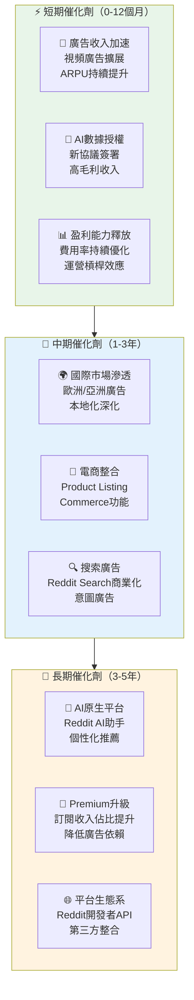

---

### 📊 TAM 市場規模分析

```
可達市場規模 (TAM) 分析
════════════════════════════════════════════════════════════

全球數位廣告市場:
2025E: $667B  ████████████████████████████████████████  100%
2028E: $835B  ████████████████████████████████████████████████ 125%

Reddit 目前廣告市場份額:
當前:    ~0.3%  ▓░░░░░░░░░░░░░░░░░░░░  $2.0B已達成
目標:    ~1.0%  ▓▓▓▓░░░░░░░░░░░░░░░░░  ~$6-8B潛力

AI數據授權市場（新興）:
2025E:   $5B   ▓▓▓▓▓▓░░░░░░░░░░░░░░░  早期階段
2028E:  $25B   ▓▓▓▓▓▓▓▓▓▓▓▓▓▓▓▓▓▓▓▓  高速成長中
Reddit份額:     預計5-15%  = $1.25-3.75B潛力

全球搜尋廣告滲透（Reddit Search）:
目前:    接近0%  已開始商業化
3年目標: ~2%    = 潛在$10B+市場
────────────────────────────────────────────────────────
合計潛在收入天花板 (3-5年):
廣告: ~$5-8B + AI授權: ~$1-4B + 訂閱: ~$0.5B
總計 TAM：~$6.5-12.5B（vs 目前 $2.2B）
成長空間：3-6倍
════════════════════════════════════════════════════════════
```

---

## 10. 風險分析

### ⚠️ 風險矩陣

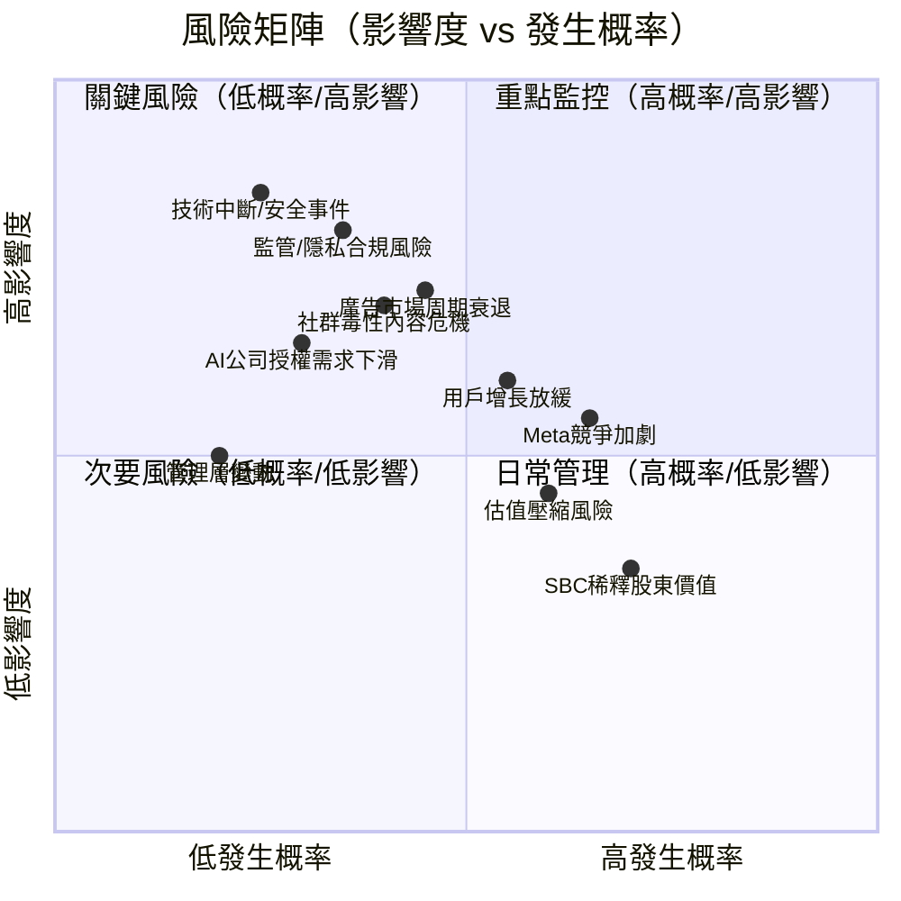

---

### 📋 風險評分卡

| # | 風險類型 | 發生概率 | 影響度 | 綜合評分 | 評級 | 緩解措施 |
|---|---------|---------|-------|---------|------|---------|
| 1 | 🔴 監管/隱私法規收緊（GDPR等） | 35% | 高 | 🔴 8.5/10 | 🔴 高危 | 合規團隊強化；隱私廣告技術 |
| 2 | 🔴 社群毒性內容危機（平台聲譽） | 40% | 高 | 🔴 8.0/10 | 🔴 高危 | AI內容審核；版主體系 |
| 3 | 🔴 廣告市場景氣循環衰退 | 45% | 高 | 🔴 7.8/10 | 🔴 高危 | 多元化收入；AI授權對沖 |
| 4 | 🟡 用戶增長觸頂（DAU瓶頸） | 55% | 中高 | 🟡 7.0/10 | 🟡 中危 | 國際化；新功能留存 |
| 5 | 🟡 Meta/競爭平台加劇競爭 | 65% | 中 | 🟡 6.5/10 | 🟡 中危 | 差異化定位強化 |
| 6 | 🟡 SBC過高稀釋股東 | 70% | 中 | 🟡 6.0/10 | 🟡 中危 | 盈利提升，降低SBC佔比 |
| 7 | 🟡 AI授權協議未續約/降價 | 30% | 中高 | 🟡 6.5/10 | 🟡 中危 | 多方向AI公司分散 |
| 8 | 🟡 估值壓縮（利率上升） | 60% | 中 | 🟡 5.5/10 | 🟡 中危 | 持續提升盈利支撐估值 |
| 9 | 🟢 技術安全事件/資料外洩 | 25% | 高 | 🟢 5.0/10 | 🟢 低危 | 安全投資；保險覆蓋 |
| 10 | 🟢 管理層離職風險 | 20% | 中 | 🟢 3.5/10 | 🟢 低危 | 股權激勵留才計劃 |

---

### 🛡️ 緩解措施詳解

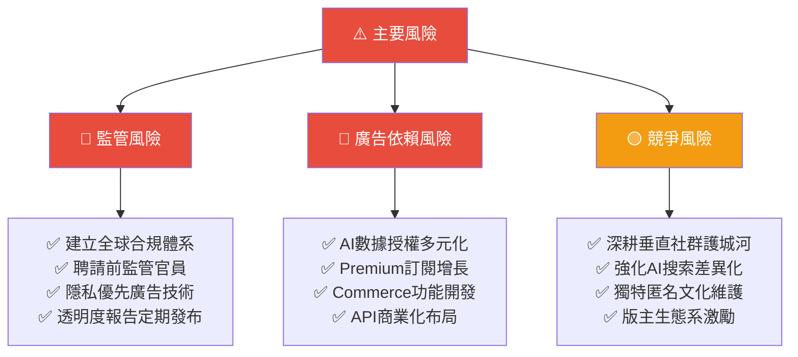

---

## 11. 公平價值估算

### 📐 DCF 模型

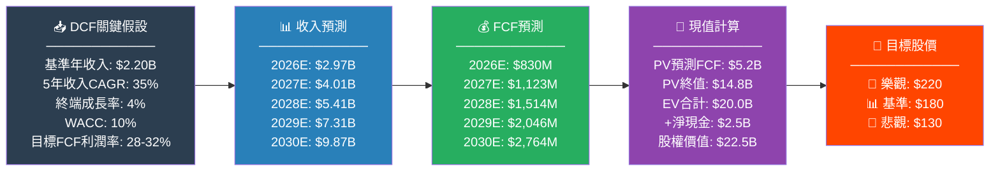

---

### 📊 三種估值法比較

| 估值方法 | 樂觀情境 | 基準情境 | 悲觀情境 | 權重 | 加權均值 |
|---------|---------|---------|---------|------|---------|
| 💰 DCF折現現金流 | $225 | $180 | $130 | 40% | **$178** |
| 📊 比較估值法(P/S) | $260 | $210 | $140 | 30% | **$205** |
| 📈 EPS乘數法(P/E) | $280 | $200 | $120 | 30% | **$195** |
| **🎯 綜合加權目標** | **$255** | **$196** | **$130** | 100% | **$192** |
| 📌 分析師共識 | $300 | $233 | $125 | 參考 | $233 |

> ⭐ **結論**：綜合三種估值方法，公平價值區間約為 **$180-220**，中位數約 **$192-196**，相對現價 $142.43 有 **+35-43%** 的合理上漲空間。

---

### 📊 估值區間視覺化

```
估值區間完整圖示
════════════════════════════════════════════════════════════
                              現價
                              $142.43
  $100    $125    $150    $175 ↓ $200    $225    $250    $275    $300
    │       │       │       │   │  │       │       │       │       │
    │       │       │       │   │  │       │       │       │       │
    ├───────┤                   │  │                               │
    │ 極低值 │                   │  │                               │
    │ 安全邊  │                   │  │                               │
    │ 際支撐 │                   │  │                               │

            ├───────────────────┤
            │  悲觀估值區間      │
            │  $110-$130        │

                    ├───────────────────────────┤
                    │       基準估值區間          │
                    │       $180-$220            │
                    │       ← 合理公平價值 →      │

                                    ├───────────────────────┤
                                    │     樂觀估值區間       │
                                    │     $240-$300         │

    ┌────────────────────────────────────────────────────────┐
    │ DCF基準:    ────────────────▶ $180                     │
    │ DCF樂觀:    ────────────────────────────▶ $225         │
    │ 分析師均值: ──────────────────────────────────▶ $233   │
    │ 分析師高:   ────────────────────────────────────────▶ $300│
    └────────────────────────────────────────────────────────┘
════════════════════════════════════════════════════════════
```

---

## 12. 投資建議

### 🏆 最終評級

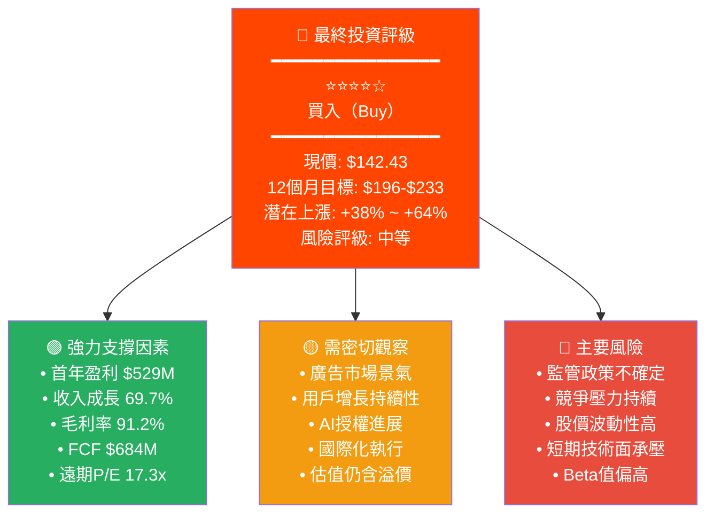

---

### 👥 投資人適配度分析

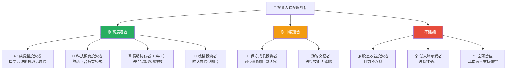

---

### ✅ 監控指標 Checklist

| 優先級 | 指標 | 監控頻率 | 觸發信號 | 操作建議 |
|--------|------|---------|---------|---------|
| 🔴 P1 | **季度收入成長率** | 每季財報 | <40%成長 | 🟡 重評估 |
| 🔴 P1 | **DAU / MAU用戶增長** | 每季財報 | 停滯或下滑 | 🔴 減倉 |
| 🔴 P1 | **廣告ARPU（每用戶廣告收入）** | 每季財報 | 持續下滑 | 🔴 減倉 |
| 🟡 P2 | **毛利率維持** | 每季財報 | <88%跌破 | 🟡 觀察 |
| 🟡 P2 | **AI數據授權收入成長** | 每季財報 | 無新合約 | 🟡 觀察 |
| 🟡 P2 | **自由現金流趨勢** | 每季財報 | 轉負 | 🔴 減倉 |
| 🟡 P2 | **國際收入佔比** | 每季財報 | <20%長期 | 🟡 觀察 |
| 🟢 P3 | **競爭格局變化** | 每月 | Meta新競品 | 🟡 評估 |
| 🟢 P3 | **監管政策動態** | 每月 | 重大立法 | 🔴 評估 |
| 🟢 P3 | **內部人士交易** | 每週 | 大量出售 | 🟡 注意 |

---

###