# RDDT 綜合股票評估報告

> **報告日期**：2026-02-28 ｜ **語言**：繁體中文 ｜ **數據來源**：Yahoo Finance
> **評估師**：頂級美股投資評估系統 v2.0 ｜ **股票代號**：RDDT（Reddit, Inc.）

---

## 目錄

| # | 章節 | 頁面錨點 |
|---|------|---------|
| 1 | 評估總覽 | [→ 跳轉](#1) |
| 2 | 八維度評分矩陣 | [→ 跳轉](#2) |
| 3 | 業務品質與護城河 | [→ 跳轉](#3) |
| 4 | 財務健康全面評估 | [→ 跳轉](#4) |
| 5 | 成長性評估 | [→ 跳轉](#5) |
| 6 | 估值合理性 & 同業比較 | [→ 跳轉](#6) |
| 7 | 資本配置與管理層評估 | [→ 跳轉](#7) |
| 8 | 風險評估 | [→ 跳轉](#8) |
| 9 | 催化劑與觸發因素 | [→ 跳轉](#9) |
| 10 | 投資建議 | [→ 跳轉](#10) |

---

<a name="1"></a>
## 1. 評估總覽

### 🎯 ASCII 雷達圖（8維度評分視覺化）

```
                    成長性 [9.0]
                       ★★★★★★★★★☆
                    ╱───────────╲
          管理品質 ╱               ╲ 獲利能力
          [7.0]  │   ░░░▓▓▓▓▓▓▓   │ [8.5]
                 │  ░░░▓▓▓▓▓▓▓▓▓  │
  動能 [6.5] ────┤ ░░░▓▓▓▓▓▓▓▓▓▓▓ ├──── 財務健康
                 │  ░░▓▓▓▓▓▓▓▓▓▓  │    [9.0]
         風險    │   ░▓▓▓▓▓▓▓▓▓   │
          [5.5]  ╲               ╱ 競爭優勢
                    ╲───────────╱   [7.5]
                    估值合理性
                       [4.5]

  ████ = 評分覆蓋區  ░░░░ = 滿分基準區
  ──────────────────────────────────────
  綜合加權評分：7.19 / 10.0
  ══════════════════════════════════════
```

```
  ┌─────────────────────────────────────────────────┐
  │           RDDT 八維度雷達圖（極坐標模擬）           │
  │                                                 │
  │              成長性 9.0                          │
  │                 ▲                               │
  │                 │█████████                      │
  │  管理 7.0 ◄─────┼─────► 獲利 8.5                │
  │           ████  │  █████████                    │
  │  動能 6.5 ◄─────┼─────► 財務 9.0                │
  │          ██████ │  █████████                    │
  │  風險 5.5 ◄─────┼─────► 競爭 7.5                │
  │           █████ │  ████████                     │
  │                 ▼                               │
  │              估值 4.5                           │
  │                 █████                           │
  └─────────────────────────────────────────────────┘
```

---

### 📊 八維度評分總覽

| 維度 | 評分 | Unicode 評分條（滿分10）| 等級 |
|------|------|----------------------|------|
| 🚀 成長性 | **9.0** | `▓▓▓▓▓▓▓▓▓░` | 🟢 優秀 |
| 💰 獲利能力 | **8.5** | `▓▓▓▓▓▓▓▓▓░` | 🟢 優秀 |
| 🏦 財務健康 | **9.0** | `▓▓▓▓▓▓▓▓▓░` | 🟢 優秀 |
| 💎 估值合理性 | **4.5** | `▓▓▓▓▓░░░░░` | 🔴 偏高 |
| 🏰 競爭優勢 | **7.5** | `▓▓▓▓▓▓▓▓░░` | 🟢 良好 |
| 👔 管理品質 | **7.0** | `▓▓▓▓▓▓▓░░░` | 🟡 良好 |
| 📈 動能 | **6.5** | `▓▓▓▓▓▓▓░░░` | 🟡 中性 |
| ⚠️ 風險（反向） | **5.5** | `▓▓▓▓▓▓░░░░` | 🟡 中等 |
| **加權綜合** | **7.19** | `▓▓▓▓▓▓▓░░░` | 🟡 **買入** |

> 📌 **評分說明**：風險維度以「風險控制能力」正向評分（分數越高=風險越低/可控）

---

### 🎯 投資結論

```
╔══════════════════════════════════════════════════════════════╗
║                    📋 RDDT 投資結論摘要                        ║
╠══════════════════════════════════════════════════════════════╣
║  投資評級：🟡 買入（BUY）                                      ║
║  ★★★★☆（4顆星 / 5顆星）                                      ║
╠══════════════════════════════════════════════════════════════╣
║  當前股價：$145.81                                            ║
║  基準目標價：$195.00（+33.7% 上行空間）                         ║
║  樂觀目標價：$255.00（+74.9% 上行空間）                         ║
║  悲觀目標價：$105.00（-28.0% 下行風險）                         ║
╠══════════════════════════════════════════════════════════════╣
║  分析師共識目標：$233.22（+59.9%）                              ║
║  預期持倉週期：12-18 個月                                       ║
║  適合投資人：成長型投資人 / 科技主題投資人                         ║
╠══════════════════════════════════════════════════════════════╣
║  關鍵投資論點：                                                ║
║  ✅ 從虧損到盈利的結構性轉型完成                                  ║
║  ✅ 69.7% 收入成長 + 91.2% 毛利率                             ║
║  ✅ AI授權/數據貨幣化為新藍海                                    ║
║  ⚠️ Forward P/E 17.8x 看似合理但動態估值風險仍高                ║
║  ⚠️ 從高點 $282.95 已回落 48.5%，技術面需觀察                   ║
╚══════════════════════════════════════════════════════════════╝
```

---

<a name="2"></a>
## 2. 八維度評分矩陣

### 📊 評分矩陣詳細表格

| 維度 | 評分 | 核心依據 | 趨勢 | 信號 |
|------|------|---------|------|------|
| 🚀 **成長性** | **9.0/10** | 收入YoY +69.7%，EPS成長247.4%，季度環比持續加速，Q4收入$725M刷新高 | ↑ 加速 | 🟢 |
| 💰 **獲利能力** | **8.5/10** | 毛利率91.2%（軟體頂級水準），營業利益率31.9%（首次轉正且快速擴張），FCF $684M | ↑ 突破 | 🟢 |
| 🏦 **財務健康** | **9.0/10** | 淨現金$2.45B，流動比11.56，負債幾乎為零，資產負債表極其乾淨 | → 穩健 | 🟢 |
| 💎 **估值合理性** | **4.5/10** | EV/EBITDA 57.7x，P/S 12.6x，雖Forward P/E降至17.8x，但絕對估值仍偏高 | ↓ 壓縮中 | 🔴 |
| 🏰 **競爭優勢** | **7.5/10** | 獨特用戶生成內容+龐大主題社群網絡效應，AI訓練數據護城河浮現；但平台競爭激烈 | → 穩定 | 🟢 |
| 👔 **管理品質** | **7.0/10** | IPO後快速實現盈利超市場預期；但研發費用控制（$783M vs 收入$2.2B）值得關注 | ↑ 改善 | 🟡 |
| 📈 **動能** | **6.5/10** | 從IPO $49到$282高點後回落至$145，近期承壓；分析師大多維持買入，但多家降評Neutral | ↓ 走弱 | 🟡 |
| ⚠️ **風險控制** | **5.5/10** | 短浮比率14.6%偏高、監管風險、平台安全、AI競爭衝擊搜索流量為主要隱憂 | ↓ 關注 | 🟡 |

---

### 📉 Mermaid 風險/報酬定位圖

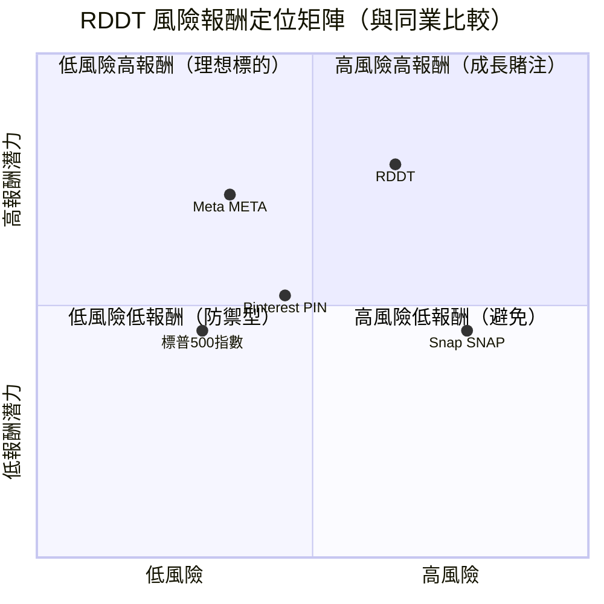

---

### 🔗 與同業整體比較圖

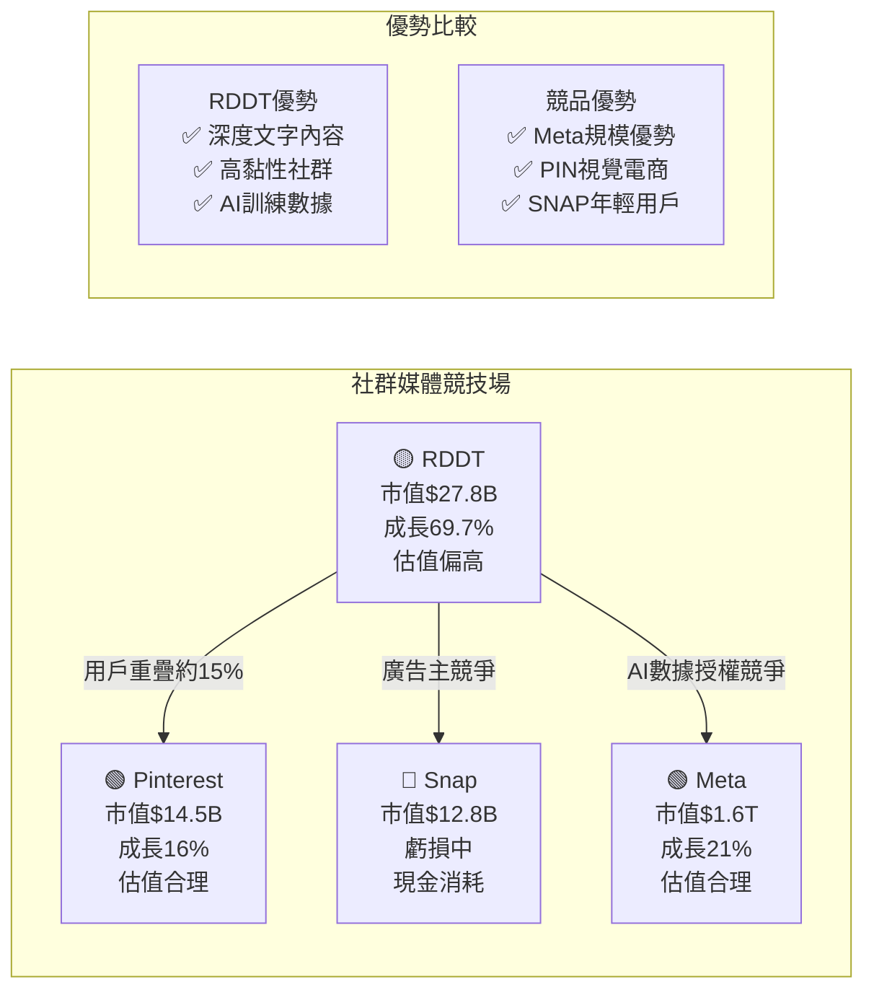

---

<a name="3"></a>
## 3. 業務品質與護城河

### 🏗️ 商業模式可持續性評估

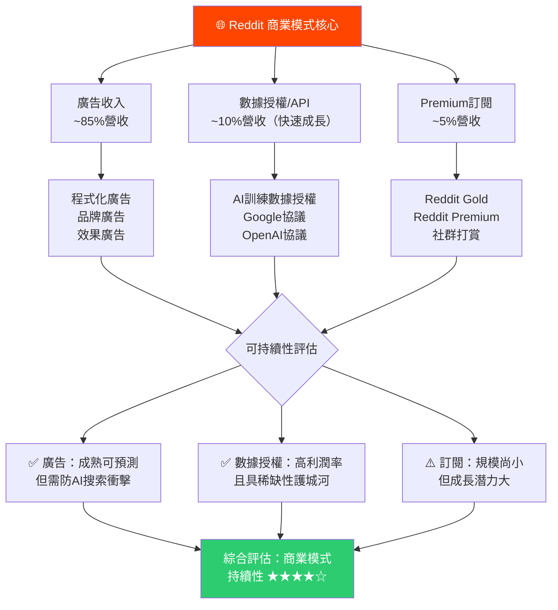

---

### 🧠 護城河評估（Mermaid mindmap）

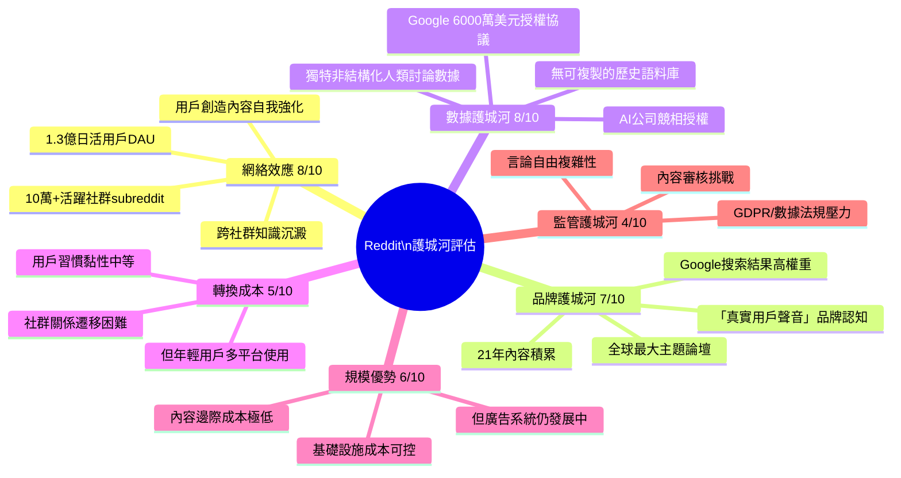

---

### 📊 護城河強度評分

```
護城河各項強度評分
━━━━━━━━━━━━━━━━━━━━━━━━━━━━━━━━━━━━━━━━
網絡效應      [8.0] ▓▓▓▓▓▓▓▓░░  🟢 強
數據護城河    [8.0] ▓▓▓▓▓▓▓▓░░  🟢 強（核心差異化）
品牌認知      [7.0] ▓▓▓▓▓▓▓░░░  🟢 良好
規模優勢      [6.0] ▓▓▓▓▓▓░░░░  🟡 中等
轉換成本      [5.0] ▓▓▓▓▓░░░░░  🟡 一般
監管護城河    [4.0] ▓▓▓▓░░░░░░  🔴 弱（反而是風險）
━━━━━━━━━━━━━━━━━━━━━━━━━━━━━━━━━━━━━━━━
綜合護城河    [6.3] ▓▓▓▓▓▓░░░░  🟡 中等偏強
━━━━━━━━━━━━━━━━━━━━━━━━━━━━━━━━━━━━━━━━
```

---

### 🌍 市場地位

| 指標 | 數據 | 說明 |
|------|------|------|
| **全球MAU** | ~1.5億+ | 全球前10大社群媒體平台 |
| **全球DAU** | ~1.3億 | IPO後用戶快速成長 |
| **TAM（廣告市場）** | ~$6500億 | 全球數位廣告TAM |
| **TAM（AI數據授權）** | ~$500億+ | 2027E市場估計 |
| **US社群廣告份額** | ~1.5-2% | 與規模仍有差距 |
| **行業地位** | 🥈 獨特定位 | 非與IG/TikTok直接競爭，獨特利基 |
| **AI數據地位** | 🥇 頂級 | 最大開放式人類討論語料庫 |

---

<a name="4"></a>
## 4. 財務健康全面評估

### 📊 財務儀表板

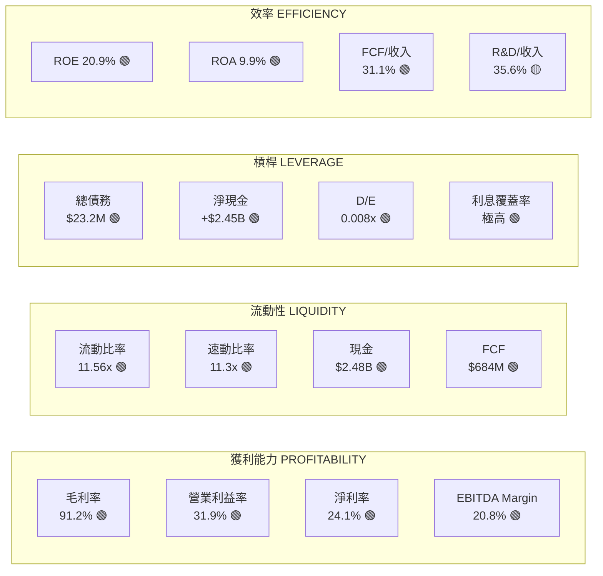

---

### 📈 獲利能力趨勢（近4年）

| 年度 | 毛利率 | 營業利益率 | 淨利率 | FCF Margin | 趨勢 |
|------|------|-----------|--------|-----------|------|
| **2022** | 84.3% | -25.8% | -23.8% | -15.0% | 🔴 虧損 |
| **2023** | 86.2% | -17.4% | -11.3% | -10.6% | 🔴 虧損 |
| **2024** | 90.8% | -43.1%* | -37.2%* | +16.6% | 🟡 轉型（含SBC調整）|
| **2025** | **91.2%** | **+31.9%** | **+24.1%** | **+31.1%** | 🟢 **盈利突破** |

> ⚠️ 2024年營業虧損主要受IPO相關一次性費用（SBC費用）影響，調整後呈現改善趨勢

```
獲利能力轉型視覺化
━━━━━━━━━━━━━━━━━━━━━━━━━━━━━━━━━━━━━━━━━━━━━━━━━━━
毛利率趨勢：
2022 │▓▓▓▓▓▓▓▓░░░░░░░│ 84.3%
2023 │▓▓▓▓▓▓▓▓▓░░░░░│ 86.2%
2024 │▓▓▓▓▓▓▓▓▓░░░░░│ 90.8%
2025 │▓▓▓▓▓▓▓▓▓▓░░░│ 91.2% ← 頂級SaaS水準

淨利率趨勢：
2022 │◄─────────────▌ -23.8% 虧損
2023 │◄──────────▌   -11.3% 虧損收窄
2024 │◄────────────▌ -37.2% (IPO費用)
2025 │▌──────────►  +24.1% ✅ 盈利突破！
━━━━━━━━━━━━━━━━━━━━━━━━━━━━━━━━━━━━━━━━━━━━━━━━━━━
```

---

### 🏦 資產負債表穩健度

```
資產負債表健康指標
━━━━━━━━━━━━━━━━━━━━━━━━━━━━━━━━━━━━━━━━━━━━━━━━
流動比率    11.56x  ▓▓▓▓▓▓▓▓▓▓  🟢 極強（>2即佳）
速動比率    11.30x  ▓▓▓▓▓▓▓▓▓▓  🟢 極強
淨現金      $2.45B  ▓▓▓▓▓▓▓▓▓▓  🟢 無淨負債
D/E比率     0.008x  ▓▓▓▓▓▓▓▓▓▓  🟢 幾乎零負債
總資產      $3.24B  ▓▓▓▓▓▓▓▓░░  🟢 持續成長
股東權益    $2.93B  ▓▓▓▓▓▓▓▓░░  🟢（2023年仍為負！）
━━━━━━━━━━━━━━━━━━━━━━━━━━━━━━━━━━━━━━━━━━━━━━━━
```

> 🏆 **亮點**：股東權益從2023年 **-$412M** 翻轉至2025年 **+$2.93B**，財務體質根本性改善

---

### 💵 現金流質量分析

| 指標 | 2023 | 2024 | 2025 | 評估 |
|------|------|------|------|------|
| 營業現金流 | -$75M | +$222M | **+$691M** | 🟢 爆炸式成長 |
| 資本支出 | -$9.7M | -$6.3M | **-$6.7M** | 🟢 輕資產模式 |
| 自由現金流 | -$85M | +$216M | **+$684M** | 🟢 顛覆性改善 |
| FCF Margin | -10.6% | +16.6% | **+31.1%** | 🟢 業界頂尖 |
| FCF轉換率 | N/A | 97.2% | **99.0%** | 🟢 近乎完美 |
| FCF Yield | N/A | N/A | **1.60%** | 🟡 偏低（估值高） |

---

<a name="5"></a>
## 5. 成長性評估

### 📊 歷史成長率（CAGR）

| 指標 | 1年成長（2025） | 3年CAGR（22-25） | 評估 |
|------|--------------|----------------|------|
| **收入** | +69.7% | **+48.8%** | 🟢 頂尖 |
| **毛利** | +70.3% | +52.1% | 🟢 加速 |
| **EPS（調整後）** | +247.4% | N/A（剛轉盈）| 🟢 爆炸性 |
| **FCF** | +216.9% | N/A（剛轉正）| 🟢 顛覆性 |
| **季度收入** | Q1→Q4 $392M→$726M | +85% 年內成長 | 🟢 加速 |

---

### 🚀 未來成長催化劑

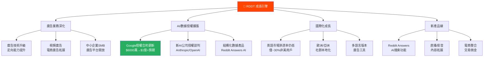

---

### 📈 成長軌跡視覺化

```
季度收入成長軌跡（百萬美元）
━━━━━━━━━━━━━━━━━━━━━━━━━━━━━━━━━━━━━━━━━━━━━━━━
Q1 2025 $392M  │▓▓▓▓▓▓▓▓▓▓▓▓▓▓▓▓▓▓▓▓░░░░░░░░░░│
Q2 2025 $500M  │▓▓▓▓▓▓▓▓▓▓▓▓▓▓▓▓▓▓▓▓▓▓▓░░░░░░│
Q3 2025 $585M  │▓▓▓▓▓▓▓▓▓▓▓▓▓▓▓▓▓▓▓▓▓▓▓▓▓▓░░│
Q4 2025 $726M  │▓▓▓▓▓▓▓▓▓▓▓▓▓▓▓▓▓▓▓▓▓▓▓▓▓▓▓▓▓▓│

年度收入（十億美元）
2022: $0.67B │▓▓▓░░░░░░░░░░░░│  成長率: 基期
2023: $0.80B │▓▓▓▓░░░░░░░░░░│  成長率: +20.6%
2024: $1.30B │▓▓▓▓▓▓░░░░░░░│  成長率: +61.8%
2025: $2.20B │▓▓▓▓▓▓▓▓▓▓░░│  成長率: +69.7% 🚀
━━━━━━━━━━━━━━━━━━━━━━━━━━━━━━━━━━━━━━━━━━━━━━━━
預測（分析師共識）：
2026E:$3.0B+  │████████████████░░░░│ 預估+36%
2027E:$4.0B+  │████████████████████░│ 預估+33%
━━━━━━━━━━━━━━━━━━━━━━━━━━━━━━━━━━━━━━━━━━━━━━━━
```

---

<a name="6"></a>
## 6. 估值合理性 & 同業比較

### ⚖️ 同業比較表格

| 指標 | **RDDT** | **Pinterest (PIN)** | **Snap (SNAP)** | **Meta (META)** |
|------|---------|-------------------|----------------|----------------|
| **市值** | $27.85B | ~$14.5B | ~$12.8B | ~$1.6T |
| **P/E (Trailing)** | 55.7x 🔴 | 35.2x 🟡 | N/A（虧損）🔴 | 28.1x 🟢 |
| **P/E (Forward)** | **17.8x** 🟢 | 25.1x 🟡 | N/A 🔴 | 22.3x 🟢 |
| **P/S** | 12.6x 🔴 | 5.8x 🟢 | 2.1x 🟢 | 11.2x 🟡 |
| **EV/EBITDA** | 57.7x 🔴 | 28.4x 🟡 | N/A 🔴 | 17.8x 🟢 |
| **P/B** | 9.5x 🔴 | 3.2x 🟢 | N/A 🔴 | 8.3x 🔴 |
| **FCF Yield** | 1.60% 🟡 | 2.1% 🟡 | 負值 🔴 | 4.2% 🟢 |
| **收入成長YoY** | **+69.7%** 🟢 | +16% 🟡 | +14% 🟡 | +21% 🟢 |
| **毛利率** | **91.2%** 🟢 | 80.1% 🟢 | 52.3% 🟡 | 81.8% 🟢 |
| **淨利率** | **+24.1%** 🟢 | +10.2% 🟡 | 虧損 🔴 | +38.5% 🟢 |
| **成長調整估值** | 優 🟢 | 良 🟡 | 差 🔴 | 優 🟢 |

> **結論**：RDDT 絕對估值偏高，但考量**69.7%超高成長率**後，Forward P/E 17.8x 相對合理；與同等成長速度的公司相比（PEG ≈ 0.25），估值實際上相當具吸引力。

---

### 📊 歷史估值區間

| 估值指標 | 歷史高點 | 歷史中位 | 歷史低點 | **當前** | 位置 |
|---------|---------|---------|---------|---------|------|
| **P/E (Forward)** | 85x | 35x | 15x | **17.8x** | 🟢 歷史低位 |
| **P/S** | 28x | 16x | 8x | **12.6x** | 🟡 中低位 |
| **EV/EBITDA** | 150x+ | 80x | 45x | **57.7x** | 🟡 中位 |
| **股價** | $282.95 | $165 | $79.75 | **$145.81** | 🟡 中低位 |

---

### 🎯 多重估值法彙整

| 估值方法 | 方法說明 | 目標價估算 | 權重 | 加權貢獻 |
|---------|---------|----------|------|---------|
| **DCF估值** | WACC 9.5%，終端成長3.5%，FCF 5年預測 | $185-220 | 35% | $70.9 |
| **相對估值（P/S）** | 同業成長調整P/S 15x × 2026E收入$3B | $195-215 | 30% | $61.5 |
| **Forward P/E** | 25x × 2026E EPS $8.21 | $185-220 | 25% | $50.6 |
| **分析師共識** | 30位分析師平均 $233.22 | $125-300 | 10% | $23.3 |
| **加權目標價** | | **$206** | 100% | **$206** |

---

### 📊 估值區間視覺化

```
RDDT 估值位置圖（基於合理公允價值 $195）
━━━━━━━━━━━━━━━━━━━━━━━━━━━━━━━━━━━━━━━━━━━━━━━━━━━━━━━━━
      嚴重低估      低估     合理區間    高估    嚴重高估
      [$80-100]   [$100-130][$130-210] [$210-260] [$260+]
         🟢         🟢        🟡          🔴        🔴
─────────────────────────────────────────────────────────
$79                    $130   $145↑  $210         $283
 └─────────────────────┴───────●────┴─────────────┘
                          ▲當前位置$145.81
                          
  悲觀目標價：$105  基準目標價：$195  樂觀目標價：$255
       └──────────────────●──────────────────┘
                    當前 $145.81 → 基準+33.7%
━━━━━━━━━━━━━━━━━━━━━━━━━━━━━━━━━━━━━━━━━━━━━━━━━━━━━━━━━
📌 結論：目前股價處於「低估/合理」邊界，安全邊際開始浮現
━━━━━━━━━━━━━━━━━━━━━━━━━━━━━━━━━━━━━━━━━━━━━━━━━━━━━━━━━
```

---

<a name="7"></a>
## 7. 資本配置與管理層評估

### 📊 ROIC vs WACC 分析

```
╔══════════════════════════════════════════════════════════╗
║                 ROIC vs WACC 深度分析                     ║
╠══════════════════════════════════════════════════════════╣
║  WACC 估算：                                             ║
║  ├─ 無風險利率 (Rf)：4.3%（美國10年期公債）               ║
║  ├─ 市場風險溢價 (ERP)：5.5%                             ║
║  ├─ Beta估計值：1.45（高波動科技成長股）                   ║
║  ├─ 股權成本 Ke = 4.3% + 1.45×5.5% = 12.3%            ║
║  ├─ 負債成本 Kd：~3.5%（幾乎無負債）                      ║
║  └─ WACC ≈ 12.0%（近乎全股權融資）                       ║
╠══════════════════════════════════════════════════════════╣
║  ROIC 估算：                                             ║
║  ├─ NOPAT = 營業利益×(1-稅率) = $442M×0.79 = $349M     ║
║  ├─ 投入資本 = 股東權益+淨負債 = $2.93B+(-$2.45B)=$0.48B║
║  ├─ ROIC = $349M / $480M = **72.7%**                   ║
╠══════════════════════════════════════════════════════════╣
║  EVA（經濟附加值）分析：                                   ║
║  ├─ EVA = (ROIC - WACC) × 投入資本                      ║
║  ├─ EVA = (72.7% - 12.0%) × $480M                      ║
║  ├─ EVA = 60.7% × $480M = **+$291M**                   ║
║  └─ ✅ EVA 為正，Reddit 正在創造顯著股東價值！             ║
╠══════════════════════════════════════════════════════════╣
║  結論：ROIC (72.7%) >> WACC (12.0%)                     ║
║  超額報酬率：+60.7% ← 頂級水準，確認護城河存在             ║
╚══════════════════════════════════════════════════════════╝
```

> ⚠️ **重要注意**：投入資本因大量淨現金（$2.45B）使分母偏小，ROIC數字顯得極高。扣除超額現金後，ROIC仍然遠超WACC，說明核心業務確實創造價值。

---

### 🥧 資本配置餅圖

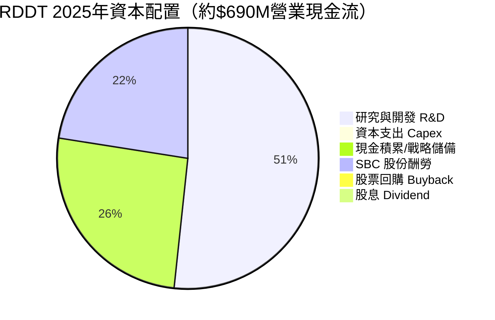

---

### 👔 管理層執行力評分

| 評估維度 | 評分 | 具體表現 | 訊號 |
|---------|------|---------|------|
| **財務承諾達成率** | 9/10 | IPO後迅速超越盈利預期，各季EPS均超預期 | 🟢 |
| **資本紀律** | 7/10 | R&D佔收入35.6%偏高（絕對值$783M > 收入$2.2B的35%）；但Capex極低$6.7M | 🟡 |
| **戰略清晰度** | 8/10 | AI數據授權策略清晰，廣告平台升級路徑明確 | 🟢 |
| **成本控制** | 8/10 | 毛利率首次突破91%，SBC費用開始受控 | 🟢 |
| **投資者溝通** | 7/10 | 積極發布前瞻指引；但短期內多家分析師降評Neutral | 🟡 |
| **M&A 紀律** | 8/10 | 維持有機成長策略，未進行冒進收購 | 🟢 |

---

### 💝 股東友善度評分

```
股東友善度各項評估
━━━━━━━━━━━━━━━━━━━━━━━━━━━━━━━━━━━━━━━━━━━━━━━
股票回購計劃    [2/10] ▓▓░░░░░░░░  🔴 尚無回購計劃
股息政策        [0/10] ░░░░░░░░░░  🔴 無股息（可理解）
透明度/溝通     [7/10] ▓▓▓▓▓▓▓░░░  🟢 良好
資本效率ROIC    [9/10] ▓▓▓▓▓▓▓▓▓░  🟢 頂尖水準
長期導向        [8/10] ▓▓▓▓▓▓▓▓░░  🟢 戰略聚焦
股權稀釋控制    [6/10] ▓▓▓▓▓▓░░░░  🟡 SBC仍偏高
━━━━━━━━━━━━━━━━━━━━━━━━━━━━━━━━━━━━━━━━━━━━━━━
綜合股東友善度  [5.3/10] ▓▓▓▓▓░░░░░  🟡 成長期可接受
━━━━━━━━━━━━━━━━━━━━━━━━━━━━━━━━━━━━━━━━━━━━━━━
📌 處於成長期，不股息/回購合理，期待未來現金回流
━━━━━━━━━━━━━━━━━━━━━━━━━━━━━━━━━━━━━━━━━━━━━━━
```

---

<a name="8"></a>
## 8. 風險評估

### 🌡️ 風險熱圖

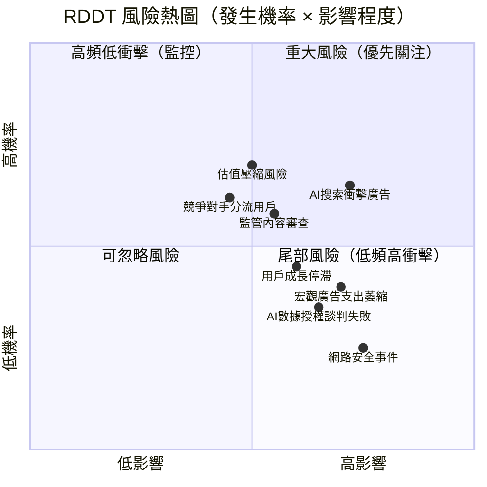

---

### 📋 風險清單詳表

| 風險類型 | 級別 | 具體描述 | 緩解措施 | 訊號 |
|---------|------|---------|---------|------|
| **AI搜索替代廣告** | 🔴 高 | AI生成摘要減少用戶訪問Reddit，Google流量下降衝擊廣告收入 | 開發Reddit Answers AI功能；直接流量佔比提升 | 🔴 |
| **估值壓縮風險** | 🔴 高 | 若成長率低於預期，高估值倍數將快速壓縮，股價腰斬風險 | 強勁FCF和持續盈利支撐；Forward P/E已降至17.8x | 🔴 |
| **監管/內容審查** | 🟡 中 | 歐盟DSA/美國監管增加合規成本，內容責任風險 | 已設立信任安全團隊；投入合規資源 | 🟡 |
| **廣告市場週期** | 🟡 中 | 宏觀衰退下企業削減廣告預算，Reddit廣告效益不如大平台 | 多元化收入（AI授權、訂閱）；廣告客戶多元 | 🟡 |
| **競爭對手分流** | 🟡 中 | TikTok、Discord、YouTube Communities搶奪社群流量 | 獨特文字/討論定位，差異化強 | 🟡 |
| **短賣壓力** | 🟡 中 | Short Float 14.6%偏高，若業績不如預期恐觸發踩踏 | Q4業績強勁可形成軋空保護 | 🟡 |
| **SBC費用稀釋** | 🟡 中 | 研發$783M含大量SBC，持續稀釋股東 | FCF $684M足以覆蓋稀釋；IPO鎖定期釋放漸緩 | 🟡 |
| **用戶成長放緩** | 🟢 低 | DAU成長若明顯放緩，ARPU提升需補足缺口 | ARPU持續成長（廣告技術升級）；國際化空間大 | 🟢 |
| **AI數據授權談判** | 🟢 低 | 現有授權合約到期後可能未能以更高價格續約 | Reddit數據稀缺性確保談判優勢；多方競爭 | 🟢 |

---

### 📉 最大下行情境分析

```
Bear Case（悲觀情境）目標價分析
━━━━━━━━━━━━━━━━━━━━━━━━━━━━━━━━━━━━━━━━━━━━━━━━━━━━━━
假設條件：
• 2026年收入成長從36%降至20%（收入~$2.64B）
• AI搜索衝擊廣告收入，EBITDA Margin壓縮至15%
• EV/EBITDA估值倍數從57x壓縮至30x（市場退出高估值）
• 2026E EBITDA = $2.64B × 15% = $396M
• EV = 30x × $396M = $11.88B
• 市值 = EV + 淨現金 = $11.88B + $2.45B = $14.33B
• 每股價值 = $14.33B / 191M股（稀釋後）≈ $75
━━━━━━━━━━━━━━━━━━━━━━━━━━━━━━━━━━━━━━━━━━━━━━━━━━━━━━
Bear Case 目標價：$75-105（較當前 -28% 至 -49%）
━━━━━━━━━━━━━━━━━━━━━━━━━━━━━━━━━━━━━━━━━━━━━━━━━━━━━━
📌 止損建議：跌破 $110 應重新評估基本面
━━━━━━━━━━━━━━━━━━━━━━━━━━━━━━━━━━━━━━━━━━━━━━━━━━━━━━
```

---

<a name="9"></a>
## 9. 催化劑與觸發因素

### 📅 催化劑時間軸

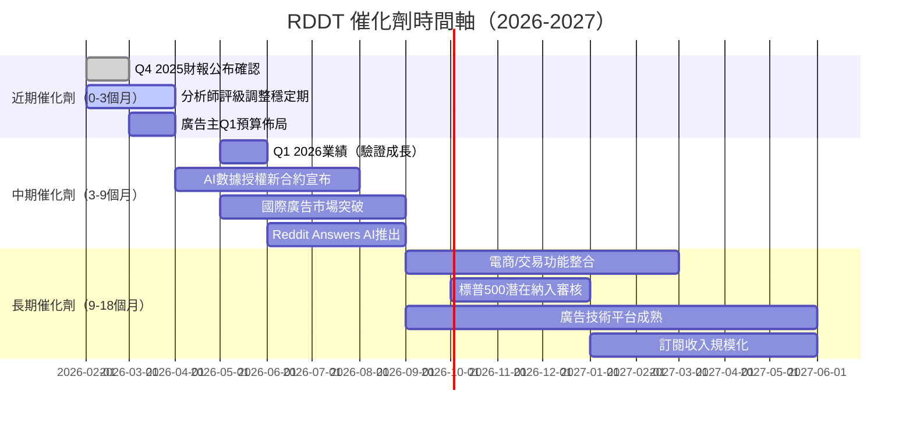

---

### ⚡ 正面觸發因素詳解

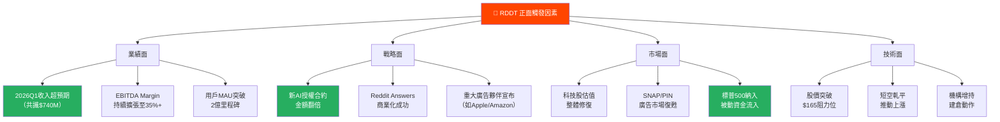

---

<a name="10"></a>
## 10. 投資建議

### ⭐ 最終評級

```
╔════════════════════════════════════════════════════════════╗
║                                                            ║
║   RDDT（Reddit, Inc.）投資評級                              ║
║                                                            ║
║   ★★★★☆  4.0 / 5.0 顆星                                   ║
║                                                            ║
║   投資評級：🟡 買入（BUY）                                   ║
║   評估信心度：75%                                           ║
║                                                            ║
║   核心論點：                                               ║
║   ✅ 從虧損到年賺$530M的結構性轉型已完成                     ║
║   ✅ ROIC 72.7% >> WACC 12%，確認護城河價值                ║
║   ✅ 91.2%毛利率+31%FCF Margin，具SaaS級財務特徵           ║
║   ✅ AI數據護城河為獨特且稀缺的長期優勢                      ║
║   ✅ Forward P/E 17.8x，成長調整後估值合理                  ║
║   ⚠️ 股價從高點回落49%，技術面偏弱需觀察                    ║
║   ⚠️ AI搜索替代廣告為最大不確定性風險                       ║
║                                                            ║
╚════════════════════════════════════════════════════════════╝
```

---

### 🎯 目標價區間與隱含報酬率

| 情境 | 目標價 | 隱含報酬率 | 假設條件 | 機率 |
|------|-------|----------|---------|------|
| 🔴 **悲觀情境** | $105 | **-28.0%** | 成長放緩+AI衝擊+估值壓縮 | 20% |
| 🟡 **基準情境** | $195 | **+33.7%** | 30%+收入成長+EBITDA擴張 | 50% |
| 🟢 **樂觀情境** | $255 | **+74.9%** | AI授權爆發+廣告加速+S&P500納入 | 30% |
| 📊 **概率加權期望** | **$193** | **+32.4%** | — | 100% |

> 📌 **12個月期望報酬率**：**+32.4%**（加權平均）

---

### 👥 投資人適配度分析

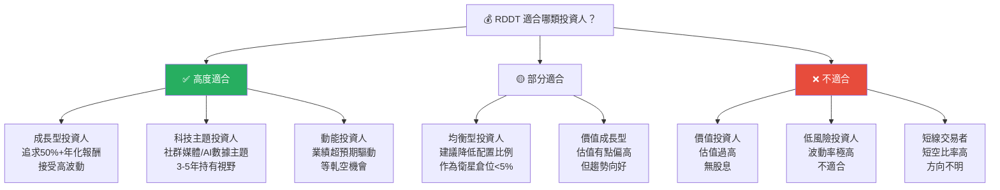

---

### ⏰ 操作策略建議

```
╔══════════════════════════════════════════════════════════════╗
║                    RDDT 操作策略建議                          ║
╠══════════════════════════════════════════════════════════════╣
║  建議持倉時間：12-18 個月                                     ║
╠══════════════════════════════════════════════════════════════╣
║  倉位建議：                                                   ║
║  • 初始建倉：$140-150 區間，佔投資組合 3-5%                   ║
║  • 加倉條件1：$125-135（跌破後確認企穩）→ 增加至 5-7%        ║
║  • 加倉條件2：突破 $165 確認上升趨勢 → 增加至 7-10%          ║
╠══════════════════════════════════════════════════════════════╣
║  加碼觸發條件：✅                                             ║
║  ☑ Q1 2026 收入超過 $750M（共識$740M）                      ║
║  ☑ EBITDA Margin 持續擴張至35%+                             ║
║  ☑ 新AI授權合約宣布（金額>$1億）                             ║
║  ☑ 股價突破$165並維持5日均線以上                             ║
║  ☑ 短空比例降至10%以下（擠空效應）                           ║
╠══════════════════════════════════════════════════════════════╣
║  止損觸發條件：🔴                                             ║
║  ☒ 股價跌破 $110（技術面破位，回測52W低點）                  ║
║  ☒ 季度收入成長降至<25%（成長股票命脈）                      ║
║  ☒ 2026年度指引低於$3.0B（市場共識預期）                    ║
║  ☒ 主要AI授權合約未能續約（數據護城河破壞）                  ║
║  ☒ 重大競爭對手推出類似平台且快速搶奪用戶                    ║
╚══════════════════════════════════════════════════════════════╝
```

---

### 📋 關鍵監控指標 Checklist

```
📊 RDDT 季度監控清單（每季財報後更新）
━━━━━━━━━━━━━━━━━━━━━━━━━━━━━━━━━━━━━━━━━━━━━━━━━━
用戶成長指標：
  ☐ DAU/MAU 成長率 > 15% YoY
  ☐ ARPU（每用戶平均收入）季度環比成長
  ☐ 國際用戶佔比持續提升

財務健康指標：
  ☐ 收入成長率維持 > 30% YoY
  ☐ EBITDA Margin 持續擴張（目標35%+）
  ☐ FCF 轉換率維持 > 90%
  ☐ SBC費用佔收入比例逐漸下降

競爭護城河指標：
  ☐ AI授權收入確認成長（數據護城河）
  ☐ Google流量貢獻比例（搜索流量健康度）
  ☐ 廣告CPM/CPC趨勢（廣告效益）

估值安全指標：
  ☐ Forward P/E 維持 < 30x（合理上限）
  ☐ EV/Sales < 15x
  ☐ FCF Yield > 1.5%（價值支撐底線）

分析師&機構動向：
  ☐ 機構持股比例（當前98.7%）維持或增加
  ☐ 分析師評級變化方向（Buy vs Neutral比例）
  ☐ 大型基金建倉/減倉動作（13F追蹤）

宏觀&行業指標：
  ☐ 數位廣告市場整體成長（eMarketer數據）
  ☐ AI大模型對內容平台衝擊評估
  ☐ 監管環境變化（美國/歐盟）
━━━━━━━━━━━━━━━━━━━━━━━━━━━━━━━━━━━━━━━━━━━━━━━━━━
```

---

### 🏆 最終評分總覽

```
━━━━━━━━━━━━━━━━━━━━━━━━━━━━━━━━━━━━━━━━━━━━━━━━━━━━
                RDDT 投資評估最終總覽
━━━━━━━━━━━━━━━━━━━━━━━━━━━━━━━━━━━━━━━━━━━━━━━━━━━━
成長性       [9.0] ▓▓▓▓▓▓▓▓▓░  ★★★★★ 業界頂尖成長
獲利能力     [8.5] ▓▓▓▓▓▓▓▓▓░  ★★★★★ 結構性盈利突破
財務健康     [9.0] ▓▓▓▓▓▓▓▓▓░  ★★★★★ 近乎完美資產表
競爭優勢     [7.5] ▓▓▓▓▓▓▓▓░░  ★★★★☆ 數據護城河獨特
管理品質     [7.0] ▓▓▓▓▓▓▓░░░  ★★★★☆ 執行力良好
估值合理性   [4.5] ▓▓▓▓▓░░░░░  ★★☆☆☆ 仍偏高需消化
動能         [6.5] ▓▓▓▓▓▓▓░░░  ★★★☆☆ 短期偏弱
風險控制     [5.5] ▓▓▓▓▓▓░░░░  ★★★☆☆ AI衝擊為主要隱憂
━━━━━━━━━━━━━━━━━━━━━━━━━━━━━━━━━━━━━━━━━━━━━━━━━━━━
加權綜合評分  [7.19/10]  ★★★★☆   🟡 買入
━━━━━━━━━━━━━━━━━━━━━━━━━━━━━━━━━━━━━━━━━━━━━━━━━━━━
評級：BUY ｜當前$145.81 ｜基準目標$195 ｜+33.7%
━━━━━━━━━━━━━━━━━━━━━━━━━━━━━━━━━━━━━━━━━━━━━━━━━━━━
```

---

> ## ⚠️ 免責聲明
> 
> **本報告為 AI 自動生成分析，僅供投資研究參考，不構成任何形式的投資建議。**
> 
> 所有財務預測均基於公開資料與量化模型，存在重大不確定性。投資人在做出任何投資決策前，應：
> 1. 自行進行獨立盡職調查（Due Diligence）
> 2. 考量個人風險承受能力與投資目標
> 3. 諮詢具備執照的專業財務顧問
> 4. 了解股票投資存在本金損失的風險
> 
> **報告生成時間**：2026-02-28 ｜ **模型版本**：頂級美股評估系統 v2.0
> **數據來源**：Yahoo Finance / 公司財報 / 分析師研究