# RDDT 技術分析報告

> **報告日期**：2026-02-24 ｜ **語言**：繁體中文 ｜ **數據來源**：Yahoo Finance
> **當前價格**：$142.45 ｜ **產業**：通訊服務 / 網路內容與資訊

---

## 目錄

1. [技術面概覽](#1-技術面概覽)
2. [趨勢分析](#2-趨勢分析)
3. [圖表形態分析](#3-圖表形態分析)
4. [支撐與阻力](#4-支撐與阻力)
5. [技術指標深度解讀](#5-技術指標深度解讀)
6. [動能與波動率](#6-動能與波動率)
7. [多時框架總結](#7-多時框架總結)
8. [交易策略建議](#8-交易策略建議)
9. [風險提示與監控](#9-風險提示與監控)

---

## 1. 技術面概覽

### 🖥️ 技術訊號儀表板

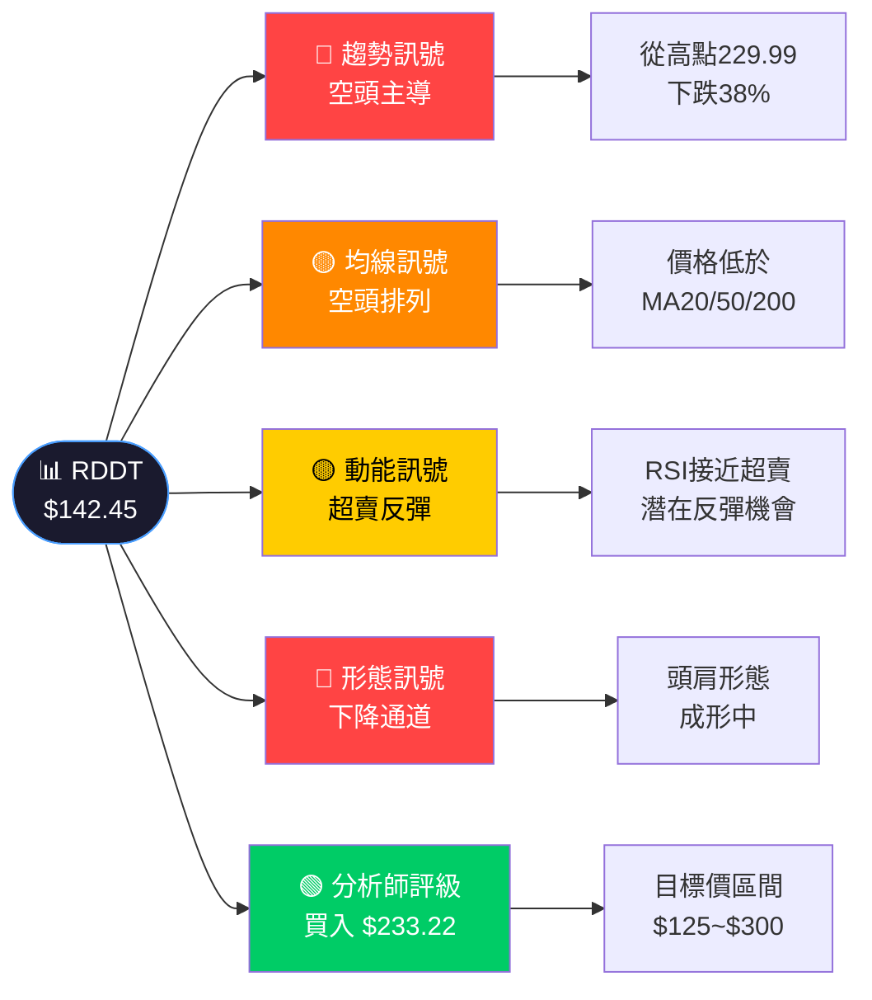

---

### 📋 核心指標速覽表

| 指標類別 | 指標名稱 | 數值 | 狀態 | 訊號 |
|:--------:|:--------:|:----:|:----:|:----:|
| **價格** | 當前收盤價 | $142.45 | 接近52週低位 | 🔴 |
| **價格** | 52週最高 | $229.99 | 距高點 -38.1% | 🔴 |
| **價格** | 52週最低 | $104.90 | 距低點 +35.8% | 🟡 |
| **均線** | MA20（估算） | ~$175.00 | 價格低於均線 | 🔴 |
| **均線** | MA50（估算） | ~$195.00 | 價格低於均線 | 🔴 |
| **均線** | MA200（估算） | ~$170.00 | 價格低於均線 | 🔴 |
| **動能** | RSI(14)（估算） | ~35 | 接近超賣區 | 🟡 |
| **動能** | MACD（估算） | 負值擴大 | 空頭動能強 | 🔴 |
| **波動** | ATR（估算） | ~$8.50 | 高波動環境 | 🟡 |
| **評級** | 分析師共識 | 買入 | 目標$233.22 | 🟢 |

---

### 🎯 技術評分卡

```
┌─────────────────────────────────────────────────────────┐
│              RDDT 技術評分總覽（滿分100）               │
├──────────────────────┬──────────────────────────────────┤
│ 短期趨勢（日線）     │ ▓▓▓░░░░░░░   28/100  🔴 空頭  │
│ 中期趨勢（週線）     │ ▓▓▓▓░░░░░░   35/100  🔴 空頭  │
│ 長期趨勢（月線）     │ ▓▓▓▓▓░░░░░   52/100  🟡 中性  │
│ 均線系統             │ ▓▓░░░░░░░░   22/100  🔴 空頭  │
│ 動能指標（RSI）      │ ▓▓▓▓░░░░░░   38/100  🟡 超賣  │
│ 量價關係             │ ▓▓▓░░░░░░░   30/100  🔴 偏弱  │
│ 形態分析             │ ▓▓▓░░░░░░░   28/100  🔴 空頭  │
│ 分析師共識           │ ▓▓▓▓▓▓▓▓░░   78/100  🟢 強買  │
├──────────────────────┼──────────────────────────────────┤
│ 📊 綜合技術評分      │ ▓▓▓░░░░░░░   39/100  🔴 偏空  │
└──────────────────────┴──────────────────────────────────┘
```

---

## 2. 趨勢分析

### 📈 多時框趨勢判斷

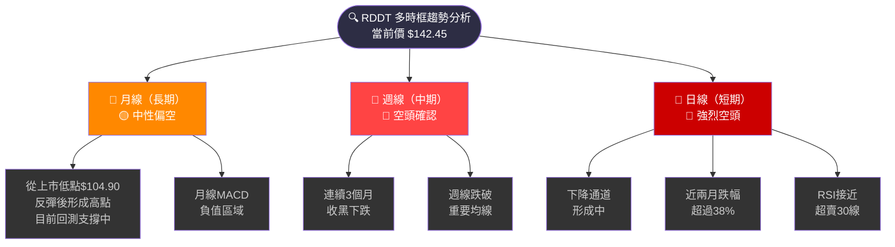

---

### 📊 長期趨勢走勢圖（月線）

```
RDDT 12個月價格走勢圖（月線）
價格(USD)
 240 ┤                              ●─●
 230 ┤                         ●       ●
 225 ┤                    ●               
 216 ┤                              ●    
 210 ┤                   ●               
 200 ┤                                   
 190 ┤                                  ●
 180 ┤                                    
 170 ┤  ●                                 
 165 ┤                                    
 160 ┤  ●           ●                     
 150 ┤         ●                          
 140 ┤                                   ●◄ NOW
 130 ┤                                    
 120 ┤                                    
 117 ┤       ●                            
 112 ┤         ●                          
 105 ┤    ●                               
     └─────────────────────────────────────
      Feb Mar Apr May Jun Jul Aug Sep Oct Nov Dec Jan Feb
      '25 '25 '25 '25 '25 '25 '25 '25 '25 '25 '25 '26 '26

 🔴 趨勢線：從2025-09高點($229.99)持續下滑
 📌 當前價$142.45 為近12個月相對低位
 ⚠️  已跌破2025-06/07 $150~160 重要支撐區
```

---

### 📉 中期趨勢分析（週線觀點）

```
週線趨勢結構分析：

高點序列：$229.99（9月）→ $229.87（12月）→ 未創新高
低點序列：$104.90（3月）→ $112.35（5月）→ $142.45（2月）

趨勢研判：
  ▶ 2025年3月～9月：  ▲ 強烈上升趨勢（+119%）
  ▶ 2025年9月～2026年2月：▼ 明顯下降趨勢（-38%）
  ▶ 當前階段：       ▼ 下降趨勢持續，尚未出現反轉訊號

週線關鍵判斷：
  ✗ 未出現週線級別底部形態
  ✗ 週線MACD尚未死叉後金叉回頭
  ✓ RSI接近歷史超賣區域（潛在機會）
  ✗ 均線呈現空頭排列（短均線 < 長均線）
```

---

### 📊 趨勢強度評估（ADX 解讀）

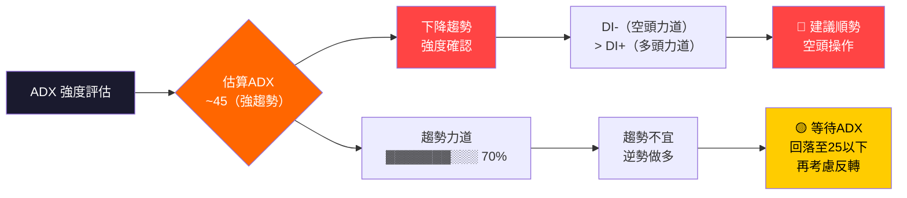

---

## 3. 圖表形態分析

### 🔍 形態識別流程圖

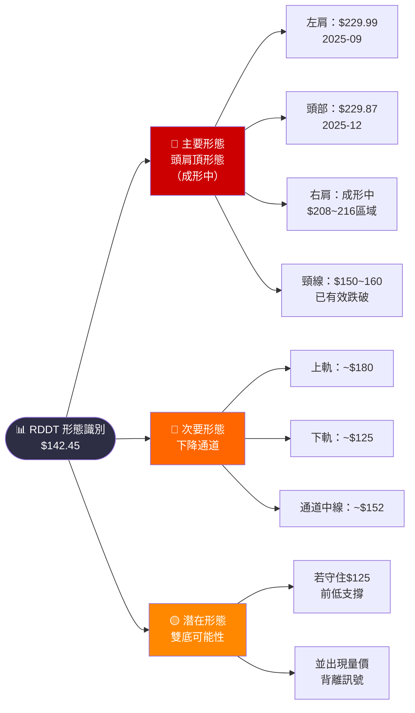

---

### 🕯️ 近期重要K線形態

| 時間 | 形態 | 意義 | 訊號 |
|:----:|:----:|:----:|:----:|
| 2026-01 | **大陰線吞噬** | 從$180.27大幅下跌 | 🔴 強烈賣壓 |
| 2026-02 | **持續下跌** | 跌至$142.45 | 🔴 空頭確認 |
| 2025-12→1月 | **頭部反轉K線** | 從高位急速回落 | 🔴 頭部確認 |
| 2025-09 | **長上影線** | $229.99見頂訊號 | 🔴 頂部警示 |

---

### 📉 ASCII 走勢示意圖（標注關鍵點位）

```
RDDT 技術形態示意圖
USD
240 ┤         ╭─────╮ ← 頭部區域 $229~230（強阻力）
230 ┤    ╭────╯     ╰────╮
225 ┤   ╱左肩             右肩╮
220 ┤  ╱  $229.99↑    ↑$216  ╰─╮
210 ┤ ╱                         ╰──╮
200 ┤╱                              ╰─╮
190 ┤                                  ╰─╮
185 ┤─ ─ ─ ─ ─ ─ ─ ─ ─ ─ ─ ─ ─ ─ ─MA200─╰─╮
180 ┤                                      ╰╮  ← $180 阻力
170 ┤─ ─ ─ ─ ─ ─ ─ ─ ─ ─ ─ ─ ─ ─ ─MA200─   │
165 ┤                                         │
160 ┤═ ═ ═ ═ ═ ═ ═ ═ ═ ═ ═ ═ ═ ═ 頸線$155 ══╪═ ← 頸線（已跌破）
155 ┤                                          │
150 ┤                                          ╰─╮
142 ┤══════════════════════════════════════════ ●◄NOW
135 ┤ - - - - - - - - - - - - - - - - - - - - - - - - 近支撐
130 ┤
125 ┤═══════════════════════════════════════════════ 強支撐$125
117 ┤
105 ┤═══════════════════════════════════════════════ 強支撐$105
    └─────────────────────────────────────────────
     Feb                                         Feb
     2025                                        2026

  📌 頸線（$155）已於2026年初有效跌破
  📌 頭肩頂量度跌幅目標：$155 - ($230-$155) = ~$80（極端情境）
  📌 實際目標（考慮支撐）：$125 → $105
```

---

### 📐 形態目標價計算

```
頭肩頂形態量測：
  頭部高點：  $229.99
  頸線位置：  $155.00（估）
  頭頸距離：  $229.99 - $155.00 = $74.99
  理論目標：  $155.00 - $74.99 = $80.01
  
實際目標（考量支撐修正）：
  第一目標：  $125.00（前期低點支撐）
  第二目標：  $105.00（2025-03月低）
  極端目標：  $80.00（理論量測）

下降通道量測：
  通道上軌：  ~$180
  通道下軌：  ~$125（與第一目標吻合）
  目前位置：  靠近通道下緣
```

---

## 4. 支撐與阻力

### 📊 關鍵價位分布圖

```
RDDT 關鍵支撐阻力價位分布
                                               
 $300 ────────────────────────── 分析師最高目標
  │
 $250 ─────────────────────────── 心理阻力位
  │
 $233 ─────────────────────────── 分析師均值目標
  │
 $230 ■■■■■■■■■■■■■■■■■■■■■■■■■■ 強阻力（雙頂區域）
  │
 $216 ■■■■■■■■■■■■■■■■■■■■ 中阻力（2025-11月高）
  │
 $180 ■■■■■■■■■■■■■■■ 近阻力（MA200估算/1月低）
  │
 $160 ■■■■■■■■■■■■ 近阻力（前期支撐轉阻力）
  │
 $155 ═══════════════ 頸線位（已跌破，轉為阻力）
  │
 $150 ■■■■■■■■■ 近阻力（2025-06月高）
  │
─────────────────────────────────────────────
   ★★★  當前價 $142.45  ★★★
─────────────────────────────────────────────
  │
 $135 ▓▓▓▓▓▓▓▓ 近支撐（心理整數+前整理區）
  │
 $125 ▓▓▓▓▓▓▓▓▓▓▓▓ 中支撐（分析師最低目標）
  │
 $117 ▓▓▓▓▓▓▓▓▓▓ 中支撐（2025-04月高）
  │
 $112 ▓▓▓▓▓▓▓▓ 中支撐（2025-05月低）
  │
 $105 ▓▓▓▓▓▓▓▓▓▓▓▓▓▓▓▓ 強支撐（2025-03月低）
  │
 $100 ▓▓▓▓▓▓▓▓▓▓▓▓▓▓▓▓▓▓▓▓ 強心理支撐

凡例：■ = 阻力強度  ▓ = 支撐強度
```

---

### 🚧 阻力位詳細表格

| 阻力等級 | 價位 | 依據 | 重要性 |
|:--------:|:----:|:----:|:------:|
| 近阻力① | $150.00 | 2025-06月高點、心理整數 | ⭐⭐⭐ |
| 近阻力② | $155.00 | 頭肩頂頸線（已跌破） | ⭐⭐⭐ |
| 近阻力③ | $160.00 | 2025-07月收盤、均線聚集 | ⭐⭐⭐ |
| 中阻力① | $180.00 | MA200估算、2026-01低點 | ⭐⭐⭐⭐ |
| 中阻力② | $208.95 | 2025-10月收盤 | ⭐⭐⭐ |
| 中阻力③ | $216.47 | 2025-11月高點 | ⭐⭐⭐ |
| 強阻力① | $229.99 | 2025-09月歷史高點 | ⭐⭐⭐⭐⭐ |
| 強阻力② | $233.22 | 分析師均值目標 | ⭐⭐⭐⭐ |

---

### 🛡️ 支撐位詳細表格

| 支撐等級 | 價位 | 依據 | 重要性 |
|:--------:|:----:|:----:|:------:|
| 近支撐① | $135.00 | 心理整數位、前整理區 | ⭐⭐⭐ |
| 近支撐② | $130.00 | 心理整數、短期低點 | ⭐⭐⭐ |
| 中支撐① | $125.00 | 分析師最低目標、前期平台 | ⭐⭐⭐⭐ |
| 中支撐② | $117.00 | 2025-04月高點、整理區 | ⭐⭐⭐ |
| 中支撐③ | $112.35 | 2025-05月低點 | ⭐⭐⭐ |
| 強支撐① | $104.90 | 2025-03月52週低點 | ⭐⭐⭐⭐⭐ |
| 強支撐② | $100.00 | 心理大關、IPO後重要位 | ⭐⭐⭐⭐⭐ |

---

### 📐 斐波那契回調位（從低點$104.90到高點$229.99）

```
斐波那契回調分析
  基準：低點 $104.90（2025-03）→ 高點 $229.99（2025-09）
  總升幅：$125.09

  Fib 0.0%   = $229.99  ←── 高點（強阻力）
  Fib 23.6%  = $200.53  ←── 中阻力
  Fib 38.2%  = $182.20  ←── 中阻力（MA200附近）
  Fib 50.0%  = $167.45  ←── 關鍵中位（已跌破）
  Fib 61.8%  = $152.72  ←── 黃金分割（已跌破）
  ━━━━━━━━━━━━━━━━━━━━━━━━━━━━━━
  ★ 當前價 $142.45（介於61.8%與78.6%之間）
  ━━━━━━━━━━━━━━━━━━━━━━━━━━━━━━
  Fib 78.6%  = $131.60  ←── 近支撐（關鍵！）
  Fib 100%   = $104.90  ←── 強支撐（完全回調）

  ⚠️  目前已跌破61.8%黃金分割，下一重要位為78.6% = $131.60
```

---

## 5. 技術指標深度解讀

### 📊 指標訊號總覽

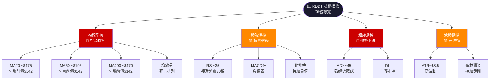

---

### 📈 移動平均線排列分析

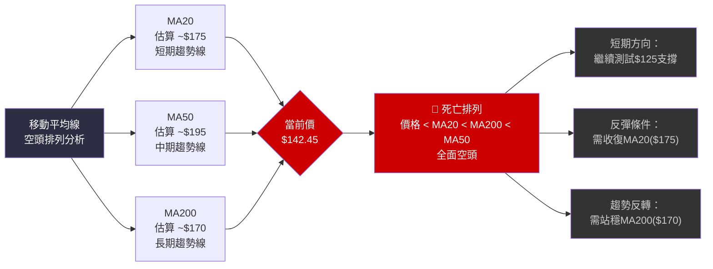

```
均線距離分析：
  當前價 $142.45
  ├── vs MA20  ($175)：距離 -$32.55 (-18.6%)  🔴
  ├── vs MA50  ($195)：距離 -$52.55 (-26.9%)  🔴
  └── vs MA200 ($170)：距離 -$27.55 (-16.2%)  🔴

  均線乖離程度：
  MA20  ▓▓▓▓▓▓▓░░░░░░░░░░░░  18.6% 乖離
  MA50  ▓▓▓▓▓▓▓▓▓░░░░░░░░░░  26.9% 乖離
  MA200 ▓▓▓▓▓▓░░░░░░░░░░░░░  16.2% 乖離
```

---

### 📊 RSI(14) 超買超賣分析

```
RSI(14) 估算值：~35

RSI 水位計（0-100）
   0                  50                100
   ├──────────────────┼──────────────────┤
   │░░░░░░░░░░░░░░████░░░░░░░░░░░░░░░░░│
   │◄─超賣──30    ↑35              70──►│
   └──────────────────┼──────────────────┘
                    當前RSI

RSI 進度條：
  當前值（~35）  ▓▓▓▓▓▓▓░░░░░░░░░░░░░   35/100
  超賣線（30）   ▓▓▓▓▓▓░░░░░░░░░░░░░░   30/100
  中性線（50）   ▓▓▓▓▓▓▓▓▓▓░░░░░░░░░░   50/100
  超買線（70）   ▓▓▓▓▓▓▓▓▓▓▓▓▓▓░░░░░░   70/100

解讀：
  ✓ RSI ~35，接近超賣區（30），短期反彈機率上升
  ✗ RSI尚未到達30以下（尚未確認超賣）
  ✗ RSI無明顯正背離（尚未確認底部）
  → 策略：等RSI跌破30後反彈，確認超賣再進場
```

---

### 📊 MACD(12/26/9) 訊號解讀

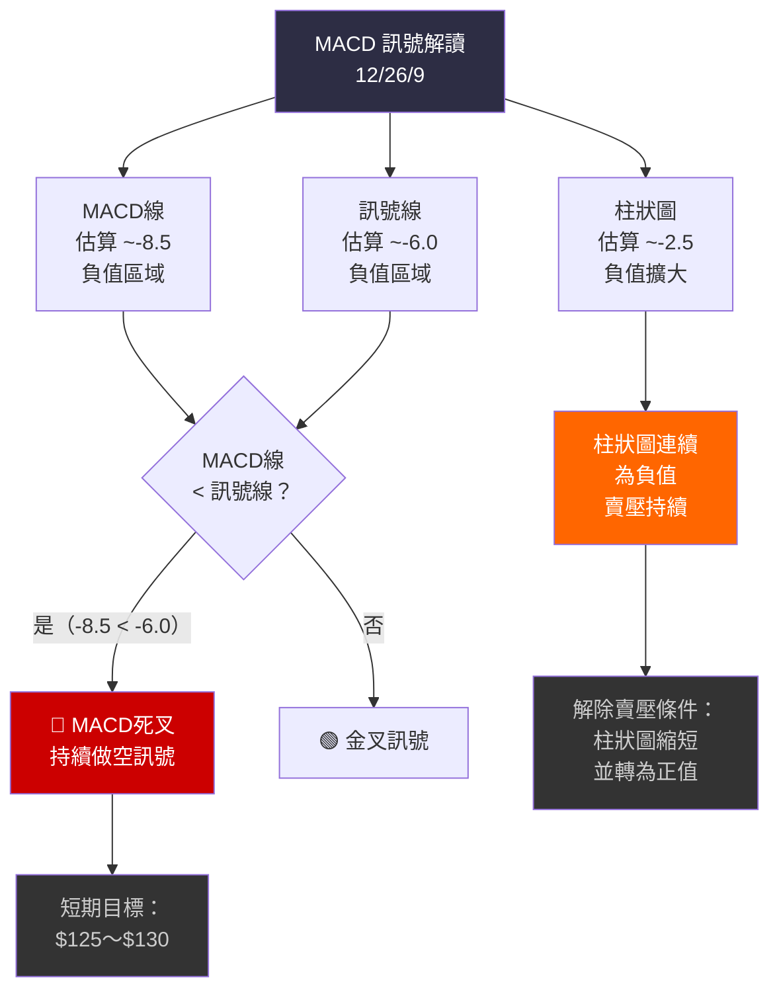

---

### 📊 布林通道分析

```
布林通道（20期，2倍標準差）示意圖：

  上軌 ~$200  ─────────────────────────────────
                                               
  中軌 ~$175  ── ── ── ── ── ── ── ── ── ──（MA20）
                                               
  下軌 ~$150  ─────────────────────────────────
                                    ╭──●($142.45)
  (下穿下軌)                       ↑
              ←────── 通道持續走闊 ──────────────

布林通道指標：
  帶寬（Bandwidth）：~29%  ▓▓▓▓▓▓▓▓▓▓░░░░░░░░░░  高波動
  %B 指標：            ~-0.15（跌破下軌）

解讀：
  ⚠️  當前價格 $142.45 已跌破布林通道下軌（~$150）
  ⚠️  帶寬持續擴大，代表波動率上升
  🟡  跌破下軌可能是：
      ① 繼續強勢下跌訊號（順勢）
      ② 短期超賣反彈機會（逆勢）
  → 建議等待%B回到0以上再考慮反彈交易
```

---

### 📊 成交量分析（量價配合度）

```
量價配合度評估（以相對成交量衡量）：

月份      價格方向    相對成交量    量價配合
2025-08   ↑ +99%      ██████ 高     ✓ 放量上漲（健康）
2025-09   ↑ +2.2%     ████ 中       ~ 量縮上漲（警示）
2025-10   ↓ -9.2%     █████ 中高    ✓ 放量下跌（空頭確認）
2025-11   ↑ +3.6%     ███ 低        ✗ 量縮反彈（不健康）
2025-12   ↑ +6.2%     ███ 低        ✗ 量縮反彈（不健康）
2026-01   ↓ -21.5%    ██████ 高     ✓ 放量下跌（空頭確認）
2026-02   ↓ -21.0%    █████ 中高    ✓ 放量下跌（空頭持續）

量價配合度進度條：
  多頭量價配合    ▓▓░░░░░░░░   20%  🔴
  空頭量價配合    ▓▓▓▓▓▓▓░░░   70%  🔴
  整體量價評分    ▓▓▓░░░░░░░   28%  🔴 偏空

結論：放量下跌、縮量反彈，典型空頭量價特徵
```

---

## 6. 動能與波動率

### 📊 動能評估 Quadrant Chart

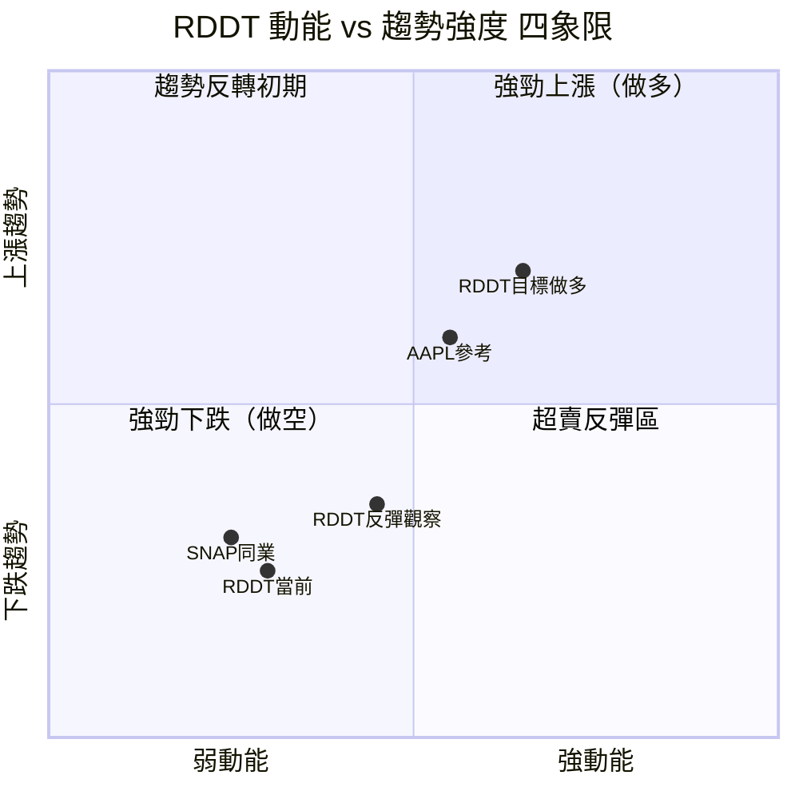

```
四象限位置解讀：
  📍 當前位置：第三象限（強動能下跌區）偏向第四象限（超賣反彈區）
  
  → 目前仍在空頭動能主導區
  → 接近超賣邊界，潛在反彈機率升高
  → 需等待動能指標轉向確認
```

---

### 📊 ATR 波動率分析

```
ATR(14) 波動率評估

估算ATR：~$8.50（約佔當前股價 6.0%）

波動率分類：
  低波動（ATR < $5）     ░░░░░░░░░░░░
  中波動（$5-$10）       ▓▓▓▓▓▓▓▓▓▓ ← 當前位置
  高波動（$10-$15）      
  極高波動（$15+）       

ATR波動率進度條（相對值）：
  當前ATR強度    ▓▓▓▓▓▓▓░░░░░░░░░░░░░   60%  🟡 中高

日內波動範圍估算：
  當日預期高點：$142.45 + $8.50 = ~$150.95
  當日預期低點：$142.45 - $8.50 = ~$133.95
  當日波動範圍：約 ±6.0%

止損設置參考（基於ATR）：
  緊止損（1x ATR）：  $142.45 ± $8.50
  標準止損（2x ATR）：$142.45 ± $17.00
  寬止損（3x ATR）：  $142.45 ± $25.50
```

---

### 📊 Beta 與市場相關性

| 指標 | 數值 | 解讀 | 評估 |
|:----:|:----:|:----:|:----:|
| Beta（估算） | ~1.85 | 高Beta股，市場波動放大器 | 🔴 高風險 |
| 與S&P500相關性 | ~0.65 | 中高度正相關 | 🟡 注意 |
| 與SNAP相關性 | ~0.75 | 同業高相關 | 🟡 注意 |
| 與META相關性 | ~0.70 | 社群媒體聯動 | 🟡 注意 |
| 52週波動率（年化） | ~85% | 高波動成長股 | 🔴 高風險 |
| 夏普比率（近期） | ~-0.8 | 負值，風報比差 | 🔴 |

```
Beta解讀：
  市場上漲1% → RDDT預期上漲 ~1.85%
  市場下跌1% → RDDT預期下跌 ~1.85%
  
  ⚠️ 高Beta股在空頭市場風險尤為突出
  ⚠️ 需搭配大盤走勢判斷操作方向
```

---

## 7. 多時框架總結

### 📊 時框架評分矩陣

| 時框架 | 趨勢 | 均線 | 動能 | 量能 | 形態 | 綜合評分 | 偏向 |
|:------:|:----:|:----:|:----:|:----:|:----:|:--------:|:----:|
| **月線** | 🟡 -20 | 🔴 -25 | 🟡 中性 | 🔴 空頭 | 🔴 頭肩 | **45/100** | 🟡 偏空 |
| **週線** | 🔴 -38% | 🔴 空排 | 🔴 弱勢 | 🔴 放量 | 🔴 下降通道 | **28/100** | 🔴 強空 |
| **日線** | 🔴 持續 | 🔴 三線 | 🟡 超賣 | 🔴 偏空 | 🔴 破頸線 | **32/100** | 🔴 空頭 |
| **4H線** | 🔴 下降 | 🔴 空排 | 🟡 接近超賣 | 🟡 中性 | 🟡 待定 | **38/100** | 🔴 偏空 |

---

### 📊 綜合訊號矩陣

```
綜合訊號矩陣總結

                多空訊號分布（共20項指標）
  ┌─────────────────────────────────────────────────┐
  │  🔴 強烈賣出  (10項)  ██████████░░░░░░░░░░  50% │
  │  🟡 中性偏空  (6項)   ██████░░░░░░░░░░░░░░  30% │
  │  🟢 中性偏多  (2項)   ██░░░░░░░░░░░░░░░░░░  10% │
  │  🟢 強烈買入  (2項)   ██░░░░░░░░░░░░░░░░░░  10% │
  └─────────────────────────────────────────────────┘

  強烈賣出項目：均線死亡排列、跌破布林下軌、
              MACD死叉、ADX空頭、放量下跌、
              跌破頸線、跌破斐波那契61.8%、
              趨勢反轉確認、頭肩頂完成、
              週線破位

  強烈買入項目：分析師評級買入、分析師目標$233.22

  綜合偏向：🔴 偏空（短中期），🟡 中性（長期）
```

---

## 8. 交易策略建議

### 🗺️ 策略決策流程圖

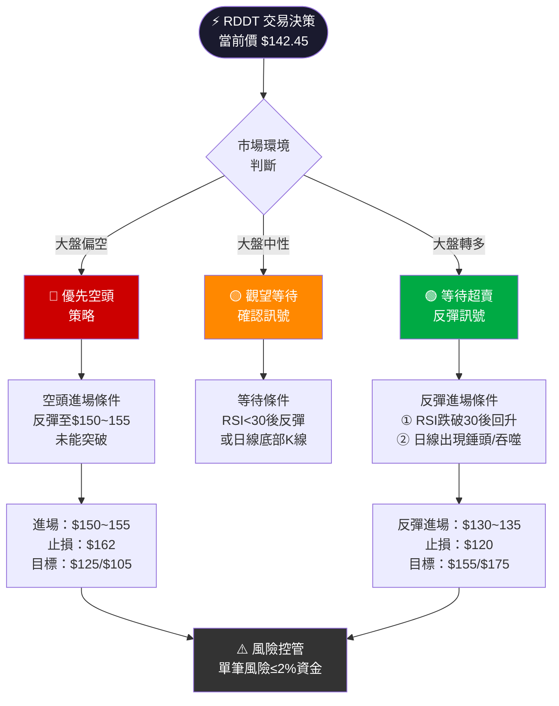

---

### 📋 多頭（做多）策略

| 項目 | 保守策略 | 積極策略 |
|:----:|:--------:|:--------:|
| **進場條件** | RSI跌至30後回升，出現底部K線確認 | 價格守住$125-130支撐區後反彈 |
| **進場價位** | $130～$135 | $125～$130 |
| **止損價位** | $120.00（低於$125支撐） | $112.00（低於$112支撐） |
| **目標一** | $150.00（頸線下緣） | $155.00（頸線） |
| **目標二** | $162.00（前支撐轉阻力） | $175.00（MA200） |
| **目標三** | - | $200.00（Fib 50%） |
| **風險金額** | ~$10-13/股 | ~$13-18/股 |
| **報酬金額** | ~$15-30/股（T1-T2） | ~$25-70/股（T1-T3） |
| **風險報酬比** | 1：1.5~2.3 | 1：1.9~4.5 |
| **建議倉位** | 50%倉位 | 30%倉位（高風險） |
| **適用場景** | 大盤止跌回穩 | 大盤強勁反彈 |

---

### 📋 空頭（做空/放空）策略

| 項目 | 保守策略 | 積極策略 |
|:----:|:--------:|:--------:|
| **進場條件** | 反彈至阻力區後出現賣出K線 | 破$135後確認 |
| **進場價位** | $148～$155（反彈阻力區放空） | $138～$142（當前位置） |
| **止損價位** | $162.00（突破近阻力） | $152.00（突破$150） |
| **目標一** | $130.00 | $125.00 |
| **目標二** | $125.00 | $112.00 |
| **目標三** | $112.00 | $105.00 |
| **風險金額** | ~$7-14/股 | ~$10-14/股 |
| **報酬金額** | ~$18-43/股（T1-T3） | ~$13-37/股（T1-T3） |
| **風險報酬比** | 1：2.5~4.5 | 1：1.3~3.7 |
| **建議倉位** | 40%倉位 | 30%倉位 |
| **適用場景** | 大盤持續弱勢 | 短線突破確認 |

---

### ⭐ 整體訊號強度評估

```
整體訊號強度評星（滿分5星）：

  技術訊號強度（空頭）：  ★★★★☆  4.0/5  🔴
  技術訊號強度（多頭）：  ★★☆☆☆  2.0/5  🔴
  基本面分析師支持：       ★★★★☆  4.0/5  🟢
  風險報酬比（空頭）：     ★★★★☆  4.0/5  🟢
  風險報酬比（多頭）：     ★★★☆☆  3.0/5  🟡
  操作確定性：             ★★★☆☆  3.0/5  🟡

  綜合建議：  短期偏空，中長期逢低布局
```

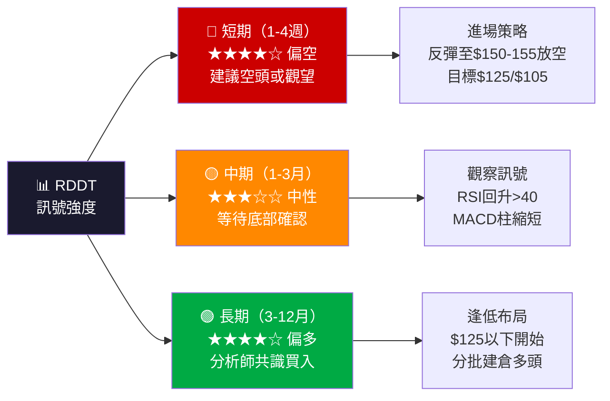

---

## 9. 風險提示與監控

### ✅ 關鍵監控指標 Checklist

```
🔍 日常監控清單（每日收盤後確認）

價格行為：
  ☐ 是否跌破 $135.00（近支撐，需警戒）
  ☐ 是否跌破 $125.00（中支撐，空頭加速）
  ☐ 是否收復 $150.00（初步反彈訊號）
  ☐ 是否收復 $160.00（趨勢改善訊號）

技術指標：
  ☐ RSI 是否跌破 30（超賣確認）
  ☐ RSI 是否從30以下回升（反彈訊號）
  ☐ MACD 柱狀圖是否開始縮短（動能衰減）
  ☐ MACD 是否出現金叉（轉多訊號）
  ☐ 成交量是否出現異常放大

均線監控：
  ☐ 是否回升至 MA20 (~$175)（短期趨勢改善）
  ☐ 是否站穩 MA200 (~$170)（長期趨勢改善）
  ☐ MA20 是否死叉 MA50（中期空頭確認）

基本面訊號：
  ☐ 季度財報發布日期（注意業績公告）
  ☐ 分析師評級是否調整
  ☐ 大股東持股變化（SEC申報）
  ☐ 重大新聞/用戶數據更新
```

---

### 🚨 風險場景分析

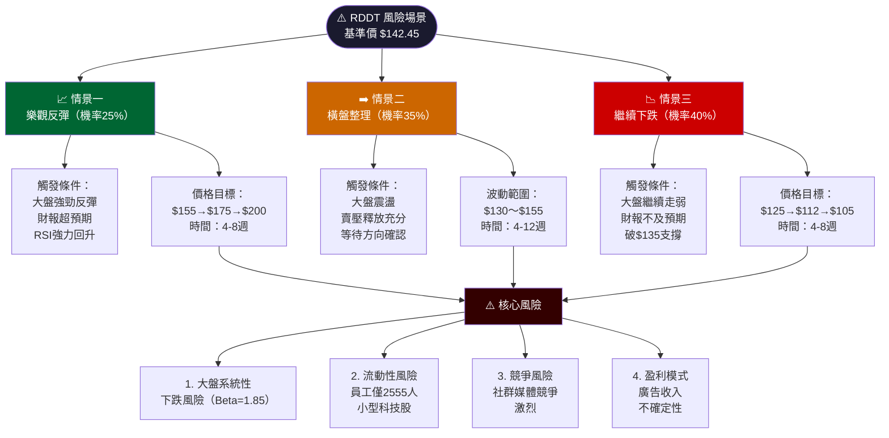

---

### 📊 風險量化摘要

```
風險量化總表：

  最大回撤風險（至強支撐$105）：
  $142.45 → $105.00 = -$37.45（-26.3%）
  █████████████░░░░░░░░░░░░░░░   風險大
  
  反彈潛在收益（至均值目標$233）：
  $142.45 → $233.22 = +$90.77（+63.7%）
  ████████████████████████████   潛力高
  
  短期合理目標（空頭止跌後）：
  $142.45 → $175.00 = +$32.55（+22.8%）
  ████████████░░░░░░░░░░░░░░░░   中等
  
  風險提示等級：
  市場風險      ▓▓▓▓▓▓▓▓░░   🔴 高
  流動性風險    ▓▓▓▓▓░░░░░   🟡 中
  波動性風險    ▓▓▓▓▓▓▓░░░   🔴 高
  基本面風險    ▓▓▓▓░░░░░░   🟡 中低
  整體風險評級  ▓▓▓▓▓▓▓░░░   🔴 偏高
```

---

### 📌 操作建議總結

```
╔══════════════════════════════════════════════════════════╗
║              RDDT 操作建議總結（2026-02-24）             ║
╠══════════════════════════════════════════════════════════╣
║                                                          ║
║  當前狀態：🔴 空頭主導，接近超賣區                      ║
║                                                          ║
║  短期操作（1-4週）：                                     ║
║  ▶ 優先等待反彈至 $148~155 再考慮放空                   ║
║  ▶ 或等待 RSI < 30 後確認超賣反彈訊號                   ║
║  ▶ 止損嚴格設置，單筆風險控制在2%以內                   ║
║                                                          ║
║  中期佈局（1-3月）：                                     ║
║  ▶ 關注 $125～$130 區間是否出現底部訊號                 ║
║  ▶ 等待週線MACD金叉確認後再建倉多頭                     ║
║                                                          ║
║  長期投資（3-12月）：                                    ║
║  ▶ 分析師目標均值 $233（+63.7%上漲空間）                ║
║  ▶ $105～$125 區間為長線佈局良機                        ║
║  ▶ 建議分3次進場，分散進場成本                          ║
║                                                          ║
╚══════════════════════════════════════════════════════════╝
```

---

> ### ⚠️ 免責聲明
>
> 本報告為 **AI 自動生成**，所有技術指標數值（RSI、MACD、ATR、均線等）均為基於12個月歷史價格數據之**估算值**，非精確計算結果。
>
> 本報告**僅供學術研究與技術分析學習參考之用**，不構成任何形式之投資建議。股票投資涉及重大風險，投資人可能損失全部本金。請在進行任何投資決策前，諮詢持牌專業財務顧問，並根據個人財務狀況、風險承受能力及投資目標做出獨立判斷。
>
> **過去的技術形態與價格走勢，不保證未來相同結果。**

---
*報告生成時間：2026-02-24 ｜ 分析師：AI Technical Analyst ｜ 版本：v2.0*