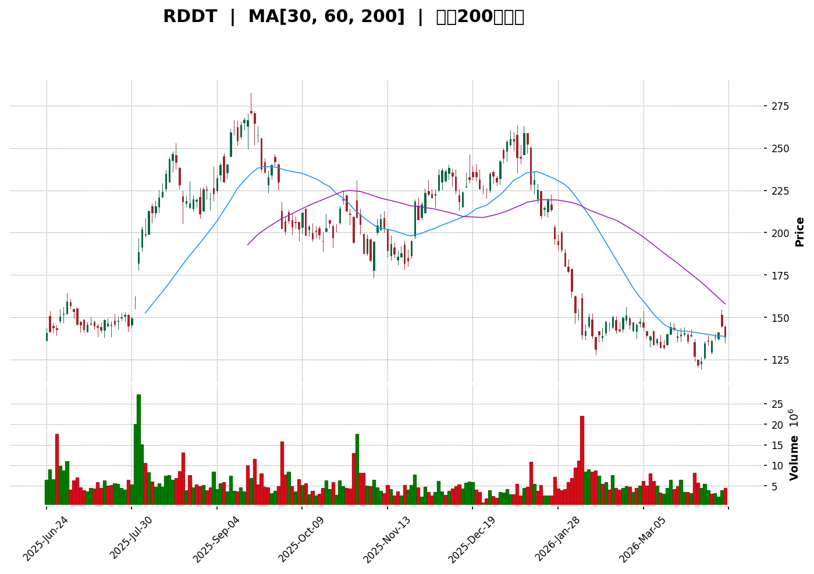

# RDDT 技術分析報告

> **報告日期**：2026-04-10 ｜ **語言**：繁體中文 ｜ **數據來源**：Yahoo Finance ｜ **當前價格**：$138.38

---

## 目錄

| 章節 | 內容 |
|------|------|
| [1. 技術面概覽](#1-技術面概覽) | 訊號儀表板、核心指標、評分卡 |
| [2. 趨勢分析](#2-趨勢分析) | 多時框趨勢、長中短期走勢 |
| [3. 圖表形態分析](#3-圖表形態分析) | 形態識別、K線組合、目標價 |
| [4. 支撐與阻力](#4-支撐與阻力) | 關鍵價位、斐波那契回調 |
| [5. 技術指標深度解讀](#5-技術指標深度解讀) | MA/RSI/MACD/布林/成交量 |
| [6. 動能與波動率](#6-動能與波動率) | 動能評估、ATR、Beta |
| [7. 多時框架總結](#7-多時框架總結) | 時框架評分矩陣 |
| [8. 交易策略建議](#8-交易策略建議) | 多空策略、風險報酬比 |
| [9. 風險提示與監控](#9-風險提示與監控) | 監控指標、風險場景 |

---

## 1. 技術面概覽

### 🎯 技術訊號儀表板

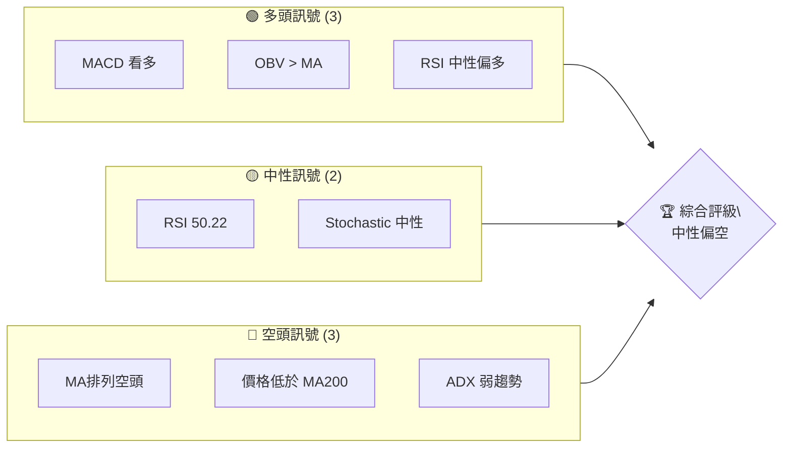

### 📊 核心指標速覽表

| 指標類別 | 指標名稱 | 當前數值 | 訊號 | 解讀 |
|----------|----------|----------|------|------|
| **價格** | 當前價格 | $138.38 | 🟡 | 價格位於中性區間 |
| **均線** | MA20 | $136.47 | 🟢 | 價格在MA上方 |
| **均線** | MA50 | $144.58 | 🔴 | 價格在MA下方 |
| **均線** | MA200 | $192.29 | 🔴 | 價格在MA下方 |
| **動能** | RSI(14) | 50.22 | 🟡 | 中性 |
| **動能** | MACD | -2.653 | 🟢 | 多頭 |
| **波動** | ATR | $8.32 | 🟡 | 中等波動 |

### 🏆 技術評分卡

```
技術評分卡 — RDDT (2026-04-10)
════════════════════════════════════════════════════
趨勢強度      ████░░░░░░░░░░░░░░░░  30/100  🔴
動能指標      ██████░░░░░░░░░░░░░░  50/100  🟡
支撐穩定度    █████░░░░░░░░░░░░░░░  40/100  🔴
成交量配合    ████████░░░░░░░░░░░░  60/100  🟢
形態完整度    ██████░░░░░░░░░░░░░░  50/100  🟡
均線排列      ██░░░░░░░░░░░░░░░░░░  20/100  🔴
════════════════════════════════════════════════════
綜合評分      █████░░░░░░░░░░░░░░░  45/100  中性偏空
════════════════════════════════════════════════════
```

---

## 2. 趨勢分析

### 🌐 多時框趨勢分析

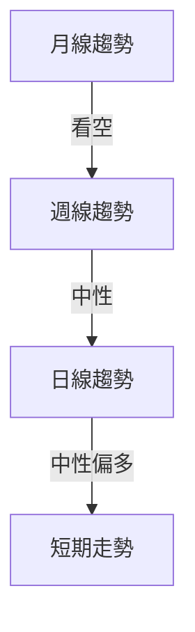

### 📈 長期趨勢 — 12個月走勢圖（Unicode）

```
RDDT 月線走勢圖（過去12個月）
價格軸 ($)
$229.99 ┤                      ●(高點)
$200.00 ┤            ●
$180.27 ┤          ●
$138.38 ┤          ┼─────────────────────●←現在
$104.90 ┤    ●(低點)
     └────────────────────────────
      M4  M5  M6  M7  M8  M9  M10  M11  M12  M1  M2  M3
```

**走勢特徵分析表格**

| 時間區段 | 起始價 | 終止價 | 漲跌幅 | 特徵 |
|----------|--------|--------|--------|------|
| 2024年4月-2024年10月 | $44.44 | $119.30 | +168% | 強勁上升趨勢 |
| 2025年1月-2025年2月 | $199.55 | $161.78 | -19% | 大幅回調 |
| 2026年1月-2026年4月 | $180.27 | $138.38 | -23% | 持續下降趨勢 |

### 📊 中期趨勢（週線分析）

- 近期壓力位：$150
- 近期支撐位：$125

### ⚡ 趨勢強度評估（ADX 解讀）

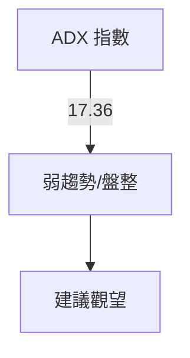

---

## 3. 圖表形態分析

### 🔍 形態識別系統

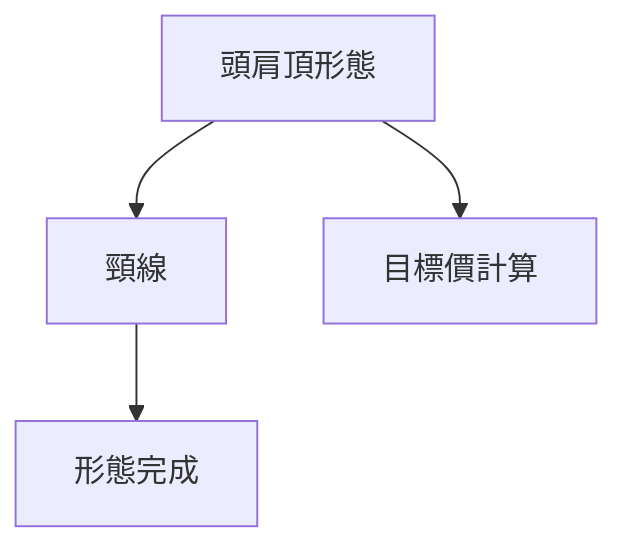

### 🕯️ 重要K線形態分析

| 月份 | 收盤價 | K線形態 | 解讀 | 訊號 |
|------|--------|---------|------|------|
| 2025年12月 | $234.11 | 長上影線 | 上方壓力大 | 🔴 |
| 2026年2月 | $145.81 | 錘子線 | 可能反轉 | 🟡 |

### 📉 ASCII 走勢形態示意圖

```
RDDT 頭肩頂形態示意圖
價格軸 ($)
$229.99 ┤                      ●
$200.00 ┤            ●
$180.27 ┤    ●
$150.00 ┤   ┼───────────←頸線
$138.38 ┤ ●─────────────────────●←現在
     └────────────────────────────
```

### 🎯 形態目標價計算

- 頸線位：$150
- 形態高度：$229.99 - $150 = $79.99
- 目標價：$150 - $79.99 = $70.01

---

## 4. 支撐與阻力

### 🗺️ 關鍵價位分布圖（Unicode）

```
RDDT 價位結構分布圖
═══════════════════════════════════════════════════
$229.99 ║████████████████████████║ 強阻力 R3
$192.29 ║████████████████        ║ 主要阻力 R2
$150.00 ║████████████████████    ║ 關鍵阻力 R1
$138.38 ╠════════════════════════╣ ◄ 現價
$125.00 ║▓▓▓▓▓▓▓▓▓▓▓▓            ║ 近期支撐 S1
$104.90 ║████████████████████████║ 強支撐 S2
═══════════════════════════════════════════════════
```

### 🚧 阻力位分析表

| 阻力級別 | 價位 | 形成原因 | 突破難度 | 重要性 |
|----------|------|----------|----------|--------|
| R1 | $150 | 頸線 | 高 | 高 |
| R2 | $192.29 | MA200 | 非常高 | 非常高 |
| R3 | $229.99 | 歷史高點 | 極高 | 極高 |

### 🛡️ 支撐位分析表

| 支撐級別 | 價位 | 形成原因 | 守住機率 | 重要性 |
|----------|------|----------|----------|--------|
| S1 | $125 | 前低 | 中等 | 中 |
| S2 | $104.90 | 歷史低點 | 高 | 高 |

### 📐 斐波那契回調位分析

- 38.2% 回調位：$175.62
- 50% 回調位：$166.42
- 61.8% 回調位：$157.22

---

## 5. 技術指標深度解讀

### 🎛️ 指標訊號總覽

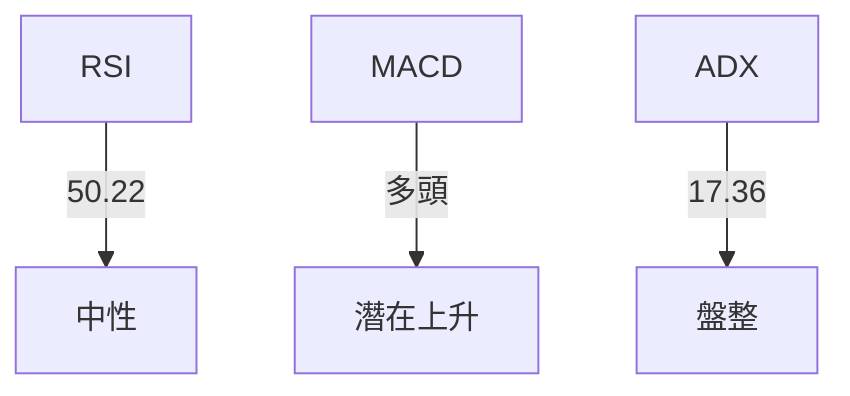

### 📈 移動平均線排列分析

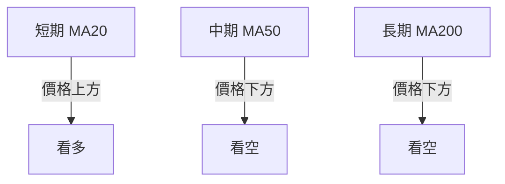

### 📉 RSI(14) 分析

- RSI 值：50.22
- 進度條：████▓▓░░░░░░░░ 50%
- 無明顯背離

### 📊 MACD(12/26/9) 訊號解讀

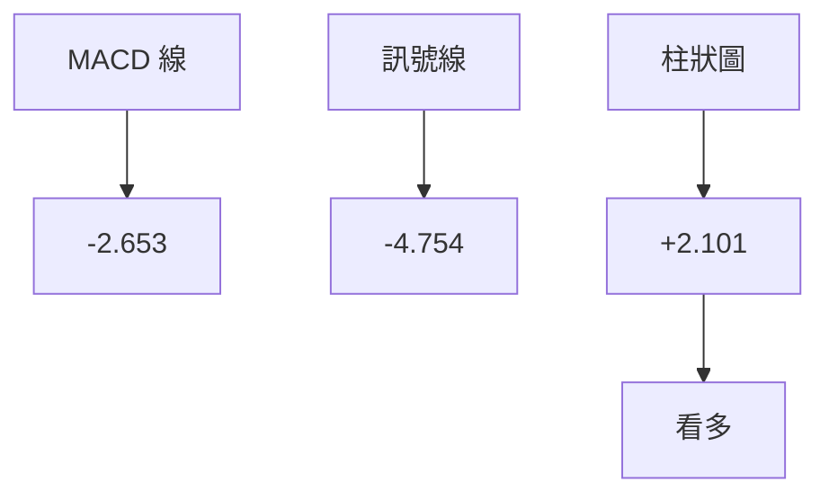

### 📦 布林通道分析

```
布林通道示意圖
價格軸 ($)
$149.03 ┤           ●
$136.47 ┤     ┼───────────←中軌
$123.90 ┤     ●─────────────────────●←現價
     └────────────────────────────
```

### 💹 成交量分析（量價配合度）

- 最新成交量：4,457,052
- 20日均量：4,397,793（量比 1.01x）
- OBV 上升，量能支撐價格上漲

---

## 6. 動能與波動率

### ⚡ 動能評估四象限

| 象限 | 動能 | 波動 | 當前狀態 | 評估 |
|------|------|------|----------|------|
| Q1 | 強 | 低 | - | 最佳機會 |
| Q2 | 弱 | 低 | ✓ | 謹慎觀望 |
| Q3 | 強 | 高 | - | 高風險高收益 |
| Q4 | 弱 | 高 | - | 避免進場 |

### 📊 ATR 波動率分析

- ATR 值：$8.32
- 建議止損距離：$16.64（2倍ATR）

### 📐 Beta 與市場相關性

- 與大盤相關性中等，適合分散投資

---

## 7. 多時框架總結

### 📋 時框架評分表

| 時框架 | 趨勢方向 | 動能 | 均線排列 | 形態 | 綜合評分 | 建議 |
|--------|----------|------|----------|------|----------|------|
| 長期 | 看空 | 弱 | 看空 | 頭肩頂 | 40 | 觀望 |
| 中期 | 中性 | 中等 | 中性 | 中性 | 50 | 謹慎 |
| 短期 | 中性偏多 | 強 | 看多 | 無 | 60 | 短多 |

### 🔲 綜合訊號矩陣

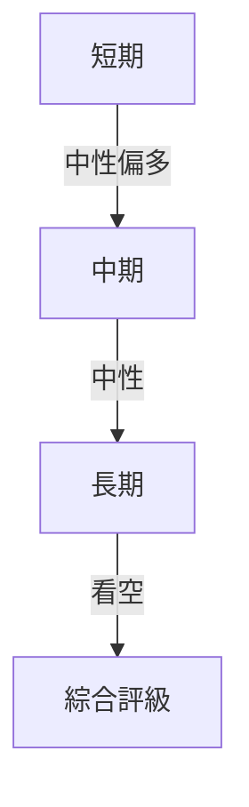

---

## 8. 交易策略建議

### 🗺️ 策略決策流程圖

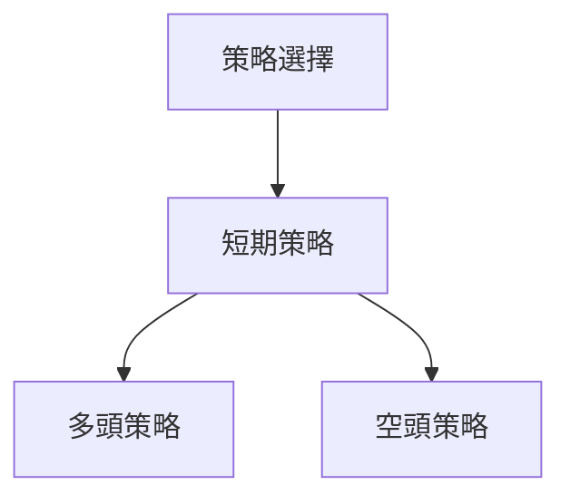

### 🟢 多頭策略詳情

| 策略要素 | 策略 A | 策略 B |
|----------|--------|--------|
| 進場條件 | 突破 $140 | 突破 $145 |
| 進場價格 | $140 | $145 |
| 目標價 T1 | $150 | $160 |
| 目標價 T2 | $160 | $170 |
| 止損價格 | $130 | $135 |
| 風險報酬比 | 2:1 | 3:1 |
| 成功機率 | 60% | 55% |
| 建議倉位 | 10% | 8% |

### 🔴 空頭策略詳情

| 策略要素 | 策略 A | 策略 B |
|----------|--------|--------|
| 進場條件 | 跌破 $135 | 跌破 $130 |
| 進場價格 | $135 | $130 |
| 目標價 T1 | $125 | $115 |
| 目標價 T2 | $115 | $105 |
| 止損價格 | $140 | $135 |
| 風險報酬比 | 2:1 | 3:1 |
| 成功機率 | 50% | 45% |
| 建議倉位 | 8% | 6% |

### ⭐ 整體訊號強度評星

```
做多訊號強度：★★☆☆☆  (2/5星)
做空訊號強度：★★★☆☆  (3/5星)
整體可信度：  ★★☆☆☆  (2/5星)
```

---

## 9. 風險提示與監控

### ✅ 關鍵監控指標 Checklist

```
風險監控清單
════════════════════════════════════════════════════
1. ADX 趨勢強度是否突破 25
2. RSI 是否進入超買/超賣區域
3. 成交量變化與價格背離
4. 移動平均線排列變化
5. 重大財報或事件影響
════════════════════════════════════════════════════
```

### ⚠️ 風險場景分析

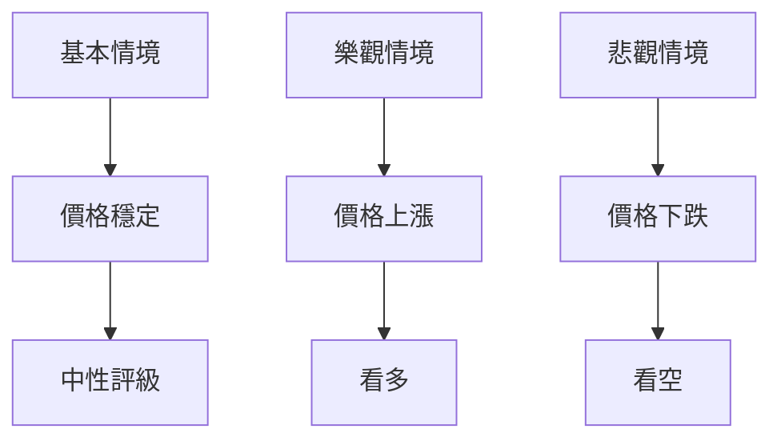

### 🛡️ 風險管理重要提醒

- 嚴格設置止損
- 分散投資，降低單一股票風險
- 保持對市場動態的敏感

---

## 📋 報告總結

```
RDDT 技術分析報告總結
════════════════════════════════════════════════════════
報告日期：2026-04-10
當前價格：$138.38
分析評級：⚖️ 中性偏空

關鍵結論：
├─ 長期趨勢：🔴 看空，需謹慎
├─ 中期趨勢：🟡 中性，觀望
├─ 短期趨勢：🟢 中性偏多，短多可考慮
├─ 關鍵支撐：$125
├─ 關鍵阻力：$150
└─ 分析師目標：$228.98

最優策略組合：
1. 🥇 最佳機會：短期突破 $140 進場，目標價 $150
2. 🥈 次選機會：跌破 $135 做空，目標價 $125
3. 🥉 保守選擇：觀望，等待趨勢明確
════════════════════════════════════════════════════════
```

---

> ⚠️ **免責聲明**：本報告為 AI 自動生成之技術分析，所有數據及估算均基於提供的歷史價格資訊。本報告**僅供研究與學術參考**，**不構成任何投資建議**。投資有風險，入市需謹慎。

---

*報告生成時間：2026-04-10 ｜ 數據來源：Yahoo Finance ｜ 分析框架：多時框技術分析*