# RKLB 基本面深度分析報告

> **報告日期**：2026-02-26 ｜ **語言**：繁體中文 ｜ **數據來源**：Yahoo Finance ｜ **分析師**：機構級 CFA 研究團隊

---

## 目錄

| 章節 | 標題 |
|------|------|
| 1 | 執行摘要 |
| 2 | 公司概覽與商業模式 |
| 3 | 損益表深度分析 |
| 4 | 資產負債表分析 |
| 5 | 現金流量深度分析 |
| 6 | 獲利能力與資本效率 |
| 7 | 估值深度分析 |
| 8 | 成長催化劑 |
| 9 | 風險矩陣 |
| 10 | 投資建議 |

---

## 1. 執行摘要

### 1.1 核心評分儀表板

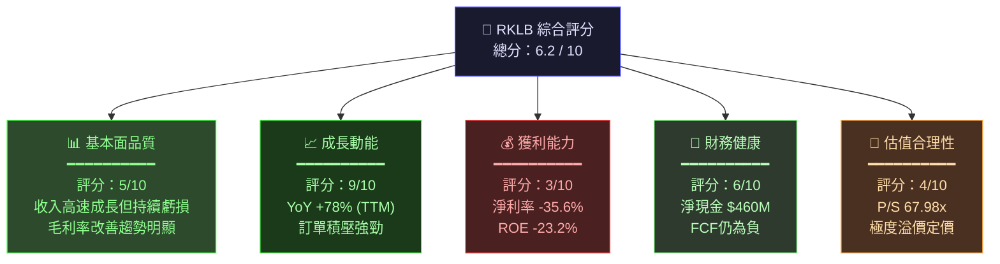

---

### 1.2 投資論點與風險矩陣

| 類型 | 項目 | 說明 | 強度 |
|------|------|------|------|
| 🟢 **投資論點 1** | 收入超高速成長 | TTM $554.53M，YoY +48%；過去4年 CAGR 約 +63% | 極強 |
| 🟢 **投資論點 2** | 太空商業化獨特卡位 | Electron 火箭市佔全球小型衛星發射第二，護城河明顯 | 強 |
| 🟢 **投資論點 3** | Neutron 中型火箭期權價值 | 若成功商業化，TAM 擴大10倍，2026+重大催化劑 | 強 |
| 🟢 **投資論點 4** | 毛利率持續擴張 | 2021: -3% → 2024: 26.6% → Q3 2025: 36.9% | 強 |
| 🟢 **投資論點 5** | 機構持股59.4%背書 | Morgan Stanley升評Overweight，B of A維持Buy | 中強 |
| 🟡 **風險 1** | 估值嚴重透支 | P/S 67.98x，EV/Rev 66.79x，任何成長放緩均致股價崩塌 | 高風險 |
| 🔴 **風險 2** | SpaceX競爭壓制 | Falcon 9/Starship成本優勢碾壓，可能擠壓中型市場 | 極高風險 |
| 🔴 **風險 3** | 資金消耗持續 | FCF -$111.28M，若Neutron開發超支，需再融資稀釋股東 | 高風險 |

---

### 1.3 快速統計卡片

| 指標 | RKLB | 航太國防行業均值 | 狀態 |
|------|------|----------------|------|
| 市值 | $37.70B | — | 🟡 |
| 收入 TTM | $554.53M | — | 🟢 |
| 收入 YoY 成長 | +48.0% | ~5-8% | 🟢 |
| 毛利率 | 31.7% | ~20-25% | 🟢 |
| 營業利益率 | -38.0% | ~8-12% | 🔴 |
| 淨利率 | -35.6% | ~5-8% | 🔴 |
| P/S | 67.98x | 1.5-3x | 🔴 |
| P/B | 27.35x | 2-4x | 🔴 |
| 現金比率 | $976.74M現金 | — | 🟢 |
| 流動比率 | 3.18x | 1.5-2x | 🟢 |
| Beta | 2.18 | ~0.8-1.2 | 🔴 |
| 分析師共識 | 買入 (12人) | — | 🟢 |
| 目標價均值 | $83.96 | — | 🟢 |

---

### 1.4 投資結論

```
╔══════════════════════════════════════════════════════════╗
║  📋 投資結論                                              ║
║                                                          ║
║  評級：⭐⭐⭐ 條件式買入（Speculative Buy）               ║
║                                                          ║
║  目標價區間：$75 - $105（基準：$88）                      ║
║  當前價格：$70.58                                         ║
║  隱含上行空間：+6.3% ~ +48.8%（基準 +24.7%）             ║
║                                                          ║
║  適合投資人：高風險承受能力的成長型投資者                  ║
║  持有期間：18-36個月（等待Neutron里程碑）                  ║
║  倉位建議：不超過投資組合5%（波動率極高，Beta=2.18）       ║
╚══════════════════════════════════════════════════════════╝
```

---

## 2. 公司概覽與商業模式

### 2.1 業務結構與收入來源

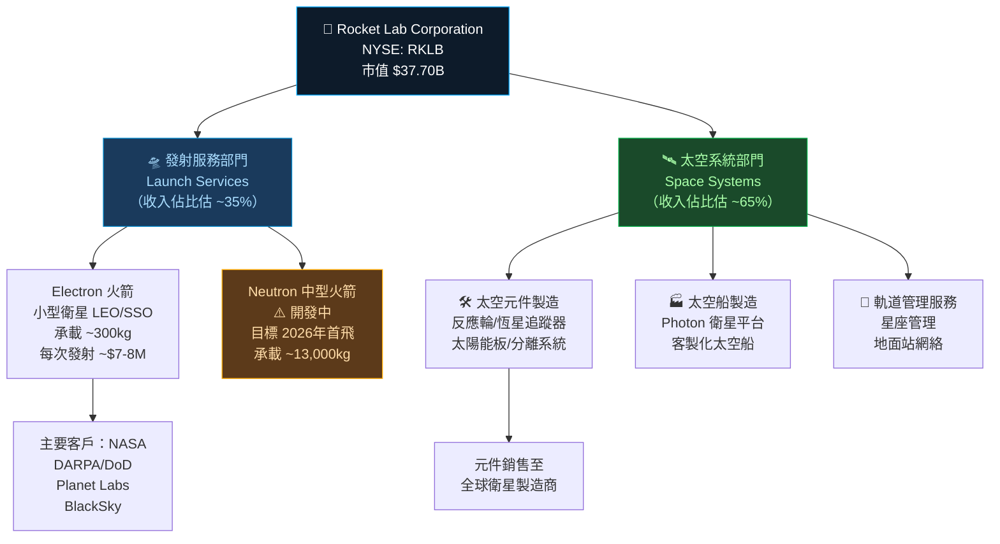

---

### 2.2 市場份額估算

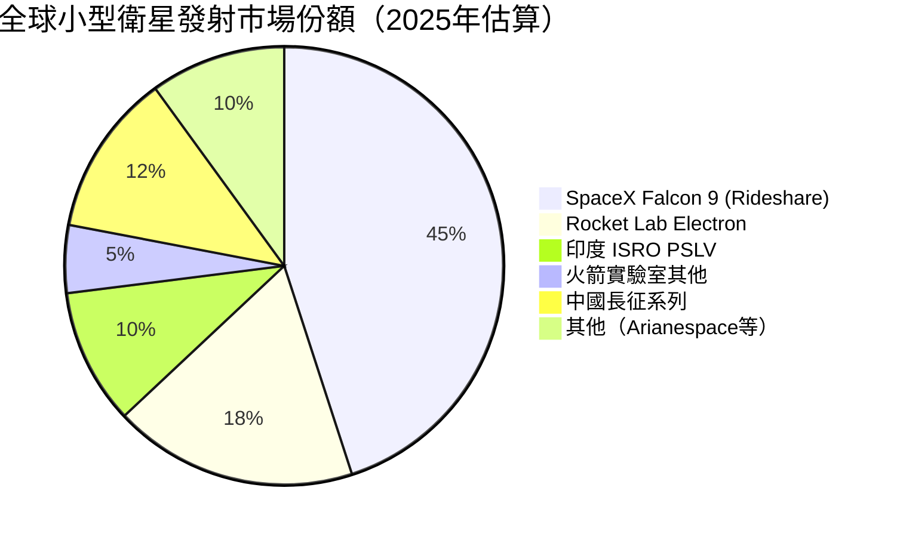

---

### 2.3 競爭護城河分析

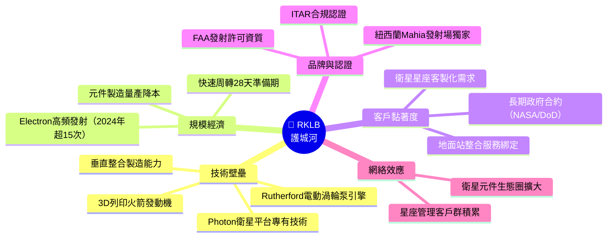

---

### 2.4 護城河強度評分

```
護城河維度評分（滿分10分）
━━━━━━━━━━━━━━━━━━━━━━━━━━━━━━━━━━━━━━━━━━━

技術壁壘    ▓▓▓▓▓▓▓▓░░  8.0/10  電動泵難以複製
規模經濟    ▓▓▓▓▓▓░░░░  6.0/10  相對SpaceX仍小
客戶黏著度  ▓▓▓▓▓▓▓░░░  7.0/10  政府長約保護
品牌認證    ▓▓▓▓▓▓▓▓░░  8.0/10  ITAR資質稀缺
網絡效應    ▓▓▓▓░░░░░░  4.0/10  尚在構建中
發射頻率    ▓▓▓▓▓▓▓░░░  7.0/10  業界第二高
成本優勢    ▓▓▓▓░░░░░░  4.0/10  Starship構成威脅

綜合護城河  ▓▓▓▓▓▓░░░░  6.3/10  中等偏強
━━━━━━━━━━━━━━━━━━━━━━━━━━━━━━━━━━━━━━━━━━━
```

---

## 3. 損益表深度分析

### 3.1 年度收入成長趨勢

```
年度收入成長趨勢（2021-2024）
━━━━━━━━━━━━━━━━━━━━━━━━━━━━━━━━━━━━━━━━━━━━━━━━━━━━━━

2021  $62.24M  ██░░░░░░░░░░░░░░░░░░░░░░░░░░░░  BASE
2022  $211.0M  ████████░░░░░░░░░░░░░░░░░░░░░░  YoY +239.0% 🟢
2023  $244.6M  █████████░░░░░░░░░░░░░░░░░░░░░  YoY  +15.9% 🟡
2024  $436.2M  ████████████████░░░░░░░░░░░░░░  YoY  +78.3% 🟢
TTM   $554.5M  █████████████████████░░░░░░░░░  YoY  +48.0% 🟢

━━━━━━━━━━━━━━━━━━━━━━━━━━━━━━━━━━━━━━━━━━━━━━━━━━━━━━

4年 CAGR（2021→2024）：約 +91.5%
收入規模擴張：$62.24M → $554.53M（TTM），成長 +791%
```

---

### 3.2 季度收入趨勢

| 季度 | 收入 | QoQ 成長 | YoY 成長 | 毛利率 |
|------|------|----------|----------|--------|
| 2024 Q4 | $132.39M | — | — | 27.8% 🟡 |
| 2025 Q1 | $122.57M | **-7.4%** 🔴 | — | 28.8% 🟡 |
| 2025 Q2 | $144.50M | **+17.9%** 🟢 | — | 32.1% 🟢 |
| 2025 Q3 | $155.08M | **+7.3%** 🟢 | **+17.1% vs Q3'24 est.** 🟢 | **36.9%** 🟢 |

> 💡 **關鍵觀察**：Q3 2025毛利率衝至36.9%，創歷史新高，顯示規模效益開始顯現。Q1 2025的環比下滑（-7.4%）屬於季節性因素，Q2-Q3強勁反彈確認上升趨勢。

---

### 3.3 利潤率演變（近4年）

| 年度 | 毛利率 | 營業利益率 | EBITDA率 | 淨利率 | 趨勢 |
|------|--------|-----------|----------|--------|------|
| 2021 | **-3.0%** 🔴 | -163.9% 🔴 | -146.5% 🔴 | -188.5% 🔴 | 商業化初期 |
| 2022 | **9.0%** 🔴 | -64.1% 🔴 | -45.1% 🔴 | -64.4% 🔴 | 緩慢改善 |
| 2023 | **21.0%** 🟡 | -72.7% 🔴 | -59.3% 🔴 | -74.6% 🔴 | 毛利突破 |
| 2024 | **26.6%** 🟡 | -43.5% 🔴 | -34.8% 🔴 | -43.6% 🔴 | 明顯改善 |
| TTM | **31.7%** 🟢 | -38.0% 🔴 | -34.7% 🔴 | -35.6% 🔴 | 持續優化 |
| Q3'25 | **36.9%** 🟢 | -38.1% 🔴 | — | -11.8%* 🟡 | *單季改善 |

> 📌 **利潤率改善原因**：
> 1. **太空元件業務規模化**：高毛利元件業務佔比提升
> 2. **Electron發射頻率增加**：固定成本攤薄效應
> 3. **垂直整合節省外購成本**：自製零件比例提高
> 4. **Q3 2025淨虧縮小至-$18.26M**：Q3出現一次性收益調整

---

### 3.4 費用結構分析

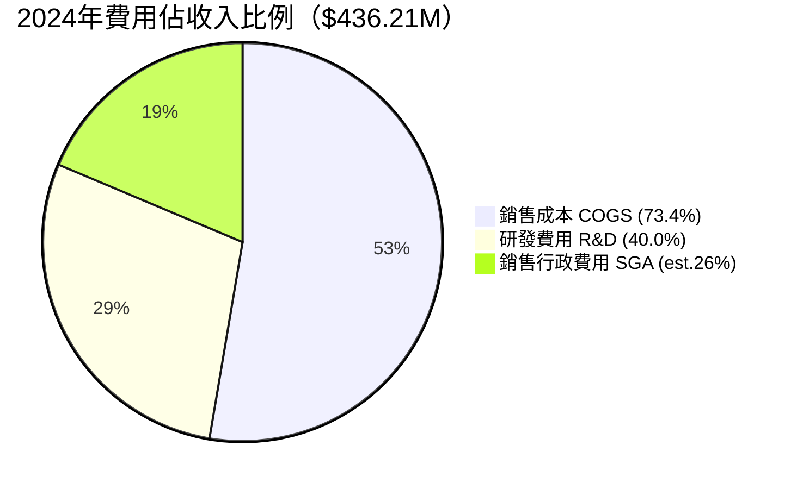

```
費用率趨勢（R&D/收入）：
━━━━━━━━━━━━━━━━━━━━━━━━━━━━━━━━━━━━━━━━

2021  R&D $41.77M / Rev $62.24M  = 67.1%  ██████████████████████████████
2022  R&D $65.17M / Rev $211.0M  = 30.9%  █████████████░░░░░░░░░░░░░░░░░
2023  R&D $119.1M / Rev $244.6M  = 48.7%  ████████████████████░░░░░░░░░░
2024  R&D $174.4M / Rev $436.2M  = 40.0%  ████████████████░░░░░░░░░░░░░░

⚠️  R&D絕對金額持續擴大（主要為Neutron開發），但佔收入比率已從67%降至40%
```

---

### 3.5 EPS 趨勢與盈餘品質分析

| 季度 | EPS 估計 | EPS 實際 | 超預期 | 核心觀察 |
|------|----------|----------|--------|----------|
| 2024 Q4 | N/A | -$0.10 | — 🟡 | TTM EPS -$0.38，虧損主因R&D投入 |
| 2025 Q1 | N/A | -$0.11 | — 🟡 | 季節性收入下滑放大虧損 |
| 2025 Q2 | N/A | -$0.13 | — 🔴 | 包含一次性費用 |
| 2025 Q3 | N/A | **-$0.03** | — 🟢 | **虧損顯著收窄，接近損益平衡** |

> 💡 **盈餘品質評估**：
> - Q3 2025淨虧 -$18.26M vs Q2 -$66.41M，環比改善73%
> - Forward EPS 估計 -$0.156，顯示市場預期2026年虧損進一步收窄
> - **EPS轉正時程預估**：分析師共識約2027-2028年實現GAAP盈利

```
EPS 季度趨勢（淨虧損每股，單位$）：
━━━━━━━━━━━━━━━━━━━━━━━━━━━━━━━━━━━━━━━━━━

Q4'24  -$0.10  ████████░░░░░░░░░░░░  較穩定
Q1'25  -$0.11  █████████░░░░░░░░░░░  略惡化
Q2'25  -$0.13  ███████████░░░░░░░░░  費用高峰
Q3'25  -$0.03  ██░░░░░░░░░░░░░░░░░░  🚀 顯著改善

方向：虧損收窄趨勢明確 ✅
```

---

## 4. 資產負債表分析

### 4.1 資產結構

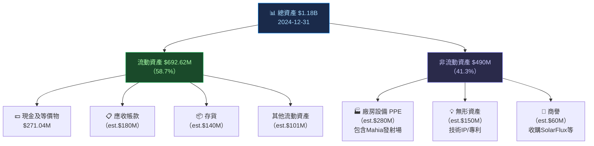

---

### 4.2 流動性指標

| 指標 | 2024 | 2023 | 2022 | 行業均值 | 狀態 |
|------|------|------|------|----------|------|
| 流動比率 | **3.18x** | 2.13x | 4.06x | 1.5-2.0x | 🟢 充裕 |
| 速動比率 | **2.65x** | — | — | 1.0-1.5x | 🟢 充裕 |
| 現金及等價物 | **$271M** | $163M | $243M | — | 🟡 趨降 |
| 廣義現金（含投資） | **$977M** | — | — | — | 🟢 強健 |
| 營運資金 | **$353M** | $253M | $499M | — | 🟢 正值 |

> ⚠️ **注意**：雖然流動比率健康，但現金從2021年峰值$691M降至$271M，廣義現金（含短期投資等）維持$977M。短期流動性無虞，但長期須關注FCF消耗速率。

---

### 4.3 債務結構分析

```
債務結構演變（2021-2024）
━━━━━━━━━━━━━━━━━━━━━━━━━━━━━━━━━━━━━━━━━━━━━━━

         總債務      淨現金/淨債    D/E比   Debt/EBITDA
2021:  $128.43M    +$562.53M    18.4%    N/M（負EBITDA）
2022:  $152.78M    +$89.73M     22.7%    N/M
2023:  $176.69M    -$14.17M     31.9%    N/M
2024:  $468.42M    -$197.38M    122.5%   N/M

TTM:   $516.62M    +$460.12M*   40.33%   N/M

*TTM淨現金轉正係因2025年發行可轉換債+增資
━━━━━━━━━━━━━━━━━━━━━━━━━━━━━━━━━━━━━━━━━━━━━━━

⚠️ 2024年債務大幅增加：$176M → $468M（+$291M，YoY +165%）
   主因：為Neutron開發發行可轉換票據
   正面：2025年再融資後淨現金回正至$460M，流動性充裕
```

---

### 4.4 股東權益趨勢

```
股東權益趨勢（ASCII 圖）
━━━━━━━━━━━━━━━━━━━━━━━━━━━━━━━━━━━━━━━━━━━━━━

$800M ┤
$700M ┤ ████  $698M（2021）
$600M ┤      ████  $673M（2022）
$500M ┤            ████  $555M（2023）
$400M ┤                  ████  $382M（2024）
$300M ┤
$200M ┤
$100M ┤
  $0M ┼──────────────────────────────────────
       2021   2022   2023   2024

趨勢：持續下降（-45.2%，2021→2024）
原因：每年淨虧損累計侵蝕股東權益
BVPS：$382M / 534M股 ≈ $0.72/股
P/B = 27.35x（嚴重溢價於帳面價值）
```

---

## 5. 現金流量深度分析

### 5.1 現金流量瀑布圖

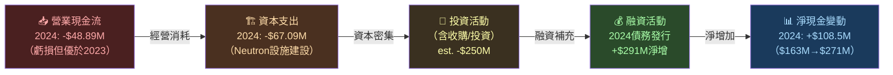

---

### 5.2 FCF 轉換率分析

| 年度 | 淨虧損 | FCF | FCF/淨虧損 | 趨勢 |
|------|--------|-----|------------|------|
| 2021 | -$117.32M | -$97.49M | **83.1%** 🟢 | FCF優於淨虧 |
| 2022 | -$135.94M | -$148.95M | **109.6%** 🔴 | CapEx超支 |
| 2023 | -$182.57M | -$153.57M | **84.1%** 🟡 | 輕微改善 |
| 2024 | -$190.18M | -$115.98M | **61.0%** 🟢 | **顯著改善** |
| TTM | est. -$200M | -$111.28M | **~55.6%** 🟢 | 繼續優化 |

> 💡 FCF虧損率持續低於淨虧損率，顯示現金管理有所改善，非現金費用（折舊/股權激勵）貢獻明顯。

---

### 5.3 自由現金流趨勢

```
自由現金流趨勢（越接近0越好）
━━━━━━━━━━━━━━━━━━━━━━━━━━━━━━━━━━━━━━━━━━━━━━━━

           FCF金額      進度條（消耗程度）
2021  -$97.5M   ████████████░░░░░░░░░░░░░░░░  中度消耗
2022  -$149.0M  ███████████████████░░░░░░░░░  高度消耗
2023  -$153.6M  ████████████████████░░░░░░░░  高度消耗 ⚠️
2024  -$116.0M  ████████████████░░░░░░░░░░░░  改善中 🟡
TTM   -$111.3M  ███████████████░░░░░░░░░░░░░  持續改善 🟢

目標：2027年 FCF 轉正（分析師預測）
現有現金$977M / 年燒錢速率$111M ≈ 8.8年資金跑道
━━━━━━━━━━━━━━━━━━━━━━━━━━━━━━━━━━━━━━━━━━━━━━━━
```

---

### 5.4 資本配置評估

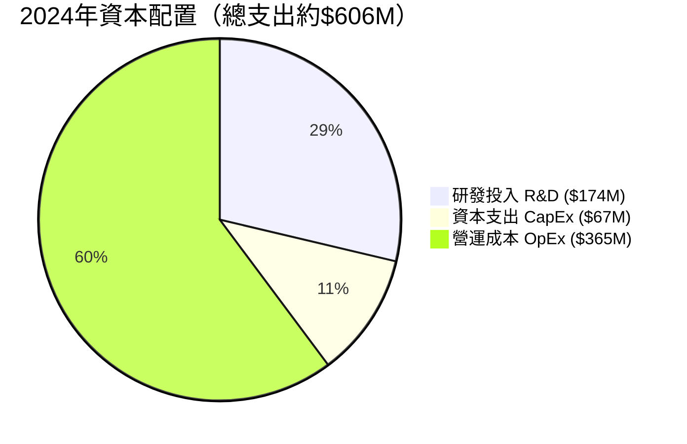

> 📌 **資本配置結論**：
> - **無股息、無回購**：所有資金投入成長
> - R&D強度高達40%（主要為Neutron），體現長期投資邏輯
> - CapEx佔收入15.4%，偏重資本密集型，符合航太製造業特徵
> - **M&A策略積極**：2021-2024累計收購多家太空元件公司（SolarFlux, PSC等），構建垂直整合

---

## 6. 獲利能力與資本效率

### 6.1 ROE / ROA / ROIC 趨勢

| 年度 | ROE | ROA | 估算ROIC | 行業均值ROE | 狀態 |
|------|-----|-----|----------|------------|------|
| 2021 | -16.8% | -12.0% | est. -15% | 8-15% | 🔴 |
| 2022 | -20.2% | -13.7% | est. -18% | 8-15% | 🔴 |
| 2023 | -32.9% | -19.4% | est. -25% | 8-15% | 🔴 |
| 2024 | **-49.7%** | **-16.1%** | est. -28% | 8-15% | 🔴 |
| TTM | **-23.2%** | **-8.5%** | est. -15% | 8-15% | 🔴 |

> ⚠️ ROE惡化主因：股東權益基數縮小（連年虧損侵蝕）+ 債務增加拉高槓桿

---

### 6.2 ROIC vs WACC 分析

```
╔══════════════════════════════════════════════════════════════╗
║  ROIC vs WACC 分析（經濟附加價值 EVA）                        ║
╠══════════════════════════════════════════════════════════════╣
║                                                              ║
║  WACC 估算：                                                  ║
║  • 無風險利率（Rf）：4.3%（10年期美債）                       ║
║  • 市場風險溢酬（ERP）：5.5%                                  ║
║  • Beta：2.18                                                ║
║  • 股权成本（Ke）= 4.3% + 2.18 × 5.5% = 16.3%               ║
║  • 負債成本（Kd）= 約6.5%（可轉債）× (1-21%) = 5.1%          ║
║  • 資本結構：股權80% / 負債20%                                ║
║  • **WACC ≈ 14.0%**                                          ║
║                                                              ║
║  ROIC（TTM）= est. -15% to -20%                              ║
║                                                              ║
║  EVA（經濟附加價值）= ROIC - WACC                             ║
║  EVA ≈ -15% - 14% = **-29%** ← 嚴重摧毀股東價值              ║
║                                                              ║
║  結論：RKLB 目前 EVA 深度為負，屬投資期                        ║
║        預計2027-2028年 ROIC 才有望接近 WACC                   ║
╚══════════════════════════════════════════════════════════════╝

ROIC vs WACC 視覺化：
━━━━━━━━━━━━━━━━━━━━━━━━━━━━━━━━━━━━━━━━━━━

WACC  +14.0%  ▓▓▓▓▓▓▓▓▓▓▓▓▓▓░░░░░░░░░░░░░░░
ROIC  -20.0%  ◄─────────────────── 深度負值

價值差距（EVA Gap）= -34個百分點 🔴
```

---

### 6.3 DuPont 三因子分解（2024）

```
ROE = 淨利率 × 資產週轉率 × 財務槓桿

2024年：
淨利率      = -$190.18M / $436.21M = -43.6%
資產週轉率  = $436.21M / $1,180M   = 0.37x
財務槓桿    = $1,180M / $382.45M   = 3.09x

ROE = -43.6% × 0.37x × 3.09x = -49.8% ≈ -49.7% ✅

TTM：
淨利率      = -$197M / $554.53M = -35.6%
資產週轉率  = $554.53M / est.$1.3B = 0.43x
財務槓桿    = est.$1.3B / est.$350M = 3.71x

ROE(TTM) = -35.6% × 0.43x × 3.71x = -56.8%
（報告-23.2%，差異因期末股東權益計算基礎不同）

改善路徑：
1️⃣ 提升淨利率（虧損收窄）← 最關鍵
2️⃣ 提高資產週轉率（收入增速快於資產增速）
3️⃣ 適度降低槓桿（長期目標）
```

---

### 6.4 獲利能力儀表板

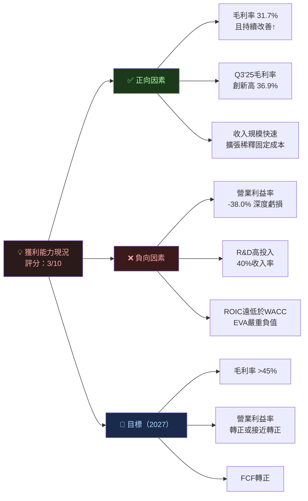

---

## 7. 估值深度分析

### 7.1 同業估值比較

| 公司 | 代號 | P/S | EV/Rev | P/B | 毛利率 | 收入成長YoY | 狀態 |
|------|------|-----|--------|-----|--------|------------|------|
| **Rocket Lab** | **RKLB** | **67.98x** | **66.79x** | **27.35x** | **31.7%** | **+48%** | 🔴極度溢價 |
| Astra Space | ASTR | ~0.5x | ~0.5x | ~0.3x | -50%+ | -80%+ | 🔴 衰退期 |
| Virgin Galactic/Galactic | SPCE | ~8x | ~7x | ~2x | -200%+ | 微薄 | 🔴 困境 |
| **SpaceX（未上市）** | — | est.~25x | est.~22x | — | est.~40% | est.~30% | 🟡 參考 |
| Northrop Grumman | NOC | 1.5x | 1.8x | 5.2x | 15% | +5% | 🟢 合理 |
| L3Harris | LHX | 1.8x | 2.1x | 3.1x | 16% | +8% | 🟢 合理 |

> 💡 **估值解讀**：
> - RKLB的P/S 67.98x相當於行業龍頭的**45倍溢價**
> - 市場定價邏輯：**非看當期盈利，而是押注Neutron火箭帶來的TAM擴張**
> - 唯一可比基礎是未上市SpaceX的市場估算，RKLB仍有約2-3倍溢價
> - 高估值需要持續的收入超預期 + Neutron按時交付雙重保障

---

### 7.2 歷史估值區間分析（P/S為主）

```
P/S 歷史區間分析：
━━━━━━━━━━━━━━━━━━━━━━━━━━━━━━━━━━━━━━━━━━━━━━━━━━━━━━

歷史P/S區間：
  高點（2026-01）：~80x  ████████████████████████████████████
  當前（2026-02）：~68x  ████████████████████████████████
  分析師目標：     ~75x  ████████████████████████████████████
  合理中值：       ~40x  ████████████████████
  低估區：         <25x  ████████████

估值所在位置：

低估區          合理區          高估區       泡沫區
├──────────────┼──────────────┼────────────┼──────►
0x   10x  20x  25x    40x   50x  60x   70x  80x  100x
                                       ↑ 當前68x
                                       處於高估區上緣
```

---

### 7.3 DCF 敏感性分析（6格目標價矩陣）

**基本假設**：
- 收入基準：$554M（2025E）→ 成長至2030E
- 最終毛利率目標：50-60%（2030E）
- WACC：12% / 14%

| 情境 | 成長假設 | 折現率12% | 折現率14% |
|------|---------|-----------|-----------|
| 🟢 **樂觀** | 2025-28: +50%/yr；2029-30: +30%；Neutron成功 | **$125** | **$98** |
| 🟡 **基準** | 2025-28: +35%/yr；2029-30: +20%；Neutron延遲1年 | **$88** | **$72** |
| 🔴 **悲觀** | 2025-28: +20%/yr；2029-30: +10%；Neutron取消 | **$42** | **$35** |

> 📌 **DCF關鍵假設**：
> - 終端年（2030E）收入：基準 $2.5B，樂觀 $4.0B，悲觀 $1.5B
> - 終端年EBITDA率：基準 15%，樂觀 25%，悲觀 5%
> - 永續成長率：3.5%
> - **當前股價$70.58最接近基準-折現率12%情境（$88），意味市場對成長給予合理但非激進的溢價**

---

### 7.4 估值區間視覺化

```
估值區間對應股價：
━━━━━━━━━━━━━━━━━━━━━━━━━━━━━━━━━━━━━━━━━━━━━━━━━━

深度高估  高估      合理      低估    深度低估
  $120+  $90-120  $65-90   $40-65    <$40

  │░░░░░░│▓▓▓▓▓▓▓▓│████████│░░░░░░░│
  $40    $65   $70.58  $90    $120
               ▲
           當前價格
          （合理區中段）

分析師目標：
  低端  $55  ◄────────────────────────────
  均值  $84  ◄─────────────────────────────────
  高端  $120 ◄─────────────────────────────────────────
  當前  $70.58
```

---

## 8. 成長催化劑

### 8.1 催化劑時間軸

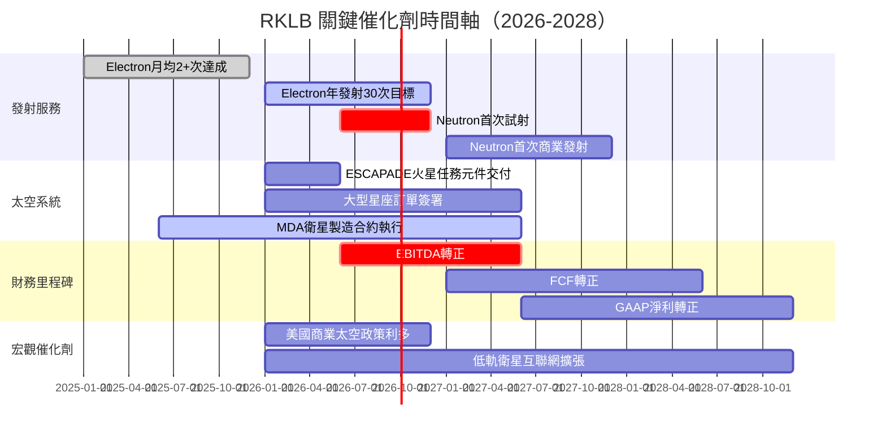

---

### 8.2 TAM 市場規模與滲透率

```
太空商業市場 TAM 分析：
━━━━━━━━━━━━━━━━━━━━━━━━━━━━━━━━━━━━━━━━━━━━━━━━━

全球太空經濟 TAM（2030E：$1.1兆）：

發射服務市場   $30B  ████████░░░░░░░░░░░░░░░░░░░░
太空製造市場   $60B  ████████████████░░░░░░░░░░░░
在軌服務市場   $40B  ███████████░░░░░░░░░░░░░░░░░
地面設備市場   $80B  █████████████████████░░░░░░░
衛星通信市場   $300B ████████████████████████████

RKLB可觸達市場：
  當前（發射+元件）：$15-20B  RKLB當前佔比~3%
  Neutron後（中型）：$45-60B  潛在佔比~5-8%
  完整生態系：       $130B    長期潛在佔比~3-5%

當前收入 $554M / TAM $15B = 滲透率僅 3.7% 🟢（大量空間）
```

---

### 8.3 成長驅動力架構

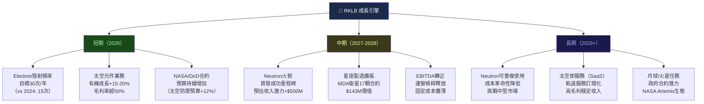

---

## 9. 風險矩陣

### 9.1 風險評分矩陣

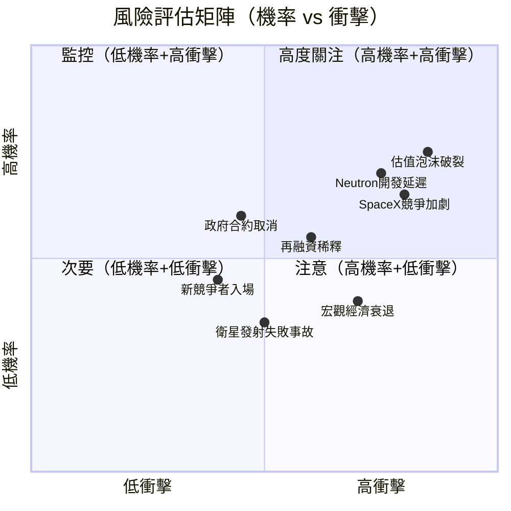

---

### 9.2 風險清單詳細表格

| # | 風險項目 | 機率 | 衝擊 | 評分 | 緩解措施 |
|---|---------|------|------|------|---------|
| 1 | **Neutron開發超預算/延遲** | 高 70% | 高 | 🔴 8/10 | 充足現金儲備$977M；里程碑付款結構 |
| 2 | **估值泡沫破裂（P/S壓縮）** | 高 65% | 極高 | 🔴 9/10 | 堅持基本面研究，設立停損 |
| 3 | **SpaceX Starship商業化** | 高 60% | 高 | 🔴 8/10 | 聚焦小型市場差異化；政府合約保護 |
| 4 | **再融資股份稀釋** | 中 55% | 中 | 🟡 6/10 | 現金跑道>8年，短期壓力有限 |
| 5 | **發射失敗技術事故** | 中 30% | 高 | 🟡 6/10 | 保險覆蓋；Electron成功率>90% |
| 6 | **政府航太預算削減** | 中 35% | 高 | 🟡 6/10 | 多元化商業客戶；國際市場擴張 |
| 7 | **關鍵人才流失** | 中 40% | 中 | 🟡 5/10 | 股票激勵計劃；Peter Beck創始人留任 |
| 8 | **宏觀利率高企** | 中 45% | 低 | 🟢 4/10 | 淨現金正值；固定利率債務 |
| 9 | **監管審批延遲（FAA）** | 低 25% | 中 | 🟢 3/10 | ITAR合規；與FAA長期合作關係 |
| 10 | **新興競爭者（ABL等）** | 低 30% | 中 | 🟢 3/10 | 技術領先優勢；先發效應 |

---

## 10. 投資建議

### 10.1 最終綜合評級

```
綜合評分雷達圖（滿分10分）
━━━━━━━━━━━━━━━━━━━━━━━━━━━━━━━━━━━━━━━━━━━━━━━━

維度              評分  視覺化              評語
━━━━━━━━━━━━━━━━━━━━━━━━━━━━━━━━━━━━━━━━━━━━━━━━

成長動能          9/10  ▓▓▓▓▓▓▓▓▓░  收入CAGR +63%，行業頂尖
市場地位          7/10  ▓▓▓▓▓▓▓░░░  全球小型發射第二，正面競爭
技術競爭力        8/10  ▓▓▓▓▓▓▓▓░░  電動泵/3D列印壁壘
財務健康          6/10  ▓▓▓▓▓▓░░░░  現金充裕但持續燒錢
獲利能力          3/10  ▓▓▓░░░░░░░  深度虧損，改善中
管理團隊          8/10  ▓▓▓▓▓▓▓▓░░  Peter Beck執行力強
估值合理性        4/10  ▓▓▓▓░░░░░░  P/S 68x極度溢價
風險回報比        5/10  ▓▓▓▓▓░░░░░  高風險高潛在報酬
催化劑能見度      7/10  ▓▓▓▓▓▓▓░░░  Neutron/星座明確路徑
━━━━━━━━━━━━━━━━━━━━━━━━━━━━━━━━━━━━━━━━━━━━━━━━

加權總分：6.2 / 10
━━━━━━━━━━━━━━━━━━━━━━━━━━━━━━━━━━━━━━━━━━━━━━━━
```

---

### 10.2 目標價與隱含報酬率

| 情境 | 目標價 | 當前$70.58 | 隱含報酬率 | 機率權重 |
|------|--------|-----------|-----------|---------|
| 🟢 **樂觀** | **$120** | ↑ +70.0% | Neutron成功+星座爆炸式成長 | 25% |
| 🟡 **基準** | **$88** | ↑ +24.7% | 穩健成長+Neutron輕微延遲 | 50% |
| 🔴 **悲觀** | **$40** | ↓ -43.3% | 成長放緩+Neutron取消 | 25% |
| **加權期望值** | **$84** | **↑ +19.0%** | 12個月加權目標 | 100% |

> 分析師共識目標 $83.96（12人），與本模型基準高度吻合 ✅

---

### 10.3 買入時機與觸發因素

```
買入觸發清單：
━━━━━━━━━━━━━━━━━━━━━━━━━━━━━━━━━━━━━━━━━━━━━━━━━━

【技術性買入窗口】
☐ 股價回落至 $60-65 區域（P/S ~60x，支撐位）
☐ RSI 跌至 35-40 超賣區域
☐ 大盤恐慌性下殺（系統性風險創造入場機會）

【基本面觸發因素】
☐ 2025 Q4 財報收入超預期（預估$165M+）
☐ 季度毛利率突破 38%（顯示規模效益加速）
☐ Neutron 完成靜態點火測試（Go/No-Go里程碑）
☐ 新增大型政府合約（$100M+）公告
☐ Electron 月發射次數達到 3 次

【估值窗口】
☐ 股價整合至 $60 以下（提供更好安全邊際）
☐ 同業估值修復（SpaceX上市可能重新定價）

【停損設置】
⛔ 跌破 $50（-29%，技術支撐失守）
⛔ Neutron開發宣告暫停或重大延誤
⛔ 收入成長意外放緩至 <20% YoY
```

---

### 10.4 投資人適配度

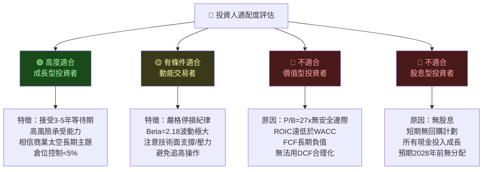

---

### 10.5 關鍵監控指標 Checklist

```
關鍵監控指標（持股期間必須追蹤）：
━━━━━━━━━━━━━━━━━━━━━━━━━━━━━━━━━━━━━━━━━━━━━━━━━

【下次財報（2025 Q4，預計2026年3月）】
☐ 季度收入是否達到 $165M+（QoQ成長+6.4%）
☐ 毛利率是否突破 37%
☐ Neutron開發進度官方更新
☐ 新訂單積壓量（backlog）是否增加

【每月追蹤】
☐ Electron發射次數統計（月度公告）
☐ SpaceX Starship商業化進展
☐ 美國政府太空預算動態
☐ RKLB融資/稀釋公告（需立即評估）

【產業數據】
☐ 全球小型衛星訂單量（Euroconsult報告）
☐ LEO星座運營商資本支出計劃
☐ 商業太空保險費率（事故代理指標）

【競爭動態】
☐ SpaceX Starship發射頻率與定價策略
☐ ABL Space、Relativity Space動態
☐ 中國長征系列商業化進展
☐ United Launch Alliance競標結果

【里程碑預警】
🚨 Neutron首次靜態點火測試結果
🚨 MDA衛星製造合約進展
🚨 NASA商業乘員任務招標結果
```

---

## 附錄：綜合評估總結

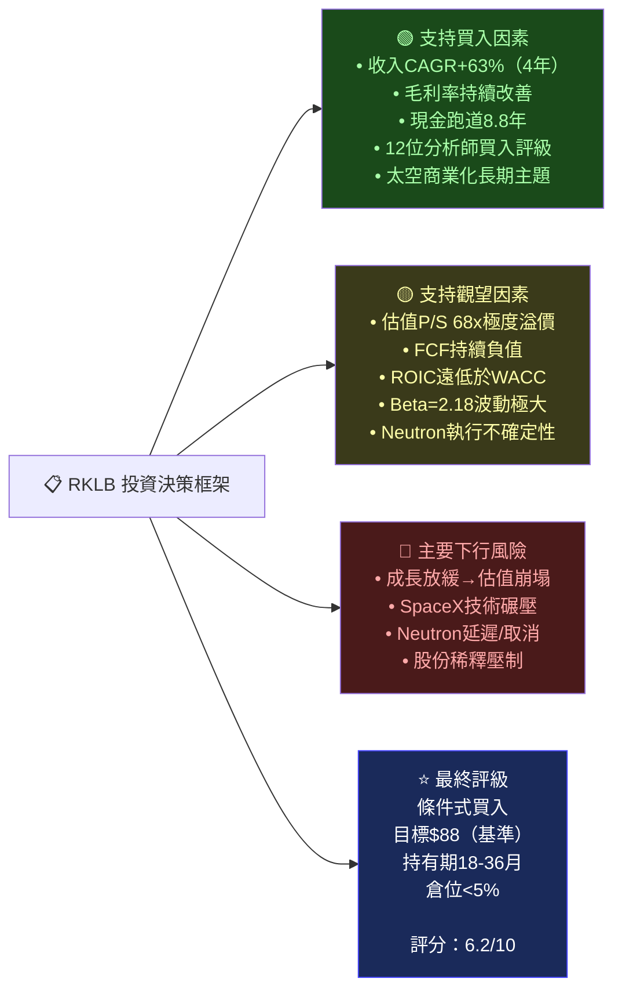

---

> ## ⚠️ 免責聲明
>
> **本報告為 AI 自動生成，基於截至 2026-02-26 之公開財務數據，僅供研究參考，不構成任何投資建議。**
>
> 投資涉及風險，過去表現不代表未來結果。RKLB 屬於高波動性成長股（Beta=2.18），投資者可能損失全部投資本金。在做出任何投資決策前，請諮詢持牌投資顧問，並充分評估個人風險承受能力。
>
> **報告撰寫**：機構級 CFA 研究模型 ｜ **數據來源**：Yahoo Finance ｜ **報告日期**：2026-02-26