# RKLB 基本面深度分析報告
> **報告日期**：2026-02-27 ｜ **語言**：繁體中文 ｜ **數據來源**：Yahoo Finance ｜ **分析師**：CFA 機構級研究

---

## 目錄

1. [執行摘要](#1-執行摘要)
2. [公司概覽與商業模式](#2-公司概覽與商業模式)
3. [損益表深度分析](#3-損益表深度分析)
4. [資產負債表分析](#4-資產負債表分析)
5. [現金流量深度分析](#5-現金流量深度分析)
6. [獲利能力與資本效率](#6-獲利能力與資本效率)
7. [估值深度分析](#7-估值深度分析)
8. [成長催化劑](#8-成長催化劑)
9. [風險矩陣](#9-風險矩陣)
10. [投資建議](#10-投資建議)

---

## 1. 執行摘要

### 🎯 核心評分儀表板

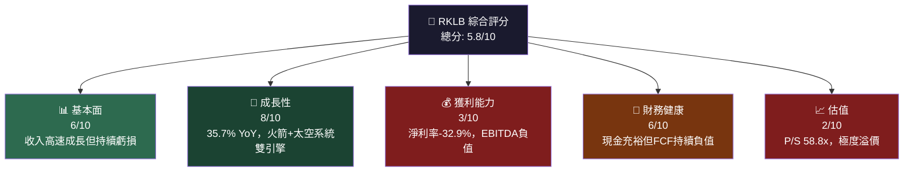

---

### 📋 5大投資論點 + 3大風險

| 類型 | 項目 | 核心論述 | 重要性 |
|------|------|----------|--------|
| 🟢 **投資論點1** | 收入加速成長 | FY2024收入$436M，YoY +78.3%；TTM $602M，YoY +35.7%，成長軌跡清晰 | ⭐⭐⭐⭐⭐ |
| 🟢 **投資論點2** | Neutron火箭潛力 | 中型火箭市場TAM>$10B，Neutron一旦商業化將顛覆現有格局 | ⭐⭐⭐⭐⭐ |
| 🟢 **投資論點3** | 毛利率持續改善 | 毛利率從2021年 -3%→2022年 9%→2023年 21%→2024年 26.6%，上升趨勢明確 | ⭐⭐⭐⭐ |
| 🟢 **投資論點4** | 太空系統業務高速擴張 | 太空系統收入佔比提升，較高毛利率產品組合改善整體盈利結構 | ⭐⭐⭐⭐ |
| 🟢 **投資論點5** | 機構持倉59.4%，分析師共識買入 | 12位分析師目標價均值$83.96，Morgan Stanley、B of A等大行背書 | ⭐⭐⭐ |
| 🔴 **風險1** | 估值極度高溢價 | P/S 58.8x、Forward P/E 473x，任何成長放緩將導致估值重挫 | ⚠️⚠️⚠️⚠️⚠️ |
| 🔴 **風險2** | 持續大額FCF負值 | FCF -$331M（TTM），現金消耗率高，需持續融資稀釋股東 | ⚠️⚠️⚠️⚠️ |
| 🟡 **風險3** | Neutron開發延遲風險 | Neutron計劃中，任何技術或監管延遲將打擊市場信心 | ⚠️⚠️⚠️ |

---

### 📊 快速統計卡片

| 指標 | RKLB 數值 | 行業均值估算 | 相對表現 |
|------|-----------|-------------|---------|
| 收入 TTM | $601.80M | — | 🟢 高速成長 |
| 收入成長 YoY | **+35.7%** | ~8-12% | 🟢 顯著超越 |
| 毛利率 | **34.4%** | ~25-30% | 🟢 優於均值 |
| 營業利益率 | **-28.4%** | ~8-15% | 🔴 顯著落後 |
| 淨利率 | **-32.9%** | ~5-10% | 🔴 虧損 |
| P/S 比率 | **58.8x** | ~2-5x | 🔴 極度高溢價 |
| Forward P/E | **473x** | ~20-30x | 🔴 極度高溢價 |
| 流動比率 | **4.08x** | ~1.5-2.0x | 🟢 充裕 |
| 淨現金 | **+$762.6M** | — | 🟢 強健 |
| FCF | **-$330.7M** | — | 🔴 持續消耗 |
| ROE | **-18.8%** | ~10-15% | 🔴 負值 |
| 機構持股 | **59.4%** | ~50-60% | 🟡 正常 |

---

### 🎯 投資結論

```
╔══════════════════════════════════════════════════════════╗
║  投資評級：⚡ 投機性買入（高風險成長）                      ║
║  當前價格：$66.25                                         ║
║  目標價區間：$55（悲觀）｜ $84（基準）｜ $120（樂觀）      ║
║  隱含報酬率：-17% ～ +27% ～ +81%                        ║
║  適合族群：高風險承受能力、成長型投資人                    ║
║  時間框架：18-36 個月                                    ║
╚══════════════════════════════════════════════════════════╝
```

---

## 2. 公司概覽與商業模式

### 🏗️ 業務結構與收入來源

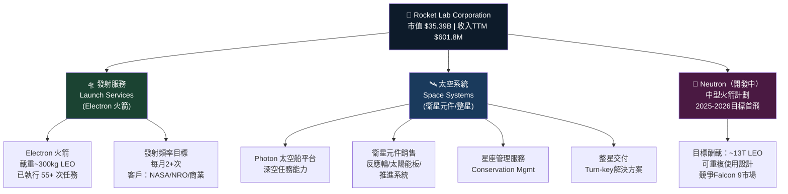

---

### 🥧 市場份額估算

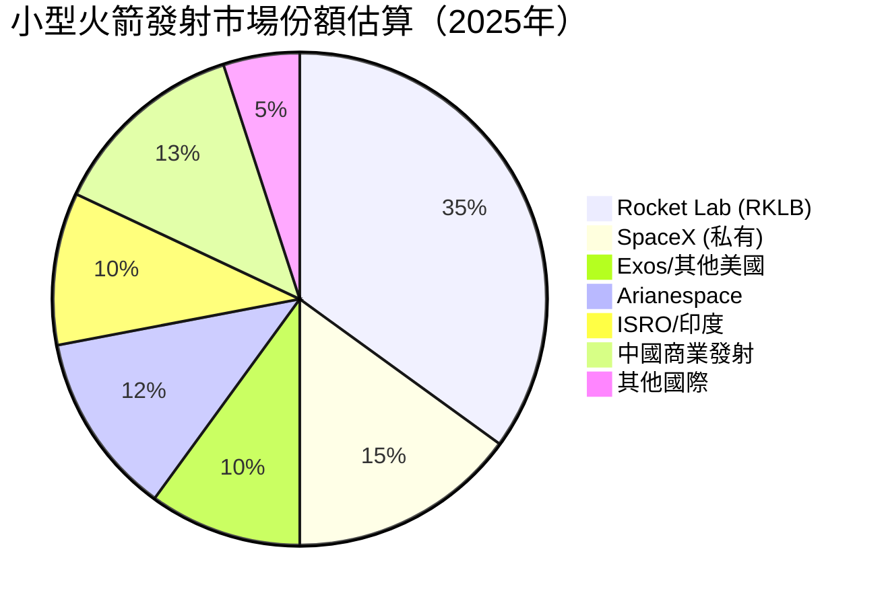

> 📌 **注意**：小型發射市場RKLB領先地位穩固；中型發射市場SpaceX Falcon 9佔據主導地位（>60%），RKLB Neutron將挑戰此市場。

---

### 🧠 競爭護城河分析

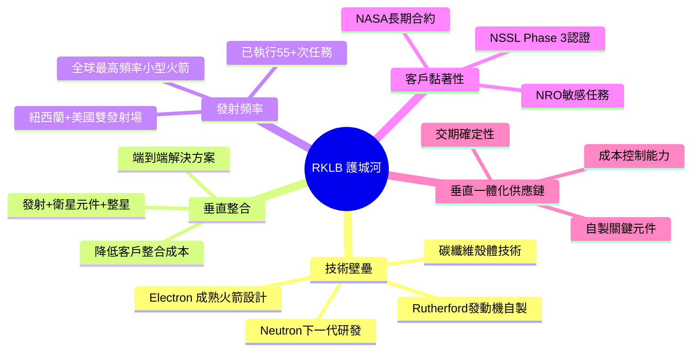

---

### 📊 護城河強度評分

```
技術壁壘    ████████░░  8.0/10  🟢 強 - Electron成熟，Rutherford發動機自研
垂直整合    ███████░░░  7.0/10  🟢 強 - 發射+衛星系統協同優勢
客戶黏著性  ███████░░░  7.0/10  🟢 強 - 政府長期合約，切換成本高
發射頻率    ████████░░  8.0/10  🟢 強 - 行業最高小型火箭發射率
成本優勢    █████░░░░░  5.0/10  🟡 中 - 仍在規模化過程中
品牌/聲譽  ███████░░░  7.0/10  🟢 強 - 業界知名度高，SpaceX之後最強
規模效應    ████░░░░░░  4.0/10  🟡 弱 - 規模尚小，需進一步擴大

綜合護城河強度：█████████░  6.6/10  🟡 中-強
```

---

## 3. 損益表深度分析

### 📈 年度收入成長趨勢

```
年度收入成長（近4年）
━━━━━━━━━━━━━━━━━━━━━━━━━━━━━━━━━━━━━━━━━━━━━━━━━━━━
2021  $62.24M   ████░░░░░░░░░░░░░░░░░░░░░░░░░░  基準年
2022  $211.00M  ████████████░░░░░░░░░░░░░░░░░░  YoY +239.1% 🚀
2023  $244.59M  ██████████████░░░░░░░░░░░░░░░░  YoY +15.9%  🟡
2024  $436.21M  █████████████████████████░░░░░  YoY +78.3%  🟢
TTM   $601.80M  ████████████████████████████████ YoY +35.7%  🟢
━━━━━━━━━━━━━━━━━━━━━━━━━━━━━━━━━━━━━━━━━━━━━━━━━━━━
規模：每格 ≈ $20M
```

> **分析**：2022年高速成長主要受益於SolAero Technologies收購（太空系統部門），2023年成長放緩至+15.9%，2024年因整星交付和太空系統訂單大幅增加再度加速至+78.3%。TTM維持35.7%高速成長，展示業務動能持續。

---

### 📊 季度收入趨勢（近4季）

| 季度 | 收入 | QoQ 成長 | YoY 成長 | 毛利潤 | 毛利率 |
|------|------|----------|----------|--------|--------|
| 2024Q4 | $132.39M | — | +78.3%(YoY) | $36.82M | 27.8% 🟡 |
| 2025Q1 | $122.57M | **-7.4%** 🔴 | — | $35.25M | 28.8% 🟡 |
| 2025Q2 | $144.50M | **+17.9%** 🟢 | — | $46.39M | 32.1% 🟢 |
| 2025Q3 | $155.08M | **+7.3%** 🟢 | +17.2%* | $57.31M | 36.9% 🟢 |

> *YoY vs 2024Q3（估算約$132M）
> **關鍵發現**：毛利率呈現明顯上升趨勢：27.8% → 28.8% → 32.1% → 36.9%，連續三季改善，顯示規模效益逐漸顯現與產品組合優化。

---

### 📉 利潤率演變（近4年）

| 年度 | 毛利率 | 營業利益率 | EBITDA率 | 淨利率 | 趨勢 |
|------|--------|-----------|---------|--------|------|
| 2021 | **-3.0%** 🔴 | -163.8% 🔴 | -146.5% 🔴 | -188.5% 🔴 | 早期投入期 |
| 2022 | **9.0%** 🔴 | -64.1% 🔴 | -45.1% 🔴 | -64.4% 🔴 | SolAero整合 |
| 2023 | **21.0%** 🟡 | -72.7% 🔴 | -59.3% 🔴 | -74.6% 🔴 | 改善中 |
| 2024 | **26.6%** 🟡 | -43.5% 🔴 | -34.8% 🔴 | -43.6% 🔴 | 持續改善 |
| TTM | **34.4%** 🟢 | -28.4% 🔴 | -30.7% 🔴 | -32.9% 🔴 | **顯著改善** |

> **利潤率改善原因分析**：
> 1. **產品組合優化**：太空系統高毛利元件佔比提升
> 2. **規模效益**：Electron發射頻率提高，固定成本攤薄
> 3. **垂直整合效益**：自製元件降低採購成本
> 4. **惡化原因**：R&D支出持續高位（2024年$174.4M，佔收入40%）壓縮營業利益

---

### 🥧 費用結構分析（以FY2024計算）

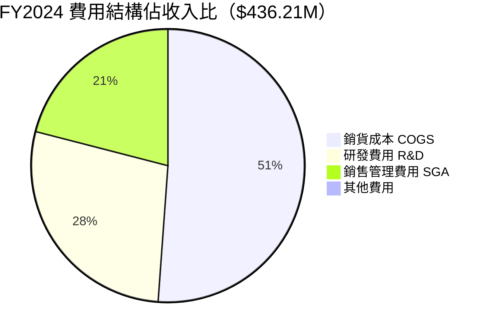

```
費用結構詳解（FY2024，$436.21M收入）
━━━━━━━━━━━━━━━━━━━━━━━━━━━━━━━━━━━━━━━━━━━━━━
COGS         $320.06M  ████████████████████████░  73.4%
研發費用      $174.39M  ██████████████░░░░░░░░░░░  40.0%
銷售管理費    $131.55M  ██████████░░░░░░░░░░░░░░░  30.1%
──────────────────────────────────────────────
總費用        $625.99M  ████████████████████████████████  143.5%
毛利潤        $116.15M  (26.6%)
營業虧損      -$189.80M  
━━━━━━━━━━━━━━━━━━━━━━━━━━━━━━━━━━━━━━━━━━━━━━
⚠️  R&D + SGA 合計佔收入 70%，是虧損主因
```

---

### 📊 EPS 趨勢與盈餘品質分析

| 季度 | EPS預估 | EPS實際 | 超預期/不及 | 分析 |
|------|---------|---------|-----------|------|
| 2025Q3 | N/A | 約-$0.03* | N/A | 虧損大幅收窄，淨虧$18.3M |
| 2025Q2 | N/A | 約-$0.13 | N/A | 淨虧$66.4M，含非現金項目 |
| 2025Q1 | N/A | 約-$0.12 | N/A | 淨虧$60.6M |
| 2024Q4 | N/A | 約-$0.10 | N/A | 淨虧$52.3M |

> *2025Q3淨虧$18.3M大幅改善，可能含一次性收益

```
EPS 趨勢（TTM滾動）
━━━━━━━━━━━━━━━━━━━━━━━━━━━━━━━━━━━━━━━━━
TTM EPS:  -$0.38/股
Forward EPS (共識): +$0.14/股  ← 預期2026年轉虧為盈

虧損收窄軌跡：
2021: -$0.42/股  ████████████  最深虧損
2022: -$0.44/股  █████████████ 
2023: -$0.55/股  ████████████████ 整合成本最高
2024: -$0.38/股  ██████████   持續改善
2026F: +$0.14/股 ██ (預期轉盈) 🎯
━━━━━━━━━━━━━━━━━━━━━━━━━━━━━━━━━━━━━━━━━
```

> **盈餘品質注意**：2025Q3淨虧驟降至$18.3M（vs Q2的$66.4M），需確認是否含一次性利益（如衍生品公允值變動或其他非經常性項目），若為真實業務改善則高度正面。

---

## 4. 資產負債表分析

### 🏗️ 資產結構分解

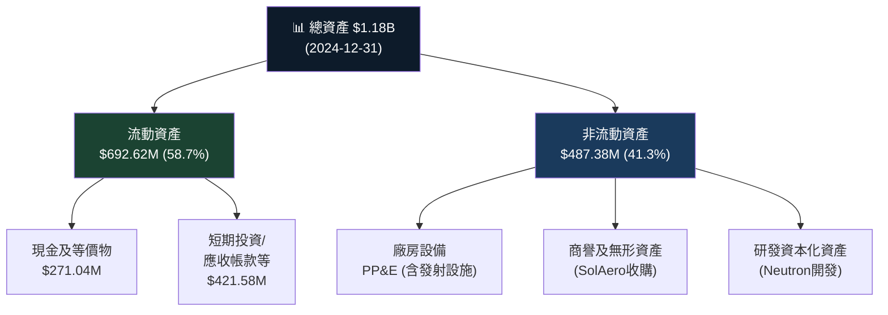

---

### 💧 流動性指標

| 指標 | 數值 | 行業標準 | 評級 |
|------|------|----------|------|
| 流動比率 | **4.08x** | >1.5x | 🟢 非常強 |
| 速動比率 | **3.34x** | >1.0x | 🟢 非常強 |
| 現金比率 | ~0.80x | >0.5x | 🟢 良好 |
| 淨現金頭寸 | **+$762.6M** | 正值 | 🟢 淨現金公司 |
| 現金消耗速率 | ~$83M/季 | — | 🟡 需監控 |
| 現金跑道（估算） | **~9-12季** | — | 🟢 充足 |

> **流動性結論**：RKLB擁有強健的流動性緩衝，$1.02B總現金為Neutron開發提供充足燃料。但FCF持續負值意味著未來可能需要再次融資。

---

### 💰 債務結構分析

```
債務趨勢（年度）
━━━━━━━━━━━━━━━━━━━━━━━━━━━━━━━━━━━━━━━━━━━━━━━━━━━━━
2021  總債務: $128.43M  ████░░░░░░░░░░░░░░░░░░  
2022  總債務: $152.78M  █████░░░░░░░░░░░░░░░░░  
2023  總債務: $176.69M  ██████░░░░░░░░░░░░░░░░  
2024  總債務: $468.42M  ████████████████░░░░░░  (+165% YoY) ⚠️
目前  總債務: $253.96M  ████████░░░░░░░░░░░░░░  (部分償還)
━━━━━━━━━━━━━━━━━━━━━━━━━━━━━━━━━━━━━━━━━━━━━━━━━━━━━
淨現金頭寸: +$762.6M  🟢
D/E 比率:  14.7x (扭曲，因股東權益持續侵蝕)
Debt/EBITDA: N/A (EBITDA為負值)
━━━━━━━━━━━━━━━━━━━━━━━━━━━━━━━━━━━━━━━━━━━━━━━━━━━━━
```

> **注意**：2024年債務大幅增加至$468M，可能與可轉換票據發行相關，為Neutron開發融資。目前TTM數據顯示已降至$254M，反映部分還款或結構調整。

---

### 📉 股東權益趨勢

```
股東權益演變（年度）
━━━━━━━━━━━━━━━━━━━━━━━━━━━━━━━━━━━━━━━━━━━━━━━━━━━━━
2021: $698.45M  ████████████████████████████  基準
2022: $673.21M  ███████████████████████████░  -3.6% (持續虧損)
2023: $554.54M  ██████████████████████░░░░░░  -17.6% (加速侵蝕)
2024: $382.45M  ███████████████░░░░░░░░░░░░░  -31.1% 🔴 (嚴重侵蝕)
━━━━━━━━━━━━━━━━━━━━━━━━━━━━━━━━━━━━━━━━━━━━━━━━━━━━━
帳面價值/股：$0.72/股 (2024年底)
P/B比率：20.9x → 市場對未來成長賦予巨大溢價
━━━━━━━━━━━━━━━━━━━━━━━━━━━━━━━━━━━━━━━━━━━━━━━━━━━━━
```

> **關鍵觀察**：股東權益3年合計縮水$316M（-45.2%），完全由持續淨虧損驅動。若不能在2-3年內實現獲利，帳面價值可能接近零，進一步壓縮財務彈性。

---

## 5. 現金流量深度分析

### 💧 現金流量瀑布圖

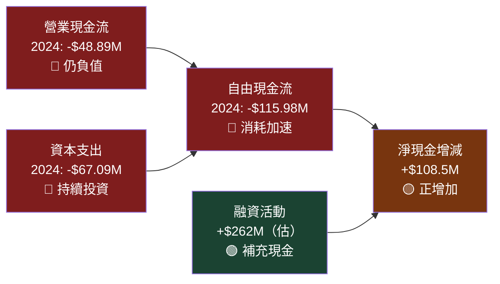

---

### 📊 FCF 轉換率趨勢

| 年度 | 淨虧損 | 自由現金流 | FCF/淨損 | 品質評估 |
|------|--------|-----------|---------|---------|
| 2021 | -$117.3M | -$97.5M | 83% | 🟡 非現金費用高 |
| 2022 | -$135.9M | -$149.0M | 110% | 🔴 現金消耗>帳面虧損 |
| 2023 | -$182.6M | -$153.6M | 84% | 🟡 改善中 |
| 2024 | -$190.2M | -$116.0M | 61% | 🟢 **顯著改善** |
| TTM | -$197.8M* | -$330.7M | >100% | 🔴 Q3含大額CAPEX |

> *TTM淨損估算基於季度數據

---

### 📉 自由現金流趨勢

```
自由現金流趨勢（年度，負值越小越好）
━━━━━━━━━━━━━━━━━━━━━━━━━━━━━━━━━━━━━━━━━━━━━━━━━━━━━
2021: -$97.5M   ████████████░░░░░░░░░░░░░░░░░░  
2022: -$149.0M  ██████████████████░░░░░░░░░░░░  惡化
2023: -$153.6M  ███████████████████░░░░░░░░░░░  惡化
2024: -$116.0M  ██████████████░░░░░░░░░░░░░░░░  改善 🟢
TTM:  -$330.7M  ████████████████████████████████惡化(含大額投資) 🔴
━━━━━━━━━━━━━━━━━━━━━━━━━━━━━━━━━━━━━━━━━━━━━━━━━━━━━
⚠️ TTM FCF大幅惡化至-$330.7M，主要因Neutron相關資本支出大增
📌 需關注：2025年資本支出計劃是否已見頂
━━━━━━━━━━━━━━━━━━━━━━━━━━━━━━━━━━━━━━━━━━━━━━━━━━━━━
```

---

### 💼 資本配置評估

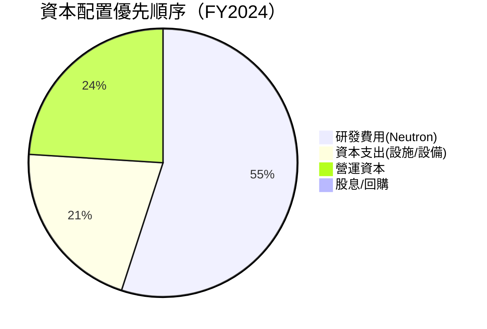

> **資本配置評語**：RKLB是純粹的「成長型再投資」企業，100%現金用於業務擴張，無任何股東回報計劃。R&D佔資本配置55%，以Neutron火箭開發為核心，這是典型的早期成長階段策略，短期現金消耗大但長期潛在回報高。

---

## 6. 獲利能力與資本效率

### 📊 ROE / ROA / ROIC 趨勢

| 年度 | ROE | ROA | ROIC（估）| 行業均值 ROE | 評級 |
|------|-----|-----|---------|------------|------|
| 2021 | -16.8% | -12.0% | -15%~ | +12% | 🔴 深度負值 |
| 2022 | -20.2% | -13.7% | -18%~ | +12% | 🔴 惡化 |
| 2023 | -32.9% | -19.4% | -28%~ | +12% | 🔴 更深虧損 |
| 2024 | -49.7% | -16.1% | -35%~ | +12% | 🔴 最差 |
| TTM | **-18.8%** | **-8.2%** | -15%~ | +12% | 🔴 仍負值 |

> **趨勢轉折點**：ROE/ROA在TTM出現改善（從-49.7%回升至-18.8%），反映盈利結構優化，但距離正值仍有顯著距離。

---

### ⚖️ ROIC vs WACC 分析

```
ROIC vs WACC 分析（EVA評估）
━━━━━━━━━━━━━━━━━━━━━━━━━━━━━━━━━━━━━━━━━━━━━━━━━━━━━━━━━━━
WACC 估算：
  無風險利率 (10Y國債):      4.3%
  股票風險溢酬 (ERP):        5.5%
  Beta (估算):               2.2  (高波動成長股)
  股權成本 = 4.3%+2.2×5.5% = 16.4%
  
  債務成本（稅後）:           ~4.0%  (低利率債務)
  資本結構：股權90% / 債務10%
  
  WACC ≈ 16.4%×90% + 4.0%×10% = 15.2%
━━━━━━━━━━━━━━━━━━━━━━━━━━━━━━━━━━━━━━━━━━━━━━━━━━━━━━━━━━━
  ROIC（TTM估算）:  約 -15%
  WACC:             約  15.2%
  EVA 差距:         -30.2%
━━━━━━━━━━━━━━━━━━━━━━━━━━━━━━━━━━━━━━━━━━━━━━━━━━━━━━━━━━━
  ❌ RKLB 目前 ROIC < WACC，正在「摧毀」經濟價值
  ✅ 但市場對未來ROIC轉正賦予極高溢價（Forward P/E 473x）
  📌 EVA轉正是長期股價持續上漲的必要條件
━━━━━━━━━━━━━━━━━━━━━━━━━━━━━━━━━━━━━━━━━━━━━━━━━━━━━━━━━━━
```

---

### 🔬 DuPont 分解分析

| 年度 | 淨利率(A) | 資產週轉率(B) | 財務槓桿(C) | ROE = A×B×C |
|------|---------|------------|-----------|------------|
| 2022 | -64.4% | 0.213x | 1.47x | **-20.2%** |
| 2023 | -74.6% | 0.260x | 1.70x | **-32.9%** |
| 2024 | -43.6% | 0.369x | 3.08x | **-49.7%** |
| TTM | -32.9% | ~0.50x | ~3.1x | **-51.0%** |

> **DuPont解讀**：
> - **淨利率**：持續改善（-64.4% → -32.9%），業務效率提升✅
> - **資產週轉率**：從0.21x提升至0.50x，資產利用效率大幅改善✅
> - **財務槓桿**：從1.47x升至3.1x，因股東權益持續被侵蝕而被動提升⚠️
> - **ROE惡化主因**：槓桿放大效果在負淨利率環境下反而惡化ROE

---

### 📊 獲利能力儀表板

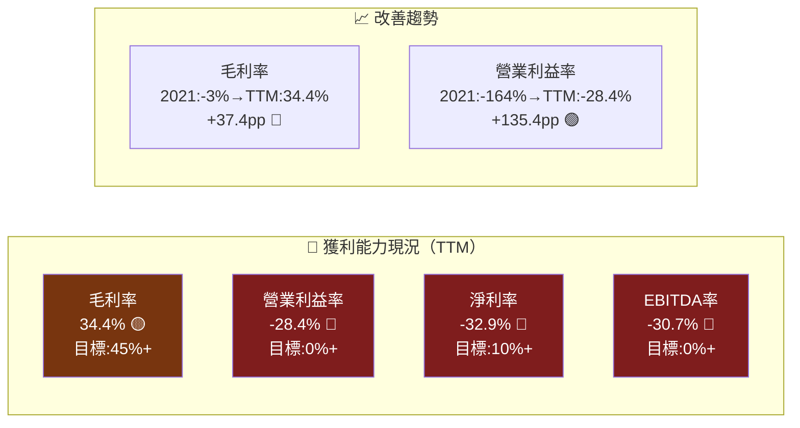

---

## 7. 估值深度分析

### 🔄 同業估值比較表格

| 指標 | **RKLB** | **SPCE** (Virgin Galactic) | **BA** (Boeing) | **LMT** (Lockheed Martin) | RKLB相對評估 |
|------|---------|--------------------------|----------------|--------------------------|-------------|
| 市值 | $35.4B | ~$0.2B | ~$105B | ~$120B | 🟡 高溢價 |
| P/S (TTM) | **58.8x** 🔴 | ~5x | ~1.5x | ~1.8x | 🔴 極度高溢價 |
| Forward P/E | **473x** 🔴 | N/A (虧損) | ~35x | ~17x | 🔴 極度高溢價 |
| EV/EBITDA | **N/A(負)** | N/A | ~25x | ~15x | 🔴 無法比較 |
| P/B | **20.9x** 🔴 | N/A | N/A(負) | ~20x | 🔴 高溢價 |
| 收入成長YoY | **+35.7%** 🟢 | -80%+ | ~5% | ~5% | 🟢 成長最強 |
| 毛利率 | **34.4%** 🟡 | <0% | ~15% | ~12% | 🟢 優於傳統航太 |
| FCF Yield | **-0.93%** 🔴 | 負值 | ~3% | ~6% | 🔴 消耗現金 |
| 淨現金 | **+$762M** 🟢 | 極低 | -$45B | -$13B | 🟢 最強 |

> **同業比較結論**：RKLB與傳統航太巨頭（Boeing、Lockheed）相比，估值溢價極為懸殊，完全由未來高速成長預期支撐。Virgin Galactic已瀕臨破產，凸顯太空商業化的高度風險。RKLB的溢價更接近SaaS高成長股邏輯（如早期AMZN、TSLA），而非傳統工業股。

---

### 📊 歷史估值區間分析

```
P/S 歷史區間分析（基於股價與收入）
━━━━━━━━━━━━━━━━━━━━━━━━━━━━━━━━━━━━━━━━━━━━━━━━━━━━━━━
歷史最高 P/S:   ~120x  （2024年11月，股價$27.28，收入基礎低）
歷史中位 P/S:   ~45x   
歷史最低 P/S:   ~8x    （2024年3月，股價$4.11）
目前 P/S:       58.8x  ←────── 目前位置（中高位）

    低估區         合理區        目前位置    高估區    歷史峰值
    ├──────────────┼─────────────┼─────────┼─────────┤
P/S: 8x           25x          45x  58.8x  80x      120x
    🟢            🟡           🟡   ⚠️    🔴       🔴
━━━━━━━━━━━━━━━━━━━━━━━━━━━━━━━━━━━━━━━━━━━━━━━━━━━━━━━
目前58.8x P/S位於歷史中高位，距歷史峰值仍有空間，
但需收入持續高速成長才能消化估值
━━━━━━━━━━━━━━━━━━━━━━━━━━━━━━━━━━━━━━━━━━━━━━━━━━━━━━━
```

---

### 🎯 DCF 敏感性分析

**基本假設框架**：
- 當前TTM收入：$601.8M
- 預測期：10年 + 永續價值
- 終端成長率：3%

| 情境 | 收入CAGR(1-5年) | 收入CAGR(6-10年) | 目標毛利率(第10年) | **折現率 14%** | **折現率 16%** |
|------|--------------|---------------|-----------------|-------------|-------------|
| 🟢 **樂觀** | 40% | 25% | 55% | **$118** | **$95** |
| 🟡 **基準** | 30% | 18% | 48% | **$84** | **$67** |
| 🔴 **悲觀** | 20% | 12% | 40% | **$52** | **$42** |

> **DCF 假設說明**：
> - 樂觀情境：Neutron成功商業化，大型政府合約加持，2028年實現EBITDA正值
> - 基準情境：穩定成長，2027-2028年達到盈虧平衡
> - 悲觀情境：Neutron延遲，競爭加劇，成長放緩

---

### 📊 估值區間視覺化

```
估值目標價區間（美元/股）
━━━━━━━━━━━━━━━━━━━━━━━━━━━━━━━━━━━━━━━━━━━━━━━━━━━━━
   $42    $52    $66.25  $84    $95    $118   $120
    │      │       │      │      │       │      │
    ├──────┼───────┼───────┼──────┼───────┼──────┤
    ▲      ▲       ▲      ▲      ▲       ▲      ▲
  深度   悲觀    當前   基準  樂觀   超級  分析師
  悲觀  DCF目標  股價  DCF目標 DCF目標 DCF目標 最高目標
  🔴    🔴      💰    🟡     🟢     🟢     🟢

  ←低估區→|←─────── 合理區 ─────────→|←── 高估區 ──→
    $0   $40   $55   $70   $85   $100  $120  $150
━━━━━━━━━━━━━━━━━━━━━━━━━━━━━━━━━━━━━━━━━━━━━━━━━━━━━
當前$66.25接近基準DCF估值，分析師目標均值$83.96隱含+27%空間
```

---

## 8. 成長催化劑

### 📅 催化劑時間軸

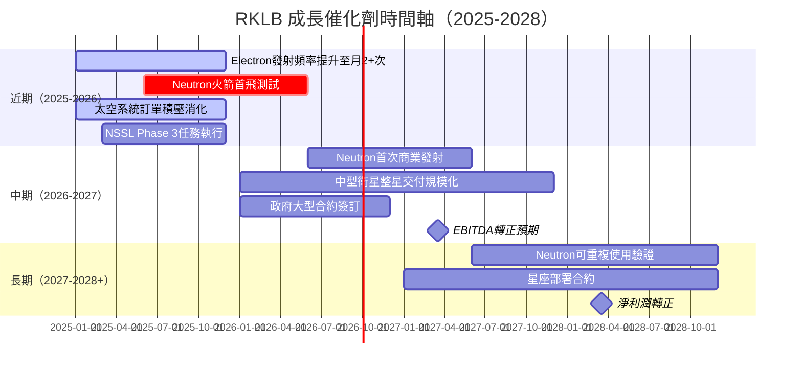

---

### 📊 TAM 市場規模與滲透率

```
太空市場 TAM 分析（2025-2035估算）
━━━━━━━━━━━━━━━━━━━━━━━━━━━━━━━━━━━━━━━━━━━━━━━━━━━━━━━━━━━━
小型發射服務 TAM:    $5B  (2025) → $12B (2030)
  RKLB 滲透率:       ████░░░░░░  ~10-15%  →  目標25%+

中型發射服務 TAM:    $8B  (2025) → $20B (2030)  [Neutron目標市場]
  RKLB 滲透率:       ░░░░░░░░░░  ~0% (待進入)  →  目標10-20%

衛星元件/整星 TAM:  $15B (2025) → $40B (2030)
  RKLB 滲透率:       ██░░░░░░░░  ~5-8%    →  目標15%+

太空基礎設施總TAM:  $630B (2030，摩根士丹利估算)
━━━━━━━━━━━━━━━━━━━━━━━━━━━━━━━━━━━━━━━━━━━━━━━━━━━━━━━━━━━━
RKLB可觸達市場(SAM): $28B+ (2030)
當前收入($602M)佔SAM: 約2.1% ← 巨大成長空間
━━━━━━━━━━━━━━━━━━━━━━━━━━━━━━━━━━━━━━━━━━━━━━━━━━━━━━━━━━━━
```

---

### 🌱 成長驅動力架構

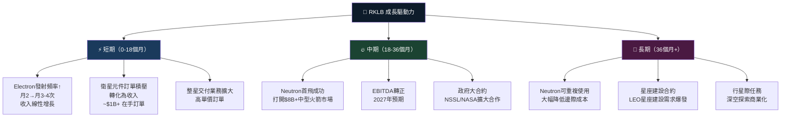

---

## 9. 風險矩陣

### 🎯 風險評分矩陣

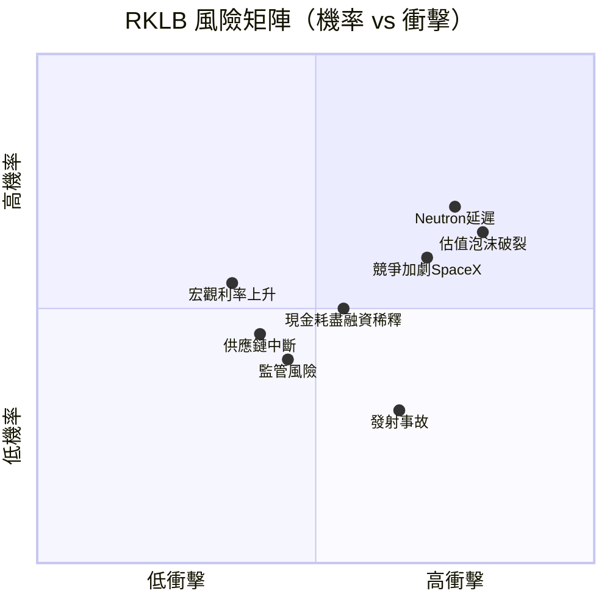

---

### 📋 風險清單表格

| 風險項目 | 機率 | 衝擊 | 綜合評分 | 緩解措施 |
|---------|------|------|---------|---------|
| 🔴 **估值泡沫破裂** | 高65% | 高（-40-60%跌幅） | 9/10 | 分批建倉，設定止損 |
| 🔴 **Neutron開發延遲/失敗** | 中高60% | 高（核心催化劑消失） | 8/10 | 追蹤測試里程碑 |
| 🔴 **SpaceX Falcon 9競爭** | 高70% | 中高（毛利率壓縮） | 7/10 | 差異化定位，小型市場護城河 |
| 🟡 **持續融資稀釋** | 中55% | 中（EPS攤薄） | 6/10 | 監控現金跑道，融資條款 |
| 🟡 **發射失敗事故** | 低中30% | 高（聲譽+財務損失） | 6/10 | 保險覆蓋，技術審查 |
| 🟡 **關鍵人員流失（Peter Beck）** | 低20% | 高（品牌/技術核心） | 5/10 | 股權激勵，文化建設 |
| 🟡 **監管/出口管制收緊** | 低中35% | 中（業務受限） | 5/10 | 合規投資，政府關係 |
| 🟢 **宏觀衰退削減太空預算** | 中40% | 中低（政府訂單較穩） | 4/10 | 收入多元化 |
| 🟢 **供應鏈中斷** | 低中35% | 低中（有備用供應商） | 4/10 | 垂直整合降低依賴 |
| 🟢 **匯率風險（NZD/USD）** | 中45% | 低（部分自然對沖） | 3/10 | 外匯套期保值 |

---

## 10. 投資建議

### 🎯 最終綜合評級

```
維度評分雷達圖（Unicode版）
━━━━━━━━━━━━━━━━━━━━━━━━━━━━━━━━━━━━━━━━━━━━━━━━━━━━━━━━━━━━
                    成長性
                    10/10
                    ██████████
                  ██          ██
        財務健康  ██  RKLB     ██  商業模式
         6/10    ██  整體     ██   7/10
       ████████  ██  5.8/10  ██  ████████████
      ██      ████              ████        ██
     ██  估值  ████              ████  獲利能力 ██
     ██  2/10  ██                ██   3/10    ██
      ██      ██                  ██          ██
        ██████                      ██████
          基本面
           6/10

各維度評分：
成長性    ██████████  10/10 🟢  35.7% YoY，太空市場高成長
商業模式  ███████░░░   7/10 🟢  垂直整合，護城河清晰
基本面    ██████░░░░   6/10 🟡  收入強勁但虧損持續
財務健康  ██████░░░░   6/10 🟡  現金充裕但FCF負值
獲利能力  ███░░░░░░░   3/10 🔴  全面虧損，ROIC<WACC
估值      ██░░░░░░░░   2/10 🔴  P/S 58.8x，極度溢價

━━ 綜合評分: 5.8/10 ━━━━━━━━━━━━━━━━━━━━━━━━━━━━━━━━━━━━━━━━━━━
```

---

### 💰 目標價矩陣

| 情境 | 目標價 | 隱含報酬率 | 時間框架 | 關鍵假設 |
|------|--------|-----------|---------|---------|
| 🟢 **樂觀** | **$118** | **+78%** | 24-36個月 | Neutron首飛成功，收入CAGR 40%，2027 EBITDA轉正 |
| 🟡 **基準** | **$84** | **+27%** | 18-24個月 | 穩定成長30%，2028年盈虧平衡 |
| 🔴 **悲觀** | **$52** | **-21%** | — | Neutron延遲，成長放緩至20% |
| ⚫ **極悲觀** | **$35** | **-47%** | — | 融資困難，競爭侵蝕，估值收縮 |

---

### ✅ 買入時機與觸發因素

```
買入觸發條件 Checklist
━━━━━━━━━━━━━━━━━━━━━━━━━━━━━━━━━━━━━━━━━━━━━━━━━━━━━
必要條件（缺一不可）：
☐ 股價回調至 $50-55 區間（更具吸引力的安全邊際）
☐ Neutron 開發重要里程碑達成（靜態測試/首飛公告）
☐ 季度收入維持 25%+ YoY 成長

強力催化劑（大幅加分）：
☐ 毛利率連續突破 40%+
☐ 宣布大型政府整星交付合約（>$500M）
☐ 2025年全年營業現金流轉正

觀察警示信號（考慮減倉）：
☒ 收入成長連續2季跌破20%
☒ Neutron宣布重大技術延遲（>12個月）
☒ 現金跑道降至<6季
☒ 主要機構大幅減持（>10% change）
━━━━━━━━━━━━━━━━━━━━━━━━━━━━━━━━━━━━━━━━━━━━━━━━━━━━━
```

---

### 👥 投資人適配度

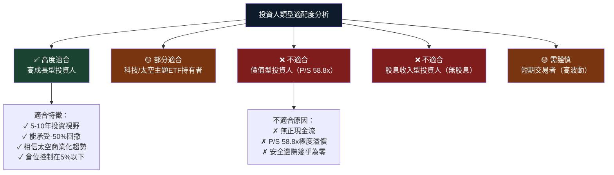

---

### 🔍 關鍵監控指標 Checklist

```
下次財報監控重點（2026Q4/2025全年報）
━━━━━━━━━━━━━━━━━━━━━━━━━━━━━━━━━━━━━━━━━━━━━━━━━━━━━━━━━━
財務指標監控：
☐ 季度收入是否持續 $150M+（環比成長10%+）
☐ 毛利率是否突破38-40%（確認上升趨勢）
☐ 營業現金流是否持續改善（目標2025Q4轉正）
☐ Neutron相關資本支出節奏（過快=現金壓力）
☐ 在手訂單積壓金額（Leading Indicator）

業務指標監控：
☐ Electron年度發射次數（目標：2025年20次+）
☐ Neutron開發里程碑（引擎測試/發射台建設）
☐ 太空系統整星交付數量及ASP
☐ 新合約簽訂（尤其是$100M+大合約）

市場與競爭監控：
☐ SpaceX Falcon 9定價動態
☐ 政府太空預算（NASA/NRO/DoD）
☐ 競爭對手新進者（ABL Space等）
☐ 分析師評級變動（尤其是Goldman/Morgan Stanley）

宏觀環境監控：
☐ 美聯儲利率決策（影響高成長股估值）
☐ 美國太空政策走向（NASA商業計劃延續性）
☐ 地緣政治對太空合作影響
━━━━━━━━━━━━━━━━━━━━━━━━━━━━━━━━━━━━━━━━━━━━━━━━━━━━━━━━━━
```

---

### 📌 綜合投資論述總結

```
╔══════════════════════════════════════════════════════════════════╗
║                    RKLB 投資論述摘要                              ║
╠══════════════════════════════════════════════════════════════════╣
║  📊 核心案例：                                                    ║
║  RKLB 是太空商業化最純粹的投資標的之一。                           ║
║  以35.7% YoY收入成長率、持續改善的毛利率(34.4%)                   ║
║  和清晰的雙引擎（Electron+Neutron）業務架構，                     ║
║  代表了真正的早期成長型太空公司。                                  ║
║                                                                  ║
║  📈 多頭核心邏輯：                                                ║
║  毛利率2021年-3% → TTM 34.4%的結構性改善                         ║
║  + Neutron商業化（打開$20B+ TAM）                                ║
║  + 分析師共識目標$83.96（+27%上行空間）                           ║
║                                                                  ║
║  ⚠️  核心風險：                                                   ║
║  P/S 58.8x的極度溢價已充分定價樂觀預期，                          ║
║  FCF -$330M持續消耗，任何業績不及預期                             ║
║  都可能導致股價大幅回撤（-30~50%）                                ║
║                                                                  ║
║  🎯 操作建議：                                                    ║
║  理想買點：$50-60區間（下跌10-25%時）                              ║
║  建倉策略：分三批建倉（各1/3倉位）                                 ║
║  倉位上限：投資組合 5% 以內（高風險）                              ║
║  停損設定：$42以下考慮出場（跌破悲觀DCF）                          ║
╚══════════════════════════════════════════════════════════════════╝
```

---

> ## ⚠️ 免責聲明
> 
> **本報告由 AI 系統基於公開財務數據自動生成，僅供學術研究與資訊參考目的。**
> 
> - 本報告**不構成任何形式的投資建議**，亦不構成買入、持有或賣出任何證券的邀約或建議
> - 所有財務數據截至 2026-02-27，市場情況瞬息萬變，報告發布後數據可能已有重大變化
> - 投資涉及風險，股票市場投資可能導致本金全部損失
> - 所有估值模型均基於假設，實際結果可能與預測大相徑庭
> - 讀者應在做出任何投資決策前，諮詢持牌專業投資顧問，並進行獨立盡職調查
> - **過去表現不代表未來結果**
> 
> *報告生成時間：2026-02-27 ｜ 分析框架：CFA機構級研究方法論*