# RKLB 基本面深度分析報告

> **報告日期**：2026-02-28 ｜ **語言**：繁體中文 ｜ **數據來源**：Yahoo Finance ｜ **分析師**：CFA 機構級研究部

---

## 目錄

1. [執行摘要](#1-執行摘要)
2. [公司概覽與商業模式](#2-公司概覽與商業模式)
3. [損益表深度分析](#3-損益表深度分析)
4. [資產負債表分析](#4-資產負債表分析)
5. [現金流量深度分析](#5-現金流量深度分析)
6. [獲利能力與資本效率](#6-獲利能力與資本效率)
7. [估值深度分析](#7-估值深度分析)
8. [成長催化劑](#8-成長催化劑)
9. [風險矩陣](#9-風險矩陣)
10. [投資建議](#10-投資建議)

---

## 1. 執行摘要

### 核心評分儀表板

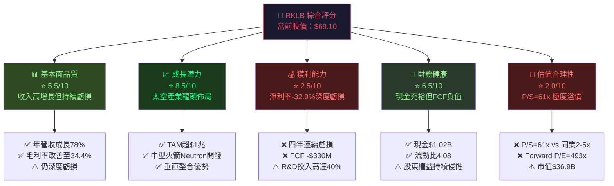

---

### 5大投資論點 + 3大核心風險

| 類型 | 項目 | 描述 | 信心度 |
|------|------|------|--------|
| 🟢 投資論點 | **垂直整合太空平台** | 全球少數同時擁有火箭、衛星元件、太空服務的綜合供應商，客戶黏性極高 | 🟢 高 |
| 🟢 投資論點 | **Electron 商業化成熟** | 全球發射次數第二（僅次SpaceX），已完成59次以上任務，可靠性建立品牌護城河 | 🟢 高 |
| 🟢 投資論點 | **Neutron中型火箭**（7噸載荷）| 瞄準SpaceX Falcon 9市場，2026年首飛計劃，TAM擴大3-5倍 | 🟡 中 |
| 🟢 投資論點 | **太空系統業務高增長** | Space Systems收入YoY+78%，政府合約增加，比Launch更高毛利 | 🟢 高 |
| 🟢 投資論點 | **政策順風與國防需求** | 美國太空軍、NASA合約加速，地緣政治推動盟友太空基礎建設需求 | 🟡 中 |
| 🔴 核心風險 | **估值嚴重透支未來** | P/S=61x、市值$36.9B vs 年營收$0.6B，需要完美執行才能支撐 | 🔴 極高 |
| 🔴 核心風險 | **SpaceX競爭壓力** | Starship成本優勢若實現，將對所有中小型發射商形成降維打擊 | 🔴 高 |
| 🟡 核心風險 | **Neutron研發風險** | 若Neutron延期或失敗，成長敘事將大幅崩潰，股價下行空間>50% | 🟡 中高 |

---

### 快速統計卡片：關鍵指標一覽

| 指標 | RKLB | 航太行業均值 | 訊號 |
|------|------|------------|------|
| 市值 | $36.91B | — | 🟡 |
| 年營收 (TTM) | $601.8M | — | 🟡 |
| 營收成長 YoY | **+35.7%** | ~5-8% | 🟢 顯著優於 |
| 毛利率 | **34.4%** | 15-20% | 🟢 優於 |
| 營業利益率 | **-28.4%** | 8-12% | 🔴 嚴重落後 |
| 淨利率 | **-32.9%** | 5-10% | 🔴 嚴重落後 |
| P/S 比 | **61.3x** | 1.5-3x | 🔴 極度溢價 |
| Forward P/E | **493.6x** | 15-25x | 🔴 極度溢價 |
| 流動比率 | **4.08x** | 1.5x | 🟢 健康 |
| 淨現金 | **+$762.6M** | — | 🟢 正值 |
| FCF | **-$330.7M** | — | 🔴 負值 |
| 機構持股 | **59.4%** | — | 🟢 機構認可 |

---

### 📌 投資結論

```
╔════════════════════════════════════════════════════════════╗
║  投資評級：【 積極持有 / 逢低布局 】                         ║
║  目標價區間：$65（悲觀）｜$88（基準）｜$125（樂觀）          ║
║  當前股價：$69.10                                           ║
║  基準隱含報酬率：+27.4%                                     ║
║  風險等級：★★★★☆ 高風險（適合成長/投機型投資人）           ║
╚════════════════════════════════════════════════════════════╝
```

**核心邏輯**：RKLB 是一隻典型的「成長期權」股票。當前估值已大幅透支未來3-5年的盈利預期，但其作為全球商業太空的稀缺標的，在太空產業爆發前夕具有不可替代的戰略價值。建議採取**分批建倉**策略，將初始倉位控制在組合的5%以內。

---

## 2. 公司概覽與商業模式

### 業務結構與收入來源

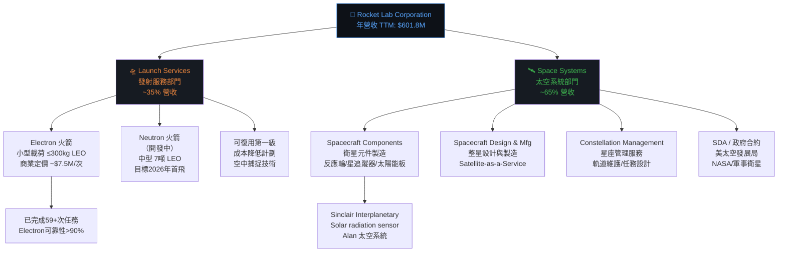

---

### 市場地位估算

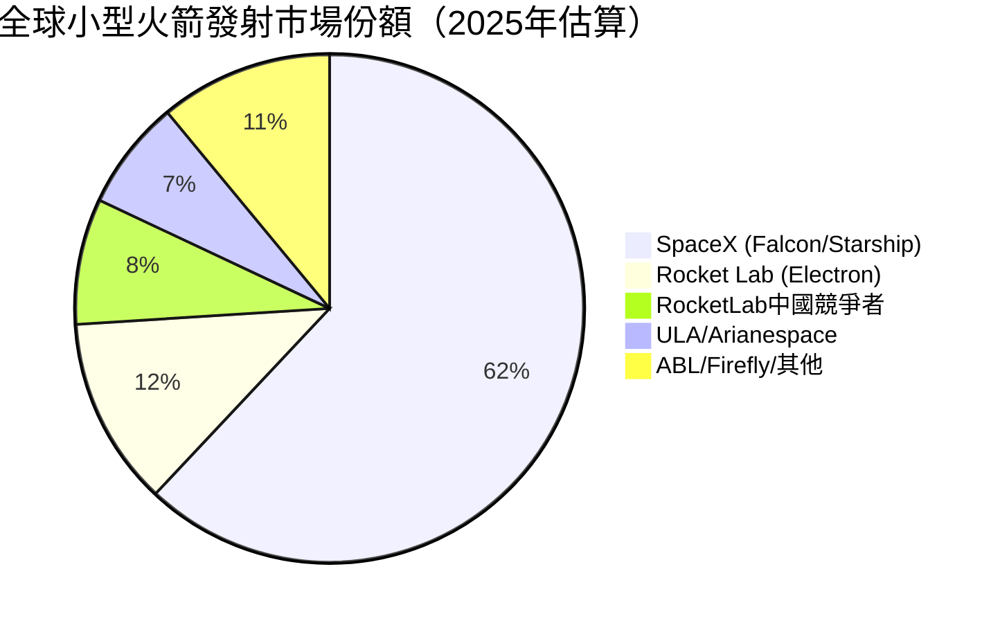

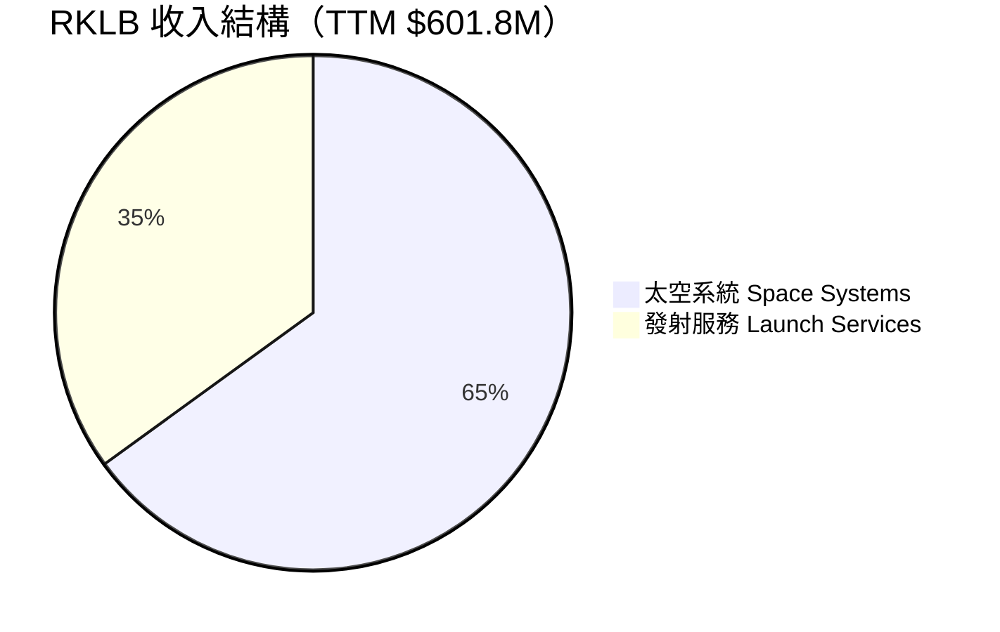

---

### 競爭護城河分析

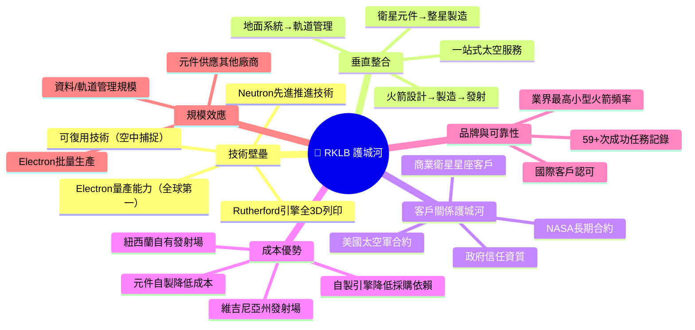

---

### 護城河強度評分

```
護城河維度評分（滿分10分）

技術壁壘    ████████░░  8.0/10  ★★★★☆
垂直整合    █████████░  9.0/10  ★★★★★
客戶黏性    ███████░░░  7.0/10  ★★★★☆
成本優勢    █████░░░░░  5.0/10  ★★★☆☆
品牌可靠性  ███████░░░  7.0/10  ★★★★☆
規模效應    █████░░░░░  5.5/10  ★★★☆☆
監管壁壘    ██████░░░░  6.0/10  ★★★☆☆
─────────────────────────────────────
綜合護城河  ██████░░░░  6.8/10  中等護城河
```

---

## 3. 損益表深度分析

### 年度收入成長趨勢（近4年）

```
年度營收趨勢（百萬美元）

2021 │ ████░░░░░░░░░░░░░░░░░░░░░░░░  $62.2M   基準年
2022 │ ████████░░░░░░░░░░░░░░░░░░░░  $211.0M  YoY +239.1% 🟢
2023 │ █████████████░░░░░░░░░░░░░░░  $244.6M  YoY +15.9%  🟡
2024 │ ████████████████████████░░░░  $436.2M  YoY +78.3%  🟢🟢
TTM  │ ██████████████████████████░░  $601.8M  YoY +35.7%  🟢

     └─────────────────────────────────────────────────────
     $0      $100M    $200M    $300M    $400M    $500M   $600M
```

**關鍵洞察**：
- 2022年收入跳升主要來自上市後的業務擴展與 SDA 合約
- 2024年+78.3%的爆炸性增長，主要驅動力為 **Space Systems 部門**（SDA Tranche 0/1合約實現）
- TTM $601.8M 顯示成長動能持續，但增速已從78%降至36%，需關注增速「正常化」趨勢

---

### 季度收入趨勢（近4季詳細分析）

| 季度 | 收入 | QoQ增長 | YoY增長 | 毛利潤 | 毛利率 | 訊號 |
|------|------|---------|---------|--------|--------|------|
| 2024 Q4 | $132.39M | — | +72.1% | $36.82M | 27.8% | 🟡 |
| 2025 Q1 | $122.57M | **-7.4%** | +62.3% | $35.25M | 28.8% | 🟡 |
| 2025 Q2 | $144.50M | **+17.9%** | +68.9% | $46.39M | 32.1% | 🟢 |
| 2025 Q3 | $155.08M | **+7.3%** | +71.8% | $57.31M | 37.0% | 🟢 |

```
季度收入走勢（百萬美元）

Q4'24 │ ████████████████████████████░  $132.4M
Q1'25 │ ██████████████████████████░░░  $122.6M  ← QoQ -7.4% 季節性低谷
Q2'25 │ █████████████████████████████░  $144.5M  ← QoQ +17.9% 強力反彈
Q3'25 │ ██████████████████████████████  $155.1M  ← QoQ +7.3%  持續成長

      └──────────────────────────────────────────────────
      $0   $30M  $60M  $90M  $120M  $150M  $180M
```

**QoQ分析**：Q1 2025小幅回落(-7.4%)屬季節性因素，Q2-Q3連續加速回升，顯示業務動能健康。

---

### 利潤率演變分析（近4年）

| 年度 | 毛利率 | 營業利益率 | EBITDA率 | 淨利率 | 趨勢 |
|------|--------|-----------|---------|--------|------|
| 2021 | 🔴 **-3.0%** | 🔴 -164.0% | 🔴 -146.5% | 🔴 -188.5% | 初創期深度虧損 |
| 2022 | 🔴 **+9.0%** | 🔴 -64.1% | 🔴 -45.1% | 🔴 -64.4% | 小幅改善 |
| 2023 | 🟡 **+21.0%** | 🔴 -72.7% | 🔴 -59.2% | 🔴 -74.6% | 毛利改善但費用膨脹 |
| 2024 | 🟡 **+26.6%** | 🔴 -43.5% | 🔴 -34.8% | 🔴 -43.6% | 結構性改善 |
| TTM | 🟡 **+34.4%** | 🔴 -28.4% | 🔴 -30.7% | 🔴 -32.9% | 持續改善軌道 |

**📊 關鍵分析**：

毛利率改善路徑 (+3.0pp → +9.0pp → +21.0pp → +26.6pp → +34.4pp)：
- 主因：Space Systems 業務占比提升（毛利率高於 Launch Services）
- 次因：Electron 量產效應降低單位成本
- Q3 2025 毛利率達37%，顯示毛利率正朝40%+目標邁進

**⚠️ 警示**：儘管毛利率持續改善，但 R&D 費用（主要為Neutron開發）使營業利益率改善緩慢：

```
毛利率改善 vs 營業虧損（近5年演變）

毛利率   ░░░░░░░█████████████████████████  34.4% ↑ 改善 +37pp
運營虧損 ███████████████████████████░░░░░  -28.4% ↑ 改善 +135pp

關鍵矛盾：毛利快速改善，但Neutron R&D投入($174M/2024)
         拉大了毛利與運營利潤之間的剪刀差
```

---

### 費用結構分析（2024年，佔收入比例）

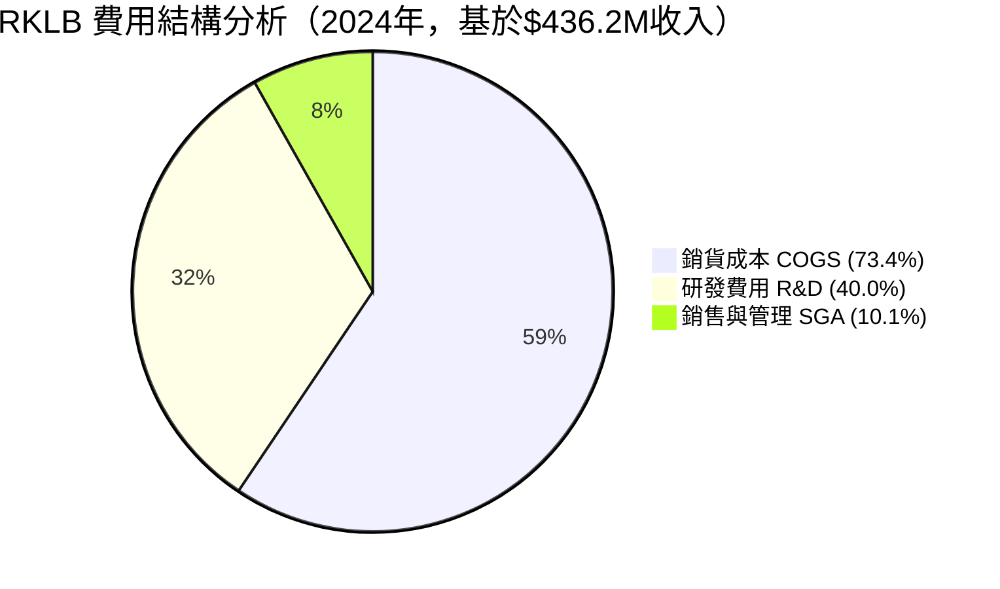

> **注意**：費用總和超過100%，反映公司仍處於虧損擴張期。R&D費用 $174.4M（佔收入40%）是最主要的虧損來源，核心為Neutron中型火箭開發。

---

### EPS趨勢與盈餘品質分析

**年度EPS趨勢**：

| 年度 | EPS | YoY | 備註 |
|------|-----|-----|------|
| 2021 | -$0.73 | — | 上市初年 |
| 2022 | -$0.65 | 改善 +11% | 收入高增長 |
| 2023 | -$0.72 | 惡化 -10.8% | 費用膨脹 |
| 2024 | -$0.63 | 改善 +12.5% | 毛利改善 |
| TTM  | -$0.38 | 改善 +39.7% | 🟢 加速改善 |
| FWD  | **+$0.14** | 轉正預期 | 🟢 分析師預期首次盈利 |

**季度EPS記錄**（數據有限）：

| 季度 | 淨利 | EPS估算 | 備註 |
|------|------|---------|------|
| Q4 2024 | -$52.34M | ~-$0.10 | 季節性費用高峰 |
| Q1 2025 | -$60.62M | ~-$0.11 | R&D費用集中 |
| Q2 2025 | -$66.41M | ~-$0.12 | 含一次性費用 |
| Q3 2025 | **-$18.26M** | ~-$0.03 | 🟢 **大幅改善** |

**⭐ 重要觀察**：Q3 2025淨虧損從Q2的$66.4M大幅收窄至$18.3M，環比改善72.5%，顯示盈利能力快速提升，Forward EPS轉正預期具有合理基礎。

---

## 4. 資產負債表分析

### 資產結構分解

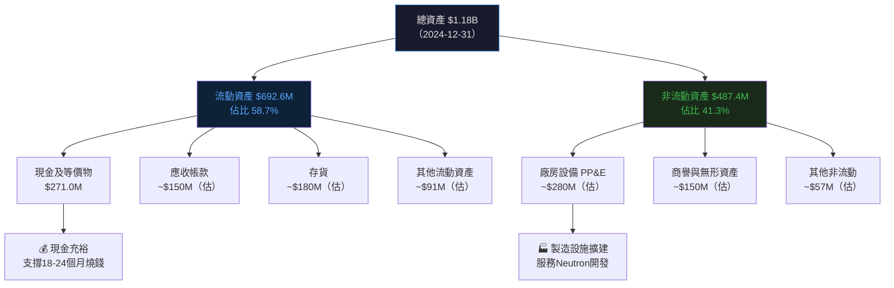

---

### 流動性指標

| 指標 | 2021 | 2022 | 2023 | 2024 | 行業均值 | 訊號 |
|------|------|------|------|------|---------|------|
| 流動比率 | 8.05x | 4.06x | 2.13x | **2.04x** | 1.5x | 🟢 |
| 速動比率 | — | — | — | **3.34x** | 1.2x | 🟢 |
| 現金比率 | 7.17x | 1.49x | 0.73x | **0.80x** | 0.5x | 🟢 |
| 淨現金 | $562.5M | $89.7M | -$14.2M | -$197.4M | — | 🟡 |

> **注**：TTM淨現金為+$762.6M（含最新融資），顯示公司已額外補充資本。

**流動性充足性評估**：
```
現金跑道計算
年度FCF燃燒：-$330.7M（TTM）
現有現金：$1.02B
────────────────────────────
隱含現金跑道：≈ 3.1年（至2029年初）
評估：✅ 充足，但需在Neutron首飛前達到FCF轉正
```

---

### 債務結構分析

| 項目 | 2021 | 2022 | 2023 | 2024 | 趨勢 |
|------|------|------|------|------|------|
| 短期債務 | ~$0 | ~$0 | ~$0 | ~$80M | 🟡 上升 |
| 長期債務 | $128.4M | $152.8M | $176.7M | $388.4M | 🔴 快速上升 |
| 總債務 | $128.4M | $152.8M | $176.7M | **$468.4M** | 🔴 |
| Debt/Equity | 18.4% | 22.7% | 31.9% | **122.5%** | 🔴 惡化 |
| Net Debt/EBITDA | N/M | N/M | N/M | N/M | 🔴 無意義（EBITDA負） |

**⚠️ 警示**：2024年總債務從$176.7M跳升至$468.4M（增加165%），主要用於Neutron開發資本支出，但需密切監控償債能力。

---

### 股東權益趨勢

```
股東權益歷年趨勢（百萬美元）

2021 │ ████████████████████████████  $698.5M  📈 上市融資高峰
2022 │ ██████████████████████████░░  $673.2M  📉 -3.6% 虧損侵蝕
2023 │ █████████████████████████░░░  $554.5M  📉 -17.6% 持續虧損
2024 │ ███████████████████░░░░░░░░░  $382.5M  📉 -31.0% 加速侵蝕

     └────────────────────────────────────────────────────
     $0    $100M   $200M   $300M   $400M   $500M   $700M

⚠️ 四年累計侵蝕：$698.5M → $382.5M，損失$316M（-45.2%）
   若不追加融資，股東權益將在2-3年內歸零
```

---

## 5. 現金流量深度分析

### 現金流量瀑布圖

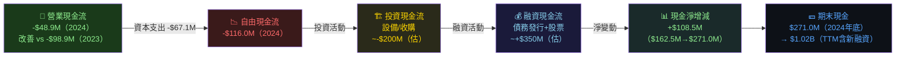

---

### FCF 轉換率趨勢分析

| 年度 | 淨虧損 | FCF | FCF轉換率 | 改善 |
|------|--------|-----|---------|------|
| 2021 | -$117.3M | -$97.5M | 83.1% | — |
| 2022 | -$135.9M | -$149.0M | 109.6% | 🔴 惡化 |
| 2023 | -$182.6M | -$153.6M | 84.1% | 🟡 |
| 2024 | -$190.2M | -$116.0M | **61.0%** | 🟢 改善 |
| TTM | ~-$200M | -$330.7M | 165.4% | 🔴 TTM包含大量資本投入 |

> **分析**：2024年 FCF 燃燒顯著收窄（$153.6M→$116.0M，改善24.5%），但TTM FCF惡化至-$330.7M，顯示Neutron的資本支出大幅提升（CapEx從$67M增至TTM約$165M）。

---

### 自由現金流趨勢（近4年）

```
自由現金流趨勢（負值=燃燒，百萬美元）

2021 │ ████████████████████████░░░░░░  -$97.5M   （基準）
2022 │ ████████████████████████████░░  -$149.0M  🔴 惡化 +52.8%
2023 │ ██████████████████████████░░░░  -$153.6M  🔴 持平惡化
2024 │ ██████████████████░░░░░░░░░░░░  -$116.0M  🟢 改善 +24.5%
TTM  │ █████████████████████████████░  -$330.7M  🔴 CapEx激增

     └──────────────────────────────────────────────────────
     -$350M  -$300M  -$200M  -$100M     $0

核心：FCF惡化≠業務惡化，大部分為Neutron開發CapEx，屬「投資性燃燒」
```

---

### 資本配置分析

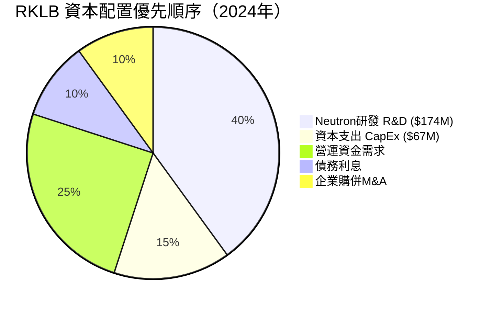

**資本配置評語**：
- ✅ 無股息、無回購，全力聚焦成長投資
- ✅ R&D/收入比 40%，顯示強烈的技術護城河建設意圖
- ⚠️ M&A整合（Sinclair等）需持續關注商譽減損風險
- 🔴 CapEx強度增加（$42M→$67M→$165M TTM），Neutron建造加速

---

## 6. 獲利能力與資本效率

### ROE / ROA / ROIC 趨勢

| 年度 | ROE | ROA | ROIC（估） | 行業ROE均值 | 訊號 |
|------|-----|-----|---------|-----------|------|
| 2021 | -16.8% | -12.0% | -15% | 12% | 🔴 |
| 2022 | -20.2% | -13.7% | -18% | 12% | 🔴 |
| 2023 | -32.9% | -19.4% | -25% | 12% | 🔴 惡化 |
| 2024 | -49.7% | -16.1% | -22% | 12% | 🔴 |
| TTM  | **-18.8%** | **-8.2%** | **~-12%** | 12% | 🟡 改善中 |

> **改善原因**：Q3 2025 淨虧損大幅收窄，帶動 TTM 指標快速改善。

---

### ROIC vs WACC 分析（核心評估）

```
WACC 估算（2026年2月）

無風險利率 (Rf)     : 4.3%（10年期美債）
股權風險溢價 (ERP)  : 5.5%（市場均值）
Beta（調整估算）     : 2.2（高成長航太股）
稅前債務成本        : 6.5%（近期發債成本）
稅率                : ~0%（持續虧損，無稅）

股權成本 Ke = 4.3% + 2.2 × 5.5% = 4.3% + 12.1% = 16.4%

資本結構（市值計）：
  股權佔比 ≈ 93%（市值$36.9B）
  債務佔比 ≈  7%（債務$0.25B）

WACC = 93% × 16.4% + 7% × 6.5% × (1-0%) = 15.2% + 0.46% ≈ 15.7%

━━━━━━━━━━━━━━━━━━━━━━━━━━━━━━━━━━━━
ROIC（投入資本回報率）估算：
  NOPAT（稅後淨營業利潤）= 約 -$80M（TTM改善後估）
  投入資本（IC）= 總資產 - 非計息流動負債 ≈ $1.0B

  ROIC ≈ -$80M / $1.0B = -8.0%

━━━━━━━━━━━━━━━━━━━━━━━━━━━━━━━━━━━━
EVA（經濟增加值）= ROIC - WACC = -8.0% - 15.7% = -23.7%

結論：🔴 ROIC < WACC，RKLB 目前仍在【摧毀】股東價值
     但改善速度加快，市場以「未來ROIC>WACC」的預期定價
━━━━━━━━━━━━━━━━━━━━━━━━━━━━━━━━━━━━
```

**EVA轉正時間線預測**：
- 🟡 **保守估計**：2028年 ROIC 轉正（Neutron商業化+規模效應）
- 🟢 **樂觀估計**：2027年 ROIC 接近 WACC（若Neutron 2026年成功）
- 🔴 **悲觀估計**：2030年後（若Neutron延期或市場競爭加劇）

---

### DuPont 三因素分解

| 年度 | 淨利率 | 資產週轉率 | 財務槓桿 | ROE | 改善因素 |
|------|--------|----------|---------|-----|---------|
| 2021 | -188.5% | 0.063x | 1.40x | -16.8% | — |
| 2022 | -64.4% | 0.213x | 1.47x | -20.2% | 資產利用率提升 |
| 2023 | -74.6% | 0.260x | 1.70x | -32.9% | 費用擴張拖累 |
| 2024 | -43.6% | 0.370x | 3.09x | -49.7% | 槓桿增加惡化ROE |
| TTM  | **-32.9%** | **~0.51x** | **~3.1x** | -18.8% | 🟢 淨利率改善主導 |

**DuPont洞察**：
1. **淨利率**是最大拖累，但改善最快（-188%→-33%）
2. **資產週轉率**持續提升，從0.063x到0.51x，顯示資產利用效率大幅提升
3. **財務槓桿**提高惡化ROE，但主因是股東權益被虧損侵蝕

---

### 獲利能力儀表板

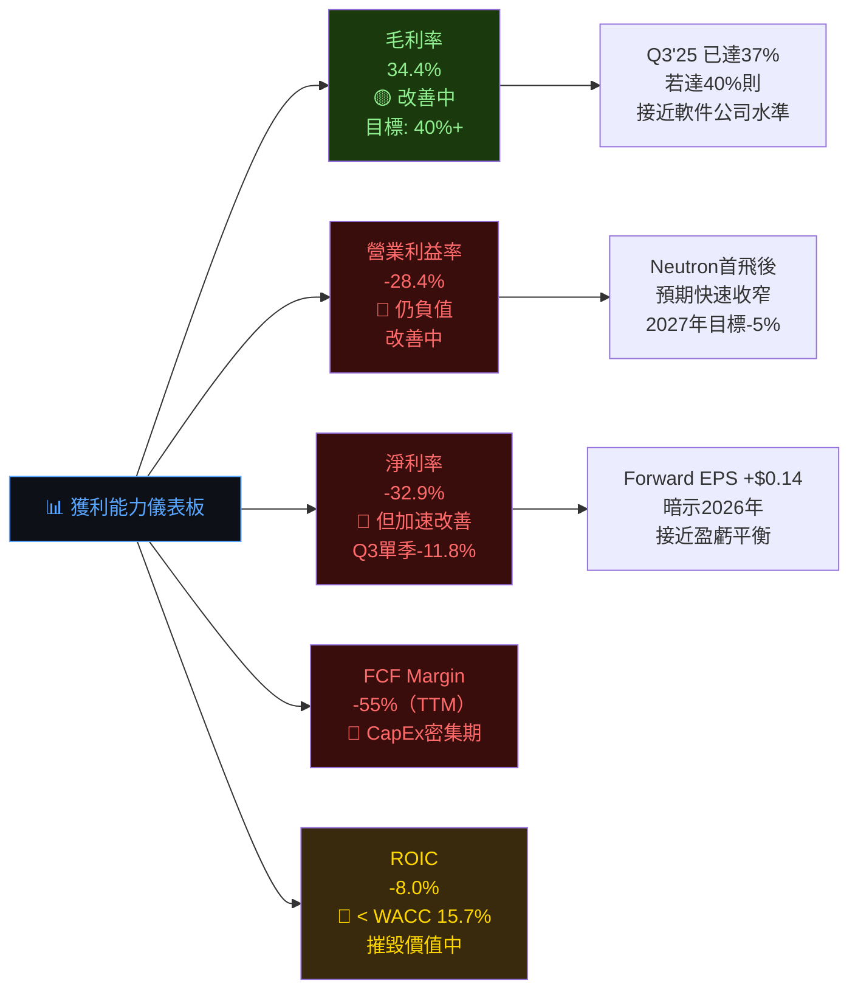

---

## 7. 估值深度分析

### 同業估值比較（核心章節）

| 指標 | **RKLB** | **LUNR**（直覺機器） | **ASTS**（AST SpaceMobile） | **SPCE**（維珍銀河） | 評估 |
|------|----------|----------|----------|----------|------|
| 市值 | $36.9B | $2.8B | $8.2B | $0.1B | — |
| P/S（TTM） | 🔴 **61.3x** | 🟡 28.5x | 🔴 150x+ | N/M | RKLB相對適中 |
| P/S（Forward） | 🟡 ~30x | ~18x | ~60x | N/M | — |
| EV/EBITDA | 🔴 **-207.9x** | N/M | N/M | N/M | 無意義（皆負） |
| P/B | 🔴 **21.8x** | 8.5x | 15x | 0.3x | 溢價明顯 |
| FCF Yield | 🔴 **-0.90%** | 負值 | 負值 | 負值 | 同業皆負 |
| Forward P/E | 🟡 **493.6x** | N/M | N/M | N/M | 分析師最看好 |
| 營收成長YoY | 🟢 **+35.7%** | +145% | +200%+ | 停滯 | 成長率偏低 |
| 毛利率 | 🟢 **34.4%** | ~15% | ~60%（預期） | 負值 | RKLB最佳 |

> **同業比較結論**：在商業太空賽道中，RKLB 的估值雖高，但相對於同業並非最高。其**商業化程度最高、毛利率最佳、現金流最接近轉正**，使其具有「相對優質」的地位，但絕對估值仍極為昂貴。

---

### 歷史估值區間分析

```
P/S 估值歷史區間（RKLB，2021-2026）

歷史高點  ████████████████████████████████████  80x+（2021年SPAC合併後）
當前位置  ████████████████████████░░░░░░░░░░░░  61.3x  ← 你在這裡
歷史均值  ████████████████░░░░░░░░░░░░░░░░░░░░  40x
歷史低點  ████░░░░░░░░░░░░░░░░░░░░░░░░░░░░░░░░  10x（2024年2月底部）

位置解讀：🔴 當前處於歷史較高估值區間（75th百分位以上）
         需要強勁業績支撐才能維持當前水位
```

---

### DCF 敏感性分析（6格目標價矩陣）

**核心假設**：
- TTM 收入：$601.8M
- 分析時間：5年DCF + 終值
- 終端成長率：3%

| | **折現率 12%** | **折現率 16%** |
|---|---|---|
| **樂觀情境**<br>年均成長40%<br>2028毛利率45%<br>2029轉EBITDA正 | 🟢 **$125/股** | 🟡 **$95/股** |
| **基準情境**<br>年均成長30%<br>2028毛利率40%<br>2030轉EBITDA正 | 🟡 **$88/股** | 🟡 **$72/股** |
| **悲觀情境**<br>年均成長18%<br>Neutron延期2年<br>盈利遙遙無期 | 🟡 **$55/股** | 🔴 **$35/股** |

**各情境隱含報酬率（基於$69.10現價）**：

```
樂觀/12%: $125 → +80.9% ████████████████████████████████
樂觀/16%: $95  → +37.5% ████████████████
基準/12%: $88  → +27.4% ████████████
基準/16%: $72  → +4.2%  ██
悲觀/12%: $55  → -20.4% 🔴
悲觀/16%: $35  → -49.4% 🔴🔴
```

---

### 估值區間視覺化

```
RKLB 估值區間（基於 P/S）

低估區（P/S < 20x，股價 < $22）
░░░░░░░░░░░░░░░░░░░░

合理區（P/S 20-40x，股價 $22-$44）
░░░░░░░░░░░░░░░░░░░░░░░░░░░░░░

偏高區（P/S 40-70x，股價 $44-$77）
████████████████████████████████  ← 當前 $69.10（P/S=61.3x）

高估區（P/S 70-100x，股價 $77-$110）
░░░░░░░░░░░░░░░░░░░░░░░░░░░░░░

泡沫區（P/S > 100x，股價 > $110）
░░░░░░░░░░░░░░░░░░░░

▲ 當前位置：偏高區間，需要業績超預期才能突破
```

---

## 8. 成長催化劑

### 催化劑時間軸

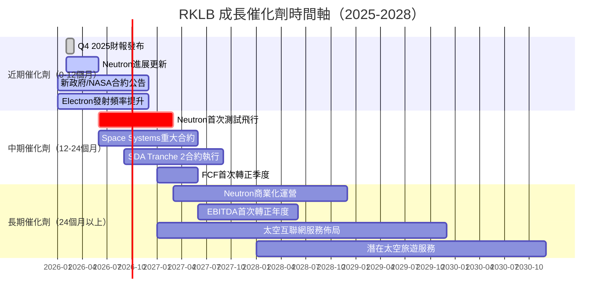

---

### TAM 市場規模與滲透率

```
🌌 RKLB 可觸達市場（TAM）分析

全球商業太空市場（2030預測）         $1,000B  █████████████████████████████░░  (基礎)
  ├─ 發射服務市場                     $30B    ████████░░░░░░░░░░░░░░░░░░░░░░░
  ├─ 衛星製造市場                     $50B    ████████████░░░░░░░░░░░░░░░░░░░
  ├─ 地球觀測/數據服務                $20B    ████░░░░░░░░░░░░░░░░░░░░░░░░░░░
  └─ 太空系統組件                     $15B    ███░░░░░░░░░░░░░░░░░░░░░░░░░░░░

RKLB 當前滲透率（$601.8M / $115B SAM）≈ 0.52%
潛在市場滲透目標（2030）：3-5%
對應收入目標（2030）：$3.5B - $5.75B
年複合成長目標（CAGR 2025-2030）：30-40%
```

---

### 成長驅動力分析

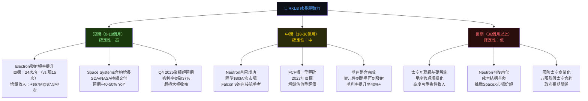

---

## 9. 風險矩陣

### 風險評分矩陣

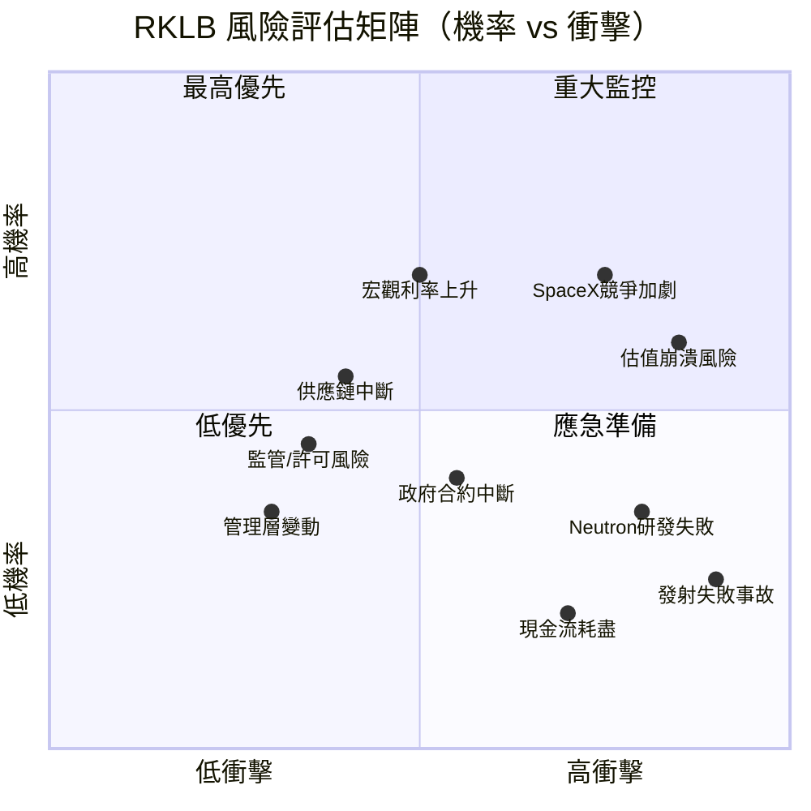

---

### 風險清單詳細表格

| 風險類型 | 具體風險 | 機率 | 衝擊 | 綜合評分 | 緩解措施 |
|---------|---------|------|------|---------|---------|
| 🔴 **估值風險** | 高估值在業績不達標時股價崩潰（-50%+） | 高 | 極高 | 🔴 9/10 | 分批布局，嚴控倉位上限 |
| 🔴 **競爭風險** | SpaceX Starship商業化壓縮中小型火箭市場 | 高 | 高 | 🔴 8/10 | 聚焦利基市場，Neutron差異化 |
| 🟡 **研發風險** | Neutron開發延期2年以上或技術失敗 | 中 | 極高 | 🟡 7/10 | 監控Neutron里程碑進展 |
| 🟡 **流動性風險** | FCF持續惡化，需再次稀釋性增資 | 低中 | 高 | 🟡 6/10 | 現有現金$1.02B可支撐3年 |
| 🟡 **合約風險** | 政府預算削減，SDA/NASA合約金額縮水 | 中 | 中 | 🟡 6/10 | 合約多元化，商業客戶比例提升 |
| 🟡 **發射風險** | Electron重大失敗事故損害品牌聲譽 | 低中 | 高 | 🟡 5/10 | 保險覆蓋，品質管控 |
| 🟢 **供應鏈風險** | 零件短缺影響Electron生產節奏 | 中 | 中 | 🟢 4/10 | 垂直整合降低外部依賴 |
| 🟢 **宏觀風險** | 利率上升壓縮成長股估值 | 高 | 中 | 🟢 5/10 | 現金儲備充足，不依賴短期融資 |
| 🟢 **監管風險** | FAA發射許可延遲或條件收緊 | 低 | 中 | 🟢 3/10 | 已建立良好監管關係 |

---

## 10. 投資建議

### 最終綜合評級

```
RKLB 各維度評分雷達圖（1-10分）

業務成長潛力  █████████░  9.0/10  ★★★★★ 太空產業龍頭，TAM巨大
收入成長動能  ████████░░  8.0/10  ★★★★☆ YoY+35.7%，持續高增長
競爭護城河   ███████░░░  7.0/10  ★★★★☆ 垂直整合難以複製
財務健康     ██████░░░░  6.5/10  ★★★☆☆ 現金充裕但FCF持續負值
管理層品質   ███████░░░  7.0/10  ★★★★☆ 創辦人主導，執行力強
獲利能力     ███░░░░░░░  3.0/10  ★★☆☆☆ 深度虧損，改善中
估值合理性   ██░░░░░░░░  2.0/10  ★☆☆☆☆ P/S=61x 嚴重溢價
EPS品質     ████░░░░░░  4.0/10  ★★☆☆☆ TTM改善但仍負值
────────────────────────────────────────
綜合加權評分  █████░░░░░  5.8/10  ★★★☆☆

評級：「積極持有 / 逢低分批布局」
適合：中高風險承受能力的成長型投資人
```

---

### 目標價與隱含報酬率

| 情境 | 目標價 | 隱含報酬率 | 關鍵假設 |
|------|--------|----------|---------|
| 🟢 **樂觀** | **$125** | **+80.9%** | Neutron 2026年成功首飛，2027年FCF轉正，2028年EBITDA+$100M |
| 🟡 **基準** | **$88** | **+27.4%** | Neutron 2027年首飛，2028年FCF轉正，年均收入成長30% |
| 🔴 **悲觀** | **$40** | **-42.1%** | Neutron延期至2029年，收入成長放緩至15%，需再次增資稀釋 |

```
目標價區間視覺化（當前$69.10）

悲觀目標 $40  ████████████████░░░░░░░░░░░░░░░░░░░░░░░░░░
當前股價 $69  ██████████████████████████████░░░░░░░░░░░░  ← 你在這裡
基準目標 $88  ██████████████████████████████████████░░░░
分析師均值$85  █████████████████████████████████████░░░░░
樂觀目標 $125 ████████████████████████████████████████████████████

          $0     $30    $60    $90    $120   $150
```

---

### 買入時機與觸發因素 Checklist

```
✅ 理想買入條件 Checklist

技術面觸發：
□ 股價回調至 $55-60 支撐區（2024年11月突破位）
□ RSI 低於 40（超賣區域）
□ 成交量萎縮後的放量反彈確認

基本面觸發：
□ Q4 2025 毛利率突破 38%（超預期）
□ Neutron 里程碑公告（引擎測試/整機集成）
□ 新的 SDA Tranche 2 或 NASA 大型合約公告
□ 季度 FCF 燃燒低於 $60M（改善加速）
□ Forward EPS 上調超過 20%

宏觀觸發：
□ 聯準會進入降息通道（降低成長股折現率）
□ 美國太空政策重大支持性立法
□ 地緣政治事件強化盟友太空投資需求
```

---

### 投資人適配度

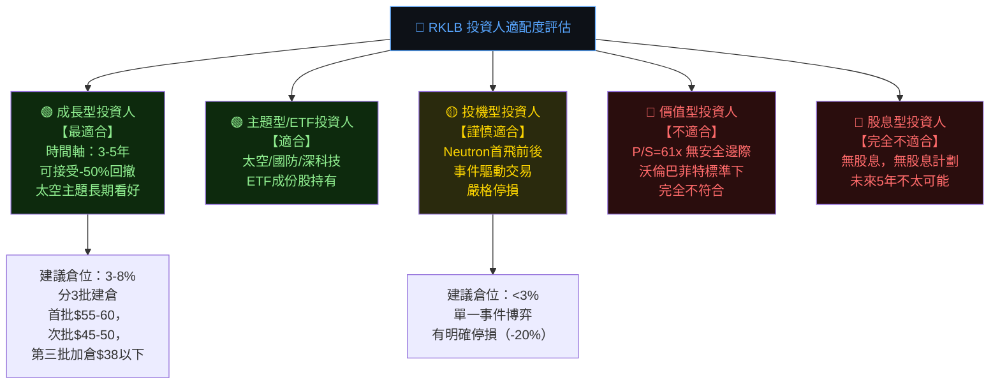

---

### 關鍵監控指標 Checklist

```
📋 RKLB 監控儀表板（每季更新）

財務指標（下次財報重點）：
□ Q4 2025 收入 → 目標：>$165M（基準），>$180M（超預期）
□ 毛利率      → 目標：突破 38%（持續改善趨勢）
□ 淨虧損      → 目標：<$20M（維持Q3改善動能）
□ FCF         → 目標：<-$80M（改善）
□ 現金餘額    → 目標：>$900M（維持跑道）

業務里程碑：
□ Electron 年度發射次數 → 2025全年目標：18-20次
□ Neutron 引擎首次點火測試（關鍵！）
□ Neutron 整機靜態點火測試
□ Space Systems 積壓訂單金額
□ SDA Tranche 2 合約規模公告

競爭動態：
□ SpaceX Starship 商業化進程（最大威脅）
□ 中國火箭技術突破（地緣政治風險）
□ 同業融資/倒閉情況（市場整合機會）

宏觀監控：
□ 美國國防/NASA 預算法案（$$ 撥款金額）
□ 10年期美債利率走向（影響折現率）
□ 機構持股變化（59.4%→升/降）
□ 分析師目標價修訂方向
```

---

## 附錄：24個月股價表現回顧

```
RKLB 24個月股價漲跌回顧

2024-02  $4.59  ░░░░░░░░░░░░░░░░░░░░░░░░░░░░░░  底部區域
2024-09  $9.73  ░░░░░░░░░░░░░░░░░░░░░░░░░░░░░░  太空概念啟動
2024-11  $27.28 ██████████░░░░░░░░░░░░░░░░░░░░  +194% 3個月暴漲
2025-01  $29.05 ████████████░░░░░░░░░░░░░░░░░░  高位鞏固
2025-06  $35.77 ██████████████░░░░░░░░░░░░░░░░  創新高
2025-07  $45.92 ██████████████████░░░░░░░░░░░░  加速上漲
2025-10  $62.98 ████████████████████████░░░░░░  突破$60
2025-12  $69.76 ██████████████████████████░░░░  年度高位
2026-01  $80.07 ████████████████████████████░░  52週新高接近
2026-02  $69.10 ██████████████████████████░░░░  回落整理

從底部$4.59（2024-02）至當前$69.10：
漲幅 = +1,405%（近2年）

最大回撤：$99.58 → $69.10 = -30.6%（52週高點回落）
當前距52週高點：-30.6% ← 潛在反彈空間
當前距52週低點：+369.7%（$14.71）

技術判斷：從超高速上漲中健康回調，尋找$60-65的關鍵支撐
```

---

> **⚠️ 免責聲明**：
> 本報告由 AI 系統基於公開財務數據自動生成，所有分析、估值及投資評級僅供學術研究參考用途，**不構成任何形式的投資建議**。
> 
> 投資涉及風險，RKLB 屬於高風險成長型股票，其估值高度依賴對未來的樂觀預期，實際結果可能與預測存在重大偏差。
> 
> 投資人在做出任何投資決策前，應諮詢持牌財務顧問，並根據自身的風險承受能力、財務狀況及投資目標做出獨立判斷。
> 
> **報告生成時間**：2026-02-28 ｜ **數據截止日**：2026-02-28 ｜ **分析框架**：CFA Institute標準