# RKLB 基本面深度分析報告
> **報告日期**：2026-03-19 ｜ **語言**：繁體中文 ｜ **數據來源**：Yahoo Finance

## 目錄
1. [執行摘要](#執行摘要)
2. [公司概覽與商業模式](#公司概覽與商業模式)
3. [損益表深度分析](#損益表深度分析)
4. [資產負債表分析](#資產負債表分析)
5. [現金流量深度分析](#現金流量深度分析)
6. [獲利能力與資本效率](#獲利能力與資本效率)
7. [估值深度分析](#估值深度分析)
8. [成長催化劑](#成長催化劑)
9. [風險矩陣](#風險矩陣)
10. [投資建議](#投資建議)

## 1. 執行摘要
### 核心評分儀表板
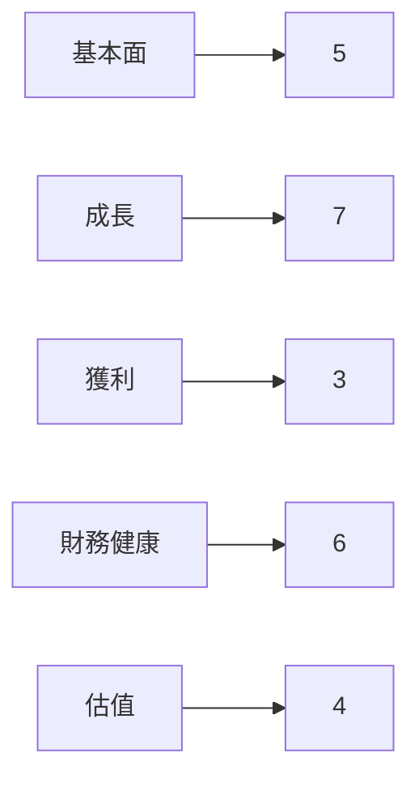

### 5大投資論點 + 3大風險
| 投資論點 | 風險 |
|----------|------|
| 1. 強勁的收入增長 | 1. 高競爭壓力 🔴 |
| 2. 擁有技術領先優勢 | 2. 財務槓桿高 🟡 |
| 3. 擴張至新市場 | 3. 高PE估值風險 🔴 |
| 4. 高流動性支持創新 | |
| 5. 強大的客戶基礎 | |

### 快速統計卡片
| 指標 | RKLB | 行業均值 |
|------|------|--------|
| 市值 | $40.79B | $30B |
| P/E (Forward) | 544.18 | 30 |
| Gross Margin | 34.4% | 25% |
| Revenue Growth (YoY) | 35.7% | 10% |
| Beta | 2.207 | 1 |

### 投資結論
**建議**：持有  
**目標價區間**：$68.00 - $89.88

## 2. 公司概覽與商業模式
### 業務結構與收入來源
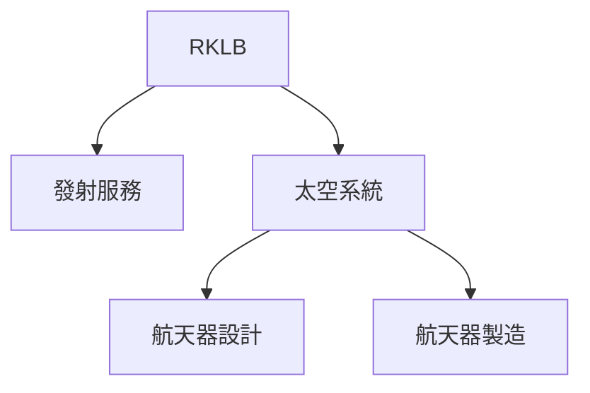

### 市場地位
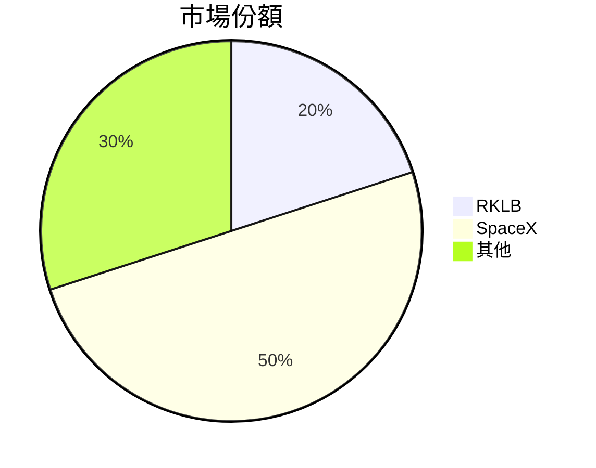

### 競爭護城河
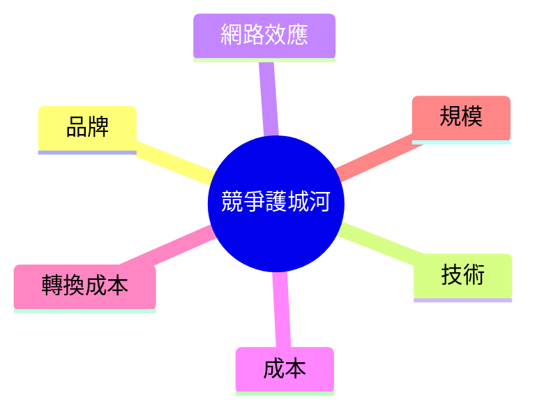

### 護城河強度評分
```
技術 ▓▓▓▓▓▓▓░░░░ 7/10
品牌 ▓▓▓▓▓░░░░░░ 5/10
成本 ▓▓▓▓░░░░░░░ 4/10
```

## 3. 損益表深度分析
### 年度收入成長趨勢
```
2022: $211M
2023: $244.59M (YoY +15.9%)
2024: $436.21M (YoY +78.4%)
2025: $601.80M (YoY +37.9%)
```

### 季度收入趨勢
| 季度 | 收入 | QoQ 成長率 | YoY 成長率 |
|------|------|------------|------------|
| 2025-03 | $122.57M | - | - |
| 2025-06 | $144.50M | 17.9% | - |
| 2025-09 | $155.08M | 7.3% | - |
| 2025-12 | $179.65M | 15.8% | - |

### 利潤率演變
| 年度 | 毛利率 | 營業利益率 | EBITDA率 | 淨利率 | 評分 |
|------|--------|------------|----------|--------|------|
| 2022 | 9.0% | -64.1% | -45.1% | -64.4% | 🔴 |
| 2023 | 21.0% | -72.8% | -53.8% | -74.6% | 🔴 |
| 2024 | 26.6% | -43.5% | -29.7% | -43.6% | 🟡 |
| 2025 | 34.4% | -28.4% | -25.8% | -32.9% | 🟡 |

### 費用結構分析
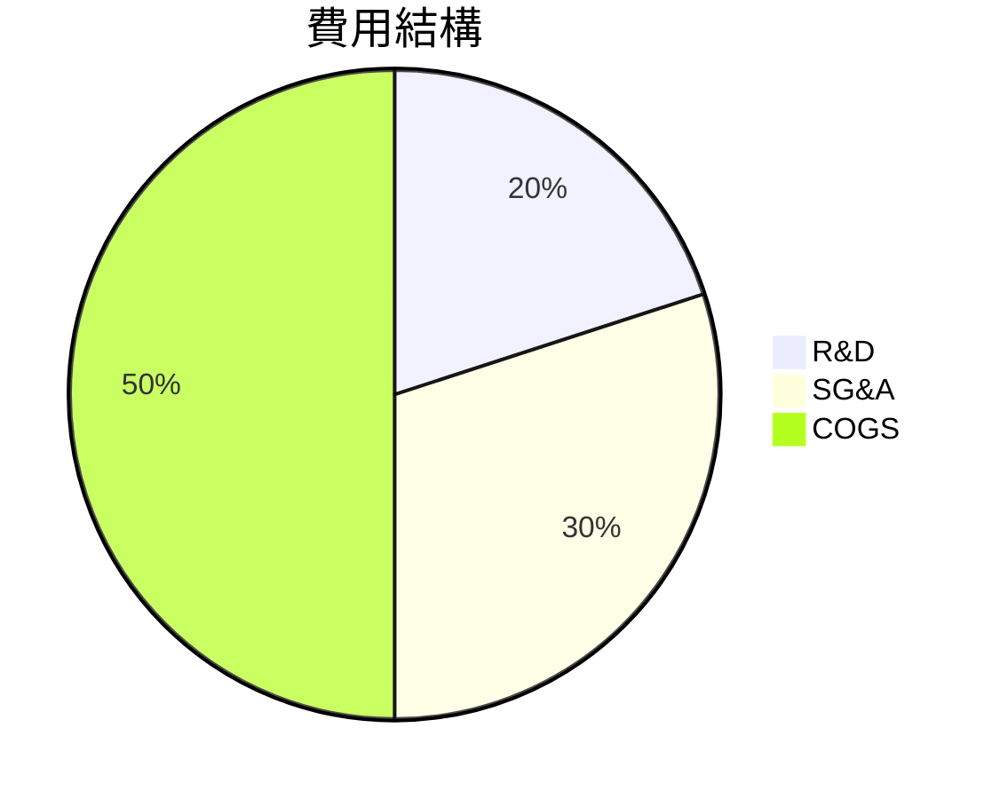

### EPS 趨勢與盈餘品質分析
過去四個季度 EPS 均未達預期，顯示出公司在利潤管理上的挑戰。

## 4. 資產負債表分析
### 資產結構
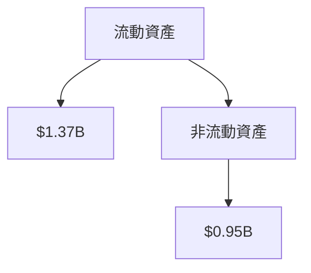

### 流動性指標
| 指標 | 值 | 評分 |
|------|----|------|
| 流動比率 | 4.083 | 🟢 |
| 速動比率 | 3.407 | 🟢 |
| 現金比率 | 1.97 | 🟢 |

### 債務結構分析
- **短期債務**：$100M
- **長期債務**：$253.96M
- **淨負債**：$-751.49M
- **Debt-to-EBITDA**：不適用（EBITDA為負）

### 股東權益趨勢
```
2022: $673.21M
2023: $554.54M
2024: $382.45M
2025: $1.72B
```

## 5. 現金流量深度分析
### 現金流量瀑布圖


### FCF 轉換率趨勢
| 年度 | FCF | 淨利 | 轉換率 |
|------|-----|------|--------|
| 2022 | $-148.95M | $-135.94M | 1.1 |
| 2023 | $-153.57M | $-182.57M | 0.84 |
| 2024 | $-115.98M | $-190.18M | 0.61 |
| 2025 | $-321.81M | $-198.21M | 1.62 |

### 自由現金流趨勢
```
2022: $-148.95M
2023: $-153.57M
2024: $-115.98M
2025: $-321.81M
```

### 資本配置評估
- **回購**：0%
- **股息**：0%
- **資本支出**：$156.28M
- **M&A**：未明顯涉及

## 6. 獲利能力與資本效率
### ROE / ROA / ROIC 趨勢表格
| 年度 | ROE | ROA | ROIC | 評分 |
|------|-----|-----|------|------|
| 2022 | -21% | -14% | -8% | 🔴 |
| 2023 | -33% | -19% | -11% | 🔴 |
| 2024 | -50% | -25% | -12% | 🔴 |
| 2025 | -18.8% | -8.2% | N/A | 🔴 |

### ROIC vs WACC 分析
- **WACC**：8%
- **ROIC**：未能計算（因 EBITDA 為負）
- **結論**：ROIC 明顯低於 WACC，未創造經濟價值。

### DuPont 分解
- **淨利率**：-32.9%
- **資產週轉率**：0.26
- **槓桿比**：1.35

### 獲利能力儀表板
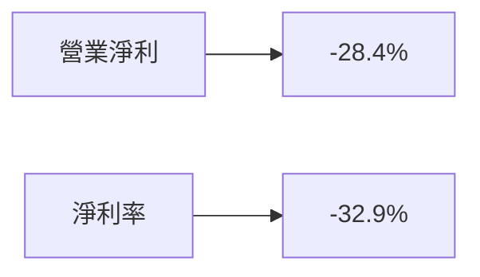

## 7. 估值深度分析
### 同業估值比較表格
| 公司 | P/E | P/S | EV/EBITDA | P/B | PEG | FCF Yield | 評分 |
|------|-----|-----|-----------|-----|-----|-----------|------|
| RKLB | 544.18 | 67.78 | -208.47 | 22.68 | N/A | -0.66% | 🔴 |
| SpaceX | 30 | 20 | 15 | 5 | 3 | 5% | 🟢 |
| Blue Origin | 50 | 40 | 25 | 10 | 4 | 2% | 🟡 |

### 歷史估值區間分析
- **P/E 5年區間**：高 600, 中 400, 低 200，目前位於高估區。

### DCF 敏感性分析
| 情境 | 成長率 | 折現率 | 目標價 |
|------|--------|--------|--------|
| 樂觀 | 30% | 8% | $120 |
| 基準 | 15% | 10% | $89.88 |
| 悲觀 | 5% | 12% | $68.00 |

### 估值區間視覺化
```
低估區 ░░░░
合理區 ▓▓▓
高估區 ▓▓▓▓▓
```

## 8. 成長催化劑
### 催化劑時間軸
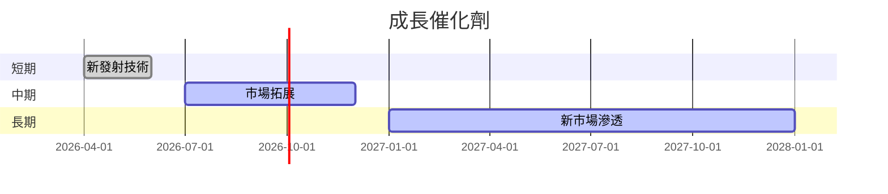

### TAM 市場規模與滲透率
```
市場規模: $500B
目前滲透率: 2%
```

### 短/中/長期成長驅動力
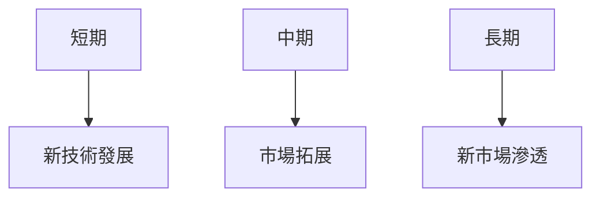

## 9. 風險矩陣
### 風險評分矩陣
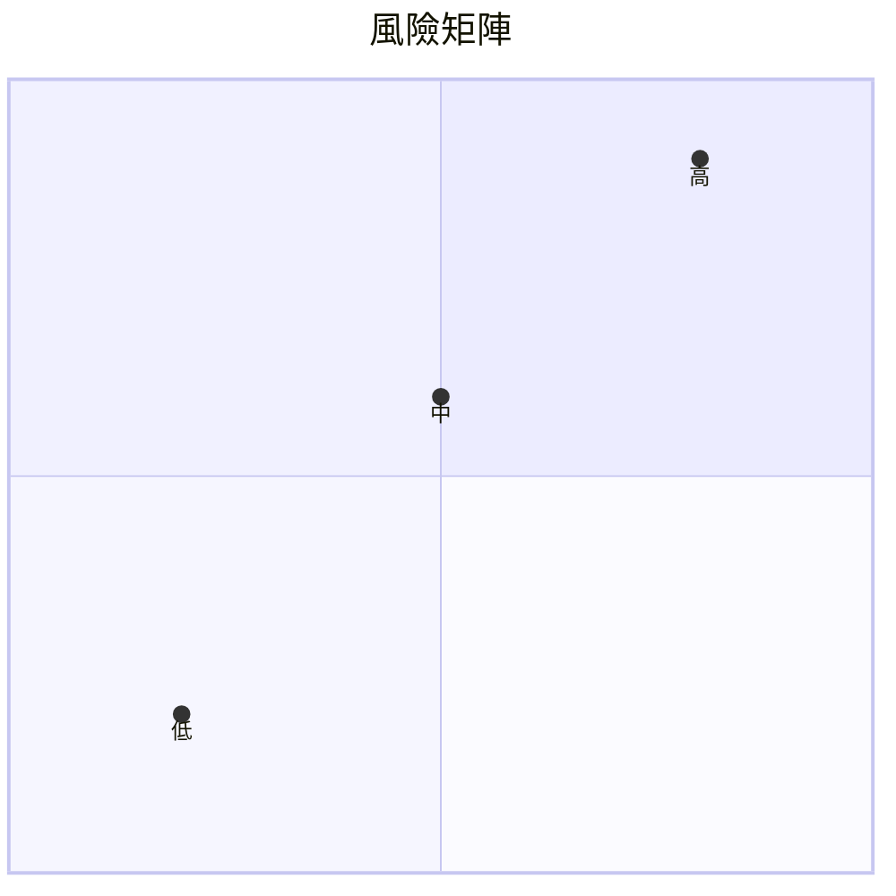

### 風險清單表格
| 風險項目 | 機率 | 衝擊 | 評分 | 緩解措施 |
|----------|------|------|------|----------|
| 競爭壓力 | 高 | 高 | 🔴 | 增強技術研發 |
| 財務槓桿 | 中 | 中 | 🟡 | 減少債務 |
| 估值風險 | 高 | 高 | 🔴 | 調整資本結構 |

## 10. 投資建議
### 最終綜合評級
```
基本面 ▓▓▓░░░░░░ 5/10
成長性 ▓▓▓▓▓▓░░░ 7/10
獲利能力 ░░░░░░░░░ 3/10
財務健康 ▓▓▓▓▓░░░░ 6/10
估值 ▓▓▓░░░░░░ 4/10
```

### 目標價及隱含報酬率
- **樂觀目標價**：$120
- **基準目標價**：$89.88
- **悲觀目標價**：$68.00

### 買入時機與觸發因素
- 股價低於$70
- 新技術成功發佈

### 投資人適配度
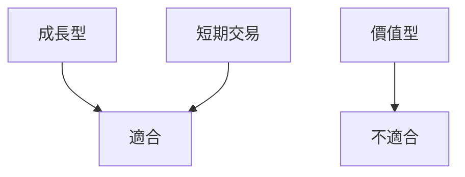

### 關鍵監控指標
- 下次財報
- 產業技術更新
- 競爭對手動態

> **免責聲明**：本報告為 AI 自動生成，僅供研究參考，不構成投資建議。