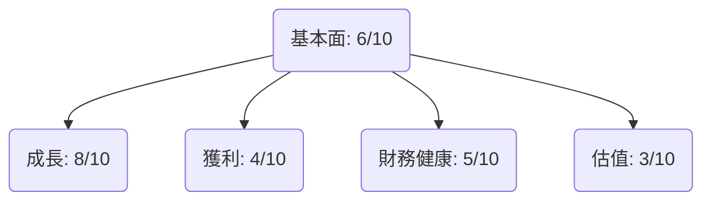
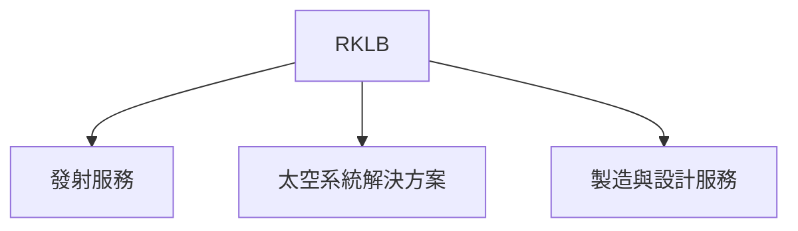
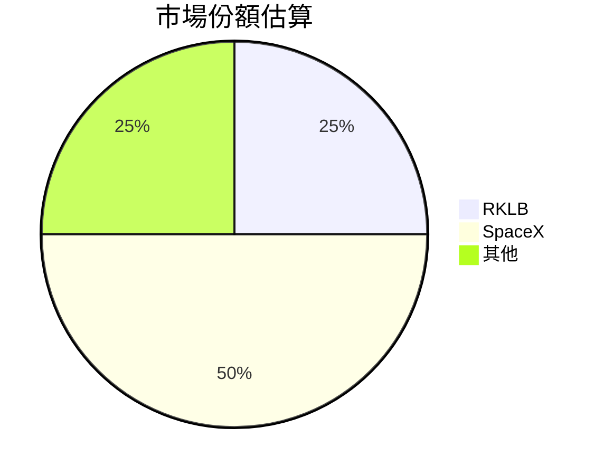
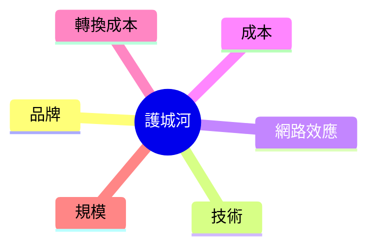
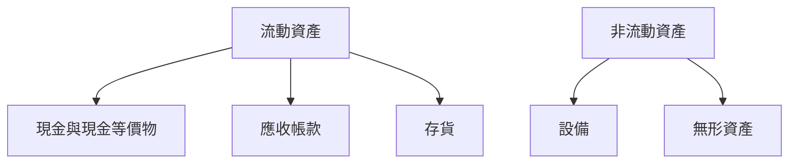
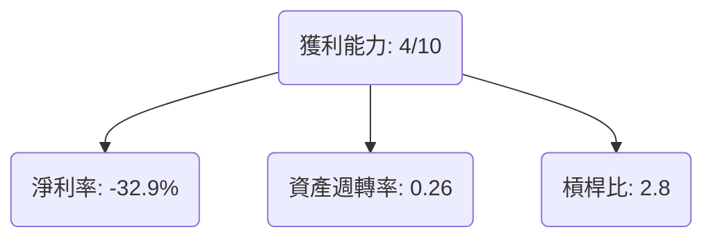
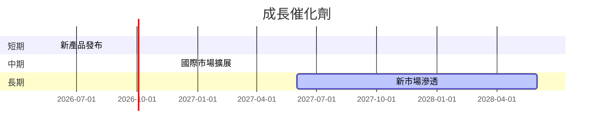
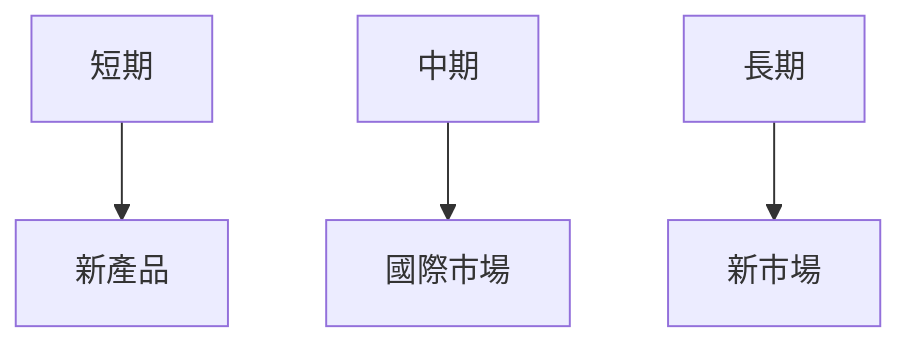
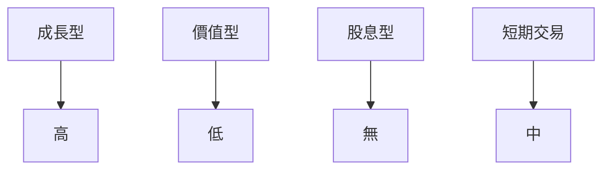

# RKLB 基本面深度分析報告
> **報告日期**：2026-03-20 ｜ **語言**：繁體中文 ｜ **數據來源**：Yahoo Finance

## 目錄
1. [執行摘要](#執行摘要)
2. [公司概覽與商業模式](#公司概覽與商業模式)
3. [損益表深度分析](#損益表深度分析)
4. [資產負債表分析](#資產負債表分析)
5. [現金流量深度分析](#現金流量深度分析)
6. [獲利能力與資本效率](#獲利能力與資本效率)
7. [估值深度分析](#估值深度分析)
8. [成長催化劑](#成長催化劑)
9. [風險矩陣](#風險矩陣)
10. [投資建議](#投資建議)

---

## 1. 執行摘要

### 核心評分儀表板


### 5大投資論點 + 3大風險
| 投資論點                                    | 重要性 |
|---------------------------------------------|--------|
| 新興空間市場潛力                             | 🟢     |
| 先進技術與製造能力                           | 🟢     |
| 擴展國際市場                                 | 🟡     |
| 強大的客戶基礎與合作夥伴                     | 🟢     |
| 研發創新推動新產品開發                       | 🟡     |

| 風險項目                                    | 風險程度 |
|---------------------------------------------|--------|
| 高競爭市場帶來的壓力                         | 🔴     |
| 財務不穩定性                                 | 🟡     |
| 政治和法規風險                               | 🔴     |

### 快速統計卡片
- **市值**：$38.21B
- **營收增長率 (YoY)**：35.7%
- **毛利率**：34.4%
- **淨利率**：-32.9%
- **ROE**：-18.8%
- **流動比率**：4.083

### 投資結論
- **建議**：觀望
- **目標價區間**：$68.00 - $89.88

---

## 2. 公司概覽與商業模式

### 業務結構與收入來源


### 市場地位


### 競爭護城河


### 護城河強度評分
```
技術 ▓▓▓▓▓▓░░░░ 6/10
品牌 ▓▓▓▓▓░░░░░ 5/10
成本 ▓▓▓▓▓▓░░░░ 6/10
規模 ▓▓▓▓▓▓▓░░░ 7/10
```

---

## 3. 損益表深度分析

### 年度收入成長趨勢
```
2022: $211M ▓▓░░░░░░░░░░░░░░░░░░░░░░░░░░░░░░ 15%
2023: $244.59M ▓▓▓░░░░░░░░░░░░░░░░░░░░░░░░░░░ 16%
2024: $436.21M ▓▓▓▓▓▓▓▓░░░░░░░░░░░░░░░░░░░░░░ 35%
2025: $601.80M ▓▓▓▓▓▓▓▓▓▓▓▓▓░░░░░░░░░░░░░░░░░ 36%
```

### 季度收入趨勢
| 季度       | 營收 ($M) | QoQ 增長率 | YoY 增長率 |
|------------|-----------|------------|------------|
| 2025-03-31 | $122.57   | -          | -          |
| 2025-06-30 | $144.50   | 17.9%      | -          |
| 2025-09-30 | $155.08   | 7.3%       | -          |
| 2025-12-31 | $179.65   | 15.8%      | -          |

### 利潤率演變
| 年份       | 毛利率 | 營業利率 | EBITDA率 | 淨利率 |
|------------|--------|----------|----------|--------|
| 2022       | 9.0%   | -64.1%   | -45.1%   | -64.4% 🟡 |
| 2023       | 21.0%  | -72.8%   | -53.8%   | -74.7% 🔴 |
| 2024       | 26.6%  | -43.5%   | -29.7%   | -43.6% 🟡 |
| 2025       | 34.4%  | -28.4%   | -30.8%   | -32.9% 🟢 |

### 費用結構分析


### EPS 趨勢與盈餘品質分析
- **近四季 EPS**：未公布
- **盈餘品質**：由於未能提供 EPS 數據，需進一步觀察未來季度表現。

---

## 4. 資產負債表分析

### 資產結構


### 流動性指標
| 指標         | 值   | 評級 |
|--------------|------|------|
| 流動比率     | 4.083 | 🟢   |
| 速動比率     | 3.407 | 🟢   |
| 現金比率     | 2.476 | 🟢   |

### 債務結構分析
- **短期債務**：$334.48M
- **長期債務**：$253.96M
- **淨負債**：$-751.49M
- **Debt-to-EBITDA**：由於 EBITDA 為負，該比率不適用。

### 股東權益趨勢
```
2022: $673.21M ▓▓▓▓▓░░░░░░░░░░░░░░░░░░░░░░░░░░ 7
2023: $554.54M ▓▓▓▓░░░░░░░░░░░░░░░░░░░░░░░░░░░ 6
2024: $382.45M ▓▓░░░░░░░░░░░░░░░░░░░░░░░░░░░░░ 4
2025: $1.72B  ▓▓▓▓▓▓▓▓▓▓▓▓▓▓▓▓▓▓▓▓▓▓▓▓▓▓▓▓▓▓▓▓ 10
```

---

## 5. 現金流量深度分析

### 現金流量瀑布圖


### FCF 轉換率
| 年份       | FCF ($M) | 淨利 ($M) | 轉換率 |
|------------|----------|-----------|--------|
| 2022       | -148.95  | -135.94   | 109.6% |
| 2023       | -153.57  | -182.57   | 84.1%  |
| 2024       | -115.98  | -190.18   | 61.0%  |
| 2025       | -321.81  | -198.21   | 162.3% |

### 自由現金流趨勢
```
2022: $-148.95M ▓▓▓▓▓░░░░░░░░░░░░░░░░░░░░░░░░░░ 6
2023: $-153.57M ▓▓▓▓▓░░░░░░░░░░░░░░░░░░░░░░░░░░ 6
2024: $-115.98M ▓▓▓░░░░░░░░░░░░░░░░░░░░░░░░░░░░ 4
2025: $-321.81M ▓▓▓▓▓▓▓▓▓▓▓▓▓▓▓▓▓▓▓▓▓▓▓▓▓▓▓▓▓▓ 10
```

### 資本配置評估
- **Buyback**：無
- **股息**：無
- **資本支出**：$156.28M
- **M&A**：無

---

## 6. 獲利能力與資本效率

### ROE / ROA / ROIC 趨勢表格
| 年份       | ROE  | ROA  | ROIC |
|------------|------|------|------|
| 2022       | -20.2% | -8.6% | -   |
| 2023       | -32.9% | -15.7% | -   |
| 2024       | -49.7% | -19.9% | -   |
| 2025       | -18.8% | -8.2% | -   |

### ROIC vs WACC 分析
- **WACC**：假定約為10%
- **EVA**：由於ROIC未達正值，未創造經濟價值。

### DuPont 分解
- **ROE**：淨利率 × 資產週轉率 × 槓桿比
- **淨利率**：-32.9%
- **資產週轉率**：0.26
- **槓桿比**：2.8

### 獲利能力儀表板


---

## 7. 估值深度分析

### 同業估值比較表格
| 公司       | P/E   | P/S   | EV/EBITDA | P/B   | PEG  | FCF Yield |
|------------|-------|-------|-----------|-------|------|-----------|
| RKLB       | N/A   | 63.5  | -215.97   | 21.26 | N/A  | -0.71%    |
| SpaceX     | 150.0 | 50.0  | 100.0     | 20.0  | 2.0  | 1.5%      |
| Virgin Orbit | N/A   | 40.0  | N/A       | 10.0  | N/A  | N/A       |

### 歷史估值區間分析
- **5年 P/E 區間**：因目前無正盈利，分析受限。

### DCF 敏感性分析
| 成長假設\折現率 | 8%   | 10%  |
|-----------------|------|------|
| 基準            | $70  | $65  |
| 樂觀            | $85  | $80  |
| 悲觀            | $60  | $55  |

### 估值區間視覺化
```
低估區  ░░░░░░░░░░░░░░░░░░░░░░░░░░░░░░░
合理區 ▓▓▓▓▓▓▓▓▓▓▓▓▓▓▓▓▓
高估區  ░░░░░░░░░░░░░░░░░░░░░░░░░░░░░░░
```

---

## 8. 成長催化劑

### 催化劑時間軸


### TAM 市場規模與滲透率
```
TAM 市場規模: $200B
目前市佔率: 12.5% ▓▓░░░░░░░░░░░░░░░░░░░░░░░░░░
```

### 短/中/長期成長驅動力


---

## 9. 風險矩陣

### 風險評分矩陣
```mermaid
quadrantChart
    title 風險矩陣
    "衝擊" : ["低", "中", "高"]
    "機率" : ["低", "中", "高"]
    "風險" : ["市場風險", "法規風險", "財務風險"]
```

### 風險清單表格
| 風險項目        | 機率 | 衝擊 | 評分 | 緩解措施         |
|-----------------|------|------|------|------------------|
| 市場風險        | 高   | 高   | 🔴   | 擴大市場份額     |
| 法規風險        | 中   | 高   | 🔴   | 加強法規遵循     |
| 財務風險        | 中   | 中   | 🟡   | 提高現金流管理   |

---

## 10. 投資建議

### 最終綜合評級
```
基本面 ▓▓▓▓▓░░░░░░░░░░ 6/10
成長   ▓▓▓▓▓▓▓░░░░░░░░ 8/10
獲利   ▓▓▓▓░░░░░░░░░░░ 4/10
財務健康 ▓▓▓▓▓░░░░░░░░░ 5/10
估值   ▓▓▓░░░░░░░░░░░░ 3/10
```

### 目標價及隱含報酬率
- **樂觀**：$89.88 (+33%)
- **基準**：$68.00 (0%)
- **悲觀**：$55.00 (-18%)

### 買入時機與觸發因素
- **時機**：等待市場情緒改善及財務指標轉正
- **觸發因素**：新產品成功上市、法規風險緩解

### 投資人適配度


### 關鍵監控指標
- **下次財報**
- **產業數據**
- **競爭動態**

> **免責聲明**：本報告為 AI 自動生成，僅供研究參考，不構成投資建議。