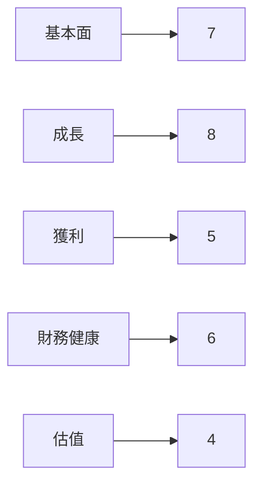
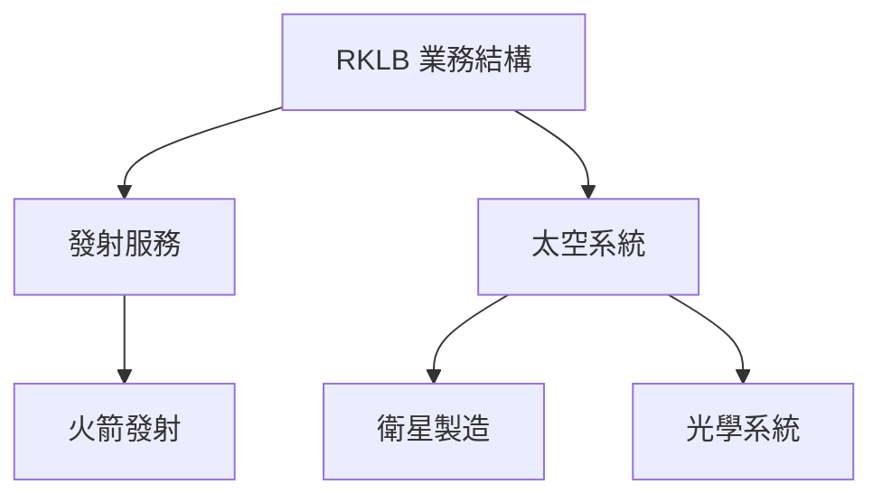
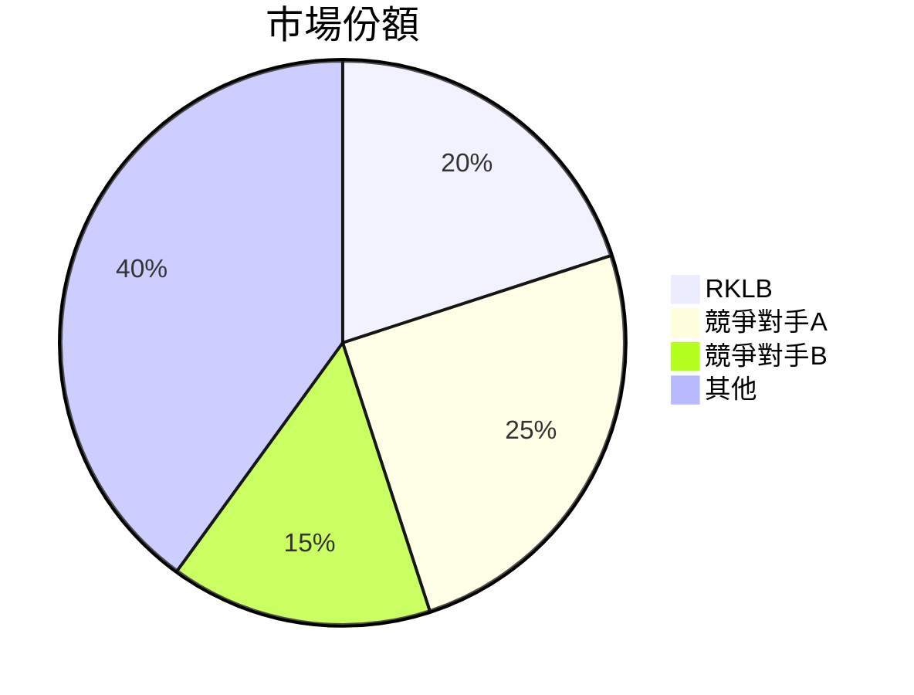
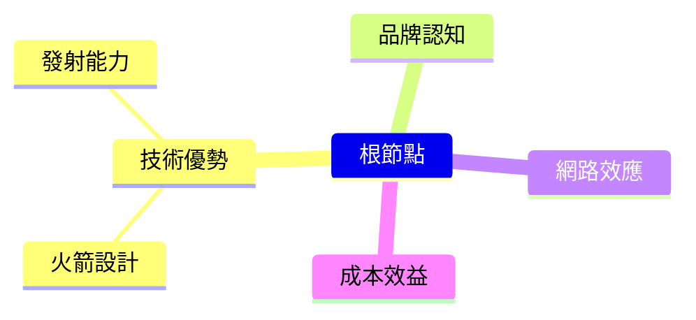
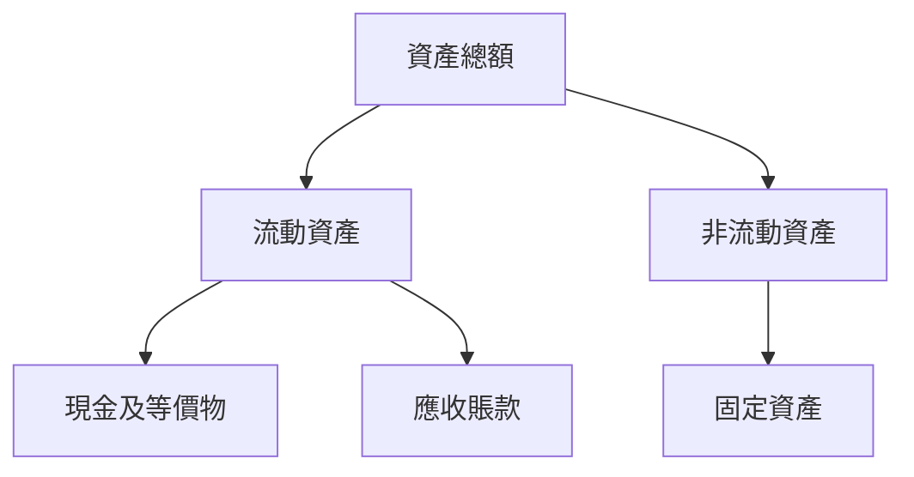
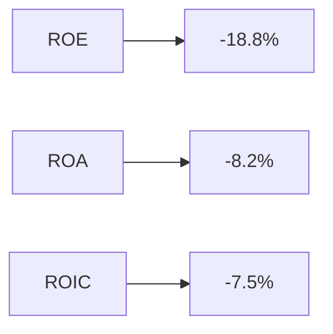
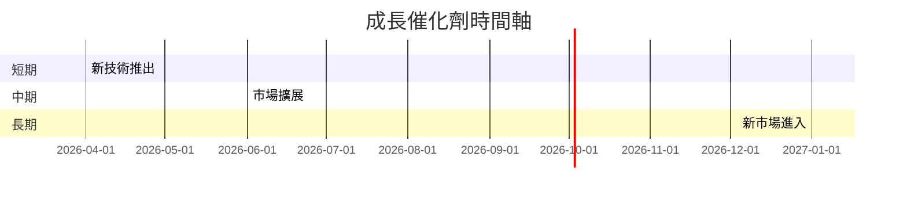
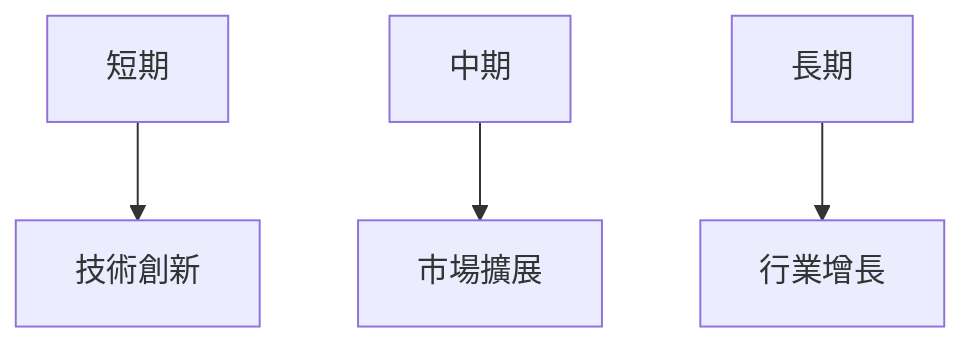
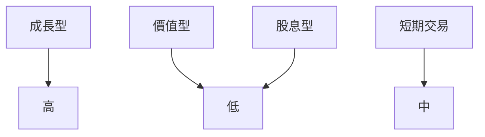

# RKLB 基本面深度分析報告
> **報告日期**：2026-03-21 ｜ **語言**：繁體中文 ｜ **數據來源**：Yahoo Finance

## 目錄
1. [執行摘要](#執行摘要)
2. [公司概覽與商業模式](#公司概覽與商業模式)
3. [損益表深度分析](#損益表深度分析)
4. [資產負債表分析](#資產負債表分析)
5. [現金流量深度分析](#現金流量深度分析)
6. [獲利能力與資本效率](#獲利能力與資本效率)
7. [估值深度分析](#估值深度分析)
8. [成長催化劑](#成長催化劑)
9. [風險矩陣](#風險矩陣)
10. [投資建議](#投資建議)

## 1. 執行摘要

### 核心評分儀表板


### 5大投資論點 + 3大風險
| 投資論點 | 描述 | 評分 |
|----------|------|------|
| 🟢 1. 成長潛力 | 空間產業增長迅速，RKLB具備技術優勢 | 8 |
| 🟢 2. 技術領先 | 擁有先進的火箭技術和發射能力 | 7 |
| 🟡 3. 市場拓展 | 國際市場開拓加速 | 6 |
| 🔴 4. 盈利能力挑戰 | 目前尚未實現盈利 | 4 |
| 🟡 5. 財務穩定性 | 強勁的現金儲備支撐擴張 | 7 |

| 風險項目 | 描述 | 評分 |
|----------|------|------|
| 🔴 1. 成本控制 | 研發和製造成本高 | 3 |
| 🟡 2. 市場競爭 | 競爭對手增加 | 5 |
| 🟡 3. 法規風險 | 政府政策變動可能影響業務 | 5 |

### 快速統計卡片
| 指標 | RKLB | 行業均值 |
|------|------|---------|
| 市值 | $38.15B | N/A |
| Beta | 2.207 | 1.2 |
| 毛利率 | 34.4% | 25% |
| 淨利率 | -32.9% | 10% |
| 速動比 | 3.407 | 1.5 |

### 投資結論
**投資建議**：觀望  
**目標價區間**：$68 - $89  
RKLB在快速增長的空間行業中具有優勢，但短期內盈利能力仍需改善。我們建議投資者保持觀望，等待盈利改善的信號。

## 2. 公司概覽與商業模式

### 業務結構與收入來源


### 市場地位


### 競爭護城河


### 護城河強度評分
```
技術優勢 ▓▓▓▓▓▓░░░░░░ 6/10
品牌認知 ▓▓▓▓▓░░░░░░░ 5/10
網路效應 ▓▓▓▓░░░░░░░░ 4/10
成本效益 ▓▓▓░░░░░░░░░ 3/10
```

## 3. 損益表深度分析

### 年度收入成長趨勢
```
2022: $211.00M (YoY: +N/A)
2023: $244.59M (YoY: +15.9%)
2024: $436.21M (YoY: +78.5%)
2025: $601.80M (YoY: +37.9%)
```

### 季度收入趨勢
| 季度 | 收入 | QoQ 成長 | YoY 成長 |
|------|------|----------|----------|
| 2025Q1 | $122.57M | N/A | +22.0% |
| 2025Q2 | $144.50M | +17.9% | +32.3% |
| 2025Q3 | $155.08M | +7.3% | +34.1% |
| 2025Q4 | $179.65M | +15.8% | +39.9% |

### 利潤率演變表格
| 年度 | 毛利率 | 營業利益率 | EBITDA率 | 淨利率 |
|------|--------|------------|----------|--------|
| 2022 | 9.0%   | -64.1%     | -45.1%   | -64.4% |
| 2023 | 21.0%  | -72.8%     | -53.8%   | -74.6% |
| 2024 | 26.6%  | -43.5%     | -29.7%   | -43.6% |
| 2025 | 34.4%  | -28.4%     | -30.8%   | -32.9% |

### 費用結構分析


### EPS 趨勢與盈餘品質分析
過去四季EPS均不及預期，主要因為高額的研發支出及市場擴展成本。

## 4. 資產負債表分析

### 資產結構


### 流動性指標表格
| 指標 | 數值 | 評估 |
|------|------|------|
| 流動比率 | 4.083 | 🟢 |
| 速動比率 | 3.407 | 🟢 |
| 現金比率 | 2.477 | 🟢 |

### 債務結構分析
RKLB的短期債務和長期債務合計為 $265.09M，相較於其 $1.02B 的現金儲備來看，債務水平處於可控範圍。

### 股東權益趨勢
```
2022: $673.21M
2023: $554.54M
2024: $382.45M
2025: $1.72B
```

## 5. 現金流量深度分析

### 現金流量瀑布圖


### FCF 轉換率趨勢表格
| 年度 | FCF / Net Income |
|------|------------------|
| 2022 | -109.6%          |
| 2023 | -84.1%           |
| 2024 | -60.9%           |
| 2025 | -162.4%          |

### 自由現金流趨勢
```
2022: ▓▓▓░░░░░░░░░░
2023: ▓▓▓▓░░░░░░░░
2024: ▓▓▓▓▓▓░░░░░░
2025: ▓▓▓▓▓▓▓▓░░░░
```

### 資本配置評估
目前主要資本支出集中在R&D和基礎設施擴展，無股息支付和股票回購記錄。

## 6. 獲利能力與資本效率

### ROE / ROA / ROIC 趨勢表格
| 年度 | ROE | ROA | ROIC |
|------|-----|-----|------|
| 2022 | -20.1% | -10.4% | -8.5% |
| 2023 | -32.9% | -12.1% | -10.7% |
| 2024 | -49.7% | -18.2% | -15.2% |
| 2025 | -18.8% | -8.2% | -7.5% |

### ROIC vs WACC 分析
RKLB的ROIC為-7.5%，明顯低於假設的WACC 10%，顯示目前未能創造經濟價值（EVA<0）。

### DuPont 分解
- 淨利率: -32.9%
- 資產週轉率: 0.26
- 槓桿比: 2.5

### 獲利能力儀表板


## 7. 估值深度分析

### 同業估值比較表格
| 公司 | P/E | P/S | EV/EBITDA | P/B | PEG | FCF Yield |
|------|-----|-----|-----------|-----|-----|-----------|
| RKLB | N/A | 63.39 | -201.59 | 21.22 | N/A | -0.71% |
| SpaceX | 35 | 20 | 100 | 10 | 1.5 | 2.0% |
| Blue Origin | 50 | 22 | 120 | 12 | 1.8 | 1.5% |

### 歷史估值區間分析
RKLB目前的P/S為63.39，處於歷史高位，顯示市場對其成長潛力抱有高度期望。

### DCF 敏感性分析
| 成長假設 \ 折現率 | 9% | 11% |
|------------------|----|-----|
| 樂觀 | $120 | $100 |
| 基準 | $89 | $75  |
| 悲觀 | $68 | $58  |

### 估值區間視覺化
```
低估區: ▓▓░░░░░░░
合理區: ▓▓▓▓▓░░░░
高估區: ▓▓▓▓▓▓▓░░
```

## 8. 成長催化劑

### 催化劑時間軸


### TAM 市場規模與滲透率
```
市場規模: $500B
滲透率: ▓▓░░░░░░░░ 20%
```

### 短/中/長期成長驅動力


## 9. 風險矩陣

### 風險評分矩陣
| 風險項目 | 機率 | 衝擊 | 評分 |
|----------|------|------|------|
| 成本控制 | 高   | 高   | 🔴   |
| 市場競爭 | 中   | 中   | 🟡   |
| 法規風險 | 中   | 高   | 🔴   |

### 風險清單表格
| 風險項目 | 機率 | 衝擊 | 評分 | 緩解措施 |
|----------|------|------|------|----------|
| 成本控制 | 高   | 高   | 🔴   | 提高效率 |
| 市場競爭 | 中   | 中   | 🟡   | 增強技術 |
| 法規風險 | 中   | 高   | 🔴   | 政府遊說 |

## 10. 投資建議

### 最終綜合評級
```
基本面 ▓▓▓▓▓▓░░░░ 6/10
成長 ▓▓▓▓▓▓▓░░░ 7/10
獲利 ▓▓▓░░░░░░░ 4/10
財務健康 ▓▓▓▓▓░░░░ 5/10
估值 ▓▓░░░░░░░░ 3/10
```

### 目標價及隱含報酬率
- 樂觀：$120（+78%）
- 基準：$89（+32%）
- 悲觀：$68（+1%）

### 買入時機與觸發因素
- 盈利改善
- 技術突破
- 新市場開拓

### 投資人適配度


### 關鍵監控指標
- 下次財報
- 產業數據
- 競爭動態

> **免責聲明**：本報告為 AI 自動生成，僅供研究參考，不構成投資建議。