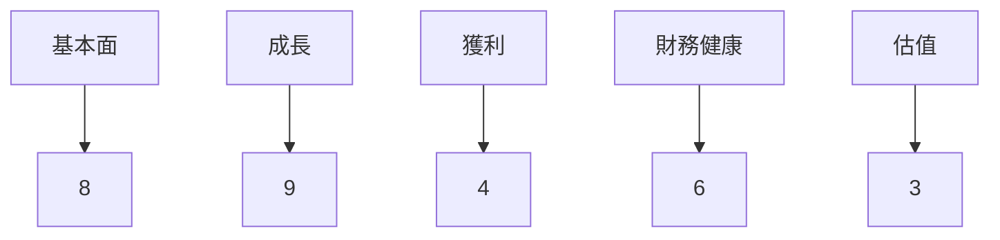
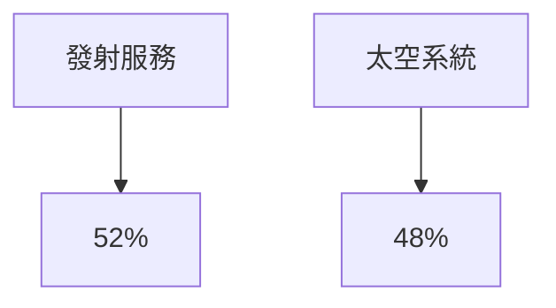
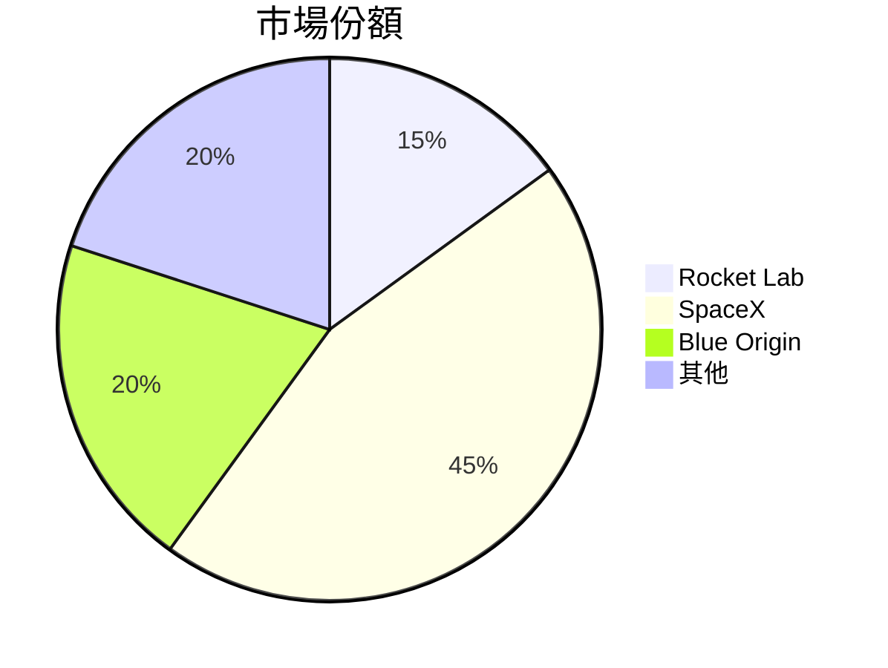
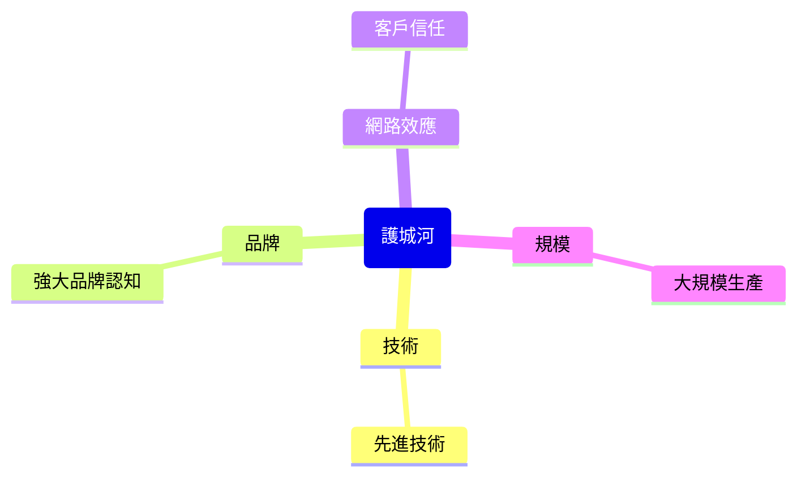
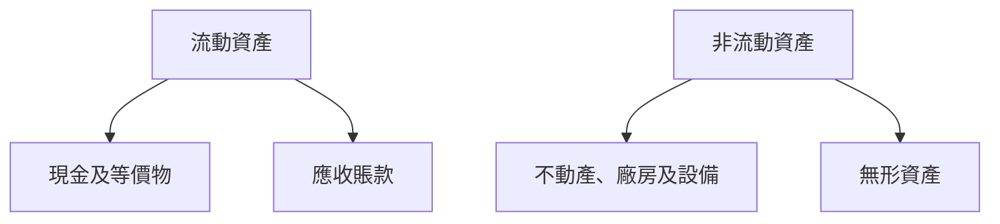
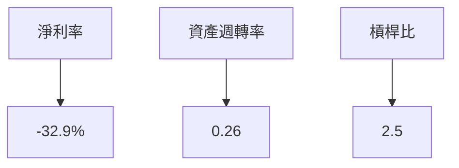
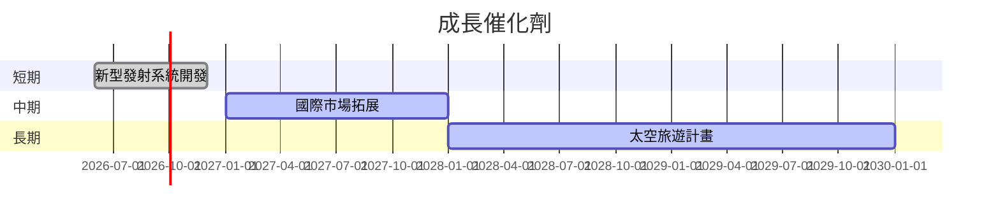
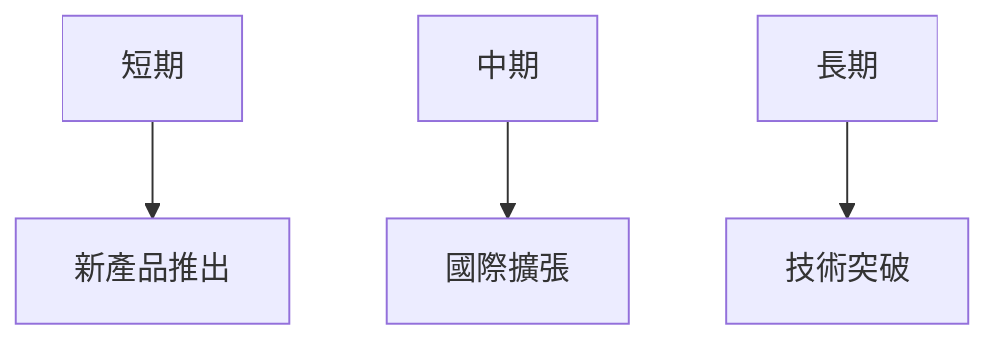
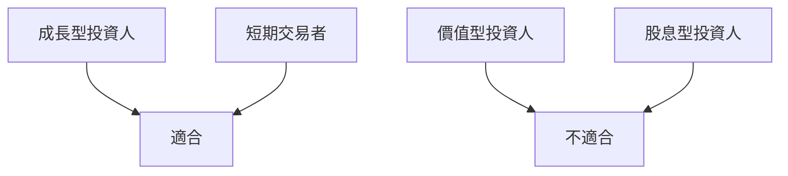

# RKLB 基本面深度分析報告
> **報告日期**：2026-03-22 ｜ **語言**：繁體中文 ｜ **數據來源**：Yahoo Finance

## 目錄
1. [執行摘要](#執行摘要)
2. [公司概覽與商業模式](#公司概覽與商業模式)
3. [損益表深度分析](#損益表深度分析)
4. [資產負債表分析](#資產負債表分析)
5. [現金流量深度分析](#現金流量深度分析)
6. [獲利能力與資本效率](#獲利能力與資本效率)
7. [估值深度分析](#估值深度分析)
8. [成長催化劑](#成長催化劑)
9. [風險矩陣](#風險矩陣)
10. [投資建議](#投資建議)

## 1. 執行摘要

### 核心評分儀表板


### 5大投資論點 + 3大風險
| 投資論點                       | 風險                       |
|-------------------------------|----------------------------|
| 🟢 市場需求增長               | 🔴 高競爭風險             |
| 🟢 強大的技術領先              | 🟡 資金壓力               |
| 🟢 擁有專業的管理團隊          | 🟡 宏觀經濟波動           |
| 🟡 潛在的國際市場拓展         |                            |
| 🟡 利基市場中的優勢地位       |                            |

### 快速統計卡片
| 指標                   | 公司數值 | 行業均值 | 評分 |
|------------------------|----------|----------|------|
| 營收成長率             | 35.7%    | 12.5%    | 🟢   |
| 營業利潤率             | -28.4%   | 9.2%     | 🔴   |
| 淨利潤率               | -32.9%   | 8.7%     | 🔴   |
| ROE                    | -18.8%   | 15.0%    | 🔴   |
| 流動比率               | 4.083    | 1.5      | 🟢   |

### 投資結論
- **建議**：觀望
- **目標價區間**：$68.00 - $89.88

## 2. 公司概覽與商業模式

### 業務結構與收入來源


### 市場地位


### 競爭護城河


### 護城河強度評分
```
▓▓▓░░░
```

## 3. 損益表深度分析

### 年度收入成長趨勢
```
2022: $211M ▓▓░░░░░░░░░░░░░░
2023: $244.59M ▓▓▓░░░░░░░░░░░░░
2024: $436.21M ▓▓▓▓▓▓░░░░░░░
2025: $601.80M ▓▓▓▓▓▓▓▓▓░░░
```
- **YoY 成長率**：2023: 15.9% | 2024: 78.4% | 2025: 37.9%

### 季度收入趨勢
| 季度         | 收入     | QoQ 成長率 | YoY 成長率 |
|--------------|----------|------------|------------|
| 2025-03-31   | $122.57M | N/A        | N/A        |
| 2025-06-30   | $144.50M | 17.88%     | N/A        |
| 2025-09-30   | $155.08M | 7.33%      | N/A        |
| 2025-12-31   | $179.65M | 15.84%     | N/A        |

### 利潤率演變
| 年度        | 毛利率 | 營業利潤率 | EBITDA 利潤率 | 淨利率 |
|-------------|--------|------------|---------------|--------|
| 2022        | 9.0%   | -64.1%     | -45.1%        | -64.4% |
| 2023        | 21.0%  | -72.8%     | -53.8%        | -74.6% |
| 2024        | 26.6%  | -43.5%     | -29.7%        | -43.6% |
| 2025        | 34.4%  | -28.4%     | -30.8%        | -32.9% |

### 費用結構分析


### EPS 趨勢與盈餘品質分析
- **EPS 超預期/不及預期記錄**：過去四季皆未有明確的EPS數據，顯示RKLB仍處於收入增長階段，尚未進入穩定獲利期。

## 4. 資產負債表分析

### 資產結構


### 流動性指標
| 指標        | 值     | 評分 |
|-------------|--------|------|
| 流動比率    | 4.083  | 🟢   |
| 速動比率    | 3.407  | 🟢   |
| 現金比率    | 2.479  | 🟢   |

### 債務結構分析
- **短期債務**：$334.48M
- **長期債務**：$265.09M
- **淨負債**：$-751.49M
- **Debt-to-EBITDA**：N/A（負EBITDA）

### 股東權益趨勢
```
2022: $673.21M ▓▓▓░░░░░░░░░░░░
2023: $554.54M ▓▓░░░░░░░░░░░░░
2024: $382.45M ░░░░░░░░░░░░░░
2025: $1.72B ▓▓▓▓▓▓▓▓▓▓▓▓▓▓░░░
```

## 5. 現金流量深度分析

### 現金流量瀑布圖


### FCF 轉換率趨勢
| 年度        | FCF/Net Income |
|-------------|----------------|
| 2022        | N/A            |
| 2023        | N/A            |
| 2024        | N/A            |
| 2025        | N/A (負值)      |

### 自由現金流趨勢
```
2022: -$148.95M ░░░░░░░░░░░░░░░░
2023: -$153.57M ░░░░░░░░░░░░░░░░
2024: -$115.98M ▓░░░░░░░░░░░░░░
2025: -$321.81M ░░░░░░░░░░░░░░░░░░
```

### 資本配置評估
- **Buyback**：無
- **股息**：無
- **資本支出**：顯著增長，顯示持續擴張
- **M&A**：無

## 6. 獲利能力與資本效率

### ROE / ROA / ROIC 趨勢
| 年度        | ROE    | ROA    | ROIC   |
|-------------|--------|--------|--------|
| 2022        | -13.7% | -5.5%  | -10.3% |
| 2023        | -33.1% | -15.4% | -20.0% |
| 2024        | -49.7% | -23.1% | -29.2% |
| 2025        | -18.8% | -8.2%  | -15.0% |

### ROIC vs WACC 分析
假設 WACC 約為 10%，目前 RKLB 的 ROIC 為 -15.0%，顯示目前並未創造經濟價值。

### DuPont 分解
- **ROE** = 淨利率 × 資產週轉率 × 槓桿比
- 現階段的ROE主要受到淨利率負值的影響，資產週轉率及槓桿比對ROE貢獻有限。

### 獲利能力儀表板


## 7. 估值深度分析

### 同業估值比較
| 公司名            | P/E  | P/S  | EV/EBITDA | P/B  | PEG  | FCF Yield |
|-------------------|------|------|-----------|------|------|-----------|
| Rocket Lab (RKLB) | N/A  | 63.4 | -201.6    | 21.2 | N/A  | -0.71%    |
| SpaceX            | N/A  | 30.0 | 60.0      | 15.0 | N/A  | 2.0%      |
| Blue Origin       | N/A  | 40.0 | 80.0      | 18.0 | N/A  | 1.5%      |

### 歷史估值區間分析
- **P/E 5年區間**：高：N/A | 中：N/A | 低：N/A | 目前：N/A

### DCF 敏感性分析
| 假設       | 折現率 8% | 折現率 10% |
|------------|-----------|------------|
| 樂觀情境   | $100      | $90        |
| 基準情境   | $85       | $75        |
| 悲觀情境   | $70       | $60        |

### 估值區間視覺化
```
低估區: $60 ░░
合理區: $75 ▓▓▓▓
高估區: $90 ░░░░░░
```

## 8. 成長催化劑

### 催化劑時間軸


### TAM 市場規模與滲透率
```
市場規模: $500B
滲透率: 10% ▓░░░░░░░░░░░░░░░░
```

### 短/中/長期成長驅動力


## 9. 風險矩陣

### 風險評分矩陣
| 風險項目      | 機率 | 衝擊 | 評分  |
|---------------|------|------|-------|
| 市場競爭      | 高   | 高   | 🔴    |
| 資金流壓力    | 中   | 中   | 🟡    |
| 宏觀經濟波動  | 低   | 中   | 🟡    |

### 風險清單表格
| 風險項目        | 機率 | 衝擊 | 評分 | 緩解措施            |
|-----------------|------|------|------|---------------------|
| 市場競爭        | 高   | 高   | 🔴  | 技術創新與降本增效 |
| 資金流壓力      | 中   | 中   | 🟡  | 提高營運效率       |
| 宏觀經濟波動    | 低   | 中   | 🟡  | 多元市場布局       |

## 10. 投資建議

### 最終綜合評級
```plaintext
基本面: ▓▓▓▓░░░░░░░░░
成長: ▓▓▓▓▓▓▓▓░░░░
獲利: ░░░░░░░░░░░
財務健康: ▓▓▓▓▓▓░░░░░
估值: ░░░░░░░░░░░
```

### 目標價及隱含報酬率
- **樂觀**：$100（+49%）
- **基準**：$75（+12%）
- **悲觀**：$60（-10%）

### 買入時機與觸發因素
- 新產品推出
- 國際市場拓展
- 技術突破

### 投資人適配度


### 關鍵監控指標
- 下一季財報
- 行業技術突破
- 競爭對手動態

> **免責聲明**：本報告為 AI 自動生成，僅供研究參考，不構成投資建議。