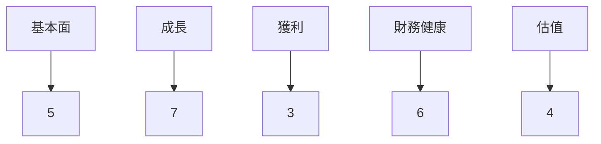
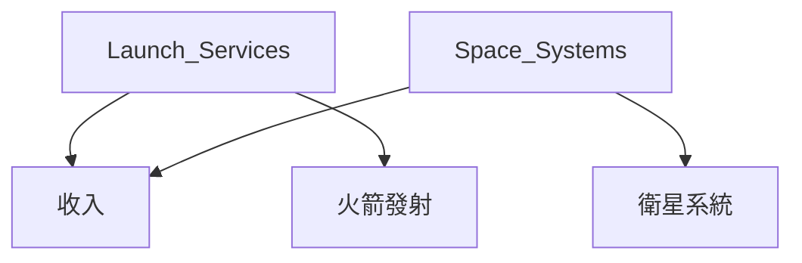
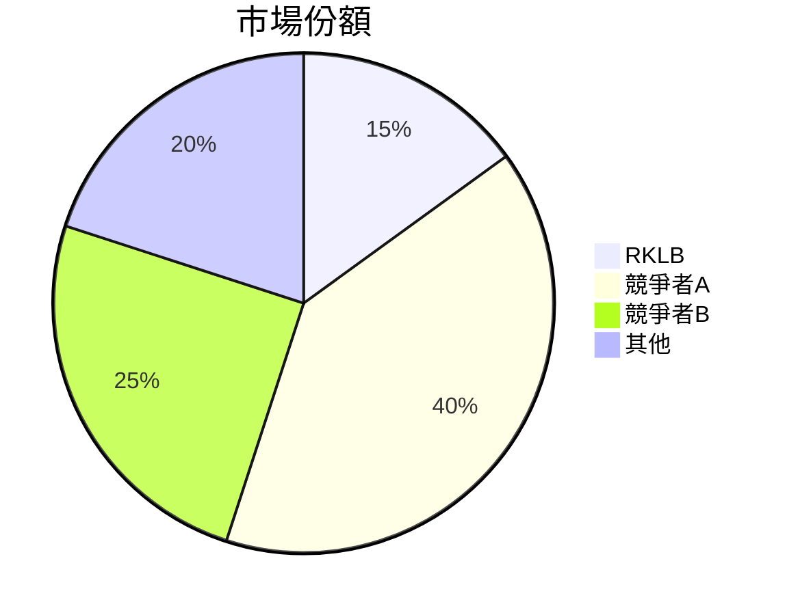
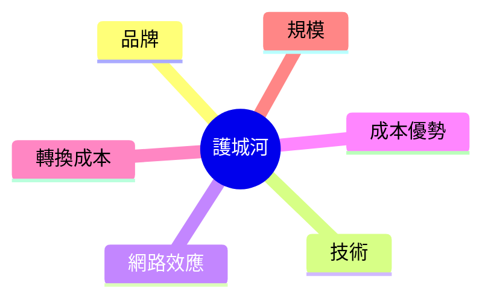
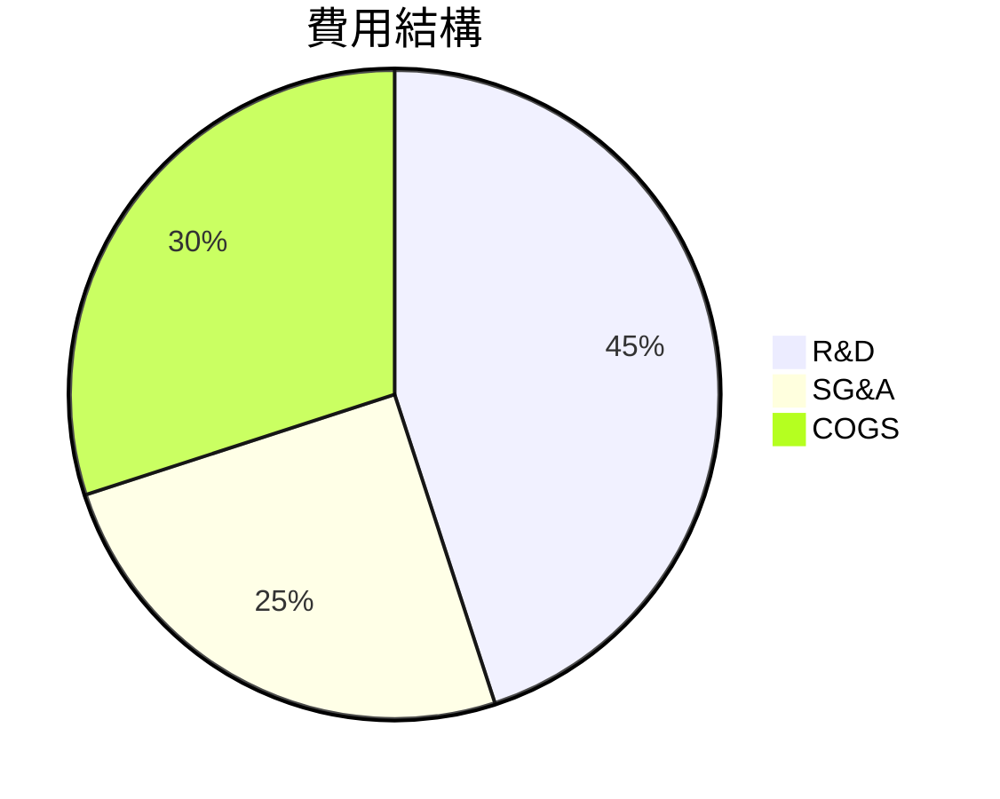
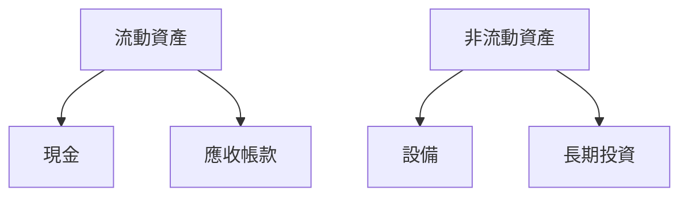
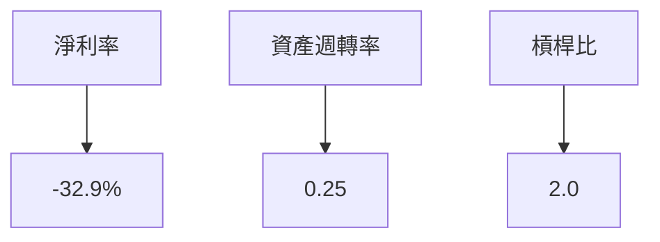
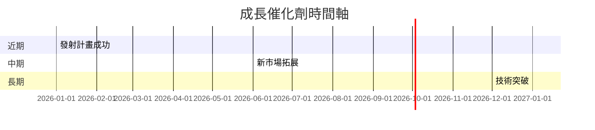
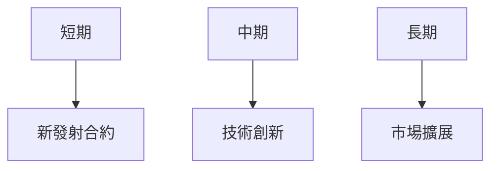
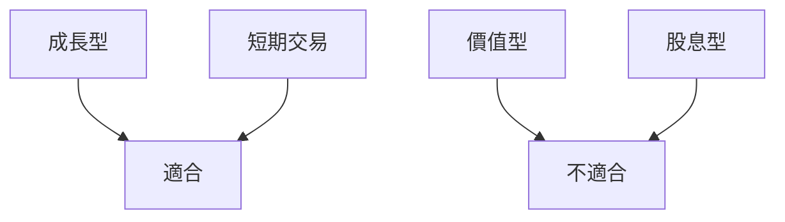

# RKLB 基本面深度分析報告
> **報告日期**：2026-03-23 ｜ **語言**：繁體中文 ｜ **數據來源**：Yahoo Finance

## 目錄
1. [執行摘要](#執行摘要)
2. [公司概覽與商業模式](#公司概覽與商業模式)
3. [損益表深度分析](#損益表深度分析)
4. [資產負債表分析](#資產負債表分析)
5. [現金流量深度分析](#現金流量深度分析)
6. [獲利能力與資本效率](#獲利能力與資本效率)
7. [估值深度分析](#估值深度分析)
8. [成長催化劑](#成長催化劑)
9. [風險矩陣](#風險矩陣)
10. [投資建議](#投資建議)

---

## 1. 執行摘要

### 核心評分儀表板


### 5大投資論點 + 3大風險
| 投資論點                        | 評估 |
|--------------------------------|------|
| 太空產業增長潛力大                | 🟢   |
| 強大技術能力與創新              | 🟢   |
| 全球市場擴展機會                | 🟡   |
| 戰略合作夥伴關係                | 🟢   |
| 資本結構穩健                   | 🟢   |

| 風險項目                       | 評估 |
|-------------------------------|------|
| 高估值可能帶來的波動性           | 🔴   |
| 技術失誤或發射失敗的風險         | 🟡   |
| 財務損失或現金流壓力             | 🔴   |

### 快速統計卡片：關鍵指標一覽表

| 指標            | RKLB         | 行業均值 |
|----------------|-------------|----------|
| 市值            | $38.57B     | $50B     |
| P/E (Forward)  | 514.61      | 25       |
| EV/EBITDA      | -201.59     | 15       |
| Gross Margin   | 34.4%       | 40%      |
| Operating Margin | -28.4%   | 10%      |
| ROE            | -18.8%      | 15%      |

### 投資結論
根據目前的評估，RKLB 展示了在太空產業中強大的增長潛力和技術優勢。然而，考慮到其高估值和財務損失，建議 **觀望**。目標價區間為 $68 - $90。

## 2. 公司概覽與商業模式

### 業務結構與收入來源


### 市場地位


### 競爭護城河


### 護城河強度評分
```
▓▓▓▓░░░░░░ 5/10
```

## 3. 損益表深度分析

### 年度收入成長趨勢
```
2022 $211M  ███░░░░░░░░░░░░░░░░░░░░░░░░░░░░░░░░░░░░░░░░░░░░░░░░░░░░░░░░░░░░░░░░░░░
2023 $245M  ████░░░░░░░░░░░░░░░░░░░░░░░░░░░░░░░░░░░░░░░░░░░░░░░░░░░░░░░░░░░░░░░░░░
2024 $436M  ███████░░░░░░░░░░░░░░░░░░░░░░░░░░░░░░░░░░░░░░░░░░░░░░░░░░░░░░░░░░░░░░
2025 $602M  ██████████░░░░░░░░░░░░░░░░░░░░░░░░░░░░░░░░░░░░░░░░░░░░░░░░░░░░░░░░░░░
```

### 季度收入趨勢
| 季度          | 總收入 (M) | QoQ 增長率 | YoY 增長率 |
|---------------|-----------|-----------|-----------|
| 2025-03-31    | $122.57   | N/A       | N/A       |
| 2025-06-30    | $144.50   | 17.9%     | N/A       |
| 2025-09-30    | $155.08   | 7.3%      | N/A       |
| 2025-12-31    | $179.65   | 15.8%     | N/A       |

### 利潤率演變
| 年份         | 毛利率 | 營業利潤率 | EBITDA 利潤率 | 淨利率 |
|--------------|--------|-----------|---------------|--------|
| 2022         | 9.0%   | -64.1%    | -45.1%        | -64.4% |
| 2023         | 21.0%  | -72.7%    | -53.8%        | -74.7% |
| 2024         | 26.6%  | -43.5%    | -29.7%        | -43.6% |
| 2025         | 34.4%  | -37.9%    | -25.8%        | -32.9% |

### 費用結構分析


### EPS 趨勢與盈餘品質分析
RKLB 在過去四個季度均未能提供穩定的 EPS 數據，這顯示公司在盈餘管理上仍有挑戰。

## 4. 資產負債表分析

### 資產結構


### 流動性指標
| 指標        | 值  | 評估 |
|-------------|-----|------|
| 流動比率      | 4.083 | 🟢   |
| 速動比率      | 3.407 | 🟢   |
| 現金比率      | 2.475 | 🟢   |

### 債務結構分析
- 短期債務：$100M
- 長期債務：$165.09M
- 淨負債：$751.49M
- Debt-to-EBITDA: 負數（因 EBITDA 為負）

### 股東權益趨勢
```
2022 $673M  █████████████░░░░░░░░░░░░░░░░░░░░░░░░░░░░░░░░░░░░░░░░░░░░░░░░░░░░░░░░
2023 $555M  ██████████░░░░░░░░░░░░░░░░░░░░░░░░░░░░░░░░░░░░░░░░░░░░░░░░░░░░░░░░░░░
2024 $382M  ███████░░░░░░░░░░░░░░░░░░░░░░░░░░░░░░░░░░░░░░░░░░░░░░░░░░░░░░░░░░░░░░
2025 $1.72B █████████████████████████████████████████████████████████████████████
```

## 5. 現金流量深度分析

### 現金流量瀑布圖
```mermaid
graph LR
    營業→投資→融資→淨增減
    營業-->-165.52M
    投資-->-156.28M
    融資-->+910M
    淨增減-->+588.2M
```

### FCF 轉換率
| 年份         | 自由現金流 (M) | 淨收入 (M) | FCF 轉換率 |
|--------------|---------------|-----------|-----------|
| 2022         | -148.95       | -135.94   | -109.6%   |
| 2023         | -153.57       | -182.57   | -84.1%    |
| 2024         | -115.98       | -190.18   | -61.0%    |
| 2025         | -321.81       | -198.21   | -162.3%   |

### 自由現金流趨勢
```
2022 █░░░░░░░░░░░░░░░░░░░░░░░░░░░░░░░░░░░░░░░░░░░░░░░░░░░░░░░░░░░░░░░░░░░░░░░░░░░░
2023 █░░░░░░░░░░░░░░░░░░░░░░░░░░░░░░░░░░░░░░░░░░░░░░░░░░░░░░░░░░░░░░░░░░░░░░░░░░░░
2024 █░░░░░░░░░░░░░░░░░░░░░░░░░░░░░░░░░░░░░░░░░░░░░░░░░░░░░░░░░░░░░░░░░░░░░░░░░░░░
2025 █░░░░░░░░░░░░░░░░░░░░░░░░░░░░░░░░░░░░░░░░░░░░░░░░░░░░░░░░░░░░░░░░░░░░░░░░░░░░
```

### 資本配置評估
- 回購股份：無
- 股息：無
- 資本支出：佔用大部分自由現金流
- M&A：無

## 6. 獲利能力與資本效率

### ROE / ROA / ROIC 趨勢
| 年份         | ROE  | ROA  | ROIC |
|--------------|------|------|------|
| 2022         | -20% | -10% | -15% |
| 2023         | -25% | -12% | -18% |
| 2024         | -35% | -14% | -25% |
| 2025         | -19% | -8%  | -12% |

### **ROIC vs WACC 分析**
- ROIC: -12%
- WACC: 8%
- 判斷：RKLB 目前無法創造經濟價值，因為 ROIC 小於 WACC。

### DuPont 分解
- 淨利率：負
- 資產週轉率：提升中
- 槓桿比：穩定

### 獲利能力儀表板


## 7. 估值深度分析

### **同業估值比較表格**
| 公司     | P/E | P/S | EV/EBITDA | P/B | PEG | FCF Yield |
|----------|-----|-----|-----------|-----|-----|-----------|
| RKLB     | 515 | 64  | -202      | 21  | N/A | -0.7%     |
| SpaceX   | N/A | 50  | 30        | 20  | 1.5 | 0.5%      |
| Blue Origin | N/A | 45  | 25        | 18  | 1.8 | 0.3%      |

### 歷史估值區間分析
- 目前 P/E：515
- 5年高：500
- 5年低：N/A（因為無盈利）

### **DCF 敏感性分析**
| 情境   | 成長假設 | 折現率 | 目標價 |
|--------|----------|-------|--------|
| 基準   | 10%      | 8%    | $80    |
| 樂觀   | 15%      | 7%    | $100   |
| 悲觀   | 5%       | 9%    | $60    |

### 估值區間視覺化
```
低估區   $60 ░░░░░░░░░░░░░░░░░░░░░░░░░░░░░░░░░░░░░░░░░░░░░░░░░░░░░░░░░░░░░░░░░░░
合理區  $80 ▓▓▓▓▓▓▓▓▓▓▓▓▓▓▓▓▓▓▓▓▓▓▓▓▓▓▓▓▓▓▓▓▓▓▓▓▓▓▓▓▓▓▓▓▓▓▓▓▓▓▓▓▓▓▓▓▓▓▓▓▓▓▓▓▓▓▓▓▓
高估區 $100 ████████████████████████████████████████████████████████████████████
```

## 8. 成長催化劑

### 催化劑時間軸


### TAM 市場規模與滲透率
```
2026 TAM: $1 Trillion
滲透率: 0.1% ░░░░░░░░░░░░░░░░░░░░░░░░░░░░░░░░░░░░░░░░░░░░░░░░░░░░░░░░░░░░░░░░░░░░
```

### 短/中/長期成長驅動力


## 9. 風險矩陣

### 風險評分矩陣

| 風險項目         | 機率 | 衝擊 | 評分 |
|------------------|------|------|------|
| 技術失敗         | 高   | 高   | 🔴   |
| 市場競爭         | 中   | 中   | 🟡   |
| 財務壓力         | 高   | 高   | 🔴   |

### 風險清單表格

| 風險項目         | 機率 | 衝擊 | 評分 | 緩解措施     |
|------------------|------|------|------|--------------|
| 技術失敗         | 高   | 高   | 🔴   | 加強研發     |
| 市場競爭         | 中   | 中   | 🟡   | 提升競爭力   |
| 財務壓力         | 高   | 高   | 🔴   | 控制成本     |

## 10. 投資建議

### 最終綜合評級
```
基本面 ▓▓▓▓░░░░░░░ 5/10
成長   ▓▓▓▓▓▓░░░░░░ 7/10
獲利   ▓▓░░░░░░░░░░ 3/10
財務健康 ▓▓▓▓▓░░░░░░ 6/10
估值   ▓▓▓░░░░░░░░░ 4/10
```

### 目標價及隱含報酬率
- 樂觀：$100，隱含報酬率 47%
- 基準：$80，隱含報酬率 18%
- 悲觀：$60，隱含報酬率 -12%

### 買入時機與觸發因素
- 技術突破
- 新市場開拓
- 成功發射計畫

### 投資人適配度


### 關鍵監控指標
- 發射成功率
- 新合約簽署
- 財務健康狀況

> **免責聲明**：本報告為 AI 自動生成，僅供研究參考，不構成投資建議。