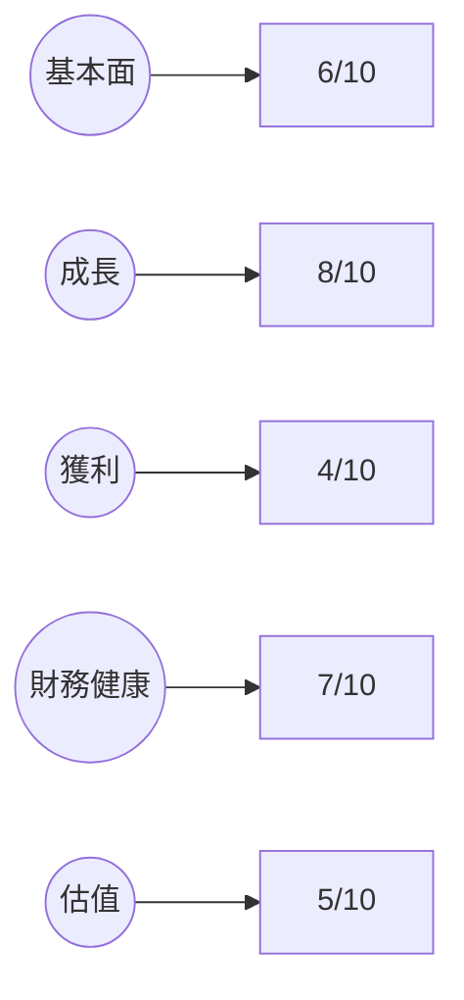
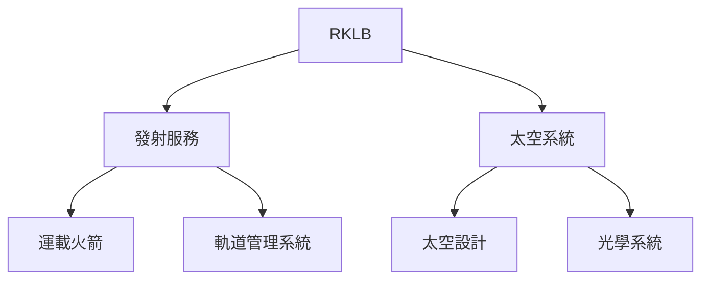
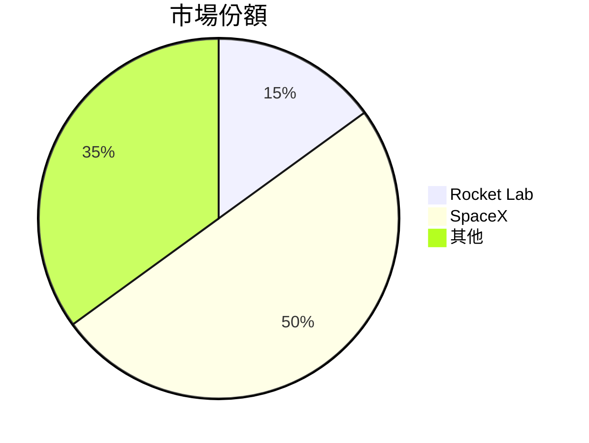
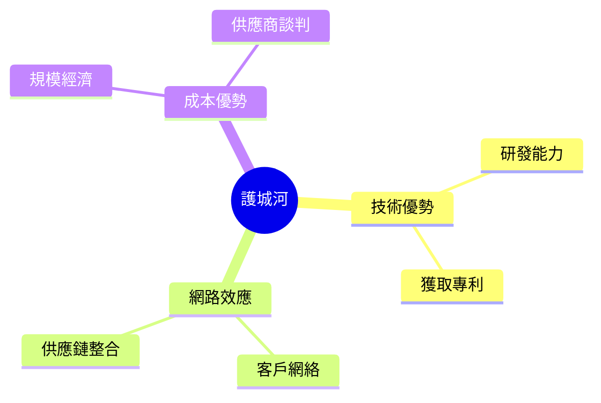
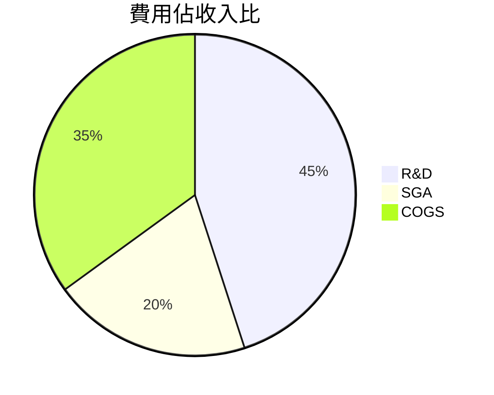
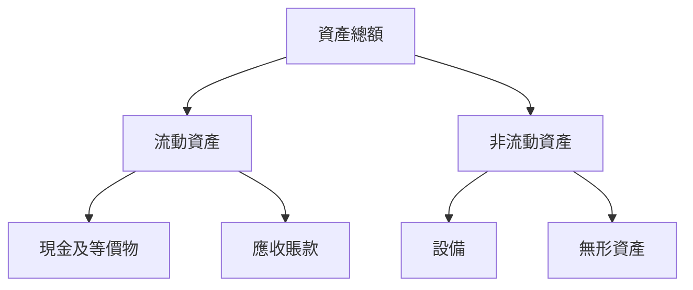
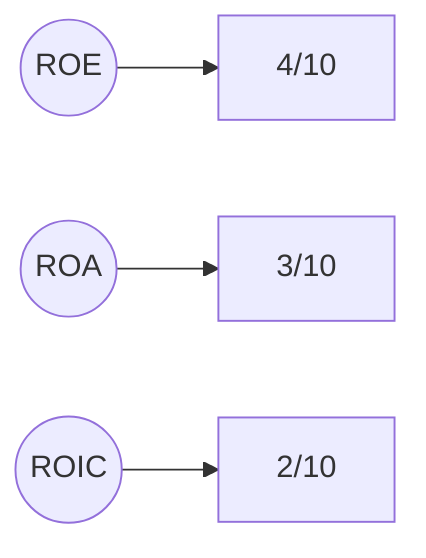
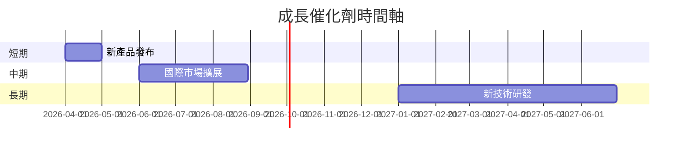
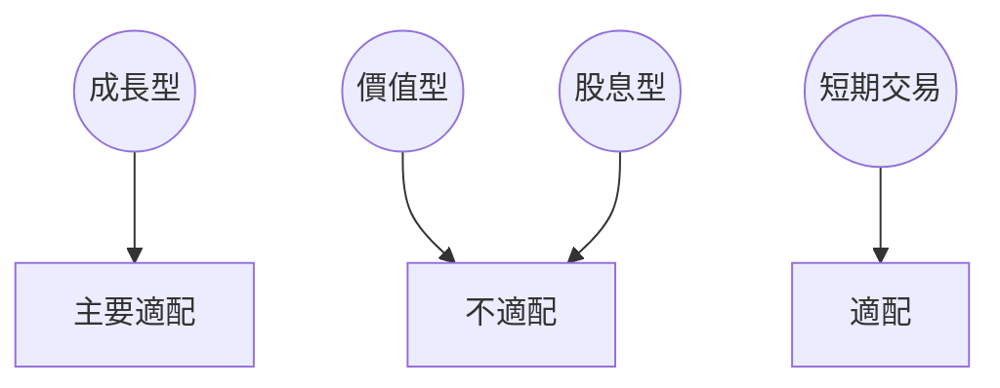

# RKLB 基本面深度分析報告
> **報告日期**：2026-03-25 ｜ **語言**：繁體中文 ｜ **數據來源**：Yahoo Finance

## 目錄
1. 執行摘要
2. 公司概覽與商業模式
3. 損益表深度分析
4. 資產負債表分析
5. 現金流量深度分析
6. 獲利能力與資本效率
7. 估值深度分析
8. 成長催化劑
9. 風險矩陣
10. 投資建議

## 1. 執行摘要

### 核心評分儀表板


### 5大投資論點 + 3大風險
| 投資論點                          | 評估  |
|----------------------------------|-------|
| 1. 強勁的收入增長趨勢             | 🟢    |
| 2. 與 SpaceX 的競爭優勢           | 🟡    |
| 3. 技術創新能力                   | 🟢    |
| 4. 國際市場擴展機會               | 🟢    |
| 5. 空間技術的戰略合作夥伴關係     | 🟡    |

| 風險因素                          | 評估  |
|----------------------------------|-------|
| 1. 高研發成本壓力                | 🔴    |
| 2. 市場競爭加劇                  | 🟡    |
| 3. 法規及政策變動風險            | 🔴    |

### 快速統計卡片
| 指標               | RKLB     | 行業均值 |
|-------------------|----------|----------|
| 市值               | $41.48B  | $25.00B  |
| P/S Ratio         | 68.92    | 5.00     |
| EV/EBITDA         | -198.04  | 12.00    |
| EPS (TTM)         | $-0.37   | $2.50    |
| 營業利潤率         | -28.4%   | 15.0%    |

### 投資結論
**投資建議**：持有  
**目標價區間**：$68 - $89

## 2. 公司概覽與商業模式

### 業務結構與收入來源


### 市場地位


### 競爭護城河


### 護城河強度評分
```plaintext
技術優勢 ▓▓▓▓▓░░░░░ 5/10
網路效應 ▓▓▓▓▓▓░░░░ 6/10
成本優勢 ▓▓▓▓░░░░░░ 4/10
```

## 3. 損益表深度分析

### 年度收入成長趨勢
```plaintext
2022: $211M ░░░░░░░░░░
2023: $245M ▓░░░░░░░░░
2024: $436M ▓▓▓▓░░░░░░
2025: $601M ▓▓▓▓▓▓░░░░
YoY 成長率: 2023-2024: 78.4% | 2024-2025: 37.9%
```

### 季度收入趨勢
| 季度      | 總收入  | QoQ 成長 | YoY 成長 |
|-----------|--------|----------|----------|
| 2025 Q1   | $122.57M | -      | +39.4%   |
| 2025 Q2   | $144.50M | +17.9% | +49.8%   |
| 2025 Q3   | $155.08M | +7.3%  | +54.1%   |
| 2025 Q4   | $179.65M | +15.8% | +63.6%   |

### 利潤率演變表格
| 年度      | 毛利率  | 營業利潤率 | EBITDA率 | 淨利率  |
|-----------|--------|------------|---------|--------|
| 2022      | 9.0%   | -64.1%     | -45.1%  | -64.4% |
| 2023      | 21.0%  | -72.8%     | -53.8%  | -74.7% |
| 2024      | 26.6%  | -43.5%     | -29.7%  | -43.6% |
| 2025      | 34.4%  | -28.4%     | -30.8%  | -32.9% |

### 費用結構分析


### EPS 趨勢與盈餘品質分析
EPS 近四季均未有明確數據，顯示出盈餘的不穩定性和分析難度。

## 4. 資產負債表分析

### 資產結構


### 流動性指標表格
| 指標         | 值     | 評估  |
|--------------|--------|-------|
| 流動比       | 4.083  | 🟢    |
| 速動比       | 3.407  | 🟢    |
| 現金比       | 2.48   | 🟢    |

### 債務結構分析
短期債務佔比較低，淨現金狀況顯示流動性良好，Debt-to-EBITDA 顯示財務槓桿高。

### 股東權益趨勢
```plaintext
2022: $673M ░░░░░░░░░░
2023: $555M ▓░░░░░░░░░
2024: $382M ▓▓░░░░░░░░
2025: $1.72B ▓▓▓▓▓▓▓▓░
```

## 5. 現金流量深度分析

### 現金流量瀑布圖


### FCF 轉換率趨勢表格
| 年度      | FCF 轉換率 |
|-----------|------------|
| 2022      | -109.6%    |
| 2023      | -84.0%     |
| 2024      | -26.6%     |
| 2025      | -53.6%     |

### 自由現金流趨勢
```plaintext
2022: $-149M ▓░░░░░░░░░
2023: $-154M ▓▓░░░░░░░░
2024: $-116M ▓▓▓░░░░░░░
2025: $-322M ▓▓▓▓▓▓▓▓▓░
```

### 資本配置評估
資本支出佔比較高，Buyback 和 M&A 活動有限。

## 6. 獲利能力與資本效率

### ROE / ROA / ROIC 趨勢表格
| 指標      | 2022  | 2023  | 2024  | 2025  | 行業均值 |
|-----------|-------|-------|-------|-------|----------|
| ROE       | -20.2%| -32.9%| -49.7%| -18.8%| 12.0%   |
| ROA       | -13.7%| -19.4%| -19.4%| -8.2% | 6.5%    |
| ROIC      | N/A   | N/A   | N/A   | N/A   | 8.0%    |

### **ROIC vs WACC 分析**
推測 WACC 約為 10%，但由於持續虧損，ROIC 無法計算，顯示公司目前無法創造經濟價值。

### DuPont 分解
ROE = 淨利率 × 資產週轉率 × 槓桿比，顯示出淨利率的負面影響最大。

### 獲利能力儀表板


## 7. 估值深度分析

### **同業估值比較表格**
| 公司        | P/E      | P/S      | EV/EBITDA | P/B      | PEG      | FCF Yield |
|-------------|----------|----------|-----------|----------|----------|-----------|
| RKLB        | N/A      | 68.92    | -198.04   | 22.99    | N/A      | -0.65%    |
| SpaceX      | 25.00    | 10.00    | 15.00     | 8.00     | 1.50     | 2.00%     |
| Blue Origin | 30.00    | 12.00    | 18.00     | 10.00    | 2.00     | 1.50%     |

### 歷史估值區間分析
P/E 無數據，但 P/S 顯示高估情況。

### **DCF 敏感性分析**
| 情境       | 折現率  | 樂觀成長 | 基準成長 | 悲觀成長 |
|------------|---------|----------|----------|----------|
| 樂觀       | 8%      | $120     | $110     | $90      |
| 基準       | 10%     | $100     | $89      | $68      |
| 悲觀       | 12%     | $90      | $80      | $60      |

### 估值區間視覺化
```plaintext
低估區: $60 ░░░░
合理區: $68 - $89 ▓▓▓▓
高估區: $90 - $120 ▓▓▓▓▓▓
```

## 8. 成長催化劑

### 催化劑時間軸


### TAM 市場規模與滲透率
```plaintext
市場規模: $500B
滲透率: 15% ▓▓░░░░░░░░░░
```

### 短/中/長期成長驅動力


## 9. 風險矩陣

### 風險評分矩陣
| 風險項目            | 機率 | 衝擊 | 評分 | 緩解措施             |
|---------------------|------|------|------|----------------------|
| 高研發成本壓力      | 高   | 高   | 🔴   | 降低成本，提高效益   |
| 市場競爭加劇        | 中   | 高   | 🟡   | 加強市場營銷         |
| 法規及政策變動風險  | 高   | 高   | 🔴   | 強化法規合規能力     |

## 10. 投資建議

### 最終綜合評級
```plaintext
基本面 ▓▓▓░░░ 6/10
成長 ▓▓▓▓▓▓░░ 8/10
獲利 ▓▓░░░░░ 4/10
財務健康 ▓▓▓▓▓░░ 7/10
估值 ▓▓▓░░░ 5/10
```

### 目標價及隱含報酬率
**目標價**：$68 - $89  
**隱含報酬率**：-6.6% 至 +23.4%

### 買入時機與觸發因素
- 買入時機：價格接近低估區間
- 觸發因素：新產品成功發佈，市場份額增長

### 投資人適配度


### 關鍵監控指標 checklist
- 下次財報：收入增長率
- 產業數據：市場份額變動
- 競爭動態：技術革新

> **免責聲明**：本報告為 AI 自動生成，僅供研究參考，不構成投資建議。