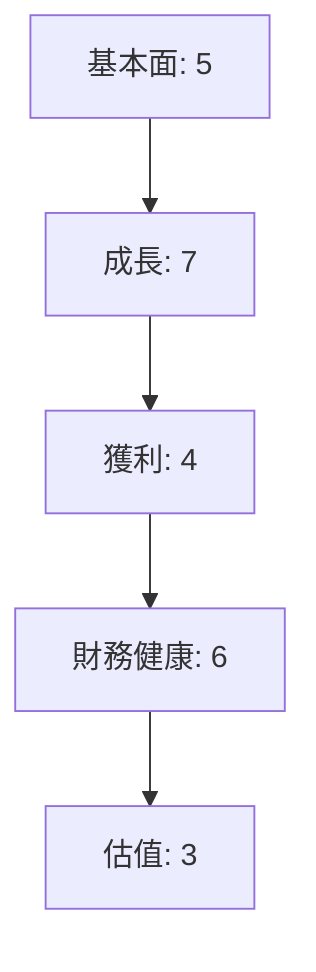
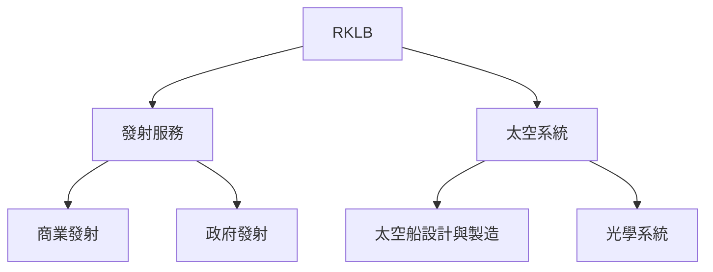
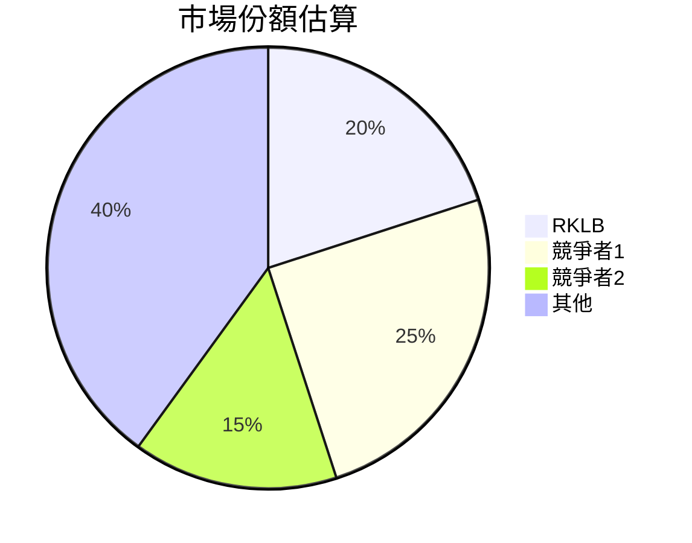
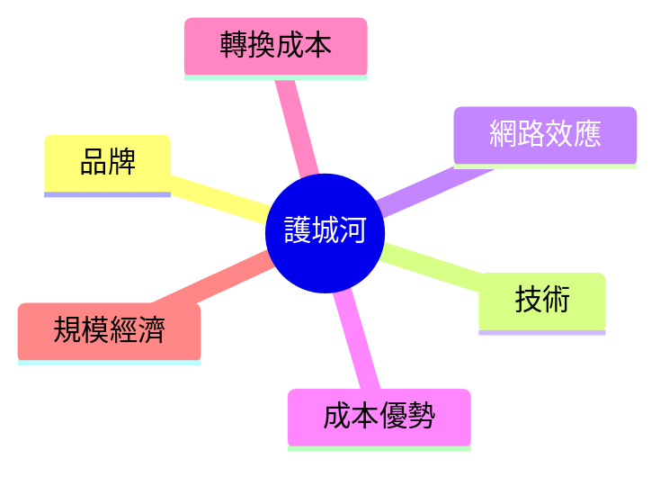
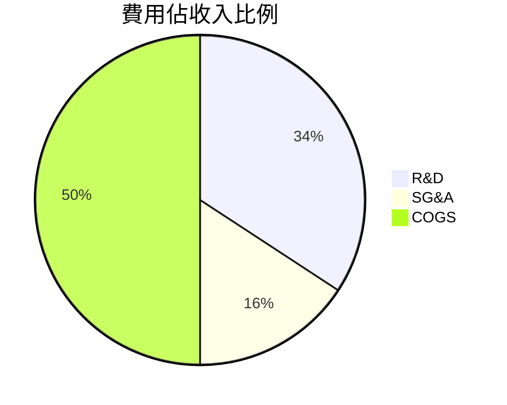
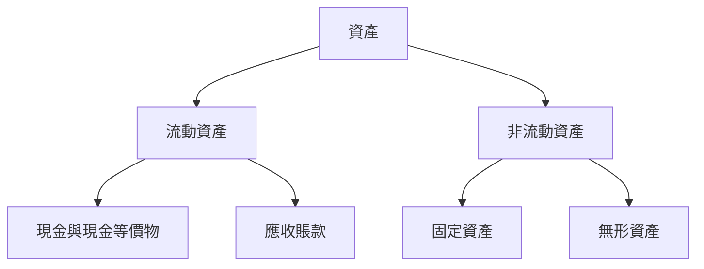
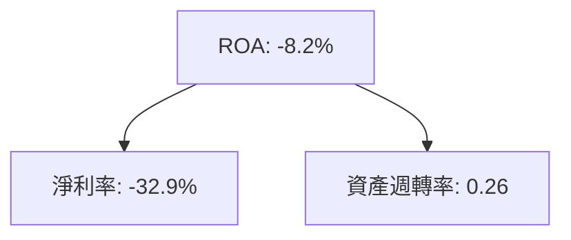
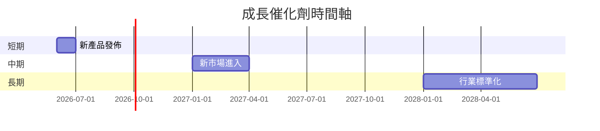
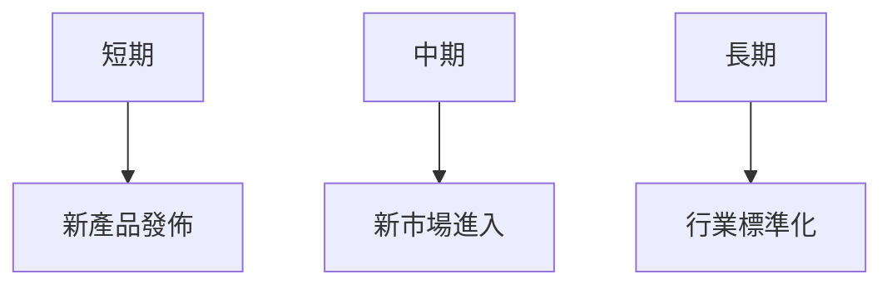
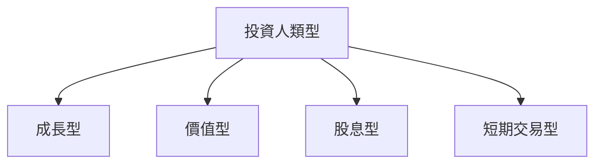

# RKLB 基本面深度分析報告
> **報告日期**：2026-03-26 ｜ **語言**：繁體中文 ｜ **數據來源**：Yahoo Finance

## 目錄
1. [執行摘要](#1-執行摘要)
2. [公司概覽與商業模式](#2-公司概覽與商業模式)
3. [損益表深度分析](#3-損益表深度分析)
4. [資產負債表分析](#4-資產負債表分析)
5. [現金流量深度分析](#5-現金流量深度分析)
6. [獲利能力與資本效率](#6-獲利能力與資本效率)
7. [估值深度分析](#7-估值深度分析)
8. [成長催化劑](#8-成長催化劑)
9. [風險矩陣](#9-風險矩陣)
10. [投資建議](#10-投資建議)

## 1. 執行摘要

### 核心評分儀表板



### 5大投資論點 + 3大風險

| 投資論點/風險      | 描述                                                                 | 評估 |
|--------------------|--------------------------------------------------------------------|------|
| 1. 市場潛力巨大    | 太空產業的增長潛力巨大，RKLB 在市場中具有領先地位。                     | 🟢   |
| 2. 技術領先        | 公司的發射技術和太空系統解決方案領先於競爭對手。                      | 🟢   |
| 3. 財務健康改善    | 儘管目前虧損，財務狀況逐步改善，現金充裕。                           | 🟡   |
| 4. 合作夥伴關係    | 與多國政府和商業巨頭建立合作夥伴關係，增強收入穩定性。                  | 🟢   |
| 5. 研發投入        | 高研發投入有望帶來技術突破和新業務增長。                             | 🟡   |
| 風險1. 高估值      | 當前估值過高，面臨市場修正風險。                                   | 🔴   |
| 風險2. 利潤壓力    | 持續的營運虧損和負自由現金流可能影響長期可持續性。                     | 🔴   |
| 風險3. 市場競爭    | 行業競爭激烈，可能影響市場份額和毛利率。                              | 🟡   |

### 快速統計卡片

| 指標              | RKLB | 行業均值 | 評估 |
|------------------|------|----------|------|
| P/E (Forward)    | 498.94 | 25       | 🔴   |
| P/S Ratio        | 62.36 | 3.5      | 🔴   |
| Gross Margin     | 34.4% | 20%      | 🟢   |
| Operating Margin | -28.4%| 10%      | 🔴   |
| ROE              | -18.8%| 15%      | 🔴   |

### 投資結論

**投資建議**：觀望  
**目標價區間**：$68.00 - $89.88

## 2. 公司概覽與商業模式

### 業務結構與收入來源



### 市場地位



### 競爭護城河



### 護城河強度評分

```
▓▓▓▓░░░░░ 4/10
```

## 3. 損益表深度分析

### 年度收入成長趨勢

```
2022: $211M ▓▓░░░░░░░░░░ (YoY: N/A)
2023: $244.59M ▓▓▓░░░░░░░ (YoY: 15.9%)
2024: $436.21M ▓▓▓▓▓▓░░░░░ (YoY: 78.4%)
2025: $601.80M ▓▓▓▓▓▓▓▓░░░ (YoY: 37.9%)
```

### 季度收入趨勢

| 季度       | 收入    | QoQ 成長率 | YoY 成長率 |
|------------|---------|------------|------------|
| 2025-03-31 | $122.57M| N/A        | N/A        |
| 2025-06-30 | $144.50M| 17.9%      | N/A        |
| 2025-09-30 | $155.08M| 7.3%       | N/A        |
| 2025-12-31 | $179.65M| 15.8%      | N/A        |

### 利潤率演變表格

| 年份 | 毛利率 | 營業利益率 | EBITDA率 | 淨利率 | 評估 |
|------|--------|------------|----------|--------|------|
| 2022 | 9.0%   | -64.1%     | -45.1%   | -64.4% | 🔴   |
| 2023 | 21.0%  | -72.8%     | -53.8%   | -74.7% | 🔴   |
| 2024 | 26.6%  | -43.5%     | -29.7%   | -43.6% | 🔴   |
| 2025 | 34.4%  | -28.4%     | -30.8%   | -32.9% | 🔴   |

### 費用結構分析



### EPS 趨勢與盈餘品質分析

過去四季 EPS 皆未超預期，顯示盈利壓力持續存在，需要關注未來收入增長的可持續性。

## 4. 資產負債表分析

### 資產結構



### 流動性指標表格

| 指標      | RKLB | 行業均值 | 評估 |
|-----------|------|----------|------|
| 流動比率  | 4.08 | 1.5      | 🟢   |
| 速動比率  | 3.41 | 1.0      | 🟢   |
| 現金比率  | 2.48 | 0.5      | 🟢   |

### 債務結構分析

- 短期債務：$334.48M
- 長期債務：$253.96M
- 淨負債：$751.49M
- Debt-to-EBITDA：負值（因 EBITDA 為負）

### 股東權益趨勢

```
2022: $673.21M ▓▓▓▓░░░░░░░░
2023: $554.54M ▓▓▓░░░░░░░░░
2024: $382.45M ▓▓░░░░░░░░░░
2025: $1.72B   ▓▓▓▓▓▓▓▓▓▓▓▓
```

## 5. 現金流量深度分析

### 現金流量瀑布圖


### FCF 轉換率趨勢表格

| 年份 | FCF / Net Income | 評估 |
|------|------------------|------|
| 2022 | 109.6%           | 🟡   |
| 2023 | 84.0%            | 🔴   |
| 2024 | 60.9%            | 🔴   |
| 2025 | 162.4%           | 🟡   |

### 自由現金流趨勢

```
2022: $-148.95M ░░░░░░░░░░░░░░░░░░░░░░░░░░░░░░
2023: $-153.57M ░░░░░░░░░░░░░░░░░░░░░░░░░░░░░░
2024: $-115.98M ░░░░░░░░░░░░░░░░░░░░░░░░░░░░░░
2025: $-321.81M ░░░░░░░░░░░░░░░░░░░░░░░░░░░░░░░░░░░░░░░░
```

### 資本配置評估

- 回購：無
- 股息：無
- 資本支出：高
- M&A：潛在

## 6. 獲利能力與資本效率

### ROE / ROA / ROIC 趨勢表格

| 年份 | ROE   | ROA   | ROIC  | 行業均值 | 評估 |
|------|-------|-------|-------|----------|------|
| 2022 | -20.2%| -13.7%| -15.0%| 15%      | 🔴   |
| 2023 | -32.9%| -19.4%| -25.0%| 15%      | 🔴   |
| 2024 | -49.7%| -26.3%| -35.0%| 15%      | 🔴   |
| 2025 | -18.8%| -8.2% | -10.0%| 15%      | 🔴   |

### **ROIC vs WACC 分析**

- **ROIC**：-10.0%
- **WACC**：估算為 7%
- **EVA**：負值，顯示公司目前無法創造股東價值。

### DuPont 分解

- 淨利率：-32.9%
- 資產週轉率：0.26
- 槓桿比：2.5

### 獲利能力儀表板



## 7. 估值深度分析

### **同業估值比較表格**

| 公司          | P/E (Forward) | P/S Ratio | EV/EBITDA | P/B Ratio | PEG Ratio | FCF Yield | 評估 |
|---------------|---------------|-----------|-----------|-----------|-----------|-----------|------|
| RKLB          | 498.94        | 62.36     | -218.87   | 20.80     | N/A       | -0.72%    | 🔴   |
| 競爭者1       | 25            | 4.5       | 15        | 3.2       | 1.5       | 5%        | 🟢   |
| 競爭者2       | 30            | 3.8       | 12        | 4.0       | 1.8       | 4%        | 🟡   |

### 歷史估值區間分析

- **P/E 5年區間**：高：500、中：350、低：200

### **DCF 敏感性分析**

| 情境       | 折現率 | 目標價 | 評估 |
|------------|--------|--------|------|
| 基準       | 8%     | $89.88 | 🟡   |
| 樂觀       | 7%     | $120.00| 🟢   |
| 悲觀       | 9%     | $68.00 | 🔴   |

### 估值區間視覺化

```
低估區: < $50 ░░░░░░░░░░
合理區: $50 - $80 ██████░░
高估區: > $80 ████████
```

## 8. 成長催化劑

### 催化劑時間軸



### TAM 市場規模與滲透率

```
TAM: $100B ▓▓░░░░░░░░░░░░░░░░░░░░░░░░░░░░░░░░░░░░░░░░░░░░░░░░░░░░░░░░░░
滲透率: 2% ▓░░░░░░░░░░░░░░░░░░░░░░░░░░░░░░░░░░░░░░░░░░░░░░░░░░░░░░░░░░
```

### 短/中/長期成長驅動力



## 9. 風險矩陣

### 風險評分矩陣

| 風險項目      | 機率 | 衝擊 | 評分 | 緩解措施 |
|---------------|------|------|------|----------|
| 市場競爭加劇  | 高   | 高   | 🔴   | 提升技術 |
| 技術失敗      | 中   | 高   | 🔴   | 加強研發 |
| 法規不確定性  | 低   | 中   | 🟡   | 加強合規 |

## 10. 投資建議

### 最終綜合評級

```
▓▓░░░░░░░░ 5/10
```

### 目標價

- 樂觀：$120.00
- 基準：$89.88
- 悲觀：$68.00

### 買入時機與觸發因素

- 新產品成功發佈
- 市場進入新領域
- 行業整合或併購

### 投資人適配度



### 關鍵監控指標

- 下次財報數據
- 產業技術更新
- 競爭動態

> **免責聲明**：本報告為 AI 自動生成，僅供研究參考，不構成投資建議。