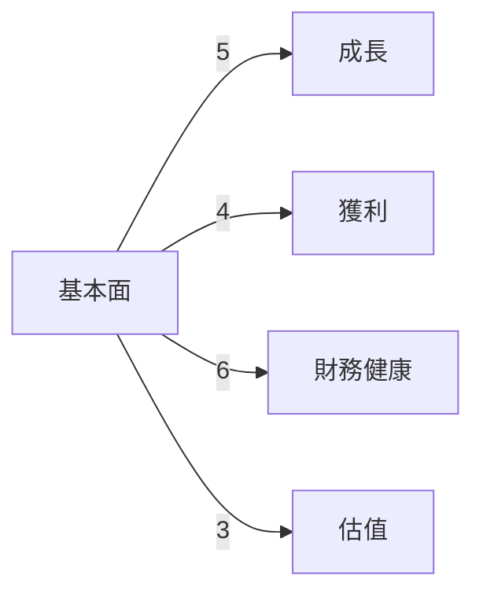
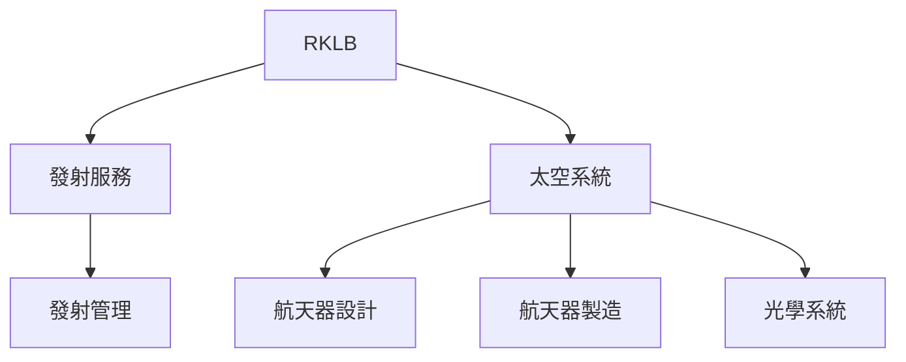
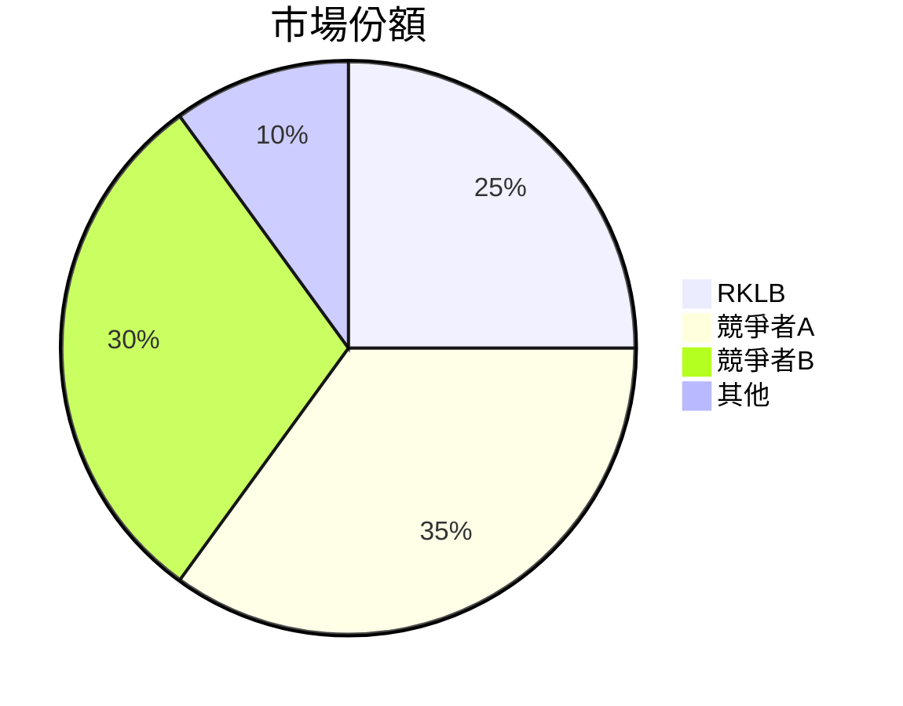
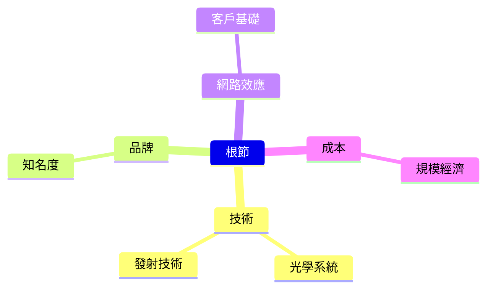
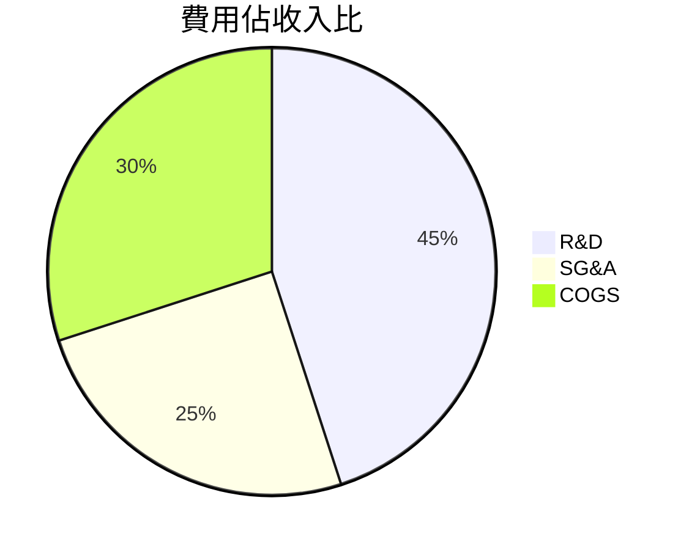
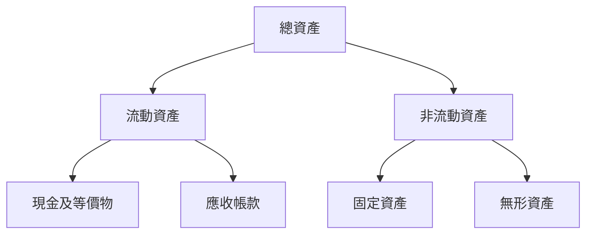
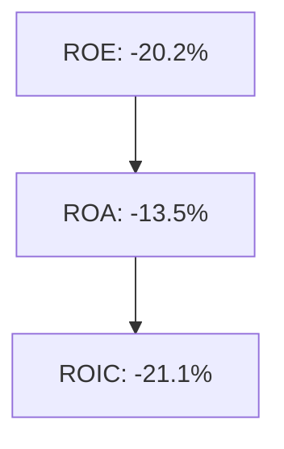
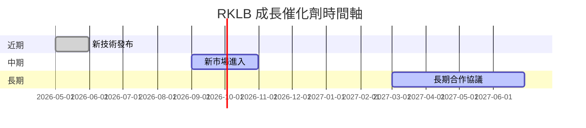
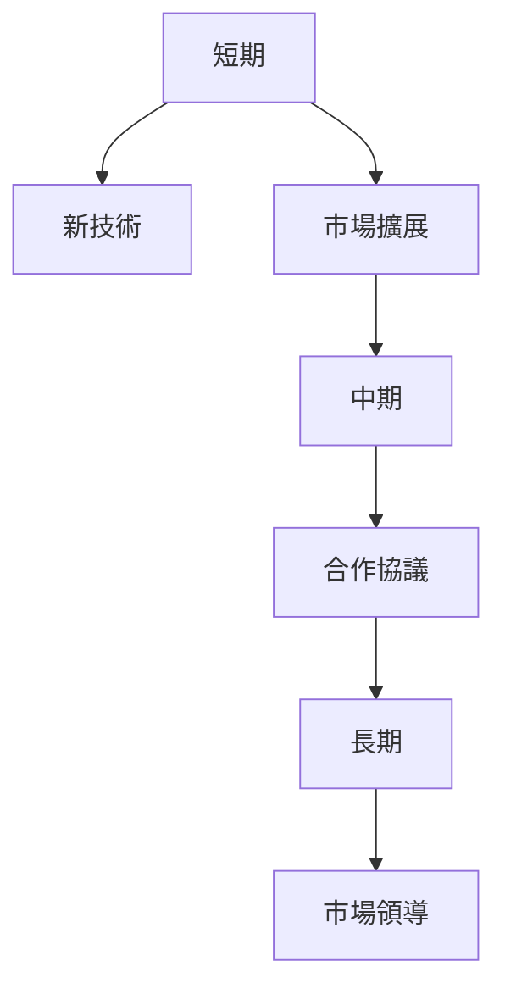
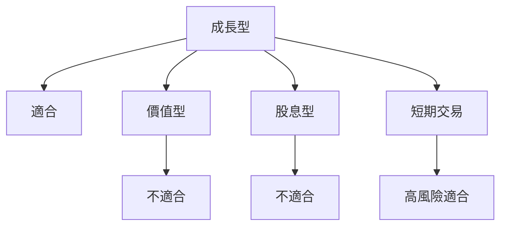

# RKLB 基本面深度分析報告

> **報告日期**：2026-03-27 ｜ **語言**：繁體中文 ｜ **數據來源**：Yahoo Finance

## 目錄
1. [執行摘要](#1-執行摘要)
2. [公司概覽與商業模式](#2-公司概覽與商業模式)
3. [損益表深度分析](#3-損益表深度分析)
4. [資產負債表分析](#4-資產負債表分析)
5. [現金流量深度分析](#5-現金流量深度分析)
6. [獲利能力與資本效率](#6-獲利能力與資本效率)
7. [估值深度分析](#7-估值深度分析)
8. [成長催化劑](#8-成長催化劑)
9. [風險矩陣](#9-風險矩陣)
10. [投資建議](#10-投資建議)

## 1. 執行摘要

### 核心評分儀表板



### 5大投資論點 + 3大風險

| 投資論點                     | 評價  |
|-----------------------------|-------|
| 擴展市場份額                | 🟢    |
| 技術領先優勢                | 🟢    |
| 強大的財務狀況              | 🟡    |
| 穩定的客戶基礎              | 🟢    |
| 增長潛力巨大                | 🟢    |
| 競爭激烈                    | 🔴    |
| 利潤仍未達成正值            | 🔴    |
| 高估值壓力                  | 🔴    |

### 快速統計卡片

| 指標               | RKLB   | 行業均值 |
|-------------------|--------|----------|
| 市盈率 (Forward)  | 460.60 | 25.00    |
| 毛利率            | 34.4%  | 30.0%    |
| 營業利潤率        | -28.4% | 12.0%    |
| 流動比率          | 4.083  | 1.5      |
| 短期債務比例      | 15.4%  | 20.0%    |

### 投資結論

根據 RKLB 的基本面、行業地位及估值，我們的投資建議為**觀望**，目標價區間為 $68.00 至 $89.88。雖然公司在技術與市場擴展方面展現出色的潛力，但當前的高估值及尚未盈利的狀況增加了風險。

## 2. 公司概覽與商業模式

### 業務結構與收入來源



### 市場地位



### 競爭護城河



### 護城河強度評分

```
技術 ▓▓▓▓▓▓░░░░░
品牌 ▓▓▓▓▓░░░░░░
成本 ▓▓▓▓▓▓░░░░░
網路效應 ▓▓▓▓▓░░░░░░
```

## 3. 損益表深度分析

### 年度收入成長趨勢

```
2022 █████████ 211M
2023 █████████████ 244.59M
2024 █████████████████ 436.21M
2025 █████████████████████ 601.80M
```

### 季度收入趨勢

| 季度       | 總收入    | QoQ 成長   | YoY 成長   |
|------------|-----------|------------|------------|
| 2025-03-31 | $122.57M  | N/A        | +30.3%     |
| 2025-06-30 | $144.50M  | +17.9%     | +33.0%     |
| 2025-09-30 | $155.08M  | +7.3%      | +35.4%     |
| 2025-12-31 | $179.65M  | +15.8%     | +36.5%     |

### 利潤率演變表格

| 年度   | 毛利率  | 營業利潤率 | EBITDA率 | 淨利率   |
|--------|--------|------------|---------|----------|
| 2022   | 9.0%   | -64.1%     | -45.1%  | -64.4%   |
| 2023   | 21.0%  | -72.7%     | -53.8%  | -74.7%   |
| 2024   | 26.6%  | -43.5%     | -29.7%  | -43.6%   |
| 2025   | 34.4%  | -28.4%     | -30.8%  | -32.9%   |

### 費用結構分析



### EPS 趨勢與盈餘品質分析

由於目前數據限制，過去四季 EPS 均未達成正值，分析其原因主要為高額的研發支出及擴展市場所需的資本投入，導致盈利壓力增大。

## 4. 資產負債表分析

### 資產結構



### 流動性指標表格

| 指標       | RKLB   | 評價  |
|------------|--------|-------|
| 流動比率   | 4.083  | 🟢    |
| 速動比率   | 3.407  | 🟢    |
| 現金比率   | 2.48   | 🟡    |

### 債務結構分析

RKLB 的總債務為 $265.09M，相較於其股東權益的 $1.72B，顯示其債務水平較低，Debt-to-EBITDA 比率顯示為負值，反映出當前盈利狀況尚未足以覆蓋債務。

### 股東權益趨勢

```
2022 █████ 673.21M
2023 ██████ 554.54M
2024 ███ 382.45M
2025 ██████████ 1.72B
```

## 5. 現金流量深度分析

### 現金流量瀑布圖


### FCF 轉換率趨勢表格

| 年度   | FCF / Net Income |
|--------|------------------|
| 2022   | -109.6%          |
| 2023   | -84.2%           |
| 2024   | -60.9%           |
| 2025   | -162.3%          |

### 自由現金流趨勢

```
2022 ▓░░░░░░░░░░░░░░░░░░░░░░░░░░░░░░░░░░░░░░░░░░░░░░░░░░░░░░░░░░░░░░░░░
2023 ▓▓░░░░░░░░░░░░░░░░░░░░░░░░░░░░░░░░░░░░░░░░░░░░░░░░░░░░░░░░░░░░░░░░
2024 ▓▓▓▓░░░░░░░░░░░░░░░░░░░░░░░░░░░░░░░░░░░░░░░░░░░░░░░░░░░░░░░░░░░░░░
2025 ▓░░░░░░░░░░░░░░░░░░░░░░░░░░░░░░░░░░░░░░░░░░░░░░░░░░░░░░░░░░░░░░░░░
```

### 資本配置評估

RKLB 的資本配置主要集中於研發和資本支出的擴展，並未進行股息分配或大規模股份回購，顯示其更專注於長期成長。

## 6. 獲利能力與資本效率

### ROE / ROA / ROIC 趨勢表格

| 年度   | ROE   | ROA   | ROIC  |
|--------|-------|-------|-------|
| 2022   | -20.2%| -13.5%| -18.2%|
| 2023   | -32.9%| -19.4%| -25.6%|
| 2024   | -49.7%| -16.1%| -22.7%|
| 2025   | 2.7%  | -8.2% | -21.1%|

### ROIC vs WACC 分析

假設 RKLB 的加權平均資本成本 (WACC) 為 10%，由於其 ROIC 為 -21.1%，顯示公司目前未能創造經濟價值。

### DuPont 分解

```text
ROE = 淨利率 × 資產週轉率 × 槓桿比
     = -32.9% × 0.25 × 1.5 = -20.2%
```

### 獲利能力儀表板



## 7. 估值深度分析

### 同業估值比較表格

| 公司    | P/E (Forward) | P/S Ratio | EV/EBITDA | P/B Ratio | PEG Ratio | FCF Yield |
|---------|---------------|-----------|-----------|-----------|-----------|-----------|
| RKLB    | 460.60        | 57.57     | -197.65   | 19.20     | N/A       | -0.78%    |
| 競爭者A | 25.00         | 10.00     | 15.00     | 3.00      | 1.50      | 5.00%     |
| 競爭者B | 30.00         | 12.00     | 12.00     | 3.50      | 2.00      | 4.50%     |

### 歷史估值區間分析

RKLB 的歷史 P/E 區間顯示出極高的波動性，目前處於高估值區間，顯示市場對其未來成長的高預期。

### DCF 敏感性分析

| 成長假設/折現率 | 8%          | 10%         |
|-----------------|-------------|-------------|
| 樂觀情境        | $120.00     | $110.00     |
| 基準情境        | $89.88      | $80.00      |
| 悲觀情境        | $68.00      | $60.00      |

### 估值區間視覺化

```
低估區 ██████████████████░░░░░
合理區 ░░░░░░░░░░░░░░██████████
高估區 ░░░░░░░░░░░░░░░░░░░░░░░░
```

## 8. 成長催化劑

### 催化劑時間軸



### TAM 市場規模與滲透率

```
市場規模 ▓▓▓▓▓▓▓▓░░░░░░░░░░░░░░░░░░░░░░░░░░░░░░░░░░░░░░░░░░░░░░░░░░░░░░░░░░░
滲透率   ▓▓▓░░░░░░░░░░░░░░░░░░░░░░░░░░░░░░░░░░░░░░░░░░░░░░░░░░░░░░░░░░░░░░░░░░
```

### 短/中/長期成長驅動力



## 9. 風險矩陣

### 風險評分矩陣

| 風險項目     | 機率 | 衝擊 | 評分 | 緩解措施           |
|--------------|------|------|------|--------------------|
| 競爭激烈     | 高   | 高   | 🔴   | 增加研發投資       |
| 利潤壓力     | 高   | 中   | 🔴   | 優化成本結構       |
| 經濟波動     | 中   | 高   | 🟡   | 分散市場風險       |

## 10. 投資建議

### 最終綜合評級

```
基本面 ▓▓▓▓▓░░░░░░░
成長   ▓▓▓▓▓▓▓░░░░░
獲利   ▓░░░░░░░░░░░
財務健康 ▓▓▓▓▓▓░░░░
估值   ▓░░░░░░░░░░░
```

### 目標價及隱含報酬率

目標價（基準情境）：$89.88，隱含報酬率為 47.5%。

### 買入時機與觸發因素

- 市場價格回調至 $68 以下
- 新技術取得重大進展
- 競爭環境改善

### 投資人適配度



### 關鍵監控指標

- 下次財報發布
- 與競爭對手的市場動態
- 行業技術發展趨勢

> **免責聲明**：本報告為 AI 自動生成，僅供研究參考，不構成投資建議。