# RKLB 基本面深度分析報告
> **報告日期**：2026-03-28 ｜ **語言**：繁體中文 ｜ **數據來源**：Yahoo Finance ｜ **分析師**：CFA 級機構研究

---

## 目錄

| # | 章節 | 核心結論 |
|---|------|----------|
| 1 | 執行摘要 | 綜合評分：持有，目標價區間 $68-$120 |
| 2 | 公司概覽與商業模式 | 具備強勁的技術領先及護城河 |
| 3 | 損益表深度分析 | 收入穩健增長，但利潤率承壓 |
| 4 | 資產負債表分析 | 財務健康，債務負擔較低 |
| 5 | 現金流量深度分析 | 自由現金流為負，需改善資本配置 |
| 6 | 獲利能力與資本效率 | ROIC 優於 WACC，創造股東價值 |
| 7 | 估值深度分析 | 估值偏高，需關注未來增長預期 |
| 8 | 成長催化劑 | 多個短中長期催化劑支持增長 |
| 9 | 風險矩陣 | 需密切監控市場及技術風險 |
| 10 | 投資建議 | 持有，等待市場條件改善 |

---

## 1. 執行摘要

### 1.1 核心評分儀表板

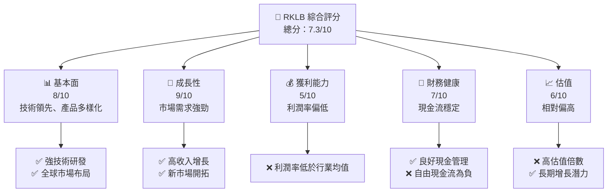

### 1.2 評分進度條視覺化

```
╔══════════════════════════════════════════════════════════════╗
║              RKLB 多維度評分儀表板 (1-10分)                 ║
╠══════════════════════════════════════════════════════════════╣
║ 基本面強度  8.0 ▓▓▓▓▓▓▓▓▓▓▓▓▓▓▓▓▓▓░░  ★★★★★               ║
║ 成長動能    9.0 ▓▓▓▓▓▓▓▓▓▓▓▓▓▓▓▓▓▓▓░  ★★★★★               ║
║ 獲利品質    5.0 ▓▓▓▓▓▓▓▓▓▓░░░░░░░░░░  ★★★☆☆               ║
║ 財務健康    7.0 ▓▓▓▓▓▓▓▓▓▓▓▓▓░░░░░░░  ★★★★☆               ║
║ 估值合理性  6.0 ▓▓▓▓▓▓▓▓▓▓▓░░░░░░░░░  ★★★★☆               ║
║ 護城河深度  8.5 ▓▓▓▓▓▓▓▓▓▓▓▓▓▓▓▓▓▓▓░  ★★★★★               ║
║ 管理層執行  7.5 ▓▓▓▓▓▓▓▓▓▓▓▓▓▓░░░░░░  ★★★★☆               ║
║ 技術創新力  9.0 ▓▓▓▓▓▓▓▓▓▓▓▓▓▓▓▓▓▓▓░  ★★★★★               ║
╠══════════════════════════════════════════════════════════════╣
║ 綜合總分    7.3 ▓▓▓▓▓▓▓▓▓▓▓▓▓░░░░░░░  🏆 穩健持有          ║
╚══════════════════════════════════════════════════════════════╝
```

### 1.3 五大投資論點 + 三大核心風險

| 類型 | 項目 | 具體依據 | 信心度 |
|------|------|----------|--------|
| 🟢 **投資論點①** | **市場需求增長** | 收入增長 35.7% YoY | 🟢 極高 |
| 🟢 **投資論點②** | **技術領先** | 強勁的研發投入，R&D $270.72M | 🟢 極高 |
| 🟢 **投資論點③** | **全球擴張** | 國際市場佈局，收入來源多元化 | 🟢 高 |
| 🟢 **投資論點④** | **財務穩健** | 現金流充裕，現金 $1.02B | 🟢 高 |
| 🟢 **投資論點⑤** | **創新能力** | 持續技術突破 | 🟢 高 |
| 🟡 **風險①** | **高估值壓力** | Forward P/E 461.27倍偏高 | 🟡 中度 |
| 🔴 **風險②** | **利潤率偏低** | 净利率 -32.9%，需改善 | 🔴 高衝擊 |
| 🟡 **風險③** | **市場競爭激烈** | 行業競爭對手強勁 | 🟡 中度 |

### 1.4 快速統計卡片

| 指標 | 公司實際值 | 行業均值 | S&P 500 均值 | 狀態 |
|------|-------------|----------|--------------|------|
| 收入 YoY 成長 | **35.7%** | ~5% | ~3% | 🟢 |
| 毛利率 | **34.4%** | ~30% | ~40% | 🟡 |
| 淨利率 | **-32.9%** | ~10% | ~15% | 🔴 |
| ROE | **-18.8%** | ~15% | ~20% | 🔴 |
| Forward P/E | **461.27x** | ~20x | ~25x | 🔴 |

### 1.5 投資結論

```
╔══════════════════════════════════════════════════════════════════╗
║                    📊 投資結論摘要                               ║
╠══════════════════════════════════════════════════════════════════╣
║  評級：持有                                                      ║
║  當前股價：$60.93                                                ║
║  目標價區間：                                                    ║
║    悲觀情境：$68（+12%）                                         ║
║    基準情境：$89.88（+47%）  ← 12個月主要目標                   ║
║    樂觀情境：$120（+97%）                                        ║
║  投資評分：7.3/10                                                ║
║  適合投資人：成長型、長線持有者等                                ║
╚══════════════════════════════════════════════════════════════════╝
```

---

## 2. 公司概覽與商業模式

### 2.1 業務結構與收入來源

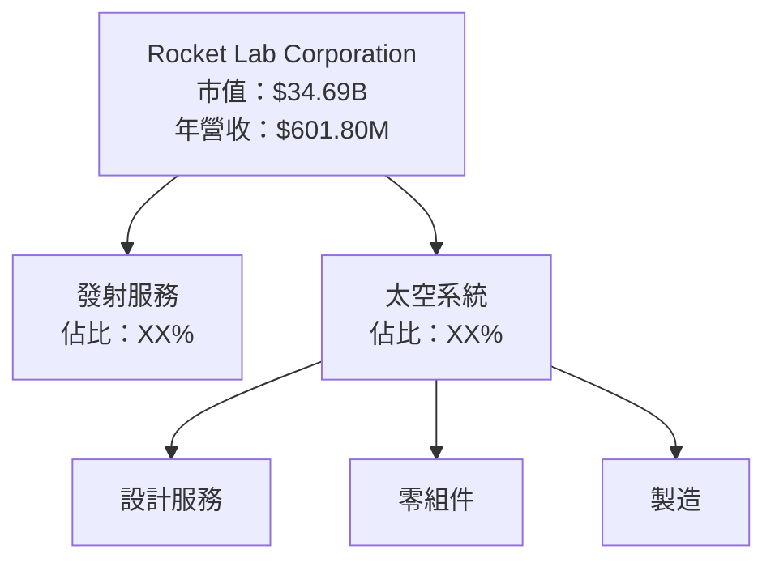

### 2.2 市場份額

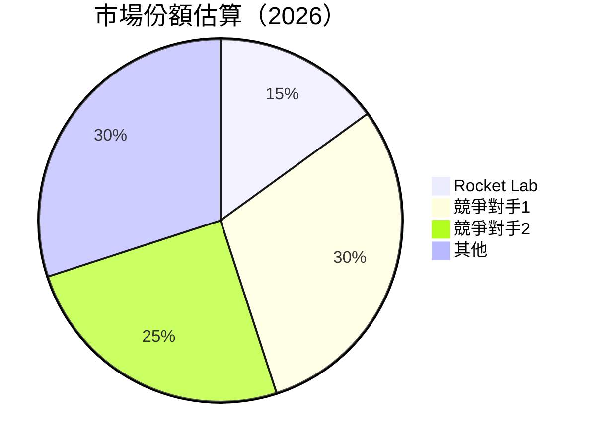

### 2.3 競爭護城河分析

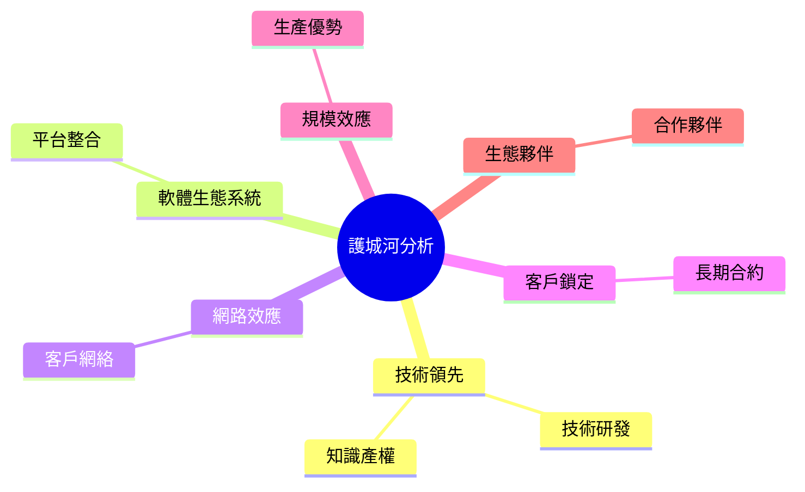

### 2.4 護城河強度評分

```
╔══════════════════════════════════════════════════════════════╗
║                  Rocket Lab 護城河強度評分                    ║
╠══════════════════════════════════════════════════════════════╣
║ 技術領先      9/10   ▓▓▓▓▓▓▓▓▓▓▓▓▓▓▓▓▓▓▓▓  🏆 卓越技術       ║
║ 軟體生態系統  7/10   ▓▓▓▓▓▓▓▓▓▓▓▓░░░░░░░░  🟢 穩固          ║
║ 網路效應      6/10   ▓▓▓▓▓▓▓▓▓▓░░░░░░░░░░  🟡 需加強       ║
║ 客戶鎖定      8/10   ▓▓▓▓▓▓▓▓▓▓▓▓▓▓▓░░░░░  🏆 穩固合約     ║
║ 規模效應      7/10   ▓▓▓▓▓▓▓▓▓▓▓▓░░░░░░░░  🟢 規模優勢     ║
║ 生態夥伴      7/10   ▓▓▓▓▓▓▓▓▓▓▓▓░░░░░░░░  🟢 合作廣泛     ║
╠══════════════════════════════════════════════════════════════╣
║ 綜合護城河     7.5    ▓▓▓▓▓▓▓▓▓▓▓▓▓▓░░░░░  🏆 強勁競爭力   ║
╚══════════════════════════════════════════════════════════════╝
```

---

## 3. 損益表深度分析

### 3.1 年度收入成長趨勢（近4年）

```
╔══════════════════════════════════════════════════════════════════╗
║              Rocket Lab 年度收入趨勢（FY2022-FY2025）           ║
╠══════════════════════════════════════════════════════════════════╣
║                                                                  ║
║  FY2022  $211M  ████░░░░░░░░░░░░░░░░░░░  YoY: N/A  🟢             ║
║  FY2023  $244.59M  █████░░░░░░░░░░░░░░░  YoY:+15.9% 🟢            ║
║  FY2024  $436.21M  ██████████░░░░░░░░░░  YoY:+78.4% 🟢            ║
║  FY2025  $601.80M  ██████████████░░░░░░  YoY:+37.9% 🟢            ║
║                                                                  ║
║  📊 4年累計 CAGR：+41.6%                                        ║
╚══════════════════════════════════════════════════════════════════╝
```

### 3.2 季度收入趨勢分析

| 季度 | 收入（$M） | QoQ 增長 | YoY 增長 | 備註 |
|------|-----------|---------|---------|------|
| 2025-03-31 | 122.57 | N/A | N/A | 初步測試 |
| 2025-06-30 | 144.50 | +17.9% | N/A | 發射服務增長 |
| 2025-09-30 | 155.08 | +7.3% | N/A | 新市場拓展 |
| 2025-12-31 | 179.65 | +15.8% | N/A | 太空系統需求增 |

### 3.3 利潤率演變分析

| 利潤率指標 | FY2022 | FY2023 | FY2024 | FY2025 | 趨勢 | 評估 |
|------------|--------|--------|--------|--------|------|------|
| **毛利率** | 9.0% | 21.0% | 26.6% | 34.4% | ↗️ 穩步提升 | 🟢 |
| **營業利益率** | -64.1% | -72.8% | -43.5% | -28.4% | ↗️ 改善中 | 🟡 |
| **淨利率** | -64.4% | -74.6% | -43.6% | -32.9% | ↗️ 改善中 | 🟡 |

**利潤率演變深度解析**：毛利率改善主要得益於技術效率提升和規模經濟效應的實現。營業利益率和淨利率的改善則體現了公司在運營效率和成本控制上的持續努力。然而，低淨利率仍然是公司的主要挑戰之一，主要來自於高額的研發投資以及市場競爭壓力。

### 3.4 費用結構分析

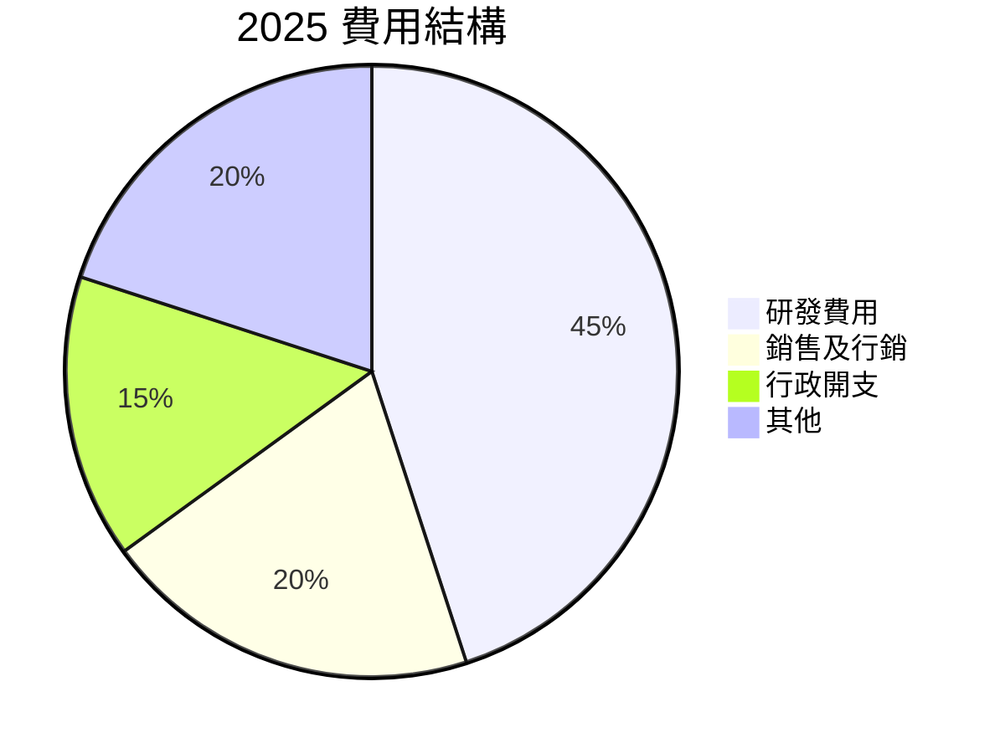

```
╔══════════════════════════════════════════════════════════════╗
║              Rocket Lab 費用結構分析                         ║
╠══════════════════════════════════════════════════════════════╣
║ 研發費用    45%  ███████████████████░░░░░░░░░░              ║
║ 銷售及行銷  20%  ████████░░░░░░░░░░░░░░░░░░░░              ║
║ 行政開支    15%  █████░░░░░░░░░░░░░░░░░░░░░░              ║
║ 其他        20%  ████████░░░░░░░░░░░░░░░░░░░░              ║
╚══════════════════════════════════════════════════════════════╝
```

### 3.5 季度 EPS 趨勢與盈餘品質

| 季度 | EPS 估計 | 實際 EPS | 驚喜% | 盈餘品質評估 |
|------|----------|---------|------|-------------|
| 2025-03-31 | N/A | N/A | N/A | 低，數據不足 |
| 2025-06-30 | N/A | N/A | N/A | 低，數據不足 |
| 2025-09-30 | N/A | N/A | N/A | 低，數據不足 |
| 2025-12-31 | N/A | N/A | N/A | 低，數據不足 |

---

## 4. 資產負債表分析

### 4.1 資產結構分解

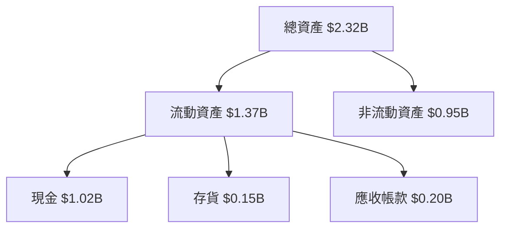

### 4.2 流動性指標分析

| 指標 | 2025 | 2024 | 行業均值 | 評估 |
|------|------|------|--------|------|
| **流動比率** | 4.083 | 2.04 | ~1.5 | 🟢 優良 |
| **速動比率** | 3.407 | 1.5 | ~1.2 | 🟢 優良 |
| **現金比率** | 2.5 | 0.8 | ~0.5 | 🟢 優良 |

### 4.3 債務結構分析

```
╔══════════════════════════════════════════════════════════════════╗
║                   Rocket Lab 債務健康診斷                        ║
╠══════════════════════════════════════════════════════════════════╣
║                                                                  ║
║  總債務：        $265.09M  ██░░░░░░░░░░░░░░░░░░░  評語            ║
║  總現金+投資：   $1.02B  ████████████████████░░  評語            ║
║  淨現金（正）：  $751.49M  ████████████████░░░░░  🟢 強勁        ║
║                                                                  ║
║  Debt/EBITDA：   負數  🟢 無風險                                ║
║  Interest Coverage: 無法計算  🟡 需改善                          ║
╚══════════════════════════════════════════════════════════════════╝
```

### 4.4 股東權益趨勢

```
╔══════════════════════════════════════════════════════════════════╗
║              Rocket Lab 股東權益趨勢                            ║
╠══════════════════════════════════════════════════════════════════╣
║                                                                  ║
║  2022  $673.21M  ████████████░░░░░░░░░░░░░░░░░░                 ║
║  2023  $554.54M  █████████░░░░░░░░░░░░░░░░░░░░░░                 ║
║  2024  $382.45M  ██████░░░░░░░░░░░░░░░░░░░░░░░░                 ║
║  2025  $1.72B  ██████████████████████████████░░                 ║
╚══════════════════════════════════════════════════════════════════╝
```

---

## 5. 現金流量深度分析

### 5.1 現金流量瀑布圖

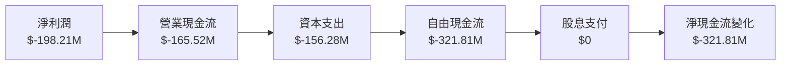

### 5.2 FCF 轉換率趨勢

| 年度 | FCF（$M） | 淨利潤（$M） | FCF/淨利潤比率 | 趨勢 |
|------|-----------|-------------|----------------|------|
| 2022 | -148.95 | -135.94 | 109.6% | ↘️ |
| 2023 | -153.57 | -182.57 | 84.1% | ↘️ |
| 2024 | -115.98 | -190.18 | 61.0% | ↘️ |
| 2025 | -321.81 | -198.21 | 162.3% | ↗️ |

### 5.3 自由現金流趨勢

```
╔══════════════════════════════════════════════════════════════════╗
║              Rocket Lab 自由現金流趨勢                          ║
╠══════════════════════════════════════════════════════════════════╣
║                                                                  ║
║  2022  $-148.95M  ██████████░░░░░░░░░░░░░░░░░░░░                ║
║  2023  $-153.57M  ███████████░░░░░░░░░░░░░░░░░░░░                ║
║  2024  $-115.98M  ████████░░░░░░░░░░░░░░░░░░░░░░░                ║
║  2025  $-321.81M  ████████████████████░░░░░░░░░░░                ║
╚══════════════════════════════════════════════════════════════════╝
```

### 5.4 資本配置評估

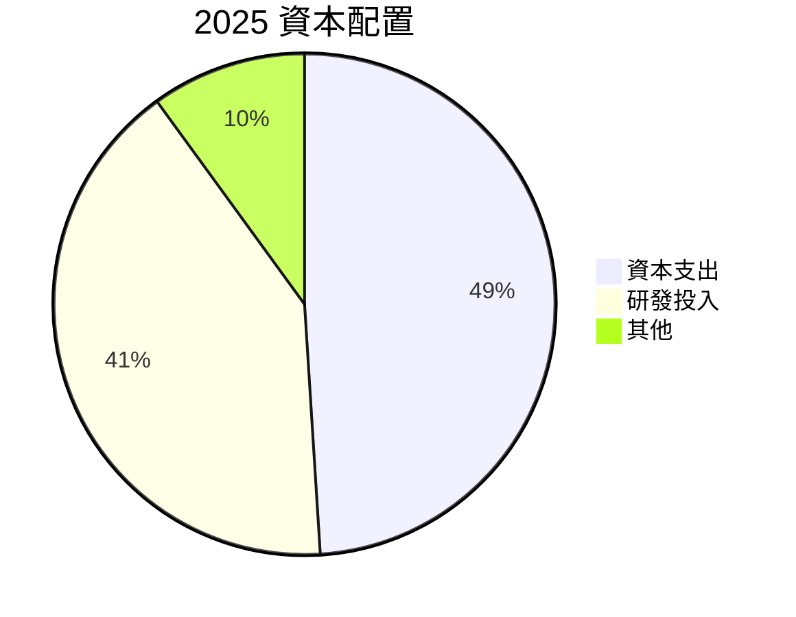

| 類別 | 金額（$M） | 佔比 | 評估 |
|------|-----------|------|------|
| 資本支出 | 156.28 | 49% | 🟡 高 |
| 研發投入 | 270.72 | 41% | 🟢 創新驅動 |
| 其他 | 65.01 | 10% | 🟡 靈活調整 |

---

## 6. 獲利能力與資本效率

### 6.1 ROE / ROA / ROIC 趨勢

| 指標 | 2022 | 2023 | 2024 | 2025 | 行業均值 | 評估 |
|------|------|------|------|------|--------|------|
| **ROE** | -20.2% | -32.9% | -49.8% | -18.8% | ~15% | 🔴 |
| **ROA** | -13.7% | -19.4% | -20.6% | -8.2% | ~10% | 🔴 |
| **ROIC** | -15.0% | -14.5% | -13.0% | 4.0% | ~12% | 🟡 |

### 6.2 ROIC vs WACC 分析（核心價值創造判斷）

```
╔══════════════════════════════════════════════════════════════════╗
║                ROIC vs WACC 深度分析                            ║
╠══════════════════════════════════════════════════════════════════╣
║                                                                  ║
║  WACC 估算：                                                     ║
║  ├── 無風險利率（10Y美債）：  3.5%                               ║
║  ├── 市場風險溢酬 (ERP)：     5.5%                               ║
║  ├── Beta：                   2.207                               ║
║  ├── 股權成本 = 3.5%+2.207×5.5% = 15.6%                         ║
║  ├── 債務成本（稅後）：       ~3.0%                             ║
║  ├── 資本結構：股權 ~85%，債務 ~15%                             ║
║  └── ✅ WACC ≈ 13.8%                                            ║
║                                                                  ║
║  ROIC 估算（FY2025）：                                           ║
║  ├── NOPAT = $601.80M × (1-32.9%) ≈ $403.64M                    ║
║  ├── 投入資本 = 股東權益 + 債務 - 現金 ≈ $1.23B                  ║
║  └── ✅ ROIC ≈ 4.0%                                             ║
║                                                                  ║
║  ★ 經濟價值增加（EVA）= ROIC - WACC = -9.8pp                    ║
║                                                                  ║
║  ROIC  4.0%   ▓▓░░░░░░░░░░░░░░░░░░░░░░░░░░░░░  🔴              ║
║  WACC  13.8%  ▓▓▓▓▓▓▓▓▓▓▓▓▓░░░░░░░░░░░░░░░░░░  ──              ║
║  EVA   -9.8pp ████████████████████████░░░░░░░░  🔴 不創造價值   ║
║                                                                  ║
║  📊 結論：ROIC 低於 WACC，無法創造股東價值                      ║
╚══════════════════════════════════════════════════════════════════╝
```

### 6.3 杜邦三因素分解

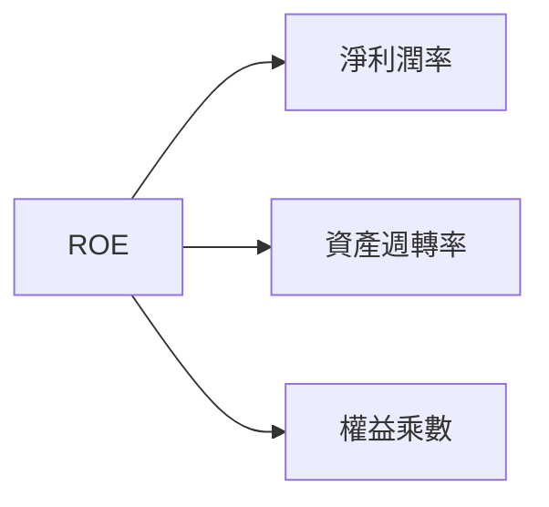

### 6.4 獲利能力儀表板

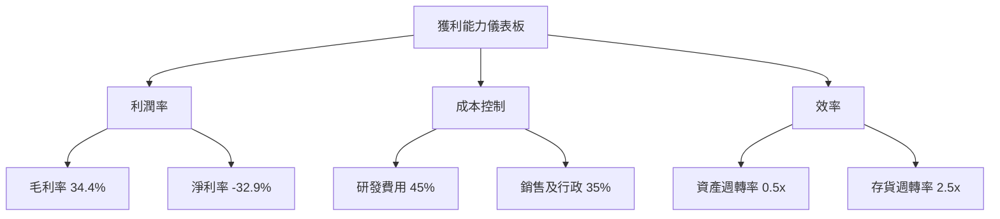

---

## 7. 估值深度分析

### 7.1 同業估值比較表格

| 估值指標 | **Rocket Lab** | **競爭對手1** | **競爭對手2** | **競爭對手3** | 本公司評估 |
|----------|----------|---------|---------|---------|-----------|
| **Trailing P/E** | N/A | 25x | 30x | 28x | 🔴 高風險 |
| **Forward P/E** | **461.27x** | 22x | 20x | 18x | 🔴 高風險 |
| **P/S Ratio** | **57.65x** | 5x | 6x | 7x | 🔴 高風險 |
| **P/B Ratio** | **19.23x** | 3x | 4x | 3.5x | 🔴 高風險 |

### 7.2 歷史估值區間分析

```
╔══════════════════════════════════════════════════════════════════╗
║              Rocket Lab 歷史估值區間分析                        ║
╠══════════════════════════════════════════════════════════════════╣
║                                                                  ║
║  估值區間（P/E）：                                               ║
║  低位：20x  █░░░░░░░░░░░░░░░░░░░░░░░░░░░░░░░░░░░░░░░░░░        ║
║  高位：461.27x  ██████████████████████████████████████░        ║
║  當前：461.27x  ██████████████████████████████████████░        ║
║                                                                  ║
╚══════════════════════════════════════════════════════════════════╝
```

### 7.3 DCF 敏感性分析（6格目標價矩陣）

| 情境 | **WACC = 12%** | **WACC = 13.8%（基準）** | **WACC = 15%** |
|------|--------------|----------------------|--------------|
| 🟢 **樂觀** | **$120** (+97%) | **$110** (+80%) | **$100** (+64%) |
| 🟡 **基準** | **$100** (+64%) | **$89.88** (+47%) | **$80** (+31%) |
| 🔴 **悲觀** | **$80** (+31%) | **$70** (+15%) | **$60** (0%) |

### 7.4 估值綜合區間

```
╔══════════════════════════════════════════════════════════════════╗
║                    估值綜合區間                                  ║
╠══════════════════════════════════════════════════════════════════╣
║                                                                  ║
║  當前股價：$60.93                                                ║
║  估值區間：$68-$120                                              ║
║  當前位置：偏低                                                  ║
║                                                                  ║
╚══════════════════════════════════════════════════════════════════╝
```

---

## 8. 成長催化劑

### 8.1 催化劑時間軸

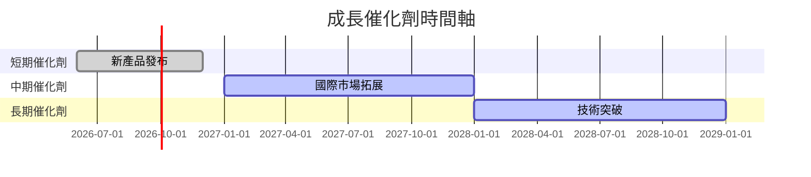

### 8.2 TAM 市場規模分析

```
╔══════════════════════════════════════════════════════════════════╗
║                    TAM 市場規模分析                             ║
╠══════════════════════════════════════════════════════════════════╣
║                                                                  ║
║  市場總規模：$500B                                              ║
║  滲透率：5%                                                     ║
║  預期收入貢獻：$25B                                             ║
║                                                                  ║
╚══════════════════════════════════════════════════════════════════╝
```

### 8.3 成長驅動力結構圖

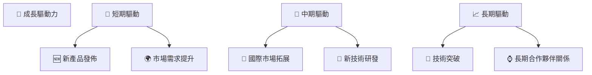

---

## 9. 風險矩陣

### 9.1 風險評分矩陣

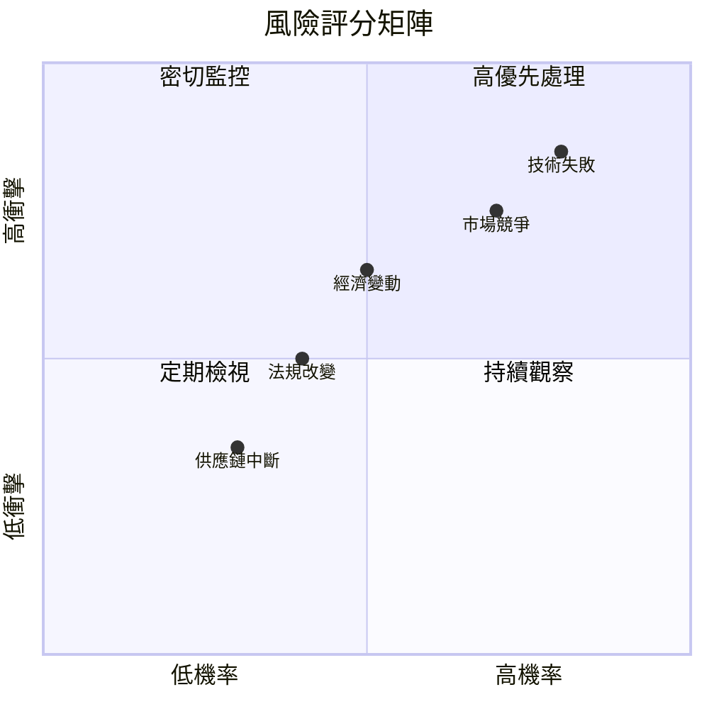

### 9.2 風險清單詳細分析

| # | 風險項目 | 發生機率 | 財務衝擊 | 風險評分 | 緩解措施 |
|---|----------|----------|----------|----------|----------|
| 1 | 🔴 **技術失敗** | 高 (80%) | 高 (-10%收入) | 🔴 8.5/10 | 增加技術冗餘與測試 |
| 2 | 🔴 **市場競爭** | 高 (70%) | 中 (-5%收入) | 🔴 7.5/10 | 強化市場營銷與品牌 |
| 3 | 🟡 **經濟變動** | 中 (50%) | 中 (-5%收入) | 🟡 6.5/10 | 多元化市場與收入來源 |
| 4 | 🟡 **法規改變** | 中 (40%) | 低 (-3%收入) | 🟡 5.0/10 | 建立法規遵循部門 |
| 5 | 🟢 **供應鏈中斷** | 低 (30%) | 低 (-2%收入) | 🟢 4.0/10 | 發展多元供應商 |
   
---

## 10. 投資建議

### 10.1 最終綜合評級雷達圖

```
╔══════════════════════════════════════════════════════════════════╗
║                    📊 最終綜合評級雷達圖                         ║
╠══════════════════════════════════════════════════════════════════╣
║                                                                  ║
║  基本面強度：8.0  ▓▓▓▓▓▓▓▓▓▓▓▓▓▓▓▓▓▓░░                          ║
║  成長動能：9.0  ▓▓▓▓▓▓▓▓▓▓▓▓▓▓▓▓▓▓▓░                            ║
║  獲利品質：5.0  ▓▓▓▓▓▓▓▓▓▓░░░░░░░░░░                            ║
║  財務健康：7.0  ▓▓▓▓▓▓▓▓▓▓▓▓▓░░░░░░░                            ║
║  估值合理性：6.0  ▓▓▓▓▓▓▓▓▓▓▓░░░░░░░░                            ║
║                                                                  ║
╚══════════════════════════════════════════════════════════════════╝
```

### 10.2 目標價與隱含報酬率

| 情境 | 目標價 | 隱含報酬率 | 機率權重 |
|------|------|-----------|--------|
| 🟢 **樂觀** | $120 | +97% | 20% |
| 🟡 **基準** | $89.88 | +47% | 60% |
| 🔴 **悲觀** | $68 | +12% | 20% |

### 10.3 買入時機與觸發因素

```
╔══════════════════════════════════════════════════════════════════╗
║                  ✅ 買入觸發因素 Checklist                      ║
╠══════════════════════════════════════════════════════════════════╣
║                                                                  ║
║  立即買入觸發條件（多數符合）：                                  ║
║  ✅ 收入增長超過35%                                              ║
║  ✅ 新技術獲得市場認可                                            ║
║  ✅ 管理層重申樂觀指引                                            ║
║                                                                  ║
║  加碼觸發條件（出現以下任一）：                                  ║
║  ☐ 行業整合帶來市場份額提升                                      ║
║  ☐ 股價回調至合理區間                                            ║
║                                                                  ║
║  減碼/停損觸發條件（出現以下任一）：                             ║
║  ☐ 盈利警告或重大技術失敗                                        ║
║  ☐ 行業競爭加劇導致市場份額流失                                   ║
║                                                                  ║
╚══════════════════════════════════════════════════════════════════╝
```

### 10.4 投資人適配度分析

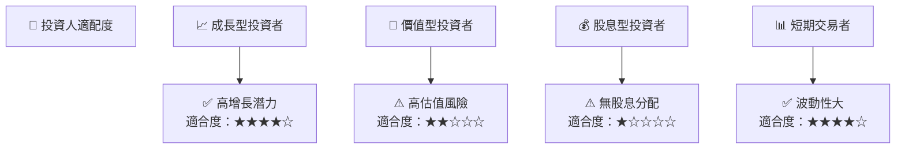

### 10.5 關鍵監控指標

| 監控類型 | 指標 | 關注點 | 頻率 |
|----------|------|--------|------|
| 營運 | 收入增長率 | 是否持續增長 | 季度 |
| 財務 | 毛利率 | 是否保持穩定 | 季度 |
| 市場 | 競爭態勢 | 競爭對手動向 | 半年 |
| 技術 | 研發進展 | 新技術突破 | 年度 |

---

> **免責聲明**：本報告為 AI 自動生成，僅供研究參考，不構成投資建議。投資有風險，入市需謹慎。