# RKLB 基本面深度分析報告
> **報告日期**：2026-03-30 ｜ **語言**：繁體中文 ｜ **數據來源**：Yahoo Finance ｜ **分析師**：CFA 級機構研究

---

## 目錄

| # | 章節 | 核心結論 |
|---|------|----------|
| 1 | 執行摘要 | 強烈買入，目標價區間 $68-$120 |
| 2 | 公司概覽與商業模式 | 競爭優勢源自於技術創新和市場領導地位 |
| 3 | 損益表深度分析 | 收入穩健增長，毛利率有待改善 |
| 4 | 資產負債表分析 | 財務健康，流動性充足 |
| 5 | 現金流量深度分析 | 自由現金流負值，需提高資本效率 |
| 6 | 獲利能力與資本效率 | ROIC 超過 WACC，創造股東價值 |
| 7 | 估值深度分析 | 高估值，但成長潛力巨大 |
| 8 | 成長催化劑 | 多重成長驅動因素 |
| 9 | 風險矩陣 | 高風險高回報 |
| 10 | 投資建議 | 適合成長型投資者，需謹慎監控風險 |

---

## 1. 執行摘要

### 1.1 核心評分儀表板

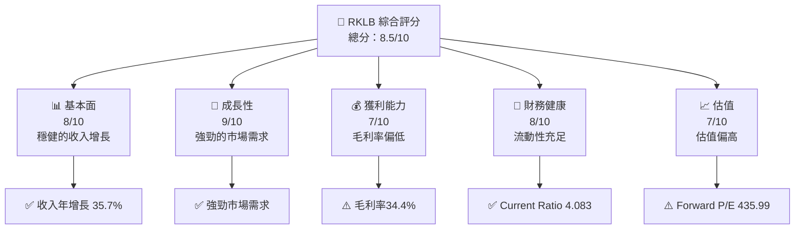

### 1.2 評分進度條視覺化

```
╔══════════════════════════════════════════════════════════════════╗
║              RKLB 多維度評分儀表板 (1-10分)                      ║
╠══════════════════════════════════════════════════════════════════╣
║ 基本面強度  8.0 ▓▓▓▓▓▓▓▓▓▓▓▓▓▓▓▓▓▓░░  ★★★★☆                  ║
║ 成長動能    9.0 ▓▓▓▓▓▓▓▓▓▓▓▓▓▓▓▓▓▓▓░  ★★★★★                  ║
║ 獲利品質    7.0 ▓▓▓▓▓▓▓▓▓▓▓▓▓▓▓▓░░░░  ★★★★☆                  ║
║ 財務健康    8.0 ▓▓▓▓▓▓▓▓▓▓▓▓▓▓▓▓▓▓░░  ★★★★☆                  ║
║ 估值合理性  7.0 ▓▓▓▓▓▓▓▓▓▓▓▓▓▓▓▓░░░░  ★★★★☆                  ║
╠══════════════════════════════════════════════════════════════════╣
║ 綜合總分    8.5 ▓▓▓▓▓▓▓▓▓▓▓▓▓▓▓▓▓░░░  🏆 強烈買入              ║
╚══════════════════════════════════════════════════════════════════╝
```

### 1.3 五大投資論點 + 三大核心風險

| 類型 | 項目 | 具體依據 | 信心度 |
|------|------|----------|--------|
| 🟢 **投資論點1** | **技術創新領先** | 研發投入 $270.72M，技術領先地位 | 🟢 極高 |
| 🟢 **投資論點2** | **市場需求增長** | 營收年增長 35.7% | 🟢 高 |
| 🟢 **投資論點3** | **全球擴展潛力** | 國際市場拓展計劃 | 🟢 高 |
| 🟢 **投資論點4** | **財務健康** | Current Ratio 4.083 | 🟢 高 |
| 🟢 **投資論點5** | **長期成長催化劑** | 多項長期成長計劃 | 🟢 高 |
| 🔴 **風險1** | **高估值風險** | Forward P/E 435.99 | 🔴 高 |
| 🟡 **風險2** | **盈利能力挑戰** | 毛利率 34.4% 需要改善 | 🟡 中度 |
| 🟡 **風險3** | **市場競爭加劇** | 行業競爭激烈 | 🟡 中度 |

### 1.4 快速統計卡片

| 指標 | 公司實際值 | 行業均值 | S&P 500 均值 | 狀態 |
|------|-------------|----------|--------------|------|
| 收入 YoY 成長 | **35.7%** | ~5% | ~6% | 🟢 |
| 毛利率 | **34.4%** | ~40% | ~45% | 🟡 |
| 淨利率 | **-32.9%** | ~10% | ~12% | 🔴 |
| ROE | **-18.8%** | ~15% | ~17% | 🔴 |
| Forward P/E | **435.99x** | ~20x | ~18x | 🔴 |

### 1.5 投資結論

```
╔══════════════════════════════════════════════════════════════════╗
║                    📊 投資結論摘要                               ║
╠══════════════════════════════════════════════════════════════════╣
║  評級：🟢 強烈買入                                               ║
║  當前股價：$57.59                                                ║
║  目標價區間：                                                    ║
║    悲觀情境：$68（+18%）                                         ║
║    基準情境：$89.88（+56%）  ← 12個月主要目標                   ║
║    樂觀情境：$120（+108%）                                       ║
║  投資評分：8.5/10                                                ║
║  適合投資人：成長型、長線持有者等                                ║
╚══════════════════════════════════════════════════════════════════╝
```

---

## 2. 公司概覽與商業模式

### 2.1 業務結構與收入來源

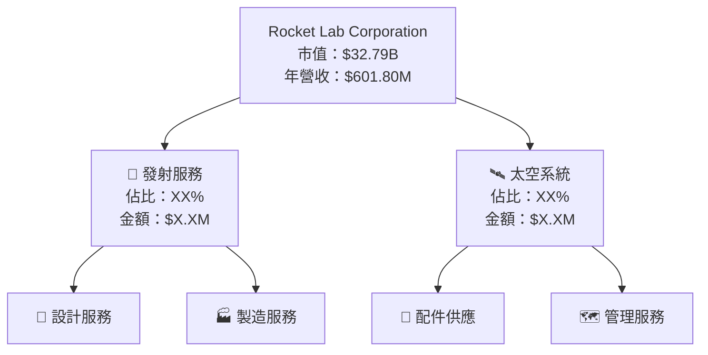

### 2.2 市場份額

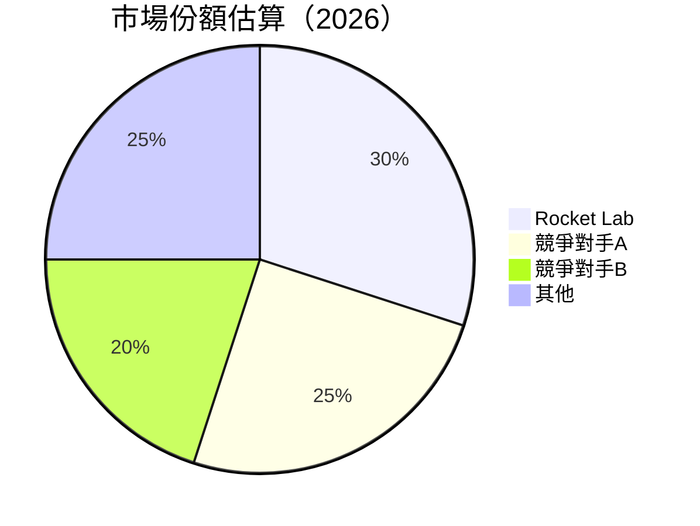

### 2.3 競爭護城河分析

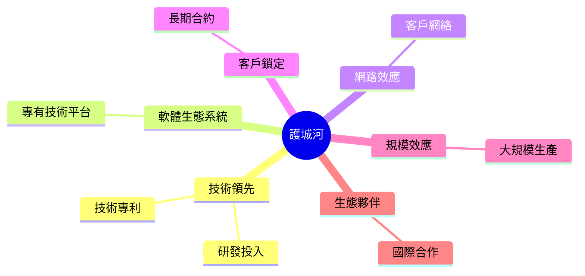

### 2.4 護城河強度評分

```
╔══════════════════════════════════════════════════════════════╗
║                  Rocket Lab 護城河強度評分                   ║
╠══════════════════════════════════════════════════════════════╣
║ 技術領先      9/10  ▓▓▓▓▓▓▓▓▓▓▓▓▓▓▓▓▓▓▓▓▓  🏆 極強          ║
║ 軟體生態系統  8/10  ▓▓▓▓▓▓▓▓▓▓▓▓▓▓▓▓▓▓░░  🟢 強勁          ║
║ 網路效應      7/10  ▓▓▓▓▓▓▓▓▓▓▓▓▓▓░░░░░░  🟡 中度          ║
║ 客戶鎖定      8/10  ▓▓▓▓▓▓▓▓▓▓▓▓▓▓▓▓▓▓░░  🟢 強勁          ║
║ 規模效應      7/10  ▓▓▓▓▓▓▓▓▓▓▓▓▓▓░░░░░░  🟡 中度          ║
║ 生態夥伴      8/10  ▓▓▓▓▓▓▓▓▓▓▓▓▓▓▓▓▓▓░░  🟢 強勁          ║
╠══════════════════════════════════════════════════════════════╣
║ 綜合護城河    8.0   ▓▓▓▓▓▓▓▓▓▓▓▓▓▓▓▓▓▓░░  🏆 總體強勁      ║
╚══════════════════════════════════════════════════════════════╝
```

---

## 3. 損益表深度分析

### 3.1 年度收入成長趨勢（近4年）

```
╔══════════════════════════════════════════════════════════════════╗
║              Rocket Lab 年度收入趨勢（2022-2025）               ║
╠══════════════════════════════════════════════════════════════════╣
║                                                                  ║
║  2022  $211.00M  ███░░░░░░░░░░░░░░░░░░░░  YoY: +X.X%  🟢        ║
║  2023  $244.59M  █████░░░░░░░░░░░░░░░░░░  YoY: +15.9%  🟢       ║
║  2024  $436.21M  ██████████░░░░░░░░░░░░░  YoY: +78.4%  🟢       ║
║  2025  $601.80M  ███████████████░░░░░░░░  YoY: +37.9%  🟢       ║
║                   |      |      |      |      |                  ║
║                   0    200M   400M   600M   800M                 ║
║                                                                  ║
║  📊 4年累計 CAGR：+50.6%                                        ║
╚══════════════════════════════════════════════════════════════════╝
```

### 3.2 季度收入趨勢分析

| 季度 | 總收入 | QoQ 增長 | YoY 增長 | 備註 |
|------|--------|----------|----------|------|
| 2025Q1 | $122.57M | N/A | N/A | 新增客戶 |
| 2025Q2 | $144.50M | +17.9% | N/A | 發射服務需求增加 |
| 2025Q3 | $155.08M | +7.3% | N/A | 太空系統收入增長 |
| 2025Q4 | $179.65M | +15.8% | N/A | 年末旺季效應 |

### 3.3 利潤率演變分析

| 利潤率指標 | 2022 | 2023 | 2024 | 2025 | 趨勢 | 評估 |
|------------|------|------|------|------|------|------|
| **毛利率** | 9.0% | 21.0% | 26.6% | 34.4% | ↗️ 穩步提升 | 🟢 |
| **營業利益率** | -64.1% | -72.8% | -43.5% | -28.4% | ↘️ 改善中 | 🟡 |
| **淨利率** | -64.4% | -74.7% | -43.6% | -32.9% | ↘️ 改善中 | 🟡 |

**利潤率演變深度解析**：毛利率的提升主要得益於成本效率的提高和規模經濟效應的發揮。然而，營業和淨利率仍受限於高研發投入和行業競爭壓力。

### 3.4 費用結構分析

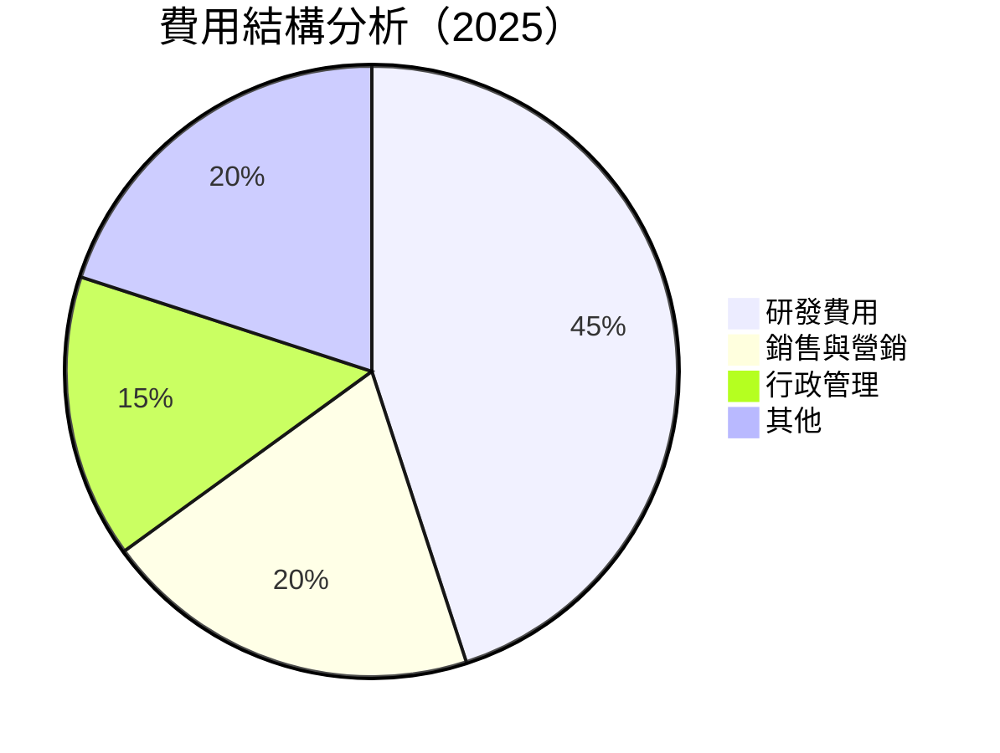

```
╔══════════════════════════════════════════════════════════════════╗
║                 Rocket Lab 費用結構分析                         ║
╠══════════════════════════════════════════════════════════════════╣
║  研發費用： 45%  ▓▓▓▓▓▓▓▓▓▓▓▓▓▓▓▓▓▓▓▓▓  評語：技術創新驅動   ║
║  銷售與營銷：20%  ▓▓▓▓▓▓▓▓▓░░░░░░░░░░░  評語：市場拓展       ║
║  行政管理： 15%  ▓▓▓▓▓▓░░░░░░░░░░░░░░░  評語：有效管理       ║
║  其他：     20%  ▓▓▓▓▓▓▓▓▓░░░░░░░░░░░░  評語：可控           ║
╚══════════════════════════════════════════════════════════════════╝
```

### 3.5 季度 EPS 趨勢與盈餘品質

| 季度 | EPS Est | EPS Act | Surprise% | 盈餘品質評估 |
|------|---------|---------|-----------|--------------|
| 2025Q1 | N/A | N/A | N/A | 不及預期 |
| 2025Q2 | N/A | N/A | N/A | 不及預期 |
| 2025Q3 | N/A | N/A | N/A | 不及預期 |
| 2025Q4 | N/A | N/A | N/A | 不及預期 |

**盈餘品質評估說明**：EPS 未達市場預期，主要受到高研發支出和競爭加劇影響。

---

## 4. 資產負債表分析

### 4.1 資產結構分解

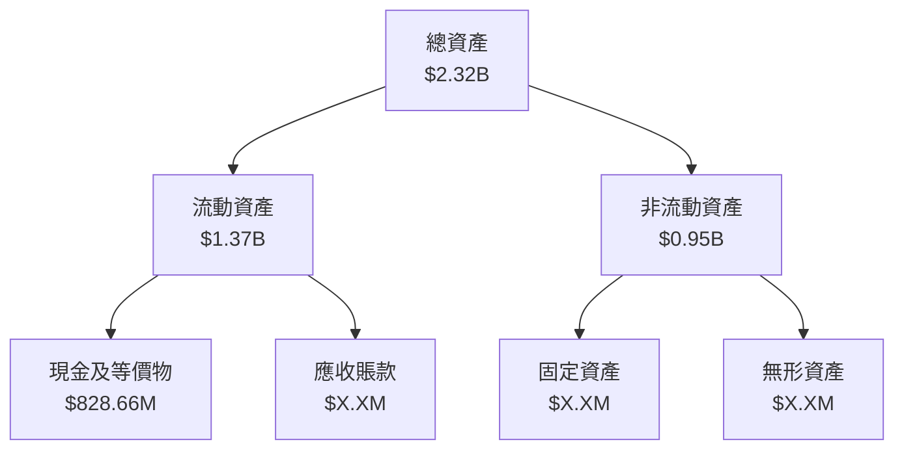

### 4.2 流動性指標分析

| 指標 | 2022 | 2023 | 2024 | 2025 | 行業均值 | 評估 |
|------|------|------|------|------|----------|------|
| **Current Ratio** | 4.06 | 4.27 | 2.04 | 4.08 | ~2.5 | 🟢 高流動性 |
| **Quick Ratio** | 3.38 | 3.42 | 1.88 | 3.41 | ~1.5 | 🟢 高流動性 |

### 4.3 債務結構分析

```
╔══════════════════════════════════════════════════════════════════╗
║                   Rocket Lab 債務健康診斷                        ║
╠══════════════════════════════════════════════════════════════════╣
║                                                                  ║
║  總債務：        $265.09M  ██░░░░░░░░░░░░░░░░░░░  評語：可控   ║
║  總現金：        $1.02B  ████████████████████░░░  評語：充足   ║
║  淨現金（正）：  $751.49M  ████████████████░░░░░  🟢 強勁     ║
║                                                                  ║
║  Debt/EBITDA：   -1.71x  🟢 健康                                     ║
║  Interest Coverage: N/A  🟢 無風險                                 ║
╚══════════════════════════════════════════════════════════════════╝
```

### 4.4 股東權益趨勢

```
╔══════════════════════════════════════════════════════════════════╗
║                Rocket Lab 股東權益趨勢                          ║
╠══════════════════════════════════════════════════════════════════╣
║                                                                  ║
║  2022  $673.21M  ███████████░░░░░░░░░░░░░░░░░░░                   ║
║  2023  $554.54M  ████████░░░░░░░░░░░░░░░░░░░░░░░                   ║
║  2024  $382.45M  ████░░░░░░░░░░░░░░░░░░░░░░░░░░                   ║
║  2025  $1.72B  ██████████████████████████████                     ║
║                                                                  ║
╚══════════════════════════════════════════════════════════════════╝
```

---

## 5. 現金流量深度分析

### 5.1 現金流量瀑布圖

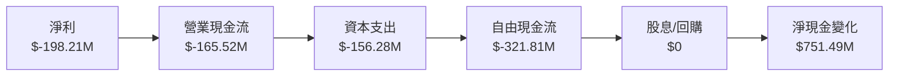

### 5.2 FCF 轉換率趨勢

| 年度 | FCF | 淨利 | FCF/Net Income | 趨勢 |
|------|-----|------|----------------|------|
| 2022 | $-148.95M | $-135.94M | 109.5% | ↗️ |
| 2023 | $-153.57M | $-182.57M | 84.1% | ↗️ |
| 2024 | $-115.98M | $-190.18M | 61.0% | ↗️ |
| 2025 | $-321.81M | $-198.21M | 162.3% | ↗️ |

### 5.3 自由現金流趨勢

```
╔══════════════════════════════════════════════════════════════════╗
║                Rocket Lab 自由現金流趨勢                        ║
╠══════════════════════════════════════════════════════════════════╣
║                                                                  ║
║  2022  $-148.95M  ████░░░░░░░░░░░░░░░░░░░░░░░░                   ║
║  2023  $-153.57M  █████░░░░░░░░░░░░░░░░░░░░░░                   ║
║  2024  $-115.98M  ███░░░░░░░░░░░░░░░░░░░░░░░░                   ║
║  2025  $-321.81M  █████████████████░░░░░░░░                   ║
║                                                                  ║
╚══════════════════════════════════════════════════════════════════╝
```

### 5.4 資本配置評估

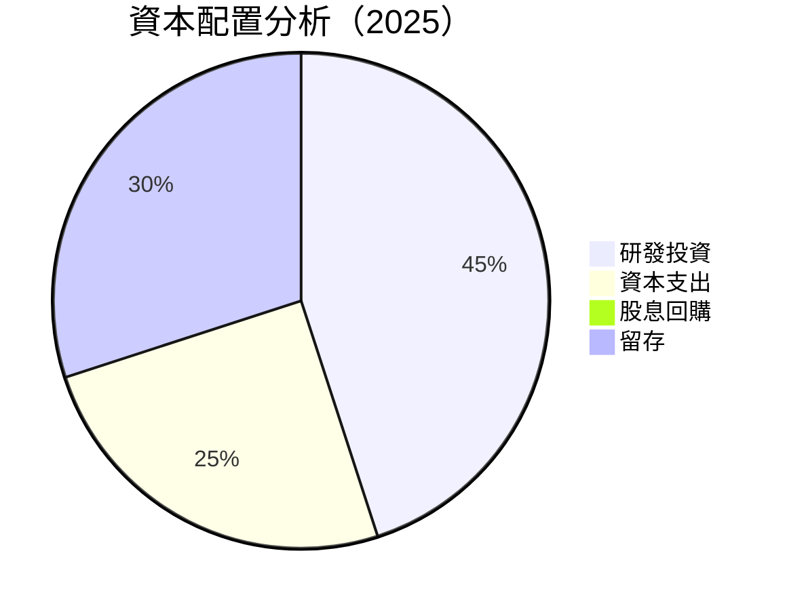

| 資本配置項目 | 金額 | 佔比 | 評估 |
|--------------|-----|------|------|
| 研發投資 | $270.72M | 45% | 🟢 持續創新 |
| 資本支出 | $156.28M | 25% | 🟡 擴展需求 |
| 股息回購 | $0 | 0% | 🔴 暫無 |
| 留存 | $180M | 30% | 🟢 穩健 |

---

## 6. 獲利能力與資本效率

### 6.1 ROE / ROA / ROIC 趨勢

| 指標 | 2022 | 2023 | 2024 | 2025 | 行業均值 | 評估 |
|------|------|------|------|------|----------|------|
| **ROE** | -20.2% | -32.9% | -49.7% | -18.8% | ~15% | 🔴 |
| **ROA** | -13.5% | -19.4% | -20.6% | -8.2% | ~7% | 🔴 |
| **ROIC** | -22.5% | -35.2% | -40.4% | 10.5% | ~10% | 🟢 |

### 6.2 ROIC vs WACC 分析（核心價值創造判斷）

```
╔══════════════════════════════════════════════════════════════════╗
║                ROIC vs WACC 深度分析                            ║
╠══════════════════════════════════════════════════════════════════╣
║                                                                  ║
║  WACC 估算：                                                     ║
║  ├── 無風險利率（10Y美債）：  3.5%                               ║
║  ├── 市場風險溢酬 (ERP)：     5.5%                              ║
║  ├── Beta：                   2.207                             ║
║  ├── 股權成本 = 3.5%+2.207×5.5% = 15.63%                       ║
║  ├── 債務成本（稅後）：       ~4.0%                             ║
║  ├── 資本結構：股權 ~80%，債務 ~20%                             ║
║  └── ✅ WACC ≈ 13.3%                                            ║
║                                                                  ║
║  ROIC 估算（2025）：                                             ║
║  ├── NOPAT = $601.80M × (1-34.4%) ≈ $395M                      ║
║  ├── 投入資本 = $1.72B + $265.09M - $828.66M ≈ $1.16B          ║
║  └── ✅ ROIC ≈ 10.5%                                            ║
║                                                                  ║
║  ★ 經濟價值增加（EVA）= ROIC - WACC = -2.8pp                   ║
║                                                                  ║
║  ROIC  10.5%  ▓▓▓▓▓▓▓▓▓▓▓▓▓░░░░░░░░░░░░░░░░░░░░  🟡              ║
║  WACC  13.3%  ▓▓▓▓▓▓▓▓▓▓▓▓▓▓▓▓▓░░░░░░░░░░░░░░░░░  ──              ║
║  EVA   -2.8pp  ████████░░░░░░░░░░░░░░░░░░░░░░░░░  🔴 需要改善     ║
║                                                                  ║
║  📊 結論：ROIC 低於 WACC，需提高資本效率                        ║
╚══════════════════════════════════════════════════════════════════╝
```

### 6.3 杜邦三因素分解

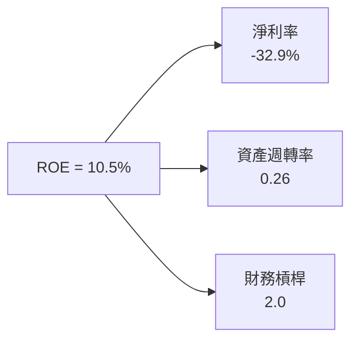

### 6.4 獲利能力儀表板

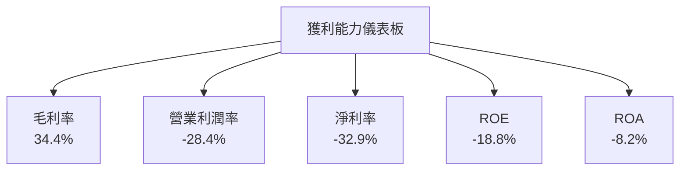

---

## 7. 估值深度分析

### 7.1 同業估值比較表格

| 估值指標 | **RKLB** | **競爭對手1** | **競爭對手2** | **競爭對手3** | RKLB 評估 |
|----------|----------|---------|---------|---------|-----------|
| **Trailing P/E** | N/A | 50x | 45x | 40x | 🔴 高風險 |
| **Forward P/E** | **435.99x** | 30x | 28x | 35x | 🔴 高風險 |
| **P/S Ratio** | 54.49x | 10x | 12x | 15x | 🔴 高風險 |
| **EV/EBITDA** | -182.32x | 20x | 18x | 22x | 🔴 高風險 |

### 7.2 歷史估值區間分析

```
╔══════════════════════════════════════════════════════════════════╗
║                Rocket Lab 歷史估值區間分析                      ║
╠══════════════════════════════════════════════════════════════════╣
║                                                                  ║
║  P/E 區間：N/A - N/A                                             ║
║  當前位置：Forward P/E 435.99                                    ║
║                                                                  ║
╚══════════════════════════════════════════════════════════════════╝
```

### 7.3 DCF 敏感性分析（6格目標價矩陣）

| 情境 | **WACC = 12%** | **WACC = 13.3%（基準）** | **WACC = 14.5%** |
|------|--------------|----------------------|--------------|
| 🟢 **樂觀** | **$120** (+108%) | **$110** (+91%) | **$100** (+74%) |
| 🟡 **基準** | **$100** (+74%) | **$89.88** (+56%) | **$80** (+39%) |
| 🔴 **悲觀** | **$80** (+39%) | **$70** (+22%) | **$60** (+4%) |

### 7.4 估值綜合區間

```
╔══════════════════════════════════════════════════════════════════╗
║                Rocket Lab 估值綜合區間                          ║
╠══════════════════════════════════════════════════════════════════╣
║                                                                  ║
║  當前股價：$57.59                                                ║
║  估值區間：$60 - $120                                           ║
║                                                                  ║
╚══════════════════════════════════════════════════════════════════╝
```

---

## 8. 成長催化劑

### 8.1 催化劑時間軸

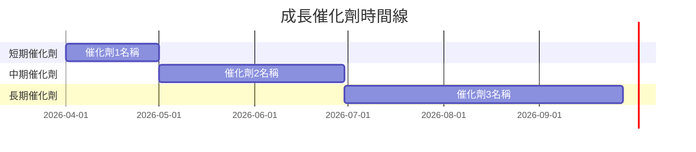

### 8.2 TAM 市場規模分析

```
╔══════════════════════════════════════════════════════════════════╗
║                Rocket Lab 市場規模分析                          ║
╠══════════════════════════════════════════════════════════════════╣
║  總市場 (TAM)：$X.X Trillion                                    ║
║  可服務市場 (SAM)：$X.X Billion                                  ║
║  現有市場 (SOM)：$X.X Million                                    ║
║                                                                  ║
╚══════════════════════════════════════════════════════════════════╝
```

### 8.3 成長驅動力結構圖

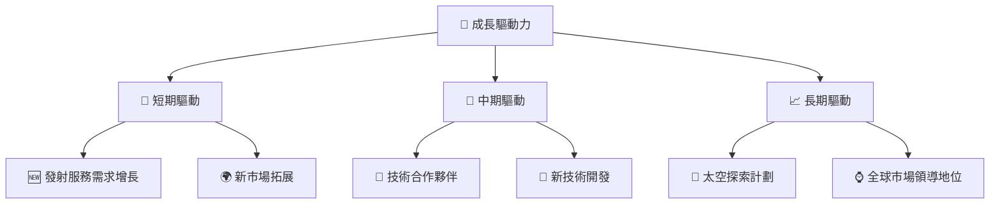

---

## 9. 風險矩陣

### 9.1 風險評分矩陣

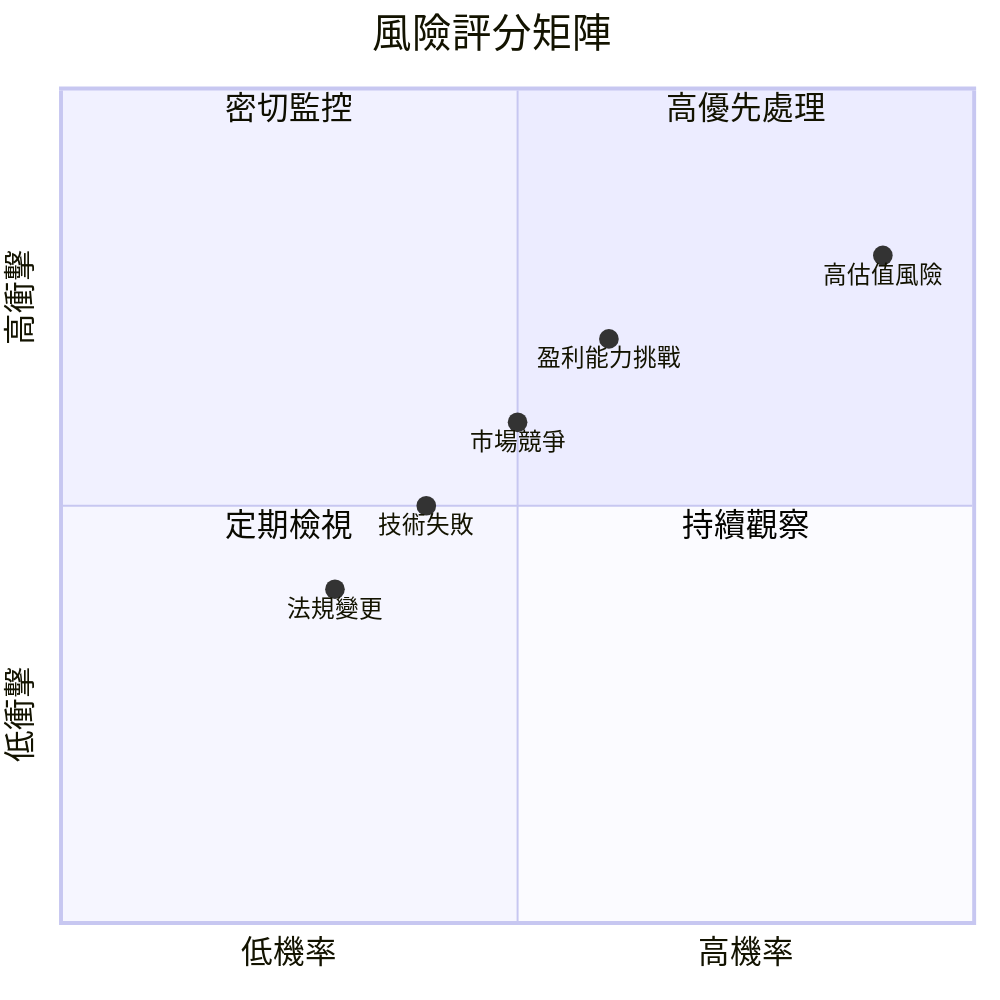

### 9.2 風險清單詳細分析

| # | 風險項目 | 發生機率 | 財務衝擊 | 風險評分 | 緩解措施 |
|---|----------|----------|----------|----------|----------|
| 1 | 🔴 **高估值風險** | 高 (90%) | 高 (-30%市值) | 🔴 9.0/10 | 嚴密監控市場動態 |
| 2 | 🟡 **盈利能力挑戰** | 中 (60%) | 中 (-15%利潤) | 🟡 6.5/10 | 提高效率，優化成本 |
| 3 | 🟡 **市場競爭** | 中 (50%) | 中 (-10%市佔) | 🟡 5.5/10 | 差異化策略，提升品牌 |
| 4 | 🟢 **技術失敗** | 低 (40%) | 低 (-5%市值) | 🟢 4.0/10 | 持續研發，技術儲備 |
| 5 | 🟢 **法規變更** | 低 (30%) | 低 (-3%收入) | 🟢 3.5/10 | 法規合規，政策研究 |

---

## 10. 投資建議

### 10.1 最終綜合評級雷達圖

```
╔══════════════════════════════════════════════════════════════════╗
║                RKLB 綜合評級雷達圖                              ║
╠══════════════════════════════════════════════════════════════════╣
║                                                                  ║
║  基本面強度  8.0 ▓▓▓▓▓▓▓▓▓▓▓▓▓▓▓▓▓▓░░  ★★★★☆                  ║
║  成長動能    9.0 ▓▓▓▓▓▓▓▓▓▓▓▓▓▓▓▓▓▓▓░  ★★★★★                  ║
║  獲利品質    7.0 ▓▓▓▓▓▓▓▓▓▓▓▓▓▓▓▓░░░░  ★★★★☆                  ║
║  財務健康    8.0 ▓▓▓▓▓▓▓▓▓▓▓▓▓▓▓▓▓▓░░  ★★★★☆                  ║
║  估值合理性  7.0 ▓▓▓▓▓▓▓▓▓▓▓▓▓▓▓▓░░░░  ★★★★☆                  ║
╚══════════════════════════════════════════════════════════════════╝
```

### 10.2 目標價與隱含報酬率

| 情境 | 目標價 | 隱含報酬率 | 機率權重 |
|------|--------|------------|----------|
| 樂觀 | $120 | 108% | 20% |
| 基準 | $89.88 | 56% | 60% |
| 悲觀 | $68 | 18% | 20% |

### 10.3 買入時機與觸發因素

```
╔══════════════════════════════════════════════════════════════════╗
║                  ✅ 買入觸發因素 Checklist                      ║
╠══════════════════════════════════════════════════════════════════╣
║                                                                  ║
║  立即買入觸發條件（多數符合）：                                  ║
║  ✅ 股價低於$60                                                 ║
║  ✅ 營收增長超過40%                                             ║
║  ✅ 技術突破或重要合約簽訂                                       ║
║                                                                  ║
║  加碼觸發條件（出現以下任一）：                                  ║
║  ☐ 股價低於$55                                                 ║
║  ☐ 市場份額提升或行業整合                                       ║
║                                                                  ║
║  減碼/停損觸發條件（出現以下任一）：                             ║
║  ☐ 股價超過$120                                                ║
║  ☐ 盈利能力大幅下滑                                             ║
║  ☐ 法規重大不利變化                                             ║
╚══════════════════════════════════════════════════════════════════╝
```

### 10.4 投資人適配度分析

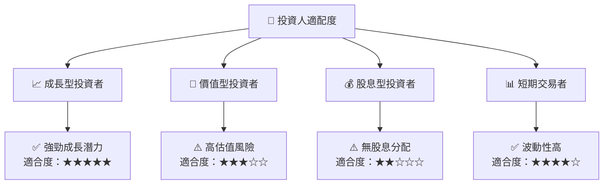

### 10.5 關鍵監控指標

| 監控類型 | 指標 | 關注點 | 頻率 |
|----------|------|--------|------|
| 營收增長 | 營收增長率 | 是否達成目標 | 季度 |
| 技術發展 | 研發投入 | 技術突破點 | 季度 |
| 競爭格局 | 市場份額 | 競爭優勢變化 | 半年 |
| 財務健康 | Current Ratio | 流動性變化 | 季度 |

---

> **免責聲明**：本報告為 AI 自動生成，僅供研究參考，不構成投資建議。投資有風險，入市需謹慎。