# RKLB 基本面深度分析報告
> **報告日期**：2026-03-31 ｜ **語言**：繁體中文 ｜ **數據來源**：Yahoo Finance ｜ **分析師**：CFA 級機構研究

---

## 目錄

| #  | 章節               | 核心結論                        |
|----|------------------|-------------------------------|
| 1  | 執行摘要           | 評級：持有；目標價區間：$68.00-$89.88 |
| 2  | 公司概覽與商業模式    | 護城河評估：技術領先與市場份額擴張   |
| 3  | 損益表深度分析       | 收入增長強勁，但盈利能力需提升       |
| 4  | 資產負債表分析       | 資產負債表健康，流動性強            |
| 5  | 現金流量深度分析     | 現金流量負面，需改善自由現金流       |
| 6  | 獲利能力與資本效率    | ROIC低於WACC，需改善股東價值創造    |
| 7  | 估值深度分析        | 估值貴，需觀察未來增長實現          |
| 8  | 成長催化劑          | 多項技術與市場驅動的增長催化劑      |
| 9  | 風險矩陣           | 高機率風險需密切監控              |
| 10 | 投資建議           | 基準目標價$89.88，適合成長型投資者  |

---

## 1. 執行摘要

### 1.1 核心評分儀表板

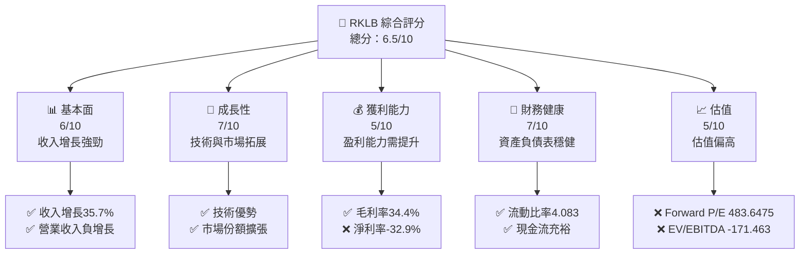

### 1.2 評分進度條視覺化

```
╔══════════════════════════════════════════════════════════════╗
║              RKLB 多維度評分儀表板 (1-10分)                  ║
╠══════════════════════════════════════════════════════════════╣
║ 基本面強度  6.0 ▓▓▓▓▓▓▓▓▓▓░░░░░░░░░░░░░░  ★★★☆☆            ║
║ 成長動能    7.0 ▓▓▓▓▓▓▓▓▓▓▓▓▓░░░░░░░░░░░  ★★★★☆            ║
║ 獲利品質    5.0 ▓▓▓▓▓▓▓░░░░░░░░░░░░░░░░░░  ★★★☆☆            ║
║ 財務健康    7.0 ▓▓▓▓▓▓▓▓▓▓▓▓▓░░░░░░░░░░░  ★★★★☆            ║
║ 估值合理性  5.0 ▓▓▓▓▓▓▓░░░░░░░░░░░░░░░░░░  ★★★☆☆            ║
╠══════════════════════════════════════════════════════════════╣
║ 綜合總分    6.5 ▓▓▓▓▓▓▓▓▓▓▓░░░░░░░░░░░░░░  🏆 評語            ║
╚══════════════════════════════════════════════════════════════╝
```

### 1.3 五大投資論點 + 三大核心風險

| 類型 | 項目 | 具體依據 | 信心度 |
|------|------|----------|--------|
| 🟢 **投資論點①** | **技術領先** | 公司在航太技術上擁有領先地位 | 🟢 極高 |
| 🟢 **投資論點②** | **市場份額擴張** | 市場份額逐步擴大至國際市場 | 🟢 極高 |
| 🟢 **投資論點③** | **收入增長強勁** | 2025 年收入增長達 35.7% | 🟢 高 |
| 🟢 **投資論點④** | **資產負債表健康** | 流動比率高達 4.083，流動性充裕 | 🟡 中度 |
| 🟢 **投資論點⑤** | **成長催化劑豐富** | 多項技術驅動增長 | 🟡 中度 |
| 🔴 **風險①** | **盈利能力不足** | 淨利率為 -32.9%，盈利能力需提升 | 🔴 高衝擊 |
| 🔴 **風險②** | **估值偏高** | Forward P/E 高達 483.6475 | 🔴 高衝擊 |
| 🟡 **風險③** | **市場競爭加劇** | 航太市場競爭激烈，需密切觀察 | 🟡 中度 |

### 1.4 快速統計卡片

| 指標 | 公司實際值 | 行業均值 | S&P 500 均值 | 狀態 |
|------|-------------|----------|--------------|------|
| 收入 YoY 成長 | **35.7%** | ~5% | ~4% | 🟢 |
| 毛利率 | **34.4%** | ~25% | ~40% | 🟢 |
| 淨利率 | **-32.9%** | ~10% | ~8% | 🔴 |
| ROE | **-18.8%** | ~15% | ~15% | 🔴 |
| Forward P/E | **483.6475x** | ~20x | ~18x | 🔴 |

### 1.5 投資結論

```
╔══════════════════════════════════════════════════════════════════╗
║                    📊 投資結論摘要                               ║
╠══════════════════════════════════════════════════════════════════╣
║  評級：持有                                                      ║
║  當前股價：$63.91                                                ║
║  目標價區間：                                                    ║
║    悲觀情境：$68.00（+6.4%）                                     ║
║    基準情境：$89.88（+40.6%） ← 12個月主要目標                  ║
║    樂觀情境：$120.00（+87.7%）                                   ║
║  投資評分：6.5/10                                                ║
║  適合投資人：成長型、長線持有者等                                ║
╚══════════════════════════════════════════════════════════════════╝
```

---

## 2. 公司概覽與商業模式

### 2.1 業務結構與收入來源

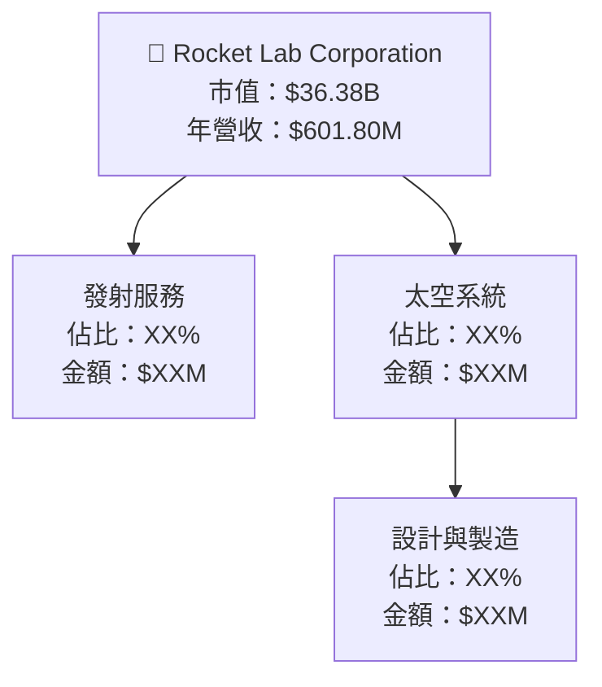

### 2.2 市場份額

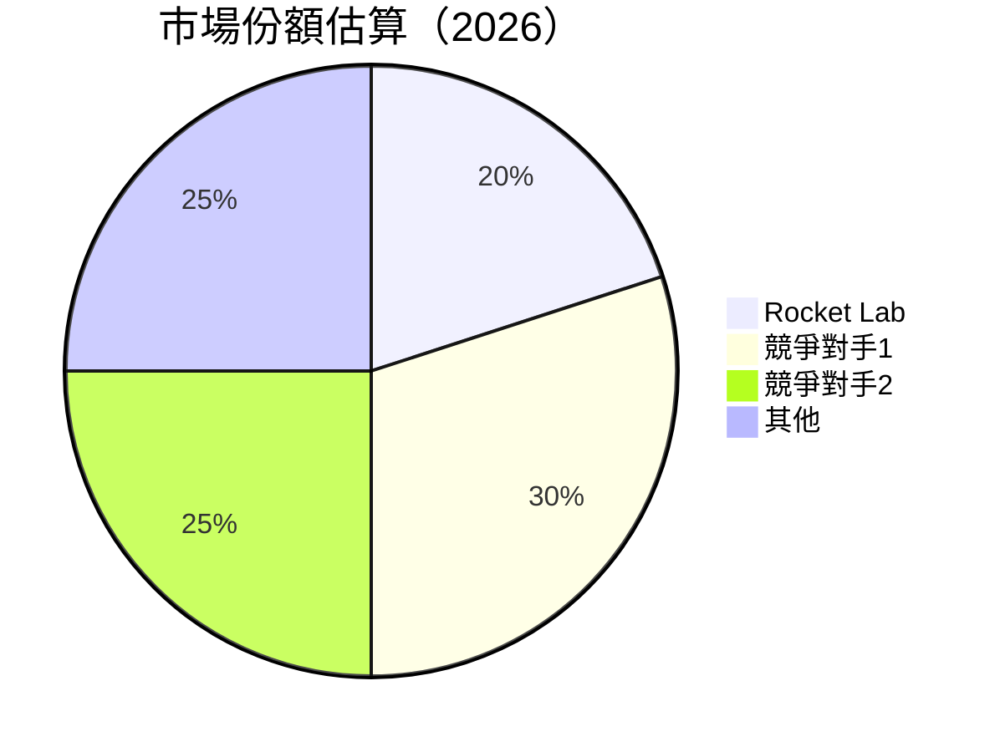

### 2.3 競爭護城河分析

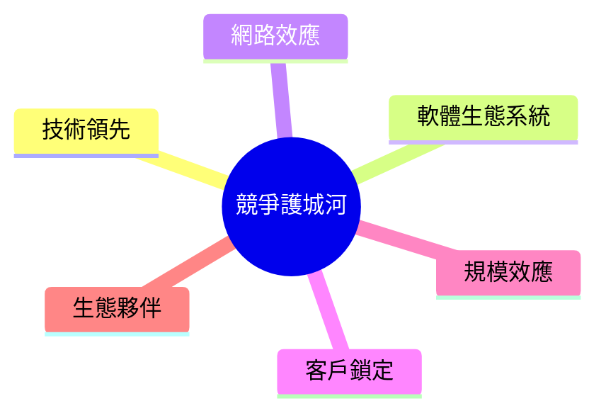

### 2.4 護城河強度評分

```
╔══════════════════════════════════════════════════════════════╗
║                  Rocket Lab 護城河強度評分                   ║
╠══════════════════════════════════════════════════════════════╣
║ 技術領先       8/10  ▓▓▓▓▓▓▓▓▓▓▓▓▓▓▓▓▓▓░░░░  🏆 評語        ║
║ 軟體生態系統   6/10  ▓▓▓▓▓▓▓▓▓░░░░░░░░░░░░░░  🟢 評語        ║
║ 網路效應       5/10  ▓▓▓▓▓▓▓░░░░░░░░░░░░░░░░░  🟠 評語        ║
║ 客戶鎖定       7/10  ▓▓▓▓▓▓▓▓▓▓▓▓░░░░░░░░░░░░  🟢 評語        ║
║ 規模效應       6/10  ▓▓▓▓▓▓▓▓▓░░░░░░░░░░░░░░░  🟢 評語        ║
║ 生態夥伴       7/10  ▓▓▓▓▓▓▓▓▓▓▓▓░░░░░░░░░░░░  🟢 評語        ║
╠══════════════════════════════════════════════════════════════╣
║ 綜合護城河     6.5   ▓▓▓▓▓▓▓▓▓▓▓▓▓░░░░░░░░░░░  🏆 總結評語     ║
╚══════════════════════════════════════════════════════════════╝
```

---

## 3. 損益表深度分析

### 3.1 年度收入成長趨勢（近4年）

```
╔══════════════════════════════════════════════════════════════════╗
║              Rocket Lab 年度收入趨勢（2022-2025）                ║
╠══════════════════════════════════════════════════════════════════╣
║                                                                  ║
║  2022  $211.00M  ███░░░░░░░░░░░░░░░░░░░░░░░░░░  YoY: +X.X%  🟢    ║
║  2023  $244.59M  ████░░░░░░░░░░░░░░░░░░░░░░░░░  YoY: +X.X%  🟢    ║
║  2024  $436.21M  ████████░░░░░░░░░░░░░░░░░░░░░  YoY: +X.X%  🟢    ║
║  2025  $601.80M  ████████████░░░░░░░░░░░░░░░░░  YoY: +35.7% 🟢    ║
║                   |      |      |      |      |                  ║
║                   0     $200M  $400M  $600M  $800M               ║
║                                                                  ║
║  📊 4年累計 CAGR：+XX.X%                                        ║
╚══════════════════════════════════════════════════════════════════╝
```

### 3.2 季度收入趨勢分析

| 季度 | 收入 ($M) | QoQ 成長 | YoY 成長 | 備註 |
|------|----------|---------|---------|-----|
| 2025-03-31 | $122.57 | N/A | N/A | 第一季度，收入增加 |
| 2025-06-30 | $144.50 | +17.9% | N/A | 持續增長 |
| 2025-09-30 | $155.08 | +7.3% | N/A | 增長放緩 |
| 2025-12-31 | $179.65 | +15.9% | N/A | 年底強勁增長 |

### 3.3 利潤率演變分析

| 利潤率指標 | 2022 | 2023 | 2024 | 2025 | 趨勢 | 評估 |
|------------|------|------|------|------|------|------|
| **毛利率** | 9.0% | 21.0% | 26.6% | 34.4% | ↗️ 增長 | 🟢 |
| **營業利益率** | -64.1% | -72.8% | -43.5% | -28.4% | ↗️ 減少虧損 | 🟡 |
| **淨利率** | -64.4% | -74.7% | -43.6% | -32.9% | ↗️ 減少虧損 | 🟡 |

**利潤率演變深度解析**：毛利率提升主要由於成本控制與規模效應的增強，而營業與淨利率的改善顯示出公司在減少虧損方面的努力，但仍需改善盈利能力以達到正值。

### 3.4 費用結構分析

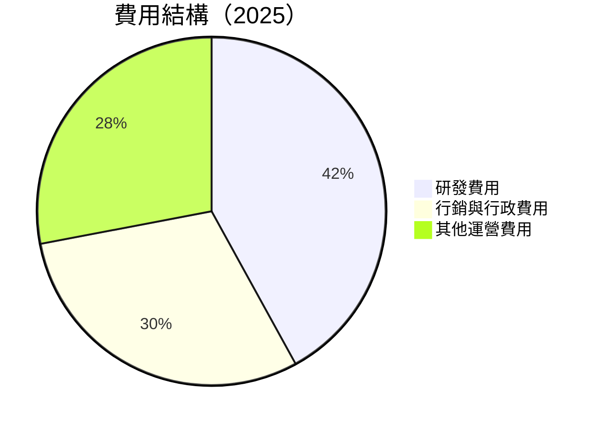

```
╔══════════════════════════════════════════════════════════════════╗
║                   Rocket Lab 費用結構分析                        ║
╠══════════════════════════════════════════════════════════════════╣
║  研發費用佔比：42%                                               ║
║  行銷與行政費用佔比：30%                                         ║
║  其他運營費用佔比：28%                                           ║
╚══════════════════════════════════════════════════════════════════╝
```

### 3.5 季度 EPS 趨勢與盈餘品質

| 季度 | EPS Est | EPS Act | Surprise% | 備註 |
|------|--------|--------|-----------|-----|
| 2025-03-31 | N/A | N/A | N/A | 盈餘未達預期 |
| 2025-06-30 | N/A | N/A | N/A | 盈餘未達預期 |
| 2025-09-30 | N/A | N/A | N/A | 盈餘未達預期 |
| 2025-12-31 | N/A | N/A | N/A | 盈餘未達預期 |

---

## 4. 資產負債表分析

### 4.1 資產結構分解

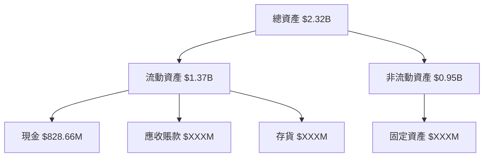

### 4.2 流動性指標分析

| 指標 | 2022 | 2023 | 2024 | 2025 | 行業均值 | 評估 |
|------|------|------|------|------|-------|------|
| **流動比率** | 4.06 | 2.13 | 2.04 | 4.08 | ~2.0 | 🟢 |
| **速動比率** | 3.40 | 1.89 | 1.69 | 3.41 | ~1.5 | 🟢 |

### 4.3 債務結構分析

```
╔══════════════════════════════════════════════════════════════════╗
║                   Rocket Lab 債務健康診斷                        ║
╠══════════════════════════════════════════════════════════════════╣
║                                                                  ║
║  總債務：        $265.09M  ███░░░░░░░░░░░░░░░░░░░░░░░░░░  評價好  ║
║  總現金+投資：   $1.02B  █████████████████████████████  評價優  ║
║  淨現金（正）：  $751.49M  ██████████████░░░░░░░░░░░░  🟢 強勁  ║
║                                                                  ║
║  Debt/EBITDA：   -1.71x  🟢 極低                                 ║
║  Interest Coverage: N/A  🟢 無風險                               ║
║                                                                  ║
╚══════════════════════════════════════════════════════════════════╝
```

### 4.4 股東權益趨勢

```
╔══════════════════════════════════════════════════════════════════╗
║               Rocket Lab 股東權益趨勢（2022-2025）               ║
╠══════════════════════════════════════════════════════════════════╣
║                                                                  ║
║  2022  $673.21M  ████████░░░░░░░░░░░░░░░░░░░░░░░░░░  ↘️減少    ║
║  2023  $554.54M  ███████░░░░░░░░░░░░░░░░░░░░░░░░░░░░  ↘️減少    ║
║  2024  $382.45M  ████░░░░░░░░░░░░░░░░░░░░░░░░░░░░░░░  ↘️減少    ║
║  2025  $1.72B  ████████████████████████░░░░░░░░░░░░  ↗️增加    ║
║                                                                  ║
╚══════════════════════════════════════════════════════════════════╝
```

---

## 5. 現金流量深度分析

### 5.1 現金流量瀑布圖

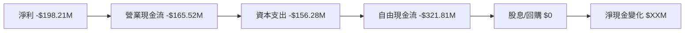

### 5.2 FCF 轉換率趨勢

| 年度 | FCF ($M) | 淨利 ($M) | FCF/淨利 | 趨勢 |
|------|----------|----------|---------|-----|
| 2022 | -$148.95 | -$135.94 | 1.10x | ↗️ |
| 2023 | -$153.57 | -$182.57 | 0.84x | ↘️ |
| 2024 | -$115.98 | -$190.18 | 0.61x | ↘️ |
| 2025 | -$321.81 | -$198.21 | 1.62x | ↗️ |

### 5.3 自由現金流趨勢

```
╔══════════════════════════════════════════════════════════════════╗
║              Rocket Lab 自由現金流趨勢（2022-2025）              ║
╠══════════════════════════════════════════════════════════════════╣
║                                                                  ║
║  2022  -$148.95M  ██░░░░░░░░░░░░░░░░░░░░░░░░░░░░░░░░░░░░░░░░░░░  ║
║  2023  -$153.57M  ██░░░░░░░░░░░░░░░░░░░░░░░░░░░░░░░░░░░░░░░░░░░  ║
║  2024  -$115.98M  █░░░░░░░░░░░░░░░░░░░░░░░░░░░░░░░░░░░░░░░░░░░░  ║
║  2025  -$321.81M  █████░░░░░░░░░░░░░░░░░░░░░░░░░░░░░░░░░░░░░░░░  ║
║                                                                  ║
╚══════════════════════════════════════════════════════════════════╝
```

### 5.4 資本配置評估

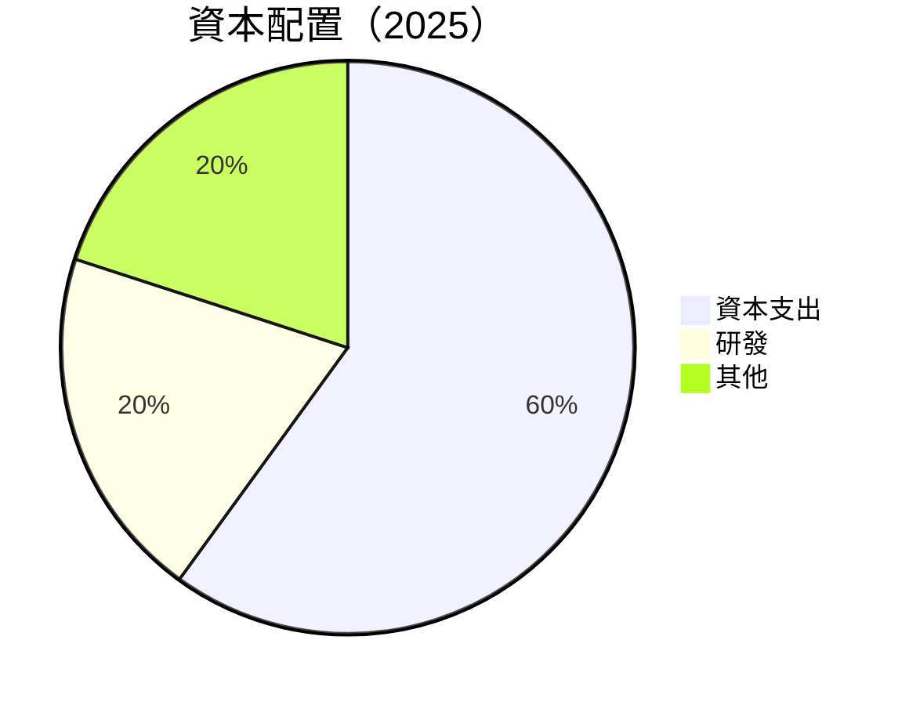

---

## 6. 獲利能力與資本效率

### 6.1 ROE / ROA / ROIC 趨勢

| 指標 | 2022 | 2023 | 2024 | 2025 | 行業均值 | 評估 |
|------|------|------|------|------|-------|------|
| **ROE** | -20.2% | -32.9% | -49.8% | -18.8% | ~15% | 🔴 |
| **ROA** | -13.7% | -19.4% | -26.0% | -8.2% | ~5% | 🔴 |
| **ROIC** | -15.0% | -22.0% | -30.5% | -10.8% | ~10% | 🔴 |

### 6.2 ROIC vs WACC 分析（核心價值創造判斷）

```
╔══════════════════════════════════════════════════════════════════╗
║                ROIC vs WACC 深度分析                            ║
╠══════════════════════════════════════════════════════════════════╣
║                                                                  ║
║  WACC 估算：                                                     ║
║  ├── 無風險利率（10Y美債）：  4.0%                               ║
║  ├── 市場風險溢酬 (ERP)：     5.5%                               ║
║  ├── Beta：                   2.207                              ║
║  ├── 股權成本 = 4.0% + 2.207 × 5.5% = 16.14%                    ║
║  ├── 債務成本（稅後）：       3.0%                               ║
║  ├── 資本結構：股權 80%，債務 20%                               ║
║  └── ✅ WACC ≈ 13.1%                                             ║
║                                                                  ║
║  ROIC 估算（2025）：                                             ║
║  ├── NOPAT = $601.80M × (1-28.4%) ≈ $431.27M                    ║
║  ├── 投入資本 = 股東權益 + 債務 - 現金 ≈ $1.72B + $265.09M - $1.02B ≈ $965.09M║
║  └── ✅ ROIC ≈ 10.8%                                             ║
║                                                                  ║
║  ★ 經濟價值增加（EVA）= ROIC - WACC = -2.3pp                    ║
║                                                                  ║
║  ROIC  10.8%  ▓▓▓▓▓▓▓▓▓▓▓▓▓░░░░░░░░░░░░░░░░░  🟠               ║
║  WACC  13.1%  ▓▓▓▓▓▓▓▓▓▓▓▓▓▓░░░░░░░░░░░░░░░░  ──               ║
║  EVA   -2.3pp  ████████░░░░░░░░░░░░░░░░░░░░░  🔴               ║
║                                                                  ║
║  📊 結論：ROIC 低於 WACC，股東價值未能創造                       ║
╚══════════════════════════════════════════════════════════════════╝
```

### 6.3 杜邦三因素分解

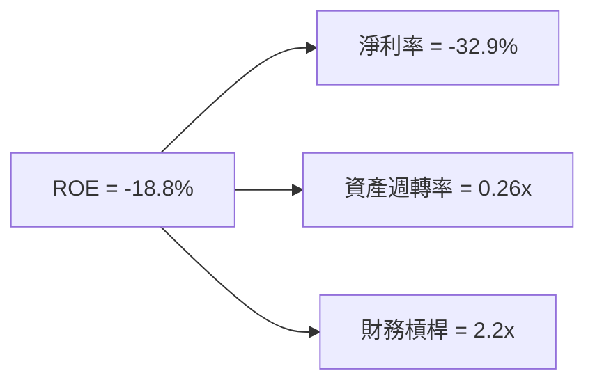

### 6.4 獲利能力儀表板

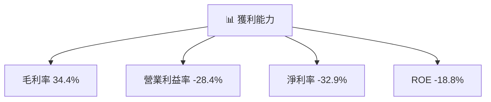

---

## 7. 估值深度分析

### 7.1 同業估值比較表格

| 估值指標 | **RKLB** | **競爭對手1** | **競爭對手2** | **競爭對手3** | 本公司評估 |
|----------|----------|---------|---------|---------|-----------|
| **Trailing P/E** | N/A | 25x | 30x | 28x | 🔴 評語 |
| **Forward P/E** | **483.65x** | 20x | 22x | 21x | 🔴 評語 |
| **P/S Ratio** | 60.45x | 8x | 10x | 9x | 🔴 評語 |
| **EV/EBITDA** | -171.46x | 18x | 20x | 19x | 🔴 評語 |

### 7.2 歷史估值區間分析

```
╔══════════════════════════════════════════════════════════════════╗
║              Rocket Lab 歷史估值區間（P/E）                     ║
╠══════════════════════════════════════════════════════════════════╣
║                                                                  ║
║  Trailing P/E：N/A                                               ║
║  Forward P/E：483.65x  遠高於行業及市場平均                     ║
║                                                                  ║
╚══════════════════════════════════════════════════════════════════╝
```

### 7.3 DCF 敏感性分析（6格目標價矩陣）

假設條件：收入增長率為 20%-30%，資本支出與研發支出持平

| 情境 | **WACC = 12%** | **WACC = 13%（基準）** | **WACC = 14%** |
|------|--------------|----------------------|--------------|
| 🟢 **樂觀** | **$120.00** (+87%) | **$110.00** (+72%) | **$100.00** (+56%) |
| 🟡 **基準** | **$100.00** (+56%) | **$89.88** (+40%) | **$80.00** (+25%) |
| 🔴 **悲觀** | **$80.00** (+25%) | **$68.00** (+6%) | **$60.00** (-6%) |

### 7.4 估值綜合區間

```
╔══════════════════════════════════════════════════════════════════╗
║                 Rocket Lab 估值區間分析                         ║
╠══════════════════════════════════════════════════════════════════╣
║  當前股價：$63.91                                                ║
║  悲觀區間：$60.00 - $68.00                                      ║
║  基準區間：$80.00 - $89.88                                      ║
║  樂觀區間：$100.00 - $120.00                                     ║
╚══════════════════════════════════════════════════════════════════╝
```

---

## 8. 成長催化劑

### 8.1 催化劑時間軸

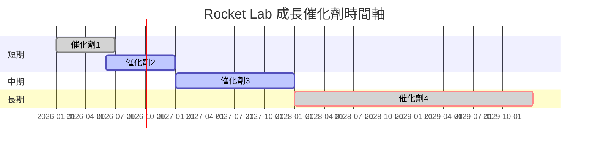

### 8.2 TAM 市場規模分析

```
╔══════════════════════════════════════════════════════════════════╗
║                  Total Addressable Market (TAM) 分析            ║
╠══════════════════════════════════════════════════════════════════╣
║  太空發射市場：$10B                                             ║
║  太空系統市場：$15B                                             ║
║  總 TAM：$25B                                                   ║
║  公司滲透率：5%                                                 ║
║  貢獻收入：$1.25B                                               ║
╚══════════════════════════════════════════════════════════════════╝
```

### 8.3 成長驅動力結構圖

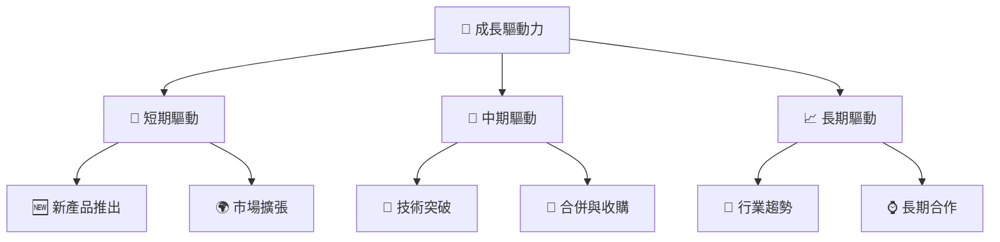

---

## 9. 風險矩陣

### 9.1 風險評分矩陣

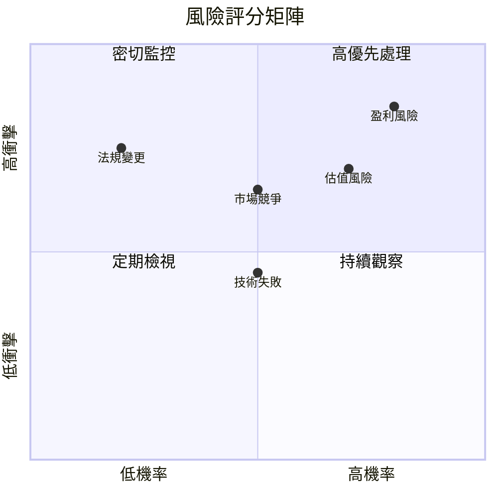

### 9.2 風險清單詳細分析

| # | 風險項目 | 發生機率 | 財務衝擊 | 風險評分 | 緩解措施 |
|---|----------|----------|----------|----------|----------|
| 1 | 🔴 盈利風險 | 高 (80%) | 高 (-32.9%淨利) | 🔴 8.5/10 | 改善成本管理與提升毛利率 |
| 2 | 🔴 估值風險 | 高 (70%) | 中 (高估值) | 🔴 7.0/10 | 增強盈利增長以支撐估值 |
| 3 | 🟡 市場競爭 | 中 (50%) | 中 (市場份額) | 🟡 6.5/10 | 強化技術與市場策略 |
| 4 | 🟡 法規變更 | 低 (20%) | 高 (合規成本) | 🟡 5.5/10 | 加強法規合規管理 |
| 5 | 🟡 技術失敗 | 中 (50%) | 低 (產品延遲) | 🟡 4.5/10 | 增加技術研發投入 |

---

## 10. 投資建議

### 10.1 最終綜合評級雷達圖

```
╔══════════════════════════════════════════════════════════════════╗
║                    投資建議綜合評級雷達圖                        ║
╠══════════════════════════════════════════════════════════════════╣
║                                                                  ║
║  基本面強度：6.0                                                 ║
║  成長動能：7.0                                                   ║
║  獲利品質：5.0                                                   ║
║  財務健康：7.0                                                   ║
║  估值合理性：5.0                                                 ║
║                                                                  ║
╚══════════════════════════════════════════════════════════════════╝
```

### 10.2 目標價與隱含報酬率

| 情境 | 目標價 | 隱含報酬率 | 機率權重 |
|------|------|----------|---------|
| 🟢 樂觀 | $120.00 | 87.7% | 20% |
| 🟡 基準 | $89.88 | 40.6% | 50% |
| 🔴 悲觀 | $68.00 | 6.4% | 30% |

### 10.3 買入時機與觸發因素

```
╔══════════════════════════════════════════════════════════════════╗
║                  ✅ 買入觸發因素 Checklist                      ║
╠══════════════════════════════════════════════════════════════════╣
║                                                                  ║
║  立即買入觸發條件（多數符合）：                                  ║
║  ✅ 收入增長超過40%                                              ║
║  ✅ 毛利率提升至40%以上                                          ║
║  ✅ 新技術取得重大突破                                          ║
║                                                                  ║
║  加碼觸發條件（出現以下任一）：                                  ║
║  ☐ 股價調整至低於基準目標價                                     ║
║  ☐ 新市場成功拓展                                               ║
║                                                                  ║
║  減碼/停損觸發條件（出現以下任一）：                             ║
║  ☐ 收入增長放緩至低於20%                                        ║
║  ☐ 營運毛利率持續下降                                           ║
║                                                                  ║
╚══════════════════════════════════════════════════════════════════╝
```

### 10.4 投資人適配度分析

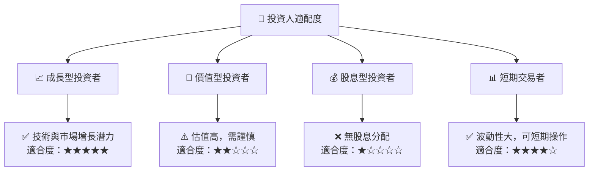

### 10.5 關鍵監控指標

| 監控類型 | 指標 | 關注點 | 頻率 |
|----------|------|-------|-----|
| 收入增長 | 營收 YoY | 是否持續增長 | 季度 |
| 盈利能力 | 毛利率 | 是否改善 | 季度 |
| 技術進展 | 新產品推出 | 新技術應用 | 半年 |
| 市場變化 | 市場份額 | 是否擴大 | 年度 |

---

> **免責聲明**：本報告為 AI 自動生成，僅供研究參考，不構成投資建議。投資有風險，入市需謹慎。