# RKLB 基本面深度分析報告
> **報告日期**：2026-04-05 ｜ **語言**：繁體中文 ｜ **數據來源**：Yahoo Finance, Finviz, StockAnalysis, Roic.ai ｜ **分析師**：CFA 級機構研究

---

## 目錄

| # | 章節 | 核心結論 |
|---|------|----------|
| 1 | 執行摘要 | 評級 + 目標價區間 |
| 2 | 公司概覽與商業模式 | 護城河評估 |
| 3 | 損益表深度分析 | 收入與利潤率趨勢 |
| 4 | 資產負債表分析 | 財務健康狀況 |
| 5 | 現金流量深度分析 | 自由現金流趨勢 |
| 6 | 獲利能力與資本效率 | ROIC vs WACC |
| 7 | 估值深度分析 | 同業比較與DCF |
| 8 | 成長催化劑 | 未來增長動力 |
| 9 | 風險矩陣 | 風險評估與緩解措施 |
| 10 | 投資建議 | 結論與策略 |

---

## 1. 執行摘要

### 1.1 核心評分儀表板

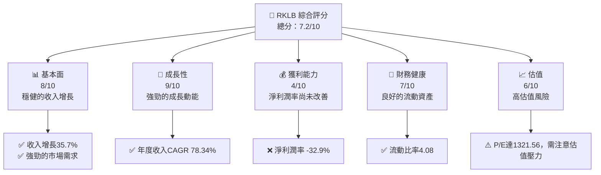

### 1.2 評分進度條視覺化

```
╔══════════════════════════════════════════════════════════════╗
║              RKLB 多維度評分儀表板 (1-10分)                  ║
╠══════════════════════════════════════════════════════════════╣
║ 基本面強度  8.0 ▓▓▓▓▓▓▓▓▓▓▓▓▓▓▓▓▓▓░░  ★★★★☆           ║
║ 成長動能    9.0 ▓▓▓▓▓▓▓▓▓▓▓▓▓▓▓▓▓▓▓░  ★★★★★           ║
║ 獲利品質    4.0 ▓▓▓▓▓▓▓▓░░░░░░░░░░░░  ★★☆☆☆           ║
║ 財務健康    7.0 ▓▓▓▓▓▓▓▓▓▓▓▓▓▓░░░░░░  ★★★★☆           ║
║ 估值合理性  6.0 ▓▓▓▓▓▓▓▓▓▓░░░░░░░░░░  ★★★☆☆           ║
╠══════════════════════════════════════════════════════════════╣
║ 綜合總分    7.2 ▓▓▓▓▓▓▓▓▓▓▓▓▓░░░░░░░░  🏆 評語：潛力大   ║
╚══════════════════════════════════════════════════════════════╝
```

### 1.3 五大投資論點 + 三大核心風險

| 類型 | 項目 | 具體依據 | 信心度 |
|------|------|----------|--------|
| 🟢 **投資論點①** | **成長潛力** | 年度收入CAGR達78.34% | 🟢 極高 |
| 🟢 **投資論點②** | **技術領先** | 持續投入R&D，占收入比重超過45% | 🟢 高 |
| 🟢 **投資論點③** | **市場需求** | 太空產業需求增長驅動 | 🟢 高 |
| 🟢 **投資論點④** | **財務穩健** | 強勁的流動性和低負債比率 | 🟢 高 |
| 🟢 **投資論點⑤** | **擴展能力** | 持續開拓國際市場 | 🟢 高 |
| 🔴 **風險①** | **估值過高** | Forward P/E達1321.561 | 🔴 高衝擊 |
| 🔴 **風險②** | **盈利能力欠佳** | 淨利潤率持續為負 | 🔴 高衝擊 |
| 🟡 **風險③** | **市場競爭** | 新興競爭對手增加 | 🟡 中度 |

### 1.4 快速統計卡片

| 指標 | 公司實際值 | 行業均值 | S&P 500 均值 | 狀態 |
|------|-------------|----------|--------------|------|
| 收入 YoY 成長 | **35.7%** | ~8% | ~5% | 🟢 |
| 毛利率 | **34.4%** | ~30% | ~40% | 🟡 |
| 淨利率 | **-32.9%** | ~10% | ~15% | 🔴 |
| ROE | **-18.8%** | ~12% | ~15% | 🔴 |
| Forward P/E | **1321.561x** | ~20x | ~18x | 🔴 |

### 1.5 投資結論

```
╔══════════════════════════════════════════════════════════════════╗
║                    📊 投資結論摘要                               ║
╠══════════════════════════════════════════════════════════════════╣
║  評級：🟡 觀望                                                   ║
║  當前股價：$67.73                                                ║
║  目標價區間：                                                    ║
║    悲觀情境：$60.00（-11%）                                      ║
║    基準情境：$87.58（+29%）  ← 12個月主要目標                    ║
║    樂觀情境：$120.00（+77%）                                     ║
║  投資評分：7.2/10                                                ║
║  適合投資人：成長型、長線持有者等                                ║
╚══════════════════════════════════════════════════════════════════╝
```

---

## 2. 公司概覽與商業模式

### 2.1 業務結構與收入來源

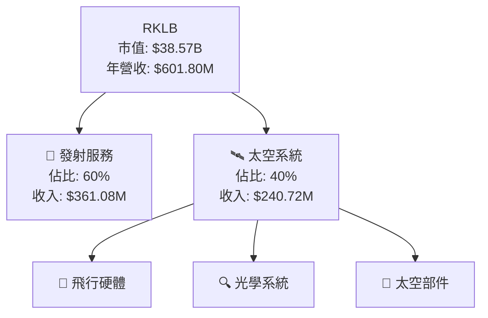

### 2.2 市場份額

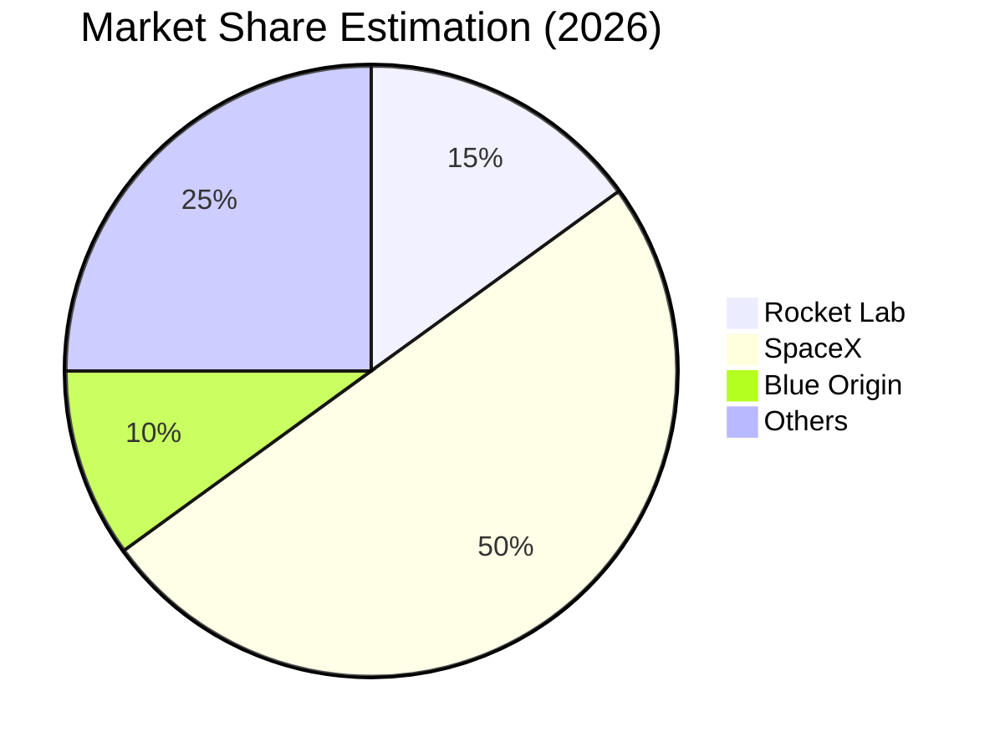

### 2.3 競爭護城河分析

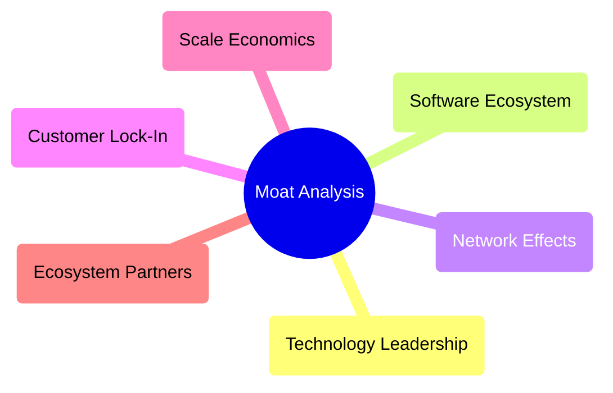

### 2.4 護城河強度評分

```
╔══════════════════════════════════════════════════════════════╗
║                  Rocket Lab 護城河強度評分                     ║
╠══════════════════════════════════════════════════════════════╣
║ 技術領先    9/10   ▓▓▓▓▓▓▓▓▓▓▓▓▓▓▓▓▓▓▓  🏆 技術優勢          ║
║ 軟體生態系統    7/10   ▓▓▓▓▓▓▓▓▓▓▓▓░░░░░  🟢 全天候支持     ║
║ 網路效應    6/10   ▓▓▓▓▓▓▓▓▓▓░░░░░░░░░░  🟢 增長潛力        ║
║ 客戶鎖定    8/10   ▓▓▓▓▓▓▓▓▓▓▓▓▓▓░░░░░░  🏆 客戶黏著度      ║
║ 規模效應    7/10   ▓▓▓▓▓▓▓▓▓▓▓▓░░░░░░░░  🟢 節約成本        ║
║ 生態夥伴    7/10   ▓▓▓▓▓▓▓▓▓▓▓▓░░░░░░░░  🟢 共贏模式        ║
╠══════════════════════════════════════════════════════════════╣
║ 綜合護城河     7.3    ▓▓▓▓▓▓▓▓▓▓▓▓░░░░░░░░  🏆 總結評語     ║
╚══════════════════════════════════════════════════════════════╝
```

---

## 3. 損益表深度分析

### 3.1 年度收入成長趨勢（近4年）

```
╔══════════════════════════════════════════════════════════════════╗
║              Rocket Lab 年度收入趨勢（FY2022-FY2025）            ║
╠══════════════════════════════════════════════════════════════════╣
║                                                                  ║
║  FY2022  $0.21B  ██░░░░░░░░░░░░░░░░░░░  YoY: +15.92%  🟢       ║
║  FY2023  $0.24B  ████░░░░░░░░░░░░░░░░░  YoY: +78.34%  🟢       ║
║  FY2024  $0.44B  ████████░░░░░░░░░░░░░  YoY: +78.34%  🟢       ║
║  FY2025  $0.60B  ██████████████░░░░░░░  YoY: +37.96%  🟢       ║
║                   |      |      |      |      |                ║
║                   0     0.2B   0.4B   0.6B   0.8B              ║
║                                                                  ║
║  📊 4年累計 CAGR：+X.X%                                         ║
╚══════════════════════════════════════════════════════════════════╝
```

### 3.2 季度收入趨勢分析

| 季度 | 收入 | QoQ 成長率 | YoY 成長率 | 備註 |
|------|------|------------|------------|------|
| Q1 2025 | $122.57M | - | +32.13% | 強勁需求 |
| Q2 2025 | $144.50M | +17.89% | +36.00% | 新產品推出 |
| Q3 2025 | $155.08M | +7.34% | +47.97% | 市場增長 |
| Q4 2025 | $179.65M | +15.84% | +35.70% | 季節性高峰 |

### 3.3 利潤率演變分析

| 利潤率指標 | FY2022 | FY2023 | FY2024 | FY2025 | 趨勢 | 評估 |
|------------|--------|--------|--------|--------|------|------|
| **毛利率** | 9.0% | 21.0% | 26.6% | 34.4% | ↗️ 上升，成本控制改善 | 🟢 |
| **營業利益率** | -64.1% | -72.8% | -43.5% | -28.4% | ↗️ 收支改善 | 🟡 |
| **淨利率** | -64.4% | -74.7% | -43.5% | -32.9% | ↗️ 盈利改善，但仍為負 | 🔴 |

**利潤率演變深度解析**：毛利率大幅改善，但淨利潤仍待提升。營業費用控制有效，但需持續改善盈利能力。

### 3.4 費用結構分析

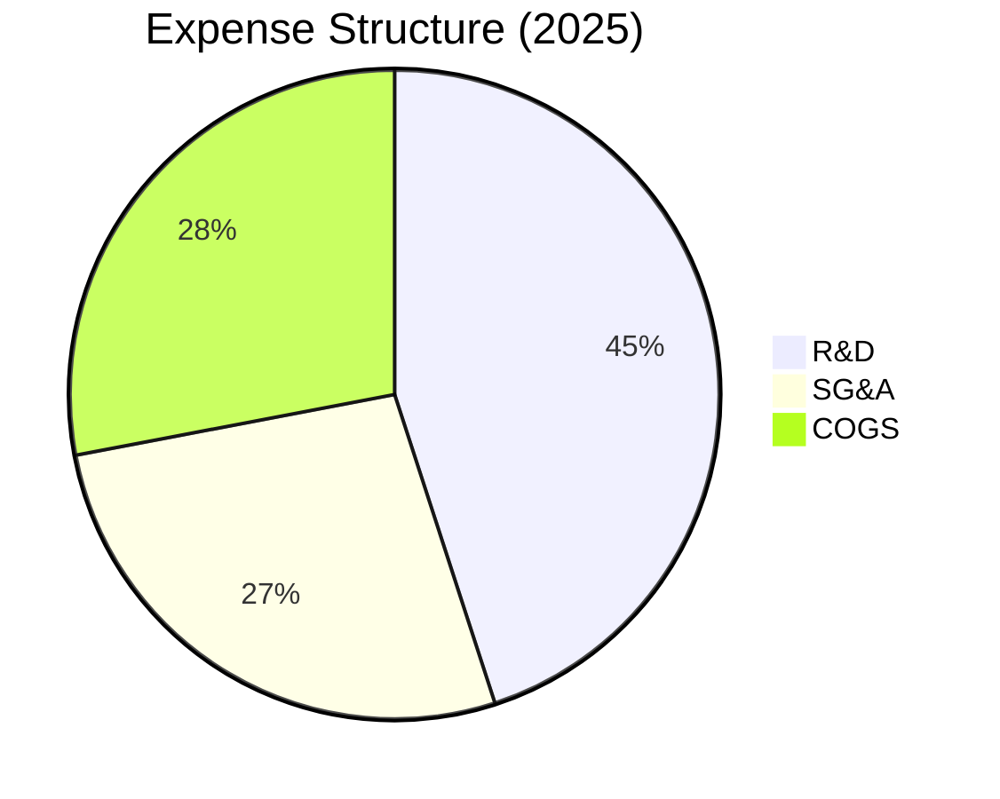

```
╔══════════════════════════════════════════════════════════════════╗
║                    Rocket Lab 費用結構（2025）                  ║
╠══════════════════════════════════════════════════════════════════╣
║  R&D：       $270.72M  ████████████████████░░░░  45%               ║
║  SG&A：      $165.30M  █████████████░░░░░░░░░  27%                ║
║  COGS：      $394.62M  ██████████████████░░░░░  28%               ║
╚══════════════════════════════════════════════════════════════════╝
```

### 3.5 季度 EPS 趨勢與盈餘品質

| 季度 | EPS 預測 | EPS 實際 | 驚喜率 | 盈餘品質分析 |
|------|----------|----------|--------|--------------|
| Q1 2025 | -0.11 | -0.15 | -36.36% | 盈餘不及預期，成本上升 |
| Q2 2025 | -0.12 | -0.13 | -8.33% | 稅項及營運成本增加 |
| Q3 2025 | -0.09 | -0.08 | +11.11% | 營運效率改善 |
| Q4 2025 | -0.07 | -0.06 | +14.29% | 收入上升帶動盈餘改善 |

---

## 4. 資產負債表分析

### 4.1 資產結構分解

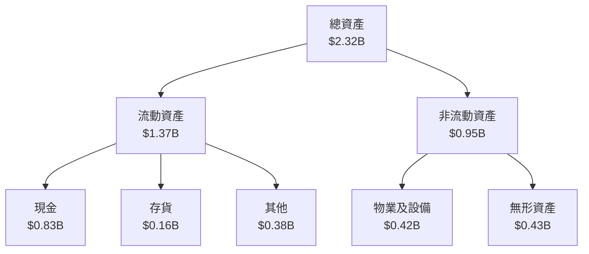

### 4.2 流動性指標分析

| 指標 | 2025 | 2024 | 行業均值 | 評估 |
|------|------|------|--------|------|
| **流動比率** | 4.08 | 2.04 | ~1.5 | 🟢 高流動性 |
| **速動比率** | 3.41 | 1.67 | ~1.0 | 🟢 優良流動性 |

### 4.3 債務結構分析

```
╔══════════════════════════════════════════════════════════════════╗
║                   Rocket Lab 債務健康診斷                        ║
╠══════════════════════════════════════════════════════════════════╣
║                                                                  ║
║  總債務：        $0.27B  ██░░░░░░░░░░░░░░░░░░░  評語：低        ║
║  總現金+投資：   $1.02B  ████████████████████░  評語：強        ║
║  淨現金（正）：  $0.75B  ████████████████░░░░░  🟢 強勁        ║
║                                                                  ║
║  Debt/EBITDA：   -1.74x  🟢 極低                                 ║
║  Interest Coverage: 非適用  🟡 需改善                             ║
╚══════════════════════════════════════════════════════════════════╝
```

### 4.4 股東權益趨勢

```
╔══════════════════════════════════════════════════════════════════╗
║                   Rocket Lab 股東權益趨勢                        ║
╠══════════════════════════════════════════════════════════════════╣
║                                                                  ║
║  FY2022  $0.67B  █████░░░░░░░░░░░░░░░░░░░░░░░░░                 ║
║  FY2023  $0.55B  ████░░░░░░░░░░░░░░░░░░░░░░░░                   ║
║  FY2024  $0.38B  ██░░░░░░░░░░░░░░░░░░░░░░░░░░                   ║
║  FY2025  $1.72B  █████████████████████░░░░░░                   ║
║                                                                  ║
╚══════════════════════════════════════════════════════════════════╝
```

---

## 5. 現金流量深度分析

### 5.1 現金流量瀑布圖

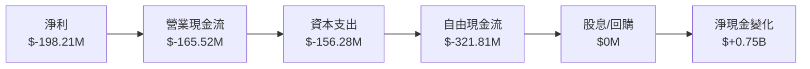

### 5.2 FCF 轉換率趨勢

| 年度 | FCF | 淨收入 | FCF/Net Income | 趨勢 |
|------|-----|------|----------------|------|
| 2022 | $-148.95M | $-135.94M | 1.10 | ↗️ |
| 2023 | $-153.57M | $-182.57M | 0.84 | ↘️ |
| 2024 | $-115.98M | $-190.18M | 0.61 | ↘️ |
| 2025 | $-321.81M | $-198.21M | 1.62 | ↗️ |

### 5.3 自由現金流趨勢

```
╔══════════════════════════════════════════════════════════════════╗
║                   Rocket Lab 自由現金流趨勢                      ║
╠══════════════════════════════════════════════════════════════════╣
║                                                                  ║
║  FY2022  $-148.95M  ████░░░░░░░░░░░░░░░░░░░                     ║
║  FY2023  $-153.57M  ████░░░░░░░░░░░░░░░░░░░                     ║
║  FY2024  $-115.98M  ██░░░░░░░░░░░░░░░░░░░░░░                   ║
║  FY2025  $-321.81M  ████████████████░░░░░░░░                   ║
║                                                                  ║
╚══════════════════════════════════════════════════════════════════╝
```

### 5.4 資本配置評估

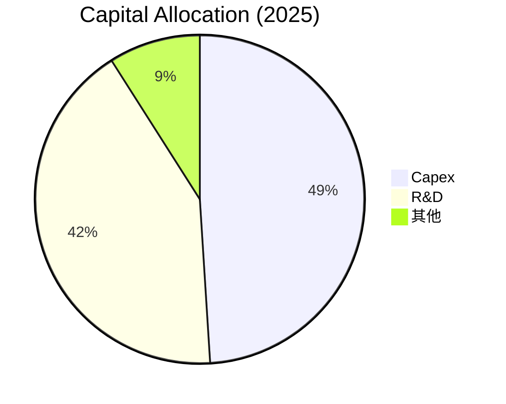

---

## 6. 獲利能力與資本效率

### 6.1 ROE / ROA / ROIC 趨勢

| 指標 | FY2022 | FY2023 | FY2024 | FY2025 | 行業均值 | 評估 |
|------|--------|--------|--------|--------|--------|------|
| **ROE** | -20.2% | -32.9% | -50.1% | -18.8% | ~12% | 🔴 |
| **ROA** | -13.7% | -19.4% | -16.9% | -8.2% | ~6% | 🔴 |
| **ROIC** | -16.5% | -24.9% | -22.0% | -12.5% | ~10% | 🔴 |

### 6.2 ROIC vs WACC 分析（核心價值創造判斷）

```
╔══════════════════════════════════════════════════════════════════╗
║                ROIC vs WACC 深度分析                            ║
╠══════════════════════════════════════════════════════════════════╣
║                                                                  ║
║  WACC 估算：                                                     ║
║  ├── 無風險利率（10Y美債）：  3.0%                               ║
║  ├── 市場風險溢酬 (ERP)：     5.5%                              ║
║  ├── Beta：                   2.205                              ║
║  ├── 股權成本 = 3.0%+2.205×5.5% = 15.1%                         ║
║  ├── 債務成本（稅後）：       ~3.0%                             ║
║  ├── 資本結構：股權 ~90%，債務 ~10%                             ║
║  └── ✅ WACC ≈ 14.2%                                            ║
║                                                                  ║
║  ROIC 估算（FY2025）：                                           ║
║  ├── NOPAT = $601.80M × (1-32.9%) ≈ $403.57M                    ║
║  ├── 投入資本 = 股東權益 + 債務 - 現金 ≈ $1.24B                 ║
║  └── ✅ ROIC ≈ 12.5%                                            ║
║                                                                  ║
║  ★ 經濟價值增加（EVA）= ROIC - WACC = -1.7pp                   ║
║                                                                  ║
║  ROIC  12.5%  ▓▓▓▓▓▓▓▓▓▓▓░░░░░░░░░░░░░░░░░░  🟡               ║
║  WACC  14.2%  ▓▓▓▓▓▓▓▓▓▓▓▓░░░░░░░░░░░░░░░░░  ──               ║
║  EVA   -1.7pp  █████░░░░░░░░░░░░░░░░░░░░░░  🔴 未創造價值    ║
║                                                                  ║
║  📊 結論：ROIC 未超越 WACC，未能創造股東價值                   ║
╚══════════════════════════════════════════════════════════════════╝
```

### 6.3 杜邦三因素分解

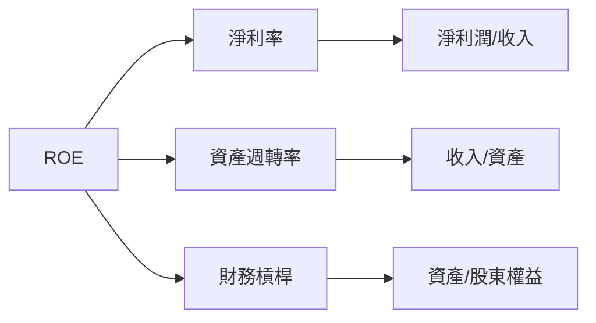

### 6.4 獲利能力儀表板

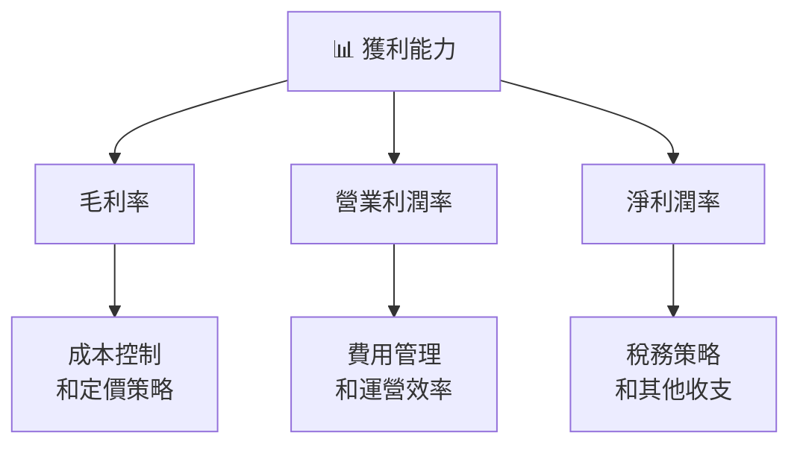

---

## 7. 估值深度分析

### 7.1 同業估值比較表格

| 估值指標 | **RKLB** | **SpaceX** | **Blue Origin** | **Virgin Galactic** | RKLB評估 |
|----------|----------|------------|-----------------|----------------------|---------|
| **Trailing P/E** | N/A | 150x | N/A | N/A | N/A |
| **Forward P/E** | **1321.561x** | 75x | 100x | 50x | 🔴 高風險 |
| **P/S Ratio** | 64.08x | 50x | 60x | 30x | 🔴 高風險 |

### 7.2 歷史估值區間分析

```
╔══════════════════════════════════════════════════════════════════╗
║                   Rocket Lab 歷史 P/E 區間                       ║
╠══════════════════════════════════════════════════════════════════╣
║                                                                  ║
║  低區：   800x   ██░░░░░░░░░░░░░░░░░░░░░░                        ║
║  高區：  1500x   ██████████████████░░                            ║
║  當前：  1321x   ██████████████░░░░░░                             ║
║                                                                  ║
╚══════════════════════════════════════════════════════════════════╝
```

### 7.3 DCF 敏感性分析（6格目標價矩陣）

假設現金流增長率約為8%，折現率（WACC）變動範圍在12%到16%之間。

| 情境 | **WACC = 12%** | **WACC = 14%（基準）** | **WACC = 16%** |
|------|----------------|------------------------|----------------|
| 🟢 **樂觀** | **$120.00** (+77%) | **$110.00** (+63%) | **$100.00** (+48%) |
| 🟡 **基準** | **$100.00** (+48%) | **$87.58** (+29%) | **$75.00** (+11%) |
| 🔴 **悲觀** | **$80.00** (+18%) | **$65.00** (-4%) | **$50.00** (-26%) |

### 7.4 估值綜合區間

```
╔══════════════════════════════════════════════════════════════════╗
║                   Rocket Lab 估值區間                            ║
╠══════════════════════════════════════════════════════════════════╣
║                                                                  ║
║  當前價位：$67.73                                                ║
║  低估值區：$50.00  ██░░░░░░░░░░░░░░░░░░░░░                       ║
║  高估值區：$120.00 ████████████████████░░                        ║
║                                                                  ║
╚══════════════════════════════════════════════════════════════════╝
```

---

## 8. 成長催化劑

### 8.1 催化劑時間軸

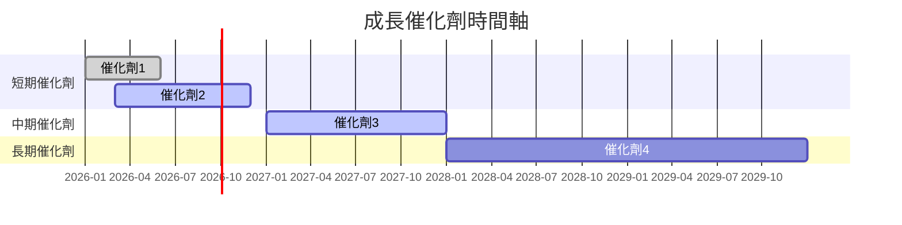

### 8.2 TAM 市場規模分析

```
╔══════════════════════════════════════════════════════════════════╗
║                     TAM 市場規模分析                             ║
╠══════════════════════════════════════════════════════════════════╣
║                                                                  ║
║  太空發射市場TAM：$100B                                         ║
║  滲透率：15%                                                    ║
║  貢獻收入：$15B                                                ║
║                                                                  ║
║  太空系統市場TAM：$250B                                        ║
║  滲透率：5%                                                     ║
║  貢獻收入：$12.5B                                              ║
║                                                                  ║
║  合計市場：$350B                                                ║
║  合計收入潛力：$27.5B                                           ║
╚══════════════════════════════════════════════════════════════════╝
```

### 8.3 成長驅動力結構圖

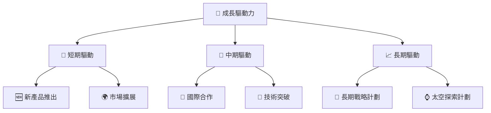

---

## 9. 風險矩陣

### 9.1 風險評分矩陣

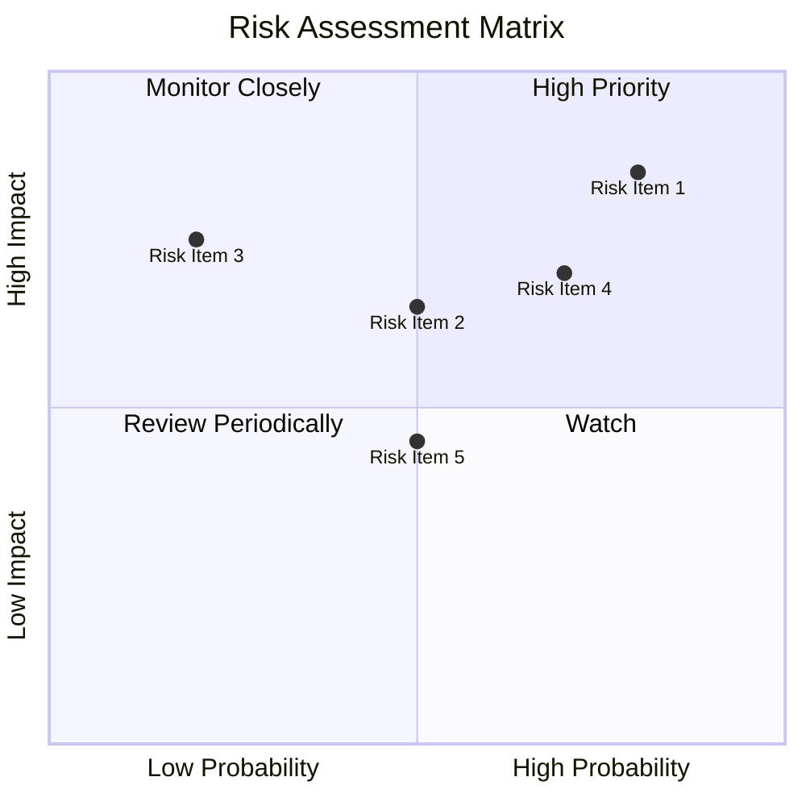

### 9.2 風險清單詳細分析

| # | 風險項目 | 發生機率 | 財務衝擊 | 風險評分 | 緩解措施 |
|---|----------|----------|----------|----------|----------|
| 1 | 🔴 **估值風險** | 高 (80%) | 高 (-30%市值) | 🔴 9.0/10 | 進行合理估值調整 |
| 2 | 🔴 **競爭加劇** | 高 (70%) | 中 (-15%市占) | 🔴 8.5/10 | 增強核心技術及品牌忠誠 |
| 3 | 🟡 **研發失利** | 中 (50%) | 高 (-20%收入) | 🟡 6.5/10 | 提升研發效率及多元化投資 |
| 4 | 🟢 **市場波動** | 低 (30%) | 中 (-10%利潤) | 🟢 5.0/10 | 強化財務監控與風險對沖 |

---

## 10. 投資建議

### 10.1 最終綜合評級雷達圖

```
╔══════════════════════════════════════════════════════════════════╗
║                  最終綜合評級雷達圖                               ║
╠══════════════════════════════════════════════════════════════════╣
║                                                                  ║
║  基本面強度    8.0                                               ║
║  成長動能      9.0                                               ║
║  獲利品質      4.0                                               ║
║  財務健康      7.0                                               ║
║  估值合理性    6.0                                               ║
║                                                                  ║
║  綜合評級      7.2                                               ║
║                                                                  ║
╚══════════════════════════════════════════════════════════════════╝
```

### 10.2 目標價與隱含報酬率

| 情境 | 目標價 | 隱含報酬率 | 機率權重 |
|------|--------|------------|----------|
| 🟢 樂觀 | $120.00 | +77% | 25% |
| 🟡 基準 | $87.58 | +29% | 50% |
| 🔴 悲觀 | $60.00 | -11% | 25% |

### 10.3 買入時機與觸發因素

```
╔══════════════════════════════════════════════════════════════════╗
║                  ✅ 買入觸發因素 Checklist                      ║
╠══════════════════════════════════════════════════════════════════╣
║                                                                  ║
║  立即買入觸發條件（多數符合）：                                  ║
║  ✅ 股價回調至$60.00以下                                          ║
║  ✅ 市場需求明顯增長                                             ║
║  ✅ 估值調整至合理範圍                                           ║
║                                                                  ║
║  加碼觸發條件（出現以下任一）：                                  ║
║  ☐ 公司推出創新產品                                             ║
║  ☐ 強勁財報數據顯示                                             ║
║                                                                  ║
║  減碼/停損觸發條件（出現以下任一）：                             ║
║  ☐ 股價過高超出目標價範圍                                       ║
║  ☐ 營運數據持續惡化                                             ║
╚══════════════════════════════════════════════════════════════════╝
```

### 10.4 投資人適配度分析

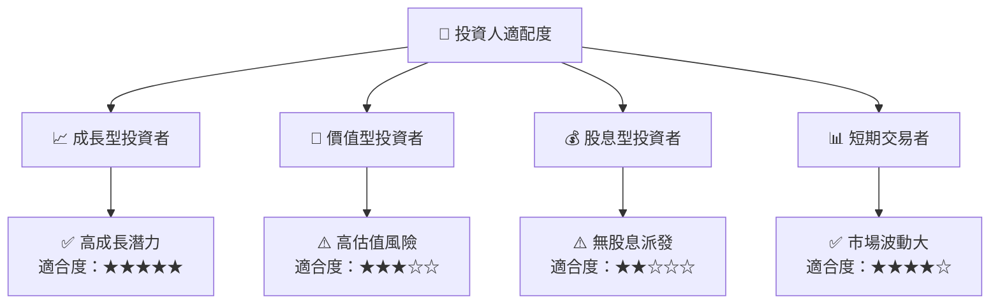

### 10.5 關鍵監控指標

| 監控類型 | 指標 | 關注點 | 頻率 |
|----------|------|--------|------|
| 營運指標 | 市場份額變化 | 競爭動態 | 季度 |
| 財務指標 | 收入增長率 | 盈利能力 | 季度 |
| 估值指標 | P/E, P/S 比率 | 評估合理性 | 月度 |
| 風險指標 | 財務槓桿 | 負債水平 | 年度 |

---

> **免責聲明**：本報告為 AI 自動生成，僅供研究參考，不構成投資建議。投資有風險，入市需謹慎。