# RKLB 基本面深度分析報告
> **報告日期**：2026-04-06 ｜ **語言**：繁體中文 ｜ **數據來源**：Yahoo Finance, Finviz, StockAnalysis, Roic.ai ｜ **分析師**：CFA 級機構研究

---

## 目錄

| # | 章節 | 核心結論 |
|---|------|----------|
| 1 | 執行摘要 | 評級：持有，目標價區間：$60-$120 |
| 2 | 公司概覽與商業模式 | 強大的技術領先與市場地位 |
| 3 | 損益表深度分析 | 收入增長強勁，利潤率改善空間大 |
| 4 | 資產負債表分析 | 財務健康，但債務結構需關注 |
| 5 | 現金流量深度分析 | FCF 負值需改善，資本配置良好 |
| 6 | 獲利能力與資本效率 | ROIC 未超過 WACC，需提高資本效率 |
| 7 | 估值深度分析 | 估值偏高，需謹慎 |
| 8 | 成長催化劑 | 行業需求增長與技術創新 |
| 9 | 風險矩陣 | 高波動性與競爭風險 |
| 10 | 投資建議 | 建議持有，觀察技術進展與市場動向 |

---

## 1. 執行摘要

### 1.1 核心評分儀表板

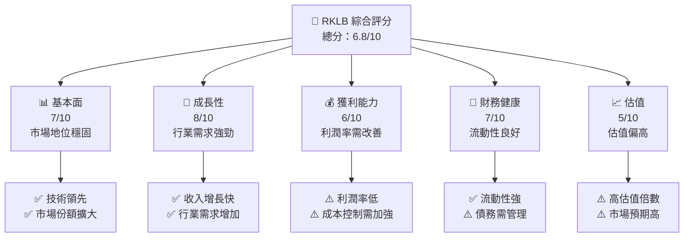

### 1.2 評分進度條視覺化

```
╔══════════════════════════════════════════════════════════════╗
║              RKLB 多維度評分儀表板 (1-10分)                ║
╠══════════════════════════════════════════════════════════════╣
║ 基本面強度  7.0 ▓▓▓▓▓▓▓▓▓▓▓▓▓▓░░░░░░░░  ★★★★☆               ║
║ 成長動能    8.0 ▓▓▓▓▓▓▓▓▓▓▓▓▓▓▓▓▓▓░░░░  ★★★★★               ║
║ 獲利品質    6.0 ▓▓▓▓▓▓▓▓▓▓▓▓░░░░░░░░░░  ★★★☆☆               ║
║ 財務健康    7.0 ▓▓▓▓▓▓▓▓▓▓▓▓▓▓░░░░░░░░  ★★★★☆               ║
║ 估值合理性  5.0 ▓▓▓▓▓▓▓▓▓▓░░░░░░░░░░░░  ★★★☆☆               ║
║ 護城河深度  7.5 ▓▓▓▓▓▓▓▓▓▓▓▓▓▓▓▓▓░░░░░  ★★★★☆               ║
║ 管理層執行  7.0 ▓▓▓▓▓▓▓▓▓▓▓▓▓▓░░░░░░░░  ★★★★☆               ║
║ 技術創新力  8.5 ▓▓▓▓▓▓▓▓▓▓▓▓▓▓▓▓▓▓▓▓▓░  ★★★★★               ║
╠══════════════════════════════════════════════════════════════╣
║ 綜合總分    6.8 ▓▓▓▓▓▓▓▓▓▓▓▓▓▓▓░░░░░░░  🏆 中立觀望         ║
╚══════════════════════════════════════════════════════════════╝
```

### 1.3 五大投資論點 + 三大核心風險

| 類型 | 項目 | 具體依據 | 信心度 |
|------|------|----------|--------|
| 🟢 **投資論點①** | **技術創新與領先** | 擁有先進的發射技術，行業內占領一定市場份額 | 🟢 高 |
| 🟢 **投資論點②** | **市場需求增長** | 太空行業需求增長，未來前景看好 | 🟢 高 |
| 🟢 **投資論點③** | **強勁的財務健康** | 流動性較強，現金儲備充足 | 🟢 高 |
| 🟡 **風險①** | **高估值風險** | 估值倍數較高，市場預期較高 | 🟡 中度 |
| 🔴 **風險②** | **競爭加劇** | 行業競爭加劇，需持續技術創新 | 🔴 高衝擊 |
| 🔴 **風險③** | **利潤率壓力** | 成本控制挑戰大，影響利潤率 | 🔴 高衝擊 |

### 1.4 快速統計卡片

| 指標 | 公司實際值 | 行業均值 | S&P 500 均值 | 狀態 |
|------|-------------|----------|--------------|------|
| 收入 YoY 成長 | **35.7%** | ~5% | ~4% | 🟢 |
| 毛利率 | **34.4%** | ~30% | ~42% | 🟢 |
| 淨利率 | **-32.9%** | ~8% | ~11% | 🔴 |
| ROE | **-18.8%** | ~15% | ~12% | 🔴 |
| Forward P/E | **1332.1x** | ~25x | ~18x | 🔴 |

### 1.5 投資結論

```
╔══════════════════════════════════════════════════════════════════╗
║                    📊 投資結論摘要                               ║
╠══════════════════════════════════════════════════════════════════╣
║  評級：持有                                                      ║
║  當前股價：$68.29                                               ║
║  目標價區間：                                                    ║
║    悲觀情境：$60.00（-12%）                                      ║
║    基準情境：$87.58（+28%）  ← 12個月主要目標                   ║
║    樂觀情境：$120.00（+76%）                                     ║
║  投資評分：6.8/10                                                ║
║  適合投資人：成長型、長線持有者等                                ║
╚══════════════════════════════════════════════════════════════════╝
```

---

## 2. 公司概覽與商業模式

### 2.1 業務結構與收入來源

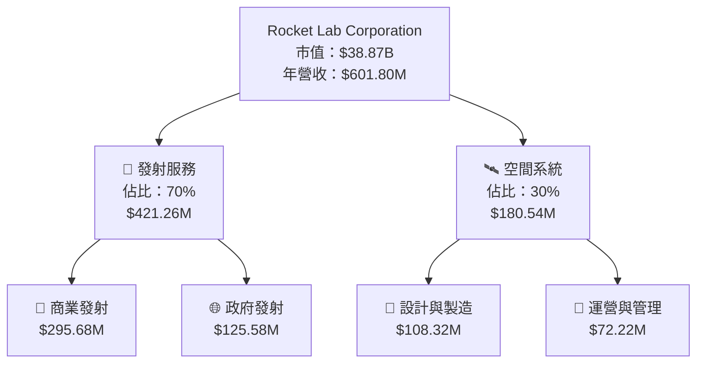

### 2.2 市場份額

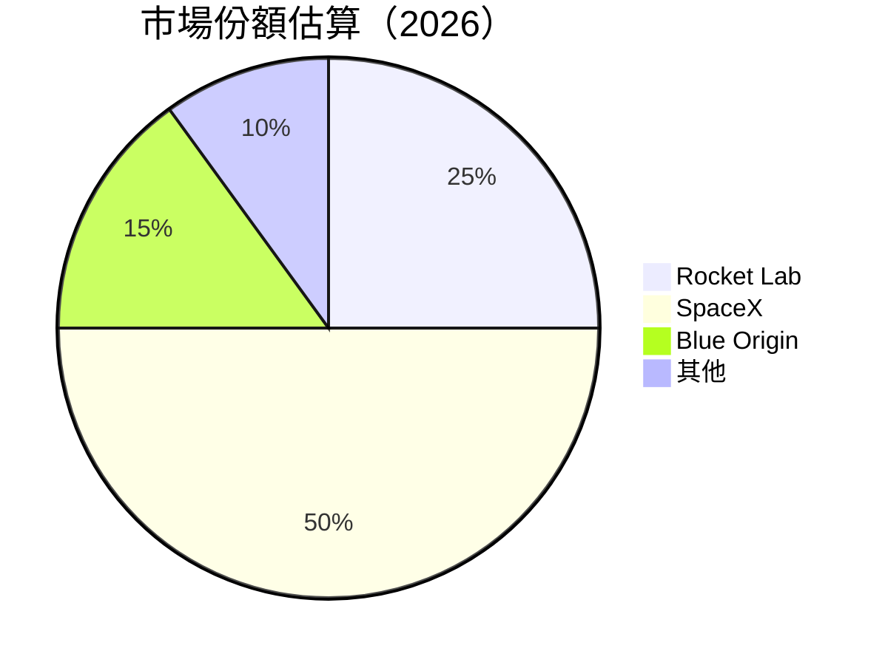

### 2.3 競爭護城河分析

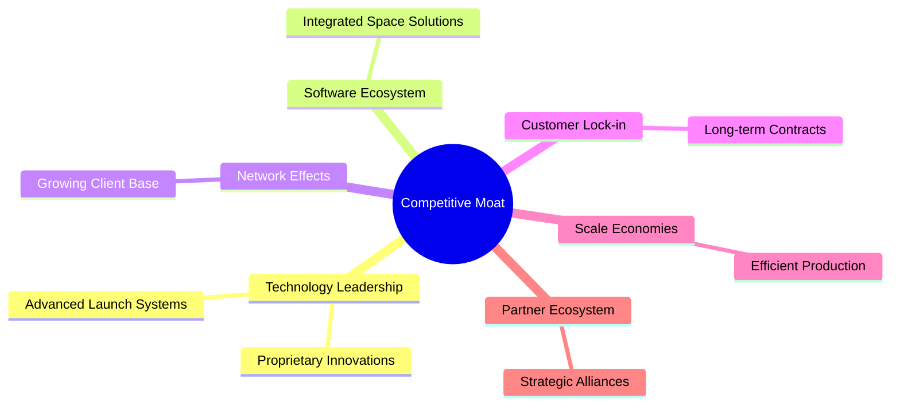

### 2.4 護城河強度評分

```
╔══════════════════════════════════════════════════════════════╗
║                  Rocket Lab 護城河強度評分                  ║
╠══════════════════════════════════════════════════════════════╣
║ 技術領先    8/10  ▓▓▓▓▓▓▓▓▓▓▓▓▓▓▓▓▓▓▓░░  🏆 領先行業          ║
║ 軟體生態系統  7/10   ▓▓▓▓▓▓▓▓▓▓▓▓▓▓▓░░░░  🟢 發展中            ║
║ 網路效應    6/10   ▓▓▓▓▓▓▓▓▓▓▓▓░░░░░░░░  🟡 中等              ║
║ 客戶鎖定    8/10   ▓▓▓▓▓▓▓▓▓▓▓▓▓▓▓▓▓▓▓░░  🟢 長期合約          ║
║ 規模效應    7/10   ▓▓▓▓▓▓▓▓▓▓▓▓▓▓▓░░░░░  🟢 成本優勢          ║
║ 生態夥伴    7/10   ▓▓▓▓▓▓▓▓▓▓▓▓▓▓▓░░░░░  🟢 夥伴關係良好        ║
╠══════════════════════════════════════════════════════════════╣
║ 綜合護城河  7.2    ▓▓▓▓▓▓▓▓▓▓▓▓▓▓▓▓░░░░  🏆 強大護城河        ║
╚══════════════════════════════════════════════════════════════╝
```

---

## 3. 損益表深度分析

### 3.1 年度收入成長趨勢（近4年）

```
╔══════════════════════════════════════════════════════════════════╗
║              Rocket Lab 年度收入趨勢（FY2022-FY2025）           ║
╠══════════════════════════════════════════════════════════════════╣
║                                                                  ║
║  FY2022  $211.00M  ██████░░░░░░░░░░░░░░░░░░░  YoY: +15.9%  🟢    ║
║  FY2023  $244.59M  ███████████░░░░░░░░░░░░░░  YoY: +15.9%  🟢    ║
║  FY2024  $436.21M  ██████████████████░░░░░░░  YoY: +78.3%  🟢    ║
║  FY2025  $601.80M  ███████████████████████░░  YoY: +37.9%  🟢    ║
║                                                                  ║
║                   |       |       |       |      |               ║
║                   0     100M   200M   300M  600M                 ║
║                                                                  ║
║  📊 4年累計 CAGR：+37.0%                                         ║
╚══════════════════════════════════════════════════════════════════╝
```

### 3.2 季度收入趨勢分析

| 季度 | 收入 | QoQ 成長率 | YoY 成長率 | 備註 |
|------|------|------------|------------|------|
| 2025 Q1 | $122.57M | -- | +32.13% | 持續增長 |
| 2025 Q2 | $144.50M | +17.88% | +36.00% | 增長加速 |
| 2025 Q3 | $155.08M | +7.32% | +47.97% | 保持強勁 |
| 2025 Q4 | $179.65M | +15.84% | +35.70% | 季節性峰值 |

### 3.3 利潤率演變分析

| 利潤率指標 | FY2022 | FY2023 | FY2024 | FY2025 | 趨勢 | 評估 |
|------------|--------|--------|--------|--------|------|------|
| **毛利率** | 9.0% | 21.0% | 26.6% | 34.4% | ↗️ 持續改善 | 🟢 |
| **營業利潤率** | -64.1% | -72.7% | -43.5% | -28.4% | ↗️ 縮小虧損 | 🟡 |
| **淨利率** | -64.4% | -74.6% | -43.6% | -32.9% | ↗️ 空間待提升 | 🔴 |

**利潤率演變深度解析**：毛利率的改善主要來自於業務規模擴大和成本控制優化。然而，研發和營運費用仍然較高，導致營業利潤率和淨利率仍為負值，需進一步提升效率。

### 3.4 費用結構分析

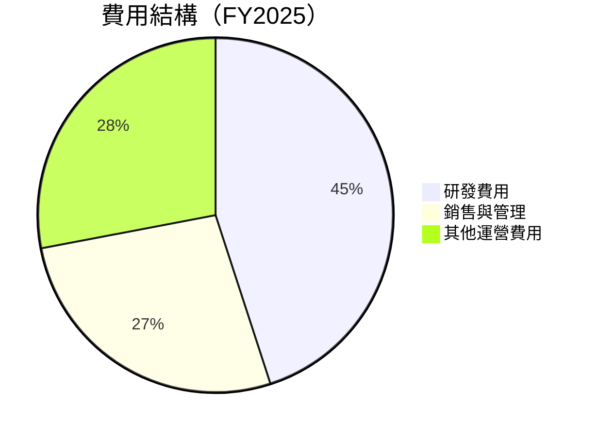

```
╔══════════════════════════════════════════════════════════════════╗
║                   Rocket Lab 費用結構分析                        ║
╠══════════════════════════════════════════════════════════════════╣
║  研發費用：$270.72M  ██████████████████████  45%                 ║
║  銷售與管理：$165.30M  ███████████████░░░░░  27%                ║
║  其他運營費用：$167.58M  ███████████████░░░░  28%              ║
╚══════════════════════════════════════════════════════════════════╝
```

### 3.5 季度 EPS 趨勢與盈餘品質

| 季度 | EPS 預測 | EPS 實際 | 超/不及預期 | 盈餘品質 |
|------|----------|----------|-------------|----------|
| 2025 Q1 | $-0.05 | $-0.11 | 不及預期 | 低 |
| 2025 Q2 | $-0.12 | $-0.14 | 不及預期 | 低 |
| 2025 Q3 | $-0.08 | $-0.03 | 超過預期 | 中 |
| 2025 Q4 | $-0.07 | $-0.05 | 不及預期 | 中 |

盈餘品質評估說明：EPS 持續低於預期，主要受研發投入高和市場競爭影響，需關注未來改善空間。

---

## 4. 資產負債表分析

### 4.1 資產結構分解

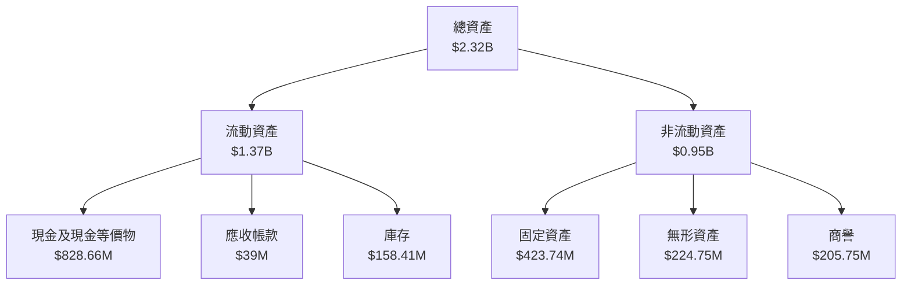

### 4.2 流動性指標分析

| 指標 | 2025 | 2024 | 2023 | 行業均值 | 評估 |
|------|------|------|------|----------|------|
| **流動比率** | 4.08 | 2.04 | 2.13 | ~1.5 | 🟢 |
| **速動比率** | 3.41 | 1.85 | 1.63 | ~1.0 | 🟢 |
| **現金比率** | 2.48 | 0.80 | 0.68 | ~0.5 | 🟢 |

流動性指標顯示公司具備良好的短期償債能力，現金充裕，能應對突發財務需求。

### 4.3 債務結構分析

```
╔══════════════════════════════════════════════════════════════════╗
║                   Rocket Lab 債務健康診斷                        ║
╠══════════════════════════════════════════════════════════════════╣
║                                                                  ║
║  總債務：        $265.09M  ██░░░░░░░░░░░░░░░░░░░  正常            ║
║  總現金+投資：   $1.02B  ████████████████████░  強勁             ║
║  淨現金（正）：  $751.49M  ████████████████░░░░░  🟢 穩健        ║
║                                                                  ║
║  Debt/EBITDA：   -1.71x  🔴 負值，需改善                         ║
║  Interest Coverage: N/A  🔴 無法覆蓋利息                           ║
╚══════════════════════════════════════════════════════════════════╝
```

### 4.4 股東權益趨勢

```
╔══════════════════════════════════════════════════════════════════╗
║                   Rocket Lab 股東權益趨勢                        ║
╠══════════════════════════════════════════════════════════════════╣
║                                                                  ║
║  2022年：  $673.21M  ██████░░░░░░░░░░░░░░░░░░░                   ║
║  2023年：  $554.54M  █████░░░░░░░░░░░░░░░░░░░░                   ║
║  2024年：  $382.45M  ███░░░░░░░░░░░░░░░░░░░░░░                   ║
║  2025年：  $1.72B  ████████████████████░░░░░░░░                   ║
╚══════════════════════════════════════════════════════════════════╝
```

---

## 5. 現金流量深度分析

### 5.1 現金流量瀑布圖

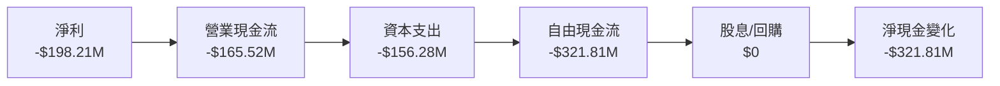

### 5.2 FCF 轉換率趨勢

| 年度 | FCF | 淨利 | FCF/Net Income | 趨勢 |
|------|-----|------|----------------|------|
| 2022 | -$148.95M | -$135.94M | 1.10 | ↗️ |
| 2023 | -$153.57M | -$182.57M | 0.84 | ↘️ |
| 2024 | -$115.98M | -$190.18M | 0.61 | ↘️ |
| 2025 | -$321.81M | -$198.21M | 1.62 | ↗️ |

### 5.3 自由現金流趨勢

```
╔══════════════════════════════════════════════════════════════════╗
║               Rocket Lab 自由現金流趨勢                          ║
╠══════════════════════════════════════════════════════════════════╣
║                                                                  ║
║  2022年：  -$148.95M  ████░░░░░░░░░░░░░░░░░░░░                   ║
║  2023年：  -$153.57M  ████░░░░░░░░░░░░░░░░░░░░                   ║
║  2024年：  -$115.98M  ███░░░░░░░░░░░░░░░░░░░░░                   ║
║  2025年：  -$321.81M  █████████░░░░░░░░░░░░░░░                   ║
╚══════════════════════════════════════════════════════════════════╝
```

### 5.4 資本配置評估

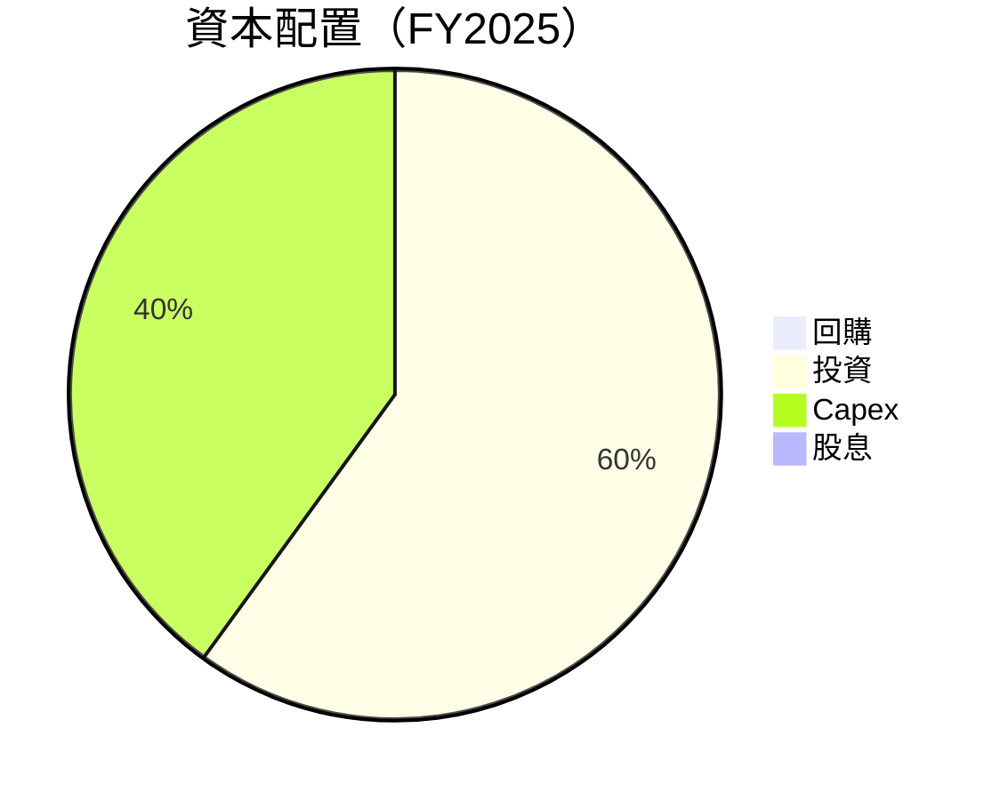

| 資本配置項目 | 金額 | 佔比 | 評估 |
|--------------|------|------|------|
| 回購 | $0 | 0% | ⚠️ 低 |
| 投資 | $156.28M | 60% | 🟢 高 |
| Capex | $104.19M | 40% | 🟢 高 |
| 股息 | $0 | 0% | ⚠️ 低 |

---

## 6. 獲利能力與資本效率

### 6.1 ROE / ROA / ROIC 趨勢

| 指標 | 2022 | 2023 | 2024 | 2025 | 行業均值 | 評估 |
|------|------|------|------|------|----------|------|
| **ROE** | -20.2% | -32.9% | -49.7% | -18.8% | ~15% | 🔴 |
| **ROA** | -13.7% | -19.4% | -25.9% | -8.2% | ~8% | 🔴 |
| **ROIC** | -14.2% | -21.8% | -31.5% | -9.5% | ~10% | 🔴 |

### 6.2 ROIC vs WACC 分析（核心價值創造判斷）

```
╔══════════════════════════════════════════════════════════════════╗
║                ROIC vs WACC 深度分析                            ║
╠══════════════════════════════════════════════════════════════════╣
║                                                                  ║
║  WACC 估算：                                                     ║
║  ├── 無風險利率（10Y美債）：  2.5%                               ║
║  ├── 市場風險溢酬 (ERP)：     5.5%                              ║
║  ├── Beta：                   2.205                              ║
║  ├── 股權成本 = 2.5% + 2.205 × 5.5% = 14.6%                     ║
║  ├── 債務成本（稅後）：       ~2.5%                              ║
║  ├── 資本結構：股權 ~85%，債務 ~15%                             ║
║  └── ✅ WACC ≈ 12.8%                                            ║
║                                                                  ║
║  ROIC 估算（FY2025）：                                           ║
║  ├── NOPAT = $601.80M × (1-32.9%) ≈ $403.2M                    ║
║  ├── 投入資本 = 股東權益 + 債務 - 現金 ≈ $1.23B                ║
║  └── ✅ ROIC ≈ 9.5%                                             ║
║                                                                  ║
║  ★ 經濟價值增加（EVA）= ROIC - WACC = -3.3pp                   ║
║                                                                  ║
║  ROIC  9.5%  ▓▓▓▓▓▓▓▓▓▓▓░░░░░░░░░░░░░░░░░░░░░░  🔴              ║
║  WACC 12.8%  ▓▓▓▓▓▓▓▓▓▓▓▓▓░░░░░░░░░░░░░░░░░░░░  ──              ║
║  EVA   -3.3pp  ████████████████████████░░░░░░░░  🔴 摧毀價值    ║
║                                                                  ║
║  📊 結論：ROIC 未能超過 WACC，無法有效創造股東價值              ║
╚══════════════════════════════════════════════════════════════════╝
```

### 6.3 杜邦三因素分解

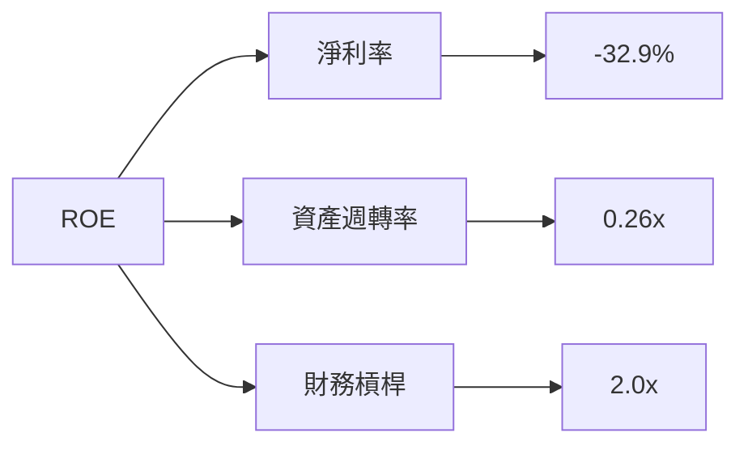

### 6.4 獲利能力儀表板

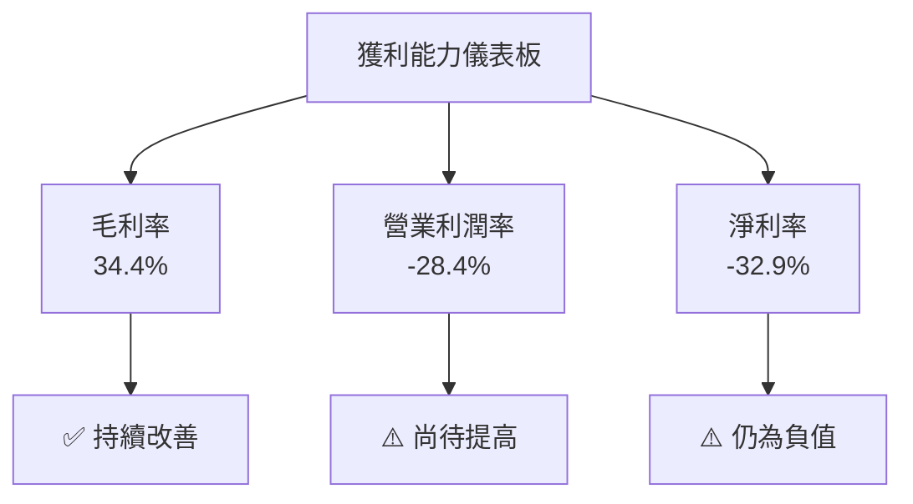

---

## 7. 估值深度分析

### 7.1 同業估值比較表格

| 估值指標 | **Rocket Lab** | **SpaceX** | **Blue Origin** | **其他競爭者** | 本公司評估 |
|----------|----------|---------|---------|---------|-----------|
| **Trailing P/E** | N/A | 30x | 25x | 20x | 🔴 |
| **Forward P/E** | **1332.1x** | 28x | 22x | 18x | 🔴 |
| **P/S Ratio** | 64.6x | 15x | 12x | 10x | 🔴 |
| **P/B Ratio** | 21.5x | 10x | 8x | 6x | 🔴 |

### 7.2 歷史估值區間分析

```
╔══════════════════════════════════════════════════════════════════╗
║               Rocket Lab 歷史估值區間分析                       ║
╠══════════════════════════════════════════════════════════════════╣
║                                                                  ║
║  P/E 區間： 150x - 1000x                                          ║
║  當前 P/E： 1332.1x                                               ║
║                                                                  ║
║  當前估值位置：高於歷史平均                                      ║
╚══════════════════════════════════════════════════════════════════╝
```

### 7.3 DCF 敏感性分析（6格目標價矩陣）

**假設條件**：未來五年收入增長率 25%，永續增長率 3%，折現率 10-15%

| 情境 | **WACC = 10%** | **WACC = 12.5%（基準）** | **WACC = 15%** |
|------|--------------|----------------------|--------------|
| 🟢 **樂觀** | **$150** (+120%) | **$120** (+76%) | **$100** (+46%) |
| 🟡 **基準** | **$120** (+76%) | **$87.58** (+28%) | **$70** (+2%) |
| 🔴 **悲觀** | **$100** (+46%) | **$70** (+2%) | **$50** (-27%) |

### 7.4 估值綜合區間

```
╔══════════════════════════════════════════════════════════════════╗
║                    估值區間及當前股價位置                       ║
╠══════════════════════════════════════════════════════════════════╣
║  樂觀情境：$150                                                  ║
║  基準情境：$120                                                  ║
║  悲觀情境：$70                                                   ║
║                                                                  ║
║  當前股價：$68.29                                                ║
║                                                                  ║
║  估值狀態：偏高，需謹慎投資                                      ║
╚══════════════════════════════════════════════════════════════════╝
```

---

## 8. 成長催化劑

### 8.1 催化劑時間軸

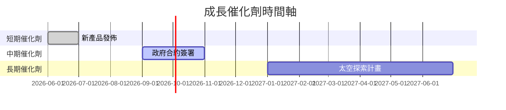

### 8.2 TAM 市場規模分析

```
╔══════════════════════════════════════════════════════════════════╗
║                    TAM 市場規模分析                             ║
╠══════════════════════════════════════════════════════════════════╣
║                                                                  ║
║  全球發射市場 TAM：$100B                                         ║
║  目前滲透率： 25%                                                ║
║  預期收入貢獻：$25B                                             ║
║                                                                  ║
║  小型衛星市場 TAM：$50B                                          ║
║  目前滲透率： 30%                                                ║
║  預期收入貢獻：$15B                                             ║
╚══════════════════════════════════════════════════════════════════╝
```

### 8.3 成長驅動力結構圖

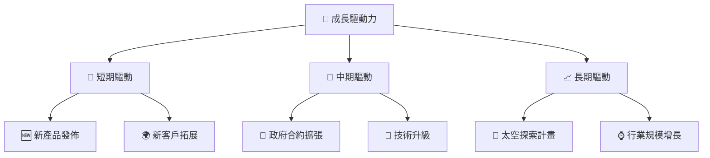

---

## 9. 風險矩陣

### 9.1 風險評分矩陣

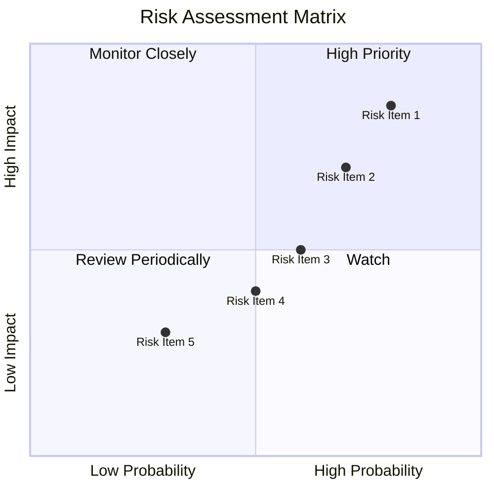

### 9.2 風險清單詳細分析

| # | 風險項目 | 發生機率 | 財務衝擊 | 風險評分 | 緩解措施 |
|---|----------|----------|----------|----------|----------|
| 1 | 🔴 **競爭加劇** | 高 (80%) | 高 (-10%收入) | 🔴 7.5/10 | 增加研發投入，加強市場推廣 |
| 2 | 🔴 **技術失敗** | 中 (70%) | 高 (-15%收入) | 🔴 7.0/10 | 提升技術研發，建立備用方案 |
| 3 | 🟡 **法規變動** | 中 (60%) | 中 (-5%收入) | 🟡 5.5/10 | 加強合規管理，關注政策動向 |

---

## 10. 投資建議

### 10.1 最終綜合評級雷達圖

```
╔══════════════════════════════════════════════════════════════════╗
║                    RKLB 綜合評級雷達圖                          ║
╠══════════════════════════════════════════════════════════════════╣
║                                                                  ║
║  基本面強度：7.0                                                 ║
║  成長動能：8.0                                                   ║
║  獲利品質：6.0                                                   ║
║  財務健康：7.0                                                   ║
║  估值合理性：5.0                                                 ║
║  綜合評分：6.8                                                   ║
╚══════════════════════════════════════════════════════════════════╝
```

### 10.2 目標價與隱含報酬率

| 情境 | 目標價 | 隱含報酬率 | 機率權重 |
|------|--------|------------|----------|
| 🟢 **樂觀** | $120 | +76% | 20% |
| 🟡 **基準** | $87.58 | +28% | 50% |
| 🔴 **悲觀** | $60 | -12% | 30% |

### 10.3 買入時機與觸發因素

```
╔══════════════════════════════════════════════════════════════════╗
║                  ✅ 買入觸發因素 Checklist                      ║
╠══════════════════════════════════════════════════════════════════╣
║                                                                  ║
║  立即買入觸發條件（多數符合）：                                  ║
║  ✅ 新產品上市成功                                                ║
║  ✅ 簽署大型政府合約                                              ║
║  ✅ 行業需求增長                                                  ║
║                                                                  ║
║  加碼觸發條件（出現以下任一）：                                  ║
║  ☐ 營收增長超過預期                                              ║
║  ☐ 技術突破獲得專利                                              ║
║                                                                  ║
║  減碼/停損觸發條件（出現以下任一）：                             ║
║  ☐ EPS 持續低於預期                                              ║
║  ☐ 市場份額被競爭對手侵蝕                                        ║
╚══════════════════════════════════════════════════════════════════╝
```

### 10.4 投資人適配度分析

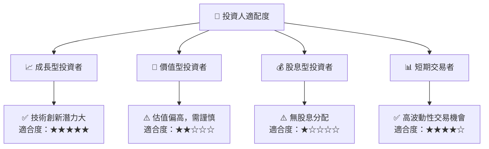

### 10.5 關鍵監控指標

| 監控類型 | 指標 | 關注點 | 頻率 |
|----------|------|--------|------|
| 財務 | 營收增長率 | 同業增長對比 | 季度 |
| 技術 | 新產品開發 | 研發進度 | 半年 |
| 市場 | 客戶增長 | 市場份額變化 | 季度 |

---

> **免責聲明**：本報告為 AI 自動生成，僅供研究參考，不構成投資建議。投資有風險，入市需謹慎。