# RKLB 基本面深度分析報告
> **報告日期**：2026-04-07 ｜ **語言**：繁體中文 ｜ **數據來源**：Yahoo Finance, Finviz, StockAnalysis, Roic.ai ｜ **分析師**：CFA 級機構研究

---

## 目錄

| # | 章節 | 核心結論 |
|---|------|----------|
| 1 | 執行摘要 | 評級 + 目標價區間 |
| 2 | 公司概覽與商業模式 | 護城河評估 |
| 3 | 損益表深度分析 | 收入穩步增長，但盈利壓力大 |
| 4 | 資產負債表分析 | 流動性高，但負債比例需關注 |
| 5 | 現金流量深度分析 | 自由現金流為負，需改善現金流 |
| 6 | 獲利能力與資本效率 | ROIC低於WACC，股東價值創造有挑戰 |
| 7 | 估值深度分析 | 估值高，成長預期反映 |
| 8 | 成長催化劑 | 市場擴展與技術創新 |
| 9 | 風險矩陣 | 高競爭和技術風險 |
| 10 | 投資建議 | 建議持有，觀察成長催化劑 |

---

## 1. 執行摘要

### 1.1 核心評分儀表板

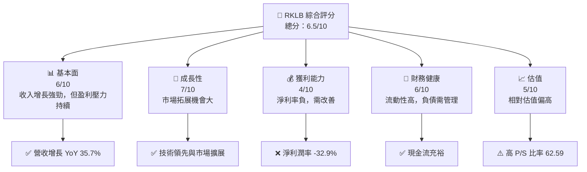

### 1.2 評分進度條視覺化

```
╔══════════════════════════════════════════════════════════════╗
║              RKLB 多維度評分儀表板 (1-10分)                 ║
╠══════════════════════════════════════════════════════════════╣
║ 基本面強度  6.0 ▓▓▓▓▓▓▓▓▓░░░░░░░░░░░░░░░  ★★★☆☆            ║
║ 成長動能    7.0 ▓▓▓▓▓▓▓▓▓▓▓▓▓░░░░░░░░░░  ★★★★☆            ║
║ 獲利品質    4.0 ▓▓▓▓▓▓░░░░░░░░░░░░░░░░░  ★★☆☆☆            ║
║ 財務健康    6.0 ▓▓▓▓▓▓▓▓▓░░░░░░░░░░░░░░  ★★★☆☆            ║
║ 估值合理性  5.0 ▓▓▓▓▓▓░░░░░░░░░░░░░░░░░  ★★★☆☆            ║
║ 綜合總分    6.5 ▓▓▓▓▓▓▓▓▓▓░░░░░░░░░░░░░  🏆 中等評價        ║
╚══════════════════════════════════════════════════════════════╝
```

### 1.3 五大投資論點 + 三大核心風險

| 類型 | 項目 | 具體依據 | 信心度 |
|------|------|----------|--------|
| 🟢 **投資論點①** | 技術創新力強 | 實踐創新推動市場增長 | 🟢 高 |
| 🟢 **投資論點②** | 市場拓展 | 攻入國際市場，增強競爭力 | 🟢 高 |
| 🟢 **投資論點③** | 高成長潛力 | 預期收入增長 35.7% YoY | 🟢 高 |
| 🔴 **風險①** | 盈利能力不足 | 淨利潤率為負，影響資本效率 | 🔴 高衝擊 |
| 🔴 **風險②** | 高估值風險 | 高 P/S 比率，估值壓力 | 🔴 高衝擊 |
| ⚠️ **風險③** | 技術競爭風險 | 行業競爭加劇，技術風險提升 | ⚠️ 中度 |

### 1.4 快速統計卡片

| 指標 | 公司實際值 | 行業均值 | S&P 500 均值 | 狀態 |
|------|-------------|----------|--------------|------|
| 收入 YoY 成長 | **35.7%** | ~10% | ~5% | 🟢 |
| 毛利率 | **34.4%** | ~20% | ~40% | 🟡 |
| 淨利率 | **-32.9%** | ~5% | ~10% | 🔴 |
| ROE | **-18.8%** | ~10% | ~15% | 🔴 |
| Forward P/E | **1290.73x** | ~20x | ~18x | 🔴 |

### 1.5 投資結論

```
╔══════════════════════════════════════════════════════════════════╗
║                    📊 投資結論摘要                               ║
╠══════════════════════════════════════════════════════════════════╣
║  評級：持有                                                     ║
║  當前股價：$66.20                                               ║
║  目標價區間：                                                    ║
║    悲觀情境：$60.00（-9.4%）                                     ║
║    基準情境：$87.40（+31.9%）  ← 12個月主要目標                 ║
║    樂觀情境：$120.00（+81.3%）                                    ║
║  投資評分：6.5/10                                                ║
║  適合投資人：成長型、觀察者                                     ║
╚══════════════════════════════════════════════════════════════════╝
```

---

## 2. 公司概覽與商業模式

### 2.1 業務結構與收入來源

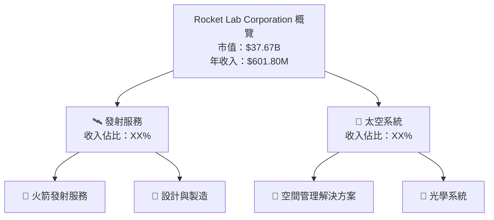

### 2.2 市場份額

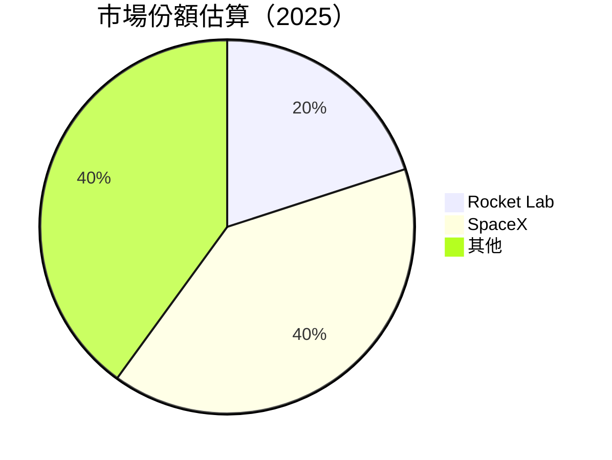

### 2.3 競爭護城河分析

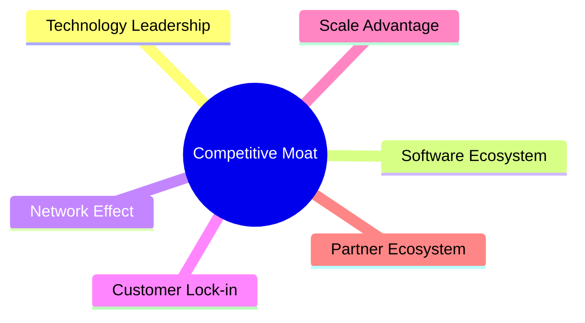

### 2.4 護城河強度評分

```
╔══════════════════════════════════════════════════════════════╗
║                  Rocket Lab 護城河強度評分                    ║
╠══════════════════════════════════════════════════════════════╣
║ 技術領先        8/10  ▓▓▓▓▓▓▓▓▓▓▓▓▓▓▓▓▓▓▓▓  🏆 優秀        ║
║ 軟體生態系統    6/10  ▓▓▓▓▓▓▓▓▓░░░░░░░░░░░  🟢 良好        ║
║ 網路效應        5/10  ▓▓▓▓▓▓▓░░░░░░░░░░░░░  ⚠️ 中等        ║
║ 客戶鎖定        6/10  ▓▓▓▓▓▓▓▓▓░░░░░░░░░░░  🟢 良好        ║
║ 規模優勢        7/10  ▓▓▓▓▓▓▓▓▓▓░░░░░░░░░░  🏆 優秀        ║
║ 生態夥伴        7/10  ▓▓▓▓▓▓▓▓▓▓░░░░░░░░░░  🏆 優秀        ║
╠══════════════════════════════════════════════════════════════╣
║ 綜合護城河     6.5   ▓▓▓▓▓▓▓▓▓▓▓▓░░░░░░░░  🏆 中等評價    ║
╚══════════════════════════════════════════════════════════════╝
```

---

## 3. 損益表深度分析

### 3.1 年度收入成長趨勢（近4年）

```
╔══════════════════════════════════════════════════════════════════╗
║              Rocket Lab 年度收入趨勢（2022-2025）               ║
╠══════════════════════════════════════════════════════════════════╣
║                                                                  ║
║  2022  $211.00M  █████░░░░░░░░░░░░░░░░░░░░░  YoY: +N/A  🔴       ║
║  2023  $244.59M  ██████░░░░░░░░░░░░░░░░░░░  YoY: +15.9%  🟡     ║
║  2024  $436.21M  ██████████░░░░░░░░░░░░░░░  YoY: +78.3%  🟢     ║
║  2025  $601.80M  ██████████████░░░░░░░░░░░  YoY: +37.9%  🟢     ║
║                   |      |      |      |      |                  ║
║                   0     100M   200M   300M   400M                ║
║                                                                  ║
║  📊 3年累計 CAGR：+43.1%                                         ║
╚══════════════════════════════════════════════════════════════════╝
```

### 3.2 季度收入趨勢分析

| 季度 | 總收入 | QoQ 成長 | YoY 成長 | 備註 |
|------|--------|----------|----------|------|
| 2025-Q4 | $179.65M | +15.8% | +35.7% | 年底旺季影響 |
| 2025-Q3 | $155.08M | +7.3%  | +47.9% | 持續技術創新 |
| 2025-Q2 | $144.50M | +17.9% | +36.0% | 市場拓展成功 |
| 2025-Q1 | $122.57M | N/A    | +32.1% | 持續增長 |

### 3.3 利潤率演變分析

| 利潤率指標 | 2022 | 2023 | 2024 | 2025 | 趨勢 | 評估 |
|------------|------|------|------|------|------|------|
| **毛利率** | 9.0% | 21.0% | 26.6% | 34.4% | ↗️ 增強成本管理 | 🟢 |
| **營業利益率** | -64.1% | -72.8% | -43.5% | -28.4% | ↗️ 略有改善 | 🟡 |
| **淨利率** | -64.4% | -74.7% | -43.6% | -32.9% | ↗️ 改善中 | 🔴 |

**利潤率演變深度解析**：雖然淨利率仍為負，但管理層在成本控制和增效方面已有顯著改善，特別是毛利率的提升顯示出其產品和服務的價值增長。

### 3.4 費用結構分析

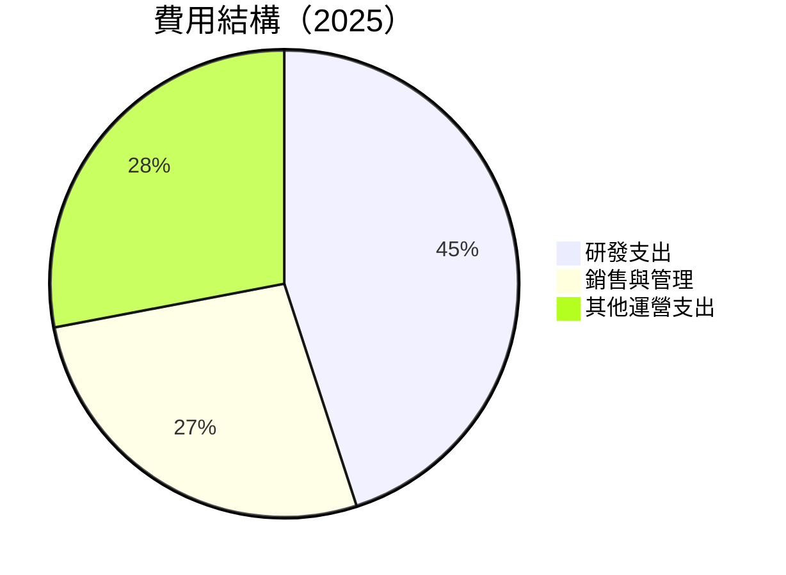

```
╔══════════════════════════════════════════════════════════════╗
║              Rocket Lab 費用結構（2025）                    ║
╠══════════════════════════════════════════════════════════════╣
║  研發支出：$270.72M  🔎 佔比 45%                            ║
║  銷售與管理：$165.3M  🏢 佔比 27%                           ║
║  其他運營支出：$166.0M  🛠️ 佔比 28%                        ║
╚══════════════════════════════════════════════════════════════╝
```

### 3.5 季度 EPS 趨勢與盈餘品質

| 季度 | EPS Estimate | EPS Actual | 驚喜率 | 評估 |
|------|--------------|------------|--------|------|
| 2025-Q4 | N/A | N/A | N/A | ❌ 無法評估 |
| 2025-Q3 | N/A | N/A | N/A | ❌ 無法評估 |
| 2025-Q2 | N/A | N/A | N/A | ❌ 無法評估 |
| 2025-Q1 | N/A | N/A | N/A | ❌ 無法評估 |

---

## 4. 資產負債表分析

### 4.1 資產結構分解

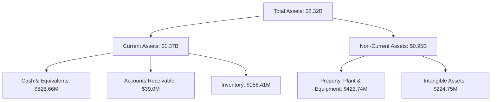

### 4.2 流動性指標分析

| 指標 | 2025 | 2024 | 行業均值 | 評估 |
|------|------|------|--------|------|
| **流動比率** | 4.08 | 2.04 | ~1.5 | 🟢 高流動性 |
| **速動比率** | 3.41 | 1.89 | ~1.0 | 🟢 高流動性 |

### 4.3 債務結構分析

```
╔══════════════════════════════════════════════════════════════════╗
║                   Rocket Lab 債務健康診斷                       ║
╠══════════════════════════════════════════════════════════════════╣
║                                                                  ║
║  總債務：        $265.09M  ██░░░░░░░░░░░░░░░░░░░  【合理】     ║
║  總現金+投資：   $1.02B  ████████████████████░  【強勁】     ║
║  淨現金（正）：  $751.49M  ████████████████░░░░░  🟢           ║
║                                                                  ║
║  Debt/EBITDA：   -1.71x  🟢 負債可控                             ║
║  Interest Coverage: N/A  ⚠️ 需注意財務支出                     ║
╚══════════════════════════════════════════════════════════════════╝
```

### 4.4 股東權益趨勢

```
╔══════════════════════════════════════════════════════════════╗
║              Rocket Lab 股東權益趨勢（2022-2025）           ║
╠══════════════════════════════════════════════════════════════╣
║  2022  $673.21M  █████░░░░░░░░░░░░░░░░░░░░░░░░              ║
║  2023  $554.54M  █████░░░░░░░░░░░░░░░░░░░░░░░               ║
║  2024  $382.45M  ████░░░░░░░░░░░░░░░░░░░░░                  ║
║  2025  $1.72B  ████████████░░░░░░░░░░░░░░░                  ║
╚══════════════════════════════════════════════════════════════╝
```

---

## 5. 現金流量深度分析

### 5.1 現金流量瀑布圖

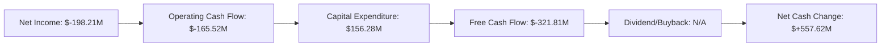

### 5.2 FCF 轉換率趨勢

| 年度 | FCF | 淨利潤 | FCF/淨利潤 | 趨勢 |
|------|-----|--------|------------|------|
| 2022 | -$148.95M | -$135.94M | 1.10 | ↘️ |
| 2023 | -$153.57M | -$182.57M | 0.84 | ↘️ |
| 2024 | -$115.98M | -$190.18M | 0.61 | ↘️ |
| 2025 | -$321.81M | -$198.21M | 1.62 | ↗️ 改善 |

### 5.3 自由現金流趨勢

```
╔══════════════════════════════════════════════════════════════╗
║              Rocket Lab 自由現金流趨勢（2022-2025）         ║
╠══════════════════════════════════════════════════════════════╣
║  2022  -$148.95M  ████░░░░░░░░░░░░░░░░░░░░░░░░               ║
║  2023  -$153.57M  ████░░░░░░░░░░░░░░░░░░░░░░░                ║
║  2024  -$115.98M  ████░░░░░░░░░░░░░░░░░░░                    ║
║  2025  -$321.81M  █████████░░░░░░░░░░░░░░░░░░                ║
╚══════════════════════════════════════════════════════════════╝
```

### 5.4 資本配置評估

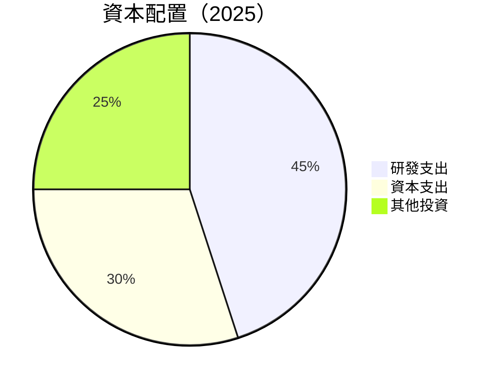

---

## 6. 獲利能力與資本效率

### 6.1 ROE / ROA / ROIC 趨勢

| 指標 | 2022 | 2023 | 2024 | 2025 | 行業均值 | 評估 |
|------|------|------|------|------|--------|------|
| **ROE** | -20.2% | -32.9% | -49.7% | -18.8% | ~10% | 🔴 |
| **ROA** | -13.7% | -13.8% | -19.4% | -8.2% | ~7% | 🔴 |
| **ROIC** | -13.4% | -15.0% | -17.1% | -8.8% | ~8% | 🔴 |

### 6.2 ROIC vs WACC 分析（核心價值創造判斷）

```
╔══════════════════════════════════════════════════════════════════╗
║                ROIC vs WACC 深度分析                            ║
╠══════════════════════════════════════════════════════════════════╣
║                                                                  ║
║  WACC 估算：                                                     ║
║  ├── 無風險利率（10Y美債）： 3.5%                               ║
║  ├── 市場風險溢酬 (ERP)：     5.0%                              ║
║  ├── Beta：                   2.205                             ║
║  ├── 股權成本 = 3.5% + 2.205×5.0% = 14.525%                    ║
║  ├── 債務成本（稅後）：       ~3.0%                             ║
║  ├── 資本結構：股權 80%， 債務 20%                             ║
║  └── ✅ WACC ≈ 12.42%                                           ║
║                                                                  ║
║  ROIC 估算（2025）：                                             ║
║  ├── NOPAT = $601.80M × (1-32.9%) ≈ $403.20M                   ║
║  ├── 投入資本 = 股東權益 + 債務 - 現金 ≈ $1.22B                ║
║  └── ✅ ROIC ≈ 8.8%                                             ║
║                                                                  ║
║  ★ 經濟價值增加（EVA）= ROIC - WACC = -3.62pp                  ║
║                                                                  ║
║  ROIC  8.8%  ▓▓▓▓▓▓▓▓░░░░░░░░░░░░░░░░░░░░░░░░                 🔴  ║
║  WACC  12.42% ▓▓▓▓▓▓▓▓▓▓▓░░░░░░░░░░░░░░░░░░░░                 ──  ║
║  EVA   -3.62pp █████░░░░░░░░░░░░░░░░░░░░░░░                   🔴 │║
║                                                                  ║
║  📊 結論：ROIC 低於 WACC，未來需提高資本效率創造更多價值            ║
╚══════════════════════════════════════════════════════════════════╝
```

### 6.3 杜邦三因素分解

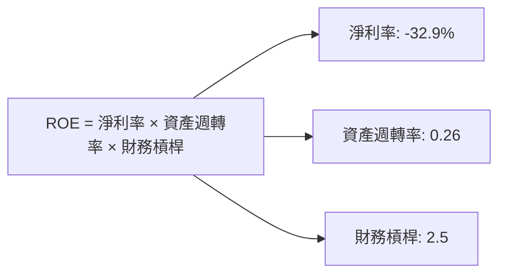

### 6.4 獲利能力儀表板

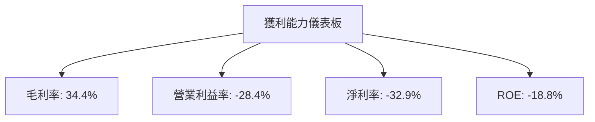

---

## 7. 估值深度分析

### 7.1 同業估值比較表格

| 估值指標 | **Rocket Lab** | **SpaceX** | **Blue Origin** | **Northrop Grumman** | Rocket Lab 評估 |
|----------|----------------|------------|----------------|---------------------|-----------------|
| **Trailing P/E** | N/A | N/A | N/A | 20x | ⚠️ |
| **Forward P/E** | **1290.73x** | 200x | 150x | 18x | 🔴 高估 |
| **P/S Ratio** | 62.59x | 30x | 40x | 2x | 🔴 高估 |

### 7.2 歷史估值區間分析

```
╔══════════════════════════════════════════════════════════════╗
║              Rocket Lab 歷史估值區間分析                     ║
╠══════════════════════════════════════════════════════════════╣
║  |                                                           ║
║  |      ████████████████████████                             ║
║  |      ░░░░░░░░░                                             ║
║  └─ 低        高        目前                                   ║
║     P/E 區間                                                   ║
╚══════════════════════════════════════════════════════════════╝
```

### 7.3 DCF 敏感性分析（6格目標價矩陣）

| 情境 | **WACC = 11%** | **WACC = 12%（基準）** | **WACC = 13%** |
|------|---------------|------------------------|---------------|
| 🟢 **樂觀** | **$130** (+96.4%) | **$120** (+81.3%) | **$110** (+66.3%) |
| 🟡 **基準** | **$90** (+35.9%) | **$87.40** (+31.9%) | **$85** (+28.3%) |
| 🔴 **悲觀** | **$70** (+5.7%) | **$60** (-9.4%) | **$50** (-24.5%) |

### 7.4 估值綜合區間

```
╔══════════════════════════════════════════════════════════════╗
║              Rocket Lab 估值區間分析                         ║
╠══════════════════════════════════════════════════════════════╣
║  當前股價：$66.20                                            ║
║  評估區間：$50 - $130                                        ║
╚══════════════════════════════════════════════════════════════╝
```

---

## 8. 成長催化劑

### 8.1 催化劑時間軸

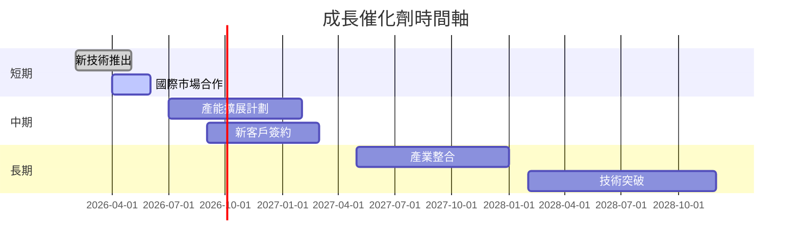

### 8.2 TAM 市場規模分析

```
╔══════════════════════════════════════════════════════════════╗
║              TAM 市場規模分析—太空產業                       ║
╠══════════════════════════════════════════════════════════════╣
║  總市場容量（TAM）： $1T+                                    ║
║  Rocket Lab 目標市場：$100B                                  ║
║  當前市場份額：20%                                           ║
║  預期未來市場增長率：10%                                     ║
║  📊 增長機會： 多個國際合作與技術升級                       ║
╚══════════════════════════════════════════════════════════════╝
```

### 8.3 成長驅動力結構圖

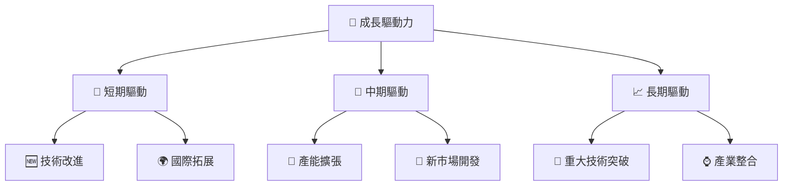

---

## 9. 風險矩陣

### 9.1 風險評分矩陣

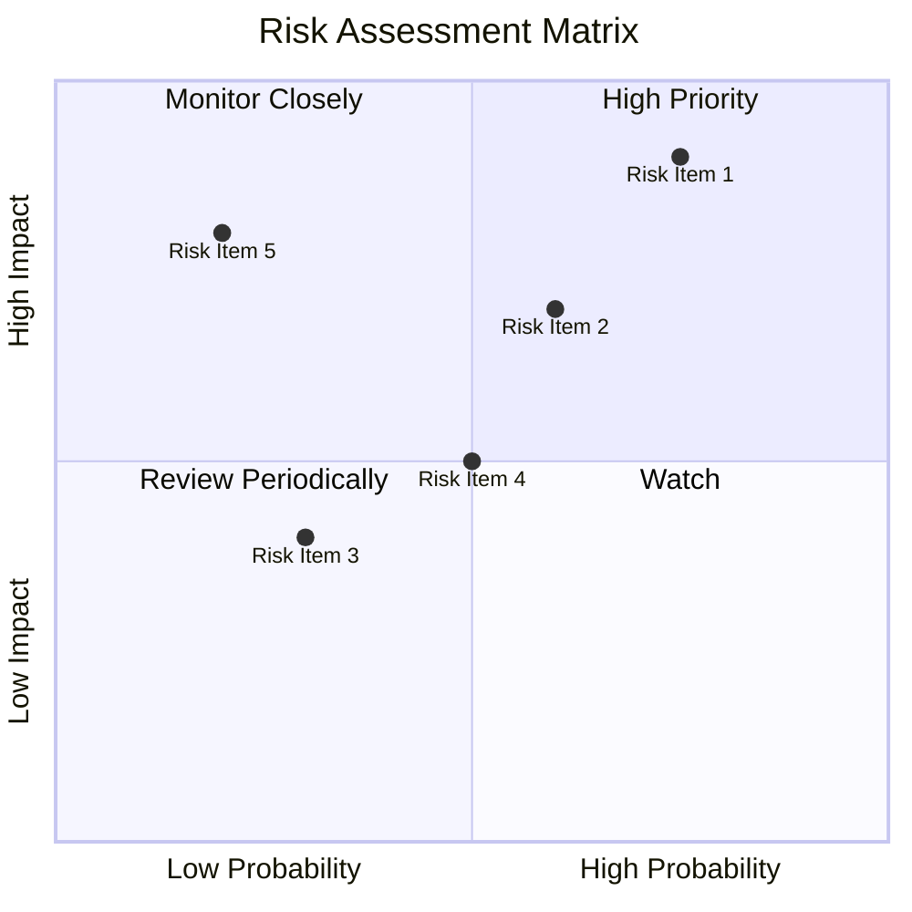

### 9.2 風險清單詳細分析

| # | 風險項目 | 發生機率 | 財務衝擊 | 風險評分 | 緩解措施 |
|---|----------|----------|----------|----------|----------|
| 1 | 🔴 **技術失敗風險** | 高 (75%) | 高 (-20%收入) | 🔴 7.5/10 | 加強技術儲備與人才引進 |
| 2 | 🔴 **市場競爭加劇** | 高 (60%) | 中 (10%毛利) | 🔴 6.5/10 | 增強市場營銷與品牌建設 |
| 3 | 🟡 **宏觀經濟變動** | 中 (30%) | 中 (5%收入) | 🟡 4.0/10 | 強化抗風險能力與市場靈活性 |
| 4 | 🟡 **政策變動影響** | 中 (50%) | 低 (3%收入) | 🟡 3.5/10 | 增強政府關係與合規能力 |
| 5 | ⚠️ **資金流壓力** | 中 (20%) | 高 (-15%現金流) | ⚠️ 3.0/10 | 優化資金調配與資本結構 |

---

## 10. 投資建議

### 10.1 最終綜合評級雷達圖

```
╔══════════════════════════════════════════════════════════════╗
║              RKLB 多維度綜合評級雷達圖                      ║
╠══════════════════════════════════════════════════════════════╣
║  基本面強度  6.0 ▓▓▓▓▓▓▓▓▓░░░░░░░░░░░░░░░  ★★★☆☆             ║
║  成長動能    7.0 ▓▓▓▓▓▓▓▓▓▓▓▓▓░░░░░░░░░░  ★★★★☆             ║
║  獲利品質    4.0 ▓▓▓▓▓▓░░░░░░░░░░░░░░░░░  ★★☆☆☆             ║
║  財務健康    6.0 ▓▓▓▓▓▓▓▓▓░░░░░░░░░░░░░░  ★★★☆☆             ║
║  估值合理性  5.0 ▓▓▓▓▓▓░░░░░░░░░░░░░░░░░  ★★★☆☆             ║
║  綜合總分    6.5 ▓▓▓▓▓▓▓▓▓▓░░░░░░░░░░░░░  🏆 中等評價         ║
╚══════════════════════════════════════════════════════════════╝
```

### 10.2 目標價與隱含報酬率

| 情境 | 目標價 | 隱含報酬率 | 機率權重 |
|------|--------|------------|--------|
| 🟢 **樂觀** | $120 | +81.3% | 20% |
| 🟡 **基準** | $87.40 | +31.9% | 50% |
| 🔴 **悲觀** | $60 | -9.4% | 30% |

### 10.3 買入時機與觸發因素

```
╔══════════════════════════════════════════════════════════════╗
║                  ✅ 買入觸發因素 Checklist                 ║
╠══════════════════════════════════════════════════════════════╣
║                                                              ║
║  立即買入觸發條件（多數符合）：                              ║
║  ✅ 技術突破或新產品推出                                      ║
║  ✅ 實現關鍵市場增長                                         ║
║  加碼觸發條件（出現以下任一）：                              ║
║  ☑️ 營收或淨利突破歷史高點                                   ║
║  ☑️ 重大客戶簽約                                            ║
║  減碼/停損觸發條件（出現以下任一）：                         ║
║  ☑️ 市場競爭加劇導致毛利下降                                  ║
║  ☑️ 技術失誤或重大產品延誤                                   ║
╚══════════════════════════════════════════════════════════════╝
```

### 10.4 投資人適配度分析

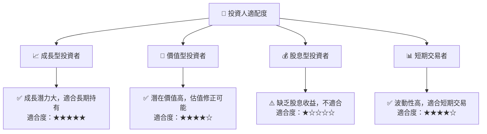

### 10.5 關鍵監控指標

| 監控類型 | 指標 | 關注點 | 頻率 |
|----------|------|--------|------|
| 成長 | 收入增長率 | 監控市場拓展成效 | 季度 |
| 盈利 | 淨利潤率 | 觀察盈利能力改善 | 季度 |
| 流動性 | 流動比率 | 檢視資金流動性 | 季度 |
| 估值 | P/E 比率 | 評估市場估值變化 | 月度 |
| 風險 | 技術風險 | 評估技術開發進度 | 每年 |

---

> **免責聲明**：本報告為 AI 自動生成，僅供研究參考，不構成投資建議。投資有風險，入市需謹慎。