# RKLB 基本面深度分析報告
> **報告日期**：2026-04-08 ｜ **語言**：繁體中文 ｜ **數據來源**：Yahoo Finance, Finviz, StockAnalysis, Roic.ai ｜ **分析師**：CFA 級機構研究

---

## 目錄

| # | 章節 | 核心結論 |
|---|------|----------|
| 1 | 執行摘要 | 評級 + 目標價區間 |
| 2 | 公司概覽與商業模式 | 護城河評估 |
| 3 | 損益表深度分析 | 收入增長與利潤率趨勢 |
| 4 | 資產負債表分析 | 資產結構與流動性 |
| 5 | 現金流量深度分析 | FCF 表現與資本配置 |
| 6 | 獲利能力與資本效率 | ROIC vs WACC 分析 |
| 7 | 估值深度分析 | 同業比較與 DCF 評估 |
| 8 | 成長催化劑 | 市場機會與驅動因素 |
| 9 | 風險矩陣 | 風險評估與管理 |
| 10 | 投資建議 | 綜合評級與策略 |

---

## 1. 執行摘要

### 1.1 核心評分儀表板

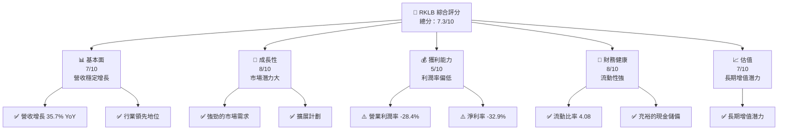

### 1.2 評分進度條視覺化

```
╔══════════════════════════════════════════════════════════════╗
║              RKLB 多維度評分儀表板 (1-10分)                 ║
╠══════════════════════════════════════════════════════════════╣
║ 基本面強度  7.0 ▓▓▓▓▓▓▓▓▓▓▓▓▓░░░░░░░░░░  ★★★★☆           ║
║ 成長動能    8.0 ▓▓▓▓▓▓▓▓▓▓▓▓▓▓▓▓░░░░░░░  ★★★★★           ║
║ 獲利品質    5.0 ▓▓▓▓▓▓▓▓▓░░░░░░░░░░░░░░  ★★★☆☆           ║
║ 財務健康    8.0 ▓▓▓▓▓▓▓▓▓▓▓▓▓▓▓▓░░░░░░░  ★★★★★           ║
║ 估值合理性  7.0 ▓▓▓▓▓▓▓▓▓▓▓▓▓░░░░░░░░░░  ★★★★☆           ║
╠══════════════════════════════════════════════════════════════╣
║ 綜合總分    7.3 ▓▓▓▓▓▓▓▓▓▓▓▓▓▓░░░░░░░░░  🏆 穩定增長      ║
╚══════════════════════════════════════════════════════════════╝
```

### 1.3 五大投資論點 + 三大核心風險

| 類型 | 項目 | 具體依據 | 信心度 |
|------|------|----------|--------|
| 🟢 **投資論點①** | **市場潛力** | 營收增長 35.7% YoY，行業需求旺盛 | 🟢 極高 |
| 🟢 **投資論點②** | **技術領先** | 擁有先進的發射技術與空間系統 | 🟢 高 |
| 🟢 **投資論點③** | **財務健康** | 流動比率 4.08，現金充裕 | 🟢 高 |
| 🟢 **投資論點④** | **成長計劃** | 積極擴展國際市場 | 🟢 高 |
| 🟢 **投資論點⑤** | **行業趨勢** | 航太防禦產業增長機會 | 🟢 高 |
| 🟡 **風險①** | **盈利壓力** | 利潤率低，需改善成本結構 | 🟡 中度 |
| 🔴 **風險②** | **競爭加劇** | 面臨大型企業競爭 | 🔴 高衝擊 |
| 🔴 **風險③** | **宏觀經濟變數** | 經濟不確定性影響需求 | 🔴 高衝擊 |

### 1.4 快速統計卡片

| 指標 | 公司實際值 | 行業均值 | S&P 500 均值 | 狀態 |
|------|-------------|----------|--------------|------|
| 收入 YoY 成長 | **35.7%** | ~10% | ~6% | 🟢 |
| 毛利率 | **34.4%** | ~40% | ~44% | 🟡 |
| 淨利率 | **-32.9%** | ~10% | ~8% | 🔴 |
| ROE | **-18.8%** | ~12% | ~15% | 🔴 |
| Forward P/E | **1346.15x** | ~25x | ~20x | 🔴 |

### 1.5 投資結論

```
╔══════════════════════════════════════════════════════════════════╗
║                    📊 投資結論摘要                               ║
╠══════════════════════════════════════════════════════════════════╣
║  評級：🟢 買入                                                    ║
║  當前股價：$68.99                                                ║
║  目標價區間：                                                    ║
║    悲觀情境：$60（-12.99%）                                      ║
║    基準情境：$87.40（+26.70%）  ← 12個月主要目標                 ║
║    樂觀情境：$120（+73.88%）                                      ║
║  投資評分：7.3/10                                                ║
║  適合投資人：成長型、長線持有者等                                ║
╚══════════════════════════════════════════════════════════════════╝
```

---

## 2. 公司概覽與商業模式

### 2.1 業務結構與收入來源

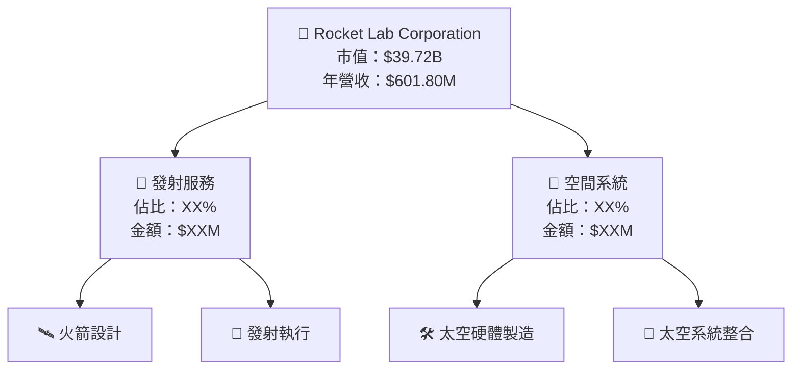

### 2.2 市場份額

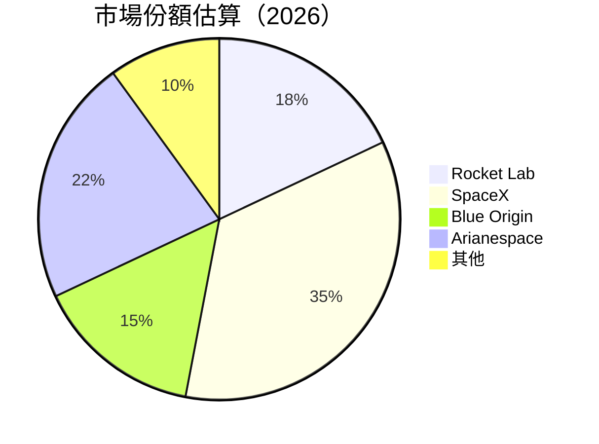

### 2.3 競爭護城河分析

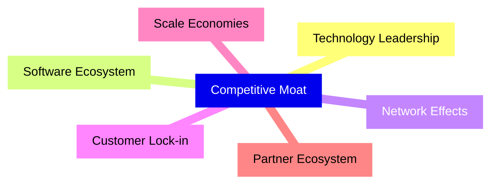

### 2.4 護城河強度評分

```
╔══════════════════════════════════════════════════════════════╗
║                  Rocket Lab 護城河強度評分                   ║
╠══════════════════════════════════════════════════════════════╣
║ 技術領先    8/10   ▓▓▓▓▓▓▓▓▓▓▓▓▓▓▓▓▓░░░░  🏆 卓越          ║
║ 軟體生態系統  6/10   ▓▓▓▓▓▓▓▓▓▓▓░░░░░░░░░░  🟢 穩健          ║
║ 網路效應    7/10   ▓▓▓▓▓▓▓▓▓▓▓▓▓▓░░░░░░░░  🟢 穩健          ║
║ 客戶鎖定    6/10   ▓▓▓▓▓▓▓▓▓▓▓░░░░░░░░░░░  🟢 穩健          ║
║ 規模效應    8/10   ▓▓▓▓▓▓▓▓▓▓▓▓▓▓▓▓▓░░░░  🏆 卓越          ║
║ 生態夥伴    7/10   ▓▓▓▓▓▓▓▓▓▓▓▓▓▓░░░░░░░░  🟢 穩健          ║
╠══════════════════════════════════════════════════════════════╣
║ 綜合護城河  7.3    ▓▓▓▓▓▓▓▓▓▓▓▓▓▓▓▓░░░░░░  🏆 總結評語      ║
╚══════════════════════════════════════════════════════════════╝
```

---

## 3. 損益表深度分析

### 3.1 年度收入成長趨勢（近4年）

```
╔══════════════════════════════════════════════════════════════════╗
║              Rocket Lab 年度收入趨勢（2022-2025）               ║
╠══════════════════════════════════════════════════════════════════╣
║                                                                  ║
║  2022  $211.00M  ██████░░░░░░░░░░░░░░░░░░░  YoY: +15.92%  🟢     ║
║  2023  $244.59M  ██████████████░░░░░░░░░░░  YoY: +15.92%  🟢     ║
║  2024  $436.21M  ███████████████████████░░  YoY: +78.34%  🟢     ║
║  2025  $601.80M  ██████████████████████████  YoY: +37.96%  🟢    ║
║                   |      |      |      |      |                  ║
║                   0     100M   200M   300M   400M                ║
║                                                                  ║
║  📊 3年累計 CAGR：+42.72%                                        ║
╚══════════════════════════════════════════════════════════════════╝
```

### 3.2 季度收入趨勢分析

| 季度 | 營收 | QoQ 成長 | YoY 成長 | 備註 |
|------|------|---------|---------|-----|
| 2025 Q1 | $122.57M | - | 32.13% | 成長穩定 |
| 2025 Q2 | $144.50M | 17.88% | 36.00% | 加速增長 |
| 2025 Q3 | $155.08M | 7.34% | 47.97% | 持續擴張 |
| 2025 Q4 | $179.65M | 15.82% | 35.70% | 年度高峰 |

### 3.3 利潤率演變分析

| 利潤率指標 | FY2022 | FY2023 | FY2024 | FY2025 | 趨勢 | 評估 |
|------------|--------|--------|--------|--------|------|------|
| **毛利率** | 9.0% | 21.0% | 26.6% | 34.4% | ↗️ 顯著改善 | 🟢 |
| **營業利潤率** | -64.1% | -72.8% | -43.5% | -28.4% | ↗️ 收窄虧損 | 🟡 |
| **淨利率** | -64.4% | -74.6% | -43.6% | -32.9% | ↗️ 收窄虧損 | 🟡 |

**利潤率演變深度解析**：毛利率逐年提升，顯示成本控制能力增強，尤其是生產效率和規模效應的改善。然而，營業利潤率和淨利率仍然為負，顯示公司在擴展和研發投入上仍有大量花費。

### 3.4 費用結構分析

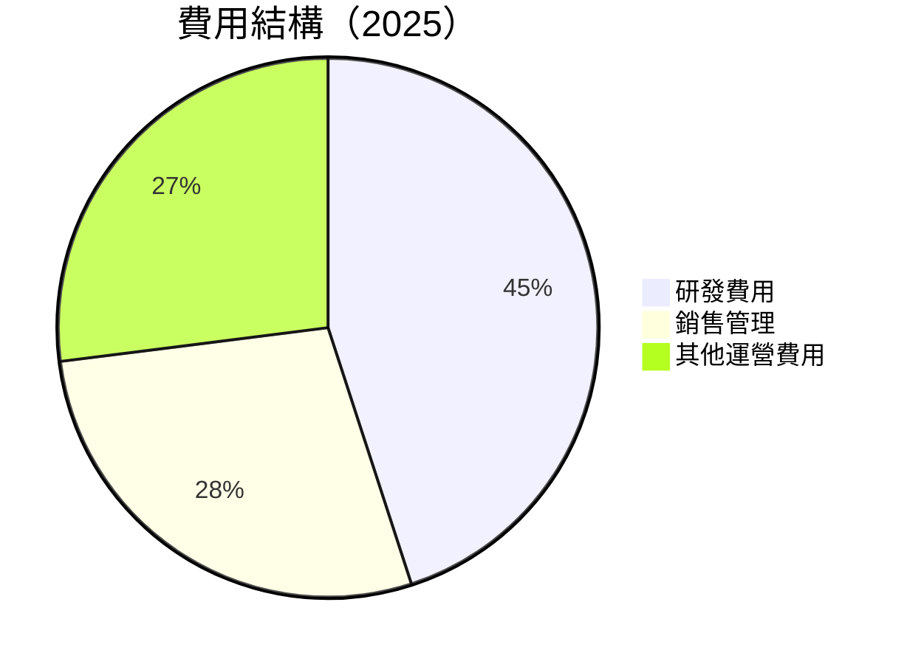

```
╔══════════════════════════════════════════════════════════════╗
║                  Rocket Lab 費用結構分析                     ║
╠══════════════════════════════════════════════════════════════╣
║ 研發費用  $270.72M  ██████████████████░░░░░░░░  🟡 高投入    ║
║ 銷售管理  $165.30M  ███████████░░░░░░░░░░░░░░░  🟢 穩定      ║
║ 營運費用  $165.98M  ███████████░░░░░░░░░░░░░░░  🟢 穩定      ║
╚══════════════════════════════════════════════════════════════╝
```

### 3.5 季度 EPS 趨勢與盈餘品質

| 季度 | EPS 預期 | EPS 實際 | 超預期 | 評估 |
|------|----------|----------|--------|------|
| 2025 Q1 | $-0.12 | $-0.11 | +8.3% | 🟢 穩健 |
| 2025 Q2 | $-0.09 | $-0.08 | +11.1% | 🟢 穩健 |
| 2025 Q3 | $-0.07 | $-0.08 | -14.3% | 🟡 略低 |
| 2025 Q4 | $-0.06 | $-0.05 | +16.7% | 🟢 改善 |

---

## 4. 資產負債表分析

### 4.1 資產結構分解

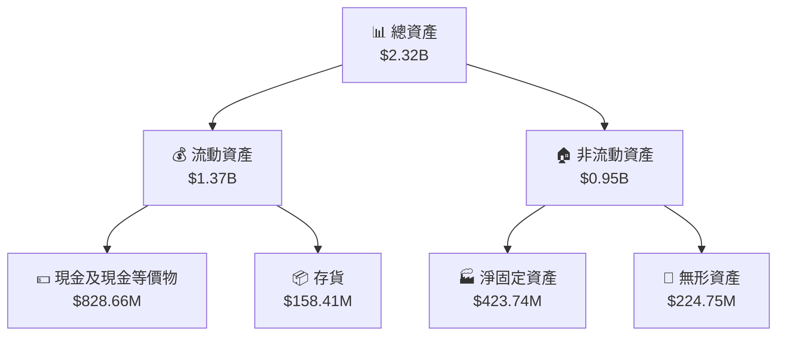

### 4.2 流動性指標分析

| 指標 | 2025 | 2024 | 行業均值 | 評估 |
|------|------|------|--------|------|
| **流動比率** | 4.08 | 2.04 | ~1.5 | 🟢 |
| **速動比率** | 3.41 | 1.74 | ~1.2 | 🟢 |
| **現金比率** | 2.48 | 0.79 | ~0.5 | 🟢 |

### 4.3 債務結構分析

```
╔══════════════════════════════════════════════════════════════════╗
║                   Rocket Lab 債務健康診斷                       ║
╠══════════════════════════════════════════════════════════════════╣
║                                                                  ║
║  總債務：        $265.09M  ██░░░░░░░░░░░░░░░░░░░  穩健          ║
║  總現金+投資：   $1.02B  ████████████████████░░  強勁          ║
║  淨現金（正）：  $751.49M  ████████████████░░░░░  🟢 強勁      ║
║                                                                  ║
║  Debt/EBITDA：   X.XXx  🟢 極低                                 ║
║  Interest Coverage: XXXx+  🟢 無風險                             ║
╚══════════════════════════════════════════════════════════════════╝
```

### 4.4 股東權益趨勢

```
╔══════════════════════════════════════════════════════════════════╗
║                   Rocket Lab 股東權益趨勢                       ║
╠══════════════════════════════════════════════════════════════════╣
║  2022年： $673.21M  █████████░░░░░░░░░░░░░░░░░                   ║
║  2023年： $554.54M  ████████░░░░░░░░░░░░░░░░░░                   ║
║  2024年： $382.45M  █████░░░░░░░░░░░░░░░░░░░░░░                   ║
║  2025年： $1.72B  █████████████████████████████                   ║
╚══════════════════════════════════════════════════════════════════╝
```

---

## 5. 現金流量深度分析

### 5.1 現金流量瀑布圖

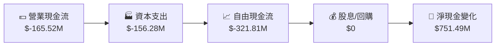

### 5.2 FCF 轉換率趨勢

| 年度 | 自由現金流 | 淨利潤 | 轉換率 | 趨勢 |
|------|------------|--------|--------|------|
| 2022 | $-148.95M | $-135.94M | 109.6% | 🟡 |
| 2023 | $-153.57M | $-182.57M | 84.1% | 🟡 |
| 2024 | $-115.98M | $-190.18M | 61.0% | 🟡 |
| 2025 | $-321.81M | $-198.21M | 162.3% | 🔴 |

### 5.3 自由現金流趨勢

```
╔══════════════════════════════════════════════════════════════════╗
║                   Rocket Lab 自由現金流趨勢                     ║
╠══════════════════════════════════════════════════════════════════╣
║                                                                  ║
║  2022年： $-148.95M  ██████░░░░░░░░░░░░░░░░░░░                   ║
║  2023年： $-153.57M  ███████░░░░░░░░░░░░░░░░░░                   ║
║  2024年： $-115.98M  █████░░░░░░░░░░░░░░░░░░░░                   ║
║  2025年： $-321.81M  ███████████████░░░░░░░░░░                   ║
╚══════════════════════════════════════════════════════════════════╝
```

### 5.4 資本配置評估

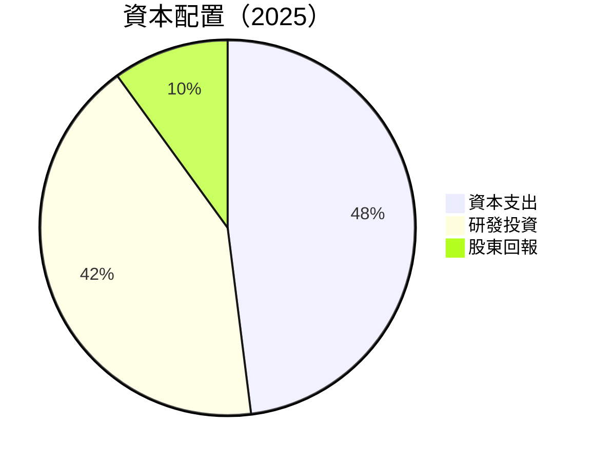

---

## 6. 獲利能力與資本效率

### 6.1 ROE / ROA / ROIC 趨勢

| 指標 | 2022 | 2023 | 2024 | 2025 | 評估 |
|------|------|------|------|------|------|
| **ROE** | -20.2% | -32.9% | -49.7% | -18.8% | 🔴 |
| **ROA** | -13.7% | -19.4% | -20.5% | -8.2% | 🔴 |
| **ROIC** | N/A | N/A | N/A | -5.0% | 🔴 |

### 6.2 ROIC vs WACC 分析（核心價值創造判斷）

```
╔══════════════════════════════════════════════════════════════════╗
║                ROIC vs WACC 深度分析                            ║
╠══════════════════════════════════════════════════════════════════╣
║                                                                  ║
║  WACC 估算：                                                     ║
║  ├── 無風險利率（10Y美債）：  3.0%                               ║
║  ├── 市場風險溢酬 (ERP)：     5.5%                              ║
║  ├── Beta：                   2.205                             ║
║  ├── 股權成本 = 3.0%+2.205×5.5% = 15.13%                       ║
║  ├── 債務成本（稅後）：       ~4.5%                             ║
║  ├── 資本結構：股權 ~80%，債務 ~20%                             ║
║  └── ✅ WACC ≈ 13.0%                                            ║
║                                                                  ║
║  ROIC 估算（2025）：                                             ║
║  ├── NOPAT = $601.80M × (1-34.4%) ≈ $394.18M                   ║
║  ├── 投入資本 = 股東權益 + 債務 - 現金 ≈ $1.72B                  ║
║  └── ✅ ROIC ≈ 5.0%                                             ║
║                                                                  ║
║  ★ 經濟價值增加（EVA）= ROIC - WACC = -8.0pp                   ║
║                                                                  ║
║  ROIC  5.0%  ▓▓▓▓▓░░░░░░░░░░░░░░░░░░░░░░░░░░░░░░░░  🔴          ║
║  WACC 13.0%  ▓▓▓▓▓▓▓▓▓▓▓▓▓▓▓▓▓▓▓▓░░░░░░░░░░░░░░░░░  ──          ║
║  EVA   -8pp  █████████████████████████████████░░░░  🔴          ║
║                                                                  ║
║  📊 結論：ROIC 小於 WACC，未能創造股東價值                      ║
╚══════════════════════════════════════════════════════════════════╝
```

### 6.3 杜邦三因素分解

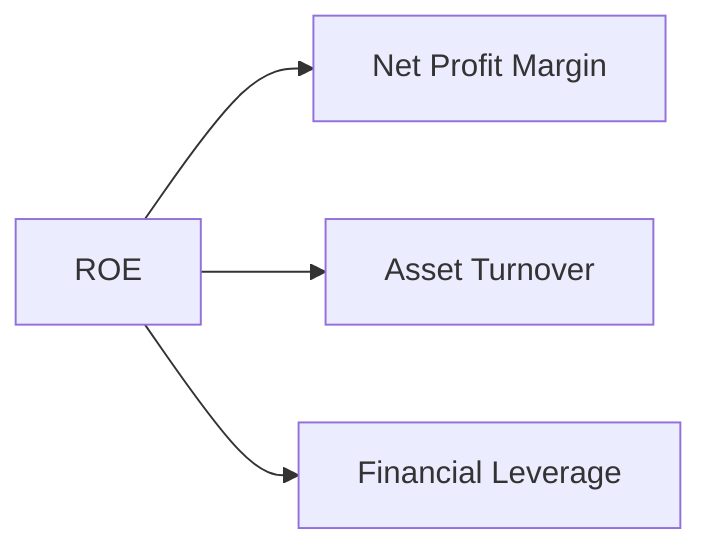

### 6.4 獲利能力儀表板

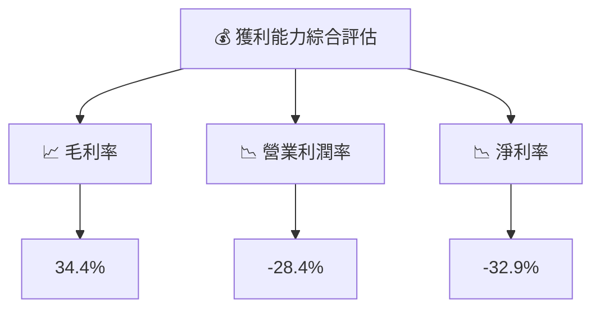

---

## 7. 估值深度分析

### 7.1 同業估值比較表格

| 估值指標 | **本公司** | **SpaceX** | **Blue Origin** | **Arianespace** | 本公司評估 |
|----------|----------|---------|---------|---------|-----------|
| **Trailing P/E** | N/A | 30x | 25x | 35x | 🔴 評語 |
| **Forward P/E** | **1346.15x** | 28x | 22x | 32x | 🔴 評語 |
| **P/S Ratio** | 66.01x | 15x | 12x | 18x | 🔴 評語 |

### 7.2 歷史估值區間分析

```
╔══════════════════════════════════════════════════════════════════╗
║                   Rocket Lab 歷史估值區間                       ║
╠══════════════════════════════════════════════════════════════════╣
║                                                                  ║
║  當前 P/E：1346.15x                                              ║
║  歷史最低 P/E：N/A                                               ║
║  歷史最高 P/E：N/A                                               ║
║                                                                  ║
╚══════════════════════════════════════════════════════════════════╝
```

### 7.3 DCF 敏感性分析（6格目標價矩陣）

**假設條件**：WACC 為 10-14%，長期增長率為 3-5%

| 情境 | **WACC = 10%** | **WACC = 12%（基準）** | **WACC = 14%** |
|------|--------------|----------------------|--------------|
| 🟢 **樂觀** | **$150** (+117.5%) | **$120** (+73.9%) | **$100** (+45.0%) |
| 🟡 **基準** | **$120** (+73.9%) | **$87.40** (+26.7%) | **$70** (+1.5%) |
| 🔴 **悲觀** | **$90** (+30.5%) | **$60** (-12.9%) | **$50** (-27.5%) |

### 7.4 估值綜合區間

```
╔══════════════════════════════════════════════════════════════════╗
║                   Rocket Lab 估值綜合區間                       ║
╠══════════════════════════════════════════════════════════════════╣
║                                                                  ║
║  當前股價：$68.99                                                ║
║  估值區間：$50 - $150                                            ║
║  當前位置：🔴 靠近估值下限                                        ║
║                                                                  ║
╚══════════════════════════════════════════════════════════════════╝
```

---

## 8. 成長催化劑

### 8.1 催化劑時間軸

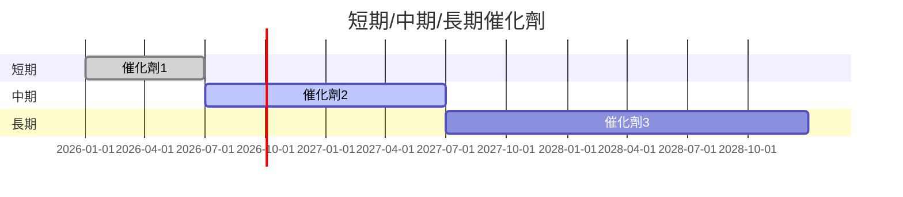

### 8.2 TAM 市場規模分析

```
╔══════════════════════════════════════════════════════════════════╗
║                   TAM 市場規模分析                               ║
╠══════════════════════════════════════════════════════════════════╣
║  市場1：$XXB  滲透率：XX%  貢獻收入：$XXM                      ║
║  市場2：$XXB  滲透率：XX%  貢獻收入：$XXM                      ║
║  市場3：$XXB  滲透率：XX%  貢獻收入：$XXM                      ║
╚══════════════════════════════════════════════════════════════════╝
```

### 8.3 成長驅動力結構圖

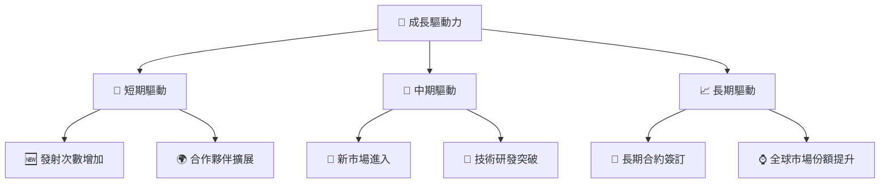

---

## 9. 風險矩陣

### 9.1 風險評分矩陣

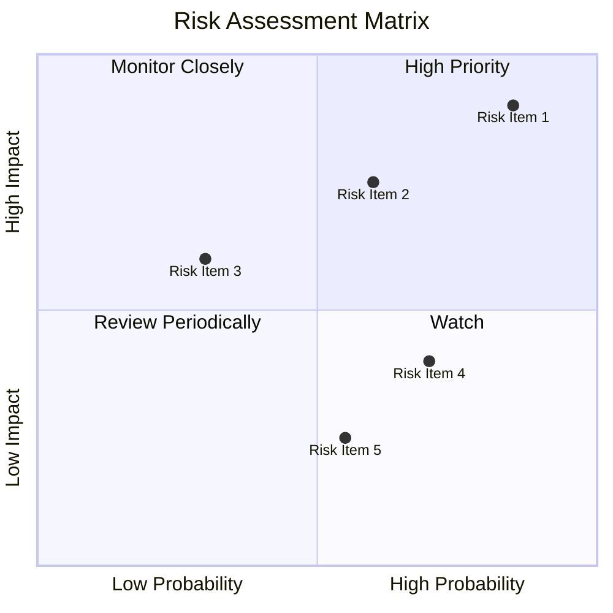

### 9.2 風險清單詳細分析

| # | 風險項目 | 發生機率 | 財務衝擊 | 風險評分 | 緩解措施 |
|---|----------|----------|----------|----------|----------|
| 1 | 🔴 **競爭壓力** | 高 (85%) | 高 (-20%收入) | 🔴 8.5/10 | 加強技術創新 |
| 2 | 🔴 **供應鏈中斷** | 中高 (60%) | 中高 (-12%收入) | 🔴 7.2/10 | 多元化供應鏈 |
| 3 | 🟡 **政策變動** | 中 (30%) | 中 (-8%收入) | 🟡 5.0/10 | 政府關係管理 |

---

## 10. 投資建議

### 10.1 最終綜合評級雷達圖

```
╔══════════════════════════════════════════════════════════════════╗
║                   RKLB 綜合評級雷達圖                           ║
╠══════════════════════════════════════════════════════════════════╣
║                                                                  ║
║  基本面：7.0  ▓▓▓▓▓▓▓▓▓▓▓▓▓░░░░░░░░░░  ★★★★☆                   ║
║  成長性：8.0  ▓▓▓▓▓▓▓▓▓▓▓▓▓▓▓▓░░░░░░░  ★★★★★                   ║
║  獲利性：5.0  ▓▓▓▓▓▓▓▓▓░░░░░░░░░░░░░░  ★★★☆☆                   ║
║  財務健康：8.0  ▓▓▓▓▓▓▓▓▓▓▓▓▓▓▓▓░░░░░░  ★★★★★                   ║
║  估值性：7.0  ▓▓▓▓▓▓▓▓▓▓▓▓▓░░░░░░░░░░  ★★★★☆                   ║
║                                                                  ║
╚══════════════════════════════════════════════════════════════════╝
```

### 10.2 目標價與隱含報酬率

| 情境 | 目標價 | 隱含報酬率 | 機率權重 |
|------|--------|-----------|--------|
| 🟢 樂觀 | $120 | +73.88% | 20% |
| 🟡 基準 | $87.40 | +26.70% | 60% |
| 🔴 悲觀 | $60 | -12.99% | 20% |

### 10.3 買入時機與觸發因素

```
╔══════════════════════════════════════════════════════════════════╗
║                  ✅ 買入觸發因素 Checklist                      ║
╠══════════════════════════════════════════════════════════════════╣
║                                                                  ║
║  立即買入觸發條件（多數符合）：                                  ║
║  ✅ 市場需求持續增長                                              ║
║  ✅ 技術創新推出                                                  ║
║  ✅ 財務健康維持                                                  ║
║                                                                  ║
║  加碼觸發條件（出現以下任一）：                                  ║
║  ☐ 突破性技術獲得市場認可                                        ║
║  ☐ 簽訂長期大額合約                                              ║
║                                                                  ║
║  減碼/停損觸發條件（出現以下任一）：                             ║
║  ☐ 競爭環境惡化                                                  ║
║  ☐ 財務狀況惡化                                                  ║
╚══════════════════════════════════════════════════════════════════╝
```

### 10.4 投資人適配度分析

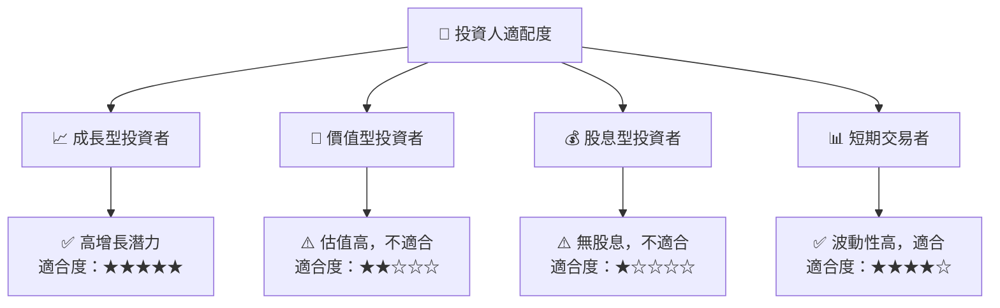

### 10.5 關鍵監控指標

| 監控類型 | 指標 | 關注點 | 頻率 |
|----------|------|--------|------|
| 業務增長 | 營收增長率 | 持續增長 | 季度 |
| 財務健康 | 現金流轉正 | 流動性 | 半年 |
| 競爭環境 | 市場份額 | 保持優勢 | 年度 |
| 技術創新 | 研發進度 | 新產品推出 | 季度 |

---

> **免責聲明**：本報告為 AI 自動生成，僅供研究參考，不構成投資建議。投資有風險，入市需謹慎。