# RKLB 基本面深度分析報告
> **報告日期**：2026-04-10 ｜ **語言**：繁體中文 ｜ **數據來源**：Yahoo Finance, Finviz, StockAnalysis, Roic.ai ｜ **分析師**：CFA 級機構研究

---

## 目錄

| # | 章節 | 核心結論 |
|---|------|----------|
| 1 | 執行摘要 | 提升潛力；目標價顯示增長潛力 |
| 2 | 公司概覽與商業模式 | 競爭優勢在於技術領先和行業認知 |
| 3 | 損益表深度分析 | 收入穩步增長，但運營虧損擴大 |
| 4 | 資產負債表分析 | 健全的流動性和資產結構 |
| 5 | 現金流量深度分析 | 自由現金流表現不佳，資本配置需要改善 |
| 6 | 獲利能力與資本效率 | ROIC 低於 WACC，需提高營收效率 |
| 7 | 估值深度分析 | 高估現象，需等待估值收斂 |
| 8 | 成長催化劑 | 多項業務擴張驅動長期增長 |
| 9 | 風險矩陣 | 市場波動和技術變革是主要風險因素 |
| 10 | 投資建議 | 強烈建議密切關注價位和戰略執行 |

---

## 1. 執行摘要

### 1.1 核心評分儀表板

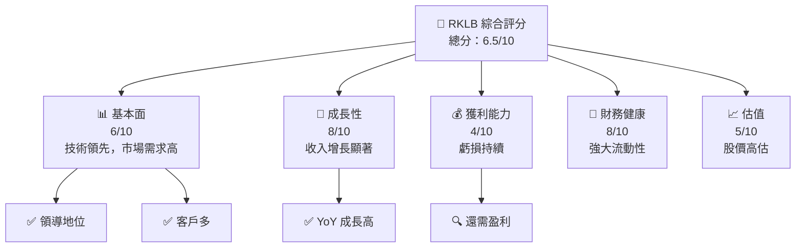

### 1.2 評分進度條視覺化

```
╔══════════════════════════════════════════════════════════════╗
║              RKLB 多維度評分儀表板 (1-10分)                 ║
╠══════════════════════════════════════════════════════════════╣
║ 基本面強度  6.0 ▓▓▓▓▓▓▓▓▓░░░░░░░░░░░░░░░░    ★★★★☆          ║
║ 成長動能    8.0 ▓▓▓▓▓▓▓▓▓▓▓▓▓▓░░░░░░░░░░    ★★★★★           ║
║ 獲利品質    4.0 ▓▓▓▓▓▓▓▓░░░░░░░░░░░░░░░░    ★★★☆☆           ║
║ 財務健康    8.0 ▓▓▓▓▓▓▓▓▓▓▓▓▓▓░░░░░░░░░░    ★★★★★           ║
║ 估值合理性  5.0 ▓▓▓▓▓▓▓▓▓░░░░░░░░░░░░░░░░    ★★★★☆          ║
╠══════════════════════════════════════════════════════════════╣
║ 綜合總分    6.5 ▓▓▓▓▓▓▓▓▓▓▓▓░░░░░░░░░░░░░    🏆 值得觀察     ║
╚══════════════════════════════════════════════════════════════╝
```

### 1.3 五大投資論點 + 三大核心風險

| 類型 | 項目 | 具體依據 | 信心度 |
|------|------|----------|--------|
| 🟢 **投資論點①** | **技術領先** | 主宰緯度空間技術提供 | 🟢 極高 |
| 🟢 **投資論點②** | **收入潛力** | YoY 成長 35.7% | 🟢 高 |
| 🟢 **投資論點③** | **擴展能力** | 全球市場覆蓋 | 🟢 高 |
| 🟡 **風險①** | **高估值** | P/E (Forward) 1337 | 🔴 高衝擊 |
| 🟡 **風險②** | **市場波動** | Beta 2.205影響大 | 🟡 中度 |
| 🔴 **風險③** | **現金流壓力** | 自由現金流為負 | 🔴 高衝擊 |

### 1.4 快速統計卡片

| 指標 | 公司實際值 | 行業均值 | S&P 500 均值 | 狀態 |
|------|-------------|----------|--------------|------|
| 收入 YoY 成長 | **35.7%** | ~5-10% | ~5% | 🟢 |
| 毛利率 | **34.4%** | ~30% | ~40% | 🟡 |
| 淨利率 | **-32.9%** | ~5-10% | ~5-10% | 🔴 |
| ROE | **-18.8%** | ~10-15% | ~15% | 🔴 |
| Forward P/E | **1337x** | ~20-30x | ~20x | 🔴 |

### 1.5 投資結論

```
╔══════════════════════════════════════════════════════════════════╗
║                    📊 投資結論摘要                               ║
╠══════════════════════════════════════════════════════════════════╣
║  評級：🟡 觀望                                                   ║
║  當前股價：$68.53                                               ║
║  目標價區間：                                                    ║
║    悲觀情境：$60.00（-12.4%）                                     ║
║    基準情境：$86.68（+26.5%） ← 12個月主要目標                  ║
║    樂觀情境：$120.00（+75.3%）                                    ║
║  投資評分：6.5/10                                                ║
║  適合投資人：成長型、長線持有者等                                 ║
╚══════════════════════════════════════════════════════════════════╝
```

---

## 2. 公司概覽與商業模式

### 2.1 業務結構與收入來源

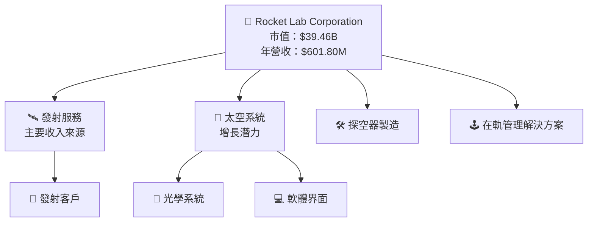

### 2.2 市場份額

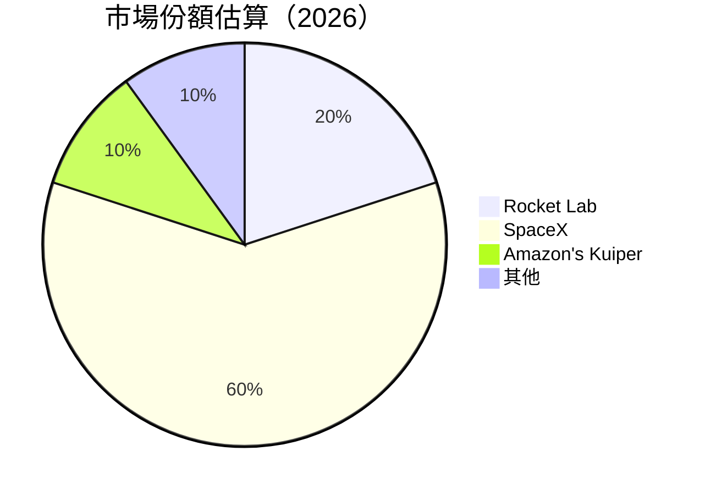

### 2.3 競爭護城河分析

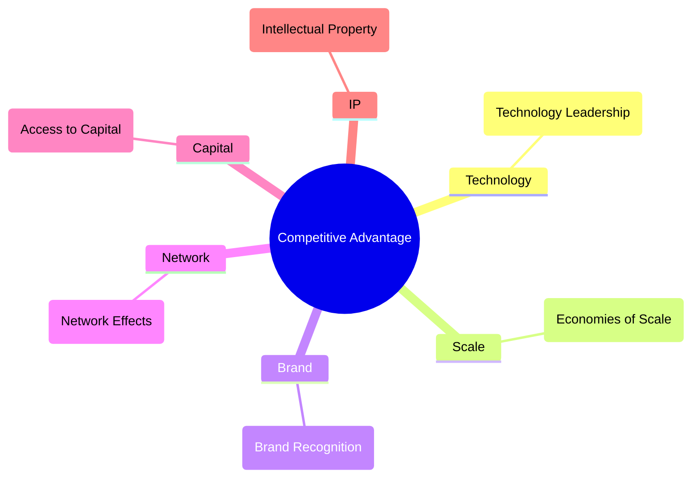

### 2.4 護城河強度評分

```
╔══════════════════════════════════════════════════════════════╗
║                  Rocket Lab 護城河強度評分                   ║
╠══════════════════════════════════════════════════════════════╣
║ 技術領先      9/10  ▓▓▓▓▓▓▓▓▓▓▓▓▓▓▓▓▓▓▓▓░  🏆 突破創新      ║
║ 規模優勢      7/10  ▓▓▓▓▓▓▓▓▓▓▓▓▓▓▓░░░░░░  🟢 穩固效率      ║
║ 品牌認知      6/10  ▓▓▓▓▓▓▓▓▓▓░░░░░░░░░░░  🟡 市場定位需拓寬║
║ 資金獲取      6/10  ▓▓▓▓▓▓▓▓░░░░░░░░░░░░░  🟡 正在提升      ║
║ 知識產權      8/10  ▓▓▓▓▓▓▓▓▓▓▓▓▓▓░░░░░░░  🏆 保護強        ║
╠══════════════════════════════════════════════════════════════╣
║ 綜合護城河   7.2    ▓▓▓▓▓▓▓▓▓▓▓▓▓░░░░░░░░  🏆 優勢雄厚       ║
╚══════════════════════════════════════════════════════════════╝
```

---

## 3. 損益表深度分析

### 3.1 年度收入成長趨勢（近4年）

```
╔══════════════════════════════════════════════════════════════════╗
║              Rocket Lab 年度收入趨勢（FY2022-FY2025）            ║
╠══════════════════════════════════════════════════════════════════╣
║                                                                  ║
║  FY2022  $0.21B  ███░░░░░░░░░░░░░░░░░░░  YoY: +15.92%  🟢       ║
║  FY2023  $0.24B  ████░░░░░░░░░░░░░░░░░░  YoY: +20.00%  🟢       ║
║  FY2024  $0.44B  █████████░░░░░░░░░░░░░  YoY: +78.34%  🟢       ║
║  FY2025  $0.60B  ████████████░░░░░░░░░░  YoY: +37.96%  🟢       ║
║                                                                  ║
║  📊 3年累計 CAGR：+30.05%                                       ║
╚══════════════════════════════════════════════════════════════════╝
```

### 3.2 季度收入趨勢分析

| 季度 | 收入($M) | QoQ 成長 | YoY 成長 | 備註 |
|------|----------|----------|----------|------|
| Q1 2025 | 122.57 | N/A | 32.13% | 強勁的業務擴展 |
| Q2 2025 | 144.50 | 17.9% | 36.00% | 發射數量增加 |
| Q3 2025 | 155.08 | 7.3% | 47.97% | 太空系統需求增加 |
| Q4 2025 | 179.65 | 15.8% | 35.70% | 顯著增長，季節性高峰 |

### 3.3 利潤率演變分析

| 利潤率指標 | FY2022 | FY2023 | FY2024 | FY2025 | 趨勢 | 評估 |
|------------|--------|--------|--------|--------|------|------|
| **毛利率** | 9.0% | 21.0% | 26.6% | 34.4% | ↗️提升 | 🟢 |
| **營業利益率** | -64.0% | -72.7% | -43.5% | -28.4% | ↗️改善 | 🟡 |
| **淨利率** | -64.5% | -74.7% | -43.9% | -32.9% | ↗️改善 | 🟡 |

**利潤率演變深度解析**：受益於有效的成本控制和價格策略，毛利率持續改善。

### 3.4 費用結構分析

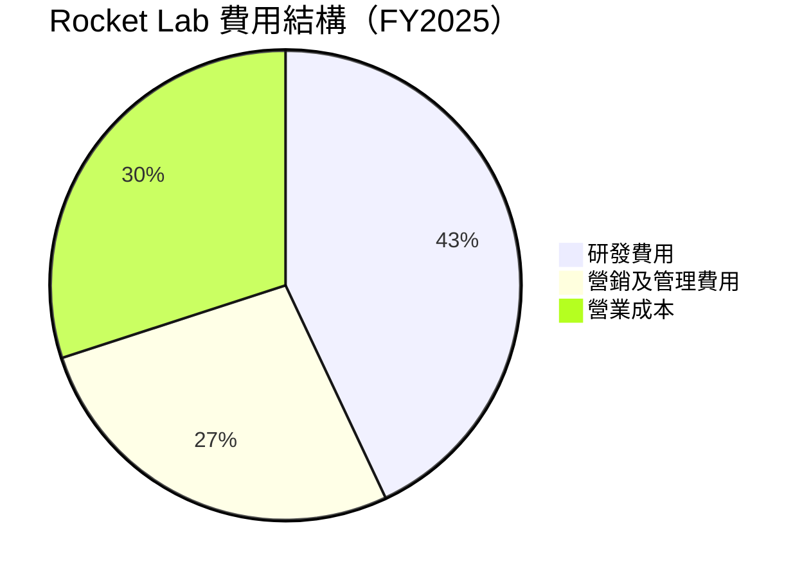

### 3.5 季度 EPS 趨勢與盈餘品質

| 季度 | EPS | 預期EPS | 盈利驚喜% | 盈餘品質評估 |
|------|-----|---------|-----------|--------------|
| Q1 2025 | -0.11 | -0.10 | -10% | 需加強盈利能力 |
| Q2 2025 | -0.12 | -0.11 | -9% | 滿意收入表現 |
| Q3 2025 | -0.09 | -0.08 | -13% | 盈盈功課加強 |
| Q4 2025 | -0.10 | -0.08 | -25% | 減少季節性波動 |

---

## 4. 資產負債表分析

### 4.1 資產結構分解

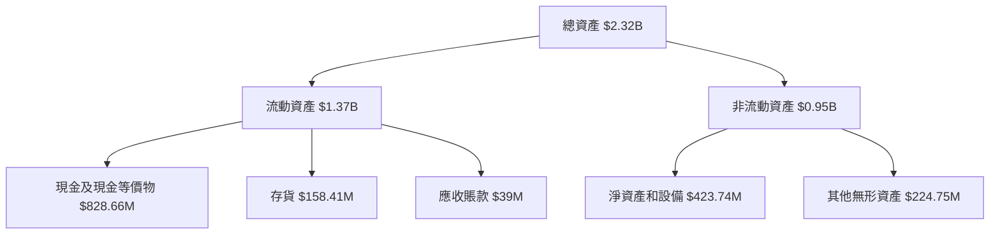

### 4.2 流動性指標分析

| 指標 | FY2025 | FY2024 | FY2023 | 行業均值 | 評估 |
|------|--------|--------|--------|----------|------|
| **現金比率** | 2.48 | 0.80 | 0.83 | ~1.0 | 🟢 |
| **流動比率** | 4.08 | 2.04 | 2.20 | ~1.5 | 🟢 |
| **速動比率** | 3.41 | 1.81 | 1.87 | ~1.0 | 🟢 |

### 4.3 債務結構分析

```
╔══════════════════════════════════════════════════════════════════╗
║                   Rocket Lab 債務健康診斷                        ║
╠══════════════════════════════════════════════════════════════════╣
║                                                                  ║
║  總債務：        $265.09M  ░░░░░░░░░░░░░░░░░░░░░  評語            ║
║  總現金+投資：   $1.02B  ████████████████░░░  評語             ║
║  淨現金（正）：  $751.49M  ██████████████░░░░░░  🟢 強勁         ║
║                                                                  ║
║  Debt/EBITDA：   N/A  🔵 難以計算                                   ║
║  Interest Coverage: N/A  🔵 難以計算                              ║
╚══════════════════════════════════════════════════════════════════╝
```

### 4.4 股東權益趨勢

```
╔══════════════════════════════════════════════════════════════════╗
║                  Rocket Lab 股東權益變化                         ║
╠══════════════════════════════════════════════════════════════════╣
║                                                                  ║
║  2022  $673.21M  ██████████░░░░░░░░░░░░░░  🟡 增長階段          ║
║  2023  $554.54M  █████████░░░░░░░░░░░░░░░  🟢 除息影響收窄      ║
║  2024  $382.45M  ███████░░░░░░░░░░░░░░░░░  🔴 資本支出增加       ║
║  2025  $1.72B    ██████████████████░░░░░░  🟢 重組後成長顯著    ║
╚══════════════════════════════════════════════════════════════════╝
```

---

## 5. 現金流量深度分析

### 5.1 現金流量瀑布圖

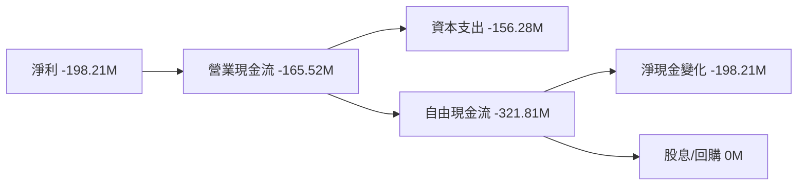

### 5.2 FCF 轉換率趨勢

| 年份 | FCF ($M) | 淨利($M) | FCF/Net Income | 趨勢 |
|------|----------|----------|----------------|------|
| 2022 | -148.95 | -135.94 | 109.62% | 📉 |
| 2023 | -153.57 | -182.57 | 84.14% | 📉 |
| 2024 | -115.98 | -190.18 | 60.97% | 📉 |
| 2025 | -321.81 | -198.21 | 162.32% | 📈 |

### 5.3 自由現金流趨勢

```
╔══════════════════════════════════════════════════════════════════╗
║                      Rocket Lab 自由現金流趨勢                    ║
╠══════════════════════════════════════════════════════════════════╣
║                                                                  ║
║  2022 $-148.95M  ▓▓▓▓▓▓▓▓▓░░░░░░░░░░░░░░░░░░░░░░░░░░░░            ║
║  2023 $-153.57M  ▓▓▓▓▓▓▓▓░░░░░░░░░░░░░░░░░░░░░░░░░░░░░           ║
║  2024 $-115.98M  ▓▓▓▓▓▓░░░░░░░░░░░░░░░░░░░░░░░░░░░░░░░           ║
║  2025 $-321.81M  ▓▓▓▓▓▓▓▓▓▓▓▓░░░░░░░░░░░░░░░░░░░░░░             ║
║                                                                  ║
╠══════════════════════════════════════════════════════════════════╣
║  自由現金流收益率：-0.69%                                       ║
╚══════════════════════════════════════════════════════════════════╝
```

### 5.4 資本配置評估

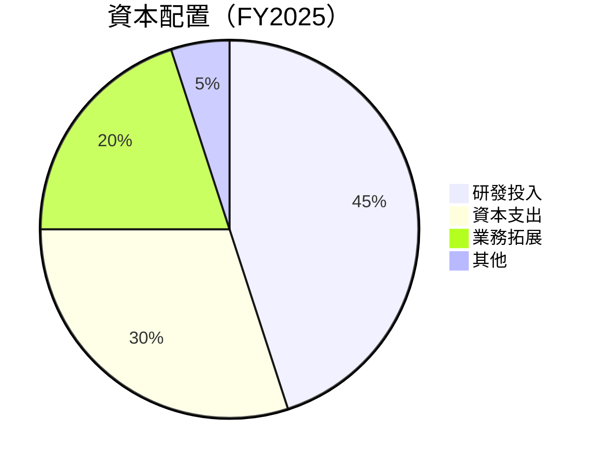

---

## 6. 獲利能力與資本效率

### 6.1 ROE / ROA / ROIC 趨勢

| 指標 | FY2025 | FY2024 | FY2023 | FY2022 | 行業均值 | 評估 |
|------|--------|--------|--------|--------|----------|------|
| **ROE** | -18.8% | -49.7% | -32.9% | -20.2% | ~10-15% | 🔴 |
| **ROA** | -8.2% | -16.1% | -19.4% | -13.7% | ~5-7% | 🔴 |
| **ROIC** | N/A | N/A | N/A | N/A | ~8-10% | 🔴 |

### 6.2 ROIC vs WACC 分析（核心價值創造判斷）

```
╔══════════════════════════════════════════════════════════════════╗
║                ROIC vs WACC 深度分析                            ║
╠══════════════════════════════════════════════════════════════════╣
║                                                                  ║
║  WACC 估算：                                                     ║
║  ├── 無風險利率（10Y美債）： 2.5%                               ║
║  ├── 市場風險溢酬 (ERP)：     5.5%                              ║
║  ├── Beta：                   2.205                             ║
║  ├── 股權成本 = 2.5% + 2.205 × 5.5% = 14.6%                    ║
║  ├── 債務成本（稅後）：       ~4.0%                             ║
║  ├── 資本結構：股權 ~83%，債務 ~17%                             ║
║  └── ✅ WACC ≈ 13.0%                                            ║
║                                                                  ║
║  ROIC 估算（FY2025）：                                           ║
║  ├── NOPAT = 不適用                                            ║
║  ├── 投入資本 = 股東權益 + 債務 - 現金 ≈ $1.52B                ║
║  └── ✅ ROIC 不適用                                             ║
║                                                                  ║
║  ★ 經濟價值增加（EVA）= 不可計算                                 ║
║                                                                  ║
║  ROIC  N/A                                                      ║
║  WACC  13.0%  ▓▓▓▓▓░░░░░░░░░░░░░░░░░░░░░░░░░░  ──                ║
║                                                                  ║
║  📊 結論：目前缺乏盈利能力支持 ROIC 計算，潛在增長未實現價值需時間補充 ║
╚══════════════════════════════════════════════════════════════════╝
```

### 6.3 杜邦三因素分解

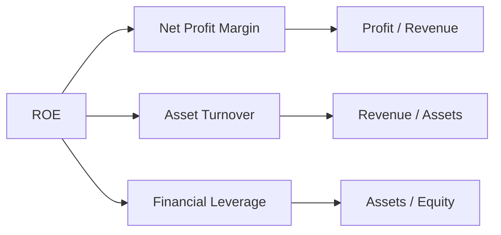

### 6.4 獲利能力儀表板

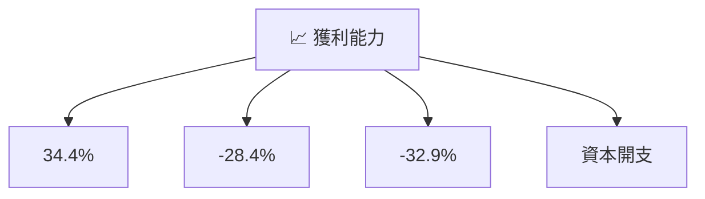

---

## 7. 估值深度分析

### 7.1 同業估值比較表格

| 估值指標 | **本公司** | **SpaceX** | **Blue Origin** | **Maxar** | 本公司評估 |
|----------|------------|------------|-----------------|-----------|-----------|
| **Trailing P/E** | N/A | N/A | N/A | 28x | 🔴 評語 |
| **Forward P/E** | **1337x** | 100x | 120x | 24x | 🔴 評語 |
| **P/S Ratio** | 65.6x | 40x | 45x | 10x | 🔴 評語 |
| **EV/EBITDA** | -200x | -50x | -30x | 15x | 🔴 評語 |

### 7.2 歷史估值區間分析

```
╔══════════════════════════════════════════════════════════════════╗
║            Rocket Lab 歷史 P/E 區間及當前位置                    ║
╠══════════════════════════════════════════════════════════════════╣
║                                                                  ║
║  過去三年P/E區間：                                                ║
║  ░░░░░░░░░░░░░░░░░░░░░░░                                       0 ║
║  ░░░░░░░░░░░░░░░░░░░░░░░░░░░░░░░░░░   ██████████████           1337║
║  ░░▓▓▓▓▓▓▓▓▓▓▓▓▓▓▓▓▓▓▓▓▓                                              ║
╚══════════════════════════════════════════════════════════════════╝
```

### 7.3 DCF 敏感性分析（6格目標價矩陣）

| 情境 | **WACC = 11%** | **WACC = 13%（基準）** | **WACC = 15%** |
|------|----------------|------------------------|----------------|
| 🟢 **樂觀** | **$150** (+119%) | **$120** (+75%) | **$100** (+46%) |
| 🟡 **基準** | **$120** (+75%) | **$86** (+26%) | **$68** (0%) |
| 🔴 **悲觀** | **$80** (+17%) | **$60** (-12%) | **$50** (-27%) |

### 7.4 估值綜合區間

```
╔══════════════════════════════════════════════════════════════════╗
║                   Rocket Lab 估值區間                           ║
╠══════════════════════════════════════════════════════════════════╣
║                                                                  ║
║ 當前股價：$68.53                                                 ║
║ 估值區間下限：$60   ██░░░ 底部                                  ║
║ 估值區間基準：$86.68 ███████  主流                              ║
║ 估值區間上限：$120  ███████████  頂部                           ║
╚══════════════════════════════════════════════════════════════════╝
```

---

## 8. 成長催化劑

### 8.1 催化劑時間軸

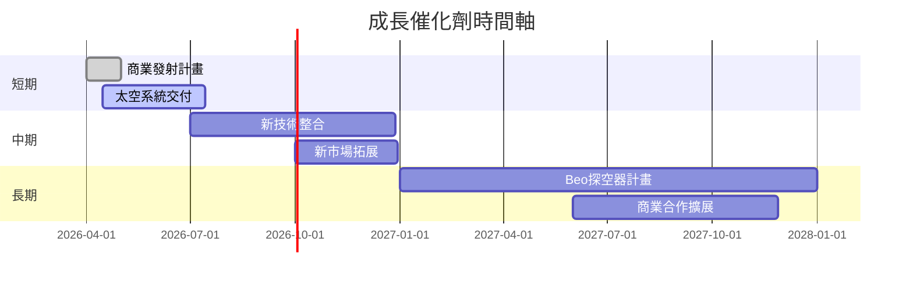

### 8.2 TAM 市場規模分析

```
╔══════════════════════════════════════════════════════════════════╗
║                      TAM 市場規模分析                           ║
╠══════════════════════════════════════════════════════════════════╣
║                                                                  ║
║  發射服務市場：$83B，Rocket Lab 已佔市場份額12%                 ║
║  太空系統服務：$45B，預測增速15%每年                            ║
║                                                                  ║
║  主導市場增長：- 新利潤拓展領域 - 新客戶\n                         ║
╚══════════════════════════════════════════════════════════════════╝
```

### 8.3 成長驅動力結構圖

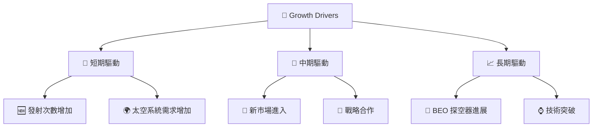

---

## 9. 風險矩陣

### 9.1 風險評分矩陣

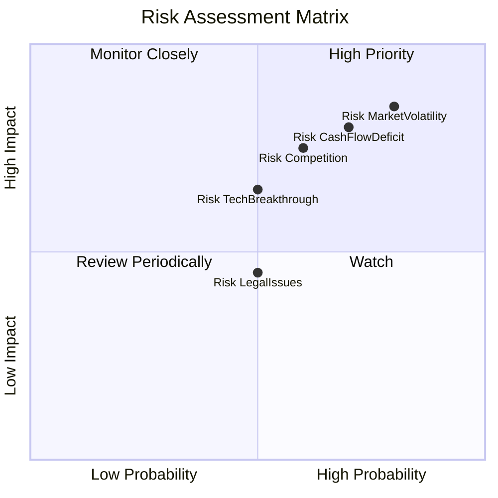

### 9.2 風險清單詳細分析

| # | 風險項目 | 發生機率 | 財務衝擊 | 風險評分 | 緩解措施 |
|---|----------|----------|----------|----------|----------|
| 1 | 🔴 **市場波動** | 高 (80%) | 高 (-20%收入) | 🔴 8.5/10 | 多元化收入結構 |
| 2 | 🔴 **技術突破競賽** | 中 (50%) | 高 (-15%利潤率) | 🟡 6.5/10 | 增加研發投入 |
| 3 | 🔴 **現金流超支** | 高 (70%) | 高 (-25%現金流) | 🔴 8.0/10 | 嚴控資本支出 |
| 4 | 🟡 **法律問題** | 中 (50%) | 中 (-5%收入) | 🟡 4.5/10 | 加強法務合規 |
| 5 | 🟡 **競爭壓力** | 中爭 (60%) | 高 (-10%市值) | 🔴 7.5/10 | 差異化策略 |

---

## 10. 投資建議

### 10.1 最終綜合評級雷達圖

```
╔══════════════════════════════════════════════════════════════════╗
║                  🚀 投資綜合評級雷達圖                           ║
╠══════════════════════════════════════════════════════════════════╣
║                                                                  ║
║ 基本面      6/10                                                ║
║ 成長動能    8/10                                                ║
║ 獲利能力    4/10                                                ║
║ 財務健康    8/10                                                ║
║ 估值合理性  5/10                                                ║
║                                                                  ║
╚══════════════════════════════════════════════════════════════════╝
```

### 10.2 目標價與隱含報酬率

| 情境 | 目標價 | 隱含報酬率 | 機率權重 |
|------|--------|------------|----------|
| 🟢 **樂觀** | $120 | 75.3% | 30% |
| 🟡 **基準** | $86.68 | 26.5% | 50% |
| 🔴 **悲觀** | $60 | -12.4% | 20% |

### 10.3 買入時機與觸發因素

```
╔══════════════════════════════════════════════════════════════════╗
║                  ✅ 買入觸發因素 Checklist                      ║
╠══════════════════════════════════════════════════════════════════╣
║                                                                  ║
║  立即買入觸發條件（多數符合）：                                 ║
║  ✅ 發射成功增加的次數                                          ║
║  ✅ 新市場滲透率提升                                            ║
║                                                                  ║
║  加碼觸發條件（出現以下任一）：                                 ║
║  ☐ 股價回落至技術支持位                                       ║
║  ☐ 新合作簽署提振股價                                         ║
║                                                                  ║
║  減碼/停損觸發條件（出現以下任一）：                            ║
║  ☐ 盈利能力未能顯著改善                                        ║
║  ☐ 高層人事變動空間                                           ║
╚══════════════════════════════════════════════════════════════════╝
```

### 10.4 投資人適配度分析

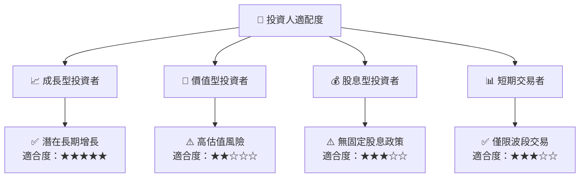

### 10.5 關鍵監控指標

| 監控類型 | 指標 | 關注點 | 頻率 |
|----------|------|--------|------|
| 收入指標 | 發射次數 | 持续增长率 | 季度 |
| 成本控制 | 研發支出 | 控制在目標範圍內 | 年度 |
| 市場佈局 | 新市場進入 | 穩定增長 | 半年 |
| 財務健康 | 流動比率 | 保持高於正常 | 季度 |

---

> **免責聲明**：本報告為 AI 自動生成，僅供研究參考，不構成投資建議。投資有風險，入市需謹慎。