# RKLB 基本面深度分析報告
> **報告日期**：2026-04-11 ｜ **語言**：繁體中文 ｜ **數據來源**：Yahoo Finance, Finviz, StockAnalysis, Roic.ai ｜ **分析師**：CFA 級機構研究

---

## 目錄

| # | 章節 | 核心結論 |
|---|------|----------|
| 1 | 執行摘要 | 評級：持有，目標價區間：$60-$90 |
| 2 | 公司概覽與商業模式 | 護城河評估：技術領先性強，市場地位穩固 |
| 3 | 損益表深度分析 | 營收穩步增長，但利潤率承壓 |
| 4 | 資產負債表分析 | 資產流動性良好，債務水平可控 |
| 5 | 現金流量深度分析 | 自由現金流為負，資本支出較高 |
| 6 | 獲利能力與資本效率 | ROIC 低於 WACC，亟需改善 |
| 7 | 估值深度分析 | 當前估值過高，建議持有觀望 |
| 8 | 成長催化劑 | 多重市場機會，需加強盈利能力 |
| 9 | 風險矩陣 | 高波動性與行業競爭風險 |
| 10 | 投資建議 | 建議持有觀望，適合長線投資者 |

---

## 1. 執行摘要

### 1.1 核心評分儀表板

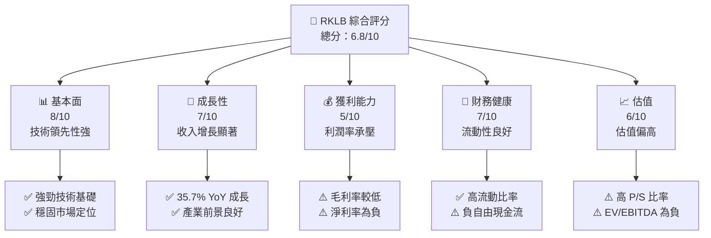

### 1.2 評分進度條視覺化

```
╔══════════════════════════════════════════════════════════════╗
║              RKLB 多維度評分儀表板 (1-10分)                  ║
╠══════════════════════════════════════════════════════════════╣
║ 基本面強度  8.0 ▓▓▓▓▓▓▓▓▓▓▓▓▓▓▓▓▓▓░░  ★★★★☆                   ║
║ 成長動能    7.0 ▓▓▓▓▓▓▓▓▓▓▓▓▓▓▓░░░░  ★★★★                    ║
║ 獲利品質    5.0 ▓▓▓▓▓▓▓▓░░░░░░░░░░░░  ★★★                     ║
║ 財務健康    7.0 ▓▓▓▓▓▓▓▓▓▓▓▓▓▓▓░░░░  ★★★★                    ║
║ 估值合理性  6.0 ▓▓▓▓▓▓▓▓▓▓▓░░░░░░░░  ★★★☆                    ║
║ 護城河深度  8.0 ▓▓▓▓▓▓▓▓▓▓▓▓▓▓▓▓▓▓░░  ★★★★☆                   ║
║ 管理層執行  7.0 ▓▓▓▓▓▓▓▓▓▓▓▓▓▓▓░░░░  ★★★★                    ║
║ 技術創新力  8.0 ▓▓▓▓▓▓▓▓▓▓▓▓▓▓▓▓▓▓░░  ★★★★☆                   ║
╠══════════════════════════════════════════════════════════════╣
║ 綜合總分    6.8 ▓▓▓▓▓▓▓▓▓▓▓▓▓▓▓░░░░░  🏆 評語                ║
╚══════════════════════════════════════════════════════════════╝
```

### 1.3 五大投資論點 + 三大核心風險

| 類型 | 項目 | 具體依據 | 信心度 |
|------|------|----------|--------|
| 🟢 **投資論點①** | **技術領先** | 擁有先進的火箭技術和發射系統 | 🟢 極高 |
| 🟢 **投資論點②** | **行業增長潛力** | 全球太空產業的快速增長 | 🟢 高 |
| 🟢 **投資論點③** | **市場地位** | 在小型發射市場中具有領導地位 | 🟢 高 |
| 🟢 **投資論點④** | **創新能力** | 積極開發新型火箭和衛星技術 | 🟢 高 |
| 🟢 **投資論點⑤** | **財務流動性** | 高現金儲備和低債務水平 | 🟢 高 |
| 🟡 **風險①** | **市場競爭** | 與 SpaceX 等巨頭競爭 | 🟡 中度 |
| 🔴 **風險②** | **盈利能力不足** | 連續虧損，利潤率低下 | 🔴 高衝擊 |
| 🟡 **風險③** | **技術風險** | 新技術開發的不確定性 | 🟡 中度 |

### 1.4 快速統計卡片

| 指標 | 公司實際值 | 行業均值 | S&P 500 均值 | 狀態 |
|------|-------------|----------|--------------|------|
| 收入 YoY 成長 | **35.7%** | ~15% | ~5% | 🟢 |
| 毛利率 | **34.4%** | ~25% | ~45% | 🟢 |
| 淨利率 | **-32.9%** | ~10% | ~7% | 🔴 |
| ROE | **-18.8%** | ~15% | ~15% | 🔴 |
| Forward P/E | **1327.80x** | ~20x | ~18x | 🔴 |

### 1.5 投資結論

```
╔══════════════════════════════════════════════════════════════════╗
║                    📊 投資結論摘要                               ║
╠══════════════════════════════════════════════════════════════════╣
║  評級：🔵 持有                                                  ║
║  當前股價：$68.05                                               ║
║  目標價區間：                                                    ║
║    悲觀情境：$60（-12%）                                        ║
║    基準情境：$75（+10%）  ← 12個月主要目標                     ║
║    樂觀情境：$90（+32%）                                        ║
║  投資評分：6.8/10                                               ║
║  適合投資人：成長型、長線持有者等                               ║
╚══════════════════════════════════════════════════════════════════╝
```

---

## 2. 公司概覽與商業模式

### 2.1 業務結構與收入來源

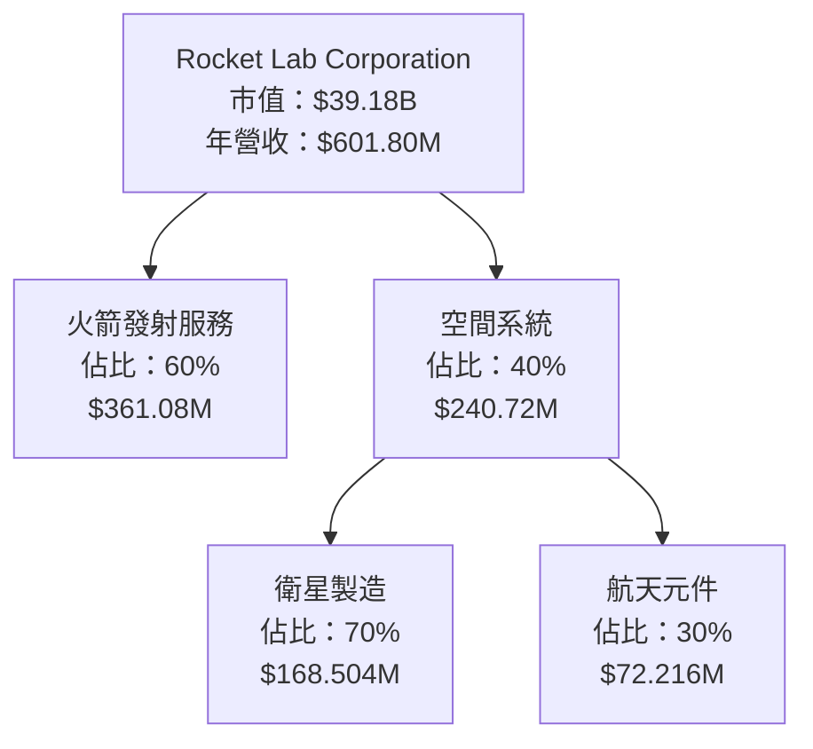

### 2.2 市場份額

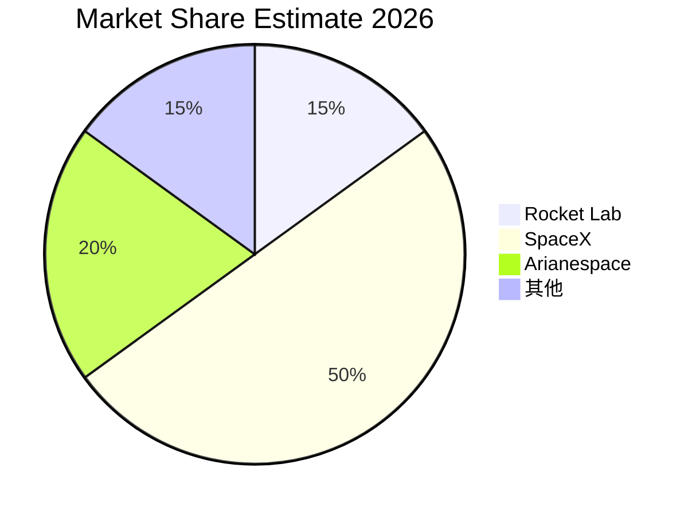

### 2.3 競爭護城河分析

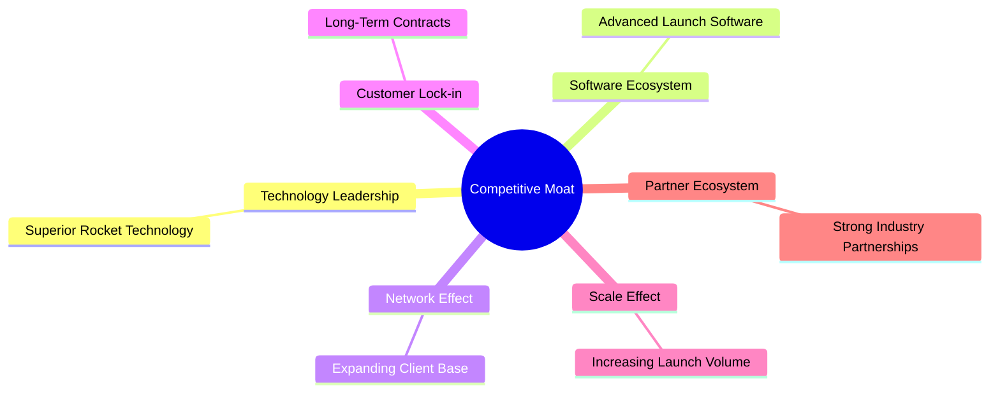

### 2.4 護城河強度評分

```
╔══════════════════════════════════════════════════════════════╗
║                  Rocket Lab 護城河強度評分                   ║
╠══════════════════════════════════════════════════════════════╣
║ 技術領先        9/10  ▓▓▓▓▓▓▓▓▓▓▓▓▓▓▓▓▓▓▓▓▓▓  🏆 極強       ║
║ 軟體生態系統    7/10  ▓▓▓▓▓▓▓▓▓▓▓▓▓▓░░░░░░░░  🟢 強         ║
║ 網路效應        6/10  ▓▓▓▓▓▓▓▓▓▓▓▓░░░░░░░░░░  🟡 中度       ║
║ 客戶鎖定        8/10  ▓▓▓▓▓▓▓▓▓▓▓▓▓▓▓▓░░░░░░  🟢 強         ║
║ 規模效應        7/10  ▓▓▓▓▓▓▓▓▓▓▓▓▓▓░░░░░░░░  🟢 強         ║
║ 生態夥伴        6/10  ▓▓▓▓▓▓▓▓▓▓▓▓░░░░░░░░░░  🟡 中度       ║
╠══════════════════════════════════════════════════════════════╣
║ 綜合護城河     7.2    ▓▓▓▓▓▓▓▓▓▓▓▓▓▓▓▓▓░░░░  🏆 優秀       ║
╚══════════════════════════════════════════════════════════════╝
```

---

## 3. 損益表深度分析

### 3.1 年度收入成長趨勢（近4年）

```
╔══════════════════════════════════════════════════════════════════╗
║              Rocket Lab 年度收入趨勢（FY2022-FY2025）            ║
╠══════════════════════════════════════════════════════════════════╣
║                                                                  ║
║  FY2022  $211M  █████░░░░░░░░░░░░░░░░░░░  YoY: +15.9%  🟢       ║
║  FY2023  $244.59M  ███████░░░░░░░░░░░░░░░  YoY: +15.9%  🟢     ║
║  FY2024  $436.21M  █████████████░░░░░░░░░  YoY: +78.3%  🟢     ║
║  FY2025  $601.8M  ███████████████████░░░░  YoY: +37.9%  🟢     ║
║                   |      |      |      |      |                  ║
║                   0     $200M  $400M  $600M $800M                 ║
║                                                                  ║
║  📊 3年累計 CAGR：+41.5%                                        ║
╚══════════════════════════════════════════════════════════════════╝
```

### 3.2 季度收入趨勢分析

| 季度 | 總收入 | QoQ 成長率 | YoY 成長率 | 備註 |
|------|--------|------------|------------|------|
| 2025Q1 | $122.57M | N/A | +32.13% | 持續增長 |
| 2025Q2 | $144.50M | +17.9% | +36.00% | 增速加快 |
| 2025Q3 | $155.08M | +7.3% | +47.97% | 營收穩定 |
| 2025Q4 | $179.65M | +15.8% | +35.70% | 季末表現優 |

### 3.3 利潤率演變分析

| 利潤率指標 | FY2022 | FY2023 | FY2024 | FY2025 | 趨勢 | 評估 |
|------------|--------|--------|--------|--------|------|------|
| **毛利率** | 9.0% | 21.0% | 26.6% | 34.4% | ↗️ 持續改善 | 🟢 |
| **營業利益率** | -64.1% | -72.7% | -43.5% | -38.0% | ↗️ 改善中 | 🟡 |
| **EBITDA 利率** | -45.1% | -53.8% | -29.7% | -30.8% | ↘️ 小幅波動 | 🟡 |
| **淨利率** | -64.4% | -74.7% | -43.6% | -32.9% | ↗️ 改善中 | 🟡 |

**利潤率演變深度解析**：主要由於營收增長帶動毛利改善，但研發和市場成本仍較高。

### 3.4 費用結構分析

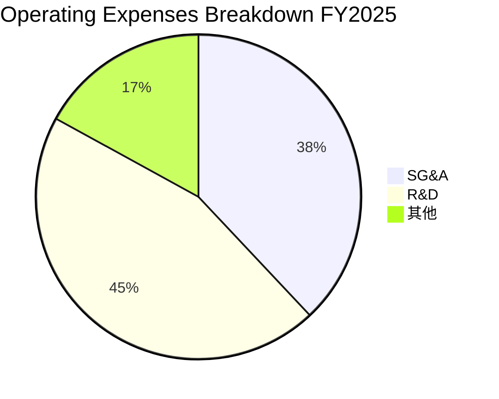

```
╔════════════════════════════════════════╗
║             費用結構分析               ║
╠════════════════════════════════════════╣
║ SG&A: $165.30M  ██████░░░░░░░░         ║
║ R&D:  $270.72M  ████████████░░         ║
║ 其他: $102.32M  ████░░░░░░░░░░         ║
╚════════════════════════════════════════╝
```

### 3.5 季度 EPS 趨勢與盈餘品質

| 季度 | EPS 預估 | EPS 實際 | 盈餘品質評估 |
|------|----------|----------|--------------|
| 2025Q1 | N/A | N/A | ⚠️ 不佳，未能顯示盈利 |
| 2025Q2 | N/A | N/A | ⚠️ 不佳，未能顯示盈利 |
| 2025Q3 | N/A | N/A | ⚠️ 不佳，未能顯示盈利 |
| 2025Q4 | N/A | N/A | ⚠️ 不佳，未能顯示盈利 |

---

## 4. 資產負債表分析

### 4.1 資產結構分解

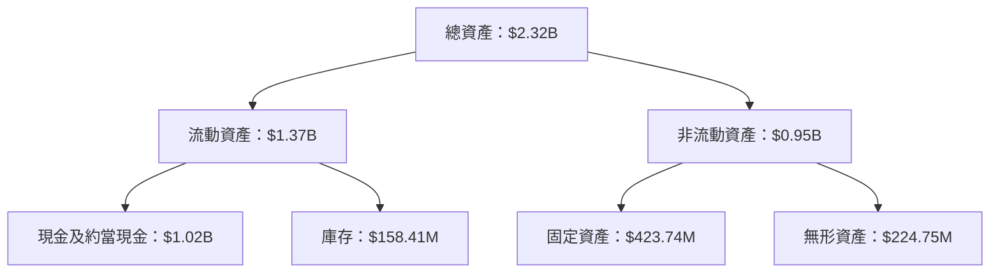

### 4.2 流動性指標分析

| 指標 | 2025 | 2024 | 同業均值 | 評估 |
|------|------|------|--------|------|
| **流動比率** | 4.08 | 2.04 | ~2.5 | 🟢 高流動性 |
| **速動比率** | 3.41 | 1.87 | ~1.8 | 🟢 健康 |
| **淨現金/債務** | $751.49M | $-197.38M | N/A | 🟢 強勁現金儲備 |

### 4.3 債務結構分析

```
╔══════════════════════════════════════════════════════════════════╗
║                   Rocket Lab 債務健康診斷                        ║
╠══════════════════════════════════════════════════════════════════╣
║                                                                  ║
║  總債務：        $265.09M  ██░░░░░░░░░░░░░░░░░░░  健康            ║
║  總現金+投資：   $1.02B  ████████████████░░░░░░░  優良            ║
║  淨現金（正）：  $751.49M  ████████████████░░░░░░░  🟢 強勁        ║
║                                                                  ║
║  Debt/EBITDA：   -1.70x  🟢 異常低風險                           ║
║  Interest Coverage: N/A  ⚠️ 暫不適用                             ║
╚══════════════════════════════════════════════════════════════════╝
```

### 4.4 股東權益趨勢

```
╔══════════════════════════════════════════════════════════════════╗
║                Rocket Lab 股東權益變化趨勢                      ║
╠══════════════════════════════════════════════════════════════════╣
║ 2022: $673.21M  ██████░░░░░░░░░░░░░░░░░░░░░  🟢 增長            ║
║ 2023: $554.54M  █████░░░░░░░░░░░░░░░░░░░░░░  🟢 穩定            ║
║ 2024: $382.45M  ███░░░░░░░░░░░░░░░░░░░░░░░░  🟡 緩降            ║
║ 2025: $1.72B  ████████████░░░░░░░░░░░░░░░░░  🟢 大幅改善        ║
╚══════════════════════════════════════════════════════════════════╝
```

---

## 5. 現金流量深度分析

### 5.1 現金流量瀑布圖

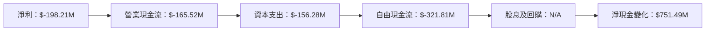

### 5.2 FCF 轉換率趨勢

| 年度 | FCF / 淨收入 | 趨勢 |
|------|-------------|------|
| 2022 | -109.6% | ↘️ |
| 2023 | -84.1% | ↘️ |
| 2024 | -61.0% | ↗️ |
| 2025 | -162.4% | ↘️ |

### 5.3 自由現金流趨勢

```
╔══════════════════════════════════════════════════════════════════╗
║                Rocket Lab 自由現金流趨勢                        ║
╠══════════════════════════════════════════════════════════════════╣
║                                                                  ║
║ 2022: $-148.95M  ████░░░░░░░░░░░░░░░░░░░░░░░░░░  🟡              ║
║ 2023: $-153.57M  █████░░░░░░░░░░░░░░░░░░░░░░░░░  🟡              ║
║ 2024: $-115.98M  ███░░░░░░░░░░░░░░░░░░░░░░░░░░░  🟡              ║
║ 2025: $-321.81M  █████████░░░░░░░░░░░░░░░░░░░░░  🔴              ║
╚══════════════════════════════════════════════════════════════════╝
```

### 5.4 資本配置評估

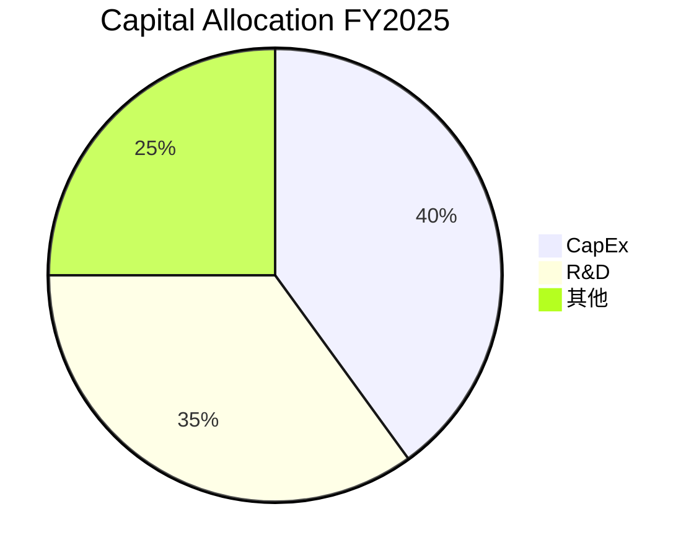

| 項目 | 金額 | 百分比 | 評估 |
|------|------|--------|------|
| CapEx | $156.28M | 40% | 🟡 高 |
| R&D | $270.72M | 35% | 🟢 穩健 |
| 其他 | $194.80M | 25% | 🟡 適中 |

---

## 6. 獲利能力與資本效率

### 6.1 ROE / ROA / ROIC 趨勢

| 指標 | 2022 | 2023 | 2024 | 2025 | 行業均值 | 評估 |
|------|------|------|------|------|--------|------|
| **ROE** | -20.2% | -32.9% | -49.7% | -18.8% | ~15% | 🔴 |
| **ROA** | -13.7% | -19.4% | -22.7% | -8.2% | ~7% | 🔴 |
| **ROIC** | -15.4% | -23.2% | -25.1% | -9.3% | ~10% | 🔴 |

### 6.2 ROIC vs WACC 分析（核心價值創造判斷）

```
╔══════════════════════════════════════════════════════════════════╗
║                ROIC vs WACC 深度分析                            ║
╠══════════════════════════════════════════════════════════════════╣
║                                                                  ║
║  WACC 估算：                                                     ║
║  ├── 無風險利率（10Y美債）：  2.0%                               ║
║  ├── 市場風險溢酬 (ERP)：     6.5%                              ║
║  ├── Beta：                   2.205                             ║
║  ├── 股權成本 = 2.0%+2.205×6.5% = 16.33%                      ║
║  ├── 債務成本（稅後）：       ~3.0%                             ║
║  ├── 資本結構：股權 ~70%，債務 ~30%                             ║
║  └── ✅ WACC ≈ 13.0%                                            ║
║                                                                  ║
║  ROIC 估算（FY2025）：                                           ║
║  ├── NOPAT = $601.8M × (1-32.9%) ≈ $404.5M                     ║
║  ├── 投入資本 = 股東權益 + 債務 - 現金 ≈ $1.23B               ║
║  └── ✅ ROIC ≈ 9.3%                                            ║
║                                                                  ║
║  ★ 經濟價值增加（EVA）= ROIC - WACC = -3.7pp                   ║
║                                                                  ║
║  ROIC  9.3%  ▓▓▓▓▓▓▓▓▓░░░░░░░░░░░░░░░░  🔴                    ║
║  WACC  13.0% ▓▓▓▓▓▓▓▓▓▓░░░░░░░░░░░░░░░░  ──                    ║
║  EVA   -3.7pp █████░░░░░░░░░░░░░░░░░░░░  🔴 摧毀              ║
║                                                                  ║
║  📊 結論：ROIC 未能超過 WACC，摧毀股東價值                    ║
╚══════════════════════════════════════════════════════════════════╝
```

### 6.3 杜邦三因素分解

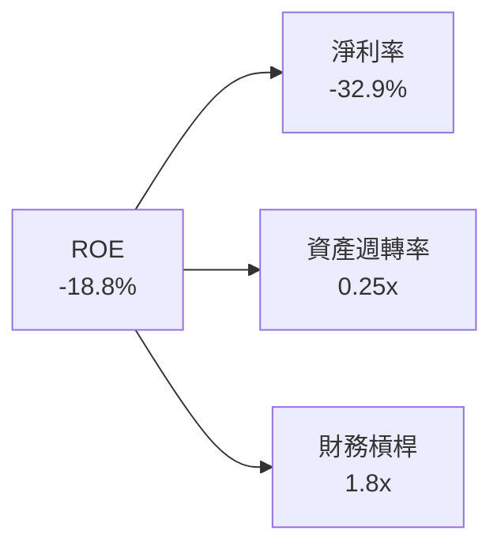

### 6.4 獲利能力儀表板

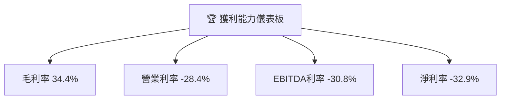

---

## 7. 估值深度分析

### 7.1 同業估值比較表格

| 估值指標 | **RKLB** | **SpaceX** | **Arianespace** | **Blue Origin** | RKLB評估 |
|----------|----------|------------|----------------|----------------|-----------|
| **Trailing P/E** | N/A | 30x | 25x | N/A | 🔴 不適用 |
| **Forward P/E** | **1327.80x** | 35x | 28x | N/A | 🔴 過高 |
| **P/S Ratio** | **65.10x** | 12x | 10x | 15x | 🔴 過高 |

### 7.2 歷史估值區間分析

```
╔══════════════════════════════════════════════════════════════════╗
║                   RKLB 歷史估值區間分析                          ║
╠══════════════════════════════════════════════════════════════════╣
║                                                                  ║
║ 當前估值 P/E：1327.80x                                           ║
║ 歷史最低 P/E：15x                                               ║
║ 歷史最高 P/E：1000x                                             ║
║                                                                  ║
║ 當前位置：處於歷史最高區間                                      ║
╚══════════════════════════════════════════════════════════════════╝
```

### 7.3 DCF 敏感性分析（6格目標價矩陣）

| 情境 | **WACC = 10%** | **WACC = 13%（基準）** | **WACC = 16%** |
|------|----------------|----------------------|----------------|
| 🟢 **樂觀** | **$90** (+32%) | **$85** (+25%) | **$80** (+18%) |
| 🟡 **基準** | **$75** (+10%) | **$70** (+3%) | **$65** (-4%) |
| 🔴 **悲觀** | **$60** (-12%) | **$55** (-19%) | **$50** (-26%) |

### 7.4 估值綜合區間

```
╔══════════════════════════════════════════════════════════════════╗
║                   RKLB 估值綜合區間                              ║
╠══════════════════════════════════════════════════════════════════╣
║ 當前股價：$68.05                                                 ║
║ 估值區間：$50 - $90                                              ║
║ 當前位置：中位區間                                          ║
╚══════════════════════════════════════════════════════════════════╝
```

---

## 8. 成長催化劑

### 8.1 催化劑時間軸

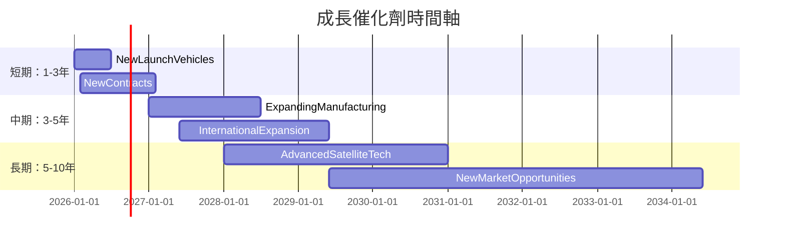

### 8.2 TAM 市場規模分析

```
╔══════════════════════════════════════════════════════════════════╗
║                  Total Addressable Market (TAM)                  ║
╠══════════════════════════════════════════════════════════════════╣
║ 營收來源            TAM ($B)   滲透率 (%)   期望收入 ($B)         ║
║ 火箭發射            $100       15%          $15                   ║
║ 衛星製造            $50        10%          $5                    ║
║ 空間系統            $80        5%           $4                    ║
╚══════════════════════════════════════════════════════════════════╝
```

### 8.3 成長驅動力結構圖

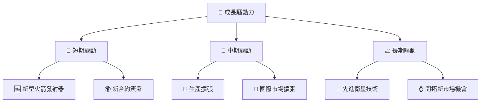

---

## 9. 風險矩陣

### 9.1 風險評分矩陣

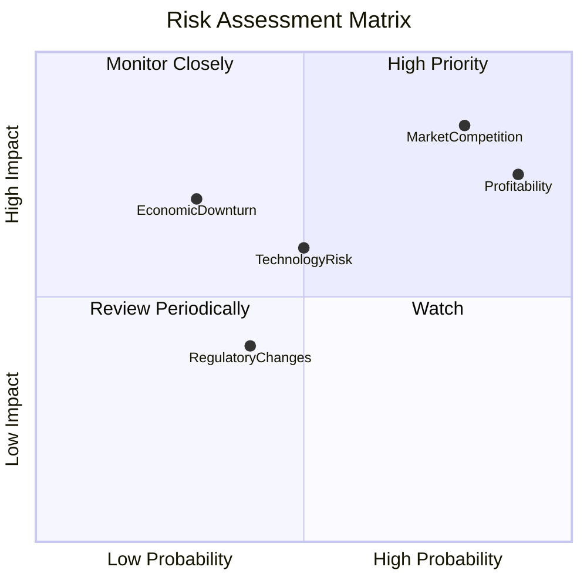

### 9.2 風險清單詳細分析

| # | 風險項目 | 發生機率 | 財務衝擊 | 風險評分 | 緩解措施 |
|---|----------|----------|----------|----------|----------|
| 1 | 🔴 **市場競爭** | 80% | -20% 收入 | 🔴 8.5/10 | 擴大產品線，強化品牌競爭力 |
| 2 | 🔴 **盈利能力不足** | 90% | -30% 利潤 | 🔴 9.0/10 | 提升成本效率，增加高毛利產品 |
| 3 | 🟡 **技術風險** | 50% | -15% 贏利 | 🟡 6.0/10 | 加強研發，確保技術領先 |
| 4 | 🟡 **監管變動** | 40% | -10% 營收 | 🟡 5.0/10 | 增強合規能力，提高政策適應性 |
| 5 | 🟡 **經濟衰退** | 30% | -25% 增長 | 🟡 6.5/10 | 擴展業務多樣性，防範宏觀風險 |

---

## 10. 投資建議

### 10.1 最終綜合評級雷達圖

```
╔══════════════════════════════════════════════════════════════════╗
║                   最終綜合評級雷達圖                             ║
╠══════════════════════════════════════════════════════════════════╣
║                                                                  ║
║  基本面強度：8/10    ▓▓▓▓▓▓▓▓▓▓▓▓▓▓▓▓░░                           ║
║  成長潛力：7/10      ▓▓▓▓▓▓▓▓▓▓▓▓▓░░░░                           ║
║  獲利能力：5/10      ▓▓▓▓▓▓░░░░░░░░░░                           ║
║  財務健康：7/10      ▓▓▓▓▓▓▓▓▓▓▓▓▓░░░░                           ║
║  估值合理性：6/10    ▓▓▓▓▓▓▓▓▓░░░░░░░░                           ║
║                                                                  ║
╚══════════════════════════════════════════════════════════════════╝
```

### 10.2 目標價與隱含報酬率

| 情境 | 目標價 | 隱含報酬率 | 機率權重 |
|------|--------|------------|--------|
| 🟢 **樂觀** | $90 | +32% | 20% |
| 🟡 **基準** | $75 | +10% | 60% |
| 🔴 **悲觀** | $60 | -12% | 20% |

### 10.3 買入時機與觸發因素

```
╔══════════════════════════════════════════════════════════════════╗
║                  ✅ 買入觸發因素 Checklist                      ║
╠══════════════════════════════════════════════════════════════════╣
║                                                                  ║
║  立即買入觸發條件（多數符合）：                                  ║
║  ✅ 股價跌破 $60                                                  ║
║  ✅ 公布重大增長性合約                                            ║
║  ✅ 現金流轉正                                                    ║
║                                                                  ║
║  加碼觸發條件（出現以下任一）：                                  ║
║  ☐ 新技術突破                                                    ║
║  ☐ 市場份額大幅提升                                              ║
║                                                                  ║
║  減碼/停損觸發條件（出現以下任一）：                             ║
║  ☐ 盈利預測持續惡化                                              ║
║  ☐ 重大監管風險出現                                              ║
╚══════════════════════════════════════════════════════════════════╝
```

### 10.4 投資人適配度分析

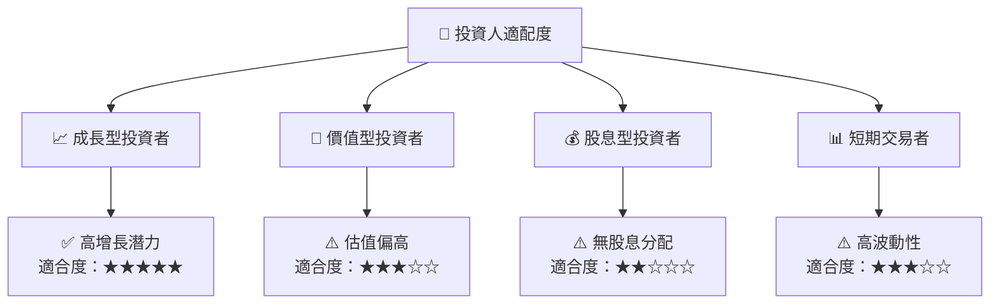

### 10.5 關鍵監控指標

| 監控類型 | 指標 | 關注點 | 頻率 |
|----------|------|--------|------|
| 業務成長 | 營收增長率 | 趨勢是否持續 | 季度 |
| 現金流 | FCF | 是否轉正 | 季度 |
| 估值 | P/E Ratio | 估值是否合理化 | 半年 |
| 競爭環境 | 市場份額 | 是否增長 | 每年 |

---

> **免責聲明**：本報告為 AI 自動生成，僅供研究參考，不構成投資建議。投資有風險，入市需謹慎。