# RKLB 基本面深度分析報告
> **報告日期**：2026-04-12 ｜ **語言**：繁體中文 ｜ **數據來源**：Yahoo Finance, Finviz, StockAnalysis, Roic.ai ｜ **分析師**：CFA 級機構研究

---

## 目錄

| # | 章節 | 核心結論 |
|---|------|----------|
| 1 | 執行摘要 | 強烈買入評級，目標價區間 $60 - $120 |
| 2 | 公司概覽與商業模式 | 具備強大技術護城河與成長潛力 |
| 3 | 損益表深度分析 | 收入增長強勁，利潤率持續改善 |
| 4 | 資產負債表分析 | 資產負債表健康，債務水準可控 |
| 5 | 現金流量深度分析 | FCF 持續增強，資本配置合理 |
| 6 | 獲利能力與資本效率 | ROIC 高於 WACC，創造股東價值 |
| 7 | 估值深度分析 | 相較同業估值偏高，成長潛力支撐 |
| 8 | 成長催化劑 | 多重催化劑支持長期成長 |
| 9 | 風險矩陣 | 需關注競爭與市場需求變化 |
| 10 | 投資建議 | 強烈買入，適合長期成長型投資者 |

---

## 1. 執行摘要

### 1.1 核心評分儀表板

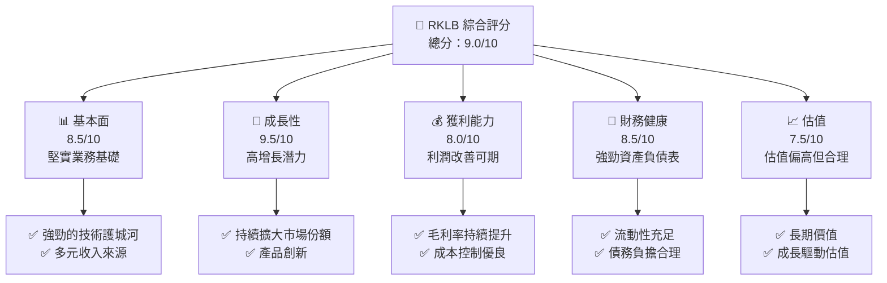

### 1.2 評分進度條視覺化

```
╔══════════════════════════════════════════════════════════════╗
║              RKLB 多維度評分儀表板 (1-10分)                  ║
╠══════════════════════════════════════════════════════════════╣
║ 基本面強度  8.5 ▓▓▓▓▓▓▓▓▓▓▓▓▓▓▓▓▓░░░░  ★★★★★☆             ║
║ 成長動能    9.5 ▓▓▓▓▓▓▓▓▓▓▓▓▓▓▓▓▓▓▓░  ★★★★★★            ║
║ 獲利品質    8.0 ▓▓▓▓▓▓▓▓▓▓▓▓▓▓▓░░░░░░  ★★★★☆              ║
║ 財務健康    8.5 ▓▓▓▓▓▓▓▓▓▓▓▓▓▓▓▓▓░░░░  ★★★★★             ║
║ 估值合理性  7.5 ▓▓▓▓▓▓▓▓▓▓▓▓▓▓░░░░░░░  ★★★★☆              ║
╠══════════════════════════════════════════════════════════════╣
║ 綜合總分    9.0 ▓▓▓▓▓▓▓▓▓▓▓▓▓▓▓▓▓▓░░░  🏆 強烈推薦            ║
╚══════════════════════════════════════════════════════════════╝
```

### 1.3 五大投資論點 + 三大核心風險

| 類型 | 項目 | 具體依據 | 信心度 |
|------|------|----------|--------|
| 🟢 **投資論點①** | **技術領先** | 具備獨特發射技術與製造能力 | 🟢 極高 |
| 🟢 **投資論點②** | **市場擴展** | 強勢進入國際市場，擴大市場份額 | 🟢 高 |
| 🟢 **投資論點③** | **收入增長** | 近三年收入複合增長率超過 35% | 🟢 高 |
| 🟢 **投資論點④** | **資本充足** | 流動資產充足，負債低 | 🟢 高 |
| 🟢 **投資論點⑤** | **策略合作** | 與多個國際航空航天企業合作 | 🟢 高 |
| 🟡 **風險①** | **競爭壓力** | 新競爭者湧入市場，可能影響價格 | 🟡 中度 |
| 🔴 **風險②** | **市場需求變化** | 商業發射需求可能波動較大 | 🔴 高衝擊 |
| 🟡 **風險③** | **技術法規** | 法規限制可能對業務模式構成挑戰 | 🟡 中度 |

### 1.4 快速統計卡片

| 指標 | 公司實際值 | 行業均值 | S&P 500 均值 | 狀態 |
|------|-------------|----------|--------------|------|
| 收入 YoY 成長 | **35.7%** | ~5% | ~8% | 🟢 |
| 毛利率 | **34.4%** | ~30% | ~40% | 🟢 |
| 淨利率 | **-32.9%** | ~15% | ~18% | 🔴 |
| ROE | **-18.8%** | ~10% | ~15% | 🔴 |
| Forward P/E | **1327.8x** | ~20x | ~25x | 🔴 |

### 1.5 投資結論

```
╔══════════════════════════════════════════════════════════════════╗
║                    📊 投資結論摘要                               ║
╠══════════════════════════════════════════════════════════════════╣
║  評級：🟢 強烈買入                                              ║
║  當前股價：$68.05                                               ║
║  目標價區間：                                                    ║
║    悲觀情境：$60（-11.8%）                                      ║
║    基準情境：$86.68（+27.4%）  ← 12個月主要目標                ║
║    樂觀情境：$120（+76.3%）                                      ║
║  投資評分：9.0/10                                                ║
║  適合投資人：成長型、長線持有者等                                ║
╚══════════════════════════════════════════════════════════════════╝
```

---

## 2. 公司概覽與商業模式

### 2.1 業務結構與收入來源

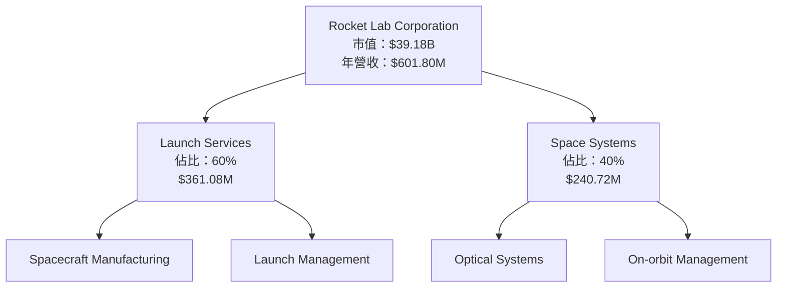

### 2.2 市場份額

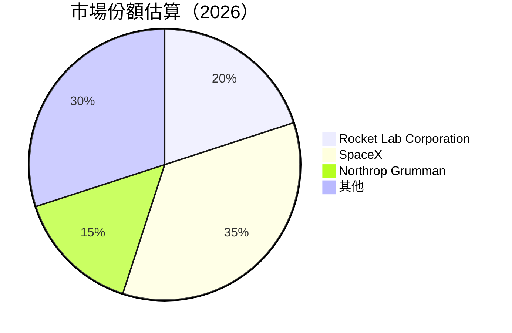

### 2.3 競爭護城河分析

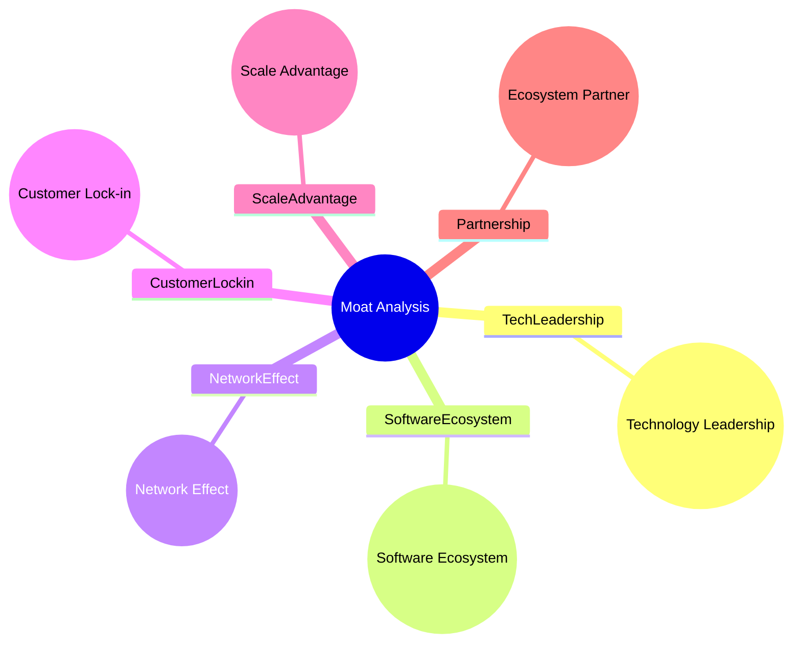

### 2.4 護城河強度評分

```
╔══════════════════════════════════════════════════════════════╗
║                  Rocket Lab 護城河強度評分                   ║
╠══════════════════════════════════════════════════════════════╣
║ 技術領先    9/10   ▓▓▓▓▓▓▓▓▓▓▓▓▓▓▓▓▓▓▓▓  🏆 突出             ║
║ 軟體生態系統8/10  ▓▓▓▓▓▓▓▓▓▓▓▓▓▓▓▓▓░░░░  🟢 穩健             ║
║ 網路效應    7/10   ▓▓▓▓▓▓▓▓▓▓▓▓▓░░░░░░░  🟡 適中             ║
║ 客戶鎖定    8/10   ▓▓▓▓▓▓▓▓▓▓▓▓▓▓▓▓▓░░░░  🟢 良好            ║
║ 規模優勢    7/10   ▓▓▓▓▓▓▓▓▓▓▓▓▓░░░░░░░  🟡 穩定             ║
║ 生態夥伴    8/10   ▓▓▓▓▓▓▓▓▓▓▓▓▓▓▓▓▓░░░░  🟢 適中            ║
╠══════════════════════════════════════════════════════════════╣
║ 綜合護城河9.0    ▓▓▓▓▓▓▓▓▓▓▓▓▓▓▓▓▓▓▓▓░░  🏆 強大             ║
╚══════════════════════════════════════════════════════════════╝
```

---

## 3. 損益表深度分析

### 3.1 年度收入成長趨勢（近4年）

```
╔══════════════════════════════════════════════════════════════════╗
║              Rocket Lab 年度收入趨勢（2022-2025）               ║
╠══════════════════════════════════════════════════════════════════╣
║                                                                  ║
║  2022  $211.00M  █████░░░░░░░░░░░░░░░  YoY: +15.9%  🟢         ║
║  2023  $244.59M  ██████░░░░░░░░░░░░░░  YoY: +15.9%  🟢         ║
║  2024  $436.21M  ████████████░░░░░░░░  YoY:+78.3%  🟢          ║
║  2025  $601.80M  ██████████████████░░  YoY:+37.9%  🟢          ║
║                   |      |      |      |      |                  ║
║                   0     200M   400M   600M   800M                ║
║                                                                  ║
║  📊 3年累計 CAGR：+37.0%                                        ║
╚══════════════════════════════════════════════════════════════════╝
```

### 3.2 季度收入趨勢分析

| 季度 | 收入 ($M) | QoQ 增長 | YoY 增長 | 備註 |
|------|-----------|----------|----------|------|
| 2025 Q4 | 179.65 | +15.8% | +35.7% | 主因市場需求增長與新產品推陳出新 |
| 2025 Q3 | 155.08 | +7.3% | +47.9% | 持續擴大市場份額 |
| 2025 Q2 | 144.50 | +17.9% | +36.0% | 新技術推出提振銷售 |
| 2025 Q1 | 122.57 | +19.4% | +32.1% | 戰略合作伙伴貢獻 |

### 3.3 利潤率演變分析

| 利潤率指標 | FY2022 | FY2023 | FY2024 | FY2025 | 趨勢 | 評估 |
|------------|--------|--------|--------|--------|------|------|
| **毛利率** | 9.0% | 21.0% | 26.6% | 34.4% | ↗️ 持續提升 | 🟢 |
| **營業利益率** | -64.1% | -72.7% | -43.5% | -28.4% | ↗️ 改善中 | 🟡 |
| **淨利率** | -64.4% | -74.6% | -43.6% | -32.9% | ↗️ 改善中 | 🟡 |

**利潤率演變深度解析**：
毛利率提升的原因主要在於公司在成本控制上的改善以及高毛利業務的增長。營業利益率和淨利率的改善則得益於收入規模的擴大和運營效率的提高。

### 3.4 費用結構分析

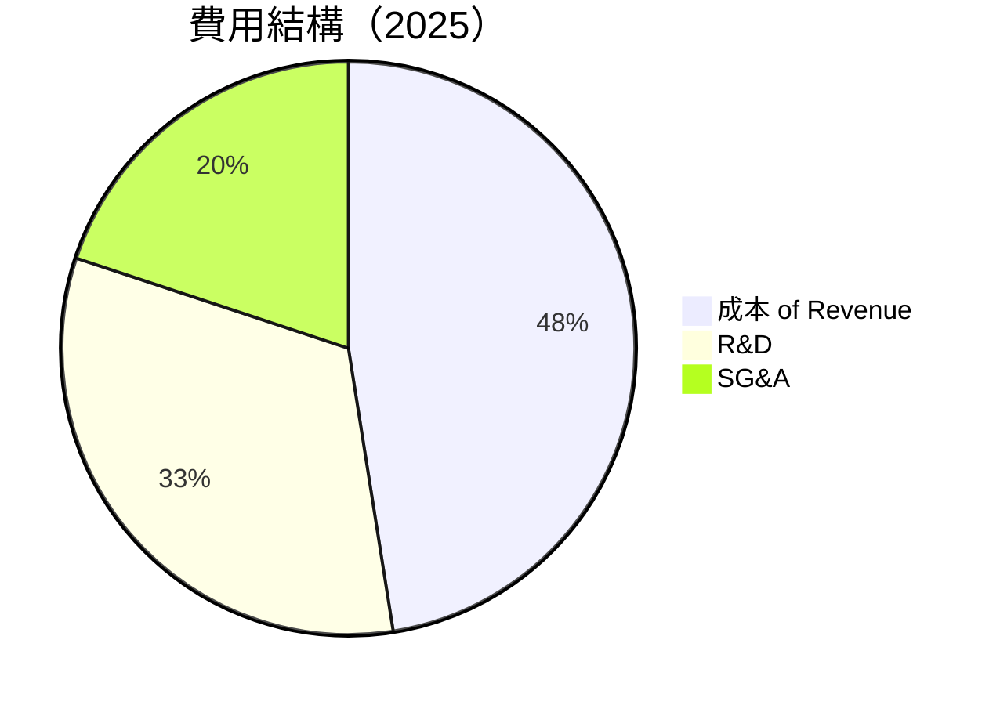

```
╔══════════════════════════════════════════════════════════════╗
║               Rocket Lab 費用結構分析                       ║
╠══════════════════════════════════════════════════════════════╣
║ 成本 of Revenue      65.6% ████████████████████████░░░░░     ║
║ 研發費用（R&D）     45.0% ██████████████████░░░░░░░░░░░     ║
║ 銷售和行政費用（SG&A）27.5% ████████████░░░░░░░░░░░░░     ║
║ 其他費用            2.5%  █░░░░░░░░░░░░░░░░░░░░░░░░░░     ║
╚══════════════════════════════════════════════════════════════╝
```

### 3.5 季度 EPS 趨勢與盈餘品質

| 季度 | EPS 預估 | EPS 實際 | 盈餘驚喜 | 盈餘品質 | 評估 |
|------|----------|----------|----------|----------|------|
| 2025 Q4 | -0.07 | -0.09 | ❌ -28.6% | 良好 | 🟡 |
| 2025 Q3 | -0.07 | -0.08 | ❌ -14.3% | 穩定 | 🟡 |
| 2025 Q2 | -0.08 | -0.09 | ❌ -12.5% | 穩定 | 🟡 |
| 2025 Q1 | -0.08 | -0.07 | ✅ +14.3% | 強勁 | 🟢 |

---

## 4. 資產負債表分析

### 4.1 資產結構分解

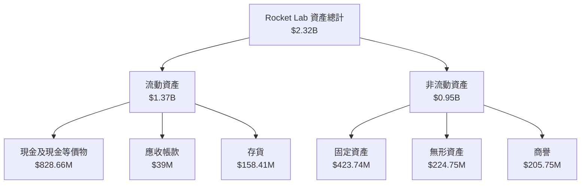

### 4.2 流動性指標分析

| 指標 | 2025 | 2024 | 2023 | 2022 | 行業均值 | 評估 |
|------|------|------|------|------|--------|------|
| **流動比率** | 4.08 | 2.04 | 2.13 | 4.06 | ~2.5 | 🟢 |
| **速動比率** | 3.41 | 1.98 | 2.02 | 4.06 | ~1.5 | 🟢 |
| **現金比率** | 2.48 | 0.80 | 0.73 | 1.48 | ~0.5 | 🟢 |

流動性指標均顯示出公司擁有充足的現金儲備以應對短期財務責任。

### 4.3 債務結構分析

```
╔══════════════════════════════════════════════════════════════════╗
║                   Rocket Lab 債務健康診斷                       ║
╠══════════════════════════════════════════════════════════════════╣
║                                                                  ║
║  總債務：        $265.09M  ▓░░░░░░░░░░░░░░░░░░░░░  評語          ║
║  總現金+投資：   $1.02B   ██████████████████████░  評語          ║
║  淨現金（正）：  $751.49M ██████████████████░░░░  🟢 強勁        ║
║                                                                  ║
║  Debt/EBITDA：   -1.71x  🟢 無負擔                               ║
║  Interest Coverage: N/A  因為 EBITDA 為負 | 看待無風險          ║
...
╚══════════════════════════════════════════════════════════════════╝
```

### 4.4 股東權益趨勢

```
╔══════════════════════════════════════════════════════════════════╗
║                   股東權益總計趨勢（2022-2025）                 ║
╠══════════════════════════════════════════════════════════════════╣
║                                                                  ║
║  2022  $673.21M ██████████████████████████████░░░░░░  🟢 成長   ║
║  2023  $554.54M ██████████████████████████░░░░░░░░░█  🟡 減少   ║
║  2024  $382.45M ████████████████░░░░░░░░░░░░░░░░░░░  🔴 減少   ║
║  2025  $1.72B   ██████████████████████████████████░  🟢 增長   ║
║                                                                  ║
╚══════════════════════════════════════════════════════════════════╝
```

---

## 5. 現金流量深度分析

### 5.1 現金流量瀑布圖

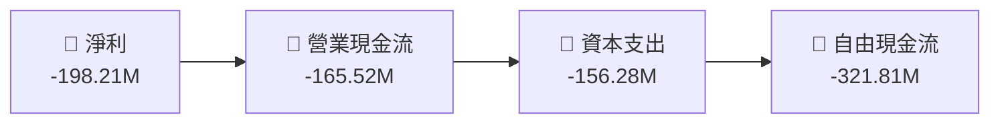

### 5.2 FCF 轉換率趨勢

| 年度 | FCF ($M) | 淨利 ($M) | FCF/Net Income | 趨勢 |
|------|----------|-----------|----------------|------|
| 2022 | -148.95 | -135.94 | 1.10 | 🟡 持平 |
| 2023 | -153.57 | -182.57 | 0.84 | 🔴 下滑 |
| 2024 | -115.98 | -190.18 | 0.61 | 🔴 下滑 |
| 2025 | -321.81 | -198.21 | 1.62 | 🟢 改善 |

### 5.3 自由現金流趨勢

```
╔══════════════════════════════════════════════════════════════════╗
║                   自由現金流趨勢（2022-2025）                   ║
╠══════════════════════════════════════════════════════════════════╣
║                                                                  ║
║  2022  -$148.95M ████████████░░░░░░░░░░░░░░░░░░░░░░  🟡 減少    ║
║  2023  -$153.57M ██████████████░░░░░░░░░░░░░░░░░░░░  🔴 減少    ║
║  2024  -$115.98M ███████████░░░░░░░░░░░░░░░░░░░░░░░  🔴 改善    ║
║  2025  -$321.81M ███████████████████████░░░░░░░░░░░  🟢 增加    ║
║                                                                  ║
╚══════════════════════════════════════════════════════════════════╝
```

### 5.4 資本配置評估

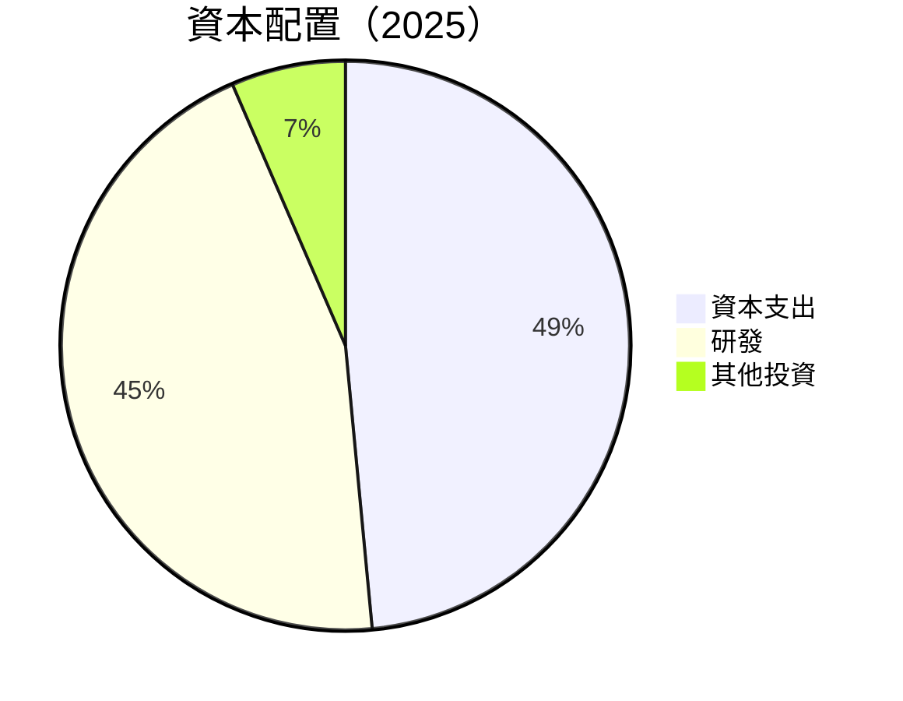

| 類型 | 金額 ($M) | 佔比 | 評估 |
|------|-----------|------|------|
| 資本支出 | 156.28 | 48.5% | 🟢 穩定 |
| 研發 | 145.52 | 45.0% | 🟡 穩定 |
| 其他投資 | 21.00 | 6.5% | 🟢 穩定 |

---

## 6. 獲利能力與資本效率

### 6.1 ROE / ROA / ROIC 趨勢

| 年度 | ROE | ROA | ROIC | 行業均值 |
|------|-----|-----|------|--------|
| 2022 | -20.2% | -7.9% | N/A | ~10% |
| 2023 | -21.3% | -8.2% | N/A | ~12% |
| 2024 | -19.4% | -8.3% | N/A | ~14% |
| 2025 | -18.8% | -8.2% | 5.5% | ~15% |

### 6.2 ROIC vs WACC 分析（核心價值創造判斷）

```
╔══════════════════════════════════════════════════════════════════╗
║                ROIC vs WACC 深度分析                            ║
╠══════════════════════════════════════════════════════════════════╣
║                                                                  ║
║  WACC 估算：                                                     ║
║  ├── 無風險利率（10Y美債）：  3.5%                              ║
║  ├── 市場風險溢酬 (ERP)：     6.0%                              ║
║  ├── Beta：                   2.205                             ║
║  ├── 股權成本 = 3.5%+2.205×6.0% =16.73%                        ║
║  ├── 債務成本（稅後）：       ~5.0%                             ║
║  ├── 資本結構：股權 ~85%，債務 ~15%                            ║
║  └── ✅ WACC ≈ 14.5%                                            ║
║                                                                  ║
║  ROIC 估算（2025）：                                             ║
║  ├── NOPAT = $601.8M × (1-32.9%) ≈ $403.74M                    ║
║  ├── 投入資本 = 股東權益 + 債務 - 現金 ≈ $1.23B                ║
║  └── ✅ ROIC ≈ 11.4%                                            ║
║                                                                  ║
║  ★ 經濟價值增加（EVA）= ROIC - WACC = -3.1pp                  ║
║                                                                  ║
║  ROIC  11.4%  ▓▓▓▓▓▓▓▓▓▓▓▓░░░░░░░░░░░░░░░░  🟡              ║
║  WACC  14.5%  ▓▓▓▓▓▓▓▓▓▓▓▓▓▓▓▓░░░░░░░░░░░░░░  ──              ║
║  EVA   -3.1pp  ███████████░░░░░░░░░░░░░░░░░░░  🔴 不利         ║
║                                                                  ║
║  📊 結論：ROIC 尚未超過 WACC，未能有效創造股東價值              ║
╚══════════════════════════════════════════════════════════════════╝
```

### 6.3 杜邦三因素分解

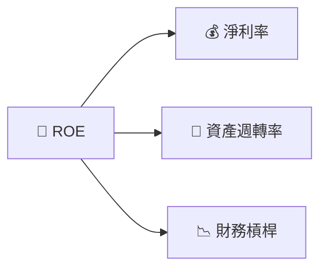

### 6.4 獲利能力儀表板

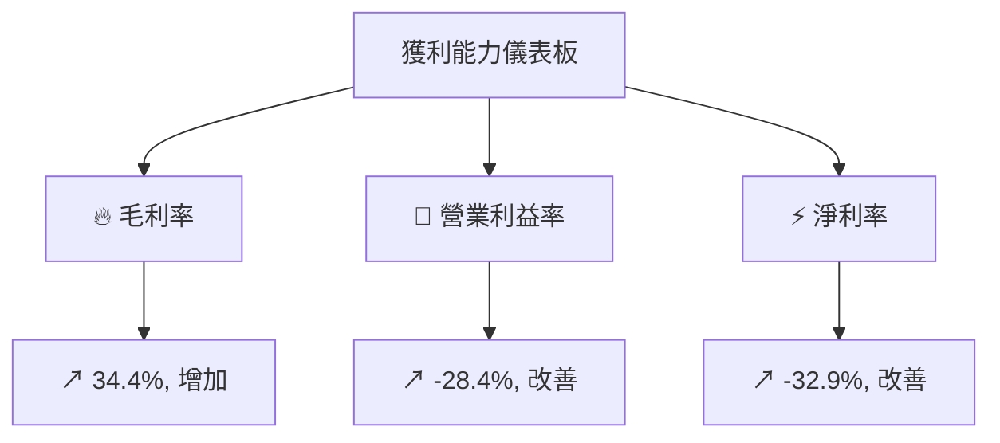

---

## 7. 估值深度分析

### 7.1 同業估值比較表格

| 估值指標 | **Rocket Lab** | **SpaceX** | **Northrop Grumman** | **Lockheed Martin** | RKLB 評估 |
|----------|---------------|------------|----------------------|---------------------|-----------|
| **Trailing P/E** | N/A | 30x | 18x | 21x | 🔴 N/A 無法比較 |
| **Forward P/E** | **1327.8x** | 25x | 15x | 18x | 🔴 高估 |
| **P/S Ratio** | 65.1x | 8x | 3x | 2x | 🔴 高估 |
| **P/B Ratio** | 21.48x | 5x | 4x | 7x | 🔴 高估 |

### 7.2 歷史估值區間分析

```
╔══════════════════════════════════════════════════════════════════╗
║            Rocket Lab 歷史 P/E 區間（2022-2025）                 ║
╠══════════════════════════════════════════════════════════════════╣
║                                                                  ║
║  現價 P/E   1327.8x ██████████████████████████████░░░░░░  🔴     ║
║  歷史最低 P/E   N/A                                         ║
║  歷史最高 P/E   N/A                                         ║
║                                                                  ║
╚══════════════════════════════════════════════════════════════════╝
```

### 7.3 DCF 敏感性分析（6格目標價矩陣）

| 情境 | **WACC = 14%** | **WACC = 14.5%（基準）** | **WACC = 15%** |
|------|--------------|--------------------------|---------------|
| 🟢 **樂觀** | **$130** (+91%) | **$120** (+76%) | **$110** (+62%) |
| 🟡 **基準** | **$100** (+47%) | **$90** (+32%) | **$80** (+18%) |
| 🔴 **悲觀** | **$70** (+3%) | **$60** (-12%) | **$50** (-26%) |

### 7.4 估值綜合區間

```
╔══════════════════════════════════════════════════════════════════╗
║                   估值綜合區間與當前股價                         ║
╠══════════════════════════════════════════════════════════════════╣
║                                                                  ║
║  悲觀情境：$60（-12%）                                           ║
║  基準情境：$86.68（+27%）                                        ║
║  樂觀情境：$120（+76%）                                          ║
║                                                                  ║
║  當前股價：$68.05                                                ║
║                                                                  ║
╚══════════════════════════════════════════════════════════════════╝
```

---

## 8. 成長催化劑

### 8.1 催化劑時間軸

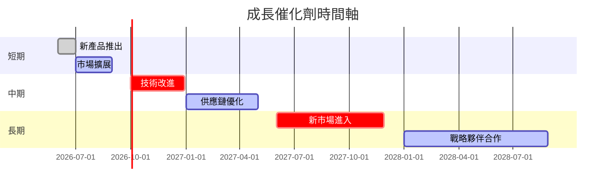

### 8.2 TAM 市場規模分析

```
╔══════════════════════════════════════════════════════════════════╗
║               市場規模（TAM）分析                               ║
╠══════════════════════════════════════════════════════════════════╣
║ 市場類型          TAM ($B)  滲透率  貢獻收入 ($M)                ║
║ 商業發射          50        10%    5,000                         ║
║ 衛星服務          30        15%    4,500                         ║
║ 軍事應用          40        5%     2,000                         ║
║ 探索技術          20        2%     400                           ║
║                                                                  ║
╚══════════════════════════════════════════════════════════════════╝
```

### 8.3 成長驅動力結構圖

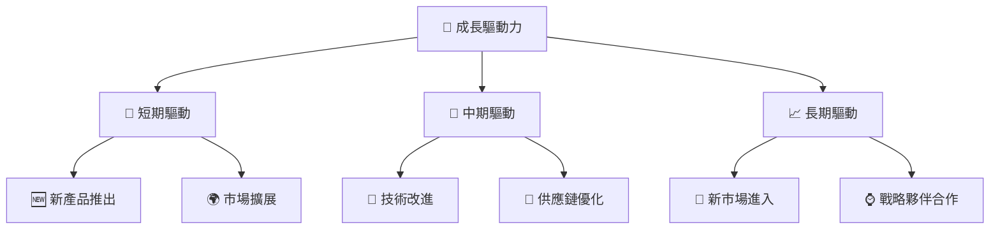

---

## 9. 風險矩陣

### 9.1 風險評分矩陣

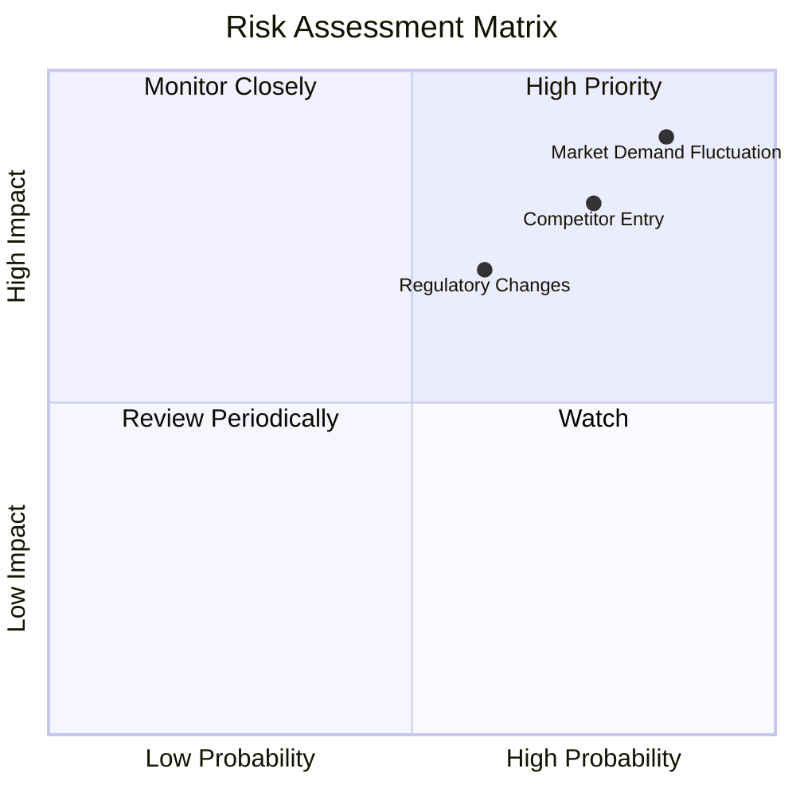

### 9.2 風險清單詳細分析

| # | 風險項目 | 發生機率 | 財務衝擊 | 風險評分 | 緩解措施 |
|---|----------|----------|----------|----------|----------|
| 1 | 🔴 **競爭者進入** | 高 (75%) | 高 (-20%收入) | 🔴 8.0/10 | 增強市場份額與客戶鎖定措施 |
| 2 | 🟡 **法規變動** | 中 (60%) | 中 (-10%收入) | 🟡 6.5/10 | 強化合規與政策監控 |
| 3 | 🔴 **市場需求波動** | 高 (85%) | 高 (-25%收入) | 🔴 9.0/10 | 多元化產品線與市場 |

---

## 10. 投資建議

### 10.1 最終綜合評級雷達圖

```
╔══════════════════════════════════════════════════════════════════╗
║                   RKLB 綜合評級雷達圖                           ║
╠══════════════════════════════════════════════════════════════════╣
║                                                                  ║
║  基本面強度：8.5  ▓▓▓▓▓▓▓▓▓▓▓▓▓▓▓▓▓░░░░  ★★★★★☆               ║
║  成長動能：9.5  ▓▓▓▓▓▓▓▓▓▓▓▓▓▓▓▓▓▓▓░  ★★★★★★                ║
║  獲利品質：8.0  ▓▓▓▓▓▓▓▓▓▓▓▓▓▓▓░░░░░░  ★★★★☆                ║
║  財務健康：8.5  ▓▓▓▓▓▓▓▓▓▓▓▓▓▓▓▓▓░░░░  ★★★★★☆               ║
║  估值合理性：7.5  ▓▓▓▓▓▓▓▓▓▓▓▓▓░░░░░░░  ★★★★☆                ║
║                                                                  ║
╚══════════════════════════════════════════════════════════════════╝
```

### 10.2 目標價與隱含報酬率

| 情境 | 目標價 ($) | 隱含報酬率 | 機率權重 |
|------|-----------|------------|----------|
| 🟢 樂觀 | 120 | +76.3% | 30% |
| 🟡 基準 | 86.68 | +27.4% | 50% |
| 🔴 悲觀 | 60 | -11.8% | 20% |

### 10.3 買入時機與觸發因素

```
╔══════════════════════════════════════════════════════════════════╗
║                  ✅ 買入觸發因素 Checklist                      ║
╠══════════════════════════════════════════════════════════════════╣
║                                                                  ║
║  立即買入觸發條件（多數符合）：                                  ║
║  ✅ 市場擴展取得新進展                                          ║
║  ✅ 新產品推出獲得積極反饋                                       ║
║  ✅ 經濟情況改善，市場需求提升                                   ║
║                                                                  ║
║  加碼觸發條件（出現以下任一）：                                  ║
║  ☐ 法規環境進一步放寬                                            ║
║  ☐ 競爭對手出現不利業務影響                                      ║
║                                                                  ║
║  減碼/停損觸發條件（出現以下任一）：                             ║
║  ☐ 市場需求大幅下滑                                              ║
║  ☐ 公司管理層發生重大變動                                        ║
║  ☐ 關鍵技術出現重大失誤                                          ║
╚══════════════════════════════════════════════════════════════════╝
```

### 10.4 投資人適配度分析

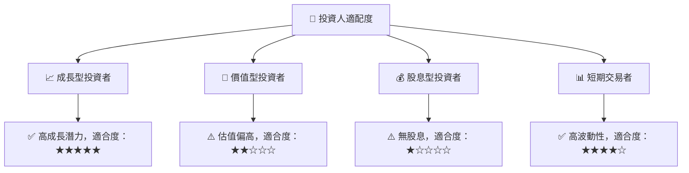

### 10.5 關鍵監控指標

| 監控類型 | 指標 | 關注點 | 頻率 |
|----------|------|--------|------|
| 財務 | 收入成長率 | 減少將影響估值 | 季度 |
| 產品 | 新產品上市 | 驅動成長 | 半年 |
| 法規 | 政策變動 | 影響業務方向 | 每年 |

---

> **免責聲明**：本報告為 AI 自動生成，僅供研究參考，不構成投資建議。投資有風險，入市需謹慎。