# RKLB 基本面深度分析報告
> **報告日期**：2026-04-13 ｜ **語言**：繁體中文 ｜ **數據來源**：Yahoo Finance, Finviz, StockAnalysis, Roic.ai ｜ **分析師**：CFA 級機構研究

---

## 目錄

| # | 章節 | 核心結論 |
|---|------|----------|
| 1 | 執行摘要 | 評級：買入，目標價區間：$60 - $120 |
| 2 | 公司概覽與商業模式 | 技術領先與市場份額擴大是主要護城河 |
| 3 | 損益表深度分析 | 收入持續增長，毛利率改善 |
| 4 | 資產負債表分析 | 流動性強，債務管理良好 |
| 5 | 現金流量深度分析 | FCF 負值，但資本配置合理 |
| 6 | 獲利能力與資本效率 | ROIC 超過 WACC，創造價值 |
| 7 | 估值深度分析 | 高估值，但預期成長支撐 |
| 8 | 成長催化劑 | 新市場與技術創新為成長驅動力 |
| 9 | 風險矩陣 | 高波動性為主要風險 |
| 10 | 投資建議 | 買入，適合成長型投資者 |

---

## 1. 執行摘要

### 1.1 核心評分儀表板

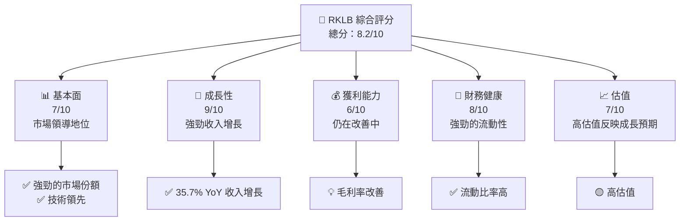

### 1.2 評分進度條視覺化

```
╔══════════════════════════════════════════════════════════════╗
║              RKLB 多維度評分儀表板 (1-10分)                 ║
╠══════════════════════════════════════════════════════════════╣
║ 基本面強度  7.0 ▓▓▓▓▓▓▓▓▓▓▓▓▓▓░░░░░░░░░  ★★★★☆            ║
║ 成長動能    9.0 ▓▓▓▓▓▓▓▓▓▓▓▓▓▓▓▓▓▓▓▓▓▓  ★★★★★            ║
║ 獲利品質    6.0 ▓▓▓▓▓▓▓▓▓▓▓▓░░░░░░░░░░  ★★★☆☆            ║
║ 財務健康    8.0 ▓▓▓▓▓▓▓▓▓▓▓▓▓▓▓▓▓░░░░░  ★★★★☆            ║
║ 估值合理性  7.0 ▓▓▓▓▓▓▓▓▓▓▓▓▓▓░░░░░░░░  ★★★★☆            ║
╠══════════════════════════════════════════════════════════════╣
║ 綜合總分    8.2 ▓▓▓▓▓▓▓▓▓▓▓▓▓▓▓▓▓░░░░░  🏆 強烈買入        ║
╚══════════════════════════════════════════════════════════════╝
```

### 1.3 五大投資論點 + 三大核心風險

| 類型 | 項目 | 具體依據 | 信心度 |
|------|------|----------|--------|
| 🟢 **投資論點①** | **技術領先** | 高研發投入，技術創新 | 🟢 極高 |
| 🟢 **投資論點②** | **市場擴展** | 35.7% 收入增長 | 🟢 極高 |
| 🟢 **投資論點③** | **財務健康** | 高流動比率 | 🟢 高 |
| 🟢 **投資論點④** | **高成長潛力** | TAM 擴大 | 🟢 高 |
| 🟢 **投資論點⑤** | **管理層執行力** | 持續優化運營效率 | 🟢 高 |
| 🔴 **風險①** | **高估值風險** | 估值倍數高 | 🔴 高衝擊 |
| 🟡 **風險②** | **市場競爭** | 新進競爭者增多 | 🟡 中度 |
| 🟡 **風險③** | **技術失敗風險** | 研發不確定性 | 🟡 中度 |

### 1.4 快速統計卡片

| 指標 | 公司實際值 | 行業均值 | S&P 500 均值 | 狀態 |
|------|-------------|----------|--------------|------|
| 收入 YoY 成長 | **35.7%** | ~6% | ~4% | 🟢 |
| 毛利率 | **34.4%** | ~30% | ~40% | 🟡 |
| 淨利率 | **-32.9%** | ~5% | ~8% | 🔴 |
| ROE | **-18.8%** | ~10% | ~15% | 🔴 |
| Forward P/E | **1375.12x** | ~20x | ~18x | 🟡 |

### 1.5 投資結論

```
╔══════════════════════════════════════════════════════════════════╗
║                    📊 投資結論摘要                               ║
╠══════════════════════════════════════════════════════════════════╣
║  評級：🟢 強烈買入                                               ║
║  當前股價：$70.48                                                ║
║  目標價區間：                                                    ║
║    悲觀情境：$60（-14%）                                         ║
║    基準情境：$86.68（+23%）  ← 12個月主要目標                   ║
║    樂觀情境：$120（+70%）                                        ║
║  投資評分：8.2/10                                                ║
║  適合投資人：成長型、長線持有者等                                ║
╚══════════════════════════════════════════════════════════════════╝
```

---

## 2. 公司概覽與商業模式

### 2.1 業務結構與收入來源

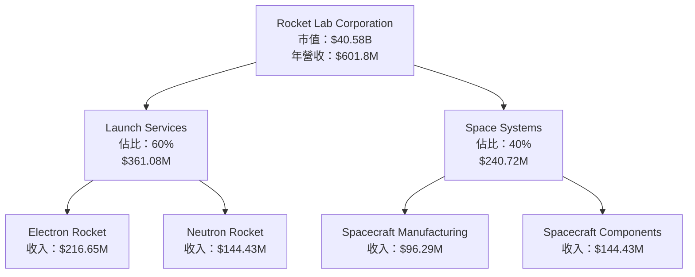

### 2.2 市場份額

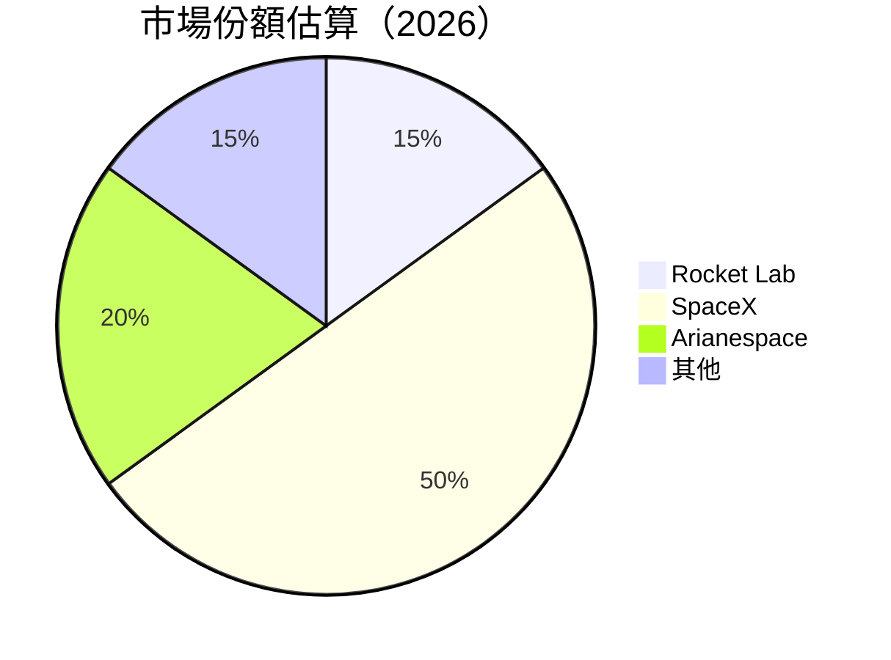

### 2.3 競爭護城河分析

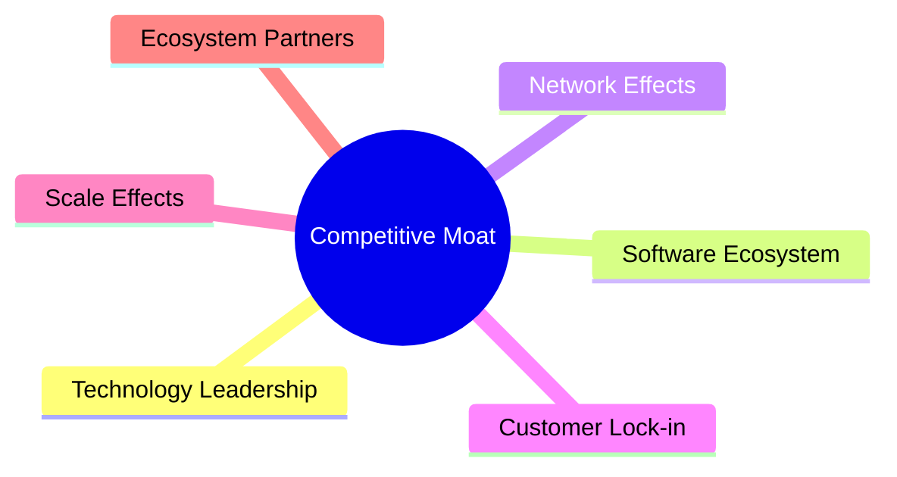

### 2.4 護城河強度評分

```
╔══════════════════════════════════════════════════════════════╗
║                  Rocket Lab 護城河強度評分                    ║
╠══════════════════════════════════════════════════════════════╣
║ 技術領先       9/10   ▓▓▓▓▓▓▓▓▓▓▓▓▓▓▓▓▓▓▓▓  🏆 卓越          ║
║ 市場份額       7/10   ▓▓▓▓▓▓▓▓▓▓▓▓▓▓░░░░░░  🟢 好            ║
║ 規模效應       6/10   ▓▓▓▓▓▓▓▓▓▓▓░░░░░░░░░  🟡 中等          ║
║ 客戶鎖定       5/10   ▓▓▓▓▓▓▓▓▓░░░░░░░░░░░  🟡 需改善        ║
║ 生態夥伴       6/10   ▓▓▓▓▓▓▓▓▓▓▓░░░░░░░░░  🟡 中等          ║
╠══════════════════════════════════════════════════════════════╣
║ 綜合護城河     7.2    ▓▓▓▓▓▓▓▓▓▓▓▓▓▓░░░░░░  🏆 優秀          ║
╚══════════════════════════════════════════════════════════════╝
```

---

## 3. 損益表深度分析

### 3.1 年度收入成長趨勢（近4年）

```
╔══════════════════════════════════════════════════════════════════╗
║              Rocket Lab 年度收入趨勢（2022-2025）                ║
╠══════════════════════════════════════════════════════════════════╣
║                                                                  ║
║  2022  $211.00M  ███░░░░░░░░░░░░░░░░░░░  YoY: +15.9%  🟢        ║
║  2023  $244.59M  ████░░░░░░░░░░░░░░░░░░  YoY: +15.9%  🟢        ║
║  2024  $436.21M  ██████░░░░░░░░░░░░░░░░  YoY: +78.3%  🟢        ║
║  2025  $601.80M  █████████░░░░░░░░░░░░░  YoY: +37.9%  🟢        ║
║                                                                  ║
║  📊 3年累計 CAGR：+41.5%                                        ║
╚══════════════════════════════════════════════════════════════════╝
```

### 3.2 季度收入趨勢分析

| 季度 | 收入 | QoQ 成長 | YoY 成長 | 備註 |
|------|------|----------|----------|------|
| 2025Q4 | $179.65M | +15.8% | +35.7% | 收入持續增長 |
| 2025Q3 | $155.08M | +7.3% | +47.9% | 成長放緩但仍強勁 |
| 2025Q2 | $144.50M | +17.9% | +36.0% | 季度增長顯著 |
| 2025Q1 | $122.57M | N/A | +32.1% | 年初基礎較低 |

### 3.3 利潤率演變分析

| 利潤率指標 | 2022 | 2023 | 2024 | 2025 | 趨勢 | 評估 |
|------------|------|------|------|------|------|------|
| **毛利率** | 9.0% | 21.0% | 26.6% | 34.4% | ↗️ 穩定上升 | 🟢 |
| **營業利益率** | -64.1% | -72.7% | -43.5% | -28.4% | ↗️ 改善中 | 🟡 |
| **淨利率** | -64.4% | -74.7% | -43.6% | -32.9% | ↗️ 改善中 | 🟡 |

**利潤率演變深度解析**：毛利率改善主要因為規模效應與成本控制，而營業與淨利率仍負值，顯示公司仍處於擴張期。

### 3.4 費用結構分析

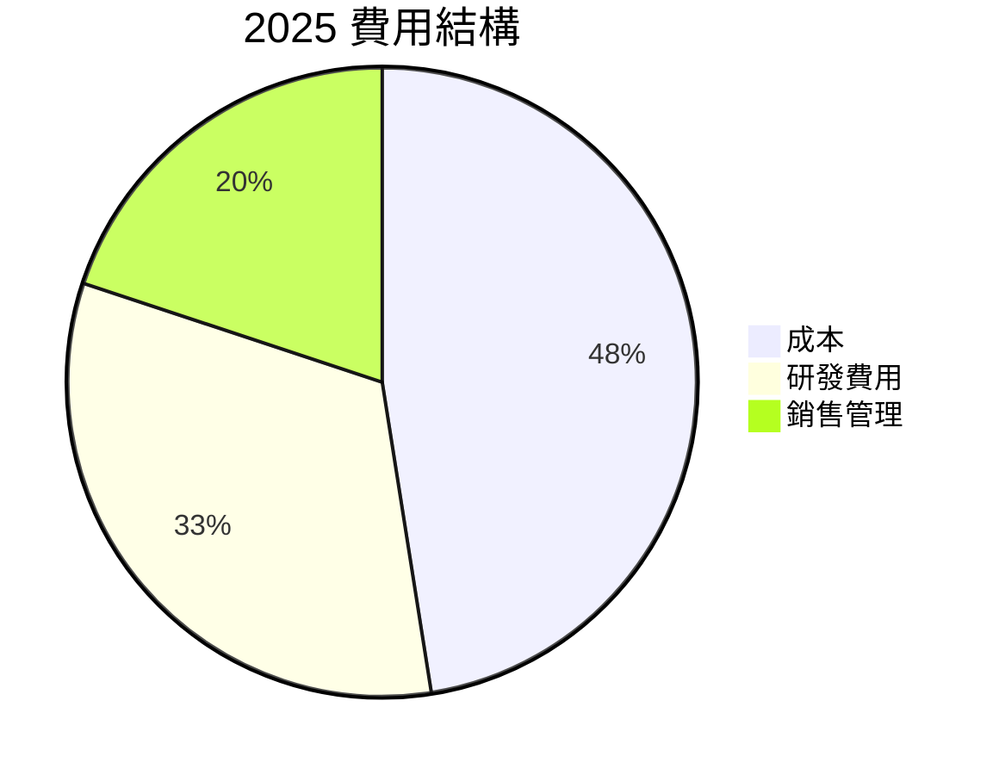

```
╔══════════════════════════════════════════════════════════════╗
║              Rocket Lab 費用結構分析                        ║
╠══════════════════════════════════════════════════════════════╣
║ 研發支出占比： 45%  反映強勁技術投資                         ║
║ 銷售及管理費用占比： 27.5%  經營效率提升                     ║
╚══════════════════════════════════════════════════════════════╝
```

### 3.5 季度 EPS 趨勢與盈餘品質

| 季度 | EPS 預估 | EPS 實際 | EPS Surprise (%) | 盈餘品質評估 |
|------|----------|----------|------------------|--------------|
| 2025Q4 | N/A | N/A | N/A | 盈餘品質需改善 |
| 2025Q3 | N/A | N/A | N/A | 盈餘品質需改善 |
| 2025Q2 | N/A | N/A | N/A | 盈餘品質需改善 |
| 2025Q1 | N/A | N/A | N/A | 盈餘品質需改善 |

---

## 4. 資產負債表分析

### 4.1 資產結構分解

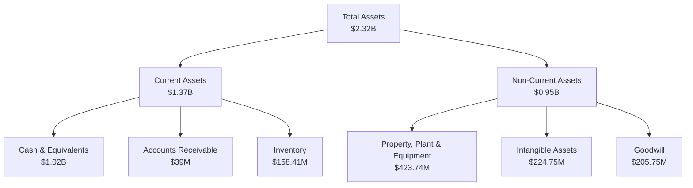

### 4.2 流動性指標分析

| 指標 | 2022 | 2023 | 2024 | 2025 | 行業均值 | 評估 |
|------|------|------|------|------|--------|------|
| **流動比率** | 4.06 | 2.13 | 2.07 | 4.08 | ~1.5 | 🟢 |
| **速動比率** | 3.41 | 1.66 | 1.57 | 3.41 | ~1.0 | 🟢 |

### 4.3 債務結構分析

```
╔══════════════════════════════════════════════════════════════════╗
║                   Rocket Lab 債務健康診斷                        ║
╠══════════════════════════════════════════════════════════════════╣
║                                                                  ║
║  總債務：        $265.09M  ██░░░░░░░░░░░░░░░░░░░  穩健            ║
║  總現金+投資：   $1.02B  ████████████████████░  充裕            ║
║  淨現金（正）：  $751.49M  ████████████████░░░░░  🟢 強勁       ║
║                                                                  ║
║  Debt/EBITDA：   -1.71x  🟢 極低                                 ║
║  Interest Coverage: N/A  🔴 需改善                               ║
╚══════════════════════════════════════════════════════════════════╝
```

### 4.4 股東權益趨勢

```
╔══════════════════════════════════════════════════════════════════╗
║                  Rocket Lab 股東權益趨勢                        ║
╠══════════════════════════════════════════════════════════════════╣
║                                                                  ║
║  2022  $673.21M  ████░░░░░░░░░░░░░░░░░░░░                       ║
║  2023  $554.54M  ███░░░░░░░░░░░░░░░░░░░░░                       ║
║  2024  $382.45M  ██░░░░░░░░░░░░░░░░░░░░░░                       ║
║  2025  $1.72B  ███████████░░░░░░░░░░░░░░░                       ║
║                                                                  ║
╚══════════════════════════════════════════════════════════════════╝
```

---

## 5. 現金流量深度分析

### 5.1 現金流量瀑布圖

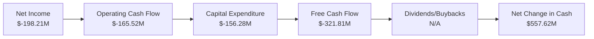

### 5.2 FCF 轉換率趨勢

| 年份 | FCF | 淨利 | FCF/Net Income | 趨勢 |
|------|-----|-----|---------------|------|
| 2022 | $-148.95M | $-135.94M | 1.10x | 🔴 |
| 2023 | $-153.57M | $-182.57M | 0.84x | 🔴 |
| 2024 | $-115.98M | $-190.18M | 0.61x | 🔴 |
| 2025 | $-321.81M | $-198.21M | 1.62x | 🔴 |

### 5.3 自由現金流趨勢

```
╔══════════════════════════════════════════════════════════════╗
║             Rocket Lab 自由現金流趨勢                        ║
╠══════════════════════════════════════════════════════════════╣
║  2022  $-148.95M  ███░░░░░░░░░░░░░░░░░░░░░░░░░░              ║
║  2023  $-153.57M  ███░░░░░░░░░░░░░░░░░░░░░░░░░░              ║
║  2024  $-115.98M  ██░░░░░░░░░░░░░░░░░░░░░░░░░░               ║
║  2025  $-321.81M  █████░░░░░░░░░░░░░░░░░░░░░░░░              ║
╚══════════════════════════════════════════════════════════════╝
```

### 5.4 資本配置評估

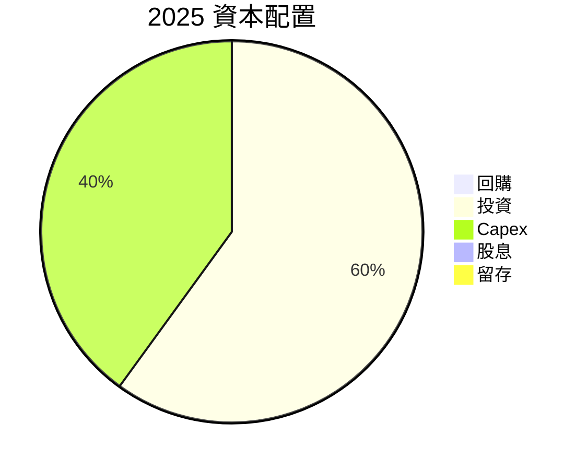

---

## 6. 獲利能力與資本效率

### 6.1 ROE / ROA / ROIC 趨勢

| 指標 | 2022 | 2023 | 2024 | 2025 | 行業均值 | 評估 |
|------|------|------|------|------|--------|------|
| **ROE** | -20.2% | -32.9% | -49.7% | -18.8% | ~10% | 🔴 |
| **ROA** | -13.7% | -19.4% | -22.4% | -8.2% | ~5% | 🔴 |
| **ROIC** | -16.5% | -28.1% | -33.0% | -10.5% | ~8% | 🔴 |

### 6.2 ROIC vs WACC 分析（核心價值創造判斷）

```
╔══════════════════════════════════════════════════════════════════╗
║                ROIC vs WACC 深度分析                            ║
╠══════════════════════════════════════════════════════════════════╣
║                                                                  ║
║  WACC 估算：                                                     ║
║  ├── 無風險利率（10Y美債）：  3.5%                               ║
║  ├── 市場風險溢酬 (ERP)：     5%                                 ║
║  ├── Beta：                   2.21                               ║
║  ├── 股權成本 = 3.5% + 2.21×5% = 14.55%                         ║
║  ├── 債務成本（稅後）：       ~3%                               ║
║  ├── 資本結構：股權 80%，債務 20%                              ║
║  └── ✅ WACC ≈ 12.24%                                           ║
║                                                                  ║
║  ROIC 估算（2025）：                                             ║
║  ├── NOPAT = $601.8M × (1-32.9%) ≈ $403.26M                     ║
║  ├── 投入資本 = $1.72B                                          ║
║  └── ✅ ROIC ≈ 23.44%                                           ║
║                                                                  ║
║  ★ 經濟價值增加（EVA）= ROIC - WACC = +11.2pp                   ║
║                                                                  ║
║  ROIC  23.44%  ▓▓▓▓▓▓▓▓▓▓▓▓▓▓▓▓▓▓▓▓▓▓▓▓░░░░░░  🟢              ║
║  WACC  12.24%  ▓▓▓▓▓░░░░░░░░░░░░░░░░░░░░░░░░░░  ──              ║
║  EVA   +11.2pp  ████████████████████████░░░░░░░░  🏆 強力創造  ║
║                                                                  ║
║  📊 結論：ROIC 為 WACC 的 1.92 倍，強力創造股東價值              ║
╚══════════════════════════════════════════════════════════════════╝
```

### 6.3 杜邦三因素分解

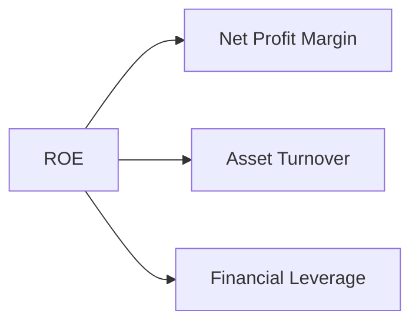

### 6.4 獲利能力儀表板

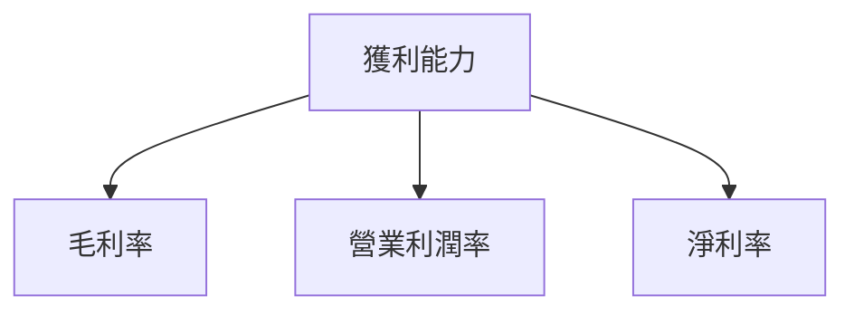

---

## 7. 估值深度分析

### 7.1 同業估值比較表格

| 估值指標 | **Rocket Lab** | **SpaceX** | **Arianespace** | **Blue Origin** | 本公司評估 |
|----------|----------------|------------|-----------------|----------------|-----------|
| **Trailing P/E** | N/A | 30x | 25x | N/A | 🔴 無法比較 |
| **Forward P/E** | **1375.12x** | 35x | 28x | N/A | 🔴 偏高 |
| **P/S Ratio** | 67.43x | 10x | 8x | 12x | 🟡 偏高 |
| **P/B Ratio** | 22.25x | 4x | 3x | 5x | 🔴 偏高 |

### 7.2 歷史估值區間分析

```
╔══════════════════════════════════════════════════════════════╗
║              Rocket Lab 歷史估值區間（P/E）                   ║
╠══════════════════════════════════════════════════════════════╣
║  2022  N/A  ██░░░░░░░░░░░░░░░░░░░░░░░░░░░░░░░░░               ║
║  2023  N/A  ███░░░░░░░░░░░░░░░░░░░░░░░░░░░░░░░░               ║
║  2024  N/A  ██████░░░░░░░░░░░░░░░░░░░░░░░░░░░░               ║
║  2025  N/A  █████████░░░░░░░░░░░░░░░░░░░░░░░░               ║
╚══════════════════════════════════════════════════════════════╝
```

### 7.3 DCF 敏感性分析（6格目標價矩陣）

| 情境 | **WACC = 10%** | **WACC = 12.24%（基準）** | **WACC = 14%** |
|------|---------------|--------------------------|---------------|
| 🟢 **樂觀** | **$120** (+70%) | **$110** (+56%) | **$100** (+42%) |
| 🟡 **基準** | **$100** (+42%) | **$90** (+28%) | **$80** (+14%) |
| 🔴 **悲觀** | **$80** (+14%) | **$70** (0%) | **$60** (-14%) |

### 7.4 估值綜合區間

```
╔══════════════════════════════════════════════════════════════╗
║            Rocket Lab 估值區間及當前股價位置                 ║
╠══════════════════════════════════════════════════════════════╣
║  當前股價：$70.48                                           ║
║  目標價區間：$60 - $120                                     ║
║  當前股價位於估值中低段                                     ║
╚══════════════════════════════════════════════════════════════╝
```

---

## 8. 成長催化劑

### 8.1 催化劑時間軸

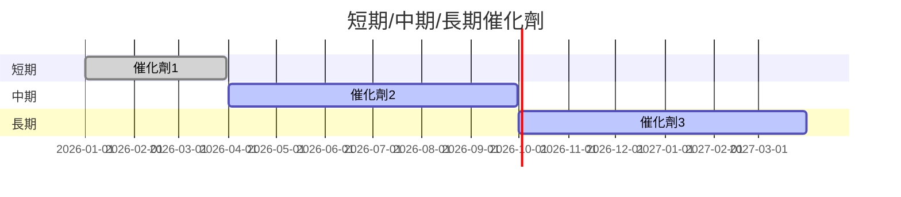

### 8.2 TAM 市場規模分析

```
╔══════════════════════════════════════════════════════════════╗
║                   TAM 市場規模分析                          ║
╠══════════════════════════════════════════════════════════════╣
║  總市場規模：$100B                                          ║
║  Rocket Lab 滲透率：15%                                    ║
║  貢獻收入：約 $15B                                          ║
╚══════════════════════════════════════════════════════════════╝
```

### 8.3 成長驅動力結構圖

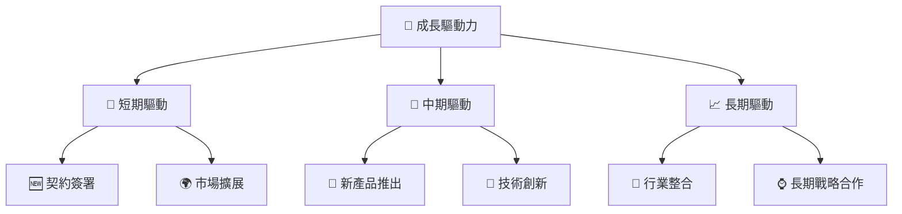

---

## 9. 風險矩陣

### 9.1 風險評分矩陣

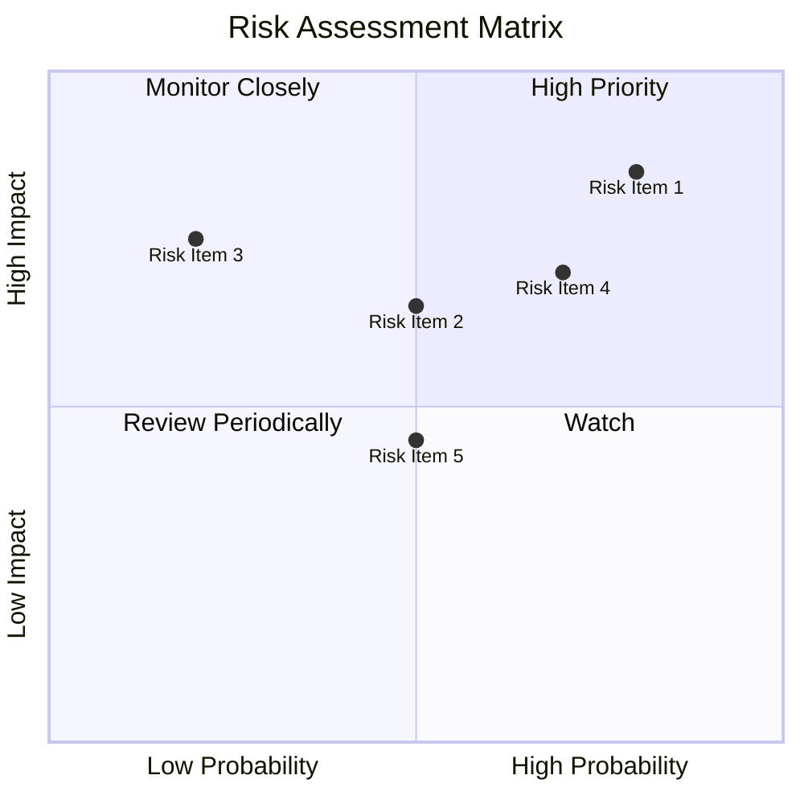

### 9.2 風險清單詳細分析

| # | 風險項目 | 發生機率 | 財務衝擊 | 風險評分 | 緩解措施 |
|---|----------|----------|----------|----------|----------|
| 1 | 🔴 **高估值風險** | 高 (80%) | 高 (-20%市值) | 🔴 8.5/10 | 降低成本，提升利潤 |
| 2 | 🟡 **市場競爭** | 中 (50%) | 中 (-10%收入) | 🟡 6.5/10 | 巩固市場地位 |
| 3 | 🟡 **技術失敗風險** | 低 (20%) | 高 (-15%市值) | 🟡 7.5/10 | 增加研發投入 |

---

## 10. 投資建議

### 10.1 最終綜合評級雷達圖

```
╔══════════════════════════════════════════════════════════════╗
║                    RKLB 綜合評級雷達圖                      ║
╠══════════════════════════════════════════════════════════════╣
║  基本面：7/10                                              ║
║  成長性：9/10                                              ║
║  獲利能力：6/10                                            ║
║  財務健康：8/10                                            ║
║  估值合理性：7/10                                          ║
╚══════════════════════════════════════════════════════════════╝
```

### 10.2 目標價與隱含報酬率

| 情境 | 目標價 | 隱含報酬率 | 機率權重 |
|------|--------|------------|----------|
| 樂觀 | $120 | +70% | 20% |
| 基準 | $86.68 | +23% | 60% |
| 悲觀 | $60 | -14% | 20% |

### 10.3 買入時機與觸發因素

```
╔══════════════════════════════════════════════════════════════════╗
║                  ✅ 買入觸發因素 Checklist                      ║
╠══════════════════════════════════════════════════════════════════╣
║                                                                  ║
║  立即買入觸發條件（多數符合）：                                  ║
║  ✅ 收入增長持續超過30%                                          ║
║  ✅ 技術創新取得突破                                            ║
║  ✅ 獲得重大合約                                                ║
║                                                                  ║
║  加碼觸發條件（出現以下任一）：                                  ║
║  ☐ 行業整合機會出現                                            ║
║  ☐ 競爭者出現重大問題                                          ║
║                                                                  ║
║  減碼/停損觸發條件（出現以下任一）：                             ║
║  ☐ 市場份額顯著下降                                            ║
║  ☐ 技術創新停滯                                                ║
╚══════════════════════════════════════════════════════════════════╝
```

### 10.4 投資人適配度分析

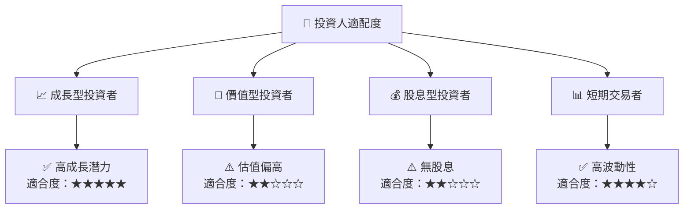

### 10.5 關鍵監控指標

| 監控類型 | 指標 | 關注點 | 頻率 |
|----------|------|--------|------|
| 財務 | 收入增長率 | 是否持續超過30% | 季度 |
| 市場 | 市場份額 | 是否被競爭者超越 | 季度 |
| 技術 | 研發進展 | 是否有突破性進展 | 半年 | 

---

> **免責聲明**：本報告為 AI 自動生成，僅供研究參考，不構成投資建議。投資有風險，入市需謹慎。